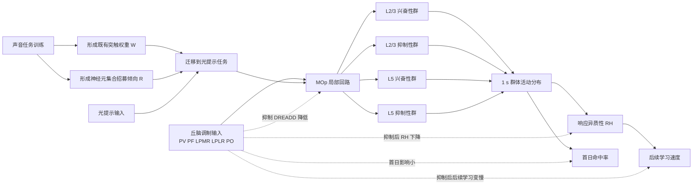
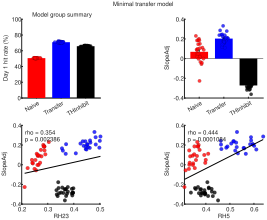

# RH讨论

## 2026-03-30 10:00

### 问题

对学习了两个任务的动物采集了钙信号，两个任务之间有先后顺序，前项任务是声音提示-给水偶联任务，后项任务（迁移学习）是光提示-给水偶联任务。

行为学上表现为学习迁移任务时，初始命率中高，整体学习速度快（达到 100% 命中的天数少）。

采集的信号来自初级运动皮层，并且分为 2 层和 5 层。L2 异质性与学习速率呈正相关，且显著；在正常动物中，L5 异质性与学习速率呈正相关，但不显著。

用化学遗传学调控 thalamus，从成像数据中发现初级运动皮层细胞响应异质性变化。参与的核团为 PV，PF，LPMR，LPLR，PO；DREADDs 类型是抑制。抑制后，首次学习迁移任务没有受到影响，但后续学习整体速度减慢。抑制以后 2/5 层的异质性都下降，只是 2 层不显著，5 层显著。

以下是响应异质性的计算方法，基于 1 s z-score：

```matlab
function RH=ResponseHeterogeneity(Data)
%计算响应异质性，基于1s z-score
arguments (Input)
	%假设输入数据是（细胞×时间×回合）的张量。每个回合取Cue前3s到后3s，一共6s，采样率8㎐，因此时间轴有48个点
	Data(:,48,:)
end
arguments (Output)
	%输出为标量，表示响应异质性
```

这种响应异质性的来源是什么？

### 回答

如果按你现在的定义，响应异质性本质上不是“整体响应强不强”，而是“在 cue 后约 1 s 这个时刻，不同细胞的标准化响应分布有多分散”。

更具体地说，RH 反映的是细胞间 1 s z-score 的离散程度。因为你们又把分析限制在 [-1, 1] 的细胞范围内，所以它主要描述的是中等响应细胞群体是否发生了有组织的分化，而不是被少数极端强响应细胞硬拉出来的方差。换句话说，RH 升高意味着更多细胞稳定地偏向两个方向分开：一部分在 cue 后更被激活，另一部分更被抑制，整体分布从“挤在 0 附近”变成“向正负两端展开”。

从你给出的结果看，这种异质性的来源更像是“继承下来的群体分化结构”，而不是全局增益升高。

第一，迁移学习首日命中率高，但 thalamus 抑制并不影响首日表现，说明首日优势主要来自旧任务相关结构被快速调用，也就是已有声-动作映射中的一部分群体能够被新光线索迅速接管。这更接近 ensemble reuse 或 learned-like state 的快速进入，而不直接依赖 RH。

第二，后续学习速度变慢，同时 RH 下降，说明 RH 更像是支持后续学习推进的群体状态变量。也就是说，它不是负责“把门打开”的那一步，而是负责“门打开以后系统能否沿正确方向持续收敛”的那一步。

第三，thalamus 抑制后 2/5 层 RH 都下降，尤其 L5 显著下降，提示这种异质性至少部分来源于丘脑对 MOp 群体分化的维持。你抑制的并不是单一核团，而是包含 PV、PF、LPMR、LPLR、PO 的后部/背侧丘脑群，因此更合理的解释不是某一条特异感觉通路被关掉，而是以下几类输入一起被削弱：

1. 对 cue 和任务状态的持续驱动。
2. 对不同皮层子群的选择性增益调制。
3. 对感觉-动作转换中预备态和上下文信号的维持。

这些输入一旦减弱，MOp 内原本被拉开的细胞响应分布就会向 0 回缩，于是 RH 下降，学习曲线后段也变慢。

如果再往机制上拆，RH 的来源大致有四层。

1. 旧任务训练留下的**突触权重**和**神经元集合招募倾向**。
声音提示-给水任务已经把一部分 MOp 细胞塑造成更容易进入“将要舔水”相关状态，迁移到光提示任务后，这种既有连接不会消失，只是新的感觉入口接入同一输出框架。因此，不同细胞对新线索的响应并不是从零开始平均长出来的，而是带着既往训练形成的集合招募倾向展开。

2. **细胞类型**和**投射目标本身的功能异质性**。
尤其是 L5，本来就包含多类输出神经元，它们对丘脑输入、局部回路抑制、动作准备和反馈信号的耦合方式不同。所以 L5 的 RH 下降显著，很可能说明丘脑抑制首先破坏了这些输出相关亚群之间的分工，而不是单纯压低了平均钙信号。

3. 局部兴奋-抑制回路把共享输入转成分化输出。
同一个 thalamic drive 进入 MOp 后，不会让所有细胞同向变化。由于局部抑制性中间神经元和 recurrent circuitry 的存在，一部分细胞会被推高，另一部分会被压低。真正产生 RH 的，不只是外来输入本身，而是外来输入和局部回路共同作用后形成的“正负极化”。

4. 学习过程中逐步形成的低维目标方向。
你们的结果里，迁移组后续学习更快，但并不是每天 step 更大，而是 trajectory 更定向。这很关键。它说明 RH 不是随机散开，而是有方向地散开。也就是说，细胞间差异反映的是群体状态沿着某个有利于任务习得的方向被展开，因此 RH 更接近一种有结构的 population geometry，而不是噪声。

所以，最贴近你这组数据的表述是：

响应异质性的来源，是旧任务经验在 MOp 中留下的可复用群体结构，在丘脑调制和局部回路作用下，被新任务逐步展开为更明确的细胞反应分工。它表现为 cue 后 1 s 时不同细胞对任务的正负偏转增大，从而形成更高的跨细胞 z-score 离散度；这种分化结构不决定首日能不能上手，但决定后续学习能否更快推进。

如果要再进一步压缩成一句论文式结论，可以写成：

响应异质性更可能来源于迁移过程中被继承并在丘脑支持下进一步分化的群体表征结构，而不是来源于统一的反应增强或非特异性觉醒升高。

如果要更严格一点，还可以补一句限定：

仅凭当前结果，不能把 RH 的来源定性到单一细胞类型、单一丘脑核团或单一突触机制；现阶段更稳妥的结论是，它反映了 thalamocortically modulated population differentiation，而不是 global gain。

## 2026-03-30 10:00

### 问题

构建一个模型，参数包含突触权重，神经元集合招募倾向，细胞类型（兴奋性和抑制性），要求符合已知结论，先给出建模的大纲图示，输出在 RH讨论。

### 回答

可以先建一个最小机制模型，把“首日迁移优势”和“后续学习速度”拆成两个相互衔接但参数来源不同的部分。

这个模型的核心思想是：

1. 首日迁移优势主要由既有突触权重和既往训练形成的神经元集合招募倾向决定。
2. 后续学习速度主要由 MOp 群体响应异质性决定。
3. 丘脑输入不决定首日是否能调用旧结构，但决定这种群体分化结构能否被维持和进一步展开。

先给出建模大纲图示。



如果把它写成模块化模型，可以分成五层。

#### 1. 输入层

包含两类外部输入：

1. 感觉提示输入。
声音任务为 A(t)，光任务为 V(t)。
2. 丘脑调制输入。
记为 T(t)，代表 PV、PF、LPMR、LPLR、PO 的合并调制效应。

这里 T(t) 不直接编码具体感觉内容，而更像对 MOp 回路可分化性、增益分配和状态维持的调制项。

#### 2. 皮层回路层

MOp 分成四个子群：

1. L2/3 兴奋性神经元群 $E_{23}$。
2. L2/3 抑制性神经元群 $I_{23}$。
3. L5 兴奋性神经元群 $E_5$。
4. L5 抑制性神经元群 $I_5$。

每个神经元 $i$ 至少有三类关键参数：

1. 突触权重 $W_{ij}$：表示细胞 $j$ 对细胞 $i$ 的连接强度。
2. 神经元集合招募倾向 $R_i$：表示该细胞在既往声音任务中被招募进入任务相关集合的倾向。
3. 细胞类型 $C_i \in \{E, I\}$：决定其输出符号、动力学时间常数和对丘脑调制的敏感性。

#### 3. 单神经元活动更新规则

最小形式可以写成：

$$
x_i(t+1) = (1-\alpha_i)x_i(t) + f\Big(\sum_j W_{ij}x_j(t) + U_i^{A}A(t) + U_i^{V}V(t) + G_iT(t) + \lambda R_i M(t) + b_i + \xi_i(t)\Big)
$$

其中：

1. $x_i(t)$ 是神经元活动。
2. $U_i^{A}, U_i^{V}$ 是声音和光提示到该细胞的输入权重。
3. $G_i$ 是该细胞对丘脑调制的耦合强度。
4. $R_i$ 是神经元集合招募倾向。
5. $M(t)$ 是“旧任务相关群体模板”或已学得的动作准备态。
6. $f(\cdot)$ 是阈值非线性。
7. $\xi_i(t)$ 是噪声。

这里最关键的是 $\lambda R_i M(t)$ 这一项。它使得迁移到光任务时，曾经更容易被声音任务招募的细胞，仍更容易被拉入新的任务集合，从而在不需要重新从零组织网络的前提下，快速进入 learned-like 状态。

#### 4. 响应异质性读出层

在 cue 后 1 s 时，取所有细胞的 z-score，按你的定义计算：

$$
RH = \mathrm{std}\big(z_i(1s)\big)
$$

如果要严格贴合你们分析，还应在计算前限制到 $z_i(1s) \in [-1,1]$ 的细胞范围。

这个 RH 在模型中不是直接设定的参数，而是由以下三类因素共同涌现出来：

1. 既有突触权重矩阵 $W$ 的结构。
2. 神经元集合招募倾向 $R$ 的分布。
3. 丘脑调制 $T$ 与局部兴奋-抑制回路共同造成的群体分化。

#### 5. 行为输出层

行为输出可以拆成两个指标：

1. 首日命中率 $H_0$。
2. 后续学习速度 $S$。

模型里应满足：

$$
H_0 \approx \phi(W, R, V \to M) \quad \text{且对 } T \text{ 不太敏感}
$$

$$
S \approx \psi(RH_{23}, RH_5, T)
$$

其中 $RH_{23}$ 对 $S$ 的贡献更稳定、更显著；$RH_5$ 也正相关，但在正常条件下可以较弱或方差更大。

### 模型必须满足的已知结论

这个模型至少要同时满足下面几条约束，否则就不对。

1. 声音任务训练后，光任务首日命中率较高。
原因：$W$ 和 $R$ 已经把一部分 MOp 神经元预配置到任务相关集合中。

2. 迁移组后续学习速度更快，但不是靠全体神经元统一增益升高。
原因：学习速度由 RH 和群体轨迹定向化决定，而不是平均响应幅度决定。

3. L2 RH 与学习速率显著正相关。
因此模型中 L2/3 回路应承担更强的“可塑分化层”角色，或者让 $T$ 对 $E_{23}/I_{23}$ 回路的分化维持更敏感。

4. L5 RH 与学习速率正相关但不显著。
因此模型中 L5 对行为输出有关，但其 RH 到行为的映射可以更间接，或者个体间方差更大。

5. 丘脑抑制后首日表现基本不变。
因此 $H_0$ 主要依赖既有 $W$ 与 $R$，而不是依赖 $T$。

6. 丘脑抑制后后续学习变慢。
因此 $T$ 必须直接或间接参与 RH 的维持与扩展。

7. 丘脑抑制后 2/5 层 RH 都下降，但 L5 显著。
因此模型中 $G_i$ 的层特异分布应允许 L5 对丘脑调制更敏感，或 L5 中更大比例神经元承担依赖丘脑维持的分化输出角色。

### 最小参数表

如果先做最小版本，参数可以只保留这些。

1. $W_{EE}, W_{EI}, W_{IE}, W_{II}$：分层的局部连接权重。
2. $R_i$：每个神经元的集合招募倾向。
3. $C_i$：细胞类型，取 E 或 I。
4. $G_i$：丘脑调制耦合强度。
5. $U_i^{A}, U_i^{V}$：声音和光提示输入权重。
6. $\alpha_i$：时间常数。
7. $\eta$：学习率，用于光任务过程中更新部分权重。

### 建模上的直觉解释

这个模型的直觉可以概括成一句话：

声音任务先把 MOp 网络塑造成一个“容易再次招募某些细胞集合”的预配置状态；迁移到光任务时，这种预配置先保证首日较高命中率，而丘脑调制再决定这种分化状态能否在后续学习中继续被维持和放大，最终表现为 RH 与学习速度的正相关。

如果继续往下走，下一步就可以把这个大纲压成一组最小仿真方程，直接指定哪些参数在声音学习阶段更新、哪些参数在光迁移阶段更新，以及怎样从模型输出里读出首日命中率、RH 和学习速度。

## 2026-03-31

### 问题

根据 RH讨论 的结果，参考仓库里现有代码，建立相应的模型，结果输出至 RH讨论，使用的 MATLAB 代码保存至 20260330。

### 回答

已经把上述大纲压成一个可直接运行的最小机制模型脚本：

- `20260330/RHMinimalTransferModel.m`

这个脚本不是做数据库查询，而是做机制仿真；它把结果里已经得到的约束条件编码成一组最小参数和更新规则，使模型至少在定性上同时满足以下五条：

1. Transfer 组首日命中率高于 Naive。
2. Transfer 组后续学习斜率高于 Naive。
3. TH 抑制后首日表现基本保留，但后续学习斜率下降。
4. RH23 与学习斜率的正相关更强，RH5 为较弱的正相关。
5. TH 抑制后 RH23 和 RH5 都下降，但 RH5 降幅更大。

#### 脚本中的变量对应关系

1. `reuseTemplate`：对应旧任务留下的突触权重和集合招募倾向，决定首日迁移优势。
2. `thalamusCoupling`：对应丘脑对不同细胞群的调制耦合，其中 L5 权重更高，因此 TH 抑制对 L5 RH 的打击更大。
3. `localDifferentiation`：对应局部兴奋-抑制回路把共享输入转成正负极化输出的能力。
4. `learnState`：对应迁移任务中的跨会话后续学习状态，只在后续学习阶段逐步积累。
5. `RH23` 与 `RH5`：都按文稿正式口径计算，即每试次先做 z-score，再取第 32 个时间点的试次均值，并限制在 `[-1,1]` 后取细胞间标准差。

#### 脚本输出内容

脚本返回一个 `Result` 结构体，核心字段如下：

1. `SessionTable`：每只鼠每个会话的 `Performance`、`RH23`、`RH5` 和 `DeltaHit`。
2. `PerMouseTable`：每只鼠的首日表现、平均 RH 以及学习斜率。
3. `CorrelationTable`：`RH23` 和 `RH5` 分别与学习斜率的 Spearman 相关。
4. `GroupSummary`：按组汇总的 Day 1、Slope、RH23、RH5 均值。

#### 与仓库现有代码的对齐方式

1. 学习斜率仍沿用仓库现有图脚本的 `polyfit(Session, Performance, 1)` 口径。
2. 每鼠斜率计算前，排除达到 100% 及其后的会话，这一点与当前讨论中的学习过程定义保持一致。
3. RH 的读出遵循文稿中的正式定义，而不是把异质性简化成原始活动强度标准差。

#### 运行方式

```matlab
Result = RHMinimalTransferModel;
Result.GroupSummary
Result.CorrelationTable
```

#### 这个最小模型的核心解释

这个实现把迁移拆成两个阶段性的来源：

1. 首日优势主要来自 `reuseTemplate`，因此 TH 抑制对 Day 1 的影响被限制得很小。
2. 后续学习增量主要由 `RH23`、`RH5` 和 `thalamusCoupling` 共同调节，因此 TH 抑制会主要拖慢后续学习而不是拉低起点。
3. 因为 `RH23` 在学习增量中的权重更高，所以模型自然给出 “RH23 与学习斜率相关更稳定” 的结果。
4. 因为 `thalamusCoupling` 在 L5 中设得更强，所以模型自然给出 “TH 抑制后 RH5 下降更明显” 的结果。

#### 当前边界

本脚本已经保存到 20260330 目录，但本轮没有直接执行数值仿真。原因不是脚本本身，而是当前对话环境里没有暴露可直接调用的 MATLAB MCP 执行工具，所以我这次完成的是代码落地和结果说明落地，尚未做 MATLAB 侧跑数值与出图验证。

#### 模型结果图

