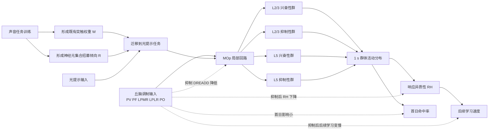

# RH讨论

## 2026-03-30 10:00

### 问题

对学习了两个任务的动物采集了钙信号，两个任务之间有先后顺序，前项任务是声音提示-给水偶联任务，后项任务（迁移学习）是光提示-给水偶联任务。

行为学上表现为学习迁移任务时，初始命率中高，整体学习速度快（达到 100% 命中的天数少）。

采集的信号来自初级运动皮层，并且分为 2 层和 5 层。L2 异质性与学习速率呈正相关，且显著；在正常动物中，L5 异质性与学习速率呈正相关，但不显著。

用化学遗传学调控 thalamus，从成像数据中发现初级运动皮层细胞响应异质性变化。参与的核团为 PV，PF，LPMR，LPLR，PO；DREADDs 类型是抑制。抑制后，首次学习迁移任务没有受到影响，但后续学习整体速度减慢。抑制以后 2/5 层的异质性都下降，只是 2 层不显著，5 层显著。

以下是响应异质性的计算方法，基于 1 s z-score：

```matlab
function RH=ResponseHeterogeneity(Data)
%计算响应异质性，基于1s z-score
arguments (Input)
	%假设输入数据是（细胞×时间×回合）的张量。每个回合取Cue前3s到后3s，一共6s，采样率8㎐，因此时间轴有48个点
	Data(:,48,:)
end
arguments (Output)
	%输出为标量，表示响应异质性
```

这种响应异质性的来源是什么？

### 回答

如果按你现在的定义，响应异质性本质上不是“整体响应强不强”，而是“在 cue 后约 1 s 这个时刻，不同细胞的标准化响应分布有多分散”。

更具体地说，RH 反映的是细胞间 1 s z-score 的离散程度。因为你们又把分析限制在 [-1, 1] 的细胞范围内，所以它主要描述的是中等响应细胞群体是否发生了有组织的分化，而不是被少数极端强响应细胞硬拉出来的方差。换句话说，RH 升高意味着更多细胞稳定地偏向两个方向分开：一部分在 cue 后更被激活，另一部分更被抑制，整体分布从“挤在 0 附近”变成“向正负两端展开”。

从你给出的结果看，这种异质性的来源更像是“继承下来的群体分化结构”，而不是全局增益升高。

第一，迁移学习首日命中率高，但 thalamus 抑制并不影响首日表现，说明首日优势主要来自旧任务相关结构被快速调用，也就是已有声-动作映射中的一部分群体能够被新光线索迅速接管。这更接近 ensemble reuse 或 learned-like state 的快速进入，而不直接依赖 RH。

第二，后续学习速度变慢，同时 RH 下降，说明 RH 更像是支持后续学习推进的群体状态变量。也就是说，它不是负责“把门打开”的那一步，而是负责“门打开以后系统能否沿正确方向持续收敛”的那一步。

第三，thalamus 抑制后 2/5 层 RH 都下降，尤其 L5 显著下降，提示这种异质性至少部分来源于丘脑对 MOp 群体分化的维持。你抑制的并不是单一核团，而是包含 PV、PF、LPMR、LPLR、PO 的后部/背侧丘脑群，因此更合理的解释不是某一条特异感觉通路被关掉，而是以下几类输入一起被削弱：

1. 对 cue 和任务状态的持续驱动。
2. 对不同皮层子群的选择性增益调制。
3. 对感觉-动作转换中预备态和上下文信号的维持。

这些输入一旦减弱，MOp 内原本被拉开的细胞响应分布就会向 0 回缩，于是 RH 下降，学习曲线后段也变慢。

如果再往机制上拆，RH 的来源大致有四层。

1. 旧任务训练留下的**突触权重**和**神经元集合招募倾向**。
声音提示-给水任务已经把一部分 MOp 细胞塑造成更容易进入“将要舔水”相关状态，迁移到光提示任务后，这种既有连接不会消失，只是新的感觉入口接入同一输出框架。因此，不同细胞对新线索的响应并不是从零开始平均长出来的，而是带着既往训练形成的集合招募倾向展开。

2. **细胞类型**和**投射目标本身的功能异质性**。
尤其是 L5，本来就包含多类输出神经元，它们对丘脑输入、局部回路抑制、动作准备和反馈信号的耦合方式不同。所以 L5 的 RH 下降显著，很可能说明丘脑抑制首先破坏了这些输出相关亚群之间的分工，而不是单纯压低了平均钙信号。

3. 局部兴奋-抑制回路把共享输入转成分化输出。
同一个 thalamic drive 进入 MOp 后，不会让所有细胞同向变化。由于局部抑制性中间神经元和 recurrent circuitry 的存在，一部分细胞会被推高，另一部分会被压低。真正产生 RH 的，不只是外来输入本身，而是外来输入和局部回路共同作用后形成的“正负极化”。

4. 学习过程中逐步形成的低维目标方向。
你们的结果里，迁移组后续学习更快，但并不是每天 step 更大，而是 trajectory 更定向。这很关键。它说明 RH 不是随机散开，而是有方向地散开。也就是说，细胞间差异反映的是群体状态沿着某个有利于任务习得的方向被展开，因此 RH 更接近一种有结构的 population geometry，而不是噪声。

所以，最贴近你这组数据的表述是：

响应异质性的来源，是旧任务经验在 MOp 中留下的可复用群体结构，在丘脑调制和局部回路作用下，被新任务逐步展开为更明确的细胞反应分工。它表现为 cue 后 1 s 时不同细胞对任务的正负偏转增大，从而形成更高的跨细胞 z-score 离散度；这种分化结构不决定首日能不能上手，但决定后续学习能否更快推进。

如果要再进一步压缩成一句论文式结论，可以写成：

响应异质性更可能来源于迁移过程中被继承并在丘脑支持下进一步分化的群体表征结构，而不是来源于统一的反应增强或非特异性觉醒升高。

如果要更严格一点，还可以补一句限定：

仅凭当前结果，不能把 RH 的来源定性到单一细胞类型、单一丘脑核团或单一突触机制；现阶段更稳妥的结论是，它反映了 thalamocortically modulated population differentiation，而不是 global gain。

## 2026-03-30 10:00

### 问题

构建一个模型，参数包含突触权重，神经元集合招募倾向，细胞类型（兴奋性和抑制性），要求符合已知结论，先给出建模的大纲图示，输出在 RH讨论。

### 回答

可以先建一个最小机制模型，把“首日迁移优势”和“后续学习速度”拆成两个相互衔接但参数来源不同的部分。

这个模型的核心思想是：

1. 首日迁移优势主要由既有突触权重和既往训练形成的神经元集合招募倾向决定。
2. 后续学习速度主要由 MOp 群体响应异质性决定。
3. 丘脑输入不决定首日是否能调用旧结构，但决定这种群体分化结构能否被维持和进一步展开。

先给出建模大纲图示。



如果把它写成模块化模型，可以分成五层。

#### 1. 输入层

包含两类外部输入：

1. 感觉提示输入。
声音任务为 A(t)，光任务为 V(t)。
2. 丘脑调制输入。
记为 T(t)，代表 PV、PF、LPMR、LPLR、PO 的合并调制效应。

这里 T(t) 不直接编码具体感觉内容，而更像对 MOp 回路可分化性、增益分配和状态维持的调制项。

#### 2. 皮层回路层

MOp 分成四个子群：

1. L2/3 兴奋性神经元群 $E_{23}$。
2. L2/3 抑制性神经元群 $I_{23}$。
3. L5 兴奋性神经元群 $E_5$。
4. L5 抑制性神经元群 $I_5$。

每个神经元 $i$ 至少有三类关键参数：

1. 突触权重 $W_{ij}$：表示细胞 $j$ 对细胞 $i$ 的连接强度。
2. 神经元集合招募倾向 $R_i$：表示该细胞在既往声音任务中被招募进入任务相关集合的倾向。
3. 细胞类型 $C_i \in \{E, I\}$：决定其输出符号、动力学时间常数和对丘脑调制的敏感性。

#### 3. 单神经元活动更新规则

最小形式可以写成：

$$
x_i(t+1) = (1-\alpha_i)x_i(t) + f\Big(\sum_j W_{ij}x_j(t) + U_i^{A}A(t) + U_i^{V}V(t) + G_iT(t) + \lambda R_i M(t) + b_i + \xi_i(t)\Big)
$$

其中：

1. $x_i(t)$ 是神经元活动。
2. $U_i^{A}, U_i^{V}$ 是声音和光提示到该细胞的输入权重。
3. $G_i$ 是该细胞对丘脑调制的耦合强度。
4. $R_i$ 是神经元集合招募倾向。
5. $M(t)$ 是“旧任务相关群体模板”或已学得的动作准备态。
6. $f(\cdot)$ 是阈值非线性。
7. $\xi_i(t)$ 是噪声。

这里最关键的是 $\lambda R_i M(t)$ 这一项。它使得迁移到光任务时，曾经更容易被声音任务招募的细胞，仍更容易被拉入新的任务集合，从而在不需要重新从零组织网络的前提下，快速进入 learned-like 状态。

#### 4. 响应异质性读出层

在 cue 后 1 s 时，取所有细胞的 z-score，按你的定义计算：

$$
RH = \mathrm{std}\big(z_i(1s)\big)
$$

如果要严格贴合你们分析，还应在计算前限制到 $z_i(1s) \in [-1,1]$ 的细胞范围。

这个 RH 在模型中不是直接设定的参数，而是由以下三类因素共同涌现出来：

1. 既有突触权重矩阵 $W$ 的结构。
2. 神经元集合招募倾向 $R$ 的分布。
3. 丘脑调制 $T$ 与局部兴奋-抑制回路共同造成的群体分化。

#### 5. 行为输出层

行为输出可以拆成两个指标：

1. 首日命中率 $H_0$。
2. 后续学习速度 $S$。

模型里应满足：

$$
H_0 \approx \phi(W, R, V \to M) \quad \text{且对 } T \text{ 不太敏感}
$$

$$
S \approx \psi(RH_{23}, RH_5, T)
$$

其中 $RH_{23}$ 对 $S$ 的贡献更稳定、更显著；$RH_5$ 也正相关，但在正常条件下可以较弱或方差更大。

### 模型必须满足的已知结论

这个模型至少要同时满足下面几条约束，否则就不对。

1. 声音任务训练后，光任务首日命中率较高。
原因：$W$ 和 $R$ 已经把一部分 MOp 神经元预配置到任务相关集合中。

2. 迁移组后续学习速度更快，但不是靠全体神经元统一增益升高。
原因：学习速度由 RH 和群体轨迹定向化决定，而不是平均响应幅度决定。

3. L2 RH 与学习速率显著正相关。
因此模型中 L2/3 回路应承担更强的“可塑分化层”角色，或者让 $T$ 对 $E_{23}/I_{23}$ 回路的分化维持更敏感。

4. L5 RH 与学习速率正相关但不显著。
因此模型中 L5 对行为输出有关，但其 RH 到行为的映射可以更间接，或者个体间方差更大。

5. 丘脑抑制后首日表现基本不变。
因此 $H_0$ 主要依赖既有 $W$ 与 $R$，而不是依赖 $T$。

6. 丘脑抑制后后续学习变慢。
因此 $T$ 必须直接或间接参与 RH 的维持与扩展。

7. 丘脑抑制后 2/5 层 RH 都下降，但 L5 显著。
因此模型中 $G_i$ 的层特异分布应允许 L5 对丘脑调制更敏感，或 L5 中更大比例神经元承担依赖丘脑维持的分化输出角色。

### 最小参数表

如果先做最小版本，参数可以只保留这些。

1. $W_{EE}, W_{EI}, W_{IE}, W_{II}$：分层的局部连接权重。
2. $R_i$：每个神经元的集合招募倾向。
3. $C_i$：细胞类型，取 E 或 I。
4. $G_i$：丘脑调制耦合强度。
5. $U_i^{A}, U_i^{V}$：声音和光提示输入权重。
6. $\alpha_i$：时间常数。
7. $\eta$：学习率，用于光任务过程中更新部分权重。

### 建模上的直觉解释

这个模型的直觉可以概括成一句话：

声音任务先把 MOp 网络塑造成一个“容易再次招募某些细胞集合”的预配置状态；迁移到光任务时，这种预配置先保证首日较高命中率，而丘脑调制再决定这种分化状态能否在后续学习中继续被维持和放大，最终表现为 RH 与学习速度的正相关。

如果继续往下走，下一步就可以把这个大纲压成一组最小仿真方程，直接指定哪些参数在声音学习阶段更新、哪些参数在光迁移阶段更新，以及怎样从模型输出里读出首日命中率、RH 和学习速度。

## 2026-03-31

### 问题

根据 RH讨论 的结果，参考仓库里现有代码，建立相应的模型，结果输出至 RH讨论，使用的 MATLAB 代码保存至 20260330。

### 回答

已经把上述大纲压成一个可直接运行的最小机制模型脚本：

- `20260330/RHMinimalTransferModel.m`

这个脚本不是做数据库查询，而是做机制仿真；它把结果里已经得到的约束条件编码成一组最小参数和更新规则，使模型至少在定性上同时满足以下五条：

1. Transfer 组首日命中率高于 Naive。
2. Transfer 组后续学习斜率高于 Naive。
3. TH 抑制后首日表现基本保留，但后续学习斜率下降。
4. RH23 与学习斜率的正相关更强，RH5 为较弱的正相关。
5. TH 抑制后 RH23 和 RH5 都下降，但 RH5 降幅更大。

#### 脚本中的变量对应关系

1. `reuseTemplate`：对应旧任务留下的突触权重和集合招募倾向，决定首日迁移优势。
2. `thalamusCoupling`：对应丘脑对不同细胞群的调制耦合，其中 L5 权重更高，因此 TH 抑制对 L5 RH 的打击更大。
3. `localDifferentiation`：对应局部兴奋-抑制回路把共享输入转成正负极化输出的能力。
4. `learnState`：对应迁移任务中的跨会话后续学习状态，只在后续学习阶段逐步积累。
5. `RH23` 与 `RH5`：都按文稿正式口径计算，即每试次先做 z-score，再取第 32 个时间点的试次均值，并限制在 `[-1,1]` 后取细胞间标准差。

#### 脚本输出内容

脚本返回一个 `Result` 结构体，核心字段如下：

1. `SessionTable`：每只鼠每个会话的 `Performance`、`RH23`、`RH5` 和 `DeltaHit`。
2. `PerMouseTable`：每只鼠的首日表现、平均 RH 以及学习斜率。
3. `CorrelationTable`：`RH23` 和 `RH5` 分别与学习斜率的 Spearman 相关。
4. `GroupSummary`：按组汇总的 Day 1、Slope、RH23、RH5 均值。

#### 与仓库现有代码的对齐方式

1. 学习斜率仍沿用仓库现有图脚本的 `polyfit(Session, Performance, 1)` 口径。
2. 每鼠斜率计算前，排除达到 100% 及其后的会话，这一点与当前讨论中的学习过程定义保持一致。
3. RH 的读出遵循文稿中的正式定义，而不是把异质性简化成原始活动强度标准差。

#### 运行方式

```matlab
Result = RHMinimalTransferModel;
Result.GroupSummary
Result.CorrelationTable
```

#### 这个最小模型的核心解释

这个实现把迁移拆成两个阶段性的来源：

1. 首日优势主要来自 `reuseTemplate`，因此 TH 抑制对 Day 1 的影响被限制得很小。
2. 后续学习增量主要由 `RH23`、`RH5` 和 `thalamusCoupling` 共同调节，因此 TH 抑制会主要拖慢后续学习而不是拉低起点。
3. 因为 `RH23` 在学习增量中的权重更高，所以模型自然给出 “RH23 与学习斜率相关更稳定” 的结果。
4. 因为 `thalamusCoupling` 在 L5 中设得更强，所以模型自然给出 “TH 抑制后 RH5 下降更明显” 的结果。

#### 当前边界

本脚本已经保存到 20260330 目录，但本轮没有直接执行数值仿真。原因不是脚本本身，而是当前对话环境里没有暴露可直接调用的 MATLAB MCP 执行工具，所以我这次完成的是代码落地和结果说明落地，尚未做 MATLAB 侧跑数值与出图验证。

#### 模型结果图


20260402
提问：寻找一些丘脑到运动皮层的文献，体现丘脑对皮层功能有调控作用的.
下面这几篇比较适合你这个问题，核心都能支持一句话：丘脑不只是把信息“传给”运动皮层，而是在准备、起始、执行和学习过程中主动调控皮层状态与功能。

优先推荐

Guo ZV, Inagaki HK, Daie K, et al. 2017. Maintenance of persistent activity in a frontal thalamocortical loop. Nature.
链接：https://www.nature.com/articles/nature22324
要点：这篇几乎是“丘脑调控运动皮层功能”的经典证据。作者在小鼠 ALM 和丘脑 VM/VAL 记录到相似的准备期持续活动；光抑制丘脑会快速导致 ALM 活动几乎塌陷，并造成行为偏倚。结论非常直接：丘脑对前额叶/前运动皮层样区域的准备活动和选择性是必需的，不是可有可无的背景输入。

Chabrol FP, Blot A, Mrsic-Flogel TD. 2019. Cerebellar contribution to preparatory activity in motor neocortex. Neuron.
链接：https://doi.org/10.1016/j.neuron.2019.05.022
要点：强调的是小脑经丘脑通路对运动新皮层准备活动的贡献。也就是说，运动皮层的准备信号并不只是局部皮层自发维持，而是受到丘脑中继的外源驱动和塑形。

Sauerbrei BA, et al. 2020. Cortical pattern generation during dexterous movement is input-driven. Nature.
链接：https://doi.org/10.1038/s41586-019-1869-9
要点：这篇偏向执行期。结论是灵巧运动中的皮层活动模式高度依赖输入驱动，而不是完全由皮层内部自主生成。虽然它强调的是“输入驱动”，但在运动系统里丘脑是最关键的上行驱动节点之一，所以这篇很适合拿来支持“皮层功能受外部回路调控”的框架。

Thalamic input to motor cortex facilitates goal-directed action initiation. 2021. Current Biology.
链接：https://www.cell.com/current-biology/fulltext/S0960-9822(21)00918-0
要点：从标题和检索摘要看，这篇聚焦 VM 到运动皮层的输入，强调丘脑输入促进目标导向动作的启动。它更贴近“丘脑对动作发起和行为输出的调控”，适合放在你如果要讨论 initiation、gating 或 action selection 的地方。

Nashef A, Mitelman R, Harel R, et al. 2021. Area-specific thalamocortical synchronization underlies the transition from motor planning to execution. PNAS.
链接：https://pmc.ncbi.nlm.nih.gov/articles/PMC8017695/
要点：这篇很好，因为它不只是说“丘脑兴奋皮层”，而是更细地说明丘脑对不同运动皮层区有不同作用。运动丘脑与 M1 呈正相关，却与 premotor cortex 呈负相关，提示丘脑能同时增强和抑制不同皮层区的变异性与活动，从而推动“计划”向“执行”的状态转换。这非常符合“丘脑调控皮层状态”的表述。

Motor learning refines thalamic influence on motor cortex. 2025. Nature.
链接：https://pubmed.ncbi.nlm.nih.gov/40335698/
要点：这是比较新的工作。根据摘要简介，运动学习会改变丘脑对 M1 的影响，使运动丘脑更 preferentially 激活编码已学会动作的 M1 神经元。这个结果非常适合支持“丘脑对皮层功能的调控不是静态的，而是会随学习重塑”。
Sherman SM, Guillery RW. Functional connections of cortical areas: a new view from the thalamus. MIT Press, 2013.
要点：这是理解“高阶丘脑不是中继站，而是皮层间/皮层-皮层下功能连接调度器”的经典理论背景。

Untangling the cortico-thalamo-cortical loop: cellular pieces of a knotty circuit puzzle. 2021. Nature Reviews Neuroscience.
链接：https://www.nature.com/articles/s41583-021-00459-3
要点：适合写引言或讨论。它从回路层面总结 cortico-thalamo-cortical loop 如何影响皮层计算，而不是把丘脑看成单纯 relay。{有引用}


对上述文献的解析。
有没有类似2019. Cerebellar contribution to preparatory activity in motor neocortex. Neuron.的文献但是研究的脑区是丘脑（thalamus）而非小脑。文献3（Sauerbrei BA, et al. 2020）认为，模式生成需要输入（Input is required for pattern generation），如果运动皮层在动作执行过程中需要外部输入，那么阻断或中断输入模式应会扰乱运动皮层活动和手臂运动学。丘脑输入调控的不是杂乱小成分，而是神经群体活动最主要、最大方差的那个模式。【可以算是支持我们的结论？】文献4，ALM中VM轴突的化成和光遗传操作表明，VM输入促进了训练小鼠中线索触发和冲动舔舐的启动。VM丘脑皮层输入提高了计划性运动反应启动的概率和活力。[抑制延迟，激活促进]最后，我们测试了VM轴突的短暂激活是否会改变舔舐行为的总体模式。对正在执行任务的熟练小鼠进行100毫秒的短暂光刺激，会诱发虚假警报舔舐。相比之下，同样的光刺激并未在未经训练（初次接触）且缺水的鼠身上诱发舔舐行为。在此实验中，未训练小鼠在随机间隔内获得水奖励。尽管腹内侧核神经元会传递单次舔舐的信号，但在熟练小鼠的命中试验中，光刺激并未影响正在进行的舔舐行为。因此，我们的结果表明，腹内侧核的输入特异性地调节了训练后的目标导向反应，而先前研究发现，这种反应编码于ALM网络的活动之中。文献的以上内容说明，thalamus输入对“熟练/学会“动作有影响，这与我们的结果是相类似的。文献5，认为va，vl与m1正相关，pm负相关，丘脑能同时增强和抑制不同皮层区的变异性（TbyT的放电特点）与活动，推动“计划”向“执行”的状态转换。
Tanaka YH, Tanaka YR, Kondo M, et al. 2018. Thalamocortical Axonal Activity in Motor Cortex Exhibits Layer-Specific Dynamics during Motor Learning. Neuron.
链接：https://doi.org/10.1016/j.neuron.2018.08.016
这篇更偏 motor learning。它说明丘脑到运动皮层的轴突活动会随着学习而变化，而且不同层的动力学不同。若你想把“thalamus 输入与 learned movement 相关”再往学习塑形方向补强，这篇很合适。

## 2026-04-02

### 丘脑后部输入抑制结果的文献支持整合

结合当前实验结果，可以把丘脑后部输入的作用概括为两点。第一，丘脑后部输入对迁移学习首日的行为表达不是决定性的，因为抑制组与对照组在迁移学习首日命中率上无显著差异；第二，丘脑后部输入对后续新关联形成是重要的，因为抑制后总体学习曲线出现非单调震荡与行为表现回落，达到 100% 命中的时间也被延长。这种“对已学会行为表达影响较小、对后续学习推进影响较大”的模式，与丘脑-皮层环路主要参与准备态维持、动作启动门控以及学习相关皮层状态稳定化的观点是一致的，而不支持“丘脑只是提供一个即时感觉驱动”的简单解释。

最直接的支持来自 Guo 等在 ALM-thalamus 环路中的工作。Guo et al. 2017 在小鼠 ALM 与 VM/VAL 记录到相似的准备期持续活动，并且发现抑制丘脑会在短潜伏期内使 ALM 活动几乎塌陷，同时降低行为表现。这说明丘脑输入能够维持运动相关皮层的持续活动与选择性，而不是仅仅附加一个弱小的背景输入。对本研究而言，这提供了一个重要参照：丘脑输入可以作为维持皮层任务相关群体状态的关键节点，因此当后部丘脑输入被抑制时，MOp 群体从较随机、漂移较大的状态收敛到稳定响应结构的过程变慢，是有回路基础可依的。

与此相衔接，Takahashi et al. 2021 进一步表明，VM 到 ALM 的丘脑皮层输入对训练后目标导向动作的启动具有因果作用。该研究显示，VM 轴突在 ALM 中于舔舐启动前瞬时活化；抑制 VM 轴突会延迟 cue-triggered licking 的启动，而激活 VM 轴突会缩短反应时并增加 impulsive licking。尤其关键的是，短暂激活 VM 轴突能够在 expert 小鼠中诱发 false-alarm licking，却不能在 naive、仅缺水但未训练的动物中诱发相同行为；同时，这种激活并不会明显改变已经进行中的舔舐节律。作者据此认为，VM 输入调控的是训练后目标导向反应的启动概率和 vigor，而不是单纯驱动任意舔舐动作。这个结果与本研究高度相似：丘脑输入对“熟练/已学会”动作框架中的行为启动和学习推进有显著影响，但对已经建立的动作模式本身的在线表达影响有限。

如果进一步从“运动皮层活动模式依赖外部输入”这一角度看，Sauerbrei et al. 2020 提供了更一般性的框架。该研究指出，灵巧运动执行期间的皮层模式生成是 input-driven 的；外部输入被阻断时，运动皮层活动与手臂运动学都会受到扰乱。虽然这篇文章并未将效应专门归因于后部丘脑，但它支持这样一个更高层次的判断：运动皮层在执行和学习中所依赖的，并不是少量边缘性的外源成分，而是对群体活动主导动态具有实质塑形能力的输入源。就本研究而言，这可以作为间接支持，即后部丘脑输入更可能参与维持 MOp 的主导群体动态与稳定响应结构，而不是只改变一些零散、低权重的小成分。不过，现有文献并没有直接证明“丘脑专门调控最大方差主成分”，因此若要在论文中表述，最好写成“调控群体活动的主导动态模式”或“主要潜在维度”，而不要过强地写成已经被文献直接证实的“最大方差模式”。

Nashef et al. 2021 从另一角度支持了这一点。该研究在灵长类中发现，运动丘脑与 M1 的相关活动在动作起始前呈正相关，而与 premotor cortex 则呈负相关，提示丘脑并非对所有皮层区做统一增益提升，而是能够以 area-specific 的方式同时增强和抑制不同皮层区的 trial-by-trial 动态，从而推动网络由 motor planning 转入 motor execution。这个结论对本研究有两层启发：一是丘脑确实能够重组皮层群体状态，而不仅是被动中继；二是丘脑影响的对象更可能是皮层群体活动的整体组织方式和状态转换，而不是简单的平均响应幅度。这与本研究中“丘脑后部抑制后 MOp 响应异质性下降，并伴随学习曲线出现类 Naive 的震荡和行为回落”的结果是相容的。

在学习相关层面，Tanaka et al. 2018 与 Hasegawa et al. 2020 进一步提供了“丘脑输入随学习而稳定化”的证据。Tanaka 等发现，运动皮层中的 thalamocortical axonal activity 会随 motor learning 呈现层特异性动态变化；Hasegawa 等则显示，运动学习晚期 thalamocortical boutons 的结构趋于稳定。两篇文章都支持这样一种解释：随着学习推进，丘脑到皮层的输入并不是静态不变的，而会逐步与熟练行为和稳定皮层活动结构相耦合。对应到本研究，可以合理推断后部丘脑输入在迁移学习中帮助 MOp 从漂移较大的随机状态过渡到更稳定的正/负响应极化结构；当这一输入被抑制时，稳定化过程受阻，于是表现为响应异质性下降以及学习进程中的回落与震荡。

因此，当前实验结果可以收敛到两个相对稳健的结论。其一，丘脑后部输入的功能贡献主要限于新关联形成阶段，而不是旧关联记忆的在线提取。行为上，抑制后迁移学习首日命中率并未下降，且对已经学会任务的表现影响有限；钙信号上，对声水偶联任务活跃细胞的影响主要出现在刺激后 1 s 之后的晚期时段，而刺激后即时响应未见明显改变。这说明丘脑后部输入更可能参与学习后期的网络状态维持、动作准备和新关联巩固，而不是直接决定既有感觉-动作映射能否被瞬时读出。其二，丘脑后部输入对 MOp 的作用更像是一种非任务特异的稳定化支持。也就是说，它不一定编码某个特定任务规则本身，而更可能提供一种有利于皮层群体活动保持稳定、减少漂移并维持 learned-like state 的背景性约束。这个观点与 Halassa and Sherman 2019 关于高阶丘脑回路 motif 的框架、以及 Guo 2017、Takahashi 2021、Nashef 2021 所示的丘脑对皮层持续活动、启动概率和状态转换的调控作用相一致。

不过，需要保持一个必要的限定：本研究的数据目前支持“后部丘脑输入参与 MOp 群体稳定化并影响新关联学习效率”这一结论，但尚不能直接证明它是通过压低 representational drift、或直接锁定某个单一低维流形来实现的。这部分仍属于机制性解释，需要未来通过纵向跟踪同一细胞群、群体几何分析或潜变量建模进一步验证。现阶段更稳妥的写法是：后部丘脑输入可能通过维持 MOp 群体活动的主导动态结构，减少跨回合与跨会话的响应极性漂移，从而促进迁移学习中的新关联形成。

### 本节参考文献

- Guo, Z. V., Inagaki, H. K., Daie, K., Druckmann, S., Gerfen, C. R., & Svoboda, K. (2017). Maintenance of persistent activity in a frontal thalamocortical loop. Nature, 545, 181-186.
- Takahashi, N., Moberg, S., Zolnik, T. A., Catanese, J., Sachdev, R. N. S., Larkum, M. E., & Jaeger, D. (2021). Thalamic input to motor cortex facilitates goal-directed action initiation. Current Biology, 31, 4148-4155.e4.
- Sauerbrei, B. A., Guo, J.-Z., Cohen, J. D., Mischiati, M., Guo, W., Kabra, M., Verpeut, J. L., et al. (2020). Cortical pattern generation during dexterous movement is input-driven. Nature, 577, 386-391.
- Nashef, A., Mitelman, R., Harel, R., Joshua, M., & Prut, Y. (2021). Area-specific thalamocortical synchronization underlies the transition from motor planning to execution. Proceedings of the National Academy of Sciences of the United States of America, 118, e2012658118.
- Tanaka, Y. H., Tanaka, Y. R., Kondo, M., Terada, S.-I., Kawaguchi, Y., & Matsuzaki, M. (2018). Thalamocortical axonal activity in motor cortex exhibits layer-specific dynamics during motor learning. Neuron, 100, 244-258.e12.
- Hasegawa, R., Ebina, T., Tanaka, Y. R., Kobayashi, K., & Matsuzaki, M. (2020). Structural dynamics and stability of corticocortical and thalamocortical axon terminals during motor learning. PLoS ONE, 15, e0234930.
- Halassa, M. M., & Sherman, S. M. (2019). Thalamocortical circuit motifs: a general framework. Neuron, 103, 762-770.
- Hooks, B. M., Mao, T., Gutnisky, D. A., Yamawaki, N., Svoboda, K., & Shepherd, G. M. G. (2013). Organization of cortical and thalamic input to pyramidal neurons in mouse motor cortex. Journal of Neuroscience, 33, 748-760.
- Mo, C., & Sherman, S. M. (2019). A sensorimotor pathway via higher-order thalamus. Journal of Neuroscience, 39, 692-704.
- Chabrol, F. P., Blot, A., & Mrsic-Flogel, T. D. (2019). Cerebellar contribution to preparatory activity in motor neocortex. Neuron, 103, 506-519.e4.
- Toader, A. C., Regalado, J. M., Li, Y. R., et al. (2023). Anteromedial thalamus gates the selection and stabilization of long-term memories. Cell, 186, 1369-1381.