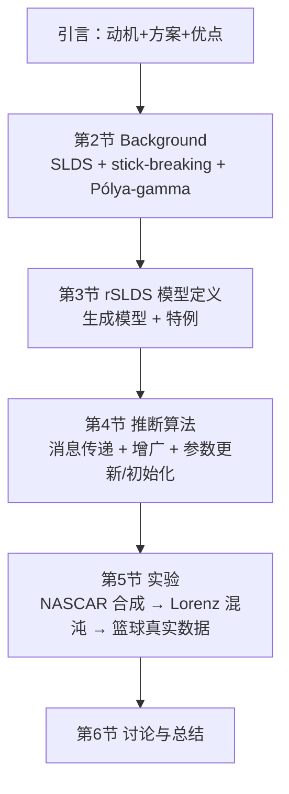

# Recurrent Switching Linear Dynamical Systems (rSLDS) 阅读笔记

> 来源文献：Linderman, Miller, Adams, Blei, Paninski & Johnson, *Recurrent Switching Linear Dynamical Systems*（Linderman et al., 2017, arXiv:1610.08496）。
> 关联文献：Nair 等（2023, *Cell* 186:178–193）*An approximate line attractor in the hypothalamus encodes an aggressive state*——该文用 rSLDS 对 VMHvl 神经群体做动力学建模，识别出编码攻击升级的"近似线吸引子"。
> 本笔记以中文为主，收录正文的【原文 / 翻译 / 逐句细讲】，并附若干零基础概念问答。

---

## 目录

1. [论文与文献背景速览](#0-论文与文献背景速览)
2. [1 Introduction 引言](#1-introduction-引言)
   - [第一段](#11-第一段)
   - [第二段](#12-第二段)
     - [延伸讲解 A：可处理的贝叶斯算法是什么](#ext-a)
     - [延伸讲解 B：核心句——切换通过 logistic 回归依赖 x 与 u](#ext-b)
     - [延伸讲解 C：外生输入 u_t 是什么](#ext-c)
     - [延伸讲解 D：非高斯因子怎么混进 x 的更新](#ext-d)
     - [延伸讲解 E：x 的更新来自推断吗？要不要观测 y](#ext-e)
     - [延伸讲解 F：增广变量 / Pólya-gamma 是什么](#ext-f)
   - [第三段](#13-第三段)
   - [第四段](#14-第四段)
3. [2 Background 导语段](#2-background-导语段)
   - [2.1 SLDS: Switching linear dynamical systems](#21-slds-switching-linear-dynamical-systems)
4. [基础概念问答（面向零基础读者）](#3-基础概念问答面向零基础读者)
   - [3.1 经典 SLDS 是什么](#31-经典-slds-是什么)
   - [3.2 什么叫非线性的时间序列数据](#32-什么叫非线性的时间序列数据)
   - [3.3 建模前如何判断数据是否具有非线性动力学特征](#33-建模前如何判断数据是否具有非线性动力学特征)
   - [3.4 建模之前要确定状态演化和观测是否非线性吗](#34-建模之前要确定状态演化和观测是否非线性吗)
   - [3.5 线性模型能否构建与吸引子相关的内容](#35-线性模型能否构建与吸引子相关的内容)
   - [3.6 AR-HMM / rAR-HMM 与 SLDS 的关系](#36-ar-hmm--rar-hmm-与-slds-的关系)
   - [3.7 传统最简模型 HMM 是什么](#37-传统最简模型-hmm-是什么)
   - [3.8 势函数 ψ 与消息传递（第 4 节预读）](#38-势函数-ψ-与消息传递第-4-节预读)
   - [3.9 核心递推 x_{t+1}=A_kx_t+b_k 是什么](#39-核心递推-x_t1a_kx_tb_k-是什么)

---

## 0. 论文与文献背景速览

**rSLDS 论文的核心贡献**：提出一类 **"循环"切换线性动力系统（recurrent switching linear dynamical systems, rSLDS）**——在经典 SLDS 基础上，让离散状态（模式）的切换概率**受连续隐状态/外生输入控制**，并给出基于 **Pólya-gamma 增广**的高效贝叶斯推断算法，使推断既快又保持"线性-高斯"的闭式结构。

**关联文献的关系**：
- Nair 等（2023, *Cell*）的 **Figure 2A** 分析管线为：降维提取群体因子 → **用 rSLDS 把潜因子空间划分为离散状态 → 对每个状态拟合一套线性动力系统** → 低维可视化。
- 对 VMHvl$\;^{Esr1}$ 群体，rSLDS 揭示出一个**长时程常数（>50 s）的"积分维度"**，构成**近似线吸引子**：轨迹沿吸引子的推进与攻击升级相关，个体"积分维度时程常数"与攻击性的相关性达 $r^2=0.77$。
- 对照地，MPOA$\;^{Esr1}$ 在交配时表现为**旋转动力学**（rotational dynamics）而非线吸引子。
- 一句话：**rSLDS（Linderman et al., 2017）是一类"分段线性 + 位置依赖切换"的可解释生成式时序模型；Nair 等（2023）把它当作工具，在神经群体层面识别出编码攻击升级的线吸引子动力学。**

---

## 1. Introduction 引言

### 统一理解框架（先读）

论文处理的数据是**时间序列**：随时间一步步变化的观测（如神经元电压、球员位置）。核心世界观：

> 复杂的时间序列往往不是"从头到尾一个规则"，而是**由几段可重复使用的简单"模式"拼接而成**；而且**"何时从模式 A 切到模式 B"往往不是随机的，而是由系统当下所处的状态决定的**。

- 第一段：动机（复杂行为 = 可复用简单模式 + 受连续状态触发的切换）；
- 第二段：方案（在 SLDS 上让切换受隐状态控制，用 Pólya-gamma 保住高斯闭式推断）；
- 第三段：这套方案值得用的三大优点；
- 第四段：论文路线图。

---

### 1.1 第一段

#### 原文
> Complex dynamical behaviors can often be broken down into simpler units. A basketball player finds the right court position and starts a pick and roll play. A mouse senses a predator and decides to dart away and hide. A neuron's voltage first fluctuates around a baseline until a threshold is exceeded; it spikes to peak depolarization, and then returns to baseline. In each of these cases, the switch to a new mode of behavior can depend on the continuous state of the system or on external factors. By discovering these behavioral units and their switching dependencies, we can gain insight into complex data-generating processes.

#### 翻译
复杂的动态行为常常可以被拆解成更简单的单元。一名篮球运动员先找到正确的场上位置，然后发动一次挡拆战术；一只老鼠察觉到捕食者，决定猛然蹿走并躲藏起来；一个神经元的电压先在基线附近波动，直到超过某个阈值，它便放电冲到去极化峰值，随后回到基线。在以上每一种情形里，"切换到一种新行为模式"这件事，都可能取决于系统当前的连续状态，也可能取决于外部因素。因此，只要我们能自动发现这些行为单元、以及它们之间"何时切换"的依赖关系，就能洞察复杂数据背后的产生过程。

#### 逐句细讲

1. **"Complex dynamical behaviors can often be broken down into simpler units."**
   - "dynamical behaviors" = 随时间演化、有内在规律的行为/过程（时间序列背后的东西）。
   - 观点：复杂运动常是**几个简单子过程轮番上场**的拼接。无需为整段数据造一个巨复杂的公式，只需找出"有哪些简单单元 + 按什么顺序/何时切换"。

2. **三个例子的作用——展示"切换"是普遍现象**
   - **篮球挡拆（pick and roll）**：球员先"站到合适位置"，再发动挡拆。**会不会切到挡拆，取决于当前在球场上的位置**——位置是连续变化的量。
   - **老鼠逃跑**：正常活动 → 察觉捕食者（外部威胁）→ 切到"蹿走躲藏"。触发是**外部因素 + 与威胁的距离**（距离也是连续量）。
   - **神经元放电**（最重要、最贴近本文）：静息时电压在基线附近波动；一旦电压**跨过放电阈值**，就"切换"到发放状态冲到峰值再回到基线。**电压是连续值，"是否超过阈值"是连续状态驱动的离散事件**——正是本文模型核心结构（离散 + 连续 + 二者耦合）的缩影。

3. **核心句："the switch ... can depend on the continuous state of the system or on external factors"**（全文题眼）
   - 两个层面：
     - **连续状态**：电压值、位置、威胁距离，取任意实数、连续变化；
     - **离散模式**：在做什么（挡拆 or 站位、放电 or 静息），取有限个类别。
   - 传统最简模型（如 HMM）假设"下一步切到哪个模式只取决于当前模式，与连续状态无关"（像抛硬币）。
   - 论文强调真实世界恰恰相反：**切换常由连续状态触发**。这正是标题 "Recurrent（循环的）" 的含义——连续状态"反馈"决定下一步的离散切换。

4. **收尾句**：能自动从数据里找出一共几种模式、每种模式内部规则、以及"什么状态触发切换"，就还原了数据"被生产"的过程——这就是理解复杂系统。

---

### 1.2 第二段

#### 原文
> This paper proposes a class of recurrent state space models that captures these dependencies and a Bayesian inference and learning algorithm that is computationally tractable and scalable to large datasets. We extend switching linear-Gaussian dynamical systems (SLDS) by introducing a class of models in which the discrete switches can depend on the continuous latent state and exogenous inputs through a logistic regression. Previous models including this dependence, like the piecewise affine framework for hybrid dynamical systems, abandon the conditional linear-Gaussian structure in the continuous states and thus greatly complicate inference. Our main technical contribution is a new inference algorithm that leverages auxiliary variable methods to make inference both fast and easy.

#### 翻译
本文提出一类能够刻画上述依赖关系的**循环状态空间模型**，并配套一个**计算上可处理、可扩展到大数据集的贝叶斯推断与学习算法**。我们扩展了"切换线性-高斯动力系统"（SLDS）：引入的一类新模型，允许**离散切换通过 logistic 回归来依赖当前的连续隐状态与外生输入**。以往那些同样包含这种依赖的模型（例如混合动力系统的分段仿射框架）都**放弃了连续状态上的条件线性-高斯结构**，从而把推断变得异常复杂。我们的主要技术贡献是一个新的推断算法：借助**增广变量方法**，让推断既快又容易。

#### 逐句细讲（技术菜单，逐个拆术语）

1. **"A class of recurrent state space models + Bayesian inference algorithm"**
   - **state space model（状态空间模型）**：假设观测到的信号由看不见的"内部状态 $x$"演化而来，观测只是它的有噪声投影（类比：只看到海面冰山一角，水下才是真正的驱动者）。
   - **recurrent（循环）**：指"连续状态反过来影响下一步的切换"这条回路。
   - **Bayesian inference（贝叶斯推断）**：把参数也当未知量，输出参数的**整个后验分布**（含不确定性），可融入先验、抗小样本。
   - 作者承诺：计算**可行、能上大数据**（很多漂亮模型因算不动而无法用）。

2. **什么是 SLDS（被扩展的旧模型）**
   - "switching + linear + Gaussian + dynamical system" 逐词拆：
     - dynamical system：状态如何一步步演化：$x_{t+1}=f(x_t)$；
     - linear：每个模式内部演化是线性的，$x_{t+1}=A_kx_t+b_k$（$k$ 为模式编号）；
     - Gaussian：噪声为高斯（钟形）噪声；
     - switching：系统有 $K$ 套规则 $(A_1,b_1),\dots,(A_K,b_K)$，由离散状态 $z_t$ 决定用哪一套。
   - 类比：$K$ 个不同"性格"的机器人在接力，谁上岗由 $z_t$ 说了算。
   - 为何偏爱"线性+高斯"：所有概率计算（滤波、平滑、推断）都有**解析闭式解**（卡尔曼滤波体系），精确又飞快——即"结构红利"。

3. **本文对 SLDS 的扩展（最关键一句）**
   - 经典 SLDS 里离散切换 $z_{t+1}$ 只由 $z_t$ 决定（马尔可夫链），**看不见连续状态 $x_t$**——即"不看位置就乱切"。
   - 本文让切换概率**由 $x_t$（及外生输入 $u_t$）决定**，用 **logistic regression**：
     $$z_{t+1}\mid z_t,x_t \sim \text{分类分布}\big(\text{由 } \nu=R_{z_t}x_t+r_{z_t}\text{ 经 logistic/stick-breaking 得到}\big)$$
   - 通俗理解：logistic 回归是"用连续数值算概率"的标准工具；模型可学会"当电压跨过阈值（$x$ 到某区域），切到放电的概率飙升"。
   - **exogenous inputs（外生输入）**：系统外部信号（刺激等），同样进入回归控制切换。

4. **前人工作的痛点**
   - 让切换依赖连续状态并非本文首创；控制论里的 **piecewise affine（分段仿射）/ hybrid dynamical systems（混合动力系统）** 早已这么做（状态空间分区、各区不同仿射规则）。
   - 致命伤：为加依赖而**放弃"线性+高斯"结构**，改用任意非线性/非高斯描述 → 推断无闭式解，要靠高维数值积分/粒子滤波/启发式，**又慢又难**。
   - 本文策略："鱼和熊掌都要"——既要切换依赖连续状态的灵活性，又保留条件线性-高斯结构，靠 Pólya-gamma 增广。

5. **主要技术贡献：auxiliary variable methods（增广变量 / Pólya-gamma 增广）**
   - 难点：切换项 $\psi(x_t,z_{t+1})$ 是"关于 $x_t$ 的非线性函数"（logistic 形状），破坏处处高斯的图结构，积分算不出来。
   - 思路一句话概括：
     > 往模型里多加一个看不见的辅助随机变量 $\omega$，使得在固定 $\omega$ 的条件下，原非高斯项重新变成高斯项，于是所有原本解析的算法又能用；把 $\omega$ 积分掉后，模型与原模型完全等价（没有偷换模型）。
   - 类比：原来看不见路（非线性），先"打一盏探照灯"（引入 $\omega$），灯下看见高斯路走完该走的路；"关灯"（积分掉 $\omega$）后到达的位置与不开灯完全一致，但路好走了。
   - 具体工具：**Pólya-gamma 分布**（Polson 等的积分恒等式，Linderman 等推广到多类/时序）。加了它，logistic 项变高斯 → 卡尔曼式消息传递恢复 → 整个 Gibbs 采样器每步闭合更新，**快且容易**。

<a id="ext-a"></a>

#### 延伸讲解 A：“计算上可处理、可扩展到大数据集的贝叶斯推断与学习算法”是什么

- **贝叶斯推断与学习（Bayesian inference & learning）**：给定观测数据，一边**反推隐藏的东西**（潜状态 $z,x$ = 推断），一边**估计参数 $\theta$**（= 学习），并给出带不确定性的后验。
- **计算上可处理（tractable）**：每个计算步骤都能用**解析/闭式**完成，不靠巨型数值积分或无界迭代。对 rSLDS：Pólya-gamma 增广把“非高斯切换项”变回高斯 → 卡尔曼式消息传递、各参数共轭更新一步到位。
- **可扩展（scalable）**：运行时间随序列长度 $T$ 近似线性（O(T)），能啃长序列、大数据、甚至缺失数据（rSLDS 论文篮球例子 25 万+ 时间步）。
- 一句话：**让“参数多、潜状态多、数据长”的贝叶斯拟合真正跑得动、跑得快**——很多漂亮模型（如分段仿射框架）恰恰卡在这。

##### 在 Nair 2023 里“能干什么”（同一工具，代码 `lindermanlab/ssm`，最大似然 + 近似变分推断）

| rSLDS 给每只动物/每段时间的输出 | Nair 用它做的分析 |
|---|---|
| 离散状态 $z$（每动物 $K$ 个状态） | 找“行为富集态”（如 state 3 富集 attack / mating）；画状态-行为时间线、状态转移图 |
| 每状态线性系统 $A_k$ | 特征分解 → 各维**时间常数** → 认出慢“积分维度”（τ > 50 s） |
| 由特征值判断动力学形态 | **近似线吸引子**（line attractor score）；对照 MPOA 的旋转动力学 |
| 低维潜因子 $x$ | PCA 变换后在 2D/3D 状态空间画轨迹、flow field、能量/速度景观 |
| 外部输入 $u$（姿态特征） | 区分“行为本身 vs 内部状态”（补充图比较有无输入） |
| 生成式（可前向模拟） | FSE 前向模拟误差 + 5 折交叉验证 ELBO，验证模型抓住动力学 |
| 跨个体拟合 | 对 n=14 只鼠逐只拟合提取时间常数 → 与攻击性相关（r²=0.77） |

两个最关键“能干的事”：① **从高维钙成像自动提炼“低维动力学画像”**（几百神经元 → 几个离散状态 + 各状态线性动力学 → 收敛到线吸引子）；② **能跨动物重复拟合做统计**（6 只攻击、3 只交配、14 只相关分析都能逐只拟合并比较）——这是发现“时间常数 ≈ 个体攻击性”的前提。

<a id="ext-b"></a>

#### 延伸讲解 B：核心句拆解——“离散切换通过 logistic 回归依赖当前连续隐状态与外生输入”

逐词拆开再拼起来：
- **离散切换**：每步在 $K$ 个模式里选一个进入（$z_{t+1}\in\{1,\dots,K\}$）。
- **依赖**：指切换的**概率分布**由 $x_t,u_t$ 决定（不是 $z_{t+1}$ 直接等于某个函数）。
- **当前连续隐状态 $x_t$**：此刻系统内部的连续读数（电压/位置/低维神经因子）；用“当前”是因为用 $x_t$ 决定下一步 $z_{t+1}$。
- **外生输入 $u_t$**：来自系统外部、可测的驱动信号（详见延伸讲解 C）。
- **logistic 回归**：把连续数值变成“各类别概率”的工具——二分类用 $\sigma(\nu)=e^\nu/(1+e^\nu)$；多类（$K$ 模式）用 softmax 或论文采用的 **stick-breaking**。

数学：先算“得分向量”，是 $x_t,u_t$ 的线性组合
$$\nu_{t+1}=R_{z_t}x_t+W_{z_t}u_t+r_{z_t}$$
其中 $R_{z_t}$（$K{-}1\times M$）是“循环权重”（$x$ 高一些某些模式概率上升）、$W_{z_t}$ 是输入权重、$r_{z_t}$ 偏置保留马尔可夫倾向。再把 $\nu$ 经 logistic/stick-breaking 变成概率并抽样：
$$z_{t+1}\sim\mathrm{Softmax}/\mathrm{StickBreaking}(\nu_{t+1})$$

**符号速查表（维度能对上：$(K{-}1)\times M$ 乘 $M\to K{-}1$；$(K{-}1)\times P$ 乘 $P\to K{-}1$）**

| 符号 | 维度 | 含义 |
|---|---|---|
| $\nu_{t+1}$ | $K{-}1$ | 切换“原始得分向量”，非概率，越大越偏向该候选；下标 $t{+}1$ = 用于决定下一步 $z_{t+1}$ |
| $x_t$ | $M$ | 当前连续隐状态（内部、需推断；来自式 2 的演化） |
| $R_{z_t}$ | $(K{-}1)\times M$ | “循环”权重：$x$ 的每个分量让切换偏向哪个候选、多强 |
| $u_t$ | $P$ | 外生输入（外部给定、可测） |
| $W_{z_t}$ | $(K{-}1)\times P$ | 外生输入权重：$u_t$ 如何影响切换偏向 |
| $r_{z_t}$ | $K{-}1$ | 偏置：$x_t=0,u_t=0$ 时也存在的基准倾向（保留经典 SLDS 的马尔可夫习性；若 $R,W=0$ 则退化为纯马尔可夫转移） |
| Softmax / StickBreaking | — | 把 $K{-}1$ 维得分变成 $K$ 个非负、和为 1 的概率（论文用 stick-breaking，softmax 是常见替代） |
| $z_{t+1}$ | 标量 $\in\{1,\dots,K\}$ | 按所得概率分布抽出的下一步离散模式 |

**下标别混淆**：$x_t,u_t$ 的下标 $t$ = 时间点取值（每刻不同值）；$R_{z_t},W_{z_t},r_{z_t}$ 的下标 $z_t$ = “当前模式是哪个就选第几套参数”（不是随时间变）。

**一句话读法**：根据当前模式 $z_t$ 挑一套权重，把当前内部状态 $x_t$ 与外生输入 $u_t$ 线性打分、加偏置 $r$，得到 $z_{t+1}$ 的倾向得分，再变概率抽一个下一步模式。

直观效果：$x,u$ 的取值把潜空间“切”成若干区域，每区域对应一个模式；$x$ 走到哪片区域，切换就倾向往哪个模式走（论文 Figure 1 下排概率图：$P(z_{t+1}=k\mid x_t)$ 随 $x_t$ 平滑变化）。

对照经典 SLDS：切换只看 $z_t$（纯随机马尔可夫）vs 看 $z_t+x_t+u_t$（能学到“进入某区域才切换”）。神经元例子：$x_t$=当前电压，$u_t$=外部刺激；模型自动学到“电压过阈值 → 放电模式概率 > 0.5”。

<a id="ext-c"></a>

#### 延伸讲解 C：u_t 是什么（外生输入）

- **定义**：$u_t\in\mathbb{R}^P$ 是**来自系统外部、直接给定/可观测**的驱动变量（协变量），**不是模型内部动力学演化出来的**。它随时间变化，作为“已知的输入”喂给模型。
- **作用位置**：在 rSLDS 里主要进入切换回归（$\nu$ 里的 $W_{z_t}u_t$），也可让式 (2)(3)（潜动力学与观测）线性依赖 $u_t$。
- **与 $x_t$ 的区别**：
  - $x_t$：**内部隐状态**——由模型自己演化、不可直接观测（需要推断）；
  - $u_t$：**外部已知输入**——直接测得/给定（刺激、环境、距离等），不靠推断。
- **rSLDS 论文**：把式 (2)(3) 扩到可含 $u_t$ 的线性项，用于把“外部条件”也考虑进切换/演化。
- **Nair 2023 里的具体 $u_t$**：由 MARS 自动姿态估计提取的**姿态特征**——两鼠之间的距离（椭圆/关键点质心间距）、resident 对 intruder 的朝向角；额外尝试过 resident 速度、resident 椭圆面积以及“无输入”版本。**作用**：把“外部情境/行为”与“内部状态”区分开，帮助判断识别到的线吸引子是**内部状态**而非被输入直接驱动（补充图 S3 比较不同输入的模型表现）。
- 通俗例子：威胁等级、刺激强度、光照、两鼠距离等——$u_t$ 高时，切到“攻击/逃窜”模式的概率上升。

<a id="ext-d"></a>

#### 延伸讲解 D：非高斯因子是怎么“混进”x_t 的更新的（为什么推断会卡住）

- $x_t$ 在图上连着好几样东西；给定其它一切更新 $x_t$ 时，它的后验要把所有邻居因子都乘进来：
$$p(x_t\mid\cdots)\ \propto\ \underbrace{\mathcal{N}(\text{动力学项})}_{\text{高斯}}\times\underbrace{\mathcal{N}(y_t\mid x_t)}_{\text{高斯}}\times\underbrace{\psi(x_t,z_{t+1})}_{\text{logistic，非高斯}}$$
- 最后一项目 $\psi(x_t,z_{t+1})$ 是“下一步模式 $z_{t+1}$ 的概率依赖 $x_t$”的因子（$\sigma(Rx_t+r)$ 形状）。**高斯 × logistic ≠ 高斯** → 积分/归一化无闭式解。
- 直观：更新“电压 $x_t$”时，有个 sigmoid 因子在说“电压越高，下一步是放电模式概率越大”；把 sigmoid 和高斯乘在一起就不再是可解析的高斯。
- 这正是 Pólya-gamma 增广要处理的：给这个因子加辅助变量 $\omega$，使其条件高斯，乘积又变回高斯。

<a id="ext-e"></a>

#### 延伸讲解 E：x 从 x_t 到 x_{t+1} 的更新来自贝叶斯推断吗？要不要观测 y？

区分两件事（容易混）：

**(a) 演化机制（模型定义，不靠 y）**：$x_{t+1}=A_kx_t+b_k+v_t$。知道当前 $x_t$ 与参数即可**正向预测** $x_{t+1}$——纯动力学规则，不需要观测。

**(b) 贝叶斯推断（估计“对 x 的信”，需要 y 校正）**：不知道真实 $x_t$、只有观测 $y_{1:T}$ 时反推 $x_t$（后验），把两类信息合并：
$$p(x_t\mid y_{1:T})\propto\underbrace{p(x_t\mid\text{动力学先验})}_{\text{来自 (a)，不用 y}}\times\underbrace{p(y_t\mid x_t)}_{\text{观测似然，需要 y}}$$
卡尔曼式的“预测–校正”：预测用动力学 (a)；校正用观测 $y_t$ 把估计拉回数据说的位置。

**回答**：演化规则是模型定义、不是推断；但“从数据更新我们对 $x_t$ 的信念（后验）”是贝叶斯推断，且**要靠观测 $y_t$ 当“证据锚点”**。没有 $y$ 只能让动力学先验一路瞎传播（不确定性发散）；有 $y$ 每步都被锚定。这也解释了 Lorenz 实验挖空中间段（mask）后 $z/x$ 不确定性增大——缺观测只剩动力学先验传播。

补充：$x$ 的正向预测（机制）即使没观测也能算——只是“没把握”；所以要区分“算得出（机制）”与“算得准/有把握（需要观测校正）”。

<a id="ext-f"></a>

#### 延伸讲解 F：增广变量（auxiliary variable）是什么 / Pólya-gamma 增广

**F1 什么叫“增广变量”（最基础）**
- auxiliary = 辅助；augmented = 被加进去。增广变量 = 为让难算的计算变好算而**临时加进模型的一个额外随机变量**；它不代表真实含义，只在计算中途存在。
- 机制三步：① 把难处理的 $p(x)$ 写成边缘化形式 $p(x)=\int p(x,\omega)d\omega$；② 选 $\omega$ 使 $p(\omega)$ 好采样、$p(x\mid\omega)$ 好算（如高斯）；③ 采样/积分掉 $\omega$ 后回到原分布——**模型没变**。
- 类比：黑夜里打灯看清路（$\omega$），走完关灯终点不变；“直接算合影难→知道光源 $\omega$ 就好算，再把 $\omega$ 平均掉”。
- **增广变量 ≠ 潜变量**：潜变量（HMM 的 $z$、SLDS 的 $x$）有真实含义、你关心它的值；增广变量（Pólya-gamma 的 $\omega$）**没有含义、纯数学道具、只求积分掉**。

**F1.5 术语视角：“增广（augmentation）”到底指什么**
- 词义：augment = **增大、扩充、加强**。统计学/机器学习里的“增广” = 把原来的对象“放大/加料”——往变量集合或概率空间里**加入原本没有的成分**，使后续处理更容易。
- **augmented space / augmented distribution**：把原问题“提升（lift）”到更大的空间（多一个维度 $\omega$），在那里 $x$ 的条件分布变得好算（如高斯）；解完再“降回”——把 $\omega$ **边缘化（marginalize）掉**。所以“增广 ↔ 边缘化”是一对操作：先升维解题，再降维返回。
- 与 **auxiliary（辅助）** 的侧重区别：auxiliary 强调“它是帮手”；augmentation 强调“我们把问题扩展了”。两词常并用（auxiliary / augmented variable）。
- 与 **data augmentation（数据增广）** 同词提醒：后者指给训练数据加变换副本（提升泛化），精神类似（扩增使后续更容易/更稳），但机制不同（数据增广**不要求**边缘分布不变）。
- 术语的关键性质：真正的“增广”必须满足 $p(x)=\int p(x,\omega)d\omega$——即对 $x$ 的边缘回到原分布。若不满足这一点，就**改了模型**而不是“增广”。

**F2 auxiliary variable methods（Pólya-gamma 增广）在 rSLDS 里的具体作用**
- 难点：切换因子 $\psi(x_t,z_{t+1})$ 是 logistic（非线性），与高斯相乘后消息积分无闭式解。
- 恒等式（Polson–Scott–Windle）：
$$\frac{(e^{\psi})^a}{(1+e^{\psi})^b}=2^{-b}\,e^{\kappa\psi}\int_0^\infty e^{-\omega\psi^2/2}\,p_{\mathrm{PG}}(\omega\mid b,0)\,d\omega,\qquad \kappa=a-\tfrac b2$$
被积函数含 $e^{\kappa\psi-\tfrac12\omega\psi^2}$，是关于 $\psi$ 的高斯形状；而 $\psi=R x_t+r$ 是 $x_t$ 的线性函数 → 关于 $x_t$ 高斯。
- 于是 $\psi$ 增广后 $\propto\mathcal{N}(\nu\mid\Omega^{-1}\kappa,\Omega^{-1})$（$\Omega=\mathrm{diag}(\omega)$）；$\omega$ 的条件后验仍是 Pólya-gamma（共轭，易更新）。
- 关键：积分掉 $\omega$ 后**精确回到原模型（不是近似）**——模型语义没变，只是推断更顺（恢复卡尔曼式消息 + 块 Gibbs；还顺带能处理 Bernoulli 观测）。
- 两个用处：主用 = 切换项；附用 = Bernoulli 观测（Lorenz 例子）。

**F3 自检总结（易错点修正）**
- 优势：$z_{t+1}$ 受连续状态 $x_t$ 调制（不只受 $z_t$）。✅
- 修正①：正向算 $p(z_{t+1}\mid x_t)$ 很容易（logistic 打分即可）；难的其实是**贝叶斯推断**——从整段观测反推/更新 $x$ 的后验时，非高斯切换因子混入、消息传递无闭式。
- 修正②：Pólya-gamma 增广**不是**“直接算 $x\to z$”，而是加 $\omega$ 使切换因子**条件高斯**、恢复对 $x$ 的闭式推断；$\omega$ 积分掉后等价（非近似）。
- 精修版总结：*rSLDS 的核心优势是让 $z_{t+1}$ 受连续隐状态 $x_t$ 调制（而非仅 $z_t$）。正向计算这个依赖不难；难在贝叶斯推断中更新 $x$ 的后验时非高斯因子破坏闭式解。本文用 Pólya-gamma 增广——引入辅助变量 $\omega$ 把该因子“摊”成条件高斯，且积分掉 $\omega$ 后模型不变——从而让“含 $x\to z$ 依赖”的推断又快又准地可解。*

---

### 1.3 第三段

#### 原文
> The class of models and the corresponding learning and inference algorithms we develop have several advantages for understanding rich time series data. First, these models decompose data into simple segments and attribute segment transitions to changes in latent state or environment; this provides interpretable representations of data dynamics. Second, we fit these models using fast, modular Bayesian inference algorithms; this makes it easy to handle missing data, multiple observation modalities, and hierarchical extensions. Finally, these models are interpretable, readily able to incorporate prior information, and generative; this lets us take advantage of a variety of tools for model validation and checking.

#### 翻译
我们发展的这类模型及其配套的学习与推断算法，在理解丰富的时间序列数据方面有若干优势。**第一**，这些模型把数据分解成简单的片段，并把"片段之间的切换"归因于隐状态或环境的变化——这就提供了对数据动力学的**可解释表示**。**第二**，我们用**快速、模块化的贝叶斯推断算法**来拟合这些模型——这让我们很容易处理**缺失数据、多种观测模态，以及层次化扩展**。**最后**，这些模型是**可解释**的、**易于融入先验信息**的，并且是**生成式**的——这让我们能利用各种各样的**模型验证与检查**工具。

#### 细讲：三大优点逐条展开

**优点一：可解释的表示（interpretable representations）**
- **拆成简单片段**：模型自动把长时间序列切成若干小段，每段内部是"一套线性规则"（一个离散模式）。输出是一份"清点清单"：共 $K$ 种模式、各对应哪些时间段。
- **把切换归因于原因**：rSLDS 相对经典 SLDS 的**新增价值**——经典 SLDS 只能说"何时切换"，说不清"为什么"；rSLDS 因切换受连续隐状态控制，还能说"切换发生在 $x$ 进入某区域 / 环境信号变化之时"。相当于不只记录事故，还给出诱因。
- 对神经科学家的价值：找到"哪个潜变量一变就触发行为切换"≈ 找到编码该行为的神经信号。
- 小结：优点一 = **能看懂结果**（来自"分段线性 + 可解释的线性分区"结构）。

#### 补充问答：“拆成简单片段”的拆分条件是什么

- 先纠正直觉：分段**不是**“预设断点再分别拟合”（不是 change-point detection），而是模型在**学习和推断中自动切出来的**——给每个时刻分配离散状态 $z_t$，$z_t$ 何时变，片段就在哪里断。
- **本质条件**：一个片段 = 一段能被**单套线性动力学 $(A_k,b_k,Q_k)$ 较好解释**的时间窗。“简单”= 片段内部是线性（仿射）+ 高斯噪声，没有复杂非线性演化；当同一套线性系统解释不好（数据规律变了），就切换状态、形成边界。
- **谁决定何时切**：经典 SLDS 靠马尔可夫随机切换（段长几何分布，看不出“为什么切”——这是它的局限）；rSLDS 由连续状态 $x_t$/外生输入触发（$x$ 进入某区域 → 切到对应模式），切换点 = “规律该变的地方”。
- **模型怎么“知道”在哪切（推断视角）**：训练时最大化整段数据的解释力（对数似然/ELBO），在“继续当前模式（省一次切换，但若规律已变则拟合差）”与“切到新模式（拟合变好，但要付切换代价）”之间权衡；推断算法自动找出使整体似然最大的 $z$ 分配 → 同时决定“切几刀、刀在哪”。**没有显式阈值**——拆分 = “哪个分段方案最能解释数据”这个优化问题的答案。
- **段长不固定**：数据驱动。只要数据还支持同一套线性系统就延续，支持不住就切 → 段长可长短不一（NBA“跑底角”只几秒；Nair 的攻击富集态可跨多个动作持续较久——这正是 rSLDS 能发现“内部状态比单个动作长”的原因）。

**优点二：快速、模块化的贝叶斯推断（fast, modular Bayesian inference）**
- 为什么"模块化"重要：rSLDS 可看作三块拼图：① 连续状态演化（每模式一套线性系统）→ ② 离散切换（logistic/stick-breaking）→ ③ 观测发射（线性高斯）。Pólya-gamma 使**每个模块能独立完成自己的闭式更新**，像流水线工位——换/升级某模块不必重写其他工位。
- 三个实际好处：
  - **missing data（缺失数据）**：逐时间点消息传递，某步无观测就跳过该项，其余照跑。论文 Lorenz 实验挖掉一大段观测，模型仍能合理推断该时段模式。
  - **multiple observation modalities（多观测模态）**：一个隐状态同时驱动多路观测（钙信号 + 行为 + 声音等），模块化让"一个隐状态、多个发射模块"易于搭建。
    - ❗ 澄清：**多观测模态不是必须的**，单模态默认够用。论文三个实验全部单模态（NASCAR = 10 维线性高斯观测；Lorenz = 100 维 Bernoulli 观测；篮球 = 2D 位置轨迹）。Nair 2023 也只把钙成像荧光当作观测 $y$，行为是用作**标注** + 作为**外部输入 $u_t$**，而非第二条发射流。多模态是"模块化架构预留的扩展插槽"，需要融合互补信息时才用。
  - **hierarchical extensions（层次化扩展）**：多只动物/多个被试：各动物有"个性参数"又共享"群体先验"，互相借用统计强度；模块化使单被试模型"包一层"即变成多被试层次模型。
- "fast" 的意义：闭合更新使单次迭代便宜，才能处理百万时间步级数据（论文篮球数据 25 万+ 步）。
- 小结：优点二 = **实用、能扛真实数据的脏乱差（缺失、多模态、多个体）**。

**优点三：可解释 + 能融入先验 + 生成式 → 可验证**
- **interpretable**：每个离散模式就是一套线性系统 $(A_k,b_k)$，可直接看特征值、不动点、箭头场理解它在做什么（Nair 等 2023 正是这样把每个状态读成"点吸引子/旋转/积分方向"）。

#### 补充问答：解释性三件套（特征值 / 不动点 / 箭头场）是什么？与吸引子和动物状态什么关系？

**1. “每个离散模式 = 一套线性系统 $(A_k,b_k)$”是什么**
- 状态 $k$ 内，隐状态演化 $x_{t+1}=A_kx_t+b_k+v_t$。“看懂这套系统”= 用三种等价工具描述 $A_k$ 的“性格”：
  1. **特征值（eigenvalues）**：把 $A_k$ 对角化后，各主方向上的缩放/旋转因子；
  2. **不动点（fixed point）**：$x^*=(I-A_k)^{-1}b_k$——若 $I-A_k$ 可逆，系统停在这点就不再动；
  3. **箭头场（flow field / vector field）**：状态空间每个位置 $x$ 上的“演化方向”$x_{t+1}-x_t=(A_k-I)x+b_k$，画成一堆箭头。

**2. 与吸引子的关系（用特征值判断形态）**

| $A_k$ 特征值（离散时间） | 动力学形态 | 箭头场样子 |
|---|---|---|
| 全部模 $<1$ | **点吸引子**：收敛到不动点 $x^*$ | 箭头都指向一点 |
| 复共轭、模 $\approx1$ | **旋转/环（rotational）** | 箭头绕着转 |
| 一个模 $\approx1$（接近 1）、其余 $<1$ | **慢积分方向 $\approx$ 线吸引子** | 沿一条线很慢，垂直方向被拉回（槽/谷） |
| 有模 $>1$ | 发散（不稳定） | 箭头向外 |

时程常数 $\tau$ 由 $|\lambda|$ 决定：$|\lambda|$ 越接近 1 → $\tau$ 越大（越慢、记忆越长）。看特征值在实轴/复平面的位置即可判断是点、环还是慢积分方向。

**3. 与“动物状态”的关系（Nair 的读法）**
- 每个离散状态 = 一种“行为相关的内部动力学模式”（通常富集在某段行为时间）；$A_k$ 的形态告诉你这个内部状态如何随时间演化，从而对应到动物状态：
  - **VMHvl 攻击态（$A_k$ 有一个慢特征方向 $\approx$ 线吸引子）**：沿慢方向的活动缓慢爬升/持续 → 编码“攻击动机强度”随时间升级；沿吸引子的位置越高 = 越接近攻击（嗅探低 → 骑跨中 → 攻击高）。个体差异：该方向时程常数越长，该鼠越具攻击性（$r^2=0.77$）。
  - **MPOA 交配态（$A_k$ 复共轭 $\approx$ 旋转）**：活动按顺序激活不同细胞类群 → 对应交配动作序列（嗅探 → USV+ 骑跨 → 插入）；旋转角 $\theta$ = 动物处于哪个行为阶段。
- 一句话：**“特征值/箭头场”把数学状态翻译成生理状态——线吸引子 = 持续/可升级的内部状态（攻击/交配动机强度）；旋转 = 顺序推进的动作序列（交配阶段）。**

- **incorporate prior information**：贝叶斯框架允许把领域知识写进先验（如"动力学大致稳定、谱半径接近 1"）。小样本神经数据尤其受益。
- **generative（生成式）**：训练好后不但能解释旧数据，还能**凭空生成同风格新数据**。NASCAR/Lorenz 实验即拿模型"生成样本"与"真实样本"并排对比。
- **model validation and checking**：生成式带来**检验模型好坏**的能力：
  - **后验预测检验（posterior predictive check）**：从拟合模型反复生成模拟数据，看真实数据是否落在模拟数据的典型范围内；
  - 论文用此证明经典 SLDS"不行"（生成样本发散跑飞），而 rSLDS 生成样本与真实 Lorenz/NASCAR 很像——用"生成质量"支持模型选择。
- 小结：优点三 = **可信**（可解释、可注入先验、可被生成测试反复拷问）。

**三段串成一句话**：
> 动机（复杂时序 = 可复用简单模式 + 受连续状态触发的切换）→ 方案（SLDS + 受隐状态控制的切换 + Pólya-gamma 保住高斯闭式推断）→ 为什么值得用（结果可解释、能吃缺失/多模态/多个体、模型可生成可验证）。

---

### 1.4 第四段

#### 原文
> In the following section we provide background on the key models and inference techniques on which our method builds. Next, we introduce the class of recurrent switching state space models, and then explain the main algorithmic contribution that enables fast learning and inference. Finally, we illustrate the method on synthetic data experiments and an application to recordings of professional basketball players.

#### 翻译
在下一节中，我们提供本文方法所依托的**关键模型与推断技术的背景知识**。紧接着，我们引入一类**循环切换状态空间模型**，随后解释**使快速学习与推断成为可能的主要算法贡献**。最后，我们通过**合成数据实验**以及一个针对**职业篮球运动员记录**的应用来展示这一方法。

#### 细讲（= 一张全文地图）
- **"In the following section we provide background..."** → **第 2 节 Background**
  - 2.1 讲 SLDS 数学定义；2.2 讲 stick-breaking logistic 回归 + Pólya-gamma 增广。
- **"we introduce the class of recurrent switching state space models..."** → **第 3 节**
  - 正式定义 rSLDS（离散/连续/观测 + 循环依赖），配图 1 示意图、图 2 图模型，及若干特例（rAR-HMM、shared、recurrence-only、sticky 等）。
- **"...and then explain the main algorithmic contribution..."** → **第 4 节 Bayesian Inference**
  - 消息传递为何失效 → Pólya-gamma 增广恢复快速块 Gibbs → 参数更新（共轭先验）与初始化。
- **"Finally, we illustrate the method on synthetic data experiments and basketball..."** → **第 5 节 Experiments**
  - ① NASCAR 合成：先自证"模型没病"（真实规则即 rSLDS，能否反推）；
  - ② Lorenz：对公认非线性混沌系统做近似，并从 100 维离散观测 + 大段缺失恢复切换（能否拟合真非线性 + 扛缺失）；
  - ③ 篮球：真实 NBA 轨迹上发现"跑左底角、切入篮下"等可解释、与位置相关行为状态（真实数据上有用）。
- 实验设计逻辑：**先自证正确 → 再证能拟合真正的非线性系统 → 最后证明对真实数据产生可解释洞察**。



---

## 2. Background 导语段

#### 原文
> Our model has two main components: switching linear dynamical systems and stick-breaking logistic regression. Here we review these components and fix the notation we will use throughout the paper.

#### 翻译
我们的模型有两个主要组成部分：**切换线性动力系统（SLDS）**与 **stick-breaking（棍棒分解）logistic 回归**。在这里，我们回顾这两个组成部分，并**固定（统一约定）本文通篇将要使用的记号**。

#### 简短说明
- **"two main components"（两大组件）**：rSLDS 由两块"现成积木"拼成：
  1. **SLDS**（2.1 节）：负责"分段线性动力学"那一半——离散切换 + 每模式一套线性高斯演化 + 线性高斯观测；
  2. **stick-breaking logistic 回归**（2.2 节）：负责"由连续状态算离散切换概率"那一半——用棍棒分解这种 logistic 多分类链接函数（配合 Pólya-gamma），既让切换依赖连续状态，又保持高斯共轭。
- **"fix the notation"（固定记号）**：约定本文通篇符号（$z_t$ 离散状态、$x_t$ 连续状态、$A_k,Q_k$ 等）以此处为准，后面不再重新解释。

简单说：**"本文 = 积木 A（SLDS）+ 积木 B（棍棒 logistic 回归）；先熟悉两块积木并约好记号。"** 2.1 讲积木 A、2.2 讲积木 B。

---
### 2.1 SLDS: Switching linear dynamical systems

#### 原文（分段）

> Switching linear dynamical system models (SLDS) break down complex, nonlinear time series data into sequences of simpler, reused dynamical modes. By fitting an SLDS to data, we not only learn a flexible nonlinear generative model, but also learn to parse data sequences into coherent discrete units.

> The generative model is as follows. At each time $t=1,\dots,T$ there is a discrete latent state $z_t\in\{1,\dots,K\}$ that follows Markovian dynamics, $z_{t+1}\mid z_t,\{\pi_k\}_{k=1}^K\sim\pi_{z_t}$ (1) where $\{\pi_k\}_{k=1}^K$ is the Markov transition matrix and $\pi_k\in[0,1]^K$ is its $k$th row. In addition, a continuous latent state $x_t\in\mathbb{R}^M$ follows conditionally linear (or affine) dynamics, where the discrete state $z_t$ determines the linear dynamical system used at time $t$: $x_{t+1}=A_{z_t}x_t+b_{z_t}+v_t,\ v_t\overset{\text{iid}}{\sim}\mathcal{N}(0,Q_{z_t})$ (2) for matrices $A_k,Q_k\in\mathbb{R}^{M\times M}$ and vectors $b_k\in\mathbb{R}^M$ for $k=1,\dots,K$. Finally, at each time $t$ a linear Gaussian observation $y_t\in\mathbb{R}^N$ is generated from the corresponding latent continuous state, $y_t=C_{z_t}x_t+d_{z_t}+w_t,\ w_t\overset{\text{iid}}{\sim}\mathcal{N}(0,S_{z_t})$ (3) for $C_k\in\mathbb{R}^{N\times M}$, $S_k\in\mathbb{R}^{N\times N}$ and $d_k\in\mathbb{R}^N$. The system parameters comprise the discrete Markov transition matrix and the library of linear dynamical system matrices, which we write as $\theta=\{\{\pi_k,A_k,Q_k,b_k,C_k,S_k,d_k\}\}_{k=1}^K$. For simplicity, we will require $C$, $S$, and $d$ to be shared among all discrete states in our experiments. In general, equations (2) and (3) can be extended to include linear dependence on exogenous inputs, $u_t\in\mathbb{R}^P$, as well.

> To learn an SLDS using Bayesian inference, we place conjugate Dirichlet priors on each row of the transition matrix and conjugate matrix normal inverse Wishart (MNIW) priors on the linear dynamical system parameters, writing $\pi_k\overset{\text{iid}}{\sim}\mathrm{Dir}(\alpha),\ (A_k,b_k,Q_k)\overset{\text{iid}}{\sim}\mathrm{MNIW}(\lambda),\ (C_k,d_k,S_k)\overset{\text{iid}}{\sim}\mathrm{MNIW}(\eta)$, where $\alpha,\lambda,\eta$ denote hyperparameters.

#### 翻译

切换线性动力系统（SLDS）把复杂、非线性的时间序列数据，分解成“更简单、可重复使用的动力模式”的序列。对数据拟合一个 SLDS，我们不仅学到灵活的**非线性生成模型**，还学到把数据序列**解析成连贯的离散单元**。

生成模型如下。每个时刻 $t=1,\dots,T$ 有一个离散隐状态 $z_t\in\{1,\dots,K\}$，遵循马尔可夫动力学：$z_{t+1}\mid z_t\sim\pi_{z_t}$ (1)，其中 $\{\pi_k\}$ 是马尔可夫转移矩阵，$\pi_k\in[0,1]^K$ 是它的第 $k$ 行。此外，连续隐状态 $x_t\in\mathbb{R}^M$ 遵循**条件线性（仿射）动力学**——由离散状态 $z_t$ 决定 $t$ 时刻使用哪套线性动力系统：$x_{t+1}=A_{z_t}x_t+b_{z_t}+v_t,\ v_t\sim\mathcal{N}(0,Q_{z_t})$ (2)，其中 $A_k,Q_k\in\mathbb{R}^{M\times M}$、$b_k\in\mathbb{R}^M$（$k=1,\dots,K$）。最后，每个时刻由一个**线性高斯观测**模型从对应的连续隐状态产生观测 $y_t\in\mathbb{R}^N$：$y_t=C_{z_t}x_t+d_{z_t}+w_t,\ w_t\sim\mathcal{N}(0,S_{z_t})$ (3)，其中 $C_k\in\mathbb{R}^{N\times M}$、$S_k\in\mathbb{R}^{N\times N}$、$d_k\in\mathbb{R}^N$。系统参数包括离散马尔可夫转移矩阵与一整套线性动力系统矩阵，记作 $\theta=\{\{\pi_k,A_k,Q_k,b_k,C_k,S_k,d_k\}\}_{k=1}^K$。为简单起见，实验中要求 $C,S,d$ 在所有离散状态间**共享**。一般情况下，式 (2)(3) 还可以扩展到对**外生输入** $u_t\in\mathbb{R}^P$ 的线性依赖。

要用贝叶斯推断学习 SLDS，我们在转移矩阵的每一行上放置**共轭的 Dirichlet 先验**，在每套线性动力系统参数上放置**共轭的矩阵正态逆 Wishart（MNIW）先验**：$\pi_k\sim\mathrm{Dir}(\alpha),\ (A_k,b_k,Q_k)\sim\mathrm{MNIW}(\lambda),\ (C_k,d_k,S_k)\sim\mathrm{MNIW}(\eta)$，其中 $\alpha,\lambda,\eta$ 为超参数。

#### 逐段细讲

**① 开篇句：SLDS 是做什么的**
- “break down … into sequences of simpler, reused dynamical modes”：把整段复杂时序切分成若干“可复用、更简单”的动力模式。SLDS 既是**生成模型**（能生成新数据）又是**解析器**（把数据切块并标注为各离散单元）。
- 注意 “reused（复用）”：$K$ 个模式在不同时间反复出现，不是每个片段独有。

**② 式 (1)：离散隐状态层（“开关/模式”，马尔可夫）**
- $z_t\in\{1,\dots,K\}$：时刻 $t$ 处于哪个模式（$K$ 个离散取值之一）。
- 马尔可夫：$z_{t+1}$ 的分布只依赖 $z_t$（一阶）。$z_{t+1}\mid z_t\sim\pi_{z_t}$ 表示：若现在处于模式 $k$，就从第 $k$ 行 $\pi_k$ 抽样下一个模式。
- 转移矩阵 $\{\pi_k\}$ 是 $K\times K$ 随机矩阵；每行 $\pi_k\in[0,1]^K$ 是概率分布（行和为 1）。
- **关键**：这里 $z_{t+1}$ 与连续状态 $x_t$ **无关**（开环）——这正是第 3 节 rSLDS 要改的地方。

**③ 式 (2)：连续隐状态层（“动力学”，分段线性）**
- $x_t\in\mathbb{R}^M$：$M$ 维连续隐状态（如神经群体低维活动、隐藏位置）。
- 条件线性/仿射：固定 $z_t=k$ 时 $x_{t+1}=A_kx_t+b_k+v_t$——$A_k$（$M\times M$）转移矩阵，$b_k$ 偏移（“仿射”= 比纯线性多常数 $b$），$v_t\sim\mathcal{N}(0,Q_k)$ 过程噪声。
- “conditionally”=“在给定 $z_t$ 的条件下”：每个模式内部是线性高斯；整体因切换而成为非线性/分段线性。
- 参数库：$K$ 套 $(A_k,Q_k,b_k)$，$z_t$ 是“选择器”。

**④ 式 (3)：观测层（发射）**
- $y_t\in\mathbb{R}^N$：可观测数据（如 $N$ 个神经元的荧光）。
- $y_t=C_{z_t}x_t+d_{z_t}+w_t$：观测 = 隐状态线性映射 + 偏移 $d_k$ + 高斯观测噪声 $w_t\sim\mathcal{N}(0,S_k)$。$C_k$ 为 $N\times M$ 发射矩阵。
- 为什么“线性高斯”如此重要：全部变量条件高斯 → 消息传递/卡尔曼滤波闭式可算 → 高效精确推断（第 4 节消息传递的基础）。

**⑤ 参数集合 θ 与“共享 C,S,d”**
- $\theta$ 汇总离散层（转移矩阵）+ 连续层（$K$ 套动力系统）+ 观测层（$K$ 套发射参数）。
- 实验中让 $C,S,d$ 跨状态共享：简化模型，且保证观测含义不随状态改变，只有动力学随状态变。
- 可选扩展：式 (2)(3) 可加入对输入 $u_t$ 的线性依赖（把外生变量“喂”进动力学/观测）。rSLDS 会用到输入；Nair 2023 就把姿态特征（两鼠距离、朝向角）当作外部输入。

**⑥ 先验：Dirichlet + MNIW（贝叶斯共轭）**
- 贝叶斯设定：把参数当随机变量，给先验再求后验。
- $\pi_k\sim\mathrm{Dir}(\alpha)$：转移矩阵每行是分类分布，Dirichlet 是它的**共轭先验** → 后验仍是 Dirichlet，更新只需“伪计数 + 观测计数”。
- $(A_k,b_k,Q_k)\sim\mathrm{MNIW}(\lambda)$：矩阵正态逆 Wishart 是“线性高斯回归系数 + 协方差”的共轭先验 → 给定潜状态序列后，动力学参数可闭式后验更新。
- 同理 $(C_k,d_k,S_k)\sim\mathrm{MNIW}(\eta)$ 管发射参数。
- “conjugate（共轭）”是全文反复出现的词：共轭 = 先验与似然同族 → 后验解析可求 → 是“Gibbs 块更新、又快又准”的根本原因。

#### 小结
SLDS = 三层：离散切换（马尔可夫，式 1）× 分段线性潜动力学（式 2）× 线性高斯观测（式 3），加上 Dirichlet/MNIW 共轭先验做贝叶斯学习。它已是灵活的非线性生成模型；唯一不足是**开环切换**（切换不看 $x_t$），留待 2.2 的 stick-breaking logistic 回归与第 3 节 rSLDS 解决。

#### 名词澄清：recurrent（“循环”）到底指什么

英文 “recurrent”（循环）说的是 **rSLDS 里多了一条“从连续状态回到下一步离散状态”的反馈回路**，让离散状态 $z$ 与连续状态 $x$ **相互影响、成环**：

```mermaid
flowchart LR
    z[离散状态 z_t<br/>模式] -->|选择用哪套线性动力学| x[连续状态 x_t<br/>电压 / 位置 / 低维活动]
    x -->|决定下一步切换概率<br/>z_{t+1} ~ 由 R·x_t + r 决定| z2[下一步离散状态 z_{t+1}]
    z2 -. 驱动 x 演化 .-> x
```

- **标准 SLDS = “开环 / 前馈”**：$z_{t+1}$ 只由 $z_t$ 决定（马尔可夫链），$x$ 是被 $z$“牵着走”的单向关系；**不存在 $x\to z$ 的反向箭头，没有回路**。
- **rSLDS = “闭环”**：把 $x_t$ **反馈**进切换概率（$z_{t+1}\mid z_t,x_t$），于是 $z\to x$（选择哪套线性系统）与 $x\to z$（决定何时切换）互相喂给，形成循环依赖。
- 论文图 2a 的图模型里，特意用**红边**标出的正是这条新增的 $x\to z$ 循环依赖边。

与 RNN 中 “recurrent” 的异同：
- RNN 的“循环”指隐状态自反馈（$h_t=f(h_{t-1},x_t)$），时间上把上一刻状态喂回自己；
- rSLDS 的“循环”更具体：指**离散模式切换被连续隐状态反馈调制**，使离散/连续两套变量互相决定。二者同属“把系统自身状态反馈回输入端”，但作用的层面不同（RNN 在隐藏单元层，rSLDS 在“连续状态 → 离散切换”这条边上）。

神经直觉：电压 $x$ 跨过阈值 → 切到放电模式 $z$；放电又反过来改变电压——**行为模式与神经状态互为因果**，是真实的闭环，故称 “recurrent（循环）”。

#### 常见疑问：θ 是什么？y 是观测数据吗？

**θ = 模型里所有“全局参数”的总集合（一套“拨盘”）**

$$\theta=\big\{\{\pi_k,\ A_k,Q_k,b_k,\ C_k,S_k,d_k\}\big\}_{k=1}^K$$

- 双层大括号表示：**对每个模式 $k=1,\dots,K$ 都有一套** $\{\pi_k;\ A_k,Q_k,b_k;\ C_k,S_k,d_k\}$，把所有模式打包在一起就是 $\theta$。
- 它分三组，正好对应三层：
  - $\pi_k$：离散层——从模式 $k$ 出发的转移概率行；
  - $A_k,Q_k,b_k$：连续层——模式 $k$ 内部那套线性（仿射）动力系统（动力学矩阵、过程噪声协方差、偏移）；
  - $C_k,S_k,d_k$：观测层——模式 $k$ 的发射参数（把潜状态投影到观测、观测噪声、观测偏移）。
- $\theta$ 是**整段数据共享、不随时间变**的“未知数”，推断目标就是估计它（后验 $p(\theta\mid y)$）。
- ⚠️ 注意 **$z_t,x_t$ 不属于 $\theta$**：它们是随每个时刻变化的**隐变量（潜变量）**；$\theta$ 是全局参数，$z/x$ 是逐时刻潜状态。打个比方：$\theta$ 像“传感器的校准/镜头参数”，$x$ 像“画面里真正发生的内容”，$y$ 像“你拍到的画面”。

**y = 观测数据，对！**（成像例子里：不是 raw 像素，而是“喂给模型的观测特征”）

- $y_t\in\mathbb{R}^N$：$t$ 时刻的**观测向量**——即“这一刻你实际测到、可直接拿去分析的那 $N$ 个数”。
- 钙成像例：若某只鼠记录并提取出 $N$ 个神经元，那么
  $$y_t=\big[\text{神经元 1 在 }t\text{ 时刻的(归一化)活性},\ \dots,\ \text{神经元 }N\text{ 的活性}\big]\in\mathbb{R}^N$$
  也就是**这一帧所有神经元的钙活性向量**（如 z-score/σ 归一化后的活性序列）。Nair 2023 喂给 rSLDS 的正是这种“神经元 × 时间”矩阵。
- ⚠️ 区分三个层面，别混淆：
  1. **raw 像素/视频帧**（显微镜拍到的图）→ 经细胞提取/分割（CNMF-E 等）后才得到；
  2. **$y_t$ 观测**（每神经元活性时间序列）→ 这才是模型“看到”的；
  3. **$x_t$ 连续隐状态**（低维群体因子）→ 模型假设 $y$ 由它产生，本身观测不到。
- 发射方程 $y_t=C_{z_t}x_t+d_{z_t}+w_t$ 的意思：**低维隐活动 $x_t$（$M$ 维）被矩阵 $C$（$N\times M$）投影/展开成高维的 $N$ 个神经元活性 $y_t$，再叠加热噪声 $w_t$**。$C$ 的每一列 ≈ “某个隐因子贡献给每个神经元的权重”；通常 $N\gg M$——几百上千个神经元，由少数几个群体因子驱动。

---
## 3. 基础概念问答（面向零基础读者）

### 3.1 经典 SLDS 是什么

经典 SLDS 是 rSLDS 的前身与特例（论文 2.1 节）。核心思想：**把复杂非线性时间序列切分成若干"更简单、可复用"的线性动力学片段**，既得到灵活的非线性生成模型，又自动把数据解析成一致的离散单元。

#### 生成式模型（三个层次）
设 $K$ 个离散模式，每个时刻 $t=1,\dots,T$：

① 离散潜状态 $z_t$（模式/开关），马尔可夫链
$$z_{t+1}\mid z_t \sim \pi_{z_t}$$
$\pi_k\in[0,1]^K$ 是 $K\times K$ 转移矩阵的第 $k$ 行。

② 连续潜状态 $x_t\in\mathbb{R}^M$，条件线性（仿射）动力学
$$x_{t+1}=A_{z_t}x_t+b_{z_t}+v_t,\qquad v_t\overset{\text{iid}}{\sim}\mathcal{N}(0,Q_{z_t})$$
$z_t$ 决定用哪套 $(A_k,b_k,Q_k)$。

③ 线性高斯观测 $y_t\in\mathbb{R}^N$
$$y_t=C_{z_t}x_t+d_{z_t}+w_t,\qquad w_t\overset{\text{iid}}{\sim}\mathcal{N}(0,S_{z_t})$$

参数 $\theta=\{\{\pi_k,A_k,Q_k,b_k,C_k,S_k,d_k\}\}_{k=1}^K$。贝叶斯学习时给转移行加 Dirichlet 先验、给线性系统参数加矩阵正态逆 Wishart（MNIW）先验，保持共轭、可用块 Gibbs/消息传递推断。

#### 直观理解
- 可看成 **HMM 与线性高斯状态空间模型（Kalman/LDS）的杂交**：离散隐状态负责"硬切换"，连续隐状态负责"连续动力学"。
- 整体是**分段线性（piecewise-linear）**：在 $K$ 套线性规则间跳转。
- 例：神经元电压在静息/放电/复极间切换，各阶段近似一套线性动力学；或篮球队员在"站位→挡拆→切入"间切换。

#### 关键局限（rSLDS 的动机）
- SLDS 的离散状态是**开环（open-loop）**：$z_{t+1}$ 只依赖 $z_t$，**与 $x_t$ 完全独立**。
- 即使真实规则是"$x_t$ 进入某区域就必须切换"，SLDS 也学不到；
- 模式驻留时长为**几何分布**（马尔可夫停留时间固有性质），无法刻画"位置决定驻留长短"；
- 作为生成模型常失真（NASCAR/Lorenz 实验中经典 SLDS 生成的轨迹会跑飞，rSLDS 能恢复逼真周期/混沌结构）。

> 历史注记：切换线性系统在控制与计量经济领域有很长的脉络（可上溯至 1970 年代），后被引入机器学习作为 HMM 的连续观测扩展。

---

### 3.2 什么叫非线性的时间序列数据

"线性/非线性"针对的不是数据点画在图上是否落在直线上，而是**支配数据演化的内部规则 $f$ 是否为状态的线性函数**。

#### 线性动力学时间序列
演化规则可写成状态的一次线性函数：
$$x_{t+1}=Ax_t+\text{噪声},\qquad y_t=Cx_t+\text{噪声}$$
只有一套固定系数 $A$，无论系统在哪，规律都相同。经典 Kalman/LDS 处理此类，有闭式解。

#### 非线性时间序列
演化规则不能写成线性函数（含乘积、平方、三角等项）：
$$x_{t+1}=f(x_t)+\text{噪声},\qquad f\text{ 非线性}$$
论文典型例子 **Lorenz 系统**：
$$\frac{dx}{dt}=\begin{bmatrix}\alpha(x_2-x_1)\\x_1(\beta-x_3)-x_2\\x_1x_2-\gamma x_3\end{bmatrix}$$
含乘积项 $x_1x_2$、$x_1x_3$——规律"处处不同、随位置改变"。

#### 非线性动力学的典型特征
- **状态依赖的演化**：不同位置"走一步"的规律完全不同；
- **多稳态/吸引子**：可收敛到不同稳定状态（点吸引子、极限环、混沌吸引子）；
- **混沌**：Lorenz 是典型——对初值极度敏感，在两"平面"间无规律跳跃。

#### 对 SLDS/rSLDS 的意义
- 真实复杂系统（脑集群、球员跑位）通常**非线性**，单一线性系统拟合不了；
- SLDS 不直接拟合 $f$，而是切成若干片段，每段内部用一套线性动力学近似（$x_{t+1}=A_kx_t+b_k$）——"分段线性 = 全局非线性"；
- Lorenz 实验：rSLDS 学会两个离散状态，各自内部是近似线性旋转动力学，整体靠位置依赖切换重现非线性混沌行为；
- 另一层：**观测非线性**（Bernoulli-Lorenz 中 $p=\sigma(c^\top x+d)$）是"广义线性模型"式非线性观测，与状态演化非线性是两回事，可分别存在。

一句话：**"非线性时间序列"是指支配其演化的规律不是状态的线性函数、随系统所处状态而变化的数据**；SLDS/rSLDS 用多套线性动力学 + 切换逼近这种全局非线性。

---

### 3.3 建模前如何判断数据是否具有非线性动力学特征

可以做诊断，但要**分层**判断：
1. **状态演化非线性**：潜状态 $x$ 的演化规律 $f(x)$ 不是常数线性矩阵，甚至状态依赖——这是 SLDS/rSLDS 的动机；
2. **观测非线性**：只是观测映射非线性（如钙信号、logistic 发射），底层动力学可能仍线性。

神经成像数据总原则：**先在降维后的潜状态上做诊断**（高维噪声大，会淹没确定性结构）。

#### 检验阶梯（由便宜可靠到昂贵脆弱）

**1) 模型基准对比（最实用）**
- 线性基准（LDS/Kalman 或 VAR）vs 非线性/切换候选（带状态依赖、局部线性 kNN、SLDS/rSLDS）；
- 交叉验证比较**留出数据上的预测误差/对数似然**；线性明显更差 → 有线性模型捕捉不到的结构；
- 检验"是否需要**状态依赖的切换**"：同框架比较 **SLDS vs rSLDS 的留出对数似然**（只差 recurrence 一项），并检查循环权重 $R$ 是否显著非零。

**2) 残差诊断**
- 拟合线性 AR/LDS 后看残差：残差仍与滞后强相关 → 欠拟合可能有非线性；更关键——**残差对潜状态位置 $x$ 作图**，若随位置系统变化 → 强烈提示状态依赖/非线性。

**3) 替代数据检验（NTSA 经典）**
- 生成多个**替代序列**（如 IAAFT：保持功率谱与幅度分布、破坏非线性相位结构），计算统计量，看原序列是否显著偏离替代分布：
  - **非线性预测误差**：Takens 时间延迟嵌入后做局部预测；原序列显著优于替代 → 存在可提取的非线性结构；
  - **时间不可逆性**：线性高斯平稳过程时间反演不变；许多非线性动力学不可逆（快速上升、缓慢衰减），对神经数据较稳健；
  - **高阶谱/双谱**：线性高斯过程双谱为零，非零双谱提示非线性/跨频耦合。

**4) 结构线索（便宜，只能提示）**
- **驻留时长分布是否近似几何分布**：马尔可夫切换（SLDS/HMM）产生几何驻留；若呈双峰/长尾/明显非几何 → 提示切换受连续状态调制（rSLDS 用武之地）；
- **向量场/流动场可视化**（Nair 等 2023 做法）：低维空间估计各点演化速度场，看不同行为/状态区间的流动场是否明显不同、轨迹被吸引到何种结构（线/环/点）。

**5) 谨慎对待的指标**
- **最大 Lyapunov 指数 / 相关维数**：只在长、低噪声、高采样数据可靠；钙成像噪声强，易误导，一般不作主要判据；
- 各种检验对**嵌入维度、延迟、窗长**敏感，应做参数扫描确认稳健。

#### 实用建议（神经群体数据）
**降维 → 拟合 LDS 与 SLDS/rSLDS（同框架交叉验证）→ 比较留出预测误差 → 检查 rSLDS 循环权重显著性 → 若进入 rSLDS，用各状态线性系统特征值（实轴 vs 复平面、时程常数）判断是线吸引子、点吸引子还是旋转动力学**——即 Nair 等 2023 的完整流程，等于用模型拟合本身回答"有没有非线性/状态依赖结构"。

---

### 3.4 建模之前要确定状态演化和观测是否非线性吗

需要修正措辞：**非线性是一个"建模假设"，不是数据的固有标签——无法在建模前被"确定"，只能被"支持"或"拒绝"。** 所以正确说法是建模前做**评估/检验**。

两个要点：
1. **分层检验，而非笼统判断**
   - **观测层**：往往不需要检验——通常由记录模态直接决定，可按先验直接设定（钙信号/计数 → logistic/Poisson 发射）；
   - **状态演化层**：才需要真正评估 $x_{t+1}=f(x_t)$ 是否状态依赖/需切换结构。
2. **检验通常嵌在建模流程里，而非独立前置关卡**


- 快检给出**提示**而非定论，用于决定候选模型家族的复杂度范围；
- **模型比较**才是真正裁决处（论文判断 rSLDS 价值靠同框架与经典 SLDS 比较，而非建模前一次性检验）。

准确回答：不是"建模前先确定状态演化/观测是否非线性"，而是**在建模过程中通过"线性基准 vs 非线性/切换候选"的交叉验证比较来评估哪一层需要非线性**。观测层通常按记录模态先验设定即可，重点检验对象是状态演化层。不要试图找"建模前的判定开关"，而是把线性基准（LDS）与可升级候选（SLDS/rSLDS）放同一框架，让数据自己投票。

---

### 3.5 线性模型能否构建与吸引子相关的内容

可以，但取决于"线性"的三个层次，且这正是 Nair 标题 **"approximate"（近似）线吸引子**的由来。

#### 1) 单套线性系统能构建哪些吸引子
考虑 $x_{t+1}=Ax+b$（或 $\dot x=Ax+b$），吸引子类型由 $A$ 特征值决定：
- **点吸引子**：特征值模 $<1$（连续：实部 $<0$）→ 收敛到不动点 $x^*=(I-A)^{-1}b$。✅ 线性系统易构建；
- **旋转/圆**：复共轭特征值模 $<1$ 是衰减螺旋收敛到点；模 $=1$ 才稳定振荡。**线性系统无法"稳住振幅"**——一旦偏离精确中性要么衰减要么发散；自持极限环需非线性钳振幅（如 Van der Pol）；
- **线吸引子**：要求沿某"线"方向特征值精确 $=1$（中性稳定）、垂直方向 $<1$。单个固定 $A$ **理论上可构造**，但退化、**对噪声极敏感**（偏一点就随机游走或坍缩成点）。

这就是理想线吸引子常需环路对称性维持、也是论文用"**近似**线吸引子"的原因。

#### 2) 关键认识：吸引子不需要非线性
- 稳定线性系统收敛到不动点 = 最简单的点吸引子；
- 真实数据里的"线吸引子"其实就是线性动力学中**一个特征值接近 1 的慢方向**：沿它几乎中性稳定（时程常数 $\tau$ 很长，>50 s），垂直方向快速收敛。Nair 等正是对 rSLDS 学到的各状态 $A_k$ 特征分解、按时程常数排序找到"积分维度"。

#### 3) 切换线性模型（SLDS/rSLDS）能构建更丰富吸引子景观

- rSLDS 每套 $(A_k,b_k)$ 贡献一个局部"线性单元"（稳定点/旋转/慢积分线方向）；
- 靠位置依赖切换串起来，在**分段线性**框架内重现复杂吸引子动力学（Lorenz 实验：两平面各自近似线性旋转、靠切换跳转）；
- Nair 等 2023 全流程——"降维 → rSLDS 分区 → 每状态拟合线性动力学 → 从 $A_k$ 特征值解读点/环/线吸引子"——即用**线性 + 切换**构建并识别吸引子结构的范例。

#### 结论
- **单套线性系统**：能构建点吸引子；能**近似**圆与线吸引子（慢特征方向）；不能稳健自持极限环或理想连续线流形；
- **切换线性系统（SLDS/rSLDS）**：靠"多套线性 + 状态依赖切换"可构建相当丰富的吸引子景观，也是神经科学识别（近似）线吸引子的常用工具；
- "线性"并不排斥"吸引子"——它排斥的是对**稳健自持**环/线流形的精确描述，那才需要非线性或专门构造。

---

### 3.6 AR-HMM / rAR-HMM 与 SLDS 的关系（rAR-HMM 是 SLDS 吗）

直接答案：**AR-HMM 是 SLDS 的一个特例（同族子类）；rAR-HMM 是 rSLDS 的一个特例。** 说“是”并不精确——它不是另一个独立模型，而是“SLDS 家族里把连续状态直接设为可观测”的那一支。

**逐层拆解家族谱系（由简单到一般）：**

1. **HMM（隐马尔可夫模型）**：离散状态 $z$ 马尔可夫切换，每个 $z$ 用一套“发射”产生观测；观测层没有连续动力学。
2. **AR-HMM（自回归 HMM）**：观测 $y_t$ 本身随时间自回归演化，如 $y_t=\sum_j A_j y_{t-j}+\text{噪声}$，由 $z_t$ 决定用哪套自回归系数。这里的“连续状态”就是观测自己（没有独立的不可观测连续层）。
3. **SLDS**：在 AR-HMM 基础上引入“真正的隐层”——不可直接观测的低维连续状态 $x_t$，观测是它的线性高斯投影（式 2/3）。

**包含关系：**

```mermaid
flowchart TD
    HMM[HMM] --> ARHMM[AR-HMM<br/>观测自带自回归动力学]
    ARHMM --> SLDS[SLDS<br/>不可观测潜状态 x + 发射投影]
    ARHMM --> rARHMM[rAR-HMM<br/>切换依赖连续观测 (recurrent)]
    SLDS --> rSLDS[rSLDS<br/>切换依赖连续隐状态 (recurrent)]
```

- **AR-HMM = SLDS 的特殊情形**：论文原文——autoregressive HMM (AR-HMM) is a special case of the SLDS **in which we observe the states $x_{1:T}$ directly**（即令 $C=I$、去掉独立的不可观测隐层，“连续隐状态”就是观测 $y$ 本身）。
- 反之 **SLDS = AR-HMM 的推广**：多了一个“低维潜状态 + 发射投影”，能处理“高维观测由少数潜因子驱动”的情形。
- **带 recurrent 后同理**：rAR-HMM 与 rSLDS 的关系，就是“连续状态直接可观测” vs “连续状态是低维潜变量”的区别；两者都让**切换看连续状态**（Figure 2b 的红边）。

**什么时候用谁：**
- 想直接对观测本身建模（如球员位置、已提取的神经活动），不想再加一层发射降维 → 用 AR-HMM（论文 5.3 篮球实验用的是 recurrence-only AR-HMM）；
- 想从高维观测中提取“低维潜动力学”（几百神经元 → 几个群体因子）→ 用 SLDS/rSLDS（Nair 2023 的用法）。

### 3.7 传统最简模型 HMM 是什么（“切换不看连续状态”的基准）

**背景**：论文第一段说“传统最简模型（如 HMM）假设下一步切到哪个模式**只取决于当前模式，与连续状态无关**”——这里指的正是隐马尔可夫模型（Hidden Markov Model, HMM）。它是理解 SLDS/rSLDS“为什么更强”的参照物。

**HMM 是什么：**
- 场景：观测数据由一串**看不见的离散状态**驱动。只能看到观测 $y_t$，看不到真正的状态 $z_t$（所以叫“隐”）。
- 两个基本假设：
  1. **马尔可夫性**（一阶）：$z_{t+1}$ 只依赖 $z_t$，与更早时刻无关；
  2. **观测条件独立**：给定当前状态 $z_t$，观测 $y_t$ 与过去其他状态/观测无关。
- 数学：
  - 初始分布 $\pi$；
  - 转移：$z_{t+1}\mid z_t\sim\text{Categorical}(\pi_{z_t})$（马尔可夫链）；
  - 发射：$y_t\mid z_t\sim\text{Emission}(z_t)$（每个状态下观测按该状态特有的分布产生，如高斯/类别分布）。
- 典型任务：给定 $y_{1:T}$，估计参数、并推断 $p(z_t\mid y)$（用前向–后向算法 / Viterbi 解码 / Baum–Welch(EM) 学习）。
- 典型应用：语音识别、词性标注、以及把行为/神经活动分割成离散“状态”（如嗅探/攻击/静止）等。

**为什么说它“最简”——核心是“静态发射”：**
- 只有**一层离散潜状态 $z$**；每个状态内部用一个**固定的、不随时间演化的发射分布**产生观测。
- “发射（emission）”= 状态如何“吐”出观测；“静态”= **只要停留在某个状态，观测的分布就一直不变、不自己移动**。观测只会围绕该状态的固定均值**随机抖动**——既不会越变越强，也不会自己衰减或爬升，因为它没有“内在动力学”。
- 它不描述“状态内部的连续动力学”——在某个模式里系统究竟**如何一步步移动/演化**（没有连续潜状态层）。
- 切换是**纯随机马尔可夫**：$z_{t+1}$ 只由 $z_t$ 决定，和任何连续量（位置、电压）无关。这正是 SLDS 要加“连续动力学层”、rSLDS 要加“看连续状态的切换”的地方。

**“静态发射”的具体例子（把抽象变具体）：**
- 假设每秒统计一次“这 1 秒内神经元发放了几个 spike”，观测 $y_t$ = 每秒发放数：
  - 状态 1（静息）：发放数基本在 0–3，可近似高斯 $\mathcal{N}(\mu{=}1,\ \sigma{=}0.7)$；
  - 状态 2（强放电）：发放数基本在 40–60，近似高斯 $\mathcal{N}(\mu{=}50,\ \sigma{=}5)$。
- HMM 的玩法：$t$ 时刻先看处在哪个状态，然后**独立地从那个高斯里抽一个数**当观测。若系统“赖在”状态 2 连续 5 秒，这 5 个观测就都是**围绕 50 上下抖动**——没有趋势、不会越放越快、也不会衰减；分布从头到尾是同一个 $\mathcal{N}(50,5^2)$。
- “用固定高斯拟合”= 在数据里给每个状态估计一组 $(\mu_k,\sigma_k)$，描述“这个状态下观测大致围绕哪个均值、波动多大”。

**小注：把“固定高斯拟合”拆成三个词**

1. **高斯（Gaussian / 正态分布）**：一种“中间多、两边少”的钟形分布，只需两个数描述：$\mu$（中心/均值——数据大多落在哪）和 $\sigma$（宽度/标准差——波动有多大），记作 $\mathcal{N}(\mu,\sigma^2)$。为什么总用它：描述“带噪声的测量围绕一个真值随机抖动”很自然，且数学上好算（加噪声、求后验都有闭式解）。
2. **拟合（fit）**：从数据里“反推”能让分布最贴合数据的那组参数。对高斯，若有一批“静息时的发放数”，最大似然估计就是取**样本均值**当 $\hat\mu$、**样本标准差**当 $\hat\sigma$——让那条钟形曲线尽量盖住数据的直方图。
3. **固定（fixed）**：每个状态各有一组**不变**的 $(\mu_k,\sigma_k)$：状态 1 永远是 $\mathcal{N}(1,0.7^2)$、状态 2 永远是 $\mathcal{N}(50,5^2)$，不切换就不变；参数在整段数据上估计一次、不随时间演化。

合起来：**“用固定高斯拟合某状态的观测”= 用一条钟形曲线概括“该状态下观测大致集中在哪、波动多大”，且这条曲线在该状态期间固定不变。**

具体到 HMM：若推断出“第 100–150 秒处于状态 2（强放电）”，就把这些时段的发放数收集起来画直方图（应集中在 50 附近），求均值 50、标准差 5 → 状态 2 的发射分布定为 $\mathcal{N}(50,5^2)$；状态 1 同理得 $\mathcal{N}(1,0.7^2)$。（HMM 里因状态未知，实际是用 EM/Baum–Welch 一边猜状态、一边估参数。）

**小注：为什么叫“发射（emission）”？**
- 比喻：把每个隐藏状态想象成一台**“发射器/信源”**：它每时每刻向外“发射”出一个观测信号，观测者“接收”到的就是这个信号。观测 = 状态向外辐射、吐出来的带噪结果（像“电台 → 你听到的声音”）。
- 生成式视角：图模型里箭头方向 $z_t\to y_t$ 表示“状态产生观测”，写作 $p(y_t\mid z_t)$——“给定状态，观测如何被抽样产生”。观测不是凭空出现的，而是状态这个“源”发出来的。
- 与“转移（transition）”配成一对：**转移** = 状态随时间如何演化（$z_t\to z_{t+1}$）；**发射** = 状态在某一刻如何产生观测（$z_t\to y_t$）。一个管“状态自己怎么走”，一个管“状态变成看得见的东西”。
- 同义词：observation model（观测模型）/ output distribution（输出分布）；“emission”一词源自 HMM 在语音识别、信号处理中的历史——把隐藏状态当作“发出信号”的信源。

**与 SLDS 的对比（同一个例子）：**
- 同样是“放电”状态，SLDS 会给它配一套连续动力学 $x_{t+1}=A_kx_t+b_k$：停留在该状态时，隐状态 $x$（如“兴奋强度”）会**随时间移动**（爬升/旋转/衰减），观测也随之**平滑演化**——这是“动态”，而非“静态”。
- 一句话对比：**HMM = 每个状态是一台“只会随机抖动的固定发牌机”；SLDS = 每个状态是一台“会自己动起来的机器”。**

**HMM → SLDS 的升级（对照家族谱系 3.6）：**
- HMM 把每个离散状态当“静态的发射分布”；
- SLDS 把每个离散状态升级成“**一套线性高斯动力系统**”，并新增**连续潜状态 $x_t$** 描述状态内部的演化：$x_{t+1}=A_kx_t+b_k+v_t$，观测再投影出来；
- 所以 SLDS ⊇ HMM（HMM 可看作“没有连续动力学层”的退化情形），而 rSLDS 再给切换加“看 $x_t$”的循环依赖。

### 3.8 势函数 ψ 与消息传递（第 4 节预读）

对应论文 4.1（消息传递）。你会在 4.1 反复看到 $\psi(\dots)$。

**ψ 是什么记号：** 势函数 / 因子（potential / factor）。把一个大分布的联合密度写成若干因子乘积，每个 $\psi$ 是**未归一化**的因子，只代表“分布里负责某一段关系的那一块”，整体归一化后才是概率：
$$\text{密度}\ \propto\ \prod_{\text{所有因子}}\psi(\dots)$$
好处：把复杂模型拆成一小块一小块，方便逐块计算（消息传递的前提）。

**第 4.1 节把“连续潜状态序列 $x_{1:T}$ 的条件密度”拆成三类因子：**
$$\underbrace{\prod_t\psi(x_t,x_{t+1},z_{t+1})}_{\text{动力学转移}}\cdot\underbrace{\prod_t\psi(x_t,z_t,z_{t+1})}_{\text{循环切换 (recurrence)}}\cdot\underbrace{\prod_t\psi(x_t,y_t)}_{\text{发射/证据}}$$
- $\psi(x_t,x_{t+1},z_{t+1})$：来自**线性高斯动力学**（式 2）。若 $z_{t+1}=k$，$\propto\exp\{-\tfrac12(x_{t+1}-A_kx_t-b_k)^\top Q_k^{-1}(x_{t+1}-A_kx_t-b_k)\}$，即高斯密度核——**好算**。下标 $z_t/z_{t+1}$ 只是“由哪个离散状态管这一段的线性系统”的标注（不同写法可能差一位，含义相同）。
- $\psi(x_t,z_t,z_{t+1})$：来自**循环切换**——$z_{t+1}$ 概率受 $x_t$ 调制（延伸 B 的 $\nu=Rx_t+Wu_t+r$ → stick-breaking）。它是**非高斯/非线性**的，**正是 Pólya-gamma 增广要收拾的“坏因子”**。
- $\psi(x_t,y_t)$：来自**发射/证据**（式 3），高斯、好算。

**为什么拆成这样：** 做消息传递——从 $t=1$ 前向传高斯消息（像卡尔曼滤波）再反向采样 $x_{1:T}$，O(T) 完成整段潜状态采样。若三类因子全高斯（无 ②）→ 消息积分有闭式；② 非高斯 → 积分算不出 → 4.2 用 Pólya-gamma 增广把它“摊”成高斯。

### 3.9 核心递推 $x_{t+1}=A_kx_t+b_k$ 是什么

这是 SLDS/rSLDS（及一切离散线性动力系统）的**“心脏公式”**——描述“状态每步如何走一步”的演化规则。（先看无噪声版；完整版式 (2) 后面再加高斯噪声 $v_t$。）

**逐符号：**

| 符号 | 维度 | 含义 |
|---|---|---|
| $x_t$ | $M$ | $t$ 时刻的连续状态向量（电压 / 位置 / 群体活动的各分量） |
| $x_{t+1}$ | $M$ | 下一时刻状态（由 $x_t$ 推出） |
| $A_k$ | $M\times M$ | **动力学矩阵**：把“旧状态”变成“新状态”的线性变换（= 缩放 + 旋转 + 把分量按权重混合）。它是这套系统的“规则/个性” |
| $b_k$ | $M$ | **偏移向量**：与 $x_t$ 无关的常力/趋势，把状态整体“推”向某方向（让不动点不必在原点） |
| 下标 $k$ | — | 第 $k$ 个离散模式——每个模式各有一套 $(A_k,b_k)$ |

**补充：动力学矩阵 $A$（$M\times M$）具体是什么？**
- $A$ 是一张 $M\times M$ 的**线性变换 / 系数表**：吃进 $M$ 维向量 $x_t$，吐出 $M$ 维新向量 $Ax_t$。
- 看第 $(i,j)$ 个元素 $a_{ij}$：表示“$x_t$ 的第 $j$ 个分量，对 $x_{t+1}$ 的第 $i$ 个分量的贡献权重”，即
$$(Ax_t)_i=\sum_{j=1}^{M}a_{ij}\,x_{t,j}$$
也就是：**新状态的第 $i$ 个分量 = 旧状态各分量按 $A$ 第 $i$ 行的系数加权求和**。
- 因此 $A$ 能同时做几件事：
  - **缩放**：对角线元素决定“自己的历史值”被放大还是缩小；
  - **混合/耦合**：非对角线元素 $\neq0$ → 不同分量互相影响（一个变量驱动另一个）；
  - **旋转**：2 维时特殊结构（如反对称）让轨迹转圈。
- 例子（$M=2$）：
  - $A=\begin{bmatrix}a&0\\0&b\end{bmatrix}$：两分量独立缩放，互不影响；
  - $A=\begin{bmatrix}0&-1\\1&0\end{bmatrix}$：把每个向量转 90°（纯旋转/振荡）；
  - $A=\begin{bmatrix}1&\varepsilon\\0&1\end{bmatrix}$：剪切（一个分量慢慢“拖”着另一个走）；
  - $A\approx I$（接近单位阵）+ 微小扰动：几乎不动 → 慢 / 长记忆（积分方向）。
- 一句话：**$A$ = “耦合权重表”，记录“旧状态的每个分量，按多大比例进入新状态的每个分量”**。在神经数据里它相当于低维潜空间里的“有效相互作用矩阵”。

**直觉一句话：** “下一步 = 旧状态被 $A$ 拧一下（缩放/旋转/混合）+ 被 $b$ 推一下”。反复迭代 → 得到一条轨迹。

**一维原型（最好懂）：** 标量版 $x_{t+1}=a\,x_t+b$
- $|a|<1$：从任何地方出发都收敛到不动点 $x^*=(I-a)^{-1}b$ → **点吸引子**；
- $a>1$：发散；
- $a\approx1$（略小于 1）：收敛很慢 → 长时程记忆/慢动力；若 $a=1$ 且 $b\neq0$ → $x$ 每步加 $b$ **线性爬升**，即**积分器**——这正是“积分维度/线吸引子”的一维原型！
- $a$ 为复数（2 维复共轭特征值）→ 振荡/旋转。

**与更大框架的关系：**
- 不动点：$x^*=A_kx^*+b_k \Rightarrow x^*=(I-A_k)^{-1}b_k$；
- 特征值 $\lambda$ 决定长期行为（见 3.5 的表）；
- 加上噪声 $v_t$ 就得到式 (2)：$x_{t+1}=A_kx_t+b_k+v_t$。

---

*（笔记会随阅读进度持续扩充：后续可加入第 2.2 节数学定义、第 3 节 rSLDS 正式模型、第 4 节推断算法、第 5 节实验与图 1–5 的翻译解释。）*
