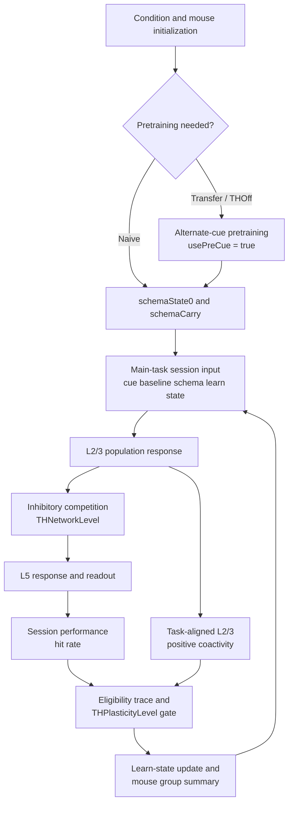

# TH 抑制性神经元模型架构与计算流程概述

## 1. 模型目的

这个脚本是一个最小化的 rate model，用来同时复现三类定性现象：

1. Transfer 组在首场学习时比 Naive 组有更高的起点。
2. TH 相关的抑制性竞争会塑造响应异质性。
3. 更高的 L2/3 响应异质性会对应更快的后续学习。

对应实现文件为 THInhibitoryHeterogeneitySimulation.m。

## 2. 总体架构

模型包含三类神经元群体、三类内部状态，以及一组决定预训练与主任务如何衔接的阶段控制量：

### 神经元群体

1. L2/3 兴奋性群体
2. L5 兴奋性群体
3. 抑制性中间神经元群体

### 内部状态

1. schema state：表示在另一条 cue 上预训练后形成、并可在主任务中部分复用的抽象结构状态
2. learn state：表示随 session 逐步累积的学习状态
3. eligibility trace：表示任务相关活动留下、并可被 TH 门控兑现的短时可塑性痕迹

### 条件与阶段控制

1. THNetworkLevel：控制 TH 对抑制群体竞争和 L5 结构化模式表达的影响
2. THPlasticityLevel：控制 TH 对 eligibility trace 兑现为学习更新的门控强度
3. usePreCue 与 SchemaReuseFraction：控制当前是预训练阶段还是主任务阶段，以及预训练形成的 schema 有多少被带入主任务

下文中的 TH 均指以后部丘脑 PO 为中心的 thalamocortical drive，而不是多巴胺或酪氨酸羟化酶信号。

整体上，这不是一个生物细节完备模型，而是一个机制型、可解释的低维生成模型。

## 3. 变量总表：尺寸、生物学意义与可变性

为避免信息分散，下面把这份模型中最重要的量集中写在同一章里。每个小节先按可变性分类，再在表内给出：

1. 尺寸
2. 维度含义
3. 生物学意义

这里的可变性只用四种标签：

1. 全局固定：所有鼠、所有条件、所有 session 共用
2. 条件固定：同组内所有鼠相同，组间不同
3. 鼠内固定、鼠间可变：每只鼠初始化一次后固定，但不同鼠不同
4. 同鼠随训练改变：同一只鼠会随 session 推进而更新

### 3.1 全局固定值（Params）

这些量都来自 `Params = iDefaultParams()`。

| 变量 | 尺寸 | 维度含义 | 生物学意义 |
|---|---|---|---|
| NumMice, NumSessions, NumTrials | 标量 `1 × 1` | 单个计数值 | 群体规模、学习时长和每个 session 的 trial 数 |
| NE23, NE5, NI | 标量 `1 × 1` | 单个计数值 | L2/3 兴奋性、L5 兴奋性和抑制性单元数 |
| ResponseScale, Ceiling | 标量 `1 × 1` | 单个增益或上界 | 有界神经响应幅值与统计满分阈值 |
| Noise23, Noise5, NoiseI | 标量 `1 × 1` | 单个噪声强度 | L2/3、L5 与抑制群体的 trial-to-trial 波动幅度 |
| Comp23, Comp5 | 标量 `1 × 1` | 单个竞争强度 | 抑制性竞争对 L2/3 和 L5 的压制强度 |
| PretrainCueGain, CueTo23, BaseTo23, LearnTo23, SchemaTo23 | 标量 `1 × 1` | 单个输入增益 | 预训练线索增益，以及 L2/3 中线索、基线、学习态和 schema 对活动的权重 |
| Coupling23To5, CueTo5, BaseTo5, LearnTo5, SchemaTo5 | 标量 `1 × 1` | 单个输入增益 | L5 中跨层输入、线索、基线、学习态和 schema 对活动的权重 |
| THPatternTo5, BaselineTHFraction | 标量 `1 × 1` | 单个调制强度 | 后部丘脑相关结构化模式对 L5 的作用及其在 baseline 条件下的残余比例 |
| BaseLearnRate, LearnNoise, MaxLearnState, InitialLearnState, SchemaReuseFraction | 标量 `1 × 1` | 单个学习动力学参数 | learn state / schema state 的更新速度、噪声、上限、初值以及主任务中带入的 schema 比例 |
| ReadoutGain, HitThreshold, BaselinePenalty | 标量 `1 × 1` | 单个行为读出参数 | 从 cue-baseline 判别变量映射到命中概率的阈值和增益 |
| LearnFromCoactivity23, CoactivityThreshold23, SchemaThresholdShift, EligibilityDecay, MaxEligibilityTrace, MaxPretrainSessions | 标量 `1 × 1` | 单个可塑性参数 | L2/3 任务相关正向共激活如何产生 eligibility increment、schema 如何降低主任务可塑阈值，以及预训练允许迭代的最大 session 数 |

### 3.2 条件固定值（Cond）

这些量都来自 `Cond = iConditionTable()`。

| 字段 | 尺寸 | 维度含义 | 生物学意义 |
|---|---|---|---|
| Name | 向量 `3 × 1` string | 行 = 条件 | 条件内部名称：Naive、Transfer、THOff |
| Label | 向量 `3 × 1` string | 行 = 条件 | 画图和展示用标签 |
| Color | 矩阵 `3 × 3` | 行 = 条件，列 = RGB | 每个条件的画图颜色 |
| THNetworkLevel | 向量 `3 × 1` | 行 = 条件 | 条件级在线网络表达强度 |
| THPlasticityLevel | 向量 `3 × 1` | 行 = 条件 | 条件级塑性门控强度 |

是否进入预训练不是 `Cond` 表中的字段，而是在 `iRunCohortModel` 里按条件名分支决定：Naive 不预训练，Transfer 和 THOff 会先运行一次预训练过程，再把形成的 `schemaState0` 带入主任务。

### 3.3 单鼠固定属性（Mouse）

这些量都来自 `Mouse = iDrawMouse(Params)`。每只鼠初始化一次后保持固定，但不同鼠不同。这里的固定并不等同于声称真实脑内突触在整个学习过程中完全不变，而是把单鼠相对稳定的结构约束、有效 connectivity motif 和读出轴取向压缩为一次初始化的潜在变量。

| 字段 | 尺寸 | 维度含义 | 生物学意义 |
|---|---|---|---|
| HeteroGain | 标量 `1 × 1` | 单个鼠参数 | 整只鼠的异质性增益 |
| Cue23 | 向量 `NE23 × 1` | 行 = L2/3 兴奋性细胞 | L2/3 线索相关模式 |
| Learn23 | 向量 `NE23 × 1` | 行 = L2/3 兴奋性细胞 | L2/3 学习相关模式 |
| PreCue23 | 向量 `NE23 × 1` | 行 = L2/3 兴奋性细胞 | 预训练阶段使用的 L2/3 替代 cue 模式 |
| Base23 | 向量 `NE23 × 1` | 行 = L2/3 兴奋性细胞 | L2/3 基线模式 |
| WIE | 矩阵 `NI × NE23` | 行 = 抑制性细胞，列 = L2/3 兴奋性细胞 | L2/3 到抑制群体的固定结构约束 / 有效连接权重 |
| WEI23 | 矩阵 `NE23 × NI` | 行 = L2/3 兴奋性细胞，列 = 抑制性细胞 | 抑制群体到 L2/3 的固定结构约束 / 有效连接权重 |
| WEI5 | 矩阵 `NE5 × NI` | 行 = L5 兴奋性细胞，列 = 抑制性细胞 | 抑制群体到 L5 的固定结构约束 / 有效连接权重 |
| W523 | 矩阵 `NE5 × NE23` | 行 = L5 兴奋性细胞，列 = L2/3 兴奋性细胞 | L2/3 到 L5 的固定跨层结构约束 / 有效耦合权重 |
| Cue5 | 向量 `NE5 × 1` | 行 = L5 兴奋性细胞 | L5 线索相关模式 |
| Learn5 | 向量 `NE5 × 1` | 行 = L5 兴奋性细胞 | L5 学习相关模式 |
| PreCue5 | 向量 `NE5 × 1` | 行 = L5 兴奋性细胞 | 预训练阶段使用的 L5 替代 cue 模式 |
| Base5 | 向量 `NE5 × 1` | 行 = L5 兴奋性细胞 | L5 基线模式 |
| THToI | 向量 `NI × 1` | 行 = 抑制性细胞 | 后部丘脑到抑制群体的驱动强度 |
| THL5Pattern | 向量 `NE5 × 1` | 行 = L5 兴奋性细胞 | TH 通过抑制网络在 L5 形成的结构化模式 |
| PreReadout | 向量 `NE5 × 1` | 行 = L5 兴奋性细胞 | 预训练阶段行为读出的深层轴 |
| Readout | 向量 `NE5 × 1` | 行 = L5 兴奋性细胞 | L5 到行为输出的读出权重 |

### 3.4 单鼠动态状态与过程量

这些量在 `iSimulateMouse` 和 `iSimulateSession` 中产生；其中一部分是真正的动态状态，另一部分是同鼠训练过程中逐步产生的过程输出。当前模型把学习过程主要压缩在这一节，而不是写成逐 session 改写 `WIE`、`WEI23`、`WEI5`、`W523` 或 `Readout` 的逐突触更新。

| 变量 | 尺寸 | 维度含义 | 生物学意义 |
|---|---|---|---|
| schemaState0 | 标量 `1 × 1` | 单个慢变量 | 预训练结束时形成的 schema 强度 |
| schemaCarry | 标量 `1 × 1` | 单个慢变量 | 主任务中实际带入并固定使用的 schema 强度 |
| learnState | 标量 `1 × 1` | 单个慢变量 | 该鼠当前时刻的可用学习状态，等价于已形成表征在当前 session 中能被招募和表达的强度 |
| eligibilityTrace | 标量 `1 × 1` | 单个慢变量 | 该鼠当前时刻的短时可塑性痕迹，表示本 session 的任务相关活动为后续更新留下了多少可兑现的学习资格 |
| usePreCue | 逻辑标量 `1 × 1` | 单个阶段开关 | 决定当前调用 `iSimulateSession` 时使用预训练 cue/readout 还是主任务 cue/readout |
| cue23Pattern, cue5Pattern, readoutVector | 向量 `NE23 × 1`、`NE5 × 1`、`NE5 × 1` | 行 = 对应层细胞 | 当前阶段实际被启用的 cue 模式与行为读出轴 |
| cue23Drive, base23Drive | 向量 `NE23 × 1` | 行 = L2/3 兴奋性细胞 | 单个 session 中 L2/3 的 cue/base 驱动 |
| pre23Cue, pre23Base, exc23Cue, exc23Base, r23Cue, r23Base | 矩阵 `NE23 × NumTrials` | 行 = L2/3 兴奋性细胞，列 = trial | L2/3 在单个 session 中从预激活到响应的 trial 级过程量 |
| inhCue, inhBase | 矩阵 `NI × NumTrials` | 行 = 抑制性细胞，列 = trial | 单个 session 中抑制群体活动 |
| thPatternCue, thPatternBase, pre5Cue, pre5Base, r5Cue, r5Base | 矩阵 `NE5 × NumTrials` | 行 = L5 兴奋性细胞，列 = trial | L5 在单个 session 中从预激活到响应的 trial 级过程量 |
| readoutCue, readoutBase, decision, pHit | 行向量 `1 × NumTrials` | 列 = trial | 单个 session 中的行为判别与命中概率 |
| perf | 行向量 `1 × NumSessions`；单 session 内部为标量 | 列 = session | 每个 session 的命中率时间程 |
| perfExpected | 标量 `1 × 1` | 单个 session 指标 | 由 `pHit` 直接平均得到的期望表现，用于预训练阶段的 reward-like signal 和停止条件 |
| h23, h5 | 行向量 `1 × NumSessions` | 列 = session | 每个 session 的累计 L2/3 / L5 异质性时间程 |
| sessionCoactivity23 | 标量 `1 × 1` | 单个 session 指标 | 当前 session 中 `cellMean23` 与 `Learn23` 任务轴的正向共激活强度 |
| sessionMean23 | 矩阵 `NE23 × NumSessions` | 行 = L2/3 兴奋性细胞，列 = session | 各 session 的 L2/3 细胞平均响应 |
| sessionMean5 | 矩阵 `NE5 × NumSessions` | 行 = L5 兴奋性细胞，列 = session | 各 session 的 L5 细胞平均响应 |
| finalMean23, finalMean5 | 向量 `NE23 × 1` / `NE5 × 1` | 行 = 对应层细胞 | 增长段跨 session 平均后的细胞响应 |
| fitX, fitY, dh | 列向量 `Nuse × 1`、`Nuse × 1`、`(Nuse-1) × 1` | 行 = 纳入增长段统计的 session 或相邻 session 对 | 用于单鼠 slope 和 DeltaHit 统计的中间量 |
| Performance, H23, H5 | 行向量 `1 × NumSessions` | 列 = session | `MouseResult` 中保存的单鼠时间程输出 |
| Slope, MeanDeltaHit, MeanH23, MeanH5 | 标量 `1 × 1` | 单鼠统计量 | `MouseResult` 中保存的单鼠摘要指标 |
| ProcessMeanL5 | 向量 `NE5 × 1` | 行 = L5 兴奋性细胞 | `MouseResult` 中保存的增长段平均 L5 响应 |

### 3.5 参数族的神经科学依据

第 3 章前四节回答“变量是什么、尺寸多大、谁在变”，这一节补充“为什么这些变量在生物学上是合理的”。这里强调的是参数族的神经科学角色，而不是声称某个数值已经被单篇实验精确测得。

| 参数族 | 对应变量 | 神经科学依据 | 代表参考 |
|---|---|---|---|
| 低维有界群体响应 | `NE23`、`NE5`、`NI`、`ResponseScale`、`Ceiling` | 用少量群体单元与有界 rate 近似皮层群体活动，是 reduced population model 的常见做法 | Perich et al., 2018；Gallego et al., 2020 |
| 鼠间差异与 trial-to-trial 波动 | `HeteroGain`、`Noise23`、`Noise5`、`NoiseI` | 皮层群体活动同时存在跨动物差异和显著试次波动，模型把它们压缩为少数随机参数 | Cohen and Kohn, 2011 |
| 抑制性竞争与归一化 | `Comp23`、`Comp5`、`WIE`、`WEI23`、`WEI5` | 抑制回路不仅降低总活动，还塑造竞争、选择性和归一化 | Isaacson and Scanziani, 2011；Carandini and Heeger, 2012 |
| 预训练 schema 与抽象结构复用 | `PreCue23`、`PreCue5`、`PreReadout`、`SchemaTo23`、`SchemaTo5`、`SchemaReuseFraction`、`PretrainCueGain`、`SchemaThresholdShift` | 迁移优势来自另一条 cue 上形成的抽象结构在新任务中的部分复用，而不是条件级常数偏置 | Bernardi et al., 2020；Wakhloo et al., 2026 |
| 慢性学习状态累积 | `Learn23`、`Learn5`、`learnState`、`BaseLearnRate`、`MaxLearnState` | 学习被压缩为跨 session 累积的低维状态，用来表达在既有 manifold 上继续优化 | Perich et al., 2018；Gallego et al., 2020 |
| 后部丘脑的在线网络表达 | `THToI`、`THL5Pattern`、`THPatternTo5`、`THNetworkLevel`、`BaselineTHFraction` | 后部丘脑不仅提供加性驱动，还会偏置皮层状态并塑造深层输出结构 | Guo et al., 2017；Sauerbrei et al., 2020 |
| eligibility trace 与塑性门控 | `eligibilityTrace`、`LearnFromCoactivity23`、`CoactivityThreshold23`、`EligibilityDecay`、`MaxEligibilityTrace`、`THPlasticityLevel` | 三因子学习规则允许任务相关共激活留下局部痕迹，并在延迟门控下兑现为慢性学习更新 | Gerstner et al., 2018 |
| cue-baseline 行为读出 | `Readout`、`ReadoutGain`、`HitThreshold`、`BaselinePenalty` | 行为表现由任务相关群体可分性决定，而不是由绝对活动幅值单独决定 | Perich et al., 2018；Gallego et al., 2020 |

## 4. 计算层次

脚本按五层嵌套运行：

1. 条件层：Naive、Transfer、TH inhibited
2. 个体层：每个条件下模拟多只鼠
3. 预训练层：Transfer 和 TH inhibited 先在替代 cue 上形成 schema state
4. 主任务 Session 层：每只鼠跨多个 session 学习
5. Trial 层：每个 session 内模拟多次 trial 响应并生成 hit rate

可以概括成：

```text
Condition
  -> Mouse initialization
    -> Optional schema pretraining
      -> schemaState0
    -> Main-task session
      -> Trial population response
        -> Performance / heterogeneity
      -> update eligibility trace / learn state
  -> aggregate per-mouse metrics
-> group summary and figure export
```

### Mermaid 概述图



## 5. 单鼠初始化

每只鼠先随机生成一组固定的个体特征，用来制造鼠间差异和细胞群体差异。

各字段的尺寸、生物学意义与可变性已集中列在第 3 章，这里只说明这些属性之间的结构关系。

这里最容易误解的一点是：`WIE`、`WEI23`、`WEI5`、`W523` 和 `Readout` 在模型里是“每只鼠先验拥有的回路骨架与读出轴”，不是学习过程中逐 session 被直接改写的显式可塑突触。

其中最关键的设计是：

1. `Learn23` 和 `Learn5` 定义的是可被预训练和主任务共同招募的潜在学习轴
2. `PreCue23`、`PreCue5` 和 `PreReadout` 与学习轴强对齐，使替代 cue 预训练能够形成可转移的 schema，而不是直接硬编码主任务表现
3. `Readout` 同时混合 cue 轴和 learn 轴，因此主任务仍需要新的 cue-base 判别过程
4. TH 不仅仅提供一个统一偏置，还会通过 `THL5Pattern` 在 L5 中形成结构化影响
5. 鼠间差异主要通过 `HeteroGain` 放大到多个子模块

## 6. 单个 session 的响应生成

`iSimulateSession` 实际有两种模式：`usePreCue = true` 时用于替代 cue 预训练，`usePreCue = false` 时用于主任务。两种模式共享同一套回路，只是输入模式、读出轴和 cue 增益不同。

每个 session 的计算分四步：

### 第零步：选择当前阶段实际使用的 cue 轴与读出轴

1. 预训练阶段使用 `PreCue23`、`PreCue5` 和 `PreReadout`
2. 主任务阶段使用 `Cue23`、`Cue5` 和 `Readout`
3. 预训练阶段的 cue 增益额外乘上 `PretrainCueGain`，以保证 schema 可以在有限 session 内形成

### 第一步：生成 L2/3 活动

L2/3 的 cue 预激活由三项组成：

1. 当前阶段的 cue 模式乘以对应 cue 增益
2. 当前学习状态乘以 `Learn23`
3. 当前 schema 状态乘以 `Learn23`

baseline 分支则只保留基础驱动和噪声。随后先取正值得到 excitatory drive，再送入抑制群体。

### 第二步：生成抑制群体活动

抑制群体输入包括：

1. 来自 L2/3 兴奋输入的汇总驱动
2. THNetworkLevel 调制下的 THToI 输入
3. 抑制群体自身噪声

这一步代表的是 TH 影响抑制性网络竞争强度，而不是直接给行为加一个常数项。

### 第三步：生成 L5 活动

L5 的预激活分为 cue 和 baseline 两类条件分别计算。cue 条件下主要由以下几项共同决定：

1. L2/3 到 L5 的跨层输入
2. 当前阶段的 cue 模式 `Cue5` 或 `PreCue5`
3. 当前学习状态乘以 `Learn5`
4. 当前 schema 状态乘以 `Learn5`
5. THNetworkLevel 调制下的 THL5Pattern
6. trial-by-trial 噪声

baseline 条件下只保留较弱的基础驱动、较弱的 TH 结构项和噪声。两类条件都再减去来自抑制群体的竞争项，并经过 tanh 压缩得到最终 L5 响应。

这个结构的意图是：

1. Transfer 与 TH inhibited 的首场优势来自预训练形成的 `schemaCarry`，而不是条件级常数 bias
2. 预训练轴和主任务学习轴强对齐但不完全相同，因此 transfer 有利于起步，却不会把主任务变成已解问题
3. TH 对网络在线表达的影响主要通过抑制竞争和深层模式塑形体现
4. L5 异质性可以随着 TH 抑制而下降
5. TH inhibited 组可以保留大部分 transfer 优势，但后续学习兑现仍会因为 TH 塑性门控降低而受限

## 7. 从群体响应到行为输出

行为输出不是直接由 L2/3 决定，而是通过 L5 的 cue-baseline 判别读出实现：

1. 分别计算 cue trial 和 baseline trial 的 L5 群体读出
2. 用 cue 读出去减 baseline 读出，得到判别变量
3. 通过 logistic 函数映射成每个 trial 的命中概率
4. 对所有 trial 取平均得到该 session 的 performance

因此，模型中的行为改进有两个来源：

1. 首场由 `schemaCarry` 带来的更好 cue-baseline 可分性
2. 随学习状态增长而提升的 cue-baseline 群体分离性

## 8. 响应异质性的定义

响应异质性在当前版本里是一个并行读出量，不直接进入学习更新方程；它最终表现为与学习速度相关的涌现结果。每个 session 都会更新一次“截至当前增长段的累计异质性”，但最终用于相关性的不是单 session 值，而是增长段整体平均后的细胞间异质性。

计算方式是：

1. 对每个 session，先分别计算每个细胞在 cue 和 baseline 下的 session mean
2. 用 cue 减 baseline，得到该 session 的细胞调制量
3. 找到学习过程中首个达到 100% 的会话，并排除该会话及其之后的所有会话
4. 对剩余增长段内的细胞调制量按细胞跨会话求平均
5. 只保留落在 [-1, 1] 范围内的细胞均值
6. 对这些细胞均值计算标准差

这相当于用增长段整段平均后的任务相关细胞离散程度，来表示响应异质性，而不是单回合或单 session 的离散程度。

## 9. 学习更新规则

模型中有两段慢变量更新：预训练阶段更新 `schemaState0`，主任务阶段更新 `learnState`。

### 预训练阶段：形成 schema state

Transfer 和 TH inhibited 的每只鼠都会先运行 `iPretrainMouse`。这一步里：

1. `usePreCue = true`，TH 相关参数固定为完整水平
2. `LearnState` 固定在 `InitialLearnState`
3. `cellMean23` 与 `Learn23` 的正向共激活产生 `learnEligibility`
4. `eligibilityTrace` 继续按同一时间常数积累
5. reward-like signal 使用 `perfExpected`
6. `schemaState0` 在 ceiling 前持续增长，直到观察到的表现或期望表现达到上限

### 主任务阶段：继续学习

主任务开始前，脚本先把预训练得到的 schema 压缩成一个固定带入量：`schemaCarry = SchemaReuseFraction * schemaState0`。随后每个 session 结束后，再根据当前表现和任务相关共激活更新 `learnState`。

学习更新被约束为一个可解释的三因子框架，并显式加入了文献中常见的 eligibility trace：

1. eligibility increment：`cellMean23` 与 `Learn23` 任务轴的正向共激活超过阈值后的有效部分
2. eligibility trace：上一 session 留下并按固定时间常数衰减的可塑性痕迹
3. modulatory gate：THPlasticityLevel 提供的塑性门控
4. reward-like signal：当前行为成功率提供的强化信号

其中，schema 不作为独立常数 boost 加到学习驱动里，而是通过两种方式影响学习：

1. 在表征层改善 cue 相关群体模式
2. 以 metaplasticity-like 方式下调任务相关共激活进入可塑状态所需的 eligibility 阈值

于是主任务中每个 session 结束后的学习更新是：先由该 session 当下的 L2/3 任务相关正向共激活产生 eligibility increment，再与上一时刻遗留的 eligibility trace 相加并衰减；与此同时，`schemaCarry` 会通过 `SchemaThresholdShift` 降低 eligibility threshold；最后由 TH gate 和 reward-like signal 将这段 trace 兑现成 `learnState` 的增加。

因此，这个模型里“学习时发生变化的东西”主要不是连接矩阵本身，而是三类低维状态：

1. `schemaState0`：记录替代 cue 预训练到底积累出了多少可复用结构
2. `eligibilityTrace`：记录最近 session 留下了多少尚未兑现的可塑性资格
3. `learnState`：决定预先存在的 `Learn23` 和 `Learn5` 模式在后续 session 中能被表达多强

换句话说，模型把真实脑内可能分散在突触权重、内在兴奋性、细胞集合招募概率和下游读出稳定化中的多种慢变化，压缩成一个 session 级的有效表达变量，而不是试图显式模拟每条连接怎样改写。

响应异质性没有被直接写进更新方程；它之所以仍会与学习速度相关，是因为更强、更选择性的任务相关共激活，通常既会留下更大的 eligibility trace，也会在增长段平均后表现为更高的细胞间离散度。

模型把 TH 相关作用显式拆成两条通道：

1. THNetworkLevel：决定当前 session 中抑制竞争和 L5 结构化模式能表达多少
2. THPlasticityLevel：决定当前 session 产生的 eligibility trace 有多少能被兑现成下一步学习

这样做的动机是表达一个与当前数据一致、也与 thalamocortical 状态门控文献一致的现象：急性后部丘脑抑制更容易削弱后续学习增益，而不一定完全抹掉已经形成的 schema 表达。这里的 THPlasticityLevel 不是声称后部丘脑直接等同于突触可塑性分子开关，而是把“后部丘脑对任务状态维持、上下文选择和后续学习更新的必要性”压缩成一个可计算门控量。

最终学习更新满足几个直觉：

1. 任务相关正向共激活越强，累计出的 eligibility trace 越大，后续学习越容易推进
2. 预训练形成的 schema 越强，主任务越容易越过可塑性阈值并获得更好的首场表达
3. TH 越完整，已有 eligibility trace 越容易被兑现成学习更新
4. TH 被抑制后，首场表现不一定完全消失，但后续学习增益会明显变弱
5. 响应异质性是与学习速度相关的并行读出，而不是被模型直接指定成学习驱动量

## 10. 单鼠统计量

每只鼠最终输出四个核心指标：

1. Slope：排除达到 100% 的会话及之后，只用剩余增长段 performance 拟合得到的学习斜率
2. MeanDeltaHit：相邻 session performance 差值的平均
3. MeanH23：增长段整段平均后的 L2/3 细胞间异质性
4. MeanH5：增长段整段平均后的 L5 细胞间异质性

如果某只鼠在第 1 个会话就达到 100%，则该鼠被排除出 slope-heterogeneity 相关性统计。

## 11. 群体聚合与图形输出

脚本在所有条件和所有鼠完成后，会聚合出：

1. 各条件的学习曲线
2. 各条件的累计 L2/3 异质性时间程
3. L2/3 异质性与学习斜率的相关关系
4. 各条件的 L5 异质性条带散点图
5. 各条件的学习斜率条带散点图
6. Transfer 与 TH inhibited 的代表性 process-mean L5 响应分布对比

此外还会：

1. 在所有条件中、对有限 slope 的单鼠计算 L2/3 heterogeneity 与 slope 的 Spearman 相关
2. 在所有条件中、对有限 slope 的单鼠计算 L5 heterogeneity 与 slope 的 Spearman 相关
3. 把结果保存到 base workspace 中的 THInhibitoryHeterogeneityModel
4. 把 SVG 图导出到当月网络目录

## 12. 这套模型当前表达的机制解释

用一句话概括，这个模型表达的是：

Transfer 给系统的不是硬编码的起始偏置，而是另一条 cue 预训练后留下的 schema state；TH 通过抑制性网络和深层模式塑形维持任务相关群体共激活与响应异质性，而更强的 L2/3 任务相关共激活会给后续学习提供更强的更新驱动。

因此，这个模型给出的机制解释是：

1. Transfer 会抬高首场表现
2. TH inhibited 不会完全抹掉迁移优势，因为 schema 的表达主要依赖已形成的结构状态，而不是完全依赖当下的 TH 塑性门控
3. TH inhibited 会削弱后续学习，因为 THPlasticityLevel 更低，eligibility trace 更难兑现成 learn state 增加
4. TH inhibited 会降低 L5 异质性，因为 THNetworkLevel 下降后，抑制竞争和 TH 相关深层结构化模式都变弱
5. 行为表现来自 cue 与 baseline 的可分性，而不是单侧正活动的绝对值

从建模原则上，这个模型避免加入缺乏可解释性的条件额外 boost。保留在学习规则中的因子，均对应到可解释的神经科学概念：替代 cue 预训练形成的 schema、任务相关正向共激活产生的 eligibility increment、带衰减的 eligibility trace、TH 的网络表达通道、TH 的塑性门控通道、成功强化，以及 schema 导致的 metaplastic threshold shift。

## 13. 局限

这仍然是一个概念验证模型，不应直接等同于真实生理回路。

当前简化主要包括：

1. 没有显式建模具体突触可塑性规则
2. 没有把感觉输入、决策变量和动作输出拆成独立模块
3. TH 的作用虽然已拆成网络表达和塑性门控两条通道，但仍然是低维参数化，而不是完整的递质动力学模型
4. 预训练过程被压缩为同一条替代 cue 上重复运行到 ceiling，而没有显式模拟任务集合切换与上下文泛化过程
5. 学习驱动被压缩为任务相关正向共激活，而不是显式的逐突触 Hebbian 更新
6. 响应异质性是从生成响应中读出的统计量，而不是单独被优化的状态变量

但它的优势是结构清晰、可调、可直接对接现在的 Figure 3 现象解释。

## 14. 参考文献

1. Isaacson JS, Scanziani M. How inhibition shapes cortical activity. Neuron 72, 231-243 (2011).
2. Carandini M, Heeger DJ. Normalization as a canonical neural computation. Nature Reviews Neuroscience 13, 51-62 (2012).
3. Cohen MR, Kohn A. Measuring and interpreting neuronal correlations. Nature Neuroscience 14, 811-819 (2011).
4. Gerstner W et al. Eligibility traces and plasticity on behavioral time scales: experimental support of neoHebbian three-factor learning rules. Trends in Neurosciences 41, 878-892 (2018).
5. Guo ZV et al. Maintenance of persistent activity in a frontal thalamocortical loop. Nature 545, 181-186 (2017).
6. Sauerbrei BA et al. Cortical pattern generation during dexterous movement is input-driven by motor thalamus. Nature 577, 386-391 (2020).
7. Perich MG, Gallego JA, Miller LE. A neural population mechanism for rapid learning. Neuron 100, 964-976 (2018).
8. Gallego JA et al. Long-term stability of cortical population dynamics underlying consistent behavior. Nature Neuroscience 23, 260-270 (2020).
9. Bernardi S et al. The geometry of abstraction in hippocampus and prefrontal cortex. Cell 183, 954-967 (2020).
10. Wakhloo AJ, Slatton W, Chung S. Neural population geometry and optimal coding of tasks with shared latent structure. Nature Neuroscience (2026).