连续学习的神经机制研究

Study on the neural mechanisms of continual learning
# 中文摘要
在自然环境中，动物需要不断利用既有经验应对新的任务和情境。已有行为学研究表明，既往经验可促进后续学习——即使新旧任务的感觉线索来自不同模态。然而，这种跨模态的快速连续学习在大脑皮层中如何实现仍不清楚。

行为学观测表明，连续学习的优势建立在两个方面：一是显著提高了动物对新任务的早期行为表现，二是显著加快了对新任务的学习速率。

利用在体双光子钙成像技术和化学遗传学的干预手段，本研究对这两种行为学优势的神经机制分别进行了探讨。针对早期表现的提高，研究发现新任务的线索刺激优先重新激活了旧任务中的记忆印迹细胞；而抑制这些旧任务中活跃的细胞，或延长新旧任务的时间间隔以降低重激活比例，均会显著削弱新任务早期的行为表现。这表明，连续学习中被重激活的皮层神经元通过稳定皮层响应，支持了新任务的早期表现。

针对后续学习速率的加快，研究发现连续学习中小鼠的运动皮层神经元保持了由旧任务塑造的、较高分化状态的活动特征。分析表明，这种响应的分化有利于旧任务信息在新任务中的复用与重组。对不同脑区的抑制实验发现，丘脑的活动强度维持了连续学习过程中运动皮层神经元的响应分化特征；抑制丘脑活动会降低皮层群体响应分化程度，并显著减慢新任务的学习进程。最后，本研究通过构建稀疏循环神经网络连续学习模型进行数值模拟，发现连续学习加强了兴奋性与抑制性突触的差异，导致神经元响应异质性增加。该模型从机制上提出了连续学习加速新任务学习的可能性，验证了细胞群体的异质性响应能有效提高学习信号的信噪比，从而加快参数更新；并阐释了丘脑输入减弱对学习速率的负面影响。

关键词：连续学习，细胞重激活，皮层响应分化，丘脑调控，初级运动皮层

---

# Abstract
In natural environments, animals must continually leverage prior experience to cope with novel tasks and contexts. Behavioral studies have shown that prior experience can facilitate subsequent learning—even when the sensory cues of the old and new tasks come from different modalities. However, how such rapid cross-modal continual learning is implemented in the cerebral cortex remains unclear.

Behavioral observations indicate that the advantage of continual learning is based on two aspects: first, it significantly improves the early behavioral performance of animals on the new task; second, it significantly accelerates the learning rate for the new task.

Utilizing in vivo two-photon calcium imaging and chemogenetic intervention, this study investigated the neural mechanisms underlying these two behavioral advantages respectively. Regarding the improvement in early performance, the study found that cue stimulation in the new task preferentially reactivated memory engram cells from the old task; inhibiting these prior-task-active cells, or prolonging the time interval between the old and new tasks to reduce the reactivation ratio, significantly impaired early behavioral performance on the new task. This demonstrates that reactivated cortical neurons in continual learning support early performance in the new task by stabilizing cortical responses.

Regarding the acceleration of the subsequent learning rate, the study discovered that motor cortical neurons in continual-learning mice maintained a highly differentiated activity state shaped by the old task. Analysis shows that this response differentiation facilitates the reuse and reorganization of prior task information in the new task. Inhibition experiments targeting different brain regions revealed that thalamic activity intensity maintains the response differentiation characteristics of motor cortical neurons during continual learning; suppressing thalamic activity reduces the degree of cortical population response differentiation and significantly slows the learning process of the new task. Finally, by constructing a sparse recurrent neural network continual learning model for numerical simulation, this study found that continual learning strengthens the difference between excitatory and inhibitory synapses, leading to increased neuronal response heterogeneity. This model mechanistically proposes the possibility of continual learning accelerating novel task acquisition, verifies that heterogeneous cellular responses effectively improve the signal-to-noise ratio of learning signals, thereby accelerating parameter updates, and elucidates the negative impact of reduced thalamic input on the learning rate.

Keywords: continual learning, cellular reactivation, cortical response differentiation, thalamic modulation, primary motor cortex

# 第1章 绪论
为了学习掌握一项新的知识技能，不同的动物个体可能经历不同的学习过程，采用不同的学习策略，得到不同的学习结果：总有些个体会比其他个体学得更快。这种差异并非全然是天赋性的，而是部分来源于个体的既往经验。例如，以前学习过相似任务的个体，往往会比毫无相关经验的个体更快掌握新任务。然而，这种基于既往经验的连续学习究竟是如何实质性地加快了新任务的学习记忆进程的，其背后的神经机制尚未被清晰揭示。虽然一类经典的观察发现，新任务能部分地激活在旧任务中活跃的神经元集群（Josselyn & Tonegawa, 2020），但这仅仅提示了新旧经验之间存在物理遗迹的关联；并且，旧任务的记忆有时反而会对新任务造成干扰、导致学习减慢（Bouton, 1993）。因此，要真正理解连续学习的优势，核心在于探明既往经验究竟改变了大脑的何种网络动态，从而在面临新任务时实现了更为快速、高效的学习。

本文聚焦于跨模态的连续学习过程。通过对比有旧经验与无旧经验的小鼠，本研究旨在明确连续学习究竟改变了哪些具体的皮层神经网络特征，并深入探究这些神经特征是如何直接加速了新任务的学习与记忆进程的。
## 1.1 连续学习的行为学研究基础
为了理解连续学习中既往经验如何影响新任务的习得，首先需要明确记忆形成、存储与调用的基本规律。学习是生物体获取新知识与经验的过程，而记忆则是学习结果的神经体现，是生物体过去经验的综合（Squire, 2004）。连续学习并不是单纯的“多学几项任务”，而是既往经验对后续学习过程产生系统影响的现象。对动物而言，先前任务可能提供可复用的线索选择、动作准备、奖赏预期或探索策略，使新任务在尚未充分训练时就具有更高的行为起点；也可能因为旧任务结构与新任务要求不一致而造成干扰。因此，连续学习的行为学研究首先需要回答两个问题：旧经验以什么形式影响新任务，以及这种影响究竟改变的是即时表现、后续学习速度，还是二者兼有。

自17世纪笛卡尔提出松果体是灵魂与肉体枢纽的“动物精气”假说以来，人类对记忆本质的探索便与认知科学的变革紧密交织（Squire, 2004）。这一假说虽被现代神经解剖学证伪，但首次将记忆赋予了物质基础。19世纪末，理查德·西蒙（Richard Semon）提出，记忆以物理化学印迹（engram）的形式存储于脑组织，回忆则是当前刺激与印迹共振的结果（Semon, 1921），为现代印迹理论提供了概念雏形。随后，赫尔曼·艾宾浩斯（Hermann Ebbinghaus）彻底革新了记忆研究的方法论。面对当时仍被哲学思辨主导的心理学领域，他设计出无意义音节（如“ZOF”）来消除语义干扰，首次以量化手段揭示记忆的客观规律，绘制了著名的遗忘曲线（forgetting curve），证明新学信息的保留量随时间呈指数衰减，且间隔重复能显著提升记忆巩固效率（Ebbinghaus, 1885）。这一工作标志着记忆研究从内省描述向实证测量的范式转型，开创了学习曲线的数学模型分析传统。

20世纪初，伊万·巴甫洛夫（Ivan Pavlov）在狗的消化生理学研究中偶然发现，中性刺激（如节拍器声音）通过与非条件刺激（食物）的时间关联，可诱发唾液分泌的条件反射（Pavlov, 1927）。这一经典条件反射不仅为事件关联行为提供了生理学基础，其“瞬时性联系”概念更预示了唐纳德·赫布（Donald Hebb）的连接理论。而爱德华·桑代克（Edward Thorndike）通过“迷箱”实验提出了试错学习理论与效果律（Thorndike, 1898），确立了环境反馈及强化对记忆形成的塑造作用。随后，斯金纳（B. F. Skinner）对操作性条件反射进行了系统研究，揭示了强化程式对动物行为频率的调控规律（Skinner, 1938）。

在记忆的皮层定位争议中，拉什利（Karl Lashley）通过大鼠迷宫实验对记忆定位假说发起挑战，提出记忆在皮层中呈现分布式存储，其缺陷程度与皮层损伤面积而非特定位置相关（Lashley, 1950a）。直到20世纪中叶，怀尔德·潘菲尔德（Wilder Penfield）在癫痫手术中电刺激颞叶皮层引起患者情景记忆闪回，首次证明内侧颞叶（medial temporal lobe, MTL）存储着记忆碎片（Penfield & Perot, 1963）。此后，著名的H.M.病例由布伦达·米尔纳（Brenda Milner）进行长期跟踪，揭示了患者在切除双侧海马后出现严重的顺行性遗忘，却保留了术前的旧记忆与程序性记忆能力（如镜像描画），从而确立了多重记忆系统理论与记忆功能分离的概念（Annese et al., 2014）。

在当前记忆研究中，基于信息维持时间的分类将记忆划分为瞬时处理的感觉记忆、分钟级的工作记忆以及长期的长期记忆。长期记忆进一步分为两类：能够被意识提取与描述的外显陈述性记忆（包括情景记忆与语义记忆），以及内隐的、难以言传的程序性记忆（Squire, 2004）。

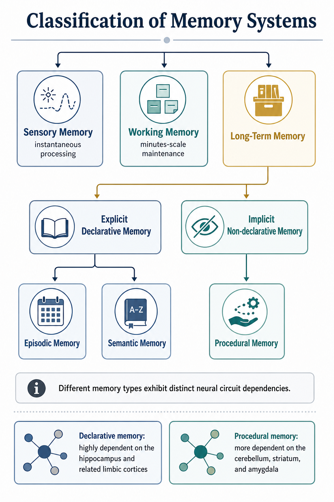

图1.1记忆的分类系统

Figure 1.1 Classification of memory systems

> 长期记忆通常被划分为外显的陈述性记忆与内隐的非陈述性（如程序性）记忆。不同类型的记忆在连续学习中表现出不同的神经回路依赖特性。

> Long-term memory is typically divided into explicit declarative memory and implicit non-declarative (e.g., procedural) memory. Different types of memory exhibit distinct neural circuit dependencies during continual learning.

陈述性记忆高度依赖于海马及其相关边缘皮层（Squire, 2004）；而程序性记忆则更多依赖于小脑、纹状体和杏仁核等脑区（Packard & McGaugh, 1996）。不同类型的记忆在连续学习中表现出不同的神经迁移特性，本研究所涉及的线索关联任务即属于陈述性记忆研究的重要范畴。

关联性学习是有机体通过经验在不同刺激、行为与结果之间建立联系的过程，对生物适应环境至关重要（Pearce & Hall, 1980）。从学习机制角度，关联性学习主要分为经典条件反射（中性刺激与非条件刺激配对引发条件反应）与操作性条件反射（行为后果改变该行为发生概率）。从学习目的和功能看，可进一步划分为基于奖励的学习（预测并获取正反馈）和基于惩罚的学习（避免负面结果），共同构成了生物复杂的学习行为体系（Mackintosh, 1975）。在连续学习的语境下，这些经典范式提供了不可或缺的量化分析框架，使得复杂经验的迁移与干扰能够被拆解为具体的刺激-反应联结（stimulus-response association, S-R）或刺激-刺激联结（stimulus-stimulus association, S-S）的动态演变。

在经典条件反射中，动物学习中性条件刺激（conditioned stimulus, CS）与具有生物学意义的非条件刺激（unconditioned stimulus, US）之间的预测关系。早期理论认为，只要CS和US在时间上足够接近地配对，关联就会自动形成（Pavlov, 1927）。然而，Leon Kamin 的“阻断效应”（Blocking effect）实验彻底颠覆了这一直觉：如果动物已经学会了CS1（如光）预测US（如电击），此时加入CS2（如声音）形成复合刺激（CS1+CS2）与US再次配对，动物将无法对CS2建立有效的条件反射（Kamin, 1969）。这一现象深刻表明，学习并非仅仅依赖于时间上的共现，而是依赖于“意外”（Surprise）——只有当US的出乎意料程度较高时，CS才能获得有效的联结权重。

基于阻断效应，Rescorla和Wagner提出了著名的Rescorla-Wagner模型（Rescorla-Wagner model, R-W model）（Rescorla & Wagner, 1972）。该模型用数学公式严格定义了学习的发生：ΔV = αβ(λ - ΣV)，其中ΔV是联结强度的变化量，λ是实际US带来的最大可能联结强度，ΣV是当前所有CS预测的总和，λ - ΣV即为预测误差（prediction error）。R-W模型成功解释了阻断、超条件反射（overexpectation）以及条件抑制等现象，将关联学习从单纯的联结主义推向了计算认知层面。随后，Sutton和Barto在强化学习领域引入了时间差分学习模型（temporal difference learning, TD）（Sutton & Barto, 1990），进一步将预测误差的概念扩展到连续时间的序列预测中。在TD模型中，预测误差不仅由实际奖赏触发，还可以由系统状态的内部价值转移触发。这种算法后来被证明与中脑多巴胺神经元的阶段性放电（phasic firing）高度吻合（Schultz et al., 1997），为关联性学习提供了坚实的生物计算基础。在连续学习中，旧任务经验实际上构建了一套成熟的预测基线（即较高的ΣV），当引入新任务时，旧经验导致的预测误差动态将直接决定新线索的学习速率与权重分配。

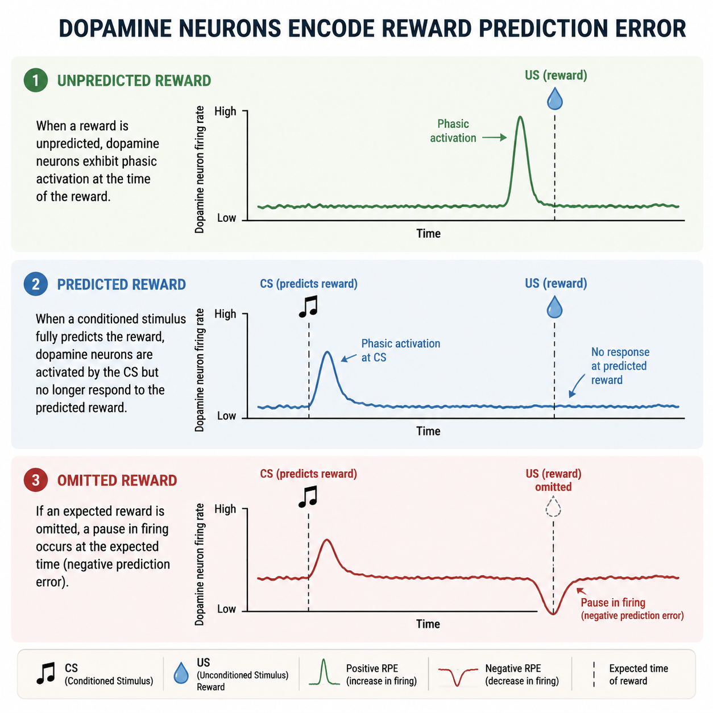

图1.2多巴胺神经元对奖励预测误差的编码

Figure 1.2 Dopamine neurons encode reward prediction error (RPE)

> 当奖赏（US）未被预测时，多巴胺神经元在奖赏时发生相位性激活；当条件刺激（CS）能够完全预测奖赏时，多巴胺神经元在CS时激活，而在预期奖赏到来时不再激活；若预期奖赏被取消，则在预期时刻出现放电暂停（负预测误差）。

> When a reward (US) is unpredicted, dopamine neurons exhibit phasic activation at the time of the reward; when a conditioned stimulus (CS) fully predicts the reward, dopamine neurons are activated by the CS but no longer respond to the predicted reward; if an expected reward is omitted, a pause in firing occurs at the expected time (negative prediction error).

根据条件刺激（CS）与非条件刺激（US）在时间上的相对关系，研究者通常将关联性学习细分为延迟学习（Delay conditioning）与痕迹学习（Trace conditioning）。在延迟学习范式中，CS和US在时间上紧密相连，US通常在CS结束前或刚结束时出现。动物无需依赖长时间的内部记忆痕迹，而是直接对CS-US的重叠配对做出反应（Albergaria et al., 2018）。由于这种学习高度依赖感觉刺激的物理重叠，其通常由较低级的感觉运动反射弧主导。例如，在小脑依赖的延迟眨眼条件反射实验中，浦肯野细胞通过调节平行纤维与浦肯野细胞间的突触可塑性对CS和US的时间关联进行直接编码（Albergaria et al., 2018）。相关研究进一步表明，眨眼条件反射中的误差信号具有可分级调节的性质，其强度和时序会显著改变学习表现（Rasmussen, 2020）。这构成了一个精确计算误差并驱动运动输出的闭环。然而，由于这种学习机制高度依赖感觉通路的直接物理重叠，其在跨模态连续学习中的迁移能力通常较弱。

相比之下，在痕迹学习（Trace conditioning）中，CS与US之间存在明确的无刺激时间间隔（Trace interval），动物必须在间隔期内维持CS的内部记忆痕迹，才能在US到来时建立有效的时空关联（Gilmartin & McEchron, 2005）。这一过程突破了简单感觉运动反射弧的限制，广泛招募了高级认知脑区，尤其是海马体的核心参与。早期的行为学病理研究发现，背侧海马的损伤会特异性地破坏长间隔（如20秒）的痕迹恐惧记忆，而对3秒及更短间隔的痕迹或延迟范式无显著影响（Chowdhury et al., 2005）。进一步的研究表明，海马损伤甚至会导致750ms（Kim et al., 1995）或500ms（Moyer et al., 1990）的痕迹眨眼反射无法完成。

随着在体电生理与钙成像技术的发展，近期研究精确揭示了海马在跨越时间间隔中的具体作用：在痕迹恐惧条件反射中，海马角1区（cornu ammonis 1, CA1）神经元在CS结束后并未陷入静默，而是保持着显著的持续性活动（Persistent activity）直至US出现；这种持续活动不仅桥接了时间间隙，更是建立CS-US关联的必要条件（Bai et al., 2023）。此外，内侧前额叶皮层（medial prefrontal cortex, mPFC）在痕迹期间也表现出强烈的持续放电，被认为与工作记忆及注意力维持密切相关（Gilmartin & McEchron, 2005）。痕迹学习的分子基础通常依赖于N-甲基-D-天冬氨酸受体（N-methyl-D-aspartate, NMDA）介导的长时程增强（long-term potentiation, LTP），在学习过程中CS激活相关神经元使NMDA受体开放引起钙离子内流，进而导致AMPA受体（α-amino-3-hydroxy-5-methyl-4-isoxazolepropionic acid receptor, AMPA receptor）插入或功能增强；此外，脑源性神经营养因子（brain-derived neurotrophic factor, BDNF）等分子也积极参与调节神经元可塑性，促进记忆的长期存储（Johansen et al., 2011）。同时，海马内嗅皮层-齿状回（dentate gyrus, DG）-海马角3区（cornu ammonis 3, CA3）-海马角1区（cornu ammonis 1, CA1）的三突触环路、杏仁核及前额叶皮层构成了复杂的协同编码网络。正是由于痕迹学习强制大脑在没有外部刺激维持的情况下建立内部抽象的动作-时间框架，其形成的记忆印迹具有更高的维度和更强的灵活性，这为跨模态连续学习中高阶规则（如固定的等待延迟与奖赏预期）的有效迁移提供了至关重要的回路基础。

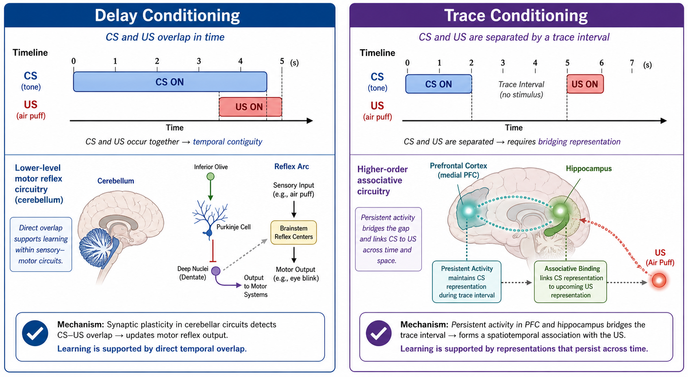

图1.3延迟学习与痕迹学习的行为范式对比

Figure 1.3 Behavioral paradigms of delay and trace conditioning

> 左侧展示延迟学习（Delay conditioning），CS与US在时间上重叠，通常由小脑等低级运动反射弧主导；右侧展示痕迹学习（Trace conditioning），CS与US之间存在明确的空白时间间隔（Trace interval），其时空关联的建立高度依赖海马与前额叶皮层的持续性活动。

> The left panel illustrates delay conditioning, where CS and US overlap in time, typically mediated by lower-level motor reflex arcs such as the cerebellum. The right panel illustrates trace conditioning, where a distinct stimulus-free trace interval separates the CS and US; the establishment of spatiotemporal associations highly depends on persistent activity in the hippocampus and prefrontal cortex.

由于关联性学习形式简单且具有广泛代表性，无论是复杂的声音奖赏学习还是环境防御反射，均能被抽象为该范式。本研究采用的头部固定小鼠听觉/视觉线索舔水范式，正是基于此类关联性学习框架。但本任务更确切地具有操作性条件反射（Operant conditioning）的成分，要求动物主动执行舔舐以获取奖赏。斯金纳在“斯金纳箱”中确立了强化程式的规律（Skinner, 1938），而在现代神经科学中，操作性条件反射被纳入了强化学习（reinforcement learning, RL）的框架进行解析（Niv, 2009）。

在计算层面上，操作性学习可以进一步拆解为“无模型”（Model-free）与“基于模型”（Model-based）两种学习策略（Daw et al., 2005）。无模型策略依赖于动作与结果的直接联结（如习惯性行为），计算成本低但缺乏灵活性，高度依赖背外侧纹状体及多巴胺信号（Yin & Knowlton, 2006）。基于模型的策略则需要动物在脑内构建关于环境的内部转移概率图（cognitive map），能够通过前向规划（forward planning）预见未曾直接体验的行为后果，主要依赖于前额叶皮层、海马以及背内侧纹状体（Dolan & Dayan, 2013）。

不仅如此，在操作性条件反射中，动物个体的动机水平与内环境稳态（如口渴程度）会对强化学习算法中的奖赏价值（Reward value）进行动态折现。例如，下丘脑弓状核等区域的神经元会实时监测血液渗透压并编码口渴信号，这些信号投射到中脑边缘多巴胺系统，直接放大水奖赏带来的预测误差（Sternson, 2013）。因此，任务的习得速度不仅取决于线索与奖赏的客观时空关联，还取决于动物的主观生理状态。

在连续学习中，这两种策略的动态博弈直接决定了行为的迁移效率。如果旧任务中形成了高度僵化的旧有习惯（无模型系统占主导），将对新任务习得产生强烈干扰；如果维持了基于模型的前瞻性表征框架，就能更快地更新转移概率图，实现规则的快速迁移。本研究中固定的时间窗和奖赏规则的复用，正是一个涉及状态监测、冲动抑制与动作决策的复合强化学习框架。理解这一框架下的误差计算与策略转移，是剖析跨模态连续学习神经基础的前提。

早期迁移理论以“相同要素”（Identical elements）为核心，认为旧任务对新任务的促进取决于两者在刺激、反应或刺激—反应联结上共享了多少成分（Thorndike & Woodworth, 1901）。在这一框架下，连续学习的优势首先表现为旧任务中已经稳定下来的有效反应倾向（例如朝着特定方向的运动准备或特定的肌肉收缩模式），能够在高度相似的新情境中被更快调用。然而，真实世界的连续学习并不总是发生在物理线索高度相似的任务之间。早在1917年，Wylie就使用白鼠研究了在保持反应要求相近时更换支配性线索的迁移过程，这种跨模态（Cross-modal）现象表明，系统还需要考虑更抽象的任务结构，例如固定的等待延迟时序、动作输出命令和奖赏时序是否被保留（Wylie, 1917）。更现代的研究如Harlow的“学会如何学习”（Learning-to-learn）展示了动物可以从具体的辨别问题中抽象出“元策略”（Meta-strategy），并将这种高阶策略立即用于解决新任务（Harlow, 1949）。

连续学习中最容易混淆的两个行为过程是泛化和迁移。泛化（generalization）通常指个体在学会对某一刺激作出反应后，对相似但未训练过的刺激也产生类似反应（Guttman & Kalish, 1956），通常依赖于感觉特征的物理相似性。而迁移（transfer）则强调旧经验对新任务学习过程的深层结构性影响，反映了个体能否在新情境中更有效地继续学习（Bransford & Schwartz, 1999）。在跨模态学习中，这往往超越了感觉特征的物理相似性，体现了大脑对抽象任务骨架（如等待时序、奖励预测）的高阶复用。

在研究连续学习时，必然面临新旧规则的冲突与干扰。在人工神经网络领域，连续学习新任务常导致“灾难性遗忘”（Catastrophic Forgetting），即新任务的梯度更新暴力重写了旧任务的权重（McCloskey & Cohen, 1989）。然而生物大脑却能依赖多层次机制游刃有余地避免这一问题。例如互补学习系统（complementary learning systems, CLS）理论指出海马快速稀疏编码离散事件，而皮层通过睡眠重放缓慢整合网络；神经元树突分枝上的突触簇（Synaptic clustering）现象也表明不同的记忆被隔离在不同的分支上（Govindarajan et al., 2006）。

此外，经典的Bouton实验证明，消退（Extinction）并非抹除旧联结（Unlearning），而是建立了新的抑制性联结，且高度依赖情境（Context-dependency）（Bouton, 2004）。这意味着连续学习中旧任务的记忆印迹并没有被物理摧毁，而是处于一种被前额叶或杏仁核主动压制的状态（Quirk et al., 2006）。这种“抑制并存”的生物学特性，为皮层网络能同时保存声水、光水两套记忆印迹提供了理论支撑。

动物行为学中，注意力定势转换任务（attentional set-shifting task, ASST）要求动物在规则变化后抑制原先有效的线索维度，并转向新的维度（Birrell & Brown, 2000）。在跨模态感觉辨别任务中，动物面对视觉和听觉线索的彻底更换，仍可能因为保留了动作—奖赏结构而更快习得新任务（Guyoton et al., 2025）。若旧任务经验使小鼠在新线索首次出现时就更容易执行预期反应，这更接近既有动作—结果结构的即时调用；若旧任务经验使后续训练日的准确率增长更快，则更接近迁移意义上的学习过程加速。因此，在评估跨模态连续学习时，将起始表现和后续增长分别作为独立的行为分量进行考察至关重要。

区分新任务学习初期的“起点优势”和后续训练阶段的“学习速率优势”，在连续学习机制研究中具有决定性的方法学意义。认知研究反复表明，短期的即时表现（Performance）并不等同于稳定的长期学习（Learning）（Soderstrom & Bjork, 2015）。此外，行为表现（如舔水频率）还极易受到唤醒强度、动机水平等“状态变量”的污染。耶克斯-多德森定律（Yerkes-Dodson Law）揭示了唤醒度与表现的倒U型关系；蓝斑-去甲肾上腺素系统（locus coeruleus-norepinephrine system, LC-NE）调节皮层信噪比（Aston-Jones & Cohen, 2005），而多巴胺系统则基于机会成本动态调节整体反应活力（Niv et al., 2007）。因此，连续学习中所观察到的高正确率不能简单等同于底层的学习机制被增强，必须进行精细的分量拆解。

在严密的数学建模中，最直观的定义是训练日上的行为增长斜率。使用逻辑斯蒂（Logistic/Sigmoid）函数拟合非线性学习曲线，可从中提取速率参数（Rate parameter）和拐点参数（Heathcote et al., 2000），从而剥离初始状态差异，单独评估突触可塑性网络的更新效率。而在更精细的状态空间模型（State-space models）中，甚至可以将整体学习率拆解为负责快速顺应的“快过程”和负责长期记忆固化的“慢过程”（Smith et al., 2006）。

在探究跨模态连续学习时，必须正视大脑处理不同感觉模态信息时固有的解剖与生理不对称性。在小鼠中，听觉信号从耳蜗核到达初级听觉皮层（primary auditory cortex, A1）并在10-15毫秒内通过前馈通路迅速投射至次级运动皮层（secondary motor cortex, M2）或杏仁核，这种短回路特性使得小鼠在关联声音与动作时效率极高（Znamenskiy & Zador, 2013）。相比之下，视觉信号的潜伏期更长，在皮层中的传递需要经历更复杂的降维与坐标系转换，例如经由后顶叶皮层（posterior parietal cortex, PPC）或压后皮层（retrosplenial cortex, RSP）作为中继（Harvey et al., 2012）。因此，当视觉与听觉发生冲突时，小鼠常表现出“听觉主导视觉”（Audition dominates vision）（Song et al., 2017）。

这种通路的不对称性为本研究的跨模态范式提供了硬件基石与探索空间：从学习速度极快的“强势模态”（声音）切换到需要更多层级计算的“弱势模态”（光）时，动物原本建立的“等待-动作-奖赏”骨架能否弥补视觉通路的硬件劣势，从而提升新视觉任务的学习效率，仍是一个有待验证的科学问题。

## 1.2 连续学习的神经机制研究进展
连续学习的行为学理论为“旧经验如何影响新学习”提供了概念框架，但其神经机制需要在细胞集合、群体动力学和跨区回路层面加以解释。传统记忆系统研究强调不同脑区在经验编码、巩固和提取中的分工（Squire, 2004）。随着双光子钙成像、活动依赖标记、化学遗传学和光遗传学的发展，研究者已经能够在动物执行任务时同时观察和操纵特定神经元群体（Deisseroth, 2015）。同时，大规模群体记录推动了状态空间、神经流形和信息论方法在学习研究中的使用，使连续学习不再只能被描述为单个脑区“增强”或“减弱”，而可以被具体分析为细胞集合复用、群体状态稳定、跨区路由调节和突触更新效率变化。

### 1.2.1 皮层记忆印迹网络在连续学习中的作用
记忆印迹（memory engram）是指在学习过程中被招募、发生可塑性改变，并在后续记忆提取时再次被激活的神经元集合（Josselyn & Tonegawa, 2020）。这一概念的重要意义在于，它把“旧经验可被新任务调用”转化为可观察、可标记和可操纵的细胞集合问题。若旧任务中被招募的细胞在新任务开始时重新活跃，那么连续学习的起点优势就具有了明确的神经载体。

在探讨皮层细胞如何被招募为印迹之前，必须理解其底层的突触基础。在过去几十年中，活动依赖性突触可塑性被广泛认为是学习与记忆的物理基石（Ho et al., 2011）。赫布（Donald Hebb）最早提出了神经元同步活动可强化突触连接的法则（Hebb, 1949）。突触可塑性的实验证据可追溯至神经肌肉接头处观察到的强直刺激后增强效应（post-tetanic potentiation, PTP）。随后，Bliss和Lømo在兔海马体中正式确立了长时程增强（LTP）现象：高频刺激后，下游场电位振幅显著升高并维持数小时（Bliss & Lømo, 1973）。此后，蒲慕明课题组揭示了时间依赖的突触可塑性（spike timing-dependent plasticity, STDP），证明了前后级神经元脉冲发放的时间窗口（如数十毫秒内）决定了突触是发生增强（LTP）还是长时程抑制（long-term depression, LTD）（Bi & Poo, 1998）。

近年来，在传统的高频刺激依赖或精准毫秒级配对的LTP之外，研究者在海马CA1区观察到了行为时间尺度的突触可塑性（Behavioral Timescale Synaptic Plasticity, BTSP）。与传统的STDP受限于数十毫秒的严格时间窗不同，BTSP允许突触前活动与由树突平台电位（dendritic plateau potentials）引发的突触后强化指令之间存在长达数秒的时间差。这种长时标的整合能力，解释了为何动物在单次穿过某一空间轨迹（单次试验学习）时，就能跨越秒级时间差建立起位置细胞的全新空间感受野（Milstein et al., 2021）。BTSP的发现极大弥合了细胞尺度毫秒级放电与动物真实行为中秒级事件关联之间的鸿沟，为理解快速的单次试验经验如何立即被编码到神经网络中提供了更为合理的物理图景。

在分子机制层面，兴奋性突触中的钙调蛋白依赖性蛋白激酶II（calcium/calmodulin-dependent protein kinase II, CaMKII）在细胞内钙离子水平升高时被激活，触发受体运输、肌动蛋白骨架动态重塑等关键分子事件（Yasuda et al., 2022）。CaMKII的激活进一步促使下游转录因子（如环磷酸腺苷（cyclic adenosine monophosphate, cAMP）反应元件结合蛋白（cAMP response element-binding protein, CREB））发生磷酸化，进而结合到cAMP反应元件（cAMP response element, CRE）上，诱发c-Fos、Zif268等即早基因（immediate early genes, IEGs）及突触活性调节基因的表达（Benito & Barco, 2010）。这些级联反应不仅改变了神经元的内源兴奋性及AMPA受体亚基的膜表面插入分布，还直接增加了功能性突触与树突棘的数量（Huganir & Nicoll, 2013）。此外，如组蛋白去乙酰化酶2（histone deacetylase 2, HDAC2）等表观遗传因子也参与调节突触可塑性，其抑制作用可显著促进突触重塑与记忆形成（Guan et al., 2009）。这些分子和结构上的长效改变，构成了短期经验向长期网络结构固化的微观物理基础。

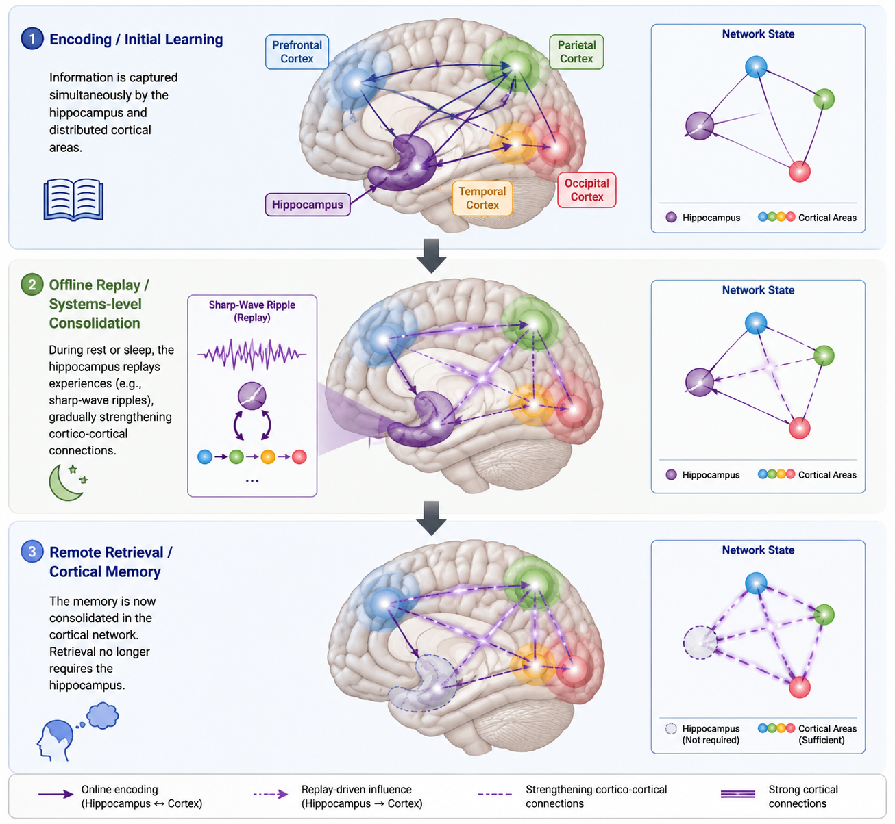

图1.4记忆的系统巩固模型

Figure 1.4 Memory systems consolidation model

> 学习初期，信息同时被海马与分布式皮层区域在线捕捉。随后，海马通过离线状态下的重放（如尖波涟漪）逐步激活皮层关联网络，强化皮层间连接。最终记忆被固化在皮层网络中，不再需要海马的提取。

> During the initial learning phase, information is captured online simultaneously by the hippocampus and distributed cortical areas. Subsequently, the hippocampus gradually activates cortical association networks through offline replay (e.g., sharp-wave ripples), strengthening cortico-cortical connections. Ultimately, the memory is consolidated in the cortical network, and its retrieval no longer requires the hippocampus.

从宏观网络视角看，记忆的建立绝非瞬间、孤立地在皮层某处独立发生。系统巩固模型（System Consolidation Model）提出，记忆的初始编码高度依赖以海马为核心的内侧颞叶系统。在随后的几天到数周时间里，海马在动物睡眠或安静的清醒状态（离线状态）下，通过尖波涟漪（sharp-wave ripples, SWR）自发产生对新近经验的压缩时间重放（replay），从而反复教导并驱动新皮层中的关联网络重塑，最终将记忆逐步转移并整合为稳定、抽象的分布式知识表征（Squire et al., 2015）。这构成了互补学习系统（CLS）的核心假设，即大脑利用快速但不稳定的海马系统进行在线经验捕捉，并利用缓慢且具有强大学习泛化能力的皮层系统进行离线知识沉淀。在此框架下，旧任务所留下的不仅是特定突触的点对点改变，而是已脱离海马强依赖的皮层先验知识框架（schema）。当动物遭遇与先验框架相契合的新信息时，其新任务的同化与巩固速度会显著加快（van Kesteren et al., 2012）。

然而，这一关于皮层记忆缓慢生成的刻板印象正受到近年研究的修正。Xie等利用在体成像技术追踪即早基因表达时发现，在经验形成的最初几小时内，新皮层即可在不同深度的网络中建立起与记忆高度相关的细胞集合（Xie et al., 2014）。对此，海马索引理论（Hippocampal Memory Index Theory）提供了更为协调的解释：皮层本身从一开始就直接参与了记忆各维度感知与动作内容的分布式表征，而海马（尤其是DG区的稀疏投射）的作用仅仅是捕捉这些高维皮层活动的联合特征，并依赖CA1的序列发放形成对整个事件的“索引（Index）”标签（Teyler & Rudy, 2007）。在提取记忆时，即便外界仅提供微弱或不完整的线索输入，该输入也能首先激活海马索引，进而通过反向投射引发整个皮层印迹网络的“模式完成”（pattern completion）（Teyler & Rudy, 2007）。

不仅如此，近期的长期群体神经追踪研究揭示了皮层表征中一个令人瞩目的现象：表征漂移（Representational drift）。即便在没有新任务介入、动物行为维持高度稳定的情况下，皮层群体编码相同感知或动作事件的具体神经元组合也会随着时间（以天或周为单位）发生渐进式改变（Driscoll et al., 2022）。过去，这种漂移常被视为系统突触噪声或可塑性过程不可避免的副产物。但现代连续学习（continual learning）理论越来越倾向于认为，表征漂移并非系统缺陷，而是固有特性：这种自发的动态重组赋予了大脑在维持稳定记忆的同时，免受灾难性遗忘干扰并为接入新经验留出空间的卓越灵活性。皮层网络能在低维流形框架保持不变的情况下，不断更新承担具体计算的微观细胞组合。这意味着，在已经学会的线索-动作关联任务中，旧经验不仅以静态“索引”或“框架”的形式保留在皮层中，更以一种动态流动、可柔性接入新模态输入的集合网络状态存在。这一特性正是跨模态连续学习中，能够加速吸收新任务表征的深层网络结构基础。

在系统巩固与皮层表征漂移的动态过程中，记忆印迹的物质实体不仅存在于海马，更广泛分布于大脑皮层、基底神经节、杏仁核等多个脑区（Tonegawa et al., 2015）。当动物经历特定学习事件时，大脑中特定神经元发生基因表达上调与表观遗传修饰（如脱氧核糖核酸（deoxyribonucleic acid, DNA）甲基化、组蛋白乙酰化），树突棘密度增加，并与周围神经元发生LTP或LTD变化，从而被招募为承载记忆信息的印迹载体（Ryan et al., 2015）。更深层次地看，表观遗传调控与非编码核糖核酸（non-coding ribonucleic acid, non-coding RNA；如微小核糖核酸（microRNA, miRNA）、长链非编码核糖核酸（long non-coding RNA, lncRNA））也参与了记忆印迹细胞的分子调控，它们通过与信使核糖核酸（messenger RNA, mRNA）相互作用，精确调节突触可塑性相关蛋白的合成（Cristino et al., 2014）。这些独特的分子和形态学变化共同保证了印迹细胞网络的稳定性。此外，近期的研究进一步拓展了记忆印迹的范畴，发现胶质细胞并非只是被动支持成分，星形胶质细胞的活动可以调节突触可塑性并增强记忆表现（Adamsky et al., 2018），这提示神经微环境在维持长期记忆结构中同样具有重要作用。

印迹细胞的招募并非随机。Sheena Josselyn 和 Alcino Silva 的实验室提出了“记忆分配”（Memory Allocation）假说：在学习发生时，细胞的内源兴奋性水平（intrinsic excitability）决定了其是否被招募为印迹细胞（Yiu et al., 2014）。具体而言，通过上调CREB（cAMP反应元件结合蛋白）的表达，可以人为提高部分神经元的兴奋性，这些细胞在随后的学习任务中会优先被分配为记忆印迹。反之，如果抑制CREB的表达或降低兴奋性，这些细胞就会被排除在印迹网络之外。这种基于兴奋性的竞争机制完美解释了连续学习中常见的“记忆链接”（Memory Linking）现象：当两件事件在时间上相近发生时，第一个事件激活的印迹细胞由于其兴奋性在随后的一段时间内（如数小时至一天）仍然保持较高水平，因而在第二个事件发生时会被优先再次招募（Cai et al., 2016）。Yokose等进一步证明，这种印迹细胞在物理上的重叠对于行为上的记忆链接是必要的，它使得动物能够通过激活一个记忆去提取另一个在时间上相关的记忆（Yokose et al., 2017）。因此，在跨模态连续学习中，如果新旧任务的训练间隔足够短或受到神经调质的维持，旧任务的印迹网络就有可能凭借较高的内源兴奋性，强行竞争并主导新任务的神经表征。

活动依赖标记技术使确证并干预印迹细胞成为可能。靶向活跃细胞群重组（targeted recombination in active populations, TRAP）等技术利用Fos或Arc等即早基因启动子驱动特定时间窗内活跃细胞发生重组，从而为后续化学遗传学或光遗传学操纵提供永久性遗传入口（Guenthner et al., 2013）。例如，Tonegawa实验室利用该技术成功在无真实环境刺激时通过光遗传人工激活了小鼠海马的恐惧记忆印迹（Liu et al., 2012）。进一步研究表明，记忆印迹细胞不仅能引发行为回忆，甚至可以通过重新关联奖励刺激来反转情感效价（Redondo et al., 2014）。自然行为中，被标记细胞在回忆期的再激活与行为表现直接相关，且这些细胞早在训练前就可能具有较高的内在兴奋性，从而更容易被优先招募进新任务的印迹网络（Mocle et al., 2024）。

不过，这类技术在机制解释上存在天然边界。即早基因的表达不仅整合了刺激强度与积分时间，还受细胞基线状态、表观遗传背景及非特异性神经干扰的影响（Chung, 2015）。这也就导致了针对即早基因的追踪并不完全等同于严格的“记忆存储”，因为有些表达只是任务驱动下的非特异性生理活动。其次，记忆印迹网络内部亦存在高度的功能异质性，不同转录途径（如Fos或Npas4）定义的细胞亚群在记忆过程中的作用各异，甚至在促进记忆泛化和辨别上具有截然不同的分工机制（Sun et al., 2020）。因此，被标记的细胞群应被严谨地理解为“富集了特定行为时窗内相关计算的异质性群体”，而非瞬时运算神经元的无偏全集（DeNardo & Luo, 2017）。对这些印迹细胞群的干预，必须与高分辨率的在体钙成像记录及详尽的行为学对照相结合，以揭示其在连续学习复用中的动态特性。

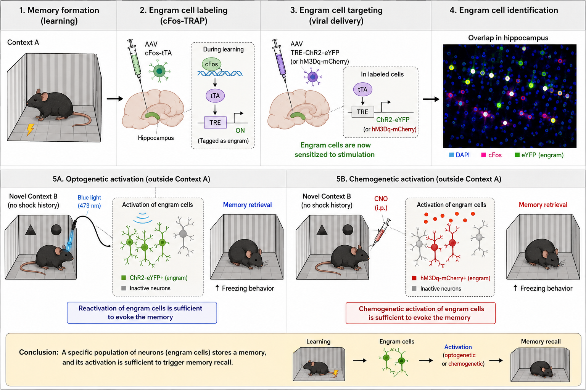

图1.5记忆印迹细胞的定义与实验操作过程

Figure 1.5 Definition and experimental manipulation of memory engram cells

> 小鼠在特定情境记忆形成过程中，部分神经元因高度活跃而表达即早基因（如cFos）。通过病毒载体与基因重组技术，可向这些神经元内递送光遗传或化学遗传操纵元件。在后续阶段，脱离原始情境直接激活该细胞群体，即可成功提取目标记忆，由此在功能上严格确证了印迹细胞群的物质基础。

> During the formation of specific contextual memories in mice, a subset of highly active neurons expresses immediate-early genes (e.g., cFos). Through viral vectors and genetic recombination techniques, optogenetic or chemogenetic manipulation elements can be delivered into these neurons. In subsequent phases, direct activation of this cell population outside the original context can successfully trigger the retrieval of the target memory, thereby strictly confirming the functional material basis of the engram cell population.

在探讨上述皮层记忆印迹与网络复用问题时，初级运动皮层（primary motor cortex, MOp）提供了一个不可多得的枢纽观测窗口。运动皮层不仅是下行运动指令的输出端，更是参与动作准备、感觉—动作映射与跨时程策略组织的中间计算节点（Shenoy et al., 2013）。在运动学习中，MOp内会出现细胞分辨率级别的局部环路重塑与任务特异性响应（Papale & Hooks, 2018）。

从组织解剖学上看，MOp浅层（2/3层）偏向于皮层内信息整合与局部环路运算，而深层（5层）则包含了丰富的跨区及下行投射细胞（Welniarz et al., 2017）。这种层级结构并非简单的平行并行，而是构成了一个经典的标准皮层微环路（Canonical cortical microcircuit）。通常情况下，来自其他感觉皮层（如次级听觉皮层、视觉皮层）或高级联络皮层的前馈输入，会优先投射到MOp的2/3层；随后，2/3层的锥体神经元经过局部计算和降噪后，向深部的5层锥体神经元发送密集的兴奋性下行投射。5层进一步将这些信息转化为运动输出指令，向下投射到纹状体、脑干运动核团甚至是脊髓前角。Li等的研究指出，运动准备与下行驱动可以在同一通路的结构化投射中实现统一组织（Li et al., 2015）。虽然Kawai等提出在技能高度自动化后，行为执行对运动皮层的依赖可能减弱（Kawai et al., 2015），但Guo等的研究表明，在需要精细反馈和在线控制的任务中，运动皮层仍具有直接不可或缺的贡献（Guo et al., 2015）。

对于固定延迟舔水任务而言，MOp中的旧任务细胞保留的很可能并非某种单一感官表征，而是将线索、等待指令与奖赏预期融合为可执行动作网络状态的关键骨架。在连续学习的模态切换中，MOp2/3层与5层展现出了截然不同的适应性动态。近期的“顶树突分离计算模型（Apical dendritic decoupling）”为解释这种分层差异提供了极具启发性的细胞机制视角。在皮层5层厚簇锥体神经元（Thick-tufted pyramidal neurons）中，它们的胞体位于深层，而其长长的顶树突则一直伸展到皮层表面的第1层（layer 1, L1）。胞体周围的基底树突（Basal dendrites）主要接收来自同皮层第2/3层（layer 2/3, L2/3）的自下而上（Bottom-up）前馈输入；而远端的顶树突则负责接收来自高阶丘脑（如丘脑后核群（posterior complex of the thalamus, PO））、基底前脑胆碱能系统以及前外侧运动皮层（anterior lateral motor cortex, ALM）的自上而下（Top-down）反馈或调控信号。只有当基底树突的前馈感觉输入与顶树突的反馈预期信号在时间上完美重合时，这种锥体神经元才会爆发产生强烈的爆发式动作电位（Burst firing），进而驱动突触可塑性与动作执行（Larkum, 2013）。

在跨模态范式的连续学习中，由于前馈感觉信息发生了根本性改变，MOp的浅层网络需要重新构建与新输入（如视觉线索）的映射关系；而MOp5层的深层网络则可能凭借顶树突对自上而下预期信号的捕捉，维持其动作输出架构，并引导新映射向已有目标收敛。这种基于深层“先验锚定”与浅层“灵活适配”的可能分工，从解剖与细胞计算的双重维度，为跨模态连续学习中的策略重组提供了潜在的神经环路微观基础，但其在在体任务中的具体表现仍需系统性验证。

记忆的形成与连续学习过程并非仅局限于单一脑区内部的突触权重调整，而是高度依赖大脑皮层与海马等边缘系统在宏观尺度上的动态对话与互作。人类海马中的情景记忆编码可表现为稀疏、刺激特异性的单神经元活动模式（Wixted et al., 2018）；而在空间规则学习等需要海马-前额叶互作的过程中，海马与内侧前额叶皮层之间的θ振荡相干性会在规则习得后增强，并伴随前额叶锥体神经元相位重组和同步细胞组装形成（Benchenane et al., 2010）。这种振荡同步被认为提供了一个相位窗口，使得相近时间内放电的神经元更容易引发靶核团突触发生赫布型LTP。

系统巩固模型（System Consolidation Model）进一步描绘了记忆如何从短期的海马依赖转变为长期的皮层依赖。当动物进入睡眠（特别是慢波睡眠（slow-wave sleep, SWS）阶段）或在清醒休息的离线状态（Offline state）时，海马会自发产生一种高频、短暂的电生理事件——尖波涟漪（sharp-wave ripples, SWRs，约150-250Hz）。在SWRs期间，海马内的位置细胞和序列细胞以压缩的时间尺度（往往比真实经验快十倍以上）重放（Replay）白天的经验（Lee & Wilson, 2002）。更为关键的是，这种海马的SWRs并非孤立发生，而是与皮层的慢波（Slow Oscillations, ~1Hz）和丘脑的纺锤波（Spindles, 10-15Hz）高度时间耦合（Rothschild et al., 2017）。这种三方协调节律构成了一个庞大的“教导信号网络”，将海马中快速获取但极易受干扰的印迹逐步转移、整合并刻录到皮层广泛分布且更具持久性、泛化能力的联结网络中。破坏SWRs或阻断SWR-Spindle的耦合，均会导致记忆向皮层转移的失败。

在海马和感觉皮层的海量信息中转中，压后皮层（Retrosplenial Cortex, RSP）作为一个关键的中枢节点发挥着承上启下的作用（Vann et al., 2009）。RSP在解剖上接收来自视觉等初级感觉皮层的前馈输入，同时与海马、下托有着密集的交互连接。RSP不仅负责对情境和感觉特征进行对齐，还能结合头部方向系统生成以自我为中心（egocentric）与以环境为中心（allocentric）的坐标系转换。

而当我们从单纯的记忆系统转向感觉-运动连续学习时，预测编码（Predictive Coding）理论为皮层如何处理新旧模态的转换提供了强有力的计算框架（Keller & Mrsic-Flogel, 2018）。预测编码理论主张，大脑的层级网络不仅仅是被动地向上传递感觉信号，而是持续主动地从高层向低层发送生成式的自上而下预测（Top-down predictions）。在每一个层级，网络计算低层传来的实际感觉输入与高层预测之间的差异，即“预测误差”（Prediction error）。如果预测与输入吻合，误差被抵消，上行信号减弱；如果存在偏差，预测误差信号就会被沿着前馈通路上传，以修正高层的内部模型。在声转光的任务切换中，旧任务（声音）在海马-皮层环路中已经建立起了一套稳固的预测模型（如听到声音预测有水并准备舔舐）。当新线索（光）首次出现时，这打破了先前的听觉预测模型，产生了巨大的跨模态预测误差。这套预测误差系统能否利用RSP等具有跨模态整合能力的坐标系快速完成新视觉线索向旧运动准备的对齐，将极大改变神经系统的反馈格局与学习效率。这就引出了一个具体的解剖学焦点问题：RSP等区域是否是新视觉线索汇入并调用运动皮层已有策略不可或缺的必经门控？本研究的定点抑制实验将对此做出直接回答。

在网络试图从一种模态平稳过渡到另一种模态、并维持表征稳定性时，除了兴奋性突触可塑性的改变，皮层内的局部微环路，特别是其中的抑制性中间神经元（interneurons），也发挥着不可或缺的重组与调控作用。尽管中间神经元仅占皮层神经元总数的少数，但其基于转录组、形态学和电生理学的多样性赋予了网络强大的动态计算能力（Huang & Paul, 2019）。传统上，表达小白蛋白（parvalbumin, PV）、生长抑素（somatostatin, SOM/SST）和血管活性肠肽（vasoactive intestinal peptide, VIP）的中间神经元构成了皮层抑制性网络的三大支柱（Tremblay et al., 2016）。PV神经元（如篮状细胞）通常介导快速的胞体前馈或反馈抑制，其快波放电特性能够精确控制主神经元放电时序及γ频段的网络振荡（Hu et al., 2014）；SOM神经元（如Martinotti细胞）靶向锥体神经元的顶端树突，它们能够监测局部兴奋水平并提供延迟的反馈抑制，动态调节局部兴奋性输入的时空积分（Gentet et al., 2012）；而VIP神经元则主要抑制其它中间神经元（特别是SOM和部分PV神经元），从而实现对主细胞的去抑制（disinhibition），在行为任务中这充当了提高特定信息通路的感觉与运动增益的“开关”（Pi et al., 2013）。此外，近年来在皮层L1层发现的神经元源性神经营养因子（neuron-derived neurotrophic factor, NDNF）阳性中间神经元，能够接收来自胆碱能系统与高阶丘脑的自上而下投射，通过对锥体神经元远端树突的持久性抑制调控，将学习过程中的全局强化信号转化为特定突触的特异性强化（Abs et al., 2018）。这种不同抑制性亚型的精细协作，使得感觉驱动的信息处理得以在皮层局部微环路中完成多层级的门控和重整。

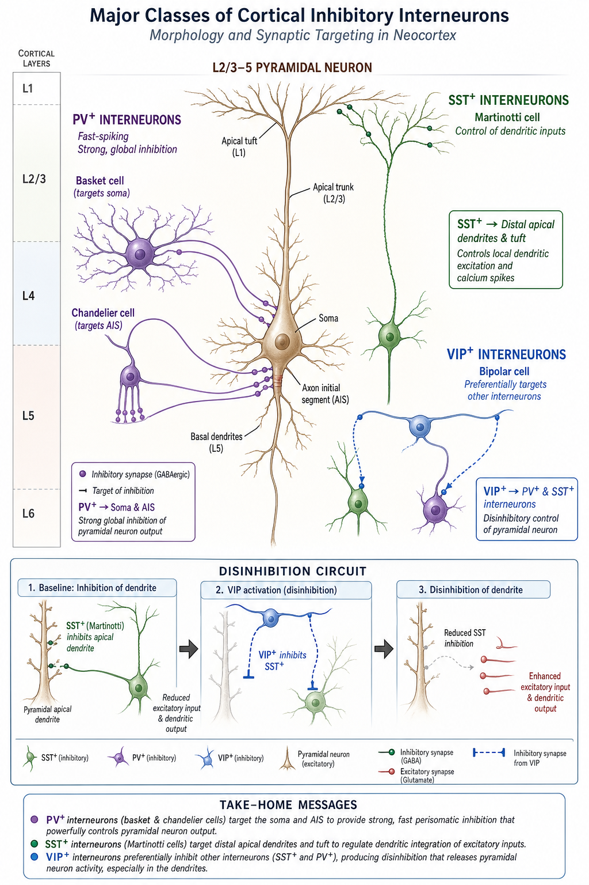

图1.6皮层主要抑制性中间神经元的分类与靶向特征

Figure 1.6 Classification and targeting features of major cortical inhibitory interneurons

> 展示基于分子标记（如PV、SST、VIP）区分的几大类皮层中间神经元，及其对锥体神经元不同部位的特异性突触支配特征（例如PV靶向胞体或轴突初始段实现强烈全局抑制；SST靶向顶端树突控制局部输入；VIP主要抑制其他中间神经元以实现去抑制回路）。

> Illustration of major classes of cortical interneurons distinguished by molecular markers (e.g., PV, SST, VIP) and their specific synaptic targeting features onto different compartments of pyramidal neurons (e.g., PV targets the soma or axon initial segment to mediate strong global inhibition; SST targets apical dendrites to control local inputs; VIP primarily inhibits other interneurons to form disinhibitory circuits).

不仅如此，中间神经元是维持和动态调节神经网络兴奋-抑制平衡（excitatory/inhibitory balance, E/I balance）的基础。在学习记忆与系统发育的过程中，感觉经验不断驱动兴奋性突触强度的改变，而抑制性微环路必须通过中间神经元自身的长时程可塑性（如抑制性长时程增强（inhibitory long-term potentiation, I-LTP）和抑制性长时程抑制（inhibitory long-term depression, I-LTD））相应调整，以校准E/I比例。这种调节不仅能防止病理性的神经元过度兴奋，更是提高皮层对特定感觉特征的调谐精度与记忆编码特异性的前提（Dorrn et al., 2010）。例如，初级听觉皮层中的抑制性与兴奋性突触可塑性会共同塑造感觉诱发反应的选择性，使皮层网络在保留可塑性的同时维持稳定的输入输出关系（D'amour & Froemke, 2015）。在记忆环路中，海马SOM神经元可通过反馈抑制严格控制参与编码某一事件的兴奋性细胞集合（engram size）的大小，从而决定空间或情境记忆的抗干扰能力与精确度（Stefanelli et al., 2016）；在空间导航与恐惧记忆学习中，海马苔藓纤维前馈抑制连接的活动依赖性增强，被证明是确保记忆精确性而非泛化重叠的关键机制（Ruediger et al., 2011）。

在处理跨模态事件的连续学习场景中，解决著名的“稳定性与可塑性困境（stability-plasticity dilemma）”高度依赖上述中间神经元的微观网络动态。当动物在基底外侧杏仁核（basolateral amygdala, BLA）中建立听觉恐惧记忆时，VIP神经元被线索特异性激活，继而强烈抑制PV和SOM神经元，解除对投射神经元的束缚，促成记忆的快速获得（Krabbe et al., 2019）。而在长期记忆的巩固和提取阶段，特定的振荡频率（如γ振荡）与抑制性调控紧密相连，前岛叶皮层（anterior insular cortex, aIC）中的PV神经元就能通过增强对基底外侧杏仁核投射神经元的抑制，协调冲突的内部表征，确保目标记忆的主导地位（Yiannakas et al., 2021）。当后续面临新任务或新模态学习时，原先由旧经验塑造的E/I平衡可能预先设定了网络的基础动态结构。这种抑制性微环路是否能具备强效滤除无关噪声、保障新旧信息在既有骨架上的有效重构功能，是探讨连续学习记忆保护与快速捕获机制的关键。

### 1.2.2 丘脑与深层核团在连续学习中的作用
皮层记忆印迹可以解释旧经验如何被新任务重新调用，但连续学习还需要跨脑区系统协调。新任务开始时，动物需要识别情境改变、重新评估线索意义，并在已有动作结构和新输入之间建立有效映射；随后，神经系统还需要维持适合学习的群体状态，使突触更新朝任务目标稳定推进。这些过程往往超过局部皮层回路的解释范围，因而需要考虑更深层的全局网络，如神经调质系统和高阶丘脑-皮层环路的共同作用。

面对新任务初期的模态切换与规则突变，仅仅依靠局部皮层内部的谷氨酸或γ-氨基丁酸（gamma-aminobutyric acid, GABA）突触传导是远远不够的；大脑需要一种能瞬间广播至全脑、彻底重置网络工作状态的全局信号。这就高度依赖于广泛投射的神经调质系统（Neuromodulatory systems），包括多巴胺、去甲肾上腺素、血清素和乙酰胆碱等。

在经典强化学习理论中，起源于中脑腹侧被盖区（ventral tegmental area, VTA）和黑质致密部（substantia nigra pars compacta, SNc）的多巴胺能神经元扮演了核心角色。它们编码了著名的“奖励预测误差”（Reward Prediction Error, RPE）（Schultz et al., 1997）。当动物在旧任务中完美掌握了线索与奖励的关系时，RPE趋近于零，此时多巴胺神经元只保持低频的基线发放。然而，当进入跨模态的连续学习新任务时，原本熟悉的线索突然消失或旧有的动作不再立即产生预期结果，这将产生强烈的负向预测误差，导致多巴胺放电短暂暂停（pause）；而当新线索（如蓝光）意外地伴随奖赏出现时，又会引发巨大的正向RPE，产生多巴胺的爆发式（phasic）释放。更精细的现代追踪和光学记录研究表明，多巴胺活动不仅反映正负符号，还携带着量化误差成分、动作起步活力甚至是环境状态变化的新异性信号（Novelty），为学习曲线的演变提供了精确至毫秒级的教学映射（Menegas et al., 2015）。这股多巴胺风暴通过伏隔核（nucleus accumbens, NAc）和背侧纹状体直接塑造了直接/间接通路的输出平衡，并通过向皮层释放，直接调节了皮层锥体神经元树突棘上的STDP时间窗口（Yagishita et al., 2014）。

除了多巴胺，蓝斑-去甲肾上腺素系统（LC-NE）的“自适应增益理论”（Adaptive Gain Theory）在连续学习的策略重置中同样至关重要（Aston-Jones & Cohen, 2005）。当系统在旧任务中得心应手时，蓝斑（locus coeruleus, LC）呈现出适度的位相性放电（phasic mode），促使动物高度专注于利用（Exploitation）当前的规则以最大化收益。而当任务发生模态切换、动物连续遭遇错误和未预期结果时，LC神经元的活动模式会迅速转变为高强度的持续性放电（tonic mode）。这种高基线释放的去甲肾上腺素犹如全脑的“警报系统”，瞬间拓宽了皮层网络的感受野阈值，促使动物放弃无效的旧策略，转而进入广泛的探索状态（Exploration），以重新搜寻新的有效线索。

此外，基底前脑（Basal Forebrain）的胆碱能系统在这一过程中主导了注意力的重定向（Attentional reorienting）。皮层的乙酰胆碱释放在新异刺激出现时会急剧升高，它能够通过抑制皮层内前馈连接并增强丘脑皮层输入，极大地提高了新线索（视觉或听觉）在感觉皮层中的信噪比，从而使大脑资源迅速从被忽略的旧线索聚焦到新特征上（Hasselmo & Sarter, 2011）。血清素（Serotonin）系统也被证实参与了对不确定性和惩罚的处理，协助网络在规则反转时维持认知灵活性。这些神经调质机制相互配合，共同编织了一张严密的控制网，确保新旧线索的突变能以最快的速度转译为皮层突触层面学习资源的再分配指令，从而避免动物陷入旧有僵化行为的死循环中。

在早期的神经科学教科书中，丘脑（Thalamus）通常被刻画为一个被动的感觉“中继站”（Relay station），仅仅负责将来自眼睛、耳朵的视听外周信号原封不动地上传到初级感觉皮层。然而，近年来随着解剖学和光遗传学的发展，人们发现除了像外侧膝状体（lateral geniculate nucleus, LGN）这类初级感觉（一阶）丘脑外，大脑中还存在着庞大的“高阶丘脑”（Higher-order thalamus）核团网络。这些高阶丘脑核团的主要输入并不来自外周感觉器官，而是来自大脑皮层的第5层（layer 5, L5）或第6层（layer 6, L6）神经元，并且它们又将信号投射回皮层其它区域，从而构成了复杂的“皮层—丘脑—皮层”（Cortico-thalamo-cortical, CTC）跨区路由循环（Halassa & Sherman, 2019）。这种拓扑结构赋予了高阶丘脑强大的全脑协调与自上而下（Top-down）的调控能力。

在不同认知任务中，高阶丘脑的不同核团扮演着各具特色的门控角色。以丘脑背内侧核（Mediodorsal thalamus, MD）为例，MD与前额叶皮层（PFC）存在紧密的往返连接。研究表明，MD不仅负责维持PFC在工作记忆任务期间的持续放电（persistent activity）（Bolkan et al., 2017），还能通过向PFC特定中间神经元提供输入，灵活调节前额叶内部的局部E/I平衡，从而在规则切换（Rule-shifting）或认知灵活性任务中发挥决定性作用（Schmitt et al., 2017）。另一方面，丘脑枕核（pulvinar）或啮齿类中的外侧后核（lateral posterior nucleus, LP）则在调节视觉注意和跨皮层视觉区域同步性方面起主导作用。Saalmann等人发现，在猴子的注意力转移任务中，Pulvinar能以特定的低频（Alpha频段）或高频调节视觉4区（visual area V4, V4）和初级视觉皮层（primary visual cortex, V1）的神经振荡同步性，这种“节律对齐”直接控制了不同视觉皮层区域之间信息传输的有效权重（Saalmann et al., 2012）。更为关键的是，在睡眠介导的记忆巩固过程中，丘脑参与了与海马尖波涟漪（SWR）及皮层慢波高度耦合的纺锤波（Spindles）发生。这一三方协调节律构成了一个庞大的“教导信号网络”，它不仅能够稳定长期的皮层印迹，还能预防在不断习得新技能时发生的灾难性干扰，为连续学习的神经基础提供了跨越睡眠与清醒状态的机制解释。

在与本研究密切相关的体感-运动关联连续学习中，小鼠的丘脑后核群（PO）及其周围结构尤为关键。PO与初级运动皮层（primary motor cortex, MOp）、次级运动皮层（secondary motor cortex, MOs）以及初级体感皮层（primary somatosensory cortex, S1）等区域存在双向且密集的连接网络（Shepherd & Yamawaki, 2021）。解剖追踪显示，这些投射甚至跨越了不同皮层深度，优先作用于MOp的2/3层与5A层锥体细胞的树突结构（Hooks et al., 2013）。电生理和光遗传学研究进一步表明，PO能在感觉引导的行为中动态调节S1和运动皮层（motor cortex, MO）内的触觉信息加工模式（Casas-Torremocha et al., 2017）。在学习过程中，感觉输入与动作输出之间的映射关系常常需要经历剧烈重组，PO凭借其作为CTC回路中枢的地位，具有中继、过滤和放大跨皮层信息流的卓越能力。

更深层次地看，高阶丘脑不仅仅是传递信息的通道，它更是皮层突触可塑性发生的重要调节阀或“门控”（Gating）。在树突可塑性研究中，丘脑向皮层锥体神经元远端顶树突（位于L1层）的投射可以引发一种缓慢的、长时程的NMDA峰电位（dendritic NMDA spikes）。这种树突电位若与体细胞发出的反向传播动作电位（back-propagating action potential, bAP）在时间上重合，就会解除树突区域的抑制，极大增强突触可塑性学习（Larkum, 2013）。此外，如前节所述，丘脑还通过支配L1层的NDNF阳性神经元或VIP神经元，产生局部去抑制（disinhibition）效应，为特定的突触权重的长期固化打开了宽广的时间窗（Abs et al., 2018）。因此，在连续学习中，高阶丘脑（如PO区域）不仅可能起到稳定运动皮层群体响应的作用，是否还能将全局“教学信号”（Teaching signal）放大并精准投递至特定突触位点以主导新任务习得的速度，有待更直接的功能学干预证据来揭示。

### 1.2.3 计算模型在处理复杂学习任务中的应用
要确证活体动物实验观察到的细胞响应分化与学习速率之间的对应关系并非偶然，需结合群体动力学及严格的网络建模，证明这些皮层状态特征在理论上确实具备加速学习的数学潜能。

在过去的数十年中，随着多通道微电极阵列和在体双光子钙成像技术的飞速发展，同时记录成百上千个神经元的活动已成为常态。研究者逐渐认识到，仅仅把单个神经元视为孤立的信息处理单元是片面的；真正控制行为输出并承载复杂认知计算的，是海量神经元共同构成的“群体状态”（Population State）。通过主成分分析（principal component analysis, PCA）、因子分析（factor analysis, FA）或非线性降维手段分析这些高维数据，研究者发现，尽管单神经元的放电模式看起来高度异质且充满噪声，但整个群体的活动实际上被严格限制在少数几个低维的子空间中，这些低维结构被称为“神经流形”（Neural manifold）（Cunningham & Yu, 2014）。这种低维度性往往源于网络内部高度密集的局部连接以及上游脑区输入特征的降维限制（Machens et al., 2010）。

动力系统视角的引入彻底革新了我们对运动皮层计算的理解。以初级运动皮层（primary motor cortex, M1）为例，Shenoy等提出M1并不像传统认为的那样直接表征肌肉的张力或运动速度等离散肌肉参数，它更像是一个复杂的动力系统引擎（Engine）。在准备阶段，群体状态被初始化到流形内的一个特定起点；当运动指令发出时，群体状态在这个低维流形上顺着系统固有的动力学法则随时间“流动”，这种轨迹演化随时间生成的模式（如旋转动力学，Rotational dynamics），最终被下游脊髓回路解码并转换为复杂的肌肉收缩输出（Gallego et al., 2017）。这就意味着，即使面对行为上的新任务，只要其需要的输出可以从当前的皮层动力学流形中生成，学习就会非常高效。跨越数天甚至数周的灵长类慢性记录表明，动物在执行相同运动任务时，无论单细胞是否发生表征漂移，其低维流形的基本几何结构与动力学演化特征惊人地稳定（Gallego et al., 2020）。

这一几何视角强有力地解释了不同任务中“学习速度差异”的深层根源。在著名的脑机接口（Brain-Computer Interface, BCI）控制实验中，Sadtler等通过让猴子通过其M1皮层群体活动来控制屏幕上的光标，精巧地设计了两种不同的学习范式。如果改变BCI解码算法，使得控制光标所需的新网络活动模式依然落在动物原有的低维神经流形内（Within-manifold perturbation），猴子能够在短短几十分钟到数小时内快速学会适应这种改变。然而，如果解码算法被修改为要求神经群体产生偏离或垂直于既有流形的新模式（Outside-manifold perturbation），猴子的学习过程将变得异常缓慢，甚至在长达数天的训练中都无法恢复至原有的控制精度（Sadtler et al., 2014）。换言之，快速学习在本质上依赖于对既有神经活动模式库的重加权（re-weighting）或重新关联（re-association），这通常只需要皮层下游读出权重的微调；而当任务需求强制网络活动跳出既有流形几何边界时，则意味着系统不得不缓慢地重构其底层的突触连接矩阵（Vyas et al., 2020）。在连续学习的模态切换范式中，动物从第一种感觉线索切换至第二种跨模态线索时的学习提速，是否同样是在既有流形内寻找到已有的稳定结构并进行高效映射的体现？这种流形复用假说，将为解释跨模态迁移现象和脑机接口技能移植等提供重要的动力学测试框架。

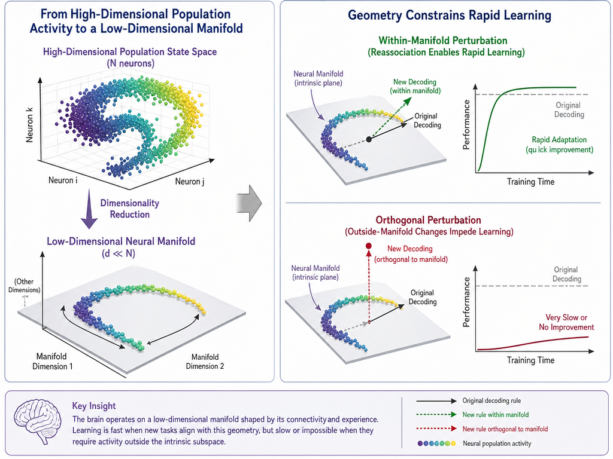

图1.7神经流形几何结构与脑机接口快速学习边界

Figure 1.7 Geometry of neural manifolds and boundaries for rapid learning in brain-computer interfaces

> 左侧展示包含大量神经元的群体状态空间如何被降维到一个低维流形（Neural manifold）中。右侧展示，当解码任务的扰动（perturbation）落在该低维流形平面内时，动物能通过重新关联快速学会适应；而当新的解码规则要求群体活动跳出该固有平面（即垂直于流形的扰动）时，学习过程将变得异常缓慢，甚至无法完成。这阐释了既有网络几何结构如何约束后续的连续学习进程。
>
> The left panel shows how the population state space comprising a large number of neurons is dimensionally reduced into a low-dimensional neural manifold. The right panel shows that when a perturbation of the decoding task falls within this low-dimensional manifold plane, animals can quickly learn to adapt through reassociation; however, when the new decoding rule requires population activity to step outside this intrinsic plane (i.e., a perturbation orthogonal to the manifold), the learning process becomes exceedingly slow or even impossible. This illustrates how the existing network geometry constrains the subsequent continual learning process.

除了线索触发后的状态演进外，线索到来之前的网络状态（静息态或预备态）对行为的响应效率同样具有决定性影响。在目标导向的运动任务中，动物在真正执行动作之前，皮层往往已经进入了一种高度特定的准备性活动模式。Churchland等指出，在线索刺激出现邻近时，皮层群体跨单次试验的变异度通常会显著降低（散度下降），反映网络正被主动约束到一种有利的准备性状态（Churchland et al., 2010）。前外侧运动皮层（ALM）在这一过程中扮演了关键角色，它通过维持持续性的筹备放电，将过去的线索信息转化为对未来的动作规划，并与下游运动中枢紧密耦合（Svoboda & Li, 2018）。

在自发动作或固定延迟的研究中，Murakami等发现次级运动皮层在动物启动行为前数秒就呈现出缓慢逼近动作触发阈值的积累趋势（Murakami et al., 2014）。将这些发现延伸到连续学习范式中，旧任务经验很可能不仅仅是提高了线索出现后的响应计算效率，更是深刻改变了静息态的群体收敛速度。若在等待新线索期间，运动皮层的静息网络能够更早地收敛至易被触动的预备状态流形中，新线索信号就有可能以更短的潜伏期和更高的可靠性释放动作。这种潜在的提前就绪机制是否有助于在宏观上提升初始任务表现，值得深入研究。

为了不依赖特定模型假设或线性降维算法来量化不同学习阶段中群体包含的任务统计特征，信息论工具被广泛引入神经分析（Timme & Lapish, 2018）。网络群体响应往往存在显著的强相关结构和信息冗余，这种冗余不仅是应对生物学噪声的鲁棒性保障，更是实现快速学习迁移的潜在资源库（Stringer et al., 2019）。

从信息论视角来看，新技能习得过程中的信息熵和网络复杂度指标常常呈现非单调的动态演化：在早期学习的探索阶段，动物尝试各种潜在的响应模式，导致群体表征的熵显著上升；而在晚期熟练阶段，由于有效策略的固化与模式收敛，无关活动的抑制导致熵随之降低（Murakami & Yamada, 2025）。进一步的研究表明，更高的任务熟练度常常伴随网络流形向低状态转换代价的更高效率演进，使得信息的读出更加直接和低耗（Brynildsen et al., 2026）。在此视角下，新旧任务间的连续学习迁移不应仅仅被看作是连接权重的简单复制，而应被精准量化为信息的跨任务共享。这种复用机制表现为：对旧任务中无关冗余特征的快速精简弃用，对核心跨模态骨架（如时间延迟和奖赏预期）的高效共享，以及仅仅在特定的高分化细胞群上对新缺口信息（如视觉模态接入）的定向新增。这种基于信息论的资源重分配模型，为我们理解皮层如何在不发生灾难性遗忘的前提下吸纳新知识提供了量化的理论基础。

人工深度学习和连续学习（Continual Learning, CL）的工程实践不仅是工程学的挑战，更是理解生物神经网络应对灾难性遗忘的绝佳参照系。在深度神经网络（deep neural network, DNN）中，研究发现底层特征更为通用（如边缘、颜色梯度），而高层参数需更多针对目标环境的特定适配；因此，迁移学习常通过底层网络冻结（Freezing）与高层特征微调（Fine-tuning）来实现稳定与可塑的平衡（Yosinski et al., 2014）。然而，当网络必须依次学习多个新任务时，简单的微调会导致旧任务权重的彻底崩塌。

为应对灾难性遗忘，算法界从神经科学中汲取了大量灵感。其一为“正则化惩罚”方法，如著名的弹性权重固化（Elastic Weight Consolidation, EWC）。EWC的核心思想是并非所有突触对每个记忆都同等重要；它利用参数对旧任务的Fisher信息矩阵来量化每个权重的重要性，在学习新任务时，强烈惩罚那些对旧任务至关重要的权重的变动，而允许对旧任务不敏感的权重自由改变（Kirkpatrick et al., 2017）。这与前述的记忆分配与生物树突簇（synaptic clustering）机制高度暗合：大脑中的特定树突棘同样会被分配特定的“重要性标签”，在后续学习中得到保护。另一个衍生算法“突触智能”（Synaptic Intelligence, SI），则更直接地模拟了单个突触内的生化级联通路，使每个突触自行记录自身可塑性历史对总体误差下降的贡献率，以此决定未来的可变程度（Zenke et al., 2017）。其二为“动态架构”与“上下文门控”（Context-dependent Gating）。在人工网络中，通过引入上下文依赖的掩码（Mask），使得不同的任务激活网络中正交的（互不重叠的）子网络，从而实现了彻底的记忆隔离（Masse et al., 2018）。在生物脑中，这种门控机制极有可能由皮层局部微环路中的中间神经元（特别是SOM和VIP细胞）或是高阶丘脑的调控输入来实现。它们通过自上而下的抑制或去抑制，为不同模态的情境设定了特异性的响应通道（Krabbe et al., 2019）。

在构建上述计算模型的过程中，理解大脑如何内化环境规则必须提到预测编码（Predictive Coding）与贝叶斯大脑假说（Bayesian brain hypothesis）。Knuasen与Friston提出的自由能原则（Free Energy Principle, FEP）和主动推理（Active Inference）框架指出，大脑的终极目标是最小化其内部模型与外部感知输入之间的差异，即“惊奇（Surprise）”（Friston, 2010）。在这个框架下，所有的学习、感知与动作都可以被统一解释为减小变分自由能（Variational free energy）的过程。连续学习本质上是大脑将旧任务形成的“先验（Prior）”转移到新任务中，以减少重新构建后验分布所需的计算成本。当声转光的跨模态切换发生时，旧的先验模型（听到声音预期得到水）与新的感知输入（看到蓝光）产生了巨大的预测误差（Prediction error）。高阶皮层与丘脑系统通过不断计算和自上而下传递预测误差，来驱动低层感觉皮层和运动输出层的突触更新。如果能够复用原有的动作与奖励预测结构，大脑只需要修正低层感知映射的那一部分先验，从而避免了全局权重的剧烈振荡（Keller & Mrsic-Flogel, 2018）。通过将预测编码、贝叶斯更新与类Hebb学习法则在循环神经网络中结合，研究者能够更精确地从数学上证明群体状态的流形稳定性如何显著提升误差反向传播的效率，从而为连续学习优势提供最底层的数学原理解释。

对于本文而言，搭建具备生物学合理性的稀疏连接循环神经网络（recurrent neural network, RNN）是将上述抽象动力学具象化的最后一步（Richards et al., 2019）。遵循Dale原则限制兴奋与抑制突触的作用，通过数值模拟可以严格还原旧任务训练如何在无人工强加Fisher惩罚或掩码参数的情况下，仅仅依赖局部规则和三因子突触更新机制，就能自发拉大网络响应的正负分化。并最终从数学上证明，异质性响应提高的信噪比及外部教学信号（如模拟的丘脑输入）的衰减对于减缓学习收敛的内在计算逻辑。这为利用类脑模型验证实验假设带来了完整的技术闭环，进一步拉近了NeuroAI与真实在体神经环路之间的解释鸿沟（Zador et al., 2023）。
## 1.3 本研究的科学问题与技术路线
为什么连续学习的新任务会更快，其神经层面上是如何实现的，与无旧经验基础的新学习相比的关键差异是什么？本研究不仅旨在回答“旧经验如何迁移”，更试图在单细胞分辨率和网络动态的宏观尺度上，搭建从行为表现到突触可塑性更新的完整解释桥梁。近年来，尽管利用在体多通道电生理记录或双光子成像追踪学习过程已成为神经科学的常态，但大多数研究仅局限于单一模态下的渐进学习，鲜有研究将跨模态的连续学习拆解为“早期状态调用（泛化）”与“后期动态演进（学习率）”两个独立的分量。为了回答这一科学问题，本研究设计了训练口渴小鼠在特定线索提示后的1s窗口内舔水的任务框架，然后连续学习声音和蓝光两种不同模态线索的具体任务。

行为学分析发现，在学会声音听觉线索任务的经验基础上再学蓝光视觉线索任务时，新任务首个训练单元中小鼠舔舐到水的成功率显著更高，而且在后续的训练进程中呈现出更陡峭的学习曲线。这些具体的行为学指标差异，明确证实了连续学习双重优势的存在：即不仅提高了对新任务的早期表现，还加快了对新任务的学习速率。这一发现使得连续学习的研究不再是一笔糊涂账，而是可以被严密解构和分别干预的。

在体双光子钙成像技术可以实时记录小鼠训练过程中的单细胞分辨率的钙活动。通过在小鼠初级运动皮层（MOp）进行跨天长期追踪，结果发现：新任务线索重新激活了旧任务中的相关皮层细胞，这使得新任务首个训练单元的皮层响应相比于无经验直接学习组更加稳定一致。利用cFos-TRAP系统特异性标记并抑制旧任务中的记忆印迹细胞，或者延长新旧任务的时间间隔以降低细胞重激活比例，均会削弱新任务早期的行为表现。这表明，连续学习中重激活的皮层神经元通过稳定线索响应，支持了新任务的早期表现。

后续训练单元的学习进程加快，则与运动皮层群体的高分化状态有关。分析发现，连续学习中小鼠的皮层神经元保持了由旧任务中塑造的稳定的响应分化特征，且皮层响应的分化程度与学习速率具有正相关性。这种响应的异质性（Heterogeneity）实际上代表了皮层网络从混沌状态收敛到了一个具有明确正负方向区分的低维流形框架中。为了探究这种分化状态的上游机制，本研究分别对丘脑后部核团（PO）和压后皮层（retrosplenial cortex, RSP）等不同脑区进行了抑制与记录实验。结果发现，丘脑的活动调控了皮层神经元的响应分化稳定性：抑制丘脑会降低群体响应分化程度，并显著减慢新任务的学习速率，但并未影响旧任务相关细胞的重激活。作为视觉线索信号输入运动皮层可能的跨区中继，压后皮层虽然的确偏好响应视觉线索，但相关分析和干预表明，压后皮层对连续学习行为表现的实际影响较弱。这提示连续学习的核心加速机制更多依赖于特定的丘脑-运动皮层环路，而非单纯的皮层间视觉中继。

最后，作为佐证，本研究还构建了稀疏循环神经网络模型进行数值模拟。模型不仅复现了前期训练改变连接权重分布并增强细胞响应分化的现象（由加强的兴奋性与抑制性突触差异导致），还验证了细胞群体的异质性响应能有效提高学习信号的信噪比，从而加快参数更新与学习速度。此外，计算机模拟也阐释了丘脑输入减弱对学习速率的负面影响，这在NeuroAI（神经人工智能）的视角下为理解动物跨模态迁移提供了严密的理论证明。这进一步从计算机制层面证明了本文提出的神经理论具有逻辑合理性与现实可行性。

## 1.4 论文结构安排
本文共分7个章节。第1章主要介绍连续学习的行为学与神经机制背景，提出本研究的科学问题与技术路线；第2章详细介绍了涉及的实验动物、行为范式、成像技术、干预手段、数据分析与计算模型构建的具体方法；第3章验证了跨模态连续学习在小鼠学习早期表现与后续速率上的双重行为学优势；第4章通过成像与干预证明旧任务相关皮层记忆印迹细胞的重激活是新任务早期表现提升的基础；第5章揭示了运动皮层高响应分化状态对学习进程的加速作用，并引入稀疏循环神经网络连续学习模型探讨了分化状态在提高信噪比与加速更新中的理论机制；第6章证明了丘脑对维持皮层响应分化稳定性的重要调控作用，结合模型模拟阐释了深层丘脑核团的影响；第7章系统性地总结了研究结论，并探讨现象背后的深层次机制及对未来研究的展望。
# 第2章 材料与方法
## 2.1 实验材料
### 2.1.1 实验动物
所有实验小鼠为C57BL/6J品系，饲养于无特定病原体（specific pathogen free, SPF）级动物设施，10周龄，遵循动物管理机构和有关福利伦理的规章制度。其中野生型由上海吉辉供应，cFos等特殊品系来自友好实验室赠予。
### 2.1.2 病毒、药品与主要耗材
手术和钙成像实验中常用的签膏套装：盐酸金霉素眼膏（恒久远）。牙签。无尘棉签（CA-002SP，亚速旺）。

化学遗传常用药物氯氮平-N-氧化物（clozapine-N-oxide, CNO，麦克林）配置和使用方式：1×Dulbecco磷酸盐缓冲液（Dulbecco's phosphate-buffered saline, D-PBS，不含钙、镁）溶液（Coolaber）。预先配置5㎎ CNO / 8.3㎖ D-PBS溶液，冻存于-20℃。此药物用于抑制表达人源M4型Gi偶联设计受体（human M4 muscarinic receptor coupled to Gi, hM4D(Gi)）的神经元，注射量是3㎕/g体重，在实验前1h腹腔注射。

表2.1病毒、药品和耗材

Table 2.1 Viruses, drugs and consumables

>表中腺相关病毒（adeno-associated virus, AAV）载体名称按商品名保留，其中人突触蛋白启动子（human synapsin promoter, hSyn）、快速型绿色荧光钙调蛋白6（fast green fluorescent calcium-modulated protein 6, GCaMP6f）、土拨鼠肝炎病毒转录后调控元件（woodchuck hepatitis virus posttranscriptional regulatory element, WPRE）、双floxed倒置开放阅读框（double-floxed inverted open reading frame, DIO）和红色荧光蛋白mCherry为主要构件。

>The names of adeno-associated virus (AAV) vectors in the table are retained as their commercial names, among which the human synapsin promoter (hSyn), fast green fluorescent calcium-modulated protein 6 (GCaMP6f), woodchuck hepatitis virus posttranscriptional regulatory element (WPRE), double-floxed inverted open reading frame (DIO), and red fluorescent protein mCherry are the main components.

| 类别 | 名称 | 供应商 | 用途 |
| --- | --- | --- | --- |
| 病毒 | pAAV2/9-hSyn-GCaMP6f-WPRE病毒 | 和元生物 | 在初级运动皮层（Primary Motor Cortex, MOp）或压后皮层（retrosplenial cortex, RSP）表达钙指示蛋白，用于双光子钙成像 |
| 病毒 | pAAV2/9-hSyn-DIO-hM4D(Gi)-mCherry-WPRE病毒 | 和元生物 | 在cFos标记实验中选择性抑制学会阶段活跃细胞集合 |
| 病毒 | pAAV2/9-hSyn-hM4D(Gi)-mCherry-WPRE病毒 | 和元生物 | 在非特异性MOp抑制或丘脑（thalamus, TH）抑制实验中表达化学遗传抑制受体 |
| 病毒 | pAAV2/9-hSyn-mCherry-3xFLAG-WPRE病毒 | 和元生物 | 非特异性抑制实验中的荧光对照病毒 |
| 药品 | 盐酸金霉素眼膏 | 恒久远 | 术前眼部保护 |
| 药品 | CNO | 麦克林 | 化学遗传抑制实验中腹腔注射，抑制表达hM4D(Gi)的神经元 |
| 药品 | 1×D-PBS | Coolaber | 配制CNO、灌流、洗片和湿盒保存 |
| 药品 | 无水乙醇 | 国药/沪试 | 玻片浸泡与局部清洁 |
| 药品 | 75% 乙醇消毒液 | 国药/沪试 | 颅窗玻璃及相关部件表面清洁 |
| 药品 | 他莫昔芬溶液（20㎎/㎖，玉米油） | 碧云天 | 激活cFos驱动Cre-雌激素受体融合重组酶（cFos-driven Cre-estrogen receptor fusion recombinase, cFos-CreER）时间窗，标记行为相关活跃细胞 |
| 药品 | 2,2,2-三溴乙醇 / D-PBS溶液 | 毕得医药 | 灌流前深麻醉 |
| 药品 | 多聚甲醛（paraformaldehyde, PFA）/ D-PBS固定液 | Adamas life | 组织灌流固定与取脑后固定 |
| 药品 | 蔗糖 / D-PBS溶液 | 吉至生物 | 脱水处理 |
| 药品 | 抗荧光衰减封片剂（含4',6-二脒基-2-苯基吲哚（4',6-diamidino-2-phenylindole, DAPI）） | 美仑生物 | 封片并进行DAPI染核 |
| 耗材 | 牙签 | 办公用品 | 局部操作与辅助涂抹 |
| 耗材 | 无尘棉签 | 亚速旺 | 颅窗表面清洁与局部操作 |
| 耗材 | 毛细玻璃管 | 瑞沃德 | 拉制成玻璃注射针，用于脑区定点注射病毒 |
| 耗材 | 镀镍自攻螺钉 / 颅钉 | 安固盾 | 固定头架并增强牙科树脂的机械锁定 |
| 耗材 | 吸收性明胶海绵 | 祥恩 | 术中止血与吸除骨窗周围渗血 |
| 耗材 | 5㎜圆玻片 | WPI | 封闭颅窗并建立长期成像窗口 |
| 耗材 | 牙科义齿基托聚合物树脂 | 脉尚 | 封窗并固定头架 |
| 耗材 | 502胶水 | 得力 | 与树脂混合形成封窗水泥 |
| 耗材 | 动物伤口缝合胶水 | TIGERGENE | 术后局部封合 |
| 耗材 | 纸制吸水材料（擦手纸、吸水纸） | 清风 | 垫于固定床并吸附局部水分或组织残液 |
| 耗材 | 纯净水 | 自制 | 作为舔水奖励与物镜前水滴介质 |
| 耗材 | 透明塑胶水管 / 橡胶管 | 自制 | 连接灌胃针、蠕动泵与水瓶 |
| 耗材 | 杜邦线 | risym | 连接Arduino、继电器、水泵与传感器 |
| 耗材 | 1㎖一次性注射器 | 禾汽 | 注射三溴乙醇 |
| 耗材 | 泡沫板 | 自制 | 灌流时固定小鼠体位 |
| 耗材 | 大头钉 | 京喜 | 灌流时固定小鼠体位 |
| 耗材 | 刀片 | 吉列 | 组织修整 |
| 耗材 | 冰冻切片机专用刀片 | 徕卡 | 冰冻切片 |
| 耗材 | 油漆笔 | 日本雪人 | 载玻片标记 |
| 耗材 | 最佳切割温度包埋剂（optimal cutting temperature compound, OCT） | Tissue-Tek | 冰冻包埋脑组织 |
| 耗材 | 粘附载玻片（正电荷） | 碧云天 | 吸附脑切片 |
| 耗材 | 盖玻片（24×50㎜） | servicebio | 封片覆盖 |
| 耗材 | 透明指甲油 | 思姿 | 密封盖玻片边缘 |
### 2.1.3 实验仪器与数据处理软件
表2.2仪器设备与软件

Table 2.2 Instruments, equipment and software

| 类别 | 名称 | 供应商 | 用途 |
| --- | --- | --- | --- |
| 仪器 | 异氟烷麻醉系统（高纯氧供气） | 瑞沃德 | 手术与灌流前吸入麻醉 |
| 仪器 | 立体定位注射系统 | 瑞沃德 | 手术定位、调平与病毒注射 |
| 仪器 | 拉针仪 | 瑞沃德 | 将毛细玻璃管拉制成注射针 |
| 仪器 | 双光子激光显微镜系统 | Olympus | 在行为过程中记录两层神经元钙信号 |
| 仪器 | 双光子主机与双光子辅助机 | 联想电脑 | 分别负责显微镜控制与行为控制 |
| 仪器 | 通风橱 | 机构采购 | 灌流和固定液操作时通风防护 |
| 仪器 | 冰冻切片机 | ThermoFisher NX50 | 脑组织冰冻切片 |
| 仪器 | 玻片扫描仪 | 奥林巴斯VS120-S6-W | 扫描脑片并观察病毒表达 |
| 设备 | 精细镊 | Dumont/F.S.T | 开窗与止血操作 |
| 设备 | 直头解剖镊 | 中镜科仪 | 取脑和组织剥离 |
| 设备 | 手术剪 / 止血钳 | 探索精选 | 头皮剪切、开胸和组织分离 |
| 设备 | 颅钻与钻头 | 瑞沃德 | 颅窗开孔 |
| 设备 | 小鼠头部固定架 | 第鑫 | 头部固定行为与成像实验中的头部固定 |
| 设备 | 小鼠固定床 | 云洞三维 | 头部固定行为实验平台 |
| 设备 | 灌胃针12号65㎜直头 | servicebio | 作为舔水口与给水出口 |
| 设备 | 内六角螺丝刀工具 | 燚陇秉 | 固定头架与实验装置 |
| 设备 | 蠕动水泵 | 昱瑟 | 定量给水 |
| 设备 | 水瓶 |  | 储存奖励用水 |
| 设备 | 继电器（金属氧化物半导体场效应晶体管，metal-oxide-semiconductor field-effect transistor, MOSFET） | MOSFET | 控制水泵通断 |
| 设备 | Arduino Due A000062 | Arduino | 自动控制线索呈现、给水与日志记录 |
| 设备 | 触感电容传感器 | Adafruit | 检测舔水接触信号 |
| 设备 | 有源压电蜂鸣器 | RunesKee | 提供听觉线索刺激 |
| 设备 | 蓝色发光二极管（light-emitting diode, LED） | 达运 | 提供视觉线索刺激 |
| 设备 | D-PBS/PFA灌流系统 | 自制 | 进行D-PBS与PFA心脏灌流 |
| 设备 | 小鼠脑切片模具 | 吉泰 | 脑组织包埋定向 |
| 设备 | 美术水粉水彩勾线笔 | 柏伦斯 | 切片辅助整理 |
| 设备 | 湿盒 | BBI | 存放贴片后的载玻片并保持湿润 |
| 设备 | 手动单道可调式移液器 | 泰坦 | 加样、洗片与封片 |
| 软件 | OlyVIA | Olympus | 查看玻片扫描结果 |
| 软件 | MATLAB | MathWorks | 双光子成像数据预处理与分析可视化 |
| 软件 | FluoView | Olympus | 双光子显微镜控制与数据采集 |
| 软件 | Arduino集成开发环境（integrated development environment, IDE） | Arduino | Arduino程序编写与上传 |
| 软件 | Fiji ImageJ | NIH | 双光子成像数据预处理与分析 |
| 软件 | Inkscape | Inkscape | 图像处理与论文图表绘制 |
## 2.2 行为训练范式
### 2.2.1 头部固定的线索-舔水关联任务
参考前人用于考察学习迁移的跨模态范式（Wylie, 1917），本研究设计了由听觉或视觉线索提示的固定延迟舔水任务。在动物完成初始任务的训练并达到学会标准后，将线索的感知模态进行互换（例如从声音切换为蓝光），而奖赏规则与动作输出要求保持不变，以此构成连续学习的行为学模型。声转光与光转声两种范式在实验中互为对照。以下以声转光范式为例说明具体流程：

设备工具：小鼠固定床（铝合金3D打印，云洞三维）。灌胃针12号65mm直头（servicebio）。透明塑胶水管。进口S2加硬材质小内六角扳手套装1mm公制螺丝刀工具（燚陇秉）。计算机。蠕动水泵（昱瑟）。水瓶。杜邦线（risym）。继电器（MOSFET）。ARDUINO Due A000062。Momentary Capacitive Touch SNSR Breakout （触感电容，Adafruit）。14*7MM直流高分贝讯响器3-24V1407有源一体压电式蜂鸣器（RunesKee）。

预备耗材：三折擦手纸（清风）。纯净水。

首先停止供水，令小鼠处于口渴状态，36h后开始训练。

将三折擦手纸卷曲垫在小鼠固定床上，将小鼠头架两翼对称地夹在固定床卡口中，螺丝刀旋紧。小鼠嘴前放置灌胃针，使得小鼠能且仅能伸舌头恰好碰到针头。灌胃针管后部连接橡胶管，橡胶管连接蠕动水泵，水泵另一端连接水瓶，这样水泵开动时就可以从水瓶抽水，水珠悬挂在灌胃针上，小鼠伸舌头就能舔到。水泵的正负电极通过杜邦线连接到3.3V-12V继电器的12V端，3.3V端连接Arduino开发板控制。灌胃针外还缠绕杜邦线剥出来的铜线圈，通过杜邦线连接到触感电容。这样小鼠舌头触碰针头时，触感电容就会感应到，发送信号给Arduino。蓝色LED灯放在小鼠左眼旁，有源蜂鸣器放在小鼠耳畔，均连接Arduino开发板控制。在Arduino控制下，水泵一滴水约150㎳，15㎕。

在计算机上，打开通用行为实验控制软件（自主开发，代码在GitHub），使用Development_Client上传Arduino程序，在SelfCheck_Client中测试光、声、水泵、电容传感器，是否工作正常。一切正常后，在Experiment_Client中输入当天要进行的训练单元设计和鼠号。

首先训练基本舔水动作。用通用行为实验控制软件的SelfCheck_Client在灌胃针上挂一滴水：
  - 如果小鼠30s内不舔，就将灌胃针捅进小鼠嘴里。
  - 如果小鼠不咽水/吐水，训练结束，12h后再次尝试。
  - 如果小鼠30s内舔掉了水，则至少等待10后，再次挂一滴水
  - 如果小鼠连续10次成功在30s内舔水，认定为基本舔水动作已学会
	- 如果本训练单元小鼠已摄入30滴水仍未学会，本训练单元结束，12h后再次尝试。

12h后开始初始学习。每个单次线索-舔水试验的步骤是：
1. 抽取一个5~10s的随机时间，记为A
2. 在A时间内，监控触感电容。一旦小鼠舔水，电容响应，就重置本步骤。也就是说，本步骤将会一直等待，直到小鼠在连续A时间内没有任何舔水动作，才会结束。
3. 蜂鸣器（听觉线索刺激）响200㎳。与此同时开始一个1s的监控窗口，在窗口内有任何舔水动作，即将该单次线索-舔水试验记为成功舔水。无论是否成功舔水，本步骤都只有1s监控窗口的时长即结束。
4. 给一滴水，无论是否成功舔水
5. 等待固定20s。

这样训练步骤所应看到的正常行为现象是，小鼠在训练刚开始时，对线索刺激无响应，只有在给水后才会舔水。训练结束时，一给线索刺激，小鼠不等给水，就立即舔水。实验过程全程由Arduino程序自动控制，并向电脑发送实时实验日志，包括每个单次线索-舔水试验的时间、线索呈现时间、给水时间、舔水时间等。
### 2.2.2 跨模态连续学习训练流程
当有初始学习训练单元达到100%成功舔水后，初始学习阶段结束。12h后，进入连续学习阶段。新任务只是将初始学习中蜂鸣器提供的听觉线索换成蓝光LED提供的视觉线索，其它设计完全相同。同样达到100%成功舔水后，该鼠的所有实验结束。

在与此相反的范式中，初始学习以蓝光LED作为视觉线索提示，而在新任务中使用蜂鸣器发声。

在延长新旧任务时间间隔操纵实验中，初始任务达到学会标准后，不立即学新任务，而是停止训练，恢复供水，正常饲养7天后，再做新任务（当然也要提前36h停水）。对照组是正常连续学习。
## 2.3 在体双光子钙成像
### 2.3.1 颅窗手术与病毒注射
设备工具：高纯氧-异氟烷气体混合气管系统（瑞沃德）。立体定位注射系统（瑞沃德）。精细镊（5SF，Dumont，F.S.T）。10㎜不锈钢手术剪刀。颅钻&钻头（瑞沃德）。

预备耗材：pAAV2/9-hSyn-GCaMP6f-WPRE病毒（和元生物）。签膏套装。毛细玻璃管（瑞沃德）。异氟烷（瑞沃德）。镀镍PA十字圆头自攻电子细小螺丝微型精密盘头加长尖尾螺钉（安固盾）。	1×D-PBS溶液（不含钙、镁，Coolaber）。吸收性明胶海绵（祥恩）。无水乙醇丨Ethanol absolute丨64-17-5（国药/沪试）。5mm圆玻片（WPI）。	牙科日进自然义齿基托聚合物树脂（脉尚（MAISHANG））。502胶水（得力）。小鼠头部固定架（TC4钛合金定制，第鑫）。动物伤口缝合胶水（TIGERGENE）。1×D-PBS溶液（不含钙、镁）（Coolaber）

毛细玻璃管使用瑞沃德拉针仪拉成尖细玻璃针用于注射病毒。吸收性明胶海绵剪成1~3㎜见方小块泡在D-PBS溶液中。圆玻片泡在无水乙醇中。

将小鼠放入透明密闭麻醉盒中，通入混有高浓度异氟烷的高纯氧，观察小鼠呼吸周期，超过1s时，麻醉完成。用牙签撬开小鼠嘴，使其咬在立体定位仪咬板上。两侧耳杆浅浅插入鼠耳头端腹侧的骨洞中，然后将通入低浓度异氟烷的呼吸罩紧密覆盖鼻子，拧紧固定。

若固定后出现呼吸困难，则调整耳杆、咬板与趴床的相对位置，直至呼吸恢复平稳。麻醉过程中每5min内至少监测一次呼吸周期；当呼吸周期超过1s时，下调异氟烷浓度，以避免麻醉过深。

取两根牙签插入盐酸金霉素眼膏中，使其沾满富有粘性的眼膏。用这两根牙签将头皮要剪开的路径上的毛发拨到两侧，露出下方皮肤（有些毛发浓密的小鼠可能无法露出皮肤，可以忽略）。路径一般是一个椭圆，头侧至两眼间，尾侧至头盖骨后方覆盖的肌肉处，左右至头盖骨两侧肌肉完全暴露。然后沿该路径剪下一块头皮。将眼膏挤在鼠眼上，确保完全覆盖眼珠。

观察头盖骨上呈“土”字形的骨缝分布。中缝线最前端称A点，中间的交点称Bregma(B)，最后的交点称Lambda(L)。如果不具有典型的交点，可以画出一个交点三角区，取三角区中心点。

调平。调平主要调节绕Z、X、Y三个轴的旋转，一般允许有0.05㎜以内的误差。

Z：用注射针尖点在A点，令此处X坐标归0。然后移到L点，调节耳杆、呼吸罩等固定器，绕Z轴旋转鼠头，使L点X坐标也恰好为0。再返回A点再次归0。如此反复，直到A点和L点的X坐标均为0，则Z转轴调节完毕。

X：先点在B点，令此处Z坐标归0。然后移到L点，调节平台X转轴，使L点Z坐标也恰好为0。再返回B点再次归0。如此反复，直到B点和L点的Z坐标均为0，则X转轴调节完毕。

Y：最后是Y转轴。计算缩放后的注射位点坐标，MOp(Y=1.113,X=1.496)，其Y坐标参照的是前囟-后囟距离（bregma-lambda distance, BL）为3.8的颅骨。实际颅骨BL点之间的距离（以下此距离简称BL）可能不为3.8，其Y坐标就需要缩放为1.113*BL/3.8。然后：

1. 找到(X=0,Y=1.113*BL/3.8)位置记为C点，也就是与注射点Y相同的中缝线处。
2. 将针尖点在(X=3,Y=0)处，记为D点，Z坐标归0。
3. 再找到(X=-3,Y=0)处，记为D'点，看其Z坐标是否为0。
4. 若不为0，调节平台Y转轴使其恰好也为0，然后针尖回到中缝线，将X坐标归0，返回第2步。若为0，调整完成。

按照新的坐标重新找到注射位点MOp(Y=1.113,X=1.496，右侧)，令其XY坐标归0。然后标定8个圆周点并用钻头浅钻标记(X,Y)：(-1.2,0)(-0.599,1.626)(0.85,2.3)(2.299,1.626)(2.9,0)(2.299,-1.626)(0.85,-2.3)(-0.599,-1.626)。用钻头平滑曲线连接这8个点，形成一个直径约4.3㎜的圆窗轮廓。

沿开窗范围圆轨迹一圈钻通颅骨。开窗顺序需根据骨内与骨下脑表面的大血管分布调整。若骨内存在较大血管，则该部位最后钻通，优先处理无骨内大血管区域；若骨下存在较大血管，则相应部位优先钻通，以尽量减少对血管的损伤。若骨内与骨下均存在较大血管，则优先保护骨内大血管，并将该部位安排在最后钻通。钻孔过程中应尽量仅形成细窄裂缝而不伤及脑组织。可用镊子轻压轨迹内部，以确认弧内外是否已分离；同时及时吹散骨粉并以海绵吸除出血，以维持清晰视野。对伴随骨内大血管的区域，在正式钻通前于窗周铺放海绵以便立即止血。该部位钻通需连续完成，以缩短大量出血暴露时间；由于出血会迅速遮挡视野，术前需明确既定轨迹，并配合镊子按压检查尚未完全分离的部位。一旦全部钻通，整个圆形骨片会明显呈现游离状态，用镊子迅速拔下骨片（有些部位可能没有完全分离，需要镊子抓稳稍用力拔断），然后再敷上大量海绵按压止血。此处止血比较困难，一般需按压1分钟左右。海绵不再膨胀后，更换新海绵，此时如又开始出血则需再次按压1分钟，如此反复，直到更换新海绵时不再出血，即为止血成功。偶尔也可能遇到更换多次仍血流不止的情况，则可以将海绵撕成尽可能小的块，精准地堵住出血点，不再取下，一并压入窗内。小块海绵一般不会严重影响清晰度。

利用之前标记的两个窗外参照点找回注射点。然后将病毒吸入注射针，执行注射。注射病毒速率50nL/min。注射量200nL。从脑质表面开始计量，2层300㎛深，5层630㎛深。

注射完毕后，剥离硬脑膜。掀下骨片时有可能已经带下来部分脑膜，须注意观察。脑膜和脑质表面存在光学和材料力学上的明显差异，可以借助灯光和镊子轻触进行试探观察，确认脑膜是否已经剥除。确认脑膜存在的，如已经破损则可借破损处将镊子探入脑膜和脑质之间，将脑膜剥除；如脑膜完好无损，则寻找远离注射点、无较粗血管处，镊子提起、夹破脑膜，强行突破口。此时可能会少量出血，要立即止血，避免在脑表面留下凝血痕迹。此外，远离注射点，且有大血管分布的部位，可以不剥除脑膜，以免大出血。

封窗。取一玻璃片，用D-PBS洗去表面无水乙醇，压在窗内凸起的脑上，将其重新压回颅内，压平。将502胶水与义齿基托聚合物粉1:1混合均匀，得到的水泥绕玻璃片一周，将其黏附在颅骨上并使得窗内完全密封不透气，注意不能留气泡在窗内。水泥尽量大面积覆盖窗表面，但必须留开注射位点周边，作为观察孔。如果不小心覆盖了观察孔，可以用镊子反复旋转刮除多余水泥。水泥在凝固过程中会慢慢变粘变硬，当其达到软泥状时可以轻松刮除，留下清澈平滑的玻璃表面。

将头部固定架放在窗周，向左前方空地确定一点钻小坑，旋入自攻螺钉。用镊子、剪刀等将两侧肌肉与颅骨表面剥离，但避免伤害肌肉。剥离后应当暴露颅骨侧面，横向钻一小坑，旋入自攻螺钉。两侧颅骨均如此法，最终应有2根颅钉水平嵌入侧面颅骨中。这2颗横向颅钉将为后期牙科水泥的固定提供强大的物理锁定能力。

颅钉必须在封窗后插入，否则颅压过大会造成小鼠容易死亡。

清理侧颅2根颅钉周围的出血，或用滤纸片吸干未凝血，暴露清洁的颅骨。然后将头架安装在窗周围，确保头架平面平行于窗玻璃平面。将义齿基托聚合物粉液套装1:1混合均匀，得到的水泥进行浇筑。早期水泥较稀时，优先浇筑在颅钉和窗周围，确保尽可能紧密结合、密封，特别要确保侧向颅钉的下部被水泥充分包围。后期水泥粘稠，可覆盖其它区域。头架和水泥黏附极为牢固，一般无需担心头架单独脱落。水泥尽量大面积覆盖窗表面，但必须留开注射位点周边，作为观察孔。如果不小心覆盖了观察孔，可以用镊子反复旋转刮除多余水泥。水泥在凝固过程中会慢慢变粘变硬，当其达到软泥状时可以轻松刮除，留下清澈平滑的玻璃表面。

关闭麻醉，释放鼠头部固定装置（主要是耳杆和呼吸罩）。如果时间充裕，可以静置小鼠，待其自然苏醒再放回鼠笼，使得水泥有充分的凝固时间。

术后间隔3周以上，供小鼠恢复、病毒表达。

在观察压后皮层对连续学习行为表现影响实验中，病毒注射点取RSP（retrosplenial cortex，压后皮层；前后轴坐标（anteroposterior, AP）=Interaural+0.728㎜，内外侧坐标（mediolateral, ML）=右侧0.781㎜，背腹轴坐标（dorsoventral, DV）=脑膜下0.15（RSP2/3）/0.30（RSP5）㎜）并在周围开窗，其它与基本开窗手术相同。
### 2.3.2 行为训练同步的钙成像
设备工具：小鼠固定床（铝合金3D打印，云洞三维）。灌胃针12号65mm直头（servicebio）。透明塑胶水管。进口S2加硬材质小内六角扳手套装1mm公制螺丝刀工具（燚陇秉）。双光子激光显微镜系统（Olympus）。滴管。两台计算机（双光子主机、双光子辅助机）。蠕动水泵（昱瑟）。水瓶。杜邦线（risym）。继电器（MOSFET）。ARDUINO Due A000062。	Momentary Capacitive Touch SNSR Breakout （触感电容，Adafruit）。14*7MM直流高分贝讯响器3-24V1407有源一体压电式蜂鸣器（RunesKee）。

预备耗材：三折擦手纸（清风）。沪试牌75%乙醇消毒液丨Ethanol 75%丨64-17-5（国药/沪试）。签膏套装。纯净水。

乙醇浸润棉签后涂抹在颅窗玻璃表面，擦去浮尘污垢等，顽固污渍可用牙签轻轻刮除。用牙签蘸取眼膏，在窗周围一圈涂抹，作为防水层，然后用滴管滴入纯净水，形成凸透镜形状。将小鼠和固定床一起放在物镜下，镜头浸没在水滴凸透镜中。Arduino开发板连接到双光子辅助机，双光子显微镜连接到双光子主机。

在双光子主机上，打开 Olympus FluoView 31S-SW 软件，调整920㎚红外激光，预览钙信号，并通过显微镜系统调整设定2/5层成像面。额外开启2个电流检测通道，一个连接到触感电容用于对齐舔水事件，另一个连接到Arduino用于对齐声/光命令。拍摄帧率是1秒8帧，同时记录2/5层。

首次初始学习前，还要先拍摄一张Galvano参照图，以便后续每次拍摄和它配准。初始学习分30个重复单次线索-舔水试验，全程Resonant拍摄。每个训练单元都由双光子主机负责控制双光子显微镜持续进行钙信号拍摄。拍摄前先调整拍摄位置，尽量与Galvano参照图配准。精确配准在后续处理步骤进行。
### 2.3.3 神经元钙信号的提取
单次拍摄过程中难以避免地会有抖动。为了将拍摄全程所有时点的细胞位置在单次成像内配准，使用统一实验分析作图软件（自主开发，MATLAB代码在GitHub），将每次成像的奥林巴斯原始图像格式（Olympus Image Raw, OIR）视频读入，配准后输出到标签图像文件格式（tagged image file format, TIFF）。程序在自建的4路 NVIDIA GeForce RTX 3090 计算服务器上执行以提高性能。配准的基本原理是：
1. 将视频分成26帧的块（26这个参数是性能和质量的权衡值，越大质量越好但性能越差）
2. 每一块内部两两计算normxcorr2，即归一化互相关，找到相关性最高的偏移量，就是平移偏差。这样，每一帧都能得到与其它25帧的偏移。将这25个偏移量求平均，就得到该帧的块内偏移量
3. 将块内每一帧都应用各自的块内偏移量以后，再把配准后的块内所有帧平均起来，作为本块的代表帧
4. 将整段视频所有分块的代表帧拼成一段新的视频，回到第1步循环，直到只剩最后一帧。在这个循环过程中，每次循环视频都会等比例缩短，形成金字塔结构：原始视频在底层，然后逐层网上叠加1/26长度的视频。
5. 金字塔每一层都有该层所有帧的偏移量信息。当金字塔封顶后，对原始视频的每一帧，可以计算出它从塔底到塔顶所经历的所有偏移量。将这些偏移量叠加起来，就是该帧的最终偏移量。例如，原始视频第5000帧在金字塔底层，将被分配到第193块；第2层，第8块；封顶。最终应用3层偏移量叠加得到最终偏移量。
6. 为所有原始视频帧应用最终偏移量，输出TIFF。此外，还会将OIR中记录的电流检测通道每帧平均，输出到MATLAB格式的.mat数据库。

在文件内配准中，只考虑平移偏移，不考虑旋转、缩放、剪切、投影或任何其它非刚性非全局扭曲。这些扭曲有可能存在，但在单次拍摄约30min的时间窗口内通常没有显著影响。但是，要将不同成像之间，即不同视频文件之间的细胞配准起来，就需要考虑更复杂的变换。特别是一些训练较慢的日程中，拍摄周期可能超过2周，那么第一次和最后一次拍摄之间就可能产生相当严重的扭曲。这种扭曲已经超过普通图像配准算法的识别能力，无法全自动完成，因此需要人工介入。使用 Fiji ImageJ 软件打开经过文件内配准的TIFF视频，手动圈出若干配准特征点，并在Galvano参照图中也按照相同顺序圈出对应的特征点，然后保存为RoiSet.zip。然后，可以运行程序自动读取识别特征点，根据特征点的位置变化，使用 MATLAB fitgeotform2d 算出二维变换参数，然后对不同文件进行全体一致的非刚性变换。特征点圈得越多，配准就越精确，这样就可以有效控制文件间配准的质量。

所有视频完成配准后，再次用 Fiji ImageJ 软件打开并手工圈出要测量的细胞位置。也尝试过一些自动化细胞识别算法，与手工圈的相比效果始终不理想，所以此步骤保留手工操作。一般一只鼠一层细胞在100~600之间，工作量稍大但尚在可接受范围。

圈好后同样用程序自动测量圈内平均像素值。此外，还要额外进行散射光矫正：将圈外扩展30像素的圆环作为散射光范围，扣除范围内包含细胞的像素后，剩余像素的均值当作“散射光”从圈内测量值中扣除。
## 2.4 化学遗传学干预实验
### 2.4.1 cFos-TRAP活动依赖性标记与抑制
预备耗材：pAAV2/9-hSyn-DIO-hM4D(Gi)-mCherry-WPRE病毒（和元生物）。他莫昔芬溶液(遗传操作试剂) (20㎎/㎖玉米油， Reagent grade)（碧云天Beyotime）。CNO。

$cFos-Cre^{ER}$品系小鼠，可以将注射他莫昔芬（tamoxifen）药物24h后时间窗内活跃的神经元，其细胞质内的$Cre^{ER}$蛋白入核，使得双floxed倒置开放阅读框（double-floxed inverted open reading frame, DIO）结构包裹的DNA序列得到表达。相比于基本连续学习流程，其不同之处在于：
1. 手术阶段，双侧MOp额外注射DIO-hM4D(Gi)病毒200nL
2. 对照组在断水时注射他莫昔芬溶液，使得标记窗口在未经任何训练任务中度过
3. 初始训练100%后，实验组注射他莫昔芬溶液，开启标记窗口。然后暂不进行新任务训练，而是继续每隔12h训练初始任务。此外，实验组每隔36h注射一次他莫昔芬溶液，共5次。
4. 距离初次注射他莫昔芬经过8天后，开始训练新任务，但需要用CNO抑制初始任务中活跃的细胞。
### 2.4.2 功能脑区的特异性抑制
预备耗材：pAAV2/9-hSyn-hM4D(Gi)-mCherry-WPRE病毒（和元生物）。pAAV2/9-hSyn-mCherry-3xFLAG-WPRE病毒（和元生物）。CNO。

与基本连续学习区别在于：
- 手术时，实验组在双侧MOp额外注射hM4D(Gi)病毒200nL，对照组注射mCherry荧光对照病毒200nL
- 每个训练单元前1h注射CNO

抑制脑区为丘脑（thalamus, TH）。实际注射点是后端的PO脑区（Allen Brain Atlas 命名规范），AP=1.79（Interaural前），ML=1.362（双侧），DV=2.875（相对于脑膜表面）。在该脑区注射hM4D(Gi)病毒200nL。在新任务学习阶段的每个训练单元前注射CNO抑制TH。对照组是正常连续学习。
## 2.5 组织固定、脑切片与病毒表达验证
主要用于观察病毒在目标脑区附近的实际表达情况。

设备：异氟烷麻醉系统（瑞沃德）、1㎖一次性注射器（禾汽）、泡沫板（病毒包装盒回收）、大头钉（京喜）、外科手术剪、止血钳、磷酸盐缓冲液（phosphate-buffered saline, PBS）/PFA灌流系统（自制）、生物解剖专用直头镊子（中镜科仪）、通风橱、	小鼠脑切片模具（吉泰）、刀片（吉列）、美术水粉水彩勾线笔（柏伦斯）、油漆笔（日本雪人）、冰冻切片机（ThermoFisher NX50）系统及其专用的刀片（徕卡）、湿盒（BBI）、手动单道可调式移液器（泰坦）、玻片扫描仪（奥林巴斯VS120-S6-W）、OlyVIA软件

耗材：30g/L 2,2,2-三溴乙醇（毕得医药）/磷酸盐缓冲液（phosphate-buffered saline, PBS）溶液、1×PBS（Coolaber）、4g/100㎖ PFA/PBS溶液（Adamas life）、30g/100㎖ 蔗糖（吉至生物）/PBS溶液、吸水纸（清风）、OCT包埋剂（Tissue-Tek）、粘附载玻片（表面带正电荷）（碧云天Beyotime）、抗荧光衰减封片剂（含DAPI）（美仑生物）、盖玻片（24×50㎜，servicebio）、透明指甲油（思姿）

将灌流系统充满PBS/PFA备用。

灌流。将小鼠异氟烷麻醉，腹腔注射1㎖三溴乙醇。在通风橱中，将小鼠四肢钉在泡沫板上，腹部朝上仰躺，剪开胸骨下方皮肌胸腹隔膜，将剪口向两边延伸，直到掀开整块胸肋骨，用止血钳钳住，倒翻朝外，露出心脏。找到心脏右（小鼠视角）后方深红色的血窦，剪破，使得大量血从破口流出。镊起心脏底部尖端，插入灌流针，然后松开镊子，缓缓推入20㎖PBS，应当可以看到血窦破口处先是大量出血，然后血色减淡，变为PBS。再缓缓推入20㎖PFA，应当看到小鼠四肢肌肉出现抽搐反应，尾巴竖立等。

取脑。将小鼠释放，此时应当注意到小鼠浑身僵硬，不易变形。剪下鼠头，剪除鼠头上皮毛肌肉腺体等软组织，掀下头架，应当会连同一部分颅骨也被掀下来。用剪刀和镊子仔细剥除残余头盖骨，避免伤及其中柔软的脑组织。剥干净后脑组织摇摇欲坠，用镊子将脑子底部与颅腔底部的软组织连接打断，使得脑子彻底游离出来，装入15㎖EP管，加满PFA，放入4℃冰箱摇床上摇动，过夜。

脱水。将过夜的PFA倒掉，换成蔗糖溶液，浸泡过夜，直到脑子沉底。

包埋。将OCT铺满切片系统的样品托盘一层，冷却冰冻。倒掉蔗糖溶液，用吸水纸轻轻吸干残液，脑子放入模具，切掉脊髓接头，使得脑尾端平整。在冻好一层OCT底部的样品托盘上再挤入一堆OCT，脑子鼻端朝上放入OCT堆中，摆平放正，再次冷却冰冻。冻好以后，再从脑子鼻端顶部洒下OCT，使得整个脑子被一层薄薄的OCT完全包裹不外露，再次冷却冰冻20min。

切片。将专用刀片锁在切片机刀头，样品托盘锁在样品头。用切片系统的粗切模式，切除不需要的脑块，然后切换到细切模式，盖上防卷板，50㎛一片。切下3~6片后，可以将其在工作台上展开、排列整齐，然后载玻片正面朝下悬在脑片上，使其吸附。载玻片用油漆笔上写明鼠号。贴满的载玻片放入装有PBS的湿盒。

封片。用移液器吸取PBS，轻缓冲洗载玻片上的脑片，洗去OCT残留，晾干，但不要太干，以看不到明显水渍为准。加入100㎕封片剂，使其液体在脑片阵列中划一道横线，然后缓缓盖上盖玻片，尽量避免引入气泡。用指甲油将盖玻片周围一圈封闭。

观察。使用玻片扫描仪扫描后用OlyVIA软件查看病毒表达情况。
## 2.6 数据分析方法
MATLAB代码在GitHub，此处简要描述核心算法。
### 2.6.1 行为学分析
训练单元步（ΔHit）。在评估学习过程中小鼠舔舐到水的成功率的逐步增长时，计算每个训练单元到下一个训练单元的成功率变化量。设某只小鼠按时间顺序排列的训练单元成功率序列为H = {h1, h2, ..., hN}。为了避免天花板效应导致相邻训练单元差值被低估，首先从序列中排除达到100%及以后的训练单元，保留有效学习阶段的成功率。随后，计算相邻两个有效训练单元之间的成功率差值作为单步学习增量Δh_i：
$$
\Delta h_i = h_{i+1} - h_i
$$
该指标直接反映了动物在单个训练单元内的表现提升幅度。

Sigmoid拟合斜率。在评估多只小鼠的整体学习速率时，将所有小鼠的训练单元序号（每只鼠均从1开始独立计数）作为自变量x，将对应的训练单元中小鼠舔舐到水的成功率作为因变量y，展开为同一组拟合点集合。为求取群体平均的学习曲线特征，构建下限为0、上限为1的标准Sigmoid预测函数f(x)，其中k代表学习曲线斜率，x0代表曲线的中点位置：
$$
f(x) = \frac{1}{1 + e^{-k(x - x_0)}}
$$
随后，使用无导数优化算法（Nelder-Mead单纯形法，即MATLAB的`fminsearch`函数），寻找使所有实际观测的小鼠舔舐到水的成功率$y_i$与模型预测值$f(x_i)$之间残差平方和最小的最优参数组合$(k, x_0)$：
$$
(k, x_0) = \arg\min_{(k, x_0)} \sum_i \left( y_i - \frac{1}{1 + e^{-k(x_i - x_0)}} \right)^2
$$
最终提取优化所得的斜率参数k，以此作为量化该实验条件下的学习曲线斜率。
### 2.6.2 神经元单细胞响应的计算与分析
Z-score（标准分数）标准化。设输入数据为包含N个细胞、T个时间点和K个单次线索-舔水试验的张量$X \in \mathbb{R}^{N \times T \times K}$。在本实验中，提取每个单次线索-舔水试验中线索前3秒至后3秒（共6秒，采样率8 Hz，即T=48）的数据。将线索呈现前的时段（前3秒，即前24个时间点）定义为基线期。对于第i个细胞在第k个单次线索-舔水试验的原始荧光信号$x_{i,t,k}$，其基线均值$\mu_{i,k}$和基线标准差$\sigma_{i,k}$分别计算为：
$$
\mu_{i,k} = \frac{1}{24} \sum_{t=1}^{24} x_{i,t,k}, \quad \sigma_{i,k} = \sqrt{\frac{1}{23} \sum_{t=1}^{24} (x_{i,t,k} - \mu_{i,k})^2}
$$
随后对整个时间轴的信号进行标准化，得到z-score：
$$
z_{i,t,k} = \frac{x_{i,t,k} - \mu_{i,k}}{\sigma_{i,k}}
$$

跨单次线索-舔水试验归一化累积信号值（Normalized Trial-Accumulated Trial Signals, NTATS）。为消除单次线索-舔水试验中的极端噪声干扰，在提取细胞的整体时间响应特征时，对计算好的z-score张量沿单次线索-舔水试验维度取中位数，将其降维为N×T的矩阵：
$$
NTATS_{i,t} = \text{median}_{k=1}^{K} (z_{i,t,k})
$$

细胞活跃性判定（Cell Active）。基于上述NTATS矩阵，判定特定细胞在响应窗内是否被显著激活。令$C_{i,t} = NTATS_{i,t}$，首先重新计算该信号基线期（前24个时间点）的均值$\bar{C}_i$和标准差$S_i$：
$$
\bar{C}_i = \frac{1}{24} \sum_{t=1}^{24} C_{i,t}, \quad S_i = \sqrt{\frac{1}{23} \sum_{t=1}^{24} (C_{i,t} - \bar{C}_i)^2}
$$
考察线索后1秒时刻（即第32个时间点）的信号强度，若其严格大于基线均值加上3倍标准差，则判定该细胞为“活跃”（返回布尔值1，否则为0）。该逻辑判断函数记为$A(i)$：
$$
A(i) = \begin{cases} 
1, & \text{若 } C_{i,32} > \bar{C}_i + 3 S_i \\
0, & \text{其它}
\end{cases}
$$

### 2.6.3 神经元群体响应特征的分析
细胞重激活率（reuse rate, RR）。用于量化在“学会阶段”活跃的细胞集合中，有多少比例在新任务中再次被激活。设$A^L(i)$为基于“学会阶段”数据计算的细胞i活跃性布尔值，$A^T(i)$为基于目标测试数据计算的细胞活跃性布尔值，则群体重激活率RR计算为两个布尔向量逻辑与的非零元素个数除以“学会阶段”总活跃细胞数：
$$
RR = \frac{\sum_{i=1}^N (A^T(i) \land A^L(i))}{\sum_{i=1}^N A^L(i)}
$$

相对散度（relative divergence, RD）。用于衡量群体状态在不同单次线索-舔水试验间响应的离散程度（变异性）。提取所有细胞线索后1秒时刻（即第32个时间点）的z-score数据$z_{i,32,k}$，简记为$z_{i,k}$。首先计算每个细胞在所有单次线索-舔水试验间的方差$v_i = \text{Var}_k(z_{i,k})$，再对所有细胞的单次线索-舔水试验间方差求平均后开方，得到绝对散度$D_{abs}$：
$$
D_{abs} = \sqrt{\frac{1}{N} \sum_{i=1}^N v_i}
$$
随后，求取每个细胞在所有单次线索-舔水试验中的平均响应$\bar{z}_i = \frac{1}{K} \sum_{k=1}^K z_{i,k}$，将这些均值构成一个N维状态向量，其欧几里得范数$||M|| = \sqrt{\sum_{i=1}^N \bar{z}_i^2}$即代表群体响应质心到原点的距离。最终将绝对散度除以该范数，得到消除绝对尺度影响的相对散度RD：
$$
RD = \frac{D_{abs}}{||M||}
$$

群体响应异质性（response heterogeneity, RH）。用于量化细胞群体对线索响应程度的离散分化水平。同样取线索后1秒时刻的z-score并在单次线索-舔水试验维度上求平均，得到每个细胞的均值响应$\bar{z}_i$。为排除极端强响应细胞或病理信号对分化特征的过度干扰，设定有效细胞集合S，只保留响应均值位于[-1, 1]闭区间内的温和响应细胞：
$$
S = \{ i \mid -1 \le \bar{z}_i \le 1 \}
$$
计算集合S中所有细胞均值响应$\bar{z}_i$的样本标准差，作为量化该次成像下响应异质性的核心指标RH（其中$\mu_S$为集合S中$\bar{z}_i$的均值，且|S|为有效细胞数）：
$$
RH = \sqrt{\frac{1}{|S|-1} \sum_{i \in S} (\bar{z}_i - \mu_S)^2}
$$
## 2.7 计算机模拟的丘脑皮层连续学习模型
模型使用MATLAB编写，代码在GitHub。
### 2.7.1 稀疏循环神经网络结构的构建
本研究构建了一个包含稀疏连接的循环神经网络（RNN）来模拟连续学习的神经动态。网络结构人为划分为第2层（layer 2, L2）和第5层（layer 5, L5）两层，以对标动物实验中的初级运动皮层（MOp）2/3层与5层。每层各包含64个兴奋性神经元和16个抑制性神经元。网络初始连接高度稀疏（平均约2%的初始连接权重为正值），其余连接权重建模为负值。权重初始化服从下限与众数均为-5、上限为0.7的三角分布。在网络迭代计算细胞响应时，负权重当作零权重处理，即视作无有效连接；但在学习更新阶段，负权重可以累加更新量，若由负翻正即形成新的有效连接，以此模拟经验依赖的突触形成与结构可塑性。所有正权重的上限设为0.7。

在网络的输入与输出接口方面，L2层负责接收抽象的感觉线索输入。预训线索A输入至13个兴奋性和3个抑制性神经元；新任务线索B输入至6个兴奋性和2个抑制性神经元；其中4个兴奋性和1个抑制性神经元被双线索重叠激活。L5层作为行为决策读出层，并接收模拟丘脑（TH）的外部教学信号。在L5层中，预设16个兴奋性和4个抑制性神经元为正读出（active）群，同等数量的神经元为负读出（silent）群。当正读出群体的平均响应值（单个细胞响应上限为1）减去负读出群体平均响应值大于0.6时，判定模型有行为输出。在教学阶段，TH的输入模式与标准读出模式相同：向正读出细胞输入1，向负读出细胞输入0。

突触权重的更新采用一种带可塑性资格痕迹（eligibility trace）的三因子学习规则（three-factor learning rule）（Frémaux & Gerstner, 2015）。在传统的Hebbian学习中，突触前后神经元的同步活动即可导致连接改变，但这无法解决时间信用分配（temporal credit assignment）问题：即行为决策与最终奖惩反馈之间往往存在数秒的延迟。资格痕迹理论指出，突触前后的同步放电并不立即导致突触更新，而是先在突触处留下一种随时间呈指数衰减的化学或结构痕迹（例如依赖于细胞内钙离子或cAMP的生化信号）（Gerstner et al., 2018）。只有当这一“资格”仍在有效期内，且第三因子（如代表奖励或教学信号的神经调质）恰好到来时，突触权重才会发生真实的改变。

为在计算模型中实现这一生物学逻辑，本文将连续时间的积分简化为离散迭代的衰减历史记录。每次RNN迭代时，设第j个神经元的瞬时响应值为$r_j(t)$，其带衰减的资格痕迹历史响应值$E_j(t)$更新法则为：
$$
E_j(t) = \max \left( r_j(t), \gamma E_j(t-1) \right)
$$
其中，衰减系数γ设定为0.8，模拟了生化痕迹的缓慢消退。

在特定的学习结算阶段（即第三因子教学信号介入时），模型提取每条连接上下游神经元在整个单次线索-舔水试验中累积的最大资格痕迹，分别记为$E_{pre}$和$E_{post}$。随后，根据突触前细胞的类型（兴奋性或抑制性），代入不同的权重更新公式：

对于兴奋性连接（Excitatory synapses），更新量$\Delta W_{exc}$设定为：
$$
\Delta W_{exc} = \eta \cdot E_{pre} \cdot \left( E_{post} - \theta \right)
$$
其中，学习率η=0.06，阈值θ=0.3。该公式模拟了具有突触后去极化门控的N-甲基-D-天冬氨酸受体（N-methyl-D-aspartate receptor, NMDA receptor）机制：突触前活动提供可塑性必要条件，但只有突触后活动超过特定阈值（反映足够的电压或细胞内钙积聚）时，连接才会增强；反之，若突触后响应过弱，则发生长时程抑制（long-term depression, LTD）。这与Bienenstock-Cooper-Munro理论（Bienenstock-Cooper-Munro theory, BCM theory）（Bienenstock et al., 1982）及突触双向可塑性观察相吻合。

对于抑制性连接（Inhibitory synapses），更新量$\Delta W_{inh}$设定为：
$$
\Delta W_{inh} = \eta \cdot \left( E_{pre} - E_{post} \right) \cdot E_{post}
$$
该公式旨在维持网络内的兴奋-抑制平衡（E/I balance）（Vogels et al., 2011）。其核心思想是一种促进分化的竞争性机制：当目标神经元被实际招募（$E_{post}$较大）且其抑制性上游活动强于自身时，抑制性连接增强，从而帮助压制非目标的过度响应；反之则削弱抑制，使教学信号激活的目标读出细胞更容易维持高活动状态。

### 2.7.2 连续学习的动态模拟
为对标动物实验范式，模型中的每个单次线索-舔水试验划分为冷静、线索和学习三个阶段。
1. 冷静阶段：为所有细胞加载随机噪声并开始RNN迭代。若L5层产生行为读出，即表明发生了非线索依赖的随机动作，系统会立即触发反向Hebb更新（按前述权重更新公式计算后取相反数，以惩罚错误时机的行为连接），随后重置随机噪声继续迭代。网络必须实现连续20次迭代无任何行为输出，方可通过冷静阶段。
2. 线索阶段：按照既定模式向L2层提供线索（A或B）并进行RNN迭代。若L5层成功读出行为，则该单次线索-舔水试验记为成功舔水；若连续迭代5次仍未读出行为，则记为未成功舔水。
3. 学习阶段：按照设定模式向L5层输入TH教学信号，随后基于整个单次线索-舔水试验（特别是线索阶段）累积的资格痕迹历史，通过计算公式统一结算并更新全部突触连接权重。

连续学习的任务日程包含两个阶段：网络首先使用线索A进行初始预训，达到标准后，使用线索B进行新任务连续学习。对照组模型则跳过线索A的预训阶段，直接从头学习线索B的任务。每个训练单元（block）均包含30个单次线索-舔水试验。对于TH抑制操纵的模拟实验，则在此训练过程的学习阶段，将传入L5层的TH教学信号强度减半（即乘以0.5），以此降低突触Hebb更新的幅度。
# 第3章 线索-舔水任务中连续学习加快了小鼠的学习进程
连续学习的不同任务之间可能产生促进、干扰或无影响（Perkins & Salomon, 1994）。本研究为口渴小鼠设计了根据线索提示在1s时间窗内舔水的任务：根据线索不同，分为声音提示的听觉任务和蓝光提示的视觉任务。

各训练单元的线索呈现与奖励流程均由Arduino控制系统自动执行。小鼠头部固定后，可接受LED提供的蓝光视觉线索和蜂鸣器提供的听觉线索；口前放置金属水管，电控蠕动泵可输出水滴供小鼠舔舐。该金属水管同时连接电容传感器，可将舔水事件转换为电信号脉冲，并经Arduino与通用串行总线（Universal Serial Bus, USB）串口传输至计算机记录。

在一个单次线索-舔水试验开始后，小鼠必须在一个随机5~10s的冷静期内，持续抑制舔水动作，才给出线索（声音或蓝光）；一旦这段时间内监测到任何一次舔舐事件，冷静期将被重置重新等待。这是为了防止小鼠不理会线索，仅通过提高舔舐频率来提高任务中小鼠舔舐到水的成功率。冷静期时长的随机性则防止小鼠利用单次线索-舔水试验之间的时间结构形成 temporal preparation，因为固定的单次线索-舔水试验间隔时间本身也可能成为一种可利用的情境线索（Bouton & García-Gutiérrez, 2006）。随机冷静期能迫使行为反应由线索而非单次线索-舔水试验节律驱动。线索持续200㎳。从线索开始后的1s内为响应时间窗：这个窗口内如果记录到小鼠有任何舔水行为，将该单次线索-舔水试验记为成功舔水，超时未舔则记为未成功舔水。响应窗结束后给水15㎕，然后等待固定20s。注意该实验不同于经典Go/No-go设计：一个训练单元的所有单次线索-舔水试验的线索都相同；响应窗的开始不待线索结束，即线索未结束时小鼠也可通过舔舐被记为成功舔水；无论该单次线索-舔水试验是否成功舔水，总是在响应窗结束后给水。因此，小鼠不仅需要学会在给出线索后1s内启动舔舐，而且还要在无线索时抑制舔水冲动，以免反复重置冷静期（延长的等待时间本身具有惩罚性）。

单个训练单元包含连续30个单次线索-舔水试验重复，训练单元之间间隔12h。每只鼠首先经历36h的禁水，进入充分口渴状态，然后进行初始线索的任务训练，直到某一训练单元中所有单次线索-舔水试验均为成功舔水，即达到学会标准。12h后，切换线索，进入连续学习阶段。同样直到出现全部成功舔水的训练单元后，连续学习阶段结束。

表3-1连续学习实验日程

Table 3-1 Continual learning schedule

>🔊表示听觉线索，💡表示视觉线索，💧表示水奖励。两组小鼠在初始阶段分别学习听觉和视觉线索的舔水任务，达到学会标准后，交换线索，连续学习，直到新线索任务也学会。

>🔊 denotes the auditory cue, 💡 the visual cue, and 💧 the water reward. The two groups learned the auditory and visual cue licking tasks, respectively, during the naive stage; after reaching the learning criterion, the cues were swapped for continual learning until the new-cue task was also learned.

|实验进程|🔊💡组|💡🔊组|
|-|-|-|
|初始学习：首个训练单元|🔊💧|💡💧|
|初始学习：过程|……|……|
|初始学习：学会|🔊💧100%成功舔水|💡💧100%成功舔水|
|连续学习：首个训练单元|💡💧|🔊💧|
|连续学习：过程|……|……|
|连续学习：学会|💡💧100%成功舔水|🔊💧100%成功舔水|
## 3.1 听觉任务与视觉任务的差异
视觉、听觉、嗅觉、触觉，都是小鼠关联性行为实验中的常用线索。其中，视觉（蓝光）和听觉（声音）线索比较容易精确控制时间、强度等参数，设备构建较为简易，因此尝试用这两种线索构建连续学习范式。首先需要检测小鼠对两种任务的基础学习能力。

图3.1听觉任务与视觉任务的差异

Figure 3.1 Difference between auditory and visual tasks

>（A）连续学习范式由两个不同线索的舔水任务构成。口渴小鼠先学会线索A提示的舔水（初始学习，naive），再学线索B提示的舔水（连续学习，Continual）。每个任务均由多个单次线索-舔水试验重复组成。每个单次线索-舔水试验内，先给予200㎳ 的线索（听觉或视觉）；线索开始后1s内如出现任何舔水行为，则该单次线索-舔水试验记为成功舔水，超时未舔则记为未成功舔水。1s响应窗结束后给予15㎕水奖励。200㎳线索与1s响应窗同步开始，即从线索给出到响应窗结束共计1s。（B）比较初始学习声音线索和蓝光线索任务的学习曲线（Sigmoid拟合）。该图包含声音线索初始学习21只鼠、蓝光线索初始学习27只鼠；Sigmoid斜率分别为1.688和0.329，鼠级组间置换检验（Permutation two-sided，10000次）p < 0.001。蓝光线索任务显然比声音线索任务更难学会。

>(A) The continual-learning paradigm comprised tasks A and B. Mice first learned task A and were then switched to task B. Each task consisted of repeated trials. In each trial, a 200㎳ cue (auditory or visual) was delivered; any lick occurring within 1s after cue onset was scored as a hit, whereas the absence of licking was scored as a miss. A 15㎕ water reward was delivered after the 1s response window. Because the 200㎳ cue and the 1s response window began simultaneously, the complete cue-response epoch lasted 1s. (B) Comparison of learning curves (Sigmoid fits) between naive audio-cue and light-cue tasks (21 mice for naive audio-cue learning and 27 mice for naive light-cue learning; Sigmoid slopes were 1.688 and 0.329, respectively; mouse-level permutation two-sided, 10000 shuffles, p < 0.001). The blue-light cue task was clearly more difficult to learn than the auditory cue task.

小鼠分为两组，一组先训练声音线索舔水任务，另一组先训蓝光线索。任务设计上只要求线索开始后1s内检测到舔舐行为就算成功舔水，无论是否成功舔水都固定在线索开始1s后给水。声音和蓝光线索本身都仅持续200㎳（图3.1A）。结果发现，听觉任务能更快学会：许多鼠在1~2个训练单元内即达到100%成功舔水（图3.1B）。作为佐证，Song等在头部固定小鼠的视听辨别任务中发现，当视听信息冲突时，小鼠表现为“audition dominates vision”，即听觉主导视觉（Song et al., 2017）。这可能是因为小鼠视力较差，视觉任务往往需要精心设计（Huberman & Niell, 2011）。
## 3.2 连续学习提高了对新任务的早期表现
首先确认连续学习的行为学效应。所有小鼠被分为两组，一组初始学习听觉任务，另一组初始学习视觉任务，学会后交换两组线索。该设计使两组小鼠互为对照，检验连续学习优势是否适用于听觉和视觉两种线索。

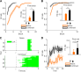

图3.2连续学习提高了对新任务的早期表现

Figure 3.2 Continual learning improved early performance on the new task

>无论听觉还是视觉线索，连续学习相比于初始学习，学习曲线均整体上移，尤其体现为首个训练单元中小鼠舔舐到水的成功率更高。（A）比较视觉任务的初始（27只鼠）与连续（22只鼠）学习曲线及首个训练单元中小鼠舔舐到水的成功率，首个训练单元条形图秩和检验$p<10^{-5}$。（B）比较听觉任务的初始（21只鼠）与连续（19只鼠）学习曲线及首个训练单元中小鼠舔舐到水的成功率，首个训练单元条形图秩和检验p<0.001。（C）视觉任务的初始和连续学习各一只代表性鼠的首个训练单元行为记录。初始学习时，舔舐行为都发生在给水之后；连续学习时，舔舐动作则常在线索之后、给水之前就已经开始。（D）将初始（27只鼠）和连续学习（22只鼠）首个训练单元的30个单次线索-舔水试验展开，逐个单次线索-舔水试验比较小鼠舔舐到水的成功率。首个单次线索-舔水试验差异不大，连续学习的优势主要来自较晚出现的单次线索-舔水试验。

>For both auditory and visual cues, learning curves in continual learning were upward-shifted relative to naive learning, especially as reflected by higher hit rates in the first block. (A) Learning curves and first-block hit rates for naive (27 mice) and continual (22 mice) learning in the visual task; the first-block bar comparison gave a rank-sum $p<10^{-5}$. (B) Learning curves and first-block hit rates for naive (21 mice) and continual (19 mice) learning in the auditory task; the first-block bar comparison gave a rank-sum p<0.001. (C) Representative first-block behavioral records from one naive mouse and one continual-learning mouse in the visual task. During naive learning, licking occurred only after water delivery; during continual learning, licking often began after cue onset and before water delivery. (D) The 30 trials in the first block of naive (27 mice) and continual learning (22 mice) were expanded to compare hit rates trial by trial. The first-trial difference was small, and the advantage of continual learning mainly emerged in later trials.

结果显示，无论听觉任务还是视觉任务，连续学习均较初始学习更快，表现为首个训练单元中小鼠舔舐到水的成功率更高且学习曲线整体上移（图3.2）。因此，本实验设计的跨模态连续学习体系能令旧经验对新学习起促进作用。由于过短的听觉学习过程不利于展开分析，本文后续侧重分析视觉任务的连续学习，听觉任务则作为初始学习任务置于视觉任务之前，为视觉任务提供预训经验。
## 3.3 连续学习加快了对新任务的学习速率
除了单纯的小鼠舔舐到水的成功率更高，连续学习优势通常还体现在先前经验使动物在后续相关任务中的小鼠舔舐到水的成功率增长更快，即学习曲线更陡（Harlow, 1949）。

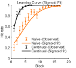

图3.3连续学习加快了对新任务的学习速率

Figure 3.3 Continual learning accelerated the learning rate on the new task

>使用Sigmoid函数拟合（约束：下限0，上限1，中点不限，斜率非负）蓝光线索初始（27只鼠）和连续（22只鼠）学习曲线，并进行10000次组间随机置换检验，确认连续学习斜率显著高于初始，p=0.04。

>A Sigmoid function was used to fit the blue-light-cue naive (27 mice) and continual (22 mice) learning curves, with the lower bound constrained to 0, the upper bound constrained to 1, the midpoint unconstrained, and the slope constrained to be non-negative. A between-group random permutation test with 10000 shuffles confirmed that the fitted slope was significantly higher in continual learning than in naive learning (p=0.04).

Sigmoid拟合斜率的方法确认了本实验的连续学习也存在增长速度的优势（图3.3）。
## 3.4 小结
本章建立了一套适用于头部固定小鼠的跨模态线索-舔水关联连续学习行为学范式。在比较听觉与视觉两种线索任务的初始学习差异时，发现小鼠对听觉线索任务的学习速度显著快于视觉线索任务。在此基础上，本研究通过交换提示线索，系统评估了既往经验对新任务学习进程的促进作用。

行为学结果明确证实了连续学习能够显著促进小鼠对新任务的掌握，且这种促进作用可以拆解为两个不同维度的优势分量：首先，连续学习显著提高了小鼠对新任务的早期表现，表现为新任务首个训练单元中小鼠舔舐到水的成功率整体抬升；其次，连续学习显著加快了新任务的后续学习速率，表现为具有更陡峭的学习曲线（Sigmoid拟合斜率更大）。

这两个可独立观测的行为学特征表明，连续学习的优势可能并非由单一的神经活动介导，而是兼顾了对即时表现的支撑与对突触更新的加速。这一行为学层面的拆解，为后续利用在体双光子钙成像与特定脑区干预手段，分别探究这两种优势背后独立的神经环路机制（皮层记忆印迹的重激活与丘脑调控的群体响应分化）奠定了坚实的基础。
# 第4章 连续学习中重激活的皮层神经元支持了新任务的早期表现
连续学习中的首个训练单元中小鼠舔舐到水的成功率更高，意味着新线索在未经训练的条件下，就有一定概率直接激活先前学会的感知-动作关联，触发既有行为输出。要理解这一现象，必须先充分描述初始任务中的学会状态。

图4.1在体实时双光子钙成像

Figure 4.1 In vivo two-photon calcium imaging

>（A）在线索前的冷静期内，小鼠必须持续抑制舔舐动作；一旦忍不住舔了，冷静期即被重置，小鼠即面临惩罚性的加长等待：该阶段定义为静息态。线索出现后，小鼠则需在1s内切换至动作态，即执行舔舐动作。（BC）前人（Komiyama et al., 2010）通过跨突触追踪和皮层微刺激实验确定了两个彼此不重叠的候选舌相关运动皮层区，并在其交界附近进行钙成像。鼠脑脑轮廓上的红点表示Bregma点。（B）多只鼠光刺激实验确定的舌运动控制区。（C）电刺激实验确定的舌运动控制区。（D）从舌头进行跨突触逆向追踪所标记的亚区。（E）运动皮层与舌之间连接的示意图。（F）综合微刺激和跨突触追踪结果后，在交界区注射GCaMP6f病毒。（G）皮层主要区域和注射点的顶视图。（H）在小鼠初级运动皮层周围开窗，并在任务训练过程中实施在体双光子钙成像。（I）一个示例成像视野，图中手工勾画出细胞轮廓。

>(A) During the pre-cue quiet period, mice had to continuously suppress licking; any lick reset the quiet period, resulting in a punitive extended wait. This stage is defined as the resting state. After cue onset, mice had to switch into the action state within 1s and execute licking. (BC) Previous studies (Komiyama et al., 2010) identified two non-overlapping candidate tongue-related motor cortical areas through transsynaptic tracing and cortical microstimulation, and calcium imaging was performed near their border. The red dot on the mouse brain outline indicates Bregma. (B) Tongue motor control area determined by photostimulation experiments across multiple mice. (C) Tongue motor control area determined by electrical stimulation experiments. (D) Subregions labeled by transsynaptic retrograde tracing from the tongue. (E) Schematic diagram of the connections between the motor cortex and the tongue. (F) Based on the combined results of microstimulation and transsynaptic tracing, the GCaMP6f virus was injected into the border region. (G) Top view of major cortical areas and the injection site. (H) A cranial window was implanted around the mouse primary motor cortex, and in vivo two-photon calcium imaging was performed during task training. (I) An example imaging field of view, with manually outlined cell contours.

行为方面，在头部固定小鼠的舔水范式任务中，动物需要学会两件事：一是在线索前抑制过早舔水，二是在线索出现后及时执行舔水动作（Inagaki et al., 2018）（图4.1A）。

初级运动皮层（Primary Motor Cortex, MOp）是皮层运算网络的输出端。无论是听觉还是视觉线索，都要经过这里转变为舌头的运动或不运动（图4.1E）。前人的刺激和追踪实验提供了一个合适的参考注射位点（图4.1B、C、F）：在MOp2/5层注射GCaMP6f钙指示荧光探针病毒后，在周围开颅窗，用玻璃和牙科水泥封闭，就可以在任务训练过程中实时进行在体双光子钙成像视频拍摄（图4.1H）。拍摄的视频中可以手工圈出其中的细胞亮斑，通过一些配准算法处理后还能实现跨天追踪同一群细胞的长期变化（图4.1I）。
## 4.1 声音线索任务学会后皮层形成稳定的线索响应

图4.2声音线索任务学会后皮层形成稳定的线索响应

Figure 4.2 Stable cue responses in the cortex after learning the auditory task

>（A）不同于仅进行行为学训练的实验，参与钙成像的鼠，还在正式开始学习前被记录了仅给线索和仅给水条件下的钙活动。热图中每一行表示一个细胞，每一列内的横轴表示时间，四列分别对应：仅给声音、仅给水，以及声音线索初始学习任务的首个训练单元和学会后。排除了四列中均无活跃的细胞。共5只鼠。（BCD）初始任务学会后，细胞形成对声音线索的不同钙活动响应特性。有的细胞原本活动方向反转，也有的继续加速。（B）展示两个代表性反转细胞。静息态逐渐衰退的细胞可以被线索突然激活（左），静息态钙信号上升中的细胞也可以被线索突然抑制（右）。绿色虚线连接[-1,0,1]三个关键时间点，其非单调性是反转的特征。（C）展示两个代表性加速细胞，可以是静息态活动逐渐增强的细胞继续加速上升，也可以是静息态逐渐衰退的细胞被线索进一步强力抑制。绿色虚线同样连接[-1,0,1]三个关键时间点，线索信号并未改变这些细胞的钙信号走向，而是对原有变化趋势起到推进作用。（D）比较11只鼠中A、B两类细胞的总体占比，发生反转的A类细胞占多数（3401个细胞），B类只有2066个细胞。（E）用主成分分析展示所有细胞构成的状态空间（声音线索任务学会后），在不同单次线索-舔水试验的起始时点（声音线索）和结束时点（给水，响应窗结束）在状态空间中的位置。每条红色实线表示一个单次线索-舔水试验，颜色渐变表示单次线索-舔水试验顺序，浅色表示早期单次线索-舔水试验。蓝色虚线将每个单次线索-舔水试验中线索给出前的静息状态位置连接起来，显示静息态在状态空间中的漂移路线。14只鼠，6889个细胞。

>(A) Unlike mice used only for behavioral training, mice included in calcium imaging were also recorded before formal learning under cue-only and water-only conditions. In the heatmap, each row represents one cell, and the horizontal axis within each column denotes time. The four columns correspond to sound only, water only, the first block of the naive sound-cue learning task, and the learned state. Cells inactive in all four columns were excluded. A total of 5 mice were included. (BCD) After the naive task was learned, cells developed diverse calcium response properties to the sound cue. Some cells reversed their original activity direction, while others continued to accelerate. (B) Two representative reversing cells. A cell with gradually decaying resting-state activity could be suddenly activated by the cue (left), and a cell with rising resting-state calcium signals could be suddenly inhibited by the cue (right). Green dashed lines connect three key time points [-1, 0, 1]; their non-monotonicity is characteristic of reversal. (C) Two representative accelerating cells. A cell with gradually increasing resting-state activity could continue to accelerate (left), and a cell with gradually decaying resting-state activity could be further strongly inhibited by the cue (right). Green dashed lines also connect the three key time points [-1, 0, 1]; the cue signal did not change the direction of these cells' calcium signals but instead propelled their original trend. (D) Comparison of the overall proportions of type A and B cells across 11 mice. Reversing type A cells constituted the majority (3401 cells), whereas type B cells numbered only 2066. (E) Principal component analysis was used to display the state space constructed by all cells (after learning the sound-cue task), showing positions in the state space at the start (sound cue) and end (water delivery, end of response window) of different trials. Each solid red line represents one trial, with the color gradient indicating trial order (lighter colors denote earlier trials). The blue dashed line connects the resting-state positions before the cue of each trial, illustrating the drift trajectory of the resting state within the state space. 14 mice, 6889 cells.

在首个训练单元中，声音-给水关联任务的全细胞响应格局，大致相当于仅给声音和仅给水的响应的简单叠加。而在声水任务达到学会标准后，细胞活跃的格局则发生了整体变化：首个训练单元活跃的细胞在学会后一部分保留，也有一部分沉默甚至抑制（图4.2A）。

由于线索呈现时机被刻意设计为随机的，小鼠必须在线索到来后有限时间（1s）内完成大脑和行为状态的快速切换。线索到来前对过早舔舐冲动的主动持续抑制过程，可称为“静息态”；线索到来后对舔舐动作的快速启动，可称为“动作态”。其中，静息态至少存在两套互相对抗的系统：口面部感觉运动区的抑制，与压制过早反应有关；而前外侧运动皮层（anterior lateral motor cortex, ALM）等前运动区的持续活动，则与后续舔水计划密切相关（Inagaki et al., 2018）。因此，舔舐行为可能并非仅由听觉线索单方面驱动，皮层网络本身也可能预先处于主动抑制和舔水冲动的对抗状态。这种平衡随后被线索信号打破，表现为部分细胞原本的上升或下降趋势在线索到来时刻的反转（图4.2B），以及另一部分细胞反而在原有变化趋势上进一步加速（图4.2C）。这两类细胞代表了静息态到动作态切换的两种并行的可能机制：其一，线索输入经感觉-运动通路被快速级联放大，迅速激活行为驱动环路并解除静息态的主动运动抑制；其二，网络在静息态本已存在朝动作输出方向的冲动的缓慢积累或自发状态漂移，而线索信号主要起到推动其越过动作启动阈值的作用。从细胞数量占比上看（图4.2D），直接被线索信号反转的细胞占据主导地位，这说明静息态向动作态的切换，相比于行为冲动的积累、自发状态漂移或时间预判，更多地是依赖线索信号的直接驱动。

但是，行为表观上的静息或动作，并不能过度简化地映射到神经活动静态的二元分类。例如，即使在行为表观上相同的静息或等待相关状态下，皮层活动状态也呈现持续的时空流动；但这种流动并非完全无序，而是可由状态空间中的少数低维流形模式加以概括（MacDowell & Buschman, 2020）。尤其是在本实验随机长度的冷静期框架下，线索信号到来时网络状态可能落在静息态流形轨迹上的不同位置——它们实际上是同一潜在动态演化过程中的不同瞬时静态快照，而不是彼此孤立的离散状态。

主成分分析显示，线索输入时的静息状态空间位置，按单次线索-舔水试验顺序确实在低维子空间里形成了一条流形轨迹；但无论起点如何，线索到来后的状态都在1s内朝一致的方向演进，而不是向某一特定目标点汇聚（图4.2E）。也就是说，动作态并不是状态空间中的某个特定位置，而是一个具有特定方向的演进动态，它是线索信号驱动后直接追加在当前的静息态漂移流形上的，而不是将状态向一个固定目标收束。
## 4.2 连续学习中新线索重新激活了旧任务的相关细胞
在旧任务学会后，测得未经训练的新任务中小鼠舔舐到水的成功率提升，这种现象可以关联到记忆印迹和泛化相关理论。现有研究并不把泛化归结为单一机制，但普遍承认，新线索能够通过重激活既有印迹中的部分神经元，实现对旧经验的提取；不同任务激活的细胞群体如能有更高重叠，也更容易表现出记忆联结、信息互用或泛化（Josselyn & Tonegawa, 2020）。因此，已学会的声音线索旧任务激活的细胞群体，如能被新的蓝光线索重激活，则可以解释新线索任务中小鼠舔舐到水的成功率提升。

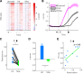

图4.3连续学习中新线索重新激活了旧任务的相关细胞

Figure 4.3 Reactivation of old-task-related cells by the new cue in continual learning

>用线索前3s作为基线，将1s时刻z-score超过基线均值加3倍标准差的细胞定义为活跃细胞。共11只鼠。（A）热图展示在声音线索任务（旧任务）学会时、蓝光线索任务（新任务）首个训练单元中成功舔水和未成功舔水的单次线索-舔水试验，这三列条件下的细胞活跃格局，排除了三列均不活跃的细胞，剩余760个细胞。每一行表示同一个细胞，每一列内横轴表示时间。成功舔水列与旧任务学会列更相似，而未成功舔水列差异较大。（B）取声音线索任务学会时活跃的511个细胞，比较其在蓝光线索任务成功舔水/未成功舔水的单次线索-舔水试验中的钙信号曲线，阴影表示均值标准误（standard error of the mean, SEM）。结果显示，这些细胞在成功舔水的单次线索-舔水试验中更活跃，在未成功舔水的单次线索-舔水试验中则偏静默或延迟。（C）以鼠为单位，配对比较新任务成功舔水/未成功舔水的单次线索-舔水试验中的重激活率，即旧任务学会时活跃的511个细胞在新任务中再次激活的占比。结果显示成功舔水条件下的重激活率显著高于未成功舔水条件（p<0.001）。（D）取旧任务学会时活跃的511个细胞，比较其在新任务成功舔水/未成功舔水的单次线索-舔水试验中的1s z-score，结果显示成功舔水条件下更高。（E）基于旧任务学会时活跃的511个细胞，将每只鼠在新任务中的重激活率与小鼠舔舐到水的成功率绘制为散点，并计算Spearman相关性。Spearman ρ = 0.6973。

>Using the 3s pre-cue period as baseline, cells whose z-score at 1s exceeded the baseline mean plus 3 SD were defined as active cells. A total of 11 mice were included. (A) Heatmaps show the cellular activity patterns under three conditions: after the sound-cue task (old task) was learned, hit trials in the first block of the blue-light cue task (new task), and miss trials in the first block of the blue-light cue task. Cells inactive in all three columns were excluded, leaving 760 cells. Each row represents the same cell, and the horizontal axis within each column denotes time. The hit column was more similar to the learned old-task column, whereas the miss column differed more strongly. (B) The 511 cells active when the sound-cue task was learned were used to compare calcium traces between hit and miss trials in the blue-light cue task; shading indicates ±SEM. These cells were more active in hit trials, while tending to be silent or delayed in miss trials. (C) Reactivation rates in hit and miss trials of the new task were compared within mice using paired analysis. Reactivation rate was defined as the proportion of the 511 cells active when the old task was learned that became active again in the new task. Reactivation was significantly higher in hit trials than in miss trials (p<0.001). (D) For the 511 cells active when the old task was learned, 1s z-scores in new-task hit and miss trials were compared, showing larger responses in hit trials. (E) Based on the 511 cells active when the old task was learned, reactivation rate in the new task was plotted against hit rate for each mouse, and Spearman correlation was calculated. Spearman ρ = 0.6973.

多种统计结果一致支持理论：相比于未成功舔水的单次线索-舔水试验，新任务中成功舔水的单次线索-舔水试验的细胞激活格局更接近旧任务学会时（图4.3A）；旧任务学会时活跃的细胞，在新任务成功舔水的单次线索-舔水试验中被重新激活的概率更高、激活强度也更大（图4.3B、C、D）；在鼠间比较中，在新任务中对旧任务活跃群体的重激活率更高的个体也具有更高的新任务中小鼠舔舐到水的成功率，其中重激活率和小鼠舔舐到水的成功率呈显著相关（图4.3E）。因此可以认为，连续学习的新任务首个训练单元较高的小鼠舔舐到水的成功率，与已学会的旧任务中活跃细胞在新线索条件下的重新激活密切相关，这与泛化理论中相似线索诱发部分重叠的印迹细胞复用的基本框架一致。
## 4.3 重激活的神经元活动提高了新任务的早期表现
重激活分析并不能直接回答，同一个任务作为初始学习和连续学习，在细胞层面究竟有何实质性差异，因为初始学习不存在一个旧任务可以用来计算重激活率。要让这两种学习情境可比较，就必须找到一个起中介作用、不依赖旧任务的神经指标，其自身能够同时应用于初始和连续学习并进行同一维度上的比较，同时又和重激活率相关，且能被重激活直观解释。

最简单的猜想是总体活跃强度或活跃细胞占比这一类基础的群体活动指标，因为重激活效应在逻辑上最直观的解释就是：初始学习过程生产了一批更易被新任务招募的潜在高响应细胞，使得新线索的输入能更强力地驱动原有网络的状态切换。

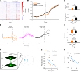

图4.4重激活的神经元活动提高了新任务的早期表现

Figure 4.4 Reactivated neuronal activity improved early performance on the new task

>（ABC）比较蓝光线索任务作为初始和连续学习时的各种神经活动特征。初始学习组14只鼠、4586个细胞；连续学习组11只鼠、5105个细胞。（A）热图展示全细胞活跃格局。纵轴为细胞，但两列来自不同鼠，因此细胞并未跨列对齐，主要用于比较整体活动强度。（B）线图比较全细胞平均钙曲线，两者基本重合，但在1s附近连续学习钙曲线更高。（C）上：比较全细胞平均1s z-score，图中显著性标注对应p=0.004；下：用线索前3s作为基线，将1s时刻z-score超过基线均值加3倍标准差的细胞定义为“活跃”细胞，比较活跃细胞占比，Fisher精确检验p<10^-13。连续学习时全细胞平均1s z-score和活跃细胞占比都更高。（D）代表性细胞和单次试验的钙曲线，示意稳定性与平均值的关系。每个子图是一个细胞的一个训练单元，细线是各单次试验，粗线是均值。左：初始学习蓝光线索任务首个训练单元的一个细胞，单次试验间响应较不稳定，导致平均后趋于零响应。中：初始学习声音线索任务学会时的一个细胞，不同单次试验间响应相对稳定，因此在平均后仍保留较清晰的正向活跃曲线。右：与中图同一个细胞，在连续学习蓝光线索任务时，不同单次试验间响应也较稳定（相比于左图初始学习），因而均值也是明晰的正向响应。（E）分2/5层比较蓝光线索任务作为初始和连续学习时，线索后1s z-score的相对散度。MOp2/3层：初始14只鼠、2676个细胞，连续11只鼠、2369个细胞；MOp5层：初始11只鼠、1910个细胞，连续10只鼠、2736个细胞。MOp2/3层在连续学习时散度显著更低，5层差异不显著。（F）示意利用8㎐振荡镜头实现MOp2/3层与5层的伪同步拍摄。（G）蓝光线索任务首个训练单元的散度与小鼠舔舐到水的成功率之间的Spearman相关性，一个点一只鼠，点的形状和颜色区分初始学习和连续学习两组。初始学习14只鼠，连续学习11只鼠，Spearman ρ=-0.755。（H）蓝光线索任务的首个训练单元的散度与重激活率之间的Spearman相关性，一个点一只鼠，仅包括连续学习。n=11，ρ=-0.836。

>(ABC) Various neural activity features were compared when the blue-light cue task was learned as naive learning or continual learning. The naive-learning group included 14 mice and 4586 cells; the continual-learning group included 11 mice and 5105 cells. (A) Heatmaps show the global activity patterns of all cells. The vertical axis represents cells, but the two columns came from different mice, so cells were not aligned across columns; the main purpose is to compare overall activity strength. (B) Line plots compare calcium traces averaged across all cells. The two traces largely overlapped, but the continual-learning trace was higher around 1s. (C) Top: comparison of the all-cell mean 1s z-score; the significance annotation shown in the panel corresponded to p=0.004. Bottom: using the 3s pre-cue period as baseline, cells whose z-score at 1s exceeded the baseline mean plus 3 SD were defined as active, and the fraction of active cells was compared; Fisher's exact test p<10^-13. During continual learning, both the all-cell mean 1s z-score and the fraction of active cells were higher. (D) Representative calcium traces of example cells and trials illustrating the relationship between stability and averaging. Each subplot shows one cell in one block; thin lines are individual trials and thick lines are means. Left: a cell during the first block of naive light-water learning, showing unstable trial-to-trial responses that average toward zero. Middle: a cell during learned audio-water, showing relatively stable responses that preserve a clear positive mean trace after averaging. Right: the same cell as in the middle panel, now during continual light-water learning, showing similarly stable responses (compared with the left panel) and therefore a clear positive mean. (E) Relative divergence of 1s z-scores after cue onset in naive versus continual light-water learning, compared separately for layers 2/3 and 5. For MOp2/3, naive learning included 14 mice and 2676 cells, and continual learning included 11 mice and 2369 cells; for MOp5, naive learning included 11 mice and 1910 cells, and continual learning included 10 mice and 2736 cells. Only layer 2/3 showed significantly lower divergence during continual learning. (F) Schematic of pseudo-simultaneous imaging of MOp2/3 and MOp5 using an 8㎐ oscillating objective. (G) Spearman correlation between divergence in the first block of the light-water task and hit rate; each point represents one mouse, with point shape and color distinguishing naive and continual-learning groups. There were 14 naive-learning mice and 11 continual-learning mice, and Spearman ρ=-0.755. (H) Spearman correlation between divergence in the first block of the light-water task and reactivation rate; each point represents one mouse, and only continual learning was included. n=11, ρ=-0.836.

统计结果基本支持以总体活跃度概括初始和连续学习之间的直接差异。蓝光线索任务作为初始和连续学习时在全细胞总体活跃强度上有显著差异（图4.4A、C）。平均钙曲线也是连续学习在1s处更高，但有趣的是，这个差异仅表现在1s附近，更早和更晚时两条线基本重合（图4.4B）。这一现象提示，在连续学习阶段存在特定细胞群将早期的线索响应与晚期的奖赏响应相关联，且该细胞群体可能直接继承自初始任务的学会阶段。这进一步证实，线索后1s的钙信号动态是区分初始与连续学习差异的关键时间窗口，因此后续分析将重点聚焦于该时段。

初始的声音线索任务学会状态下，即使单次试验之间存在持续漂移的不同静息态，收到线索后的状态仍被叠加大致相同方向的演进动态（图4.2）。Gallego等在跨天记录灵长类背侧前运动皮层（dorsal premotor cortex, PMd）、M1和S1时也进一步指出，稳定行为对应的并不是每个单细胞都维持不变，而是低维 latent dynamics 在重复执行同一行为时仍保持稳定；即使单细胞活跃水平会漂移，群体轨迹本身仍可高度一致（Gallego et al., 2020）。本节讨论的亚群分化和群体组织，实际上也同样要求不同单次试验的线索产生相同方向的细胞响应：否则计算单次试验间均值时会发生正负抵消导致结果接近于0，表现为类似初始学习那样相对较低的活跃细胞占比。

实验结果支持，相比于初始学习，蓝光线索任务在连续学习时的钙曲线在单次试验间更稳定一致（图4.4D）。这种特性可以用相对散度衡量，散度的算法参见2.8，其核心思路是用单次试验间线索后1s z-score的方差除以单次试验间平均活动强度，得到的相对散度消除了不同训练单元拍摄条件差异，这样计算出的相对散度越小，表示各单次试验围绕同一平均状态聚拢得越紧，也就意味着线索后网络进入动作相关状态的轨迹越稳定。计算结果，相对散度与首个训练单元中小鼠舔舐到水的成功率呈反相关（图4.4G），这样就确认了相对散度可以作为一个能直接关联到行为指标的神经活动特征。同时，相对散度与重激活率也呈反相关（图4.4H），这提示旧任务中活跃的细胞的确积极贡献到新任务中，它们的活跃能够有效压低单次试验间的相对散度，进一步关联到任务中小鼠舔舐到水的成功率的提升。

但是，旧经验对MOp2/5两层的影响并不平等。在拍摄过程中使用8㎐的震荡发生器令镜头上下振动，可以实现对两层的伪同步拍摄（图4.4F）。结果发现，仅2/3层的相对散度在连续学习时显著低于初始；5层则无显著差异（图4.4E），也就是说，虽然MOp5层也从旧任务中继承了部分活跃细胞，但它们未能使本层对线索的响应在单次试验间更加稳定。这提示，新任务学习中与旧任务结构稳定复用更相关的细胞，可能更多存在于2/3层而非5层。
## 4.4 抑制了旧任务中的记忆印迹细胞削弱了新任务早期的行为表现
cFos是一种反映神经活跃度的即早基因，在活动依赖标记研究中常用来为某一时间窗内被任务招募的细胞提供遗传操作入口。Guenthner等建立的TRAP系统，将cFos或Arc等即早基因启动子与$Cre^{ER}$耦合，再在给定时间窗注射他莫昔芬（tamoxifen, TM）或4-羟基他莫昔芬（4-hydroxytamoxifen, 4-OHT），就可以令该时间窗内活跃的细胞永久性启动后续的Cre依赖基因表达：不仅能标记感觉刺激激活的细胞，也能标记更复杂任务中被招募的细胞（Guenthner et al., 2013）。例如，Koya等利用cFos驱动的Daun02失活方法，选择性抑制先前被可卡因配对情境激活的伏隔核稀疏细胞群后，情境特异性行为敏化随之减弱，说明由即早基因定义的活跃细胞群对后续行为表达具有因果作用（Koya et al., 2009）；在记忆印迹研究中，Liu等进一步证明，学习时被cFos标记的海马稀疏细胞群在后续被人工重激活时能够触发任务记忆相关行为（Liu et al., 2012）。

图4.5抑制了旧任务中的记忆印迹细胞削弱了新任务早期的行为表现

Figure 4.5 Inhibition of engram cells from the old task impaired early performance on the new task

>（A）示意cFos标记抑制实验。在$cFos-Cre^{ER}$基因型小鼠的MOp脑区注射pAAV-hSyn-DIO-hM4D(Gi)-mCherry病毒。初始声音线索任务学会后，腹腔注射Tamoxifen(TM)玉米油溶液，经过24h药代动力学间隔后再次进行声音线索任务训练，以标记任务学会状态下活跃的细胞。被标记细胞需约1~2周完成hM4D(Gi)-mCherry表达积累。随后学习蓝光线索任务，并在训练前1h注射CNO以启动hM4D(Gi)介导的抑制效应，从而抑制在旧任务中因活跃而被标记的细胞，阻止其发生重激活。对照组则在TM注射24h后不进行标记训练，因此标记抑制的是homecage中活跃的细胞。（B）mCherry报告的cFos标记细胞在MOp（白色虚线框）中的表达分布。（C）比较抑制组（蓝）和对照组（红）的学习曲线：抑制组学习曲线整体下移。由于新旧任务之间间隔了1~2周表达积累期，对照组学习曲线也偏低，但仍高于抑制组。对照组9只、cFos抑制组3只；学习曲线线性混合效应模型（linear mixed-effects model, LME）组主效应p=0.0003。（D）非特异性抑制对照。在不进行cFos标记的情况下，直接于MOp注射广谱pAAV-hSyn-hM4D(Gi)-mCherry病毒（蓝），同样在新任务训练前1h注射CNO进行抑制，相对于注射pAAV-hSyn-mCherry的纯荧光对照组（红），未产生明显抑制效应。对照组8只、hM4D(Gi)组3只；学习曲线LME组主效应p=0.65。（E）将旧任务学会阶段细胞，按照线索后1s z-score是否超过线索前3s均值+3倍标准差，分为活跃和不活跃两群，分2/5层比较它们在新任务中的相对散度：活跃群体散度显著低于不活跃群体。MOp2/3层纳入11只配对鼠，活跃/不活跃细胞分别为588/1781个，Wilcoxon符号秩检验p<0.001；MOp5层纳入10只配对鼠，活跃/不活跃细胞分别为416/2320个，Wilcoxon符号秩检验p=0.027。（F）cFos抑制和对照组的连续学习首个训练单元展开，逐个单次线索-舔水试验比较小鼠舔舐到水的成功率。对照组9只、cFos抑制组3只；以单次线索-舔水试验为单位的混合效应模型p=0.62。（G）cFos抑制和对照组的学习曲线的Sigmoid拟合。10000次随机置换检验p=0.59，差异不显著。这可能是因为重复较少，cFos组只有3只鼠，对照组9只。

>(A) Schematic of the cFos-tagging inhibition experiment. In $cFos-Cre^{ER}$ mice, pAAV-hSyn-DIO-hM4D(Gi)-mCherry was injected into MOp. After audio-water learning, tamoxifen in corn oil was administered, followed by a 24h pharmacokinetic interval and an additional audio-water training session to label task-active cells with cFos. These tagged cells required approximately 1–2 weeks to accumulate hM4D(Gi)-mCherry expression. Mice were then switched to the light-water task, and CNO was injected 1h before training to activate hM4D(Gi)-mediated inhibition, thereby suppressing cells that had been active during audio-water learning and preventing their reactivation. In control animals, no tagging session was given 24h after tamoxifen, so that the tagged and inhibited cells were those active in the home cage. (B) Distribution of mCherry-reported cFos-tagged cells in MOp (white dashed outline). (C) Learning curves of the inhibition group (blue) and control group (red), showing an overall downward shift in the inhibition group. Because the 1–2-week expression-accumulation period intervened between the old and new tasks, the control group's learning curve was also somewhat lower, but still higher than the inhibition group. Control, 9 mice; cFos inhibition, 3 mice; LME group effect for the learning curve, p=0.0003. (D) Non-specific inhibition control: broad MOp hM4D(Gi) inhibition without cFos tagging (blue), compared with fluorescent controls (red), showed no significant effect. Control, 8 mice; hM4D(Gi), 3 mice; LME group effect for the learning curve, p=0.65. (E) Cells were divided into active and inactive populations according to their activity during learned audio-water, and divergence during continual light-water learning was compared between the two populations in layers 2/3 and 5. The active population showed significantly lower divergence than the inactive population. In MOp2/3, 11 paired mice were included, with 588 active and 1781 inactive cells, Wilcoxon signed-rank p<0.001; in MOp5, 10 paired mice were included, with 416 active and 2320 inactive cells, Wilcoxon signed-rank p=0.027. (F) The first block of continual learning was expanded for the cFos inhibition and control groups to compare hit rates trial by trial. Control, 9 mice; cFos inhibition, 3 mice; trial-by-trial mixed-effects model, p=0.62. (G) Sigmoid fits of the learning curves in the cFos inhibition and control groups. A random permutation test with 10000 shuffles gave p=0.59, indicating no significant difference. This may be because the number of replicates was small, with only 3 mice in the cFos group and 9 mice in the control group.

前已述旧任务相关细胞重激活与新任务中小鼠舔舐到水的成功率之间的关联，而因果性验证则需特异性抑制这些细胞以阻止其重激活。实验方法是，向$cFos-Cre^{ER}$基因型小鼠的MOp注射pAAV-hSyn-DIO-hM4D(Gi)-mCherry病毒，在旧任务学会后注射TM，然后等待24h药代动力学过程，再做一次旧任务。活跃细胞表达的$Cre^{ER}$原本定位在细胞质（内质网）中，但在TM的药代动力学时间窗内，会因结合了TM而进入细胞核，导致永久性的DIO翻转，启动hM4D(Gi)-mCherry的表达。TM-训练标记过程可重复进行以增加标记细胞数量，但过多重复标记会降低特异性。经过1~2周的表达水平积累，旧任务学会状态招募的细胞即被特异性标记，且后续可被CNO抑制（图4.5A、B）。

在新任务训练单元前1h注射CNO，以阻止旧任务相关细胞的重激活，可导致学习曲线整体下移（图4.5C）。由于新任务的较低散度的主要贡献者就是旧任务学会时活跃的细胞，且这些活跃群体的相对散度显著低于不活跃群体（图4.5E），因此使用cFos标记这些细胞进行抑制后可以认为是提高了相对散度。反之，若不进行特异性标记而仅广谱抑制MOp全部神经元，则未见明显效应（图4.5D）。这说明重激活的细胞不仅是必要的，而且是旧任务特异性相关的：并不是任何非特异性操纵MOp整体活跃性的方法都能影响新任务中小鼠舔舐到水的成功率。

但是，细胞层面的操纵始终存在一个潜在风险：虽然特异性标记了旧任务学会时活跃的细胞，但这些细胞仍可能与非任务特异的基础学习能力有关，如感知或运动相关功能等。抑制这些细胞可能并非仅仅针对性地干扰了新任务对旧经验的复用，而是导致小鼠对任何任务都普遍地变得更难以学会。
## 4.5 延长新旧任务时间间隔降低了细胞重激活比例并削弱早期表现
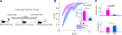

图4.6延长新旧任务时间间隔降低了细胞重激活比例并削弱早期表现

Figure 4.6 Prolonging the interval between old and new tasks reduced cell reactivation and impaired early performance

>（A）示意7天遗忘实验。声音线索初始任务学会后不立即学习新任务，而是间隔7天后再学习蓝光线索任务。对照是无间隔的正常连续学习。（B）与正常连续学习（红，11只鼠）相比，7天遗忘后（蓝，6只鼠）的学习曲线和首个训练单元中小鼠舔舐到水的成功率均较低；学习曲线线性混合效应模型组效应p=0.022，首个训练单元秩和检验p=0.0045。该行为图不涉及细胞计数。（C）与正常连续学习（红）相比，7天遗忘后（蓝）的旧任务相关细胞重激活率更低，单次试验间相对散度更高。重激活比较中，对照组包含11只鼠、511个旧任务活跃细胞，7天遗忘组包含5只鼠、252个旧任务活跃细胞，秩和检验p=0.027；散度比较中，对照组包含11只鼠、5105个细胞，7天遗忘组包含6只鼠、3523个细胞，秩和检验p=0.0049。

>(A) Schematic of the 7-day interval experiment. After audio-water learning, mice were not immediately switched to the new task but were instead left untrained for 7 days before starting the light-water task. The control group underwent normal continual learning without any interval. (B) Compared with normal continual learning (red, 11 mice), the 7-day interval group (blue, 6 mice) showed lower learning curves and lower first block hit rates; the learning-curve linear mixed-effects group effect was p=0.022, and the first block rank-sum test was p=0.0045. This behavior panel did not involve cell counts. (C) Compared with normal continual learning (red), the 7-day interval group (blue) showed lower reactivation of audio-water-active cells and higher trial-to-trial divergence. For reactivation, the control group included 11 mice and 511 audio-water-active cells, and the 7-day interval group included 5 mice and 252 audio-water-active cells (rank-sum p=0.027). For divergence, the control group included 11 mice and 5105 cells, and the 7-day interval group included 6 mice and 3523 cells (rank-sum p=0.0049).

要针对性操纵旧记忆而不影响基础学习能力，利用遗忘效应是一个巧妙的方法。在旧任务学会后不立即学习新任务，而是恢复正常饲养，经过7天遗忘后再学习新任务（图4.6A）。考虑到初始任务学会后小鼠的月龄普遍已大于3个月，7天间隔产生的生长发育或衰老效应可认为不足以导致重大基础学习能力改变，因此所观察到的任何行为差异可以特异性地归因到旧经验的遗忘。

在经典场景恐惧泛化实验中，延长任务间隔通常会使记忆提取不再能精确区分不同场景，而是对相似场景也产生反应。Wiltgen和Silva的研究显示，训练后1、14、28、36天进行测试时，动物对新场景的恐惧冻结水平随时间升高，场景间的区分能力下降，提示记忆会随时间流逝而失去部分精确性并表现出更强泛化（Wiltgen & Silva, 2007）。然而，本实验的结果相反：7天遗忘后，新任务首个训练单元中小鼠舔舐到水的成功率显著下降（图4.6B），旧任务相关细胞的重激活率降低，单次试验间相对散度升高（图4.6C）。这说明长期遗忘对泛化效应的影响并非普适于所有任务设计类型。但是，重激活率的降低和相对散度的上升，与行为上的小鼠舔舐到水的成功率降低是一致的，进一步支持了旧任务相关细胞的重激活能降低单次试验间相对散度、提高新任务首个训练单元中小鼠舔舐到水的成功率的假说。
## 4.6 小结

图4.7细胞重激活与相对散度模型小结

Figure 4.7 Summary of the cell reactivation and relative divergence model

>声音线索初始任务学习中，细胞活动在不同单次试验间不稳定，小鼠舔舐到水的成功率较低。初始任务学会后，部分高活跃细胞可被蓝光线索重激活，这些细胞保留了旧任务学会时的单次试验间稳定性，并进一步通过兴奋-抑制平衡等机制降低新任务状态空间中的单次试验间相对散度。

>In naive audio-cued task learning, trial-to-trial cellular activity was unstable and hit rates were low. After audio-water learning, a subset of highly active cells could be reactivated by the light cue. These cells preserved the trial-to-trial stability of the learned audio-water state and, through mechanisms such as excitation–inhibition balance, further reduced trial-to-trial relative divergence in the new-task state space.

综上所述，本章通过在体双光子钙成像与操纵干预实验，系统揭示了连续学习中新任务早期表现提升的皮层细胞机制。其核心逻辑可概括为：旧任务的训练在初级运动皮层中塑造了稳定的记忆印迹网络；当面对新任务时，这些旧任务中稳定活跃的细胞被新线索跨模态重新激活。以这些重激活细胞为核心的网络（特别是在皮层2/3层），能够在总体活动强度大致不变的情况下，有效压低新任务状态空间中单次试验间的相对散度。这种网络响应的稳定化，使新任务的神经演进轨迹从一开始就更接近成熟的群体状态，从而在行为上表现为更高的初始阶段小鼠舔舐到水的成功率。

这一因果联系得到了特异性干预实验的充分印证：利用cFos-TRAP系统特异性抑制旧任务中的记忆印迹细胞，或是通过延长新旧任务的时间间隔诱导印迹的自然遗忘，都会显著降低细胞重激活比例、破坏网络状态的单次试验间稳定性（相对散度升高），并最终削弱新任务早期的行为优势。而非特异性的整体皮层抑制则无此效应。这表明，被重新募集的旧经验特定印迹细胞群，不仅是连续学习行为优势的相关现象，更是克服新任务初始不稳定性、支持新任务早期表现的必要神经基础。
# 第5章 连续学习中皮层神经元活动的高分化状态，加快了学习速率
关注学习速度的既有研究大多集中在群体状态空间和神经流形视角上。Sadtler等在脑机接口任务中发现，动物更容易学会服从于既有流形框架的活动模式，而明显违反该流形的模式则更难在数小时内快速掌握，说明既有环路结构本身就在约束不同任务形式的难易倾向（Sadtler et al., 2014）。Golub等进一步指出，短时程快速学习往往不是凭空生成全新的群体活动模式，而更接近对原有活动模式库进行重新关联或组合（Golub et al., 2018）。Hennig等则在脑机接口学习任务中观察到，运动皮层中存在类似于唤醒状态维持的、相对刻板的群体活动变化，即 neural engagement。这种任务非特异的状态叠加到当前任务后：若与当前任务要求更一致，就会使学习更快；若违背当前任务要求，则可拖慢学习（Hennig et al., 2021）。

图5.1初始学习状态的往复折返

Figure 5.1 Back-and-forth reversals in the naive learning state

>（AB）分别展示初始学习与连续学习的一个代表性细胞，显示其在学习过程中各训练单元（naive, S1→S7; continual, S1→S3）的活动变化及（z-score）对应行为表现（naive, 0%→100%; continual, 23%→100%）。初始学习细胞的跨训练单元变化方向更不稳定，连续学习细胞则更接近单调增强。（C）分别展示初始学习与连续学习的代表性小鼠在PCA空间中的学习轨迹。每个点表示一个训练单元的1s z-score状态，实线为实际学习轨迹，虚线表示连接起点与终点的直线方向及距离。初始学习轨迹有许多往复折返，连续学习则沿该方向较稳定推进。该面板中初始学习与连续学习代表鼠均为1只，分别包含501和420个细胞。（D）分2/5层比较每只鼠实际学习路程与最短学习距离的比值（偏离率）；比值越大，表示实际轨迹相对起点-终点直线连线的偏离越大。2/3层差异较小，5层则是初始学习偏离率更高。（E）分2/5层比较每只鼠实际学习路程中，每个训练单元的平均状态改变量（平均步长），用于测量跨训练单元的漂变或学习能力。两层均无显著差异。（F）分2/5层比较每一步在最优方向上的平均投影长度（有效步长），用于表征任务相关的有效学习能力。连续学习在2/3层有效步长更大。D-F使用同一分层统计样本：2/3层为初始学习11只鼠、1862个细胞，连续学习11只鼠、2369个细胞；5层为初始学习9只鼠、1509个细胞，连续学习10只鼠、2735个细胞。

>(AB) Representative cells from naive and continual learning, respectively, showing activity changes across blocks (naive, S1→S7; continual, S1→S3) together with the corresponding behavioral performance based on z-score (naive, 0%→100%; continual, 23%→100%). Cells in naive learning showed more unstable directions of change across blocks, whereas cells in continual learning were closer to monotonic increases. (C) Representative mice from naive and continual learning, respectively, showing learning trajectories in PCA space. Each point represents the 1s z-score state in one block; solid lines trace the actual learning trajectory, and dashed lines indicate the straight direction and distance connecting the start and end states. Naive learning showed many back-and-forth reversals, whereas continual learning progressed more stably along this direction. Panel C used one representative mouse per group, with 501 cells in the naive mouse and 420 cells in the continual mouse. (D) Ratio of actual path length to shortest learning distance for each mouse, compared separately for layers 2/3 and 5; larger ratios indicate greater deviation of the actual trajectory from the straight start-to-end path. The difference was small in layer 2/3, whereas in layer 5 the deviation ratio was higher in naive learning. (E) Average state-change magnitude per block along the actual learning path, compared separately for layers 2/3 and 5, used to measure across-block drift or learning ability. Neither layer showed a significant difference. (F) Average projection length of each step onto the optimal direction, compared separately for layers 2/3 and 5, used to characterize task-relevant effective learning ability. Continual learning showed a larger effective step length in layer 2/3. Panels D-F used the same layer-specific samples: layer 2/3 included 11 naive mice / 1862 cells and 11 continual mice / 2369 cells; layer 5 included 9 naive mice / 1509 cells and 10 continual mice / 2735 cells.

这些前瞻研究共同提示，连续学习的快速增长可能与初始任务形成的群体活动流形模式有关：新任务可以直接在这个既有框架内快速前进，而无需重构新的流形模式。PCA分析表明，相比于初始学习，连续学习过程在状态空间中的学习方向更稳定地从起点向终点推进，表现为往复折返更少，在起点向终点的投影方向上前进更快。（图5.1C）。这提示连续学习过程很可能服从了初始任务中已经形成的部分活动组织方式或流形结构约束，单细胞层面则表现为更多的细胞活动随训练单元推进呈现单调增或减（图5.1B）；相反，初始学习需要不断大幅重构原本不存在或与任务要求完全违背的基础流形结构，其学习路径和单细胞活动就容易出现跨训练单元的增减反复和方向摇摆（图5.1A）。

可以通过一系列计算指标反映这一差异，例如用实际在状态空间中划过的总路程除以起点和终点的直线距离，量化轨迹相对最短连线的曲折程度。进一步的分析揭示，在连续学习加速的过程中，MOp2/3层和5层在学习轨迹特征上表现出了明显的差异化分工。结果发现连续学习在状态空间中的路程/距离比确实更小，但这一减少效应主要集中在5层，说明5层网络在向目标状态收敛时显著降低了曲折程度（图5.1D）。也可以计算每个训练单元在起点到终点连线方向上的投影长度，衡量沿该方向的推进幅度，结果发现连续学习的投影步长也确实更大，但这一增长优势主要表现在2/3层，提示2/3层网络在驱动学习状态前移方面发挥了主导作用（图5.1F）。最后，可以计算总路程与训练单元步数之比，确认更快的连续学习是否有其本身每个训练单元的实际步长因素影响，结果发现无显著差异（图5.1E）。这些检验指向的共同结论是，连续学习的更大斜率，是因为状态空间中的学习轨迹更接近起点-终点连线、曲折程度更低；而初始学习虽然也在前进，但由于需要重建流形结构，学习状态更容易出现折返往复，进程缓慢。这一过程同时伴随着皮层浅层负责推进学习进度、深层负责减少误差折返的精细层级分工。
## 5.1 连续学习中的皮层神经元保持了旧任务中稳定的响应分化特征
在状态空间中看到的稳定的流形架构或学习方向，落实到细胞层面，实际上反映的是不同细胞之间的功能分化：有些细胞被线索稳定激活，称正响应群体；有些细胞反而被线索抑制，称负响应群体。这种正负响应群体的分化如果在不同训练单元之间保持稳定，即使单个细胞活动强度不高，也能起到稳定状态空间中的流形走向的效应。当大量细胞普遍有了稳定的正负方向分化，整体的学习方向也会趋于稳定，更高效地朝着正确目标前进。机器学习中有类似的理论提示：初始化条件与表征分化会影响优化速度和收敛路径（Saxe et al., 2014）。具体来说，一个初始权重分布高度一致的网络通常难以学习，因为梯度下降算法难以在相同的权重或激活强度之间产生差异化更新，难以找到正确的学习路径；反之，初始分布具有适当异质性的网络就更容易学习。在机器和动物上共通的规律是：一个确定的方向是快速学习的关键。

图5.2连续学习中的皮层神经元保持了旧任务中稳定的响应分化特征

Figure 5.2 Cortical neurons in continual learning maintained stable response differentiation features from the old task

>（A）用一个代表性训练单元直观展示响应异质性。下方为细胞×时间×单次试验的3D热图，显示细胞维度上向正负两端分化的分布；上方为1s z-score的单次试验均值的分布直方图。先计算各均值区间内的细胞占比，再将细胞间标准差定义为响应异质性指标。为减少极端细胞及鼠间总体活跃水平差异的影响，仅纳入[-1,1]范围内的温和响应细胞。（B）分2/5层比较初始学习蓝光线索任务、连续学习蓝光线索任务和已学会的声音线索任务的响应异质性。已学会的声音线索任务总是具有最高的响应异质性水平，而蓝光线索任务的初始与连续学习之间的差异仅在5层显著。（C）计算连续学习的蓝光线索任务与初始的声音线索任务学会阶段，两个训练单元之间的响应异质性分化梯度的Spearman相关性。中间散点图每个点是一个细胞，其位置显示细胞在两个训练单元中的z-score。按旧任务中细胞为正响应或负响应分群，可得到上方条形图，显示两群在新任务中的活动方向；反之，按新任务中细胞为正响应或负响应分组，可得到右侧条形图，显示两群在旧任务中的活动方向。两组结果相互对称：在一个任务为正响应的细胞，在另一个任务中也倾向于更高，负响应细胞则更低。这说明旧任务产生的细胞分化方向或群体结构得到保留。（D）展示蓝光线索任务一个代表性初始学习训练单元，和一个代表性连续学习训练单元，用于直观比较响应异质性差异。两者总体活跃水平相近，但连续学习训练单元的钙信号在细胞维度上更明显地向两极分化。

>(A) A representative block illustrating response heterogeneity. The lower panel is a 3D heatmap of cell × time × trial, showing polarization toward positive and negative extremes along the cell dimension. The upper panel is a histogram of trial-averaged 1s z-scores. The proportion of cells in each mean-value bin was computed, and the final heterogeneity metric was defined as the across-cell standard deviation. To reduce the influence of extreme cells and differences in overall activity levels across mice, only moderately responding cells within [-1, 1] were included. (B) Response heterogeneity was compared across naive learning of the blue-light cue task, continual learning of the blue-light cue task, and the learned audio-cue task, separately for layers 2/3 and 5. The learned audio-cue task consistently showed the highest level of response heterogeneity, whereas the difference between naive and continual learning of the blue-light cue task was significant only in layer 5. (C) Spearman correlation of the response-heterogeneity differentiation gradient between continual learning of the blue-light cue task and the learned stage of the naive audio-cue task. In the central scatter plot, each point represents one cell, and its position shows that cell's z-score in the two blocks. Cells were grouped according to positive versus negative responses in the old task to generate the upper bar plot, which shows the activity direction of the two groups in the new task; conversely, cells were grouped according to positive versus negative responses in the new task to generate the right bar plot, which shows the activity direction of the two groups in the old task. The two results were symmetric: cells with positive responses in one task tended to be higher in the other task, whereas cells with negative responses tended to be lower. This indicates that the differentiation direction or population structure generated by the old task was preserved. (D) Representative naive and continual learning blocks from the blue-light cue task, illustrating differences in response heterogeneity. Overall activity levels were similar, but calcium signals in the continual learning block were more strongly polarized toward the two extremes along the cell dimension.

细胞的响应方向分化可以被统计计算指标所衡量。将计算时段内的单次试验或训练单元平均后，为了排除极端细胞个体，以及不同鼠之间总体活跃水平的干扰，首先排除线索后1s z-score在[-1,1]范围之外的细胞，然后在不同细胞之间计算标准差，这个指标就称为响应异质性指标。响应异质性越大，意味着细胞间正负响应分化程度越高（图5.2A）。

而连续学习更快的原因，也可以解释为新任务学习过程中更高的响应异质性，特别是MOp5层，蓝光线索任务作为连续学习时比初始学习异质性显著更高（图5.2C、D）。这种更高的异质性结构正是从初始任务中继承而来，因为新任务中细胞间的分化梯度方向也和旧任务学会阶段显著相关：高活动的群体和低活动的群体大方向基本都是一致的（图5.2E）。
## 5.2 皮层响应的分化程度与学习速率具有正相关性

图5.3皮层响应的分化程度与学习速率具有正相关性

Figure 5.3 Cortical response differentiation was positively correlated with learning speed

>（A）分2/5层列出每只鼠的响应异质性与蓝光线索任务的Sigmoid斜率的Spearman相关性，不同颜色点区分初始学习与连续学习。结果仅2/3层表现出显著相关。（B）分2/5层比较初始学习与连续学习阶段，在线索前3s基线中，钙信号随时间波动的标准差，即用于计算z-score的基线标准差。结果显示，连续学习阶段的基线波动并不低于，甚至高于初始阶段，因此连续学习阶段较高的响应异质性并不能解释为其基线波动更低。（C）计算响应异质性与图5.1中路程/距离比之间的Spearman相关性，说明较高的响应异质性直接有助于状态空间轨迹更服从目标学习方向，降低与起点-终点连线的偏离。初始和连续学习组各11只鼠，Spearman ρ=-0.651。

>(A) Spearman correlation between response heterogeneity and the sigmoid slope of the blue-light cue task for each mouse, shown separately for layers 2/3 and 5; colors distinguish naive and continual learning. Only layer 2/3 showed a significant correlation. (B) The temporal standard deviation of calcium-signal fluctuations during the 3s pre-cue baseline, namely the baseline standard deviation used for z-score calculation, was compared between naive and continual learning, separately for layers 2/3 and 5. Baseline fluctuations during continual learning were not lower than, and were even higher than, those during naive learning; therefore, the higher response heterogeneity during continual learning cannot be explained by lower baseline fluctuation. (C) Spearman correlation between response heterogeneity and the path-length-over-distance ratio in Figure 5.1, showing that higher response heterogeneity directly helped state-space trajectories follow the target learning direction and reduced deviation from the start-to-end line. The naive and continual learning groups each included 11 mice; Spearman ρ=-0.651.

相关性分析显示，响应异质性的确能解释不同鼠之间学习速度的差异，且MOp2/3层的相关性比5层更显著：响应异质性越大的个体，无论初始还是连续学习，都表现出更快的学习速度（图5.3A）。连续学习任务线索之前，用来计算z-score的前3s基线的时间波动标准差也不显著地增大了，这进一步说明响应异质性的增大并不是因为基线的差异，因为基线标准差是z-score计算中的分母——分母增大的情况下响应异质性仍增大，说明连续学习对线索后的影响显著胜过线索前的少许波动（图5.3B）。最后，结合前述关于连续学习状态空间轨迹往复折返更少的结论，响应异质性与路程/距离比的相关性也确实显著为负，说明响应异质性所反映的的分化程度越高，学习过程就越接近一致方向，状态空间轨迹中也越少出现大幅折返（图5.3C）。
## 5.3 计算模型验证连续学习加速机制
### 5.3.1 稀疏循环神经网络模型的建立
计算机模拟是神经科学理论验证的重要补充方法，符合理论预期的模拟结果能佐证理论在数学逻辑上的可行性。机器学习中，适当的随机初始化可以维持网络中的活动方差并提升深层网络训练稳定性（Glorot & Bengio, 2010）。在修正线性单元（rectified linear unit, ReLU）网络中，专门考虑非线性特征的初始化策略也能使更深模型从零开始训练（He, Zhang, et al., 2015）。深度线性网络的理论分析进一步表明，当权重的奇异值谱具有适当的分离度时，学习路径更短且更直接（Saxe et al., 2014）。这是因为基于梯度的权重更新量也取决于细胞的活动强度：均一权重的网络，细胞活动也比较均一，难以产生必要的正负方向分化，收敛较慢。这些结论也是本文提出响应异质性相关的学习加速效应的理论启发之一，但需要一个考虑到生物学合理性，而非仅仅追求学习效果的计算模型来验证理论可行性。

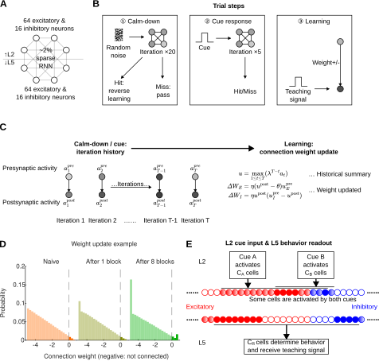

图5.4稀疏循环神经网络模型的建立

Figure 5.4 Construction of a sparse recurrent neural network model

>（A）模型的基本结构是一个约2%稀疏连接的循环神经网络，人为将细胞分为L2、L5两层，每层都有64个兴奋性神经元和16个抑制性神经元。（B）2/5层承担不同的输入输出功能。L2用不同但又有重叠的细胞群体接受线索输入：预训线索A输入13个兴奋和3个抑制性神经元，正式线索B输入6个兴奋和2个抑制性神经元。其中，4个兴奋和1个抑制性神经元是被两种线索重叠激活的。5层负责行为读出和接受TH教学信号：16个兴奋和4个抑制性神经元被标记为正读出（active），同样数量的神经元被标记为负读出（silent）。当正读出细胞的平均响应（细胞响应上限是1）减去负读出细胞的平均响应大于0.6时，认为有行为输出。在教学阶段，这些细胞还接受模拟的TH输入，输入模式是正读出细胞1，负读出细胞0。（C）连接权重更新机制，采用一个类Hebb的计算方式：在正常RNN迭代时不学习，而是记录迭代历史，在特定条件下统一进行学习结算。每次RNN迭代，每个神经元会记录一个带衰减的响应历史值：将本次响应值与之前记录的历史响应×0.8相比较，取较大者作为本次迭代后的响应历史值。在学习结算时，每个连接都取得上下游神经元的带衰减的历史响应最大值。然后根据上游神经元是兴奋还是抑制性的，代入不同的权重更新公式：兴奋性权重更新量=上游×（下游-0.3）×0.06，抑制性权重更新量=（上游-下游）×下游×0.06。（D）用负权重实现可增减的稀疏连接。随机初始化的权重服从下限和众数都是-5、上限0.7的三角分布，但负权重并不参与网络迭代，视为无连接。只有在学习权重更新阶段，权重更新量会被加在负权重上，如果这使得负权重翻正，就会形成一个新的连接。（E）一个单次线索-舔水试验的训练流程。①冷静阶段，给所有细胞加载一个随机噪声，然后RNN迭代。如果5层读出行为，立即执行反向Hebb更新，即按照C中的公式计算更新量，但额外取相反数，然后重新加载一套新的随机噪声再迭代；如果未读出行为就继续往下迭代。直到连续20次迭代都没有行为，才能通过冷静阶段。②线索阶段。按照B中规定的模式给2层一个线索输入，然后RNN迭代。如果5层读出行为，记为成功舔水，否则继续迭代。如果迭代5次仍未读出行为，记为未成功舔水。③学习阶段。按照B中规定的模式给5层一个教学信号，然后按照C中的公式更新连接权重。每个训练单元重复30个单次线索-舔水试验。

>(A) The basic model structure was a recurrent neural network with approximately 2% sparse connectivity. Cells were assigned to two layers, L2 and L5, and each layer contained 64 excitatory neurons and 16 inhibitory neurons. (B) L2 and L5 served different input-output functions. In L2, cue inputs were delivered to different but partially overlapping cell populations: pretraining cue A activated 13 excitatory and 3 inhibitory neurons, whereas formal cue B activated 6 excitatory and 2 inhibitory neurons. Among these, 4 excitatory and 1 inhibitory neurons were activated by both cues. L5 was responsible for behavioral readout and received the TH teaching signal: 16 excitatory and 4 inhibitory neurons were labeled as positive readout cells (active), and the same number of neurons were labeled as negative readout cells (silent). When the mean response of positive readout cells (with an upper cell-response limit of 1) minus the mean response of negative readout cells exceeded 0.6, behavioral output was considered present. During the teaching stage, these cells also received simulated TH input, with an input pattern of 1 for positive readout cells and 0 for negative readout cells. (C) Connection weights were updated by a Hebbian-like computation. No learning occurred during normal RNN iterations; instead, iteration history was recorded and learning was settled together under specific conditions. At each RNN iteration, each neuron recorded a decayed response-history value: the current response was compared with the previously recorded history response multiplied by 0.8, and the larger value was taken as the response-history value after that iteration. During learning settlement, each connection used the maximum decayed historical responses of the upstream and downstream neurons. Different weight-update formulas were then applied according to whether the upstream neuron was excitatory or inhibitory: excitatory weight update = upstream × (downstream - 0.3) × 0.06, and inhibitory weight update = (upstream - downstream) × downstream × 0.06. (D) Sparse connections that could increase or decrease were implemented using negative weights. Randomly initialized weights followed a triangular distribution with lower bound and mode both at -5 and upper bound at 0.7, but negative weights did not participate in network iteration and were treated as absent connections. Only during learning-based weight updating was the update amount added to negative weights; if this made a negative weight become positive, a new connection was formed. (E) Training flow for one trial. ① Calm-down stage: random noise was loaded onto all cells, followed by RNN iteration. If L5 read out a behavior, reverse Hebbian updating was immediately applied, meaning that the update amount was calculated according to the formulas in C but with the sign reversed; a new set of random noise was then loaded and iterated again. If no behavior was read out, iteration continued. The calm-down stage was passed only after 20 consecutive iterations without behavioral output. ② Cue stage: a cue input was delivered to L2 according to the pattern defined in B, followed by RNN iteration. If L5 read out a behavior, the trial was counted as a hit; otherwise, iteration continued. If no behavior was read out after 5 iterations, the trial was counted as a miss. ③ Learning stage: a teaching signal was delivered to L5 according to the pattern defined in B, and connection weights were then updated according to the formulas in C. Each block repeated 30 trials.

经典的机器学习神经网络信息流是单向的。它模拟一个具有预定义结构的输入输出的函数，无论是正向测试还是反向传播，在一个单次试验中每个神经元都只会被计算一次。但动物神经网络通常被建模为循环的，因为它不仅存在自身可以支持双向信息流的电突触，还存在循环激活最终能返回自身的神经回路，因此每次计算迭代都需要所有神经元的同时参与（Harris & Shepherd, 2015）。平衡生物学合理性和算法简洁性后，本文选择建立一种稀疏随机初始化连接的循环神经网络。相比于全连接，每只鼠平均约有2%的初始连接权重为正值，其它权重建模为负值。负权重连接在计算细胞响应（RNN迭代）时当作零权重处理。所有细胞人为分两群，对标动物实验中的运动皮层2/5层，各有64个兴奋性和16个抑制性神经元（图5.4A）。

动物实验中的声音和蓝光两种线索被建模为抽象的A和B两种线索。连续学习组先经历一个预训阶段，使用线索A；然后带着线索A已学会的经验，和初始学习组一起经历正式训练线索B。两种线索会以不同但有部分重叠的模式激活2层神经元：线索A激活13个兴奋和3个抑制性神经元，线索B激活6个兴奋和2个抑制性神经元，其中4个兴奋和1个抑制性神经元被两种线索重叠激活。5层则负责行为读出，其核心思想是：预设一个标准读出模式，只有5层一个预定义亚群的实际响应模式与标准模式高度相似时，判定为有行为输出。这个标准模式不仅要求16个兴奋和4个抑制性神经元必须活跃（active，正读出），还要求同样数量的神经元必须静默（silent，负读出）。在实际响应计算出来以后，要判定是否输出行为，就要将正读出细胞的平均响应值（所有细胞响应上限1），减去负读出细胞的平均响应值：如果差值大于0.6，就判定此时有行为输出。动物实验中的TH输入则被建模为教学信号输入，输入模式与标准读出模式相同：正读出细胞输入1，负读出细胞输入0（图5.4B）。TH与教学信号的生物学合理性容后详述。

另一个重要的机制就是连接权重更新算法。本模型并不在每轮RNN迭代后立即改变连接权重，因为逐毫秒模拟脉冲时序依赖可塑性（spike-timing-dependent plasticity, STDP）成本太高也无必要；而是先记录迭代历史，再在学习阶段定点统一结算权重更新量：这对应三因子学习规则中的可塑性资格痕迹（eligibility trace）思想，即前后突触共同活动先留下短暂、随时间衰减的资格痕迹，随后再由奖赏、惩罚、新异性或教学信号等第三因子决定是否转化为长期连接强度改变（Frémaux & Gerstner, 2015）。具体而言，每个细胞维护一个自动衰减的历史响应值，一开始是0；每次迭代得到最新响应后，模型将历史响应值×衰减系数0.8，与最新响应值比较，取较大者作为新的历史响应值。这种衰减设计，用于近似突触可塑性资格痕迹对近期神经活动的短暂记忆：任务结果的反馈常滞后于神经活动，毫秒级活动不能一直保留到数秒后的奖惩时刻，但可以先以资格痕迹形式暂存，等待第三因子决定是否巩固（Gerstner et al., 2018）。因此，进入学习结算阶段后，每个连接取上下游神经元的带衰减历史响应最大值，相当于读取这条连接在刚才线索驱动网络动态中的可塑性资格；强化学习模型也显示，带资格痕迹的奖赏调制STDP即使在奖赏延迟到来时也可以学习（Florian, 2007）。随后模型根据上游是兴奋还是抑制性神经元，代入不同的类Hebbian权重更新公式，这一步相当于由第三因子把资格痕迹转化为真实权重改变：Izhikevich的模型说明，STDP可先形成短暂资格，而数秒内到来的多巴胺信号选择性地把相关突触资格转化为实际权重改变（Izhikevich, 2007）；实验上，多巴胺也只在谷氨酸输入后约0.3到2秒的时间窗内促进树突棘增大（Yagishita et al., 2014）。皮层突触中还观察到LTP和LTD可具有不同资格痕迹，并由单胺受体依赖的信号转化为长期突触改变（He, Huertas, et al., 2015）。

兴奋性连接更新量是`上游×（下游-0.3）×0.06`，这对应着动物脑中兴奋性突触的经典更新机制：突触前活动释放谷氨酸，突触后去极化解除NMDA受体通道的$Mg^{2+}$阻塞，使NMDA受体对前后突触共同活动具有 coincidence detector 的性质（Bliss & Collingridge, 1993）。因此，模型中的`上游`项相当于突触前活动门控：如果上游神经元没有响应，就不产生有效的兴奋性权重更新；`下游-0.3`项则相当于突触后电压和$Ca^{2+}$信号的阈值门控：当下游响应高于阈值时，兴奋性连接增强；低于阈值时，该连接不但不被强化，还会被削弱。这个方向性与突触可塑性研究中，较强突触后$Ca^{2+}$上升更容易诱导LTP、较弱或较低水平活动可诱导LTD的双向可塑性框架一致（Malenka & Bear, 2004）。这里的0.3和0.06分别是模型化的突触后阈值和学习率尺度，并不对应单一生物常数；它们的作用是用最简形式保留NMDA依赖可塑性的核心逻辑，即兴奋性连接更新必须同时依赖上游活动和下游是否达到足够强的激活状态。

抑制性连接更新量是`（上游-下游）×下游×0.06`。已有实验表明，抑制性突触强度并非固定不变，突触前后活动的相对时序可以诱导抑制性突触长时程改变（Woodin et al., 2003）。在听觉皮层L5神经元上，前后突触脉冲配对可增强抑制性输入，并调节兴奋/抑制比例（D'amour & Froemke, 2015）。公式中的`×下游`项表示只有目标神经元被实际招募时，其上游抑制性输入才获得可塑性资格；`上游-下游`项则把抑制性连接塑造成一种促进强弱分化的竞争效应：当抑制性上游活动强于下游活动时增强抑制，帮助压低非目标响应；当下游活动强而抑制性上游相对弱时削弱这条抑制性连接，意在使教学信号激活的读出细胞更容易维持活动。类似思想也出现在抑制性STDP维持兴奋/抑制平衡的模型中（Vogels et al., 2011）；Luz和Shamir进一步说明，Hebbian式抑制性可塑性可以通过负反馈平衡前馈兴奋和抑制（Luz & Shamir, 2012）。但是，抑制性可塑性的具体方向具有脑区和细胞类型依赖性，PV（parvalbumin，副肌钙蛋白）、SST（somatostatin，生长抑素）、VIP（vasoactive intestinal peptide，血管活性肠肽）等抑制性神经元亚型的可塑性和与兴奋性神经元之间的特定连接关系在建模上也过于复杂，因此公式建模的生物学支撑主要来自抑制性突触被普遍认可的活动依赖可塑性及其E/I平衡功能，而并不直接对应任何确凿的单一生物学机制。

动物神经网络具有稀疏连接的特性，绝大多数神经元对组之间无直接连接；局部皮层回路研究也显示，连接强度集中在少数强连接上，可被理解为少数强连接骨架嵌在大量弱连接或无连接背景中（Song et al., 2005）。连接并非完全随机，而是受局部连接组团和共同邻居等结构原则约束（Perin et al., 2011）。但是，学习过程可以诱导部分原本无连接但距离较近的神经元产生连接；在体长期成像显示，成年皮层树突棘会出现和消失，棘新生和回缩分别对应突触形成和消除（Trachtenberg et al., 2002）。在运动学习中，新的树突棘可在学习后快速形成并被选择性稳定，成为持久运动记忆的结构基础（Xu et al., 2009）。为了对这一特性建模，本文使用负权重来表示当前无连接、但可通过学习建立的潜在连接。在连接权重随机初始化阶段，采用下限和众数都是-5、上限0.7的三角分布，使得约98%的连接都是负权重，即无连接。在计算细胞响应值的RNN迭代过程中，负权重当作0而非负值处理，因此对下游神经元无影响；这相当于潜在轴突-树突接触或尚未稳定的突触结构在功能上尚不参与当前回路计算。但在学习时，权重更新量会被加在负权重上：如果这使得负权重翻正，就相当于学习诱导的新连接生成，从此开始参与RNN迭代。权重上限0.7，达到上限后就不再增强，只能削弱；同理，正权重也可能因不断削弱而翻成负数，对应突触削弱后退出有效回路，近似动物神经网络中的突触修剪。经验依赖的结构可塑性研究也将突触形成和消除视为成年皮层回路重构的重要形式（Holtmaat & Svoboda, 2009）（图5.4D）。

模型的单次线索-舔水试验设计，和动物实验基本一致对标。首先是冷静阶段，动物需要在无线索也无奖励情况下持续等待，直到能维持足够长时间的静息而不产生行为为止；这对应行为任务中单次线索-舔水试验开始前需要抑制提前舔舐或自发动作的要求。这个阶段的存在是为了防止神经网络被训练成不关注线索，只靠高频随机行为来达到较高的小鼠舔舐到水的成功率。模型中，每个单次线索-舔水试验会为所有细胞设置一个噪音响应，然后开始RNN迭代。一旦产生行为，意味着5层的行为读出群体出现了与标准行为模式高度相似的响应，但此时外界并未给出线索和奖励，因此模型立即进行反向Hebb更新：从强化学习角度看，这相当于无奖赏或错误时机行为引发的负向教学信号，因为奖赏预测误差可以为学习提供正负方向性（Schultz et al., 1997）。具体到连接更新，高响应正读出细胞的兴奋性输入连接通常会因此被削弱、抑制性输入增强，使得该细胞以后再次被噪音激活的概率降低；这也与前述三因子学习规则一致，即同一份可塑性资格可以被奖赏或惩罚信号转化为相反方向的权重改变（Frémaux & Gerstner, 2015）。那之后，重新设置噪音，继续迭代，直到连续20次迭代都不触发行为，才能通过冷静阶段，相当于要求网络先稳定在无线索不行为的基线状态。接下来按照2层预设的模式输入线索并迭代，如果5层读出行为，则该单次线索-舔水试验记为成功舔水；如果迭代5次仍无行为，记为未成功舔水。最后是学习结算阶段，给5层读出群体按照标准读出模式输入TH教学信号，然后计算权重更新量。在这个教学阶段，被TH激活的细胞的上游兴奋性连接通常会增强，抑制性连接通常会削弱，使得以后这些细胞更容易被相同线索激活；这相当于第三因子把线索阶段积累的可塑性资格巩固为有利于目标行为读出的连接结构（Izhikevich, 2007）（图5.4E）。
### 5.3.2 前期训练改变连接权重分布并增强细胞响应分化
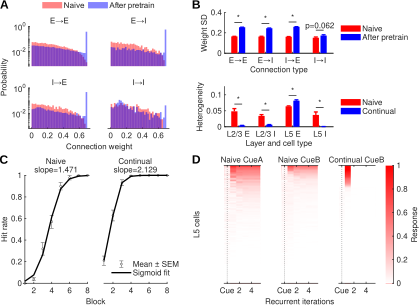

图5.5前期训练改变连接权重分布并增强细胞响应分化

Figure 5.5 Pretraining altered the distribution of connection weights and enhanced cell response differentiation

>（A）预训前（naive）后（After pretrain）的连接权重分布，根据前后神经元是兴奋性还是抑制性，分为兴奋到兴奋（E→E）、兴奋到抑制（E→I）、抑制到兴奋（I→E）、抑制到抑制（I→I）。除抑制-抑制连接外，大多数的弱连接都相对减少，而逼近上限的强连接大幅增加。（B）上：预训后，除抑制-抑制连接外，三种连接类型的权重方差均增大。下：相比于未经预训的初始学习，有预训经验的连续学习，只有5层兴奋性神经元表现出更高的响应异质性；其它亚群则大多下降。（C）Sigmoid拟合初始和连续学习曲线。连续学习拟合斜率显著高于初始学习（组间10000次随机置换检验，显著性p<0.001）。（D）展示预训线索A、初始学习线索B、连续学习线索B首个训练单元，5层细胞随迭代的单次试验间平均响应。可以看到在没有预训经验条件下，首次遇到线索的网络响应强弱不分明，且线索B响应低于线索A，这符合两种线索不同的预设激活细胞数。而有预训经验的连续学习线索B时，细胞响应强弱分明，且响应一次后就立即衰减下去。

>(A) Connection-weight distributions before pretraining (naive) and after pretraining (After pretrain). Connections were grouped by whether the pre- and postsynaptic neurons were excitatory or inhibitory: excitatory-to-excitatory (E→E), excitatory-to-inhibitory (E→I), inhibitory-to-excitatory (I→E), and inhibitory-to-inhibitory (I→I). Except for inhibitory-to-inhibitory connections, most weak connections were relatively reduced, whereas strong connections approaching the upper bound increased markedly. (B) Top: after pretraining, weight variance increased in the three connection types except inhibitory-to-inhibitory connections. Bottom: compared with naive learning without pretraining, continual learning with pretraining experience showed higher response heterogeneity only in L5 excitatory neurons; most other subpopulations instead decreased. (C) Sigmoid fits of naive and continual learning curves. The fitted slope was significantly higher in continual learning than in naive learning (between-group random permutation test with 10000 shuffles, p<0.001). (D) Trial-averaged responses of L5 cells across iterations are shown for pretraining cue A, the first block of naive learning with cue B, and the first block of continual learning with cue B. Without pretraining experience, the network response to the newly encountered cue showed weak separation between strong and weak responses, and the response to cue B was lower than the response to cue A, consistent with the different preset numbers of cells activated by the two cues. During continual learning with pretraining experience, strong and weak cellular responses were clearly separated, and the response decayed immediately after one activation.

经过预训练后，权重分布发生明显变化：出现了一大群达到上限的强连接，而其它弱连接相对占比下降。这个规律仅在上下游都是抑制性神经元的去抑制连接中表现较弱，其它类型连接都十分明显（图3-8-2A）。权重分布的方差也是类似规律，只有抑制-抑制连接没有显著增加（图3-8-2B，上）。

根据预训经验的存在与否，初始学习和连续学习相同的线索，的确产生了不同的行为结果。与动物实验结果一致，连续学习的首个训练单元中小鼠舔舐到水的成功率和Sigmoid拟合斜率都高于初始学习（图3-8-2C）。观察首个训练单元、平均所有单次试验的线索后网络迭代响应变化规律可以发现，无论相比于初始学习线索A还是B，连续学习时，5层线索响应集中在更早的时点，活跃和沉默群体的区分更清晰（图3-8-2D）。这个特征可以被响应异质性的差异捕捉到：5层兴奋性神经元的响应异质性，连续学习显著高于初始学习；但其它神经元则反而更低（图3-8-2B，下）。
### 5.3.3 细胞响应的分化降低了噪音信号对学习进程的干扰
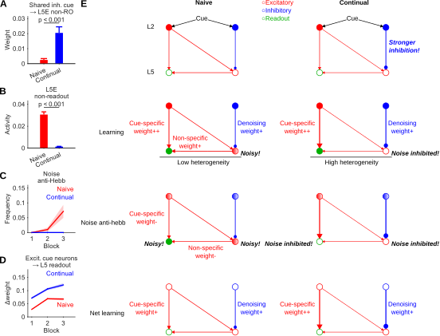

图5.6细胞响应的分化降低了噪音信号对学习进程的干扰

Figure 5.6 Response differentiation reduced the interference of noise signals on the learning process

>（A）连续学习阶段2层抑制性线索神经元（inh. cue）向第5层兴奋性神经元（layer 5 excitatory neuron, L5E）中的非读出神经元（non-readout neuron, non-RO）的抑制性投射更强。（B）统计比较5层非正读出兴奋性神经元的活动，连续学习低于初始学习。（C）统计显示前3个训练单元，初始学习的反向训练触发频率越来越高，而连续学习则始终保持较低水平。（D）统计从2层兴奋性线索细胞向5层读出细胞的权重增量（无连接的负权重不计），前3个训练单元中连续学习始终高于初始学习。（E）连续学习加速的机制模型，左右列比较初始和连续学习的不同阶段的连接结构动态变化，每一行依次对应ABCD。①线索同时给到2层兴奋性和抑制性神经元，但连续学习阶段对噪音的抑制更强。②初始学习阶段，由于正读出细胞和其它5层细胞都活跃，响应异质性低，读出细胞上游的连接增强也有许多是非线索特异的；而连续学习阶段5层非读出细胞的噪音被强抑制，使得5层整体响应异质性更高。③由于初始学习阶段5层读出细胞上游许多线索非特异的连接也被强化，在冷静期噪音迭代时很容易触发非线索行为输出，而遭到反向Hebb训练，这同时也削弱了线索特异性的连接权重，导致之前学到的部分正确权重被抵消；而连续学习阶段，由于之前非线索特异性上游被强抑制，触发反向训练的频率更低。④由于前述差异，每单元训练下来的最终结算，连续学习会比初始学习的权重变量更大。

>(A) During continual learning, inhibitory projections from L2 inhibitory cue neurons (inh. cue) to L5 non-positive-readout excitatory neurons (L5E→non-RO) were stronger. (B) The activity of L5 non-positive-readout excitatory neurons was lower during continual learning than during naive learning. (C) Across the first three blocks, the trigger frequency of reverse training increased progressively during naive learning, whereas it remained low during continual learning. (D) Weight increments from L2 excitatory cue cells to L5 readout cells (excluding negative weights corresponding to absent connections) were consistently higher in the first three blocks of continual learning than in naive learning. (E) Mechanistic model of accelerated continual learning. The left and right columns compare the dynamic changes of connection structures in different stages of naive and continual learning, with each row corresponding to ABCD sequentially. ① Cues were delivered to both L2 excitatory and inhibitory neurons, but noise suppression was stronger during continual learning. ② During naive learning, because both positive readout cells and other L5 cells were active, response heterogeneity was low, and many strengthened upstream connections to readout cells were not cue-specific; during continual learning, noise in L5 non-readout cells was strongly suppressed, leading to higher overall response heterogeneity in L5. ③ Because many cue-nonspecific upstream connections to L5 readout cells were also strengthened during naive learning, noise iterations in the calm-down period could easily trigger cue-independent behavioral output, leading to reverse Hebbian training, which simultaneously weakened cue-specific connection weights and partially cancelled previously learned correct weights; during continual learning, because cue-nonspecific upstream inputs had already been strongly suppressed, reverse training was triggered less frequently. ④ Because of the preceding differences, the final settled weight change after each block was larger during continual learning than during naive learning.

这样一来，学习加速效应的涌现可以用抑制性神经元的竞争性降噪机制解释（图5.6E）。线索本身既能激活兴奋性也能激活抑制性神经元，但在有预训经验时，2层抑制性神经元对5层非正读出的兴奋性神经元产生更强抑制（图5.6A），使得正读出-其它细胞之间涌现更高的响应异质性。在学习阶段，低异质性的5层响应意味着正读出细胞的兴奋性上游输入可能不仅来自线索，也来自噪音，权重更新时无法区分这两条通路，于是同时被强化；而高异质性的连续学习阶段则能显著减少非线索来源的上游输入（图5.6B）。于是在冷静阶段的噪音迭代中，初始学习更容易被噪音激发非线索依赖的随机行为输出，进一步触发反向Hebb训练：同样由于网络中充满噪音，反向Hebb训练无法区分哪些是线索输入哪些是噪音，只能同步削弱，导致学习阶段强化的部分正确的线索输入权重被抵消；而连续学习阶段则较少触发反向训练（图5.6C）。最终结算每个训练单元的净权重更新量时，连续学习可以收获更多线索特异的输入连接强化（图5.6D）。
## 5.4 小结
本章深入探讨了连续学习中后续学习速率加快的神经与计算机制。从动物实验的在体钙成像数据出发，本章首先揭示了学习速度与皮层群体状态空间轨迹的几何特征密切相关。与初始学习频繁的往复折返相比，连续学习的神经状态轨迹更加平直地向目标前进。这种稳定的群体级轨迹演进，在单细胞层面反映为更高的响应分化程度，即响应异质性。相关性分析确认了，这种能够稳定动作表征的正负分化，是由旧任务经验所塑造并被新任务继承的，且响应异质性越高的个体，其新任务的学习速度越快，受非特异性基线波动干扰越小。

为在突触可塑性层面解释这一现象，本研究构建了具备生物学合理性的稀疏循环神经网络连续学习模型。数值模拟不仅复现了前期训练能够增强细胞群体响应异质性、加快后续学习速度的现象，更从机制上拆解了其内在逻辑：在有既往经验的连续学习中，增强的抑制性连接能够有效压低非读出神经元的噪声活动，导致皮层群体表现出高响应异质性。这种高分化状态不仅提高了线索驱动下教学信号的信噪比，使得正确的突触连接在正向Hebb学习中得到更纯粹的强化；更重要的是，它大幅减少了在冷静期由内生噪声触发的随机非线索动作，从而避免了大量的反向Hebb训练对已学得正确权重的抵消。通过这种“减噪保真”的微观机制，皮层响应分化最终实现了宏观行为上学习速率的显著提升。
# 第6章 连续学习中丘脑调控了皮层神经元的响应分化稳定性
## 6.1 丘脑抑制降低群体响应分化程度并减慢了新任务的学习速率
温和活动群体的响应异质性，是一个无法用cFos等常规活动依赖标记手段直接操纵的特征；一个自然的思路是从其上游通路入手。丘脑（Thalamus，TH）正是一个已有研究支持的候选入口：丘脑后部感觉相关亚区，可能是连接体感信息与皮层运动信号的高阶节点之一。例如在啮齿类胡须触觉相关研究中发现，以PO（Posterior complex of the thalamus）为代表的后部丘脑与体感皮层和运动皮层之间存在密切联系，并可调节这些皮层区对触觉刺激的响应模式（Casas-Torremocha et al., 2017）；Hooks等则发现来自后部感觉相关丘脑的输入对MOp呈明显分层特异性投射，优先作用于L2/3和第5A层（layer 5A, L5A）（Hooks et al., 2013）。因此，以PO为中心的TH后端区域，是一个可能影响感觉历史、皮层状态和运动输出准备关系的重要候选操纵入口。

图6.1丘脑抑制降低群体响应分化程度并减慢了新任务的学习速率

Figure 6.1 Thalamic inhibition reduced population response differentiation and slowed learning speed of the new task

>（A）TH抑制示意图。实验组注射hSyn-hM4D(Gi)，对照组注射荧光对照病毒。在迁移学习全阶段，每个训练单元前1小时注射CNO，抑制TH。钙信号仍然观察MOp2/3和MOp5层。（B）TH表达示例，以PO为中心，覆盖TH的主要后端区域。（C）TH抑制和对照组各取一个代表性训练单元（对应单个训练单元）的3D热图和1s z-score分布直方图，展示响应异质性差异。TH抑制后细胞向两端的极化程度降低，更集中在0附近，即响应异质性下降；代表对照鼠为vtf0233（30个单次线索-舔水试验，550个细胞，其中499个温和响应细胞，响应异质性0.4279），代表TH抑制鼠为yqnTHMo2（25个单次线索-舔水试验，529个细胞，其中500个温和响应细胞，响应异质性0.3548），该代表性展示不涉及显著性P值或相关性ρ值。（D）Sigmoid拟合TH抑制（12只）和对照组（11只）的学习曲线斜率（对照组0.7754，TH抑制组0.0552）。10000次组间随机置换检验p=0.0939。（E）示意ΔHit计算方式，即学习曲线上相邻两个训练单元的差值，这样每只鼠N个训练单元产生N-1个训练单元对，但要排除达到100%及以后的训练单元，以避免天花板效应导致相邻训练单元差值被低估。（F）比较TH抑制和对照组的ΔHit和MOp5响应异质性。ΔHit统计中，对照组为8只鼠、15个相邻训练单元对，TH抑制组为5只鼠、20个相邻训练单元对，ranksum p=0.03415；MOp5响应异质性统计中，对照组为8只鼠、2095个细胞（2058个温和响应细胞），TH抑制组为5只鼠、1176个细胞（1163个温和响应细胞），ranksum p=0.02953。与之前结论一致，TH抑制后学习速度下降，同时5层响应异质性也下降。（G）分2/5层比较响应异质性和学习斜率的Spearman相关性，不同颜色的点区分TH抑制和对照组的鼠。MOp2/3层为对照组8只鼠、1677个细胞（1607个温和响应细胞）和TH抑制组5只鼠、1347个细胞（1326个温和响应细胞），Spearman ρ=0.615，p=0.02854；MOp5层为对照组8只鼠、2095个细胞（2058个温和响应细胞）和TH抑制组5只鼠、1176个细胞（1163个温和响应细胞），Spearman ρ=0.714，p=0.008143。响应异质性与学习斜率的鼠间差异相关。

>(A) Schematic of thalamic inhibition. The experimental group was injected with hSyn-hM4D(Gi), whereas controls received a fluorescent control virus. During the entire transfer-learning phase, CNO was injected 1h before each block to inhibit TH. Calcium signals were still recorded from MOp2/3 and MOp5. (B) Example of TH expression centered on PO and covering the major posterior region of TH. (C) One representative block from the TH-inhibition group and one from the control group, each corresponding to a single block, showing 3D heatmaps and histograms of 1s z-score distributions to illustrate response-heterogeneity differences. After TH inhibition, cells were less polarized toward both ends and more concentrated near zero, indicating lower response heterogeneity; the representative control mouse was vtf0233 (30 trials, 550 cells, including 499 moderate-response cells, response heterogeneity=0.4279), and the representative TH-inhibition mouse was yqnTHMo2 (25 trials, 529 cells, including 500 moderate-response cells, response heterogeneity=0.3548). Significance P values and correlation ρ values were not applicable to this representative display. (D) Sigmoid fits of the learning-curve slopes for the TH-inhibition group (12 mice; slope=0.0552) and control group (11 mice; slope=0.7754). A between-group random permutation test with 10000 shuffles gave p=0.0939. (E) Schematic definition of ΔHit as the difference between two adjacent blocks on the learning curve. Each mouse therefore contributed N-1 block pairs from N blocks, but blocks at and after 100% performance were excluded to avoid ceiling effects that would underestimate adjacent-block differences. (F) Comparison of ΔHit and MOp5 response heterogeneity between TH-inhibition and control groups. For ΔHit, the control group included 8 mice and 15 adjacent block pairs, whereas the TH-inhibition group included 5 mice and 20 adjacent block pairs (ranksum p=0.03415); for MOp5 response heterogeneity, the control group included 8 mice and 2095 cells (2058 moderate-response cells), whereas the TH-inhibition group included 5 mice and 1176 cells (1163 moderate-response cells; ranksum p=0.02953). Consistent with the earlier results, TH inhibition reduced learning speed and also reduced layer-5 response heterogeneity. (G) Layer-specific Spearman correlations between response heterogeneity and learning slope, with point colors indicating mice from the TH-inhibition and control groups. In MOp2/3, the analysis included 8 control mice with 1677 cells (1607 moderate-response cells) and 5 TH-inhibition mice with 1347 cells (1326 moderate-response cells; Spearman ρ=0.615, p=0.02854). In MOp5, it included 8 control mice with 2095 cells (2058 moderate-response cells) and 5 TH-inhibition mice with 1176 cells (1163 moderate-response cells; Spearman ρ=0.714, p=0.008143). Response heterogeneity was correlated with inter-mouse differences in learning slope.

本实验向PO亚区为中心的TH后端区域注射hSyn-hM4D(Gi)病毒进行广泛抑制，并观察行为和MOp钙信号受到何种影响（图6.1A、B）。结果显示，TH抑制降低了新任务的学习速度（每个训练单元的增量）以及MOp5层的响应异质性（图6.1C、F、G），但Sigmoid拟合斜率差异不显著，可能受重复数影响（图6.1D）。学习速度和响应异质性的鼠间差异则在2/5层均显著相关（图6.1E），这不同于5.2中仅2/3层显著的相关性。这说明以PO为中心的丘脑后部核团能通过调节MOp的响应异质性进而影响学习速度。层级细节上，5层更直接受调控，但最终行为效应大小也会反映在2/3层。
## 6.2 丘脑抑制未影响旧任务相关细胞的重激活
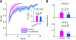

图6.2丘脑抑制未影响旧任务相关细胞的重激活

Figure 6.2 Thalamic inhibition did not affect reactivation of old-task-related cells

>（A）TH抑制和对照组的学习曲线和第1训练单元中小鼠舔舐到水的成功率比较。学习曲线包括对照组11只鼠43个训练单元、TH抑制组12只鼠122个训练单元，组间差异显著（p=0.001291）；第1训练单元中小鼠舔舐到水的成功率无显著差异（p=0.2939），说明TH抑制对迁移首个训练单元的旧结构调用影响不大。（B）比较TH抑制/对照组中，在声水任务学会阶段活跃的细胞迁移到光水任务时的重激活率，发现没有显著差异；MOp2/3层为对照组11只鼠、308个学会声水活跃细胞和TH抑制组5只鼠、92个学会声水活跃细胞，ranksum p=0.3118；MOp5层为对照组10只鼠、203个学会声水活跃细胞和TH抑制组5只鼠、47个学会声水活跃细胞，ranksum p=0.3403。

>(A) Comparison of learning curves and first-block hit rates between TH-inhibition and control groups. The learning-curve analysis included 11 control mice with 43 blocks and 12 TH-inhibition mice with 122 blocks, showing a significant group difference (p=0.001291); first-block hit rate did not differ significantly (p=0.2939), indicating that TH inhibition had little effect on prior-structure recruitment in the first transfer block. (B) Comparison of reactivation rates between TH-inhibition and control groups for cells that had been active during the learned audio-water task when transferred to the light-water task, showing no significant difference. In MOp2/3, the analysis included 11 control mice with 308 learned-audio active cells and 5 TH-inhibition mice with 92 learned-audio active cells (ranksum p=0.3118). In MOp5, it included 10 control mice with 203 learned-audio active cells and 5 TH-inhibition mice with 47 learned-audio active cells (ranksum p=0.3403).

相比之下，首个训练单元中小鼠舔舐到水的成功率和旧任务活跃细胞的重激活率未受显著影响（图6.2）。这说明丘脑的抑制并非消除了初始学习的记忆或阻止早期回忆，而是在后续学习进步阶段施加阻碍效果。
## 6.3 计算机模拟丘脑输入减弱对学习速率的影响
让特定的线索激活特定的网络下游响应模式，这在机器学习领域称为有监督学习，需要每个单次线索-舔水试验在输出端提供一个答案或教学信号，然后执行反向传播和梯度下降，使得整个网络的权重得到调节。动物神经网络的运动学习，同样需要某些机制提供的教学反馈信号，才能快速学到特定的响应模式，而免于缓慢盲目的随机探索（Krakauer et al., 2019）。前述动物实验中发现TH抑制后，首个训练单元中小鼠舔舐到水的成功率影响不大，但后续学习速度显著减缓的现象，提示TH可能是教学信号的重要来源之一。

图6.3计算机模拟丘脑输入减弱对学习速率的影响

Figure 6.3 Computational simulation of the effect of weakened thalamic input on learning speed

>（A）模拟TH抑制的方法是削弱决策后的教学信号到0.5倍，这将导致Hebb更新幅度减少。这种模拟方式对应了本文对动物实验中TH功能的假设性解释：提供学习所需要的教学信号，是响应异质性的重要来源之一。（BC）取的是动物实验中，初始声音线索任务学会后活跃的细胞，在连续学习蓝光线索任务首个训练单元中的钙信号，展示A中TH抑制建模方式的生物学合理性。（B）对动物实验中的TH抑制和对照组钙曲线比较发现，TH抑制的差异主要发生在给水之后，而对线索后决策阶段的快速响应影响不大，这与TH抑制后连续学习首个训练单元行为下降不大一致。（C）上：比较1~3s平均z-score，TH抑制组显著更低。下：比较TH抑制相比于对照组的平均信号下降量，1~3s下降量显著多于0~1s。这说明TH抑制主要影响给水之后潜在的强化学习过程，而非线索后的行为决策流程。（D）计算模拟TH抑制后，学习曲线的Sigmoid拟合斜率显著下降（组间10000次随机置换检验，显著性p<0.001）。（E）模拟TH抑制后，5层兴奋性神经元响应异质性显著下降，抑制性神经元因原本响应异质性就较低所以无下降空间。2层变化也不显著，这与动物实验结果一致。

>(A) TH inhibition was simulated by reducing the post-decision teaching signal to 0.5-fold, which decreased the magnitude of Hebbian updating. This implementation corresponded to the hypothetical interpretation of TH function in the animal experiment: providing teaching signals required for learning is one important source of response heterogeneity. (BC) Calcium signals were taken from cells that were active after the naive audio-cue task had been learned in the animal experiment, and were examined during the first block of continual learning of the light-cue task, illustrating the biological plausibility of the TH-inhibition modeling strategy in A. (B) Comparison of calcium traces between the TH-inhibition and control groups in the animal experiment showed that the effect of TH inhibition mainly occurred after water delivery, with little effect on the rapid response during the post-cue decision stage. This was consistent with the limited reduction in first-block behavior after TH inhibition during continual learning. (C) Top: comparison of the mean z-score from 1 to 3s, which was significantly lower in the TH-inhibition group. Bottom: comparison of the mean signal decrease in the TH-inhibition group relative to the control group; the decrease from 1 to 3s was significantly larger than that from 0 to 1s. This indicates that TH inhibition mainly affected the potential reinforcement-learning process after water delivery, rather than the post-cue behavioral decision process. (D) After simulated TH inhibition, the fitted Sigmoid slope of the learning curve decreased significantly (between-group random permutation test with 10000 shuffles, p<0.001). (E) After simulated TH inhibition, response heterogeneity decreased significantly in L5 excitatory neurons. Inhibitory neurons had little room for further reduction because their response heterogeneity was already low, and changes in L2 were also not significant, consistent with the animal experiment.

解剖学证据显示，后部感觉相关丘脑对MO存在明显的分层特异性投射，优先作用于L2/3和L5A的锥体细胞（Hooks et al., 2013）。电生理研究也显示，后部丘脑可调节运动皮层和体感皮层中的触觉刺激处理（Casas-Torremocha et al., 2017）。与此同时，高阶丘脑-皮层环路本身具备在体感皮层和运动皮层之间中继并重整信息流的结构基础（Shepherd & Yamawaki, 2021）。这样一来，整合了躯体感觉和运动系统的丘脑，确实具备提供教学信号的功能基础。因此本模型将TH抑制组直接建模为教学信号的减半（图6.3A）。之前的动物实验结果也支持，TH抑制的影响更多发生在1s给水之后，而对线索后1s内的行为决策阶段影响较小（图6.3B、C）。最终从模拟结果也可观察到，TH抑制后连续学习任务的斜率和5层兴奋性神经元的响应异质性的都有所下降（图6.3D、E）。
## 6.4 压后皮层对连续学习行为表现影响较弱
之前选择MOp作为主要观察中心，是因为实验设计的两种不同线索的任务对应到相同的舔舐运动输出端，逻辑上可能更直接反映不同任务之间的共同保留信息或结构。反之，如果是运动皮层上游、更接近感觉线索端的皮层区域，例如位于视觉皮层与运动皮层之间的RSP，就有可能偏向提供视觉模态特异的信息输入，而不是在连续学习中承担与MOp同等的信息结构共享作用。从既往相关研究中可以罗列RSP被认为参与情景记忆、导航、想象与未来规划等功能，这种多样性使得较新的观点更倾向于将其视为整合感觉、运动与空间信息的抽象节点，而非直接指向具体功能（Alexander et al., 2023）。将MOp与RSP进行功能比较，就可以将脑区在任务中的功能与其在皮层上的拓扑位置建立关联，印证从结构到功能的逻辑链。

图6.4压后皮层对连续学习行为表现影响较弱

Figure 6.4 RSP had a weaker effect on continual learning performance

>（A）RSP在小鼠大脑中的位置示意图。RSP位于视觉皮层与运动皮层之间，且与两者直接接壤，因此可能构成视觉线索进入运动皮层的上游节点之一。（B）三列热图展示RSP在声音线索初始任务学会阶段，以及蓝光线索任务成功舔水/未成功舔水时的响应架构，排除了三列都不活跃的细胞。RSP对蓝光线索任务成功舔水/未成功舔水条件的响应基本一致，而对声音线索的响应极弱，符合其靠近视觉皮层、远离听觉皮层的拓扑特征。（C）取RSP和MOp中的正向活跃细胞，比较它们对蓝光线索的响应强度和启动时间，结果显示RSP启动更早。（D）计算RSP中初始任务学会时活跃细胞的重激活率与蓝光线索新任务首个训练单元中小鼠舔舐到水的成功率之间的Spearman相关性，结果不显著，但样本量可能偏少。（E）比较蓝光线索任务成功舔水/未成功舔水的单次线索-舔水试验中，初始任务学会时活跃细胞重激活率的差异：成功舔水条件略高于未成功舔水条件。（F）比较初始声音线索任务学会时活跃细胞，与其在蓝光线索任务成功舔水/未成功舔水的单次线索-舔水试验，共三种条件下的平均钙曲线。三者差异整体较小，未成功舔水条件甚至还略高于成功舔水条件。（G）示意RSP化学遗传抑制实验。在双侧RSP注射hSyn-hM4D(Gi)病毒，并在连续学习新任务阶段每个训练单元前1h注射CNO以抑制RSP。对照组注射mCherry荧光对照病毒。（H）RSP抑制实验的病毒表达示意。（I）RSP抑制组与对照组的学习曲线，并附加RSP与MOp联合抑制组的学习曲线。单独抑制RSP未见学习曲线下降；RSP与MOp联合抑制时，首个训练单元中小鼠舔舐到水的成功率仍未明显下降，但后续达到全部成功舔水的过程受阻。

> (A) Schematic location of RSP in the mouse brain. RSP lies between visual and motor cortex and directly borders both, making it a plausible upstream node through which visual information may enter a broader sensorimotor network. (B) Heatmaps showing RSP response structure in learned audio-water, transfer light-water hit, and transfer light-water miss conditions, including only cells active in at least one column. RSP responded similarly in transfer hit and miss trials but only weakly in audio-water, consistent with its cortical topology. (C) Comparison of response amplitude and onset latency to the light cue between positively active cells in RSP and MOp. RSP showed an earlier onset. (D) Spearman correlation between reactivation rate of audio-water-active RSP cells and transfer Day 1 hit rate; the effect was not significant, although sample size may have been limited. (E) Difference in reactivation rate of audio-water-active RSP cells between transfer hit and miss trials. Reactivation was slightly higher in hit trials than in miss trials. (F) Mean calcium traces of audio-water-active cells across learned audio-water, transfer hit, and transfer miss conditions. Overall differences among the three traces were small: learned audio-water was highest, and transfer miss was slightly higher than transfer hit, indicating that this class of sound-responsive cells was not dominant in RSP. (G) Schematic of the RSP chemogenetic inhibition experiment. hSyn-hM4D(Gi) was injected bilaterally into RSP, and CNO was administered 1h before each training day throughout transfer learning to inhibit RSP. Controls received mCherry virus. (H) Example of viral expression in the RSP inhibition experiment. (I) Learning curves for the RSP inhibition and control groups, together with an additional curve for combined RSP and MOp inhibition. Inhibition of RSP alone did not lower the learning curve. When RSP and MOp were jointly inhibited, Day 1 hit rate still did not decrease clearly, but the subsequent progression to 100% performance was impeded.

从皮层拓扑上看，RSP位于视觉和运动皮层之间，适合作为候选的视觉相关上游区域（图6.4A）。连续学习实验结果显示，RSP对视觉线索的响应显著强于对听觉线索的响应，并且对单次线索-舔水试验是否成功舔水不作明显区分；其对视觉线索的响应启动也早于MOp（图6.4B、C）。这一结果与既往对RSP的认识基本一致：RSP能够较快表征视觉线索、轨迹和奖赏位置等具有明确意义指向的信息，为下游行为网络提供瞬时参考输入（Alexander et al., 2023）。但是，新任务首个训练单元中小鼠舔舐到水的成功率与初始任务学会时活跃细胞的重激活率并不显著相关；成功舔水/未成功舔水的单次线索-舔水试验中的重激活率虽有轻微差异，但总体活动强度差异不大，甚至未成功舔水条件反而更高（图6.4D、E、F）。更关键的是，RSP抑制实验未表现出明确阳性结果：RSP抑制组的学习曲线与对照组没有显著差异，甚至略好；而RSP和MO共同抑制的曲线也没有明显比单独MO抑制更差（图6.4I）。总之，RSP偏好在蓝光线索任务中介导瞬时的视觉信息输入，对听觉信息则响应极弱；但它对当前关联性学习任务中小鼠舔舐到水的成功率可能只起冗余辅助作用，而非决定成败的单一核心节点。的确，从皮层拓扑上看，视皮层产生的信号也可以通过后顶叶联合区（posterior parietal association area, PTLp）→躯体感觉皮层（somatosensory cortex, SS）通路到达MO，这种解剖特征与RSP表现出的功能偏好是一致的。
## 6.5 小结

图6.5连续学习快速增长机制小结

Figure 6.5 Summary of mechanisms for accelerated learning in continual learning

>连续学习中小鼠舔舐到水的成功率快速增长与响应异质性相关。初始学习中，响应异质性较低，多数细胞长期分布在0附近。连续学习时，网络保留了初始任务留下的响应异质性结构，细胞群体分化为远离零点的正负两极，使得学习方向稳定。这种响应异质性的形成依赖TH输入。

>The rapid growth of hit rate during continual learning was associated with response heterogeneity. In naive learning, response heterogeneity was low, with most cells remaining near zero over time. During continual learning, the network retained the response-heterogeneity structure left by the naive task, and cell populations differentiated into positive and negative poles away from zero, stabilizing the learning direction. The formation of this response heterogeneity depended on TH input.

综上所述，本章系统探讨了维持皮层响应分化状态并加速连续学习的上游调控机制，揭示了后部丘脑（TH）在其中扮演的关键因果角色。

首先，通过化学遗传学特异性抑制以PO为中心的丘脑后部核团，实验发现TH的活动对于维持运动皮层（特别是MOp5层）的响应异质性及加速新任务学习至关重要。抑制TH会导致皮层群体分化程度显著下降，学习过程减慢。然而，TH抑制并未影响首个训练单元中小鼠舔舐到水的成功率，也未干扰旧任务记忆印迹细胞的重激活；这说明丘脑的调控特异性地作用于后续学习进程的参数更新，而非干扰早期的记忆提取和泛化调用。

其次，这一结论在循环神经网络模型中得到了机制层面的印证。将丘脑的功能建模为在任务结算期（如给水后）提供教学强化信号，削弱该信号不仅成功复现了动物实验中学习速率减慢的行为学现象，也精准重现了5层细胞响应异质性降低的网络特征。这从计算逻辑上确认了丘脑通过提供强化信号以维持皮层网络高分化状态的内在合理性。

最后，本章对比了在皮层解剖拓扑上可能作为视觉输入中继的压后皮层（RSP）。尽管RSP对新任务的视觉线索表现出了快速且强烈的响应，但特异性抑制RSP并未对学习曲线产生显著的破坏。这一反差进一步证明，连续学习的加速并非简单依赖于皮层间浅层的感觉信号接力，而是高度依赖于深层的丘脑-运动皮层（TH-MOp）闭环调控。
# 第7章 总结与展望
## 7.1 论文总结
本文将跨模态连续学习的行为学优势解构为两个独立的分量：首个训练单元更高的起点表现，以及后续训练单元更快的学习速率。通过结合在体双光子钙成像、活动依赖性标记与化学遗传学等观测与操纵手段，本文将高起点对应到旧任务稳定活跃细胞的跨模态重激活及单次试验间较低的状态散度；将快增长对应到皮层群体细胞间正负方向的响应异质性，并揭示了其依赖于后部丘脑（TH）的调控。除了这两种由皮层与丘脑主导的核心机制，本文还通过对压后皮层（RSP）的对照干预排除了浅层视皮层中继决定连续学习成败的假设；并构建了具有高度生物学合理性的稀疏循环神经网络计算模型，从突触权重的竞争性降噪和“减噪保真”更新的角度，验证了响应分化加速学习的理论可行性与计算效能。

### 7.1.1 连续学习的优势包含早期表现的提高和学习速率的加快
本研究建立了一套适用于头部固定小鼠的跨模态线索-舔水关联行为学范式。在对比不同模态线索的基础学习能力时，发现小鼠对听觉线索任务的习得速度显著快于视觉线索任务。在此基础上，通过让小鼠在学会听觉线索（旧任务）的经验基础上转而学习视觉线索（新任务），观察到了明显的连续学习优势。进一步解构发现，这种行为学层面的优势并非单一维度，而是包含了两个可独立观测与定量的分量：一是新任务首个训练单元中小鼠舔舐到水的成功率整体抬升，即早期表现的显著提高；二是后续训练单元中小鼠舔舐到水的成功率呈现出更陡峭的增长曲线（Sigmoid拟合斜率更大），即学习速率的显著加快。这两个优势分量的成功剥离，为后续针对性地解析连续学习背后相互独立的神经环路机制奠定了坚实的行为学基础。

### 7.1.2 新旧任务中重激活的神经元支持了新任务早期表现的提高
针对连续学习中新任务早期表现的跃升，本研究利用在体双光子钙成像记录了初级运动皮层（MOp）的单细胞活动。研究发现，声音线索任务的学会状态表现为皮层网络形成了稳定的线索响应与明确的状态空间演进方向。当面临新任务的首个训练单元时，部分在旧任务中稳定活跃的皮层神经元被新线索跨模态优先重新激活。以这些重激活细胞为核心的网络，能够有效压低新任务状态空间中单次试验间的相对散度（尤其是皮层2/3层）。这种单次试验间响应的稳定化，使新任务初期的神经状态更接近成熟阶段的群体流形，从而促成了首个训练单元中较高的小鼠舔舐到水的成功率。特异性的干预实验进一步确立了其因果地位：通过cFos-TRAP技术特异性抑制旧任务中的记忆印迹细胞，或是通过延长新旧任务间隔（7天遗忘）来诱导印迹自然消退，均会破坏皮层响应的单次试验间稳定性，并显著削弱新任务早期的行为表现。这充分证明，旧经验记忆印迹细胞的重激活是新任务获得高起点不可或缺的神经基础。

### 7.1.3 丘脑调控的皮层响应分化支持了新任务的学习速率的加快
针对连续学习中后续学习速率加快的现象，本研究发现运动皮层群体保持了由旧任务经验塑造的、更为清晰的正负响应分化（即高响应异质性）。这种高分化状态与后续学习中的连接更新效率提高相伴随，提示旧任务塑造的网络状态为新任务学习提供了更有利的起点。这种高响应异质性的维持依赖于高阶丘脑的调控：化学遗传学干预证实，特异性抑制以PO为中心的丘脑后部核团，会显著降低皮层（特别是MOp5层）的群体分化程度，并大幅减慢新任务的学习进程，但并未干扰首个训练单元的旧印迹重激活。相对而言，作为视觉中继候选的压后皮层（RSP）对连续学习曲线的影响较弱，排除了浅层网络中继在学习加速中的主导作用。

为在突触可塑性层面深入解析这一加速机制，本研究还构建了具备生物学合理性的稀疏循环神经网络计算模型。数值模拟不仅复现了前期训练增强响应异质性、加快学习速度的宏观现象，更揭示了其中两类相互区分的计算成分：一方面，初始学习强化的抑制性连接有效压低了非目标神经元的噪声，这种竞争性降噪提高了教学信号的信噪比，减少了冷静期随机动作触发的反向Hebb更新，从而避免了对正确权重的抵消；另一方面，当在模型中模拟减弱丘脑的教学信号输入时，响应分化显著降低且Hebb更新幅度受损，精确重现了动物实验中学习速率减慢的行为表型。因此，抗噪主要来自初始学习塑造的抑制性连接，而丘脑抑制并不是关闭这一抗噪结构，而是从教学信号层面直接削弱新任务中的突触更新效率。

## 7.2 论文讨论
### 7.2.1 连续学习中泛化与迁移成分的关系
传统的泛化通常指行为反应在知觉特征相近的刺激间扩展（Ghirlanda & Enquist, 2003）；但在本实验的跨模态设计中，视觉与听觉缺乏明显的物理共性。本研究表明，即便跨模态，泛化依然可以发生。从行为上看，泛化构成了连续学习中“早期表现提高”这一分量，对应于旧任务动作-结果映射关系被新模态线索直接调用的过程。从神经机制上看，这依赖于初级运动皮层旧记忆印迹的重激活所带来的相对散度的降低。学习过程会改变神经网络的连接关系，那么学会就对应着改变的停止。连接关系会通过网络对线索的响应模式反映出来，因此学会或学习改变的停止，就意味着网络对线索响应的相对稳定（Gallego et al., 2020）。钙成像数据基本支持这一观点：初始状态对线索的钙响应，不同单次试验间差异较大，散度高；学会后散度降低。这种散度降低并非因为整体响应水平下降，因为恰恰是响应水平较高的细胞亚群散度更低。由于线索给出的时间间隔是随机不可预测的，这群高响应、低散度的群体活动特征，就非常类似于吸引子的定义：网络的特定连接特征，会将信息大概率引导到特定子网络，即将随机的初始状态自然收敛到一个特定子空间中（Hopfield, 1982）。

从突触可塑性角度讲，一个高活跃的兴奋性突触后级通常更容易诱导突触增强，而突触前级则影响增强幅度（Malenka & Bear, 2004）。即使不被线索激活的突触前级也难免会有随机噪音而被随机少量强化，因此线索切换后，由于作为信息流终端的行为输出目标不变，总会有部分吸引子通过这些非特异性噪音连接被激活，至少会比没有预训经验的初始状态更容易激活。这个机制使得跨模态的、高度异质的线索也能激发较高的行为起点，并且与重叠激活的细胞占比呈现相关性。但真实的状态空间分析显示，线索后早期状态演化方向与线索前的初始状态似乎并无负反馈收敛关系，而是朝着相同方向直接叠加在原有状态上。这种现象至少有三种并行不悖的解释：可能与钙信号的延迟累积特性有关；可能与脑区功能分化和连接的稀疏性有关；可能与奖励和行为驱动等监督强化机制有关。因此，本文的散度计算公式仍需扣除基线水平，才能衡量线索驱动的净演化方向。但即使排除基态差异，散度也远不能降到零，甚至不能降一个数量级。这可能说明即使对于学会状态较为牢固的记忆，神经网络仍提供了多种冗余的环路方案，以在不同的内外噪音环境下确保行为输出（Hennig et al., 2018）。这种冗余性一方面导致单次试验间隙反复出现不依赖线索的误触行为，另一方面也为泛化到其它线索提供了机会。

此外，如绪论中所探讨的系统巩固与海马记忆索引模型，海马（Hippocampus）在这一跨模态泛化过程中可能扮演了隐蔽但关键的桥梁角色。本研究所采用的延迟舔水范式含有显著的痕迹学习（trace conditioning）成分，要求网络跨越时间间隙维持状态，这在机制上高度依赖海马与前额叶的持续性活动。在新线索出现的首个训练单元，由于新旧任务共享了完全相同的时间与奖赏预期结构，海马极有可能利用其已经形成的“记忆索引”，对新出现的视觉输入进行快速的模式完成（pattern completion）。这种来自海马的高阶时间-情境特征反馈，或许正是运动皮层得以迅速降低单次试验间散度、将视觉信号强行对齐到由听觉建立的运动准备流形上的重要驱动力。

相比之下，迁移则不仅表现为初始表现的改变，更体现在对后续突触更新进程的加速，即“学习速率的加快”（Bransford & Schwartz, 1999）。迁移并非仅仅是旧知识的即时输出，而是预先准备好了一个具有高响应异质性的网络结构；其中，抗噪来自初始学习强化的抑制性连接对非目标活动的约束，而学习速度的进一步变化则取决于教学信号驱动下的Hebb更新强度。因此，在本范式中，泛化反映了记忆印迹对稳态网络输出的跨模态调用，而迁移则体现了结构预设与教学信号共同对动态网络连接重构的加速。两者在时相、行为指标与神经表征（重激活降散度与响应分化状态）上既相互独立又共同构成了连续学习的完整优势。

### 7.2.2 丘脑对皮层信号的调制作用及其在连续学习中的意义
虽然皮层本身的记忆印迹网络能够通过重激活降低新任务早期的不稳定性（Josselyn & Tonegawa, 2020），但后续学习速率的加快还需要持续的任务相关驱动来支持突触更新。在高阶丘脑-皮层回路中，以PO为代表的丘脑后部核团不仅传递感觉输入，更可能传递关于任务结构或运动预期的信息（Casas-Torremocha et al., 2017）。在连续学习的语境下，TH的作用在于为已经成型的皮层局部网络提供持续的、任务相关的强驱动输入，从而支持皮层群体维持高分化的响应状态（Shepherd & Yamawaki, 2021）。

要让复杂的网络学会收敛到一个极小的运动输出子空间模式，仅依靠随机探索可能是非常低效的，网络往往需要额外的驱动或反馈信号来引导可塑性更新（Krakauer et al., 2019）。在行为实验中，当实施TH抑制后，即使动物已具备预训经验，部分个体对挂有水滴的引导刺激也会变得难以响应；总体上，学习曲线呈现出增长显著缓慢的行为表现，且MOp深层的响应异质性随之下降，给水后的整体活动水平也偏低。这说明TH的驱动输入在皮层学习过程中起到了关键的支撑作用。

在计算模型中，这种维持学习效率的外部驱动被抽象为“教学信号”。通过对照观察可以发现，模型中减弱外部教学信号所导致的突触Hebb更新幅度受损、网络响应异质性下降以及学习速率减慢，精确重现了动物实验中抑制TH后出现的各种表型。因此，丘脑的作用不在于抵消或关闭初始任务遗留的抗噪结构，而在于提供关键的外部驱动输入；这种输入在算法层面上扮演了类似“教学信号”的角色，直接影响皮层网络吸收新模态线索时的突触可塑性更新效率。

### 7.2.3 弱响应群体在皮层响应分化与学习进程中的贡献
不同于静态的行为表现，学习加速作为一种动力学现象，在不同的时空尺度上可能有不同的实现机制。在鼠级的空间尺度上，加速效应可能不仅仅源于单只小鼠绝对学习速率的提升，还包括小鼠间初始表现差异的缩小（例如拟合曲线中点参数的集中）。在训练单元级的时间尺度上，学习加速也与单元间遗忘的减少密切相关。单只小鼠的初始学习曲线常常出现跨训练单元的局部回撤，而连续学习过程则较少回撤，这提示预训经验在训练单元之间更不易被遗忘，从而使得学习进度能够稳定积累（Frankland & Bontempi, 2005）。

在跨训练单元的状态空间演变中，这种稳定积累表现为：初始学习的演变路径更为曲折回环，而连续学习则更直接地朝目标演化。这与运动学习迁移中“群体动力学结构会约束后续学习路径”的观点相近（Vyas et al., 2018）。连续学习中网络重构的需求降低，系统不再需要为了跳出局部最优解而进行大幅重组（McClelland et al., 1995），大体按照一致的方向直线更新就足以快速学会。然而，要真正理解这种轨迹连贯性的底层来源，必须深入到细胞级的网络响应分化中。

在细胞级的空间尺度上，本研究观察到细胞间响应异质性与学习速度呈现显著正相关。尽管连续学习的总体活跃水平也有所上升，但响应异质性的核心价值在于：有意义的行为输出并非单纯依赖活跃水平的整体拔高，同时也依赖那些阻止行为的细胞的沉默（正如痉挛或癫痫时神经系统极度活跃却无法做出有效动作）（Churchland et al., 2010）。本研究通过TH抑制进行间接操纵，结合计算模型佐证，将这一结论细化到依赖TH输入的5层兴奋性神经元。MOp5层兴奋性神经元更接近运动输出终端，其高分化状态可直接引导更高效的Hebb更新（Currie et al., 2022）；相比之下，负责兼容整合不同线索输入的浅层（如2/3层）网络，若过度追求细胞间的响应分化，反而可能损害其编码的多样性与适应性（Fusi et al., 2016）。

特别值得注意的是，本文在计算这种支持学习加速的响应异质性时，采用的是z-score在[-1,1]范围内的弱响应群体。这些细胞在主流研究中通常被忽视为不重要的噪音，但在探讨“学习过程动态（速度）”而非“静态记忆提取”时，它们可能比强响应细胞更为关键（Panzeri et al., 2022）。事实上，强响应细胞的异质性在初始和连续学习任务中并无显著差异；这可能是因为它们代表了已达到可塑性上限的网络组分，主要负责维持既有表现，而对进一步的学习加速无直接贡献。相反，当占主体地位的弱响应群体中涌现出异质性分化时，即提示它们在网络中获得了相对稳定的功能定位：一部分专注于强化兴奋以驱动行为，另一部分专注于强化抑制以压制噪音。从Hebb学习的角度来看，细胞定位的稳定意味着突触更新方向的稳定，这大幅减少了“上一个单次试验强化、下一个单次试验又削弱”的连接权重更新抵消现象。正是这些弱响应群体的有序分化，避免了学习过程中的无效计算，最终在宏观状态空间中汇聚成了那条笔直、高效的学习轨迹。

回归到真实的皮层微环路，这种细胞群体定位的稳定分化与降噪计算，正如绪论中所述，高度依赖于不同亚型抑制性中间神经元（interneurons）的精密协作。在学习加速的进程中，表达VIP的中间神经元可能在接收到新线索或丘脑的自上而下信号时产生去抑制（disinhibition）效应，为特定突触通路的强化打开门控；而表达SOM或PV的中间神经元则通过活动依赖性的反馈抑制，将网络中未经特异性募集的大量神经元（即本研究中观测到的负向分化的弱响应群体）的活动稳稳压制在基线水平或基线以下。这种由特异性中间神经元微环路主导的局部兴奋-抑制平衡（E/I balance）调节，不仅有效约束了记忆印迹的规模（engram size），更在宏观上维持了皮层群体持续的高响应异质性，从而避免了新任务训练可能引发的灾难性干扰与权重抵消。

### 7.2.4 线索前皮层活动的自发稳定现象对舔水行为的驱动
虽然前文主要强调的是输入信号促使细胞群体状态切换并进入动作态，但动物也并不会完全放弃对线索和水奖励到来的尝试性预判行为，表现为静息态的自发舔水试探。随机冷静期的实验设计使得这种预判不太可能单独成功，但仍可能对线索到来时的响应强度或反应速度起到促进作用。4.3中讨论了首个训练单元中小鼠舔舐到水的成功率与散度之间的关系，这提示，静息态中也可能存在驱动自发舔水的散度收敛现象。此外，4.1已指出仍有40%以上的细胞并未发生明显状态切换，而是继续沿原有轨迹演化：这意味着这些细胞可能在静息和动作态中承担相似的角色（舔舐相关），因而不需要发生切换。

图7.1线索前皮层活动的自发稳定现象对舔水行为的驱动

Figure 7.1 The spontaneous stability of pre-cue cortical activity drove licking behavior

>（A）在蓝光线索连续学习条件下，每条线表示一个单次线索-舔水试验，并以颜色区分单次线索-舔水试验顺序，展示第一主成分随时间的变化。时间段取了线索前3s的静息态。可见单次试验间差异随时间逐渐收缩，线束在时间早期更分散、晚期更聚拢，提示存在收敛过程。（B）计算声音线索初始任务学会时、蓝光线索初始学习、蓝光线索连续学习中成功舔水/未成功舔水四种不同情境下线索前3s内的单次试验间散度。结果显示，无论是声音线索任务学会阶段，还是蓝光线索连续学习任务中成功舔水/未成功舔水的单次线索-舔水试验，收敛效应均强于蓝光线索任务的初始学习阶段，表现为散度下降更快；在最后1s内，连续学习阶段成功舔水条件的收敛又强于未成功舔水条件，特别是在约-0.3s时刻。（C）对B图中-3至-0.3s的收敛率，即散度变化量，进行统计。（D）统计B图中-0.3s相对于-3s的信号亮度变化。结果显示，在收敛率较高的学会与连续学习阶段，钙信号水平整体确有下降，但幅度很小，平均仅为千分之二至三，且不同阶段间差异并不显著。（EF）统计声音线索任务学会（E）和连续学习蓝光线索任务中成功舔水的单次线索-舔水试验（F）中，收敛（散度降低）和钙信号上升细胞的占比及其重叠关系。变亮细胞在收敛细胞中仅占较小比例，说明多数收敛细胞主要表现为钙信号下降。（G）分析高收敛细胞（第1s内最小散度高于第3s内最大散度）的继承性。声音线索初始任务中具有较强收敛特征的细胞，与连续学习的蓝光线索任务中的对应细胞存在一定重合，且重合比例显著高于随机水平（2.3%*）。（H）分析单次线索-舔水试验间隔静息态中无线索自发舔舐行为前后的散度变化。所选自发舔舐事件均满足此前至少3s内无更多舔舐动作。红线表示自发舔舐前3s平静期内的散度变化，并将舔舐时刻对齐到3s：自发舔舐前存在持续的散度下降过程。绿线表示首次自发舔舐（对齐到0s）发动后继续舔舐的概率。蓝线表示舔舐发动（对齐到0s）后3s内的散度变化：自发舔舐后散度再次回升。

>(A) In the learned audio-water condition, each line represents one trial and is colored by trial order, showing the time course of the first principal component. Because this component alone explained 98% of the variance, higher components are omitted. Trial-to-trial differences gradually contracted over time: the bundle was broader earlier and tighter later, indicating convergence. (B) Trial-by-trial divergence during the 3s before cue onset was quantified in four conditions. Convergence was stronger in learned audio-water and in continual learning hit and miss conditions than in naive light-water, and during the last second continual learning hit showed stronger convergence than continual learning miss. (C) The convergence rate, defined as the change in divergence from -3 to -0.3s, was summarized statistically. (D) The change in signal brightness from -3 to -0.3s was also quantified. In the learned and continual learning stages, where convergence was stronger, calcium signals indeed decreased overall, but the magnitude was small, on the order of only two to three per thousand on average, and did not differ significantly across stages. （EF）The proportions of convergent cells (reduced divergence) and cells with increased calcium signal, together with their overlap, were quantified for the learned audio-cue task (E) and hit trials in continual learning of the blue-light cue task (F). Cells that became brighter accounted for only a small fraction of convergent cells, indicating that most convergent cells mainly showed decreased calcium signal. (G) The inheritance of highly convergent cells, defined as cells whose minimum divergence within the first second was higher than their maximum divergence within the third second, was analyzed. Cells with strong convergence in the naive audio-cue task showed partial overlap with their counterparts in the blue-light cue task during continual learning, and the overlap was significantly higher than the random level (2.3%*). (H) Divergence changes before and after spontaneous uncued licking during the resting state in the inter-trial interval were analyzed. All selected spontaneous licking events were required to have no additional licking during the preceding 3s. The red curve shows divergence during the 3s quiet period before spontaneous licking, with lick time aligned to 3s, revealing a sustained decline before spontaneous licking. The green curve shows the probability of continued licking after the first spontaneous lick (aligned to 0s). The blue curve shows divergence during the 3s after lick initiation (aligned to 0s), indicating that divergence rose again after spontaneous licking.

计算结果显示，线索信号之前确实存在跨单次试验信号收敛，即散度下降，且不同学习阶段的收敛强度并不相同（图7.1B、C）。这种收敛主要伴随细胞信号整体减弱，尽管也存在少量伴随信号增强的收敛情形，但并不占主导。但钙信号平均下降幅度仅为千分之二至三，且不同阶段间差异并不显著，因此收敛效应不能仅由信号水平下降解释（图7.1D）。因此可以说，在已经有初始任务学会的条件下，新线索到来之前的静息态中，群体活动状态会自发趋于收敛到一个更低变异、更低散度的状态子空间。

收敛过程中多数细胞的钙信号下降，但仍有一部分细胞表现为上升，该现象在初始声音线索任务学会阶段与蓝光线索任务连续学习阶段相近（图7.1E、F）。在初始声音线索任务中表现出较强收敛的细胞，在蓝光线索任务中的强收敛也有一定保留，且重合比例显著高于随机水平（图7.1G）。为检验这种静息态收敛是否与舔舐行为相关，本文进一步分析了单次线索-舔水试验间隔中的自发舔舐事件，即在无线索条件下发生的主动试探性舔舐。所选事件均满足此前至少3s内无其它舔舐动作。以舔舐时刻对齐后可见，在自发舔舐前的3s内，散度经历持续下降；当散度下降至一定程度后，即使无外部线索，也可能触发一次自发舔舐。自发舔舐通常较为短暂，继续舔舐概率自起始时刻迅速下降。舔舐后3s内可见散度再次回升（图7.1H）。这种动力学现象提示，静息态收敛并非与任务无关的单纯背景漂移，还可能对应一次舔舐动作前的内部准备过程。例如，Murakami等在大鼠次级运动皮层发现，在动物自行决定何时中止等待延迟音调的范式中，自发启动动作前存在持续数秒的缓慢神经前导活动，其斜率与等待时间相关（Murakami et al., 2014）。因此可以说，在无外部线索条件下，运动相关皮层也可通过缓慢的内生动态逐步逼近自发动作的触发阈值，这种逼近可以被散度指标检测出来。

总之，初始任务学会后，网络可能形成了一个收敛-舔舐-再发散的动态循环，因此即使不给线索，小鼠也会间歇性地自发尝试是否有水。这是因为，静息态活跃于MO的细胞整体上偏向于维持行为静止状态；但当这类细胞的周期性活动在单次线索-舔水试验间隔中经历缓慢衰减或周期交替时，系统可能会短暂进入一个更容易被内生噪声或微弱外界扰动触发动作的窗口。特别是在连续学习时，这种窗口可能会影响到每个单次线索-舔水试验中，尚不稳固的新任务记忆能否被线索触发行为。

但也必须承认，该理论目前统计差异和相关性效应并不强，对自发舔水行为的预测能力较弱，可能还需要尝试更深入的机器学习分类器等方法提取关键信息、降低背景噪音。
### 7.2.5 信息论视角下的新旧任务信息复用特征
连续学习能够利用从旧任务中学到的知识，加快对新任务的掌握速度。前述章节主要从状态空间位置来展示学习进度，但这种做法并不能直观显示知识的积累和复用，也不能直接衡量知识的多寡。信息论则提供了一组可用于神经数据的定量工具，例如自信息、熵和共享信息，能够描述群体活动状态的差异度或可区分性，以及不同条件之间共享的统计量（Timme & Lapish, 2018）。信息论的优势在于不需要对具体编码方式进行过强假设，直接从统计概率分布角度量化知识信息的总量、共享和差异。

图7.2信息论视角下的新旧任务信息复用特征

Figure 7.2 Information-theoretic features of new and old task information reuse

>（A）信息量与神经活动对应关系的示意。无活动状态对应最低信息量；初始条件下，任务相关表征尚未建立，细胞活动较低，信息量较少；达到学会标准的条件下，任务相关表征更加明确，细胞活动增强，信息量较高。但过高且无序的活动并不对应有效表征，而可能反映病理性同步放电。（B）计算蓝光线索任务的作为初始任务（naive），或者作为连续学习中成功舔水/未成功舔水的单次线索-舔水试验中，平均每个细胞的信息量并归一化到0s时刻。结果显示，连续学习蓝光线索任务时，在线索时刻之后的瞬时信息量快速上升，但成功舔水和未成功舔水条件差异不大；但若是初始学习同样的任务，信息量在线索后先下降，至给水后才上升。（C）比较声音或蓝光线索作为初始任务的首个训练单元（naive）或学会后（Learned），以及连续学习蓝光线索任务，5种不同条件下的训练单元整体信息熵，以训练单元为统计单位。无论声音还是蓝光线索任务，都是初始学习首个训练单元最低。（DEFG）先计算不同训练单元之间的弃用（旧任务减去新任务的差集）、共享与新增（新任务减去旧任务的差集）信息熵，再按训练单元配对进行汇总。（D）蓝光线索任务的初始学习，首个训练单元（naive）和学会时比较。（E）声音线索旧任务学会后，与连续学习蓝光线索新任务时的比较。（F）蓝光线索任务的连续学习，首个训练单元（Continual）和学会后（Final）比较。（G）统计比较从初始学习声音线索任务到连续学习蓝光线索任务，不同阶段配对下的弃用与新增信息量。（H）示意从线索给出到舔舐动作所需的知识链接过程。初始阶段尚未形成稳定的知识结构，需要从零开始建立线索与舔水之间的关联，因此结构较为零散。声音线索初始任务学会后，形成稳定的线索-动作知识链接。连续学习蓝光线索任务时，则不再从头建立全部结构，而是在既有知识链接基础上向新的连接路径扩展，同时弃用或特化掉无效旧成分，形成更高效的知识结构。最终可稳定掌握两条不同的知识链接。

>(A) Schematic relationship between information and neural population activity. A fully silent network corresponds to the minimum information. Under naive conditions, task-related representations are not yet established, cellular activity is low, and information is sparse; upon reaching the learned criterion, task-related representations become clearer, cellular activity increases, and information is higher. However, excessively high and disordered activity does not correspond to an effective representation but may reflect pathological synchronous discharge. (B) The average information per cell was calculated for the light-water task when used as a naive task, or for hit and miss trials during continual learning, and normalized to the 0s time point. Results showed that during continual light-water learning, instantaneous information rose rapidly after cue onset, with little difference between hit and miss trials; but during naive learning of the same task, information first decreased after cue onset and rose only after water delivery. (C) Overall block entropy was compared across five conditions: the first block (naive) or learned stage (Learned) of the audio-water or light-water task, and continual light-water learning, with blocks as the statistical unit. For both audio- and light-cue tasks, the first block of naive learning had the lowest entropy. (DEFG) Discarded (the difference set of the old task minus the new task), shared, and newly added (the difference set of the new task minus the old task) information entropies between different blocks were first computed and then summarized by block pairing. (D) Comparison between the first block (naive) and learned stage for naive learning of the light-cue task. (E) Comparison between the learned stage of the old audio-cue task and the new continual light-cue task. (F) Comparison between the first block (Continual) and the learned stage (Final) for continual learning of the light-cue task. (G) Statistical comparison of discarded and newly added information across stage pairings in the transition from the naive audio-cue task to the continual light-cue task. (H) Schematic model of the knowledge linkage process required from cue presentation to licking behavior. In the naive stage, a stable knowledge structure is not yet formed, and the association between cue and licking must be established from scratch, resulting in a fragmented structure. After the naive audio-cue task is learned, a stable cue-action knowledge linkage is formed. During continual learning of the light-cue task, the entire structure is no longer built from scratch; instead, based on the existing knowledge linkage, it expands toward new connection pathways while discarding or specializing invalid old components, forming a more efficient knowledge structure. Ultimately, two distinct knowledge linkages can be stably mastered.

信息论给出了从神经活动到信息量的算法。其核心思想是，一个瞬时群体状态若在总体概率分布中，越是罕见的小概率状态，则其自信息越高。若将D个细胞在一段时间内的信号值近似为一个D维高斯分布X~N(μ,Σ)，其中μ是均值向量，Σ是协方差矩阵，则特定状态x的微分自信息可以写为（Timme & Lapish, 2018）：
$$
I(x,Σ)=\frac{D\log_2(2π)+\log_2\det(Σ)+\log_2(e)(x-μ)^TΣ^{-1}(x-μ)}{2}
$$
其中det表示行列式，$(x-μ)^TΣ^{-1}(x-μ)$是马氏距离的平方，衡量状态x与平均状态μ之间的距离，距离越远，自信息越高。这个公式同时考虑了神经活动分布的整体形状和当前状态对平均状态的偏离，因此可用于量化单个时刻群体状态的信息量。

信息论允许计算单个时点的瞬时信息量，也可以计算一个训练单元的整体信息熵，即整段群体状态分布的平均不确定度。结果显示，连续学习的信息量在线索之后迅速上升，说明网络能够较快进入与任务相关的低概率或高信息状态；而初始学习的信息量在线索之后反而先下降，直到给水后才上升，提示初始学习阶段网络对线索的内部表征尚未稳定建立（图7.2B）。整体信息熵也在初始阶段最低；但这里的整体高信息熵更应理解为群体活动状态更丰富或复杂、对线索更敏感、线索反应产生的瞬时状态变化更剧烈，而不是直接对应行为表现一定更好；只有当这些信息结构与任务需求对齐时，它们才更可能对学习有利（Stringer et al., 2019）。例如蓝光线索任务学会后，信息熵反而低于连续学习刚开始时的水平（图7.2C）。

更值得关注的是，信息论能否量化连续学习中新旧任务的共享知识量。这种量化实际上反映了两个任务中群体活动统计结构的重叠和差异，而不是心理学意义上可以逐条verbalize的命题知识。具体来说，单个训练单元的信息熵可以根据协方差计算（可视作该训练单元群体状态分布的总体复杂度）：
$$
H(Σ)=\frac{\log_2\left((2π e)^d\det(Σ)\right)}{2}
$$
而两个训练单元的信息并集，可以量化为串联信息熵，即将两个训练单元的所有时点的D维信号直接串联：
$$
H_{X∪Y}=H(Σ_{[X,Y]})
$$
将两个训练单元的信息熵直接相加，再减去串联信息熵，就可以根据集合容斥原理得到共享信息熵：
$$
H_{X∩Y}=H(Σ_X)+H(Σ_Y)-H_{X∪Y}
$$
再从串联信息熵里减去单个训练单元的信息熵，就可以得到差集信息熵，也就是另一个训练单元相比于所减去训练单元新增的知识量：
$$
H_{X∩¬Y}=H_{X∪Y}-H_Y
$$
$$
H_{¬X∩Y}=H_{X∪Y}-H_X
$$

计算结果显示，无论哪两个训练单元配对，都是共享信息熵占比最大。这可能是因为两个训练单元之间不仅共享与任务直接相关的感觉-动作约束，也共享大量背景网络结构和群体活动中相对稳定的集体状态成分（Schneidman et al., 2006）。但不同阶段之间仍然存在清晰差异。例如，初始学习蓝光线索任务时，从首个训练单元到学会，平均每个细胞需要额外增加约0.33bit的信息熵（图7.2D）；而连续学习蓝光线索任务时，学会前后不仅共享成分更多，而且每细胞需新增的信息只有约0.11bit，甚至还有0.12bit被弃用（图7.2F）。这说明连续学习不仅无需从零开始，起点更高；而且还能在已有知识基础上进行精简或特化。

总之，从信息论视角看，初始学习和连续学习速度不同，是因为它们占主导地位的学习机制不同。初始学习，是从缺少任务相关知识结构到逐步建立该结构的过程，从零开始较为困难；而连续学习则更多是对已有结构的复用、重排和剪裁，新增成分相对较少，因此更容易、更高效。也就是说，连续学习的优势不只是旧任务相关知识更多，还包含新任务学习过程对旧知识的定向修整，而无需从头重建（图7.2H）。

这部分探索的局限性在于，信息分析采用的微分信息熵可能不是数学上最适合用于计算总信息量或占比的指标，虽然不同学习阶段的信息量可比，但其绝对值需要谨慎解释。
### 7.2.6 计算模型对动物实验结果的解释与局限
本研究所构建的稀疏循环神经网络计算模型，较好地复现了动物实验中观察到的连续学习加速效应及其对丘脑的依赖，证明了“丘脑驱动响应分化、响应分化压制噪声、从而避免错误反向学习抵消正确权重”的逻辑链条在数学计算上是完全自洽的。这种在抽象生物物理机制基础上验证计算可行性的方法，符合近年来“NeuroAI”交叉领域倡导的通过生物学合理模型启发生工智能训练的趋势（Zador et al., 2023）。

然而，该模型仍存在一定的妥协与局限：

- 由于缺乏对抑制性中间神经元亚型（如PV、SST、VIP）的具体区分及真实皮层微环路特异性连接（motif）的建模（Harris & Shepherd, 2015），模型在抑制性突触可塑性上的设计主要基于功能抽象，而非确切的生物解剖细节。例如，不同抑制性神经元亚型与兴奋性神经元之间的连接关系并非随机，而是有特定上下游关系。
- 为了避免模型在冷却阶段因高频自发活动“作弊”完成任务，模型人为引入了在无奖励情况下的强制反向Hebb更新。这导致模型在静息态下过于安静，未能充分反映动物实验中观察到的静息态散度收敛及内生预判等自发演化现象。真实的皮层回路在无任务状态下也维持着复杂的自发动态平衡（MacDowell & Buschman, 2020）。这提示模型可能缺少一些重要的外部输入或内部机制。
- 权重随机初始化的方法未必符合动物神经网络的初始状态，即使未经训练的小鼠脑中也不会完全没有与饮水相关的记忆，这种先验结构对学习轨迹的影响往往不可忽视（Zador et al., 2023）。这个问题可能导致模型模拟出的学习曲线明显低于真实动物。
- 2/5层的分工和TH的输入被过度简化，真实的丘脑对运动2/5层都有输入（Hooks et al., 2013），因此模型产生的2层相关测量结果与动物实验结果仍有出入。

未来模型的迭代可能需要引入更真实的神经元膜电位动力学和受体模型，并考虑整合基底神经节等多巴胺奖赏预测网络（Schultz et al., 1997），以更自然地涌现出等待与试探行为的平衡机制。

### 7.2.7 本研究的局限性
行为范式的局限性。本研究采用的是头部固定的“线索-水关联”固定延迟舔水任务，只要动物对线索及时做出响应，即判定为成功舔水。这样做的好处是为钙信号分析提供了可以跨单次线索-舔水试验对齐的固定外部时间锚点；但主要缺点在于任务难度较低。对于小鼠而言，部分听觉学习甚至在一个训练单元内就达标，这种天花板效应（ceiling effect）会掩盖行为数据的真实方差，限制了对学习中后期的渐进式可塑性及复杂策略转换的分期观察（Wang et al., 2008）。这与需要高度精细前肢动作调节的抓取任务（Sauerbrei et al., 2020）或具有复杂时序推理的导航任务不同，简单关联任务中泛化和迁移成分可能表现得更为紧凑而难以完全拆解。

因果操纵的空间与时间分辨率问题。尽管本研究使用了cFos-TRAP技术进行记忆印迹的捕捉，但即早基因表达反映的是一段时间（通常数小时）内整合的整体活动水平，而非单一精确事件的瞬时神经放电（Perrin-Terrin et al., 2016）；这难以确保所抑制的细胞仅仅且全部是负责跨模态泛化的核心集合，不可避免地可能包含一些非特异性的背景活动细胞。此外，利用化学遗传学的设计药物特异激活受体技术（Designer Receptors Exclusively Activated by Designer Drugs, DREADDs）持续干预TH，尽管有效抑制了学习速度，但其作用时间较长，也伴随着非特异性削弱全局警觉性和基线活动水平的风险，且急性神经环路操纵有时会引发难以代表真实生理功能的代偿效应（Roth, 2016）。

信息流传递链条的缺失。本研究仅对初级运动皮层（MOp）、压后皮层（RSP）和后部丘脑（TH）进行了观测与定点干预，但未能直接证明特定感觉皮层（如初级视觉皮层（primary visual cortex, V1）或听觉皮层（auditory cortex, AUD））到运动皮层的实时功能性突触连接改变。因此，新线索是如何在首个训练单元就接管了旧线索的皮层通路的具体时空路由（routing）仍是黑箱。虽然已知若干节点与行为相关，但这并不等于已经还原了跨区信息流向和任务映射的具体实现方式（Svoboda & Li, 2018）。由于大脑皮层可以在不改变固有连接的情况下，通过群体动力学的快速重配置来灵活满足新任务需求（Remington et al., 2018），复用群体究竟在什么时间窗、通过什么回路环节，把新线索接入原有的动作与结果预测框架，仍未被直接揭示，这还需要更细的时序和多脑区同步记录证据。
## 7.3 研究展望
### 7.3.1 复杂行为范式中连续学习机制的拓展
未来的研究应逐步将连续学习的神经机制考察推向更贴近自然环境的复杂范式。例如，引入具备规则转换（rule-switching）或条件性鉴别（conditional discrimination）的Go/No-go或二选一强迫选择任务（two-alternative forced choice, 2AFC）。在这些任务中，动物不仅需要泛化旧的动作反应，还需要学会在特定线索组合下抑制这一泛化（即对抗负迁移）（Birrell & Brown, 2000）。在这些场景中，本文提出的单次试验间降散度与正负响应分化原则，是否仍然能够解释动物对冲突规则的处理速度？更复杂的任务也将为利用信息论指标分离群体编码中的“协同信息”（synergistic information）和“独特信息”提供更广阔的用武之地（Timme & Lapish, 2018）。

### 7.3.2 层间网络在连续学习中的作用
本文观察到了运动皮层2/3层和5层在散度下降与响应异质性表现上的分化，初步判断浅层更倾向于信息整合和跨任务共享，深层更接近特定的学习参数读出与更新（Masamizu et al., 2014）。未来的研究可考虑进一步利用双光子双色成像技术，甚至多层同步记录工具（如Neuropixels探针），结合跨层光遗传学定点抑制，详细梳理从浅层到深层的信息转换流。未来将需要补充投射追踪和活动依赖的光遗传操纵实验，或者多个脑区的同时观察和联合操纵，也包括躯体感觉皮层（somatosensory cortex, SS）、后顶叶联合区（posterior parietal association area, PTLp）、视觉皮层（visual cortex, VIS）和AUD等主要皮层信息流可能经行的区域（Peters et al., 2017）。这不仅有助于回答感觉信息如何最终锚定到运动输出上，也能为深度学习中关于层级微调（Layer freezing vs. Fine-tuning）的计算理论提供来自生物脑的直接实验证据（Yosinski et al., 2014）。

### 7.3.3 以丘脑激活为代表的功能增强实验
目前的系统神经科学研究多依赖于“抑制以观其损”的失活逻辑（loss-of-function）。本文通过化学遗传学抑制TH验证了其在学习加速中的必要性。更为激动人心且具转化潜力的研究方向在于“激活以观其效”（gain-of-function）（Wang et al., 2017）。如果在缺乏旧任务经验的小鼠中，通过光遗传学手段在学习阶段人为施加类似TH的强驱动脉冲，或者闭环式地利用微刺激强行压低不相关神经元的噪声活动，能否凭空“创造”出高响应异质性状态并显著加速一个全新任务的学习？对这种人为诱导学习加速机制的探索，不仅将极大深化对大脑神经计算原理的理解，也可能为认知功能衰退的干预、神经康复以及更高效的类脑人工智能训练算法的设计（Kudithipudi et al., 2022）指明方向。
# 参考文献
Abs, E., Poorthuis, R. B., Apelblat, D., et al. (2018). Learning-related plasticity in dendrite-targeting layer 1 interneurons. *Neuron*, *100*(3), 684-699.e6. https://doi.org/10.1016/j.neuron.2018.09.001
Adamsky, A., Kol, A., Kreisel, T., et al. (2018). Astrocytic activation generates de novo neuronal potentiation and memory enhancement. *Cell*, *174*(1), 59-71.e14. https://doi.org/10.1016/j.cell.2018.05.002
Akers, K. G., Martinez-Canabal, A., Restivo, L., et al. (2014). Hippocampal neurogenesis regulates forgetting during adulthood and infancy. *Science*, *344*(6184), 598-602. https://doi.org/10.1126/science.1248903
Albergaria, C., Silva, N. T., Pritchett, D. L., & Carey, M. R. (2018). Locomotor activity modulates associative learning in mouse cerebellum. *Nature Neuroscience*, *21*, 725-735. https://doi.org/10.1038/s41593-018-0129-x
Alexander, A. S., Place, R., Starrett, M. J., Chrastil, E. R., & Nitz, D. A. (2023). Rethinking retrosplenial cortex: Perspectives and predictions. *Neuron*, *111*(2), 150-175. https://doi.org/10.1016/j.neuron.2022.11.006
Annese, J., Schenker-Ahmed, N. M., Bartsch, H., et al. (2014). Postmortem examination of patient H.M.'s brain based on histological sectioning and digital 3D reconstruction. *Nature Communications*, *5*, 3122. https://doi.org/10.1038/ncomms4122
Artola, A., Bröcher, S., & Singer, W. (1990). Different voltage-dependent thresholds for inducing long-term depression and long-term potentiation in slices of rat visual cortex. *Nature*, *347*, 69-72. https://doi.org/10.1038/347069a0
Aston-Jones, G., & Cohen, J. D. (2005). An integrative theory of locus coeruleus-norepinephrine function: adaptive gain and optimal performance. *Annual Review of Neuroscience*, *28*, 403-450. https://doi.org/10.1146/annurev.neuro.28.061604.135709
Baayen, R. H., Davidson, D. J., & Bates, D. M. (2008). Mixed-effects modeling with crossed random effects for subjects and items. *Journal of Memory and Language*, *59*(4), 390-412. https://doi.org/10.1016/j.jml.2007.12.005
Bai, T., Zhan, L., Zhang, N., et al. (2023). Learning-prolonged maintenance of stimulus information in CA1 and subiculum during trace fear conditioning. *Cell Reports*, *42*(8), 112853. https://doi.org/10.1016/j.celrep.2023.112853
Barnett, S. M., & Ceci, S. J. (2002). When and where do we apply what we learn?: A taxonomy for far transfer. *Psychological Bulletin*, *128*(4), 612-637.
Bastos, A. M., Usrey, W. M., Adams, R. A., et al. (2012). Canonical microcircuits for predictive coding. *Neuron*, *76*(4), 695-711. https://doi.org/10.1016/j.neuron.2012.10.038
Bayer, H. M., & Glimcher, P. W. (2005). Midbrain dopamine neurons encode a quantitative reward prediction error signal. *Neuron*, *47*(1), 129-141. https://doi.org/10.1016/j.neuron.2005.05.020
Benchenane, K., Peyrache, A., Khamassi, M., et al. (2010). Coherent theta oscillations and reorganization of spike timing in the hippocampal-prefrontal network upon learning. *Neuron*, *66*(6), 921-936. https://doi.org/10.1016/j.neuron.2010.05.013
Benito, E., & Barco, A. (2010). CREB's control of intrinsic and synaptic plasticity: implications for CREB-dependent memory models. *Trends in Neurosciences*, *33*(5), 230-240. https://doi.org/10.1016/j.tins.2010.02.001
Bi, G. Q., & Poo, M. M. (1998). Synaptic modifications in cultured hippocampal neurons: dependence on spike timing, synaptic strength, and postsynaptic cell type. *The Journal of Neuroscience*, *18*(24), 10464-10472. https://doi.org/10.1523/JNEUROSCI.18-24-10464.1998
Bienenstock, E. L., Cooper, L. N., & Munro, P. W. (1982). Theory for the development of neuron selectivity: orientation specificity and binocular interaction in visual cortex. *The Journal of Neuroscience*, *2*(1), 32-48. https://doi.org/10.1523/JNEUROSCI.02-01-00032.1982
Birrell, J. M., & Brown, V. J. (2000). Medial frontal cortex mediates perceptual attentional set shifting in the rat. *The Journal of Neuroscience*, *20*(11), 4320-4324. https://doi.org/10.1523/JNEUROSCI.20-11-04320.2000
Bliss, T. V. P., & Collingridge, G. L. (1993). A synaptic model of memory: long-term potentiation in the hippocampus. *Nature*, *361*(6407), 31-39. https://doi.org/10.1038/361031a0
Bliss, T. V. P., & Lømo, T. (1973). Long-lasting potentiation of synaptic transmission in the dentate area of the anaesthetized rabbit following stimulation of the perforant path. *The Journal of Physiology*, *232*(2), 331-356. https://doi.org/10.1113/jphysiol.1973.sp010273
Boksem, M. A. S., & Tops, M. (2008). Mental fatigue: costs and benefits. *Brain Research Reviews*, *59*(1), 125-139. https://doi.org/10.1016/j.brainresrev.2008.07.001
Bolkan, S. S., Stujenske, J. M., Parnaudeau, S., et al. (2017). Thalamic projections sustain prefrontal activity during working memory maintenance. *Nature Neuroscience*, *20*, 987-996. https://doi.org/10.1038/nn.4568
Borst, A., & Theunissen, F. E. (1999). Information theory and neural coding. *Nature Neuroscience*, *2*(11), 947-957. https://doi.org/10.1038/14731
Bouton, M. E. (1993). Context, time, and memory retrieval in the interference paradigms of Pavlovian learning. *Psychological Bulletin*, *114*(1), 80-99. https://doi.org/10.1037/0033-2909.114.1.80
Bouton, M. E. (2004). Context and behavioral processes in extinction. *Learning & Memory*, *11*(5), 485-494. https://doi.org/10.1101/lm.78804
Bouton, M. E., & García-Gutiérrez, A. (2006). Intertrial interval as a contextual stimulus. *Behavioural Processes*, *71*(2-3), 307-317. https://doi.org/10.1016/j.beproc.2005.12.003
Bransford, J. D., & Schwartz, D. L. (1999). Rethinking transfer: A simple proposal with multiple implications. In *Review of Research in Education* (pp. 61-100). American Educational Research Association.
Brodt, S., & Gais, S. (2021). Memory engrams in the neocortex. *The Neuroscientist*, *27*(4), 427-444. https://doi.org/10.1177/1073858420941528
Brynildsen, J. K., Fotiadis, P., Szymula, K. P., et al. (2026). Habit learning is associated with efficiently controlled network dynamics in naive macaque monkeys. *npj Complexity*, *3*, 4. https://doi.org/10.1038/s44260-025-00066-8
Cai, D. J., Aharoni, D., Shuman, T., et al. (2016). A shared neural ensemble links distinct contextual memories encoded close in time. *Nature*, *534*(7605), 115-118. https://doi.org/10.1038/nature17955
Casas-Torremocha, D., Clasca, F., & Nunez, A. (2017). Posterior thalamic nucleus modulation of tactile stimuli processing in rat motor and primary somatosensory cortices. *Frontiers in Neural Circuits*, *11*, 69. https://doi.org/10.3389/fncir.2017.00069
Ceballo, S., Bourg, J., Kempf, A., et al. (2020). Cortical recruitment determines learning dynamics and strategy. *Nature*, *577*, 731-735. https://doi.org/10.1038/s41586-019-1892-x
Chen, T. W., Wardill, T. J., Sun, Y., et al. (2013). Ultrasensitive fluorescent proteins for imaging neuronal activity. *Nature*, *499*, 295-300.
Chowdhury, N., Quinn, J. J., & Fanselow, M. S. (2005). Dorsal hippocampus involvement in trace fear conditioning with long, but not short, trace intervals in mice. *Behavioral Neuroscience*, *119*(5), 1396-1402. https://doi.org/10.1037/0735-7044.119.5.1396
Chung, L. (2015). A Brief Introduction to the Transduction of Neural Activity into Fos Signal. *Development & Reproduction*, *19*(2), 61-67. https://doi.org/10.12717/DR.2015.19.2.061
Churchland, M. M., Yu, B. M., Cunningham, J. P., et al. (2010). Stimulus onset quenches neural variability: a widespread cortical phenomenon. *Nature Neuroscience*, *13*(3), 369-378. https://doi.org/10.1038/nn.2501
Clopath, C., Ziegler, L., Vasilaki, E., Busing, L., & Gerstner, W. (2008). Tag-trigger-consolidation: A model of early and late long-term-potentiation and depression. *PLoS Computational Biology*, *4*(12), e1000248. https://doi.org/10.1371/journal.pcbi.1000248
Cristino, A. S., Barchuk, A. R., Freitas, F. C. P., et al. (2014). Neuroligin-associated microRNA-932 targets actin and regulates memory in the honeybee. *Nature Communications*, *5*, 5529. https://doi.org/10.1038/ncomms6529
Cunningham, J. P., & Yu, B. M. (2014). Dimensionality reduction for large-scale neural recordings. *Nature Neuroscience*, *17*(11), 1500-1509. https://doi.org/10.1038/nn.3776
Currie, S. P., Ammer, J. J., Premchand, B., et al. (2022). Movement-specific signaling is differentially distributed across motor cortex layer 5 projection neuron classes. *Cell Reports*, *39*(6), 110801. https://doi.org/10.1016/j.celrep.2022.110801
D'amour, J. A., & Froemke, R. C. (2015). Inhibitory and excitatory spike-timing-dependent plasticity in the auditory cortex. *Neuron*, *86*(2), 514-528. https://doi.org/10.1016/j.neuron.2015.03.014
Davis, R. L., & Zhong, Y. (2017). The biology of forgetting - A perspective. *Neuron*, *95*(3), 490-503. https://doi.org/10.1016/j.neuron.2017.05.039
Daw, N. D., Niv, Y., & Dayan, P. (2005). Uncertainty-based competition between prefrontal and dorsolateral striatal systems for behavioral control. *Nature Neuroscience*, *8*(12), 1704-1711. https://doi.org/10.1038/nn1560
de Vivo, L., Bellesi, M., Marshall, W., et al. (2017). Ultrastructural evidence for synaptic scaling across the wake/sleep cycle. *Science*, *355*(6324), 507-510. https://doi.org/10.1126/science.aah5982
Deisseroth, K. (2015). Optogenetics: 10 years of microbial opsins in neuroscience. *Nature Neuroscience*, *18*(9), 1213-1225. https://doi.org/10.1038/nn.4091
DeNardo, L. A., & Luo, L. (2017). Genetic strategies to access activated neurons. *Current Opinion in Neurobiology*, *45*, 121-129. https://doi.org/10.1016/j.conb.2017.05.014
DeNardo, L. A., Liu, C. D., Allen, W. E., et al. (2019). Temporal evolution of cortical ensembles promoting remote memory retrieval. *Nature Neuroscience*, *22*, 460-469. https://doi.org/10.1038/s41593-018-0318-7
Diedrichsen, J., & Kornysheva, K. (2015). Motor skill learning between selection and execution. *Trends in Cognitive Sciences*, *19*(4), 227-233. https://doi.org/10.1016/j.tics.2015.02.003
Dolan, R. J., & Dayan, P. (2013). Goals and habits in the brain. *Neuron*, *80*(2), 312-325. https://doi.org/10.1016/j.neuron.2013.09.007
Dorrn, A. L., Yuan, K., Barker, A. J., Schreiner, C. E., & Froemke, R. C. (2010). Developmental sensory experience balances cortical excitation and inhibition. *Nature*, *465*, 932-936. https://doi.org/10.1038/nature09119
Driscoll, L. N., Duncker, L., & Harvey, C. D. (2022). Representational drift: Emerging theories for continual learning and experimental future directions. *Current Opinion in Neurobiology*, *76*, 102609. https://doi.org/10.1016/j.conb.2022.102609
Driscoll, L. N., Pettit, N. L., Minderer, M., Chettih, S. N., & Harvey, C. D. (2017). Dynamic reorganization of neuronal activity patterns in parietal cortex. *Cell*, *170*(5), 986-999.e16. https://doi.org/10.1016/j.cell.2017.07.021
Ebbinghaus, H. (1885). *Uber das Gedachtnis: Untersuchungen zur experimentellen Psychologie*. Duncker & Humblot.
Economo, M. N., Viswanathan, S., Tasic, B., et al. (2018). Distinct descending motor cortex pathways and their roles in movement. *Nature*, *563*, 79-84. https://doi.org/10.1038/s41586-018-0642-9
Ellis, H. C. (1965). *The transfer of learning*. Macmillan.
Fauth, M. J., & van Rossum, M. C. W. (2019). Self-organized reactivation maintains and reinforces memories despite synaptic turnover. *eLife*, *8*, e43717. https://doi.org/10.7554/eLife.43717
Fischer, L. F., Mojica Soto-Albors, R., Buck, F., & Harnett, M. T. (2020). Representation of visual landmarks in retrosplenial cortex. *eLife*, *9*, e51458. https://doi.org/10.7554/eLife.51458
Florian, R. V. (2007). Reinforcement learning through modulation of spike-timing-dependent synaptic plasticity. *Neural Computation*, *19*(6), 1468-1502. https://doi.org/10.1162/neco.2007.19.6.1468
Frankland, P. W., & Bontempi, B. (2005). The organization of recent and remote memories. *Nature Reviews Neuroscience*, *6*, 119-130. https://doi.org/10.1038/nrn1607
Frémaux, N., & Gerstner, W. (2015). Neuromodulated spike-timing-dependent plasticity, and theory of three-factor learning rules. *Frontiers in Neural Circuits*, *9*, 85. https://doi.org/10.3389/fncir.2015.00085
Friston, K. (2010). The free-energy principle: a unified brain theory? *Nature Reviews Neuroscience*, *11*(2), 127-138. https://doi.org/10.1038/nrn2787
Fusi, S., Miller, E. K., & Rigotti, M. (2016). Why neurons mix: high dimensionality for higher cognition. *Current Opinion in Neurobiology*, *37*, 66-74. https://doi.org/10.1016/j.conb.2016.01.010
Gallego, J. A., Perich, M. G., Chowdhury, R. H., Solla, S. A., & Miller, L. E. (2020). Long-term stability of cortical population dynamics underlying consistent behavior. *Nature Neuroscience*, *23*(2), 260-270. https://doi.org/10.1038/s41593-019-0555-4
Gallego, J. A., Perich, M. G., Miller, L. E., & Solla, S. A. (2017). Neural manifolds for the control of movement. *Neuron*, *94*(5), 978-984.
Gallego, J. A., Perich, M. G., Naufel, S. N., et al. (2018). Cortical population activity within a preserved neural manifold underlies multiple motor behaviors. *Nature Communications*, *9*, 4233.
Gentet, L. J., Kremer, Y., Taniguchi, H., et al. (2012). Unique functional properties of somatostatin-expressing GABAergic neurons in mouse barrel cortex. *Nature Neuroscience*, *15*, 607-612. https://doi.org/10.1038/nn.3051
Gershman, S. J., & Niv, Y. (2010). Learning latent structure: carving nature at its joints. *Current Opinion in Neurobiology*, *20*(2), 251-256. https://doi.org/10.1016/j.conb.2010.02.008
Gerstner, W., Lehmann, M., Liakoni, V., Corneil, D., & Brea, J. (2018). Eligibility traces and plasticity on behavioral time scales: Experimental support of neoHebbian three-factor learning rules. *Frontiers in Neural Circuits*, *12*, 53. https://doi.org/10.3389/fncir.2018.00053
Ghirlanda, S., & Enquist, M. (2003). A century of generalization. *Animal Behaviour*, *66*(1), 15-36. https://doi.org/10.1006/anbe.2003.2174
Gilmartin, M. R., & McEchron, M. D. (2005). Single neurons in the medial prefrontal cortex of the rat exhibit tonic and phasic coding during trace fear conditioning. *Behavioral Neuroscience*, *119*(6), 1496-1510. https://doi.org/10.1037/0735-7044.119.6.1496
Girven, K. S., & Sparta, D. R. (2017). Probing deep brain circuitry: new advances in in vivo calcium measurement strategies. *ACS Chemical Neuroscience*, *8*(2), 243-251. https://doi.org/10.1021/acschemneuro.6b00307
Glorot, X., & Bengio, Y. (2010). Understanding the difficulty of training deep feedforward neural networks. In *Proceedings of the Thirteenth International Conference on Artificial Intelligence and Statistics* (Vol. 9, pp. 249-256).
Golub, M. D., Sadtler, P. T., Oby, E. R., et al. (2018). Learning by neural reassociation. *Nature Neuroscience*, *21*(4), 607-616. https://doi.org/10.1038/s41593-018-0095-3
Gonzalez, G. A., & Montminy, M. R. (1989). Cyclic AMP stimulates somatostatin gene transcription by phosphorylation of CREB at serine 133. *Cell*, *59*(4), 675-680. https://doi.org/10.1016/0092-8674(89)90013-5
Govindarajan, A., Kelleher, R. J., & Tonegawa, S. (2006). A clustered plasticity model of long-term memory engrams. *Nature Reviews Neuroscience*, *7*(7), 575-583. https://doi.org/10.1038/nrn1937
Grewe, B. F., Gründemann, J., Kitch, L. J., et al. (2017). Neural ensemble dynamics underlying a long-term associative memory. *Nature*, *543*, 670-675. https://doi.org/10.1038/nature21682
Guan, J. S., Haggarty, S. J., Giacometti, E., et al. (2009). HDAC2 negatively regulates memory formation and synaptic plasticity. *Nature*, *459*, 55-60. https://doi.org/10.1038/nature07925
Guenthner, C. J., Miyamichi, K., Yang, H. H., et al. (2013). Permanent genetic access to transiently active neurons via TRAP: targeted recombination in active populations. *Neuron*, *78*(5), 773-784.
Guo, Z. V., Hires, S. A., Li, N., et al. (2015). Cortex commands the performance of skilled movement. *eLife*, *4*, e10774. https://doi.org/10.7554/eLife.10774
Guttman, N., & Kalish, H. I. (1956). Discriminability and stimulus generalization. *Journal of Experimental Psychology*, *51*(1), 79-88. https://doi.org/10.1037/h0046219
Guyoton, M., Matteucci, G., Foucher, C. G., Getz, M. P., Gjorgjieva, J., & El-Boustani, S. (2025). Cortical circuits for cross-modal generalization. *Nature Communications*, *16*, 4230. https://doi.org/10.1038/s41467-025-59342-9
Halassa, M. M., & Sherman, S. M. (2019). Thalamocortical circuit motifs: a general framework. *Neuron*, *103*(5), 762-770. https://doi.org/10.1016/j.neuron.2019.06.005
Harlow, H. F. (1949). The formation of learning sets. *Psychological Review*, *56*(1), 51-65.
Harris, K. D., & Shepherd, G. M. G. (2015). The neocortical circuit: themes and variations. *Nature Neuroscience*, *18*(2), 170-181. https://doi.org/10.1038/nn.3917
Harvey, C. D., Coen, P., & Tank, D. W. (2012). Choice-specific sequences in parietal cortex during a virtual-navigation decision task. *Nature*, *484*, 62-68. https://doi.org/10.1038/nature10918
Hassabis, D., Kumaran, D., Summerfield, C., & Botvinick, M. (2017). Neuroscience-inspired artificial intelligence. *Neuron*, *95*(2), 245-258. https://doi.org/10.1016/j.neuron.2017.06.011
Hasselmo, M. E., & Sarter, M. (2011). Modes and models of forebrain cholinergic neuromodulation of cognition. *Neuropsychopharmacology*, *36*, 52-73. https://doi.org/10.1038/npp.2010.104
Hattori, R., & Komiyama, T. (2022). Longitudinal two-photon calcium imaging of neuronal populations. *Cold Spring Harbor Protocols*, *2022*(7), pdb.top107713. https://doi.org/10.1101/pdb.top107713
Hattori, R., Danskin, B., Babic, Z., et al. (2019). Area-specificity and plasticity of history-dependent value coding during learning. *Cell*, *177*(7), 1858-1872.e15. https://doi.org/10.1016/j.cell.2019.04.027
He, K., Huertas, M., Hong, S. Z., Tie, X., Hell, J. W., Shouval, H., & Kirkwood, A. (2015). Distinct eligibility traces for LTP and LTD in cortical synapses. *Neuron*, *88*(3), 528-538. https://doi.org/10.1016/j.neuron.2015.09.037
He, K., Zhang, X., Ren, S., & Sun, J. (2015). Delving deep into rectifiers: Surpassing human-level performance on ImageNet classification. In *Proceedings of the IEEE International Conference on Computer Vision* (pp. 1026-1034). https://doi.org/10.1109/ICCV.2015.123
Heathcote, A., Brown, S., & Mewhort, D. J. K. (2000). The power law repealed: The case for an exponential law of practice. *Psychonomic Bulletin & Review*, *7*(2), 185-207. https://doi.org/10.3758/BF03212979
Hebb, D. O. (1949). *The organization of behavior: A neuropsychological theory*. Wiley.
Heindorf, M., Arber, S., & Keller, G. B. (2018). Mouse motor cortex coordinates the behavioral response to unpredicted sensory feedback. *Neuron*, *99*(5), 1040-1054.e5. https://doi.org/10.1016/j.neuron.2018.07.046
Hennig, J. A., Golub, M. D., Lund, P. J., et al. (2018). Constraints on neural redundancy. *eLife*, *7*, e36774. https://doi.org/10.7554/eLife.36774
Hennig, J. A., Oby, E. R., Golub, M. D., et al. (2021). Learning is shaped by abrupt changes in neural engagement. *Nature Neuroscience*, *24*(5), 727-736. https://doi.org/10.1038/s41593-021-00822-8
Herzfeld, D. J., Vaswani, P. A., Marko, M. K., & Shadmehr, R. (2014). A memory of errors in sensorimotor learning. *Science*, *345*(6202), 1349-1353. https://doi.org/10.1126/science.1253138
Ho, V. M., Lee, J. A., & Martin, K. C. (2011). The cell biology of synaptic plasticity. *Science*, *334*(6056), 623-628. https://doi.org/10.1126/science.1209236
Holtmaat, A., & Svoboda, K. (2009). Experience-dependent structural synaptic plasticity in the mammalian brain. *Nature Reviews Neuroscience*, *10*(9), 647-658. https://doi.org/10.1038/nrn2699
Hooks, B. M., Mao, T., Gutnisky, D. A., Yamawaki, N., Svoboda, K., & Shepherd, G. M. G. (2013). Organization of cortical and thalamic input to pyramidal neurons in mouse motor cortex. *The Journal of Neuroscience*, *33*(2), 748-760. https://doi.org/10.1523/JNEUROSCI.4338-12.2013
Hopfield, J. J. (1982). Neural networks and physical systems with emergent collective computational abilities. *Proceedings of the National Academy of Sciences of the United States of America*, *79*(8), 2554-2558. https://doi.org/10.1073/pnas.79.8.2554
Howard, J., & Ruder, S. (2018). Universal language model fine-tuning for text classification. In *Proceedings of the 56th Annual Meeting of the Association for Computational Linguistics (Volume 1: Long Papers)* (pp. 328-339). https://doi.org/10.18653/v1/P18-1031
Hu, H., Gan, J., & Jonas, P. (2014). Fast-spiking, parvalbumin⁺ GABAergic interneurons: From cellular design to microcircuit function. *Science*, *345*(6196), 1255263. https://doi.org/10.1126/science.1255263
Huang, Z. J., & Paul, A. (2019). The diversity of GABAergic neurons and neural communication elements. *Nature Reviews Neuroscience*, *20*, 563-572. https://doi.org/10.1038/s41583-019-0195-4
Huberman, A. D., & Niell, C. M. (2011). What can mice tell us about how vision works? *Trends in Neurosciences*, *34*(9), 464-473. https://doi.org/10.1016/j.tins.2011.07.002
Huganir, R. L., & Nicoll, R. A. (2013). AMPARs and synaptic plasticity: the last 25 years. *Neuron*, *80*(3), 704-717. https://doi.org/10.1016/j.neuron.2013.10.025
Hwang, E. J., Dahlen, J. E., Hu, Y. Y., Aguilar, K., Yu, B., & Komiyama, T. (2021). Disengagement of motor cortex during long-term learning tracks the performance level of learned movements. *The Journal of Neuroscience*, *41*(33), 7029-7047. https://doi.org/10.1523/JNEUROSCI.3049-20.2021
Hyun, J. H., Nagahama, K., Namkung, H., et al. (2022). Tagging active neurons by soma-targeted Cal-light. *Nature Communications*, *13*, 7692. https://doi.org/10.1038/s41467-022-35406-y
Inagaki, H. K., Inagaki, M., Romani, S., & Svoboda, K. (2018). Low-dimensional and monotonic preparatory activity in mouse anterior lateral motor cortex. *The Journal of Neuroscience*, *38*(17), 4163-4185. https://doi.org/10.1523/JNEUROSCI.3152-17.2018
Ioffe, S., & Szegedy, C. (2015). Batch normalization: Accelerating deep network training by reducing internal covariate shift. In *Proceedings of the 32nd International Conference on Machine Learning* (Vol. 37, pp. 448-456).
Izhikevich, E. M. (2007). Solving the distal reward problem through linkage of STDP and dopamine signaling. *Cerebral Cortex*, *17*(10), 2443-2452. https://doi.org/10.1093/cercor/bhl152
Jacob, P. Y., Casali, G., Spieser, L., et al. (2017). An independent, landmark-dominated head-direction signal in dysgranular retrosplenial cortex. *Nature Neuroscience*, *20*, 173-175. https://doi.org/10.1038/nn.4465
Johansen, J. P., Cain, C. K., Ostroff, L. E., & LeDoux, J. E. (2011). Molecular mechanisms of fear learning and memory. *Cell*, *147*(3), 509-524. https://doi.org/10.1016/j.cell.2011.10.009
Josselyn, S. A., & Tonegawa, S. (2020). Memory engrams: recalling the past and imagining the future. *Science*, *367*(6473), eaaw4325. https://doi.org/10.1126/science.aaw4325
Kamin, L. J. (1969). Predictability, surprise, attention, and conditioning. In B. A. Campbell & R. M. Church (Eds.), *Punishment and aversive behavior* (pp. 279-296). Appleton-Century-Crofts.
Karni, A., Meyer, G., Rey-Hipolito, C., et al. (1998). The acquisition of skilled motor performance: fast and slow experience-driven changes in primary motor cortex. *Proceedings of the National Academy of Sciences of the United States of America*, *95*(3), 861-868. https://doi.org/10.1073/pnas.95.3.861
Kawai, R., Markman, T., Poddar, R., et al. (2015). Motor cortex is required for learning but not for executing a motor skill. *Neuron*, *86*(3), 800-812. https://doi.org/10.1016/j.neuron.2015.03.024
Keller, G. B., & Mrsic-Flogel, T. D. (2018). Predictive processing: a canonical cortical computation. *Neuron*, *100*(2), 424-435. https://doi.org/10.1016/j.neuron.2018.10.003
Kim, J. J., Clark, R. E., & Thompson, R. F. (1995). Hippocampectomy impairs the memory of recently, but not remotely, acquired trace eyeblink conditioned responses. *Behavioral Neuroscience*, *109*(2), 195-203. https://doi.org/10.1037/0735-7044.109.2.195
Kirkpatrick, J., Pascanu, R., Rabinowitz, N., et al. (2017). Overcoming catastrophic forgetting in neural networks. *Proceedings of the National Academy of Sciences of the United States of America*, *114*(13), 3521-3526. https://doi.org/10.1073/pnas.1611835114
Kok, P., Rahnev, D., Jehee, J. F. M., et al. (2012). Attention reverses the effect of prediction in silencing sensory signals. *Cerebral Cortex*, *22*(9), 2197-2206. https://doi.org/10.1093/cercor/bhr310
Komiyama, T., Sato, T. R., O'Connor, D. H., et al. (2010). Learning-related fine-scale specificity imaged in motor cortex circuits of behaving mice. *Nature*, *464*, 1182-1186. https://doi.org/10.1038/nature08886
Koya, E., Golden, S. A., Harvey, B. K., et al. (2009). Targeted disruption of cocaine-activated nucleus accumbens neurons prevents context-specific sensitization. *Nature Neuroscience*, *12*(8), 1069-1073. https://doi.org/10.1038/nn.2364
Krabbe, S., Paradiso, E., d'Aquin, S., et al. (2019). Adaptive disinhibitory gating by VIP interneurons permits associative learning. *Nature Neuroscience*, *22*, 1834-1843. https://doi.org/10.1038/s41593-019-0508-y
Krakauer, J. W., Hadjiosif, A. M., Xu, J., Wong, A. L., & Haith, A. M. (2019). Motor Learning. *Comprehensive Physiology*, *9*, 613-663. https://doi.org/10.1002/cphy.c170043
Kriegeskorte, N., Mur, M., & Bandettini, P. A. (2008). Representational similarity analysis - connecting the branches of systems neuroscience. *Frontiers in Systems Neuroscience*, *2*, 4. https://doi.org/10.3389/neuro.06.004.2008
Kudithipudi, D., Aguilar-Simon, M., Babb, J., et al. (2022). Biological underpinnings for lifelong learning machines. *Nature Machine Intelligence*, *4*, 196-210. https://doi.org/10.1038/s42256-022-00452-0
Kullmann, D. M., & Lamsa, K. P. (2007). Long-term synaptic plasticity in hippocampal interneurons. *Nature Reviews Neuroscience*, *8*, 687-699. https://doi.org/10.1038/nrn2207
Kullmann, D. M., Moreau, A. W., Bakiri, Y., & Nicholson, E. (2012). Plasticity of inhibition. *Neuron*, *75*(6), 951-962. https://doi.org/10.1016/j.neuron.2012.07.030
Larkum, M. (2013). A cellular mechanism for cortical associations: an organizing principle for the cerebral cortex. *Trends in Neurosciences*, *36*(3), 141-151. https://doi.org/10.1016/j.tins.2012.11.006
Lashley, K. S. (1950). In search of the engram. *Symposia of the Society for Experimental Biology*, *4*, 454-482.
Lawrence, D. H. (1949). Acquired distinctiveness of cues: I. Transfer between discriminations on the basis of familiarity with the stimulus. *Journal of Experimental Psychology*, *39*(6), 770-784. https://doi.org/10.1037/h0058097
Lee, A. K., & Wilson, M. A. (2002). Memory of sequential experience in the hippocampus during slow wave sleep. *Neuron*, *36*(6), 1183-1194. https://doi.org/10.1016/S0896-6273(02)01096-6
Li, N., Chen, T. W., Guo, Z. V., et al. (2015). A motor cortex circuit for motor planning and movement. *Nature*, *519*, 51-56. https://doi.org/10.1038/nature14178
Liu, X., Ramirez, S., Pang, P. T., et al. (2012). Optogenetic stimulation of a hippocampal engram activates fear memory recall. *Nature*, *484*(7394), 381-385. https://doi.org/10.1038/nature11028
Luz, Y., & Shamir, M. (2012). Balancing feed-forward excitation and inhibition via Hebbian inhibitory synaptic plasticity. *PLoS Computational Biology*, *8*(1), e1002334. https://doi.org/10.1371/journal.pcbi.1002334
MacDowell, C. J., & Buschman, T. J. (2020). Low-dimensional spatio-temporal dynamics underlie cortex-wide neural activity. *Current Biology*, *30*(14), 2665-2680.e8. https://doi.org/10.1016/j.cub.2020.04.090
Machens, C. K. (2010). Demixing population activity in higher cortical areas. *Frontiers in Computational Neuroscience*, *4*, 126. https://doi.org/10.3389/fncom.2010.00126
Mackintosh, N. J. (1975). A theory of attention: Variations in the associability of stimuli with reinforcement. *Psychological Review*, *82*(4), 276-298. https://doi.org/10.1037/h0076778
Maingret, N., Girardeau, G., Todorova, R., Goutierre, M., & Zugaro, M. (2016). Hippocampo-cortical coupling mediates memory consolidation during sleep. *Nature Neuroscience*, *19*, 959-964. https://doi.org/10.1038/nn.4304
Makino, H., Hwang, E. J., Hedrick, N. G., & Komiyama, T. (2016). Circuit mechanisms of sensorimotor learning. *Neuron*, *92*(4), 705-721. https://doi.org/10.1016/j.neuron.2016.10.029
Makino, H., Ren, C., Liu, H., et al. (2017). Transformation of cortex-wide emergent properties during motor learning. *Neuron*, *94*(4), 880-890.e8. https://doi.org/10.1016/j.neuron.2017.04.015
Malenka, R. C., & Bear, M. F. (2004). LTP and LTD: An embarrassment of riches. *Neuron*, *44*(1), 5-21. https://doi.org/10.1016/j.neuron.2004.09.012
Mao, D., Kandler, S., McNaughton, B. L., & Bonin, V. (2017). Sparse orthogonal population representation of spatial context in the retrosplenial cortex. *Nature Communications*, *8*, 243. https://doi.org/10.1038/s41467-017-00180-9
Masamizu, Y., Okada, T., Ishibashi, H., et al. (2014). Two distinct layer-specific dynamics of cortical ensembles during learning of a motor task. *Nature Neuroscience*, *17*(7), 987-994. https://doi.org/10.1038/nn.3739
Masse, N. Y., Grant, G. D., & Freedman, D. J. (2018). Alleviating catastrophic forgetting using context-dependent gating and synaptic stabilization. *Proceedings of the National Academy of Sciences of the United States of America*, *115*(44), E10467-E10475. https://doi.org/10.1073/pnas.1803839115
Mayer, M. L., Westbrook, G. L., & Guthrie, P. B. (1984). Voltage-dependent block by Mg2+ of NMDA responses in spinal cord neurones. *Nature*, *309*(5965), 261-263. https://doi.org/10.1038/309261a0
McClelland, J. L., McNaughton, B. L., & O'Reilly, R. C. (1995). Why there are complementary learning systems in the hippocampus and neocortex: Insights from the successes and failures of connectionist models of learning and memory. *Psychological Review*, *102*(3), 419-457. https://doi.org/10.1037/0033-295X.102.3.419
McCloskey, M., & Cohen, N. J. (1989). Catastrophic interference in connectionist networks: The sequential learning problem. In G. H. Bower (Ed.), *The psychology of learning and motivation* (Vol. 24, pp. 109-165). Academic Press. https://doi.org/10.1016/S0079-7421(08)60536-8
Menegas, W., Bergan, J. F., Ogawa, S. K., et al. (2015). Dopamine neurons projecting to the posterior striatum form an anatomically distinct subclass. *eLife*, *4*, e10032. https://doi.org/10.7554/eLife.10032
Miller, A. M. P., Vedder, L. C., Law, L. M., & Smith, D. M. (2014). Cues, context, and long-term memory: the role of the retrosplenial cortex in spatial cognition. *Frontiers in Human Neuroscience*, *8*, 586. https://doi.org/10.3389/fnhum.2014.00586
Milstein, A. D., Li, Y., Bittner, K. C., et al. (2021). Bidirectional synaptic plasticity rapidly modifies hippocampal representations. *eLife*, *10*, e73046. https://doi.org/10.7554/eLife.73046
Mocle, A. J., Ramsaran, A. I., Jacob, A. D., et al. (2024). Excitability mediates allocation of pre-configured ensembles to a hippocampal engram supporting contextual conditioned threat in mice. *Neuron*, *112*(9), 1487-1497.e6. https://doi.org/10.1016/j.neuron.2024.02.007
Monfils, M. H., Cowansage, K. K., Klann, E., & LeDoux, J. E. (2009). Extinction-reconsolidation boundaries: key to persistent attenuation of fear memories. *Science*, *324*(5929), 951-955. https://doi.org/10.1126/science.1167975
Mongillo, G., Rumpel, S., & Loewenstein, Y. (2017). Intrinsic volatility of synaptic connections - a challenge to the synaptic trace theory of memory. *Current Opinion in Neurobiology*, *46*, 7-13. https://doi.org/10.1016/j.conb.2017.06.006
Moyer, J. R., Deyo, R. A., & Disterhoft, J. F. (1990). Hippocampectomy disrupts trace eye-blink conditioning in rabbits. *Behavioral Neuroscience*, *104*(2), 243-252. https://doi.org/10.1037/0735-7044.104.2.243
Murakami, H., & Yamada, N. (2025). Unveiling Learning Strategies in the Mirror-Drawing Task: A Single-Case Study of Movement Stability and Complexity Using Entropy. *Entropy*, *27*(5), 484. https://doi.org/10.3390/e27050484
Murakami, M., Vicente, M. I., Costa, G. M., & Mainen, Z. F. (2014). Neural antecedents of self-initiated actions in secondary motor cortex. *Nature Neuroscience*, *17*(11), 1574-1582. https://doi.org/10.1038/nn.3826
Musall, S., Kaufman, M. T., Juavinett, A. L., Gluf, S., & Churchland, A. K. (2019). Single-trial neural dynamics are dominated by richly varied movements. *Nature Neuroscience*, *22*, 1677-1686. https://doi.org/10.1038/s41593-019-0502-4
Nambu, M. F., Lin, Y.-J., Reuschenbach, J., & Tanaka, K. Z. (2022). What does engram encode? Heterogeneous memory engrams for different aspects of experience. *Current Opinion in Neurobiology*, *75*, 102568. https://doi.org/10.1016/j.conb.2022.102568
Niemi, P., & Näätänen, R. (1981). Foreperiod and simple reaction time. *Psychological Bulletin*, *89*(1), 133-162. https://doi.org/10.1037/0033-2909.89.1.133
Niv, Y. (2009). Reinforcement learning in the brain. *Journal of Mathematical Psychology*, *53*(3), 139-154. https://doi.org/10.1016/j.jmp.2008.12.005
Niv, Y., Daw, N. D., Joel, D., & Dayan, P. (2007). Tonic dopamine: opportunity costs and the control of response vigor. *Psychopharmacology*, *191*, 507-520. https://doi.org/10.1007/s00213-006-0502-4
Nowak, L., Bregestovski, P., Ascher, P., Herbet, A., & Prochiantz, A. (1984). Magnesium gates glutamate-activated channels in mouse central neurones. *Nature*, *307*(5950), 462-465. https://doi.org/10.1038/307462a0
Oh, S. W., Harris, J. A., Ng, L., et al. (2014). A mesoscale connectome of the mouse brain. *Nature*, *508*, 207-214. https://doi.org/10.1038/nature13186
Oswald, M. J., Tantirigama, M. L. S., Sonntag, I., Hughes, S. M., & Empson, R. M. (2013). Diversity of layer 5 projection neurons in the mouse motor cortex. *Frontiers in Cellular Neuroscience*, *7*, 174. https://doi.org/10.3389/fncel.2013.00174
Otchy, T. M., Wolff, S. B. E., Rhee, J. Y., et al. (2015). Acute off-target effects of neural circuit manipulations. *Nature*, *528*, 358-363. https://doi.org/10.1038/nature16442
Packard, M. G., & McGaugh, J. L. (1996). Inactivation of hippocampus or caudate nucleus with lidocaine differentially affects expression of place and response learning. *Neurobiology of Learning and Memory*, *65*(1), 65-72.
Pan, S. J., & Yang, Q. (2010). A survey on transfer learning. *IEEE Transactions on Knowledge and Data Engineering*, *22*(10), 1345-1359. https://doi.org/10.1109/TKDE.2009.191
Panzeri, S., Moroni, M., Safaai, H., & Harvey, C. D. (2022). The structures and functions of correlations in neural population codes. *Nature Reviews Neuroscience*, *23*(9), 551-567. https://doi.org/10.1038/s41583-022-00606-4
Papale, A. E., & Hooks, B. M. (2018). Circuit changes in motor cortex during motor skill learning. *Neuroscience*, *368*, 283-297. https://doi.org/10.1016/j.neuroscience.2017.09.010
Parisi, G. I., Kemker, R., Part, J. L., Kanan, C., & Wermter, S. (2019). Continual lifelong learning with neural networks: A review. *Neural Networks*, *113*, 54-71. https://doi.org/10.1016/j.neunet.2019.01.012
Pavlopoulos, E., Trifilieff, P., Chevaleyre, V., et al. (2011). Neuralized1 activates CPEB3: a function for nonproteolytic ubiquitin in synaptic plasticity and memory storage. *Cell*, *147*(6), 1369-1383. https://doi.org/10.1016/j.cell.2011.09.056
Pavlov, I. P. (1927). *Conditioned reflexes: An investigation of the physiological activity of the cerebral cortex*. Oxford University Press.
Paxinos, G., & Franklin, K. B. J. (2019). *The Mouse Brain in Stereotaxic Coordinates* (5th ed.). Academic Press.
Pearce, J. M., & Hall, G. (1980). A model for Pavlovian learning: Variations in the effectiveness of conditioned but not of unconditioned stimuli. *Psychological Review*, *87*(6), 532-552. https://doi.org/10.1037/0033-295X.87.6.532
Penfield, W., & Perot, P. (1963). The brain's record of auditory and visual experience. *Brain*, *86*(4), 595-696. https://doi.org/10.1093/brain/86.4.595
Perich, M. G., Gallego, J. A., & Miller, L. E. (2018). A neural population mechanism for rapid learning. *Neuron*, *100*(4), 964-976.
Perin, R., Berger, T. K., & Markram, H. (2011). A synaptic organizing principle for cortical neuronal groups. *Proceedings of the National Academy of Sciences of the United States of America*, *108*(13), 5419-5424. https://doi.org/10.1073/pnas.1016051108
Perkins, D. N., & Salomon, G. (1992). Transfer of learning. In T. Husen & T. N. Postlethwaite (Eds.), *International Encyclopedia of Education*. Pergamon Press.
Perkins, D. N., & Salomon, G. (1994). Transfer of learning. In T. Husen & T. N. Postlethwaite (Eds.), *International Encyclopedia of Education (Second Edition)*. Pergamon Press.
Perrin-Terrin, A. S., Pichon, A., Frugière, A., et al. (2016). The c-FOS Protein Immunohistological Detection: A Useful Tool As a Marker of Central Pathways Involved in Specific Physiological Responses In Vivo and Ex Vivo. *Journal of Visualized Experiments*, e53613. https://doi.org/10.3791/53613
Peters, A. J., Chen, S. X., & Komiyama, T. (2014). Emergence of reproducible spatiotemporal activity during motor learning. *Nature*, *510*, 263-267. https://doi.org/10.1038/nature13235
Peters, A. J., Lee, J., Hedrick, N. G., O'Neil, K., & Komiyama, T. (2017). Reorganization of corticospinal output during motor learning. *Nature Neuroscience*, *20*, 1133-1141. https://doi.org/10.1038/nn.4596
Pi, H. J., Hangya, B., Kvitsiani, D., et al. (2013). Cortical interneurons that specialize in disinhibitory control. *Nature*, *503*, 521-524. https://doi.org/10.1038/nature12676
Pinto, L., & Dan, Y. (2015). Cell-type-specific activity in prefrontal cortex during goal-directed behavior. *Neuron*, *87*(2), 437-450. https://doi.org/10.1016/j.neuron.2015.06.021
Quian Quiroga, R., & Panzeri, S. (2009). Extracting information from neuronal populations: information theory and decoding approaches. *Nature Reviews Neuroscience*, *10*(3), 173-185. https://doi.org/10.1038/nrn2578
Quirk, G. J., Garcia, R., & Gonzalez-Lima, F. (2006). Prefrontal mechanisms in extinction of conditioned fear. *Biological Psychiatry*, *60*(4), 337-343. https://doi.org/10.1016/j.biopsych.2006.03.010
Ramesh, R. N., Burgess, C. R., Sugden, A. U., et al. (2018). Intermingled ensembles in visual association cortex encode stimulus identity or predicted outcome. *Neuron*, *100*(4), 900-915.e9. https://doi.org/10.1016/j.neuron.2018.10.011
Ranganath, C., & Ritchey, M. (2012). Two cortical systems for memory-guided behaviour. *Nature Reviews Neuroscience*, *13*, 713-726. https://doi.org/10.1038/nrn3338
Rao, R. P. N., & Ballard, D. H. (1999). Predictive coding in the visual cortex: a functional interpretation of some extra-classical receptive-field effects. *Nature Neuroscience*, *2*(1), 79-87. https://doi.org/10.1038/4580
Rasmussen, A. (2020). Graded error signals in eyeblink conditioning. *Neurobiology of Learning and Memory*, *170*, 107023. https://doi.org/10.1016/j.nlm.2019.04.011
Redondo, R. L., Kim, J., Arons, A. L., et al. (2014). Bidirectional switch of the valence associated with a hippocampal contextual memory engram. *Nature*, *513*, 426-430. https://doi.org/10.1038/nature13725
Reijmers, L. G., Perkins, B. L., Matsuo, N., & Mayford, M. (2007). Localization of a stable neural correlate of associative memory. *Science*, *317*(5842), 1230-1233. https://doi.org/10.1126/science.1143839
Remington, E. D., Narain, D., Hosseini, E. A., & Jazayeri, M. (2018). Flexible sensorimotor computations through rapid reconfiguration of cortical dynamics. *Neuron*, *98*(5), 1005-1019.e5. https://doi.org/10.1016/j.neuron.2018.05.020
Rescorla, R. A., & Wagner, A. R. (1972). A theory of Pavlovian conditioning: Variations in the effectiveness of reinforcement and nonreinforcement. In A. H. Black & W. F. Prokasy (Eds.), *Classical conditioning II: Current research and theory* (pp. 64-99). Appleton-Century-Crofts.
Richards, B. A., Lillicrap, T. P., Beaudoin, P., et al. (2019). A deep learning framework for neuroscience. *Nature Neuroscience*, *22*(11), 1761-1770. https://doi.org/10.1038/s41593-019-0520-2
Ritchey, M., Libby, L. A., & Ranganath, C. (2015). Cortico-hippocampal systems involved in memory and cognition: the PMAT framework. *Progress in Brain Research*, *219*, 45-64. https://doi.org/10.1016/bs.pbr.2015.04.001
Robinson, S., Keene, C. S., Iaccarino, H. F., et al. (2011). Involvement of the retrosplenial cortex in forming associations between multiple sensory stimuli. *Behavioral Neuroscience*, *125*(4), 578-587. https://doi.org/10.1037/a0024262
Robinson, S., Todd, T. P., Pasternak, A. R., et al. (2014). Chemogenetic silencing of neurons in retrosplenial cortex disrupts sensory preconditioning. *The Journal of Neuroscience*, *34*(33), 10982-10988. https://doi.org/10.1523/JNEUROSCI.1349-14.2014
Roth, B. L. (2016). DREADDs for neuroscientists. *Neuron*, *89*(4), 683-694.
Rothschild, G., Eban, E., & Frank, L. M. (2017). A cortical-hippocampal-cortical loop of information processing during memory consolidation. *Nature Neuroscience*, *20*, 251-259. https://doi.org/10.1038/nn.4457
Ruediger, S., Vittori, C., Bednarek, E., et al. (2011). Learning-related feedforward inhibitory connectivity growth required for memory precision. *Nature*, *473*, 514-518. https://doi.org/10.1038/nature09946
Rule, M. E., O'Leary, T., & Harvey, C. D. (2019). Causes and consequences of representational drift. *Current Opinion in Neurobiology*, *58*, 141-147. https://doi.org/10.1016/j.conb.2019.08.005
Ryan, T. J., Roy, D. S., Pignatelli, M., Arons, A., & Tonegawa, S. (2015). Engram cells retain memory under retrograde amnesia. *Science*, *348*(6238), 1007-1013. https://doi.org/10.1126/science.aaa5542
Saalmann, Y. B., Pinsk, M. A., Wang, L., Li, X., & Kastner, S. (2012). The pulvinar regulates information transmission between cortical areas based on attention demands. *Science*, *337*(6095), 753-756. https://doi.org/10.1126/science.1223082
Sadtler, P. T., Quick, K. M., Golub, M. D., et al. (2014). Neural constraints on learning. *Nature*, *512*, 423-426.
Salamone, J. D., & Correa, M. (2012). The mysterious motivational functions of mesolimbic dopamine. *Neuron*, *76*(3), 470-485. https://doi.org/10.1016/j.neuron.2012.10.021
Sauerbrei, B. A., Guo, J. Z., Cohen, J. D., et al. (2020). Cortical pattern generation during dexterous movement is input-driven. *Nature*, *577*, 386-391. https://doi.org/10.1038/s41586-019-1869-9
Saxe, A. M., McClelland, J. L., & Ganguli, S. (2014). Exact solutions to the nonlinear dynamics of learning in deep linear neural networks. *arXiv*. https://doi.org/10.48550/arXiv.1312.6120
Schmitt, L. I., Wimmer, R. D., Nakajima, M., et al. (2017). Thalamic amplification of cortical connectivity sustains attentional control. *Nature*, *545*, 219-223. https://doi.org/10.1038/nature22073
Schneider, D. M., Sundararajan, J., & Mooney, R. (2018). A cortical filter that learns to suppress the acoustic consequences of movement. *Nature*, *561*, 391-395. https://doi.org/10.1038/s41586-018-0520-5
Schneidman, E., Berry, M. J., Segev, R., & Bialek, W. (2006). Weak pairwise correlations imply strongly correlated network states in a neural population. *Nature*, *440*(7087), 1007-1012. https://doi.org/10.1038/nature04701
Schultz, W., Dayan, P., & Montague, P. R. (1997). A neural substrate of prediction and reward. *Science*, *275*(5306), 1593-1599. https://doi.org/10.1126/science.275.5306.1593
Semon, R. (1921). *The mneme*. George Allen & Unwin.
Shadmehr, R., & Krakauer, J. W. (2008). A computational neuroanatomy for motor control. *Experimental Brain Research*, *185*, 359-381. https://doi.org/10.1007/s00221-008-1280-5
Shenoy, K. V., Sahani, M., & Churchland, M. M. (2013). Cortical control of arm movements: a dynamical systems perspective. *Annual Review of Neuroscience*, *36*, 337-359. https://doi.org/10.1146/annurev-neuro-062111-150509
Shepard, R. N. (1987). Toward a universal law of generalization for psychological science. *Science*, *237*(4820), 1317-1323. https://doi.org/10.1126/science.3629243
Shepherd, G. M. G., & Yamawaki, N. (2021). Untangling the cortico-thalamo-cortical loop: cellular pieces of a knotty circuit puzzle. *Nature Reviews Neuroscience*, *22*, 389-406. https://doi.org/10.1038/s41583-021-00459-2
Shouval, H. Z., Bear, M. F., & Cooper, L. N. (2002). A unified model of NMDA receptor-dependent bidirectional synaptic plasticity. *Proceedings of the National Academy of Sciences of the United States of America*, *99*(16), 10831-10836. https://doi.org/10.1073/pnas.152343099
Sit, K. K., & Goard, M. J. (2023). Coregistration of heading to visual cues in retrosplenial cortex. *Nature Communications*, *14*, 1992. https://doi.org/10.1038/s41467-023-37704-5
Skinner, B. F. (1938). *The behavior of organisms: An experimental analysis*. Appleton-Century.
Smith, D. M., Barredo, J., & Mizumori, S. J. Y. (2012). Complementary roles of the hippocampus and retrosplenial cortex in behavioral context discrimination. *Hippocampus*, *22*(5), 1121-1133. https://doi.org/10.1002/hipo.20957
Smith, M. A., Ghazizadeh, A., & Shadmehr, R. (2006). Interacting adaptive processes with different timescales underlie short-term motor learning. *PLoS Biology*, *4*(6), e179. https://doi.org/10.1371/journal.pbio.0040179
Soderstrom, N. C., & Bjork, R. A. (2015). Learning versus performance: An integrative review. *Perspectives on Psychological Science*, *10*(2), 176-199. https://doi.org/10.1177/1745691615569000
Song, S., Sjöström, P. J., Reigl, M., Nelson, S., & Chklovskii, D. B. (2005). Highly nonrandom features of synaptic connectivity in local cortical circuits. *PLoS Biology*, *3*(3), e68. https://doi.org/10.1371/journal.pbio.0030068
Song, Y.-H., Kim, J.-H., Jeong, H.-W., et al. (2017). A neural circuit for auditory dominance over visual perception. *Neuron*, *93*(4), 940-954.e6. https://doi.org/10.1016/j.neuron.2017.01.006
Squire, L. R. (2004). Memory systems of the brain: A brief history and current perspective. *Neurobiology of Learning and Memory*, *82*(3), 171-177.
Squire, L. R., Genzel, L., Wixted, J. T., & Morris, R. G. M. (2015). Memory consolidation. *Cold Spring Harbor Perspectives in Biology*, *7*(8), a021766. https://doi.org/10.1101/cshperspect.a021766
Stefanelli, T., Bertollini, C., Luscher, C., Muller, D., & Mendez, P. (2016). Hippocampal somatostatin interneurons control the size of neuronal memory ensembles. *Neuron*, *89*(5), 1074-1085. https://doi.org/10.1016/j.neuron.2016.01.024
Sternson, S. M. (2013). Hypothalamic survival circuits: blueprints for purposive behaviors. *Neuron*, *77*(5), 810-824. https://doi.org/10.1016/j.neuron.2013.02.018
Stringer, C., Pachitariu, M., Steinmetz, N., et al. (2019). High-dimensional geometry of population responses in visual cortex. *Nature*, *571*(7765), 361-365. https://doi.org/10.1038/s41586-019-1346-5
Sugar, J., Witter, M. P., van Strien, N. M., & Cappaert, N. L. M. (2011). The retrosplenial cortex: intrinsic connectivity and connections with the (para)hippocampal region in the rat. An interactive connectome. *Frontiers in Neuroinformatics*, *5*, 7. https://doi.org/10.3389/fninf.2011.00007
Sun, X., Bernstein, M. J., Meng, M., et al. (2020). Functionally distinct neuronal ensembles within the memory engram. *Cell*, *181*(2), 410-423.e17. https://doi.org/10.1016/j.cell.2020.02.055
Sun, X., Bernstein, M. J., Meng, M., et al. (2020). Functionally distinct neuronal ensembles within the memory engram. *Cell*, *181*(2), 410-423.e17. https://doi.org/10.1016/j.cell.2020.02.055
Sutherland, N. S., & Mackintosh, N. J. (1971). *Mechanisms of Animal Discrimination Learning*. Academic Press.
Sutton, R. S., & Barto, A. G. (1990). Time-derivative models of Pavlovian reinforcement. In M. Gabriel & J. Moore (Eds.), *Learning and computational neuroscience: Foundations of adaptive networks* (pp. 497-537). MIT Press.
Svoboda, K., & Li, N. (2018). Neural mechanisms of movement planning: motor cortex and beyond. *Current Opinion in Neurobiology*, *49*, 33-41. https://doi.org/10.1016/j.conb.2017.10.023
Takahashi, N., Moberg, S., Zolnik, T. A., et al. (2021). Thalamic input to motor cortex facilitates goal-directed action initiation. *Current Biology*, *31*(18), 4148-4155.e4. https://doi.org/10.1016/j.cub.2021.06.089
Teyler, T. J., & Rudy, J. W. (2007). The hippocampal indexing theory and episodic memory: updating the index. *Hippocampus*, *17*(12), 1158-1169. https://doi.org/10.1002/hipo.20350
Theyel, B. B., Llano, D. A., & Sherman, S. M. (2010). The corticothalamocortical circuit drives higher-order cortex in the mouse. *Nature Neuroscience*, *13*(1), 84-88. https://doi.org/10.1038/nn.2449
Thorndike, E. L. (1898). *Animal intelligence: An experimental study of the associative processes in animals*. *Psychological Review Monograph Supplements*, *2*(4), i-109.
Thorndike, E. L., & Woodworth, R. S. (1901). The influence of improvement in one mental function upon the efficiency of other functions. *Psychological Review*, *8*(3), 247-261.
Timme, N. M., & Lapish, C. (2018). A Tutorial for Information Theory in Neuroscience. *eNeuro*, *5*(3), ENEURO.0052-18.2018. https://doi.org/10.1523/ENEURO.0052-18.2018
Tonegawa, S., Liu, X., Ramirez, S., & Redondo, R. (2015). Memory Engram Cells Have Come of Age. *Neuron*, *87*(5), 918-931. https://doi.org/10.1016/j.neuron.2015.08.002
Tonegawa, S., Morrissey, M. D., & Kitamura, T. (2018). The role of engram cells in the systems consolidation of memory. *Nature Reviews Neuroscience*, *19*, 485-498. https://doi.org/10.1038/s41583-018-0031-2
Trachtenberg, J. T., Chen, B. E., Knott, G. W., et al. (2002). Long-term in vivo imaging of experience-dependent synaptic plasticity in adult cortex. *Nature*, *420*(6917), 788-794. https://doi.org/10.1038/nature01273
Tremblay, R., Lee, S., & Rudy, B. (2016). GABAergic interneurons in the neocortex: From cellular properties to circuits. *Neuron*, *91*(2), 260-292. https://doi.org/10.1016/j.neuron.2016.06.033
Tse, D., Langston, R. F., Kakeyama, M., et al. (2007). Schemas and memory consolidation. *Science*, *316*(5821), 76-82. https://doi.org/10.1126/science.1135935
van Groen, T., & Wyss, J. M. (2003). Connections of the retrosplenial granular b cortex in the rat. *The Journal of Comparative Neurology*, *463*, 249-263. https://doi.org/10.1002/cne.10757
van Kesteren, M. T. R., Ruiter, D. J., Fernández, G., & Henson, R. N. (2012). How schema and novelty augment memory formation. *Trends in Neurosciences*, *35*(4), 211-219. https://doi.org/10.1016/j.tins.2012.02.001
Vann, S. D., Aggleton, J. P., & Maguire, E. A. (2009). What does the retrosplenial cortex do?. *Nature Reviews Neuroscience*, *10*(11), 792-802. https://doi.org/10.1038/nrn2733
Vedder, L. C., Miller, A. M. P., Harrison, M. B., & Smith, D. M. (2017). Retrosplenial cortical neurons encode navigational cues, trajectories and reward locations during goal directed navigation. *Cerebral Cortex*, *27*(7), 3713-3723. https://doi.org/10.1093/cercor/bhw192
Vogels, T. P., Sprekeler, H., Zenke, F., Clopath, C., & Gerstner, W. (2011). Inhibitory plasticity balances excitation and inhibition in sensory pathways and memory networks. *Science*, *334*(6062), 1569-1573. https://doi.org/10.1126/science.1211095
Vyas, S., Even-Chen, N., Stavisky, S. D., Ryu, S. I., Nuyujukian, P., & Shenoy, K. V. (2018). Neural population dynamics underlying motor learning transfer. *Neuron*, *97*(5), 1177-1186.e3. https://doi.org/10.1016/j.neuron.2018.01.040
Vyas, S., Golub, M. D., Sussillo, D., & Shenoy, K. V. (2020). Computation through neural population dynamics. *Annual Review of Neuroscience*, *43*, 249-275. https://doi.org/10.1146/annurev-neuro-092619-094115
Wang, L., Zhang, Z., McArdle, J. J., & Salthouse, T. A. (2008). Investigating ceiling effects in longitudinal data analysis. *Multivariate Behavioral Research*, *43*(3), 476-496. https://doi.org/10.1080/00273170802285941
Wang, Q., Ding, S.-L., Li, Y., et al. (2020). The Allen Mouse Brain Common Coordinate Framework: A 3D Reference Atlas. *Cell*, *181*(4), 936-953.e20. https://doi.org/10.1016/j.cell.2020.04.007
Wang, W., Wildes, C. P., Pattarabanjird, T., et al. (2017). A light- and calcium-gated transcription factor for imaging and manipulating activated neurons. *Nature Biotechnology*, *35*(9), 864-871. https://doi.org/10.1038/nbt.3909
Welniarz, Q., Dusart, I., & Roze, E. (2017). The corticospinal tract: Evolution, development, and human disorders. *Developmental Neurobiology*, *77*, 810-829. https://doi.org/10.1002/dneu.22455
Wiltgen, B. J., & Silva, A. J. (2007). Memory for context becomes less specific with time. *Learning & Memory*, *14*(4), 313-317. https://doi.org/10.1101/lm.430907
Wixted, J. T., Goldinger, S. D., Squire, L. R., et al. (2018). Coding of episodic memory in the human hippocampus. *Proceedings of the National Academy of Sciences of the United States of America*, *115*(5), 1093-1098. https://doi.org/10.1073/pnas.1716443115
Woodin, M. A., Ganguly, K., & Poo, M. M. (2003). Coincident pre- and postsynaptic activity modifies GABAergic synapses by postsynaptic changes in Cl- transporter activity. *Neuron*, *39*(5), 807-820. https://doi.org/10.1016/S0896-6273(03)00507-5
Wylie, H. H. (1917). *An experimental study of transfer of response in white rats* [Doctoral dissertation, The University of Chicago]. https://archive.org/details/experimentalstud0000harr.
Xie, H., Liu, Y., Zhu, Y., Ding, X., Yang, Y., & Guan, J. S. (2014). In vivo imaging of immediate early gene expression reveals layer-specific memory traces in the mammalian brain. *Proceedings of the National Academy of Sciences of the United States of America*, *111*(7), 2788-2793. https://doi.org/10.1073/pnas.1316808111
Xu, T., Yu, X., Perlik, A. J., et al. (2009). Rapid formation and selective stabilization of synapses for enduring motor memories. *Nature*, *462*(7275), 915-919. https://doi.org/10.1038/nature08389
Yagishita, S., Hayashi-Takagi, A., Ellis-Davies, G. C. R., Urakubo, H., Ishii, S., & Kasai, H. (2014). A critical time window for dopamine actions on the structural plasticity of dendritic spines. *Science*, *345*(6204), 1616-1620. https://doi.org/10.1126/science.1255514
Yasuda, R., Hayashi, Y., & Hell, J. W. (2022). CaMKII: a central molecular organizer of synaptic plasticity, learning and memory. *Nature Reviews Neuroscience*, *23*(11), 666-682. https://doi.org/10.1038/s41583-022-00624-2
Yerkes, R. M., & Dodson, J. D. (1908). The relation of strength of stimulus to rapidity of habit-formation. *Journal of Comparative Neurology and Psychology*, *18*, 459-482. https://doi.org/10.1002/cne.920180503
Yiannakas, A., Kolatt Chandran, S., Kayyal, H., et al. (2021). Parvalbumin interneuron inhibition onto anterior insula neurons projecting to the basolateral amygdala drives aversive taste memory retrieval. *Current Biology*, *31*(13), 2770-2784.e6. https://doi.org/10.1016/j.cub.2021.04.010
Yin, H. H., & Knowlton, B. J. (2006). The role of the basal ganglia in habit formation. *Nature Reviews Neuroscience*, *7*(6), 464-476. https://doi.org/10.1038/nrn1919
Yiu, A. P., Mercaldo, V., Yan, C., et al. (2014). Neurons are recruited to a memory trace based on relative neuronal excitability immediately before training. *Neuron*, *83*(3), 722-735. https://doi.org/10.1016/j.neuron.2014.07.017
Yokose, J., Okubo-Suzuki, R., Nomoto, M., et al. (2017). Overlapping memory trace indispensable for linking, but not recalling, individual memories. *Science*, *355*(6323), 398-403. https://doi.org/10.1126/science.aal2690
Yosinski, J., Clune, J., Bengio, Y., & Lipson, H. (2014). How transferable are features in deep neural networks. *arXiv*. https://doi.org/10.48550/arXiv.1411.1792
Zador, A. M., Escola, G. S., Richards, B. A., et al. (2023). Catalyzing next-generation artificial intelligence through NeuroAI. *Nature Communications*, *14*, 1597. https://doi.org/10.1038/s41467-023-37180-x
Zenke, F., Poole, B., & Ganguli, S. (2017). Continual learning through synaptic intelligence. In *Proceedings of the 34th International Conference on Machine Learning* (Vol. 70, pp. 3987-3995).
Znamenskiy, P., & Zador, A. M. (2013). Corticostriatal neurons in auditory cortex drive decisions during auditory discrimination. *Nature*, *497*, 482-485. https://doi.org/10.1038/nature12077
