

## 博士学位论文

## 全脑尺度跨任务信息泛化的神经机制

作者姓名：

指导教师：

学位类别：                  理学博士

学科专业：                 神经生物学 培养单位：

2025 年 6 月

# Brain-wide neural mechanisms of cross-task information generalization

## A dissertation submitted to
University of Chinese Academy of Sciences

in partial fulfillment of the requirement

for the degree of

Doctor of Philosophy

In Neurobiology

By

Supervisor:

June 2025

## 中国科学院大学

## 研究生学位论文原创性声明

本人郑重声明：所呈交的学位论文是本人在导师的指导下独立进行研究工作 所取得的成果。承诺除文中已经注明引用的内容外，本论文不包含任何其他个人 或集体享有著作权的研究成果，未在以往任何学位申请中全部或部分提交。对本 论文所涉及的研究工作做出贡献的其他个人或集体，均已在文中以明确方式标明 或致谢。本人完全意识到本声明的法律结果由本人承担。

## 中国科学院大学

## 学位论文使用授权声明

本人完全了解并同意遵守中国科学院大学有关收集、保存和使用学位论文的 规定，即中国科学院大学有权按照学术研究公开原则和保护知识产权的原则，保 留并向国家指定或中国科学院指定机构送交学位论文的电子版和印刷版文件，且 电子版与印刷版内容应完全相同，允许该论文被检索、查阅和借阅，公布本学位 论文的全部或部分内容，可以采用扫描、影印、缩印等复制手段以及其他法律许 可的方式保存、汇编本学位论文。

涉密及延迟公开的学位论文在解密或延迟期后适用本声明。

作者签名： 导师签名：

日 期： 日 期：

## 摘 要

认知灵活性是动物应对复杂且不断变化的外部环境的关键能力，它使动物能 够高效地处理多样化的环境刺激，进而灵活地调整行为以应对各种难以预测的生 存挑战。这种能力有助于动物快速学习新刺激与旧知识之间的联系，从而泛化在 不同情境下习得的各种知识，以快速适应新的情境。然而领域里对认知泛化的研 究大多仅停留在局部脑区和少量的神经元群体中，却鲜有人从多个脑区乃至全脑 尺度去展开探讨。故而，从全脑尺度去构建对于这一大脑功能的整体认知仍然是 一块有待填补的研究空白。

本研究训练头部固定的小鼠在一天之内连续学习 3 个基于嗅觉刺激的配对 偶联任务，小鼠需要根据一前一后两个气味的配对关系来做出正确的舔舐反应从 而得到奖励。其中，任务 1 为延迟匹配偶联任务（即两个气味之间间隔数秒，该 数秒间隔被称为“延迟期”），任务 2 为有干扰刺激的延迟匹配偶联任务（即有一 个干扰气味覆盖整个延迟期），任务 3 为非延迟匹配偶联任务（即第一个气味持 续覆盖整个延迟期）。任务 1 和任务 2 结构相似，属于工作记忆任务，而任务 3 则为结构完全不同的非工作记忆任务。在具体实验中，小鼠需要按照顺序依次学 习并执行任务 1、任务 2 和任务 3，经过约两天时间进入行为稳定状态。对小鼠 行为学习曲线进行分析，发现在整个任务进程中前两天行为处于上升变化阶段， 而后两天处于行为稳定阶段，故将其整体行为阶段分为“学习阶段”和“学会阶 段”两部分。基于小鼠在多任务序列学习中的行为表现，并结合高通量大规模的 在体胞外电生理记录，本研究可以研究小鼠分别在学习阶段和学会阶段跨任务的 认知泛化过程，最终构建关于这一认知功能的全脑尺度的全局性认知图谱。

在单细胞层面，研究发现神经元不仅能够对样本信息进行任务特异性编码， 还能对不同任务具有跨任务泛化的编码能力。此外，神经元在相同任务中对样本 信息的动态编码存在多样化的编码模式。

在群体神经元层面，眶额叶皮层神经元在学习阶段对不同任务表现出差异化 的群体编码模式。而进入学会阶段之后，眶额叶皮层则演化出对具有相同结构的 任务（即任务 1 和任务 2）的跨任务泛化的编码能力。在任务内或任务间，通过 对群体神经元进行相关性分析，揭示在学习阶段眶额叶皮层存在更为特异化的任 务表征，而在学会阶段，则表现出与任务结构相关的更高的可泛化性神经表征。

在全脑尺度，许多其他脑区也表现出与学习阶段和任务结构相关的泛化性表 征。尽管个别脑区如前嗅核在两个行为阶段均与眶额叶皮层表现出不一样的泛化 性神经表征，但从整体来看，全脑群体神经元在学习阶段更多地呈现出特异化的 任务表征，而在学会阶段则表现出更为一致化的任务结构相关的泛化性神经表征。 通过支持向量机的算法，本研究进一步分析群体神经元对于嗅觉刺激的编码

能力。发现，在学习阶段，眶额叶皮层群体神经元在不同任务中的编码能力存在 差异。但是，相比于具有不同结构的任务，具有相同结构的任务之间表现出更为 相似的跨任务的泛化性编码能力。进入到学会阶段之后，这种跨任务的编码能力 进一步加强。

进一步分析全脑数十个脑区发现，虽然单个脑区跨任务泛化性的编码能力存 在差异，但是从整体来看，随着学习的推进，这种泛化性编码能力亦随之增强。 最后，本研究通过分别得到群体神经元在不同任务中对样本信息的解码器， 进而构成三维解码空间并获取不同任务群体活动在空间中的动态轨迹。从整体来 看，相比于学习阶段，学会阶段群体神经元在结构相同的任务中的活动轨迹更为 接近，而结构不同的任务之间活动轨迹则更为疏离。这进一步揭示，随着学习的 进行，群体神经元对样本信息的编码呈现出任务结构相关的泛化表征能力。

综上所述，本研究从单细胞、单脑区以及全脑多脑区等不同尺度探究了在不 同学习阶段，大脑对于不同任务的信息编码特性，以及跨任务的泛化性编码能力。 上述研究拓展了对于认知灵活性的全局认知，为该领域进一步深入理解这一高级 功能做出重要贡献。

关键词： 认知灵活性，大规模电生理记录，学习依赖的动态编码，跨任务泛化 性神经编码

## Abstract

Cognitive flexibility is a key capacity for animals to cope with complex and constantly changing external environments. It enables animals to efficiently process diverse environmental stimuli and flexibly adjust their behavior to meet various unpredictable survival challenges. This ability allows animals to rapidly learn the associations between new stimuli and existing knowledge, thereby generalizing knowledge acquired in different contexts to quickly adapt to novel situations. However, research on cognitive generalization in the field has mostly focused on local brain regions and small groups of neurons, with few studies exploring this phenomenon from the perspective of multiple brain regions or even the whole brain. Therefore, constructing a holistic understanding of this brain function from a whole-brain scale remains a significant research gap.

In this study, head-fixed mice were trained to learn three consecutive olfactorybased paired-association tasks within a single session, and the mice had to make correct licking responses based on the pairing relationship between two sequential odors to receive a reward. Task 1 was a delayed paired association task (with a delay period of several seconds between the two odors). Task 2 was a delayed paired association task with a mask odor (where a distractor odor was present throughout the delay period). Task 3 was a non-delayed paired association task (where the first odor persisted throughout the delay period). Tasks 1 and 2 have similar structures and are considered as working memory tasks, while Task 3 is a structurally distinct non-working memory task. The mice were required to learn and perform Tasks 1, 2, and 3 in sequence. After approximately two days, the mice reached a stable behavioral state. Analysis of the mice's behavioral learning curves revealed that performance rate increased during the first two days and stabilized during the following two days. Thus, the overall behavioral stages were divided into a learning stage and an expert stage. Based on the mice's behavioral performance in this multi-task sequence learning and combined with highthroughput large-scale in vivo extracellular electrophysiological recordings, we can investigate the cognitive generalization process across tasks during both the learning and expert stages, constructing a whole-brain-scale global cognitive map ultimately.

At the single-cell level, we found that neurons are not only capable of task-specific encoding of sample information but also possess cross-task generalization encoding abilities for different tasks. Moreover, the dynamic encoding of sample information by neurons within the same task exhibits diverse encoding patterns.

At the level of neuronal populations, orbitofrontal cortex neurons demonstrate differentiated population encoding patterns for different tasks during the learning stage. However, after entering the expert stage, the orbitofrontal cortex evolves cross-task generalization encoding abilities for tasks with the same structure (i.e., Task 1 and Task

2). Through correlation analysis of neuronal populations within or between tasks, we found that the orbitofrontal cortex has more task-specific representations during the learning stage, while during the expert stage, it shows higher generalized neural representations related to task structure.

At the whole-brain scale, many other brain regions also exhibit generalization representations related to the behavioral stages and task structures. Although individual brain regions, such as the anterior olfactory nucleus, show different generalization neural representations from the orbitofrontal cortex in both behavioral stages, overall, the neuronal population across the whole brain shows more task-specific representations during the learning stage, and more consistent generalization neural representations related to task structure during the expert stage.

Using the support vector machine algorithm, we further analyzed the encoding ability of the neuronal population for olfactory stimuli and found that during the learning stage, there were differences in the encoding ability of the orbitofrontal cortex neuronal population among different tasks. However, compared with tasks with different structures, tasks with the same structure showed more similar cross-task generalization encoding abilities. After entering the expert stage, this cross-task encoding ability was further enhanced.

Further analysis of dozens of brain regions across the whole brain revealed that although individual brain regions have different cross-task generalization encoding abilities, overall, as learning progresses, this generalization encoding ability also increases.

Finally, we obtained the decoders of sample information by neuronal populations in different tasks and then constructed a three-dimensional decoding space to get the dynamic trajectories of different task activities within it. Overall, neural populations exhibited increased convergence of activity trajectories in structurally similar tasks during the expert stage compared to learning stage, whereas tasks with distinct architectures demonstrated divergent neural dynamics. This further reveals that as learning progresses, the encoding of sample information by a population of neurons exhibits a generalization capability related to the task structure.

In summary, we have explored the information encoding characteristics of the brain for different tasks and its cross-task generalization encoding abilities during different behavioral stages from different scales, including single cells, individual brain regions, and multiple brain regions across the entire brain. The above research has expanded our global understanding of cognitive flexibility, making an important contribution to further in-depth understanding of this advanced function in the field.

Key Words: Cognitive flexibility, Large-scale electrophysiological recording, Learning dependent dynamic encoding, Cross-task generalization of neural encoding

## 目录

- 第 1 章 绪论 ............................................................................................ 1
- 1.1 认知灵活性 ......................................................................................................... 1
- 1.1.1 灵活认知的重要性 ...................................................................................... 1
- 1.1.2 工作记忆与前额叶皮层 .............................................................................. 1
- 1.1.3 抽象规则的神经表征 .................................................................................. 7
- 1.1.4 任务特异性的神经表征 .............................................................................. 9
- 1.1.5 神经网络在多任务学习以及连续学习中的表现 .................................... 14
- 1.1.6 神经活动在组合型多任务中的动态变化 ................................................ 17
- 1.1.7 图示在啮齿类动物多任务学习中的神经表征 ........................................ 20
- 1.1.8 图示的形成加速学习过程 ........................................................................ 21
- 1.2 任务相关信息在全脑的分布式表征 ............................................................... 24
- 1.2.1 工作记忆相关信息在全脑广泛分布 ........................................................ 24
- 1.2.2 不同任务相关信息在全脑的差异化分布 ................................................ 24
- 1.3 研究思路概述 ................................................................................................... 26
- 第 2 章 研究方法 .................................................................................29
- 2.1 实验材料及设备 ............................................................................................... 29
- 2.1.1 实验动物 .................................................................................................... 29
- 2.1.2 实验中使用的材料及试剂 ........................................................................ 29
- 2.1.3 实验中使用的设备 .................................................................................... 30
- 2.1.4 实验中使用的软件 .................................................................................... 31
- 2.2 实验研究技术及方法 ....................................................................................... 32
- 2.2.1 嗅觉延迟配对偶联任务行为范式 ............................................................ 32
- 2.2.2 嗅觉多任务序列学习行为范式及训练计划 ............................................ 32
- 2.2.3 小鼠行为表现计算 .................................................................................... 34
- 2.2.4 立体定位注射及相关手术 ........................................................................ 34
- 2.2.5 在体高通量电生理记录及单细胞分选 .................................................... 35
- 2.2.6 免疫组织化学 ............................................................................................ 36
- 2.2.7 植入电极轨迹重构 .................................................................................... 36
- 2.3 数据分析 ........................................................................................................... 37
- 2.3.1 神经元放电率计算 .................................................................................... 37
- 2.3.2 神经元信息编码分析 ................................................................................ 37
- 2.3.3 群体神经元解码分析 ................................................................................ 38
- 2.3.4 群体神经元跨任务解码分析 .................................................................... 39
- 2.3.5 群体神经元跨时间解码分析 .................................................................... 39
- 2.3.6 群体神经元三维解码空间轨迹分析 ........................................................ 39

- 第 3 章 研究结果 .................................................................................41
- 3.1 训练小鼠执行多任务连续学习 ....................................................................... 41
- 3.2 小鼠全脑在体高通量电生理记录 ................................................................... 42
- 3.3 全脑神经元对于样本信息的任务特异性和泛化编码模式 ........................... 46
- 3.3.1 神经元对于样本气味信息具有选择性 .................................................... 46
- 3.3.2 眶额叶皮层不同神经元在任务中对样本信息的编码存在差异 ............ 47
- 3.3.3 单个眶额叶皮层神经元表现出对样本信息的任务特异性编码 ............ 50
- 3.3.4 眶额叶皮层神经元群体表现出对样本信息的任务特异性编码 ............ 52
- 3.3.5 眶额叶皮层神经元群体对样本信息的任务特异性编码在不同行为阶段 存在差异 ...................................................................................................................... 53
- 3.3.6 群体神经元对样本信息的任务特异性编码模式存在脑区差异 ............ 58
- 3.3.7 全脑对样本信息的任务特异性编码模式 ................................................ 70
- 3.3.8 单个眶额叶皮层神经元对样本信息存在任务泛化性编码 .................... 75
- 3.3.9 眶额叶皮层群体神经元表征在不同任务之间存在任务结构特异性泛化 ...................................................................................................................................... 76
- 3.3.10 眶额叶群体神经元表征的任务结构特异性泛化在不同行为阶段存在 差异 .............................................................................................................................. 81
- 3.3.11 群体神经元编码的任务结构依赖的泛化能力存在脑区差异 .............. 85
- 3.3.12 全脑不同脑区在不同行为阶段对样本信息的编码在不同任务之间泛 化的差异 ...................................................................................................................... 88
- 3.4 全脑神经元表现出对样本信息的差异化跨任务解码模式 ........................... 90
- 3.4.1 群体神经元在不同行为阶段不同任务中对样本信息的差异化解码表现 ...................................................................................................................................... 90
- 3.4.2 神经元群体对样本信息的解码与行为之间存在关联 ............................ 94
- 3.4.3 单一脑区不同亚群神经元对样本信息的解码能力存在差异 ................ 96
- 3.4.4 全脑神经元对样本信息在不同行为阶段的差异化解码表现 .............. 100
- 3.4.5 群体神经元对样本信息的跨任务解码能力具有任务结构特异性，同时 该能力在不同行为阶段以及不同脑区之间也存在差异 ........................................ 102
- 3.4.6 群体神经元对样本信息的跨任务解码存在双向性 .............................. 105
- 3.4.7 群体神经元在不同任务中对样本信息编码的不同亚群存在动态重组， 并且不同行为阶段存在差异 .................................................................................... 107
- 3.4.8 全脑对样本信息的跨任务群体解码能力 .............................................. 112
- 3.5 全脑跨任务神经表征的几何分析：群体神经元活动在基于多任务解码器轴 的三维向量空间中的投射 ........................................................................................ 114
- 3.5.1 从学习到学会阶段起群体神经元呈现出解码空间收缩与轨迹收敛 .. 114
- 3.5.2 在三维解码空间中，眶额叶皮层与前嗅核的群体神经元在不同任务中 的活动轨迹夹角在学习与学会阶段呈现出有任务结构特异性的动态变化 ........ 116
- 3.5.3 全脑群体神经元活动轨迹 ...................................................................... 118
- 第 4 章 研究结论与讨论 ...................................................................121
- 4.1 结论 ................................................................................................................. 121
- 4.2 讨论 ................................................................................................................. 122

- 4.2.1 群体神经元在任务不同阶段中的跨任务编码能力探究 ...................... 122
- 4.2.2 群体神经元对于测试气味信息的跨任务编码能力 .............................. 125
- 4.2.3 任务难度与小鼠行为之间的关系 .......................................................... 129
- 4.3 本研究的局限与未来展望 ............................................................................. 130
- 4.3.1 实验范式的选择与取舍 .......................................................................... 130
- 4.3.2 实验记录手段的局限性与未来展望 ...................................................... 131
- 参考文献 .................................................................................................135
- 致  谢 .....................................................................................................143
- 作者简历及攻读学位期间发表的学术论文与其他相关学术成果 ....145

## 图目录

图 1-1 工作记忆模型 ............................................................................. 18
图 1-2 双侧损毁前额叶皮层造成狒狒的行为表现降低 ..................... 19
图 1-3 单个前额叶神经元在不同时长延迟期测试中的放电活动 ..... 20
图 1-4 单个前额叶皮层神经元在延迟期的电活动具有方向选择性 . 21
图 1-5 前额叶皮层神经元在延迟期的活动在小鼠学习工作记忆任务 中起到重要作用....................................................................................... 22
图 1-6 单个前额叶皮层神经元可以编码抽象任务规则 ..................... 24
图 1-7 外侧内顶叶皮层神经元可以编码分类信息 ............................. 25
图 1-8 单个神经元在特定任务情境下的神经表征 ............................. 27
图 1-9 顶叶脑区和前额叶脑区任务特异性与任务泛化的差异化神经 表征 ........................................................................................................... 28
图 1-10 小鼠顶叶皮层神经元活动呈现任务选择性 ........................... 30
图 1-11 循环神经网络活动可以形成对于不同任务的组成式表征 ... 32
图 1-12 循环神经网络模型和放大前馈模型的跨任务表现 ............... 33
图 1-13 外侧前额叶脑区对于颜色和响应能够进行编码并实现跨任 务泛化 ....................................................................................................... 35
图 1-14 大鼠眶额叶皮层神经元在不同学习阶段对于图示的表征 ... 37
图 1-15 加速学习可能是反映序列知识的图式的运作的证据 ........... 38
图 1-16 图示的形成促进神经网络指数级的加速学习表现 ............... 39
图 1-17 在猴脑（左）和人脑（右）中对于工作记忆相关信息表征的 全脑分布 ................................................................................................... 40
图 1-18 神经元对不同任务相关参数编码的全脑差异化分布 ........... 41
图 1-19 小鼠连续学习不同样本气味组合延迟配对偶联任务 ........... 42
图 1-20 样本气味信息抽象归类假说 ................................................... 43
图 1-21 神经像素电极以及在头部固定小鼠大脑植入单根电极实现 大规模群体神经元活动记录 .................................................................. 44
图 2-1 小鼠嗅觉延迟配对偶联任务行为范式 ..................................... 49
图 2-2 小鼠嗅觉多任务序列学习训练流程图 ..................................... 51

图 2-3 群体神经元在三维解码空间中任务活动轨迹示意图 ............. 57
图 3-1 小鼠嗅觉多任务序列学习范式 ................................................. 58
图 3-2 小鼠执行嗅觉多任务序列学习在不同阶段的表现 ................. 59
图 3-3 记录电极轨迹可视化 ................................................................. 60
图 3-4 多个示例脑区中记录轨迹的组织学图像 ................................. 61
图 3-5 计算小鼠在执行任务时单个神经元在不同时间窗口对样本气 味信息的编码能力................................................................................... 64
图 3-6 在学习阶段眶额叶皮层脑区所有神经元在任务 1 中的不同时 间窗口对于样本信息的编码能力 .......................................................... 66
图 3-7 单个眶额叶皮层神经元表现出不同类型的任务特异性编码 . 68
图 3-8 在学习阶段眶额叶皮层神经元对样本信息的任务特异性编码 模式 ........................................................................................................... 70
图 3-9 在学会阶段眶额叶皮层神经元对样本信息的任务特异性编码 模式 ........................................................................................................... 72
图 3-10 在不同行为阶段眶额叶皮层神经元在不同任务中的编码模 式差异与所含样本选择性神经元比例差异 .......................................... 74
图 3-11 在学习阶段前嗅核神经元对样本信息的任务特异性编码模 式 ............................................................................................................... 76
图 3-12 在学习阶段前嗅核与眶额叶皮层神经元对样本信息的编码 差异 ........................................................................................................... 77
图 3-13 在学会阶段前嗅核神经元对样本信息的任务特异性编码模 式 ............................................................................................................... 78
图 3-14 在学会阶段阶段前嗅核与眶额叶皮层神经元对样本信息的 编码差异 ................................................................................................... 79
图 3-15 在不同行为阶段前嗅核神经元在不同任务中的编码模式差 异与所含样本选择性神经元比例差异 .................................................. 82
图 3-16 在学习阶段眶额叶皮层和前嗅核神经元中不同亚群在不同 任务中的编码能力差异 .......................................................................... 84
图 3-17 在学会阶段眶额叶皮层和前嗅核神经元中不同亚群在不同 任务中的编码能力差异 .......................................................................... 86
图 3-18 在不同行为阶段中样本信息的任务特异性全脑编码模式 .... 89
图 3-19 不同行为阶段中样本信息的任务特异性全脑编码模式（第 5

- 级脑区） ................................................................................................... 91
图 3-20 在学习阶段单个眶额叶皮层神经元在不同任务中呈现泛化 性样本信息编码....................................................................................... 92
图 3-21 在学习阶眶额叶皮层神经元的整体跨任务编码表现 ........... 95
图 3-22 在学习阶段眶额叶皮层神经元对样本信息的编码能力在不 同任务间的相关性分析 .......................................................................... 96
图 3-23 在学习阶段眶额叶皮层神经元对样本信息的编码能力在不 同任务中的自相关性分析 ...................................................................... 98
图 3-24 在学会阶眶额叶皮层神经元的整体跨任务编码表现 ........... 99
图 3-25 在学会阶段眶额叶皮层神经元对样本信息的编码能力在不 同任务间的相关性和相同任务中的自相关性分析 ............................ 101
图 3-26 在不同行为阶段前嗅核神经元在不同任务中对样本信息的 编码能力之间的相关性和在相同任务中编码能力的自相关性分析 103
图 3-27 在不同行为阶段任务 1 和任务 2 中眶额叶皮层和前嗅核神经 元对样本信息编码能力之间的相关性矩阵的对角线值 .................... 104
图 3-28 在不同行为阶段全脑不同区域对样本信息编码能力在不同 任务之间的相关性矩阵对角值 ............................................................ 107
图 3-29 眶额叶皮层神经元在不同行为阶段不同任务中对样本信息 的群体解码表现..................................................................................... 109
图 3-30 眶额叶皮层神经元在不同行为阶段不同任务中对样本信息 的群体跨时间解码表现 ........................................................................ 110
图 3-31 眶额叶皮层神经元在不同行为阶段正确和错误测试中的群 体解码表现 ............................................................................................. 112
图 3-32 在学习阶段眶额叶皮层不同亚群神经元的群体解码表现 . 114
图 3-33 在学会阶段眶额叶皮层不同亚群神经元的群体解码表现 . 116
图 3-34 在不同行为阶段中全脑神经元群体的任务特异性解码模式 ................................................................................................................. 118
图 3-35 在不同行为阶段眶额叶皮层和前嗅核神经元在不同任务中 的跨任务群体解码表现 ........................................................................ 121
图 3-36 在不同行为阶段眶额叶皮层和前嗅核神经元在不同任务中 的反向以及远程跨任务群体解码表现 ................................................ 123
图 3-37 在不同行为阶段眶额叶皮层和前嗅核中三类选择性神经元

- 跨任务群体解码表现 ............................................................................ 127
图 3-38 在不同行为阶段全脑多个区域的跨任务解码表现 ............. 130
图 3-39 在不同行为阶段眶额叶皮层和前嗅核群体神经元活动在基 于三个任务中解码器轴构成的三维向量空间的投射 ........................ 132
图 3-40 不同行为阶段眶额叶皮层和前嗅核群体神经元在三维解码 空间中不同任务的活动轨迹夹角动态差异 ........................................ 134
图 3-41 全脑多个脑区不同行为阶段三维解码空间中结构相同任务 间活动轨迹夹角与结构不同任务间活动轨迹夹角的差异 ................ 136
图 4-1 眶额叶皮层群体神经元的跨任务编码方向分析 ................... 139
图 4-2 在不同行为阶段眶额叶皮层和前嗅核神经元的对测试气味信 息群体编码能力在不同任务间的相关性 ............................................ 141
图 4-3 在不同行为阶段全脑多个区域对于测试气味信息的跨任务解 码表现 ..................................................................................................... 143
图 4-4 小鼠在学会阶段进行解码表现 ............................................... 145
图 4-5 结合高分辨率电生理技术和光遗传技术的新型 Neuropixels 电 极 ............................................................................................................. 147
图 4-6 长期植入 Neuropixels 电极实现对相同群体神经元的长期追踪 记录 ......................................................................................................... 147

## 表目录

表 2-1 实验材料及试剂 .......................................................................... 29
表 2-2 实验设备 ...................................................................................... 30
表 2-3 处理及分析数据所用软件 .......................................................... 31
表 3-1 小鼠不同行为阶段记录得到神经元所归属脑区信息 .............. 45

## 第 1 章 绪论

## 1.1 认知灵活性

## 1.1.1 灵活认知的重要性

认知灵活性是指个体能够根据不断变化的外部环境及时且准确地调整自身 行为的能力（Armbruster et al., 2012；Scott et al., 1962）。这种能力使个体能够快 速学习外界刺激之间的联系，并且当这些刺激随着环境变化而变化时，能够将之 前学到的知识有效地应用到当前情境中，以满足新的任务需求。换句话说，认知 灵活性使个体能够从之前的任务中抽离出来，并高效地重新配置和部署资源，以 更好地应对当前任务。

想象这样一个场景：你是一位经验丰富的司机，但今天你从中国来到英国， 坐在租来的车里，发现驾驶位置从左侧变到了右侧，同时你注意到汽车在道路上 是靠左行驶的。这时你可能会感到有些不适应。然而，在查看了一些交通指南并 逐渐熟悉了英国的交通规则后，你开始在不同的道路上驾驶，逐渐适应了这种略 有不同的驾驶体验。分析从“不熟悉”到“熟悉”的过程，我们可以发现，驾驶 汽车这一基本技能在不同情境下几乎没有差异（如方向盘的操控、油门与刹车的 配合、转向灯的使用等）。主要的区别在于，从中国到英国，一些规则发生了变 化（如驾驶座从左侧移到了右侧，汽车在道路上靠左行驶）。随着你逐渐了解这 些变化并学习了新知识，你可以将之前学到的知识转移到新的框架中。在这个新 的框架中，你不仅可以运用之前学到的知识（如驾驶技能），还可以在新知识的 指导下（如新的交通规则）很好地适应新情境下的任务需求，这正是认知灵活性 的具体表现。

作为一种对个体而言重要的高级认知功能，临床研究也发现，一些早期的神 经疾病引起的发育障碍会导致这种能力的受损（Uddin, 2021）。这不仅揭示了认 知灵活性的重要性，还表明这种能力会随着发育和学习过程的不同阶段而增长， 并最终随着衰老而逐渐衰退。针对这一问题，越来越多的非侵入式和侵入式神经 元活动记录方法以及药理学/光遗传学技术被应用于各种模式动物，并结合精细 的行为学范式，以开展对认知灵活性全脑神经机制的广泛而深入的研究（Dajani et al., 2015; Uddin, 2021）。

## 1.1.2 工作记忆与前额叶皮层

通常我们在研究认知及行为灵活性时，将其归类为一种高级执行功能 （executive function），或者说一种对于目标导向行为（goal-directed behavior）必 不可少的能力（Miyake, A. et al., 2000）。而提到执行功能，我们在这里不得不提

到另外一个概念，即“工作记忆”（working memory, WM）。工作记忆是指一种可 以短时间内在线维持信息（maintain information）以及操纵信息（manipulate information）的能力（Baddeley, 1992）。在 1974 年 Baddeley 和 Hitch 在论文提出 对于工作记忆这个系统的一个设想：工作记忆由中央执行系统（central executive）、 语音回路系统（phonological loop）、视空间画板系统（visuospatial sketchpad） 三 个部分组成。其中，语音回路及视空间画板是分别对于声音信息及视觉空间信息 的存储与处理，而中央执行系统则负责注意力的调配以及协调其他两个系统的一 些统筹任务（Baddeley and Hitch, 1974）。在这之后 Baddeley 又对该模型进行了 一些优化，加入了一个新的模块——情景缓冲系统（episodic buffer）（Baddeley, 2000）。

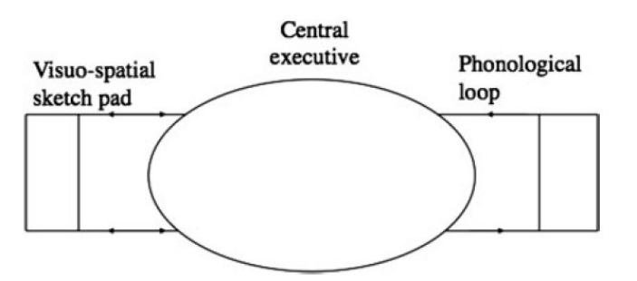

图 1-1 工作记忆模型

Figure 1-1 The working memory model

注： 由 Baddeley 和 Hitch 在 1974 年提出的工作记忆模型图示，包括中央执行系统、语 音回路系统、视空间画板系统三个部分。 图片调整自 (Baddeley et al.，1974)。 The working memory model proposed by Baddeley and Hitch in 1974, consist of central executive、phonological loop and visuospatial sketchpad. Figure was adapted from (Baddeley et al.，1974).

由此我们发现，认知灵活性与工作记忆存在一些功能上的交叉，例如在任务 切换过程中，工作记忆可以负责维持与当前任务相关的信息，同时抑制与新任务 无关的信息，以便顺利切换到新任务（Dajani et al., 2015）。同样，工作记忆容量 也被认为与认知灵活性之间存在很强的相关性。较高的工作记忆容量通常与更好 的认知灵活性相关，因为工作记忆能够有效地保持和操作任务相关信息，从而支 持灵活的任务切换。而在认知灵活性和工作记忆相关神经机制上的研究也有所联 系——两者都涉及前额叶皮层及顶叶皮层等区域的活动。这些区域在执行功能网 络中相互协作，共同支持认知灵活性和工作记忆的实现。我们在这从工作记忆相 关工作出发来逐步探究认知灵活性的相关研究。

在对工作记忆相关脑区的研究中，前额叶皮层（prefrontal cortex, PFC）是最 早被发现与工作记忆任务表现显著相关的脑区之一。1936 年，Jacobsen 通过对狒

狒前额叶皮层进行单侧以及双侧永久性切除手术，发现双侧前额叶损毁会永久损 坏狒狒正确完成任务的能力。在具体实验中，Jacobsen 将狒狒置于笼子里，笼子 外有一个桌板上面有两个食槽，而之间有一个可以拉下的挡板来阻挡狒狒视线。 每次实验开始时，Jacobsen 将挡板拉起同时向狒狒展示自己将食物放置于其中一 个食槽。然后，将笼子前的单板拉下来以挡住狒狒的视线，同时用两个相同的盖 子盖住两个食槽。经过一段时间的延迟（延迟期），当挡板被移开时，狒狒选择 之前放置食物一侧并将其盖子掀开来获取食物，若选择错误则不会得到食物。结 果表明单侧切除前额叶皮层对狒狒的表现没有显著影响，而双侧前额叶皮层的切 除则导致狒狒完成任务的能力永久受损（图 1-2）。然而，相对比有延迟期的实验 结果，在没有延迟期时，狒狒行为没有观察到有显著性影响。这表明双侧前额叶 皮层的损伤并不影响狒狒其他一些感知觉以及运动功能，而是更有可能特定地影 响狒狒延迟期间的脑活动即工作记忆，进而影响行为。这项工作虽然在设计上有 一定缺陷（Malmo, 1942），但也很好地打开了人们对于高级认知功能的探索之门， 为后续更为精确深入的研究奠定了基础。

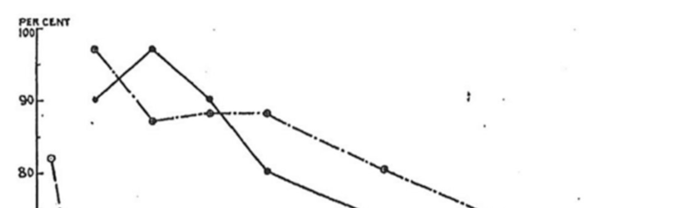

图 1-2 双侧损毁前额叶皮层造成狒狒的行为表现降低

Figure 1-2 Bilateral extirpation of prefrontal cortex significantly impaired the behavioral performance of a baboon

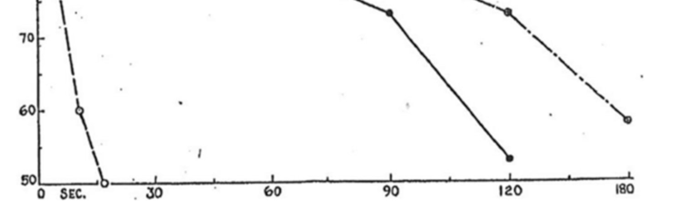

注： 虚线带空圈表示双侧额叶皮层切除后狒狒在任务中的行为表现；虚线加圈表示单 侧额叶皮质切除术后狒狒在任务中的行为表现；实线带圈为切除手术前狒狒行为 表现。图片调整自 (Jacobsen, 1936)。

Fuster 和 Alexander 在 1971 年的一项工作中，通过在猴子前额叶皮层植入电

极，在猴子进行工作记忆相关任务时成功记录到了单个神经元的放电活动（图 1- 3）。Fuster 和 Alexander 惊喜地发现，单个前额叶神经元在任务延迟期放电率显 著增加，及呈现延迟期持续性放电特征。在后续的进一步研究中他们发现这种延 迟期电活动不能编码之前出现的刺激以及选择相关的信息。综上，他们将观测到 的前额叶皮层神经元延迟期放电率的增加解释为一种注意力（attention）的提高， 即该神经元表征了猴子在延迟期对于任务的注意与参与（engagement），而并不 表征刺激信息的在线存储。但是，随着之后任务范式设计及电生理记录手段的不 断提升，一系列深入而仔细的研究慢慢揭开了皮层神经元延迟期电活动这一现象 的神秘面纱，也逐渐提高了对于工作记忆神经机制的认识与理解。

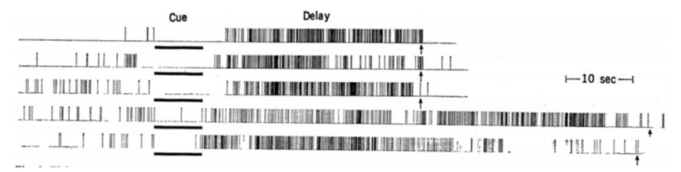

图 1-3 单个前额叶神经元在不同时长延迟期测试中的放电活动

Figure 1-3 The spiking activity of an example neuron in prefrontal cortex in 5 single trials

注： 从上到下分别为五个测试，每个测试的延迟期时长分别为 32、32、32、67、65 秒。 下面的加粗水平线表示刺激呈现的时间。箭头所指表示延迟期结束时间。图片调 整自 (Fuster et al., 1971)。

在之后的研究中，研究者们对动物实验任务范式进行了更为细致的设计来实

现对工作记忆这一高级功能进一步细致的了解。1989 年 Funahashi 等人设计了一 种新的范式，在实验中他们让猴子在结束等待时间（测试开始前猴子需注视屏幕 中心的确认点）后，观察屏幕上 8 个位置（图 1-4）上随机出现的一个刺激点， 当刺激点消失后猴子需等待一段时间（即延迟期，时长为 1~6 秒）。当中心确认 点消失代表猴子可以行动，即通过注视之前刺激点出现的方位来报告自己之前对 于刺激点方位信息的记忆（此时屏幕无任何相关信息），而之后通过猴子眼动数 据及行为正确率反馈来验证其记忆的准确性。Funahashi 等人在训练猴子完成任 务时通过埋置的电极对其皮层神经元进行了胞外电生理记录，发现前额叶背外侧 （dorsolateral prefrontal）的神经元在延迟期间对不同方向的刺激选择性地以不同 的速率放电，认为这些神经元具有编码能力并将其称之为记忆编码神经元。至此， 对于延迟期电活动的功能性探索有了新的突破，也为工作记忆等高级认知功能的 研究指明了新的方向与更多可能。

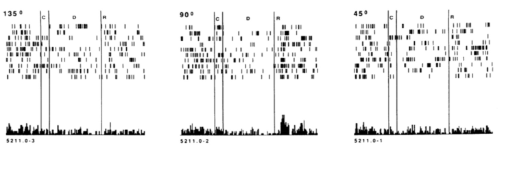

图 1-4 单个前额叶皮层神经元在延迟期的电活动具有方向选择性

Figure 1-4 The neural activity of single medial prefrontal cortex neuron shows selectivity to spatial location of visual cue

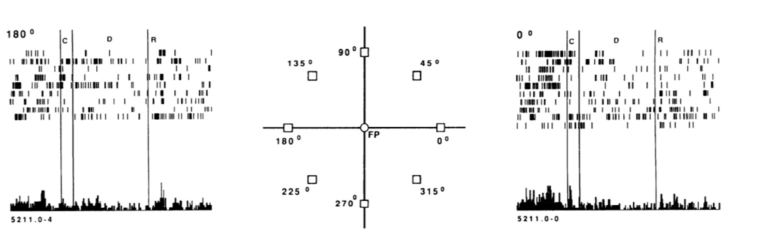

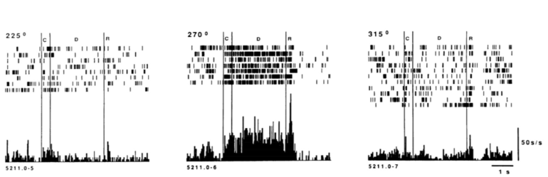

注： 中间图为刺激示意图，即屏幕上的刺激出现的位置分别为环绕中心的八个点；周围 的八张图分别为单个神经元在刺激呈现不同位置测试中的放电表现，其中该神经 元在只有在刺激出现在正下方的时候其延迟期电活动呈现强烈发放。图片调整自 (Funahashi et al.，1989)。

随着研究的不断深入，以及各种神经科学相关技术工具的发展突破，研究者 们可以在更为系统地对工作记忆等科学问题进行细致而深入的探究，例如光遗传 技术（Boyden et al., 2005; Zhang et al., 2006）的出现使得研究者们可以在更为精 细的动物实验层面来对一些已经发现的以及亟待发现的问题进行验证。2014 年， Liu 等人以啮齿类动物为模型设计并训练其学习嗅觉为基础的工作记忆任务，同 时结合光遗传技术论证了小鼠学习期前额叶皮层延迟期电活动对于其完成工作 记忆相关任务的重要性。在具体实验中，他们让小鼠先闻一个气味，在经过一段

时间（延迟期）的等待后，再闻第二个气味，此时小鼠需判断该气味是否与之前 气味相同（即反应小鼠在延迟期是否很好地记忆了第一个气味的信息）并在之后 的响应阶段通过舔水与否来进行汇报（若两个气味相同则小鼠应该舔水并获得奖 励，若气味不同则不应舔水且没有奖励）（图 1-5 B）。Liu 等人在小鼠进行任务的 同时，利用光遗传技术精确抑制了小鼠前额叶皮层神经元在延迟期的活动（图 1- 5 C），发现实验组（在 VGAT-Cre 小鼠前额叶皮层注射 DIO-ChR2 病毒，即可以 通过 470nm 激光来激活前额叶 VGAT 抑制性神经元进而来全面抑制前额叶脑区） 与对照组（在 VGAT-Cre 小鼠前额叶皮层注射 DIO-mCherry 病毒，即作为对照无 法实现激活/抑制 VGAT 神经元）相比，实验组小鼠在学习期行为受到了很大干 扰即行为正确率更低。结合另一组对照实验（图 1-5 D）发现，在非工作记忆任 务（没有延迟期，小鼠不需要在线维持气味信息相关记忆）中抑制前额叶皮层并 没有类似现象。结合两组实验结果，Liu 等人初步证明了小鼠前额叶皮层对于其 完成工作记忆相关任务的重要性。

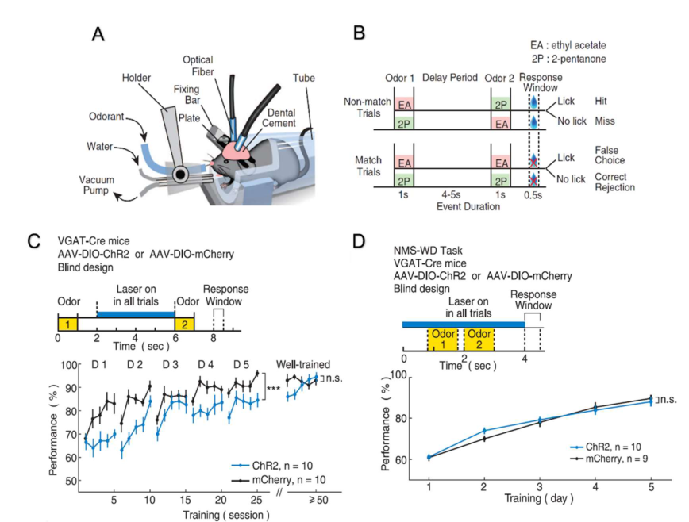

图 1-5 前额叶皮层神经元在延迟期的活动在小鼠学习工作记忆任务中起到重要作用

Figure 1-5 The neural activity of medial prefrontal cortex during the delay period plays an important role while mice perform working memory related tasks

注： (A) 头部固定且连接光纤的小鼠以及训练装置前端图示。(B) 嗅觉相关延迟不匹配 任务结构示意图。(C) 在小鼠学习嗅觉相关工作记忆任务时双侧抑制前额叶皮层 神经元延迟期活动。(D) 在小鼠学习嗅觉相关非工作记忆任务时双侧抑制前额叶

皮层神经元整个任务期活动。图片调整自 (Liu et al.，2014)。

(A) Illustration of head fixed mouse with bilateral fibers implantation and the training box (B) Schematic of mouse odor-related DNMS (delayed non-match to sample) task. (C) Bilateral inhibition of mice medial prefrontal cortex during delay period while mice learning the DNMS task. (D) Bilateral inhibition of mice medial prefrontal cortex during delay period while mice learning the Non-WM task. Figure was adapted from (Liu et al.， 2014).

## 1.1.3 抽象规则的神经表征

回到认知灵活性的讨论上，我们之前提到，个体想要实现在不同任务间的灵 活切换，工作记忆起到了很重要的一个作用：即工作记忆可以负责维持任务相关 信息。但是，当任务切换时，个体可能还要面临更为复杂的场景与规则的变化， 这时如何将之前任务与当前任务相关的部分很好的迁移过来，并在此基础上进行 适配优化以适应当前的任务需求则是灵活认知中更为重要的一个部分。而这种迁 移的过程，则需要对过去学习经验进行总结与提炼，进而生成抽象的概念，之后 才可以被应用到当下以及未来的任务需求中去。所以，我们不光要研究大脑对于 直观刺激信息的表征与维持，更要去理解其如何编码更为抽象的概念，例如大脑 对于“规则”（rule）的编码（Wallis et al., 2001），即大脑是如何对于一些外在刺 激之间所存在的抽象联系进行归纳总结。

在 2001 年的一项工作中，Wallis 等人设计并训练猴子学习具有两种不同任 务规则的复杂行为学任务（图 1-6 A）。在每个测试中，猴子需要先观察一个图像 （sample cue），之后在第一个延迟期后会有第二个图像（test cue）出现在屏幕上， 此时猴子需判断该图像是否与之前出现的第一个图像一致。在经过第二个延迟期 后，猴子需要通过松开杠杆与否来报告自己对于两个图象匹配与否的判断。其中 任务分别有两种规则：一种是“匹配”（match）规则，即若是两个图像匹配，猴 子需要在响应阶段松开杠杆来获取奖励；第二种是“不匹配”（non-match）规则， 即如果两个图像不匹配，猴子则需要在响应阶段松开杠杆来获取奖励。经过一段 时间的训练后，猴子可以分别很好地执行两种规则下的任务。之后在猴子进行任 务同时用胞外电生理技术记录了猴子前额叶皮层神经元，发现单个神经元在不同 规则下的放电率存在显著差异，证明前额叶皮层神经元具有编码抽象的规则相关 信息的能力（图 1-6 B）。

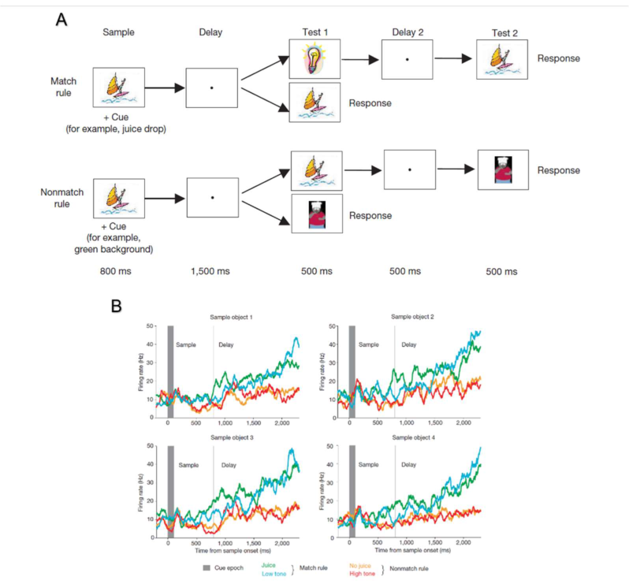

Figure 1-6 Single neurons in prefrontal cortex encode abstract rules

注： (A) 图示为猴子行为范式：有两种任务规则，一种为“匹配”规则，即如果猴子在 采样及测试阶段所看到的物体信息相同则需要在响应阶段松开杠杆以获取奖励； 而另一种为“不匹配”规则，即猴子在在采样及测试阶段所看到的物体信息不相同 时则需要在响应阶段松开杠杆以获取奖励。(B) 单个神经元可以很好地表现出对 任务规则的选择性。图片调整自 (Wallis et al., 2001)。
(A) Schematic of monkey behavioral paradigm：There are two task rules, one is match rule, which requires the monkey to release the lever if the test object matches the sample; another is nonmatch rule, which requires the monkey to release the lever if the test object does not match the sample. (B) Single neuron showing rule selectivity. Figure was adapted from (Wallis et al., 2001).

除了对抽象规则的编码，Freedman 及其同事在 2006 年的一项研究中发现， 外侧内顶叶皮层（lateral intraparietal cortex, LIP）神经元可以编码归类信息 （categorical information）。在实验中他们让猴子做一个延迟匹配任务（delayed match-to-sample task），猴子需要在样本刺激与检测刺激方向属于同一类别时松开 杠杆以获取奖励（图 1-7 B）。同时，他们记录了外侧内顶叶皮层神经元在任务中 的放电率变化，发现其中单个 LIP 神经元在样本阶段对于两个类别刺激呈现选择

性放电率变化（图 1-7 C），即可以编码归类信息。而神经元这种对不同类别信息， 而不是单一样本信息的选择性编码，体现了大脑神经元具有概括提炼抽象概念的 能力。

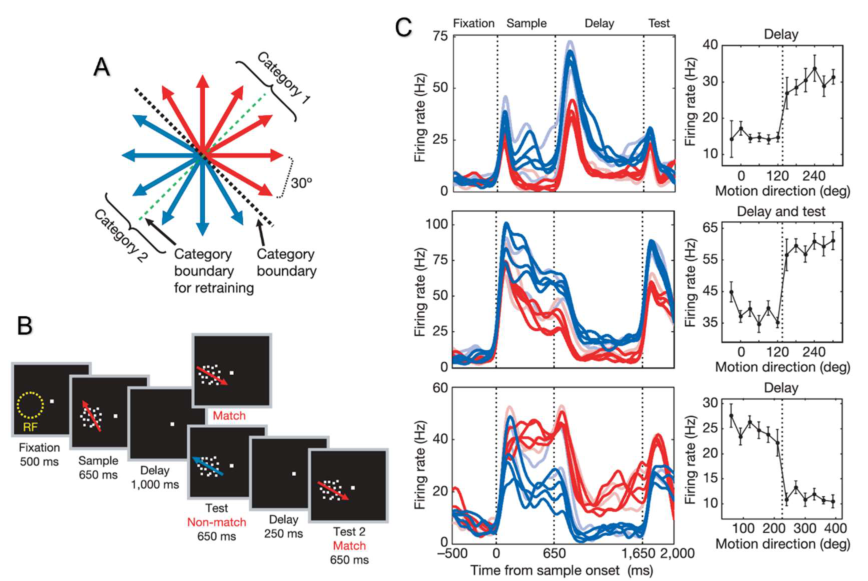

图 1-7 外侧内顶叶皮层神经元可以编码分类信息

Figure 1-7 Lateral intraparietal neurons can encode categorical information

注： (A) 刺激呈现图示：屏幕中会出现移动小点指示方向，其中一共 12 个方向可以被 归为两类。(B) 在单个测试中，猴子需要对先后出现的两个方向是否匹配进行判断， 如果匹配则可以通过松开杠杆获得奖励，如果不匹配则在第二个延迟期后会出现 一个与样本匹配的刺激，此时再通过松开杠杆获取奖励。(C) 三个外侧内顶叶神经 元在不同方向类别刺激测试中的选择性放电率。图片调整自 (Freedman et al., 2006)。 (A) Schematic of two stimulus categories：There are two stimulus categories including 12 different directions, which show in the screen by moving dots. (B) In single trial, monkey needs to release the lever if the test stimulus is matched to sample stimulus. If test stimulus is unmatched to sample stimulus, there will be another matched-to-sample stimulus showed after second delay period and monkey then needs to release the lever. (C) Three LIP neurons show category selectivity. Figure was adapted from (Freedman et al., 2006).

## 1.1.4 任务特异性的神经表征

接收并处理外界刺激信息，乃至产生分类（category）及规则（rule）等抽象 信息，这些都体现了生物认知灵活性的部分特征。但是，当这些信息处于不同情 境（context）下，大脑对其的表征是否稳定，以及是否能够将这些信息在不同任 务间灵活迁移（ flexible generalization ）进而指导生物正确完成适应性行为

（adaptive behavior）则是灵活认知相关研究中同样重要的一个科学问题。

在 Assad 等人 2000 年的一项研究中，他们在延迟配对响应任务（delay matchto-sample task）的基础上设计了一个具有三个子任务的新范式（图 1-8 A），其中 两个任务（物体识别任务, object task; 联想任务 associative task）具有相同的样 本刺激信息（样本刺激为同一张图像）但是响应阶段的行为报告相反（物体识别 任务看向右/左，联想任务看向左/右），两个任务（物体识别任务, object task; 空 间任务 spatial task）具有不同的样本刺激信息（空间任务的样本刺激为一个圆圈） 但是响应阶段的行为报告相同（物体识别任务看向右/左，空间任务看向右/左）。 并在进行任务的同时记录了猴子前额叶皮层神经元的活动（图 1-8 A）。结果表明， 前额叶皮层神经元具有不同类型的任务特异性表征。例如在样本刺激信息相同的 两个任务中，一个神经元（图 1-8 B 上）在两个任务中均具有样本刺激选择性， 一个神经元（图 1-8 B 中）则只在物体识别任务中具有样本刺激选择性，而另一 个神经元（图 1-8 B 下）则只在联想任务中具有样本刺激选择性；同样在对空间 任务和联想任务进行比较分析时，可以找到类似的三种类别的神经元（图 1-8 C）。 这也表明，不同类别神经元可以分别负责不同任务中刺激信息的处理（初级信息） 以及部分神经元能够负责整个过程中的同类型信息的处理（抽象信息），而这可 能是生物在不同任务间实现灵活切换的一种解决策略。同时他们发现，前额叶皮 层神经元基准线活动（baseline activity）呈现丰富的任务选择性（task selectivity） （图 1-8 D）——即图中黑框圈中的“Fix”阶段，神经元电活动在不同任务时有 显著差异，例如一个神经元在空间任务中基准线活动显著高于另外一个任务（图 1-8 D 上），同时另一个神经元则在物体识别任务中基准线活动显著高于其他任务 （图 1-8 D 下）。而这说明神经元可能在任务场景切换之后，通过调整自己的整 体发放水平达到不同状态（state）来应对不同的任务需求，也使得生物能够追踪 并获取当下任务状态以调整部署整体资源。

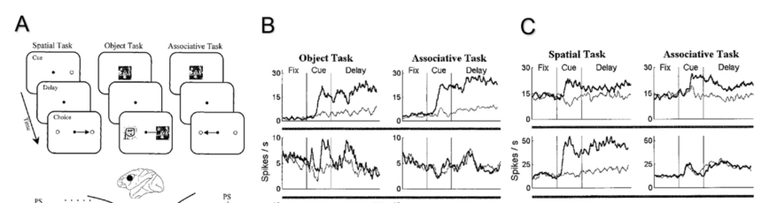

图 1-8 单个神经元在特定任务情境下的神经表征

Figure 1-8 Task-specific neural representations of single neuron in the primate prefrontal

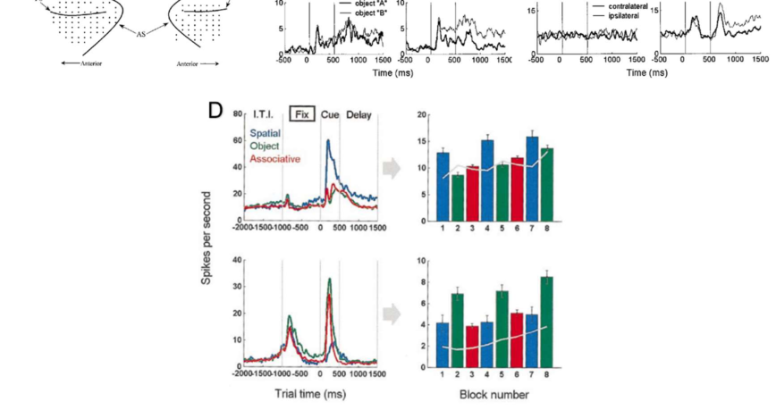

cortex

注： (A) 任务结构图示（上图）及电极记录位点（下图）。(B) 单个神经元（每一行为 一个神经元数据）分别在物体识别任务和关联任务中，对于不同物体刺激响应随 时间的平均放电率变化。(C) 单个神经元（每一行为一个神经元数据）分别在空间 任务和关联任务中，对于不同应答方向下随时间的平均放电率变化。(D) 单个神经 元（每一行为一个神经元数据） 图片调整自 (Assad et al., 2000)。
(A) Schematics for task structure (upper figure) and for recording area. (B) shaded arears on the left and right brains) showed the persistent stimulus-selective activity during Working Memory delays for different types of stimulus (see legend). Figure was adapted from (Assad et al., 2000).

Assad 等人的研究证明在单细胞水平，前额叶神经元不但可以编码任务特异 性信息，同时也具有任务泛化表征能力（Assad et al., 2000）。那么前额叶皮层群 体神经元对于任务特异性以及任务泛化信息编码又有怎么样的表现，同时其他脑 区是否也有这种类似的表征能力，以及这种能力是否会随着学习而发生变化？为 了尝试解决这些问题，Sarma 及其同事在之前行为范式（Freedman et al., 2006） 的基础上涉及了一种包括两个阶段的任务组合（图 1-9 A, B）：先让猴子学习一个 基础延迟匹配任务（delay match-to-sample, DMS），其中在匹配测试（matched trial） 中样本刺激和测试刺激方向是一致的（图 1-9 B 左）；之后让猴子去学习延迟分

类任务（delayed match to category, DMC）, 即在匹配测试中呈现的测试刺激与样 本刺激有可能不是同一方向但在同一类别（图 1-9 B 右）。这样将整个任务分成 了 DMS 任务（初始任务）与 DMC 任务（分类任务），同时对外侧内顶叶皮层神 经元（lateral intraparietal cortex, LIP）进行长期记录，追踪其在学习整个过程中 （从 DMS 到 DMC）对于任务相关信息编码的动态改变。结果显示，LIP 群体神 经元无论是在 DMS 还是 DMC 任务中，在采样期（sample period）均具有很高的 方向解码（direction classification）表现（图 1-9 D 左），这说明 LIP 在采样期的 方向解码能力不受学习的影响。同时，LIP 群体神经元对于更为泛化的类别信息 解码正确率则在 DMC 任务中呈现逐步上升（ramping-up）趋势，且在延迟期具 有很好的解码能力（相比 LIP 在延迟期方向解码能力则是快速下降至机会水平）， 但是在 DMS 任务中却基本没有类别解码能力，这说明 LIP 神经元编码类别信息 的能力收到学习的调控。之后 Sarma 等人又在另外两只猴子进行 DMS 任务时， 同时记录前额叶皮层和后顶叶皮层神经元。他们发现无论是单个神经元（1-9 E） 还是群体神经元（1-9 F），相较于后顶叶皮层只在采样期具有方向解码能力，前 额叶则在采样期和延迟期均有很强的解码能力，表明在工作记忆及其他高级认知 功能中前额叶皮层相较于后顶叶皮层能够扮演更为泛化的角色（generalized role）。

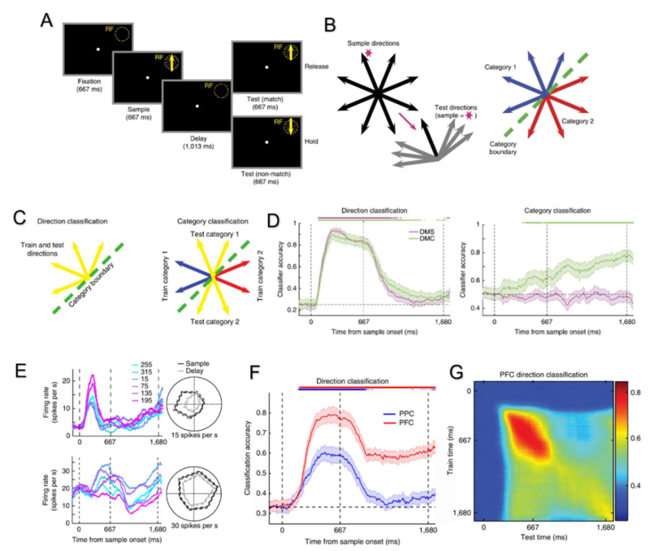

图 1-9 顶叶脑区和前额叶脑区任务特异性与任务泛化的差异化神经表征

Figure 1-9 Task-specific and generalized neural representations of neuron population in the primate parietal cortex and prefrontal cortex

注： (A) 单个任务测试结构。(B) 刺激信息图示：左图为 DMS 任务中样本刺激和测试 刺激；右图为 DMC 任务刺激，与图 1-7 A 类似。(C) 图示为两种分类器：一种为 方向分类器，训练集与测试集为同一方向；另一种为类别分类器，即训练集与测试 集为不同方向但都在一个相同类别里。(D) 外侧内顶叶皮层群体神经元在两个任 务中对于方向信息分类的表现（左图），以及对类别信息分类的表现（右图）。(E) 同时记录的两个神经元（上图为后顶叶皮层神经元，下图为前额叶皮层神经元）在 DMS 任务中的差异性放电率变化。(F) 后顶叶皮层与前额叶皮层群体神经元在 DMS 任务中对于方向信息分类的差异化表现。(G) 前额叶群体神经元具有跨时间 稳定的方向选择性。图片调整自 (Sarma et al., 2016)。
(A) Schematic of single trial. (B) Schematic of stimulus information: The left figure is the sample stimulus and test stimulus shown in DMS task; right figure is the stimulus shown in DMC task. (C) Diagrams of two different classifiers: one is for direction classification and another is for category classification. (D) Classifier accuracy of LIP neuron population in DMS and DMC tasks. (E) Two simultaneously recorded neurons from PPC (up figure) and PFC (down figure). (F) Classifier accuracy of PPC and PFC neuron population in DMS task. (G) Stable direction selectivity for PFC neuron population. Figure was adapted from (Sarma et al., 2016).

同样在啮齿类的研究中也发现了任务特异性的神经表征，Lee 等人将两个不 同结构的任务结合在一起设计了一个新的范式：第一个为小鼠虚拟 T 型迷宫任 务（virtual T-maze task, 图 1-10 A）——小鼠被头部固定在一个悬浮泡沫球上， 其视线正对的三块屏幕组合形成一个虚拟现实系统来呈现虚拟 T 型迷宫，引导 小鼠根据墙壁两侧呈现的光栅选择一侧通道（Krumin et al., 2018）；另一个则是 转动方向盘任务（“steering-wheel task”，图 1-10 B）——小鼠被固定在一个平台 上，其视线正对的屏幕上左侧或右侧会随机出现一个圆形光栅图像，小鼠需要通 过转动转盘来将该图像移至视野中央虚线圆圈处（Burgess et al., 2017）。结合宽 场成像（wide-field imaging）以及双光子成像（two-photon imaging）（图 1-10 C）， 研究者发现小鼠顶叶皮层群体神经元呈现任务特异性电活动表征（task specific neural representations ）——即记录到的顶叶神经元大致可以分为两个亚群 （subpopulation），一部分神经元在主动或被动“悬浮球场景”（ball context）中呈 现高频放电，而另一群神经元则在主动或被动“转盘场景”（wheel context）中呈 现高频放电（图 1-10 D）。而在进一步的细致研究中，他们将两种场景进行混合 （图 1-10 E），即混合任务具有 T 型迷宫任务的视觉刺激和转盘任务的运动响应。 图 1-10 E 所示为三个神经元分别在三个任务中的电活动变化，可以看到第一个 神经元呈现 T 型迷宫选择性，而另外两个神经元则均在转盘及混合任务中呈现 高频放电。综上所述，首先顶叶皮层神经元活动具有任务特异性，同时这种特异 性体现在针对抽象的物理场景（physical context）的选择性（悬浮球场景 vs 转盘 场景）而不是具体的视觉刺激类别（条形光栅 vs 圆形光栅）。

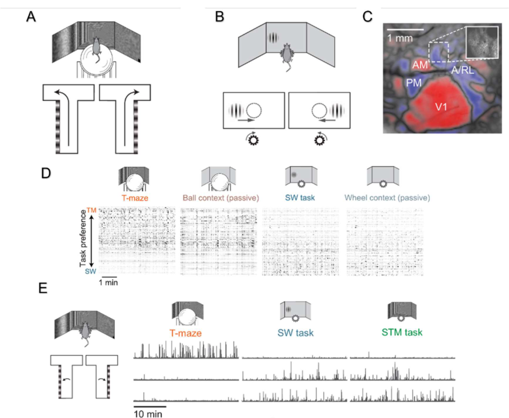

图 1-10 小鼠顶叶皮层神经元活动呈现任务选择性

Figure 1-10 Task-specific neural activities of neurons in mouse parietal cortex

注： (A) 小鼠 T 形迷宫任务。(B) 小鼠转方向盘任务。(C) 宽敞成像及双光子成像区域。 (D) 栅格图显示了神经元在不同任务及不同状态中的活动。(E) 三个神经元分别在 三个任务中的活动。图片调整自 (Lee et al., 2022)。
(A) The T-maze task for mice. (B) The steering-wheel task for mice. (C) Imaging areas for wide-field imaging and two-photon imaging. (D) Raster plot of activity from example neurons showing 5-min segments in each task and in the related passive condition. (E) Three example neurons showing activity in one session through all three tasks. Figure was adapted from (Lee et al., 2022).

## 1.1.5 神经网络在多任务学习以及连续学习中的表现

随着科学研究的不断深入，人们越来越关注大脑是如何在不同任务之间进行 切换，以及这种切换背后的神经机制。然而，传统的实验方法往往局限于对单一 任务或简单任务切换的研究，难以全面揭示大脑在面对复杂多变任务时的动态调 整机制。近年来，神经网络的兴起为这一问题提供了新的研究途径。通过构建计 算模型，科学家们可以在模拟环境中重现大脑处理多任务的复杂过程，从而在计 算模拟层面对理论进行验证。这种计算神经科学的方法允许研究者构建具有生物 合理性的神经网络模型，模拟大脑在执行多任务时的神经活动模式，进而探究大

## 脑如何在不同任务之间灵活切换。

例如，循环神经网络（Recurrent Neural Networks, RNNs）因其能够处理序列 数据和记忆前序信息的能力，被广泛用于模拟工作记忆和任务切换等认知功能。 通过训练 RNNs 执行多个不同的任务，研究者可以观察到网络如何在不同任务之 间调整其内部状态，从而模拟大脑的多任务处理能力。此外，深度学习模型的发 展也为理解大脑的复杂计算提供了新的工具，使得研究者能够探索大脑如何在多 层次上整合和处理信息。Yang 等人通过训练循环神经网络（recurrent neural network, RNN）（Zipser and Andersen, 1988; Mante et al., 2013），并让单个网络同 时学习 20 个不同类型的认知任务，结果显示在经过一些测试（trial）的学习后网 络可以很好地解决不同任务（图 1-11 B）。那么网络又是如何很好去实现解决不 同任务，或者更确切地说在学习过程中网络是否会生成一些具有共性的任务表征 呢？Yang 等人提出两类假说——第一种是聚类（clustering），即不同任务是由不 同群神经元活动负责但同时不同任务也会共享一部分神经元活动（任务泛化表 征）；或者组合型（compositionality），即将认知过程分为不同部分，当前任务可 以提取任务相关部分来解决问题（图 1-11 A）。将网络群体活动进行全部测试平 均后获得状态空间（state space），同时得到不同任务在状态空间的表征（图 1-11 C）。利用降维分析方法即主成分分析（principle components analysis, PCA），进一 步将网络在不同任务的群体活动投射在由前两个主成分（principal components, PCs）构建的平面上，并得到不同任务间的向量，发现从 Anti 任务到 Dly Anti 任 务以及从 Go 任务到 Dly Go 任务的向量方在状态空间中具有相似性（图 1-11 D 左），同样多个独立训练的网络结果与之类似（图 1-11 D 右）。上述提到的两个 向量均为从非工作记忆任务到工作记忆任务，说明这种相似性可能反映了工作记 忆的认知过程。图 1-11 E 为类似两组任务（从 Ctx DM1 任务 Ctx Dly DM1 任务 以及从 Ctx DM2 任务到 Ctx Dly DM2 任务）的相似表征。这些结果表明，任务 的抽象表征可以通过感觉、认知和运动过程的向量代数和来表示，表明组合型表 征可能是大脑认知灵活性的一个重要特征。总之，这项研究揭示了神经网络在处 理多任务时可能采用的组合型策略，为理解大脑的认知灵活性提供了新的视角。

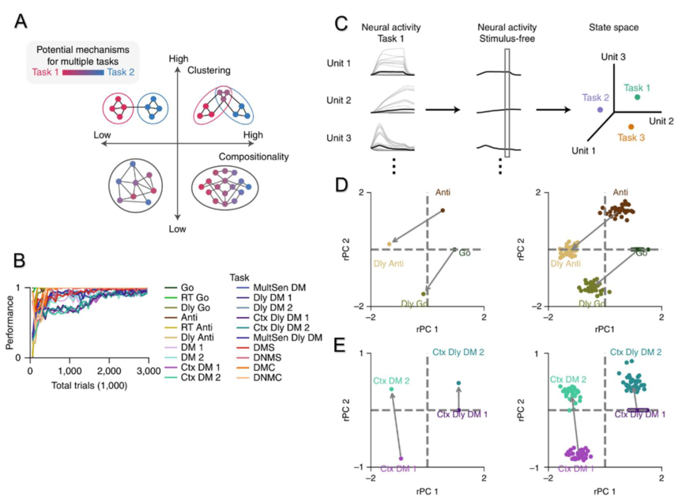

图 1-11 循环神经网络活动可以形成对于不同任务的组成式表征

Figure 1-11 Recurrent neural network  (RNN ） can develop a form of compositional representations for tasks

注： (A) 图示为同一个神经网络可以在有或没有聚类以及组合性的情况下解决两个任 务。(B) 神经网络成功学会 20 个认知任务。 (C) 从群体神经元活动到状态空间图 示。(D) 在前两个主成分构建的平面上，Go、Dly Go、Anti 和 Dly Anti 四个任务 的表征分布。(E) 在前两个主成分构建的平面上，Ctx DM1、Ctx DM2、Ctx Dly DM1 和 Ctx Dly DM2 四个任务的表征分布。图片调整自 (Yang et al., 2019)。
(A) Schematic of one neural network can solve two tasks with or without clustering and compositionality. (B) Neural network successfully learned and performed 20 cognitive tasks. (C) Representations of Go, Dly Go, Anti and Dly Anti tasks in first 2 principal components (PCs). (E) Representations of Ctx DM1, Ctx DM2, Ctx Dly DM1 and Ctx Dly DM2 tasks in first 2 principal components. Figure was adapted from (Yang et al., 2019).

但是另外一项研究中，Kim 及其同事则发现，相较于训练循环神经网络模型 解决问题，放大前馈模型（amplifying feedforward model, AFF）对于任务的表征 则是与大脑真实神经活动模式更为一致（图 1-12 为神经网络模拟结果）。在具体 实验中，他们让小鼠进行一个连续学习任务（图 1-18 C），同时结合编码分析方 法（coding direction analysis），发现前外侧运动皮层神经元（anterior lateral motor cortex, ALM）群体活动在学习新的任务（context 2）时投射在一个新的方向，而 在回顾学习之前任务（context 1’）时又回到之前的编码方向上去，说明 ALM 神

经元在不同任务切换之后采取了不同的表征。而之后他们分别训练 RNN 模型（图 1-12 A）以及 AFF 模型（图 1-12 C），相较 RNN 模型可以在任务切换后依旧保 持类似表征（图 1-12 B），AFF 模型则表现与 ALM 神经元群体活动一致，提示 AFF 可能是更符合生物特征的一种模型。

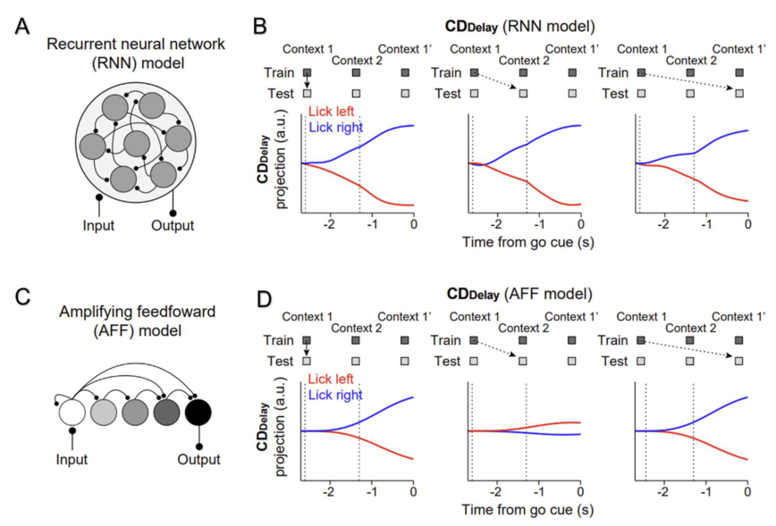

图 1-12 循环神经网络模型和放大前馈模型的跨任务表现

Figure 1-12 Cross-task performances of recurrent neural network (RNN) model and

amplifying feedforward (AFF) model
注： (A) 循环神经网络模型示意图。(B) RNN 模型群体活动投射在不同任务延迟期编码 方向上。(C) 放大前馈模型示意图。(D) AFF 模型群体活动投射在不同任务延迟期 编码方向上。图片调整自 (Kim et al., 2025)。

(A) Recurrent neural network. (B) Activity of RNN model projected on CDdelay in different task contexts. (C) Schematic of amplifying feedforward model. (D) Activity of AFF model projected on CDdelay in different task contexts. Figure was adapted from (Kim et al., 2025).

## 1.1.6 神经活动在组合型多任务中的动态变化

在上一节我们探讨了神经网络中对于如何解决多问题以及连续学习的研究， 也提到组合性（compositionality）这一重要概念。为了探究生物是如何解决组合 型任务以及大脑神经活动是如何在任务之间实现灵活切换的，Tafazol 及其同事 训练猴子学习三个不同但是组合相关（compositional related）的任务，即两个任 务刺激信息相同（均关注样本颜色信息）但行为报告不同（报告时眼动结果方向 垂直），两个任务行为报告相同但任务刺激信息不同（一个关注样本颜色，一个

需关注样本形状）（图 1-13 B）。在实验中他们训练猴子掌握组合型任务后，在猴 子做任务的同时记录了多个脑区神经元活动（lateral prefrontal cortex, LPFC; frontal eye fields, FEF; parietal cortex, PAR; anterior inferior temporal cortex. aIT; striatum）(图 1-13 C)。其中他们发现 LPFC 脑区群体神经元在任务中可以很好地 编码任务相关信息，即在 C1 任务（Task Color-Axis 1, 关注物体颜色同时眼动报 告方向分别为左上和右下）和 C2 任务（Task Color-Axis 2, 同样关注物体颜色但 眼动报告方向分别为左下和右上）中 LPFC 群体神经元能够很好地编码物体颜色 信息（任务需求为关注物体颜色）（图 1-13 D），y 以及在任务 S1（Task ShapeAxis 1, 关注物体形状同时眼动报告方向与 C1 一致分别为左上和右下）中可以很 好地编码物体形状信息（任务需求为关注物体形状）（图 1-13 E）；同时 LPFC 脑 区群体神经元在任务中不能很好地编码任务不相关信息，即在 C1 和 C2 任务中 不能很好地编码物体形状信息，以及 S1 任务中不能很好地编码物体颜色信息（图 1-13 D, E ）。至此， LPFC 群体神经元实现了在不同任务中的组合型表征 （compositional representations），即在特定任务中从特定子空间（subspace）提取 任务相关信息的表征，同时减弱任务不相关信息的表征。研究者为了进一步探究 群体神经元对于信息的编码是否具有跨任务泛化能力（cross-task generalization）， 使用了跨任务支持向量机（support vector machine, SVM）解码（图 1-13 G），即 使用前一个任务训练得到的解码器（decoder）在后一个任务中的测试组进行预测。 结果表明物体颜色信息的神经表征可以很好地在 C1 和 C2 任务（均关注物体颜 色）之间共享（shared neural representation），而运动信息也可以在 S1 和 C1 任务 （具有相同的眼动报告方向）之间泛化。综上，该实验进一步加深了我们对于认 知灵活性的理解，也验证了大脑通过组合与任务相关的神经表征来灵活应对不同 任务的可能性。

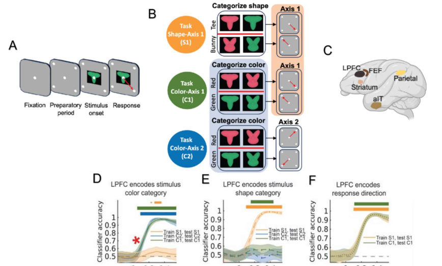

图 1-13 外侧前额叶脑区对于颜色和响应能够进行编码并实现跨任务泛化

Figure 1-13 Neural representations of color and response can be encoded and generalized in LPFC

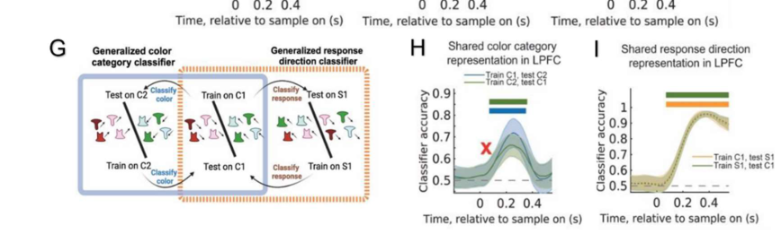

注： (A) 单个实验测试示例。(B) 任务结构图示：任务 S1 需要猴子对物体形状进行分 类，并且之后在对称轴 1 的方向上分别通过看向左上方或右下方来报告分类结果； 任务 C1 需要猴子对物体颜色进行分类，并在对称轴 1 的方向上分别通过看向左上 方或右下方来报告分类结果；任务 C2 同样是需要猴子对物体颜色进行分类，但是 需要其在与对称轴 1 垂直的对称轴 2 的方向上分别通过看向左下方或右上方来报 告分类结果。(C) 记录区域图示。(D-F) 利用 LPFC 神经元活动分别来训练分类器 并用来解码：(D) 颜色类别，(E) 形状类别 (F) 响应方向这三类信息。(G) 利用 LPFC 神经元活动训练分类器并跨任务检测正确率的方法图示。(H) 使用(G)所示 方法，利用 LPFC 神经元活动在任务 C1 中训练颜色信息分类器并在任务 C2 中检 测正确率或在任务 C2 中训练分类器并在任务 C1 中检测正确率。(I) 使用(G)中所 示方法，利用 LPFC 神经元活动在任务 C1 中训练响应方向信息分类器并在任务 S1 中检测正确率或在任务 S1 中训练分类器并在任务 C1 中检测正确率。图片调整 自 (Tafazoli et al.，2024)。

(A) Illustration of a single trial. (B) Illustration of the task structure: task S1 requires the monkey to categories the shape of the object and to response on Axis 1; task C1 requires

## 1.1.7 图示在啮齿类动物多任务学习中的神经表征

在多任务学习与连续学习研究中，有另外一个重要的概念——图示（schema）， 一种对于外界知识的接近本质的抽象表征，在学习中产生并可以应用且加速连续 任务学习（Goudar et al., 2023）。Zhou 等人通过训练大鼠学习一种序列气味任务 （odour-sequence task）（图 1-14 A）（Zhou et al., 2019; Zhou et al., 2019），并同时 对大鼠眶额叶皮层神经元（orbitofrontal cortex, OFC）进行胞外电生理记录，发现 OFC 神经元在连续学习任务中扮演重要角色。在具体实验中，一共 16 个气味被 分为两个组别（S1 and S2 sequence pairs），每个组别 6 个测试或 6 个位置（position 1~6），除了 S2 组别中 13 和 14 气味分别在 S2a 和 S2b 序列循环中所偶联奖励与 否不一致（见图 1-14 A 右，S2a-13 为 Go 测试而 S2b-13 为 No-go 测试；S2a-14 为 No-go 测试而 S2b-14 为 Go 测试）其余任务中均为一个气味偶联一种行为结 果（即有的气味为 Go 测试而有的气味为 No-go 测试，偶联不随 a/b 循环而改变）。 同时共五个任务，即每个任务有 16 个不同的气味，大鼠依次学习五个不同的气 味集（odour set），整个训练过程大鼠约需 15 天才能达到良好表现，具体体现为 正确率的不断提高以及鼻触等待延迟（poke latency）的动态变化。为了验证大鼠 在完成连续学习任务时大脑是否会形成图示，Zhou 及其同事对 OFC 神经元在任 务中的活动进行了跨任务解码分析（cross-task decoding analysis），即利用典型相 关分析（canonical correlation analysis, CCA）先对已经经过降维的数据进行处理， 之后通过得到的 2/5 problem 的前 60 典型成分（canonical components, CCs）作为 训练组，另外 2/5 problem 的前 60 CCs 作为测试组进行解码分析（SVM; MATLAB toolboxes: libsvm-3.22 and ndt.1.0.4）。图 1-14 B-D 所示可以看出测试组和训练组 有很强的相关性，同时随着学习的进步这种相关性也得到增强（Day 15 相较于 Day 1 解码效果得到提高），说明大鼠在连续学习时产生了图示（可以跨任务解 码），同时这种图示表征随着学习提高也得到进一步加强。

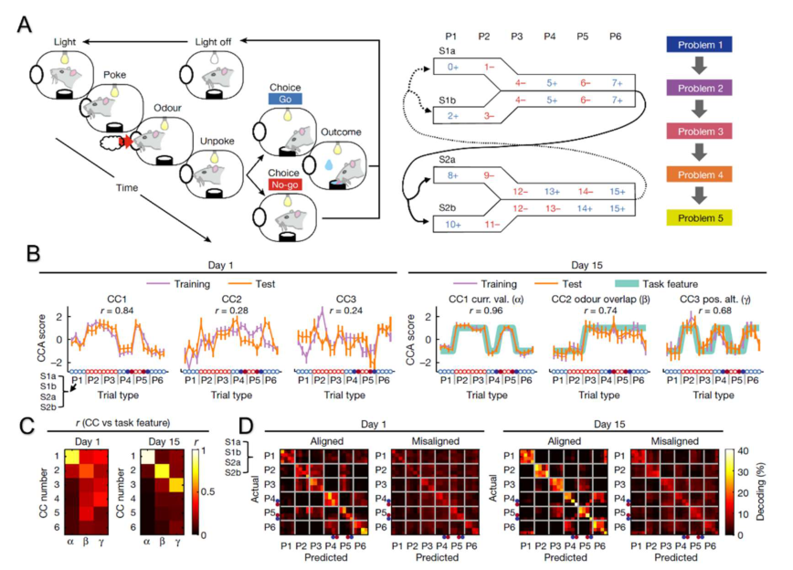

图 1-14 大鼠眶额叶皮层神经元在不同学习阶段对于图示的表征

Figure 1-14 Neural representations of schema evolve in rat orbitofrontal cortex

注： (A) 大鼠连续学习任务范式（左图）和不同任务测试图示（右图）。(B) 对同一重 复测试中训练组及测试组进行典型相关性分析 (canonical correlation analysis, CCA) 所提取出的前三个典型主成分 (canonical components)。(C) 前六个典型主成分与 三个任务特征的相关性分析。(D) 第一天和第十五天的解码混淆矩阵。图片调整自 (Zhou et al., 2021)。(A) Paradigm of rats continual learning task (left figure) and illustrations of different trials in task. (B) The first three CCs (canonical components) in training and test sets from a single repeat. (C) Correlation between the first six CCs and three task-related features. (D) Decoding confusion matrices on day 1 and day 15. Figure was adapted from (Zhou et al., 2021).

## 1.1.8 图示的形成加速学习过程

在上一节我们说到大鼠在进行连续学习任务时，大脑形成了对于任务的图示 表征（schema representation），同时这种表征随着学习不断增强，那么反过来这 种图示的形成是否也是加速大鼠学习过程的原因呢？为了探究这一点，Zhou 等 人在实验中测量了大鼠在不同任务以及不同学习阶段中，处于不同测试位置时的 鼻触时间（poke latency），该指标可以说明大鼠对于奖励预期的判断（预测下一 个测试有奖励则会时间更短，相反则更长，如图 1-15 A 中 x 轴所示，从左到右 奖励预期又少到多），可以看到当奖励最低时，任务 1 中受到学习影响较大，而

任务 5 中（图 1-15 B）因为已经有了任务 1~4 的学习经历（learning experience） 学习前后差异较小。同时如果对 Day1 和 Day15 数据进行相关性分析可以发现， 相较于任务 1，从任务 2 到 5 相关性在逐步增加（图 1-15 C）。综上说明大鼠任 务理解随着任务变化（problem 1 到 5）不断加深，这种加速学习即可能是大鼠在 学习过程中产生图示来进一步指导学习的证据。

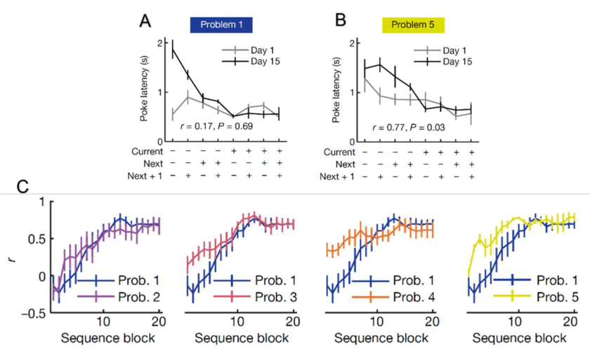

图 1-15 加速学习可能是反映序列知识的图式的运作的证据

Figure 1-15 Accelerated learning might be evidence of the operation of a schema reflecting knowledge of the sequences

注： (A) 不同学习阶段中大鼠在任务 1 中的鼻触等待延迟时间。(B) 不同学习阶段中大 鼠在任务 5 中的鼻触等待延迟时间。(C) 前六个典型主成分与三个任务特征的相 关性分析。(D) 第一天和第十五天的解码混淆矩阵。图片调整自 (Zhou et al., 2021)。 (A) Poke latencies in problem 1 for the first 5 sequence blocks on day 1 and all 20 sequence blocks on day 15. (B) Poke latencies in problem 5 for the first 5 sequence blocks on day 1 and all 20 sequence blocks on day 15. (C) Correlation between poke latencies on day 1 and day 15 for each of the 5 problems. Figure was adapted from (Zhou et al., 2021).

为了进一步研究这种“学习如何去学”（learning-to-learn）的能力，Goudar 及 其同事通过训练循环神经网络（recurrent neural network）连续学习多个任务来探 究这个过程中网络是否会生成图示以及连续学习过程是否会逐渐提升学习效率 （learning efficiency）。在任务中，网络需要学习延迟响应任务（delayed response task）（图 1-16 A 左），同时在能很好地完成前一个任务时（达到任务表现标准） 即可进入下一个任务的训练（图 1-16 A 右）。通过定义网络在任务切换时为了达 到标准耗费的测试数为学习效率指标，即耗费测试数越多说明学习速度越低，发 现随着任务连续学习的进行，学习效率呈指数级增加（图 1-16 B）。综上，神经

网络模拟的结果与实验结果一致（Zhou et al., 2021），再次说明连续学习过程确 实在不断提高学习能力。另外，他们通过对网络表征流行的不同类型的阻断（图 1-16 C），发现在固定读写（frozen readout）的情况下即使有扰动（with D>S Manifold perturbation）也可以很好地加速任务二的学习，但是若是改变读写则会 很大程度上时加速学习能力消失（with S>S Manifold perturbation）（图 1-16 D）。 换句话说，加速学习的过程是群体神经元活动通过重复利用（reuse）之前所产生 的决策流形（decision manifold），即从 stimulus 到 decision 的投射可以被下一个 任务所利用，若是将这种投射限制或者改为 stimulus 到 stimulus 则会使加速学习 能力消失。综上，Goudar 等人通过神经网络模拟的方法从充分性的角度验证了 图示在加速学习中扮演的重要角色。

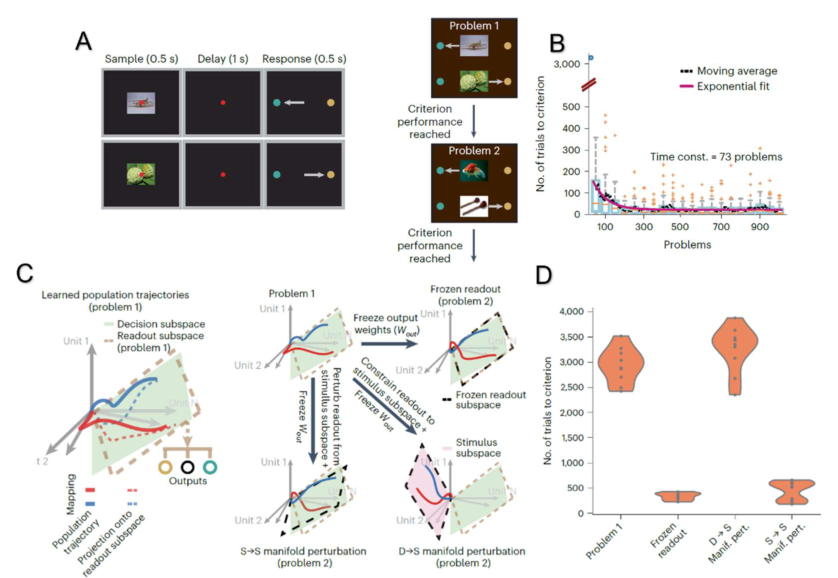

图 1-16 图示的形成促进神经网络指数级的加速学习表现

Figure 1-16 Schema formation in a neural network underlies an exponential time course of

accelerated learning

注： (A) 延迟响应任务结构（左）以及进入新任务标准（右）图示。(B) 连续学习 1000 个任务中网络学习效率的变化。（C）流形扰动图示。（D）在不同情形下第二个任 务达到标准所需平均测试数。图片调整自 (Goudar et al., 2023)。

(A) Schematics of delayed response task structure (left) and performance criterion for entering next problem (right). (B) Changes of learning efficiency of neural network over 1000 consecutive problems. (C) Schematic of manifold perturbation. (D) Average second problem learning efficiency in different conditions. Figure was adapted from (Goudar et al., 2023).

## 1.2 任务相关信息在全脑的分布式表征

## 1.2.1 工作记忆相关信息在全脑广泛分布

另外，在对工作记忆的研究进程当中，越来越多的证据表明，目标信息的编 码和在线存储涉及到并非单一脑区，而是牵扯到大脑多个区域的协同作用。 Christophel 等人在 2017 年的综述中详细总结了这一分布式储存的神经基础。如 图 1-17 所示，非人灵长类（左图）和人类（右图）的研究共同揭示了前额叶皮层 在工作记忆中扮演的关键角色（PFC 在延迟期的电活动能够编码包括物体、自然 图像、颜色、视觉运动等多重感觉特征信息，以及更抽象的特征如数量和触觉振 动频率）。此外，视觉相关区域如 V1、MT、MST、V4 和颞叶皮层也显示出在空 间定位、运动和形状刺激中的持续性刺激选择性活动。其他感觉区域，包括听觉 皮层、初级和次级躯体感觉皮层，也在工作记忆中发挥作用。这些广泛的证据共 同展示了工作记忆在大脑中的分布式储存特性，表明不同脑区根据其功能专业化， 相互作用以维持和控制工作记忆，从而支持复杂的认知任务。

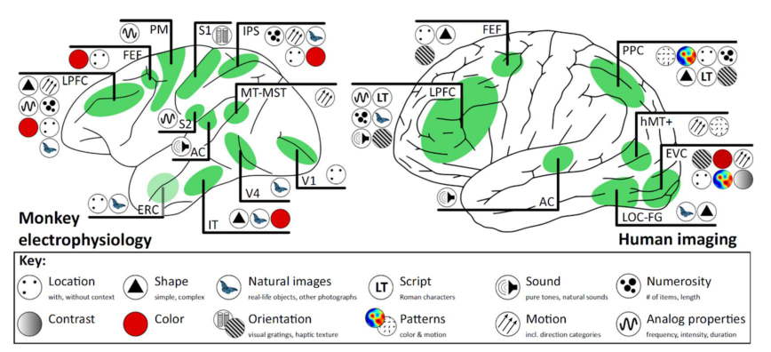

图 1-17 在猴脑（左）和人脑（右）中对于工作记忆相关信息表征的全脑分布

Figure 1-17 Brain-wide distribution of working memory-related information representations in Macaque (Left) and Human (Right) brains

注： 图标所示为不同类别刺激下（详情见图示说明）在不同脑区（左图及右图中阴影区 域）观测到延迟期刺激选择性的持续性放电活动。图片调整自 (Christophel et al.， 2017)。

## 1.2.2 不同任务相关信息在全脑的差异化分布

在先前的研究中，研究者们已经逐步认识到工作记忆相关信息在大脑中的分

布是广泛的，涉及多个脑区。这些区域从感觉区域到顶叶和前额叶皮层，共同参 与工作记忆的编码和处理。这些发现为理解大脑如何处理和存储工作记忆中的信 息提供了重要的基础。

随后的研究进一步揭示了工作记忆相关信息在全脑中的差异化编码分布。 Steinmetz 等人的研究通过在小鼠执行视觉延迟响应任务时，使用 Neuropixels 电 极记录了大约 30,000 个神经元在 42 个大脑区域的活动，发现了一些关键的神经 编码模式。研究结果表明，与行动选择相关的神经元信号在大脑中是广泛分布的， 而与特定选择相关的信号则出现在更为局限的脑区，如前额叶皮层、基底神经节 和中脑。此外，中脑神经元在即将做出对侧选择前被激活，而在即将做出同侧选 择前被抑制，而全脑神经元则表现出对任一侧的偏好。这些发现不仅证实了任务 相关信息在全脑的差异化分布特性，还揭示了大脑如何在不同脑区之间协调信息 处理。这种分布式编码可能与大脑的功能专业化有关，其中每个脑区根据其特定 的功能特点对不同类型的信息进行编码。例如，感觉区域可能更专注于处理具体 的感官信息，而前额叶皮层则可能参与更抽象的信息处理和决策制定。

综上所述，随着对于大脑认识的不断深入以及记录手段的不断进步，研究者 们可以实现在啮齿类动物模型中进行全脑尺度的大规模电生理记录，进而能够系 统解析任务相关信息在全脑中的差异化编码模式，深化了我们对大脑处理复杂任 务时全脑神经机制的认知，也为未来的研究提供了新的方向与思路。

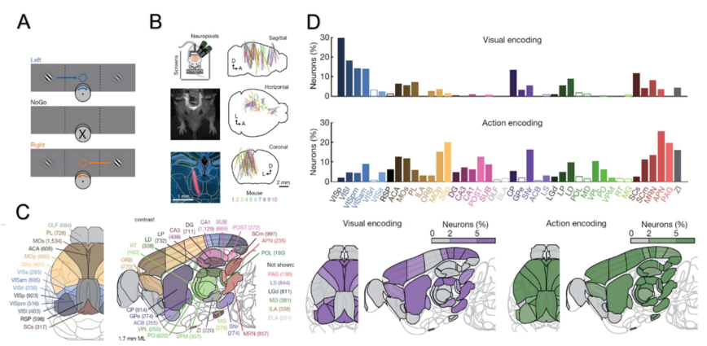

图 1-18 神经元对不同任务相关参数编码的全脑差异化分布

Figure 1-18 Brain-wide differential distributions of neurons encoding information related to

different task variables
注： (A) 小鼠任务范式。(B) 在小鼠执行任务同时进行在体大规模电生理记录及电极穿 过大脑轨迹示意图。(C) 记录区域及各脑区采集到单细胞数量总览。(D) 各脑区所 含编码视觉信息（上图）神经元比例以及所含编码运动执行信息（中图）神经元比 例; 下四图为不同信息在不同脑区分布比例的俯视图及横视图。图片调整自

(Steinmetz et al., 2019)。(A) Mice’s behavioral paradigm. (B) Mice were head-fixed with forepaws on the wheel while multiple Neuropixels probes were inserted for each recording; and recording track locations as registered to the Allen Common Coordinate Framework 3D space. (C) Recording arears and the counts of recorded single units in each area. (D) Fractions of the neurons encoding visual information (upper figure) and encoding action information (middle figure); bottom figures showed the factions of neurons encoding different information located in different areas from different views. Figure was adapted from (Steinmetz et al., 2019).

## 1.3 研究思路概述

结合上述研究结果，我们发现领域里早期对于灵活认知的探究趋于两个方 向，即群体神经元的任务特异性表征和任务泛化性表征，但很少在一个框架下 进行探讨，以及学习过程对于该功能的塑造和改变也鲜有提及。并且领域里对 认知能力泛化的研究大多仅停留在局部脑区以及少量的神经元群体中，却很少 有人从多个脑区乃至全脑尺度去深入探索。故而从全脑尺度去构建对于这一大 脑高级功能的整体认知仍然是一块有待填补的研究空白。

首先本研究基于小鼠嗅觉延迟配对偶联任务（Liu et al., 2014; Zhu et al., 2020; Zhang et al., 2019），通过让小鼠连续学习具有不同气味组合的延迟配对偶联任务 （图 2-2; 图 3-1）来探究大脑是如何在不同任务中编码样本信息以及在任务切换 后是否存在具有泛化性的神经表征，图 1-19 所示为小鼠在经过一个段时间的延 迟匹配偶联任务后进入第二个具有不同样本气味组合的延迟匹配偶联任务。同时， 本研究假设样本气味的编码从学习阶段（初始阶段，不同气味编码相对独立）到 学会阶段会因为任务之间的关系而建立某种联系，如图 1-20 所示：学习阶段中 Sample 1 气味和 Sample 1’气味在编码空间中相对独立（但两个气味之于测试气 味意义相同，即 Sample 1 和 E 气味以及 Sample 1’和 E 气味均为配对组合），但 随着学习对大脑网络的改变，学会阶段两个气味则在编码空间相对较近（气味分 子与视觉或空间感知觉不同，不存在绝对距离，这里的近是指其编码在低维空间 中的近）且相对 Sample 2 和 Sample 2’可以被分为两类样本信息（基于与测试气 味关系）。

而在具体实验中，我们训练头部固定的小鼠在一天内连续学习三个基于嗅觉 刺激的配对关联任务，小鼠需根据先后出现的两种气味的配对关系作出正确的舔 舐反应以获得奖励。其中任务 1 是延迟匹配关联任务（即两种气味之间存在数秒 的间隔，这段时间被称为“延迟期”）；任务 2 是有干扰刺激的延迟匹配关联任务 （即在整个延迟期内有一个干扰气味）；任务 3 是非延迟匹配关联任务（即样本 气味在整个延迟期内持续存在）。任务 1 和任务 2 结构相似，属于工作记忆任务， 而任务 3 则是结构完全不同的非工作记忆任务。

小鼠需按顺序依次学习并执行任务 1、任务 2 和任务 3，并经过大约两天时

间达到行为稳定状态。通过分析小鼠的行为学习曲线，我们发现在任务进程的前 两天，小鼠的行为处于上升变化阶段，而在后两天则处于行为稳定阶段。因此， 我们将小鼠的整体行为阶段分为学习阶段和学会阶段。

我们基于小鼠在多任务序列学习中的行为表现，并结合高通量大规模的在体 胞外电生理记录（图 1-21），对小鼠在不同阶段跨任务的全脑多个脑区群体神经 元活动泛化过程展开广泛而深入的研究。这将有助于我们构建关于这一认知功能 的全脑尺度的全局性认知图谱，从而深入理解小鼠大脑在不同行为阶段（学习和 学会阶段）的神经编码特性以及认知灵活性。

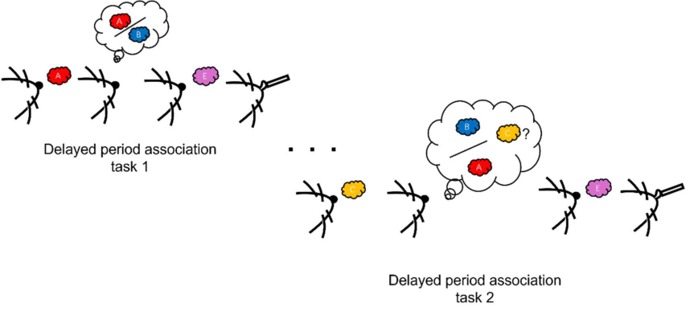

图 1-19 小鼠连续学习不同样本气味组合延迟配对偶联任务

Figure 1-19 Mouse continually learn delay paired association task with different sample odor

set
注： 示意图为小鼠在经过第一个嗅觉延迟配对偶联任务学习后，学习新的样本气味组 合构成的第二个延迟配对偶联任务。

The schematic diagram shows the mouse undergoing a second delayed paired association task with a new sample odor combination after learning the first delayed paired association task.

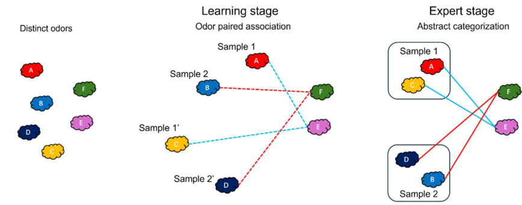

注： 示意图为群体神经元在不同任务中对样本信息的编码经过学习被分为两类。

The schematic diagram illustrates that the encoding of sample information by neuronal populations is categorized into two groups after learning in different tasks.

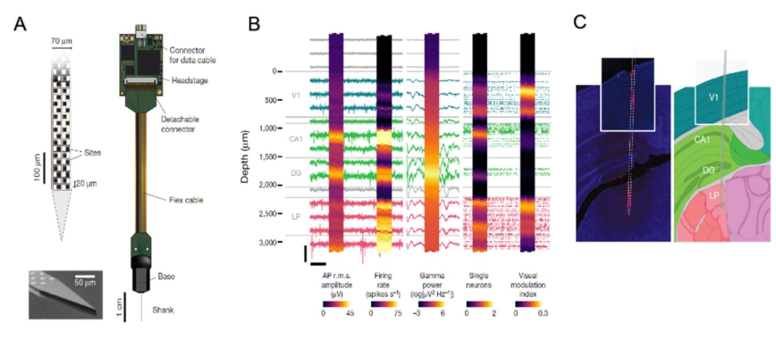

图 1-21 神经像素电极以及在头部固定小鼠大脑植入单根电极实现大规模群体神经元活动

## 记录

Figure 1-21 The Neuropixels probe and the large-scale neural population recording with a single probe in a head-fixed mouse

注： (A) Neuropixels 电极尖端及全部前端组成示意图。(B) 使用单根 Neuropixels 电极 在清醒的头部固定小鼠中实现跨脑区大规模神经元群体活动记录。(C)后期组化成 像并在软件上依照 Allen 小鼠脑图谱实现对电极植入轨迹的重构。图片调整自 (Jun et al., 2017)。
(A) Illustration of the probe tip of Neuropixels and the probe packaging including flex cable and headstage. (B) A single Neuropixels probe was used to record the large-scale neuronal acticity across multiple brain regions in awake head-fixed mice. (C) Histology reconstraction of the probe track with the corresponding images from the Allen Mouse Brain Atlas. Figure was adapted from (Jun et al., 2017).

## 第 2 章 研究方法

## 2.1 实验材料及设备

## 2.1.1 实验动物

本研究以小鼠为模式动物来探究全脑神经元在多任务序列学习任务中的活动 规律，其中用于行为训练及在体高通量电生理记录的实验动物均为 C57BL/6J 品 系的雄性野生型成年小鼠（年龄 8 到 28 周，体重 20 到 30 克），购自浙江维通利 华实验动物技术有限公司。在实验开始的整个期间，每只小鼠进行单笼饲养在室 温、12 小时光照/黑暗（晚上 10 点至早上 10 点开灯）的昼夜颠倒周期环境中， 并给予充足食粮。在行为训练正式开始前一天，小鼠被限制进食，但可任意喝水， 以保证之后可以通过用液体食物作为任务奖励使小鼠可以积极进行多任务序列 学习。而在每天行为训练/电生理记录任务完成后，给小鼠补充一定的固体鼠粮， 以保证小鼠每天摄入足够的热量及营养（保证小鼠体重在正式开始训练前体重的 80%以上）。所有实验均经过中国科学院上海脑科学与智能技术卓越创新中心动 物保护及使用委员会的批准。

## 2.1.2 实验中使用的材料及试剂

材料及试剂的具体信息如下表：

表 2-1 实验材料及试剂

Table 2-1 Experimental materials and reagents

|名称|来源|具体信息|
|---|---|---|
|1-戊醇|Sigma-Aldrich公司|货号：138975|
|甲酸丁酯|Sigma-Aldrich公司|货号：261521|
|乙酸乙酯|Sigma-Aldrich公司|货号：270989|
|3-甲基-2-丁烯-1-|Sigma-Aldrich公司|货号：162353|
|醇|||
|丙酸乙酯|Sigma-Aldrich公司|货号：112305|
|乙酸丙酯|Sigma-Aldrich公司|货号：133108|
|甲酸丙酯|Sigma-Aldrich公司|货号：245852|
|正己醇|Sigma-Aldrich公司|货号：H13303|
|(−)-β-蒎烯|Sigma-Aldrich公司|货号：112089|
|细胞标记试剂DiI|Thermo Fisher Scientific公司|货号：V22885|
|细胞标记试剂DiD|Thermo Fisher Scientific公司|货号：V22885|

表 2-1 实验材料及试剂（续表）

Table 2-1 Experimental materials and reagents (continued)

|名称|来源|具体信息|
|---|---|---|
|二甲基亚砜|SIGMA公司|货号：D2650|
|胰酶细胞消化液|Beyotime/碧云天|货号：C0205|
|AB 胶|WPI公司|KWIL-CAST|

## 2.1.3 实验中使用的设备

本课题所用的小鼠嗅觉行为训练系统是基于实验室之前开发设计的嗅觉任 务的高通量自动化行为训练系统（High-throughput automatic training system，HATS） 进行设计，同时针对在体高通量电生理记录对包括箱体、固定装置、给气装置、 给水装置和控制装置五大部分（Han et al., 2018）进行了相应的调整。该训练系 统通过电脑连接单片机（Arduino）编译程序来实现对不同的阀门和蠕动泵的自 动化控制，可达到毫秒级别的时间分辨率。

在行为训练及电生理记录实验中，小鼠被固定在一个开放的实验台上，该实 验台基座为防震台（用于维持长时间稳定在体电生理记录），同时用钢架辅以铜 网做简易法拉第笼罩在防震台上（用于屏蔽外界电流等干扰信号）；通过让空气 流动经过装有不同气味液体的密闭玻璃瓶中（不易腐蚀，同时在瓶口处做密闭处 理），特定气味与空气（空气流速为 1.5 升/分钟）混合后，混合气体进而由导管 运送至小鼠端出气口，即实现将特定气味传输到小鼠的鼻子正前方。通过光离子 化检测设备（Photoionization detector， PID）对训练系统传送气味到气管末端的 气味分子浓度以及响应阀门关闭之后残余的气味分子浓度进行测量，并绘制衰减 曲线，以保证气味的顺利传输以及关闭阀门后残余气味的快速清除。在行为训练 中，我们通过放置在在小鼠头正前下方于水嘴相连的激光检测模块来判断在任务 期中反应窗口内有是否有舔舐水嘴的动作，以此来进一步判断小鼠对于任务结果 汇报的正确与否。同时本研究在小鼠侧面（正对一侧面部包括水嘴部分）以及正 下方（小鼠头部正下方）放置两部红外高帧率摄像机来追踪小鼠在任务中的脸部 及舌头动作变化。同时在整个任务记录过程中，本研究通过装置（摄像头视野中 放置由单片机控制的二极管）来将任务事件与视频记录进行匹配，并与电生理记 录记过同步保存到电脑中以用于后续相关分析。

在小鼠行为训练中用到的气味包括 1-戊醇（1-Pentanol）、甲酸丁酯（Butyl formate）、乙酸乙酯（Ethyl acetate）、3-甲基-2-丁烯-1-醇（3-methyl-2-buten-1-ol）、 丙酸乙酯（Ethyl propionate）、 乙酸丙酯（1-butanol）、甲酸丙酯（Propyl formate）、 正己醇（1-hexanol）、(−)-β-蒎烯（(-)-beta-Pinene），详见表 2-1。

其余实验设备见表 2-2。

表 2-2 实验设备

Table 2-2 Experimental equipment

|名称|来源|实验用途|
|---|---|---|
|立体定位仪|瑞沃德公司|立体定位手术|
|电极微操系统|New Scales公司|Neuropixels植入|
|数据采集卡|NI公司|数字信号采集|
|电极记录系统|Imec公司|电信号采集及数字信|
|||号转化|
|Thermo冰冻切片机|Thermo Fisher Scientific公司|鼠脑切片|
|VS 120|Olympus公司|脑片荧光成像|
|VS 200|Olympus公司|脑片荧光成像|
|显微镜|Zeiss公司|电极植入观察|
|海康LMF16|海康机器人公司|视觉镜头|
|海康MV-ACU3-|海康机器人公司|视觉线缆|
|MBMs(down)-AM-ST|||
|海康MV-CB013-AUMS|海康机器人公司|视觉相机|

## 2.1.4 实验中使用的软件

表 2-3 处理及分析数据所用软件

Table 2-3 Software for data processing and analysis

|软件名称|软件来源|
|---|---|
|MATLAB R2021a|https://www.mathworks.com/|
|Python 3.8|https://www.anaconda.com/|
|SpikeGLX|https://github.com/billkarsh/SpikeGLX|
|Arduino|https://www.arduino.cc/|
|Java|https://www.java.com/zh-CN/|
|Adobe Illustrator 2021|https://www.adobe.com/|
|Image J|http://fiji.sc/|

## 2.2 实验研究技术及方法

## 2.2.1 嗅觉延迟配对偶联任务行为范式

嗅觉延迟配对偶联任务（odor-related delay paired association task）可以被用 在啮齿类动物模型上（Zhang et al., 2019; Zhu et al., 2020; Bellafard et al., 2024）， 来探究工作记忆等高级认知功能。任务整体结构如图 2-1 所示，其中任务包含四

种气味，本研究将其两两分为一组（即两个气味为样本气味组，两个气味为测试 气味组）同时再将样本气味和测试气味交叉组合定义“匹配”与不“不匹配”气 味组合——例如图中所示 S1 气味和 T1 气味为匹配组合，而 S1 气味和 T2 气味 为不匹配组合；同理，S2 气味和 T2 气味匹配，S2 气味与 T1 气味不匹配。在此 基础上，本研究让小鼠在每个测试中先去闻随机出现的样本组气味（S1/S2），在 一段时间的延迟期过后，再去闻随机出现的测试组气味（T1/T2），在测试气味结 束后进入响应阶段，小鼠需要在该阶段依据之前所得到的样本信息以及测试信息 来决定舔舐水嘴与否（若出现的是匹配组气味，则小鼠应该舔水嘴并得到奖励； 反之出现的是不匹配组气味，则该测试不会有奖励出现且小鼠不应该舔水嘴）。 针对小鼠在响应阶段做出的决策会有四种不同的行为评价：呈现匹配组气味的测 试舔舐水嘴，记为正确报告（hit）；呈现匹配组气味的测试没有舔舐水嘴，记为 错失报告（miss）；呈现不匹配组气味的测试舔舐水嘴，记为错误报告（false alarm）； 呈现不匹配组气味的测试舔舐水嘴，记为正确拒绝（correct rejection）。

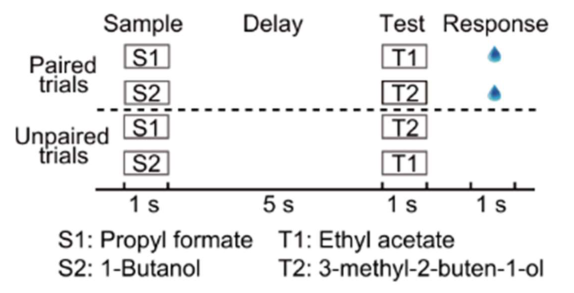

图 2-1 小鼠嗅觉延迟配对偶联任务行为范式

Figure 2-1 Schematic behavioral paradigm of mice delayed paired association (DPA) task

注： 图示为小鼠嗅觉延迟配对偶联任务不同测试结构。

Schematic structure of single trials in mice odor-related delayed-paired-association task.

## 2.2.2 嗅觉多任务序列学习行为范式及训练计划

在嗅觉延迟匹配偶联任务的基础上，本研究通过组合两个工作记忆相关任务 和一个工作记忆不相关任务来设计一个新的小鼠行为范式，即让小鼠依次学习第 一个任务（延迟匹配偶联任务，S1 气味为 1-戊醇，S2 气味为甲酸丁酯，T1 气味 为乙酸乙酯，T2 气味为 3-甲基-2-丁烯-1-醇），接着第二个任务（延迟期被隔离 气味覆盖的延迟匹配偶联任务，S3 气味为甲酸丙酯，S4 气味为正己醇，T1 气味 为乙酸乙酯，T2 气味为 3-甲基-2-丁烯-1-醇，Mask 气味为(−)-β-蒎烯），最后学习 第三个任务（匹配偶联任务，S5 气味为乙酸丙酯，S6 气味为甲酸丙酯，T1 气味 为乙酸乙酯，T2 气味为 3-甲基-2-丁烯-1-醇）。其中任务一和任务二均为工作记 忆相关任务，即小鼠在延迟期需要维持对于样本气味信息的记忆来帮助完成任务，

两个任务结构类似但是任务二在延迟期有屏蔽气味（既为覆盖残留样本气味，同 时也可能作为干扰提升任务难度）；任务三为非工作记忆任务，小鼠在一个长时 间的样本气味呈现（4 秒）结束短暂时间之后（0.5s）即可获取测试气味。之后与 延迟配对偶联任务类似，小鼠需要根据我们预设的气味组合关系来判断测试气味 是否与样本气味配对（paired association）来做出响应报告结果。

而在具体训练中，因为该任务所需测试较多，所以我们采取限制进食并利用 液体奶昔作为食物奖励的策略来训练小鼠学习任务（Yu et al., 2019）。在对小鼠 进行头部安装固定片（plate）手术后，让小鼠休息两周时间。后我们再先将小鼠 进行限制进食并持续 2 天，即在第一天只给小鼠日常进食的 50%（约 2.5g 固体 鼠粮，依据小鼠个体体重差异有所不同），在第二天只给小鼠日常进食的 25%但 同时让小鼠适应性舔食奶昔总量约 2ml。下一个阶段，我们将小鼠固定在实验台 上，并通过程序让小鼠开始适应实验环境并尝试学习舔舐水嘴，该阶段大约持续 4 天，每天共提供大约 800 滴奶昔（每滴 4.5 微升），在结束舔舐后将小鼠放归笼 子后补充大约 1g 鼠粮，每日监测小鼠体重使其保持在初始体重的 85%及以上。 在下一阶段进入适应阶段（shaping period），我们开始训练小鼠逐渐熟悉并理解 任务结构，即让小鼠学习气味与行为之间的联系，换句话说该阶段中我们只给小 鼠展示配对气味组合（即只有 S1-T1 或 S2-T2，不会出现 S1-T2 的气味组合）， 而小鼠只需要在测试气味之后选择舔水即可（均为 Go trials）。在之后则进入正 式训练以及胞外电生理记录阶段，此时我们将给小鼠随机展示所有类型的任务测 试（即 S1-T1，S2-T2，S1-T2，S2-T1 四种测试随机出现）。其中每天为一个 session， 共 720 个测试，每个任务（task 1, task 2, task3）各有 240 个测试，并在每个任务 中对 S1/S2 及 T1/T2 出现数量进行配平（1:1）。该阶段根据小鼠当天在 task 1 中 的行为表现（performance rate）也分为两个部分：学习阶段（行为表现小于 75%， 约两天）和学会阶段（行为表现大于等于 75%，约两天）。

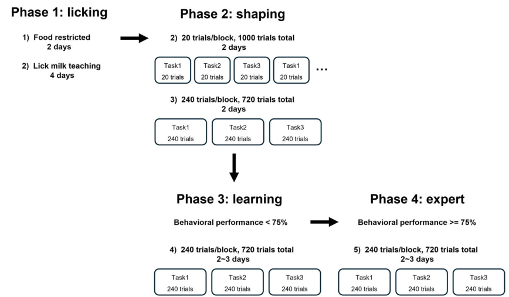

图 2-2 小鼠嗅觉多任务序列学习训练流程图

Figure 2-2 Schematic behavioral training protocol of mice multi-task sequential learning

注： 小鼠嗅觉多任务序列学习训练共四个阶段。

Behavioral training protocol of mice multi-task sequential learning including four phases.

## 2.2.3 小鼠行为表现计算

我们根据小鼠每个测试中出现的气味组合以及小鼠在响应阶段的行为报告 来评价该测试表现，即在气味匹配测试（odor-paired trial）小鼠如果舔舐水嘴则 记为正确报告（hit），未行动则记为错失报告（miss）；而在气味不匹配测试（odornonpaired trial）小鼠如果行动则记为错误报告（false alarm），未行动则记为正确 拒绝（correct rejection）。行为表现指标具体为行为正确率（performance correct rate）、正确报告率（hit rate）和正确拒绝率（correct rejection rate），公式如下：

\[
\mathrm{performance\ correct\ rate}=\frac{n_{\mathrm{hit}}+n_{\mathrm{correct\ rejection}}}{n_{\mathrm{all}}}
\]
\[
\mathrm{hit\ rate}=\frac{n_{\mathrm{hit}}}{n_{\mathrm{hit}}+n_{\mathrm{miss}}}
\]
\[
\mathrm{correct\ rejection\ rate}=\frac{n_{\mathrm{correct\ rejection}}}{n_{\mathrm{correct\ rejection}}+n_{\mathrm{false\ alarm}}}
\]
其中，$n_{\mathrm{all}}$ 表示所有测试的数目，$n_{\mathrm{hit}}$ 表示所有正确报告测试的数目，$n_{\mathrm{correct\ rejection}}$ 表示所有正确拒绝测试的数目，$n_{\mathrm{miss}}$ 表示所有错失报告测试的数目，$n_{\mathrm{false\ alarm}}$ 表示所有错误报告测试的数目。
## 2.2.4 立体定位注射及相关手术

所有实验均严格按照无菌操作原则进行，手术前，小鼠首先通过异氟烷进行 初步麻醉，随后根据体重腹腔注射戊巴比妥钠进行深度麻醉，并将小鼠固定在立

体定位仪上。手术过程中，使用恒温加热垫维持小鼠体温。手术开始后，移除小 鼠头骨和骨膜等组织，将一个定制的不锈钢固定器用组织胶粘连在头骨后部（λ 点附近），并用牙科水泥固定。根据脑图谱设计电极插入位置、角度和深度，并 在头骨上标记电极插入位点。手术结束后，用牙科水泥覆盖头骨以保护暴露的表 面，小鼠术后放置在加热垫上直至苏醒，并连续三天注射抗生素头孢曲松钠以减 少炎症反应。所有小鼠术后需恢复 7 天以上方可进行后续实验。

电生理实验分为两个阶段：准备阶段和记录阶段。在电生理实验前一天，小 鼠再次通过异氟烷麻醉，用颅骨钻在预先标记的多个电极插入点制作几个直径为 0.5~1.5 毫米的颅窗，注意不破坏硬脑膜。随后，依次填入 1.5%琼脂糖和有机硅 粘合剂（Kwik-Sil），并用牙科水泥覆盖以保护脑组织。记录当天，在小鼠清醒状 态下移除覆盖物，并用荧光染料 DiI（红色）或 DiD（蓝色）对每根电极进行染 色以标记轨迹。将 6 根 Neuropixels 电极按预设角度插入颅窗，当电极尖端触碰 到脑表面时，将立体定位仪深度归零，并观察到大多数通道信号发生明显变化。 电极缓慢下降至目标深度后，等待 30 分钟以使脑组织形变恢复，减少电极漂移。 记录开始前，先采集 10 分钟静息状态的神经活动作为基线数据。行为任务期间， 记录小鼠神经元活动，并使用摄像机捕捉小鼠面部活动。任务结束后，继续记录 10 分钟神经信号作为另一部分基准数据。记录完成后，缓慢拔出电极，清洗脑表 面并依次用琼脂糖、AB 胶和牙科水泥覆盖颅窗。电极用纯水和异丙醇清洗后晾 干。

## 2.2.5 在体高通量电生理记录及单细胞分选

在电生理记录实验中，本研究使用 6 根（个别 session 因为条件限制只使用 了 5 根或 4 根）新型硅电极 Neuropixels 进行多脑区的急性记录，并通过 SpikeGLX 软件（https://github.com/billkarsh/SpikeGLX SpikeGLX）实现信号的记录、传输和 实时观测。每根电极的参考点通过焊丝与地线连接，所有电极和行为设备的地线 共同连接到一个公共接地板上，该接地板与小鼠头骨上的金属固定器相连，确保 良好的接地。

记录过程中，本研究将动作电位增益设置为 1000，局部场电位增益设置为 50，SpikeGLX 软件的参考设置为每根电极的尖端。行为控制器通过 5 个 BNC 连 接器输出行为相关事件（如气阀打开/关闭、小鼠舔舐水嘴）的 TTL 信号。基于 PIC12F1572 单片机的定制嵌入式控制器采集行为同步信号，并以 500Hz 的速率 将信号序列化为 4 位字节，通过 Neuropixels 基站的内置 SMA 端口发送到 SpikeGLX 软件中，确保行为信号与电生理记录同步，并作为额外通道存储在同 一文件中，便于后续分析神经元活动与行为的关系。

记录结束后，使用自动化单细胞分选软件 Kilosort2、Kilosort2.5 或 Kilosort3 （https: //www.github.com/mouseland/kilosort）（Pachitariu et al., 2016; Stringer et al.,

2019; Steinmetz et al., 2021; Pachitariu et al., 2023）对数据进行离线分析。与传统 的手动或半自动方法不同，Kilosort 系列软件通过迭代优化模板匹配、数据降维 （如奇异值分解）、特征提取（如尖峰波形）和聚类等步骤，快速处理大规模电 生理数据。其关键特性是能够校正电极在记录过程中可能发生的位置漂移，从而 实现对神经元的长时间准确追踪。具体分析步骤包括：

1. 预处理：对原始信号进行高通滤波、共同平均参考、白化和漂移校正，以
   去除噪声并提高信号质量。
2. 自动分选：通过模板匹配和聚类分选出单个神经元。

3. 质量控制：剔除污染率超过 10%或平均放电率小于 1Hz 的神经元，确保后
   续分析的可靠性。

由于记录设备的系统误差，不同电极的记录起始时间可能存在微小差异。为 准确对齐不同电极记录的神经元放电时间，以第一根电极的测试起始时间为基准， 对其他电极的时间进行线性回归计算，实现时间同步。为了进一步减少时间误差， 以每个测试为单位分别进行同步计算，对于差异较大的 session 进行排除并不在 之后的计算分析中使用。

## 2.2.6 免疫组织化学

在完成整个急性电极植入记录任务（5~6 天）后，本研究通过腹腔注射麻药 来深度麻醉小鼠，根据不同小鼠体重来选择戊巴比妥钠（120mg/kg）的用量，随 后先用 20ml 生理盐水对小鼠进行心脏灌注，接着灌注 20ml 4%（多聚甲醛 PFA, 溶于 0.01M 的磷酸盐缓冲液, PBS, pH=7.4）。之后利用解剖剪等工具完整取出小 鼠大脑并置于 4%PFA 溶液中于 4℃冰箱中过夜保存，随后对其进行阶梯脱水处 理，即先浸泡于 20%浓度蔗糖溶液中，再浸泡于 30%浓度蔗糖溶液中，为之后冰 冻切片做好准备。接下来本研究使用莱卡冷冻切片机将大脑制作成 100 微米厚的 冠状面切片。切片用 1:1000 稀释的 DAPI 细胞核染料染色 15 分钟，在用甘油盖 玻片以及封片剂进行封片处理。制备好的切片使 Olympus VS200 成像显微镜进 行 10 倍放大拍摄并批量处理，之后在 fiji 上进行批量格式转化（.vsi 到.tiff）。

## 2.2.7 植入电极轨迹重构

本研究采用了一种基于图像处理和脑图谱配准的电极轨迹定位方法，结合了 Fiji 和 MATLAB 软件工具，用于分析小鼠脑片中的电极插入轨迹及其经过的脑 区。首先，使用 Fiji 软件对原始脑片图像进行预处理，调整不同荧光通道的亮度 和对比度，以更清晰地显示脑片中的各脑区和电极荧光轨迹。随后，通过一个定 制的 Fiji 宏将图像自动转换为 TIFF 格式，并初步调整亮度和对比度。接下来的 步骤在 MATLAB 中进行，首先将脑片图像的采样率降低至与参考脑图谱（Allen Mouse Brain Atlas，CCFv3）一致的分辨率（10 微米/像素），并调整图像大小以

匹配参考模板。在此过程中，手动调整亮度和对比度，以便于肉眼分辨电极轨迹 和脑区。

为了将脑片图像与参考脑图谱对齐，首先通过旋转等操作使脑片图像的中轴 线与参考脑图谱的脑片方向一致。然后，手动在脑片图像和参考脑图谱中标记出 对应的匹配点（每张图像约 10 个配对点），并通过几何变换将两者叠加。由于电 极轨迹通常跨越多个脑片，因此在完成变换的脑片图像中手动标记出电极荧光轨 迹的参考点，并通过拟合这些点得到一条直线作为电极插入轨迹。最后，根据小 鼠编号、记录日期、电极染料颜色、插入位置、角度和深度等参数，将记录到的 电生理数据与电极插入轨迹相对应，用于后续分析（GitHub - cortex-lab/allenCCF: Tools to work with Allen Inst CCF data in matlab）。

此外，除了电极尖端位置外，复合细胞体脉冲放电率、单细胞的空间密度和 刺激周时间直方图等电生理数据也被用于进一步校正电极轨迹。通过这种方法， 可以将分选出的单细胞与电极轨迹经过的脑区信息进行匹配，从而获得每个单细 胞对应的脑区信息。该方法在已有文献方法的基础上进行了改进（Shamash et al., 2018; Steinmetz et al., 2019），并结合了自动化图像处理和手动校正步骤，以提高 电极轨迹定位的准确性和可靠性。

## 2.3 数据分析

## 2.3.1 神经元放电率计算

为了计算单个神经元的放电率，本研究以 100 毫秒为时间窗口，统计每个窗口中单个神经元的发放次数（spike counts）并除以窗口时间（$t_{\mathrm{window}}$），即可得到单个神经元在该窗口中的放电率（firing rate，单位为 $\mathrm{s}^{-1}$）：

\[
\mathrm{firing\ rate}=\frac{\mathrm{spike\ counts}}{t_{\mathrm{window}}}
\]
而在分析单个神经元是否响应样本气味时，本研究需要将在该样本气味出现的所有测试的放电率进行平均（trial average），即可得到刺激前后直方图（Peristimulus time histogram, PSTH）。

根据一些实际分析需求，本研究取任务开始即样本气味出现前 2 s 的神经元活动作为基准活动，将所有测试整体放电率减去基准活动放电率。
## 2.3.2 神经元信息编码分析

为了对神经元所含样本信息定量分析，本研究这里引入一个信号检测理论中的定量指标作为信息选择性指数（selectivity index），即 $d^{\prime}$（d-prime）。通过计算单个神经元分别在两种不同样本所出现测试中的平均放电率之差，再经过标准化（normalization）处理，来定量单个神经元所含样本（在 DPA 任务中，采样期随机出现的两个气味 A 或 B）信息量（Chen et al., 2024; Duan et al., 2021; Zhong et al., 2024），计算公式如下：

\[
d^{\prime}=\frac{\mu_A-\mu_B}{\sqrt{\left(\sigma_A^2+\sigma_B^2\right)/2}}
\]
其中，$\mu_A$ 表示在所有样本气味 A 出现的测试（trial）在当前时间点上的平均放电率（trial-average firing rate），$\mu_B$ 表示在所有样本气味 B 出现的测试在当前时间点上的平均放电率，$\sigma_A^2$ 为所有样本气味 A 出现的测试（trial）在当前时间点上的放电率方差（variance），$\sigma_B^2$ 为所有样本气味 B 出现的测试（trial）在当前时间点上的放电率方差。

在后续作图中，为了判断单个神经元在某个时间窗口的 $d^{\prime}$ 是否显著不同于 0，本研究通过基于两种不同任务相关条件（例如样本气味 sample 1 和 sample 2）的配对 t 检验进行计算，使用的 P 值为 0.05。

当本研究在多个时间窗口（样本阶段，延迟期阶段，测试阶段）评估单个神经元对于任务相关信息的显著性时，本研究采取了随机打乱采样的方法以实现多重校正：例如在评估神经元对于样本气味选择性的时候，本研究随机打乱 sample 1 和 sample 2 的标签后，重新计算 100 次每个时间窗口的 $d^{\prime}$ 值，并将打乱后的 $d^{\prime}$ 值整体分布中的 99% 分位值作为显著性阈值。
## 2.3.3 群体神经元解码分析

为了计算不同脑区神经元群体中每个时间点所含的任务相关信息量（例如样本气味信息），本研究采取了交叉验证（cross-validated）的线性分类分析（linear classification）方法进行验证（Pagan et al., 2013; Duan et al., 2021）。具体在计算分析中，本研究先将每个脑区神经元活动数据整理为 $N \times Tr \times Ti$ 格式，其中 $N$ 为该脑区神经元总数，$Tr$ 为该神经元在某一任务条件下的所有测试数，$Ti$ 为其在单一测试中的每一个时间窗口。接下来将 $N$ 个神经元在某一任务条件下以及某一时间窗口下的平均放电率（$N \times Tr \times 1$）作为群体响应向量 $X$，并随机将数据中所有测试按照 6:4 分为训练集和测试集。之后训练集用于计算能够区分相对应的两种不同任务相关条件的最优解，得到群体响应向量 $X_{\mathrm{train}}$ 的线性超平面（linear hyperplane），即可以被表示为：

\[
f(x)=W^T X_{\mathrm{train}}+b
\]
其中，$W$ 是赋予每个神经元的权重向量，$b$ 为一个标量阈值。

之后再根据 $f(x)$ 的符号对测试集群体响应向量 $X_{\mathrm{test}}$ 进行分类，该过程通过 500 次重采样循环计算正确分类的比例作为预测结果，即群体神经元解码准确率，作为衡量脑区群体神经元所含任务相关信息量的指标。因为部分神经元是在不同 session 中记录得到，每次循环都会对测试进行随机打乱采样以消除测试间的相关性（trial-by-trial correlations）。计算中用到的支持向量机（support vector machine，SVM）算法源自 LIBSVM（https://www.csie.ntu.edu.tw/~cjlin/libsvm）。
## 2.3.4 群体神经元跨任务解码分析

在利用支持向量机对群体神经元活动进行计算分析时，本研究先是进行了任 务内解码分析（within-task decoding），即将数据集按照不同任务（task 1/task 2/task 3）分为不同子集，在具体计算中训练集和测试集均在子集内完成选取及预测（例 如选取任务 1 训练集计算超平面并用任务 1 测试集进行结果预测）。之后为了衡 量群体神经元对于任务相关信息的表征是否具有相似性（ shared neural representation），本研究采取了跨任务解码分析（Tafazoli et al.，2024），例如本研 究将任务 2 或者任务 3 的测试集数据投射到由与样本分类超平面（利用任务 1 训 练集得到）正交的向量定义的一维编码空间上，同时本研究进行 500 次循环来打 乱重采样。

为了消除由于不同任务间基线放电率差异带来的偏差，本研究对神经元放电 率进行了标准化处理，即将每个任务的所有测试中（在每个时间窗口）减去了该 任务测试基线期（样本期前两秒）的平均放电率。同样，当本研究不做放电率标 准化处理即使用原始放电率数据进行计算分析时，也观察到了类似的结果。

## 2.3.5 群体神经元跨时间解码分析

为了进一步探究群体神经元在任务阶段对于任务相关信息解码的稳定性，本 研究使用了跨时间解码分析（cross-temporal decoding analysis，CTD）（Meyers et al., 2008; Stokes et al., 2013）。具体计算方法与 2.3.3 节中方法类似，区别在于本 研究先选取某个时间窗口数据并提取随机选取的训练集计算得到解码器，之后再 分别应用于所有时间窗口的测试集即得到该时间窗口群体神经元跨时间解码表 现（若选取测试集时间窗口与训练集所属时间窗口一致，即结果与 2.3.3 中一致）。

## 2.3.6 群体神经元三维解码空间轨迹分析

在对群体神经元活动进行跨任务解码后，本研究分别得到利用三个任务训练集计算出的解码器（decoder）。在这里，本研究假设三个任务解码器是三个独立的子空间并将其作为三个方向轴（decoder axis），之后再将每个任务的测试集神经元活动分别投射在三个方向轴上，即得到群体神经元活动分别在三个任务中的三维解码方向向量（图 2-3 右）。接下来本研究通过计算向量之间的夹角来进一步定量分析不同任务间神经元活动的联系，角度计算公式如下：

\[
\vec v_a\cdot\vec v_b = v_{a,\mathrm{task1}}v_{b,\mathrm{task1}} + v_{a,\mathrm{task2}}v_{b,\mathrm{task2}} + v_{a,\mathrm{task3}}v_{b,\mathrm{task3}}
\]
\[
\|\vec v_a\| = \sqrt{v_{a,\mathrm{task1}}^2 + v_{a,\mathrm{task2}}^2 + v_{a,\mathrm{task3}}^2}
\]
\[
\|\vec v_b\| = \sqrt{v_{b,\mathrm{task1}}^2 + v_{b,\mathrm{task2}}^2 + v_{b,\mathrm{task3}}^2}
\]
\[
\theta = \arccos\left(\frac{\vec v_a\cdot\vec v_b}{\|\vec v_a\|\,\|\vec v_b\|}\right)
\]
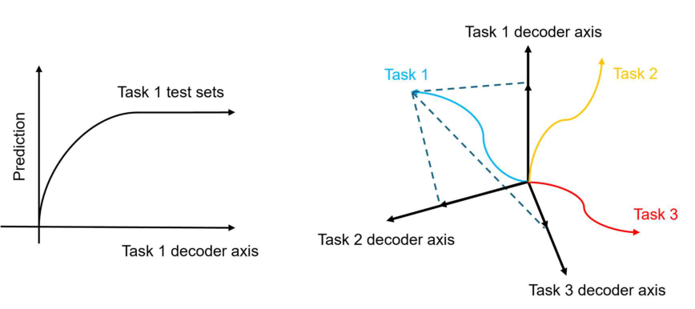

图 2-3 群体神经元在三维解码空间中任务活动轨迹示意图

Figure 2-3 Schematic diagram of the task activity trajectories of neural populations in a 3D

注： 左图为将任务 1 测试集神经活动投射在任务 1 训练集得到的超平面上的二维示意图；右图为将不同任务神经活动分别投在任务 1 / 任务 2 / 任务 3 训练集得到的超平面上的三维示意图。

The figure on the left is a two-dimensional diagram of projecting neural activity from the Task 1 test sets onto the hyperplane obtained from the Task 1 training sets; the figure on the right is a three-dimensional diagram of different task neural activities projected on the hyperplane obtained from the Task 1 / Task 2 / Task 3 training sets.
## 第 3 章 研究结果

## 3.1 训练小鼠执行多任务连续学习

为了对大脑如何在任务切换或者说连续学习多个任务时实现灵活编码 （flexible coding）来应对动态变化的任务需求，在嗅觉延迟匹配偶联任务的基础 上，本研究设计了一个新的小鼠行为范式，包括三个子任务：第一个为延迟匹配 偶联任务，第二个为在延迟期被隔离气味覆盖的延迟匹配偶联任务，第三个为非 工作记忆任务（图 3-1）。任务 1 和任务 2 均为工作记忆相关任务，小鼠在延迟期 需要维持对样本气味的记忆；任务 3 为非工作记忆任务，小鼠在长时间样本气味 呈现后短暂时间即可获取测试气味，并根据预设的气味组合关系判断测试气味是 否与样本气味配对。

具体训练中，本研究采取限制进食并利用液体奶昔作为食物奖励的策略。小 鼠头部安装固定片手术后休息两周，然后限制进食并适应性舔食奶昔。之后，小 鼠固定在实验台上适应实验环境并学习舔舐水嘴，持续约 4 天。下一阶段为适应 阶段，训练小鼠熟悉任务结构，只展示配对气味组合。之后进入正式训练和胞外 电生理记录阶段，随机展示所有类型的任务测试。每天为一个 session，共 720 个 测试（trial），每个任务各有 240 个测试，并对每个任务中的样本气味和测试气味 出现数量进行配平。而在正式训练及记录中，本研究将小鼠在任务 1 中整体表现 （performance rate）小于 75%的 session 认为是学习阶段（learning stage）（学习 曲线处于上升趋势）而大于等于 75%的 session 看作学会阶段（expert stage）（学 习曲线趋于平缓）（图 3-2）。

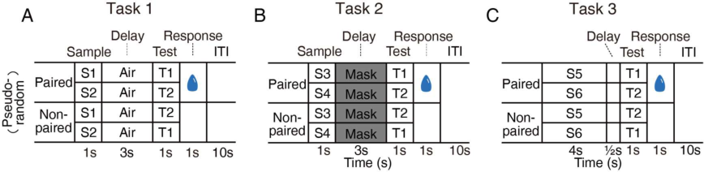

图 3-1 小鼠嗅觉多任务序列学习范式

Figure 3-1 Schematic behavioral paradigm of mice multi-task sequential learning

注： (A) 小鼠嗅觉多任务序列学习由三个子任务组成，其中任务 1 为普通延迟匹配偶 联任务，即在延迟阶段为空白期。(B) 任务 2 在延迟匹配偶联任务的基础上，在延 迟阶段加入一个持续存在的干扰气味作为面罩。(C) 任务 3 为一个样本采样阶段 被延长的匹配偶联任务，即存在一个 4 秒的样本阶段和 0.5 秒的延迟阶段，之后测 试及响应阶段则与任务 1 和任务 2 一致。
(A) The olfactory multi-task sequential learning in mice consists of three subtasks, among

which Task 1 is a standard delayed paired-association (DPA) task, which has a blank delay period. (B) Task 2 is based on the delayed paired association task but incorporates a persistent distractor odor during the delay period, which acts as a mask. (C) Task 3 is a delayed paired association task with extended sample odor sampling time, featuring a 4- second sample period and a 0.5-second delay period. The test and response periods are consistent with those in Task 1 and Task 2.

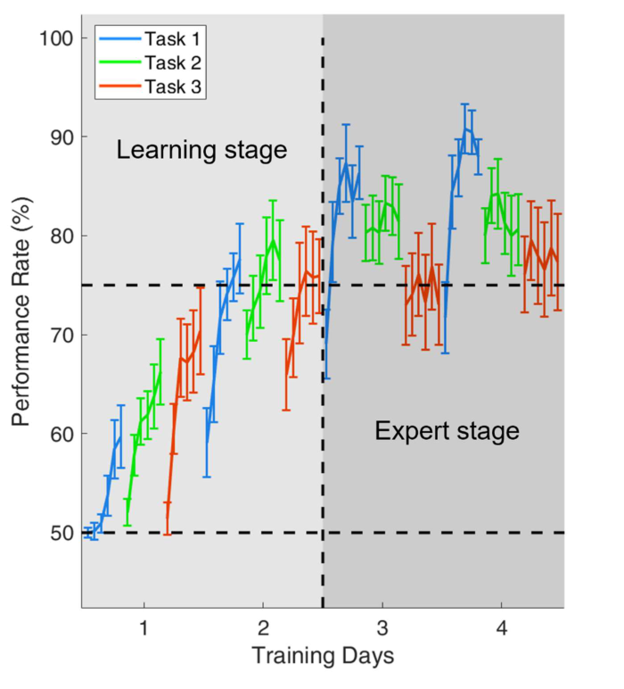

图 3-2 小鼠执行嗅觉多任务序列学习在不同阶段的表现

Figure 3-2 Behavioral performance of mice in the multi-task sequential learning

注： 小鼠在不同行为阶段以及不同任务中的学习曲线。蓝色代表在任务 1 中的表现， 绿色代表在任务 2 中的表现，红色代表在任务 3 中的表现。

Learning curves of mice in different tasks during different behavioral stages. Blue indicates performance in Task 1, green indicates performance in Task 2, and red indicates performance in Task 3.

## 3.2 小鼠全脑在体高通量电生理记录

在小鼠结束适应阶段训练（shaping period）进入正式的多任务序列学习训练 时，本研究即使用 Neuropixels1.0 电极在每天对进行行为训练的实验小鼠同时进 行多脑区大规模胞外电生理记录。每次记录时，6 根 Neuropixels 电极按事先规划

好的植入位点和角度进行急性电生理记录（acute electrophysiological recording）， 记录总时长约三个半小时（数据采集时间，不包括记录前准备及手术植入电极时 间）。记录实验结束后，使用 kilosort3 对电生理数据进行自动化分选后得到单细 胞数据，其中一次电生理记录实验中最多同时记录到了 1176 个神经元。本研究 一共完成了 69 次急性胞外电生理记录，在 18 只小鼠中一共植入了 330 根电极 （图 3-3），记录并通过细胞分选和质量控制后得到 30,629 个可供后续分析的神 经元。根据小鼠在任务中的不同行为阶段（学习阶段和学会阶段）将数据分为两 组，其中学习阶段共有 17,369 个神经元（176 probes），学会阶段共有 13,260 个 神经元（154 probes）。之后通过免疫组织化学染色确定电极在大脑中的轨迹，并 根据实验记录（获得实验小鼠编号、电极所浸泡染料颜色、植入电极的位置和角 度等信息）将得到的所有神经元与电极轨迹经过的脑区信息进行匹配，获得每个 神经元所在的脑区位置。通过上述方法，将全部神经元成功定位到艾伦脑图谱 （Allen Mouse Brain Common Coordinate Framework version 3）对应的具体脑区 （详见 2.2.7）。根据匹配脑区结果，30,629 个神经元分别来自 37 个脑区（图 3- 4，表 3-1）。

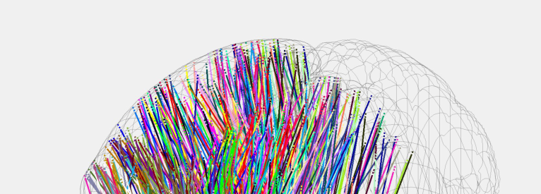

图 3-3 记录电极轨迹可视化

Figure 3-3 Visualization of recorded electrode trajectories

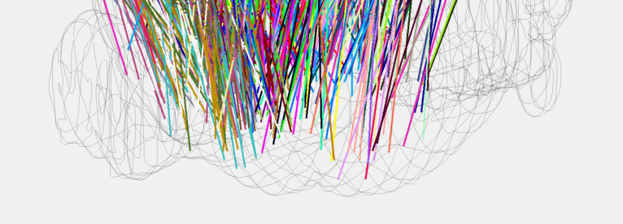

注： 每条直线代表一个电极记录轨迹，图中共有 330 根电极的轨迹，汇总了 18 只小鼠 的 69 次数据采集。

Each straight line represents the trajectory of a recorded probe, with a total of 330 probes trajectories aggregated from 69 sessions across 18 mice.

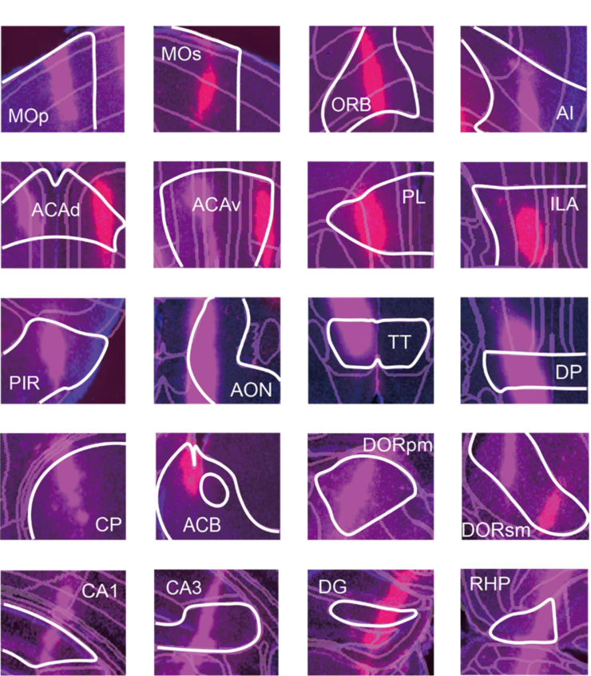

注： 在提供的多个脑区组织学图像中，白色的曲线用来表示各个脑区的轮廓，而对应脑 区的缩写则列于图上以供参考。此外，不同颜色（红色和蓝色）分别用来表示电极 的记录轨迹。

In the provided histological images of multiple brain regions, white lines are used to represent the contours of each brain region, and the corresponding abbreviations of the brain regions are listed on the figures for reference. In addition, different colors (red and magenta) are used to represent the recording trajectories of the electrodes.

表 3-1 小鼠不同行为阶段记录得到神经元所归属脑区信息

Table 3-1 Information of brain regions for neurons recorded during different behavioral

stages

|脑区名称|脑区名称（英文）|脑区缩写|神经元数量|
|---|---|---|---|
||||（学习期/学会期）|
|额极|Frontal pole, cerebral cortex|FRP|88/15|
|初级运动区|Primary motor area|MOp|468/440|
|次级运动区|Secondary motor area|MOs|712/522|
|躯体感觉区|Somatosensory areas|SS|740/585|
|视觉区|Visual areas|VIS|137/116|
|背侧前扣带区|Anterior cingulate area, dorsal part|ACAd|409/446|
|腹侧前扣带区|Anterior cingulate area, ventral part|ACAv|515/687|
|前边缘区|Prelimbic area|PL|477/464|
|下边缘区|Infralimbic area|ILA|563/399|
|眶额叶区|Orbital area|ORB|2426/680|
|无颗粒岛叶区|Agranular insular area|AI|307/458|
|压后区|Retrosplenial area|RSP|408/237|
|后顶叶联合区|Posterior parietal association areas|PTLp|32/40|
|前嗅核|Anterior olfactory nucleus|AON|437/432|
|顶盖带|Taenia tecta|TT|276/161|
|背足区|Dorsal peduncular area|DP|316/113|
|梨状区|Piriform area|PIR|208/155|
|CA1区|Field CA1|CA1|369/367|
|CA3区|Field CA3|CA3|382/203|
|齿状回|Dentate gyrus|DG|330/331|
|海马后区|Retrohippocampal region|RHP|156/150|
|皮层下板|Cortical subplate|CTXsp|334/488|
|尾壳核|Caudoputamen|CP|2304/1421|
|伏隔核|Nucleus accumbens|ACB|413/517|
|外侧隔复合体|Lateral septal complex|LSX|1281/969|
|纹状体样杏仁核|Striatum-like amygdalar nuclei|sAMY|45/67|
|背侧苍白球|Pallidum, dorsal region|PALd|113/165|
|腹侧苍白球|Pallidum, ventral region|PALv|65/53|
|内侧苍白球|Pallidum, medial region|PALm|183/138|

表 3-1 小鼠不同行为阶段记录得到神经元所归属脑区信息（续表） Table 3-1 Information of brain regions for neurons recorded during different behavioral stages (continued)

|脑区名称|脑区名称（英文）|脑区缩写|神经元数量|
|---|---|---|---|
||||（学习期/学会期）|
|尾侧苍白球|Pallidum, caudal region|PALc|19/53|
|丘脑,感觉运动皮|Thalamus, sensory-motor cortex|DORsm|461/595|
|层相关|related|||
|丘脑,多模态联合|Thalamus, polymodal association|DORpm|1503/823|
|皮层相关|cortex related|||
|下丘脑外侧区|Hypothalamic lateral zone|LZ|45/117|
|中脑，感觉相关|Midbrain, sensory related|MBsen|101/62|
|中脑，运动相关|Midbrain, motor related|MBmot|727/684|
|中脑，行为状态相|Midbrain, behavioral state related|MBsta|19/44|
|关||||

## 3.3 全脑神经元对于样本信息的任务特异性和泛化编码模式

## 3.3.1 神经元对于样本气味信息具有选择性

为了探究小鼠在任务中全脑神经元编码样本信息的活动模式，以及这种全脑 神经元活动模式是如何在不同任务中实现灵活切换，本研究先通过计算单个神经 元对于样本信息的选择性指数 d’来初步衡量单个神经元在不同任务及不同时间 窗口上所含样本信息量（Chen et al., 2024; Duan et al., 2021; Zhong et al., 2024）。 图 3-5 A 所示为眶额叶皮层（orbitofrontal cortex, ORB）单个神经元在任务 1（task 1）所有样本气味为 sample 1（在任务 1 中 sample 1 气味为 S1，即 1-戊醇，图 3- 5）的测试中的标准平均放电率（图 3-5 B 红色线）和其在所有样本气味为 sample 2（在任务 1 中 sample 2 气味为 S2，即甲酸丁酯，图 3-5）的测试中的标准平均 放电率（图 3-5 B 蓝色线）（这里用到的数据均取自正确测试（correct trials），若 无特别说明接下来分析所用均为正确测试数据）。可以看到该神经元在样本气味 释放阶段（sample period）表现出对于 sample 2 气味的选择性放电，即 sample 2 测试中平均放电率高于 sample 1 测试平均放电率；同时也发现该神经元在测试 气味释放阶段（test period）则表现出对与 sample 1 气味的选择性放电，即在测 试阶段与样本阶段相反该神经元在 sample 1 测试中表现出更高频率的放电。图 3-5 D 所示为样本信息选择性指数 d’计算公式，通过计算单个神经元每个时间窗 口上 sample 2 测试平均放电率与 sample 1 测试平均放电率差值再除以两种测试 放电率方差平均值的平方根得到其在该时间窗口上所含样本气味信息量。d’值的 范围为[-1 1]，其中-1 表示该神经元对 sample 1 有很高的样本气味选择性，而 1

则表示对 sample 2 有很高的样本气味选择性。图 3-5 C 所示为该神经元在任务 1 中的平均 d’值，可以看到该神经元在样本阶段和测试阶段均有很高的样本选择 性，但呈不同类别样本气味选择。

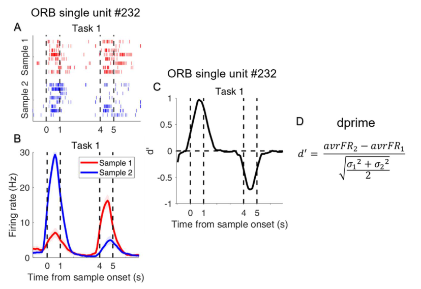

图 3-5 计算小鼠在执行任务时单个神经元在不同时间窗口对样本气味信息的编码能力

Figure 3-5 Calculating single neuron’s encoding abilities of sample odor information in different time windows during mice performing tasks

注： (A) 眶额叶皮层单个神经元在不同样本气味测试中的放电栅格图。 (B) 眶额叶皮 层单个神经元在不同样本气味测试中的平均原始放电率。蓝色代表所有样本气味 为 sample 1 的测试，红色代表所有样本气味为 sample 2 的测试，X 轴表示从样本 气味释放开始的时间（秒），Y 轴为神经元放电率（赫兹）。(B) 眶额叶皮层单个神 经元在不同时间节点对样本气味信息的编码能力，X 轴表示从样本气味释放开始 的时间，Y 轴表示 d’，其值分布范围为-1 到 1（-1 表示对 sample 2 具有很高的编 码能力，而 1 表示对 sample 1 具有很高的编码能力）。(C) d’计算公式。

(A) The spike raster plot of a single neuron in the orbitofrontal cortex in different sample odor trials. (B)The average raw firing rate of a single neuron in the orbitofrontal cortex in different sample odor trials. Blue indicates all trials with sample odor of sample 1, red indicates all trials with sample odor of sample 2, the X-axis represents the time from the sample odor onset (s), and the Y-axis the raw firing rate (hz). (B) The ability of a single neuron in the orbitofrontal cortex to encode the sample odor information at different time windows, the X-axis represents the time from the sample odor onset, and the Y-axis represents dprime (d’), whose value distribution ranges from -1 to 1 (-1 indicates a high encoding ability for sample 2, while 1 indicates a high encoding ability for sample 1). (C) Calculation formula of dprime (d’).

## 3.3.2 眶额叶皮层不同神经元在任务中对样本信息的编码存在差异

前人研究已经发现，眶额叶皮层（orbitofrontal cortex, ORB）在啮齿类动物实 现灵活认知过程中起到了重要作用（Zhou et al., 2021; Lin et al., 2024），所以接下 来本研究先从该脑区出发来进一步探究群体神经元对于任务相关参数的编码模 式。在小鼠学习阶段本研究共记录到 2426 个眶额叶皮层神经元，通过计算得到 所有神经元对于样本气味信息的分辨能力参数 d’后，对所有神经元进行一个简单 排序：先取所有 d’的绝对值，再依据该神经元 abs(d’)最大值所处在测试的具体时 间位置来从前往后进行排序（排序在上的神经元最大绝对 d’值分布在测试开始阶 段，相反排序在下的神经元最大绝对 d’值分布在测试结束阶段）。图 3-6 A 所示 为小鼠学习阶段所有神经元在任务 1（task 1）中的测试平均（trial-average）d’值， 其中黑色表示该时间窗口 d’值不显著（双边 t 检验, p < 0.05），红色（d’范围为-1 到 0）表示该神经元在当前时间窗口对于 sample 1 具有显著选择性，绿色（d’范 围为 0 到 1）则相反表示对于 sample 2 具有显著选择性。

从单一神经元来看，个体可以在测试的不同时间段具有不同的样本信息区分 能力，例如图 3-5 A 所示眶额叶皮层 #232 神经元在样本阶段对 sample 2 具有选 择性而在测试阶段对 sample 1 具有选择性。同样也有其他神经元具有不同复杂 选择性组合：眶额叶皮层 #216 神经元（图 3-6 C）在样本阶段和延迟期阶段均具 有对 sample 1 的选择性，但在测试阶段则不具备分辨样本信息的能力；眶额叶皮 层 #1333 神经元（图 3-6 D）则只在测试阶段对 sample 1 具有选择性。

而从整体来看，眶额叶皮层神经元对于样本信息区分能力的时间窗口主要分 布在样本阶段（样本气味释放，嗅觉信息经环路到眶额叶皮层神经元）与测试阶 段（测试气味释放，小鼠需要对比测试气味与之前出现的样本气味），在对群体 神经元 d’值做平均处理也可以发现在样本和测试阶段存在两个峰值（图 3-6 B）。

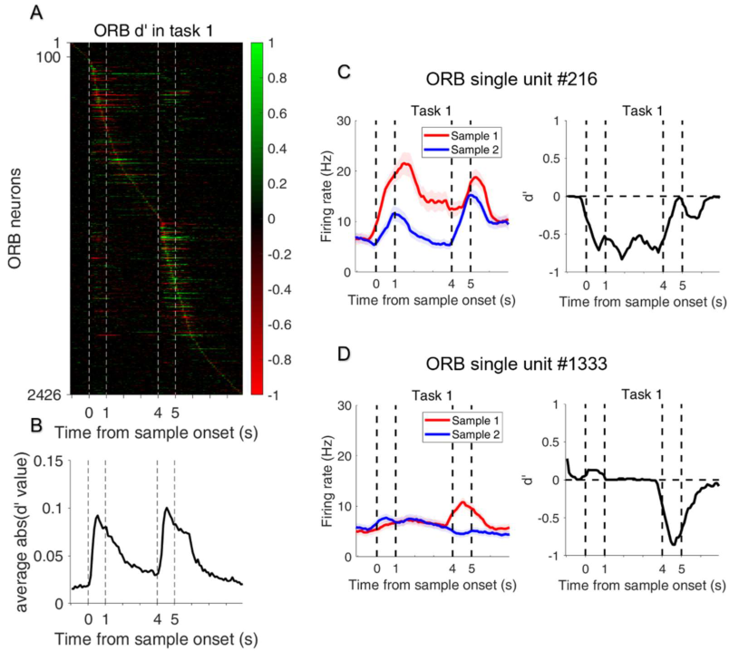

Figure 3-6 The ability of all neurons in orbitofrontal cortex area to encode sample information at different time windows of task 1 during the learning stage

注： (A) 在小鼠学习阶段，眶额叶皮层所有神经元在任务 1 不同时间窗口对于样本信 息的编码能力。每一行代表一个眶额叶皮层神经元，每一列为单个神经元在任务 中每个时间窗口（每个时间窗口为 100 毫秒）对于不同样本气味的选择性参数 d’； 其中黑色表示 d’不显著，红色和绿色则分别为对样本气味 sample 1/2 具有选择性 （双边 t 检验，p < 0.05）(B) 眶额叶皮层群体神经元样本选择性参数 d’绝对值平 均在任务 1 测试不同时间窗口的变化。(C) ORB #216 示例神经元。(D) ORB #1333 示例神经元。
(A) Encoding abilities of orbitofrontal cortex (ORB) neurons in different time windows of task 1 during the learning stage of mice. Each row represents a single ORB neuron, and each column represents the selectivity parameter d’ of individual neurons for different sample odors in each time windows (each time window is 100 milliseconds) during the task; black indicates non-significant d’, while red and green represent selectivity for Sample 1 and Sample 2, respectively (two-tailed t-test, p=0.05). Neurons were sorted by the timing of the peak value of their absolute sample selectivity parameter d’. (B) The average absolute value of the sample selectivity parameter d’ of the ORB neuronal population across different time windows within task 1 trials. (C) ORB #216 example neuron. (D) ORB #1333 example neuron.

## 3.3.3 单个眶额叶皮层神经元表现出对样本信息的任务特异性编码

接下来，本研究又进一步对眶额叶皮层群体神经元活动在任务切换之后（即 对比任务 1 和任务 2 以及任务 3）存在怎样的变化展开分析。首先对单个眶额叶 皮层神经元在不同任务中的放电率以及对样本气味信息选择性参数 d’进行计算， 图 3-7 所示为两个眶额叶皮层示例神经元（#216 和 #1333）在不同任务不同样本 气味测试中的放电率变化（图 3-7 A, C）以及在不同任务中对样本信息的编码能 力变化（图 3-7 B, D）。可以看到，ORB #216 神经元表现出在任务 1 中对于 sample 1 的选择性放电（在样本及延迟阶段 sample 1 测试多个时间窗口放电率显著高于 sample 2 测试， p < 0.05），在任务 2 和任务 3 中却没有（在任务 2 中测试阶段 存在部分选择性时间窗口）；ORB #1333 神经元则在测试阶段表现出对 sample 1 的任务 1 特异性选择放电。结果表明，单个眶额叶皮层神经元能够对样本信息进 行任务特异性编码，同时这种任务特异性编码存在个体神经元差异。

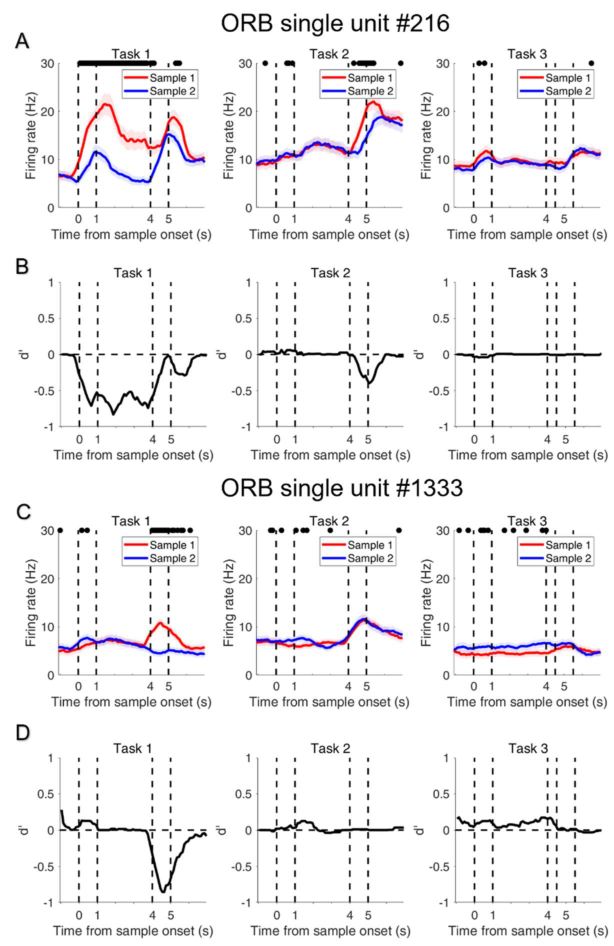

图 3-7 单个眶额叶皮层神经元表现出不同类型的任务特异性编码

Figure 3-7 Single neurons in orbitofrontal cortex exhibit diverse patterns of task-specific

encoding

注： (A) 单个眶额叶皮层神经元（#216）在任务 1、任务 2 和任务 3 中不同样本气味测 试中的平均原始放电率。蓝色代表所有样本气味为 sample 1 的测试，红色代表所 有样本气味为 sample 2 的测试，X 轴表示从样本气味释放开始的时间（秒），Y 轴 代表神经元放电率（赫兹）。图像上方每个黑色点代表该时间窗口下 sample 1 测试 平均放电率与 sample 2 测试平均放电率存在显著性差异（Mann-Whitney U 检验， p < 0.05）。(B) 单个眶额叶皮层神经元（#216）在不同任务中不同时间节点对样本 气味信息的编码能力，X 轴表示从样本气味释放开始的时间，Y 轴表示 d’，其值 分布范围为-1 到 1（-1 表示对 sample 2 具有很高的编码能力，而 1 表示对 sample 1 具有很高的编码能力。(C) 单个眶额叶皮层神经元（#1333）在任务 1、任务 2 和 任务 3 中不同样本气味测试中的平均原始放电率。(D) 单个眶额叶皮层神经元

## （#1333）在不同任务中不同时间节点对样本气味信息的编码能力）。

(A) The average raw firing rate of a single neuron (#216) in the orbitofrontal cortex in different sample odor trials from Task 1, Task 2 and Task 3. Blue represents trials with odor sample 1, and red represents trials with odor sample 2. The X-axis indicates time in seconds from the onset of odor sample presentation, and the Y-axis represents the neuron's firing rate in hertz. Each black dot in the image above represents a significant difference in average firing rates between trials with sample 1 and sample 2 at that time window (Mann-Whitney U test with a p < 0.05). (B) The ability of a single neuron (#216) in the orbitofrontal cortex to encode the sample odor information at different time windows in different tasks, the X-axis represents the time from the sample odor onset, and the Y-axis represents dprime (d’), whose value distribution ranges from -1 to 1 (-1 indicates a high encoding ability for sample 2, while 1 indicates a high encoding ability for sample 1). (C) The average raw firing rate of a single neuron (#1333) in the orbitofrontal cortex in different sample odor trials from Task 1, Task 2 and Task 3. The average raw firing rate of a single neuron in the orbitofrontal cortex in different sample odor trials from Task 1, Task 2 and Task 3. (D) The ability of a single neuron (#1333) in the orbitofrontal cortex to encode the sample odor information at different time windows in different tasks.

## 3.3.4 眶额叶皮层神经元群体表现出对样本信息的任务特异性编码

接下来，本研究对眶额叶皮层神经元群体在另外两个任务中对于样本气味信 息的编码能力进行了与图 3-6 A 中同样的计算，得到图 3-8 结果。可以看到在任 务 2（图 3-8 B）中虽然与任务 1 类似，神经元对于样本气味的辨别能力主要集 中在样本阶段与测试阶段，但是在任务 2 中更多的神经元表现出在样本阶段具有 选择性，而只有小部分神经元在测试阶段表现出样本选择性。根据之前的实验范 式设计（图 3-1），任务 1 和任务 2 在结构上一致（均为延迟配对偶联任务），所 以整体来看眶额叶皮层神经元在任务 1 和任务 2 中对于样本信息的编码呈现出 在时间上的两个阶段集中性分布模式（样本阶段和测试阶段有两个峰值），但因 为任务 2 中延迟期阻断气味（mask odor）的持续存在（即通过在延迟期引入新的 气味保持对样本气味信息维持的干扰，提高了小鼠在延迟期短暂记忆样本信息的 难度），更多的眶额叶皮层神经元在样本阶段提高了编码样本信息的能力，同时 在测试阶段具有高样本信息编码能力的神经元则有所减少（样本阶段峰值高于测 试阶段峰值，图 3-8 E）。这可能揭示小鼠学习阶段眶额叶皮层群体神经元在任务 切换时，对于样本信息的编码在结构相似的任务间既存在一定相似之处，同时因 为任务难度的调整群体编码模式或策略也相应地进行了一些调整。另外本研究在 任务 3 中的样本信息编码模式（图 3-8 C）观察到，群体神经元编码能力则更多 地体现在测试阶段。联系其与任务 1 和 2 不同的任务结构（配对偶联任务），结 果表明眶额叶皮层群体神经元在结构不同的任务间切换（从任务 2 到任务 3）时， 其对于样本信息的编码模式表现出很大的差异。综上，实验结果显示小鼠学习阶 段的眶额叶皮层群体神经元对于样本信息的编码模式在结构相似的任务间存在

## 泛化，但不同结构任务间存在差异。

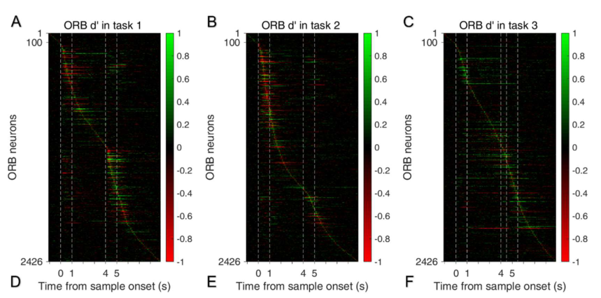

图 3-8 在学习阶段眶额叶皮层神经元对样本信息的任务特异性编码模式

Figure 3-8 Task-dependent encoding pattern for sample information of ORB neurons during the learning stage of mice

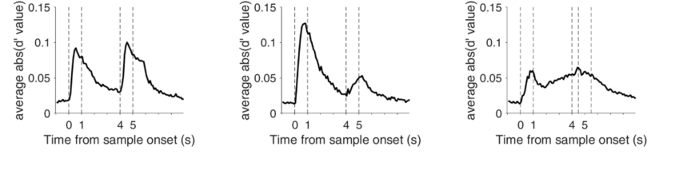

注： (A-C) 在小鼠学习阶段，眶额叶皮层所有神经元（n=2426）分别在任务 1 (A)，任 务 2 (B)以及任务 3 (C)不同时间窗口对于样本信息的编码能力，每一行代表一个眶 额叶皮层神经元，每一列为单个神经元在任务中每个时间窗口（每个时间窗口为 100 毫秒）对于不同样本气味的选择性参数 d’。神经元均按照其在每个任务中的样 本选择性参数绝对值峰值的时间排序。(D-F) 在任务 1 (D)、任务 2 (E)和任务 3 (F) 测试中，眶额叶皮层神经元群体在不同时间窗内的样本选择参数 d’的绝对值平均。 (A-C) Encoding abilities of orbitofrontal cortex (ORB) neurons in different time windows of task 1 (A), task 2 (B) and task 3 (C) during the learning stage of mice. Each row represents a single ORB neuron, and each column represents the selectivity parameter d’ of individual neurons for different sample odors in each time window (each time window is 100 milliseconds) during the task. Neurons are sorted by the timing of the peak value of their absolute sample selectivity parameter d’ in each task. (D-F) The average absolute value of the sample selectivity parameter d’ of the ORB neuronal population across different time windows within task 1 (D), task 2 (E) and task 3 (F) trials.

## 3.3.5 眶额叶皮层神经元群体对样本信息的任务特异性编码在不同行为阶段存在 差异

之前提到小鼠整个任务训练以及电生理记录可以被分为两个阶段，即学习阶

段（learning stage）和学会阶段（expert stage），在前面的分析中用到了小鼠学习 阶段眶额叶皮层神经元在任务中的电活动数据，接下来本研究对该脑区在学会期 的神经活动进行同样的计算分析。本研究在小鼠学会期共记录到 680 个眶额叶皮 层神经元，对比学习期所记录到的神经元则数量偏低，之后在进一步对不同脑区 做群体神经元解码分析时会对两个阶段的神经元数量进行平衡（例如眶额叶皮层 群体神经元 2426/680 则统一按照 680 神经元数每次循环随机选取）。可以发现， 学会期眶额叶皮层神经元在任务 1 中对样本信息的编码模式（图 3-9 A）与其在 学习期的编码模式（图 3-8 A）存在较大差异——学会期眶额叶皮层神经元对于 样本信息的编码能力主要分布在样本阶段和延迟阶段并且峰值出现在样本阶段， 而在测试阶段很少有对样本信息的编码（图 3-9 D）。同时横向比较不同任务，可 以观察到学会期眶额叶皮层群体编码模式在任务 1 和任务 2 中相似（对比学习期 更为相似），而在任务 2 和任务 3 或是任务 1 和任务 3 中均为不同。结合之前的 结果，可以初步发现眶额叶皮层群体神经元对于样本信息的编码存在任务特异性 （结构相似的任务间编码模式相似，结构不同的任务间则编码模式存在很大差 异），同时经过任务学习（从学习期到学会期）这种特异性可能朝两个方向变化 ——相似结构任务间编码模式更为类似，而不同结构任务间编码模式差异更大。

另外，可以观察到在学会期任务 1 和任务 2 中，样本信息编码能力在样本阶 段结束（样本气味释放关闭）后呈现下降趋势（3-9 D, E），说明随着样本气味的 消失，眶额叶皮层神经元对于样本信息的编码能力在逐步衰减（延迟期没有信息 输入，需要小鼠在线维持样本信息），即在延迟期随之时间推移工作记忆能力存 在衰减的现象，而这也与之前的发现类似（Bellafard et al., 2024）；在任务 3 中， 因为结构的不同（图 3-1），延迟期依然有气味存在，但是眶额叶皮层神经元对于 样本信息的编码能力却呈现出一种逐步上升的趋势，表明在一个长时间的样本气 味采样中眶额叶皮层神经元除了对样本气味本身的编码外可能还存在一部分对 于动机（motivation）或者运动计划（motor planning）的编码。

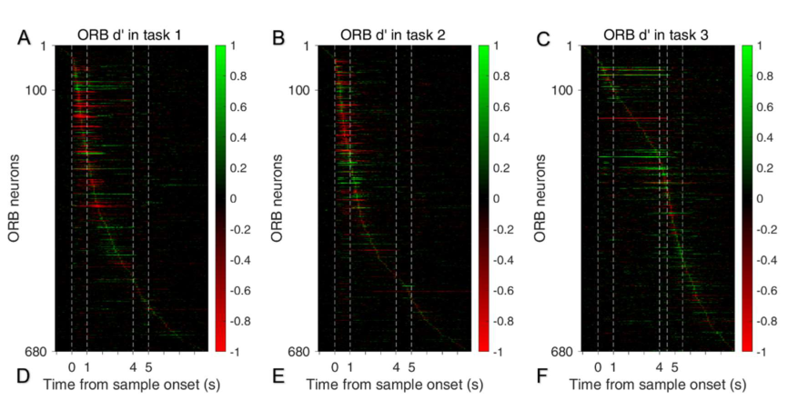

图 3-9 在学会阶段眶额叶皮层神经元对样本信息的任务特异性编码模式

Figure 3-9 Task-dependent encoding pattern for sample information of ORB neurons during expert stage of mice

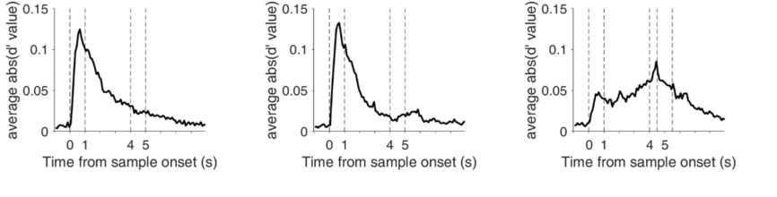

注： (A-C) 在小鼠学会阶段，眶额叶皮层所有神经元（n=680）分别在任务 1 (A)，任务 2 (B)以及任务 3 (C)不同时间窗口对于样本信息的编码能力，每一行代表一个眶额 叶皮层神经元，每一列为单个神经元在任务中每个时间窗口（每个时间窗口为 100 毫秒）对于不同样本气味的选择性参数 d’。神经元均按照其在每个任务中的样本 选择性参数绝对值峰值的时间排序。(D-F) 在任务 1 (D)、任务 2 (E)和任务 3 (F) 测试中，眶额叶皮层神经元群体在不同时间窗内的样本选择参数 d’的绝对值平均。 (A-C) Encoding abilities of orbitofrontal cortex (ORB) neurons in different time windows of task 1 (A), task 2 (B) and task 3 (C) during the expert stage of mice. Each row represents a single ORB neuron, and each column represents the selectivity parameter d’ of individual neurons for different sample odors in each time window (each time window is 100 milliseconds) during the task. Neurons are sorted by the timing of the peak value of their absolute sample selectivity parameter d’ in each task. (D-F) The average absolute value of the sample selectivity parameter d’ of the ORB neuronal population across different time windows within task 1 (D), task 2 (E) and task 3 (F) trials.

为了进一步探究眶额叶皮层群体神经元在任务不同时间段以及不同任务和 不同行为阶段对于样本信息编码的动态变化，结合之前得到的结果——在小鼠学 习阶段眶额叶皮层神经元在任务 1 和任务 2 中对于样本信息的编码大致呈现出 两个区域的分布，即编码能力集中体现在样本阶段和测试阶段（图 3-8 A, B, D,

E）；而在学会阶段眶额叶皮层群体神经元编码能力则更趋近于分布在样本阶段 （图 3-9 A, B, D, E）——分别对小鼠学习和学会阶段眶额叶皮层神经元活动进行 样本选择性神经元筛选（图 3-5）。整体来看，无论是学习阶段还是学会阶段眶额 叶皮层神经元在三个时间段以及三个任务中均有选择性神经元分布，不过在不同 任务之间以及相同任务不同行为阶段不同类别选择性神经元比例均有所变化。在 小鼠学习阶段（图 3-10 C），眶额叶皮层样本期选择性神经元在任务 1 中所占比 例（18.0 %）略少于延迟期选择性神经元比例（26.3 %），但与测试期选择性神经 元所占比例（18.2 %）相近。比较任务 1 与任务 2 中各类别选择性神经元比例， 发现样本期选择性神经元比例（27.2 %）和延迟期选择性神经元比例（36.3 %） 均有所提高，而测试期选择性神经元比例（8.5 %）则有所下降，说明当任务难度 提升时眶额叶皮层神经元采取了在样本以及延迟阶段提高对于样本信息的编码 能力的策略来更好地应对任务切换后的不同需求；同时任务阶段不具有样本选择 性的神经元比例也有所下降（从 37.5 %到 28.1 %），说明眶额叶皮层神经元在任 务 2 中整体的编码能力有所上升。相反任务 3 中三类神经元比例则相较于任务 2 均有降低（14.8 %，28.3 %，16.2 %），而任务阶段不具有样本选择性的神经元比 例也有所上升（从 28.1 %到 40.7 %），说明随着任务难度下降（相比于任务 2 需 要工作记忆的参与，任务 3 则几乎不用到工作记忆）整体编码能力大幅下降。比 较小鼠在学习每个任务的不同的学习阶段中眶额叶皮层各类选择性神经元比例 （图 3-5 D），可以发现在样本阶段和延迟阶段，任务 1（18.0 % v.s. 30.0 %，26.3 % v.s. 41.8 %；）和任务 2（27.2 % v.s. 30.3 %，36.3 % v.s. 40.4 %）样本选择性神经 元比例均有所提高，而任务 3 中比例则均为减小（14.8 % v.s. 9.6 %，28.3 % v.s. 23.1 %）；在测试阶段任务 1 和任务 2 样本选择性神经元比例则都表现出下降 （18.2 % v.s. 9.4 %；8.5 % v.s. 6.9 %），相反任务 3 中比例则有所上升（16.2 % v.s. 22.6 %）（图 3-10 E）。综上，结合之前结果说明，在学习阶段眶额叶皮层神经元 在不同任务中对样本信息的编码呈现不同模式（图 3-10 C），而经过学习（学会 阶段相比于学习阶段）眶额叶皮层神经元在结构类似的任务之间（任务 1 和任务 2）表现出对于样本信息的类似编码模式（shared encoding pattern）（图 3-10 D）， 同时不同结构任务则表现出更为差异化的编码模式。

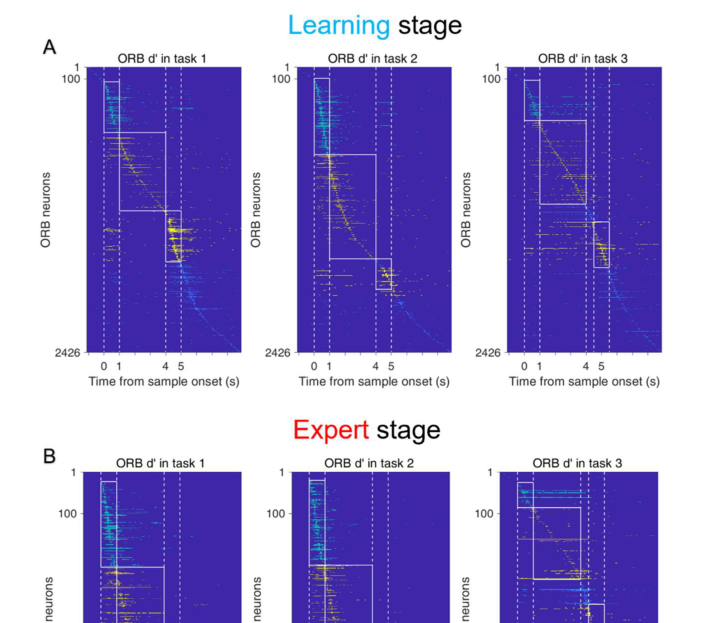

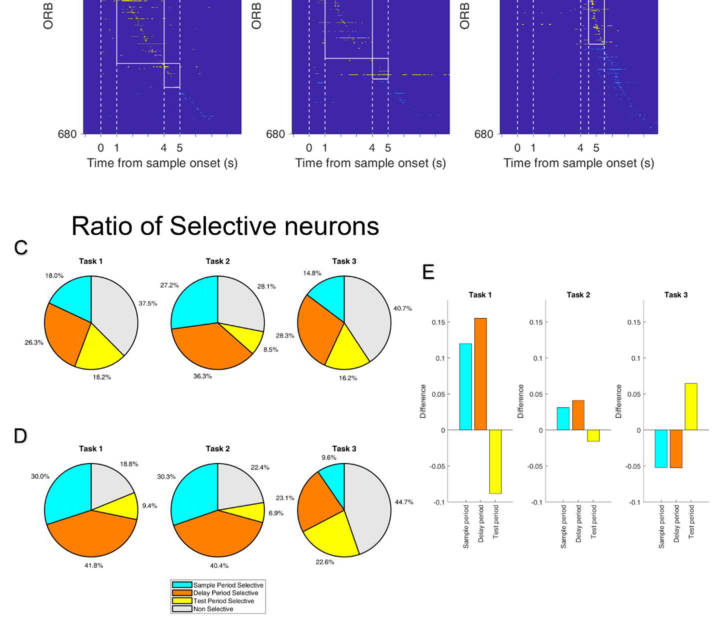

注： (A) 在学习阶段眶额叶皮层神经元在不同任务中对于样本信息的编码模式图。其中 每一列为一个眶额叶皮层神经元，三个白色方框圈出的为在三个阶段（样本阶段， 延迟阶段，测试阶段）中具有显著性样本选择性神经元（p < 0.01）的 d’峰值区域。 蓝色为不显著 d’值记 0，三个区域显著 d’值记 1 并分别用三种不同颜色表示。X 轴 为从样本气味释放开始时间。神经元均按照其在每个任务中的样本选择性参数绝 对值峰值的时间排序。 (B) 在学会阶段眶额叶皮层神经元在不同任务中对于样本 信息的编码模式图。其中每一列为一个眶额叶皮层神经元，三个白色方框圈出的 为在三个阶段（样本阶段，延迟阶段，测试阶段）中具有显著性样本选择性神经元 （p < 0.01）的 d’峰值区域。(C) 在学习阶段不同任务中眶额叶皮层选择性神经元 比例图。其中样本期选择性神经元比里用青色表示，延迟期用橙色表示，测试期用 黄色表示、非选择性神经元比例则用灰色表示。(D) 在学会阶段不同任务中眶额叶 皮层选择性神经元比例图。(E) 学会期与学习期不同类别样本选择性神经元比例差 异。

(A) Encoding patterns of ORB neurons for sample information in different tasks during the learning stage. Each column represents an ORB neuron. The three white boxes highlight the peak d’ regions of neurons with significant sample selectivity (p<0.01) during the three periods (sample period, delay period, and test period). Non-significant d’ values are represented in blue and set to 0, while significant d’ values are set to 1 and represented by three distinct colors. The X-axis represents the time from the onset of sample odor delivery. Neurons are sorted by the timing of the peak value of their absolute sample selectivity parameter d’ in each task. (B) Encoding patterns of ORB neurons for sample information in different tasks during the expert stage. Each column represents an ORB neuron. The three white boxes highlight the peak d’ regions of neurons with significant sample selectivity (p<0.01) during the three periods (sample period, delay period, and test period). (C) Proportions of ORB sample selective neurons in different tasks during the learning stage. The proportions of sample selective neurons during the sample period, delay period, and test period are represented in cyan, orange, and yellow, respectively. The proportion of non-selective neurons is shown in gray. (D) Proportions of ORB sample selective neurons in different tasks during the expert stage. (E) Differences in the proportions of sample selective neuron categories between the learning and expert stages.

## 3.3.6 群体神经元对样本信息的任务特异性编码模式存在脑区差异

接下来，为了探究这种对于样本信息的任务特异性编码机制在不同脑区是否 同样适用，根据任务本身（基于嗅觉的延迟/非延迟配对偶联任务）考虑，本研究 进一步选择了一个在嗅觉通路中起到重要作用的脑区即前嗅核（anterior olfactory nucleus，AON）（Brunert et al., 2023）作为另一个参照脑区，来对比观察不同脑 区群体神经元在不同任务中以及不同行为阶段下表现出的对样本信息的差异化 编码模式。结果显示在学习阶段，前嗅核神经元在三个任务中对样本信息的编码 与眶额叶皮层神经元的编码模式类似：从图 3-10 整体来看群体神经元在任务 1 和任务 2 中的编码能力高于在任务 3 中，其在任务 1 和任务 2 中均呈现出样本和 测试两个阶段较高的样本信息编码，同时任务 1 对比任务 2 在测试阶段具有更高 58

的样本信息编码能力而在样本阶段编码水平略低（样本气味选择性参数 d’峰值分 布在测试/样本阶段的神经元比例更高/更低，详见图 3-12 C）。

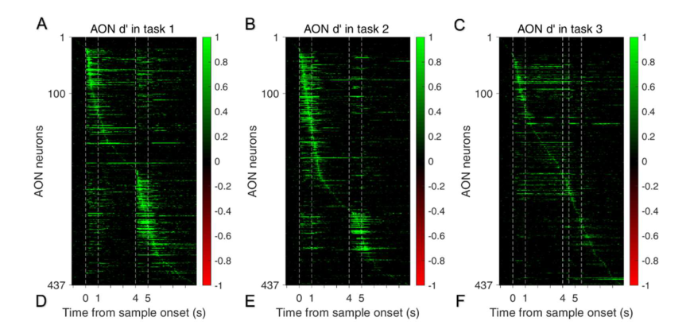

图 3-11 在学习阶段前嗅核神经元对样本信息的任务特异性编码模式

Figure 3-11 Task-dependent encoding pattern for sample information of anterior olfactory nucleus (AON) neurons during the learning stage of mice

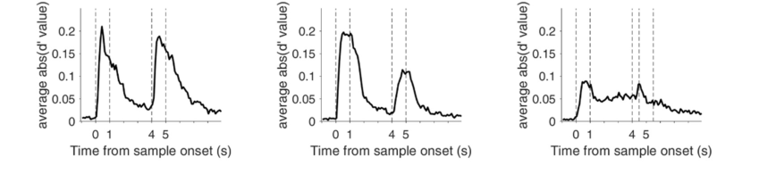

注： (A-C) 在小鼠学习阶段，前嗅核所有神经元（n=437）分别在任务 1 (A)，任务 2 (B) 以及任务 3 (C)不同时间窗口对于样本信息的编码能力，每一行代表一个前嗅核神 经元，每一列为单个神经元在任务中每个时间窗口（每个时间窗口为 100 毫秒） 对于不同样本气味的选择性参数 d’。 神经元均按照其在每个任务中的样本选择性 参数绝对值峰值的时间排序。(D-F) 在任务 1 (D)、任务 2 (E)和任务 3 (F) 测试中， 前嗅核神经元群体在不同时间窗内的样本选择参数 d’的绝对值平均。

   - (A-C) Encoding abilities of anterior olfactory nucleus (AON) neurons in different time windows of task 1 (A), task 2 (B) and task 3 (C) during the learning stage of mice. Each row represents a single ORB neuron, and each column represents the selectivity parameter d’ of individual neurons for different sample odors in each time window (each time window is 100 milliseconds) during the task. Neurons are sorted by the timing of the peak value of their absolute sample selectivity parameter d’ in each task. (D-F) The average absolute value of the sample selectivity parameter d’ of the AON neuronal population across different time windows within task 1 (D), task 2 (E) and task 3 (F) trials.

而对比前嗅核神经元和眶额叶皮层神经元在学习阶段对于样本信息的平均 编码能力，可以发现前嗅核神经元在不同任务以及三个阶段（样本阶段，延迟阶 段，测试阶段）对于样本信息的编码能力均要要高于眶额叶皮层（图 3-12）。

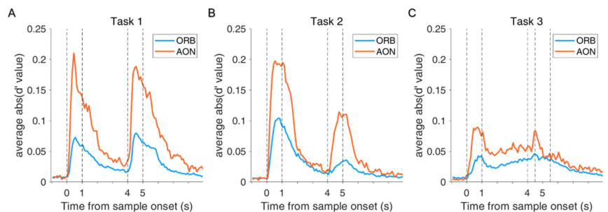

图 3-12 在学习阶段前嗅核与眶额叶皮层神经元对样本信息的编码差异

Figure 3-12 Differences of encoding patterns in AON and ORB neurons during the learning

stage
注： 在任务 1、任务 2 和任务 3 测试中，前嗅核以及眶额叶皮层神经元群体在不同时间 窗内的样本选择参数 d’的绝对值平均。橙色线表示前嗅核数据，青色线表示眶额 叶皮层数据。

The average absolute value of the sample selectivity parameter d’ of the AON and ORB neuronal populations across different time windows within task 1, task 2 and task 3 trials. The orange line represents AON data, and the cyan line represents ORB data.

同样，本研究对前嗅核神经元在学会阶段的神经活动进行计算分析。可以看 到在学会阶段，前嗅核神经元对于样本信息的编码模式表现出在任务 1 和任务 2 中类似，在任务 3 中则与在前两个任务中相比差异很大。而在单一任务中，例如 在任务 1 或是在任务 2 中，前嗅核神经元对于样本信息的编码能力呈现出集中分 布在样本阶段及延迟阶段（并且峰值出现在样本阶段），很少分布在测试阶段（图 3-8 D, E）；在任务 3 中前嗅核神经元虽在样本和延迟阶段均维持着对样本信息的 编码能力，但在样本阶段只有一个很小的峰值出现（与任务 1 和任务 2 相比）。 综上，结果表明前嗅核神经元在学会期与之前眶额叶皮层神经元在学会期的编码 模式基本一致（图 3-9）。

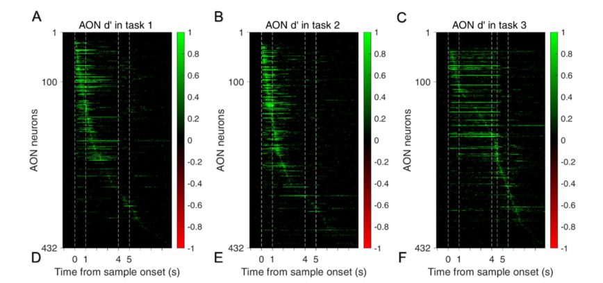

图 3-13 在学会阶段前嗅核神经元对样本信息的任务特异性编码模式

Figure 3-13 Task-dependent encoding pattern for sample information in anterior olfactory nucleus (AON) neurons during expert stage of mice

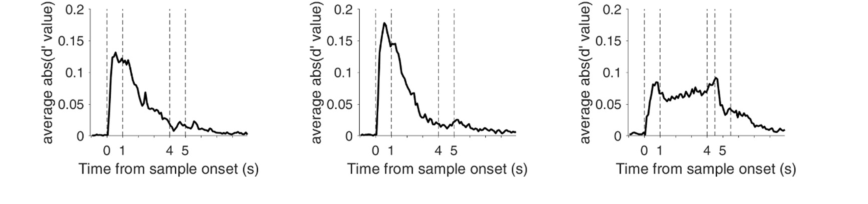

注： (A-C) 在小鼠学会阶段，前嗅核所有神经元（n=432）分别在任务 1 (A)，任务 2 (B) 以及任务 3 (C)不同时间窗口对于样本信息的编码能力，每一行代表一个前嗅核神 经元，每一列为单个神经元在任务中每个时间窗口（每个时间窗口为 100 毫秒） 对于不同样本气味的选择性参数 d’。神经元均按照其在每个任务中的样本选择性 参数绝对值峰值的时间排序。(D-F) 在任务 1 (D)、任务 2 (E)和任务 3 (F)测试中， 前嗅核神经元群体在不同时间窗内的样本选择参数 d’的绝对值平均。

   - (A-C) Encoding abilities of anterior olfactory nucleus (AON) neurons in different time windows of task 1 (A), task 2 (B) and task 3 (C) during the expert stage of mice. Each row represents a single ORB neuron, and each column represents the selectivity parameter d’ of individual neurons for different sample odors in each time window (each time window is 100 milliseconds) during the task. Neurons are sorted by the timing of the peak value of their absolute sample selectivity parameter d’ in each task. (D-F) The average absolute value of the sample selectivity parameter d’ of the AON neuronal population across different time windows within task 1 (D), task 2 (E) and task 3 (F) trials.

接下来同样对学会阶段前嗅核神经元与眶额叶皮层神经元对样本信息的编 码差异进行比较，结果显示前嗅核神经元群体在任务 1、任务 2 以及任务 3 中的 平均编码能力均高于眶额叶皮层神经元群体（图 3-14）

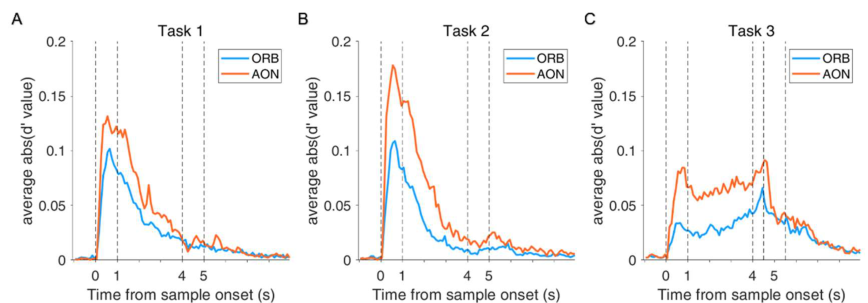

图 3-14 在学会阶段阶段前嗅核与眶额叶皮层神经元对样本信息的编码差异

Figure 3-14 Differences of encoding patterns in AON and ORB neurons during the expert stage

注： 在任务 1、任务 2 和任务 3 测试中，前嗅核以及眶额叶皮层神经元群体在不同时间 窗内的样本选择性参数 d’的绝对值平均。橙色线表示前嗅核数据，青色线表示眶 额叶皮层数据。

The average absolute value of the sample selectivity parameter d’ of the AON and ORB neuronal populations across different time windows within task 1, task 2 and task 3 trials. The orange line represents AON data, and the cyan line represents ORB data.

本研究进一步对前嗅核脑区中不同亚群神经元对于样本信息的编码能力展 开探究，发现与眶额叶皮层脑区神经元在任务中的活动模式类似，前嗅核神经元 群体也可以根据其最大编码样本信息能力（群体神经元样本选择性参数 d’在任务 测试中的峰值）所处任务测试中的不同阶段（样本阶段，延迟阶段，测试阶段） 来分为三个亚群（图 3-15 A, B 所示即为不同行为阶段前嗅核不同任务中不同类 别样本选择性神经元的分布，与图 3-10 A, B 中计算方法一致）。结果表明在学习 阶段前嗅核神经元所含不同类别样本选择性神经元的比例在不同任务中均有所 差异。对比任务 1 和任务 2，任务 2 中有更高比例的样本阶段和延迟阶段选择性 神经元和更少的测试阶段选择性神经元；以及对比任务 2 和任务 3，任务 3 中样 本阶段和延迟选择性神经元更少而测试阶段选择性神经元有所增加（任务切换顺 序为：任务 1，任务 2，任务 3）。这说明与眶额叶皮层神经元群体类似，随着任 务难度的提升（任务 1 切换到任务 2）群体神经元更多地被召集负责样本信息的 编码与维持以抵抗干扰。而在学会阶段，前嗅核神经元群体也与眶额叶皮层群体 编码模式类似，即群体神经元在任务 1 和任务 2 中三个类别选择性神经元比例相 差不大，而任务 3 则呈现出与任务 1 或 2 截然不同的比例组成。根据结果推测， 前嗅核脑区同样在经过学习（学会阶段相比于学习阶段）之后可以在相同结构的 任务之间共享对于样本信息的群体神经表征，而不能够在不同结构任务之间泛化 这种信息编码模式。

在这里本研究对于神经元在不同任务中的排序是基于其在当前任务中的对 于样本信息的编码表现（按照每个神经元在每个任务中的样本选择性参数 d’的绝 62

对值峰值出现的时间排序，例如该神经元在任务 1 中峰值出现在样本阶段即将其 排在前面而在任务 2 中峰值出现在测试阶段就会被排在靠下的位置），也就是说 本研究基于对群体神经元在每个任务中根据不同的编码需求对神经元进行了重 组织（reorganization）这一假说来深入展开探究，之后会在对群体神经元解码分 析部分进一步对该假说进行验证与讨论。

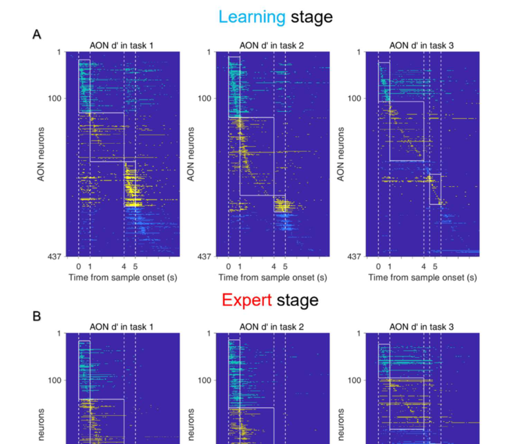

Figure 3-15 Task-related differences in encoding patterns and sample-selective neuron proportions in the anterior olfactory nucleus (AON) across behavioral stages

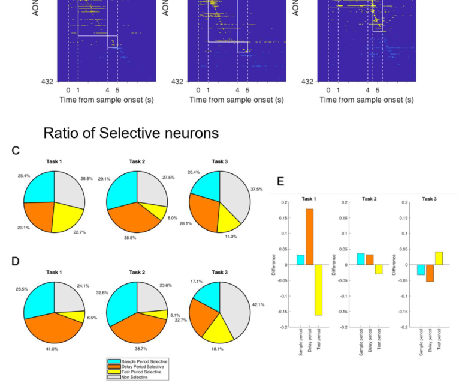

Figure 3-15 Task-related differences in encoding patterns and sample-selective neuron proportions in the anterior olfactory nucleus (AON) across behavioral stages

注： (A) 在学习阶段前嗅核神经元在不同任务中对于样本信息的编码模式图。其中每一 列为一个前嗅核神经元，三个白色方框圈出的为在三个阶段（样本阶段，延迟阶 段，测试阶段）中具有显著性样本选择性神经元（p < 0.01）的 d’峰值区域。蓝色 为不显著 d’值记 0，三个区域显著 d’值记 1 并分别用三种不同颜色表示。X 轴为 从样本气味释放开始时间。神经元均按照其在每个任务中的样本选择性参数绝对 值峰值的时间排序。 (B) 在学会阶段前嗅核神经元在不同任务中对于样本信息的 编码模式图。其中每一列为一个前嗅核神经元，三个白色方框圈出的为在三个阶 段（样本阶段，延迟阶段，测试阶段）中具有显著性样本选择性神经元（p < 0.01） 的 d’峰值区域。(C) 在学习阶段不同任务中前嗅核选择性神经元比例图。其中样 本期选择性神经元比里用青色表示，延迟期用橙色表示，测试期用黄色表示、非选 择性神经元比例则用灰色表示。(D) 在学会阶段不同任务中前嗅核选择性神经元 比例图。(E) 学会期与学习期不同类别样本选择性神经元比例差异。

(A) Encoding patterns of AON neurons for sample information in different tasks during the learning stage. Each column represents an AON neuron. The three white boxes highlight the peak d’ regions of neurons with significant sample selectivity (p<0.01) during the three periods (sample period, delay period, and test period). Non-significant d’ values are represented in blue and set to 0, while significant d’ values are set to 1 and represented by three distinct colors. The X-axis represents the time from the onset of sample odor delivery. Neurons are sorted by the timing of the peak value of their absolute sample selectivity parameter d’ in each task. (B) Encoding patterns of AON neurons for sample information in different tasks during the expert stage. Each column represents an AON neuron. The three white boxes highlight the peak d’ regions of neurons with significant sample selectivity (p<0.01) during the three periods (sample period, delay period, and test period). (C) Proportions of AON sample selective neurons in different tasks during the learning stage. The proportions of sample selective neurons during the sample period, delay period, and test period are represented in cyan, orange, and yellow, respectively. The proportion of non-selective neurons is shown in gray. (D) Proportions of AON sample selective neurons in different tasks during the expert stage. (E) Differences in the proportions of sample selective neuron categories between the learning and expert stages.

在接下来的研究中，本研究对前嗅核和眶额叶皮层群体神经元在不同行为阶 段（学习阶段与学会阶段）下，不同类别选择性神经元（样本阶段、延迟阶段和 测试阶段样本选择性神经元）的编码能力进行了初步比较。整体结果显示，在学 习阶段，前嗅核群体中三个类别的亚群神经元在不同任务中对样本信息的平均编 码能力均高于眶额叶皮层神经元。

具体来说，在任务 1 和任务 2 中，三类选择性神经元的编码能力表现出相似 的模式：样本阶段选择性神经元（Group 1）在样本阶段展现出峰值编码能力（见 图 3-16 A）；延迟阶段选择性神经元（Group 2）在延迟阶段的早期表现出峰值编 码能力，随着延迟时间的推进，其编码能力开始初步衰减（见图 3-16 B）；测试 阶段选择性神经元（Group 3）在测试阶段展现出峰值编码能力（见图 3-16 C）。 有趣的是，在任务 1 和任务 2 中，前嗅核的 Group 1 神经元在测试阶段表现

出一个局部峰值编码能力（小于样本阶段峰值），同时前嗅核的 Group 3 神经元 在样本阶段也表现出一个局部峰值编码能力（小于测试阶段峰值），而在眶额叶 皮层中则没有观察到类似现象。这表明在学习阶段，前嗅核神经元对样本信息的 编码更为复杂，可能主要负责样本阶段样本信息编码的 Group 1 亚群在测试阶段 也有编码活动，而主要负责测试阶段样本信息编码的 Group 3 亚群同样在样本阶 段有参与编码。相比之下，眶额叶皮层神经元亚群则表现出更为独立的编码模式， Group 1 和 Group 3 的编码分布基本不存在重叠。

—— 结合前嗅核的解剖结构以及其在嗅觉信息传导中的重要作用 前嗅核是 嗅脚（olfactory peduncle，即嗅球与基底前脑的连接）中最前部的皮质结构（Brunert et al., 2023），以及任务结构本身（样本和测试刺激为气味分子），本研究推测在 学习阶段前嗅核更为广泛地参与不同气味信息相关编码，例如：对于负责最初编 码样本信息的神经元可能在测试阶段有一定的被重激活或被检索，而负责在测试 阶段提供样本信息的神经元在样本开始阶段可能被共激活。因此在样本和测试两 个阶段，可以看到不同亚群（Group 1 和 Group 3）对样本信息的编码存在一定重 合。相反，Group 2 神经元则更为特异，其编码表现主要出现在延迟阶段，并呈 现出从样本气味结束达到峰值之后慢慢衰减的趋势，结合任务结构（延迟阶段并 无样本气味存在），表明这部分神经元更多地在工作记忆相关功能（例如在线维 持对于样本信息的记忆，又或是与注意力相关）中起到重要作用。

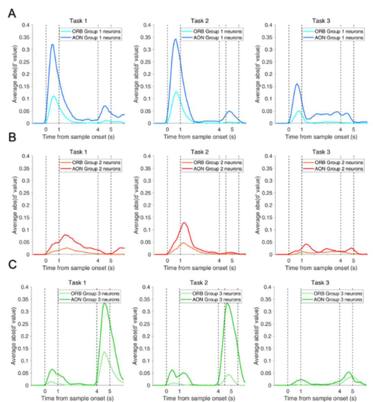

图 3-16 在学习阶段眶额叶皮层和前嗅核神经元中不同亚群在不同任务中的编码能力差异

Figure 3-16 Different subpopulations of neurons in the orbitofrontal cortex and the anterior olfactory nucleus exhibit variations in encoding abilities in different tasks during the learning stage

注： (A) 在学习阶段，前嗅核和眶额叶皮层中第 1 类神经元在不同任务中不同时间窗 内的样本选择性参数 d’的绝对值平均。蓝色代表前嗅核神经元，青色代表眶额叶 皮层神经元。(B) 在学习阶段，前嗅核和眶额叶皮层中第 2 类神经元在不同任务中 不同时间窗内的样本选择性参数 d’的绝对值平均。红色代表前嗅核神经元，橙色 代表眶额叶皮层神经元。(C) 在学习阶段，前嗅核和眶额叶皮层中第 3 类神经元在 不同任务中不同时间窗内的样本选择性参数 d’的绝对值平均。绿色代表前嗅核神 经元，深绿色代表眶额叶皮层神经元。
(A) During the learning stage, the average absolute value of the sample selectivity parameter d' for Group 1 neurons in the AON and ORB across different time windows and tasks. Blue represents AON neurons, and cyan represents ORB neurons. (B) During the learning stage, the average absolute value of the sample selectivity parameter d' for Group 2 neurons in the AON and ORB across different time windows and tasks. Red represents AON neurons, and orange represents ORB neurons. (C) During the learning stage, the average absolute value of the sample selectivity parameter d' for Group 3 neurons in the AON and ORB across different time windows and tasks. Green represents AON neurons, and dark green represents ORB neurons.

同样地，本研究比较了前嗅核和眶额叶皮层在学会阶段不同任务中各类神经 元亚群的编码能力。与学习阶段观察到的现象不同，在学会阶段的任务 1 和任务 2 中，前嗅核和眶额叶皮层的神经元更多地分化为两个主要的亚群，换言之， Group 3 神经元的编码能力几乎降至 0。同时，在任务 1 中，前嗅核和眶额叶皮 层的 Group 1 神经元展现出类似的编码能力分布模式；这与学习阶段前嗅核 Group 1 神经元在两个阶段都表现出编码活动的情况不同，在学会阶段，Group 1 神经元仅在样本阶段达到编码能力的峰值，随后持续下降至延迟阶段后期和测试 阶段，直至 0。这表明前嗅核神经元对样本信息的编码受到了学习过程的显著影 响和调节。在任务 3 中，前嗅核的 Group 2 神经元的编码能力相较于学习阶段有 了显著提升。结合 Group 1 和 Group 3 在任务 3 中的表现，可以推测前嗅核区域 （眶额叶皮层的情况类似，但 Group 2 神经元的编码能力略弱）的三类神经元在 任务 3 中，即便是对持续存在的样本气味信息（任务 3 的延迟阶段中样本气味持 续存在）的编码，也随着学习的进行形成了不同的分工：Group 1 神经元负责在 开始阶段对样本信息进行编码，并维持到样本气味结束；Group 2 神经元则专门 负责样本信息的持续编码，并在样本气味结束时停止（可能还包括时间和运动准 备的编码）；而 Group 3 神经元仅在测试阶段进行部分编码。综上所述，本研究 通过对学会阶段的数据分析发现，前嗅核和眶额叶皮层的神经元在不同任务中的 编码能力同样表现出了明显的阶段特异性和任务特异性，这些发现进一步强调了 前嗅核在处理嗅觉信息时的重要作用，以及眶额叶皮层在不同任务中可能采取的 不同编码策略。

结合之前的结果，本研究发现单一脑区不同亚群神经元在不同任务中表现出 差异化样本信息编码，并且这种编码存在行为阶段特异性（学习对比学会阶段）

## 以及脑区特异性（眶额叶皮层和前嗅核）。

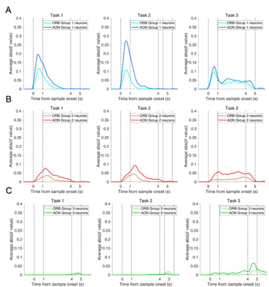

图 3-17 在学会阶段眶额叶皮层和前嗅核神经元中不同亚群在不同任务中的编码能力差异

Figure 3-17 Different subpopulations of neurons in the orbitofrontal cortex and the anterior olfactory nucleus exhibit variations in encoding abilities in different tasks during the expert stage

注： (A) 在学会阶段，前嗅核和眶额叶皮层中第 1 类神经元在不同任务中不同时间窗 内的样本选择性参数 d’的绝对值平均。蓝色代表前嗅核神经元，青色代表眶额叶 皮层神经元。(B) 在学会阶段，前嗅核和眶额叶皮层中第 2 类神经元在不同任务中 不同时间窗内的样本选择性参数 d’的绝对值平均。红色代表前嗅核神经元，橙色 代表眶额叶皮层神经元。(C) 在学会阶段，前嗅核和眶额叶皮层中第 3 类神经元在 不同任务中不同时间窗内的样本选择性参数 d’的绝对值平均。绿色代表前嗅核神 经元，深绿色代表眶额叶皮层神经元。
(A) During the expert stage, the average absolute value of the sample selectivity parameter d' for Group 1 neurons in the AON and ORB across different time windows and tasks. Blue represents AON neurons, and cyan represents ORB neurons. (B) During the expert stage, the average absolute value of the sample selectivity parameter d' for Group 2 neurons in the AON and ORB across different time windows and tasks. Red represents AON neurons, and orange represents ORB neurons. (C) During the expert stage, the average absolute value of the sample selectivity parameter d' for Group 3 neurons in the AON and ORB across different time windows and tasks. Green represents AON neurons, and dark green represents ORB neurons.

## 3.3.7 全脑对样本信息的任务特异性编码模式

在对眶额叶皮层群体神经元对于样本信息的编码能力进行分析后，结果表明

在学习阶段无论是单个神经元还是神经元群体都存在任务特异性的样本编码表 现，而在学会阶段神经元群体能够呈现对于样本信息神经表征的任务结构特异性 泛化表现（即在结构类似的任务 1 和任务 2 之间表现出相似的编码模式，而结构 截然不同的任务 3 相较任务 1/任务 2 则编码模式完全不同）。之后对眶额叶皮层 和前嗅核两个不同脑区神经元群体进行对比，结果表明前嗅核脑区在不同任务以 及不同行为阶段（学习阶段和学会阶段）均表现出与眶额叶皮层脑区类似的编码 模式，但在整体编码强度上（群体神经元平均编码能力）高于眶额叶皮层脑区。 那么，有一个疑问是，在全脑尺度，是否存在一致性的跨任务的泛化编码能力呢？ 为了探究这一问题，本研究分别计算全脑数十个脑区的神经元群体对于样本信息 的编码能力，进而比较不同脑区在不同行为阶段以及不同任务中的编码模式，以 及泛化表征能力。可以看到在学习阶段全脑表现出对样本信息的任务特异性编码 模式，即在任务 1 中对于样本信息的编码能力集中分布于样本阶段和测试阶段 （图 3-18 A 左图），在任务 2 多个脑区则只在样本阶段对于样本信息有很强的编 码（图 3-18 A 中图），而在任务 3 中表现出在样本到测试阶段整个过程中较为平 均的编码（图 3-18 A 右图）。其中整体编码能力较强的脑区是眶额叶皮层（ORB）、 前嗅核（AON）、犁状皮层（piriform cortex, PIR）、顶盖带（taenia tecta， TT）、 背足区（dorsal peduncular area, DP）、伏隔核（Nucleus accumbens, ACB）、纹状体 样杏仁核（striatum-like amygdalar nuclei, sAMY）以及苍白球区域（pallidum, PAL）。 这些脑区主要来自嗅觉相关区域（olfactory area）以及基底核区域（basal ganglia）， 前者我们知道与嗅觉信息处理通路以及嗅觉相关认知功能直接相关（Zhang et al., 2019），而基底核除了与情感处理相关（Bahrami et al., 2024）同样也与决策制定 （Grahn et al., 2008）以及注意力的转移和更新（Delmonte et al., 2013）和灵活认 知（Frank et al., 2005）等高级认知功能相关。而在这里本研究发现随着任务的切 换（从任务 1 到任务 2）以及任务难度的变换（任务 2 延迟期持续存在干扰气味）， 可以看到这些区域表现出样本阶段整体编码能力的提升（对于嗅觉相关区域可能 是提高对于样本信息的编码来应对延迟期出现的持续气味干扰，对于基底核区域 可能是提高注意力来应对难度的变化）以及测试阶段的小幅下降（干扰气味的出 现影响了在该阶段对于样本信息的编码）。同时，任务切换到任务 3，可以看到随 着任务难度（非延迟匹配偶联任务）大幅降低以及嗅觉编码需求降低（样本到延 迟阶段均有样本气味存在），编码能力也有着大幅降低（平均分布在样本到测试 整个阶段，并非集中在某个或某两个区域）。另外，本研究发现学习阶段运动相 关皮层（primary motor cortex, MOp; secondary motor cortex, MOs）在任务中整体 编码能力偏低，作为对比可以验证在嗅觉相关区域以及基底核等脑区在测试阶段 表现出的对样本信息的高编码能力更多地是一种非运动相关的信息表征，例如对 于样本信息编码的重激活（reactivation）或者说再提取（retrieval）。接下来本研 究对全脑在学会阶段的动态编码进行分析，发现在学习阶段表现出高编码能力的

区域在学会阶段继续保持着编码，但是在任务 1 和任务 2 中呈现出样本阶段高编 码能力的集中分布模式（测试阶段编码能力相较学习阶段下降较多），以及任务 3 依旧保持较为平均的编码表现（个别脑区例如 AON、TT、PALv 编码能力相较 于学习阶段有所提高）（图 3-18 B）。整体来看，与之前单一脑区（ORB）乃至多 个脑区（ORB 和 AON）的发现一致，即全脑在学会阶段中任务结构类似的任务 之间（任务 1 和任务 2 之间）表现出相似的编码模式，而在不同结构任务之间 （任务 1 和任务 3 或是任务 2 和任务 3 之间）则编码模式差异较大。综上，本研 究发现全脑在学习阶段更多地表现出任务特异性的编码，而在学会阶段则表现出 任务结构特异性的泛化编码。

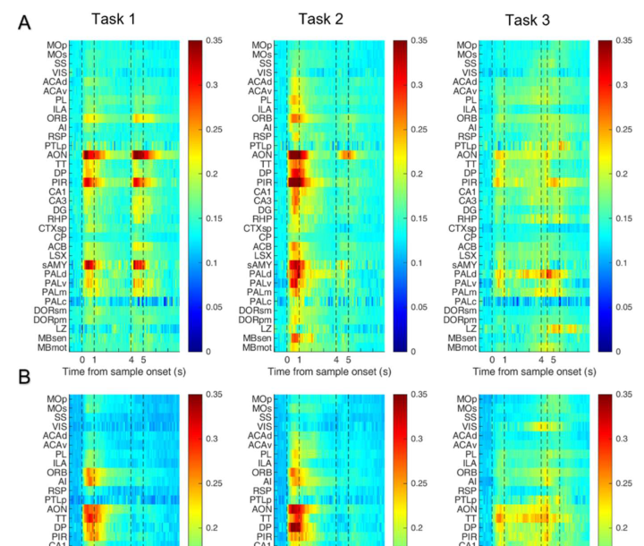

图 3-18 在不同行为阶段中样本信息的任务特异性全脑编码模式

Figure 3-18 Task-dependent brain-wide encoding pattern for sample information during different behavioral stages

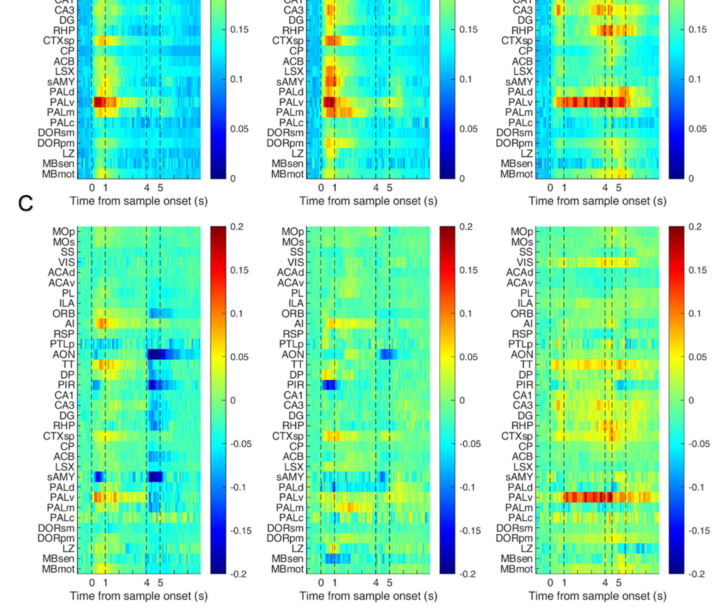

注： (A) 该热图展示了在学习阶段任务 1（左图）、任务 2（中图）以及任务 3（右图） 中，全脑多个区域对样本气味信息的编码强度。X 轴表示从样本气味释放开始的

时间（秒），Y 轴列出了不同的脑区。颜色条表示编码强度，其中红色表示较高的 编码强度，蓝色表示较低的编码强度。(B) 该热图展示了在学会阶段任务 1（左图）、 任务 2（中图）以及任务 3（右图）中，全脑多个区域对样本气味信息的编码强度。 X 轴表示从样本气味释放开始的时间（秒），Y 轴列出了不同的脑区。颜色条表示 编码强度，其中黄色表示较高的编码强度，蓝色表示较低的编码强度。该热图展示 了在学习阶段任务 1（左图）、任务 2（中图）以及任务 3（右图）中，全脑多个区 域对样本气味信息的编码强度。X 轴表示从样本气味释放开始的时间（秒），Y 轴 列出了不同的脑区。颜色条表示编码强度，其中黄色表示较高的编码强度，蓝色表 示较低的编码强度。(C) 该热图展示了在任务 1（左图）、任务 2（中图）以及任务 3（右图）中，在学会阶段和学习阶段全脑多个区域对样本气味信息的编码强度差 异。X 轴表示从样本气味释放开始的时间（秒），Y 轴列出了不同的脑区。颜色条 表示编码差异大小，其中红色表示学会阶段编码能力高于学习阶段，蓝色学会阶 段编码能力低于学习阶段。

(A) The heatmap illustrates the encoding strength of sample odor information across various brain regions in Task 1 (left figure), Task 2 (middle figure) and Task 3 (right figure) during the learning stage. The X-axis represents time in seconds from the onset of odor sample release, and the Y-axis lists different brain areas. The color bar indicates the level of encoding strength, with red representing higher encoding strength and blue representing lower encoding strength. (B) The heatmap illustrates the encoding strength of sample odor information across various brain regions in Task 1 (left figure), Task 2 (middle figure) and Task 3 (right figure) during the expert stage. The X-axis represents time in seconds from the onset of odor sample release, and the Y-axis lists different brain areas. The color bar indicates the level of encoding strength, with yellow representing higher encoding strength and blue representing lower encoding strength. (C) This heatmap illustrates the difference in encoding strength of sample odor information across various brain regions between the expert stage and the learning stage in Task 1 (left figure), Task 2 (middle figure) and Task 3 (right figure). The X-axis represents time in seconds from the onset of odor sample release, and the Y-axis lists different brain areas. The color bar indicates the level of encoding strength, with red representing that the encoding ability during the expert stage is higher than during the learning stage and blue representing the encoding ability during the expert stage is lower than during the learning stage.

根据 Allen CCFv3 我们对之前脑区进行了重新分类，按照第 5 级脑区标准分 为新皮层（isocortex）、嗅觉区域（olfactory area）、海马区域（hippocampal area）、 皮质底板（cortical subplate）、纹状体（striatum）、苍白球（pallidum）、丘脑（thalamus）、 下丘脑（hypothalamus）和中脑（midbrain）九个区域。 可以看到在学习阶段整 体来看编码能力最强的是嗅觉区域，同时纹状体和苍白球也有较高编码能力，与 在图 3-18 中的发现一致。

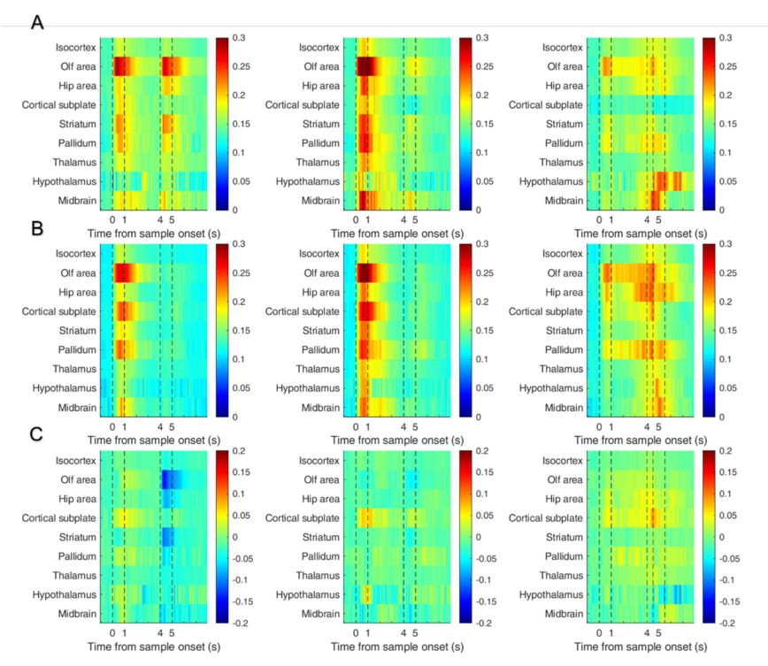

图 3-19 不同行为阶段中样本信息的任务特异性全脑编码模式（第 5 级脑区）

Figure 3-19 Task-dependent brain-wide encoding pattern for sample information in learning stage （ level 5 ）

注： (A) 该热图展示了在学习阶段任务 1（左图）、任务 2（中图）以及任务 3（右图） 中，全脑多个区域对样本气味信息的编码强度。脑区分类参考 Allen CCFv3 第 5 级 别脑区。 (B) 该热图展示了在学会阶段任务 1（左图）、任务 2（中图）以及任务 3（右图）中，全脑多个区域对样本气味信息的编码强度。(C) 该热图展示了在任 务 1（左图）、任务 2（中图）以及任务 3（右图）中，在学会阶段和学习阶段全脑 多个区域对样本气味信息的编码强度差异。

(A) The heatmap illustrates the encoding strength of sample odor information across various brain regions in Task 1 (left figure), Task 2 (middle figure) and Task 3 (right figure) during the learning stage. Brain region classification refers to the Level 5 brain regions from the Allen CCFv3. (B) The heatmap illustrates the encoding strength of sample odor information across various brain regions in Task 1 (left figure), Task 2 (middle figure) and Task 3 (right figure) during the expert stage. (C) This heatmap illustrates the difference in encoding strength of sample odor information across various brain regions between the expert stage and the learning stage in Task 1 (left figure), Task 2 (middle figure) and Task 3 (right figure).

## 3.3.8 单个眶额叶皮层神经元对样本信息存在任务泛化性编码

上面一节分析结果表明，全脑对于样本信息的编码，在不同行为阶段（学习 阶段和学会阶段）呈现出任务特异性表征模式或是任务结构特异性泛化表征模式， 接下来本研究进一步对这种泛化编码现象展开分析。之前结果表明眶额叶皮层神 经元对样本气味信息具有不同类型的任务特异性神经表征（图 3-7），那么单个神 经元是否也具有泛化性表征样本信息的能力呢？结果表明，单个眶额叶皮层神经 元可以对样本信息表现出任务泛化性选择放电模式（图 3-20 B, D）。同时这种神 经表征存在任务动态以及个体差异，可以看到示例神经元#232 在任务 1 和任务 2 样本阶段均表现出对 sample 2 的选择性放电同时在测试阶段均表现出对 sample 1 的选择性放电，相反在任务 3 中则表现出只在样本及延迟阶段对于 sample 1 的 选择性放电；示例神经元#324 在任务 1、任务 2 和任务 3 中均表现出在样本及部 分延迟阶段对于 sample 1 的选择性放电。综上，单个眶额叶可以对样本信息进行 不同类型的泛化神经表征（generalized neural representation）。

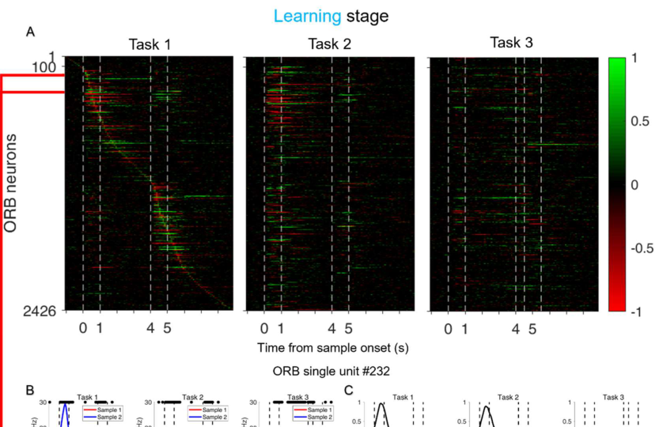

图 3-20 在学习阶段单个眶额叶皮层神经元在不同任务中呈现泛化性样本信息编码

Figure 3-20 Single orbitofrontal cortex neurons exhibit generalized sample information encoding across different tasks during the learning stage

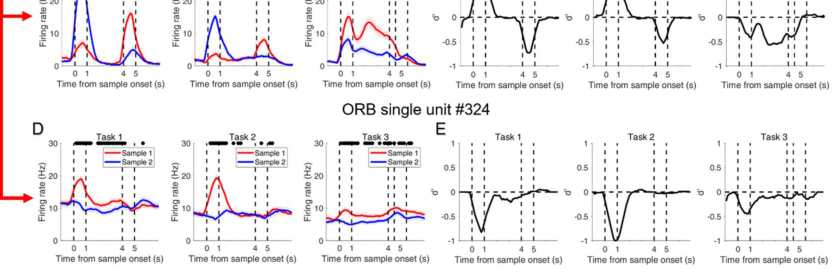

注： (A) 在学习阶段眶额叶皮层所有神经元在任务 1、任务 2 以及任务 3 不同时间窗口 对于样本信息的编码能力。每一行代表一个眶额叶皮层神经元，每一列为单个神 经元在任务中每个时间窗口（每个时间窗口为 100 毫秒）对于不同样本气味的选 择性参数 d’。三个任务中神经元均按照其在任务 1 中的样本选择性参数绝对值峰 值的时间排序。(B) 单个眶额叶皮层单示例神经元（#232）在任务 1、任务 2 和任 务 3 中不同样本气味测试中的平均原始放电率。蓝色代表所有样本气味为 sample 1 的测试，红色代表所有样本气味为 sample 2 的测试，X 轴表示从样本气味释放 开始的时间（秒），Y 轴代表神经元放电率（赫兹）。图像上方每个黑色点代表该时 间窗口下 sample 1 测试平均放电率与 sample 2 测试平均放电率存在显著性差异 (Mann-Whitney U 检验，p < 0.05)。(C) 眶额叶皮层单个神经元（#232）在不同任 务中不同时间节点对样本气味信息的编码能力，X 轴表示从样本气味释放开始的 时间，Y 轴表示 d’，其值分布范围为-1 到 1（-1 表示对 sample 2 具有很高的编码 能力，而 1 表示对 sample 1 具有很高的编码能力。(D) 单个眶额叶皮层单示例神 经元（#324）在任务 1、任务 2 和任务 3 中不同样本气味测试中的平均原始放电 率。(E) 眶额叶皮层单个神经元（#324）在不同任务中不同时间节点对样本气味信 息的编码能力。

(A) The encoding ability of all neurons in the orbitofrontal cortex for sample information in different time windows for Task 1, Task 2, and Task 3 during the learning stage. Each row represents an orbitofrontal cortex neuron, and each column represents the selectivity parameter d' of a single neuron for different sample odors in each time window (each time window is 100 milliseconds) during the tasks. Neurons in all three tasks are sorted by the timing of the peak of the absolute value of their sample selectivity parameter in Task 1. (B) The average raw firing rate of a single neuron in the orbitofrontal cortex (#232) in different sample odor trials from Task 1, Task 2 and Task 3. Blue represents trials with odor sample 1, and red represents trials with odor sample 2. The X-axis indicates time in seconds from the onset of odor sample presentation, and the Y-axis represents the neuron's firing rate in hertz. Each black dot in the image above represents a significant difference in average firing rates between trials with sample 1 and sample 2 at that time window (Mann-Whitney U test with a p < 0.05). (C) The ability of a single neuron (#232) in the orbitofrontal cortex to encode the sample odor information at different time windows in different tasks, the X-axis represents the time from the sample odor onset, and the Y-axis represents dprime (d’), whose value distribution ranges from -1 to 1 (-1 indicates a high encoding ability for sample 2, while 1 indicates a high encoding ability for sample 1). (C) The average raw firing rate of a single neuron (#324) in the orbitofrontal cortex in different sample odor trials from Task 1, Task 2 and Task 3. The average raw firing rate of a single neuron in the orbitofrontal cortex in different sample odor trials from Task 1, Task 2 and Task 3. (D) The ability of a single neuron (#324) in the orbitofrontal cortex to encode the sample odor information at different time windows in different tasks.

## 3.3.9 眶额叶皮层群体神经元表征在不同任务之间存在任务结构特异性泛化

接下来，本研究从群体神经元角度来看这种泛化表征模式是如何体现的—— 通过以相同的序列呈现群体神经元在不同任务下的样本选择性参数 d’的动态变

化，从而观察群体神经元跨任务泛化表征的基本模式。首先，本研究通过对神经 元在任务 1 中的 d’绝对值峰出现的时间从前往后排列所有神经元（图 3-21 A， 左），然后以相同的序列来呈现同一群神经元在任务 2 和任务 3 中的编码特性（图 3-21 A，中，右）。用相同的方法，首先通过排序神经元在任务 2（图 3-21 B）或 任务 3（图 3-21 C）中神经元群体的编码时相，然后以相同的序列呈现同一群神 经元在另外两种任务中的编码特性。

从整体来看，当跨任务排序时群体神经元所存在的从样本到测试阶段的编码 轨迹（encoding trace）有所打断，例如图 3-21 A 中间图所示（任务 1 排序应用 于任务 2 编码）延迟期本来存在连续的编码时间窗口现在打乱了，表明群体神经 元这对于这种与时间或者说任务进程相关（工作记忆部分相关）信息的编码在不 同任务中存在着重组织（reorganization）。之前 Havery 等人发现顶叶皮层群体神 经元次序性神经活动（sequential neural activity）随着时间的推移存在重组织 （Driscoll et al., 2017），而在这里本研究发现眶额叶皮层群体神经元在同一阶段 （学习阶段）不同任务中也存在对神经元的重组织，这说明对于时间这一类较为 精细的任务相关信息的编码群体神经元采取了更为特异的编码方式（即在不同情 景对神经元进行重组织来负责编码）。从局部入手，本研究发现虽然编码轨迹被 打乱，但是在样本阶段还是表现出样本信息的泛化性编码（图 3-21 A 中间图）。 同时这种泛化性编码现象是任务结构特异性的，即只存在任务 1 和任务 2 之间， 在任务 1 和任务 3（图 3-21 A 右图）以及任务 2 和任务 3（图 3-21 B 右图）则 没有体现。

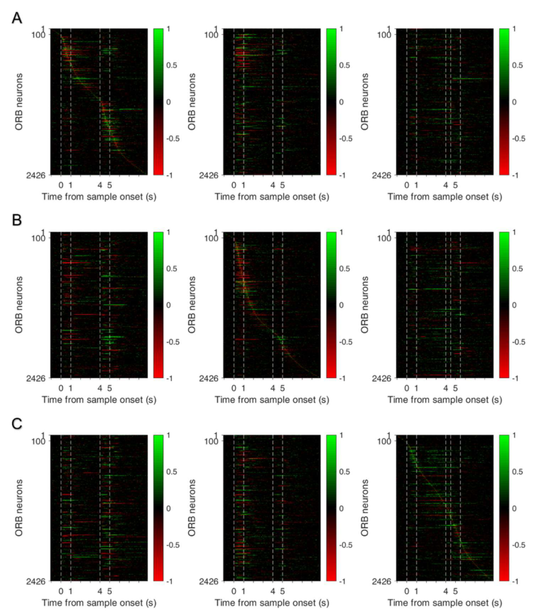

图 3-21 在学习阶眶额叶皮层神经元的整体跨任务编码表现

Figure 3-21 The overall cross-task encoding performance of orbitofrontal cortex neurons

during the learning stage

注： (A) 在学习阶段眶额叶皮层所有神经元在任务 1、任务 2 以及任务 3 不同时间窗口 对于样本信息的编码能力。每一行代表一个眶额叶皮层神经元，每一列为单个神 经元在任务中每个时间窗口对于不同样本气味的选择性参数 d’。三个任务中神经 元均按照其在任务 1 中的样本选择性参数绝对值峰值的时间排序。(B) 在学习阶 段眶额叶皮层所有神经元在不同任务中不同时间窗口对于样本信息的编码能力。 三个任务中神经元均按照其在任务 2 中的样本选择性参数绝对值峰值的时间排序。 (C) 在学习阶段眶额叶皮层所有神经元在不同任务中不同时间窗口对于样本信息 的编码能力。三个任务中神经元均按照其在任务 3 中的样本选择性参数绝对值峰 值的时间排序。
(A) The encoding ability of all neurons in the orbitofrontal cortex for sample information in different time windows for Task 1, Task 2, and Task 3 during the learning stage. Each row represents an orbitofrontal cortex neuron, and each column represents the selectivity parameter d' of a single neuron for different sample odors in each time window during

the tasks. Neurons in all three tasks are sorted by the timing of the peak of the absolute value of their sample selectivity parameter in Task 1. (B) The encoding ability of all neurons in the orbitofrontal cortex for sample information in different time windows for three tasks during the learning stage. Neurons in all three tasks are sorted by the timing of the peak of the absolute value of their sample selectivity parameter in Task 2. (C) The encoding ability of all neurons in the orbitofrontal cortex for sample information in different time windows for three tasks during the learning stage. Neurons in all three tasks are sorted by the timing of the peak of the absolute value of their sample selectivity parameter in Task 3.

为了定量分析这种任务结构特异性泛化编码模式，本研究对眶额叶群体神经 元在学习阶段不同任务中的动态编码能力进行了线性相关性分析，即分别对任务 1 和任务 2、任务 2 和任务 3 以及任务 1 和任务 3 选择性参数 d’之间计算皮尔逊 相关系数（pearson correlation coefficient）。可以看到在学习阶段，眶额叶皮层神 经元编码能力在任务 1 和任务 2 之间存在两个阶段的显著性相关（双边检验，p < 0.001），即在样本及部分延迟阶段和测试阶段表现出较强的相关性（图 3-22 A）。 与之前观察跨任务编码模式（图 3-21 A）所得结论一致，群体神经元编码在任务 1 和任务 2 之间存在线性相关性，相反在任务 2 和任务 3 或是任务 1 和任务 3 之 间则没有显著相关性（样本到测试阶段）。

另外有意思的一点是，本研究发现眶额叶神经元在任务 1 中测试阶段的样本 信息编码能力与任务 2 中样本阶段的样本信息编码能力呈负相关（相关系数小于 0）而相反在任务 1 中样本阶段与任务 2 中测试阶段中的编码则不相关（图 3-18 A）。这说明学习阶段眶额叶群体神经元在任务 1 中样本阶段和测试阶段对样本 信息的编码差异很大，而在任务 2 中则差异不大。而同时因为群体神经元在任务 1 样本阶段的编码与任务 2 样本阶段的编码具有相关性，致使其在任务 1 测试阶 段对于样本信息的编码与任务 2 样本阶段的样本信息编码形成了负相关。

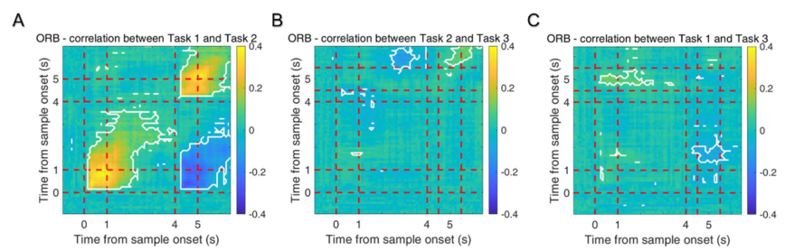

图 3-22 在学习阶段眶额叶皮层神经元对样本信息的编码能力在不同任务间的相关性分析

Figure 3-22 Correlation analysis of the encoding ability of orbitofrontal cortex neurons for sample information across different tasks during the learning stage

注： (A) 在学习阶段眶额叶皮层神经元在任务 1 与任务 2 中的编码能力的相关性。颜 色条表示相关系数的大小，从 0（无相关性，蓝色）到 0.4（强相关性，黄色）。白 色线条圈出来的区域表示具有统计显著性的相关性（双边检验，p < 0.001）。(B) 在

学习阶段眶额叶皮层神经元在任务 2 与任务 3 中的编码能力的相关性。(C) 在学 习阶段眶额叶皮层神经元在任务 1 与任务 3 中的编码能力的相关性。 (A) The correlation between the encoding ability of the orbitofrontal cortex neurons for sample information in Task 1 and Task 2 during the learning stage. The color bar indicates the magnitude of the correlation coefficient, ranging from 0 (no correlation, blue) to 0.4 (stronger correlation, yellow). The regions enclosed by white lines denote statistically significant correlations (two-tailed test, p < 0.001). (B) The correlation between the encoding ability of the orbitofrontal cortex neurons for sample information in Task 2 and Task 3 during the learning stage.  (C) The correlation between the encoding ability of the orbitofrontal cortex neurons for sample information in Task 1 and Task 3 during the learning stage.

为了进一步探究学习阶段眶额叶群体神经元在不同任务中对样本信息编码 的相关性，本研究对眶额叶皮层神经元在每个任务中的编码能力进行了自相关分 析（autocorrelation analysis）。分析结果表明，在任务 1 中，在样本到延迟阶段以 及测试阶段，群体神经元展现出稳定的编码表现，即这两个阶段中群体神经元的 编码具有高度相关性（图 3-23 B，其中对角线上的相关性最高）。此外，延迟阶 段距离对角线越远，相关性越低，这表明样本及延迟早期阶段与延迟晚期阶段的 编码存在差异。值得注意的是，样本阶段编码与测试阶段编码呈现负相关，这暗 示群体神经元在这两个阶段对样本信息的编码存在反转（即由偏好 S1 转变成偏 好 S2，或反过来），以及这两个阶段的神经元编码活动可能由不同的神经元亚群 负责（与之前三类选择性神经元分析结果类似，图 3-16），显示出相对独立的特 性。而在任务 2 中，眶额叶皮层群体神经元的表现与在任务 1 中类似，但延迟阶 段的稳定编码区域有所减少，这可能是受到了干扰气味的影响。同时，任务 2 中 样本阶段与测试阶段编码的负相关区域也有所减少，这可能跟群体神经元在任务 2 中更少比例地在测试阶段编码样本信息相关（之前对三类选择性神经元的分析 结果显示，在学习阶段任务 2 中，眶额叶皮层中 Group 3 神经元的比例以及平均 编码能力较低（图 3-10 C;图 3-16 C））。最后在群体神经元在任务 3 从样本到测 试阶段中均表现出相对稳定的编码，这表明在任务 3 中，神经元的编码活动在整 个过程中保持了较高的一致性。

总结来看，在学习阶段眶额叶皮层群体神经元在任务结构相似的任务之间 （任务 1 和任务 2）存在泛化性编码（样本及延迟早期和测试阶段编码能力存在 显著相关性）的同时，也存在特异性编码（在任务 1 中样本阶段和测试阶段编码 差异较大而在任务 2 中差异较小，或者可以说在任务 1 和任务 2 测试阶段编码模 式存在差异）。以及在不同结构任务之间（任务 1 和任务 3，任务 2 和任务 3）不 存在泛化编码。

综上推测眶额叶皮层群体神经元在学习阶段可能处于一种高度动态的调整 和重组状态，这种动态变化体现在不同任务的编码模式之间存在显著差异，暗示 着大脑在任务切换时需要重新配置其神经网络以适应新的任务需求。虽然存在这

种动态调整，本研究也发现在结构相似的任务之间，眶额叶皮层能够保留一部分 核心的神经表征。这表明，尽管大脑需要对不同的任务做出特定的神经响应，但 它也能够在相似任务之间共享和重用某些基本的神经编码机制。这种保留的核心 表征可能构成了不同任务之间转换的基础，使得个体能够更有效地学习和适应新 的任务。

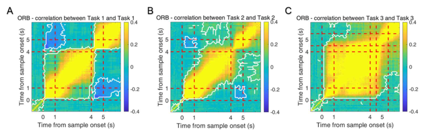

图 3-23 在学习阶段眶额叶皮层神经元对样本信息的编码能力在不同任务中的自相关性分

- 析

Figure 3-23 Autocorrelation analysis of the encoding ability of orbitofrontal cortex neurons for sample information in different task during the learning stage

注： (A) 在学习阶段眶额叶皮层神经元在任务 1 中对样本信息编码能力的自相关性。 颜色条表示相关系数的大小，从 0（无相关性，蓝色）到 0.4（强相关性，黄色）。 白色线条圈出来的区域表示具有统计显著性的相关性（双边检验，p < 0.001）。(B) 在学习阶段眶额叶皮层神经元在任务 2 中对样本信息编码能力的自相关性。(C) 在 学习阶段眶额叶皮层神经元在任务 3 中对样本信息编码能力的自相关性。 (A) The autocorrelation of the encoding ability of the orbitofrontal cortex neurons for sample information within Task 1 during the learning stage. The color bar indicates the magnitude of the correlation coefficient, ranging from 0 (no correlation, blue) to 0.4 (stronger correlation, yellow). The regions enclosed by white lines denote statistically significant correlations (two-tailed test, p < 0.001). (B) The autocorrelation of the encoding ability of the orbitofrontal cortex neurons for sample information within Task 2 during the learning stage. (C) The autocorrelation of the encoding ability of the orbitofrontal cortex neurons for sample information within Task 3 during the learning stage.

## 3.3.10 眶额叶群体神经元表征的任务结构特异性泛化在不同行为阶段存在差异

同样地，本研究也对学会阶段眶额叶群体神经元进行了跨任务编码分析。可 以看到，眶额叶群体神经元整体编码表现出在任务 1 和任务 2 间类似模式，以及 在任务 3 表现出差异化编码模式（图 3-24）。与学习阶段编码模式类似，群体神 经元在任务 1 和任务 2 之间表现出在样本阶段的共享神经表征（shared neural representation）（图 3-24 A 中间图），但在任务 2 和任务 3 或者任务 1 和任务 3 之 间则没有。与学习阶段不同的是，学会阶段眶额叶皮层群体神经元在测试阶段并 没有体现出对于样本信息的编码同时在任务 1 和任务 2 之间也没有表现出泛化 80

## 性编码。

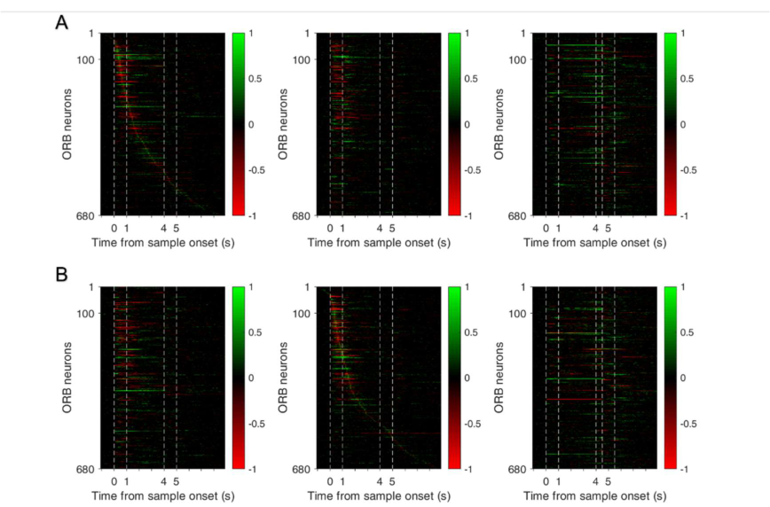

图 3-24 在学会阶眶额叶皮层神经元的整体跨任务编码表现 during the learning stage

Figure 3-24 The overall cross-task encoding performance of orbitofrontal cortex neurons

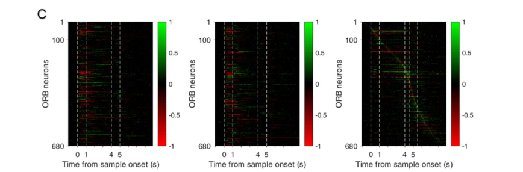

注： (A) 在学会阶段眶额叶皮层所有神经元在任务 1、任务 2 以及任务 3 不同时间窗口 对于样本信息的编码能力。每一行代表一个眶额叶皮层神经元，每一列为单个神 经元在任务中每个时间窗口对于不同样本气味的选择性参数 d’。三个任务中神经 元均按照其在任务 1 中的样本选择性参数绝对值峰值的时间排序。(B) 在学会阶 段眶额叶皮层所有神经元在不同任务中不同时间窗口对于样本信息的编码能力。 三个任务中神经元均按照其在任务 2 中的样本选择性参数绝对值峰值的时间排序。 (C) 在学会阶段眶额叶皮层所有神经元在不同任务中不同时间窗口对于样本信息 的编码能力。三个任务中神经元均按照其在任务 3 中的样本选择性参数绝对值峰 值的时间排序。
(A) The encoding ability of all neurons in the orbitofrontal cortex for sample information in different time windows for Task 1, Task 2, and Task 3 during the expert stage. Each row represents an orbitofrontal cortex neuron, and each column represents the selectivity

parameter d' of a single neuron for different sample odors in each time window during the tasks. Neurons in all three tasks are sorted by the timing of the peak of the absolute value of their sample selectivity parameter in Task 1. (B) The encoding ability of all neurons in the orbitofrontal cortex for sample information in different time windows for three tasks during the expert stage. Neurons in all three tasks are sorted by the timing of the peak of the absolute value of their sample selectivity parameter in Task 2. (C) The encoding ability of all neurons in the orbitofrontal cortex for sample information in different time windows for three tasks during the expert stage. Neurons in all three tasks are sorted by the timing of the peak of the absolute value of their sample selectivity parameter in Task 3.

接下来，本研究对学会阶段眶额叶皮层群体神经元在不同任务间（任务 1 和 任务 2，任务 2 和任务 3，任务 1 和任务 3）的编码能力做相关性分析，以及对 同一任务的编码能力做自相关分析。结果显示，学会阶段眶额叶皮层群体神经元 表现出在任务 1 和任务 2 之间只在样本及延迟早期阶段编码区域的显著相关性 （测试阶段没有显著性相关区域，双边检验，p < 0.001）。相比于学习阶段（群体 编码能力在测试阶段也具有泛化现象），学会阶段的群体编码能力的泛化则主要 集中在样本期及延迟期的早期阶段（图 3-25 A）。而具有不同结构的任务之间则 与学习阶段一致均没有编码能力的泛化现象。同时自相关性分析结果显示在学会 阶段编码更为一致，即群体神经元在任务 1 和任务 2 样本阶段和测试阶段编码不 具有相关性（相比学习阶段存在负相关），以及在任务 1 和任务 2 中样本阶段和 延迟阶段均相对稳定（其中任务 2 中编码相比任务 1 中有衰减，与学习期一致）。

结合之前学习阶段的结果，本研究发现在行为更为稳定即学会阶段群体神经 元的编码活动展现出更加一致性的特征，这表明群体神经元可能在经过训练并掌 握特定任务相关信息后，其神经网络的激活模式趋于稳定和优化。这种一致性可 能反映了神经元之间协同作用的加强，以及神经网络对任务要求的适应和精细化 调整。同时，行为阶段的变化还带来了群体神经元编码模式上的调整。这意味着 神经元群体在处理信息时的策略发生了变化，它们可能发展出新的或更有效的编 码方式来应对任务需求。这种调整可能涉及到神经元激活的时序、强度或空间分 布的变化，从而使得神经网络能够更加精确和高效地处理相关信息。总的来说， 学习不仅增强了群体神经元编码的一致性，还促使编码模式根据任务的特性进行 了相应的调整。这种动态的神经可塑性是大脑适应性学习和记忆形成的基础，它 使得个体能够更好地适应环境变化，掌握新技能，并提高认知能力。

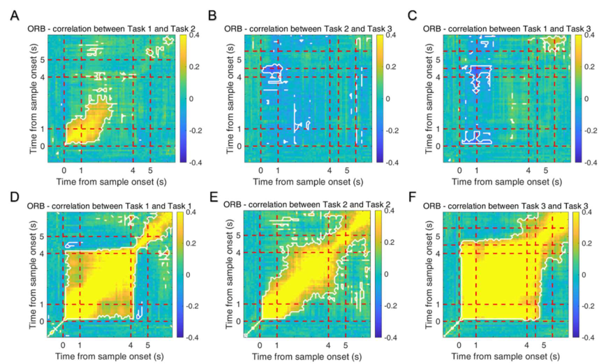

Figure 3-25 Correlation and autocorrelation analysis of the encoding ability of orbitofrontal cortex neurons for sample information across different tasks and in same task during the expert stage

注： (A) 在学会阶段眶额叶皮层神经元在任务 1 与任务 2 中的编码能力的相关性。颜 色条表示相关系数的大小，从 0（无相关性，蓝色）到 0.4（强相关性，黄色）。白 色线条圈出来的区域表示具有统计显著性的相关性（双边检验，p < 0.001）。(B) 在 学会阶段眶额叶皮层神经元在任务 2 与任务 3 之间的编码能力的相关性。(C) 在 学会阶段眶额叶皮层神经元在任务 1 与任务 3 之间的编码能力的相关性。(D) 在 学会阶段眶额叶皮层神经元在任务 1 中对样本信息编码能力的自相关性。(E) 在 学会阶段眶额叶皮层神经元在任务 2 中对样本信息编码能力的自相关性。(F) 在学 会阶段眶额叶皮层神经元在任务 3 中对样本信息编码能力的自相关性。

(A) The correlation between the encoding ability of the orbitofrontal cortex neurons for sample information in Task 1 and Task 2 during the expert stage. The color bar indicates the magnitude of the correlation coefficient, ranging from 0 (no correlation, blue) to 0.4 (stronger correlation, yellow). The regions enclosed by white lines denote statistically significant correlations (two-tailed test, p < 0.001). (B) The correlation between the encoding ability of the orbitofrontal cortex neurons for sample information in Task 2 and Task 3 during the expert stage. (C) The correlation between the encoding ability of the orbitofrontal cortex neurons for sample information in Task 1 and Task 3 during the expert stage. (D) The autocorrelation of the encoding ability of orbitofrontal cortex neurons for sample information within Task 1 during the expert stage. (E) The autocorrelation of the encoding ability of orbitofrontal cortex neurons for sample information within Task 2 during the expert stage. (F) The autocorrelation of the encoding ability of orbitofrontal cortex neurons for sample information within Task 3 during the expert stage.

## 3.3.11 群体神经元编码的任务结构依赖的泛化能力存在脑区差异

同样本研究也对前嗅核群体神经元在不同行为阶段下对样本信息的编码能 力在不同任务之间（任务 1 和任务 2、任务 2 和任务 3、任务 1 和任务 3）的相 关性以及相同任务中的自相关进行了探究，结果显示前嗅核同样存在对于样本信 息的任务间泛化性编码（图 3-26 A），并且这种任务之间的共享神经表征也存在 行为阶段的差异（图 3-26 B）。但与眶额叶皮层在学习阶段的群体泛化性神经表 征不同的是，学习阶段前嗅核群体神经元对样本信息的编码能力呈现出在测试阶 段极高的任务间相关性，同时这种相关性除了在任务 1 和任务 2 之间存在（任务 结构相同）也在任务 1 或任务 2 和任务 3 之间少量分布（任务结构不同）。而在 学会阶段前嗅核群体神经元在样本以及测试阶段表现出对样本信息的泛化编码 能力（但测试阶段编码能力相关性有所降低），同时这种表现具有任务结构特异 性（只在任务 1 和任务 2 编码能力之间有相关性）。另外，对不同行为阶段前嗅 核群体神经元对样本信息编码能力进行自相关性分析后，结果显示在学习阶段只 有在任务 2 中样本阶段编码能力与测试阶段存在负相关。与眶额叶皮层自相关分 析结果对比可以发现，这两个脑区在学习阶段存在动态编码差异，而在学会阶段 则编码趋于一致。综上，本研究发现群体神经元在不同任务间的样本信息泛化性 编码存在任务结构依赖性以及脑区差异性，但是这种跨任务编码能力随着行为阶 段的切换（从学习阶段到学会阶段）表现出不同脑区趋于一致的模式。

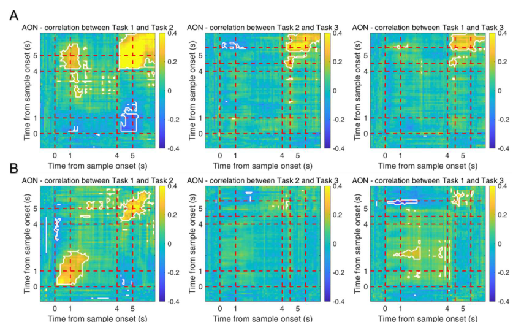

图 3-26 在不同行为阶段前嗅核神经元在不同任务中对样本信息的编码能力之间的相关性 和在相同任务中编码能力的自相关性分析

Figure 3-26 The analysis of the correlation between the encoding ability of the anterior olfactory nucleus neurons for sample information between different tasks and the autocorrelation of encoding ability within the same task during different behavioral stages 注： (A) 在学习阶段前嗅核神经元在任务 1 与任务 2（左图）、任务 2 与任务 3（中图） 以及任务 1 和任务 3（右图）中的编码能力在不同时间窗口的相关性。颜色条表示 相关系数的大小，从 0（无相关性，蓝色）到 0.4（强相关性，黄色）。白色线条圈 出来的区域表示具有统计显著性的相关性（双边检验，p < 0.001）。(B) 在学会阶 段前嗅核神经元在任务 1 与任务 2（左图）、任务 2 与任务 3（中图）以及任务 1 和 任务 3（右图）中的编码能力在不同时间窗口的相关性。 (C) 在学习阶段前嗅核

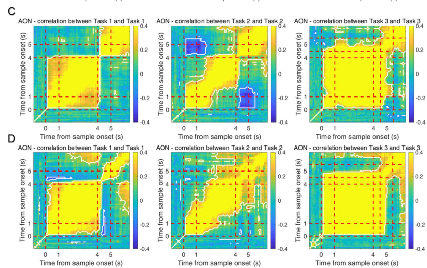

神经元在任务 1（左图）、任务 2（中图）以及任务 3（右图）中对样本信息编码能 力的自相关性。(D) 在学会阶段前嗅核神经元在任务 1（左图）、任务 2（中图）以 及任务 3（右图）中对样本信息编码能力的自相关性。

(A) The correlation between the encoding ability of the anterior olfactory nucleus neurons for sample information in Task 1 and Task 2 (left figure), Task 2 and Task 3 (middle figure) and Task 1 and Task 3 (right figure) during the learning stage. The color bar indicates the magnitude of the correlation coefficient, ranging from 0 (no correlation, blue) to 0.4 (stronger correlation, yellow). The regions enclosed by white lines denote statistically significant correlations (two-tailed test, p < 0.001). (B) The correlation between the encoding ability of the anterior olfactory nucleus neurons for sample information in Task 1 and Task 2 (left figure), Task 2 and Task 3 (middle figure) and Task 1 and Task 3 (right figure) during the expert stage. (C) The autocorrelation of the encoding ability of the anterior olfactory nucleus neurons for sample information within Task 1 (left figure), Task 2 (left figure) and Task 3 (left figure) during the learning stage. (D) The autocorrelation of the encoding ability of the anterior olfactory nucleus neurons for sample information within Task 1 (left figure), Task 2 (left figure) and Task 3 (left figure) during the expert stage.

为了更直接地对比眶额叶皮层和前嗅核群体神经元编码的任务结构依赖的 泛化能力差异，本研究在分别得到两个脑区群体神经元编码能力在不同任务之间 的相关性矩阵后，提取该矩阵的对角线值（对角线的值代表两个任务中编码能力 在任务测试相同时间窗口中的相关性系数）作为比较两个脑区之间编码能力泛化 性差异的参考。图 3-27 所示为眶额叶皮层和前嗅核群体神经元在任务 1 和任务 2 之间的编码能力相关性的对比，以及这种相关性在不同行为阶段（学习阶段和 学会阶段）的差异。可以看到在眶额叶皮层，群体神经元在学习阶段表现出在样 本及测试阶段较高的泛化编码能力，而在学会阶段则只在样本阶段具有泛化编码 同时样本及延迟早期表现出一定程度上的能力提升。相比之下，前嗅核群体神经 元在学习阶段只表现出测试阶段的泛化性编码（比眶额叶皮层能力更强），而学 会阶段则在样本阶段表现出泛化编码的能力同时测试阶段编码有所下降。

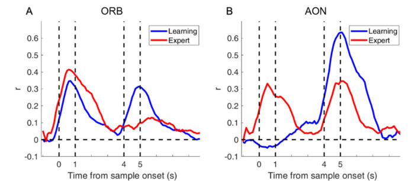

图 3-27 在不同行为阶段任务 1 和任务 2 中眶额叶皮层和前嗅核神经元对样本信息编码能 力之间的相关性矩阵的对角线值

Figure 3-27 Diagonal values of the correlation matrix between the encoding abilities of orbitofrontal cortex neurons for Task 1 and Task 2 during different behavioral stages

注： (A) 在不同行为阶段眶额叶皮层神经元在任务 1 与任务 2 之间的编码能力的相关 性矩阵对角值。蓝色代表学习阶段数据，红色代表学会阶段数据。(B) 在不同行为 阶段前嗅核神经元在任务 1 与任务 2 之间的编码能力的相关性矩阵对角值。 (A) The correlation of encoding ability between Task 1 and Task 2 of the orbitofrontal cortex neurons during different stages. Blue line represents data from the learning stage, and red line represents data from the expert stage. (B) The correlation of encoding ability between Task 1 and Task 2 of the anterior olfactory nucleus cortex neurons during different stages.

## 3.3.12 全脑不同脑区在不同行为阶段对样本信息的编码在不同任务之间泛化的 差异

进一步为了探究全脑尺度下不同脑区泛化性编码表征差异，本研究通过提取 不同脑区群体神经元编码能力在不同任务间（任务 1 和任务 2，任务 2 和任务 3， 以及任务 1 和任务 3）的相关性矩阵对角线值，来对多个脑区群体样本信息编码 在不同任务之间相关性进行分析，并得到了全脑编码能力在不同任务之间的泛化 强度热图（图 3-28）。整体来看，与单一脑区结果类似，全脑同样表现出广泛的 任务结构特异性泛化表征，即多个脑区编码能力在任务 1 和任务 2 之间存在相关 性（图 3-28 A）同时在任务 1 或任务 2 与任务 3 之间很少有相关性（图 3-28 B, C）。此外，与学习阶段相比，在学会阶段全脑各脑区群体神经元对样本信息的泛 化编码能力存在模式上（与全脑在不同行为阶段对样本信息的编码能力差异一致， 即测试阶段编码能力的大幅下降）以及强度上（更多的脑区在样本阶段表现出跨 任务编码能力）的差异。

综上，本研究发现这种对于样本信息的任务结构特异性泛化编码能力在全脑 广泛存在，同时随着行为阶段的切换（从学习阶段到学会阶段）呈现出更为一致 （相比学习阶段有的脑区只在测试阶段有泛化编码表现，有的脑区只在样本阶段 或是两个阶段均有跨任务编码能力的体现）且整体强度更高的编码模式。

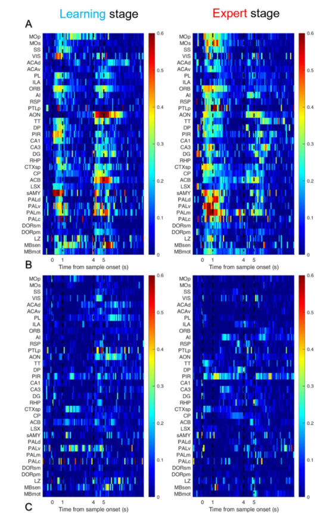

Figure 3-28 Diagonal values of the correlation matrix of the encoding ability of whole-brain neurons for sample information between different tasks during different stages

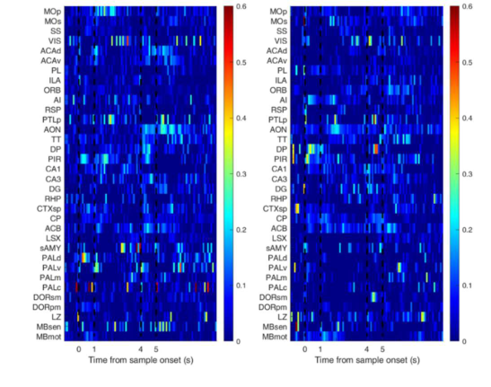

Figure 3-28 Diagonal values of the correlation matrix of the encoding ability of whole-brain neurons for sample information between different tasks during different stages

注： (A) 该热图展示了在学习阶段（左图）和学会阶段（右图）中，全脑多个区域在任 务 1 和任务 2 中样本信息编码能力之间相关性矩阵的对角线值。X 轴表示从样本 气味释放开始的时间（秒），Y 轴列出了不同的脑区。颜色条表示编码强度，其中 红色表示较高的编码强度，蓝色表示较低的编码强度。(B) 该热图展示了在学习阶 段（左图）和学会阶段（右图）中，全脑多个区域在任务 2 和任务 3 中样本信息 编码能力之间相关性矩阵的对角线值。(C) 该热图展示了在学习阶段（左图）和学 会阶段（右图）中，全脑多个区域在任务 1 和任务 3 中样本信息编码能力之间相 关性矩阵的对角线值。

(A) The heatmap illustrates the diagonal values of the correlation matrix between the encoding ability of sample information in Task 1 and Task 2 across multiple brain regions during the learning stage (left figure) and the expert stage (right figure). The X-axis represents time in seconds from the onset of odor sample release, and the Y-axis lists different brain areas. The color bar indicates the level of encoding strength, with red representing higher encoding strength and blue representing lower encoding strength. (B) The heatmap illustrates the diagonal values of the correlation matrix between the encoding ability of sample information in Task 2 and Task 3 across multiple brain regions during the learning stage (left figure) and the expert stage (right figure). (C) The heatmap illustrates the diagonal values of the correlation matrix between the encoding ability of sample information in Task 1 and Task 3 across multiple brain regions during the learning stage (left figure) and the expert stage (right figure).

## 3.4 全脑神经元表现出对样本信息的差异化跨任务解码模式

## 3.4.1 群体神经元在不同行为阶段不同任务中对样本信息的差异化解码表现

在前面的探究中本研究通过计算群体神经元对于不同样本气味的选择性定 量分析了其在不同任务中对于样本信息的编码能力，发现了全脑多个区域在不同 行为阶段表现出对样本信息任务特异性以及任务泛化性的编码模式，之后又使用 皮尔逊相关性分析（pearson correlation analysis）以及自相关性分析（autocorrelation analysis）对群体神经元在不同任务中编码能力的线性相关性以及编码一致性进 行了细致研究。接下来进一步通过交叉验证（cross-validated）的线性分类分析 （linear classification）方法，即利用支持向量机（support vector machine, SVM） 来训练对于样本信息的分类器来对群体神经元的任务内（within-task）（Pagan et al., 2013; Duan et al., 2021）和跨任务（cross-task）（Zhou et al., 2021; Tafazoli et al, 2024）解码能力进行分析。在这里，我们同样从眶额叶皮层入手来逐步深入探究 全脑模式。

之前提到多个脑区在学习阶段和学会阶段采样神经元数量不同，为了之后对 比两个行为阶段下群体神经元的解码能力差异，本研究在计算时选两个阶段神经 元数的最小值作为假群体（pseudo population），例如眶额叶皮层神经元（学习阶 段/学会阶段：2416/680）则采样数为 680（每次循环时随机打乱采样）（Duan et al., 2021）。之后先将眶额叶皮层群体神经元在三个任务中的神经活动分为三个数

据集，再将每个数据集分为训练集和测试集两份（500 次循环，在每个时间窗口 打乱随机提取训练集和测试集，详见 2.3.4），之后分别利用任务中的训练集计算 得到解码器并通过测试集验证解码率（图 3-29）。结果显示在两个行为阶段（学 习阶段和学会阶段）眶额叶皮层群体神经元分别在三个任务（任务 1、任务 2、 任务 3）中都能很好地分辨样本信息，即在整个任务期（从样本阶段开始到测试 阶段再到响应阶段）群体表现都高于偶然水平（chance level）（图 3-29 B, C）。对 比学习阶段不同任务之间的解码表现本研究发现群体神经元在任务 1 和任务 2 中的解码表现类似（趋势一致，即在样本阶段解码能力迅速升至最高之后衰减又 在测试阶段有所回升，之后逐步回到接近偶然水平）同时也存在差异（动态解码 能力差异，即在测试阶段群体神经元在任务 1 中解码能力要高于任务 2 中，与之 前结果一致），在任务 3 中表现则有所不同（解码能力在样本阶段大概到一个峰 值后短时间减少一部分，在延迟期中段到任务结束维持稳定解码能力），表明群 体神经元在任务 1 和 2 中对于样本信息的编码采取了相似的策略，这也与符合之 前发现。同时本研究对不同行为阶段的解码表现（学会阶段表现减去学习阶段表 现）进行比较发现，在任务 1 和任务 2 中样本阶段解码能力没有变化而测试阶段 表现有所减少（图 3-29 D），而在任务 3 延迟阶段解码表现略微有所提高。综上， 本研究通过对群体神经元进行解码分析，发现眶额叶皮层在不同行为阶段任务内 解码表现存在差异，以及在任务结构类似的任务间表现出相似解码趋势，而在不 同结构任务中则解码表现不同。

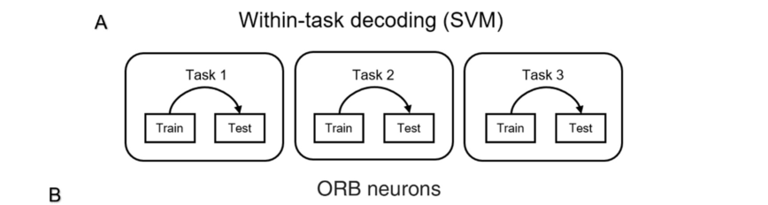

Figure 3-29 The population decoding performance of orbitofrontal cortex neurons for sample information in different tasks during different behavioral stages

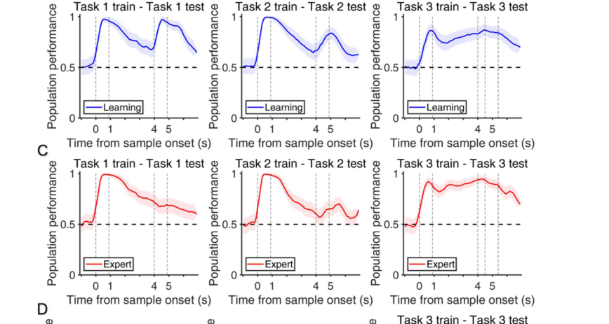

Figure 3-29 The population decoding performance of orbitofrontal cortex neurons for sample information in different tasks during different behavioral stages

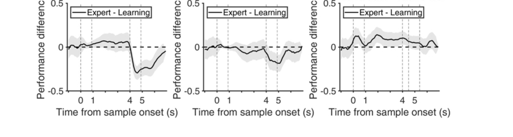

Figure 3-29 The population decoding performance of orbitofrontal cortex neurons for sample information in different tasks during different behavioral stages

注： (A) 利用支持向量机（support vector machine，SVM）来对群体神经元进行解码分 析。示意图为利用任务 1/任务 2/任务 3 训练集计算得到解码器，之后再利用相同 任务中的测试集得到群体解码表现。(B) 眶额叶皮层神经元在学习阶段不同任务 中的群体神经元解码表现。X 轴表示样本气味开始时间，Y 轴表示解码表现。实 线为平均解码表现，阴影为 500 次循环标准误差。(C) 眶额叶皮层神经元在学会阶 段不同任务中的群体神经元解码表现。X 轴表示样本气味开始时间，Y 轴表示解 码表现。(D) 眶额叶皮层神经元在不同行为阶段不同任务中的群体神经元解码表 现差异。X 轴表示样本气味开始时间，Y 轴表示学会阶段群体解码表现减去学习 阶段群体解码表现。
(A) Within-task decoding analysis of population neurons using Support Vector Machine (SVM). The schematic illustrates the process of calculating a decoder using the training

sets from Task 1, Task 2, and Task 3, followed by applying the decoder to the test sets of the same tasks to obtain the population decoding performance. (B) Population decoding performance of the orbitofrontal cortex in different tasks during the learning stage. The X-axis represents the time from the sample odor onset, and the Y-axis represents the decoding performance. (C) Population decoding performance of the orbitofrontal cortex in different tasks during the expert stage. The X-axis represents the time from the sample odor onset, and the Y-axis represents the decoding performance. (D) Difference in population decoding performance of the orbitofrontal cortex across different behavioral stages and tasks. The X-axis represents the time from the onset of the sample odor, and the Y-axis represents the difference in decoding performance between the expert stage and the learning stage.

接下来本研究对眶额叶皮层群体神经元进行了跨时间解码分析（crosstemporal decoding analysis），即通过单一时间窗口获取解码器后再利用剩余其他 窗口依次进行验证（Meyers et al., 2008; Stokes et al., 2013），该方法目的在于观察 群体神经元在一段时间内对于样本信息的编码是否稳定。可以看到在学习阶段和 学会阶段，群体神经元均在任务 3 而不是任务 1 和任务 2 样本到延迟阶段表现出 最为稳定的跨时间解码表征（任务 3 本质上在这个时间段内为纯气味采样）。在 学习阶段相比于任务 1，任务 2 中延迟阶段群体编码稳定性稍差，这表明任务 2 延迟期持续干扰气味的存在一定程度上影响了群体编码的稳定性。在学会阶段这 种差异依然存在，同时可以看到任务 1 和任务 2 中群体跨时间编码稳定性均有所 下降，而任务 3 中则基本没有变化。

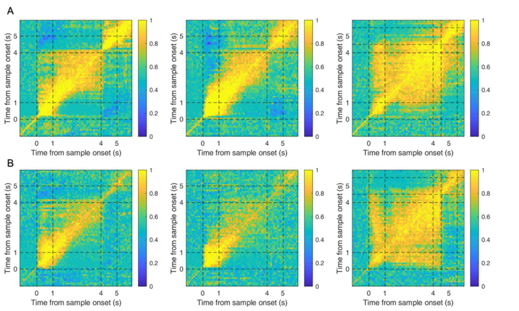

图 3-30 眶额叶皮层神经元在不同行为阶段不同任务中对样本信息的群体跨时间解码表现

Figure 3-30 The population cross-temporal decoding performance of orbitofrontal cortex neurons for sample information in different tasks during different behavioral stage

注： (A) 眶额叶皮层神经元在学习阶段不同任务中的群体神经元跨时间解码表现。X 轴

表示训练集中样本气味开始时间，Y 轴表示测试集中样本气味开始时间。黄色表 示解码表现很高，蓝色表示解码表现很低。(B) 眶额叶皮层神经元在学会阶段不同 任务中的群体神经元跨时间解码表现。

(A) Within-task decoding analysis of population neurons using Support Vector Machine (SVM). The schematic illustrates the process of calculating a decoder using the training sets from Task 1, Task 2, and Task 3, followed by applying the decoder to the test sets of the same tasks to obtain the population decoding performance. (B) Population decoding performance of the orbitofrontal cortex in different tasks during the learning stage. The X-axis represents the time from the sample odor onset, and the Y-axis represents the decoding performance.

## 3.4.2 神经元群体对样本信息的解码与行为之间存在关联

在之前进行的解码分析中，本研究仅使用了正确测试的数据，主要是观察小 鼠在正确回答问题的测试中群体神经元是如何响应以及维持样本信息的。为了进 一步探究群体神经元解码样本信息与小鼠行为之间的联系，本研究引入了错误测 试的数据（即在每次循环中得到解码器后，应用在随机选取的错误集上获得错误 测试中的解码表现）。在样本阶段和延迟阶段，结果表明在学习阶段，眶额叶皮 层神经元在三个任务的错误测试中的解码表现与正确测试的表现没有显著差异 （由于错误集选取的测试数量较少，因此标准误差较大，但解码正确率的均值与 正确测试集相同）。然而，在测试阶段，正确测试和错误测试的解码表现存在很 大差异（如图 3-31 B 所示），并且这种差异仅出现在任务 1 和任务 2 中（任务 2 中的差异小于任务 1，推测可能是受到任务难度或者说延迟阶段持续存在的干扰 气味的影响）。根据之前的发现，这一阶段的样本信息编码可能与信息的提取或 重激活有关，而本研究在这里进一步发现这种编码与行为存在关联，即表明这一 阶段样本信息编码的重要性。另外，与学习阶段相比，在学会阶段，眶额叶皮层 神经元在任务 1 延迟阶段末期在错误测试中的解码表现更低（任务 2 则没有表现 出这种差异），而在测试阶段也有所波动（与学习阶段相比差异很小）。

综上所述，结合对错误测试数据解码分析的结果，本研究发现眶额叶皮层神 经元对样本信息的解码与行为之间存在联系，同时这种相关性表现出任务结构特 异性（在任务 3 中没有体现）以及行为阶段特异性（学习阶段和学会阶段的表现 存在差异）。

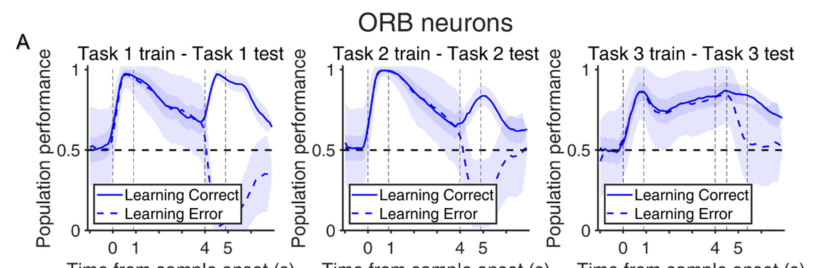

图 3-31 眶额叶皮层神经元在不同行为阶段正确和错误测试中的群体解码表现

Figure 3-31 Population decoding performance of orbitofrontal cortex neurons in correct and error trials during different behavioral stages

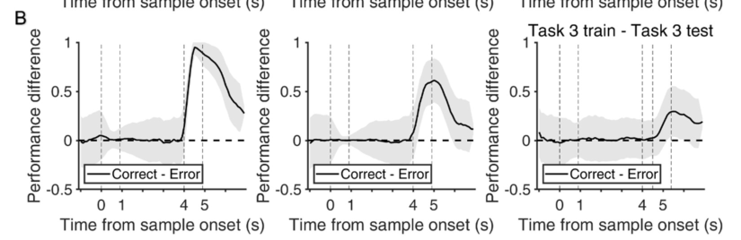

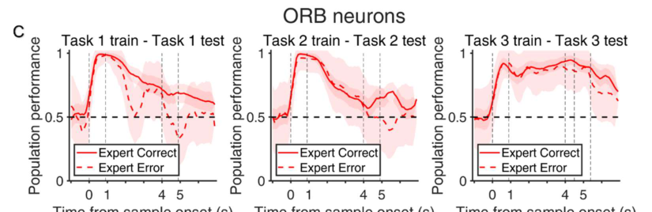

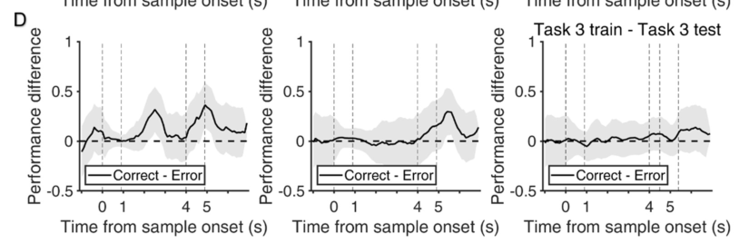

注： (A) 在学习阶段眶额叶皮层神经元分别在不同任务正确和错误测试中的群体神经 元解码表现。X 轴表示样本气味开始时间，Y 轴表示解码表现。实线表示正确测 试，虚线表示错误测试。(B) 在学习阶段眶额叶皮层神经元分别在不同任务正确与 错误测试中的群体神经解码表现差异。X 轴表示样本气味开始时间，Y 轴表示学 会阶段群体解码表现减去学习阶段群体解码表现。(C) 在学会阶段眶额叶皮层神 经元分别在正确和错误测试中的群体神经元解码表现。X 轴表示样本气味开始时

间，Y 轴表示解码表现。实线表示正确测试，虚线表示错误测试。(D) 在学会阶段 眶额叶皮层神经元在不同任务正确和错误测试中的群体神经元解码表现。X 轴表 示样本气味开始时间，Y 轴表示解码表现。实线表示正确测试，虚线表示错误测 试。

(A) Population decoding performance of the orbitofrontal cortex in different tasks and different trials (correct and error trials) during the learning stage. The X-axis represents the time from the sample odor onset, and the Y-axis represents the decoding performance. (C) Population decoding performance of the orbitofrontal cortex in different tasks during the expert stage. The X-axis represents the time from the sample odor onset, and the Y- axis represents the decoding performance. (D) Difference in population decoding performance of the orbitofrontal cortex across different behavioral stages and tasks. The X-axis represents the time from the onset of the sample odor, and the Y-axis represents the difference in decoding performance between the expert stage and the learning stage.

## 3.4.3 单一脑区不同亚群神经元对样本信息的解码能力存在差异

在对群体神经元编码能力进行分析后发现，眶额叶皮层群体神经元在学习阶 段不同任务中分别存在由三类样本选择性神经元构成的三个亚群（图 3-10; 3-32 A），同时这三个亚群神经元的平均编码能力也存在差异（图 3-12），所以本研究 进一步对这三个亚群分别进行了群体解码分析。

要注意，这里是分别从三个任务中得到的三类样本选择性神经元，即在每个 任务中依据群体神经元在当前任务对于当前样本信息编码能力峰值时间所在任 务测试阶段（样本阶段、延迟阶段、测试阶段）来进行分类。换句话说，本研究 基于神经元在不同任务中需要通过重组织（reorganization）来适应新的任务需求 这一假设，在任务切换时（从任务 1 到任务 2，从任务 2 到任务 3）去重新筛选 三类神经元，再分别对每个任务中的不同亚群神经元进行解码分析。结果显示在 学习阶段，眶额叶皮层神经元在任务 1 和任务 2 中的三类亚群对样本信息的解码 表现较为一致，即 Group 1、Group 2 和 Group 3 三类亚群神经元在任务 1 中整体 的解码表现和在任务 2 中很接近。可以看到在任务 1 中 Group 1 神经元群体解码 表现在样本阶段迅速达到峰值后逐渐衰减至测试阶段有少许回升（图 3-28 B，左 图），而任务 2 中 Group 2 亚群解码表现类似（图 3-32 B，中间图）。在任务 1 和 任务 2 中的 Gourp 2 亚群均表现出在样本阶段的解码表现迅速提升但在延迟阶段 达到峰值，之后逐步衰减至任务结束即接近偶然水平（图 3-32 C 左图和中间图）。 而 Group 3 亚群在两个任务中解码均表现在样本阶段迅速达到一个局部峰值之后 衰减至测试阶段开始，之后迅速达到最大峰值（图 3-32 D 左图和中间图）。相反， 在任务 3 中 Group 1、Group 2 和 Group 3 神经元亚群则都表现出与任务 1 和任务 2 不同的编码模式：Group 1 在样本阶段有一个峰值之后便很快衰减至接近偶然 水平，Group 2 则是表现出从样本阶段结束一直到测试气味出现维持一定的解码 水平（根据任务结构，推测相较于任务 1 和任务 2 中 Group 2 亚群可能编码工作

记忆相关信息，在这里 Group 2 神经元则更多地是在持续性表征样本气味信息）， 而 Group 3 自样本阶段开始到测试阶段结束的解码表现在持续提高（推测任务 3 中 Group 3 可能编码了运动准备、预测或是期望相关信息）。

综上，本研究发现眶额叶皮层在学习阶段不同任务中根据任务结构特异性对 群体神经元进行了重组织以应对不用的任务需求，即在任务 1 和任务 2 中三个亚 群神经元对于样本信息的编码表现接近而与任务 3 比存在很大差异。同时，分别 从每个任务入手去看，三个类别的样本选择性神经元构成的亚群则表现出较为不 同的解码表现。

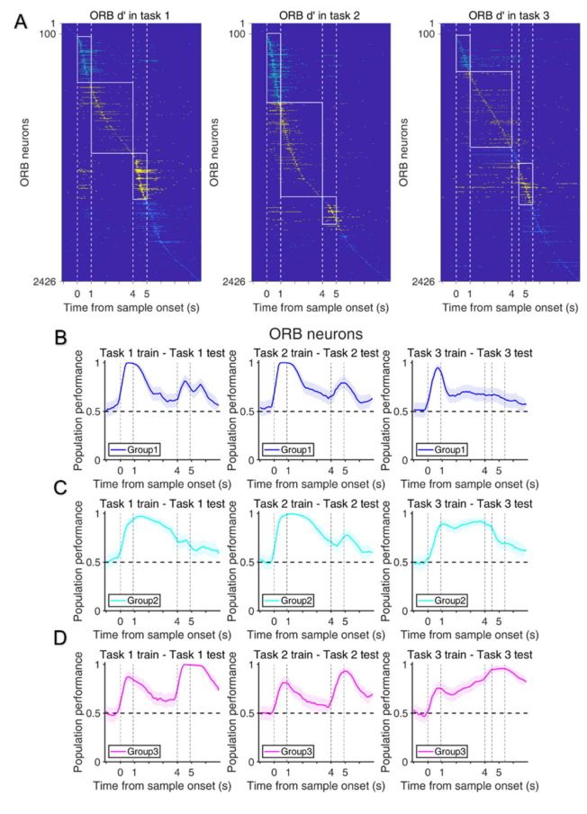

图 3-32 在学习阶段眶额叶皮层不同亚群神经元的群体解码表现

Figure 3-32 The population decoding performance of different subpopulations of orbitofrontal cortex neurons during the learning stage

注： (A) 在学习阶段眶额叶皮层神经元在不同任务中对于样本信息的编码模式图。其中 每一列为一个眶额叶皮层神经元，三个白色方框圈出的为在三个阶段（样本阶段，

延迟阶段，测试阶段）中具有显著性样本选择性神经元（p < 0.01）的 d’峰值区域。 蓝色为不显著 d’值记 0，三个区域显著 d’值记 1 并分别用三种不同颜色表示。X 轴 为从样本气味释放开始时间。神经元均按照其在每个任务中的样本选择性参数绝 对值峰值的时间排序。 (B)任务 1 中样本阶段样本信息选择性神经元（左图）、任 务 2 中样本阶段样本信息选择性神经元（中间图）与任务 3 中样本阶段样本信息 选择性神经元（右图）分别在三个任务中的群体解码表现。(C) 任务 1 中延迟阶段 样本信息选择性神经元（左图）、任务 2 中延迟阶段样本信息选择性神经元（中间 图）与任务 3 中延迟阶段样本信息选择性神经元（右图）分别在三个任务中的群 体解码表现。(D) 任务 1 中测试阶段样本信息选择性神经元（左图）、任务 2 中测 试阶段样本信息选择性神经元（中间图）与任务 3 中测试阶段样本信息选择性神 经元（右图）分别在三个任务中的群体解码表现。

(A) Encoding patterns of ORB neurons for sample information in different tasks during the learning stage. Each column represents an ORB neuron. The three white boxes highlight the peak d’ regions of neurons with significant sample selectivity (p < 0.01) during the three periods (sample period, delay period, and test period). Non-significant d’ values are represented in blue and set to 0, while significant d’ values are set to 1 and represented by three distinct colors. The X-axis represents the time from the onset of sample odor delivery. Neurons are sorted by the timing of the peak value of their absolute sample selectivity parameter d’ in each task. (B) Population decoding performance of sample information selective neurons during the sample period in Task 1 (left graph), Task 2 (middle graph), and Task 3 (right graph) across the three tasks. (C) Population decoding performance of sample information selective neurons during the delay period in Task 1 (left graph), Task 2 (middle graph), and Task 3 (right graph) across the three tasks. (D) Population encoding performance of sample information selective neurons during the test period in Task 1 (left graph), Task 2 (middle graph), and Task 3 (right graph) across the three tasks.

同样，本研究也对学会阶段眶额叶皮层神经元在不同任务中不同亚群的群体 解码能力进行了分析。结果表明，与学习阶段不同的是在学会阶段根据群体解码 在不同时间段的表现群体神经元在任务 1 和任务 2 中更可能地是被分为两类，即 样本阶段选择性神经元和延迟阶段选择性神经元（第三类神经元占比很少且解码 表现接近偶然水平）。而同时三个亚群神经元在任务 1 和任务 2 中群体解码表现 类似，与学习阶段发现一致。另外，对比学会阶段和学习阶段任务 3 中三类神经 元解码能力，可以看到表现基本一致（Group 1 在样本阶段达到峰值后很快衰减， Group 2 则是从样本气味释放测试气味出现一直维持对样本信息解码水平，而 Group 3 自样本阶段到测试阶段的解码能力持续增加）。表明任务 3 中样本到延 迟阶段眶额叶皮层群体神经元对于样本信息的解码是更像是一种被动解码 （passive coding），即包含了突显性解码（salience decoding）、持续性嗅觉解码 （sensory information decoding）以及运动相关信息解码（motor-related information decoding）。

综上，本研究发现眶额叶皮层神经元在不同任务中存在不同亚群负责不同时

间段的样本信息解码，这种解码模式存在任务结构特异性。同时，随着行为阶段 的切换，眶额叶皮层群体神经元在特定任务中的亚群分类也发生了改变。

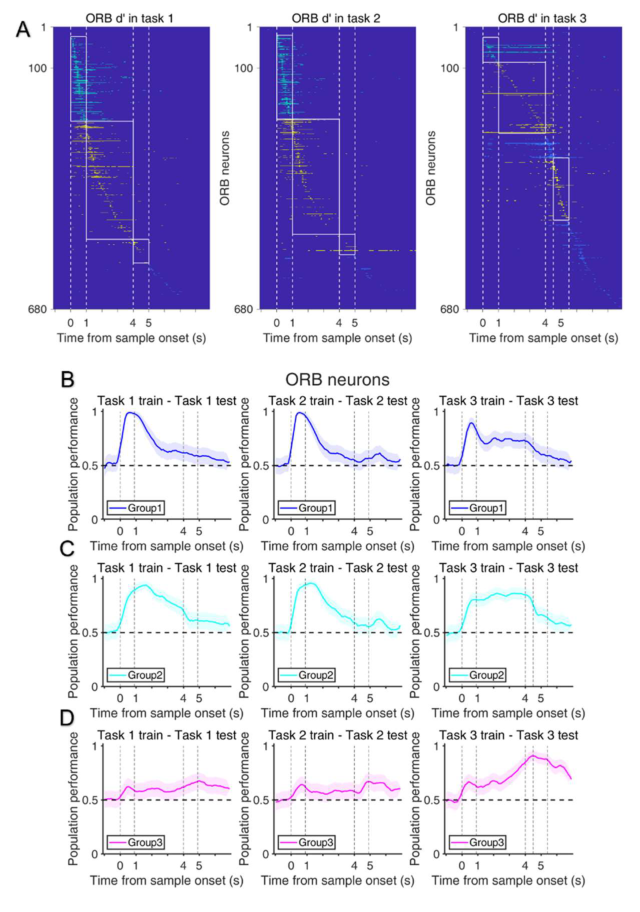

图 3-33 在学会阶段眶额叶皮层不同亚群神经元的群体解码表现

Figure 3-33 The population decoding performance of different subpopulations of orbitofrontal cortex neurons during the expert stage

注： (A) 在学会阶段眶额叶皮层神经元在不同任务中对于样本信息的编码模式图。其中 每一列为一个眶额叶皮层神经元，三个白色方框圈出的为在三个阶段（样本阶段， 延迟阶段，测试阶段）中具有显著性样本选择性神经元（p < 0.01）的 d’峰值区 域。蓝色为不显著 d’值记 0，三个区域显著 d’值记 1 并分别用三种不同颜色表示。 X 轴为从样本气味释放开始时间。神经元均按照其在每个任务中的样本选择性参 数绝对值峰值的时间排序。 (B)任务 1 中样本阶段样本信息选择性神经元（左图）、 任务 2 中样本阶段样本信息选择性神经元（中间图）与任务 3 中样本阶段样本信 息选择性神经元（右图）分别在三个任务中的群体解码表现。(C) 任务 1 中延迟阶 段样本信息选择性神经元（左图）、任务 2 中延迟阶段样本信息选择性神经元（中

间图）与任务 3 中延迟阶段样本信息选择性神经元（右图）分别在三个任务中的 群体解码表现。(D) 任务 1 中测试阶段样本信息选择性神经元（左图）、任务 2 中 测试阶段样本信息选择性神经元（中间图）与任务 3 中测试阶段样本信息选择性 神经元（右图）分别在三个任务中的群体解码表现。

(A) Encoding patterns of ORB neurons for sample information in different tasks during the expert stage. Each column represents an ORB neuron. The three white boxes highlight the peak d’ regions of neurons with significant sample selectivity (p < 0.01) during the three periods (sample period, delay period, and test period). Non-significant d’ values are represented in blue and set to 0, while significant d’ values are set to 1 and represented by three distinct colors. The X-axis represents the time from the onset of sample odor delivery. Neurons are sorted by the timing of the peak value of their absolute sample selectivity parameter d’ in each task. (B) Population decoding performance of sample information selective neurons during the sample period in Task 1 (left graph), Task 2 (middle graph), and Task 3 (right graph) across the three tasks. (C) Population decoding performance of sample information selective neurons during the delay period in Task 1 (left graph), Task 2 (middle graph), and Task 3 (right graph) across the three tasks. (D) Population encoding performance of sample information selective neurons during the test period in Task 1 (left graph), Task 2 (middle graph), and Task 3 (right graph) across the three tasks.

## 3.4.4 全脑神经元对样本信息在不同行为阶段的差异化解码表现

接下来本研究同样对全脑多个区域进行了群体神经元样本信息解码分析，结 果如图 3-34 所示。可以看到，在学习阶段全脑整体呈现出任务特异性的解码模 式：在任务 1 全脑解码能力分布在样本和测试两个阶段（其中 ORB 和 AON 均 表现出两个阶段最高的解码能力，PIR 则表现出测试阶段高于样本阶段的解码表 现而 LSX 表现出样本阶段较高的解码表现），在任务 2 中则编码能力集中在样本 阶段（其中个别脑区如 ORB 和 AON 再测试阶段也有一定的解码表现），以及在 任务 3 中表现出从样本到测试阶段整个过程中较为平均的解码表现（其中 ORB、 AON 和 LSX 表现出较高的解码表现，另外 MOp 和 MOs 只在测试到响应阶段有 一定的解码，表明任务 3 样本到延迟阶段更多地还是嗅觉相关信息编码而不是运 动相关信息）；而在学会阶段表现出任务结构特异性的泛化性解码模式：任务 1 和任务 2 中群体神经元解码能力都集中在样本阶段，任务 3 则表现出和学习阶段 相似的解码表现。综上，与之前对全脑编码模式的分析结果类似，本研究通过群 体神经元解码分析进一步验证了大脑所存在的这种广泛的随着行为阶段切换动 态变化的任务结构特异性泛化编码模式。

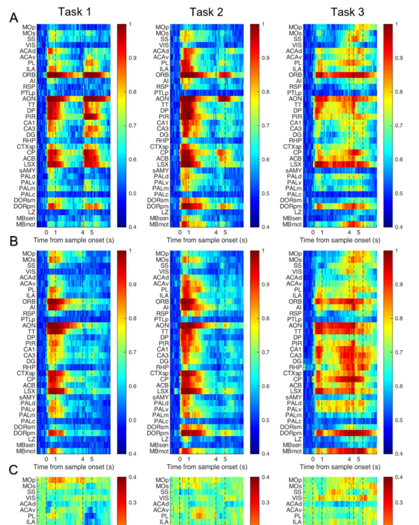

图 3-34 在不同行为阶段中全脑神经元群体的任务特异性解码模式

Figure 3-34 Task-dependent brain-wide decoding pattern for sample information during different behavioral stages

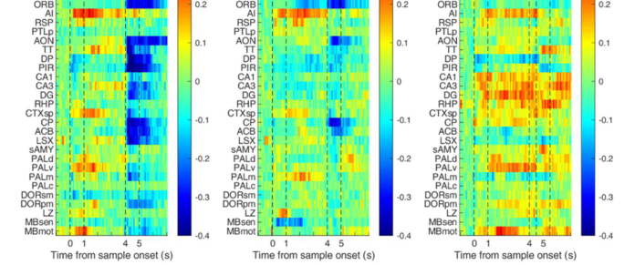

注： (A) 该热图展示了在学习阶段任务 1（左图）、任务 2（中图）以及任务 3（右图） 中，全脑多个区域对样本气味信息的解码强度。X 轴表示从样本气味释放开始的 时间（秒），Y 轴列出了不同的脑区。颜色条表示编码强度，其中红色表示较高的 解码强度，蓝色表示较低的解码强度。(B) 该热图展示了在学会阶段任务 1（左图）、

任务 2（中图）以及任务 3（右图）中，全脑多个区域对样本气味信息的解码强度。 X 轴表示从样本气味释放开始的时间（秒），Y 轴列出了不同的脑区。颜色条表示 解码强度，其中黄色表示较高的解码强度，蓝色表示较低的解码强度。该热图展示 了在学习阶段任务 1（左图）、任务 2（中图）以及任务 3（右图）中，全脑多个区 域对样本气味信息的解码强度。X 轴表示从样本气味释放开始的时间（秒），Y 轴 列出了不同的脑区。颜色条表示解码强度，其中黄色表示较高的解码强度，蓝色表 示较低的解码强度。(C) 该热图展示了在任务 1（左图）、任务 2（中图）以及任务 3（右图）中，在学会阶段和学习阶段全脑多个区域对样本气味信息的解码强度差 异。X 轴表示从样本气味释放开始的时间（秒），Y 轴列出了不同的脑区。颜色条 表示解码差异大小，其中红色表示学会阶段解码能力高于学习阶段，蓝色学会阶 段解码能力低于学习阶段。

(A) The heatmap illustrates the decoding strength of sample odor information across various brain regions in Task 1 (left figure), Task 2 (middle figure) and Task 3 (right figure) during the learning stage. The X-axis represents time in seconds from the onset of odor sample release, and the Y-axis lists different brain areas. The color bar indicates the level of decoding strength, with red representing higher decoding strength and blue representing lower decoding strength. (B) The heatmap illustrates the decoding strength of sample odor information across various brain regions in Task 1 (left figure), Task 2 (middle figure) and Task 3 (right figure) during expert stage. The X-axis represents time in seconds from the onset of odor sample release, and the Y-axis lists different brain areas. The color bar indicates the level of decoding strength, with yellow representing higher decoding strength and blue representing lower decoding strength. (C) This heatmap illustrates the difference in decoding strength of sample odor information across various brain regions between the expert stage and the learning stage in Task 1 (left figure), Task 2 (middle figure) and Task 3 (right figure). The X-axis represents time in seconds from the onset of odor sample release, and the Y-axis lists different brain areas. The color bar indicates the level of decoding strength, with red representing that the decoding ability during the expert stage is higher than during the learning stage and blue representing the decoding ability during the expert stage is lower than during the learning stage.

## 3.4.5 群体神经元对样本信息的跨任务解码能力具有任务结构特异性，同时该能 力在不同行为阶段以及不同脑区之间也存在差异

在之前的探究中，结果表明群体神经元对样本信息表现出任务结构特异性的 泛化表征。为了进一步验证这一现象，本研究对群体神经元进行了跨任务解码分 析（cross-task decoding analysis）（Sarma et al.，2016; Zhou et al., 2021; Tafazoli et al.，2024）。具体方法是利用任务 1 中的训练集数据计算得到的解码器，应用于 任务 2 的测试集数据，或者利用任务 2 的训练集解码器应用于任务 3 的测试集数 据（图 3-35 A）。

这种分析方法旨在探究群体神经元是否能够在任务切换时保留核心相关表 征，从而快速适应新任务，或者说探讨群体神经元是否存在对样本信息的图示 （schema）表征。本研究假设群体神经元能够随着学习形成对样本气味的抽象分

类（基于与测试气味的关联，图 1-22）。即在学习阶段，群体神经元对不同任务 中样本信息的编码应该是相互独立或正交的（即不同样本气味组合的编码分别位 于三个子空间中，不存在共享神经表征（shared neural representation））。而在学会 阶段，群体神经元能够将不同任务中的样本信息统一归为两类（sample 1 和 sample 2），此时编码样本气味的子空间可能因学习迁移而重叠，从而产生共享神经表征

接下来，本研究分别对眶额叶皮层和前嗅核这两个脑区的群体神经元进行了 跨任务解码分析。结果显示，在学习阶段，眶额叶皮层神经元群体在样本阶段能 够很好地实现从任务 1 到任务 2 的跨任务解码，同时在测试阶段也表现出一定的 跨任务解码能力（图 3-35 B 左图）。然而，在任务 2 到任务 3 的切换中，眶额叶 皮层神经元无法很好地对样本信息进行跨任务解码（图 3-35 B 右图）。在学会阶 段，眶额叶皮层神经元群体依然表现出类似的跨任务解码模式（能够实现从任务 1 到任务 2 的解码，但无法实现从任务 2 到任务 3 的解码），并且任务 1 到任务 2 的跨任务解码能力在延迟阶段有所提高（图 3-35 D 左图）。这表明眶额叶皮层 神经元群体的跨任务解码存在任务结构特异性，并且这种解码模式在不同行为阶 段是稳定的。然而，部分解码能力（如延迟期解码，可能与工作记忆相关；测试 期解码，可能与重激活相关）在不同行为阶段存在差异。

相比之下，前嗅核神经元表现出截然不同的跨任务解码模式。在学习阶段， 前嗅核神经元在样本及延迟阶段并未表现出对样本信息的跨任务解码能力，但在 测试阶段却表现出很强的任务结构特异性跨任务解码能力（图 3-35 C）。在学会 阶段，前嗅核神经元能够在样本及延迟早期阶段很好地实现对样本信息的跨任务 解码（图 3-35 E）。这表明前嗅核神经元对样本信息同样存在任务结构特异性的 跨任务解码，但其解码模式在学习阶段与眶额叶皮层存在差异，而在学会阶段则 表现出基本一致的模式。

上述研究结果揭示了眶额叶皮层和前嗅核在跨任务解码中的动态差异：眶额 叶皮层神经元群体表现出任务结构特异性的解码模式，且这种模式在不同行为阶 段保持稳定，但部分解码能力在不同阶段存在差异。相比之下，前嗅核神经元在 学习阶段和学会阶段的解码模式表现出显著的阶段性差异，但最终在学会阶段与 眶额叶皮层的解码模式趋于一致。其中这种差异化的编码模式可能与神经元群体 在不同脑区的功能分工有关，例如眶额叶皮层在整合任务结构和认知灵活性方面 发挥关键作用（Zhou et al., 2021），而前嗅核则可能更多地参与感觉信息的初步 处理和分类（Brunert et al., 2023）。而随着学习的深入，这些区域之间的功能协同 可能增强，从而导致解码模式的趋同。

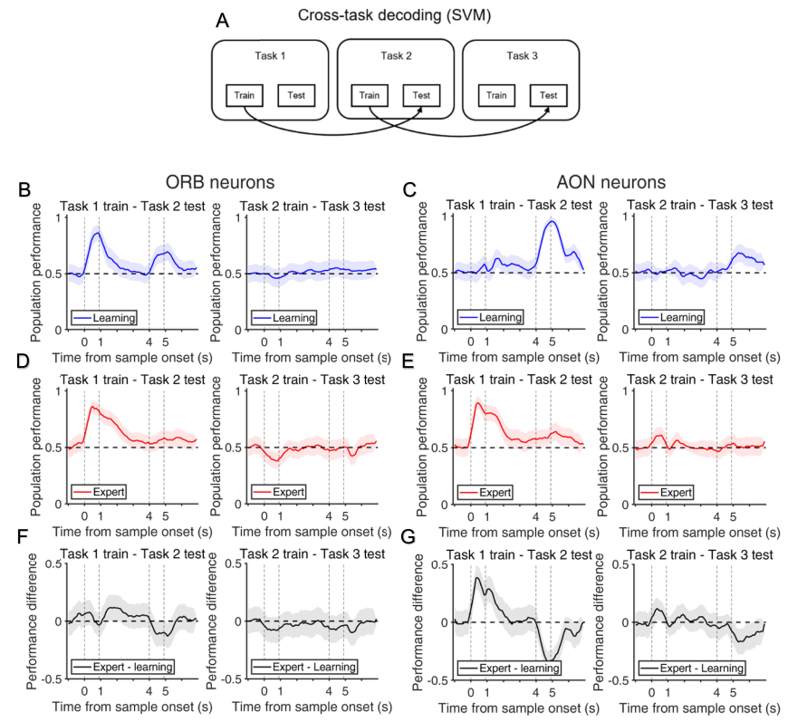

Figure 3-35 Cross-task population decoding performance of orbitofrontal cortex and anterior olfactory nucleus neurons in different tasks during different behavioral stages

----- Start of picture text ----- 
A B C D E F G ----- End of picture text ----- 

注： (A) 利用支持向量机（support vector machine，SVM）来对群体神经元进行跨任务 解码分析。示意图为利用任务 1 或任务 2 训练集计算得到解码器，之后再利用任 务 2 或任务 3 中的测试集得到群体跨任务解码表。(B) 眶额叶皮层神经元在学习 阶段不同任务中的群体神经元跨任务解码表现。X 轴表示样本气味开始时间，Y 轴 表示解码表现。(C) 前嗅核神经元在学习阶段不同任务中的群体神经元跨任务解 码表现。(D) 眶额叶皮层神经元在学会阶段不同任务中的群体神经元跨任务解码 表现。(E) 前嗅核神经元在学习阶段不同任务中的群体神经元跨任务解码表现。(F) 眶额叶皮层神经元在不同行为阶段的群体神经元跨任务解码表现差异。X 轴表示 样本气味开始时间，Y 轴表示学会阶段群体解码表现减去学习阶段群体解码表现。 (G) 前嗅核神经元在不同行为阶段的群体神经元跨任务解码表现差异。
(A) Cross-task decoding analysis of population neurons using Support Vector Machine (SVM). The schematic illustrates the process of calculating a decoder using the training sets from Task 1/Task 2, followed by applying the decoder to the test sets of Task 2/Task 3 to obtain the population cross-task decoding performance. (B) Population cross-task

decoding performance of the orbitofrontal cortex during the learning stage. The X-axis represents the time from the sample odor onset, and the Y-axis represents the decoding performance. (C) Population cross-task decoding performance of the orbitofrontal cortex during the learning stage. (C) Population decoding performance of the anterior olfactory nucleus in different tasks during the learning stage. (D) Population cross-task decoding performance of the orbitofrontal cortex during the expert stage. (E) Population cross-task decoding performance of the anterior olfactory nucleus during the expert stage. (F) Difference in population cross-task decoding performance of the orbitofrontal cortex across different behavioral stages. The X-axis represents the time from the onset of the sample odor, and the Y-axis represents the difference in decoding performance between the expert stage and the learning stage. (F) Difference in population cross-task decoding performance of the anterior olfactory nucleus across different behavioral stages.

## 3.4.6 群体神经元对样本信息的跨任务解码存在双向性

在上一节通过对眶额叶皮层和前嗅核进行了顺向（forward）的跨任务解码分 析（任务随时间切换的顺序为：Task 1，Task 2，Task 3），探究了群体神经元对于 样本信息的编码是否随着任务的切换存在泛化这一问题，接下来进一步对群体神 经元进行另外两种跨任务分析。首先通过利用任务 2（或任务 3）训练集数据计 算得到解码器，之后在将其应用于任务 1（或任务 2）的测试集去（图 3-36 A）， 对群体神经元进行反向跨任务解码样本信息的表现。这样做的目的在于我们想知 道当任务切换后，群体神经元是否还保留着对之前样本信息解码的“记忆”，换 句话说之前本研究已经验证了在任务 1 的解码框架依然可以被运用在任务 2 的 解码上，在这里我们想想看在切换后任务中重新构建的框架是否还适用于之前的 任务。

令人惊讶的是，眶额叶皮层（群体神经元在任务 2 中仍能解码任务 1 中的样 本信息（图 3-36 B），这表明其跨任务解码能力具有双向性。这种任务特异性的 双向解码能力不仅在不同行为阶段保持稳定，还在其他脑区表现出类似特征。例 如，在前嗅核（piriform cortex）中，本研究也观察到了类似的解码模式。这说明 这种解码能力的双向性和稳定性可能是大脑多个区域在处理任务切换时的共同 特征。

另外本研究也对任务 1 和任务 3 之间进行了远程跨任务解码分析（long-rage cross-task decoding analysis），结果显示眶额叶皮层和前嗅核群体神经元均未表现 出很好的解码能力，这进一步验证了群体神经元跨任务解码能力的任务结构特异 性。

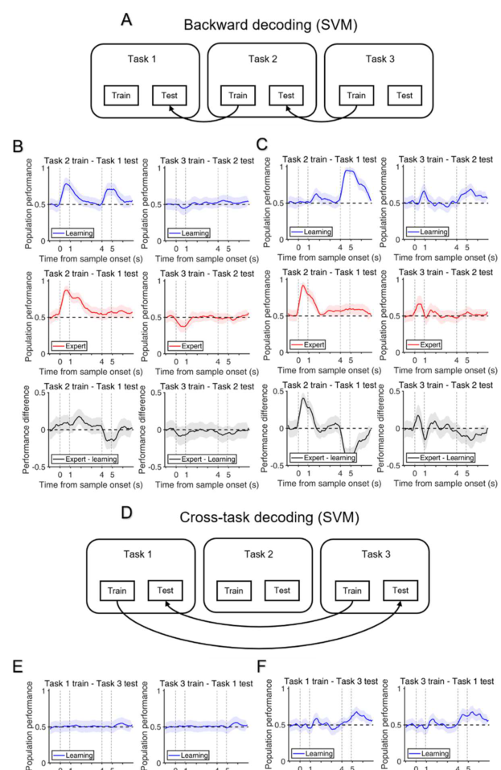

Figure 3-36 Backward and long-range cross-task population decoding performance of orbitofrontal cortex and anterior olfactory nucleus neurons in different tasks during different behavioral stages

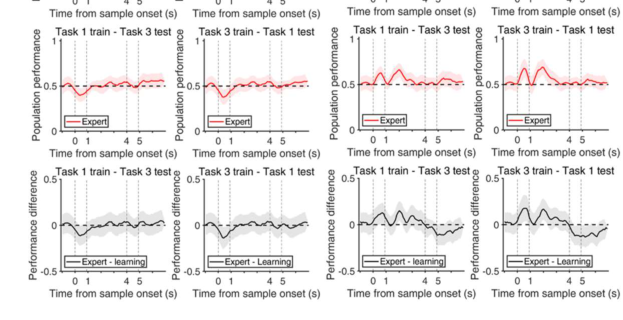

Figure 3-36 Backward and long-range cross-task population decoding performance of orbitofrontal cortex and anterior olfactory nucleus neurons in different tasks during different behavioral stages

注： (A) 利用支持向量机（support vector machine，SVM）来对群体神经元进行反向跨 任务解码分析。示意图为利用任务 2 或任务 3 训练集计算得到解码器，之后再逆 向利用任务 1 或任务 2 中的测试集得到群体反向跨任务解码表。(B) 眶额叶皮层 神经元在不同行为阶段中的群体神经元反向跨任务解码表现。X 轴表示样本气味 开始时间，Y 轴表示解码表现。(C) 眶额叶皮层神经元在不同行为阶段中的群体神 经元反向跨任务解码表现。(D) 利用支持向量机（support vector machine，SVM） 来对群体神经元进行远程跨任务解码分析。示意图为利用任务 1 或任务 3 训练集 计算得到解码器，之后再逆向利用任务 3 或任务 1 中的测试集得到群体远程跨任 务解码表。(E) 眶额叶皮层神经元在不同行为阶段中的群体神经元远程跨任务解码 表现差异。(F) 眶额叶皮层神经元在不同行为阶段中的群体神经元远程跨任务解码 表现差异。

(A) Backward cross-task decoding analysis of population neurons using Support Vector Machine (SVM). The schematic illustrates the process of calculating a decoder using the training sets from Task 2/Task 3, followed by applying the decoder to the test sets of Task 1/Task 2 to obtain the population backward cross-task decoding performance. (B) Population backward cross-task decoding performance of the orbitofrontal cortex during different stages. The X-axis represents the time from the sample odor onset, and the Y- axis represents the decoding performance. (C) Population backward cross-task decoding performance of the anterior olfactory nucleus during different stages. (D) Long-range cross-task decoding analysis of population neurons using Support Vector Machine (SVM). The schematic illustrates the process of calculating a decoder using the training sets from Task 1/Task 3, followed by applying the decoder to the test sets of Task 3/Task 1 to obtain the population long-range cross-task decoding performance. (E) Population long-range cross-task decoding performance of the orbitofrontal cortex during different stages. (F) Population long-range cross-task decoding performance of the anterior olfactory nucleus during different stages.

## 3.4.7 群体神经元在不同任务中对样本信息编码的不同亚群存在动态重组，并且 不同行为阶段存在差异

在之前的研究中，结果表明在学习阶段，群体神经元在任务切换时对样本信 息的编码可能存在动态重组织现象（如图 3-10 C 和图 3-15 C 所示）。进一步的群 体解码分析揭示了这种重组织不仅具有任务结构特异性（图 3-32），而且在不同 行为阶段表现出显著差异（图 3-33）。此外，本研究还发现群体神经元能够以任 务结构特异性的方式对样本信息进行跨任务解码（图 3-35），并且这种跨任务解 码能力具有双向性（图 3-36）。基于这些发现，本研究提出了以下问题：群体神 经元中的不同亚群是否会在跨任务解码中扮演不同角色，以及任务切换后经过重 组的神经元亚群在解码表现上是否与之前任务中的亚群表现存在差异？

为了验证这些问题，本研究对三个任务中的不同亚群神经元进行了跨任务解 码分析。具体而言，在任务 1 中筛选出了三类样本选择性神经元，并分别计算了 这些亚群在任务 1 中的任务内解码表现（within-task decoding）以及在任务 2 和 任务 3 中的跨任务解码表现（cross-task decoding）。同样地，在任务 2（或任务 3）

中筛选出三类样本选择性神经元，并分析了这些亚群在任务 2（或任务 3）中的 任务内解码表现以及在任务 1 和任务 3（或任务 2）中的跨任务解码表现。

分析结果显示，学习阶段眶额叶皮层神经元在任务 1 中的不同亚群表现出不 同的动态解码能力（图 3-37 A）。其中在任务 1 内解码的结果与图 3-32 一致（即 任务内解码），而在任务 2 中这些亚群的跨任务解码能力表现出多样性：Group 1 神经元的跨任务解码主要集中在样本阶段及延迟早期阶段；Group 2 神经元与 Group 1 类似，但在样本阶段的解码表现略低，而在延迟晚期阶段略高；Group 3 神经元尽管在样本阶段也存在部分解码表现，但更多地是在测试阶段体现出对样 本信息的跨任务解码能力。然而在任务 3 中，这些亚群并未展现出跨任务解码能 力，再一次证明了跨任务解码的结构特异性（图 3-37 E）。同样地，在任务 2 中， 眶额叶皮层神经元的不同亚群也表现出任务内解码能力的差异（图 3-37 C）。但 在跨任务解码方面，这些亚群的表现与任务 1 中的情况有所不同：任务 2 中的 Group 1 和 Group 2 神经元在任务 1 的样本阶段和测试阶段均展现出跨任务解码 能力，而相比之下，任务 1 中的这两个亚群并未在测试阶段表现出跨任务解码能 力。这表明群体神经元对样本信息的编码在任务切换后确实进行了重组织。

本研究推测，这种重组织可能是由于任务需求的变化（例如，任务 2 中存在 持续的气味干扰）导致群体神经元内不同亚群的构成发生了改变。事实上，之前 的研究发现，在学习阶段，眶额叶皮层在任务 2 中需要召集更多的神经元来负责 样本信息的编码与维持（图 3-10 C）。因此，眶额叶皮层群体在任务 1 中的部分 Group 3 神经元很可能被重新分配，更多地在样本和延迟阶段参与样本信息的编 码（故而被筛选分类在 Group 1 或 Group 2 中），这或许可以解释为什么在跨任务 解码时，任务 2 中的 Group 1 神经元表现出与任务 1 中 Group 3 神经元相似的解 码模式。

但是对比学习阶段前嗅核神经元在任务 1 和任务 2 中不同亚群所体现出的 动态解码差异发现（图 3-37 B, D），群体神经元在任务 1 中呈现出跨任务解码表 现的主要是 Group 3 亚群且主要在测试阶段，而在任务 2 中 Group 1 也在测试阶 段出现部分解码能力，表明在学习阶段前嗅核脑区中同样存在对样本信息的重组 织解码。而在任务 1 和任务 2 样本阶段均没有明显跨任务解码表现（说明学习阶 段前嗅核神经元在样本阶段对于样本信息的编码较为独立，即更多地关注不同气 味分子而并没有进行抽象归类，故而在任务之间没有共享神经表征），以及在任 务 1 或任务 2 和任务 3 之间也没有跨任务解码表现。

相反，在学会阶段，眶额叶皮层和前嗅核神经元不同亚群则均表现出相似的 任务内解码表现（大致可以被分为两类亚群，即 Group 3 神经元基本不存在解码 表现，与之前结果一致）（图 3-37 G - L）。并且任务 1 中 Group 1 和 Group 2 与任 务 2 中 Group 1 和 Group 2 的跨任务解码主要集中在样本阶段同时表现接近，这 说明群体神经元对于样本信息的解码在学会阶段趋于稳定（群体对于神经元的重

组织减少），编码结构在群体内保持一致性的同时在不同脑区也趋于一致。另外 本研究发现任务 3 中的不同亚群神经元在不同脑区以及不同脑区基本保持了不 变的解码能力（任务内以及跨任务解码），再次说明任务结构对于群体神经元共 享神经表征的重要性。另外对前嗅核等多个脑区进行了相同分析，发现了类似的 结果。

综上所述，这些结果进一步巩固了本研究之前的假设：在学习阶段，群体神 经元处于一种高度动态的重组状态，表现为在任务切换时动态调整其内部编码结 构。相比之下，在学会阶段，群体神经元展现出更为稳定和一致的特征。这表明， 经过训练并掌握特定任务相关信息后，神经网络的激活模式逐渐趋于稳定和优化。 这种稳定性可能反映了神经元之间协同作用的增强，以及神经网络对任务要求的 适应性和精细化调整。

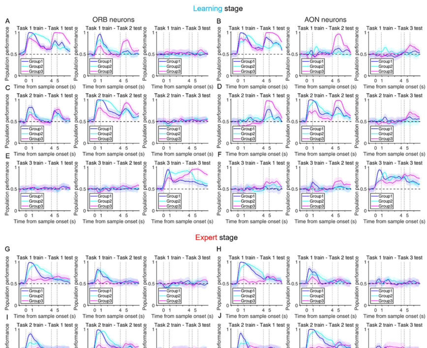

图 3-37 在不同行为阶段眶额叶皮层和前嗅核中三类选择性神经元跨任务群体解码表现

Figure 3-37 Cross-task population decoding performance of three types of selective neurons in the orbitofrontal cortex and anterior olfactory nucleus during different behavioral stages

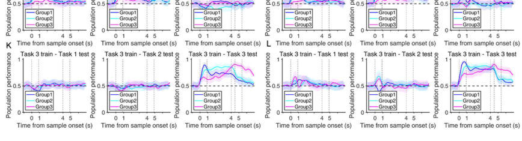

注： (A) 眶额叶皮层神经元在学习阶段不同任务中不同类别选择性神经元亚群的不同 类型跨任务解码表现。其中左图表示任务 1 中三类样本选择性神经元在任务 1 中 的解码表现，中间图表示表示任务 1 中三类样本选择性神经元在任务 2 中的解码 表现，右图表示表示任务 1 中三类样本选择性神经元在任务 3 中的解码表现。蓝 色线（Group 1）表示样本阶段样本信息选择性神经元，青色线（Group 2）表示延 迟阶段样本信息选择性神经元，洋红色（Group 3）表示测试阶段样本信息选择性 神经元。(B) 前嗅核神经元在学习阶段不同任务中不同类别选择性神经元亚群的 跨任务解码表现。其中左图表示任务 1 中三类样本选择性神经元在任务 1 中的解 码表现，中间图表示表示任务 1 中三类样本选择性神经元在任务 2 中的解码表现， 右图表示表示任务 1 中三类样本选择性神经元在任务 3 中的解码表现。(C) 眶额

叶皮层神经元在学习阶段不同任务中不同类别选择性神经元亚群的不同类型跨任 务解码表现。其中左图表示任务 2 中三类样本选择性神经元在任务 1 中的解码表 现，中间图表示表示任务 2 中三类样本选择性神经元在任务 2 中的解码表现，右 图表示表示任务 2 中三类样本选择性神经元在任务 3 中的解码表现。(D) 前嗅核 神经元在学习阶段不同任务中不同类别选择性神经元亚群的不同类型跨任务解码 表现。其中左图表示任务 2 中三类样本选择性神经元在任务 1 中的解码表现，中 间图表示表示任务 2 中三类样本选择性神经元在任务 2 中的解码表现，右图表示 表示任务 2 中三类样本选择性神经元在任务 3 中的解码表现。(E) 眶额叶皮层神 经元在学习阶段不同任务中不同类别选择性神经元亚群的不同类型跨任务解码表 现。其中左图表示任务 3 中三类样本选择性神经元在任务 1 中的解码表现，中间 图表示表示任务 3 中三类样本选择性神经元在任务 2 中的解码表现，右图表示表 示任务 3 中三类样本选择性神经元在任务 3 中的解码表现。(F) 前嗅核神经元在 学习阶段不同任务中不同类别选择性神经元亚群的不同类型跨任务解码表现。其 中左图表示任务 3 中三类样本选择性神经元在任务 1 中的解码表现，中间图表示 表示任务 3 中三类样本选择性神经元在任务 2 中的解码表现，右图表示表示任务 3 中三类样本选择性神经元在任务 3 中的解码表现。(G – H) 眶额叶皮层和前嗅核 神经元在学会阶段不同任务中不同类别选择性神经元亚群的不同类型跨任务解码 表现，与 (A - F) 类似。

(A) The different types of cross-task decoding performances of distinct subpopulations of sample selective neurons in the orbitofrontal cortex in different tasks during the learning stage. The left figure represents the decoding performances of three types of sample-selective neurons from Task 1 when performing Task 1. The middle figure represents the decoding performances of three types of sample-selective neurons from Task 1 when performing Task 2. The left figure represents the decoding performances of three types of sample-selective neurons from Task 1 when performing Task 3. The blue line (Group 1) represents sample selective neurons in the sample period, the cyan line (Group 2) represents sample selective neurons in the sample period sample selective neurons in the delay period, and the magenta line (Group 3) represents sample selective neurons in the test period. (B) The different types of cross-task decoding performances of distinct subpopulations of sample selective neurons in the anterior olfactory nucleus in different tasks during the learning stage. The left figure represents the decoding performances of three types of sample-selective neurons from Task 1 when performing Task 1. The middle figure represents the decoding performances of three types of sampleselective neurons from Task 1 when performing Task 2. The left figure represents the decoding performances of three types of sample-selective neurons from Task 1 when performing Task 3. (C) The different types of cross-task decoding performances of distinct subpopulations of sample selective neurons in the orbitofrontal cortex in different tasks during the learning stage. The left figure represents the decoding performances of three types of sample-selective neurons from Task 2 when performing Task 1. The middle figure represents the decoding performances of three types of sample-selective neurons from Task 2 when performing Task 2. The left figure represents the decoding performances of three types of sample-selective neurons from Task 2 when performing Task 3. (D) The different types of cross-task decoding performances of distinct subpopulations of sample selective neurons in the anterior olfactory nucleus in different

tasks during the learning stage. The left figure represents the decoding performances of three types of sample-selective neurons from Task 2 when performing Task 1. The middle figure represents the decoding performances of three types of sample-selective neurons from Task 2 when performing Task 2. The left figure represents the decoding performances of three types of sample-selective neurons from Task 2 when performing Task 3. (E) The different types of cross-task decoding performances of distinct subpopulations of sample selective neurons in the orbitofrontal cortex in different tasks during the learning stage. The left figure represents the decoding performances of three types of sample-selective neurons from Task 3 when performing Task 1. The middle figure represents the decoding performances of three types of sample-selective neurons from Task 3 when performing Task 2. The left figure represents the decoding performances of three types of sample-selective neurons from Task 3 when performing Task 3. (F) The different types of cross-task decoding performances of distinct subpopulations of sample selective neurons in the anterior olfactory nucleus in different tasks during the learning stage. The left figure represents the decoding performances of three types of sample-selective neurons from Task 3 when performing Task 1. The middle figure represents the decoding performances of three types of sample-selective neurons from Task 3 when performing Task 2. The left figure represents the decoding performances of three types of sample-selective neurons from Task 3 when performing Task 3. (G–H) The different types of cross-task decoding performances of distinct subpopulations of sample selective neurons in the orbitofrontal cortex and the anterior olfactory nucleus in different tasks during the expert stage, the same as (A-F).

## 3.4.8 全脑对样本信息的跨任务群体解码能力

在对眶额叶皮层和前嗅核群体神经元进行跨任务解码分析以及对比后，本研 究发现这种群体泛化性编码能力存在着脑区的差异。进一步的全脑分析表明，跨 任务解码能力并非局限于特定脑区，而是广泛存在于多个脑区，同时这种解码能 力也同样在表现出结构依赖的特征。具体来看，在不同行为阶段中全脑多个脑区 均表现出任务 1 和任务 2 之间的双向跨任务解码能力（学习阶段，图 3-38 A; 学 会阶段，图 3-38 B），而在任务 1 或任务 2 和任务 3 之间则没有跨任务解码表现 （图 3-38 C, D）。个别脑区如前嗅核则在任务 1 和任务 3 以及任务 2 和任务 3 之 间均表现出较弱的跨任务解码表现。此外，与学习阶段相比，全脑在学会阶段的 解码模式发生显著变化，解码能力主要集中在样本阶段，而测试阶段的解码表现 几乎消失。同时，学会阶段的整体解码强度显著提升，更多脑区在样本阶段表现 出对样本信息的跨任务解码能力。

综上，这些结果表明群体神经元的跨任务解码能力不仅依赖于任务结构，还 随着学习进程的推进而发生动态调整，并且呈现出全脑动态变化趋势的一致性。 这种全脑范围内的趋势表明，群体神经元的编码和解码机制在不同脑区之间具有 共性，反映了大脑在学习过程中对任务相关信息的逐步整合与优化是多脑区协同 并参与构建相关网络的。

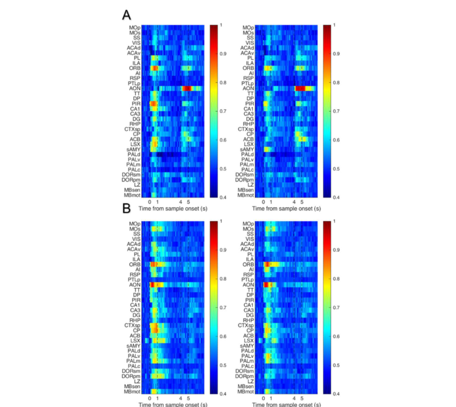

图 3-38 在不同行为阶段全脑多个区域的跨任务解码表现

Figure 3-38 Cross-task population decoding performance of multiple regions during different behavioral stages

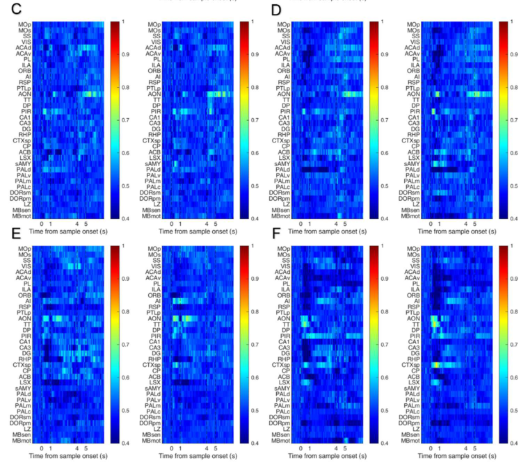

注： (A) 该热图展示了在学习阶段从任务 1 到任务 2（左图）、从任务 2 到任务 1（右 图）的跨任务解码能力。X 轴表示从样本气味释放开始的时间（秒），Y 轴列出了 不同的脑区。颜色条表示解码强度，其中红色表示较高的解码强度，蓝色表示较低 的解码强度。(B) 该热图展示了在学会阶段从任务 1 到任务 2（左图）、从任务 2 到任务 1（右图）的跨任务解码能力。(C) 该热图展示了在学习阶段从任务 1 到任 务 3（左图）、从任务 3 到任务 1（右图）的跨任务解码能力。(D) 该热图展示了在 学会阶段从任务 1 到任务 3（左图）、从任务 3 到任务 1（右图）的跨任务解码能 力。(E) 该热图展示了在学习阶段从任务 2 到任务 3（左图）、从任务 3 到任务 2 （右图）的跨任务解码能力。(F) 该热图展示了在学会阶段从任务 2 到任务 3（左 图）、从任务 3 到任务 2（右图）的跨任务解码能力。
(A) The heatmap illustrates the cross-task decoding strength of sample odor information between Task 1 and Task 2 during the learning stage. The X-axis represents time in seconds from the onset of odor sample release, and the Y-axis lists different brain areas. The color bar indicates the level of decoding strength, with red representing higher decoding strength and blue representing lower decoding strength. (B) The heatmap illustrates the cross-task decoding strength of sample odor information between Task 1 and Task 2 during the expert stage. (C) The heatmap illustrates the cross-task decoding strength of sample odor information between Task 1 and Task 3 during the learning stage. (D) The heatmap illustrates the cross-task decoding strength of sample odor information between Task 1 and Task 3 during the expert stage. (E) The heatmap illustrates the crosstask decoding strength of sample odor information between Task 2 and Task 3 during the learning stage. (F) The heatmap illustrates the cross-task decoding strength of sample odor information between Task 2 and Task 3 during the expert stage.

## 3.5 全脑跨任务神经表征的几何分析：群体神经元活动在基于多任务解码器轴 的三维向量空间中的投射

## 3.5.1 从学习到学会阶段起群体神经元呈现出解码空间收缩与轨迹收敛

之前对群体神经元的跨任务解码研究中，本研究通过选取某个任务的训练集 数据计算得到对于样本信息的解码器，并将其应用与其他任务中的测试集数据来 得到群体神经元对于样本信息的跨任务解码表现。从本质上来讲，这种方法即是 将群体神经元在某一任务中的数据投射到由与样本分类超平面正交的向量定义 的一维编码空间上（Tafazoli et al.，2024）。而在这里，本研究通过分别计算群体 神经元活动在三个任务中对于样本信息的线性分类，得到三个解码器即三个一维 编码空间向量，进而可以利用这三个任务解码器构成一个三维向量空间并将群体 神经元在三个任务中的活动以此投射在其中即得到在解码空间中的活动轨迹 （neural trajectory）。

研究结果显示，在学习阶段（图 3-39 B、C 所示，其中虚线表示学习阶段的 任务轨迹），眶额叶皮层群体神经元在三维解码空间中的任务活动轨迹呈现出显 著的分化趋势。具体而言，任务 1（蓝色线）和任务 2（绿色线）的活动轨迹在

从样本阶段到延迟阶段的过程中表现出较高的相似性，而与任务 3（红色线）的 活动轨迹则呈现出明显的分离趋势。相比之下，前嗅核群体神经元在学习阶段展 现出截然不同的活动模式：任务 1、任务 2 和任务 3 的活动轨迹在三维解码空间 中均表现出显著的分离，彼此之间缺乏明显的相似性。这表明在学习阶段前嗅核 表现出更为独立的信息编码（三个任务样本信息编码子空间相对独立），而眶额 叶皮层则表现出任务结构特异性的编码相似性（任务 1 和任务 2 样本信息编码子 空间相近，表明这两个任务之间可能存在一定程度的共享编码机制；相反任务 1 或任务 2 和任务 3 之间则距离较远）。同时与学习阶段比较，学会阶段两个脑区 群体神经元在三维编码空间中的任务轨迹均表现出不同程度的收敛（图 3-39 B, C 中实线所示为学会阶段的任务轨迹），而前嗅核在学会阶段的表现则与眶额叶 皮层更为一致（与之前结果一致）。

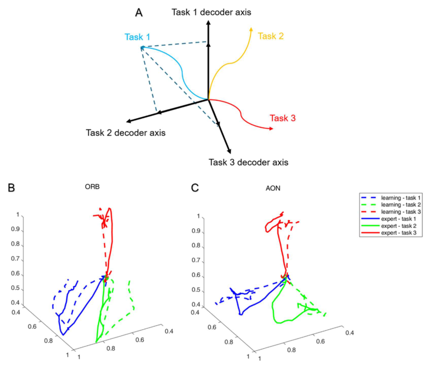

Figure 3-39 The projections of the population neuronal activity in the orbitofrontal cortex and the anterior olfactory nucleus across different behavioral stages in the three-dimensional vector space constituted by three task decoder axes

注： (A) 图示为群体神经元活动基于多任务解码器轴的三维向量空间投射。蓝色线代表 群体神经元在任务 1 中的活动，绿色代表群体神经元在任务 2 中的活动，红色代

表群体神经元在任务 3 中的活动。 (B) 眶额叶皮层在不同行为阶段不同任务中的 群体神经元活动在基于多任务解码器轴的三维向量空间中的轨迹。数据选取为样 本气味开始前 1 秒到延迟阶段结束共 5 秒时间。蓝色线代表群体神经元在任务 1 中的活动，绿色代表群体神经元在任务 2 中的活动，红色代表群体神经元在任务 3 中的活动。虚线表示学习阶段数据，实线表示学会阶段数据。 (C) 前嗅核不同 行为阶段不同任务中的群体神经元活动在基于多任务解码器轴的三维向量空间中 的轨迹。数据选取为样本气味开始前 1 秒到延迟阶段结束共 5 秒时间。蓝色线代 表群体神经元在任务 1 中的活动，绿色代表群体神经元在任务 2 中的活动，红色 代表群体神经元在任务 3 中的活动。虚线表示学习阶段数据，实线表示学会阶段 数据。

(A) The schematic illustrates the projection of population neuronal activity into a threedimensional vector space based on a multi-task decoder axis. The blue line represents the activity of population neurons in Task 1, the green line represents the activity of population neurons in Task 2, and the red line represents the activity of population neurons in Task 3. (B) The trajectories of population neuronal activity in the orbitofrontal cortex across different behavioral stages and tasks in the three-dimensional vector space based on three task decoder axes. Data was selected from 1 second before the onset of the sample odor to the end of the delay period, covering a total of 5 seconds. The blue lines represent the activity of population neurons in Task 1, the green lines represent the activity of population neurons in Task 2, and the red lines represent the activity of population neurons in Task 3. Dashed lines indicate data from the learning stage, while solid lines indicate data from the expert stage. (C) The trajectories of population neuronal activity in the anterior olfactory nucleus across different behavioral stages and tasks in the three-dimensional vector space based on three task decoder axes. Data was selected from 1 second before the onset of the sample odor to the end of the delay period, covering a total of 5 seconds. The blue lines represent the activity of population neurons in Task 1, the green lines represent the activity of population neurons in Task 2, and the red lines represent the activity of population neurons in Task 3. Dashed lines indicate data from the learning stage, while solid lines indicate data from the expert stage.

## 3.5.2 在三维解码空间中，眶额叶皮层与前嗅核的群体神经元在不同任务中的活 动轨迹夹角在学习与学会阶段呈现出有任务结构特异性的动态变化

为了进一步对群体神经元在三维解码空间中的任务活动轨迹进行定量分析， 本研究计算了不同任务轨迹在各个时间窗口内的向量夹角，结果展示在图 3-40 中。可以看到在学习阶段眶额叶皮层群体神经元任务 1 和任务 3（图 3-40 A 中绿 色线）以及任务 2 和任务 3（图 3-40 A 中红色线）活动轨迹夹角在样本阶段显著 高于任务 1 和任务 2（图 3-40 A 中蓝色线）轨迹夹角，相反前嗅核群体神经元则 没表现出这种任务活动轨迹夹角差异（图 3-40 C）。这表明学习阶段眶额叶皮层 在样本阶段表现出任务结构依赖（任务 1 和任务 2 结构相同，而任务 1 或任务 2 和任务 3 结构不同）的泛化性编码模式（任务 1 和任务 2 轨迹夹角相对较小提示 两者存在活动上的相似性），而前嗅核表现出在样本阶段更为独立的任务轨迹（两 两任务之间活动轨迹夹角相同，揭示群体活动在三个任务中的差异化编码），这

也与之前的观察结果一致。与学习阶段相比，在学会阶段前嗅核群体神经元的活 动轨迹在样本阶段表现出任务间的夹角差异（图 3-40 D），这一现象揭示了前嗅 核在行为阶段切换后具备了任务结构特异性的泛化编码能力（与眶额叶皮层在学 习阶段和学会阶段的群体神经元活动表现出相似性）。眶额叶皮层神经元在样本 阶段的不同任务轨迹之间的夹角差异在行为阶段切换后进一步增大（图 3-40 B）， 表明群体神经元的编码在不同任务结构的任务之间变得更加分化。另外，在学会 阶段眶额叶皮层群体神经元在延迟阶段的活动轨迹呈现出结构不同任务之间的 显著差异（任务 1 或任务 2 和任务 3 活动轨迹夹角均显著大于任务 1 和任务 2 之 间的夹角），进一步表明这种任务结构特异性的泛化能力不仅体现在样本信息的 编码阶段，还扩展到了信息的在线维持阶段（与工作记忆密切相关）。

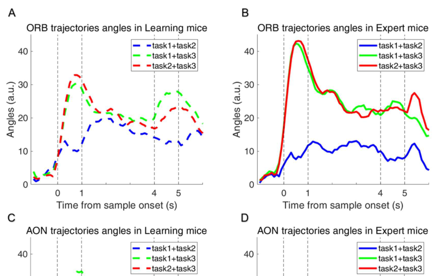

图 3-40 不同行为阶段眶额叶皮层和前嗅核群体神经元在三维解码空间中不同任务的活动 轨迹夹角动态差异

Figure 3-40 Calculating single neuron’s encoding abilities of sample odor information in different time windows during mice performing tasks

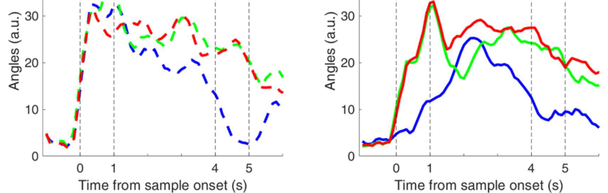

注： (A) 学习阶段眶额叶皮层群体神经元任务活动轨迹之间夹角的动态变化。蓝色线代

表群体神经元任务 1 和任务 2 轨迹之间的夹角变化，绿色代表代表群体神经元任 务 1 和任务 3 轨迹之间的夹角变化，红色代表群体神经元任务 2 和任务 3 轨迹之 间的夹角变化。 (B) 学会阶段眶额叶皮层群体神经元任务活动轨迹之间夹角的动 态变化。蓝色线代表群体神经元任务 1 和任务 2 轨迹之间的夹角变化，绿色代表 代表群体神经元任务 1 和任务 3 轨迹之间的夹角变化，红色代表群体神经元任务 2 和任务 3 轨迹之间的夹角变化。 (C) 学习阶段前嗅核群体神经元任务活动轨迹 之间夹角的动态变化。蓝色线代表群体神经元任务 1 和任务 2 轨迹之间的夹角变 化，绿色代表代表群体神经元任务 1 和任务 3 轨迹之间的夹角变化，红色代表群 体神经元任务 2 和任务 3 轨迹之间的夹角变化。(D) 学会阶段前嗅核群体神经元 任务活动轨迹之间夹角的动态变化。蓝色线代表群体神经元任务 1 和任务 2 轨迹 之间的夹角变化，绿色代表代表群体神经元任务 1 和任务 3 轨迹之间的夹角变化， 红色代表群体神经元任务 2 和任务 3 轨迹之间的夹角变化。

(A) The dynamic changes of the angle between task activity trajectories of orbitofrontal cortex neurons during the learning stage. The blue line represents the changes of the angle between the activity trajectories of the neural population for Task 1 and Task 2. The green line represents the changes of the angle between the activity trajectories for Task 1 and Task 3. The red line represents the changes of the angle between the activity trajectories for Task 2 and Task 3. (B) The dynamic changes of the angle between task activity trajectories of orbitofrontal cortex neurons during the expert stage. (C) The dynamic changes of the angle between task activity trajectories of anterior olfactory nucleus neurons during the learning stage. (D) The dynamic changes of the angle between task activity trajectories of anterior olfactory nucleus neurons during the expert stage.

## 3.5.3 全脑群体神经元活动轨迹

进一步，本研究对全脑多个区域群体神经元在解码空间中不同任务轨迹之间 的夹角进行了计算，图 3-41 所示为多个脑区群体神经元任务 1 和任务 3 活动轨 迹夹角与任务 1 和任务 2 活动轨迹夹角在学习阶段（图 3-41 A）和学会阶段（图 3-41 B）的动态差值（与 3.5.2 中相同，该值越大表明任务 1 活动轨迹与任务 3 活 动轨迹越分离）。可以发现，全脑范围内都表现出随着行为阶段的切换（从学习 阶段导学会阶段），群体神经元在样本阶段和延迟部分阶段表现出任务 1 和任务 3 活动轨迹的分离以及任务 1 和任务 2 的聚合。其中海马区域（CA1、CA3、DG、 RHP）、纹状体区域（CP、ACB）以及苍白球区域（PALd、PALv、PALm）均有 所体现。综上，本研究发现群体神经元随着学习的进程，任务活动轨迹趋于任务 结构特异性的收缩，即相同结构任务在表征上愈发接近而不同结构任务则差异越 大。

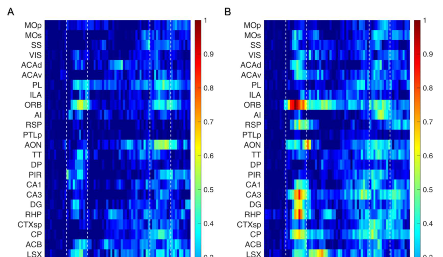

Figure 3-41 Calculating single neuron’s encoding abilities of sample odor information in different time windows during mice performing tasks

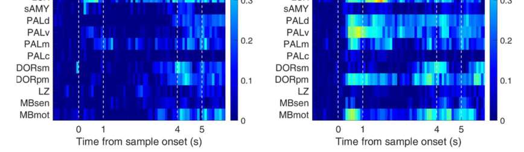

Figure 3-41 Calculating single neuron’s encoding abilities of sample odor information in different time windows during mice performing tasks

注： (A) 该热图展示了全脑多个区域群体神经元在学习阶段任务 1 与任务 3 活动轨迹 夹角减去任务 1 与任务 2 活动轨迹夹角的值。X 轴表示从样本气味释放开始的时 间（秒），Y 轴列出了不同的脑区。颜色条表示解码强度，其中红色表示较高的差 值，蓝色表示较低的差值。(B) 该热图展示了全脑多个区域群体神经元在学会阶段 任务 1 与任务 3 活动轨迹夹角减去任务 1 与任务 2 活动轨迹夹角的值。
(A) The heatmap illustrates the values of the difference between the angle of activity trajectories of neuronal populations across multiple brain regions between Task 1 and Task 3, and the angle of activity trajectories between Task 1 and Task 2, during the learning stage. The X-axis represents time in seconds from the onset of odor sample release, and the Y-axis lists different brain areas. The color bar indicates the level of decoding strength, with red representing higher difference and blue representing lower difference. (B) The heatmap illustrates the values of the difference between the angle of activity trajectories of neuronal populations across multiple brain regions between Task 1 and Task 3, and the angle of activity trajectories between Task 1 and Task 2, during the expert stage.

## 第 4 章 研究结论与讨论

## 4.1 结论

本研究训练小鼠学习并完成多任务序列学习任务，并在小鼠执行任务时植入 6 根神经像素电极（Neuropixels probe）进行全脑范围内的大规模在体胞外电生理 记录，观察到多个脑区均参与样本信息的编码，同时群体神经元对于样本信息的 编码存在任务结构特异性的泛化表征，以及这种泛化表征会随着行为阶段的切换 发生改变。

在小鼠执行任务时，需依次完成 3 个子任务——任务 1 为延迟匹配偶联任 务，任务 2 为干扰气味覆盖整个延迟期的延迟匹配偶联任务，任务 3 为样本阶段 延长的非延迟匹配偶联任务。其中任务 1 和任务 2 机构基本相同属于工作记忆相 关任务，而任务 3 则为结构完全不同的非工作记忆任务。根据小鼠任务表现将整 体行为分为两个阶段：学习阶段和学会阶段。

在单细胞层面，单个神经元不仅能够表现出对样本信息的任务特异性编码， 也能在不同任务之间实现泛化性的神经表征，同时神经元在相同任务中对样本信 息的动态编码也存在个体差异。

在群体神经元层面，眶额叶皮层神经元在学习阶段三个任务中分别表现出较 为差异化的群体编码模式——在任务 1 中存在样本和测试两个阶段的样本信息 编码能力峰值体现，在任务 2 中编码能力集中在样本阶段（样本阶段编码能力增 强而测试阶段编码能力减弱），以及在任务 3 中呈现出从样本到测试整个过程中 较为平均的编码表现。而随着行为阶段的切换，（学会阶段）眶额叶皮层则表现 出任务结构依赖的泛化性编码模式，即群体神经元在任务 1 和任务 2 之间（任务 结构相同，均为工作记忆任务）存在相似编码表征（对样本信息的编码集中在样 本阶段）而任务 3（与任务 1 和 2 结构不同，为非工作记忆任务）则编码模式截 然不同（与学习阶段一致）。通过对群体神经元在不同任务中编码能力的自相关 性分析以及任务之间的相关性分析，进一步揭示了学习阶段眶额叶皮层存在更为 特异化的任务表征，以及在学会阶段更为一致化的任务结构特异性共享神经表征。 在全脑层面，除了眶额叶皮层，其他多个脑区也均表现出在不同行为阶段差 异化的任务特异性或泛化性表征。虽然个别脑区如前嗅核在不同行为阶段均与眶 额叶表现出动态差异化的泛化性神经表征，但从整体来看全脑群体神经元在学习 阶段更多地呈现出特异化的任务表征，而在学会阶段则表现出更为一致化的任务 结构特异性的泛化神经表征

借助机器学习手段，本研究利用支持向量机计算不同脑区在不同任务中对于 样本信息的分类平面，进而得到群体神经元在不同任务中对样本信息的解码表现。 与之前编码分析结果类似，眶额叶皮层群体神经元在学习阶段不同任务中的解码

存在差异，在学习阶段表现出任务结构相同的任务之间相似的解码表现而不同结 构任务之间不同的解码表现。为了进一步探究这种行为阶段差异化的任务特异化 或一致化解码模式，本研究对群体神经元进行了跨任务解码分析，利用一个任务 的训练集得到解码器后应用于其他任务测试集即得到群体神经元跨任务解码表 现。结果显示，全脑多个脑区在任务结构相同任务之间具有跨任务解码能力，同 时这种跨任务解码能力存在行为阶段差异性、双向性以及脑区差异性。与全脑神 经元所呈现出的不同阶段性的任务编码模式一致，跨任务解码分析再一次验证了 全脑中虽然存在个体脑区解码能力差异，但整体上还是随着学习的进程表现出更 多地任务依赖性的泛化性编码模式。

另外，本研究针对群体神经元在不同任务以及不同行为阶段所呈现出的解码 动态差异变化，提出“群体神经元动态重组理论”——在学习阶段群体神经元在 不同任务中实现对样本信息的编码与维持等功能时会根据任务需求对整体进行 不同分类和规划，即在不同阶段（样本阶段、延迟阶段、测试阶段）召集不同亚 群的神经元来主要负责样本信息的编码，而随着任务的切换与任务需求的改变不 同亚群神经元也呈现不同改变（例如任务 1 到任务 2，因为结构相同亚群分类大 致类似但伴随任务 2 中信息维持难度的提升群体会召集更多地神经元负责样本 及延迟阶段的信息编码；而任务 2 到任务 3，因为结构完全不同则群体表现出对 不同亚群神经元更为彻底地重组织）。通过对眶额叶皮层及前嗅核等脑区在学习 阶段的样本选择性神经元的分类，进而得到不同亚群分别进行跨任务解码分析。 结果初步验证了本研究的理论假说，而进一步学会阶段的分析结果表明群体神经 元在该阶段已经建立较为稳定的编码结构和模式，即在任务结构相同的任务之间 切换时亚群分类变化较小且不同亚群跨任务解码能力较为一致。综上，本研究在 这提出了一种理论假说，指出大脑在学习阶段更多地处在一种高度动态变化的状 态（体现在任务切换时群体对于神经元的重组织编码），而在学会阶段趋于一种 稳定状态。后续需要进一步通过实验和计算模拟来深入探究验证。

最后，本研究通过分别得到群体神经元在不同任务中对于样本信息的解码器， 进而构成三维解码空间并得到群体任务活动在其中的轨迹变化。从整体来看，相 比于学习阶段，学会阶段群体神经元更趋于结构相同任务的活动轨迹相对接近而 结构不同的任务则相对分离，进一步揭示了随着学习的进行群体神经元对于样本 信息的编码呈现出任务特异性的共享表征。

## 4.2 讨论

## 4.2.1 群体神经元在任务不同阶段中的跨任务编码能力探究

Kim 等人在最近发表的一项工作中发现，前外侧运动皮层（anterior lateral motor cortex, ALM）神经元在新的任务中呈现新的准备活动（preparatory activity）

而在之后回到旧任务又表现出与开始时任务相近的准备活动，但是作为对照样本 阶段以及响应阶段的神经元信息表征则能在新旧任务之间很好泛化。基于此， Kim 等人认为这种运动相关记忆在连续学习中是被不断在新的平行空间中表征， 而不是对已经存在的表征进行修改。而本研究发现，眶额叶皮层所体现出的对于 样本信息的任务结构特异性跨任务编码能力不仅在样本阶段和测试阶段有所体 现，在延迟阶段同样也存在对于样本信息的任务间泛化性编码，并且在学习阶段 和学会阶段均有所体现。为了进一步探究群体神经元在任务不同阶段中的跨任务 编码能力，本研究同样对眶额叶皮层进行了编码方向分析（coding direction analysis），即通过将群体神经元在不同任务中的活动投射在任务不同时间段的编 码方向上（图 4-1）。可以看到，在学习阶段和学会阶段，眶额叶皮层群体神经元 在样本阶段的编码均能很好地在任务 1 和任务 2 之间表现出泛化能力，但任务 3 中编码则更为独立（图 4-1 A, C），这也再次验证了即使是对纯感觉信息的泛化性 编码也存在任务结构特异性。同时眶额叶皮层群体神经元在延迟阶段的编码同样 存在结构特异性的泛化能力，并且这种能力在学会阶段更为显著（图 4-1 B, D）。 综上，结果表明记忆相关信息的编码同样存在泛化机制，且与学习存在联系。当 然，Kim 等人在实验设计上与本研究存在一些差异——训练小鼠学习延迟响应任 务（delayed response task），即在他们研究框架中的延迟阶段编码包含感觉刺激以 及运动准备等信息（且运动信息占主要部分）。故而本研究可以说，运动相关记 忆信息或者说运动计划（motor planning）在连续学习中不存在泛化表征而感觉相 关记忆信息则具有一定的泛化性编码表现。

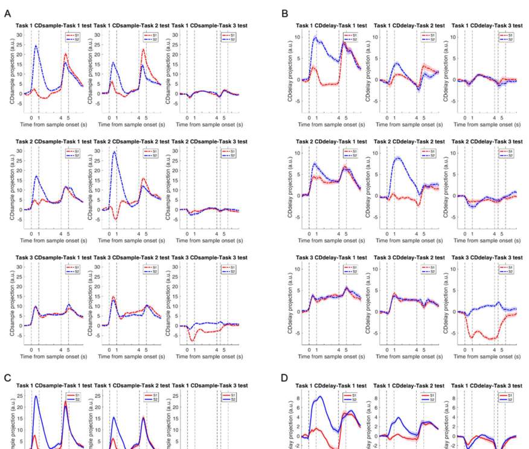

图 4-1 眶额叶皮层群体神经元的跨任务编码方向分析

Figure 4-1 Cross-task coding direction analysis of population neurons in the orbitofrontal cortex

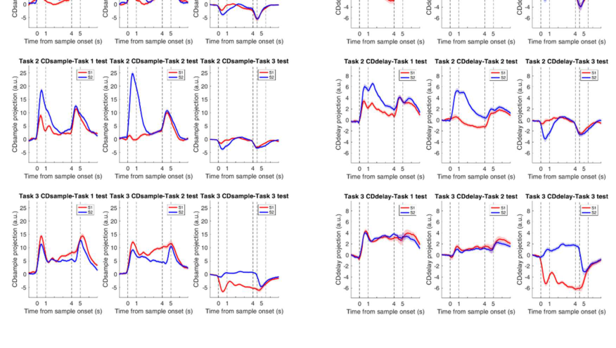

注： (A) 在学习阶段眶额叶皮层群体神经元跨任务样本阶段编码方向分析结果。红色为 sample 1，蓝色为 sample 2。(B) 在学习阶段眶额叶皮层群体神经元跨任务延迟阶

段编码方向分析结果。(C) 在学会阶段眶额叶皮层群体神经元跨任务样本阶段编 码方向分析结果。(D) 在学会阶段眶额叶皮层群体神经元跨任务延迟阶段码编码 方向分析结果。

(A) Cross-task sample-period coding direction analysis of the orbitofrontal cortex neurons during the learning stage. Red indicates sample 1, blue indicates sample 2. (B) Cross-task delay-period coding direction analysis of the orbitofrontal cortex neurons during the learning stage. (C) Cross-task sample-period coding direction analysis of the orbitofrontal cortex neurons during the expert stage. (D) Cross-task delay-period coding direction analysis of the orbitofrontal cortex neurons during the expert stage.

## 4.2.2 群体神经元对于测试气味信息的跨任务编码能力

之前的研究中本研究主要关注样本气味，即在每个任务测试中出现的第一个 气味，分析了眶额叶皮层等多个脑区对于该气味信息的编码能力以及这种能力在 不同任务之间的动态变化。结果显示神经元对于样本气味信息的编码能力在任务 结构相同的任务之间（任务 1 和任务 2 之间）存在一定相关性，而在结构不同的 任务之间（任务 1 或任务 2 和任务 3 之间）基本没有，揭示了群体神经元对于样 本信息存在任务结构依赖的泛化性神经表征（generalized neural representation）。 那么，这种编码模式是否同样适用于其他任务相关信息例如测试气味呢？为了进 一步探讨这个问题，本研究对群体神经元编码测试气味信息的能力以及这种能力 在不同任务之间的相关性进行了计算分析，结果如图 4-3 所示。可以看到，眶额 叶皮层和前嗅核对测试气味信息的编码能力在任意两个任务之间（任务 1 和任务 2、任务 2 和任务 3、任务 1 和任务 2）测试阶段均有很强的相关性，这表明测试 气味信息在不同任务中的编码能够很好地被共享。换句话说，相比于对样本信息 的编码，群体神经元存在对测试气味信息的非任务结构特异的泛化性编码模式。 但是，这里要说明的一点是，与样本气味不同测试气味在不同任务中均为同一气 味组合（图 3-1）。所以，在这里对测试气味信息的分析即是对同一气味在不同任 务场景下编码模式差异的探究。

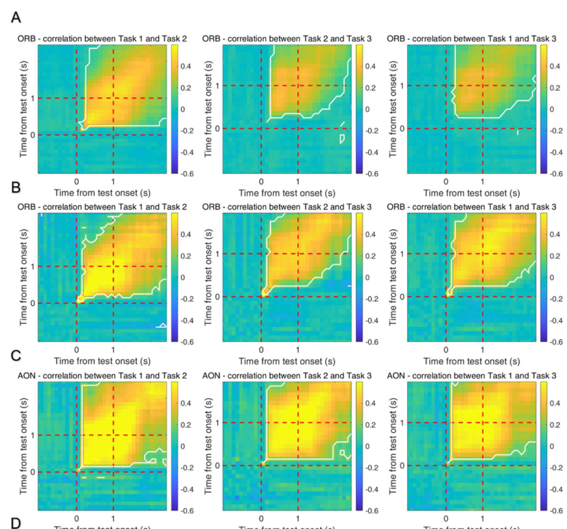

Figure 4-2 The correlation of the population encoding ability of orbitofrontal cortex and anterior olfactory nucleus neurons for test odor information between different tasks during different behavioral stages

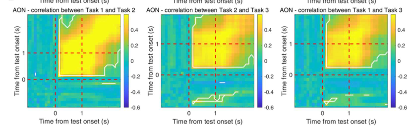

Figure 4-2 The correlation of the population encoding ability of orbitofrontal cortex and anterior olfactory nucleus neurons for test odor information between different tasks during different behavioral stages

注： (A) 在学习阶段眶额叶皮层神经元在任务 1 与任务 2（左图）、任务 2 与任务 3（中 图）以及任务 1 和任务 3（右图）中对测试气味的编码能力在不同时间窗口的相关 性。颜色条表示相关系数的大小，从 0（无相关性，蓝色）到 0.4（强相关性，黄 色）。白色线条圈出来的区域表示具有统计显著性的相关性（双边检验，p < 0.001）。 (B) 在学会阶段眶额叶皮层神经元在任务 1 与任务 2（左图）、任务 2 与任务 3（中 图）以及任务 1 和任务 3（右图）中对测试气味的编码能力在不同时间窗口的相关

性。(C) 在学习阶段前嗅核神经元在任务 1 与任务 2（左图）、任务 2 与任务 3（中 图）以及任务 1 和任务 3（右图）中对测试气味的编码能力在不同时间窗口的相关 性。(D) 在学会阶段前嗅核神经元在任务 1 与任务 2（左图）、任务 2 与任务 3（中 图）以及任务 1 和任务 3（右图）中对测试气味的编码能力在不同时间窗口的相关 性。

(A) The correlation between the encoding ability for test odor information of the orbitofrontal cortex neurons for sample information in Task 1 and Task 2 (left figure), Task 2 and Task 3 (middle figure) and Task 1 and Task 3 (right figure) during the learning stage. The color bar indicates the magnitude of the correlation coefficient, ranging from 0 (no correlation, blue) to 0.4 (stronger correlation, yellow). The regions enclosed by white lines denote statistically significant correlations (two-tailed test, p < 0.001). (B) The correlation between the encoding ability for test odor information of the orbitofrontal cortex neurons for sample information in Task 1 and Task 2 (left figure), Task 2 and Task 3 (middle figure) and Task 1 and Task 3 (right figure) during the expert stage. (C) The correlation between the encoding ability for test odor information of the anterior olfactory nucleus neurons for sample information in Task 1 and Task 2 (left figure), Task 2 and Task 3 (middle figure) and Task 1 and Task 3 (right figure) during the learning stage. (D) The correlation between the encoding ability for test odor information of the anterior olfactory nucleus neurons for sample information in Task 1 and Task 2 (left figure), Task 2 and Task 3 (middle figure) and Task 1 and Task 3 (right figure) during the expert stage.

同样，本研究对全脑多个区域群体神经元对测试气味信息的跨任务解码能力 进行了计算，结果如图 4-4 所示。可以看到，多个脑区群体神经元在测试阶段表 现出在任务 1 和任务 2 之间双向的跨任务解码能力（图 4-4 A, B），以及这种能 力在不同行为阶段（学习阶段和学会阶段）之间也保持相对稳定。令人意外的是， 群体神经元在结构不同的任务之间（从任务 1 到任务、从任务 2 到任务 3）呈现 出全脑范围的跨任务解码表现整体降低（与结构相同任务之间跨任务表现相比） （图 4-4 C, D）。这说明即使是相同气味，在不同任务之间对该信息的共享神经 表征（shared neural representation）依然存在任务结构特异性的差异，即相同信息 在不同任务情景（task context）下编码模式也会有所改变。

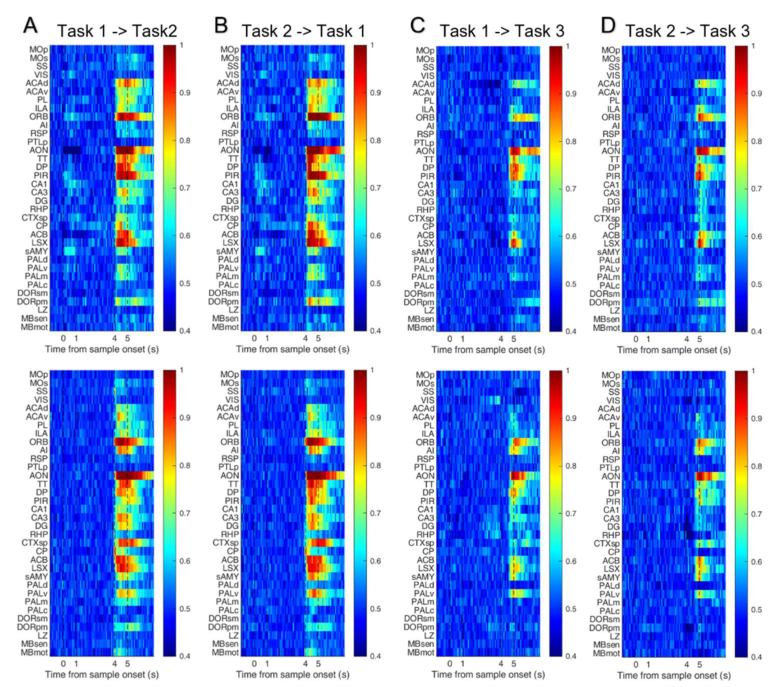

图 4-3 在不同行为阶段全脑多个区域对于测试气味信息的跨任务解码表现

Figure 4-3 Cross-task population decoding performance for test odor information of multiple regions during different behavioral stages

注： (A) 该热图展示了在学习阶段（上图）和学会阶段（下图）从任务 1 到任务 2 对测 试气味的跨任务解码能力。X 轴表示从样本气味释放开始的时间（秒），Y 轴列出 了不同的脑区。颜色条表示解码强度，其中红色表示较高的解码强度，蓝色表示较 低的解码强度。(B) 该热图展示了在学习阶段（上图）和学会阶段（下图）从任务 2 到任务 1 对测试气味的跨任务解码能力。(C) 该热图展示了在学习阶段（上图） 和学会阶段（下图）从任务 1 到任务 3 对测试气味的跨任务解码能力。(D) 该热 图展示了在学习阶段（上图）和学会阶段（下图）从任务 2 到任务 3 对测试气味 的跨任务解码能力。

(A) The heatmap illustrates the cross-task decoding strength of test odor information from Task 1 to Task 2 during the learning stage (figure above) and the expert stage (bottom figure). The X-axis represents time in seconds from the onset of odor sample release, and the Y-axis lists different brain areas. The color bar indicates the level of decoding strength, with red representing higher decoding strength and blue representing lower decoding strength. (B) The heatmap illustrates the cross-task decoding strength of test odor information from Task 2 to Task 1 during the learning stage (figure above) and the expert stage (bottom figure). (C) The heatmap illustrates the cross-task decoding strength of test odor information from Task 1 to Task 3 during the learning stage (figure above) and the expert stage (bottom figure). (D) The heatmap illustrates the cross-task decoding strength of test odor information from Task 2 to Task 3 during the learning stage (figure above)

and the expert stage (bottom figure).

## 4.2.3 任务难度与小鼠行为之间的关系

之前结果显示群体神经元对样本信息的编码能力在不同任务中存在差异，例 如眶额叶皮层群体神经元在任务 2 延迟阶段对样本信息的编码一致性显著低于 在任务 1 中（图 3-23; 图 3-25），以及任务 3 中样本信息编码能力显著高于任务 1.。本研究推测，这种样本阶段编码能力的差异可能是因为不同任务之间存在难 度差异，即对比三个任务延迟阶段——任务 3 中样本气味持续存在难度最低，任 务 2 中持续存在干扰气味（mask odor）所以难度最高，任务 1 中为空白阶段故难 度介于任务 3 和任务 2 之间。但是，在小鼠执行任务时并未表现出与任务难度相 关的行为差异，这可能和任务顺序（任务 1 到任务 2 再到任务 3，只能说任务 2 难度会升高而任务 1 和任务 3 很难直接对比）、学习效应（经过任务 1 的学习进 入任务 2，故在学习阶段可以看到小鼠行为反而表现有所提高）以及延迟时间（任 务 1 和任务 2 延迟期只有 3 秒，而之前的研究证明延迟匹配偶联任务难度会随着 延迟时间增加而提高（Zhang et al., 2019））相关。为了进一步比较三种任务结构， 本研究对任务范式进行了调整：将任务 1 延迟阶段时间从之前固定的 3 秒变为更 长的且变换的时间（5s、7s、10s、14s、20s），任务 2 相应的干扰气味持续时间 也随之改变，而任务 3 则同理调整了样本阶段的时间，如图 4-5 A 所示。这里用 到的小鼠与本研究之前小鼠一致，即在完成之前的任务和记录后再经过 1 到 2 天 行为稳定时间后训练小鼠进行这个任务，因为延迟时间改变导致测试时间变长故 每个小鼠每个 session 只会出现一组两种任务的对比（例如任务 1 和任务 2，或 者是任务 1 和任务 3）。小鼠行为表现如图 4-5 B 所示，可以看到对比任务 1 中表 现任务 2 中小鼠表现整体偏低（其中 5s 延迟时具有显著性差异，而其他更长延 迟测试则没有，这可能是因为长延迟测试对于小鼠行为影响很大以至于任务结构 带来的影响并不明显）；而任务 3 则整体行为高于任务 1，换句话说小鼠在任务 3 中行为不会随着延迟期时间的增加（在任务 3 中即样本阶段时间长增加）而表现 降低，再一次证明任务 3 为非工作记忆任务，与任务 1 和任务 2 在结构上有本质 差异。之后我们也会结合电生理数据进行更为深入的探究。

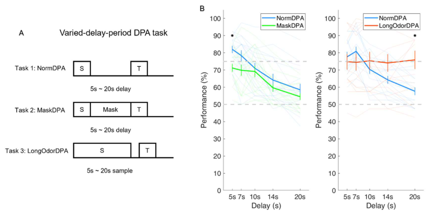

图 4-4 小鼠在学会阶段进行解码表现

Figure 4-4 The population cross-task decoding performance of orbitofrontal cortex and anterior olfactory nucleus neurons during different stages

注： (A) 可变延迟任务范式 (B) 小鼠在不同任务中的行为表现。星号代表显著性(MannWhitney U 检验，p < 0.05)。
(A) Paradigm of varied-delay task. (B) Performance of mice in different tasks. The asterisk indicates significance (Mann-Whitney U test，p < 0.05).

## 4.3 本研究的局限与未来展望

## 4.3.1 实验范式的选择与取舍

本研究基于嗅觉延迟匹配偶联任务，设计并训练小鼠执行多任务序列学习任 务。本研究通过对小鼠全脑进行大规模电生理记录，发现存在全脑尺度下的任务 特异性及泛化性编码模式。其中结果表明有的脑区群体神经元在学习阶段中表现 出在任务测试阶段的对样本信息的编码能力，本研究认为这种表征与样本信息的 重激活（reactivation）或者说再提取（retrieval）相关。但是基于本研究的任务设 计，小鼠在任务测试响应阶段的报告方式为舔或者不舔，是一种行动与否的报告 逻辑（go/no-go），故在该阶段群体神经元的任务相关信息编码时较为复杂的或者 说存在很大的重叠（例如行动（action）、动机（motivation）、奖赏（reward），以 及选择（choice）等更为抽象信息的编码）。从行为设计的角度来看，二选一强迫 选择任务（Two-alternative-forced-choice task, 2AFC）可能是一种更好的设计，即 将小鼠在响应阶段的报告方式改为舔左或者舔右（Wu et al., 2020）。这种任务报 告方式要求小鼠准确报告自己是否正确记忆并理解任务且回答正确才可以得到 奖励，而不是可以像在 go/no-go 任务中采取全部 go 的策略即能获得一半奖励， 从而可以很好地去除测试阶段关于奖赏等信息的编码干扰。但是 2AFC 任务对小

鼠来讲相对困难一点，一方面在训练上需要花更多的时间故而很难去探究学习对 于泛化性编码模式的影响，另一方面在记录当中因为时间较长复杂的任务需求可 能会使小鼠表现出阶段性选择放弃行为。所以在综合实验设计和科学问题之后选 择了本研究中的范式来展开研究，后续分析中我们会结合视频数据以及小鼠舔水 信息来对运动相关信息与神经活动可能存在的联系进行一定程度的消除。

## 4.3.2 实验记录手段的局限性与未来展望

在本研究中，本研究使用了 Neuropixels 电极实现了对小鼠在执行多任务序 列学习任务时的全脑尺度的（从大脑前端额极到中脑位置，横跨 37 个脑区）大 规模（经过单细胞分选和质量控制后，得到共 30629 个神经元）胞外电生理记录， 对大脑如何在任务切换时实现灵活认知功能有了初步的全局认知。为了进一步验 证本研究的结果于理论假说，除了通过神经网络模拟的方法，还可以借助光遗传 技术来实现如特定脑区特定时间点的功能性抑制——实验验证单一脑区或是脑 区之间联系对于大脑实现灵活认知的重要性，以及结合电生理记录手段来验证抑 制某个或某些重要脑区节点（node）是否会对整体编码模式以及网络结构造成改 变。但是，现在的 Neuropixels 1.0 版本因为其硅片电极本质（容易受到光干扰， 尤其是蓝光），以及光遗传技术存在的问题（例如硬件方面：光纤插针需要在光 照影响面积和组织损伤之间有所取舍；以及手术方面：精准定位电生理记录相关 区域存在挑战），本研究很难在现行条件下做到对全脑多个脑区进行记录的同时 实现光遗传操控。Carandini 实验室开发了一种新版本的 Neuropixels 电极，通过 埋置光纤在电极两侧实现了对区域性群体神经元高分辨率电生理记录的同时能 够进行精确光遗传操控的实验目的（图 4-5）（Lakunina et al., 2025）。另外，在本 研究中对于不同脑区群体神经元的记录以及相同神经元不同行为阶段编码的对 比均是一种阶段性采样的实验方法（例如分析中所展示眶额叶皮层群体神经元实 则来自多只小鼠以及可能来自同一只小鼠不同天的采集，同样学习阶段群体神经 元也于学会阶段神经元不为同一群神经元）。如果想要在一个框架内探讨例如同 一群神经元随着学习阶段的变化群体编码发生的改变这类问题，长期植入 Neuropixels 或者时双光子成像则是更好的选择，如 Melin 等人 2024 年的一项工 作中就实现了对群体神经元的长期追踪记录（图 4-6）（Melin et al., 2024）。但反 过来说这样也会限制本研究对于脑区的选择以及神经元采集总量，故在初期本研 究还是采取了急性记录的方式来先得到一个对于大脑如何实现灵活认知这一科 学问题的更为全面的初步认识，而在得到部分结果和理论假设后进而可以结合上 述技术手段来展开仔细而深入的探究。

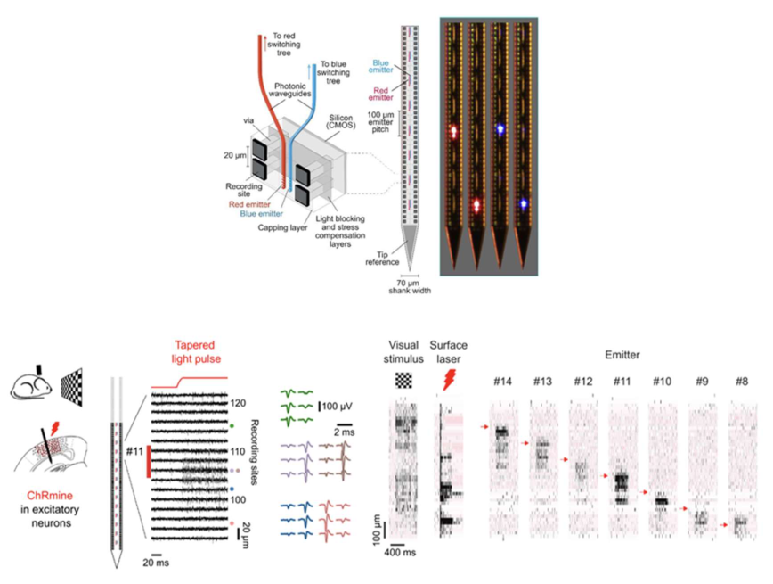

图 4-5 结合高分辨率电生理技术和光遗传技术的新型 Neuropixels 电极

Figure 4-5 The new type of Neuropixels probes combining high-resolution electrophysiology and optogenetics

注： 新型 Neuropixels 电极可以很好地结合高分辨率电生理和光遗传技术实现对区域神 经元的精准操控与记录。

The new Neuropixels probes can effectively integrate high-resolution electrophysiology and optogenetics to achieve precise manipulation and recording of regional neurons.

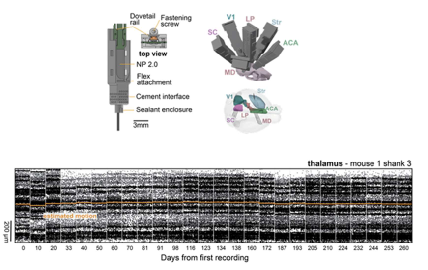

图 4-6 长期植入 Neuropixels 电极实现对相同群体神经元的长期追踪记录

Figure 4-5 The new type of Neuropixels probe combining high-resolution electrophysiology

and optogenetics
注： 长期植入 Neuropixels 电极实现对相同群体神经元长达数月的稳定记录。

The long-term implantation of Neuropixels probes allows for stable recording of the same population of neurons across several months.

## 参考文献
Allen, W. E., Chen, M. Z., Pichamoorthy, N., Tien, R. H., Pachitariu, M., Luo, L., & Deisseroth, K. (2019). Thirst regulates motivated behavior through modulation of brainwide neural population dynamics. Science, 364(6437).
Armbruster, D. J., Ueltzhöffer, K., Basten, U., & Fiebach, C. J. (2012). Prefrontal cortical mechanisms underlying individual differences in cognitive flexibility and stability. J Cogn Neurosci, 24(12), 2385-2399.
Asaad, W. F., Rainer, G., & Miller, E. K. (2000). Task-specific neural activity in the primate prefrontal cortex. J Neurophysiol, 84(1), 451-459.
Baddeley, A. (1992). Working memory. Science, 255(5044), 556-559.
Baddeley, A. (2000). The episodic buffer: a new component of working memory? Trends Cogn Sci, 4(11), 417-423.
Baddeley, A. D., & Hitch, G. (1974). Working Memory. In G. H. Bower (Ed.), Psychology of Learning and Motivation (Vol. 8, pp. 47-89): Academic Press.
Bahrami, S., Nordengen, K., Rokicki, J., Shadrin, A. A., Rahman, Z., Smeland, O. B., . . . Andreassen, O. A. (2024). The genetic landscape of basal ganglia and implications for common brain disorders. Nat Commun, 15(1), 8476.
Behrens, T. E. J., Muller, T. H., Whittington, J. C. R., Mark, S., Baram, A. B., Stachenfeld, K. L., & Kurth-Nelson, Z. (2018). What Is a Cognitive Map? Organizing Knowledge for Flexible Behavior. Neuron, 100(2), 490-509.
Bell, A. J., & Sejnowski, T. J. (1995). An information-maximization approach to blind separation and blind deconvolution. Neural Comput, 7(6), 1129-1159.
Bellafard, A., Namvar, G., Kao, J. C., Vaziri, A., & Golshani, P. (2024). Volatile working memory representations crystallize with practice. Nature, 629(8014), 1109-1117.
Bolkan, S. S., Stone, I. R., Pinto, L., Ashwood, Z. C., Iravedra Garcia, J. M., Herman, A. L., . . . Witten, I. B. (2022). Opponent control of behavior by dorsomedial striatal pathways depends on task demands and internal state. Nature Neuroscience, 25(3), 345-357.
Bondy, A. G., Charlton, J. A., Luo, T. Z., Kopec, C. D., Stagnaro, W. M., Venditto, S. J. C., . . . Brody, C. D. (2024). Coordinated cross-brain activity during accumulation of sensory evidence and decision commitment. biorxiv, 2024.2008.2021.609044.
Brunert, D., Medinaceli Quintela, R., & Rothermel, M. (2023). The anterior olfactory nucleus revisited - An emerging role for neuropathological conditions? Prog Neurobiol, 228, 102486.
Burgess, C. P., Lak, A., Steinmetz, N. A., Zatka-Haas, P., Bai Reddy, C., Jacobs, E. A. K., . . . Carandini, M. (2017). High-Yield Methods for Accurate Two-Alternative Visual Psychophysics in Head-Fixed Mice. Cell Rep, 20(10), 2513-2524.

Chen, S., Liu, Y., Wang, Z. A., Colonell, J., Liu, L. D., Hou, H., . . . Svoboda, K. (2024).

Brain-wide neural activity underlying memory-guided movement. Cell, 187(3), 676-691.e616.

Christophel, T. B., Klink, P. C., Spitzer, B., Roelfsema, P. R., & Haynes, J.-D. (2017). The Distributed Nature of Working Memory. Trends in Cognitive Sciences, 21(2), 111-124.

Churchland, M. M., & Shenoy, K. V. (2024). Preparatory activity and the expansive null-space. Nature Reviews Neuroscience, 25(4), 213-236.

Dahmen, D., Recanatesi, S., Jia, X., Ocker, G. K., Campagnola, L., Seeman, S., . . . Shea-Brown, E. (2023). Strong and localized recurrence controls dimensionality of neural activity across brain areas. biorxiv, 2020.2011.2002.365072.

Delmonte, S., Gallagher, L., O'Hanlon, E., McGrath, J., & Balsters, J. H. (2013). Functional and structural connectivity of frontostriatal circuitry in Autism Spectrum Disorder. Front Hum Neurosci, 7, 430.

Driscoll, L. N., Duncker, L., & Harvey, C. D. (2022). Representational drift: Emerging theories for continual learning and experimental future directions. Current Opinion in Neurobiology, 76.

Driscoll, L. N., Pettit, N. L., Minderer, M., Chettih, S. N., & Harvey, C. D. (2017). Dynamic Reorganization of Neuronal Activity Patterns in Parietal Cortex. Cell, 170(5), 986-999.e916.
Driscoll, L. N., Shenoy, K., & Sussillo, D. (2024). Flexible multitask computation in recurrent networks utilizes shared dynamical motifs. Nature Neuroscience, 27(7), 1349-1363.

Duan, C. A., Pagan, M., Piet, A. T., Kopec, C. D., Akrami, A., Riordan, A. J., . . . Brody, C. D. (2021). Collicular circuits for flexible sensorimotor routing. Nature Neuroscience, 24(8), 1110-1120.

El-Gaby, M., Harris, A. L., Whittington, J. C. R., Dorrell, W., Bhomick, A., Walton, M. E., . . . Behrens, T. E. J. (2024). A cellular basis for mapping behavioural structure. Nature, 636(8043), 671-680.
Frank, M. J., Woroch, B. S., & Curran, T. (2005). Error-related negativity predicts reinforcement learning and conflict biases. Neuron, 47(4), 495-501.
Freedman, D. J., & Assad, J. A. (2006). Experience-dependent representation of visual categories in parietal cortex. Nature, 443(7107), 85-88.
Funahashi, S., Bruce, C. J., & Goldman-Rakic, P. S. (1989). Mnemonic coding of visual space in the monkey's dorsolateral prefrontal cortex. J Neurophysiol, 61(2), 331349.
Funahashi, S., Chafee, M. V., & Goldman-Rakic, P. S. (1993). Prefrontal neuronal activity in rhesus monkeys performing a delayed anti-saccade task. Nature, 365(6448), 753-756.
Fuster, J. M. (1973). Unit activity in prefrontal cortex during delayed-response performance: neuronal correlates of transient memory. J Neurophysiol, 36(1), 61-

78.

Fuster, J. M., & Alexander, G. E. (1971). Neuron activity related to short-term memory. Science, 173(3997), 652-654.

Gallego, J. A., Perich, M. G., Chowdhury, R. H., Solla, S. A., & Miller, L. E. (2020). Long-term stability of cortical population dynamics underlying consistent behavior. Nat Neurosci, 23(2), 260-270.
Gardner, M. P. H., Conroy, J. S., Shaham, M. H., Styer, C. V., & Schoenbaum, G. (2017). Lateral Orbitofrontal Inactivation Dissociates Devaluation-Sensitive Behavior and Economic Choice. Neuron, 96(5), 1192-1203.e1194.
Garvert, M. M., Dolan, R. J., & Behrens, T. E. (2017). A map of abstract relational knowledge in the human hippocampal-entorhinal cortex. Elife, 6.
Goudar, V., Peysakhovich, B., Freedman, D. J., Buffalo, E. A., & Wang, X.-J. (2023). Schema formation in a neural population subspace underlies learning-to-learn in flexible sensorimotor problem-solving. Nature Neuroscience, 26(5), 879-890.
Grahn, J. A., Parkinson, J. A., & Owen, A. M. (2009). The role of the basal ganglia in learning and memory: neuropsychological studies. Behav Brain Res, 199(1), 5360.
Han, Z., Zhang, X., Zhu, J., Chen, Y., & Li, C. T. (2018). High-Throughput Automatic Training System for Odor-Based Learned Behaviors in Head-Fixed Mice. Front Neural Circuits, 12, 15.
Hennig, J. A., Oby, E. R., Losey, D. M., Batista, A. P., Yu, B. M., & Chase, S. M. (2021). How learning unfolds in the brain: toward an optimization view. Neuron, 109(23), 3720-3735.
Hirokawa, J., Vaughan, A., Masset, P., Ott, T., & Kepecs, A. (2019). Frontal cortex neuron types categorically encode single decision variables. Nature, 576(7787), 446-451.
Jacobsen, C. F. (1936). Studies of cerebral function in primates. I. The functions of the frontal association areas in monkeys. Comparative Psychology Monographs, 13, 3, 1-60.
Jun, J. J., Steinmetz, N. A., Siegle, J. H., Denman, D. J., Bauza, M., Barbarits, B., . . . Harris, T. D. (2017). Fully integrated silicon probes for high-density recording of neural activity. Nature, 551(7679), 232-236.
Kaufman, M. T., Churchland, M. M., Ryu, S. I., & Shenoy, K. V. (2014). Cortical activity in the null space: permitting preparation without movement. Nat Neurosci, 17(3), 440-448.
Khilkevich, A., Lohse, M., Low, R., Orsolic, I., Bozic, T., Windmill, P., & Mrsic-Flogel, T. D. (2024). Brain-wide dynamics linking sensation to action during decisionmaking. Nature, 634(8035), 890-900.
Kim, J. H., Daie, K., & Li, N. (2025). A combinatorial neural code for long-term motor memory. Nature, 637(8046), 663-672.
Kira, S., Safaai, H., Morcos, A. S., Panzeri, S., & Harvey, C. D. (2023). A distributed and efficient population code of mixed selectivity neurons for flexible navigation decisions. Nature Communications, 14(1).
Krumin, M., Lee, J. J., Harris, K. D., & Carandini, M. (2018). Decision and navigation in mouse parietal cortex. Elife, 7.
Lakunina, A., Socha, K. Z., Ladd, A., Bowen, A. J., Chen, S., Colonell, J., . . . Carandini,
M. (2025). Neuropixels Opto: Combining high-resolution electrophysiology and optogenetics. biorxiv, 2025.2002.2004.636286.
Lee, J. J., Krumin, M., Harris, K. D., & Carandini, M. (2022). Task specificity in mouse parietal cortex. Neuron, 110(18), 2961-2969.e2965.
Lin, H., & Zhou, J. (2024). Hippocampal and orbitofrontal neurons contribute to complementary aspects of associative structure. Nat Commun, 15(1), 5283.
Liu, D., Gu, X., Zhu, J., Zhang, X., Han, Z., Yan, W., . . . Li, C. T. (2014). Medial prefrontal activity during delay period contributes to learning of a working memory task. Science, 346(6208), 458-463.
Losey, D. M., Hennig, J. A., Oby, E. R., Golub, M. D., Sadtler, P. T., Quick, K. M., . . . Chase, S. M. (2024). Learning leaves a memory trace in motor cortex. Current Biology, 34(7), 1519-1531.e1514.
Luo, T. Z., Kim, T. D., Gupta, D., Bondy, A. G., Kopec, C. D., Elliot, V. A., . . . Brody, C. D. (2024). Transitions in dynamical regime and neural mode underlie perceptual decision-making. biorxiv, 2023.2010.2015.562427.
MacDowell, C. J., Libby, A., Jahn, C. I., Tafazoli, S., & Buschman, T. J. (2023). Multiplexed Subspaces Route Neural Activity Across Brain-wide Networks. biorxiv, 2023.2002.2008.527772.
Machado, T. A., Kauvar, I. V., & Deisseroth, K. (2022). Multiregion neuronal activity: the forest and the trees. Nature Reviews Neuroscience, 23(11), 683-704.
Malmo, R. B. (1942). Interference factors in delayed response in monkeys after removal of frontal lobes. J Neurophysiol, 5, 295-308.
Mante, V., Sussillo, D., Shenoy, K. V., & Newsome, W. T. (2013). Context-dependent computation by recurrent dynamics in prefrontal cortex. Nature, 503(7474), 78-84.
Melin, M. D., Khanal, A., Vasquez, M., Ryan, M. B., Churchland, A. K., & Couto, J. (2024). Large scale, simultaneous, chronic neural recordings from multiple brain areas. biorxiv, 2023.2012.2022.572441.
Meyers, E. M., Freedman, D. J., Kreiman, G., Miller, E. K., & Poggio, T. (2008). Dynamic population coding of category information in inferior temporal and prefrontal cortex. J Neurophysiol, 100(3), 1407-1419.
Miyake, A., Friedman, N. P., Emerson, M. J., Witzki, A. H., Howerter, A., & Wager, T. D. (2000). The unity and diversity of executive functions and their contributions to complex "Frontal Lobe" tasks: a latent variable analysis. Cogn Psychol, 41(1), 49-100.

Pachitariu, M., Sridhar, S., & Stringer, C. (2023). Solving the spike sorting problem with Kilosort. biorxiv, 2023.2001.2007.523036.

Pachitariu, M., Steinmetz, N., Kadir, S., Carandini, M., & Kenneth D, H. (2016). Kilosort: realtime spike-sorting for extracellular electrophysiology with hundreds of channels. biorxiv, 061481.

Pagan, M., Urban, L. S., Wohl, M. P., & Rust, N. C. (2013). Signals in inferotemporal and perirhinal cortex suggest an untangling of visual target information. Nat Neurosci, 16(8), 1132-1139.

Panichello, M. F., Jonikaitis, D., Oh, Y. J., Zhu, S., Trepka, E. B., & Moore, T. (2024). Intermittent rate coding and cue-specific ensembles support working memory. Nature, 636(8042), 422-429.

Rajan, K., Harvey, Christopher D., & Tank, David W. (2016). Recurrent Network Models of Sequence Generation and Memory. Neuron, 90(1), 128-142.

Rigotti, M., Barak, O., Warden, M. R., Wang, X.-J., Daw, N. D., Miller, E. K., & Fusi, S. (2013). The importance of mixed selectivity in complex cognitive tasks. Nature, 497(7451), 585-590.

Ritz, H., Jha, A., Pillow, J., Daw, N. D., & Cohen, J. D. (2024). Humans actively reconfigure neural task states. biorxiv, 2024.2009.2029.615736.

Rowland, J. M., van der Plas, T. L., Loidolt, M., Lees, R. M., Keeling, J., Dehning, J., . . . Packer, A. M. (2023). Propagation of activity through the cortical hierarchy and perception are determined by neural variability. Nature Neuroscience, 26(9), 1584-1594.

Rule, M. E., O’Leary, T., & Harvey, C. D. (2019). Causes and consequences of representational drift. Current Opinion in Neurobiology, 58, 141-147.

Sakai, K. (2008). Task Set and Prefrontal Cortex. Annual Review of Neuroscience, 31(1), 219-245.

Sarma, A., Masse, N. Y., Wang, X. J., & Freedman, D. J. (2016). Task-specific versus generalized mnemonic representations in parietal and prefrontal cortices. Nat Neurosci, 19(1), 143-149.

Scott, W. A. (1962). Cognitive complexity and cognitive flexibility. Sociometry, 25(4), 405-414.

Shamash, P., Carandini, M., Harris, K., & Steinmetz, N. (2018). A tool for analyzing electrode tracks from slice histology. biorxiv, 447995.

Siniscalchi, M. J., Phoumthipphavong, V., Ali, F., Lozano, M., & Kwan, A. C. (2016). Fast and slow transitions in frontal ensemble activity during flexible sensorimotor behavior. Nature Neuroscience, 19(9), 1234-1242.

Steinmetz, N. A., Aydin, C., Lebedeva, A., Okun, M., Pachitariu, M., Bauza, M., . . . Harris, T. D. (2021). Neuropixels 2.0: A miniaturized high-density probe for stable, long-term brain recordings. Science, 372(6539), eabf4588.

Steinmetz, N. A., Zatka-Haas, P., Carandini, M., & Harris, K. D. (2019). Distributed

coding of choice, action and engagement across the mouse brain. Nature, 576(7786), 266-273.

Stokes, M. G., Kusunoki, M., Sigala, N., Nili, H., Gaffan, D., & Duncan, J. (2013). Dynamic coding for cognitive control in prefrontal cortex. Neuron, 78(2), 364-375. Stringer, C., Pachitariu, M., Steinmetz, N., Reddy, C. B., Carandini, M., & Harris, K. D. (2019). Spontaneous behaviors drive multidimensional, brainwide activity. Science, 364(6437), 255.

Sun, X., O'Shea, D. J., Golub, M. D., Trautmann, E. M., Vyas, S., Ryu, S. I., & Shenoy, K. V. (2022). Cortical preparatory activity indexes learned motor memories. Nature, 602(7896), 274-279.

Sussillo, D., Churchland, M. M., Kaufman, M. T., & Shenoy, K. V. (2015). A neural network that finds a naturalistic solution for the production of muscle activity. Nat Neurosci, 18(7), 1025-1033.
Tafazoli, S., Bouchacourt, F. M., Ardalan, A., Markov, N. T., Uchimura, M., Mattar, M. G., . . . Buschman, T. J. (2024). Building compositional tasks with shared neural subspaces. biorxiv, 2024.2001.2031.578263.
Takahashi, Y. K., Chang, C. Y., Lucantonio, F., Haney, R. Z., Berg, B. A., Yau, H. J., . . . Schoenbaum, G. (2013). Neural estimates of imagined outcomes in the orbitofrontal cortex drive behavior and learning. Neuron, 80(2), 507-518.
Tye, K. M., Miller, E. K., Taschbach, F. H., Benna, M. K., Rigotti, M., & Fusi, S. (2024). Mixed selectivity: Cellular computations for complexity. Neuron, 112(14), 22892303.
Uddin, L. Q. (2021). Cognitive and behavioural flexibility: neural mechanisms and clinical considerations. Nat Rev Neurosci, 22(3), 167-179.
Voitov, I., & Mrsic-Flogel, T. D. (2022). Cortical feedback loops bind distributed representations of working memory. Nature, 608(7922), 381-389.
Wallis, J. D., Anderson, K. C., & Miller, E. K. (2001). Single neurons in prefrontal cortex encode abstract rules. Nature, 411(6840), 953-956.
Wu, Z., Litwin-Kumar, A., Shamash, P., Taylor, A., Axel, R., & Shadlen, M. N. (2020). Context-Dependent Decision Making in a Premotor Circuit. Neuron, 106(2), 316328.e316.
Yang, G. R., Joglekar, M. R., Song, H. F., Newsome, W. T., & Wang, X.-J. (2019). Task representations in neural networks trained to perform many cognitive tasks. Nature Neuroscience, 22(2), 297-306.
Zhang, X., Yan, W., Wang, W., Fan, H., Hou, R., Chen, Y., . . . Li, C. T. (2019). Active information maintenance in working memory by a sensory cortex. Elife, 8.
Zhong, L., Baptista, S., Gattoni, R., Arnold, J., Flickinger, D., Stringer, C., & Pachitariu, M. (2024). Distinct streams for supervised and unsupervised learning in the visual cortex. biorxiv, 2024.2002.2025.581990.
Zhou, J., Jia, C., Montesinos-Cartagena, M., Gardner, M. P. H., Zong, W., &

Schoenbaum, G. (2020). Evolving schema representations in orbitofrontal ensembles during learning. Nature, 590(7847), 606-611.
Zhou, J., Montesinos-Cartagena, M., Wikenheiser, A. M., Gardner, M. P. H., Niv, Y., & Schoenbaum, G. (2019). Complementary Task Structure Representations in Hippocampus and Orbitofrontal Cortex during an Odor Sequence Task. Current Biology, 29(20), 3402-3409.e3403.
Zhou, J., Zong, W., Jia, C., Gardner, M. P. H., & Schoenbaum, G. (2021). Prospective representations in rat orbitofrontal ensembles. Behav Neurosci, 135(4), 518-527.
Zhu, J., Cheng, Q., Chen, Y., Fan, H., Han, Z., Hou, R., . . . Li, C. T. (2020). Transient Delay-Period Activity of Agranular Insular Cortex Controls Working Memory Maintenance in Learning Novel Tasks. Neuron, 105(5), 934-946.e935.

## 致 谢

## 作者简历及攻读学位期间发表的学术论文与其他相关学术成果
