连续学习的神经机制研究

Neural mechanisms of cross-modal rapid continual learning
# 中文摘要
在自然环境中，动物需要不断利用既有经验应对新的任务和情境。已有行为学研究表明，既往经验可促进后续学习——即使新旧任务的感觉线索来自不同模态。然而，这种跨模态快速连续学习在大脑皮层中如何实现仍不清楚。

本研究以口渴小鼠为对象，先训练其声音线索引导的舔水行为；在达到稳定行为表现后，再将线索改为蓝光，以考察在具有相关经验条件下的连续学习过程。本研究采用在体双光子钙成像，实时记录初级运动皮层的神经活动。结果表明，声音线索任务学会后活跃的部分神经元，在蓝光线索任务开始时更容易被再次激活；抑制这些细胞则降低蓝光-舔水行为的命中率。与未受到过声音-舔水训练的初始学习的小鼠相比，连续学习过程中的小鼠的神经元群体对蓝光线索的响应也更加稳定。总体而言，可以被线索刺激重复激活的细胞越多、群体响应越稳定，则小鼠在学习开始阶段的行为表现越好。这些发现提示，新任务可调动先前任务中已经形成的记忆信息。

连续学习的小鼠不仅在开始学习新的行为时具有更高的命中率，也具有更高的学习速率。本研究发现，连续学习的小鼠的神经元群体具有更加清晰的神经元活动的分化，即，接受线索刺激之后的活动增强和减弱的群体在学习过程中保持相对稳定；而初始学习的小鼠的神经元群体则以更不稳定的方式响应线索刺激。对不同脑区的选择性抑制实验发现，丘脑的活动强度会影响这种皮层神经元群体的分化并影响学习速率。这一结果提示，丘脑-皮层连接以维持皮层神经元稳定的响应特征的形式提高了连续学习的速率。

最后，本研究建立了计算模型。模型复现了上述行为和神经现象，说明这些机制在数学上具有可行性。总体而言，连续学习的优势，一是复用了旧任务的信息处理网络，二是具有更稳定的群体分化。

关键词：快速连续学习，细胞重激活，群体动力学，响应异质性，初级运动皮层

---

# Abstract
In natural environments, animals must continually leverage prior experience to cope with new tasks and contexts. Behavioral studies have shown that prior experience can facilitate subsequent learning, even when the sensory cues of the old and new tasks come from different modalities. However, how such rapid cross-modal continual learning is implemented in the cerebral cortex remains unclear.

In this study, thirsty mice were first trained on an auditory-cued licking task; after reaching stable performance, the cue was switched to blue light to examine the continual learning process with prior experience. Using in vivo two-photon calcium imaging, neural activity in primary motor cortex was recorded in real time. Results showed that a subset of neurons active after learning the auditory-cued task were more readily reactivated at the onset of the light-cued task; inhibiting these cells reduced the hit rate of the light-cued licking behavior. Compared with naive mice that had not undergone auditory-cued training, the neuronal population responses to the light cue were also more stable during continual learning. Overall, the more cells that could be repeatedly activated by cue stimuli and the more stable the population responses, the better the behavioral performance at the beginning of learning. These findings suggest that a new task can recruit memory information already established during the prior task.

Continual-learning mice not only showed higher hit rates at the start of the new task but also exhibited faster learning rates. This study found that the neuronal population in continual-learning mice displayed clearer differentiation of neural activity: the subpopulations that increased or decreased their activity after cue stimulation remained relatively stable throughout learning, whereas in naive mice the neuronal population responded to cue stimulation in a more unstable manner. Selective inhibition experiments on different brain regions revealed that thalamic activity influences such cortical neuronal population differentiation and affects the learning rate. This result suggests that thalamocortical connectivity enhances the rate of continual learning by maintaining stable response properties of cortical neurons.

Finally, a computational model was built that reproduced the above behavioral and neural phenomena, demonstrating the mathematical feasibility of these mechanisms. In summary, the advantage of continual learning stems from two sources: reuse of the information-processing network established during the prior task, and more stable population differentiation.

Keywords: rapid continual learning; cellular reactivation; population dynamics; response heterogeneity; primary motor cortex

# 第1章 绪论
## 1.1 选题的背景和意义
为了学习掌握一项新的知识技能，不同的动物个体可能经历不同的学习过程，采用不同的学习策略，得到不同的学习结果：总有些个体会比其他个体学得更快。这种差异并非全然是天赋性的，而是部分来源于个体的既往经验。例如，以前学习过相似任务的个体，往往会比毫无相关经验的个体更快掌握新任务——但其神经机制尚未被清晰揭示。一类经典的观察是，新任务能部分地激活在旧任务中活跃的神经元集群（Josselyn & Tonegawa, 2020）——但这仅仅提示了新旧任务之间存在的关联性，逻辑上并不必然意味着新任务就会学得更快。实际上，旧任务的记忆对新任务造成干扰、导致新任务学得更慢的情形，也早已被行为学研究所报道（Bouton, 1993）。因此，真正决定新任务学习过程是否获得优势的关键神经网络特征，必须独立地表现在新任务学习过程中，直接与行为表现相关。也就是说，该特征需要独立地预测学习的优势：旧任务经验只有在促进了该特征的出现时，才能促成新任务的学习优势。

本文聚焦于跨模态的不同线索的任务的连续学习过程，通过比较不同个体之间旧经验的有无，以及旧经验实际造成的神经活动特征差异，试图探究旧经验究竟改变了神经网络的何种活动特征，才能真正促成新任务的学习优势。
### 1.1.1 连续学习的相关概念
连续学习涉及两个更精细的子过程：泛化和迁移。两者在各自的细分领域都有独特的见解。

泛化（generalization）是指动物学会对一种线索产生行为反应后，对不同但相似的其它线索也能产生类似行为反应的现象。经典条件反射实验表明，动物对一种音调建立的唾液反应，可扩展应用到频率邻近的音调，且反应强度随频率距离递减（Pavlov, 1927）。操作性条件反射实验也确认，鸽子学会对一种波长的光线索产生反应后，可以向长波和短波两个方向的不同波长光线索，呈现钟形的行为泛化梯度（Guttman & Kalish, 1956）。随后，泛化概率被进一步概括为随新旧刺激在知觉特征上的差异距离呈指数衰减（Shepard, 1987）。泛化的这些一般规律在多个物种和感觉模态上得到验证，其共同特征在于：行为反应在同一任务框架内自动发生扩展应用，动物无需经历新的学习过程即可对新线索产生反应，其概率或强度可被新旧刺激在感知空间中的距离反向预测（Ghirlanda & Enquist, 2003）。

迁移（transfer）则描述旧任务经验对新任务学习过程的影响。根据影响的方向，可分为正迁移（促进）、负迁移（干扰）和零迁移（无显著效应）（Ellis, 1965）。相同要素说认为，迁移仅在新旧任务共享相同要素时发生（Thorndike & Woodworth, 1901）。后续研究又将要素的概念从具体的线索或行为，扩展到策略和抽象规则层面：恒河猴在反复解决物体辨别问题后可获得learning-to-learn能力，即从先前经验中抽象出解题策略并迁移到全新问题（Harlow, 1949）。根据新旧任务在内容、情境和模态等维度上的差异大小，迁移也可分为近迁移与远迁移（Barnett & Ceci, 2002）。与泛化不同，迁移的核心特征在于，研究者不会止步于观察动物对新线索的反应——动物需要经历新任务的完整学习过程，而旧经验的作用体现在改变学习进程的速度或轨迹。这一特征可概括为“为未来学习做准备”（preparation for future learning）（Bransford & Schwartz, 1999）：迁移不只是旧知识的直接应用，更是先前学习使动物能更高效地学习新任务。

真实的连续学习过程需要综合考虑泛化和迁移的影响。在本文采用的实验范式中，小鼠在预先学会一种线索与动作的关联后，还需要面对另一种模态不同的线索，例如从听觉切换为视觉（Wylie, 1917），并与同样的动作再次关联。这种模态差异无法从物理层面量化，但泛化现象仍然存在。小鼠研究发现，跨模态泛化依赖联合皮层（associative cortex）中跨模态共享的近体空间编码（Guyoton et al., 2025），表明即使感觉通道完全不同，神经系统也可通过抽象编码支持跨模态泛化。除此之外，连续学习的行为优势还可能体现在新任务训练过程中的学习速率差异，这一成分更符合迁移而非泛化的定义。总之，连续学习的行为优势可能是泛化与迁移两种效应的叠加：泛化贡献于新任务起始阶段对新线索的基础行为表现，迁移则体现在后续学习进程的加速。落实到行为实验观测指标上，单个训练单元的行为表现更好，并不保证后续学习也更快：当前表现与长时学习效果可以分离（Soderstrom & Bjork, 2015）。这提示连续学习优势可以拆解为两个可独立观测的行为分量——新任务起始阶段的即时表现，与后续训练单元的增长速率，它们可能与不同的神经活动特征关联。
### 1.1.2 连续学习的科学意义
传统研究往往将学习和记忆提取当作独立的两个不同过程分别阐述。但在真实的大脑中，学习总是运作在已有记忆的骨架之上，并不存在一个真正从零开始学习的空白大脑。研究连续学习，就是利用了一个能将学习与记忆提取整合起来的窗口：它要求神经系统不仅形成任务特定的线索-行为关联，还需要在线索模态改变后的学习过程中，调用可跨模态复用的结构成分和行为模式。这样一来，新知识如何在旧经验基础上建立，旧经验如何融入新学习的过程，就以可控的方式呈现在神经活动中，接受测量和操纵。

在方法学上，本研究将在体实时双光子钙成像（单细胞分辨率追踪群体动力学）与活动依赖标记（cFos-TRAP）、化学遗传学（DREADD）及训练单元程操纵相结合，使得连续学习优势不仅可以关联到群体活动特征的差异，还能在首个训练单元起点和后续增长速率两个行为分量上进行独立的因果操纵验证。
## 1.2 国内外相关研究成果与进展
和许多其它面向具体智能功能的神经科学研究领域类似，连续学习的研究早期止步于心理学和教育学的行为研究。这些研究基本都是概括性的，其理论往往基于直觉和大量主观假设，缺少生物学结构基础支持。分子生物学时代到来后，各种化学遗传染色和操纵方法的出现，让神经科学得以在脑区功能分化的基础上，将抽象的心理学概念和现象对应到具体的生物结构存在。随着更高通量、更精细的成像、电极记录和光学技术的发展，超大规模的神经群体实时记录和操纵成为可能，急剧膨胀的数据量让更抽象的状态空间流形、信息论等数学工具得以介入，从不同角度让神经科学的见解更加深刻或直观。与此同时，机器学习、人工智能和计算机模拟手段的发展，让研究者能够将生物体中得到的可能理论假设，脱离复杂多变的湿实验环境，在精确的计算机芯片上重现，以印证其逻辑上的自洽性和可操作性。在这一整条链路上，从不缺少连续学习相关的成果与进展。
### 1.2.1 经典心理和行为学理论
早期理论以相同要素（identical elements）为核心：旧经验对新任务的促进，取决于两任务在线索、行为或其联结上共享了多少成分（Thorndike & Woodworth, 1901）：若新旧任务共享关键要素，则旧经验可直接复用。关于这种复用的具体机制，早期理论以注意力和线索为核心：学习不仅形成联结，还影响动物对不同线索的关注度。旧任务中有效预测结果的线索会获得更高的注意权重或可联结性（Pearce & Hall, 1980），从而使动物在新任务中更快将注意力资源聚焦于关键线索。

在更现代的连续学习框架中，研究重心逐步从线索或行为要素转向策略、规则或结构的复用：即个体能否抽取旧任务的抽象结构（例如时序结构、动作—结果关系、有效探索策略），并在新任务中快速调用（Barnett & Ceci, 2002）。
### 1.2.2 脑区功能分化
连续学习依赖多个学习记忆系统的协调参与。经典理论主要包括以海马为核心的快速关联编码系统和以纹状体为核心的渐进习惯化系统（Yin & Knowlton, 2006）。同样的连续学习优势可能反映不同系统的贡献：海马系统对任务结构或情境状态的快速重建，或纹状体系统对行为策略的直接泛化。互补学习系统理论进一步提出，海马负责具体经验的快速存储，新皮层负责对知识的缓慢整合（McClelland et al., 1995）；经过充分巩固的旧任务经验更可能分布式存储在皮层网络中，被后续任务所调用（Frankland & Bontempi, 2005）。

运动皮层（MO）是下行运动指令的关键来源，但也不局限于末端输出，而是同时参与感觉—动作映射与动作准备（Shenoy et al., 2013）、在线校正（Guo et al., 2015）以及跨时程的策略重组（Komiyama et al., 2010）。MO同样承担了从线索输入、任务组织到运动准备的部分中间计算任务，而非单纯的肌肉命令出口。在MO内部，浅层（2/3层）神经元更倾向于皮层间的信息整合和局部环路计算，深层尤其5层则包含更多直接下行与跨区投射的细胞类型，更接近行为输出与闭环调节（Papale & Hooks, 2018）。学习过程中可观察到任务相关的局部环路重塑和特异性响应的细胞集合（Papale & Hooks, 2018）。因此，运动皮层的学习相关变化并非全局增益或随机漂移，而更可能是对特定任务策略、时序结构和感觉—动作映射的网络重构。因果操纵实验发现，运动皮层在某些任务的学习过程中是必要的；但在高度熟练后，动作执行阶段的皮层依赖显著减弱：这提示可能存在仅学习阶段依赖皮层驱动，而熟练后则由皮层下核团或环路（如基底神经节）部分接管的机制（Kawai et al., 2015）。但是，在需要精细在线控制的任务中，运动皮层对已熟练的动作表现仍有直接贡献（Guo et al., 2015）。

压后皮层（retrosplenial cortex, RSP）是海马系统与后内侧皮层网络的关键枢纽，参与线索—情境关系加工、空间认知与长期记忆提取（Miller et al., 2014）。由于其解剖位置介于视觉皮层与更前方的运动、决策相关皮层之间，RSP对视觉线索表现出突出的表征与锚定能力（Fischer et al., 2020），同时也参与不同线索之间的联结形成（Robinson et al., 2014）。

高阶丘脑核团不仅是感觉信息中继，还通过皮层—丘脑—皮层（corticothalamocortical）通路参与跨区信息传递与路由选择（Theyel et al., 2010）。高阶丘脑接收来自皮层深层的驱动输入，同时受到丘脑网状核与脑干调制系统的门控调节，从而影响皮层间的信息流动与增益（Halassa & Sherman, 2019）。小鼠丘脑后核（posterior nucleus, PO/POm）即是典型的高阶节点：PO与运动皮层和体感皮层之间存在密切的双向投射，能够在感觉引导动作与跨区通信中发挥作用。Shepherd与Yamawaki从细胞类型与驱动和调制两类输入的角度，系统梳理了PO如何接收皮层深层的强驱动输入并将信息回送到多个皮层区域，从而具备中继和重整跨区信息流的能力（Shepherd & Yamawaki, 2021）。
### 1.2.3 群体活动的分析框架
随着大规模群体记录技术成熟，神经群体活动被发现往往可由少数主成分维度刻画，即存在低维子空间或流形（neural manifold）（Cunningham & Yu, 2014）。在运动控制领域，群体状态随时间演化的轨迹流形被视为产生动作的计算过程：准备态设定初始条件，执行期在低维子空间中展开（Shenoy et al., 2013）；运动皮层群体活动的主要变化可在低维模式（neural modes）构建的子空间内表达，且在不同运动行为间，个体神经元可显著重排，但群体层面的流形结构仍保留（Gallego et al., 2018）。脑机接口范式研究表明，当新映射与既有流形对齐时学习较快，主要依赖对既有群体活动模式的重加权，而非流形结构或走向的大幅改变（Perich et al., 2018）。

流形几何描述了群体活动的空间变异性，与之对应，时间变异性也携带重要信息。皮层群体在线索呈现后常出现跨试次变异性的下降（trial-to-trial variability quenching），说明外部输入能将网络约束到更一致的状态空间子区域或轨迹方向（Churchland et al., 2010）。即使没有外部线索，运动相关皮层仍可在自发启动动作前表现出缓慢积累或逐步逼近阈值的内生动态：Murakami等在大鼠次级运动皮层的研究显示，自发动作在启动前存在持续数秒的前导神经活动，其变化速率与行为等待时间有关（Murakami et al., 2014）。前运动皮层中的准备性动态（preparatory dynamics）同样表明，动作的启动依赖于网络在线索到来前达到特定的初始条件（Inagaki et al., 2018）。

信息论提供了不依赖特定编码模型假设的量化工具，可直接度量群体活动与任务变量之间的统计依赖性（Timme & Lapish, 2018）。进一步，互信息可分解为冗余、协同和独特信息等成分，从而揭示群体相关结构在编码中的具体角色（Panzeri et al., 2022）。
### 1.2.4 活动依赖标记与操纵
神经机制研究往往不会满足于找到神经特征与行为表现之间的相关性，而是期待进一步通过特异性标记和操纵手段验证因果逻辑。

活动依赖的标记技术利用即早基因（immediate early genes, IEGs）启动子，将特定时间窗内的活跃细胞转化为可追踪或可操纵的遗传靶标。例如TRAP（targeted recombination in active populations）技术，在Fos启动子下表达他莫昔芬依赖的CreERT2，使细胞仅在活动驱动的IEG表达条件和药物时间窗内发生DNA重组，从而在小时级时间窗内半永久性标记活跃群体（Guenthner et al., 2013）。该方法可与荧光探针、钙成像蛋白或操纵工具模块化组合，实现跨周甚至跨月追踪（DeNardo et al., 2019）。操纵层面，化学遗传学工具DREADD（Designer Receptors Exclusively Activated by Designer Drugs，如hM4D(Gi)）通过配体介导的GPCR信号实现药物诱导的、可逆的神经活性改变，适合检验细胞集合在小时级时间尺度上对行为的充分或必要性（Roth, 2016）。将活动依赖标记与化学遗传操纵结合，例如在旧任务训练期间标记活跃细胞、在新任务学习期间将其抑制，即可直接检验旧任务活跃群体的复用是否为连续学习优势所必需。

但是，对实验结果的解释必须考虑操纵技术固有的局限性。首先，IEG的转录并非仅由放电频率决定，还因细胞类型和刺激模式而异，且标记时间窗受限于药物代谢动力学，分辨率以小时计（DeNardo & Luo, 2017），因此对标记群体的精确性需要保守解读。其次，单个神经元往往对多种任务相关变量表现出混合选择性（mixed selectivity），使群体表征具有高维结构（Fusi et al., 2016）；操纵这样一群多功能神经元所引起的行为改变，可能同时涉及感知、记忆、决策或运动计划等多个功能环节。此外，操纵还会通过突触连接急性地扰乱下游网络的正常动态，产生偏离靶区已知主要功能的off-target效应（Otchy et al., 2015）。因此，操纵实验的结果通常不能简单解释为某个特定大脑功能的改变。
### 1.2.5 表征漂变与遗忘
除侵入性的细胞层面操纵外，训练单元程本身也可作为非侵入的操纵变量。延长训练间隔，或者在训练任务之间额外插入数个休息日，会导致神经网络的显著重构和表征漂变。这是因为突触连接处于持续的新生与消亡（突触轮换）之中，即使不存在新的学习事件，连接模式也在不断改写（Mongillo et al., 2017）。至少有两种具体机制已被充分研究：一是多巴胺能信号经Rac1-Cofilin通路持续主动降解印记细胞的突触骨架（Davis & Zhong, 2017）；二是慢波睡眠期间的突触稳态下调，以全局比例缩放的方式缩减突触规模（稳态缩放），保留强连接而修剪弱连接（de Vivo et al., 2017）。表征的大幅漂变通常被认为不利于跨天学习，因为它迫使下游网络面对每日多变的上游输入，导致跨天的编码失配乃至学习进度的折返（理论上，上游同样需要重新适应易变的下游反馈，但尚缺直接证据）（Rule et al., 2019）。

漂变在行为层面的后果还取决于是否有抵抗机制介入。如离线重激活等巩固过程可抵抗突触轮换，选择性维持乃至增强任务相关连接；在连续学习中，新任务的较快学习也可能与充分巩固的旧任务网络通过离线重激活建立了对漂变的抵抗有关（Fauth & van Rossum, 2019）。反之，持续的突触轮换和稳态缩放将系统性地侵蚀任务相关连接模式，表现为行为层面的遗忘。例如在海马中，新生神经元会整合到既有网络，直接改写编码模式：增加神经发生可诱导遗忘，抑制则减轻遗忘（Akers et al., 2014）。

在连续学习实验中，通过控制新旧任务之间的间隔，可以特异性操纵旧经验的遗忘，而不影响基础的感知和运动功能，这弥补了活动依赖的细胞层操纵可能存在功能影响的非特异性问题。
### 1.2.6 机器学习与类脑计算
机器学习领域也存在利用旧经验促进新任务学习的方法，称为预训-适配方法，其核心思想是利用模型内部的可复用表示（Pan & Yang, 2010）。这类方法面临的核心矛盾是：新任务的学习需要在旧经验基础上更新参数以快速适配新目标，同时又要避免过度扰乱旧任务已优化的参数结构，导致灾难性遗忘（Parisi et al., 2019）。为此，实践中有多种选择性权重固化策略，其共同思路是识别哪些参数对旧任务更重要，并限制对这些参数的更新幅度。最直接的做法是层冻结：当两任务共享底层特征而仅在高层逻辑上不同时，可冻结底层、微调高层（Yosinski et al., 2014）；反之，若差异主要出现在输入端或底层特征时，则应更谨慎地保留高层表示或重新训练底层特征（Yosinski et al., 2014）。更细粒度的做法如弹性权重固化（EWC），则利用Fisher信息矩阵的对角近似，刻画每个参数对旧任务的重要性，然后对重要参数偏离旧任务最优值的更新量施加更强的二次惩罚（Kirkpatrick et al., 2017）。分层学习率策略则在层冻结与全局微调之间取得折中（Howard & Ruder, 2018）。这些方法与动物大脑中的离线重激活和突触标签捕获（Clopath et al., 2008）等抵抗漂变、巩固记忆的机制殊途同归。

机器学习研究的另一重要发现是，在深度网络中，各层激活的多样性程度直接影响学习效率。适当的初始化使各层激活保持足够的方差，避免信号在前向传播中逐层衰减或爆炸，能显著加速收敛（He, Zhang, et al., 2015）。在深度线性网络的理论分析中，当权重矩阵的各奇异值之间差异较大时，学习路径更短且更直接（Saxe et al., 2014）。批归一化（batch normalization）则在训练过程中持续将各层激活权重重新校准到稳定的分布范围内，防止坍缩到饱和区而丧失区分能力（Ioffe & Szegedy, 2015）。相比之下，由于难以直接操纵动物脑中的突触权重分布和响应异质性，机器学习在这方面的理论或许更具有前瞻性和启示性；但神经科学领域也同样提出了兴奋-抑制平衡等类似机制。

机器学习自诞生以来就与神经科学之间存在许多理论启示。深度学习的目标函数—学习规则—网络架构三要素已被提议作为理解大脑计算的统一分析框架（Richards et al., 2019）；反过来，注意力、情景记忆和连续学习等神经机制和功能也被系统性地用于启发新一代AI架构（Hassabis et al., 2017）。突触巩固、神经调质与神经发生等生物过程已被直接引入连续学习算法的设计（Kudithipudi et al., 2022），NeuroAI路线图则进一步提出下一代AI需要从具身认知、发育和进化等多个层面汲取生物学启发（Zador et al., 2023）。在计算机上构建理论算法模型来验证神经机制的功能可行性，也已成为神经科学理论的常见佐证手段之一。
## 1.3 科学问题、理论方法和思路结构
为什么连续学习的新任务会更快，其神经层面上是如何实现的，与无旧经验基础的新学习相比的关键差异是什么？为了回答此科学问题，本研究设计了训练口渴小鼠在特定线索提示后的1s窗口内舔水的任务框架，然后连续学习声音和蓝光两种不同模态线索的具体任务。

行为学分析发现，在学会声音听觉线索任务的经验基础上再学蓝光视觉线索任务，比无经验直接学蓝光线索任务更快，即确认了连续学习优势的存在：不仅体现在首个训练单元的任务命中率（首日命中率）更高，还体现在后续训练单元的增长速率更快。

在体双光子钙成像技术可以实时记录小鼠训练过程中的单细胞分辨率的钙活动，结果发现：旧任务学会后活跃的部分细胞可以在新学习过程中再次激活（重激活），导致新任务首个训练单元的的不同试次在状态空间中的离散程度（散度）降低，相比于无经验直接学习组更加稳定一致；利用cFos-TRAP系统特异性标记抑制这些细胞，或者在旧任务学会后额外插入7天的遗忘期，均可降低新任务命中率。这个结果与泛化领域的研究一致：旧任务相关的印迹细胞可以被新线索部分激活，使得新线索能以较高命中率触发同样的行为反应。但本研究在此基础上还额外发现了连续学习散度降低的现象，这一指标能统一解释首日命中率的鼠间天赋差异和旧经验的有无造成的差异，而单纯的重激活指标无法应用在无经验组小鼠上。

后续训练单元的快速增长则不能在泛化框架内解释。分析发现，连续学习的增长速度与细胞间的响应异质性相关，即神经活动方向的分化程度较高时学习速度更快。类似地，响应异质性能统一解释学习速度的鼠间差异，以及有无旧经验的学习过程的速度差异。响应异质性可能与表征漂变有关，因为表征漂变会导致细胞的响应特性发生反转（即分化方向不明确），拖慢学习速度，而旧经验形成的巩固网络能一定程度上抵抗漂变。抑制丘脑后部核团可降低响应异质性并减慢学习速度，但对首日命中率影响较小，提示这一机制可能依赖丘脑输入。

视觉线索信号输入MO可能经过RSP中继，因为RSP解剖上直接连接了VIS和MO。同样记录RSP细胞钙活动发现，RSP的确偏好响应视觉而非听觉线索。虽然听觉线索激活细胞数量少且响应弱，但这些细胞的活动仍能预测视觉线索任务的成功与失败，因此可以说RSP同样参与旧经验对新任务表现的提升作用。

作为佐证，本研究还额外建立了一个计算机模型，综合考虑多种经典学习机制和丘脑输入的影响，复现了连续学习过程中的起点优势、响应异质性和快速增长现象。这说明本文提出的神经机制逻辑合理，具有现实可行性。
# 第2章 材料与方法
## 2.1 常用耗材术语表
签膏套装：盐酸金霉素眼膏（恒久远）。牙签。无尘棉签（CA-002SP，亚速旺）。

CNO：Clozapine (N-oxide，CNO) （麦克林）。1×D-PBS溶液（不含钙、镁）（Coolaber）。预先配置5㎎ CNO / 8.3㎖ D-PBS溶液，冻存于-20℃。此药物用于抑制表达了hM4D(Gi)的神经元，注射量是3㎕/g体重，在实验前1h腹腔注射。

表 2-1-1 耗材/设备一览表

Table 2-1-1 List of consumables/equipment
| 类别 | 耗材/设备名称 | 供应商 | 用途 |
| --- | --- | --- | --- |
| 耗材 | 盐酸金霉素眼膏 | 恒久远 | 术前眼部保护 |
| 耗材 | 牙签 | 办公用品 | 局部操作与辅助涂抹 |
| 耗材 | 无尘棉签 | 亚速旺 | 颅窗表面清洁与局部操作 |
| 耗材 | CNO | 麦克林 | 化学遗传抑制实验中腹腔注射，抑制表达hM4D(Gi)的神经元 |
| 耗材 | 1×D-PBS配液 | Coolaber | 配制CNO、灌流、洗片和湿盒保存 |
| 耗材 | pAAV2/9-hSyn-GCaMP6f-WPRE病毒 | 和元生物 | 在MOp或RSP表达钙指示蛋白，用于双光子钙成像 |
| 耗材 | 毛细玻璃管 | 瑞沃德 | 拉制成玻璃注射针，用于脑区定点注射病毒 |
| 耗材 | 镀镍自攻螺钉 / 颅钉 | 安固盾 | 固定头架并增强牙科树脂的机械锁定 |
| 耗材 | 吸收性明胶海绵 | 祥恩 | 术中止血与吸除骨窗周围渗血 |
| 耗材 | 无水乙醇 | 国药/沪试 | 玻片浸泡与局部清洁 |
| 耗材 | 75% 乙醇消毒液 | 国药/沪试 | 颅窗玻璃及相关部件表面清洁 |
| 耗材 | 5㎜圆玻片 | WPI | 封闭颅窗并建立长期成像窗口 |
| 耗材 | 牙科义齿基托聚合物树脂 | 脉尚 | 封窗并固定头架 |
| 耗材 | 502胶水 | 得力 | 与树脂混合形成封窗水泥 |
| 耗材 | 动物伤口缝合胶水 | TIGERGENE | 术后局部封合 |
| 耗材 | 纸制吸水材料（擦手纸、吸水纸） | 清风 | 垫于固定床并吸附局部水分或组织残液 |
| 耗材 | 纯净水 | 自制 | 作为舔水奖励与物镜前水滴介质 |
| 设备 | 异氟烷麻醉系统（高纯氧供气） | 瑞沃德 | 手术与灌流前吸入麻醉 |
| 设备 | 立体定位注射系统 | 瑞沃德 | 手术定位、调平与病毒注射 |
| 设备 | 精细镊 | Dumont/F.S.T | 开窗与止血操作 |
| 设备 | 直头解剖镊 | 中镜科仪 | 取脑和组织剥离 |
| 设备 | 手术剪 / 止血钳 | 探索精选 | 头皮剪切、开胸和组织分离 |
| 设备 | 颅钻与钻头 | 瑞沃德 | 颅窗开孔 |
| 设备 | 拉针仪 | 瑞沃德 | 将毛细玻璃管拉制成注射针 |
| 设备 | 小鼠头部固定架 | 第鑫 | 头部固定行为与成像实验中的头部固定 |
| 设备 | 小鼠固定床 | 云洞三维 | 头部固定行为实验平台 |
| 设备 | 灌胃针12号65㎜直头 | servicebio | 作为舔水口与给水出口 |
| 设备 | 透明塑胶水管 / 橡胶管 | 自制 | 连接灌胃针、蠕动泵与水瓶 |
| 设备 | 内六角螺丝刀工具 | 燚陇秉 | 固定头架与实验装置 |
| 设备 | 双光子激光显微镜系统 | Olympus | 在行为过程中记录两层神经元钙信号 |
| 设备 | 双光子主机与双光子辅助机 | 联想电脑 | 分别负责显微镜控制与行为控制 |
| 设备 | 蠕动水泵 | 昱瑟 | 定量给水 |
| 设备 | 水瓶 |  | 储存奖励用水 |
| 设备 | 杜邦线 | risym | 连接Arduino、继电器、水泵与传感器 |
| 设备 | 继电器 | MOSFET | 控制水泵通断 |
| 设备 | Arduino Due A000062 | Arduino | 自动控制线索呈现、给水与日志记录 |
| 设备 | 触感电容传感器 | Adafruit | 检测舔水接触信号 |
| 设备 | 有源压电蜂鸣器 | RunesKee | 提供听觉线索刺激 |
| 设备 | 蓝色LED灯 | 达运 | 提供视觉线索刺激 |
| 耗材 | pAAV2/9-hSyn-DIO-hM4D(Gi)-mCherry-WPRE病毒 | 和元生物 | 在cFos标记实验中选择性抑制学会阶段活跃细胞集合 |
| 耗材 | 他莫昔芬溶液（20㎎/㎖，玉米油） | 碧云天 | 激活cFos-CreER时间窗，标记行为相关活跃细胞 |
| 耗材 | pAAV2/9-hSyn-hM4D(Gi)-mCherry-WPRE病毒 | 和元生物 | 在非特异性MOp抑制或TH抑制实验中表达化学遗传抑制受体 |
| 耗材 | pAAV2/9-hSyn-mCherry-3xFLAG-WPRE病毒 | 和元生物 | 非特异性抑制实验中的荧光对照病毒 |
| 设备 | 1㎖一次性注射器 | 禾汽 | 注射三溴乙醇 |
| 设备 | 泡沫板 | 自制 | 灌流时固定小鼠体位 |
| 设备 | 大头钉 | 京喜 | 灌流时固定小鼠体位 |
| 设备 | D-PBS/PFA灌流系统 | 自制 | 进行D-PBS与PFA心脏灌流 |
| 设备 | 通风橱 | 机构采购 | 灌流和固定液操作时通风防护 |
| 设备 | 小鼠脑切片模具 | 吉泰 | 脑组织包埋定向 |
| 设备 | 刀片 | 吉列 | 组织修整 |
| 设备 | 冰冻切片机专用刀片 | 徕卡 | 冰冻切片 |
| 设备 | 美术水粉水彩勾线笔 | 柏伦斯 | 切片辅助整理 |
| 设备 | 油漆笔 | 日本雪人 | 载玻片标记 |
| 设备 | 冰冻切片机 | ThermoFisher NX50 | 脑组织冰冻切片 |
| 设备 | 湿盒 | BBI | 存放贴片后的载玻片并保持湿润 |
| 设备 | 手动单道可调式移液器 | 泰坦 | 加样、洗片与封片 |
| 设备 | 玻片扫描仪 | 奥林巴斯VS120-S6-W | 扫描脑片并观察病毒表达 |
| 设备 | OlyVIA软件 | Olympus | 查看玻片扫描结果 |
| 耗材 | 2,2,2-三溴乙醇 / D-PBS溶液 | 毕得医药 | 灌流前深麻醉 |
| 耗材 | 1×D-PBS | Coolaber | 灌流、洗片和湿盒保存 |
| 耗材 | PFA / D-PBS固定液 | Adamas life | 组织灌流固定与取脑后固定 |
| 耗材 | 蔗糖 / D-PBS溶液 | 吉至生物 | 脱水处理 |
| 耗材 | O.C.T. Compound | Tissue-Tek | 冰冻包埋脑组织 |
| 耗材 | 粘附载玻片（正电荷） | 碧云天 | 吸附脑切片 |
| 耗材 | 抗荧光衰减封片剂（含DAPI） | 美仑生物 | 封片并进行DAPI染核 |
| 耗材 | 盖玻片（24×50㎜） | servicebio | 封片覆盖 |
| 耗材 | 透明指甲油 | 思姿 | 密封盖玻片边缘 |
## 2.2 实验动物
所有实验小鼠为C57BL/6J品系，SPF动物设施饲育，10周龄，遵循动物管理机构和有关福利伦理的规章制度。其中野生型由上海吉辉供应，cFos等特殊品系来自友好实验室赠予。
## 2.3 基本钙成像颅窗手术
设备工具：高纯氧-异氟烷气体混合气管系统（瑞沃德）。立体定位注射系统（瑞沃德）。精细镊（5SF，Dumont，F.S.T）。10㎜不锈钢手术剪刀。颅钻&钻头（瑞沃德）。

合作者杨青宁在颅窗手术中做出主要贡献。
### 2.3.1 预备耗材
pAAV2/9-hSyn-GCaMP6f-WPRE病毒（和元生物）。签膏套装。毛细玻璃管（瑞沃德）。异氟烷（瑞沃德）。镀镍PA十字圆头自攻电子细小螺丝微型精密盘头加长尖尾螺钉（安固盾）。	1×D-PBS溶液（不含钙、镁，Coolaber）。吸收性明胶海绵（祥恩）。无水乙醇丨 Ethanol absolute 丨64-17-5（国药/沪试）。5mm圆玻片（WPI）。	牙科日进自然义齿基托聚合物树脂（脉尚（MAISHANG））。502胶水（得力）。小鼠头部固定架（TC4钛合金定制，第鑫）。动物伤口缝合胶水（TIGERGENE）。1×D-PBS溶液（不含钙、镁）（Coolaber）

毛细玻璃管使用瑞沃德拉针仪拉成尖细玻璃针用于注射病毒。吸收性明胶海绵剪成1~3㎜见方小块泡在D-PBS溶液中。圆玻片泡在无水乙醇中。
### 2.3.2 手术步骤
将小鼠放入透明密闭麻醉盒中，通入混有高浓度异氟烷的高纯氧，观察小鼠呼吸周期，超过1s时，麻醉完成。用牙签撬开小鼠嘴，使其咬在立体定位仪咬板上。两侧耳杆浅浅插入鼠耳头端腹侧的骨洞中，然后将通入低浓度异氟烷的呼吸罩紧密覆盖鼻子，拧紧固定。

若固定后出现呼吸困难，则调整耳杆、咬板与趴床的相对位置，直至呼吸恢复平稳。麻醉过程中每5min内至少监测一次呼吸周期；当呼吸周期超过1s时，下调异氟烷浓度，以避免麻醉过深。

取两根牙签插入盐酸金霉素眼膏中，使其沾满富有粘性的眼膏。用这两根牙签将头皮要剪开的路径上的毛发拨到两侧，露出下方皮肤（有些毛发浓密的小鼠可能无法露出皮肤，可以忽略）。路径一般是一个椭圆，头侧至两眼间，尾侧至头盖骨后方覆盖的肌肉处，左右至头盖骨两侧肌肉完全暴露。然后沿该路径剪下一块头皮。将眼膏挤在鼠眼上，确保完全覆盖眼珠。

观察头盖骨上呈“土”字形的骨缝分布。中缝线最前端称A点，中间的交点称Bregma(B)，最后的交点称Lambda(L)。如果不具有典型的交点，可以画出一个交点三角区，取三角区中心点。

调平。调平主要调节绕 ZXY 3 个轴的旋转，一般允许有0.05㎜以内的误差。

Z：用注射针尖点在A点，令此处X坐标归0。然后移到I点，调节耳杆、呼吸罩等固定器，绕Z轴旋转鼠头，使I点X坐标也恰好为0。再返回A点再次归0。如此反复，直到A点和I点的X坐标均为0，则Z转轴调节完毕。

X：先点在B点，令此处Z坐标归0。然后移到I点，调节平台X转轴，使I点Z坐标也恰好为0。再返回B点再次归0。如此反复，直到B点和I点的Z坐标均为0，则X转轴调节完毕。

Y：最后是Y转轴。计算缩放后的注射位点坐标，MOp(Y=1.113,X=1.496)，其Y坐标参照的是BI距离3.8的颅骨。实际颅骨BI距离可能不为3.8，其Y坐标就需要缩放为1.113*BI/3.8。然后：

1. 找到(X=0,Y=1.113BI/3.8)位置记为C点，也就是与注射点Y相同的中缝线处。
2. 将针尖点在(X=3,Y=0)处，记为D点，Z坐标归0。
3. 再找到(X=-3,Y=0)处，记为D'点，看其Z坐标是否为0。
4. 若不为0，调节平台Y转轴使其恰好也为0，然后针尖回到中缝线，将X坐标归0，返回第2步。若为0，调整完成。

按照新的坐标重新找到注射位点MOp(Y=1.113,X=1.496，右侧)，令其XY坐标归0。然后标定8个圆周点并用钻头浅钻标记(X,Y)：(-1.2,0)(-0.599,1.626)(0.85,2.3)(2.299,1.626)(2.9,0)(2.299,-1.626)(0.85,-2.3)(-0.599,-1.626)。用钻头平滑曲线连接这8个点，形成一个直径约4.3㎜的圆窗轮廓。

沿开窗范围圆轨迹一圈钻通颅骨。
- 开窗顺序需根据骨内与骨下脑表面的大血管分布调整。若骨内存在较大血管，则该部位最后钻通，优先处理无骨内大血管区域；若骨下存在较大血管，则相应部位优先钻通，以尽量减少对血管的损伤。若骨内与骨下均存在较大血管，则优先保护骨内大血管，并将该部位安排在最后钻通。

- 钻孔过程中应尽量仅形成细窄裂缝而不伤及脑组织。可用镊子轻压轨迹内部，以确认弧内外是否已分离；同时及时吹散骨粉并以海绵吸除出血，以维持清晰视野。

- 对伴随骨内大血管的区域，在正式钻通前于窗周铺放海绵以便立即止血。该部位钻通需连续完成，以缩短大量出血暴露时间；由于出血会迅速遮挡视野，术前需明确既定轨迹，并配合镊子按压检查尚未完全分离的部位。

- 一旦全部钻通，整个圆形骨片会明显呈现游离状态，用镊子迅速拔下骨片（有些部位可能没有完全分离，需要镊子抓稳稍用力拔断），然后再敷上大量海绵按压止血。此处止血比较困难，一般需按压1分钟左右。海绵不再膨胀后，更换新海绵，此时如又开始出血则需再次按压1分钟，如此反复，直到更换新海绵时不再出血，即为止血成功。

- 偶尔也可能遇到更换多次仍血流不止的情况，则可以将海绵撕成尽可能小的块，精准地堵住出血点，不再取下，一并压入窗内。小块海绵一般不会严重影响清晰度。

利用之前标记的两个窗外参照点找回注射点。然后将病毒吸入注射针，执行注射。注射病毒速率50nL/min。注射量200nL。从脑质表面开始计量，2层300㎛深，5层630㎛深。

注射完毕后，剥离硬脑膜。掀下骨片时有可能已经带下来部分脑膜，须注意观察。脑膜和脑质表面存在光学和材料力学上的明显差异，可以借助灯光和镊子轻触进行试探观察，确认脑膜是否已经剥除。确认脑膜存在的，如已经破损则可借破损处将镊子探入脑膜和脑质之间，将脑膜剥除；如脑膜完好无损，则寻找远离注射点、无较粗血管处，镊子提起、夹破脑膜，强行突破口。此时可能会少量出血，要立即止血，避免在脑表面留下凝血痕迹。此外，远离注射点，且有大血管分布的部位，可以不剥除脑膜，以免大出血。

封窗。取一玻璃片，用D-PBS洗去表面无水乙醇，压在窗内凸起的脑上，将其重新压回颅内，压平。将502胶水与义齿基托聚合物粉1:1混合均匀，得到的水泥绕玻璃片一周，将其黏附在颅骨上并使得窗内完全密封不透气，注意不能留气泡在窗内。水泥尽量大面积覆盖窗表面，但必须留开注射位点周边，作为观察孔。如果不小心覆盖了观察孔，可以用镊子反复旋转刮除多余水泥。水泥在凝固过程中会慢慢变粘变硬，当其达到软泥状时可以轻松刮除，留下清澈平滑的玻璃表面。

将头部固定架放在窗周，向左前方空地确定一点钻小坑，旋入自攻螺钉。用镊子、剪刀等将两侧肌肉与颅骨表面剥离，但避免伤害肌肉。剥离后应当暴露颅骨侧面，横向钻一小坑，旋入自攻螺钉。两侧颅骨均如此法，最终应有2根颅钉水平嵌入侧面颅骨中。这2颗横向颅钉将为后期牙科水泥的固定提供强大的物理锁定能力。

颅钉必须在封窗后插入，否则颅压过大会造成小鼠容易死亡。

清理侧颅2根颅钉周围的出血，或用滤纸片吸干未凝血，暴露清洁的颅骨。然后将头架安装在窗周围，确保头架平面平行于窗玻璃平面。将义齿基托聚合物粉液套装1:1混合均匀，得到的水泥进行浇筑。早期水泥较稀时，优先浇筑在颅钉和窗周围，确保尽可能紧密结合、密封，特别要确保侧向颅钉的下部被水泥充分包围。后期水泥粘稠，可覆盖其它区域。头架和水泥黏附极为牢固，一般无需担心头架单独脱落。水泥尽量大面积覆盖窗表面，但必须留开注射位点周边，作为观察孔。如果不小心覆盖了观察孔，可以用镊子反复旋转刮除多余水泥。水泥在凝固过程中会慢慢变粘变硬，当其达到软泥状时可以轻松刮除，留下清澈平滑的玻璃表面。

关闭麻醉，释放鼠头部固定装置（主要是耳杆和呼吸罩）。如果时间充裕，可以静置小鼠，待其自然苏醒再放回鼠笼，使得水泥有充分的凝固时间。

术后间隔3周以上，供小鼠恢复、病毒表达。
## 2.4 基本钙成像行为实验
设备工具：小鼠固定床（铝合金3D打印，云洞三维）。灌胃针12号65mm直头（servicebio）。透明塑胶水管。进口S2加硬材质小内六角扳手套装1mm公制螺丝刀工具（燚陇秉）。双光子激光显微镜系统（Olympus）。滴管。两台计算机（双光子主机、双光子辅助机）。蠕动水泵（昱瑟）。水瓶。杜邦线（risym）。继电器（MOSFET）。ARDUINO Due A000062。	Momentary Capacitive Touch SNSR Breakout （触感电容，Adafruit）。14*7MM直流高分贝讯响器3-24V1407有源一体压电式蜂鸣器（RunesKee）。

预备耗材：三折擦手纸（清风）。沪试牌75%乙醇消毒液丨 Ethanol 75%丨64-17-5（国药/沪试）。签膏套装。纯净水。

合作者参与了部分行为训练与双光子成像数据采集工作。
### 2.4.1 设备部署
将三折擦手纸卷曲垫在小鼠固定床上，将小鼠头架两翼对称地夹在固定床卡口中，螺丝刀旋紧。乙醇浸润棉签后涂抹在颅窗玻璃表面，擦去浮尘污垢等，顽固污渍可用牙签轻轻刮除。用牙签蘸取眼膏，在窗周围一圈涂抹，作为防水层，然后用滴管滴入纯净水，形成凸透镜形状。将小鼠和固定床一起放在物镜下，镜头浸没在水滴凸透镜中。

小鼠嘴前放置灌胃针，使得小鼠能且仅能伸舌头恰好碰到针头。灌胃针管后部连接橡胶管，橡胶管连接蠕动水泵，水泵另一端连接水瓶，这样水泵开动时就可以从水瓶抽水，水珠悬挂在灌胃针上，小鼠伸舌头就能舔到。水泵的正负电极通过杜邦线连接到3.3V-12V继电器的12V端，3.3V端连接Arduino开发板控制。灌胃针外还缠绕杜邦线剥出来的铜线圈，通过杜邦线连接到触感电容。这样小鼠舌头触碰针头时，触感电容就会感应到，发送信号给Arduino。蓝色LED灯放在小鼠左眼旁，有源蜂鸣器放在小鼠耳畔，均连接Arduino开发板控制。Arduino开发板连接到双光子辅助机，双光子显微镜连接到双光子主机。

在Arduino控制下，水泵一滴水约150㎳，15㎕。

在双光子辅助机上，打开通用行为实验控制软件（自主开发，代码在GitHub），使用Development_Client上传Arduino程序，在SelfCheck_Client中测试光、声、水泵、电容传感器，是否工作正常。一切正常后，在Experiment_Client中输入当天要进行的训练单元设计和鼠号。

在双光子主机上，打开 Olympus FluoView 31S-SW 软件，调整920㎚红外激光，预览钙信号，并通过显微镜系统调整设定2/5层成像面。额外开启2个电流检测通道，一个连接到触感电容用于对齐舔水事件，另一个连接到Arduino用于对齐声/光命令。拍摄帧率是1秒8帧，同时记录2/5层。
### 2.4.2 训练单元程设计
首先停止供水，令小鼠处于口渴状态，36h后开始训练。

首先训练基本舔水动作，不拍钙信号。用通用行为实验控制软件的SelfCheck_Client在灌胃针上挂一滴水：
  - 如果小鼠30s内不舔，就将灌胃针捅进小鼠嘴里。
  - 如果小鼠不咽水/吐水，训练结束，12h后再次尝试。
  - 如果小鼠30s内舔掉了水，则至少等待10后，再次挂一滴水
  - 如果小鼠连续10次成功在30s内舔水，认定为基本舔水动作已学会
	- 如果本训练单元小鼠已摄入30滴水仍未学会，本训练单元结束，12h后再次尝试。

12h后开始初始学习。首次初始学习前，还要拍摄一张Galvano参照图，以便后续每次拍摄和它配准。初始学习分30个重复试次，全程Resonant拍摄。每个试次的步骤是：
1. 抽取一个5~10s的随机时间，记为A
2. 在A时间内，监控触感电容。一旦小鼠舔水，电容响应，就重置本步骤。也就是说，本步骤将会一直等待，直到小鼠在连续A时间内没有任何舔水动作，才会结束。
3. 蜂鸣器（听觉线索刺激）响200㎳。与此同时开始一个1s的监控窗口，在窗口内有任何舔水动作，即将本试次记为命中。无论是否命中，本步骤都只有1s监控窗口的时长即结束。
4. 给一滴水，无论是否命中
5. 等待固定20s。

这样训练步骤所应看到的正常行为现象是，小鼠在训练刚开始时，对线索刺激无响应，只有在给水后才会舔水。训练结束时，一给线索刺激，小鼠不等给水，就立即舔水。

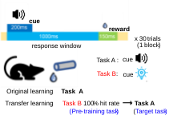

图 2-4-1 训练单元程

Figure 2-4-1 Training schedule

当有初始学习训练单元达到100%命中后，初始学习阶段结束。12h后，进入连续学习阶段。新任务只是将初始学习中蜂鸣器提供的听觉线索换成蓝光LED提供的视觉线索，其它设计完全相同。同样达到100%命中后，该鼠的所有实验结束。

在与此相反的范式中，初始学习以蓝光LED作为视觉线索提示，而在新任务中使用蜂鸣器发声。

实验过程全程由Arduino程序自动控制，并向双光子辅助机发送实时实验日志，包括每个试次的时间、线索呈现时间、给水时间、舔水时间等。同时，每个训练单元都由双光子主机负责控制双光子显微镜持续进行钙信号拍摄。拍摄前先调整拍摄位置，尽量与Galvano参照图配准。精确配准在后续处理步骤进行。
## 2.5 视频配准和测量
单次拍摄会话过程中难以避免地会有抖动。为了将拍摄全程所有时点的细胞位置在单次成像会话内配准，使用统一实验分析作图软件（自主开发，MATLAB代码在GitHub），将每个成像会话的原始OIR视频读入，配准后输出到TIFF格式。程序在自建的4路 NVIDIA GeForce RTX 3090 计算服务器上执行以提高性能。配准的基本原理是：
1. 将视频分成26帧的块（26这个参数是性能和质量的权衡值，越大质量越好但性能越差）
2. 每一块内部两两计算normxcorr2，即归一化互相关，找到相关性最高的偏移量，就是平移偏差。这样，每一帧都能得到与其它25帧的偏移。将这25个偏移量求平均，就得到该帧的块内偏移量
3. 将块内每一帧都应用各自的块内偏移量以后，再把配准后的块内所有帧平均起来，作为本块的代表帧
4. 将整段视频所有分块的代表帧拼成一段新的视频，回到第1步循环，直到只剩最后一帧。在这个循环过程中，每次循环视频都会等比例缩短，形成金字塔结构：原始视频在底层，然后逐层网上叠加1/26长度的视频。
5. 金字塔每一层都有该层所有帧的偏移量信息。当金字塔封顶后，对原始视频的每一帧，可以计算出它从塔底到塔顶所经历的所有偏移量。将这些偏移量叠加起来，就是该帧的最终偏移量。例如，原始视频第5000帧在金字塔底层，将被分配到第193块；第2层，第8块；封顶。最终应用3层偏移量叠加得到最终偏移量。
6. 为所有原始视频帧应用最终偏移量，输出TIFF。此外，还会将OIR中记录的电流检测通道每帧平均，输出到 MATLAB .mat 数据库。

在文件内配准中，只考虑平移偏移，不考虑旋转、缩放、剪切、投影或任何其它非刚性非全局扭曲。这些扭曲有可能存在，但在单次拍摄会话约30min的时间窗口内通常没有显著影响。但是，要将不同成像会话之间，即不同视频文件之间的细胞配准起来，就需要考虑更复杂的变换。特别是一些训练较慢的日程中，拍摄周期可能超过2周，那么第一次和最后一次拍摄之间就可能产生相当严重的扭曲。这种扭曲已经超过普通图像配准算法的识别能力，无法全自动完成，因此需要人工介入。使用 Fiji ImageJ 软件打开经过文件内配准的TIFF视频，手动圈出若干配准特征点，并在Galvano参照图中也按照相同顺序圈出对应的特征点，然后保存为RoiSet.zip。然后，可以运行程序自动读取识别特征点，根据特征点的位置变化，使用 MATLAB fitgeotform2d 算出二维变换参数，然后对不同文件进行全体一致的非刚性变换。特征点圈得越多，配准就越精确，这样就可以有效控制文件间配准的质量。

所有视频完成配准后，再次用 Fiji ImageJ 软件打开并手工圈出要测量的细胞位置。也尝试过一些自动化细胞识别算法，与手工圈的相比效果始终不理想，所以此步骤保留手工操作。一般一只鼠一层细胞在100~600之间，工作量稍大但尚在可接受范围。

圈好后同样用程序自动测量圈内平均像素值。此外，还要额外进行散射光矫正：将圈外扩展30像素的圆环作为散射光范围，扣除范围内包含细胞的像素后，剩余像素的均值当作“散射光”从圈内测量值中扣除。
## 2.6 操纵实验
操纵实验的手术部分由合作者做出主要贡献。
### 2.6.1 cFos 标记抑制
预备耗材：pAAV2/9-hSyn-DIO-hM4D(Gi)-mCherry-WPRE病毒（和元生物）。他莫昔芬溶液(遗传操作试剂) (20㎎/㎖玉米油， Reagent grade)（碧云天Beyotime）。CNO。

$cFos-Cre^{ER}$品系小鼠，可以将注射Tamoxifen药物24h后时间窗内活跃的神经元，其细胞质内的$Cre^{ER}$蛋白入核，使得DIO结构包裹的DNA序列得到表达。相比于基本连续学习流程，其不同之处在于：
1. 手术阶段，双侧MOp额外注射DIO-hM4D(Gi)病毒200nL
2. 对照组在断水时注射他莫昔芬溶液，使得标记窗口在未经任何训练任务中度过
3. 初始训练100%后，实验组注射他莫昔芬溶液，开启标记窗口。然后暂不进行新任务训练，而是继续每隔12h训练初始任务。此外，实验组每隔36h注射一次他莫昔芬溶液，共5次。
4. 距离初次注射他莫昔芬经过8天后，开始训练新任务，但需要用CNO抑制初始任务中活跃的细胞。
### 2.6.2 非特异性抑制
预备耗材：pAAV2/9-hSyn-hM4D(Gi)-mCherry-WPRE病毒（和元生物）。pAAV2/9-hSyn-mCherry-3xFLAG-WPRE病毒（和元生物）。CNO。

与基本连续学习区别在于：
- 手术时，实验组在双侧MOp额外注射hM4D(Gi)病毒200nL，对照组注射mCherry荧光对照病毒200nL
- 每个训练单元前1h注射CNO
### 2.6.3 TH 抑制
预备耗材：pAAV2/9-hSyn-hM4D(Gi)-mCherry-WPRE病毒（和元生物）。CNO。

TH，即Thalamus，丘脑。实际注射点是后端的PO脑区（Allen Brain Atlas 命名规范），AP=1.79（Interaural前），ML=1.362（双侧），DV=2.875（相对于脑膜表面）。在该脑区注射hM4D(Gi)病毒200nL。在新任务学习阶段的每个训练单元前注射CNO抑制TH。对照组是正常连续学习。
### 2.6.4 7 天间隔操纵
初始任务达到学会标准后，不立即学新任务，而是停止训练，恢复供水，正常饲养7天后，再做新任务（当然也要提前36h停水）。对照组是正常连续学习。
## 2.7 观察RSP颅窗的迁移实验
病毒注射点取RSP（AP=Interaural+0.728㎜，ML=右侧0.781㎜，DV=脑膜下0.15（RSP2/3）/0.30（RSP5）㎜）并在周围开窗，其它与基本开窗手术相同。
## 2.8 数据处理算法
本节以MATLAB代码形式给出若干统计指标的操作性定义，供结果部分引用。

ZScore：
```MATLAB
function Data=ZScore(Data)
%z-score算法，以线索前3s为基线
arguments (Input)
	%假设输入数据是（细胞×时间×试次）的张量。每个试次取线索前3s到后3s，一共6s，采样率8㎐，因此时间轴有48个点
	Data(:,48,:)
end
arguments(Output)
	%输出相同形状的张量
	Data(:,48,:)
end
%取-3~0s，即前24个时间点作为基线。
Baseline=Data(:,1:24,:);

%用数据减去基线时间均值后，再除以时间标准差，得到z-score
Data=(Data-mean(Baseline,2))./std(Baseline,[],2);
end
```
NTATS，多组归一化试次累积信号值 (Normalized Trial-Accumulated Trial Signals)：
```MATLAB
function Data=NTATS(Data)
%NTATS算法，基于ZScore
arguments (Input)
	%假设输入数据是（细胞×时间×试次）的张量。每个试次取线索前3s到后3s，一共6s，采样率8㎐，因此时间轴有48个点
	Data(:,48,:)
end
arguments(Output)
	%输出为（细胞×时间）的矩阵，输入的试次维度被规约为中位数了
	Data(:,48)
end
%直接对ZScore取试次间中位数
Data=median(ZScore(Data),3);
end
```
细胞活跃性判定，基于NTATS：
```MATLAB
function CA=CellActive(Data)
%细胞活跃性判定算法，返回逻辑向量，指示每个细胞被判定为活跃还是不活跃
arguments (Input)
	%假设输入数据是（细胞×时间×试次）的张量。每个试次取线索前3s到后3s，一共6s，采样率8㎐，因此时间轴有48个点
	Data(:,48,:)
end
arguments(Output)
	%输出为只有一个细胞维度的逻辑向量
	CA(:,1)
end
CA=NTATS(Data);
%首先计算细胞×时间的NTATS矩阵

Baseline=CA(:,1:24);
%取-3~0s，即前24个时间点作为基线。

CA=CA(:,32)>mean(Baseline,2)+3*std(Baseline,[],2);
%判定细胞在线索后1s（即第32个时间点）处的NTATS是否大于基线均值加3倍标准差，若是则判定为活跃（true），否则为不活跃（false）
end
```
细胞重激活率，基于细胞活跃性：
```MATLAB
function RR=ReuseRate(TargetSession,LearnedSession)
%计算LearnedSession中活跃的细胞在TargetSession中重激活的比例
arguments (Input)
	%要计算重激活率的目标成像会话数据，假设是（细胞×时间×试次）的张量。每个试次取线索前3s到后3s，一共6s，采样率8㎐，因此时间轴有48个点
	TargetSession(:,48,:)
	%作为基准的“学会阶段”成像会话数据
	LearnedSession(:,48,:)
end
arguments(Output)
	%输出重激活率，标量
	RR(1,1)
end
%首先计算两个成像会话各自的细胞活跃性逻辑向量
TargetSession=CellActive(TargetSession);
LearnedSession=CellActive(LearnedSession);

%取出LearnedSession中活跃的细胞，计算它们在TargetSession中也被判定为活跃的比例
RR=mean(TargetSession(LearnedSession));
end
```
训练单元步，计算每个训练单元到下一个训练单元的命中率变化量：
```MATLAB
function DN=DeltaNext(Performance)
%计算Performance的每步增量（差分）
arguments(Input)
	%输入数据是一只鼠按时间顺序排列的所有训练单元命中率
	Performance(:,1)
end
arguments(Output)
	%输出数据是每步增量
	DN(:,1)
end
%排除天地板效应后，计算每步差分
DN=diff(Performance(ExcludeCeilingFloor(Performance)));
end
```
相对散度，基于 1s z-score：
```MATLAB
function RD=RelativeDivergence(Data)
%计算相对散度，基于 1s z-score
arguments (Input)
	%假设输入数据是（细胞×时间×试次）的张量。每个试次取线索前3s到后3s，一共6s，采样率8㎐，因此时间轴有48个点
	Data(:,48,:)
end
arguments (Output)
	%输出为标量，表示相对发散度
	RD(1,1)
end
Data=ZScore(Data);
%首先对每个试次做z-score标准化

Data=squeeze(Data(:,32,:));
%取线索后1s（即第32个时间点）的细胞×试次矩阵

AbsoluteDivergence=sqrt(mean(var(Data,[],2),1));
%先对每个细胞计算试次间方差，再对细胞求平均并开方，得到绝对散度

RD=AbsoluteDivergence/norm(mean(Data,2));
%再除以所有试次质心到原点的距离，得到相对散度
end
```
响应异质性，基于 1s z-score：
```MATLAB
function RH=ResponseHeterogeneity(Data)
%计算响应异质性，基于 1s z-score
arguments (Input)
	%假设输入数据是（细胞×时间×试次）的张量。每个试次取线索前3s到后3s，一共6s，采样率8㎐，因此时间轴有48个点
	Data(:,48,:)
end
arguments (Output)
	%输出为标量，表示响应异质性
	RH(1,1)
end
Data=ZScore(Data);
%首先对每个试次做z-score标准化

Data=mean(Data(:,32,:),3);
%取线索后1s（即第32个时间点）并对所有试次求平均，得到每个细胞的平均1s响应

Data=Data(Data>=-1 & Data<=1);
%只保留平均响应位于[-1,1]区间内的细胞

RH=std(Data,[],1);
%计算这些细胞的标准差，作为响应异质性
end
```
Sigmoid拟合斜率
```MATLAB
function Slope=SigmoidSlope(Performance)
%综合多鼠多单元命中率，计算Sigmoid拟合斜率
arguments(Input)
	%一个元胞一只鼠，元胞内是(:,1)double，该鼠各训练单元的命中率
	Performance(:,1)cell
end
arguments(Output)
	%输出为标量，表示Sigmoid拟合斜率
	Slope(1,1)
end

%将所有小鼠、所有训练单元展开为同一组拟合点
UnitIndex=cellfun(@(P)(1:numel(P)).',Performance,UniformOutput=false);
UnitIndex=vertcat(UnitIndex{:});
HitRate=vertcat(Performance{:});

%Parameter(1)为斜率，Parameter(2)为曲线中点，Sigmoid下限和上限固定为0和1。最小化所有观测命中率与Sigmoid预测值的平方误差
Parameter=fminsearch(@(Parameter)sum((HitRate-1./(1+exp(-Parameter(1).*(UnitIndex-Parameter(2))))).^2),[1,median(UnitIndex)]);

Slope=Parameter(1);
%取拟合得到的斜率参数作为学习曲线斜率
end
```
## 2.9 统计分析
本文根据不同数据层级采用不同统计策略。对于“每点一只鼠”的两组比较，优先使用非参数ranksum或signrank，以降低对正态性和等方差的依赖。对于跨训练单元学习曲线，主要使用训练单元均值与标准误进行可视化展示，并辅以每鼠斜率，或在将第1训练单元表现纳入线性模型后进行残差化比较。

相关性分析方面，若指标为概率、相关系数或非高斯分布变量，优先使用Spearman相关。

表 2.2 本文使用的主要统计口径

Table 2.2 Main statistical metrics used in this study

| 比较对象 | 统计单位 | 关键控制/排除 | 主要解释目标 |
| --- | --- | --- | --- |
| 第1训练单元命中率 | 每鼠 | 仅light-water条件下的第1训练单元 | 起点优势 |
| 整体学习曲线 | 每训练单元或每鼠汇总 | 统一学习区段 | 现象是否稳定存在 |
| ΔHit | 每训练单元步 | 排除100% 训练单元后的步长；控制前一训练单元表现 | 后续习得速度 |
| 重激活率 | 每鼠首个训练单元 | 依赖跨天细胞身份匹配 | 旧集合调用 |
| 相对发散度 | 每鼠首个训练单元 | 试次级z-score | 第1训练单元稳定化 |
| 响应异质性 | 每鼠全训练单元 | 1s z-score；限制在 [-1,1] 细胞 | 群体内部分化程度 |
## 2.10 免疫组化
主要用于观察病毒在目标脑区附近的实际表达情况。

合作者在免疫组化的切片和观察中做出主要贡献。
### 2.10.1 物品预备
脑区注射了病毒，完成了实验的C57小鼠。

异氟烷麻醉系统（瑞沃德）、1㎖一次性注射器（禾汽）、泡沫板（病毒包装盒回收）、大头钉（京喜）、外科手术剪、止血钳、PBS/PFA灌流系统（自制）、生物解剖专用直头镊子（中镜科仪）、通风橱、	小鼠脑切片模具（吉泰）、刀片（吉列）、美术水粉水彩勾线笔（柏伦斯）、油漆笔（日本雪人）、冰冻切片机（ThermoFisher NX50）系统及其专用的刀片（徕卡）、湿盒（BBI）、手动单道可调式移液器（泰坦）、玻片扫描仪（奥林巴斯VS120-S6-W）、OlyVIA软件

30g/L 2,2,2-三溴乙醇（毕得医药）/PBS溶液、1×PBS（Coolaber）、4g/100㎖ PFA/PBS溶液（Adamas life）、30g/100㎖ 蔗糖（吉至生物）/PBS溶液、吸水纸（清风）、O.C.T. Compound（Tissue-Tek）、粘附载玻片（表面带正电荷）（碧云天Beyotime）、抗荧光衰减封片剂（含DAPI）（美仑生物）、盖玻片（24×50㎜，servicebio）、透明指甲油（思姿）

### 2.10.2 操作流程
将灌流系统充满PBS/PFA备用。

灌流。将小鼠异氟烷麻醉，腹腔注射1㎖三溴乙醇。在通风橱中，将小鼠四肢钉在泡沫板上，腹部朝上仰躺，剪开胸骨下方皮肌胸腹隔膜，将剪口向两边延伸，直到掀开整块胸肋骨，用止血钳钳住，倒翻朝外，露出心脏。找到心脏右（小鼠视角）后方深红色的血窦，剪破，使得大量血从破口流出。镊起心脏底部尖端，插入灌流针，然后松开镊子，缓缓推入20㎖PBS，应当可以看到血窦破口处先是大量出血，然后血色减淡，变为PBS。再缓缓推入20㎖PFA，应当看到小鼠四肢肌肉出现抽搐反应，尾巴竖立等。

取脑。将小鼠释放，此时应当注意到小鼠浑身僵硬，不易变形。剪下鼠头，剪除鼠头上皮毛肌肉腺体等软组织，掀下头架，应当会连同一部分颅骨也被掀下来。用剪刀和镊子仔细剥除残余头盖骨，避免伤及其中柔软的脑组织。剥干净后脑组织摇摇欲坠，用镊子将脑子底部与颅腔底部的软组织连接打断，使得脑子彻底游离出来，装入15㎖EP管，加满PFA，放入4℃冰箱摇床上摇动，过夜。

脱水。将过夜的PFA倒掉，换成蔗糖溶液，浸泡过夜，直到脑子沉底。

包埋。将OCT铺满切片系统的样品托盘一层，冷却冰冻。倒掉蔗糖溶液，用吸水纸轻轻吸干残液，脑子放入模具，切掉脊髓接头，使得脑尾端平整。在冻好一层OCT底部的样品托盘上再挤入一堆OCT，脑子鼻端朝上放入OCT堆中，摆平放正，再次冷却冰冻。冻好以后，再从脑子鼻端顶部洒下OCT，使得整个脑子被一层薄薄的OCT完全包裹不外露，再次冷却冰冻20min。

切片。将专用刀片锁在切片机刀头，样品托盘锁在样品头。用切片系统的粗切模式，切除不需要的脑块，然后切换到细切模式，盖上防卷板，50㎛一片。切下3~6片后，可以将其在工作台上展开、排列整齐，然后载玻片正面朝下悬在脑片上，使其吸附。载玻片用油漆笔上写明鼠号。贴满的载玻片放入装有PBS的湿盒。

封片。用移液器吸取PBS，轻缓冲洗载玻片上的脑片，洗去OCT残留，晾干，但不要太干，以看不到明显水渍为准。加入100㎕封片剂，使其液体在脑片阵列中划一道横线，然后缓缓盖上盖玻片，尽量避免引入气泡。用指甲油将盖玻片周围一圈封闭。

观察。使用玻片扫描仪扫描后用OlyVIA软件查看病毒表达情况。
## 2.11 计算建模
模型使用MATLAB编写，代码在GitHub。
# 第3章 结果
连续学习的不同任务之间可能产生促进、干扰或无影响（Perkins & Salomon, 1994）。本研究为口渴小鼠设计了根据线索提示在1s时间窗内舔水的任务：根据线索不同，分为声音提示的听觉任务和蓝光提示的视觉任务。

各训练单元的线索呈现与奖励流程均由Arduino控制系统自动执行。小鼠头部固定后，可接受LED提供的蓝光视觉线索和蜂鸣器提供的听觉线索；口前放置金属水管，电控蠕动泵可输出水滴供小鼠舔舐。该金属水管同时连接电容传感器，可将舔水事件转换为电信号脉冲，并经Arduino与USB串口传输至计算机记录。


图 3-1-1 连续学习实验设计

Figure 3-1-1 Experimental design of continual learning

>连续学习范式由两个不同线索的舔水任务构成。口渴小鼠先学会线索A提示的舔水（初始学习，naive），再学线索B提示的舔水（连续学习，Continual）。每个任务均由多个试次重复组成。单个试次内，先给予200㎳ 的线索（听觉或视觉）；线索开始后1s内如出现任何舔水行为，则该试次任务成功，超时未舔则失败。1s响应窗结束后给予15㎕水奖励。200㎳线索与1s响应窗同步开始，即从线索给出到响应窗结束共计1s。

>The continual-learning paradigm comprised tasks A and B. Mice first learned task A and were then switched to task B. Each task consisted of repeated trials. In each trial, a 200㎳ cue (auditory or visual) was delivered; any lick occurring within 1s after cue onset was scored as a hit, whereas the absence of licking was scored as a miss. A 15㎕ water reward was delivered after the 1s response window. Because the 200㎳ cue and the 1s response window began simultaneously, the complete cue-response epoch lasted 1s.

在一个训练试次开始后，小鼠必须在一个随机5~10s的冷静期内，持续抑制舔水动作，才给出线索（声音或蓝光）；一旦这段时间内监测到任何一次舔舐事件，冷静期将被重置重新等待。这是为了防止小鼠不理会线索，仅通过提高舔舐频率来提高任务命中率。冷静期时长的随机性则防止小鼠利用试次之间的时间结构形成 temporal preparation，因为固定的试次间隔时间本身也可能成为一种可利用的情境线索（Bouton & García-Gutiérrez, 2006）。随机冷静期能迫使行为反应由线索而非试次节律驱动。线索持续200㎳。从线索开始后的1s内为响应时间窗：这个窗口内如果记录到小鼠有任何舔水行为，记本试次任务成功，超时未舔则失败。响应窗结束后给水15㎕，然后等待固定20s。注意该实验不同于经典Go/NoGo设计：一个训练单元的所有试次线索都相同；响应窗的开始不待线索结束，即线索未结束时小鼠也可舔舐成功；无论是否成功，总是在响应窗结束后给水。因此，小鼠不仅需要学会在给出线索后1s内启动舔舐，而且还要在无线索时抑制舔水冲动，以免反复重置冷静期（延长的等待时间本身具有惩罚性）。

单个训练单元包含连续30个试次重复，训练单元之间间隔12h。每只鼠首先经历36h的禁水，进入充分口渴状态，然后进行初始线索的任务训练，直到某一训练单元中所有试次全部成功，即达到学会标准。12h后，切换线索，进入连续学习阶段。同样直到出现全部成功的训练单元后，连续学习阶段结束。
## 3.1 连续学习的行为学优势
首先确认连续学习的行为学效应。所有小鼠被分为两组，一组初始学习听觉任务，另一组初始学习视觉任务，学会后交换两组线索。该设计使两组小鼠互为对照，检验连续学习优势是否适用于听觉和视觉两种线索。

表 3-1 连续学习实验日程

Table 3-1 Continual learning schedule

>🔊表示听觉线索，💡表示视觉线索，💧表示水奖励。两组小鼠在初始阶段分别学习听觉和视觉线索的舔水任务，达到学会标准后，交换线索，连续学习，直到新线索任务也学会。

>🔊 denotes the auditory cue, 💡 the visual cue, and 💧 the water reward. The two groups learned the auditory and visual cue licking tasks, respectively, during the naive stage; after reaching the learning criterion, the cues were swapped for continual learning until the new-cue task was also learned.

|实验进程|🔊💡组|💡🔊组|
|-|-|-|
|初始学习：首个训练单元|🔊💧|💡💧|
|初始学习：过程|……|……|
|初始学习：学会|🔊💧100%成功|💡💧100%成功|
|连续学习：首个训练单元|💡💧|🔊💧|
|连续学习：过程|……|……|
|连续学习：学会|💡💧100%成功|🔊💧100%成功|
### 3.1.1 连续学习曲线整体上移
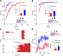

图 3-1-2 初始和连续学习的学习曲线和首个训练单元优势

Figure 3-1-2 Learning curves and first-block advantage in naive and continual learning

>无论听觉还是视觉线索，连续学习相比于初始学习，学习曲线均整体上移，尤其体现为更高的首个训练单元命中率。（A）比较视觉任务的初始（27只鼠）与连续（22只鼠）学习曲线及首个训练单元命中率，首个训练单元条形图秩和检验 $p<10^{-5}$。（B）比较听觉任务的初始（21只鼠）与连续（19只鼠）学习曲线及首个训练单元命中率，首个训练单元条形图秩和检验p<0.001。（C）视觉任务的初始和连续学习各一只代表性鼠的首个训练单元行为记录。初始学习时，舔舐行为都发生在给水之后；连续学习时，舔舐动作则常在线索之后、给水之前就已经开始。（D）将初始（27只鼠）和连续学习（22只鼠）首个训练单元的30个试次展开，逐试次比较命中率。首试次差异不大，连续学习的优势主要来自晚期试次。

>For both auditory and visual cues, learning curves in continual learning were upward-shifted relative to naive learning, especially as reflected by higher hit rates in the first block. (A) Learning curves and first-block hit rates for naive (27 mice) and continual (22 mice) learning in the visual task; the first-block bar comparison gave a rank-sum $p<10^{-5}$. (B) Learning curves and first-block hit rates for naive (21 mice) and continual (19 mice) learning in the auditory task; the first-block bar comparison gave a rank-sum p<0.001. (C) Representative first-block behavioral records from one naive mouse and one continual-learning mouse in the visual task. During naive learning, licking occurred only after water delivery; during continual learning, licking often began after cue onset and before water delivery. (D) The 30 trials in the first block of naive (27 mice) and continual learning (22 mice) were expanded to compare hit rates trial by trial. The first-trial difference was small, and the advantage of continual learning mainly emerged in later trials.

结果显示，无论听觉任务还是视觉任务，连续学习均较初始学习更快，表现为首个训练单元命中率更高且学习曲线整体上移（图3-1-2）。因此，本实验设计的跨模态连续学习体系能令旧经验对新学习起促进作用。其中，听觉任务达到学会标准更快，连续学习过程也更短，许多鼠在1~2个训练单元内即达到100%成功。作为佐证，Song等在头部固定小鼠的视听辨别任务中发现，当视听信息冲突时，小鼠表现为“audition dominates vision”，即听觉主导视觉（Song et al., 2017）。这可能是因为小鼠视力较差，视觉任务往往需要精心设计（Huberman & Niell, 2011）。由于过短的听觉学习过程不利于展开分析，本文侧重分析视觉任务，听觉任务作为参照补充。
### 3.1.2 连续学习命中率增长更快
除了单纯的命中率更高，连续学习优势通常还体现在先前经验使动物在后续相关任务中的命中率增长更快，即学习曲线更陡（Harlow, 1949）。

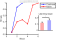

图 3-1-3 连续学习命中率增长更快

Figure 3-1-3 Faster hit-rate growth in continual learning

>使用Sigmoid函数拟合（约束：下限0，上限1，中点不限，斜率非负）蓝光线索初始（27只鼠）和连续（22只鼠）学习曲线，并进行10000次组间随机置换检验，确认连续学习斜率显著高于初始，p=0.04。

>A Sigmoid function was used to fit the blue-light-cue naive (27 mice) and continual (22 mice) learning curves, with the lower bound constrained to 0, the upper bound constrained to 1, the midpoint unconstrained, and the slope constrained to be non-negative. A between-group random permutation test with 10000 shuffles confirmed that the fitted slope was significantly higher in continual learning than in naive learning (p=0.04).

Sigmoid拟合斜率的方法确认了本实验的连续学习也存在增长速度的优势（图3-1-3）。据此，连续学习优势可被分解为首个训练单元命中率更高，与后续命中率增长更快。下文将这两类优势分别关联到不同的神经活动特征和机制。
## 3.2 初始学习的钙特征和组件解析
连续学习中的首个训练单元命中率更高，意味着新线索在未经训练的条件下，就有一定概率直接激活先前学会的感知-动作关联，触发既有行为输出。要理解这一现象，必须先充分描述初始任务中的学会状态。行为方面，在头部固定小鼠的舔水范式任务中，动物需要学会两件事：一是在线索前抑制过早舔水，二是在线索出现后及时执行舔水动作（Inagaki et al., 2018）。


图 3-2-1 静息态与动作态

Figure 3-2-1 Resting state and action state

>在线索前的冷静期内，小鼠必须持续抑制舔舐动作；一旦忍不住舔了，冷静期即被重置，小鼠即面临惩罚性的加长等待：该阶段定义为静息态。线索出现后，小鼠则需在1s内切换至动作态，即执行舔舐动作。

>During the pre-cue quiet period, mice had to continuously suppress licking; any lick reset the quiet period, resulting in a punitive extended wait. This stage is defined as the resting state. After cue onset, mice had to switch into the action state within 1s and execute licking.
### 3.2.1 在体实时双光子钙成像


图 3-2-2 初级运动皮层钙成像

Figure 3-2-2 Calcium imaging in primary motor cortex

>前人（Komiyama et al., 2010）通过跨突触追踪和皮层微刺激实验确定了两个彼此不重叠的候选舌相关运动皮层区，并在其交界附近进行钙成像。鼠脑轮廓上的红点表示Bregma点。（A）多只鼠光刺激实验确定的舌运动控制区。（B）电刺激实验确定的舌运动控制区。（C）从舌头进行跨突触逆向追踪所标记的亚区。（D）皮层主要区域的顶视图。（E）运动皮层与舌之间连接的示意图。（F）综合微刺激和跨突触追踪结果后，在交界区注射GCaMP6f病毒。（G）在小鼠初级运动皮层周围开窗，并在任务训练过程中实施在体双光子钙成像。（H）一个示例成像视野，图中手工勾画出细胞轮廓。

>Previous work (Komiyama et al., 2010) identified two non-overlapping candidate tongue-related motor cortical areas using trans-synaptic tracing and cortical microstimulation, and calcium imaging was performed near their border. The red dot on the brain outline marks bregma. (A) Tongue motor-control region identified by photostimulation across mice. (B) Tongue motor-control region identified by electrical stimulation. (C) Subregion labeled by trans-synaptic retrograde tracing from the tongue. (D) Top view of the major cortical areas. (E) Schematic of the connection between motor cortex and tongue. (F) GCaMP6f was injected into the border region defined by the microstimulation and tracing results. (G) A cranial window was opened over primary motor cortex for in vivo two-photon calcium imaging during task training. (H) An example imaging field with cells manually outlined.

初级运动皮层（Primary Motor Cortex, MOp）是皮层运算网络的输出端（图3-2-2D）。无论是听觉还是视觉线索，都要经过这里转变为舌头的运动或不运动（图3-2-2E）。前人的刺激和追踪实验提供了一个合适的参考注射位点（图3-2-2ABF）：在MOp2/5层注射GCaMP6f钙指示荧光探针病毒后，在周围开颅窗，用玻璃和牙科水泥封闭，就可以在任务训练过程中实时进行在体双光子钙成像视频拍摄（图3-2-2G）。拍摄的视频中可以手工圈出其中的细胞亮斑，通过一些配准算法处理后还能实现跨天追踪同一群细胞的长期变化（图3-2-2H）。

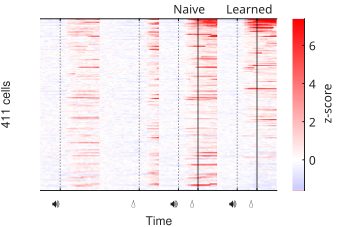

图 3-2-3 声音线索初始学习前后的基本响应轮廓

Figure 3-2-3 Basic response profiles before and after naive sound-cue learning

>不同于仅进行行为学训练的实验，参与钙成像的鼠，还在正式开始学习前被记录了仅给线索和仅给水条件下的钙活动。热图中每一行表示一个细胞，每一列内的横轴表示时间，四列分别对应：仅给声音、仅给水，以及声音线索初始学习任务的首个训练单元和学会后。排除了四列中均无活跃的细胞。共5只鼠。

>Unlike mice used only for behavioral training, mice included in calcium imaging were also recorded before formal learning under cue-only and water-only conditions. In the heatmap, each row represents one cell, and the horizontal axis within each column denotes time. The four columns correspond to sound only, water only, the first block of the naive sound-cue learning task, and the learned state. Cells inactive in all four columns were excluded. A total of 5 mice were included.

在首个训练单元中，声音-给水关联任务的全细胞响应格局，大致相当于仅给声音和仅给水的响应的简单叠加。而在声水任务达到学会标准后，细胞活跃的格局则发生了整体变化：首个训练单元活跃的细胞在学会后一部分保留，也有一部分沉默甚至抑制。
### 3.2.2 线索刺激引发的状态切换
由于线索呈现时机被刻意设计为随机的，小鼠必须在线索到来后有限时间（1s）内完成大脑和行为状态的快速切换。线索到来前对过早舔舐冲动的主动持续抑制过程，可称为“静息态”；线索到来后对舔舐动作的快速启动，可称为“动作态”。其中，静息态至少存在两套互相对抗的系统：口面部感觉运动区的抑制，与压制过早反应有关；而ALM等前运动区的持续活动，则与后续舔水计划密切相关（Inagaki et al., 2018）。

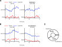

图 3-2-4 细胞对线索的不同响应特性

Figure 3-2-4 Diverse response properties of cells to the cue

>初始任务学会后，细胞形成对声音线索的不同钙活动响应特性。有的细胞原本活动方向反转，也有的继续加速。（A）展示两个代表性反转细胞。静息态逐渐衰退的细胞可以被线索突然激活（左），静息态钙信号上升中的细胞也可以被线索突然抑制（右）。绿色虚线连接[-1,0,1]三个关键时间点，其非单调性是反转的特征。（B）展示两个代表性加速细胞，可以是静息态活动逐渐增强的细胞继续加速上升，也可以是静息态逐渐衰退的细胞被线索进一步强力抑制。绿色虚线同样连接[-1,0,1]三个关键时间点，线索信号并未改变这些细胞的钙信号走向，而是对原有变化趋势起到推进作用。（C）比较11只鼠中A、B两类细胞的总体占比，发生反转的A类细胞占多数（3401个细胞），B类只有2066个细胞。

>After the Naive task was learned, cells developed diverse calcium response properties to the sound cue. Some cells reversed their original direction of activity change, whereas others continued to accelerate. (A) Two representative reversal cells. A cell with gradually declining resting-state activity could be suddenly activated by the cue (left), and a cell with a rising resting-state calcium signal could be suddenly inhibited by the cue (right). The green dashed line connects the three key time points [−1, 0, 1], and its non-monotonicity is the signature of reversal. (B) Two representative acceleration cells. A cell with gradually increasing resting-state activity could continue to accelerate upward, or a cell with gradually declining resting-state activity could be further strongly inhibited by the cue. The green dashed line again connects the three key time points [−1, 0, 1]; the cue signal did not change the direction of the calcium signal in these cells, but instead promoted the existing trend. (C) Overall proportions of the two cell classes across 11 mice. Class A reversal cells were the majority (3401 cells), whereas class B contained only 2066 cells.

因此，舔舐行为可能并非仅由听觉线索单方面驱动，皮层网络本身也可能预先处于主动抑制和舔水冲动的对抗状态。这种平衡随后被线索信号打破，表现为部分细胞原本的上升或下降趋势在线索到来时刻的反转（图3-2-4A），以及另一部分细胞反而在原有变化趋势上进一步加速（图3-2-4B）。这两类细胞代表了静息态到动作态切换的两种并行的可能机制：其一，线索输入经感觉-运动通路被快速级联放大，迅速激活行为驱动环路并解除静息态的主动运动抑制；其二，网络在静息态本已存在朝动作输出方向的冲动的缓慢积累或自发状态漂移，而线索信号主要起到推动其越过动作启动阈值的作用。从细胞数量占比上看（图 3-2-4C），直接被线索信号反转的细胞占据主导地位，这说明静息态向动作态的切换，相比于行为冲动的积累、自发状态漂移或时间预判，更多地是依赖线索信号的直接驱动。

但是，行为表观上的静息或动作，并不能过度简化地映射到神经活动静态的二元分类。例如，即使在行为表观上相同的静息或等待相关状态下，皮层活动状态也呈现持续的时空流动；但这种流动并非完全无序，而是可由状态空间中的少数低维流形模式加以概括（MacDowell & Buschman, 2020）。尤其是在本实验随机长度的冷静期框架下，线索信号到来时网络状态可能落在静息态流形轨迹上的不同位置——它们实际上是同一潜在动态演化过程中的不同瞬时静态快照，而不是彼此孤立的离散状态。

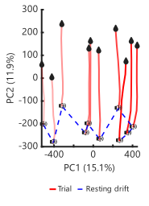

图 3-2-5 静息态的漂移和动作态的定向演进

Figure 3-2-5 Resting-state drift and directed evolution of the action state

>用主成分分析展示所有细胞构成的状态空间（声音线索任务学会后），在不同试次的起始时点（声音线索）和结束时点（给水，响应窗结束）在状态空间中的位置。每条线红色实线是一个试次，颜色渐变表示试次顺序，浅色表示早期试次。蓝色虚线将每个试次的线索给出前的静息状态位置连接起来，显示静息态在状态空间中的的漂移路线。14只鼠，6889个细胞。

>Principal component analysis was used to visualize the state space formed by all cells after the sound-water task was learned. The positions of the network state at the starting time point of each trial (sound cue) and the ending time point (water delivery; end of the response window) are shown in state space. Each red solid line represents one trial; the color gradient indicates trial order, with lighter colors representing earlier trials. Blue dashed lines connect the pre-cue resting-state positions across trials, showing the drift trajectory of the resting state in state space. Fourteen mice and 6889 cells were included.

主成分分析显示，线索输入时的静息状态空间位置，按试次顺序确实在低维子空间里形成了一条流形轨迹；但无论起点如何，线索到来后的状态都在1s内朝一致的方向演进，而不是向某一特定目标点汇聚（图 3-2-5）。也就是说，动作态并不是状态空间中的某个特定位置，而是一个具有特定方向的演进动态，它是线索信号驱动后直接追加在当前的静息态漂移流形上的，而不是将状态向一个固定目标收束。
## 3.3 新任务首个训练单元更高命中率的机制
### 3.3.1 旧群体的重激活
在旧任务学会后，测得未经训练的新任务命中率提升，这种现象可以关联到记忆印迹和泛化相关理论。现有研究并不把泛化归结为单一机制，但普遍承认，新线索能够通过重激活既有印迹中的部分神经元，实现对旧经验的提取；不同任务激活的细胞群体如能有更高重叠，也更容易表现出记忆联结、信息互用或泛化（Josselyn & Tonegawa, 2020）。因此，已学会的声音线索旧任务激活的细胞群体，如能被新的蓝光线索重激活，则可以解释新线索任务的命中率提升。

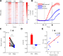

图 3-3-1 新线索激活旧经验相关细胞

Figure 3-3-1 New cue activates cells related to prior experience

>用线索前3s作为基线，将1s时刻z-score超过基线均值加3倍标准差的细胞定义为活跃细胞。共11只鼠。（A）热图展示在声音线索任务（旧任务）学会时、蓝光线索任务（新任务）首个训练单元的命中（Hit）试次和未命中（Miss）试次，这三列条件下的细胞活跃格局，排除了三列均不活跃的细胞，剩余760个细胞。每一行表示同一个细胞，每一列内横轴表示时间。命中列与旧任务学会列的更相似，而未命中列差异较大。（B）取声音线索任务学会时活跃的511个细胞，比较其在蓝光线索任务命中和未命中试次中的钙信号曲线，阴影表示±SEM。结果显示，这些细胞在命中试次中更活跃，在未命中试次中则偏静默或延迟。（C）以鼠为单位，配对比较新任务命中和未命中试次中的重激活率，即旧任务学会时活跃的511个细胞在新任务中再次激活的占比。结果显示命中试次的重激活率显著高于未命中试次（p<0.001）。（D）取旧任务学会时活跃的511个细胞，比较其在新任务命中和未命中试次中的 1s z-score，结果显示命中试次更高。（E）基于旧任务学会时活跃的511个细胞，将每只鼠在新任务中的重激活率与命中率绘制为散点，并计算Spearman相关性。Spearman ρ = 0.6973。

>Using the 3s pre-cue period as baseline, cells whose z-score at 1s exceeded the baseline mean plus 3 SD were defined as active cells. A total of 11 mice were included. (A) Heatmaps show the cellular activity patterns under three conditions: after the sound-cue task (old task) was learned, hit trials in the first Block of the blue-light cue task (new task), and miss trials in the first Block of the blue-light cue task. Cells inactive in all three columns were excluded, leaving 760 cells. Each row represents the same cell, and the horizontal axis within each column denotes time. The hit column was more similar to the learned old-task column, whereas the miss column differed more strongly. (B) The 511 cells active when the sound-cue task was learned were used to compare calcium traces between hit and miss trials in the blue-light cue task; shading indicates ±SEM. These cells were more active in hit trials, while tending to be silent or delayed in miss trials. (C) Reactivation rates in hit and miss trials of the new task were compared within mice using paired analysis. Reactivation rate was defined as the proportion of the 511 cells active when the old task was learned that became active again in the new task. Reactivation was significantly higher in hit trials than in miss trials (p<0.001). (D) For the 511 cells active when the old task was learned, 1s z-scores in new-task hit and miss trials were compared, showing larger responses in hit trials. (E) Based on the 511 cells active when the old task was learned, reactivation rate in the new task was plotted against hit rate for each mouse, and Spearman correlation was calculated. Spearman ρ = 0.6973.

多种统计结果一致支持理论：相比于失败试次，新任务命中试次的细胞激活格局更接近旧任务学会时（图 3-3-1A）；旧任务学会时活跃的细胞，在新任务命中试次中被重新激活的概率更高、激活强度也更大（图 3-3-1B-D）；在鼠间比较中，在新任务中对旧任务活跃群体的重激活率更高的个体也具有更高的新任务命中率，其中重激活率和命中率呈显著相关（图 3-3-1E）。因此可以认为，连续学习的新任务首个训练单元较高的命中率，与已学会的旧任务中活跃细胞在新线索条件下的重新激活密切相关，这与泛化理论中相似线索诱发部分重叠的印迹细胞复用的基本框架一致。
### 3.3.2 连续学习与初始学习的细胞层差异
重激活分析并不能直接回答，同一个任务作为初始学习和连续学习，在细胞层面究竟有何实质性差异，因为初始学习不存在一个旧任务可以用来计算重激活率。要让这两种学习情境可比较，就必须找到一个起中介作用、不依赖旧任务的神经指标，其自身能够同时应用于初始和连续学习并进行同一维度上的比较，同时又和重激活率相关，且能被重激活直观解释。

最简单的猜想是总体活跃强度或活跃细胞占比这一类粗糙指标，因为重激活效应在逻辑上最直观的解释就是：初始学习过程生产了一批更易被新任务招募的潜在高响应细胞，使得新线索的输入能更强力地驱动原有网络的状态切换。

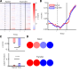

图 3-3-2 新旧任务下细胞的总体活跃度

Figure 3-3-2 Overall cellular activity under the new and old tasks

>比较蓝光线索任务作为初始和连续学习时的各种神经活动特征。初始学习组14只鼠、4586个细胞；连续学习组11只鼠、5105个细胞。（A）热图展示全细胞活跃格局。纵轴为细胞，但两列来自不同鼠，因此细胞并未跨列对齐，主要用于比较整体活动强度。（B）线图比较全细胞平均钙曲线，两者基本重合，但在1s附近连续学习钙曲线更高。（C）上：比较全细胞平均 1s z-score，图中显著性标注对应p=0.004；下：用线索前3s作为基线，将1s时刻z-score超过基线均值加3倍标准差的细胞定义为“活跃”细胞，比较活跃细胞占比，Fisher精确检验p<10^-13。连续学习时全细胞平均 1s z-score和活跃细胞占比都更高。

>Various neural activity features were compared when the blue-light cue task was learned as naive learning or continual learning. The naive-learning group included 14 mice and 4586 cells; the continual-learning group included 11 mice and 5105 cells. (A) Heatmaps show the global activity patterns of all cells. The vertical axis represents cells, but the two columns came from different mice, so cells were not aligned across columns; the main purpose is to compare overall activity strength. (B) Line plots compare calcium traces averaged across all cells. The two traces largely overlapped, but the continual-learning trace was higher around 1s. (C) Top: comparison of the all-cell mean 1s z-score; the significance annotation shown in the panel corresponded to p=0.004. Bottom: using the 3s pre-cue period as baseline, cells whose z-score at 1s exceeded the baseline mean plus 3 SD were defined as active, and the fraction of active cells was compared; Fisher's exact test p<10^-13. During continual learning, both the all-cell mean 1s z-score and the fraction of active cells were higher.

统计结果基本支持以总体活跃度概括初始和连续学习之间的直接差异。蓝光线索任务作为初始和连续学习时在全细胞总体活跃强度上有显著差异（图 3-3-2AC）。平均钙曲线也是连续学习在1s处更高，但有趣的是，这个差异仅表现在1s附近，更早和更晚时两条线基本重合（图 3-3-2B），这看起来就像是连续学习阶段出现了一群细胞将早期的线索响应和晚期的水奖励响应关联了起来，并且这群细胞是从初始任务学会阶段继承下来的。同时这也进一步证明1s时刻的钙信号是初始与连续学习差异的关键时点，后续分析都将专注于该时点。

初始的声音线索任务学会状态下，即使试次之间存在持续漂移的不同静息态，收到线索后的状态仍被叠加大致相同方向的演进动态（图3-2-5）。Gallego等在跨天记录灵长类PMd、M1和S1时也进一步指出，稳定行为对应的并不是每个单细胞都维持不变，而是低维 latent dynamics 在重复执行同一行为时仍保持稳定；即使单细胞活跃水平会漂移，群体轨迹本身仍可高度一致（Gallego et al., 2020）。本节讨论的亚群分化和群体组织，实际上也同样要求不同试次的线索产生相同方向的细胞响应：否则计算试次间均值时会发生正负抵消导致结果接近于0，表现为类似初始学习那样相对较低的活跃细胞占比。

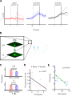

图 3-3-3 连续学习的试次间响应稳定性

Figure 3-3-3 Trial-to-trial response stability in continual learning

>（A）代表性细胞和试次的钙曲线，示意稳定性与平均值的关系。每个子图是一个细胞的一个训练单元，细线是单个试次，粗线是均值。左：初始学习蓝光线索任务首个训练单元的一个细胞，试次间响应较不稳定，导致平均后趋于零响应。中：初始学习声音线索任务学会时的一个细胞，不同试次间响应相对稳定，因此在平均后仍保留较清晰的正向活跃曲线。右：与中图同一个细胞，在连续学习蓝光线索任务时，不同试次间响应也较稳定（相比于左图初始学习），因而均值也是明晰的正向响应。（B）示意利用8㎐振荡镜头实现 MOp 2/3 层与5层的伪同步拍摄。（C）分2/5层比较蓝光线索任务作为初始和连续学习时，线索后 1s z-score 的相对散度。MOp2/3层：初始14只鼠、2676个细胞，连续11只鼠、2369个细胞；MOp5层：初始11只鼠、1910个细胞，连续10只鼠、2736个细胞。MOp2/3层在连续学习时散度显著更低，5层差异不显著。（D）蓝光线索任务首个训练单元的散度与命中率之间的Spearman相关性，一个点一只鼠，点的形状和颜色区分初始学习和连续学习两组。初始学习14只鼠，连续学习11只鼠，Spearman ρ=-0.755。（E）蓝光线索任务的首个训练单元的散度与重激活率之间的Spearman相关性，一个点一只鼠，仅包括连续学习。n=11，ρ=-0.836。

>(A) Representative calcium traces of example cells and trials illustrating the relationship between stability and averaging. Each subplot shows one cell in one block; thin lines are individual trials and thick lines are means. Left: a cell during the first block of naive light-water learning, showing unstable trial-to-trial responses that average toward zero. Middle: a cell during learned audio-water, showing relatively stable responses that preserve a clear positive mean trace after averaging. Right: the same cell as in the middle panel, now during continual light-water learning, showing similarly stable responses (compared with the left panel) and therefore a clear positive mean. (B) Schematic of pseudo-simultaneous imaging of MOp2/3 and MOp5 using an 8㎐ oscillating objective. (C) Relative divergence of 1s z-scores after cue onset in naive versus continual light-water learning, compared separately for layers 2/3 and 5. For MOp2/3, naive learning included 14 mice and 2676 cells, and continual learning included 11 mice and 2369 cells; for MOp5, naive learning included 11 mice and 1910 cells, and continual learning included 10 mice and 2736 cells. Only layer 2/3 showed significantly lower divergence during continual learning. (D) Spearman correlation between divergence in the first block of the light-water task and hit rate; each point represents one mouse, with point shape and color distinguishing naive and continual-learning groups. There were 14 naive-learning mice and 11 continual-learning mice, and Spearman ρ=-0.755. (E) Spearman correlation between divergence in the first block of the light-water task and reactivation rate; each point represents one mouse, and only continual learning was included. n=11, ρ=-0.836.

实验结果支持，相比于初始学习，蓝光线索任务在连续学习时的钙曲线在试次间更稳定一致（图 3-3-3A）。这种特性可以用相对散度衡量，散度的算法参见2.8，其核心思路是用试次间线索后 1s z-score 的方差除以试次间平均活动强度，得到的相对散度消除了不同训练单元拍摄条件差异，这样计算出的相对散度越小，表示各试次围绕同一平均状态聚拢得越紧，也就意味着线索后网络进入动作相关状态的轨迹越稳定。计算结果，相对散度与首个训练单元的命中率呈反相关（图 3-3-3D），这样就确认了相对散度可以作为一个能直接关联到行为指标的神经活动特征。同时，相对散度与重激活率也呈反相关（图 3-3-3E），这提示旧任务中活跃的细胞的确积极贡献到新任务中，它们的活跃能够有效压低试次间的相对散度，进一步关联到任务命中率的提升。

但是，旧经验对MOp2/5两层的影响并不平等。在拍摄过程中使用8㎐的震荡发生器令镜头上下振动，可以实现对两层的伪同步拍摄（图 3-3-3B）。结果发现，仅2/3层的相对散度在连续学习时显著低于初始；5层则无显著差异（图 3-3-3C），也就是说，虽然MOp5层也从旧任务中继承了部分活跃细胞，但它们未能使本层对线索的响应在试次间更加稳定。这提示，新任务学习中与旧任务结构稳定复用更相关的细胞，可能更多存在于2/3层而非5层。
### 3.3.3 重激活与相对散度的因果性证据
活动依赖的标记抑制，和在新旧任务之间插入一段遗忘期，这两种操纵方式可以为重激活与相对散度的作用提供一些因果性支持。

cFos是一种反映神经活跃度的即早基因，在活动依赖标记研究中常用来为某一时间窗内被任务招募的细胞提供遗传操作入口。Guenthner等建立的TRAP系统，将cFos或Arc等即早基因启动子与$Cre^{ER}$耦合，再在给定时间窗注射Tamoxifen（TM）或4-OHT，就可以令该时间窗内活跃的细胞永久性启动后续的Cre依赖基因表达：不仅能标记感觉刺激激活的细胞，也能标记更复杂任务中被招募的细胞（Guenthner et al., 2013）。例如，Koya等利用cFos驱动的Daun02失活方法，选择性抑制先前被可卡因配对情境激活的伏隔核稀疏细胞群后，情境特异性行为敏化随之减弱，说明由即早基因定义的活跃细胞群对后续行为表达具有因果作用（Koya et al., 2009）；在记忆印迹研究中，Liu等进一步证明，学习时被cFos标记的海马稀疏细胞群在后续被人工重激活时能够触发任务记忆相关行为（Liu et al., 2012）。


图 3-3-4 cFos 标记抑制旧任务学会时活跃的细胞降低新任务命中率

Figure 3-3-4 cFos-tagged inhibition of cells active during learned audio-water reduces new-task hit rate

>（A）示意cFos标记抑制实验。在$cFos-Cre^{ER}$基因型小鼠的MOp脑区注射pAAV-hSyn-DIO-hM4D(Gi)-mCherry病毒。初始声音线索任务学会后，腹腔注射Tamoxifen(TM)玉米油溶液，经过24h药代动力学间隔后再次进行声音线索任务训练，以标记任务学会状态下活跃的细胞。被标记细胞需约1~2周完成hM4D(Gi)-mCherry表达积累。随后学习蓝光线索任务，并在训练前1h注射CNO以启动hM4D(Gi)介导的抑制效应，从而抑制在旧任务中因活跃而被标记的细胞，阻止其发生重激活。对照组则在TM注射24h后不进行标记训练，因此标记抑制的是homecage中活跃的细胞。（B）mCherry报告的cFos标记细胞在MOp（白色虚线框）中的表达分布。（C）比较抑制组（蓝）和对照组（红）的学习曲线：抑制组学习曲线整体下移。由于新旧任务之间间隔了1~2周表达积累期，对照组学习曲线也偏低，但仍高于抑制组。对照组9只、cFos抑制组3只；学习曲线LME组主效应p=0.0003。（D）非特异性抑制对照。在不进行cFos标记的情况下，直接于MOp注射广谱pAAV-hSyn-hM4D(Gi)-mCherry病毒（蓝），同样在新任务训练前1h注射CNO进行抑制，相对于注射pAAV-hSyn-mCherry的纯荧光对照组（红），未产生明显抑制效应。对照组8只、hM4D(Gi)组3只；学习曲线LME组主效应p=0.65。（E）将旧任务学会阶段细胞，按照线索后 1s z-score 是否超过线索前3s均值+3倍标准差，分为活跃和不活跃两群，分2/5层比较它们在新任务中的相对散度：活跃群体散度显著低于不活跃群体。MOp2/3层纳入11只配对鼠，活跃/不活跃细胞分别为588/1781个，Wilcoxon符号秩检验p<0.001；MOp5层纳入10只配对鼠，活跃/不活跃细胞分别为416/2320个，Wilcoxon符号秩检验p=0.027。（F）cFos抑制和对照组的连续学习首个训练单元展开，逐试次比较命中率。对照组9只、cFos抑制组3只；逐试次混合效应模型p=0.62。（G）cFos抑制和对照组的学习曲线的Sigmoid拟合。10000次随机置换检验p=0.59，差异不显著。这可能是因为重复较少，cFos组只有3只鼠，对照组9只。

>(A) Schematic of the cFos-tagging inhibition experiment. In $cFos-Cre^{ER}$ mice, pAAV-hSyn-DIO-hM4D(Gi)-mCherry was injected into MOp. After audio-water learning, tamoxifen in corn oil was administered, followed by a 24h pharmacokinetic interval and an additional audio-water training session to label task-active cells with cFos. These tagged cells required approximately 1–2 weeks to accumulate hM4D(Gi)-mCherry expression. Mice were then switched to the light-water task, and CNO was injected 1h before training to activate hM4D(Gi)-mediated inhibition, thereby suppressing cells that had been active during audio-water learning and preventing their reactivation. In control animals, no tagging session was given 24h after tamoxifen, so that the tagged and inhibited cells were those active in the home cage. (B) Distribution of mCherry-reported cFos-tagged cells in MOp (white dashed outline). (C) Learning curves of the inhibition group (blue) and control group (red), showing an overall downward shift in the inhibition group. Because the 1–2-week expression-accumulation period intervened between the old and new tasks, the control group's learning curve was also somewhat lower, but still higher than the inhibition group. Control, 9 mice; cFos inhibition, 3 mice; LME group effect for the learning curve, p=0.0003. (D) Non-specific inhibition control: broad MOp hM4D(Gi) inhibition without cFos tagging (blue), compared with fluorescent controls (red), showed no significant effect. Control, 8 mice; hM4D(Gi), 3 mice; LME group effect for the learning curve, p=0.65. (E) Cells were divided into active and inactive populations according to their activity during learned audio-water, and divergence during continual light-water learning was compared between the two populations in layers 2/3 and 5. The active population showed significantly lower divergence than the inactive population. In MOp2/3, 11 paired mice were included, with 588 active and 1781 inactive cells, Wilcoxon signed-rank p<0.001; in MOp5, 10 paired mice were included, with 416 active and 2320 inactive cells, Wilcoxon signed-rank p=0.027. (F) The first block of continual learning was expanded for the cFos inhibition and control groups to compare hit rates trial by trial. Control, 9 mice; cFos inhibition, 3 mice; trial-by-trial mixed-effects model, p=0.62. (G) Sigmoid fits of the learning curves in the cFos inhibition and control groups. A random permutation test with 10000 shuffles gave p=0.59, indicating no significant difference. This may be because the number of replicates was small, with only 3 mice in the cFos group and 9 mice in the control group.

前已述旧任务相关细胞重激活与新任务命中率之间的关联，而因果性验证则需特异性抑制这些细胞以阻止其重激活。实验方法是，向$cFos-Cre^{ER}$基因型小鼠的MOp注射pAAV-hSyn-DIO-hM4D(Gi)-mCherry病毒，在旧任务学会后注射TM，然后等待24h药代动力学过程，再做一次旧任务。活跃细胞表达的$Cre^{ER}$原本定位在细胞质（内质网）中，但在TM的药代动力学时间窗内，会因结合了TM而进入细胞核，导致永久性的DIO翻转，启动hM4D(Gi)-mCherry的表达。TM-训练标记过程可重复进行以增加标记细胞数量，但过多重复标记会降低特异性。经过1~2周的表达水平积累，旧任务学会状态招募的细胞即被特异性标记，且后续可被CNO抑制（图 3-3-4AB）。

在新任务训练单元前1h注射CNO，以阻止旧任务相关细胞的重激活，可导致学习曲线整体下移（图 3-3-4C）。由于新任务的较低散度的主要贡献者就是旧任务学会时活跃的细胞，且这些活跃群体的相对散度显著低于不活跃群体（图 3-3-4E），因此使用cFos标记这些细胞进行抑制后可以认为是提高了相对散度。反之，若不进行特异性标记而仅广谱抑制MOp全部神经元，则未见明显效应（图 3-3-4D）。这说明重激活的细胞不仅是必要的，而且是旧任务特异性相关的：并不是任何非特异性操纵MOp整体活跃性的方法都能影响新任务命中率。

但是，细胞层面的操纵始终存在一个潜在风险：虽然特异性标记了旧任务学会时活跃的细胞，但这些细胞仍可能与非任务特异的基础学习能力有关，如感知或运动相关功能等。抑制这些细胞可能并非仅仅针对性地干扰了新任务对旧经验的复用，而是导致小鼠对任何任务都普遍地变得更难以学会。

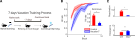

图 3-3-5 7 天遗忘后新任务命中率下降

Figure 3-3-5 New-task hit rate decreases after a 7-day forgetting interval

>（A）示意7天遗忘实验。声音线索初始任务学会后不立即学习新任务，而是间隔7天后再学习蓝光线索任务。对照是无间隔的正常连续学习。（B）与正常连续学习（红，11只鼠）相比，7天遗忘后（蓝，6只鼠）的学习曲线和首个训练单元命中率均较低；学习曲线线性混合效应模型组效应p=0.022，首个训练单元秩和检验p=0.0045。该行为图不涉及细胞计数。（C）与正常连续学习（红）相比，7天遗忘后（蓝）的旧任务相关细胞重激活率更低，试次间相对散度更高。重激活比较中，对照组包含11只鼠、511个旧任务活跃细胞，7天遗忘组包含5只鼠、252个旧任务活跃细胞，秩和检验p=0.027；散度比较中，对照组包含11只鼠、5105个细胞，7天遗忘组包含6只鼠、3523个细胞，秩和检验p=0.0049。

>(A) Schematic of the 7-day interval experiment. After audio-water learning, mice were not immediately switched to the new task but were instead left untrained for 7 days before starting the light-water task. The control group underwent normal continual learning without any interval. (B) Compared with normal continual learning (red, 11 mice), the 7-day interval group (blue, 6 mice) showed lower learning curves and lower first Block hit rates; the learning-curve linear mixed-effects group effect was p=0.022, and the first Block rank-sum test was p=0.0045. This behavior panel did not involve cell counts. (C) Compared with normal continual learning (red), the 7-day interval group (blue) showed lower reactivation of audio-water-active cells and higher trial-to-trial divergence. For reactivation, the control group included 11 mice and 511 audio-water-active cells, and the 7-day interval group included 5 mice and 252 audio-water-active cells (rank-sum p=0.027). For divergence, the control group included 11 mice and 5105 cells, and the 7-day interval group included 6 mice and 3523 cells (rank-sum p=0.0049).

要针对性操纵旧记忆而不影响基础学习能力，利用遗忘效应是一个巧妙的方法。在旧任务学会后不立即学习新任务，而是恢复正常饲养，经过7天遗忘后再学习新任务（图3-3-5A）。考虑到初始任务学会后小鼠的月龄普遍已大于3个月，7天间隔产生的生长发育或衰老效应可认为不足以导致重大基础学习能力改变，因此所观察到的任何行为差异可以特异性地归因到旧经验的遗忘。

在经典场景恐惧泛化实验中，延长任务间隔通常会使记忆提取不再能精确区分不同场景，而是对相似场景也产生反应。Wiltgen和Silva的研究显示，训练后1、14、28、36天进行测试时，动物对新场景的恐惧冻结水平随时间升高，场景间的区分能力下降，提示记忆会随时间流逝而失去部分精确性并表现出更强泛化（Wiltgen & Silva, 2007）。然而，本实验的结果相反：7天遗忘后，新任务首个训练单元命中率显著下降（图 3-3-5B），旧任务相关细胞的重激活率降低，试次间相对散度升高（图 3-3-5C）。这说明长期遗忘对泛化效应的影响并非普适于所有任务设计类型。但是，重激活率的降低和相对散度的上升，与行为上的命中率降低是一致的，进一步支持了旧任务相关细胞的重激活能降低试次间相对散度、提高新任务首个训练单元命中率的假说。
### 3.3.4 小结
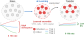

图 3-3-6 细胞重激活与相对散度模型小结

Figure 3-3-6 Summary model of cellular reactivation and relative divergence

>声音线索初始任务学习中，细胞活动在不同试次间不稳定，命中率较低。初始任务学会后，部分高活跃细胞可被蓝光线索重激活，这些细胞保留了旧任务学会时的试次间稳定性，并进一步通过兴奋-抑制平衡等机制降低新任务状态空间中的试次间相对散度。

>In naive audio-cued task learning, trial-to-trial cellular activity was unstable and hit rates were low. After audio-water learning, a subset of highly active cells could be reactivated by the light cue. These cells preserved the trial-to-trial stability of the learned audio-water state and, through mechanisms such as excitation–inhibition balance, further reduced trial-to-trial relative divergence in the new-task state space.

综上，连续学习的新任务首个训练单元高命中率的核心机制，可概括为：旧任务中稳定活跃的部分细胞被新线索再次激活，以这些重激活细胞为核心的兴奋-抑制平衡网络，能够在总体活动强度大致不变的情况下压低试次间的不稳定性。这种稳定化使新任务的学习过程从一开始就更接近成熟的群体状态，并表现为更高的任务命中率。
## 3.4 新任务学习过程的命中率快速增长机制
关注学习速度的既有研究大多集中在群体状态空间和神经流形视角上。Sadtler等在脑机接口任务中发现，动物更容易学会服从于既有流形框架的活动模式，而明显违反该流形的模式则更难在数小时内快速掌握，说明既有环路结构本身就在约束不同任务形式的难易倾向（Sadtler et al., 2014）。Golub等进一步指出，短时程快速学习往往不是凭空生成全新的群体活动模式，而更接近对原有活动模式库进行重新关联或组合（Golub et al., 2018）。Hennig等则在脑机接口学习任务中观察到，运动皮层中存在类似于唤醒状态维持的、相对刻板的群体活动变化，即 neural engagement。这种任务非特异的状态叠加到当前任务后：若与当前任务要求更一致，就会使学习更快；若违背当前任务要求，则可拖慢学习（Hennig et al., 2021）。这些前瞻研究共同提示，连续学习的快速增长可能与初始任务形成的群体活动流形模式有关：新任务可以直接在这个既有框架内快速前进，而无需重构新的流形模式。

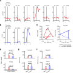

图 3-4-1 初始学习状态的往复折返

Figure 3-4-1 Back-and-forth reversals in the naive learning state

>（AB）分别展示初始学习与连续学习的一个代表性细胞，显示其在学习过程中各训练单元（naive, S1→S7; Continual, S1→S3）的活动变化及（z-score）对应行为表现（naive, 0%→100%; Continual, 23%→100%）。初始学习细胞的跨训练单元变化方向更不稳定，连续学习细胞则更接近单调增强。（C）分别展示初始学习与连续学习的代表性小鼠在PCA空间中的学习轨迹。每个点表示一个训练单元的 1s z-score 状态，实线为实际学习轨迹，虚线表示连接起点与终点的直线方向及距离。初始学习轨迹有许多往复折返，连续学习则沿该方向较稳定推进。该面板中初始学习与连续学习代表鼠均为1只，分别包含501和420个细胞。（D）分2/5层比较每只鼠实际学习路程与最短学习距离的比值（偏离率）；比值越大，表示实际轨迹相对起点-终点直线连线的偏离越大。2/3层差异较小，5层则是初始学习偏离率更高。（E）分2/5层比较每只鼠实际学习路程中，每个训练单元的平均状态改变量（平均步长），用于测量跨训练单元的漂变或学习能力。两层均无显著差异。（F）分2/5层比较每一步在最优方向上的平均投影长度（有效步长），用于表征任务相关的有效学习能力。连续学习在2/3层有效步长更大。D-F使用同一分层统计样本：2/3层为初始学习11只鼠、1862个细胞，连续学习11只鼠、2369个细胞；5层为初始学习9只鼠、1509个细胞，连续学习10只鼠、2735个细胞。

>(AB) Representative cells from naive and continual learning, respectively, showing activity changes across blocks (naive, S1→S7; Continual, S1→S3) together with the corresponding behavioral performance based on z-score (naive, 0%→100%; Continual, 23%→100%). Cells in naive learning showed more unstable directions of change across blocks, whereas cells in continual learning were closer to monotonic increases. (C) Representative mice from naive and continual learning, respectively, showing learning trajectories in PCA space. Each point represents the 1s z-score state in one block; solid lines trace the actual learning trajectory, and dashed lines indicate the straight direction and distance connecting the start and end states. Naive learning showed many back-and-forth reversals, whereas continual learning progressed more stably along this direction. Panel C used one representative mouse per group, with 501 cells in the naive mouse and 420 cells in the continual mouse. (D) Ratio of actual path length to shortest learning distance for each mouse, compared separately for layers 2/3 and 5; larger ratios indicate greater deviation of the actual trajectory from the straight start-to-end path. The difference was small in layer 2/3, whereas in layer 5 the deviation ratio was higher in naive learning. (E) Average state-change magnitude per block along the actual learning path, compared separately for layers 2/3 and 5, used to measure across-block drift or learning ability. Neither layer showed a significant difference. (F) Average projection length of each step onto the optimal direction, compared separately for layers 2/3 and 5, used to characterize task-relevant effective learning ability. Continual learning showed a larger effective step length in layer 2/3. Panels D-F used the same layer-specific samples: layer 2/3 included 11 naive mice/1862 cells and 11 continual mice/2369 cells; layer 5 included 9 naive mice/1509 cells and 10 continual mice/2735 cells.

PCA分析表明，相比于初始学习，连续学习过程在状态空间中的学习方向更稳定地从起点向终点推进，表现为往复折返更少，在起点向终点的投影方向上前进更快。（图 3-4-1C）。这提示连续学习过程很可能服从了初始任务中已经形成的部分活动组织方式或流形结构约束，单细胞层面则表现为更多的细胞活动随训练单元推进呈现单调增或减（图 3-4-1B）；相反，初始学习需要不断大幅重构原本不存在或与任务要求完全违背的基础流形结构，其学习路径和单细胞活动就容易出现跨训练单元的增减反复和方向摇摆（图 3-4-1A）。

可以通过一系列计算指标反映这一差异，例如用实际在状态空间中划过的总路程除以起点和终点的直线距离，量化轨迹相对最短连线的曲折程度，结果发现连续学习在状态空间中的路程/距离比确实更小，但只有5层显著（图 3-4-1D）。也可以计算每个训练单元在起点到终点连线方向上的投影长度，衡量沿该方向的推进幅度，结果发现连续学习的投影步长也确实更大，但只有2/3层显著（图 3-4-1F）。最后，可以计算总路程与训练单元步数之比，确认更快的连续学习是否有其本身每个训练单元的实际步长因素影响，结果发现无显著差异（图 3-4-1E）。这些检验指向的共同结论是，连续学习的更大斜率，是因为状态空间中的学习轨迹更接近起点-终点连线、曲折程度更低；而初始学习虽然也在前进，但由于需要重建流形结构，学习状态更容易出现折返往复，进程缓慢。
### 3.4.1 既有框架的稳定性统计指标——响应异质性
在状态空间中看到的稳定的流形架构或学习方向，落实到细胞层面，实际上反映的是不同细胞之间的功能分化：有些细胞被线索稳定激活，称正响应群体；有些细胞反而被线索抑制，称负响应群体。这种正负响应群体的分化如果在不同训练单元之间保持稳定，即使单个细胞活动强度不高，也能起到稳定状态空间中的流形走向的效应。当大量细胞普遍有了稳定的正负方向分化，整体的学习方向也会趋于稳定，更高效地朝着正确目标前进。机器学习中有类似的理论提示：初始化条件与表征分化会影响优化速度和收敛路径（Saxe et al., 2014）。具体来说，一个初始权重分布高度一致的网络通常难以学习，因为梯度下降算法难以在相同的权重或激活强度之间产生差异化更新，难以找到正确的学习路径；反之，初始分布具有适当异质性的网络就更容易学习。在机器和动物上共通的规律是：一个确定的方向是快速学习的关键。


图 3-4-2 初始与连续学习的响应异质性

Figure 3-4-2 Response heterogeneity in naive and continual learning

>Statistics: A used a representative block from 1 mouse with 517 cells, response heterogeneity=0.414; correlation or significance testing was not applicable. In B, layer 2/3 included 14 naive mice with 2565 cells and 11 continual-learning mice with 2210 cells, Spearman ρ=0.442, p=0.0268; layer 5 included 11 naive mice with 1891 cells and 10 continual-learning mice with 2679 cells, Spearman ρ=0.422, p=0.0570. In C, the representative naive block came from 1 mouse with 610 cells, response heterogeneity=0.270; the representative continual-learning block came from 1 mouse with 499 cells, response heterogeneity=0.428; correlation or significance testing was not applicable. In D, layer 2/3 included 13 naive mice with 2463 cells, 8 continual-learning mice with 1607 cells, and 11 learned audio-cue mice with 2057 cells; ranksum p=0.180 for naive versus continual learning and p=0.00177 for learned audio cue versus continual learning. Layer 5 included 10 naive mice with 1736 cells, 8 continual-learning mice with 2058 cells, and 10 learned audio-cue mice with 2611 cells; ranksum p=0.00855 for naive versus continual learning and p=4.57×10^-5 for learned audio cue versus continual learning. E included 11 mice and 4572 cells, Spearman ρ=0.219, p<1×10^-300; old-task grouping contained 2117 positively responding and 2455 negatively responding cells, paired signrank p=0.0009766; new-task grouping contained 1984 positively responding and 2588 negatively responding cells, paired signrank p=0.0009766. In F, layer 2/3 included 14 naive mice with 2676 cells and 11 continual-learning mice with 2369 cells, ranksum p=0.494; layer 5 included 11 naive mice with 1910 cells and 10 continual-learning mice with 2736 cells, ranksum p=0.647. In G, the naive group included 11 mice with 3317 cells and the continual-learning group included 11 mice with 4903 cells, Spearman ρ=-0.651, p=0.00103.

>（A）用一个代表性训练单元直观展示响应异质性。下方为细胞×时间×试次的3D热图，显示细胞维度上向正负两端分化的分布；上方为 1s z-score 试次均值的分布直方图。先计算各均值区间内的细胞占比，再将细胞间标准差定义为响应异质性指标。为减少极端细胞及鼠间总体活跃水平差异的影响，仅纳入[-1,1]范围内的温和响应细胞。（B）分2/5层列出每只鼠的响应异质性与蓝光线索任务的Sigmoid斜率的Spearman相关性，不同颜色点区分初始学习与连续学习。结果仅2/3层表现出显著相关。（C）展示蓝光线索任务一个代表性初始学习训练单元，和一个代表性连续学习训练单元，用于直观比较响应异质性差异。两者总体活跃水平相近，但连续学习训练单元的钙信号在细胞维度上更明显地向两极分化。（D）分2/5层比较初始学习蓝光线索任务、连续学习蓝光线索任务和已学会的声音线索任务的响应异质性。已学会的声音线索任务总是具有最高的响应异质性水平，而蓝光线索任务的初始与连续学习之间的差异仅在5层显著。（E）计算连续学习的蓝光线索任务与初始的声音线索任务学会阶段，两个训练单元之间的响应异质性分化梯度的Spearman相关性。中间散点图每个点是一个细胞，其位置显示细胞在两个训练单元中的z-score。按旧任务中细胞为正响应或负响应分群，可得到上方条形图，显示两群在新任务中的活动方向；反之，按新任务中细胞为正响应或负响应分组，可得到右侧条形图，显示两群在旧任务中的活动方向。两组结果相互对称：在一个任务为正响应的细胞，在另一个任务中也倾向于更高，负响应细胞则更低。这说明旧任务产生的细胞分化方向或群体结构得到保留。（F）分2/5层比较初始学习与连续学习阶段，在线索前3s基线中，钙信号随时间波动的标准差，即用于计算z-score的基线标准差。结果显示，连续学习阶段的基线波动并不低于，甚至高于初始阶段，因此连续学习阶段较高的响应异质性并不能解释为其基线波动更低。（G）计算响应异质性与图3-4-1中路程/距离比之间的Spearman相关性，说明较高的响应异质性直接有助于状态空间轨迹更服从目标学习方向，降低与起点-终点连线的偏离。初始和连续学习组各11只鼠，Spearman ρ=-0.651。

>(A) A representative block illustrating response heterogeneity. The lower panel is a 3D heatmap of cell × time × trial, showing polarization toward positive and negative extremes along the cell dimension. The upper panel is a histogram of trial-averaged 1s z-scores. The proportion of cells in each mean-value bin was computed, and the final heterogeneity metric was defined as the across-cell standard deviation. To reduce the influence of extreme cells and differences in overall activity levels across mice, only moderately responding cells within [-1, 1] were included. (B) Spearman correlation between response heterogeneity and the sigmoid slope of the blue-light cue task for each mouse, shown separately for layers 2/3 and 5; colors distinguish naive and continual learning. Only layer 2/3 showed a significant correlation. (C) Representative naive and continual learning blocks from the blue-light cue task, illustrating differences in response heterogeneity. Overall activity levels were similar, but calcium signals in the continual learning block were more strongly polarized toward the two extremes along the cell dimension. (D) Response heterogeneity was compared across naive learning of the blue-light cue task, continual learning of the blue-light cue task, and the learned audio-cue task, separately for layers 2/3 and 5. The learned audio-cue task consistently showed the highest level of response heterogeneity, whereas the difference between naive and continual learning of the blue-light cue task was significant only in layer 5. (E) Spearman correlation of the response-heterogeneity differentiation gradient between continual learning of the blue-light cue task and the learned stage of the naive audio-cue task. In the central scatter plot, each point represents one cell, and its position shows that cell's z-score in the two blocks. Cells were grouped according to positive versus negative responses in the old task to generate the upper bar plot, which shows the activity direction of the two groups in the new task; conversely, cells were grouped according to positive versus negative responses in the new task to generate the right bar plot, which shows the activity direction of the two groups in the old task. The two results were symmetric: cells with positive responses in one task tended to be higher in the other task, whereas cells with negative responses tended to be lower. This indicates that the differentiation direction or population structure generated by the old task was preserved. (F) The temporal standard deviation of calcium-signal fluctuations during the 3s pre-cue baseline, namely the baseline standard deviation used for z-score calculation, was compared between naive and continual learning, separately for layers 2/3 and 5. Baseline fluctuations during continual learning were not lower than, and were even higher than, those during naive learning; therefore, the higher response heterogeneity during continual learning cannot be explained by lower baseline fluctuation. (G) Spearman correlation between response heterogeneity and the path-length-over-distance ratio in Figure 3-4-1, showing that higher response heterogeneity directly helped state-space trajectories follow the target learning direction and reduced deviation from the start-to-end line. The naive and continual learning groups each included 11 mice; Spearman ρ=-0.651.

细胞的响应方向分化可以被统计计算指标所衡量。将计算时段内的试次或训练单元平均后，为了排除极端细胞个体，以及不同鼠之间总体活跃水平的干扰，首先排除线索后 1s z-score 在[-1,1]范围之外的细胞，然后在不同细胞之间计算标准差，这个指标就称为响应异质性指标。响应异质性越大，意味着细胞间正负响应分化程度越高（图3-4-2A）。

相关性分析显示，响应异质性的确能解释不同鼠之间学习速度的差异，且MOp2/3层的相关性比5层更显著：响应异质性越大的个体，无论初始还是连续学习，都表现出更快的学习速度（图 3-4-2B）。而连续学习更快的原因，也可以解释为新任务学习过程中更高的响应异质性，特别是MOp5层，蓝光线索任务作为连续学习时比初始学习异质性显著更高（图 3-4-2CD）。这种更高的异质性结构正是从初始任务中继承而来，因为新任务中细胞间的分化梯度方向也和旧任务学会阶段显著相关：高活动的群体和低活动的群体大方向基本都是一致的（图 3-4-2E）。连续学习任务线索之前，用来计算z-score的前3s基线的时间波动标准差也不显著地增大了，这进一步说明响应异质性的增大并不是因为基线的差异，因为基线标准差是z-score计算中的分母——分母增大的情况下响应异质性仍增大，说明连续学习对线索后的影响显著胜过线索前的少许波动（图 3-4-2F）。最后，结合前述关于连续学习状态空间轨迹往复折返更少的结论，响应异质性与路程/距离比的相关性也确实显著为负，说明响应异质性所反映的的分化程度越高，学习过程就越接近一致方向，状态空间轨迹中也越少出现大幅折返（图 3-4-2G）。
### 3.4.2 响应异质性依赖丘脑
温和活动群体的响应异质性，是一个无法用cFos等常规活动依赖标记手段直接操纵的特征；一个自然的思路是从其上游通路入手。丘脑（Thalamus，TH）正是一个已有研究支持的候选入口：丘脑后部感觉相关亚区，可能是连接体感信息与皮层运动信号的高阶节点之一。例如在啮齿类胡须触觉相关研究中发现，以PO（Posterior complex of the thalamus）为代表的后部丘脑与体感皮层和运动皮层之间存在密切联系，并可调节这些皮层区对触觉刺激的响应模式（Casas-Torremocha et al., 2017）；Hooks等则发现来自后部感觉相关丘脑的输入对MOp呈明显分层特异性投射，优先作用于L2/3和L5A（Hooks et al., 2013）。因此，以PO为中心的TH后端区域，是一个可能影响感觉历史、皮层状态和运动输出准备关系的重要候选操纵入口。


图 3-4-3 TH 抑制影响学习速度和响应异质性

Figure 3-4-3 TH inhibition alters learning speed and response heterogeneity

>（A）TH抑制示意图。实验组注射hSyn-hM4D(Gi)，对照组注射荧光对照病毒。在迁移学习全阶段，每个训练单元前1小时注射CNO，抑制TH。钙信号仍然观察MOp2/3和MOp5层。（B）TH表达示例，以PO为中心，覆盖TH的主要后端区域。
>（C）TH抑制和对照组各取一个代表性训练单元（对应单个训练单元）的3D热图和 1s z-score 分布直方图，展示响应异质性差异。TH抑制后细胞向两端的极化程度降低，更集中在0附近，即响应异质性下降；代表对照鼠为 vtf0233（30个试次，550个细胞，其中499个温和响应细胞，响应异质性0.4279），代表TH抑制鼠为 yqnTHMo2（25个试次，529个细胞，其中500个温和响应细胞，响应异质性0.3548），该代表性展示不涉及显著性P值或相关性ρ值。
>（D）TH抑制和对照组的学习曲线和第1训练单元命中率比较。学习曲线包括对照组11只鼠43个训练单元、TH抑制组12只鼠122个训练单元，组间差异显著（p=0.001291）；第1训练单元命中率无显著差异（p=0.2939），说明TH抑制对迁移首个训练单元的旧结构调用影响不大。（E）Sigmoid拟合TH抑制（12只）和对照组（11只）的学习曲线斜率（对照组0.7754，TH抑制组0.0552）。10000次组间随机置换检验p=0.0939。（F）示意ΔHit计算方式，即学习曲线上相邻两个训练单元的差值，这样每只鼠N个训练单元产生N-1个训练单元对，但要排除达到100%及以后的训练单元，以避免天花板效应导致相邻训练单元差值被低估。
>（G）比较TH抑制和对照组的ΔHit和MOp5响应异质性。ΔHit统计中，对照组为8只鼠、15个相邻训练单元对，TH抑制组为5只鼠、20个相邻训练单元对，ranksum p=0.03415；MOp5响应异质性统计中，对照组为8只鼠、2095个细胞（2058个温和响应细胞），TH抑制组为5只鼠、1176个细胞（1163个温和响应细胞），ranksum p=0.02953。与之前结论一致，TH抑制后学习速度下降，同时5层响应异质性也下降。
>（H）分2/5层比较响应异质性和学习斜率的 Spearman 相关性，不同颜色的点区分TH抑制和对照组的鼠。MOp2/3层为对照组8只鼠、1677个细胞（1607个温和响应细胞）和TH抑制组5只鼠、1347个细胞（1326个温和响应细胞），Spearman ρ=0.615，p=0.02854；MOp5层为对照组8只鼠、2095个细胞（2058个温和响应细胞）和TH抑制组5只鼠、1176个细胞（1163个温和响应细胞），Spearman ρ=0.714，p=0.008143。响应异质性与学习斜率的鼠间差异相关。
>（I）比较TH抑制/对照组中，在声水任务学会阶段活跃的细胞迁移到光水任务时的重激活率，发现没有显著差异；MOp2/3层为对照组11只鼠、308个学会声水活跃细胞和TH抑制组5只鼠、92个学会声水活跃细胞，ranksum p=0.3118；MOp5层为对照组10只鼠、203个学会声水活跃细胞和TH抑制组5只鼠、47个学会声水活跃细胞，ranksum p=0.3403。

>(A) Schematic of thalamic inhibition. The experimental group was injected with hSyn-hM4D(Gi), whereas controls received a fluorescent control virus. During the entire transfer-learning phase, CNO was injected 1h before each block to inhibit TH. Calcium signals were still recorded from MOp2/3 and MOp5. (B) Example of TH expression centered on PO and covering the major posterior region of TH.
>(C) One representative block from the TH-inhibition group and one from the control group, each corresponding to a single block, showing 3D heatmaps and histograms of 1s z-score distributions to illustrate response-heterogeneity differences. After TH inhibition, cells were less polarized toward both ends and more concentrated near zero, indicating lower response heterogeneity; the representative control mouse was vtf0233 (30 trials, 550 cells, including 499 moderate-response cells, response heterogeneity=0.4279), and the representative TH-inhibition mouse was yqnTHMo2 (25 trials, 529 cells, including 500 moderate-response cells, response heterogeneity=0.3548). Significance P values and correlation ρ values were not applicable to this representative display.
>(D) Comparison of learning curves and first-block hit rates between TH-inhibition and control groups. The learning-curve analysis included 11 control mice with 43 blocks and 12 TH-inhibition mice with 122 blocks, showing a significant group difference (p=0.001291); first-block hit rate did not differ significantly (p=0.2939), indicating that TH inhibition had little effect on prior-structure recruitment in the first transfer block. (E) Sigmoid fits of the learning-curve slopes for the TH-inhibition group (12 mice; slope=0.0552) and control group (11 mice; slope=0.7754). A between-group random permutation test with 10000 shuffles gave p=0.0939. (F) Schematic definition of ΔHit as the difference between two adjacent blocks on the learning curve. Each mouse therefore contributed N-1 block pairs from N blocks, but blocks at and after 100% performance were excluded to avoid ceiling effects that would underestimate adjacent-block differences.
>(G) Comparison of ΔHit and MOp5 response heterogeneity between TH-inhibition and control groups. For ΔHit, the control group included 8 mice and 15 adjacent block pairs, whereas the TH-inhibition group included 5 mice and 20 adjacent block pairs (ranksum p=0.03415); for MOp5 response heterogeneity, the control group included 8 mice and 2095 cells (2058 moderate-response cells), whereas the TH-inhibition group included 5 mice and 1176 cells (1163 moderate-response cells; ranksum p=0.02953). Consistent with the earlier results, TH inhibition reduced learning speed and also reduced layer-5 response heterogeneity.
>(H) Layer-specific Spearman correlations between response heterogeneity and learning slope, with point colors indicating mice from the TH-inhibition and control groups. In MOp2/3, the analysis included 8 control mice with 1677 cells (1607 moderate-response cells) and 5 TH-inhibition mice with 1347 cells (1326 moderate-response cells; Spearman ρ=0.615, p=0.02854). In MOp5, it included 8 control mice with 2095 cells (2058 moderate-response cells) and 5 TH-inhibition mice with 1176 cells (1163 moderate-response cells; Spearman ρ=0.714, p=0.008143). Response heterogeneity was correlated with inter-mouse differences in learning slope.
>(I) Comparison of reactivation rates between TH-inhibition and control groups for cells that had been active during the learned audio-water task when transferred to the light-water task, showing no significant difference. In MOp2/3, the analysis included 11 control mice with 308 learned-audio active cells and 5 TH-inhibition mice with 92 learned-audio active cells (ranksum p=0.3118). In MOp5, it included 10 control mice with 203 learned-audio active cells and 5 TH-inhibition mice with 47 learned-audio active cells (ranksum p=0.3403).

本实验向PO亚区为中心的TH后端区域注射hSyn-hM4D(Gi)病毒进行广泛抑制，并观察行为和MOp钙信号受到何种影响（图 3-4-3AB）。结果显示，TH抑制降低了新任务的学习速度（每个训练单元的增量）以及MOp5层的响应异质性（图 3-4-3CFG）。学习速度和响应异质性的鼠间差异则在2/5层均显著相关（图 3-4-3H），这不同于3.4.1中仅2/3层显著的相关性。相比之下，首个训练单元的任务命中率和旧任务活跃细胞的重激活率未受显著影响（图 3-4-3DI）。这说明以PO为中心的丘脑后部核团能通过调节MOp的响应异质性进而影响学习速度。层级细节上，5层更直接受调控，但最终行为效应大小也会反映在2/3层。
### 3.4.3 小结


图 3-4-4 连续学习快速增长机制小结

Figure 3-4-4 Summary of the mechanism underlying rapid hit-rate growth in continual learning

>连续学习命中率的快速增长与响应异质性相关。初始学习中，响应异质性较低，多数细胞长期分布在0附近。连续学习时，网络保留了初始任务留下的响应异质性结构，细胞群体分化为远离零点的正负两极，使得学习方向稳定。这种响应异质性的形成依赖TH输入。

>The rapid growth of hit rate during continual learning was associated with response heterogeneity. In naive learning, response heterogeneity was low, with most cells remaining near zero over time. During continual learning, the network retained the response-heterogeneity structure left by the naive task, and cell populations differentiated into positive and negative poles away from zero, stabilizing the learning direction. The formation of this response heterogeneity depended on TH input.

综上，连续学习命中率的快速增长，并不是因为网络获得了更强的非特异性学习能力，而是依赖于初始学习后形成的群体分化结构。状态空间流形分析结果表明这种优势体现为学习轨迹方向更稳定、更少往复折返，细胞层面则表现为更高的响应异质性，并依赖以PO为中心的后部丘脑输入。学习和丘脑输入的影响主要施加在MOp5层，但最终行为效应的读出也会反映在2/3层。
## 3.5 RSP 反映视觉线索的瞬时输入
之前选择MOp作为主要观察中心，是因为实验设计的两种不同线索的任务对应到相同的舔舐运动输出端，逻辑上可能更直接反映不同任务之间的共同保留信息或结构。反之，如果是运动皮层上游、更接近感觉线索端的皮层区域，例如位于视觉皮层与运动皮层之间的RSP，就有可能偏向提供视觉模态特异的信息输入，而不是在连续学习中承担与MOp同等的信息结构共享作用。从既往相关研究中可以罗列RSP被认为参与情景记忆、导航、想象与未来规划等功能，这种多样性使得较新的观点更倾向于将其视为整合感觉、运动与空间信息的抽象节点，而非直接指向具体功能（Alexander et al., 2023）。将MOp与RSP进行功能比较，就可以将脑区在任务中的功能与其在皮层上的拓扑位置建立关联，印证从结构到功能的逻辑链。


图 3-5-1 RSP 位于VIS与MO之间，并表现出视觉相关上游输入特征

Figure 3-5-1 RSP lies between VIS and MO and exhibits features of a visually biased upstream input

>（A）RSP在小鼠大脑中的位置示意图。RSP位于视觉皮层与运动皮层之间，且与两者直接接壤，因此可能构成视觉线索进入运动皮层的上游节点之一。（B）三列热图展示RSP在声音线索初始任务学会阶段，以及蓝光线索任务在成功和失败时的响应架构，排除了三列都不活跃的细胞。RSP对蓝光线索任务成功与失败的响应基本一致，而对声音线索的响应极弱，符合其靠近视觉皮层、远离听觉皮层的拓扑特征。（C）取RSP和MOp中的正向活跃细胞，比较它们对蓝光线索的响应强度和启动时间，结果显示RSP启动更早。（D）计算RSP中初始任务学会时活跃细胞的重激活率与蓝光线索新任务首个训练单元命中率之间的Spearman相关性，结果不显著，但样本量可能偏少。（E）比较蓝光线索任务成功与失败试次中，初始任务学会时活跃细胞重激活率的差异：命中试次略高于失败试次。（F）比较初始声音线索任务学会时活跃细胞，与其在蓝光线索任务的成功和失败试次，共三种条件下的平均钙曲线。三者差异整体较小，失败试次甚至还略高于命中试次。（G）示意RSP化学遗传抑制实验。在双侧RSP注射hSyn-hM4D(Gi)病毒，并在连续学习新任务阶段每个训练单元前1h注射CNO以抑制RSP。对照组注射mCherry荧光对照病毒。（H）RSP抑制实验的病毒表达示意。（I）RSP抑制组与对照组的学习曲线，并附加RSP与MOp联合抑制组的学习曲线。单独抑制RSP未见学习曲线下降；RSP与MOp联合抑制时，首个训练单元命中率仍未明显下降，但后续达到100%成功的过程受阻。

> (A) Schematic location of RSP in the mouse brain. RSP lies between visual and motor cortex and directly borders both, making it a plausible upstream node through which visual information may enter a broader sensorimotor network. (B) Heatmaps showing RSP response structure in learned audio-water, transfer light-water hit, and transfer light-water miss conditions, including only cells active in at least one column. RSP responded similarly in transfer hit and miss trials but only weakly in audio-water, consistent with its cortical topology. (C) Comparison of response amplitude and onset latency to the light cue between positively active cells in RSP and MOp. RSP showed an earlier onset. (D) Spearman correlation between reactivation rate of audio-water-active RSP cells and transfer Day 1 hit rate; the effect was not significant, although sample size may have been limited. (E) Difference in reactivation rate of audio-water-active RSP cells between transfer hit and miss trials. Reactivation was slightly higher in hit trials than in miss trials. (F) Mean calcium traces of audio-water-active cells across learned audio-water, transfer hit, and transfer miss conditions. Overall differences among the three traces were small: learned audio-water was highest, and transfer miss was slightly higher than transfer hit, indicating that this class of sound-responsive cells was not dominant in RSP. (G) Schematic of the RSP chemogenetic inhibition experiment. hSyn-hM4D(Gi) was injected bilaterally into RSP, and CNO was administered 1h before each training day throughout transfer learning to inhibit RSP. Controls received mCherry virus. (H) Example of viral expression in the RSP inhibition experiment. (I) Learning curves for the RSP inhibition and control groups, together with an additional curve for combined RSP and MOp inhibition. Inhibition of RSP alone did not lower the learning curve. When RSP and MOp were jointly inhibited, Day 1 hit rate still did not decrease clearly, but the subsequent progression to 100% performance was impeded.

从皮层拓扑上看，RSP位于视觉和运动皮层之间，适合作为候选的视觉相关上游区域（图 3-5-1A）。连续学习实验结果显示，RSP对视觉线索的响应显著强于对听觉线索的响应，并且对试次的成功或失败不作明显区分；其对视觉线索的响应启动也早于MOp（图 3-5-1BC）。这一结果与既往对RSP的认识基本一致：RSP能够较快表征视觉线索、轨迹和奖赏位置等具有明确意义指向的信息，为下游行为网络提供瞬时参考输入（Alexander et al., 2023）。但是，新任务首个训练单元的任务命中率与初始任务学会时活跃细胞的重激活率并不显著相关；成功与失败试次中的重激活率虽有轻微差异，但总体活动强度差异不大，甚至未命中试次反而更高（图 3-5-1D-F）。更关键的是，RSP抑制实验未表现出明确阳性结果：RSP抑制组的学习曲线与对照组没有显著差异，甚至略好；而RSP和MO共同抑制的曲线也没有明显比单独MO抑制更差（图 3-5-1I）。总之，RSP偏好在蓝光线索任务中介导瞬时的视觉信息输入，对听觉信息则响应极弱；但它对当前关联性学习任务的命中率可能只起冗余辅助作用，而非决定成败的单一核心节点。的确，从皮层拓扑上看，视皮层产生的信号也可以通过PTLp→SS通路到达MO，这种解剖特征与RSP表现出的功能偏好是一致的。
## 3.6 信息论视角
连续学习能够利用从旧任务中学到的知识，加快对新任务的掌握速度。前述章节主要从状态空间位置来展示学习进度，但这种做法并不能直观显示知识的积累和复用，也不能直接衡量知识的多寡。信息论则提供了一组可用于神经数据的定量工具，例如自信息、熵和共享信息，能够描述群体活动状态的差异度或可区分性，以及不同条件之间共享的统计量（Timme & Lapish, 2018）。信息论的优势在于不需要对具体编码方式进行过强假设，直接从统计概率分布角度量化知识信息的总量、共享和差异。

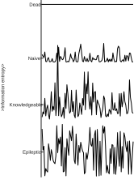

图 3-6-1 神经群体活动的信息论解释

Figure 3-6-1 Information-theoretic interpretation of neural population activity

>信息量与神经活动对应关系的示意。无活动状态对应最低信息量；初始条件下，任务相关表征尚未建立，细胞活动较低，信息量较少；达到学会标准的条件下，任务相关表征更加明确，细胞活动增强，信息量较高。但过高且无序的活动并不对应有效表征，而可能反映病理性同步放电。

>Schematic relationship between information and neural population activity. A fully silent network has minimal information. Naive task states carry little task-related structure, whereas learned states show stronger and more organized activity patterns. However, excessively high and disordered activity does not correspond to effective representations but may reflect pathological synchronous discharge.

信息论给出了从神经活动到信息量的算法。其核心思想是，一个瞬时群体状态若在总体概率分布中，越是罕见的小概率状态，则其自信息越高。若将D个细胞在一段时间内的信号值近似为一个D维高斯分布X~N(μ,Σ)，其中μ是均值向量，Σ是协方差矩阵，则特定状态x的微分自信息可以写为（Timme & Lapish, 2018）：
$$
I(x,Σ)=\frac{D\log_2(2π)+\log_2\det(Σ)+\log_2(e)(x-μ)^TΣ^{-1}(x-μ)}{2}
$$
其中det表示行列式，$(x-μ)^TΣ^{-1}(x-μ)$是马氏距离的平方，衡量状态x与平均状态μ之间的距离，距离越远，自信息越高。这个公式同时考虑了神经活动分布的整体形状和当前状态对平均状态的偏离，因此可用于量化单个时刻群体状态的信息量。

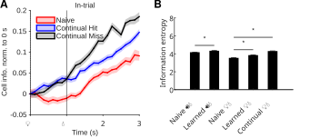

图 3-6-2 学习过程导致信息量增加

Figure 3-6-2 Increase in information during learning

>（A）计算蓝光线索任务的作为初始任务（naive），或者作为连续学习的成功或失败试次中，平均每个细胞的信息量并归一化到0s时刻。结果显示，连续学习蓝光线索任务时，在线索时刻之后的瞬时信息量快速上升，但成功和失败试次差异不大；但若是初始学习同样的任务，信息量在线索后先下降，至给水后才上升。（B）比较声音或蓝光线索作为初始任务的首个训练单元（naive）或学会后（Learned），以及连续学习蓝光线索任务，5种不同条件下的训练单元整体信息熵，以训练单元为统计单位。无论声音还是蓝光线索任务，都是初始学习首个训练单元最低。

>(A) The average information per cell was calculated for the light-water task when used as a naive task, or for hit and miss trials during continual learning, and normalized to the 0s time point. During continual light-water learning, instantaneous information rose rapidly after cue onset, with little difference between hit and miss trials; during naive learning of the same task, information first decreased after cue onset and rose only after water delivery. (B) Overall block entropy was compared across five conditions: the first block (naive) or learned stage (Learned) of the audio-water or light-water task, and continual light-water learning. The first block of naive learning had the lowest entropy for both audio-water and light-water tasks.

信息论允许计算单个时点的瞬时信息量，也可以计算一个训练单元的整体信息熵，即整段群体状态分布的平均不确定度。结果显示，连续学习的信息量在线索之后迅速上升，说明网络能够较快进入与任务相关的低概率或高信息状态；而初始学习的信息量在线索之后反而先下降，直到给水后才上升，提示初始学习阶段网络对线索的内部表征尚未稳定建立（图 3-6-2A）。整体信息熵也在初始阶段最低（图 3-6-2B）；但这里的整体高信息熵更应理解为群体活动状态更丰富或复杂、对线索更敏感、线索反应产生的瞬时状态变化更剧烈，而不是直接对应行为表现一定更好；只有当这些信息结构与任务需求对齐时，它们才更可能对学习有利（Stringer et al., 2019）。例如蓝光线索任务学会后，信息熵反而低于连续学习刚开始时的水平（图 3-6-2B）。

更值得关注的是，信息论能否量化连续学习中新旧任务的共享知识量。这种量化实际上反映了两个任务中群体活动统计结构的重叠和差异，而不是心理学意义上可以逐条verbalize的命题知识。具体来说，单个训练单元的信息熵可以根据协方差计算（可视作该训练单元群体状态分布的总体复杂度）：
$$
H(Σ)=\frac{\log_2\left((2π e)^d\det(Σ)\right)}{2}
$$
而两个训练单元的信息并集，可以量化为串联信息熵，即将两个训练单元的所有时点的D维信号直接串联：
$$
H_{X∪Y}=H(Σ_{[X,Y]})
$$
将两个训练单元的信息熵直接相加，再减去串联信息熵，就可以根据集合容斥原理得到共享信息熵：
$$
H_{X∩Y}=H(Σ_X)+H(Σ_Y)-H_{X∪Y}
$$
再从串联信息熵里减去单个训练单元的信息熵，就可以得到差集信息熵，也就是另一个训练单元相比于所减去训练单元新增的知识量：
$$
H_{X∩¬Y}=H_{X∪Y}-H_Y
$$
$$
H_{¬X∩Y}=H_{X∪Y}-H_X
$$

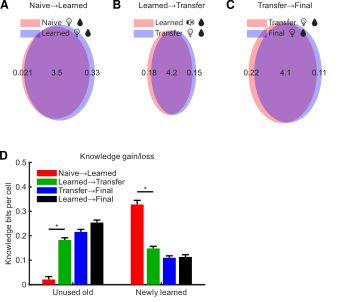

图 3-6-3 连续学习中的共享与新增信息成分

Figure 3-6-3 Shared and newly added information components in continual learning

>先计算不同训练单元之间的弃用（旧任务减去新任务的差集）、共享与新增（新任务减去旧任务的差集）信息熵，再按训练单元配对进行汇总。（A）蓝光线索任务的初始学习，首个训练单元（naive）和学会时比较。（B）声音线索旧任务学会后，与连续学习蓝光线索新任务时的比较。（C）蓝光线索任务的连续学习，首个训练单元（Continual）和学会后（Final）比较。（D）统计比较从初始学习声音线索任务到连续学习蓝光线索任务，不同阶段配对下的弃用与新增信息量。

>Discarded, shared, and newly added information components were first computed for block pairs and then summarized by stage pairing. (A) naive light-water versus learned light-water. (B) Learned audio-water versus transfer light-water. (C) Transfer light-water versus final learned light-water. (D) Group summary of discarded and newly added components across stage pairings in the group transferred from audio-water to light-water.

计算结果显示，无论哪两个训练单元配对，都是共享信息熵占比最大。这可能是因为两个训练单元之间不仅共享与任务直接相关的感觉-动作约束，也共享大量背景网络结构和群体活动中相对稳定的集体状态成分（Schneidman et al., 2006）。但不同阶段之间仍然存在清晰差异。例如，初始学习蓝光线索任务时，从首个训练单元到学会，平均每个细胞需要额外增加约0.33bit的信息熵（图 3-6-3A）；而连续学习蓝光线索任务时，学会前后不仅共享成分更多，而且每细胞需新增的信息只有约0.11bit，甚至还有0.12bit被弃用（图 3-6-3C）。这说明连续学习不仅无需从零开始，起点更高；而且还能在已有知识基础上进行精简或特化。

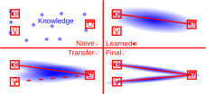

图 3-6-4 连续学习的知识结构模型

Figure 3-6-4 Knowledge-structure model of continual learning

>示意从线索给出到舔舐动作所需的知识链接过程。初始阶段尚未形成稳定的知识结构，需要从零开始建立线索与舔水之间的关联，因此结构较为零散。声音线索初始任务学会后，形成稳定的线索-动作知识链接。连续学习蓝光线索任务时，则不再从头建立全部结构，而是在既有知识链接基础上向新的连接路径扩展，同时弃用或特化掉无效旧成分，形成更高效的知识结构。最终可稳定掌握两条不同的知识链接。

>Schematic model of the knowledge structure linking cue to licking behavior. Naive learning requires building a new linkage from sparse structure. Learned performance establishes a stable cue-to-action mapping. Continual learning extends part of the old structure to a new cue pathway while pruning and specializing components that are no longer useful, thereby forming a more efficient knowledge structure. The final stage stabilizes two effective cue-to-action routes.

总之，从信息论视角看，初始学习和连续学习速度不同，是因为它们占主导地位的学习机制不同。初始学习，是从缺少任务相关知识结构到逐步建立该结构的过程，从零开始较为困难；而连续学习则更多是对已有结构的复用、重排和剪裁，新增成分相对较少，因此更容易、更高效。也就是说，连续学习的优势不只是旧任务相关知识更多，还包含新任务学习过程对旧知识的定向修整，而无需从头重建。
## 3.7 静息态自发收敛驱动的舔水
虽然前文主要强调的是输入信号促使细胞群体状态切换并进入动作态，但动物也并不会完全放弃对线索和水奖励到来的尝试性预判行为，表现为静息态的自发舔水试探。随机冷静期的实验设计使得这种预判不太可能单独成功，但仍可能对线索到来时的响应强度或反应速度起到促进作用。3.3中讨论了首个训练单元命中率与散度之间的关系，这提示，静息态中也可能存在驱动自发舔水的散度收敛现象。此外，3.2.2已指出仍有40%以上的细胞并未发生明显状态切换，而是继续沿原有轨迹演化：这意味着这些细胞可能在静息和动作态中承担相似的角色（舔舐相关），因而不需要发生切换。

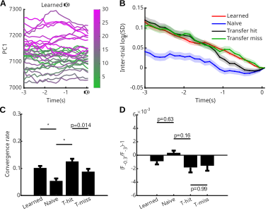

图 3-7-1 线索前的静息态自发收敛

Figure 3-7-1 Spontaneous resting-state convergence before cue onset

>（A）在蓝光线索连续学习条件下，每条线表示一个试次，并以颜色区分试次顺序，展示第一主成分随时间的变化。时间段取了线索前3s的静息态。可见试次间差异随时间逐渐收缩，线束在时间早期更分散、晚期更聚拢，提示存在收敛过程。（B）计算声音线索初始任务学会时、蓝光线索初始学习、蓝光线索连续学习的成功或失败，四种不同情境下线索前3s内的试次间散度。结果显示，无论是声音线索任务学会阶段，还是蓝光线索连续学习任务的成功或失败试次，收敛效应均强于蓝光线索任务的初始学习阶段，表现为散度下降更快；在最后1s内，连续学习阶段命中试次的收敛又强于失败试次，特别是在约-0.3s时刻。（C）对B图中-3至-0.3s的收敛率，即散度变化量，进行统计。（D）统计B图中-0.3s相对于-3s的信号亮度变化。结果显示，在收敛率较高的学会与连续学习阶段，钙信号水平整体确有下降，但幅度很小，平均仅为千分之二至三，且不同阶段间差异并不显著。

>(A) In the learned audio-water condition, each line represents one trial and is colored by trial order, showing the time course of the first principal component. Because this component alone explained 98% of the variance, higher components are omitted. Trial-to-trial differences gradually contracted over time: the bundle was broader earlier and tighter later, indicating convergence. (B) Trial-by-trial divergence during the 3s before cue onset was quantified in four conditions. Convergence was stronger in learned audio-water and in continual learning hit and miss conditions than in naive light-water, and during the last second continual learning hit showed stronger convergence than continual learning miss. (C) The convergence rate, defined as the change in divergence from -3 to -0.3s, was summarized statistically. (D) The change in signal brightness from -3 to -0.3s was also quantified. In the learned and continual learning stages, where convergence was stronger, calcium signals indeed decreased overall, but the magnitude was small, on the order of only two to three per thousand on average, and did not differ significantly across stages.

计算结果显示，线索信号之前确实存在跨试次信号收敛，即散度下降，且不同学习阶段的收敛强度并不相同（图 3-7-1BC）。这种收敛主要伴随细胞信号整体减弱，尽管也存在少量伴随信号增强的收敛情形，但并不占主导。但钙信号平均下降幅度仅为千分之二至三，且不同阶段间差异并不显著，因此收敛效应不能仅由信号水平下降解释（图 3-7-1D）。因此可以说，在已经有初始任务学会的条件下，新线索到来之前的静息态中，群体活动状态会自发趋于收敛到一个更低变异、更低散度的状态子空间。

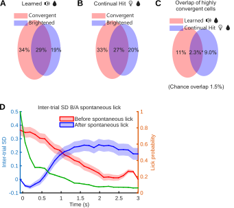

图 3-7-2 跨试次收敛与钙信号亮度和静息态自发舔舐行为的关系

Figure 3-7-2 Relationships of trial-to-trial convergence with calcium-signal brightness and spontaneous licking in the resting state

>统计声音线索任务学会（A）和连续学习蓝光线索任务命中试次（B）中，收敛（散度降低）和钙信号上升细胞的占比及其重叠关系。变亮细胞在收敛细胞中仅占较小比例，说明多数收敛细胞主要表现为钙信号下降。（C）分析高收敛细胞（第1s内最小散度高于第3s内最大散度）的继承性。声音线索初始任务中具有较强收敛特征的细胞，与连续学习的蓝光线索任务中的对应细胞存在一定重合，且重合比例显著高于随机水平（2.3%*）。（D）分析试次间隔静息态中无线索自发舔舐行为前后的散度变化。所选自发舔舐事件均满足此前至少3s内无更多舔舐动作。红线表示自发舔舐前3s平静期内的散度变化，并将舔舐时刻对齐到3s：自发舔舐前存在持续的散度下降过程。绿线表示首次自发舔舐（对齐到0s）发动后继续舔舐的概率。蓝线表示舔舐发动（对齐到0s）后3s内的散度变化：自发舔舐后散度再次回升。

>The proportions of convergent cells (reduced divergence) and cells with increased calcium signal, together with their overlap, were quantified for the learned audio-cue task (A) and hit trials in continual learning of the blue-light cue task (B). Cells that became brighter accounted for only a small fraction of convergent cells, indicating that most convergent cells mainly showed decreased calcium signal. (C) The inheritance of highly convergent cells, defined as cells whose minimum divergence within the first second was higher than their maximum divergence within the third second, was analyzed. Cells with strong convergence in the naive audio-cue task showed partial overlap with their counterparts in the blue-light cue task during continual learning, and the overlap was significantly higher than the random level (2.3%*). (D) Divergence changes before and after spontaneous uncued licking during the resting state in the inter-trial interval were analyzed. All selected spontaneous licking events were required to have no additional licking during the preceding 3s. The red curve shows divergence during the 3s quiet period before spontaneous licking, with lick time aligned to 3s, revealing a sustained decline before spontaneous licking. The green curve shows the probability of continued licking after the first spontaneous lick (aligned to 0s). The blue curve shows divergence during the 3s after lick initiation (aligned to 0s), indicating that divergence rose again after spontaneous licking.

收敛过程中多数细胞的钙信号下降，但仍有一部分细胞表现为上升，该现象在初始声音线索任务学会阶段与蓝光线索任务连续学习阶段相近（图 3-7-2A、B）。在初始声音线索任务中表现出较强收敛的细胞，在蓝光线索任务中的强收敛也有一定保留，且重合比例显著高于随机水平（图 3-7-2C）。为检验这种静息态收敛是否与舔舐行为相关，本文进一步分析了试次间隔中的自发舔舐事件，即在无线索条件下发生的主动试探性舔舐。所选事件均满足此前至少3s内无其它舔舐动作。以舔舐时刻对齐后可见，在自发舔舐前的3s内，散度经历持续下降；当散度下降至一定程度后，即使无外部线索，也可能触发一次自发舔舐。自发舔舐通常较为短暂，继续舔舐概率自起始时刻迅速下降。舔舐后3s内可见散度再次回升（图 3-7-2D）。这种动力学现象提示，静息态收敛并非与任务无关的单纯背景漂移，还可能对应一次舔舐动作前的内部准备过程。例如，Murakami等在大鼠次级运动皮层发现，在动物自行决定何时中止等待延迟音调的范式中，自发启动动作前存在持续数秒的缓慢神经前导活动，其斜率与等待时间相关（Murakami et al., 2014）。因此可以说，在无外部线索条件下，运动相关皮层也可通过缓慢的内生动态逐步逼近自发动作的触发阈值，这种逼近可以被散度指标检测出来。

总之，初始任务学会后，网络可能形成了一个收敛-舔舐-再发散的动态循环，因此即使不给线索，小鼠也会间歇性地自发尝试是否有水。这是因为，静息态活跃于MO的细胞整体上偏向于维持行为静止状态；但当这类细胞的周期性活动在试次间隔中经历缓慢衰减或周期交替时，系统可能会短暂进入一个更容易被内生噪声或微弱外界扰动触发动作的窗口。特别是在连续学习时，这种窗口可能会影响到每个试次中，尚不稳固的新任务记忆能否被线索触发行为。
## 3.8 计算模拟响应异质性的产生和学习加速效应
计算机模拟是神经科学理论验证的重要补充方法，符合理论预期的模拟结果能佐证理论在数学逻辑上的可行性。机器学习中，适当的随机初始化可以维持网络中的活动方差并提升深层网络训练稳定性（Glorot & Bengio, 2010）。在ReLU网络中，专门考虑非线性特征的初始化策略也能使更深模型从零开始训练（He, Zhang, et al., 2015）。深度线性网络的理论分析进一步表明，当权重的奇异值谱具有适当的分离度时，学习路径更短且更直接（Saxe et al., 2014）。这是因为基于梯度的权重更新量也取决于细胞的活动强度：均一权重的网络，细胞活动也比较均一，难以产生必要的正负方向分化，收敛较慢。这些结论也是本文提出响应异质性相关的学习加速效应的理论启发之一，但需要一个考虑到生物学合理性，而非仅仅追求学习效果的计算模型来验证理论可行性。


图3-8-1 模型结构和训练流程

Figure 3-8-1 Model architecture and training procedure

>（A）模型的基本结构是一个约2%稀疏连接的循环神经网络，人为将细胞分为L2、L5两层，每层都有64个兴奋性神经元和16个抑制性神经元。（B）2/5层承担不同的输入输出功能。L2用不同但又有重叠的细胞群体接受线索输入：预训线索A输入13个兴奋和3个抑制性神经元，正式线索B输入6个兴奋和2个抑制性神经元。其中，4个兴奋和1个抑制性神经元是被两种线索重叠激活的。5层负责行为读出和接受TH教学信号：16个兴奋和4个抑制性神经元被标记为正读出（active），同样数量的神经元被标记为负读出（silent）。当正读出细胞的平均响应（细胞响应上限是1）减去负读出细胞的平均响应大于0.6时，认为有行为输出。在教学阶段，这些细胞还接受模拟的TH输入，输入模式是正读出细胞1，负读出细胞0。（C）连接权重更新机制，采用一个类Hebb的计算方式：在正常RNN迭代时不学习，而是记录迭代历史，在特定条件下统一进行学习结算。每次RNN迭代，每个神经元会记录一个带衰减的响应历史值：将本次响应值与之前记录的历史响应×0.8相比较，取较大者作为本次迭代后的响应历史值。在学习结算时，每个连接都取得上下游神经元的带衰减的历史响应最大值。然后根据上游神经元是兴奋还是抑制性的，代入不同的权重更新公式：兴奋性权重更新量=上游×（下游-0.3）×0.06，抑制性权重更新量=（上游-下游）×下游×0.06。（D）用负权重实现可增减的稀疏连接。随机初始化的权重服从下限和众数都是-5、上限0.7的三角分布，但负权重并不参与网络迭代，视为无连接。只有在学习权重更新阶段，权重更新量会被加在负权重上，如果这使得负权重翻正，就会形成一个新的连接。（E）一个试次的训练流程。①冷静阶段，给所有细胞加载一个随机噪声，然后RNN迭代。如果5层读出行为，立即执行反向Hebb更新，即按照C中的公式计算更新量，但额外取相反数，然后重新加载一套新的随机噪声再迭代；如果未读出行为就继续往下迭代。直到连续20次迭代都没有行为，才能通过冷静阶段。②线索阶段。按照B中规定的模式给2层一个线索输入，然后RNN迭代。如果5层读出行为，记为命中，否则继续迭代。如果迭代5次仍未读出行为，记为未命中。③学习阶段。按照B中规定的模式给5层一个教学信号，然后按照C中的公式更新连接权重。每个训练单元重复30个试次。

>(A) The basic model structure was a recurrent neural network with approximately 2% sparse connectivity. Cells were assigned to two layers, L2 and L5, and each layer contained 64 excitatory neurons and 16 inhibitory neurons. (B) L2 and L5 served different input-output functions. In L2, cue inputs were delivered to different but partially overlapping cell populations: pretraining cue A activated 13 excitatory and 3 inhibitory neurons, whereas formal cue B activated 6 excitatory and 2 inhibitory neurons. Among these, 4 excitatory and 1 inhibitory neurons were activated by both cues. L5 was responsible for behavioral readout and received the TH teaching signal: 16 excitatory and 4 inhibitory neurons were labeled as positive readout cells (active), and the same number of neurons were labeled as negative readout cells (silent). When the mean response of positive readout cells (with an upper cell-response limit of 1) minus the mean response of negative readout cells exceeded 0.6, behavioral output was considered present. During the teaching stage, these cells also received simulated TH input, with an input pattern of 1 for positive readout cells and 0 for negative readout cells. (C) Connection weights were updated by a Hebbian-like computation. No learning occurred during normal RNN iterations; instead, iteration history was recorded and learning was settled together under specific conditions. At each RNN iteration, each neuron recorded a decayed response-history value: the current response was compared with the previously recorded history response multiplied by 0.8, and the larger value was taken as the response-history value after that iteration. During learning settlement, each connection used the maximum decayed historical responses of the upstream and downstream neurons. Different weight-update formulas were then applied according to whether the upstream neuron was excitatory or inhibitory: excitatory weight update = upstream × (downstream - 0.3) × 0.06, and inhibitory weight update = (upstream - downstream) × downstream × 0.06. (D) Sparse connections that could increase or decrease were implemented using negative weights. Randomly initialized weights followed a triangular distribution with lower bound and mode both at -5 and upper bound at 0.7, but negative weights did not participate in network iteration and were treated as absent connections. Only during learning-based weight updating was the update amount added to negative weights; if this made a negative weight become positive, a new connection was formed. (E) Training flow for one trial. ① Calm-down stage: random noise was loaded onto all cells, followed by RNN iteration. If L5 read out a behavior, reverse Hebbian updating was immediately applied, meaning that the update amount was calculated according to the formulas in C but with the sign reversed; a new set of random noise was then loaded and iterated again. If no behavior was read out, iteration continued. The calm-down stage was passed only after 20 consecutive iterations without behavioral output. ② Cue stage: a cue input was delivered to L2 according to the pattern defined in B, followed by RNN iteration. If L5 read out a behavior, the trial was counted as a hit; otherwise, iteration continued. If no behavior was read out after 5 iterations, the trial was counted as a miss. ③ Learning stage: a teaching signal was delivered to L5 according to the pattern defined in B, and connection weights were then updated according to the formulas in C. Each block repeated 30 trials.

经典的机器学习神经网络信息流是单向的。它模拟一个具有预定义结构的输入输出的函数，无论是正向测试还是反向传播，在一个试次中每个神经元都只会被计算一次。但动物神经网络通常被建模为循环的，因为它不仅存在自身可以支持双向信息流的电突触，还存在循环激活最终能返回自身的神经回路，因此每次计算迭代都需要所有神经元的同时参与（Harris & Shepherd, 2015）。平衡生物学合理性和算法简洁性后，本文选择建立一种稀疏随机初始化连接的循环神经网络。相比于全连接，每只鼠平均约有2%的初始连接权重为正值，其它权重建模为负值。负权重连接在计算细胞响应（RNN迭代）时当作零权重处理。所有细胞人为分两群，对标动物实验中的运动皮层2/5层，各有64个兴奋性和16个抑制性神经元（图3-8-1A）。

动物实验中的声音和蓝光两种线索被建模为抽象的A和B两种线索。连续学习组先经历一个预训阶段，使用线索A；然后带着线索A已学会的经验，和初始学习组一起经历正式训练线索B。两种线索会以不同但有部分重叠的模式激活2层神经元：线索A激活13个兴奋和3个抑制性神经元，线索B激活6个兴奋和2个抑制性神经元，其中4个兴奋和1个抑制性神经元被两种线索重叠激活。5层则负责行为读出，其核心思想是：预设一个标准读出模式，只有5层一个预定义亚群的实际响应模式与标准模式高度相似时，判定为有行为输出。这个标准模式不仅要求16个兴奋和4个抑制性神经元必须活跃（active，正读出），还要求同样数量的神经元必须静默（silent，负读出）。在实际响应计算出来以后，要判定是否输出行为，就要将正读出细胞的平均响应值（所有细胞响应上限1），减去负读出细胞的平均响应值：如果差值大于0.6，就判定此时有行为输出。动物实验中的TH输入则被建模为教学信号输入，输入模式与标准读出模式相同：正读出细胞输入1，负读出细胞输入0（图3-8-1B）。TH与教学信号的生物学合理性容后详述。

另一个重要的机制就是连接权重更新算法。本模型并不在每轮RNN迭代后立即改变连接权重，因为逐毫秒模拟STDP成本太高也无必要；而是先记录迭代历史，再在学习阶段定点统一结算权重更新量：这对应三因子学习规则中的可塑性资格痕迹（eligibility trace）思想，即前后突触共同活动先留下短暂、随时间衰减的资格痕迹，随后再由奖赏、惩罚、新异性或教学信号等第三因子决定是否转化为长期连接强度改变（Frémaux & Gerstner, 2015）。具体而言，每个细胞维护一个自动衰减的历史响应值，一开始是0；每次迭代得到最新响应后，模型将历史响应值×衰减系数0.8，与最新响应值比较，取较大者作为新的历史响应值。这种衰减设计，用于近似突触可塑性资格痕迹对近期神经活动的短暂记忆：任务结果的反馈常滞后于神经活动，毫秒级活动不能一直保留到数秒后的奖惩时刻，但可以先以资格痕迹形式暂存，等待第三因子决定是否巩固（Gerstner et al., 2018）。因此，进入学习结算阶段后，每个连接取上下游神经元的带衰减历史响应最大值，相当于读取这条连接在刚才线索驱动网络动态中的可塑性资格；强化学习模型也显示，带资格痕迹的奖赏调制STDP即使在奖赏延迟到来时也可以学习（Florian, 2007）。随后模型根据上游是兴奋还是抑制性神经元，代入不同的类Hebbian权重更新公式，这一步相当于由第三因子把资格痕迹转化为真实权重改变：Izhikevich的模型说明，STDP可先形成短暂资格，而数秒内到来的多巴胺信号选择性地把相关突触资格转化为实际权重改变（Izhikevich, 2007）；实验上，多巴胺也只在谷氨酸输入后约0.3到2秒的时间窗内促进树突棘增大（Yagishita et al., 2014）。皮层突触中还观察到LTP和LTD可具有不同资格痕迹，并由单胺受体依赖的信号转化为长期突触改变（He, Huertas, et al., 2015）。

兴奋性连接更新量是`上游×（下游-0.3）×0.06`，这对应着动物脑中兴奋性突触的经典更新机制：突触前活动释放谷氨酸，突触后去极化解除NMDA受体通道的$Mg^{2+}$阻塞，使NMDA受体对前后突触共同活动具有 coincidence detector 的性质（Bliss & Collingridge, 1993）。因此，模型中的`上游`项相当于突触前活动门控：如果上游神经元没有响应，就不产生有效的兴奋性权重更新；`下游-0.3`项则相当于突触后电压和$Ca^{2+}$信号的阈值门控：当下游响应高于阈值时，兴奋性连接增强；低于阈值时，该连接不但不被强化，还会被削弱。这个方向性与突触可塑性研究中，较强突触后$Ca^{2+}$上升更容易诱导LTP、较弱或较低水平活动可诱导LTD的双向可塑性框架一致（Malenka & Bear, 2004）。这里的0.3和0.06分别是模型化的突触后阈值和学习率尺度，并不对应单一生物常数；它们的作用是用最简形式保留NMDA依赖可塑性的核心逻辑，即兴奋性连接更新必须同时依赖上游活动和下游是否达到足够强的激活状态。

抑制性连接更新量是`（上游-下游）×下游×0.06`。已有实验表明，抑制性突触强度并非固定不变，突触前后活动的相对时序可以诱导抑制性突触长时程改变（Woodin et al., 2003）。在听觉皮层L5神经元上，前后突触脉冲配对可增强抑制性输入，并调节兴奋/抑制比例（D'amour & Froemke, 2015）。公式中的`×下游`项表示只有目标神经元被实际招募时，其上游抑制性输入才获得可塑性资格；`上游-下游`项则把抑制性连接塑造成一种促进强弱分化的竞争效应：当抑制性上游活动强于下游活动时增强抑制，帮助压低非目标响应；当下游活动强而抑制性上游相对弱时削弱这条抑制性连接，意在使教学信号激活的读出细胞更容易维持活动。类似思想也出现在抑制性STDP维持兴奋/抑制平衡的模型中（Vogels et al., 2011）；Luz和Shamir进一步说明，Hebbian式抑制性可塑性可以通过负反馈平衡前馈兴奋和抑制（Luz & Shamir, 2012）。但是，抑制性可塑性的具体方向具有脑区和细胞类型依赖性，PV、SST、VIP等抑制性神经元亚型的可塑性和与兴奋性神经元之间的特定连接关系在建模上也过于复杂，因此公式建模的生物学支撑主要来自抑制性突触被普遍认可的活动依赖可塑性及其E/I平衡功能，而并不直接对应任何确凿的单一生物学机制。

动物神经网络具有稀疏连接的特性，绝大多数神经元对组之间无直接连接；局部皮层回路研究也显示，连接强度集中在少数强连接上，可被理解为少数强连接骨架嵌在大量弱连接或无连接背景中（Song et al., 2005）。连接并非完全随机，而是受局部连接组团和共同邻居等结构原则约束（Perin et al., 2011）。但是，学习过程可以诱导部分原本无连接但距离较近的神经元产生连接；在体长期成像显示，成年皮层树突棘会出现和消失，棘新生和回缩分别对应突触形成和消除（Trachtenberg et al., 2002）。在运动学习中，新的树突棘可在学习后快速形成并被选择性稳定，成为持久运动记忆的结构基础（Xu et al., 2009）。为了对这一特性建模，本文使用负权重来表示当前无连接、但可通过学习建立的潜在连接。在连接权重随机初始化阶段，采用下限和众数都是-5、上限0.7的三角分布，使得约98%的连接都是负权重，即无连接。在计算细胞响应值的RNN迭代过程中，负权重当作0而非负值处理，因此对下游神经元无影响；这相当于潜在轴突-树突接触或尚未稳定的突触结构在功能上尚不参与当前回路计算。但在学习时，权重更新量会被加在负权重上：如果这使得负权重翻正，就相当于学习诱导的新连接生成，从此开始参与RNN迭代。权重上限0.7，达到上限后就不再增强，只能削弱；同理，正权重也可能因不断削弱而翻成负数，对应突触削弱后退出有效回路，近似动物神经网络中的突触修剪。经验依赖的结构可塑性研究也将突触形成和消除视为成年皮层回路重构的重要形式（Holtmaat & Svoboda, 2009）（图3-8-1D）。

模型的训练试次设计，和动物实验基本一致对标。首先是冷静阶段，动物需要在无线索也无奖励情况下持续等待，直到能维持足够长时间的静息而不产生行为为止；这对应行为任务中试次开始前需要抑制提前舔舐或自发动作的要求。这个阶段的存在是为了防止神经网络被训练成不关注线索，只靠高频随机行为来达到高命中率。模型中，每个试次会为所有细胞设置一个噪音响应，然后开始RNN迭代。一旦产生行为，意味着5层的行为读出群体出现了与标准行为模式高度相似的响应，但此时外界并未给出线索和奖励，因此模型立即进行反向Hebb更新：从强化学习角度看，这相当于无奖赏或错误时机行为引发的负向教学信号，因为奖赏预测误差可以为学习提供正负方向性（Schultz et al., 1997）。具体到连接更新，高响应正读出细胞的兴奋性输入连接通常会因此被削弱、抑制性输入增强，使得该细胞以后再次被噪音激活的概率降低；这也与前述三因子学习规则一致，即同一份可塑性资格可以被奖赏或惩罚信号转化为相反方向的权重改变（Frémaux & Gerstner, 2015）。那之后，重新设置噪音，继续迭代，直到连续20次迭代都不触发行为，才能通过冷静阶段，相当于要求网络先稳定在无线索不行为的基线状态。接下来按照2层预设的模式输入线索并迭代，如果5层读出行为，记为本试次命中；如果迭代5次仍无行为，记为未命中。最后是学习结算阶段，给5层读出群体按照标准读出模式输入TH教学信号，然后计算权重更新量。在这个教学阶段，被TH激活的细胞的上游兴奋性连接通常会增强，抑制性连接通常会削弱，使得以后这些细胞更容易被相同线索激活；这相当于第三因子把线索阶段积累的可塑性资格巩固为有利于目标行为读出的连接结构（Izhikevich, 2007）（图3-8-1E）。

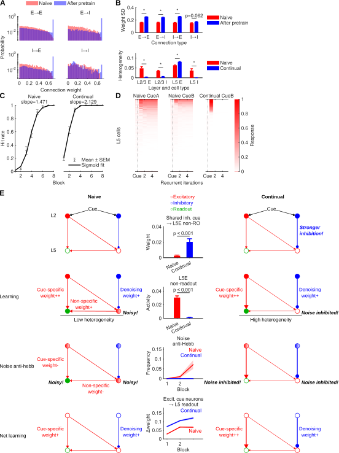

图3-8-2 模拟涌现连续学习加速现象

Figure 3-8-2 Simulated emergence of accelerated continual learning

>（A）预训前（naive）后（After pretrain）的连接权重分布，根据前后神经元是兴奋性还是抑制性，分为兴奋到兴奋（E→E）、兴奋到抑制（E→I）、抑制到兴奋（I→E）、抑制到抑制（I→I）。除抑制-抑制连接外，大多数的弱连接都相对减少，而逼近上限的强连接大幅增加。（B）上：预训后，除抑制-抑制连接外，三种连接类型的权重方差均增大。下：相比于未经预训的初始学习，有预训经验的连续学习，只有5层兴奋性神经元表现出更高的响应异质性；其它亚群则大多下降。（C）Sigmoid拟合初始和连续学习曲线。连续学习拟合斜率显著高于初始学习（组间10000次随机置换检验，显著性p<0.001）。（D）展示预训线索A、初始学习线索B、连续学习线索B首个训练单元，5层细胞随迭代的试次间平均响应。可以看到在没有预训经验条件下，首次遇到线索的网络响应强弱不分明，且线索B响应低于线索A，这符合两种线索不同的预设激活细胞数。而有预训经验的连续学习线索B时，细胞响应强弱分明，且响应一次后就立即衰减下去。（E）连续学习加速的机制模型，左右列比较初始和连续学习的不同连接结构，中间列是关键指标的统计。第一行：线索同时给到2层兴奋性和抑制性神经元，但统计显示，连续学习阶段2层抑制性线索神经元（inh. cue）向5层非正读出的兴奋性神经元（L5E→non-RO）的抑制性投射更强，这意味着对噪音的抑制更强。第二行：初始学习阶段，由于正读出细胞和其它5层细胞都活跃，响应异质性低，读出细胞上游的连接增强也有许多是非线索特异的；而连续学习阶段5层非读出细胞的噪音被强抑制，使得5层整体响应异质性更高；统计比较5层非正读出兴奋性神经元的活动，连续学习低于初始学习。第三行：由于初始学习阶段5层读出细胞上游许多线索非特异的连接也被强化，在冷静期噪音迭代时很容易触发非线索行为输出，而遭到反向Hebb训练，这同时也削弱了线索特异性的连接权重，导致之前学到的部分正确权重被抵消；而连续学习阶段，由于之前非线索特异性上游被强抑制，触发反向训练的频率更低；统计显示前3个训练单元，初始学习的反向训练触发频率越来越高，而连续学习则始终保持较低水平。第四行：由于前述差异，每单元训练下来的最终结算，连续学习会比初始学习的权重变量更大；统计从2层兴奋性线索细胞向5层读出细胞的权重增量（无连接的负权重不计），前3个训练单元中连续学习始终高于初始学习。

>(A) Connection-weight distributions before pretraining (naive) and after pretraining (After pretrain). Connections were grouped by whether the pre- and postsynaptic neurons were excitatory or inhibitory: excitatory-to-excitatory (E→E), excitatory-to-inhibitory (E→I), inhibitory-to-excitatory (I→E), and inhibitory-to-inhibitory (I→I). Except for inhibitory-to-inhibitory connections, most weak connections were relatively reduced, whereas strong connections approaching the upper bound increased markedly. (B) Top: after pretraining, weight variance increased in the three connection types except inhibitory-to-inhibitory connections. Bottom: compared with naive learning without pretraining, continual learning with pretraining experience showed higher response heterogeneity only in L5 excitatory neurons; most other subpopulations instead decreased. (C) Sigmoid fits of naive and continual learning curves. The fitted slope was significantly higher in continual learning than in naive learning (between-group random permutation test with 10000 shuffles, p<0.001). (D) Trial-averaged responses of L5 cells across iterations are shown for pretraining cue A, the first block of naive learning with cue B, and the first block of continual learning with cue B. Without pretraining experience, the network response to the newly encountered cue showed weak separation between strong and weak responses, and the response to cue B was lower than the response to cue A, consistent with the different preset numbers of cells activated by the two cues. During continual learning with pretraining experience, strong and weak cellular responses were clearly separated, and the response decayed immediately after one activation. (E) Mechanistic model of accelerated continual learning. The left and right columns compare the different connection structures in naive and continual learning, and the middle column shows statistics of key metrics. First row: cues were delivered to both L2 excitatory and inhibitory neurons, but statistical results showed that inhibitory projections from L2 inhibitory cue neurons (inh. cue) to L5 non-positive-readout excitatory neurons (L5E→non-RO) were stronger during continual learning, indicating stronger suppression of noise. Second row: during naive learning, because positive readout cells and other L5 cells were both active, response heterogeneity was low, and many strengthened upstream connections to readout cells were not cue-specific; during continual learning, noise in L5 non-readout cells was strongly suppressed, leading to higher overall response heterogeneity in L5. The statistic compares the activity of L5 non-positive-readout excitatory neurons, which was lower during continual learning than during naive learning. Third row: because many cue-nonspecific upstream connections to L5 readout cells were also strengthened during naive learning, noise iterations in the calm-down period could easily trigger cue-independent behavioral output and lead to reverse Hebbian training, which also weakened cue-specific connection weights and partially cancelled previously learned correct weights; during continual learning, because cue-nonspecific upstream inputs had already been strongly suppressed, reverse training was triggered less frequently. Statistics from the first three blocks showed that the trigger frequency of reverse training increased progressively during naive learning, whereas it remained low during continual learning. Fourth row: because of the preceding differences, the final settled weight change after each block was larger during continual learning than during naive learning; statistics of weight increments from L2 excitatory cue cells to L5 readout cells (excluding negative weights corresponding to absent connections) showed consistently higher values in the first three blocks of continual learning than in naive learning.

经过预训练后，权重分布发生明显变化：出现了一大群达到上限的强连接，而其它弱连接相对占比下降。这个规律仅在上下游都是抑制性神经元的去抑制连接中表现较弱，其它类型连接都十分明显（图3-8-2A）。权重分布的方差也是类似规律，只有抑制-抑制连接没有显著增加（图3-8-2B，上）。

根据预训经验的存在与否，初始学习和连续学习相同的线索，的确产生了不同的行为结果。与动物实验结果一致，连续学习的首单元命中率和Sigmoid拟合斜率都高于初始学习（图3-8-2C）。观察首个训练单元、平均所有试次的线索后网络迭代响应变化规律可以发现，无论相比于初始学习线索A还是B，连续学习时，5层线索响应集中在更早的时点，活跃和沉默群体的区分更清晰（图3-8-2D）。这个特征可以被响应异质性的差异捕捉到：5层兴奋性神经元的响应异质性，连续学习显著高于初始学习；但其它神经元则反而更低（图3-8-2B，下）。

这样一来，学习加速效应的涌现可以用抑制性神经元的竞争性降噪机制解释。线索本身既能激活兴奋性也能激活抑制性神经元，但在有预训经验时，2层抑制性神经元对5层非正读出的兴奋性神经元产生更强抑制，使得正读出-其它细胞之间涌现更高的响应异质性。在学习阶段，低异质性的5层响应意味着正读出细胞的兴奋性上游输入可能不仅来自线索，也来自噪音，权重更新时无法区分这两条通路，于是同时被强化；而高异质性的连续学习阶段则能显著减少非线索来源的上游输入。于是在冷静阶段的噪音迭代中，初始学习更容易被噪音激发非线索依赖的随机行为输出，进一步触发反向Hebb训练：同样由于网络中充满噪音，反向Hebb训练无法区分哪些是线索输入哪些是噪音，只能同步削弱，导致学习阶段强化的部分正确的线索输入权重被抵消；而连续学习阶段则较少触发反向训练。最终结算每个训练单元的净权重更新量时，连续学习可以收获更多线索特异的输入连接强化（图3-8-2E）。

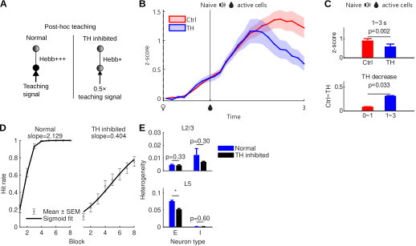

图3-8-3 在连续学习阶段模拟TH（Thalamus）的抑制

Figure 3-8-3 Simulated inhibition of TH (Thalamus) during continual learning

>（A）模拟TH抑制的方法是削弱决策后的教学信号到0.5倍，这将导致Hebb更新幅度减少。这种模拟方式对应了本文对动物实验中TH功能的假设性解释：提供学习所需要的教学信号，是响应异质性的重要来源之一。（BC）取的是动物实验中，初始声音线索任务学会后活跃的细胞，在连续学习蓝光线索任务首个训练单元中的钙信号，展示A中TH抑制建模方式的生物学合理性。（B）对动物实验中的TH抑制和对照组钙曲线比较发现，TH抑制的差异主要发生在给水之后，而对线索后决策阶段的快速响应影响不大，这与TH抑制后连续学习首个训练单元行为下降不大一致。（C）上：比较1~3s平均z-score，TH抑制组显著更低。下：比较TH抑制相比于对照组的平均信号下降量，1~3s下降量显著多于0~1s。这说明TH抑制主要影响给水之后潜在的强化学习过程，而非线索后的行为决策流程。（D）计算模拟TH抑制后，学习曲线的Sigmoid拟合斜率显著下降（组间10000次随机置换检验，显著性p<0.001）。（E）模拟TH抑制后，5层兴奋性神经元响应异质性显著下降，抑制性神经元因原本响应异质性就较低所以无下降空间。2层变化也不显著，这与动物实验结果一致。

>(A) TH inhibition was simulated by reducing the post-decision teaching signal to 0.5-fold, which decreased the magnitude of Hebbian updating. This implementation corresponded to the hypothetical interpretation of TH function in the animal experiment: providing teaching signals required for learning is one important source of response heterogeneity. (B-C) Calcium signals were taken from cells that were active after the naive audio-cue task had been learned in the animal experiment, and were examined during the first block of continual learning of the light-cue task, illustrating the biological plausibility of the TH-inhibition modeling strategy in A. (B) Comparison of calcium traces between the TH-inhibition and control groups in the animal experiment showed that the effect of TH inhibition mainly occurred after water delivery, with little effect on the rapid response during the post-cue decision stage. This was consistent with the limited reduction in first-block behavior after TH inhibition during continual learning. (C) Top: comparison of the mean z-score from 1 to 3s, which was significantly lower in the TH-inhibition group. Bottom: comparison of the mean signal decrease in the TH-inhibition group relative to the control group; the decrease from 1 to 3s was significantly larger than that from 0 to 1s. This indicates that TH inhibition mainly affected the potential reinforcement-learning process after water delivery, rather than the post-cue behavioral decision process. (D) After simulated TH inhibition, the fitted Sigmoid slope of the learning curve decreased significantly (between-group random permutation test with 10000 shuffles, p<0.001). (E) After simulated TH inhibition, response heterogeneity decreased significantly in L5 excitatory neurons. Inhibitory neurons had little room for further reduction because their response heterogeneity was already low, and changes in L2 were also not significant, consistent with the animal experiment.

让特定的线索激活特定的网络下游响应模式，这在机器学习领域称为有监督学习，需要每个训练试次在输出端提供一个答案或教学信号，然后执行反向传播和梯度下降，使得整个网络的权重得到调节。动物神经网络的运动学习，同样需要某些机制提供的教学反馈信号，才能快速学到特定的响应模式，而免于缓慢盲目的随机探索（Krakauer et al., 2019）。前述动物实验中发现TH抑制后，首单元命中率影响不大，但后续学习速度显著减缓的现象，提示TH可能是教学信号的重要来源之一。

解剖学证据显示，后部感觉相关丘脑对MO存在明显的分层特异性投射，优先作用于L2/3和L5A的锥体细胞（Hooks et al., 2013）。电生理研究也显示，后部丘脑可调节运动皮层和体感皮层中的触觉刺激处理（Casas-Torremocha et al., 2017）。与此同时，高阶丘脑-皮层环路本身具备在体感皮层和运动皮层之间中继并重整信息流的结构基础（Shepherd & Yamawaki, 2021）。这样一来，整合了躯体感觉和运动系统的丘脑，确实具备提供教学信号的功能基础。因此本模型将TH抑制组直接建模为教学信号的减半（图3-8-3A）。之前的动物实验结果也支持，TH抑制的影响更多发生在1s给水之后，而对线索后1s内的行为决策阶段影响较小（图3-8-3BC）。最终从模拟结果也可观察到，TH抑制后连续学习任务的斜率和5层兴奋性神经元的响应异质性的都有所下降（图3-8-3DE）。

# 第4章 结论与讨论
本文将连续学习的行为优势分为起点更高和增长更快两个方面，通过一些观测和操纵手段，将高起点对应到细胞复用和试次间稳定性或低散度特征，将快增长对应到细胞间响应抑制性特征。除了这两个核心论点外，还通过RSP观测扩展探索了信息流在皮层上的可能传播路径，通过信息论尝试衡量了不同阶段记忆信息或知识的多寡，通过试次间静息态探究动物对预期线索的准备，还通过生物学合理的纯计算模型验证了机制理论的逻辑可行性。
## 4.1 初始学习与学会的神经定义和可泛化性
学习过程会改变神经网络的连接关系，那么学会就对应着改变的停止。连接关系会通过网络对线索的响应模式反映出来，因此学会或学习改变的停止，就意味着网络对线索响应的相对稳定（Gallego et al., 2020）。钙成像数据基本支持这一观点：初始状态对线索的钙响应，不同试次间差异较大，散度高；学会后散度降低。这种散度降低并非因为整体响应水平下降，因为恰恰是响应水平较高的细胞亚群散度更低。由于线索给出的时间间隔是随机不可预测的，这群高响应、低散度的群体活动特征，就非常类似于吸引子的定义：网络的特定连接特征，会将信息大概率引导到特定子网络，即将随机的初始状态自然收敛到一个特定子空间中（Hopfield, 1982）。但不同的是，真实的状态空间分析显示，线索后早期状态演化方向与线索前的初始状态似乎并无负反馈收敛关系，而是朝着相同方向直接叠加在原有状态上。这种现象至少有三种并行不悖的解释：
- 可能与钙信号的延迟累积特性有关，它使得钙信号的演化方相比与电活动状态表现出累积性质。
- 可能与脑区功能分化和连接的稀疏性有关，它使得多数细胞不参与线索响应，保持原本的活动周期而不受线索调制。
- 可能与奖励和行为驱动等监督强化机制有关，它鼓励网络对线索早期先做出有价值的特异性响应以获取奖励，而不是立刻收敛回静息态。

因此，本文的散度计算公式仍需扣除基线水平，才能衡量线索驱动的净演化方向。但即使排除基态差异，散度也远不能降到零，甚至不能降一个数量级。这可能说明即使对于学会状态较为牢固的记忆，神经网络仍提供了多种冗余的环路方案，以在不同的内外噪音环境下确保行为输出（Hennig et al., 2018）。这种冗余性一方面导致试次间隙反复出现不依赖线索的误触行为，另一方面也为泛化到其它线索提供了机会。

从突触可塑性角度讲，一个高活跃的兴奋性突触后级通常更容易诱导突触增强，而突触前级则影响增强幅度（Malenka & Bear, 2004）。即使不被线索激活的突触前级也难免会有随机噪音而被随机少量强化，因此线索切换后，由于作为信息流终端的行为输出目标不变，总会有部分吸引子通过这些非特异性噪音连接被激活，至少会比没有预训经验的初始状态更容易激活。这个机制使得跨模态的、高度异质的线索也能激发较高的行为起点，并且与重叠激活的细胞占比呈现相关性。
## 4.2 学习加速的不同层级实现
不同于静态的行为表现，学习加速作为一种动力学现象，在不同的时空尺度上可能有不同的实现机制。

在鼠级的空间尺度上，学习加速不仅与单只鼠自身的学习速度有关，还与不同鼠之间的差异有关。本文使用的Sigmoid拟合方法锁定下限0、上限1，而斜率和中点都是可调指标，这导致不同鼠的中点差异不可能被拟合线的单个中点参数消解，而必然要在斜率上做出妥协。反过来说，连续学习的加速效应不代表每只鼠的斜率都同样增加，也可能是因为不同鼠之间的中点差异减小。

在训练单元级的时间尺度上，学习速度不仅需要考虑每个单元的学习增长，还需要考虑单元之间的遗忘。7天间隔实验证实这种遗忘效应确实存在且可测。经典的遗忘曲线理论认为，经过长期反复训练的任务不容易遗忘；在记忆系统研究中也有大量证据支持，新近记忆会逐步向更稳定的远期记忆组织转化（Frankland & Bontempi, 2005）。如果巩固的初始任务预训经验在训练单元之间不易遗忘，也能成为连续学习加速的一个重要来源。实际上，单只鼠的初始学习曲线常常并非单调增，行为表现常常出现训练单元间局部回撤；而连续学习过程则较少回撤，这也成为其更大斜率的来源之一。

本研究更关注细胞级的空间尺度，观察到细胞间响应异质性与学习速度的正相关，以及连续学习相比初始学习的更高异质性。尽管连续学习的总体活跃水平确实也上升了，能够从Hebb学习更新规则的角度推出学习会更快的结果，但响应异质性的合理之处在于，行为的输出并非单纯依赖细胞活跃水平增加，同时还依赖那些阻止行为的细胞的沉默。极端例子如，在痉挛或癫痫时，神经系统过度活跃，导致肌肉紧绷或抽搐，但却无法做出有意义的行为。但局限性在于，响应异质性是一个涌现的群体特征，理论只能停留在相关性观察，不能直接通过操纵实验确定因果方向。于是本研究通过TH抑制进行间接操纵，还补充了计算模型进行佐证，将结论细化到依赖TH输入的5层兴奋性神经元的响应异质性。一般认为MOp5层兴奋性神经元更接近运动输出终端或突触后级，其响应异质性可以直接影响Hebb更新方向和幅度，且任务本身专注于完全相同的运动输出，这些条件进一步增加了机制解释的合理性（Economo et al., 2018）。相比之下，2层可能需要兼容整合不同线索的输入连接记忆，细胞间的响应异质性可能并不重要，甚至可能因为降低了网络的适应性而变得有害。

在跨训练单元的状态空间演变中，还观察到初始学习演变路径更曲折回环、连续学习则更直接朝目标演化的现象。这与运动学习迁移中群体动力学结构会约束后续学习路径的观点相近（Vyas et al., 2018），也可能跟跨单元的12小时间隔的漂变和遗忘有关，但也可能是为了跳出局部最优解而进行的网络重构。连续学习中重构需求降低，网络大体按照偏差不多的一致方向直线更新就足以快速学会，因而学习较快。与之类似的理论指出大脑在有限时间或两次睡眠间隔内，能写入的新记忆是有限的，强行写入越多只会导致新记忆覆盖旧记忆，这可能也说明全新记忆整合到已有网络中的最优方式很可能不是初次学习时即时形成的那个支配回路（McClelland et al., 1995）。
## 4.3 TH可能提供有监督学习的教学信号
要让复杂的网络学会收敛到一个极小的运动输出子空间模式，依靠随机探索和奖励强化可能是非常低效的，使用有监督学习的策略更加合理（Krakauer et al., 2019）。但在未命中试次中，运动输出终端显然不能提供有价值的教学信号，实践中需要利用口舌相关的非条件反射进行初始引导，例如将挂有水滴的水管捅入小鼠口中诱使其舔水。但在TH抑制后，且在有已学会的预训经验的情况下，部分个体竟然对引导刺激无响应或非常困难（未统计）；总体上，学习曲线呈现出首单元略低、后续单元增长缓慢的行为表现；钙信号方面，TH抑制组5层响应异质性下降，且在给水后整体活动水平偏低。这些现象共同提示，TH可能发挥着运动教学功能，正如计算模型中的建模策略，当TH抑制时，运动输出细胞不能产生正确的突触后级激活模式，导致Hebb更新幅度下降甚至反向，学习速度减慢。
## 4.4 其它方向探索和局限性
RSP在解剖上连接着视觉和运动的皮层亚区，而离听觉区较远（Vann et al., 2009）。钙信号观测结果符合这一结构特征：RSP对视觉刺激的响应强于听觉，时间上则早于运动区。这些现象支持RSP是运动区接受视觉信号的上游中介之一。但是，RSP的活动特征似乎不区分行为的命中与否：声音线索任务中活跃的细胞，在视觉线索命中时虽然活跃占比略高，但活动强度反而略低；抑制RSP也看不到明显行为下降。再加上其他研究报告RSP与海马和情境区分的关系，RSP对跨模态连续学习未必是正向作用（Smith et al., 2012）。当然这些初步观察不足以得出结论，加上RSP本身是在AP轴上高度延伸的狭长区域，不同AP位置的功能也未必一致。未来可能还需要多点记录和操纵尝试。

信息论分析显示，连续学习的两种线索任务共享的信息结构较多，而新任务需要新增的成分相对较少，说明新任务并不主要依赖从零开始扩展新结构，而更适合理解为在已有结构基础上的重组、剪裁与特化，或称为旧结构调用后再做定向修整（Timme & Lapish, 2018）。对静息态动态的分析则显示，在有旧任务学会的经验基础时，线索前会出现更强的自发收敛，这可能在行为上与动物对线索的预测尝试和试探性舔舐有关，提示网络在外部线索到来之前就更容易进入低散度、可被进一步推进的准备性状态（Murakami et al., 2014）。这部分探索的局限性在于，信息分析采用的微分信息熵可能不是数学上最适合用于计算总信息量或占比的指标，虽然不同学习阶段的信息量可比，但其绝对值需要谨慎解释。而静息态自发收敛的理论，统计差异和相关性效应并不强，对自发舔水行为的预测能力较弱，可能还需要尝试更深入的机器学习分类器等方法提取关键信息、降低背景噪音。

计算模型虽然大体复现了动物实验中观察到的首单元高起点、后续增长加速和响应异质性等现象，但仍然存在一些细节差异和生物学合理性上的妥协，主要包括：
- 权重随机初始化的方法未必符合动物神经网络的初始状态，即使未经训练的小鼠脑中也不会完全没有与饮水相关的记忆，这个问题可能导致模型模拟出的学习曲线明显低于真实动物。
- 2/5层的分工和TH的输入被过度简化，真实的丘脑对运动2/5层都有输入，因此模型产生的2层相关测量结果与动物实验结果仍有出入。
- 模型为了抑制无线索条件下的自发行为输出，进行了反向Hebb更新；但这导致静息态网络过于沉默，未能复现出动物实验中线索前的自发收敛现象，以及线索后相当数量细胞负向活动的现象。这提示模型可能缺少一些重要的外部输入或内部机制。
- 抑制性突触的可塑性并不像兴奋性突触那样有较为统一的规律。模型当前并未区分主要抑制性神经元类型如PV、SST和VIP等，它们与兴奋性神经元之间的连接关系也并非随机，而是有特定上下游关系（Harris & Shepherd, 2015）。这也可能是其在动物神经网络中的重要调控作用在模型中尚未充分体现的原因之一。
## 4.5 未来展望
行为实验设计方面，本研究采用的是简单的巴普洛夫式线索-奖励关联任务，只要动物对线索及时做出响应就算命中，且无论命中与否都在固定时间点给水。这样做的好处是钙信号分析时有了可以跨试次取平均的固定外部输入时间锚点；主要缺点则是难度较低，尤其导致声音线索任务缺乏可以展开分析过程的时间窗口，而且与更常见的Go/No-go任务缺乏可参照性。未来可能需要补充更传统的线索-延迟-响应窗-不命中不给水奖励等设计，检查是否能复现连续学习优势的核心结论。

当前实验结果也还有继续追究细节的空间，例如，两种输入信号如何在最终阶段被路由或运算成相同动作输出，响应时序结构是怎样的。旧结构可以被调用，后续习得速度也存在差异，但复用群体究竟在什么时间窗、通过什么回路环节，把新线索接入原有的动作与结果预测框架，仍未被直接揭示。运动计划网络的综述说明，知道若干节点与行为相关，并不等于已经还原了跨区路由和任务映射的具体实现方式（Svoboda & Li, 2018）。任务动力学快速重配置的研究也提示，同一网络可以根据任务需求改变计算方式，因此还需要更细的时序和环路证据（Remington et al., 2018）。

跨层、跨区的因果方向尚未得到充分检验。现有数据仅提示RSP、MOp2/5层和TH在不同时相承担不同职责，但真实的信息流动方向和因果时序还缺乏实验证据，未来将需要补充投射追踪和活动依赖的光遗传操纵实验，或者多个脑区的同时观察和联合操纵，也包括SS、PTLp、VIS和AUD等主要皮层信息流可能经行的区域（Deisseroth, 2015）。例如一个有趣的方向是，光激活TH是否能直接加速学习：当前实验结果过多地集中于研究脑区或细胞群体抑制导致的功能受损，而对功能增强的可能性尚缺探索，而这方面恰恰可能比功能受损实验更有应用前景。
# 参考文献
Akers, K. G., Martinez-Canabal, A., Restivo, L., et al. (2014). Hippocampal neurogenesis regulates forgetting during adulthood and infancy. *Science*, *344*(6184), 598-602. https://doi.org/10.1126/science.1248903
Alexander, A. S., Place, R., Starrett, M. J., Chrastil, E. R., & Nitz, D. A. (2023). Rethinking retrosplenial cortex: Perspectives and predictions. *Neuron*, *111*(2), 150-175. https://doi.org/10.1016/j.neuron.2022.11.006
Artola, A., Bröcher, S., & Singer, W. (1990). Different voltage-dependent thresholds for inducing long-term depression and long-term potentiation in slices of rat visual cortex. *Nature*, *347*, 69-72. https://doi.org/10.1038/347069a0
Aston-Jones, G., & Cohen, J. D. (2005). An integrative theory of locus coeruleus-norepinephrine function: adaptive gain and optimal performance. *Annual Review of Neuroscience*, *28*, 403-450. https://doi.org/10.1146/annurev.neuro.28.061604.135709
Baayen, R. H., Davidson, D. J., & Bates, D. M. (2008). Mixed-effects modeling with crossed random effects for subjects and items. *Journal of Memory and Language*, *59*(4), 390-412. https://doi.org/10.1016/j.jml.2007.12.005
Barnett, S. M., & Ceci, S. J. (2002). When and where do we apply what we learn?: A taxonomy for far transfer. *Psychological Bulletin*, *128*(4), 612-637.
Bastos, A. M., Usrey, W. M., Adams, R. A., et al. (2012). Canonical microcircuits for predictive coding. *Neuron*, *76*(4), 695-711. https://doi.org/10.1016/j.neuron.2012.10.038
Bayer, H. M., & Glimcher, P. W. (2005). Midbrain dopamine neurons encode a quantitative reward prediction error signal. *Neuron*, *47*(1), 129-141. https://doi.org/10.1016/j.neuron.2005.05.020
Bienenstock, E. L., Cooper, L. N., & Munro, P. W. (1982). Theory for the development of neuron selectivity: orientation specificity and binocular interaction in visual cortex. *The Journal of Neuroscience*, *2*(1), 32-48. https://doi.org/10.1523/JNEUROSCI.02-01-00032.1982
Bliss, T. V. P., & Collingridge, G. L. (1993). A synaptic model of memory: long-term potentiation in the hippocampus. *Nature*, *361*(6407), 31-39. https://doi.org/10.1038/361031a0
Boksem, M. A. S., & Tops, M. (2008). Mental fatigue: costs and benefits. *Brain Research Reviews*, *59*(1), 125-139. https://doi.org/10.1016/j.brainresrev.2008.07.001
Borst, A., & Theunissen, F. E. (1999). Information theory and neural coding. *Nature Neuroscience*, *2*(11), 947-957. https://doi.org/10.1038/14731
Bouton, M. E. (1993). Context, time, and memory retrieval in the interference paradigms of Pavlovian learning. *Psychological Bulletin*, *114*(1), 80-99. https://doi.org/10.1037/0033-2909.114.1.80
Bouton, M. E., & García-Gutiérrez, A. (2006). Intertrial interval as a contextual stimulus. *Behavioural Processes*, *71*(2-3), 307-317. https://doi.org/10.1016/j.beproc.2005.12.003
Bransford, J. D., & Schwartz, D. L. (1999). Rethinking transfer: A simple proposal with multiple implications. In *Review of Research in Education* (pp. 61-100). American Educational Research Association.
Brodt, S., & Gais, S. (2021). Memory engrams in the neocortex. *The Neuroscientist*, *27*(4), 427-444. https://doi.org/10.1177/1073858420941528
Brynildsen, J. K., Fotiadis, P., Szymula, K. P., et al. (2026). Habit learning is associated with efficiently controlled network dynamics in naive macaque monkeys. *npj Complexity*, *3*, 4. https://doi.org/10.1038/s44260-025-00066-8
Cai, D. J., Aharoni, D., Shuman, T., et al. (2016). A shared neural ensemble links distinct contextual memories encoded close in time. *Nature*, *534*(7605), 115-118. https://doi.org/10.1038/nature17955
Casas-Torremocha, D., Clasca, F., & Nunez, A. (2017). Posterior thalamic nucleus modulation of tactile stimuli processing in rat motor and primary somatosensory cortices. *Frontiers in Neural Circuits*, *11*, 69. https://doi.org/10.3389/fncir.2017.00069
Ceballo, S., Bourg, J., Kempf, A., et al. (2020). Cortical recruitment determines learning dynamics and strategy. *Nature*, *577*, 731-735. https://doi.org/10.1038/s41586-019-1892-x
Chen, T. W., Wardill, T. J., Sun, Y., et al. (2013). Ultrasensitive fluorescent proteins for imaging neuronal activity. *Nature*, *499*, 295-300.
Churchland, M. M., Yu, B. M., Cunningham, J. P., et al. (2010). Stimulus onset quenches neural variability: a widespread cortical phenomenon. *Nature Neuroscience*, *13*(3), 369-378. https://doi.org/10.1038/nn.2501
Chung, L. (2015). A Brief Introduction to the Transduction of Neural Activity into Fos Signal. *Development & Reproduction*, *19*(2), 61-67. https://doi.org/10.12717/DR.2015.19.2.061
Clopath, C., Ziegler, L., Vasilaki, E., Busing, L., & Gerstner, W. (2008). Tag-trigger-consolidation: A model of early and late long-term-potentiation and depression. *PLoS Computational Biology*, *4*(12), e1000248. https://doi.org/10.1371/journal.pcbi.1000248
Cunningham, J. P., & Yu, B. M. (2014). Dimensionality reduction for large-scale neural recordings. *Nature Neuroscience*, *17*(11), 1500-1509. https://doi.org/10.1038/nn.3776
Currie, S. P., Ammer, J. J., Premchand, B., et al. (2022). Movement-specific signaling is differentially distributed across motor cortex layer 5 projection neuron classes. *Cell Reports*, *39*(6), 110801. https://doi.org/10.1016/j.celrep.2022.110801
D'amour, J. A., & Froemke, R. C. (2015). Inhibitory and excitatory spike-timing-dependent plasticity in the auditory cortex. *Neuron*, *86*(2), 514-528. https://doi.org/10.1016/j.neuron.2015.03.014
Davis, R. L., & Zhong, Y. (2017). The biology of forgetting - A perspective. *Neuron*, *95*(3), 490-503. https://doi.org/10.1016/j.neuron.2017.05.039
Deisseroth, K. (2015). Optogenetics: 10 years of microbial opsins in neuroscience. *Nature Neuroscience*, *18*(9), 1213-1225. https://doi.org/10.1038/nn.4091
DeNardo, L. A., & Luo, L. (2017). Genetic strategies to access activated neurons. *Current Opinion in Neurobiology*, *45*, 121-129. https://doi.org/10.1016/j.conb.2017.05.014
DeNardo, L. A., Liu, C. D., Allen, W. E., et al. (2019). Temporal evolution of cortical ensembles promoting remote memory retrieval. *Nature Neuroscience*, *22*, 460-469. https://doi.org/10.1038/s41593-018-0318-7
de Vivo, L., Bellesi, M., Marshall, W., et al. (2017). Ultrastructural evidence for synaptic scaling across the wake/sleep cycle. *Science*, *355*(6324), 507-510. https://doi.org/10.1126/science.aah5982
Diedrichsen, J., & Kornysheva, K. (2015). Motor skill learning between selection and execution. *Trends in Cognitive Sciences*, *19*(4), 227-233. https://doi.org/10.1016/j.tics.2015.02.003
Driscoll, L. N., Pettit, N. L., Minderer, M., Chettih, S. N., & Harvey, C. D. (2017). Dynamic reorganization of neuronal activity patterns in parietal cortex. *Cell*, *170*(5), 986-999.e16. https://doi.org/10.1016/j.cell.2017.07.021
Economo, M. N., Viswanathan, S., Tasic, B., et al. (2018). Distinct descending motor cortex pathways and their roles in movement. *Nature*, *563*, 79-84. https://doi.org/10.1038/s41586-018-0642-9
Ellis, H. C. (1965). *The transfer of learning*. Macmillan.
Fauth, M. J., & van Rossum, M. C. W. (2019). Self-organized reactivation maintains and reinforces memories despite synaptic turnover. *eLife*, *8*, e43717. https://doi.org/10.7554/eLife.43717
Fischer, L. F., Mojica Soto-Albors, R., Buck, F., & Harnett, M. T. (2020). Representation of visual landmarks in retrosplenial cortex. *eLife*, *9*, e51458. https://doi.org/10.7554/eLife.51458
Florian, R. V. (2007). Reinforcement learning through modulation of spike-timing-dependent synaptic plasticity. *Neural Computation*, *19*(6), 1468-1502. https://doi.org/10.1162/neco.2007.19.6.1468
Frankland, P. W., & Bontempi, B. (2005). The organization of recent and remote memories. *Nature Reviews Neuroscience*, *6*, 119-130. https://doi.org/10.1038/nrn1607
Frémaux, N., & Gerstner, W. (2015). Neuromodulated spike-timing-dependent plasticity, and theory of three-factor learning rules. *Frontiers in Neural Circuits*, *9*, 85. https://doi.org/10.3389/fncir.2015.00085
Fusi, S., Miller, E. K., & Rigotti, M. (2016). Why neurons mix: high dimensionality for higher cognition. *Current Opinion in Neurobiology*, *37*, 66-74. https://doi.org/10.1016/j.conb.2016.01.010
Gallego, J. A., Perich, M. G., Miller, L. E., & Solla, S. A. (2017). Neural manifolds for the control of movement. *Neuron*, *94*(5), 978-984.
Gallego, J. A., Perich, M. G., Naufel, S. N., et al. (2018). Cortical population activity within a preserved neural manifold underlies multiple motor behaviors. *Nature Communications*, *9*, 4233.
Gallego, J. A., Perich, M. G., Chowdhury, R. H., Solla, S. A., & Miller, L. E. (2020). Long-term stability of cortical population dynamics underlying consistent behavior. *Nature Neuroscience*, *23*(2), 260-270. https://doi.org/10.1038/s41593-019-0555-4
Gershman, S. J., & Niv, Y. (2010). Learning latent structure: carving nature at its joints. *Current Opinion in Neurobiology*, *20*(2), 251-256. https://doi.org/10.1016/j.conb.2010.02.008
Gerstner, W., Lehmann, M., Liakoni, V., Corneil, D., & Brea, J. (2018). Eligibility traces and plasticity on behavioral time scales: Experimental support of neoHebbian three-factor learning rules. *Frontiers in Neural Circuits*, *12*, 53. https://doi.org/10.3389/fncir.2018.00053
Ghirlanda, S., & Enquist, M. (2003). A century of generalization. *Animal Behaviour*, *66*(1), 15-36. https://doi.org/10.1006/anbe.2003.2174
Girven, K. S., & Sparta, D. R. (2017). Probing deep brain circuitry: new advances in in vivo calcium measurement strategies. *ACS Chemical Neuroscience*, *8*(2), 243-251. https://doi.org/10.1021/acschemneuro.6b00307
Glorot, X., & Bengio, Y. (2010). Understanding the difficulty of training deep feedforward neural networks. In *Proceedings of the Thirteenth International Conference on Artificial Intelligence and Statistics* (Vol. 9, pp. 249-256).
Golub, M. D., Sadtler, P. T., Oby, E. R., et al. (2018). Learning by neural reassociation. *Nature Neuroscience*, *21*(4), 607-616. https://doi.org/10.1038/s41593-018-0095-3
Grewe, B. F., Gründemann, J., Kitch, L. J., et al. (2017). Neural ensemble dynamics underlying a long-term associative memory. *Nature*, *543*, 670-675. https://doi.org/10.1038/nature21682
Guenthner, C. J., Miyamichi, K., Yang, H. H., et al. (2013). Permanent genetic access to transiently active neurons via TRAP: targeted recombination in active populations. *Neuron*, *78*(5), 773-784.
Guo, Z. V., Hires, S. A., Li, N., et al. (2015). Cortex commands the performance of skilled movement. *eLife*, *4*, e10774. https://doi.org/10.7554/eLife.10774
Guttman, N., & Kalish, H. I. (1956). Discriminability and stimulus generalization. *Journal of Experimental Psychology*, *51*(1), 79-88. https://doi.org/10.1037/h0046219
Guyoton, M., Matteucci, G., Foucher, C. G., Getz, M. P., Gjorgjieva, J., & El-Boustani, S. (2025). Cortical circuits for cross-modal generalization. *Nature Communications*, *16*, 4230. https://doi.org/10.1038/s41467-025-59342-9
Halassa, M. M., & Sherman, S. M. (2019). Thalamocortical circuit motifs: a general framework. *Neuron*, *103*(5), 762-770. https://doi.org/10.1016/j.neuron.2019.06.005
Harris, K. D., & Shepherd, G. M. G. (2015). The neocortical circuit: themes and variations. *Nature Neuroscience*, *18*(2), 170-181. https://doi.org/10.1038/nn.3917
Harlow, H. F. (1949). The formation of learning sets. *Psychological Review*, *56*(1), 51-65.
Hassabis, D., Kumaran, D., Summerfield, C., & Botvinick, M. (2017). Neuroscience-inspired artificial intelligence. *Neuron*, *95*(2), 245-258. https://doi.org/10.1016/j.neuron.2017.06.011
Hattori, R., & Komiyama, T. (2022). Longitudinal two-photon calcium imaging of neuronal populations. *Cold Spring Harbor Protocols*, *2022*(7), pdb.top107713. https://doi.org/10.1101/pdb.top107713
Hattori, R., Danskin, B., Babic, Z., et al. (2019). Area-specificity and plasticity of history-dependent value coding during learning. *Cell*, *177*(7), 1858-1872.e15. https://doi.org/10.1016/j.cell.2019.04.027
He, K., Huertas, M., Hong, S. Z., Tie, X., Hell, J. W., Shouval, H., & Kirkwood, A. (2015). Distinct eligibility traces for LTP and LTD in cortical synapses. *Neuron*, *88*(3), 528-538. https://doi.org/10.1016/j.neuron.2015.09.037
He, K., Zhang, X., Ren, S., & Sun, J. (2015). Delving deep into rectifiers: Surpassing human-level performance on ImageNet classification. In *Proceedings of the IEEE International Conference on Computer Vision* (pp. 1026-1034). https://doi.org/10.1109/ICCV.2015.123
Heathcote, A., Brown, S., & Mewhort, D. J. K. (2000). The power law repealed: The case for an exponential law of practice. *Psychonomic Bulletin & Review*, *7*(2), 185-207. https://doi.org/10.3758/BF03212979
Heindorf, M., Arber, S., & Keller, G. B. (2018). Mouse motor cortex coordinates the behavioral response to unpredicted sensory feedback. *Neuron*, *99*(5), 1040-1054.e5. https://doi.org/10.1016/j.neuron.2018.07.046
Hennig, J. A., Golub, M. D., Lund, P. J., et al. (2018). Constraints on neural redundancy. *eLife*, *7*, e36774. https://doi.org/10.7554/eLife.36774
Hennig, J. A., Oby, E. R., Golub, M. D., et al. (2021). Learning is shaped by abrupt changes in neural engagement. *Nature Neuroscience*, *24*(5), 727-736. https://doi.org/10.1038/s41593-021-00822-8
Herzfeld, D. J., Vaswani, P. A., Marko, M. K., & Shadmehr, R. (2014). A memory of errors in sensorimotor learning. *Science*, *345*(6202), 1349-1353. https://doi.org/10.1126/science.1253138
Hooks, B. M., Mao, T., Gutnisky, D. A., Yamawaki, N., Svoboda, K., & Shepherd, G. M. G. (2013). Organization of cortical and thalamic input to pyramidal neurons in mouse motor cortex. *The Journal of Neuroscience*, *33*(2), 748-760. https://doi.org/10.1523/JNEUROSCI.4338-12.2013
Holtmaat, A., & Svoboda, K. (2009). Experience-dependent structural synaptic plasticity in the mammalian brain. *Nature Reviews Neuroscience*, *10*(9), 647-658. https://doi.org/10.1038/nrn2699
Hopfield, J. J. (1982). Neural networks and physical systems with emergent collective computational abilities. *Proceedings of the National Academy of Sciences of the United States of America*, *79*(8), 2554-2558. https://doi.org/10.1073/pnas.79.8.2554
Howard, J., & Ruder, S. (2018). Universal language model fine-tuning for text classification. In *Proceedings of the 56th Annual Meeting of the Association for Computational Linguistics (Volume 1: Long Papers)* (pp. 328-339). https://doi.org/10.18653/v1/P18-1031
Huberman, A. D., & Niell, C. M. (2011). What can mice tell us about how vision works? *Trends in Neurosciences*, *34*(9), 464-473. https://doi.org/10.1016/j.tins.2011.07.002
Hwang, E. J., Dahlen, J. E., Hu, Y. Y., Aguilar, K., Yu, B., & Komiyama, T. (2021). Disengagement of motor cortex during long-term learning tracks the performance level of learned movements. *The Journal of Neuroscience*, *41*(33), 7029-7047. https://doi.org/10.1523/JNEUROSCI.3049-20.2021
Hyun, J. H., Nagahama, K., Namkung, H., et al. (2022). Tagging active neurons by soma-targeted Cal-light. *Nature Communications*, *13*, 7692. https://doi.org/10.1038/s41467-022-35406-y
Inagaki, H. K., Inagaki, M., Romani, S., & Svoboda, K. (2018). Low-dimensional and monotonic preparatory activity in mouse anterior lateral motor cortex. *The Journal of Neuroscience*, *38*(17), 4163-4185. https://doi.org/10.1523/JNEUROSCI.3152-17.2018
Ioffe, S., & Szegedy, C. (2015). Batch normalization: Accelerating deep network training by reducing internal covariate shift. In *Proceedings of the 32nd International Conference on Machine Learning* (Vol. 37, pp. 448-456).
Izhikevich, E. M. (2007). Solving the distal reward problem through linkage of STDP and dopamine signaling. *Cerebral Cortex*, *17*(10), 2443-2452. https://doi.org/10.1093/cercor/bhl152
Jacob, P. Y., Casali, G., Spieser, L., et al. (2017). An independent, landmark-dominated head-direction signal in dysgranular retrosplenial cortex. *Nature Neuroscience*, *20*, 173-175. https://doi.org/10.1038/nn.4465
Josselyn, S. A., & Tonegawa, S. (2020). Memory engrams: recalling the past and imagining the future. *Science*, *367*(6473), eaaw4325. https://doi.org/10.1126/science.aaw4325
Karni, A., Meyer, G., Rey-Hipolito, C., et al. (1998). The acquisition of skilled motor performance: fast and slow experience-driven changes in primary motor cortex. *Proceedings of the National Academy of Sciences of the United States of America*, *95*(3), 861-868. https://doi.org/10.1073/pnas.95.3.861
Kawai, R., Markman, T., Poddar, R., et al. (2015). Motor cortex is required for learning but not for executing a motor skill. *Neuron*, *86*(3), 800-812. https://doi.org/10.1016/j.neuron.2015.03.024
Keller, G. B., & Mrsic-Flogel, T. D. (2018). Predictive processing: a canonical cortical computation. *Neuron*, *100*(2), 424-435. https://doi.org/10.1016/j.neuron.2018.10.003
Kirkpatrick, J., Pascanu, R., Rabinowitz, N., et al. (2017). Overcoming catastrophic forgetting in neural networks. *Proceedings of the National Academy of Sciences of the United States of America*, *114*(13), 3521-3526. https://doi.org/10.1073/pnas.1611835114
Kok, P., Rahnev, D., Jehee, J. F. M., et al. (2012). Attention reverses the effect of prediction in silencing sensory signals. *Cerebral Cortex*, *22*(9), 2197-2206. https://doi.org/10.1093/cercor/bhr310
Komiyama, T., Sato, T. R., O'Connor, D. H., et al. (2010). Learning-related fine-scale specificity imaged in motor cortex circuits of behaving mice. *Nature*, *464*, 1182-1186. https://doi.org/10.1038/nature08886
Koya, E., Golden, S. A., Harvey, B. K., et al. (2009). Targeted disruption of cocaine-activated nucleus accumbens neurons prevents context-specific sensitization. *Nature Neuroscience*, *12*(8), 1069-1073. https://doi.org/10.1038/nn.2364
Krakauer, J. W., Hadjiosif, A. M., Xu, J., Wong, A. L., & Haith, A. M. (2019). Motor Learning. *Comprehensive Physiology*, *9*, 613-663. https://doi.org/10.1002/cphy.c170043
Kriegeskorte, N., Mur, M., & Bandettini, P. A. (2008). Representational similarity analysis - connecting the branches of systems neuroscience. *Frontiers in Systems Neuroscience*, *2*, 4. https://doi.org/10.3389/neuro.06.004.2008
Kudithipudi, D., Aguilar-Simon, M., Babb, J., et al. (2022). Biological underpinnings for lifelong learning machines. *Nature Machine Intelligence*, *4*, 196-210. https://doi.org/10.1038/s42256-022-00452-0
Kullmann, D. M., Moreau, A. W., Bakiri, Y., & Nicholson, E. (2012). Plasticity of inhibition. *Neuron*, *75*(6), 951-962. https://doi.org/10.1016/j.neuron.2012.07.030
Lawrence, D. H. (1949). Acquired distinctiveness of cues: I. Transfer between discriminations on the basis of familiarity with the stimulus. *Journal of Experimental Psychology*, *39*(6), 770-784. https://doi.org/10.1037/h0058097
Li, N., Chen, T. W., Guo, Z. V., et al. (2015). A motor cortex circuit for motor planning and movement. *Nature*, *519*, 51-56. https://doi.org/10.1038/nature14178
Liu, X., Ramirez, S., Pang, P. T., et al. (2012). Optogenetic stimulation of a hippocampal engram activates fear memory recall. *Nature*, *484*(7394), 381-385. https://doi.org/10.1038/nature11028
Luz, Y., & Shamir, M. (2012). Balancing feed-forward excitation and inhibition via Hebbian inhibitory synaptic plasticity. *PLoS Computational Biology*, *8*(1), e1002334. https://doi.org/10.1371/journal.pcbi.1002334
MacDowell, C. J., & Buschman, T. J. (2020). Low-dimensional spatio-temporal dynamics underlie cortex-wide neural activity. *Current Biology*, *30*(14), 2665-2680.e8. https://doi.org/10.1016/j.cub.2020.04.090
Mackintosh, N. J. (1975). A theory of attention: Variations in the associability of stimuli with reinforcement. *Psychological Review*, *82*(4), 276-298. https://doi.org/10.1037/h0076778
Makino, H., Hwang, E. J., Hedrick, N. G., & Komiyama, T. (2016). Circuit mechanisms of sensorimotor learning. *Neuron*, *92*(4), 705-721. https://doi.org/10.1016/j.neuron.2016.10.029
Makino, H., Ren, C., Liu, H., et al. (2017). Transformation of cortex-wide emergent properties during motor learning. *Neuron*, *94*(4), 880-890.e8. https://doi.org/10.1016/j.neuron.2017.04.015
Malenka, R. C., & Bear, M. F. (2004). LTP and LTD: An embarrassment of riches. *Neuron*, *44*(1), 5-21. https://doi.org/10.1016/j.neuron.2004.09.012
Masamizu, Y., Okada, T., Ishibashi, H., et al. (2014). Two distinct layer-specific dynamics of cortical ensembles during learning of a motor task. *Nature Neuroscience*, *17*(7), 987-994. https://doi.org/10.1038/nn.3739
Mao, D., Kandler, S., McNaughton, B. L., & Bonin, V. (2017). Sparse orthogonal population representation of spatial context in the retrosplenial cortex. *Nature Communications*, *8*, 243. https://doi.org/10.1038/s41467-017-00180-9
Mayer, M. L., Westbrook, G. L., & Guthrie, P. B. (1984). Voltage-dependent block by Mg2+ of NMDA responses in spinal cord neurones. *Nature*, *309*(5965), 261-263. https://doi.org/10.1038/309261a0
McClelland, J. L., McNaughton, B. L., & O'Reilly, R. C. (1995). Why there are complementary learning systems in the hippocampus and neocortex: Insights from the successes and failures of connectionist models of learning and memory. *Psychological Review*, *102*(3), 419-457. https://doi.org/10.1037/0033-295X.102.3.419
Miller, A. M. P., Vedder, L. C., Law, L. M., & Smith, D. M. (2014). Cues, context, and long-term memory: the role of the retrosplenial cortex in spatial cognition. *Frontiers in Human Neuroscience*, *8*, 586. https://doi.org/10.3389/fnhum.2014.00586
Mocle, A. J., Ramsaran, A. I., Jacob, A. D., et al. (2024). Excitability mediates allocation of pre-configured ensembles to a hippocampal engram supporting contextual conditioned threat in mice. *Neuron*, *112*(9), 1487-1497.e6. https://doi.org/10.1016/j.neuron.2024.02.007
Monfils, M. H., Cowansage, K. K., Klann, E., & LeDoux, J. E. (2009). Extinction-reconsolidation boundaries: key to persistent attenuation of fear memories. *Science*, *324*(5929), 951-955. https://doi.org/10.1126/science.1167975
Mongillo, G., Rumpel, S., & Loewenstein, Y. (2017). Intrinsic volatility of synaptic connections - a challenge to the synaptic trace theory of memory. *Current Opinion in Neurobiology*, *46*, 7-13. https://doi.org/10.1016/j.conb.2017.06.006
Murakami, H., & Yamada, N. (2025). Unveiling Learning Strategies in the Mirror-Drawing Task: A Single-Case Study of Movement Stability and Complexity Using Entropy. *Entropy*, *27*(5), 484. https://doi.org/10.3390/e27050484
Murakami, M., Vicente, M. I., Costa, G. M., & Mainen, Z. F. (2014). Neural antecedents of self-initiated actions in secondary motor cortex. *Nature Neuroscience*, *17*(11), 1574-1582. https://doi.org/10.1038/nn.3826
Musall, S., Kaufman, M. T., Juavinett, A. L., Gluf, S., & Churchland, A. K. (2019). Single-trial neural dynamics are dominated by richly varied movements. *Nature Neuroscience*, *22*, 1677-1686. https://doi.org/10.1038/s41593-019-0502-4
Nambu, M. F., Lin, Y.-J., Reuschenbach, J., & Tanaka, K. Z. (2022). What does engram encode? Heterogeneous memory engrams for different aspects of experience. *Current Opinion in Neurobiology*, *75*, 102568. https://doi.org/10.1016/j.conb.2022.102568
Niemi, P., & Näätänen, R. (1981). Foreperiod and simple reaction time. *Psychological Bulletin*, *89*(1), 133-162. https://doi.org/10.1037/0033-2909.89.1.133
Niv, Y., Daw, N. D., Joel, D., & Dayan, P. (2007). Tonic dopamine: opportunity costs and the control of response vigor. *Psychopharmacology*, *191*, 507-520. https://doi.org/10.1007/s00213-006-0502-4
Nowak, L., Bregestovski, P., Ascher, P., Herbet, A., & Prochiantz, A. (1984). Magnesium gates glutamate-activated channels in mouse central neurones. *Nature*, *307*(5950), 462-465. https://doi.org/10.1038/307462a0
Oh, S. W., Harris, J. A., Ng, L., et al. (2014). A mesoscale connectome of the mouse brain. *Nature*, *508*, 207-214. https://doi.org/10.1038/nature13186
Oswald, M. J., Tantirigama, M. L. S., Sonntag, I., Hughes, S. M., & Empson, R. M. (2013). Diversity of layer 5 projection neurons in the mouse motor cortex. *Frontiers in Cellular Neuroscience*, *7*, 174. https://doi.org/10.3389/fncel.2013.00174
Otchy, T. M., Wolff, S. B. E., Rhee, J. Y., et al. (2015). Acute off-target effects of neural circuit manipulations. *Nature*, *528*, 358-363. https://doi.org/10.1038/nature16442
Packard, M. G., & McGaugh, J. L. (1996). Inactivation of hippocampus or caudate nucleus with lidocaine differentially affects expression of place and response learning. *Neurobiology of Learning and Memory*, *65*(1), 65-72.
Pan, S. J., & Yang, Q. (2010). A survey on transfer learning. *IEEE Transactions on Knowledge and Data Engineering*, *22*(10), 1345-1359. https://doi.org/10.1109/TKDE.2009.191
Panzeri, S., Moroni, M., Safaai, H., & Harvey, C. D. (2022). The structures and functions of correlations in neural population codes. *Nature Reviews Neuroscience*, *23*(9), 551-567. https://doi.org/10.1038/s41583-022-00606-4
Papale, A. E., & Hooks, B. M. (2018). Circuit changes in motor cortex during motor skill learning. *Neuroscience*, *368*, 283-297. https://doi.org/10.1016/j.neuroscience.2017.09.010
Parisi, G. I., Kemker, R., Part, J. L., Kanan, C., & Wermter, S. (2019). Continual lifelong learning with neural networks: A review. *Neural Networks*, *113*, 54-71. https://doi.org/10.1016/j.neunet.2019.01.012
Pavlov, I. P. (1927). *Conditioned reflexes: An investigation of the physiological activity of the cerebral cortex*. Oxford University Press.
Paxinos, G., & Franklin, K. B. J. (2019). *The Mouse Brain in Stereotaxic Coordinates* (5th ed.). Academic Press.
Pearce, J. M., & Hall, G. (1980). A model for Pavlovian learning: Variations in the effectiveness of conditioned but not of unconditioned stimuli. *Psychological Review*, *87*(6), 532-552. https://doi.org/10.1037/0033-295X.87.6.532
Perich, M. G., Gallego, J. A., & Miller, L. E. (2018). A neural population mechanism for rapid learning. *Neuron*, *100*(4), 964-976.
Perin, R., Berger, T. K., & Markram, H. (2011). A synaptic organizing principle for cortical neuronal groups. *Proceedings of the National Academy of Sciences of the United States of America*, *108*(13), 5419-5424. https://doi.org/10.1073/pnas.1016051108
Perkins, D. N., & Salomon, G. (1992). Transfer of learning. In T. Husen & T. N. Postlethwaite (Eds.), *International Encyclopedia of Education*. Pergamon Press.
Perkins, D. N., & Salomon, G. (1994). Transfer of learning. In T. Husen & T. N. Postlethwaite (Eds.), *International Encyclopedia of Education (Second Edition)*. Pergamon Press.
Perrin-Terrin, A. S., Pichon, A., Frugière, A., et al. (2016). The c-FOS Protein Immunohistological Detection: A Useful Tool As a Marker of Central Pathways Involved in Specific Physiological Responses In Vivo and Ex Vivo. *Journal of Visualized Experiments*, e53613. https://doi.org/10.3791/53613
Peters, A. J., Chen, S. X., & Komiyama, T. (2014). Emergence of reproducible spatiotemporal activity during motor learning. *Nature*, *510*, 263-267. https://doi.org/10.1038/nature13235
Peters, A. J., Lee, J., Hedrick, N. G., O'Neil, K., & Komiyama, T. (2017). Reorganization of corticospinal output during motor learning. *Nature Neuroscience*, *20*, 1133-1141. https://doi.org/10.1038/nn.4596
Pinto, L., & Dan, Y. (2015). Cell-type-specific activity in prefrontal cortex during goal-directed behavior. *Neuron*, *87*(2), 437-450. https://doi.org/10.1016/j.neuron.2015.06.021
Quian Quiroga, R., & Panzeri, S. (2009). Extracting information from neuronal populations: information theory and decoding approaches. *Nature Reviews Neuroscience*, *10*(3), 173-185. https://doi.org/10.1038/nrn2578
Ramesh, R. N., Burgess, C. R., Sugden, A. U., et al. (2018). Intermingled ensembles in visual association cortex encode stimulus identity or predicted outcome. *Neuron*, *100*(4), 900-915.e9. https://doi.org/10.1016/j.neuron.2018.10.011
Ranganath, C., & Ritchey, M. (2012). Two cortical systems for memory-guided behaviour. *Nature Reviews Neuroscience*, *13*, 713-726. https://doi.org/10.1038/nrn3338
Rao, R. P. N., & Ballard, D. H. (1999). Predictive coding in the visual cortex: a functional interpretation of some extra-classical receptive-field effects. *Nature Neuroscience*, *2*(1), 79-87. https://doi.org/10.1038/4580
Reijmers, L. G., Perkins, B. L., Matsuo, N., & Mayford, M. (2007). Localization of a stable neural correlate of associative memory. *Science*, *317*(5842), 1230-1233. https://doi.org/10.1126/science.1143839
Remington, E. D., Narain, D., Hosseini, E. A., & Jazayeri, M. (2018). Flexible sensorimotor computations through rapid reconfiguration of cortical dynamics. *Neuron*, *98*(5), 1005-1019.e5. https://doi.org/10.1016/j.neuron.2018.05.020
Richards, B. A., Lillicrap, T. P., Beaudoin, P., et al. (2019). A deep learning framework for neuroscience. *Nature Neuroscience*, *22*(11), 1761-1770. https://doi.org/10.1038/s41593-019-0520-2
Ritchey, M., Libby, L. A., & Ranganath, C. (2015). Cortico-hippocampal systems involved in memory and cognition: the PMAT framework. *Progress in Brain Research*, *219*, 45-64. https://doi.org/10.1016/bs.pbr.2015.04.001
Robinson, S., Keene, C. S., Iaccarino, H. F., et al. (2011). Involvement of the retrosplenial cortex in forming associations between multiple sensory stimuli. *Behavioral Neuroscience*, *125*(4), 578-587. https://doi.org/10.1037/a0024262
Robinson, S., Todd, T. P., Pasternak, A. R., et al. (2014). Chemogenetic silencing of neurons in retrosplenial cortex disrupts sensory preconditioning. *The Journal of Neuroscience*, *34*(33), 10982-10988. https://doi.org/10.1523/JNEUROSCI.1349-14.2014
Roth, B. L. (2016). DREADDs for neuroscientists. *Neuron*, *89*(4), 683-694.
Rule, M. E., O'Leary, T., & Harvey, C. D. (2019). Causes and consequences of representational drift. *Current Opinion in Neurobiology*, *58*, 141-147. https://doi.org/10.1016/j.conb.2019.08.005
Saalmann, Y. B., Pinsk, M. A., Wang, L., Li, X., & Kastner, S. (2012). The pulvinar regulates information transmission between cortical areas based on attention demands. *Science*, *337*(6095), 753-756. https://doi.org/10.1126/science.1223082
Sadtler, P. T., Quick, K. M., Golub, M. D., et al. (2014). Neural constraints on learning. *Nature*, *512*, 423-426.
Salamone, J. D., & Correa, M. (2012). The mysterious motivational functions of mesolimbic dopamine. *Neuron*, *76*(3), 470-485. https://doi.org/10.1016/j.neuron.2012.10.021
Sauerbrei, B. A., Guo, J. Z., Cohen, J. D., et al. (2020). Cortical pattern generation during dexterous movement is input-driven. *Nature*, *577*, 386-391. https://doi.org/10.1038/s41586-019-1869-9
Saxe, A. M., McClelland, J. L., & Ganguli, S. (2014). Exact solutions to the nonlinear dynamics of learning in deep linear neural networks. *arXiv*. https://doi.org/10.48550/arXiv.1312.6120
Schneider, D. M., Sundararajan, J., & Mooney, R. (2018). A cortical filter that learns to suppress the acoustic consequences of movement. *Nature*, *561*, 391-395. https://doi.org/10.1038/s41586-018-0520-5
Schneidman, E., Berry, M. J., Segev, R., & Bialek, W. (2006). Weak pairwise correlations imply strongly correlated network states in a neural population. *Nature*, *440*(7087), 1007-1012. https://doi.org/10.1038/nature04701
Schultz, W., Dayan, P., & Montague, P. R. (1997). A neural substrate of prediction and reward. *Science*, *275*(5306), 1593-1599. https://doi.org/10.1126/science.275.5306.1593
Shadmehr, R., & Krakauer, J. W. (2008). A computational neuroanatomy for motor control. *Experimental Brain Research*, *185*, 359-381. https://doi.org/10.1007/s00221-008-1280-5
Shenoy, K. V., Sahani, M., & Churchland, M. M. (2013). Cortical control of arm movements: a dynamical systems perspective. *Annual Review of Neuroscience*, *36*, 337-359. https://doi.org/10.1146/annurev-neuro-062111-150509
Shepard, R. N. (1987). Toward a universal law of generalization for psychological science. *Science*, *237*(4820), 1317-1323. https://doi.org/10.1126/science.3629243
Shepherd, G. M. G., & Yamawaki, N. (2021). Untangling the cortico-thalamo-cortical loop: cellular pieces of a knotty circuit puzzle. *Nature Reviews Neuroscience*, *22*, 389-406. https://doi.org/10.1038/s41583-021-00459-2
Shouval, H. Z., Bear, M. F., & Cooper, L. N. (2002). A unified model of NMDA receptor-dependent bidirectional synaptic plasticity. *Proceedings of the National Academy of Sciences of the United States of America*, *99*(16), 10831-10836. https://doi.org/10.1073/pnas.152343099
Sit, K. K., & Goard, M. J. (2023). Coregistration of heading to visual cues in retrosplenial cortex. *Nature Communications*, *14*, 1992. https://doi.org/10.1038/s41467-023-37704-5
Smith, M. A., Ghazizadeh, A., & Shadmehr, R. (2006). Interacting adaptive processes with different timescales underlie short-term motor learning. *PLoS Biology*, *4*(6), e179. https://doi.org/10.1371/journal.pbio.0040179
Smith, D. M., Barredo, J., & Mizumori, S. J. Y. (2012). Complementary roles of the hippocampus and retrosplenial cortex in behavioral context discrimination. *Hippocampus*, *22*(5), 1121-1133. https://doi.org/10.1002/hipo.20957
Soderstrom, N. C., & Bjork, R. A. (2015). Learning versus performance: An integrative review. *Perspectives on Psychological Science*, *10*(2), 176-199. https://doi.org/10.1177/1745691615569000
Song, S., Sjöström, P. J., Reigl, M., Nelson, S., & Chklovskii, D. B. (2005). Highly nonrandom features of synaptic connectivity in local cortical circuits. *PLoS Biology*, *3*(3), e68. https://doi.org/10.1371/journal.pbio.0030068
Song, Y.-H., Kim, J.-H., Jeong, H.-W., et al. (2017). A neural circuit for auditory dominance over visual perception. *Neuron*, *93*(4), 940-954.e6. https://doi.org/10.1016/j.neuron.2017.01.006
Squire, L. R. (2004). Memory systems of the brain: A brief history and current perspective. *Neurobiology of Learning and Memory*, *82*(3), 171-177.
Stringer, C., Pachitariu, M., Steinmetz, N., et al. (2019). High-dimensional geometry of population responses in visual cortex. *Nature*, *571*(7765), 361-365. https://doi.org/10.1038/s41586-019-1346-5
Sun, X., Bernstein, M. J., Meng, M., et al. (2020). Functionally distinct neuronal ensembles within the memory engram. *Cell*, *181*(2), 410-423.e17. https://doi.org/10.1016/j.cell.2020.02.055
Sugar, J., Witter, M. P., van Strien, N. M., & Cappaert, N. L. M. (2011). The retrosplenial cortex: intrinsic connectivity and connections with the (para)hippocampal region in the rat. An interactive connectome. *Frontiers in Neuroinformatics*, *5*, 7. https://doi.org/10.3389/fninf.2011.00007
Sutherland, N. S., & Mackintosh, N. J. (1971). *Mechanisms of Animal Discrimination Learning*. Academic Press.
Svoboda, K., & Li, N. (2018). Neural mechanisms of movement planning: motor cortex and beyond. *Current Opinion in Neurobiology*, *49*, 33-41. https://doi.org/10.1016/j.conb.2017.10.023
Takahashi, N., Moberg, S., Zolnik, T. A., et al. (2021). Thalamic input to motor cortex facilitates goal-directed action initiation. *Current Biology*, *31*(18), 4148-4155.e4. https://doi.org/10.1016/j.cub.2021.06.089
Theyel, B. B., Llano, D. A., & Sherman, S. M. (2010). The corticothalamocortical circuit drives higher-order cortex in the mouse. *Nature Neuroscience*, *13*(1), 84-88. https://doi.org/10.1038/nn.2449
Thorndike, E. L. (1898). *Animal intelligence: An experimental study of the associative processes in animals*. *Psychological Review Monograph Supplements*, *2*(4), i-109.
Thorndike, E. L., & Woodworth, R. S. (1901). The influence of improvement in one mental function upon the efficiency of other functions. *Psychological Review*, *8*(3), 247-261.
Timme, N. M., & Lapish, C. (2018). A Tutorial for Information Theory in Neuroscience. *eNeuro*, *5*(3), ENEURO.0052-18.2018. https://doi.org/10.1523/ENEURO.0052-18.2018
Tonegawa, S., Liu, X., Ramirez, S., & Redondo, R. (2015). Memory Engram Cells Have Come of Age. *Neuron*, *87*(5), 918-931. https://doi.org/10.1016/j.neuron.2015.08.002
Tonegawa, S., Morrissey, M. D., & Kitamura, T. (2018). The role of engram cells in the systems consolidation of memory. *Nature Reviews Neuroscience*, *19*, 485-498. https://doi.org/10.1038/s41583-018-0031-2
Trachtenberg, J. T., Chen, B. E., Knott, G. W., et al. (2002). Long-term in vivo imaging of experience-dependent synaptic plasticity in adult cortex. *Nature*, *420*(6917), 788-794. https://doi.org/10.1038/nature01273
Tse, D., Langston, R. F., Kakeyama, M., et al. (2007). Schemas and memory consolidation. *Science*, *316*(5821), 76-82. https://doi.org/10.1126/science.1135935
van Groen, T., & Wyss, J. M. (2003). Connections of the retrosplenial granular b cortex in the rat. *The Journal of Comparative Neurology*, *463*, 249-263. https://doi.org/10.1002/cne.10757
van Kesteren, M. T. R., Ruiter, D. J., Fernández, G., & Henson, R. N. (2012). How schema and novelty augment memory formation. *Trends in Neurosciences*, *35*(4), 211-219. https://doi.org/10.1016/j.tins.2012.02.001
Vann, S. D., Aggleton, J. P., & Maguire, E. A. (2009). What does the retrosplenial cortex do?. *Nature Reviews Neuroscience*, *10*(11), 792-802. https://doi.org/10.1038/nrn2733
Vedder, L. C., Miller, A. M. P., Harrison, M. B., & Smith, D. M. (2017). Retrosplenial cortical neurons encode navigational cues, trajectories and reward locations during goal directed navigation. *Cerebral Cortex*, *27*(7), 3713-3723. https://doi.org/10.1093/cercor/bhw192
Vogels, T. P., Sprekeler, H., Zenke, F., Clopath, C., & Gerstner, W. (2011). Inhibitory plasticity balances excitation and inhibition in sensory pathways and memory networks. *Science*, *334*(6062), 1569-1573. https://doi.org/10.1126/science.1211095
Vyas, S., Even-Chen, N., Stavisky, S. D., Ryu, S. I., Nuyujukian, P., & Shenoy, K. V. (2018). Neural population dynamics underlying motor learning transfer. *Neuron*, *97*(5), 1177-1186.e3. https://doi.org/10.1016/j.neuron.2018.01.040
Vyas, S., Golub, M. D., Sussillo, D., & Shenoy, K. V. (2020). Computation through neural population dynamics. *Annual Review of Neuroscience*, *43*, 249-275. https://doi.org/10.1146/annurev-neuro-092619-094115
Wang, L., Zhang, Z., McArdle, J. J., & Salthouse, T. A. (2008). Investigating ceiling effects in longitudinal data analysis. *Multivariate Behavioral Research*, *43*(3), 476-496. https://doi.org/10.1080/00273170802285941
Wang, Q., Ding, S.-L., Li, Y., et al. (2020). The Allen Mouse Brain Common Coordinate Framework: A 3D Reference Atlas. *Cell*, *181*(4), 936-953.e20. https://doi.org/10.1016/j.cell.2020.04.007
Wang, W., Wildes, C. P., Pattarabanjird, T., et al. (2017). A light- and calcium-gated transcription factor for imaging and manipulating activated neurons. *Nature Biotechnology*, *35*(9), 864-871. https://doi.org/10.1038/nbt.3909
Welniarz, Q., Dusart, I., & Roze, E. (2017). The corticospinal tract: Evolution, development, and human disorders. *Developmental Neurobiology*, *77*, 810-829. https://doi.org/10.1002/dneu.22455
Wiltgen, B. J., & Silva, A. J. (2007). Memory for context becomes less specific with time. *Learning & Memory*, *14*(4), 313-317. https://doi.org/10.1101/lm.430907
Woodin, M. A., Ganguly, K., & Poo, M. M. (2003). Coincident pre- and postsynaptic activity modifies GABAergic synapses by postsynaptic changes in Cl- transporter activity. *Neuron*, *39*(5), 807-820. https://doi.org/10.1016/S0896-6273(03)00507-5
Wylie, H. H. (1917). *An experimental study of transfer of response in white rats* [Doctoral dissertation, The University of Chicago]. https://archive.org/details/experimentalstud0000harr.
Xu, T., Yu, X., Perlik, A. J., et al. (2009). Rapid formation and selective stabilization of synapses for enduring motor memories. *Nature*, *462*(7275), 915-919. https://doi.org/10.1038/nature08389
Yagishita, S., Hayashi-Takagi, A., Ellis-Davies, G. C. R., Urakubo, H., Ishii, S., & Kasai, H. (2014). A critical time window for dopamine actions on the structural plasticity of dendritic spines. *Science*, *345*(6204), 1616-1620. https://doi.org/10.1126/science.1255514
Yerkes, R. M., & Dodson, J. D. (1908). The relation of strength of stimulus to rapidity of habit-formation. *Journal of Comparative Neurology and Psychology*, *18*, 459-482. https://doi.org/10.1002/cne.920180503
Yin, H. H., & Knowlton, B. J. (2006). The role of the basal ganglia in habit formation. *Nature Reviews Neuroscience*, *7*(6), 464-476. https://doi.org/10.1038/nrn1919
Yokose, J., Okubo-Suzuki, R., Nomoto, M., et al. (2017). Overlapping memory trace indispensable for linking, but not recalling, individual memories. *Science*, *355*(6323), 398-403. https://doi.org/10.1126/science.aal2690
Yosinski, J., Clune, J., Bengio, Y., & Lipson, H. (2014). How transferable are features in deep neural networks. *arXiv*. https://doi.org/10.48550/arXiv.1411.1792
Zador, A. M., Escola, G. S., Richards, B. A., et al. (2023). Catalyzing next-generation artificial intelligence through NeuroAI. *Nature Communications*, *14*, 1597. https://doi.org/10.1038/s41467-023-37180-x

## 致谢
感谢上海科技大学管吉松教授的指导和资助。
感谢上海科技大学的场地和设备支持。
感谢课题组杨青宁同学在本研究中所作的重要贡献。她承担了小鼠手术和脑片免疫组化的主要工作，并参与了部分数据采集。
感谢课题组其他成员在实验开展过程中提供的帮助。
## 作者简历
2015~2019，苏州大学，本科
2019~2026，上海科技大学，硕博连读


