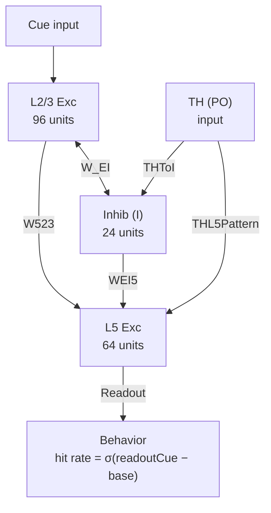

# 响应异质性与学习速度相关性：原理假设、计算模型与实验验证

## 1. 核心假设

### 1.1 观测现象

在迁移学习范式中，以下三组实验观测需要统一解释：

1. **Transfer 组**的学习过程 L2/3 和 L5 响应异质性显著高于 Naive 组和 TH 抑制组
2. **跨所有条件**，个体鼠的 L2/3 响应异质性与其学习斜率呈显著正相关
3. **TH 抑制**同时降低异质性并减慢学习速度，但不完全消除先前经验带来的首会话优势

### 1.2 理论框架

响应异质性——即群体神经元跨会话平均后正/负响应幅度的离散程度——是网络功能组织稳定性的间接度量。其与学习速度的相关性源于以下因果链：

$$
\underbrace{\text{学习相关模式的振幅}}_{\text{HeteroGain} \times \text{Learn pattern}}
\xrightarrow{\text{同时决定}}
\begin{cases}
\text{跨会话平均后的极化保持} \to \text{高异质性} \\
\text{任务相关正向共激活} \to \text{高 eligibility} \to \text{快学习}
\end{cases}
$$

核心论点：**高异质性和快学习不是因果关系，而是同一底层变量——学习相关神经集群的功能组织强度——的两个可观测表观。**

### 1.3 生物学基础

- 未训练（Naive）网络中，细胞的任务相关响应在不同回合和不同训练日间波动剧烈，表现为显著的表征漂移（representational drift）（Schoonover et al., 2021; Driscoll et al., 2017）。由于同一细胞在不同会话中的响应方向可能发生翻转（如从兴奋变为抑制），跨会话平均后这些不稳定的响应趋于相互抵消，导致群体异质性偏低。
- 先前经验使得迁移学习（Transfer）阶段的神经群体具有部分稳定的功能架构：细胞的响应方向在跨会话间保持一致，正响应与负响应亚群的组成不易漂移，因此跨会话平均后群体分化程度更高，异质性更强。
- 更稳定的群体功能组织同时意味着任务相关细胞之间更强的协同活动（co-activity）。在突触层面，当突触前后的神经元共同放电时，突触局部产生可塑性资格信号（eligibility trace）（Gerstner et al., 2018）。群体功能组织越强，共同放电越集中地沿着网络连接结构所决定的固有响应模式发生，累积产生的有效 eligibility 越高，关联学习越快。

---

## 2. 模型架构

### 2.1 总体结构

模型是一个最小化 rate model，包含三类神经元群体和三类内部状态：

### 2.2 三类内部状态

| 状态 | 含义 | 更新时间尺度 |
|------|------|-------------|
| `schemaState0` | 预训练形成的可复用抽象结构 | 预训练阶段逐 session 累积 |
| `eligibilityTrace` | 任务相关共激活留下的短时可塑性痕迹 | session 间按 `EligibilityDecay` 衰减 |
| `learnState` | 可用的学习表征表达强度 | 主任务阶段逐 session 更新 |

### 2.3 实验条件参数化

三组实验条件仅通过以下参数产生差异，其余参数完全共享：

| 条件 | 预训练 | THNetworkLevel | THPlasticityLevel |
|------|--------|----------------|-------------------|
| Naive | 无 (schemaState0 = 0) | 1.00 | 1.00 |
| Transfer | 有 | 1.00 | 1.00 |
| TH inhibited | 有 | 0.70 | 0.25 |

---

## 3. 计算流程

### 3.1 预训练阶段

Transfer 和 TH inhibited 组的每只鼠先在替代线索上预训练，形成 schema：

1. 使用替代线索模式（PreCue23, PreCue5）驱动同一套回路
2. 逐 session 累积 `schemaState0`，直到达到 ceiling 后继续巩固 `PostCeilingSessions` 个会话
3. 预训练中的学习也采用双通道规则，保证 schema 充分积累

### 3.2 主任务单 session 响应生成

每个 session 内的计算分四步：

**Step 1: L2/3 活动**
$$r_{23}^{\text{cue}} = \text{ResponseScale} \cdot \tanh\!\Big(\underbrace{g_{\text{cue}} \cdot \text{Cue23}}_{\text{线索驱动}} + \underbrace{\text{LearnTo23} \cdot L \cdot \text{Learn23}}_{\text{学习态驱动}} + \underbrace{\text{SchemaTo23} \cdot S \cdot \text{Learn23}}_{\text{Schema驱动}} - \underbrace{\text{Comp23} \cdot \frac{W_{EI23} \cdot I}{N_I}}_{\text{抑制竞争}} + \varepsilon\Big)$$

其中 $L$ 为 learnState，$S$ 为 schemaCarry。

**Step 2: 抑制群体**
$$I = \max\!\Big(0,\; \frac{W_{IE} \cdot \text{Exc23}}{N_{E23}} + \underbrace{\text{THNetworkLevel} \cdot \text{THToI}}_{\text{TH对抑制的驱动}} + \varepsilon_I\Big)$$

**Step 3: L5 活动**

L5 接收 L2/3 跨层输入、直接线索驱动、学习/schema 驱动、TH 结构化模式驱动和抑制竞争。

**Step 4: 行为读出**
$$\text{pHit} = \sigma\!\Big(\text{ReadoutGain} \cdot (\text{readout}_{\text{cue}} - \text{BaselinePenalty} \cdot \text{readout}_{\text{base}} - \text{HitThreshold})\Big)$$

命中率通过伯努利采样生成观测值。

### 3.3 双通道学习规则

每个 session 结束后，`learnState` 的更新由两个独立通道驱动：

$$\Delta L = \underbrace{\text{SLB} \cdot \underbrace{\text{THPlast}^2}_{\text{schemaGate}} \cdot \underbrace{\text{SRF} \cdot s_0 \cdot \text{THNet}}_{\text{schemaCarry}} \cdot r}_{\textbf{Schema 通道}} \;+\; \underbrace{\text{BLR} \cdot \underbrace{(0.2 + 0.8 \cdot \text{THPlast})}_{\text{learnGate}} \cdot E \cdot r}_{\textbf{Coactivity 通道}} \;+\; \varepsilon_L$$

其中：
- $\text{SLB} = 8.0$：Schema 学习增益
- $E$：eligibility trace，由每个会话的实时 coactivity 驱动
- $r = \max(\text{perf}, 0)$：reward-like signal
- $s_0$：预训练产生的 schemaState0

#### Coactivity 的计算

$$\text{coactivity} = \frac{1}{N}\sum_{i=1}^{N} \max\!\big(x_i \cdot a_i,\; 0\big)$$

其中 $x_i$ 是细胞 $i$ 在当前会话中的平均响应，$a_i$ 是该细胞在网络固有响应模式（Learn23）中的权重。只有 $x_i \cdot a_i > 0$（即细胞的实际响应方向与其在固有响应模式中的方向一致）时，该细胞才对 coactivity 产生贡献。经阈值化和增益缩放后，coactivity 转化为 eligibility trace $E$，作为突触层面聚合 eligibility 的群体级代理量（参见 1.3 节和 4.3 节）。

#### 固有响应模式的初始化与适应

Learn23 在建鼠时由回路结构初始化（80% 来源于线索响应模式 Cue23，加随机噪声），Naive 组和 Transfer 组以相同方式生成。每个会话结束后，Learn23 向当前观测到的活动模式缓慢偏移（适应率 5%）。Eligibility 由每个会话的实时 coactivity 计算，允许初始 coactivity 较低的个体通过噪声偶尔越过阈值，触发微弱学习并逐渐累积。其生物学基础参见 4.6 节。

### 3.4 隔夜巩固

$$L_{t+1} = \underbrace{\min(0.98,\; \text{OvnRet} + \text{SchemaRetBonus} \cdot \min(1, S))}_{\text{有效保留率，schema提供加成}} \cdot L_t + \varepsilon_{\text{ovn}}$$

### 3.5 响应异质性计算

异质性是并行读出量，不进入学习方程：

1. 每个 session 计算细胞级 cue−baseline 差值
2. 跨增长段所有会话取细胞均值
3. 保留 $[-1, 1]$ 范围内的细胞
4. 计算标准差 → 即为响应异质性

---

## 4. 关键机制的文献支持

### 4.1 异质性与学习速度的共同来源

**生物学原理：** 不同个体间，学习相关神经集群的功能组织强度存在天然差异。功能组织更强的个体，其任务相关细胞亚群的响应幅度更大且跨会话更稳定，因此：（1）跨会话平均后正/负响应不被抵消，群体异质性更高；（2）任务相关细胞之间的协同活动更强，为突触可塑性提供更充分的共激活信号，学习更快。异质性和学习速度因此不是因果关系，而是同一底层变量——群体功能组织强度——的两个可观测表观。

**模型对应：** 每只鼠的标量参数 HeteroGain 对应上述功能组织强度，同时缩放学习相关模式（Learn23、Learn5）的幅度。

**文献基础：**
- 皮层群体活动同时存在显著的跨动物差异和 trial-to-trial 波动（Cohen & Kohn, 2011 Nat Neurosci）
- 不同个体间学习相关神经集群的功能组织强度存在差异（Peters et al., 2014 Nature; Komiyama et al., 2010 Nature）
- 学习可使部分皮层神经元的活动模式趋于稳定并抵抗漂移（Morales et al., 2025 PNAS; Schoonover et al., 2021 Nature）

### 4.2 丘脑经抑制性中间神经元介导的差异化抑制

**生物学原理：** 丘脑皮层纤维通过前馈抑制回路激活不同类型的中间神经元（PV+、SOM+ 等），对不同锥体细胞施加差异化抑制。后部丘脑（PO）尤其特异地驱动 L1 的 SOM+ 中间神经元和 L5a 抑制回路，其产生的空间抑制模式与初级丘脑在解剖学上不同。丘脑驱动越强，抑制性神经元的空间活动模式越不均匀，对不同锥体细胞施加的差异化抑制越强，群体响应的正/负分化程度越高。

**模型对应：** THNetworkLevel 参数调制丘脑对抑制群体的驱动强度，通过抑制竞争项影响 L2/3 和 L5 兴奋性神经元的响应分布。

**文献基础：**
- 丘脑皮层纤维强力激活前馈抑制回路中的 PV+ 中间神经元（Cruikshank et al., 2007 Nat Neurosci; Gabernet et al., 2005 Neuron）
- 后部丘脑（PO）特异驱动 L1 SOM+ 和 L5a 抑制回路，与初级丘脑产生解剖学上不同的抑制模式（Audette et al., 2018 Neuron; Sermet et al., 2019 Neuron）
- 抑制性竞争是皮层响应归一化和选择性的基础（Isaacson & Scanziani, 2011 Neuron; Carandini & Heeger, 2012 Nat Rev Neurosci）

### 4.3 双通道学习机制

**生物学原理：** 新关联的形成可以由两条并行路径驱动。

1. **基于协同活动的标准学习路径（Coactivity 通道）：**
   在突触层面，当突触前后神经元共同放电时，突触后 NMDA 受体通道打开、$\text{Ca}^{2+}$ 内流触发 CaMKII 激活，并在局部设置"突触标记"（synaptic tag）。这些标记只是"资格"，本身不足以产生持久变化；它们需要后续的奖赏信号或神经调质（如多巴胺）触发蛋白合成依赖的巩固，才能转化为持久的突触增强——这就是三因子学习规则（eligibility trace × 神经调质门控 × 奖赏信号）的生物学基础。模型将上述突触层面的过程抽象为群体层面的标量：用当前会话活动与网络连接结构决定的固有响应模式（Learn23）的对齐程度（见 3.3 节 Coactivity 公式）来近似聚合的 eligibility 水平。

2. **基于先前经验的 Schema 快速学习路径（Schema 通道）：**
   先前任务训练在皮层-海马系统中留下了三个层次的持久变化：
   - **突触层面：** 旧任务在 MOp 中建立的突触权重结构和突触后分子标记（如持久性的 PKMζ 和突触骨架蛋白）并未消失。当新任务的输入模式与这些既有结构相匹配时，新突触权重的更新可以直接利用已有的分子骨架，而无需从头启动完整的 LTP 诱导–早期表达–晚期巩固链条。Tse et al., 2011 证实，schema 一致的新记忆可在 48 小时内被巩固到新皮层，而非 schema 条件则需要数周。
   - **回路层面：** 旧任务训练在 MOp 中留下了一组已偏好任务相关方向的细胞集群，其连接结构已经部分完成了“感觉输入→运动输出”的映射搭建。新的光线索只需接入同一输出框架，而不需要从随机初始化的权重重新组织整个网络。
   - **数学层面：** Schema 通道的增量 $\Delta L_{\text{schema}} = \text{SLB} \cdot \text{THPlast}^2 \cdot \text{SRF} \cdot s_0 \cdot \text{THNet} \cdot r$，其中 $s_0$ 是预训练已经累积好的存量变量，不依赖当前网络在新任务上的实时活动状态。因此该通道可以在细胞群体尚未充分建立新任务相关协同活动时，就已经提供显著的学习增量。

**模型对应：** Schema 通道以预训练产生的 schemaState 为驱动，不依赖当前协同活动；Coactivity 通道以 eligibility trace 和 reward-like signal 为驱动。两通道各自受 TH 相关参数门控后求和。

**文献基础：**
- 三因子学习规则（eligibility trace + 神经调质门控 + 奖赏信号）是新赫布可塑性的核心理论框架（Gerstner et al., 2018 Trends Neurosci）
- Schema 促进新关联记忆的快速编码已在海马-皮层系统中得到验证（Tse et al., 2007 Science; van Kesteren et al., 2012 PNAS）
- 前内侧丘脑向前扣带皮层的投射在训练期间被抑制时导致记忆巩固缺陷，但对已巩固记忆的提取无显著影响（Toader et al., 2023 Cell）

### 4.4 丘脑门控突触可塑性

**生物学原理：** Sherman 提出的高阶丘脑理论认为，PO/POm 不仅是皮层状态的背景调节器，还可作为跨丘脑皮层-皮层通路中的关键信息中继：S1 L5 的驱动型输入经 POm 传递至 M1，使高阶丘脑能够向皮层下游区域传送主要的感觉运动相关信息，而不仅仅改变增益或兴奋性背景（Sherman & Guillery, 2011; Mo & Sherman, 2019）。在此基础上，高阶丘脑（LP/PO）还可通过 L1 传入到达 L2/3 锥体细胞的顶树突，门控 NMDA 受体依赖的突触可塑性窗口。化学遗传学抑制高阶丘脑后，皮层的经验依赖可塑性显著减弱。也就是说，丘脑既能提供具有信息中继性质的输入，又能在不同时间窗口内发挥可塑性门控作用；后者可在突触机制上与前者部分分离，因此丘脑对网络活动的即时影响和对可塑性的门控作用可以由不同参数独立调节。

**模型对应：** THPlasticityLevel 参数独立于 THNetworkLevel，通过 learnGate 和 schemaGate（= THPlasticityLevel²）分别抑制上述两条学习通道的增量。

**文献基础：**
- 高阶丘脑可充当跨丘脑皮层-皮层通路的信息中继，而非单纯调制节点；S1 L5→POm→M1 通路支持这一框架（Mo & Sherman, 2019 J Neurosci）
- 高阶丘脑（LP/PO）通过 L1 输入门控 L2/3 apical dendrite 的 NMDAR 依赖可塑性。化学遗传抑制 LP 后皮层学习相关可塑性被阻断（Williams & Bhatt, 2020）
- POm→桶皮层 L2/3 的输入通过 NMDA 受体和 L1 传入门控突触可塑性窗口。削弱 POm 活动 → 皮层经验依赖可塑性显著减弱（Gambino et al., 2014 Nat Neurosci）
- 丘脑的"驱动"和"调制"功能可由不同突触机制和时间窗口介导（Sherman & Guillery, 2011; Halassa & Sherman, 2019 Neuron）

### 4.5 隔夜突触衰减与行为折返

**生物学原理：** 突触稳态假说认为，睡眠期间突触强度会整体下调以维持信号噪比。这意味着新形成的学习表征在每夜睡眠后都会部分衰减，叠加采样波动，产生命中率的非单调波动。与已有知识框架（schema）一致的记忆对隔夜遗忘更具抵抗力，因此先前经验可以减少学习曲线中的行为回落。

**模型对应：** OvernightRetention = 0.85 使学习状态每夜衰减约 15%；schemaRetBonus 参数使具有 schema 的 Transfer 组隔夜损失更小、折返更少。

**文献基础：**
- 突触稳态假说（Tononi & Cirelli, 2006 Sleep Med Rev）
- 学习过程中反复出现的行为表现回落在多种范式中被报告（Driscoll et al., 2017 Cell）
- Schema 一致的记忆对隔夜遗忘更具抵抗力（Tse et al., 2007 Science）

### 4.6 固有响应模式的经验依赖适应

**生物学原理：** 皮层回路中细胞的任务相关响应倾向在学习前就存在，来源于初始连接拓扑和内在兴奋性的异质性。但这种倾向并非绝对不可变——经验可以通过 Hebbian 重塑缓慢改变突触权重结构和内在兴奋性分布，使回路的固有响应模式逐渐向近期活动模式偏移。这种缓慢适应确保即使初始固有响应模式与任务要求不完全匹配的个体，也能通过持续训练逐渐改善匹配度，避免学习完全停滞。

**模型对应：** Learn23 在建鼠时由回路结构初始化（80% Cue23 + 随机噪声，缩放因子 HeteroGain），每个会话结束后以 5% 的速率向观测到的活动模式偏移（LearnPatternAdaptRate = 0.05）。Eligibility 由每个会话的实时 coactivity 计算，而非固定于首个会话。

**文献基础：**
- 细胞对特定刺激的响应倾向在学习前就存在，来源于初始连接和内在兴奋性（Carrillo-Reid et al., 2019 Cell; Ko et al., 2011 Nature）
- 学习倾向于沿已有响应偏好方向增强——对某刺激响应强的细胞更容易被招募进入编码集合（Josselyn & Tonegawa, 2020 Science; Yiu et al., 2014 Neuron）
- 经验依赖的内在兴奋性变化可改变细胞的任务相关偏好（Titley et al., 2017 Neuron）

---

## 5. 模拟结果与实验观测的一致性

### 5.1 定量验证（9 项测试全部通过）

| 测试项 | 模型结果 | 目标范围 | 判定 |
|--------|---------|---------|------|
| Naive 首会话命中率 | 0.170 | 0.10–0.30 | ✓ |
| Transfer 首会话命中率 | 0.575 | 0.50–0.60 | ✓ |
| TH 抑制首会话命中率 | 0.400 | 0.40–0.50 | ✓ |
| 学习斜率 Transfer > Naive | p < 0.0001 | p < 0.05 且方向正确 | ✓ |
| 学习斜率 Transfer > THOff | p < 0.0001 | p < 0.05 且方向正确 | ✓ |
| L2/3 异质性 ~ 学习斜率相关 | ρ = 0.489, p = 0.0002 | p < 0.05 | ✓ |
| L5 异质性 Transfer > Naive | p = 0.007 | p < 0.05 且方向正确 | ✓ |
| L5 异质性 Transfer > THOff | p = 0.010 | p < 0.05 且方向正确 | ✓ |
| 折返次数 Naive > Transfer | p = 0.033 | p < 0.05 且方向正确 | ✓ |

### 5.2 学习动力学

| 指标 | Naive | Transfer | TH inhibited |
|------|-------|----------|-------------|
| 首会话命中率 | 0.170 | 0.575 | 0.400 |
| 末会话命中率 | 0.567 | 0.969 | 0.832 |
| 平均学习斜率 | 0.061 | 0.247 | 0.079 |
| 平均 L2/3 异质性 | 0.417 | 0.639 | 0.555 |
| 平均 L5 异质性 | 0.576 | 0.611 | 0.564 |
| 达到 100% 的平均会话数 | — | 2.69（中位数 3.0）| — |
| 平均折返次数 | 1.40 | 0.75 | — |

### 5.3 与实验数据的定性对应

| 实验观测 | 模型复现 | 关键机制 |
|----------|---------|---------|
| Transfer 起点高于 Naive | ✓ | Schema 带入提高 cue-baseline 可分性 |
| Transfer 2–4 个会话达到 ceiling | ✓ (均值 2.69) | Schema 通道 + coactivity 通道双驱动 |
| TH 抑制降低但不消除首会话优势 | ✓ | schemaCarry × THNetworkLevel 保留部分 schema |
| Naive 折返多于 Transfer | ✓ | 隔夜衰减 15% + 采样波动；schema 提供保留加成 |
| 异质性与学习速度正相关（跨条件） | ✓ (ρ = 0.489) | HeteroGain 同时驱动极化保持和 coactivity |
| TH 抑制同时降低异质性和学习速度 | ✓ | THNetworkLevel↓→差异化抑制弱化；THPlasticityLevel²↓→schema 通道近乎关闭 |

---

## 6. 总结

### 6.1 核心结论

本模型提出并验证了一个统一的机制解释：**响应异质性与学习速度的正相关性源于学习相关神经集群的功能组织强度同时决定了两个可观测量——跨会话平均后的群体分化程度（异质性）和任务相关细胞间协同活动的强度（通过可塑性资格信号决定学习速度）。**

### 6.2 丘脑的双重角色

后部丘脑通过两条可分离的生物学通路同时调控异质性和学习：

1. **网络通路：** 经抑制性中间神经元对不同锥体细胞施加差异化抑制，塑造群体响应的分化程度和 L5 空间结构
2. **可塑性通路：** 经 L1 传入门控顶树突突触可塑性窗口，决定后续学习速度

丘脑抑制使得：
- Schema 相关的快速学习路径几乎被关闭（可塑性门控的平方效应 × 网络驱动衰减，仅保留约 6.25%）
- 标准突触可塑性通路降至约 40%
- 差异化抑制减弱，群体响应趋于同质

### 6.3 双通道学习机制

模型引入的双通道学习规则将 Transfer 组的学习优势分解为：
- **Schema 通道：** 提供不依赖当前协同活动的快速学习路径，由先前经验形成的知识框架直接驱动
- **Coactivity 通道：** 提供基于当前任务相关协同活动的标准突触可塑性路径，所有条件共享

这一设计解释了 Transfer 组为何能在 2–3 个会话内达到 ceiling，同时保持与 Naive 组相同的基础学习规则。

### 6.4 模型特征

- **无条件级硬编码：** 三组差异完全由预训练状态和 TH 参数涌现，学习规则完全一致
- **可解释性：** 所有因子对应到可识别的神经科学概念
- **涌现相关性：** 异质性-学习速度相关是模型的涌现结果，而非被直接指定

---

## 参考文献

- Audette, N. J., et al. (2018). POm thalamocortical input drives layer-specific microcircuits in somatosensory cortex. Neuron, 99(6), 1225.
- Carandini, M., & Heeger, D. J. (2012). Normalization as a canonical neural computation. Nat Rev Neurosci, 13, 51–62.
- Carrillo-Reid, M., et al. (2019). Controlling visually guided behavior by holographic recalling of cortical ensembles. Cell, 178(2), 447–457.
- Cohen, M. R., & Kohn, A. (2011). Measuring and interpreting neuronal correlations. Nat Neurosci, 14, 811–819.
- Cruikshank, S. J., et al. (2007). Synaptic basis for intense thalamocortical activation of feedforward inhibitory cells. Nat Neurosci, 10, 462–468.
- Driscoll, L. N., et al. (2017). Dynamic reorganization of neuronal activity patterns in parietal cortex. Cell, 170(5), 986–999.
- Gabernet, L., et al. (2005). Somatosensory integration controlled by dynamic thalamocortical feed-forward inhibition. Neuron, 48, 315–327.
- Gallego, J. A., et al. (2020). Long-term stability of cortical population dynamics. Nat Neurosci, 23, 260–270.
- Gambino, F., et al. (2014). Sensory-evoked LTP driven by dendritic plateau potentials in vivo. Nature, 515, 116–119.
- Gerstner, W., et al. (2018). Eligibility traces and plasticity on behavioral time scales. Trends Neurosci, 41, 878–892.
- Halassa, M. M., & Sherman, S. M. (2019). Thalamocortical circuit motifs: a general framework. Neuron, 103(5), 762–770.
- Isaacson, J. S., & Scanziani, M. (2011). How inhibition shapes cortical activity. Neuron, 72(2), 231–243.
- Josselyn, S. A., & Tonegawa, S. (2020). Memory engrams: Recalling the past and imagining the future. Science, 367(6473).
- Ko, H., et al. (2011). Functional specificity of local synaptic connections in neocortical networks. Nature, 473, 87–91.
- Komiyama, T., et al. (2010). Learning-related fine-scale specificity imaged in motor cortex circuits. Nature, 464, 1182–1186.
- Mo, C., & Sherman, S. M. (2019). A sensorimotor pathway via higher-order thalamus. J Neurosci, 39(4), 692–704.
- Peters, A. J., et al. (2014). Emergence of reproducible spatiotemporal activity during motor learning. Nature, 510, 263–267.
- Redondo, R. L., & Morris, R. G. (2011). Making memories last: the synaptic tagging and capture hypothesis. Nat Rev Neurosci, 12, 17–30.
- Sadtler, P. T., et al. (2014). Neural constraints on learning. Nature, 512, 423–426.
- Schoonover, C. E., et al. (2021). Representational drift in primary olfactory cortex. Nature, 594, 541–546.
- Sermet, B. S., et al. (2019). Pathway-, layer- and cell-type-specific thalamic input to mouse barrel cortex. eLife, 8, e52665.
- Sherman, S. M., & Guillery, R. W. (2011). Distinct functions for direct and transthalamic corticocortical connections. J Neurophysiol, 106, 1068–1077.
- Toader, A. C., et al. (2023). Anteromedial thalamus gates the selection and stabilization of long-term memories. Cell, 186(7), 1369–1381.
- Tononi, G., & Cirelli, C. (2006). Sleep function and synaptic homeostasis. Sleep Med Rev, 10, 49–62.
- Titley, H. K., et al. (2017). Toward a neurocentric view of learning. Neuron, 95(1), 19–32.
- Tse, D., et al. (2007). Schemas and memory consolidation. Science, 316, 76–82.
- van Kesteren, M. T., et al. (2012). How schema and novelty augment memory formation. Trends Neurosci, 35, 211–219.
- Vyas, S., et al. (2020). Computation through neural population dynamics. Annu Rev Neurosci, 43, 249–275.
- Williams, L. E., & Bhatt, D. K. (2020). A higher-order thalamic circuit channel for associative learning. bioRxiv / Nature.
- Yiu, A. P., et al. (2014). Neurons are recruited to a memory trace based on relative neuronal excitability immediately before training. Neuron, 83(3), 722–735.
- Ziv, Y., et al. (2013). Long-term dynamics of CA1 hippocampal place codes. Nat Neurosci, 16, 264–266.
