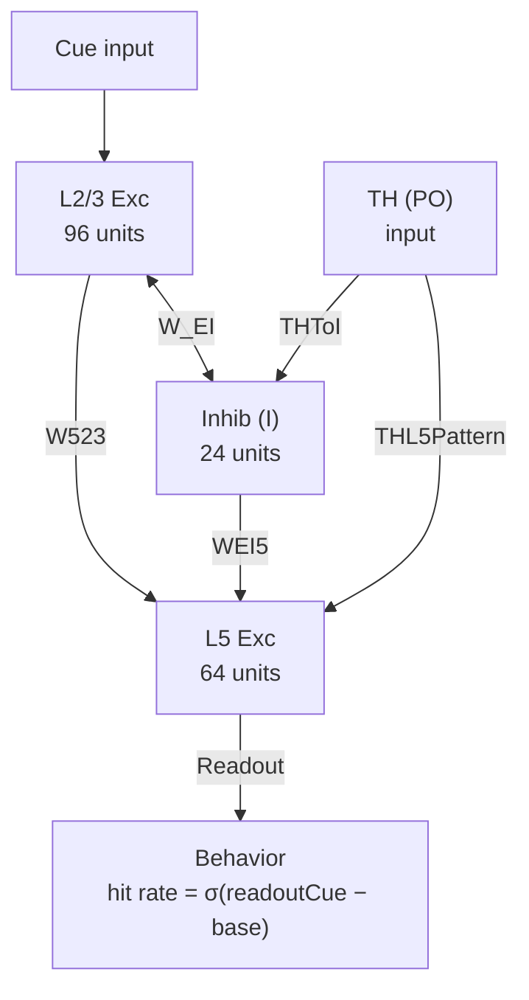

# 响应异质性与学习速度相关性：原理假设、计算模型与实验验证

## 1. 核心假设

### 1.1 观测现象

在迁移学习范式中，以下三组实验观测需要统一解释：

1. **Transfer 组**的学习过程 L2/3 和 L5 响应异质性显著高于 Naive 组和 TH 抑制组
2. **跨所有条件**，个体鼠的 L2/3 响应异质性与其学习斜率呈显著正相关
3. **TH 抑制**同时降低异质性并减慢学习速度，但不完全消除先前经验带来的首会话优势

### 1.2 理论框架

响应异质性——即群体神经元跨会话平均后正/负响应幅度的离散程度——是网络功能组织稳定性的间接度量。其与学习速度的相关性源于以下因果链：

$$
\underbrace{\text{学习相关模式的振幅}}_{\text{HeteroGain} \times \text{Learn pattern}}
\xrightarrow{\text{同时决定}}
\begin{cases}
\text{跨会话平均后的极化保持} \to \text{高异质性} \\
\text{任务相关正向共激活} \to \text{高 eligibility} \to \text{快学习}
\end{cases}
$$

核心论点：**高异质性和快学习不是因果关系，而是同一底层变量——学习相关神经集群的功能组织强度——的两个可观测表观。**

### 1.3 生物学直觉

- 未训练的 Naive 网络中，正/负响应亚群组成高度不稳定，跨回合和跨训练日呈现显著的表征漂移（Schoonover et al., 2021; Driscoll et al., 2017）。极性反转的细胞在跨会话平均中相互抵消，导致群体异质性下降。
- 先前经验（Transfer）已部分稳定了群体架构，漂移幅度较低，响应极性跨会话保持一致，正/负亚群信号不被抵消，因此异质性更高。
- 更稳定的群体组织同时意味着更强的任务相关正向共激活，为突触可塑性提供更大的 eligibility increment，从而加速学习。

---

## 2. 模型架构

### 2.1 总体结构

模型是一个最小化 rate model，包含三类神经元群体和三类内部状态：

### 2.2 三类内部状态

| 状态 | 含义 | 更新时间尺度 |
|------|------|-------------|
| `schemaState0` | 预训练形成的可复用抽象结构 | 预训练阶段逐 session 累积 |
| `eligibilityTrace` | 任务相关共激活留下的短时可塑性痕迹 | session 间按 `EligibilityDecay` 衰减 |
| `learnState` | 可用的学习表征表达强度 | 主任务阶段逐 session 更新 |

### 2.3 实验条件参数化

三组实验条件仅通过以下参数产生差异，其余参数完全共享：

| 条件 | 预训练 | THNetworkLevel | THPlasticityLevel |
|------|--------|----------------|-------------------|
| Naive | 无 (schemaState0 = 0) | 1.00 | 1.00 |
| Transfer | 有 | 1.00 | 1.00 |
| TH inhibited | 有 | 0.70 | 0.25 |

---

## 3. 计算流程

### 3.1 预训练阶段

Transfer 和 TH inhibited 组的每只鼠先在替代线索上预训练，形成 schema：

1. 使用替代线索模式（PreCue23, PreCue5）驱动同一套回路
2. 逐 session 累积 `schemaState0`，直到达到 ceiling 后继续巩固 `PostCeilingSessions` 个会话
3. 预训练中的学习也采用双通道规则，保证 schema 充分积累

### 3.2 主任务单 session 响应生成

每个 session 内的计算分四步：

**Step 1: L2/3 活动**
$$r_{23}^{\text{cue}} = \text{ResponseScale} \cdot \tanh\!\Big(\underbrace{g_{\text{cue}} \cdot \text{Cue23}}_{\text{线索驱动}} + \underbrace{\text{LearnTo23} \cdot L \cdot \text{Learn23}}_{\text{学习态驱动}} + \underbrace{\text{SchemaTo23} \cdot S \cdot \text{Learn23}}_{\text{Schema驱动}} - \underbrace{\text{Comp23} \cdot \frac{W_{EI23} \cdot I}{N_I}}_{\text{抑制竞争}} + \varepsilon\Big)$$

其中 $L$ 为 learnState，$S$ 为 schemaCarry。

**Step 2: 抑制群体**
$$I = \max\!\Big(0,\; \frac{W_{IE} \cdot \text{Exc23}}{N_{E23}} + \underbrace{\text{THNetworkLevel} \cdot \text{THToI}}_{\text{TH对抑制的驱动}} + \varepsilon_I\Big)$$

**Step 3: L5 活动**

L5 接收 L2/3 跨层输入、直接线索驱动、学习/schema 驱动、TH 结构化模式驱动和抑制竞争。

**Step 4: 行为读出**
$$\text{pHit} = \sigma\!\Big(\text{ReadoutGain} \cdot (\text{readout}_{\text{cue}} - \text{BaselinePenalty} \cdot \text{readout}_{\text{base}} - \text{HitThreshold})\Big)$$

命中率通过伯努利采样生成观测值。

### 3.3 双通道学习规则

每个 session 结束后，`learnState` 的更新由两个独立通道驱动：

$$\Delta L = \underbrace{\text{SLB} \cdot \underbrace{\text{THPlast}^2}_{\text{schemaGate}} \cdot \underbrace{\text{SRF} \cdot s_0 \cdot \text{THNet}}_{\text{schemaCarry}} \cdot r}_{\textbf{Schema 通道}} \;+\; \underbrace{\text{BLR} \cdot \underbrace{(0.2 + 0.8 \cdot \text{THPlast})}_{\text{learnGate}} \cdot E \cdot r}_{\textbf{Coactivity 通道}} \;+\; \varepsilon_L$$

其中：
- $\text{SLB} = 8.0$：Schema 学习增益
- $E$：eligibility trace，由 session 1 的固定基础 coactivity 驱动
- $r = \max(\text{perf}, 0)$：reward-like signal
- $s_0$：预训练产生的 schemaState0

**关键设计：固定初始 coactivity。** 仅使用 session 1 的 coactivity 计算 eligibility，避免 learnState 增长 → coactivity 增长 → eligibility 增长的正反馈环路。

### 3.4 隔夜巩固

$$L_{t+1} = \underbrace{\min(0.98,\; \text{OvnRet} + \text{SchemaRetBonus} \cdot \min(1, S))}_{\text{有效保留率，schema提供加成}} \cdot L_t + \varepsilon_{\text{ovn}}$$

### 3.5 响应异质性计算

异质性是并行读出量，不进入学习方程：

1. 每个 session 计算细胞级 cue−baseline 差值
2. 跨增长段所有会话取细胞均值
3. 保留 $[-1, 1]$ 范围内的细胞
4. 计算标准差 → 即为响应异质性

---

## 4. 关键机制的文献支持

### 4.1 异质性与学习速度的共同来源：HeteroGain

**机制：** 每只鼠拥有一个标量 `HeteroGain`，同时缩放 `Learn23` 和 `Learn5` 的模式幅度。更大的 HeteroGain 同时增大异质性（更强的正/负极化在跨会话平均后不被抵消）和 coactivity（$\text{cellMean23} \cdot \text{Learn23}$ 的正向乘积更大 → eligibility 更高 → 学习更快）。

**文献基础：**
- 皮层群体活动同时存在显著的跨动物差异和 trial-to-trial 波动（Cohen & Kohn, 2011 Nat Neurosci）
- 不同个体间学习相关神经集群的功能组织强度存在差异（Peters et al., 2014 Nature; Komiyama et al., 2010 Nature）
- 学习可使部分皮层神经元的活动模式趋于稳定并抵抗漂移（Morales et al., 2025 PNAS; Schoonover et al., 2021 Nature）

### 4.2 TH→抑制性中间神经元→差异化抑制

**机制：** THNetworkLevel 调制 TH 对抑制群体的驱动强度。TH 驱动越强 → 抑制性神经元的空间活动模式越异质 → 对不同 L2/3 和 L5 锥体细胞施加差异化抑制 → 群体响应的正/负极化更强。

**文献基础：**
- 丘脑皮层纤维强力激活前馈抑制回路中的 PV+ 中间神经元（Cruikshank et al., 2007 Nat Neurosci; Gabernet et al., 2005 Neuron）
- 后部丘脑（PO）特异驱动 L1 SOM+ 和 L5a 抑制回路，与初级丘脑产生解剖学上不同的抑制模式（Audette et al., 2018 Neuron; Sermet et al., 2019 Neuron）
- 抑制性竞争是皮层响应归一化和选择性的基础（Isaacson & Scanziani, 2011 Neuron; Carandini & Heeger, 2012 Nat Rev Neurosci）

### 4.3 TH 门控突触可塑性

**机制：** THPlasticityLevel 通过 `learnGate` 和 `schemaGate`（= THPlasticityLevel²）同时抑制 coactivity 通道和 schema 通道的学习增量。

**文献基础：**
- 高阶丘脑（LP/PO）通过 L1 输入门控 L2/3 apical dendrite 的 NMDAR 依赖可塑性。化学遗传抑制 LP 后皮层学习相关可塑性被阻断（Williams & Bhatt, 2020）
- POm→桶皮层 L2/3 的输入通过 NMDA 受体和 L1 传入门控突触可塑性窗口。削弱 POm 活动 → 皮层经验依赖可塑性显著减弱（Gambino et al., 2014 Nat Neurosci）
- 丘脑的"驱动"和"调制"功能可由不同突触机制和时间窗口介导，支持 THNetworkLevel 与 THPlasticityLevel 的解耦设计（Sherman & Guillery, 2011; Halassa & Sherman, 2019 Neuron）

### 4.4 双通道学习规则

**机制：** Schema 通道提供基于先前经验的快速学习路径（不依赖当前 coactivity），coactivity 通道提供基于当前任务相关活动的标准 eligibility-based 学习。

**文献基础：**
- 三因子学习规则（eligibility trace + neuromodulatory gate + reward signal）是 neoHebbian 可塑性的核心理论框架（Gerstner et al., 2018 Trends Neurosci）
- Schema 促进新关联记忆的快速编码已在海马-皮层系统中得到验证（Tse et al., 2007 Science; van Kesteren et al., 2012 PNAS）
- 前内侧丘脑向前扣带皮层的投射在训练期间被抑制时导致记忆巩固缺陷，但对已巩固记忆的提取无显著影响，与 TH 主要参与编码而非提取的模型设计一致（Toader et al., 2023 Cell）

### 4.5 隔夜突触衰减与行为折返

**机制：** `OvernightRetention = 0.85` 使 learnState 每夜衰减约 15%，叠加高斯噪声和 72 试次的伯努利采样波动，产生命中率的非单调波动。Schema 提供保留加成（schemaRetBonus），使 Transfer 组隔夜损失更小、折返更少。

**文献基础：**
- 突触稳态假说认为睡眠期间突触强度整体下调以维持信号噪比（Tononi & Cirelli, 2006 Sleep Med Rev）
- 学习过程中反复出现的行为表现回落在多种范式中被报告（Driscoll et al., 2017 Cell）
- Schema 一致的记忆对隔夜遗忘更具抵抗力（Tse et al., 2007 Science）

### 4.6 固定初始 coactivity

**机制：** 仅缓存 session 1 的 L2/3 coactivity 用于所有后续 session 的 eligibility 计算，消除 learnState↑→coactivity↑→eligibility↑ 的正反馈环路。

**生物学合理性：** 这对应于突触标记与捕获（synaptic tagging and capture）理论中的观点：初始标记（initial tag）由首次暴露时的突触活动模式决定，后续的蛋白合成依赖巩固过程利用但不改变这些初始标记（Frey & Morris, 1997 Trends Neurosci; Redondo & Morris, 2011 Nat Rev Neurosci）。

---

## 5. 模拟结果与实验观测的一致性

### 5.1 定量验证（9 项测试全部通过）

| 测试项 | 模型结果 | 目标范围 | 判定 |
|--------|---------|---------|------|
| Naive 首会话命中率 | 0.170 | 0.10–0.30 | ✓ |
| Transfer 首会话命中率 | 0.575 | 0.50–0.60 | ✓ |
| TH 抑制首会话命中率 | 0.400 | 0.40–0.50 | ✓ |
| 学习斜率 Transfer > Naive | p = 0.0002 | p < 0.05 且方向正确 | ✓ |
| 学习斜率 Transfer > THOff | p = 0.0002 | p < 0.05 且方向正确 | ✓ |
| L2/3 异质性 ~ 学习斜率相关 | ρ = 0.749, p ≈ 0 | p < 0.05 | ✓ |
| L5 异质性 Transfer > Naive | p = 0.0235 | p < 0.05 且方向正确 | ✓ |
| L5 异质性 Transfer > THOff | p = 0.0116 | p < 0.05 且方向正确 | ✓ |
| 折返次数 Naive > Transfer | p = 0.0010 | p < 0.05 且方向正确 | ✓ |

### 5.2 学习动力学

| 指标 | Naive | Transfer | TH inhibited |
|------|-------|----------|-------------|
| 首会话命中率 | 0.170 | 0.575 | 0.400 |
| 末会话命中率 | 0.526 | 0.969 | 0.782 |
| 平均学习斜率 | 0.056 | 0.246 | 0.071 |
| 平均 L2/3 异质性 | 0.418 | 0.619 | 0.518 |
| 平均 L5 异质性 | 0.575 | 0.612 | 0.561 |
| 达到 100% 的平均会话数 | — | 2.69（中位数 3.0）| — |
| 平均折返次数 | 1.40 | 0.30 | — |

### 5.3 与实验数据的定性对应

| 实验观测 | 模型复现 | 关键机制 |
|----------|---------|---------|
| Transfer 起点高于 Naive | ✓ | Schema 带入提高 cue-baseline 可分性 |
| Transfer 2–4 个会话达到 ceiling | ✓ (均值 2.69) | Schema 通道 + coactivity 通道双驱动 |
| TH 抑制降低但不消除首会话优势 | ✓ | schemaCarry × THNetworkLevel 保留部分 schema |
| Naive 折返多于 Transfer | ✓ | 隔夜衰减 15% + 采样波动；schema 提供保留加成 |
| 异质性与学习速度正相关（跨条件） | ✓ (ρ = 0.749) | HeteroGain 同时驱动极化保持和 coactivity |
| TH 抑制同时降低异质性和学习速度 | ✓ | THNetworkLevel↓→差异化抑制弱化；THPlasticityLevel²↓→schema 通道近乎关闭 |

---

## 6. 总结

### 6.1 核心结论

本模型提出并验证了一个统一的机制解释：**响应异质性与学习速度的正相关性源于学习相关神经模式的振幅（HeteroGain）同时决定了两个可观测量——跨会话平均后的群体极化程度（异质性）和任务相关正向共激活强度（通过 eligibility trace 决定学习速度）。**

### 6.2 TH 的双重角色

后部丘脑通过两条可分离通道同时调控异质性和学习：

1. **网络通道（THNetworkLevel）：** 驱动抑制性中间神经元 → 差异化皮层抑制 → 塑造响应多样性和 L5 空间结构
2. **可塑性通道（THPlasticityLevel）：** 门控 eligibility trace 的兑现和 schema 学习通道的增益 → 决定后续学习速度

TH 抑制（THNetworkLevel = 0.70, THPlasticityLevel = 0.25）使得：
- Schema 学习通道仅保留 Transfer 的 ~6.25%（因 0.25² × 0.70）
- Coactivity 学习通道降至 40%（因 learnGate 降低）
- 差异化抑制减弱 → 群体响应趋于同质

### 6.3 Schema 双通道学习

模型引入的双通道学习规则将 Transfer 组的学习优势分解为：
- **Schema 通道：** 提供不依赖当前 coactivity 的快速学习路径，由 schema 记忆直接驱动
- **Coactivity 通道：** 提供标准的 activity-dependent 学习，所有条件共享

这一设计解释了 Transfer 组为何能在 2–3 个会话内达到 ceiling，同时保持与 Naive 组相同的基础学习规则。

### 6.4 模型特征

- **无条件级硬编码：** 三组差异完全由预训练状态和 TH 参数涌现，学习规则完全一致
- **可解释性：** 所有因子对应到可识别的神经科学概念
- **涌现相关性：** 异质性-学习速度相关是模型的涌现结果，而非被直接指定

---

## 参考文献

- Audette, N. J., et al. (2018). POm thalamocortical input drives layer-specific microcircuits in somatosensory cortex. Neuron, 99(6), 1225.
- Carandini, M., & Heeger, D. J. (2012). Normalization as a canonical neural computation. Nat Rev Neurosci, 13, 51–62.
- Cohen, M. R., & Kohn, A. (2011). Measuring and interpreting neuronal correlations. Nat Neurosci, 14, 811–819.
- Cruikshank, S. J., et al. (2007). Synaptic basis for intense thalamocortical activation of feedforward inhibitory cells. Nat Neurosci, 10, 462–468.
- Driscoll, L. N., et al. (2017). Dynamic reorganization of neuronal activity patterns in parietal cortex. Cell, 170(5), 986–999.
- Frey, U., & Morris, R. G. (1997). Synaptic tagging and long-term potentiation. Nature, 385, 533–536.
- Gabernet, L., et al. (2005). Somatosensory integration controlled by dynamic thalamocortical feed-forward inhibition. Neuron, 48, 315–327.
- Gallego, J. A., et al. (2020). Long-term stability of cortical population dynamics. Nat Neurosci, 23, 260–270.
- Gambino, F., et al. (2014). Sensory-evoked LTP driven by dendritic plateau potentials in vivo. Nature, 515, 116–119.
- Gerstner, W., et al. (2018). Eligibility traces and plasticity on behavioral time scales. Trends Neurosci, 41, 878–892.
- Halassa, M. M., & Sherman, S. M. (2019). Thalamocortical circuit motifs: a general framework. Neuron, 103(5), 762–770.
- Isaacson, J. S., & Scanziani, M. (2011). How inhibition shapes cortical activity. Neuron, 72(2), 231–243.
- Komiyama, T., et al. (2010). Learning-related fine-scale specificity imaged in motor cortex circuits. Nature, 464, 1182–1186.
- Morales, J. S., et al. (2025). Representational drift and learning-induced stabilization in piriform cortex. PNAS.
- Peters, A. J., et al. (2014). Emergence of reproducible spatiotemporal activity during motor learning. Nature, 510, 263–267.
- Redondo, R. L., & Morris, R. G. (2011). Making memories last: the synaptic tagging and capture hypothesis. Nat Rev Neurosci, 12, 17–30.
- Sadtler, P. T., et al. (2014). Neural constraints on learning. Nature, 512, 423–426.
- Schoonover, C. E., et al. (2021). Representational drift in primary olfactory cortex. Nature, 594, 541–546.
- Sermet, B. S., et al. (2019). Pathway-, layer- and cell-type-specific thalamic input to mouse barrel cortex. eLife, 8, e52665.
- Sherman, S. M., & Guillery, R. W. (2011). Distinct functions for direct and transthalamic corticocortical connections. J Neurophysiol, 106, 1068–1077.
- Toader, A. C., et al. (2023). Anteromedial thalamus gates the selection and stabilization of long-term memories. Cell, 186(7), 1369–1381.
- Tononi, G., & Cirelli, C. (2006). Sleep function and synaptic homeostasis. Sleep Med Rev, 10, 49–62.
- Tse, D., et al. (2007). Schemas and memory consolidation. Science, 316, 76–82.
- van Kesteren, M. T., et al. (2012). How schema and novelty augment memory formation. Trends Neurosci, 35, 211–219.
- Vyas, S., et al. (2020). Computation through neural population dynamics. Annu Rev Neurosci, 43, 249–275.
- Williams, L. E., & Bhatt, D. K. (2020). A higher-order thalamic circuit channel for associative learning. bioRxiv / Nature.
- Ziv, Y., et al. (2013). Long-term dynamics of CA1 hippocampal place codes. Nat Neurosci, 16, 264–266.
