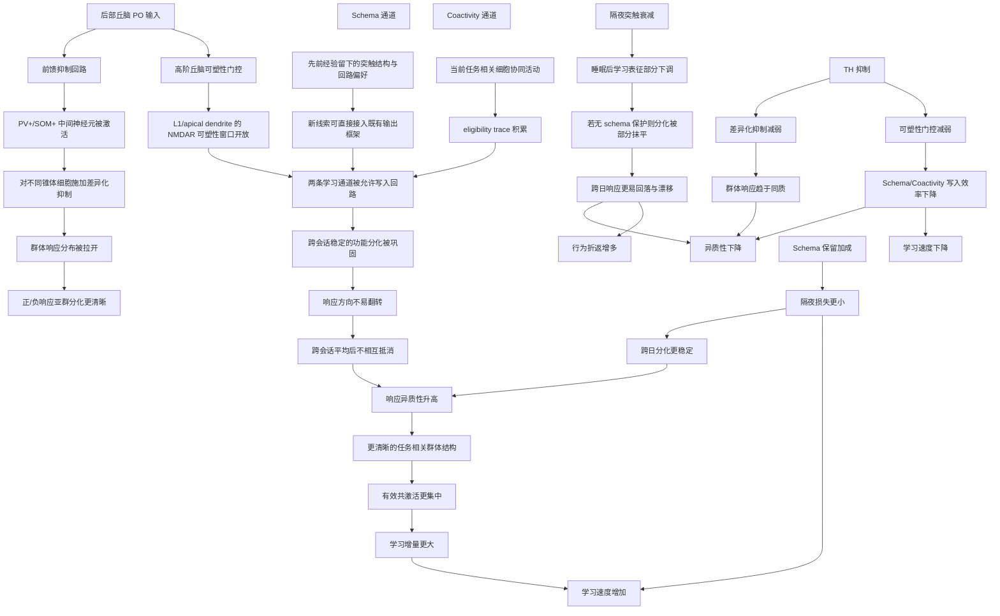

# 响应异质性原理

## 示意图

## 图示核心含义

这张图把 4.2 到 4.5 的内容压缩成一条主线：后部丘脑一方面通过前馈抑制回路制造对不同锥体细胞的不均匀抑制，使群体响应在空间上被拉开；另一方面又通过高阶丘脑的可塑性门控作用，决定这些差异化活动模式能否真正被写入回路并跨会话保留下来。这样，Schema 通道提供的旧经验结构复用，与 Coactivity 通道提供的当前协同活动驱动，就能共同把网络推向一个更稳定、更分化的状态。

在这个框架下，响应异质性不是单独被设定出来的量，而是群体分化成功被保留后的统计表观。正响应和负响应亚群越稳定，跨会话平均后越不容易相互抵消，异质性就越高。异质性升高又意味着任务相关群体结构更清晰、有效共激活更集中，因此可塑性累积更有效，学习速度也更快。

## 与 4.2-4.5 的对应关系

- 4.2 的核心贡献：丘脑经抑制性中间神经元产生差异化抑制，直接塑造正/负响应亚群的分化。
- 4.3 的核心贡献：Schema 通道和 Coactivity 通道共同把这种分化写入学习状态，并推动学习增量累积。
- 4.4 的核心贡献：丘脑不仅改变即时网络活动，还门控突触可塑性窗口，决定上述分化能否稳定保留。
- 4.5 的核心贡献：隔夜衰减会削弱已经形成的分化；schema 一致的记忆则能抵抗这种衰减，从而减少行为折返并维持异质性。

## 可直接配图说明的简短版本

响应异质性的产生可以理解为四个环节的联合作用：第一，后部丘脑通过前馈抑制回路对不同锥体细胞施加差异化抑制，使群体响应在空间上被拉开；第二，Schema 通道和 Coactivity 通道分别从旧经验复用和当前协同活动两个来源推动学习增量；第三，高阶丘脑门控 NMDAR 依赖的突触可塑性窗口，使这些差异化活动模式能够跨会话被稳定写入回路；第四，隔夜衰减不断削弱新形成的分化，而 schema 保留加成则帮助 transfer 组抵抗这种衰减。最终，当正负响应亚群在跨会话间保持稳定且不被平均抵消时，便表现为更高的响应异质性；而这种更清晰的群体结构又使有效共激活和学习增量更加集中，从而对应更快的学习速度。