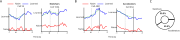
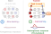
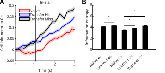
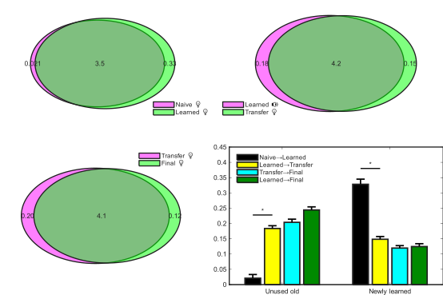
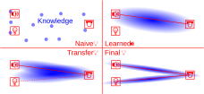
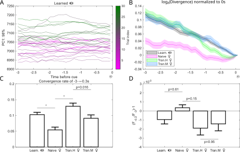
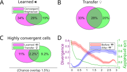

学位论文大纲：迁移阶段光水表现提升与学会声水细胞复用

# 中文摘要
跨任务迁移体现了学习系统在新情境中的适应性，但行为上的迁移优势并不只是“第一天表现更好”，还可能包含后续学习路径和更新效率的改变。本研究在头固定小鼠的“提示刺激-延迟-给水”范式中，先训练声音提示给水任务（声水）至学会，再切换到光提示给水任务（光水），并与从头学习光水的对照组比较迁移效应。两组动物互为声水/光水对照，但由于光水初始学习过程更长、更便于展开中间过程分析，正文以声转光迁移为主。研究结合初级运动皮层（MOp）2/3层与5层的跨天双光子钙成像、cFos依赖的细胞集合抑制、以PO为中心的后部丘脑化学遗传抑制、RSP抑制以及7天间隔操纵，从行为、群体动力学和回路层面解析迁移优势的组成。

结果表明，迁移优势首先是稳定的行为现象。无论声水还是光水，迁移组都表现出更高的首会话命中率和整体上移的学习曲线；在控制首会话命中率后，迁移光水的后续增长斜率仍然更大，说明迁移优势不仅是起点抬高，还包括真正更快的后续习得。对初始学习过程的钙信号分析显示，学会后的网络由提示前的静息态切换到提示后的动作态，这一切换主要依赖提示输入触发的大规模同步状态转换，而不是单纯依赖静息态的自发衰变。

针对迁移首会话优势，学会声水阶段活跃的细胞在迁移光水命中回合中更容易被重新激活，且重激活率与命中率显著相关。迁移会话的回合间相对散度也低于初始会话，尤其体现在MOp 2/3层，说明迁移更容易把网络稳定地带入接近已学会状态的群体轨迹。选择性抑制声水学会时被招募的MOp细胞集合会使迁移学习曲线整体下移，而不经标记的广泛MOp抑制没有同等效应；在学会后等待7天再迁移，则会同时降低重激活率、升高散度并削弱首会话优势。这些结果共同支持：迁移的首会话高命中主要对应旧任务相关细胞集合在新提示下的重新调用，以及由此带来的群体状态稳定化。

针对迁移后续增长优势，群体状态空间分析显示，迁移学习并不是“每一步走得更远”，而是学习轨迹更少绕路、更接近从起点指向终点的方向，而平均步长并未显著增大。与此一致，迁移学习中细胞响应的异质性更高，网络更容易分化出明确的正负响应群体，而不是大量细胞长期在零附近摇摆。该指标与更直接的状态空间推进和更大的会话步增量相关。进一步的回路操纵表明，抑制以PO为中心的后部丘脑输入可降低MOp5层的响应异质性并减缓迁移进展，但对首会话命中率影响较小，提示后部丘脑更偏向支持迁移中的后续更新效率，而非旧表征的初始调用。

除MOp外，本文还考察了RSP这一位于视觉皮层与运动皮层之间的候选中继脑区。结果显示，RSP对光提示的响应早于MOp，且对光任务的区分更明显，说明它更像是偏视觉模态的上游输入通路；但单独抑制RSP并未显著降低迁移表现，只有与MOp联合抑制时才出现更明显的学习瓶颈。这提示RSP可能参与光信号向行为系统的转发，但并不是决定迁移成败的核心瓶颈。

从信息论视角看，学会和迁移阶段在提示后都形成了更高的信息量和更丰富的群体统计结构，而初始阶段的信息量在提示后反而先下降，直到给水后才上升。进一步比较不同阶段间的共享与新增信息后发现，迁移光水与既有声水结构共享的成分更多，而达到最终学会所需新增的信息成分更少，说明迁移并非主要依赖“从零建立新结构”，而更像是对既有结构的复用、重排、精简与特化。最后，网络在提示前以及无提示自发舔水之前都表现出静息态自发收敛，且自发舔水后散度再次回升，提示迁移相关网络不仅塑造外部提示驱动的动作切换，也可能参与内源性动作准备。

综上，本研究支持一种由“调用”和“更新”两部分组成的迁移模型：迁移首会话优势主要依赖已学会细胞集合的重激活及其带来的低散度稳定状态，迁移后续增长优势则更多依赖后部丘脑支持下的群体响应异质性和更高效的状态空间推进。迁移学习因此不是单一机制造成的整体加速，而是旧结构可用性与后续更新效率共同作用的结果。

关键词：迁移学习，细胞重激活，群体动力学，响应异质性，初级运动皮层

---

# Abstract
Transfer learning improves adaptation to new task conditions, but its behavioral advantage is unlikely to be a single phenomenon. A higher first-session performance and a faster subsequent learning trajectory may reflect distinct neural processes. Here we used a head-fixed cue-delay-reward paradigm in mice, first training an auditory-cued water task (AudioWater) until stable learned performance and then transferring animals to a visual-cued water task (LightWater), with de novo LightWater learning as the main control. Because LightWater learning unfolded over more sessions and therefore exposed intermediate learning stages more clearly, the main analyses focused on Audio-to-Light transfer. We combined longitudinal two-photon calcium imaging in primary motor cortex (MOp; layers 2/3 and 5) with cFos-dependent ensemble inhibition, chemogenetic perturbation of posterior thalamus centered on PO, RSP inhibition, and a 7-day interval manipulation.

Behaviorally, transfer was a robust and replicable phenomenon rather than an artifact of an unusually high first day. For both AudioWater and LightWater, transfer groups showed upward-shifted learning curves and higher first-session hit rates. Critically, after statistically controlling first-session performance, transfer LightWater still showed a larger subsequent growth slope. Thus, transfer changed not only the starting point of behavior, but also the efficiency of later learning.

Imaging analyses first showed that learned performance involved a cue-triggered transition from a pre-cue resting state to a post-cue action state, and that this transition was dominated by cue-evoked state switching rather than by passive spontaneous drift alone. The elevated first-session transfer performance was associated with selective reactivation of cells that had been active during learned AudioWater. These cells were more strongly reactivated in transfer hit than miss trials, and reactivation rate correlated with first-session hit rate across animals. Transfer sessions also exhibited lower trial-to-trial relative divergence, especially in MOp layer 2/3, indicating that transfer drove the network more reliably into a learned-like population trajectory. Selective inhibition of MOp ensembles tagged during learned AudioWater shifted the transfer learning curve downward, whereas broad nonspecific MOp inhibition did not produce the same effect. Likewise, delaying transfer by 7 days reduced reactivation, increased divergence, and weakened the first-session advantage. Together, these findings indicate that the baseline benefit of transfer mainly reflects reuse of previously learned task-related ensembles and the associated stabilization of population state.

The advantage in subsequent learning growth relied on a different component. In population state space, transfer learning did not progress through larger average steps; instead, it took fewer detours and advanced more directly along the optimal direction toward the final learned state. Consistent with this geometric result, transfer was associated with stronger response heterogeneity, meaning clearer separation of positive and negative response subpopulations rather than many cells fluctuating near zero. This heterogeneity was linked to more efficient state-space progression and larger session-to-session behavioral increments. Chemogenetic inhibition of posterior thalamic input centered on PO reduced response heterogeneity in MOp layer 5 and slowed transfer progress, but had little effect on the first-session hit rate, suggesting that posterior thalamus contributes more to updating efficiency than to the initial retrieval of old structure.

Beyond MOp, we examined dysgranular retrosplenial cortex (RSP) as a candidate upstream relay. RSP responded earlier and more strongly to light cue information than MOp and showed stronger modality specificity, consistent with a visually biased upstream role. However, inhibiting RSP alone produced only limited behavioral effects, whereas clearer impairment emerged only when RSP and MOp were jointly inhibited. This pattern suggests that RSP may participate in forwarding visual information to downstream motor circuits, but is not itself the main bottleneck determining transfer success.

Information-theoretic analyses further showed that learned and transfer stages carried higher post-cue information and richer population statistical structure than the naive stage. When shared and newly added components were compared across stages, transfer LightWater shared more structure with the previously learned AudioWater state and required less additional information to reach the final learned state than de novo LightWater learning. Thus, transfer was better characterized as reuse, reorganization, pruning, and specialization of pre-existing structure rather than construction from scratch. Finally, the network also showed spontaneous resting-state convergence before cue onset and before uncued spontaneous licking, with divergence rebounding after the lick, indicating that the transfer-related network architecture may shape not only cue-driven actions but also endogenous motor preparation.

Together, these results support a two-component account of transfer. The early advantage of transfer is primarily related to reactivation of previously learned ensembles and reduced divergence of population state, whereas the later growth advantage depends more on posterior-thalamus-supported response heterogeneity and more efficient progression through state space. Transfer learning is therefore not a unitary acceleration process, but the combined outcome of reusable prior structure and more effective subsequent updating.

Keywords: transfer learning; cellular reactivation; population dynamics; response heterogeneity; primary motor cortex

# 目录
第1章 绪论
1.1 研究背景与意义
1.1.1 迁移学习的行为学定义与现实意义
1.1.2 从“行为现象”到“机制问题”的关键矛盾
1.1.3 科学意义与方法学优势
1.2 国内外研究现状
1.2.1 迁移学习的经典理论脉络：从相同要素到规则/注意与策略
1.2.2 多重记忆系统与迁移：海马—皮层—纹状体的分工
1.2.3 表征复用的神经表征框架：低维子空间/流形与快速学习
1.2.4 运动皮层（MOp）在学习、策略与迁移中的作用
1.2.5 RSP 与丘脑后部：情境/状态表征与跨区路由的候选通路组件
1.2.6 活动依赖标记与操纵：把“复用”变成可检验的因果问题
1.2.7 奖励预测误差（RPE）与“预判性抑制”：从教学信号到预测/误差信号
1.2.8 机器迁移学习与冻结层机制：表示复用、稳定-可塑性权衡与快速适配
1.2.9 当前研究空缺、本研究定位与机制空缺
1.3 本论文研究目标、问题与假设
1.3.1 总体研究目标
1.3.2 核心科学问题
1.3.3 工作假设
1.3.4 本论文研究内容与技术路线
1.3.5 本论文的创新点与预期贡献

第2章 材料与方法
2.1 常用耗材术语表
2.1.1 主要病毒、药物与关键试剂
2.1.2 主要设备与软件环境
2.1.3 数据库查询与数据组织原则
2.2 实验动物
2.3 基本钙成像颅窗手术
2.3.1 预备耗材
2.3.2 手术步骤
2.4 基本钙成像行为实验
2.4.1 设备部署
2.4.2 训练日程设计
2.4.3 行为指标定义与命中率口径
2.5 视频配准和测量
2.6 操纵实验
2.6.1 cFos标记抑制
2.6.2 非特异性抑制
2.6.3 TH抑制
2.6.4 7天间隔操纵
2.7 观察RSP颅窗的迁移实验
2.8 数据处理算法
2.8.1 群体离散度、相对发散度与探索性分析
2.8.2 相邻会话配对与 ΔHit 计算
2.8.3 响应异质性（response heterogeneity）
2.8.4 ZScore 标准化、批量查询与口径统一
2.9 统计分析
2.9.1 主分析、补充分析与探索性分析的界线
2.9.2 为什么本文不采用单一统一模型收束全部结果

第3章 结果
3.1 迁移光水行为表现优于初始光水
3.1.1 会话对齐曲线说明迁移优势不止体现在首会话
3.1.2 极端个体比较说明起点与增长可以分离
3.2 学会-迁移细胞复用
3.2.1 继承细胞更可能组织出聚敛的群体轨迹
3.2.2 发散度指标将复用现象推进到群体几何层面
3.3 迁移学习首会话更高命中的机制
3.3.1 旧群体的重激活
3.3.2 迁移与初始的细胞层差异
3.3.3 重激活与散度的因果性证据
3.3.4 小结
3.4 迁移学习的高增长机制解析
3.4.1 迁移与初始的响应异质性
3.4.2 响应异质性依赖丘脑
3.4.3 小结
3.5 RSP的上游转发
3.6 信息论视角
3.7 静息态自发收敛驱动的舔水

第4章 研究结论与讨论
4.1 结论
4.2 可能机制与创新性猜想
4.2.1 迁移的双分量框架及其与现有理论的关系
4.2.2 回路分工、状态初始化与路径优化模型
4.2.3 与竞争理论框架的比较
4.2.4 对论文题目与中心问题的回应
4.3 本研究的局限与未来展望
4.3.1 证据边界与分析不确定性
4.3.2 逻辑缺口、竞争解释与当前短板
4.3.3 后续研究路线与关键验证方向
4.3.4 结论强度与全文证据管理
参考文献
致谢

# 第1章 绪论
## 1.1 研究背景与意义
学习，是一个信息收集、存储、处理的过程。动物通过感官将信息收集到脑内进行存储处理，机器通过传感器将信息收集到磁盘中进行存储处理，然后服务于动物的行为或机器的输出。最终还需要一个外在的观察者，对这种行为或输出做出一个评价。总的来说，学习总是需要大量的信息样本，通过学习的过程将样本存入脑内，形成知识。在这个过程中，观察者能看到行为输出不断改善的现象。而迁移学习是这样一种特殊的学习，它能够用更少的样本量达到更优化的行为输出，这是因为它可以将之前其它学习任务中得到的知识借用过来。
### 1.1.1 迁移学习的行为学定义与现实意义
迁移（transfer learning）通常被定义为：先前学习对后续在新情境中的学习或表现产生的影响，该影响既可能表现为促进，也可能是干扰或近似为零（Thorndike & Woodworth, 1901；Perkins & Salomon, 1992/1994）。从行为学角度看，迁移的关键并不在于“旧任务学得有多好”，而在于旧任务经验是否使个体在未直接训练过的新任务/新情境中，更快形成有效行为，或以更少的样本量逼近相同表现水平。基于这一观点，迁移研究常将效应操作化为新任务首轮/首会话的起点优势、学习曲线整体高度或增长速度的系统性变化，以及累计进程是否更早上移（Bransford & Schwartz, 1999；Barnett & Ceci, 2002）。

在既有研究中，迁移通常从多个维度加以分类：按效应方向可分为正迁移、负迁移与零迁移；按新旧情境的相似度或“迁移距离”可分为近迁移与远迁移，其中远迁移往往发生在表面特征差异较大、但可能共享抽象结构原则的任务之间（Perkins & Salomon, 1992/1994；Barnett & Ceci, 2002）。需要指出的是，迁移与“泛化”相关但并不等同：泛化更强调在同一规则或同一任务族内对未见刺激/新情境的直接推广，常可在较少或无额外训练下观察；而迁移更强调从旧任务过渡到新任务时，行为起点与学习动力学是否发生可测的改变。

与迁移密切相关的现象还包括 learning-to-learn（learning set），即个体在多任务经验积累后呈现更快的后续学习倾向（Harlow, 1949）。在本文语境中，该概念为一种可能的解释提供参照：迁移优势未必完全来自特定表征的复用，也可能涉及更一般的学习率、策略更新或可塑性门控层面的改变。

从现实意义看，迁移能力刻画了生物体在复杂环境中的样本效率与适应性：在训练资源有限的条件下，能否将旧经验转化为新任务的更快掌握，直接关系到学习系统的灵活性与资源节约（Perkins & Salomon, 1992/1994；Bransford & Schwartz, 1999；Barnett & Ceci, 2002）。对于神经科学研究而言，迁移提供了一个将行为现象“机制化”的窗口：它要求神经系统不仅形成特定任务的刺激—反应映射，还需要抽取并调用可跨情境复用的结构成分（规则、策略或表征骨架），从而使旧学习在新任务上以可测方式显现。

在应用领域，首先，迁移学习可以服务于早期教育，也许我们可以给下一代建立一个更优化的迁移模板，有利于他们未来更多具体知识的学习。其次，它可以指导通用人工智能的设计。现在的人工智能大多数都只能做预先设定的任务，这就是因为他们不懂得迁移。将来要想实现通用人工智能，迁移学习是必不可少的能力。最后，它还可以回答一些重大问题，比如我们人类彼此不同的天赋，为什么有的人天才有的人笨，有的擅长这个有的擅长那个，以及我们能在多大程度上后天改变这种天赋。

### 1.1.2 从“行为现象”到“机制问题”的关键矛盾
在迁移学习研究中，一个常被忽略但关键的矛盾是：行为上的“更快/更高”并不必然等价于“学习机制更强”。认知与学习研究反复强调“学习（可保持、可迁移的能力变化）”与“当下表现（受状态与情境强烈影响的可观察输出）”可以显著分离；短期内更好的表现有时并不能预测更好的长期保持或迁移，反之亦然（Soderstrom & Bjork, 2015）。因此，当我们在迁移阶段观察到整体命中率更高或学习进程更快时，首先需要回答的是：这种优势究竟来自“可迁移的任务相关结构被复用”，还是来自“影响表现但未必改变学习本体”的因素。

具体而言，迁移阶段的行为优势至少可能有三类来源。第一类是**表征/策略层面的复用**：旧任务形成的任务相关细胞集合、群体子空间或策略结构在新任务中被直接调用，从而提高首会话起点，或缩短到达有效行为的探索过程。第二类是**非特异性因素**：觉醒、注意、疲劳、压力或实验条件等状态变量会改变感知增益、反应阈值与行为输出的稳定性，从而“看起来更好/更差”，但其机制并不一定是任务特异的学习痕迹。例如，经典的倒 U 型关系指出过低或过高的唤醒水平都会降低表现（Yerkes & Dodson, 1908）；在神经调制层面，LC-NE 系统被认为以“自适应增益”的方式调节探索—利用与任务投入，从而影响行为表现与学习曲线形态（Aston-Jones & Cohen, 2005）。此外，持续训练所引起的认知/精神疲劳也会改变努力分配与任务承诺，进而影响表现（Boksem & Tops, 2008）。第三类是更抽象的**通用学习率或策略更新机制**：跨任务经验可能改变可塑性门控、探索-利用策略，或形成类似 learning-to-learn 的“元层级”优势，使得后续学习更快（Harlow, 1949）。

更进一步，动机与努力成本本身也会系统性改变行为动力学：多巴胺系统相关理论指出，机会成本与价值评估会调控反应活力（response vigor）与行动投入，从而在不改变任务规则本身的情况下显著影响表现（Niv et al., 2007）；动物与人类研究也强调中脑边缘多巴胺在“努力相关选择”与动机能量化（invigoration）中的作用（Salamone & Correa, 2012）。这些观点共同提示：在迁移阶段观察到的行为优势，必须谨慎地区分“任务相关学习结构的迁移”与“状态/动机驱动的表现变化”。

基于上述矛盾，不应把“迁移优势”视为单一现象，而是把优势拆解为可区分、可统计对齐的行为分量（例如首会话起点、学习曲线整体高度、增长速度与会话步增量），并分别讨论其可能的神经机制来源。

### 1.1.3 科学意义与方法学优势
迁移学习之所以具有重要科学意义，部分原因在于它把“学习系统是否具备可复用结构”这一抽象问题，转化为可测的行为动力学差异：旧任务经验究竟通过何种神经机制影响新任务的首会话起点与后续增长？在神经层面，这对应至少两类可能的计算成分——一类更偏“可用性/提取”，即旧任务形成的任务相关细胞集合或群体结构在新任务中被直接调用；另一类更偏“学习速率/门控”，即对输入通路与可塑性过程的调制使得后续更新更快。进一步地，如果迁移效应能够被分解为起点与增长两个相对独立的行为分量，那么其神经机制也更可能呈现组件化分工（不同脑区/通路分别影响不同分量），这为后续的因果判别提供了清晰的理论抓手。

在方法学上，本研究的优势在于将“群体表征的可追踪性”与“因果操纵”尽可能结合。首先，双光子钙成像配合高灵敏度钙指示蛋白，使得在行为过程中以单细胞分辨率记录神经群体活动成为可能，从而可以在同一只动物内追踪学习与迁移阶段群体动力学及其细胞集合组成的变化（Chen et al., 2013；Girven & Sparta, 2017）。相较于仅在行为层面比较组间曲线，本研究能够把迁移优势进一步对应到可操作的神经指标（例如细胞集合复用、群体结构稳定性/分化指标），从而为“起点优势/增长优势分别对应什么神经变化”提供统计对齐的基础。

其次，活动依赖标记与化学遗传学等工具使得“复用相关细胞集合/通路”能够从相关性描述推进到因果检验。TRAP 等基于即刻早期基因的策略可以在特定时间窗内对活跃细胞实现持久遗传访问，从而为后续的记录、追踪与操纵提供入口（Guenthner et al., 2013）；DREADD 则提供了在自由行为条件下对特定细胞群体进行可逆抑制/激活的手段，适合检验该群体对迁移阶段表现分量的必要性（Roth, 2016）。更广义的“记忆痕迹/细胞集合（engram）”研究也表明，对活动标记到的细胞集合进行选择性操纵，是连接“细胞集合层面的复用假说”与“行为输出”之间因果关系的重要路径（Tonegawa et al., 2015）。

最后，通过训练日程与输入通路的操纵（例如阶段间隔、上游通路抑制等），可以在实验设计层面区分“旧表征的提取/调用”与“反馈/可塑性门控”对迁移效应的贡献，并把效应明确分配到首会话起点与后续学习速度两个维度上。该策略与本文在 1.1.2 中提出的“学习-表现可分离”框架相一致：只有将行为优势拆分并与可追踪的神经指标及因果操纵相结合，迁移学习才能从现象层面的“更快/更高”推进为机制层面的可证伪命题。
## 1.2 国内外研究现状
### 1.2.1 迁移学习的经典理论脉络：从相同要素到规则/注意与策略
迁移研究的早期观点以“相同要素（identical elements）”为核心：先前训练对新任务的促进，取决于两任务在刺激、反应或刺激—反应联结上共享了多少成分（Thorndike & Woodworth, 1901）。这一观点为“为何同一动物在更换任务后仍能更快上手”提供了直观解释：若新旧任务共享关键要素，则旧经验可直接复用。然而，在许多迁移范式中，新旧任务的表面要素差异明显（例如输入模态变化），但行为优势仍然出现，这提示迁移并不总是依赖简单的“要素重叠”，而可能涉及更抽象的结构成分。

在这一理论脉络更早的源头中，Thorndike 的“猫之迷笼（puzzle box）”实验通常被视为动物学习研究的先驱与代表性工作：研究者将猫置于带有机关的箱体内（如拉环、拨杆或踩踏板），箱外放置食物作为奖励；猫最初会表现出多样、近似随机的探索性行为，偶然触发机关后逃出并获得食物。随着试次重复，猫逃脱所需时间逐步缩短，行为从“多种尝试”收敛为更稳定的有效反应。Thorndike 将这一现象概括为试误学习（trial-and-error learning）并提出“效果律（law of effect）”：在特定情境下导致满意结果的反应倾向于被强化，而导致不满意结果的反应倾向于被削弱（Thorndike, 1898）。从迁移视角看，这组实验不仅奠定了“学习可用行为动力学来刻画”的方法范式，也为后续“相同要素”观点提供了直觉基础：当新情境在关键刺激线索或动作—结果关系上与旧情境共享成分时，旧的反应倾向更可能被直接调用；反之，则需要重新探索与再学习。

在“保持反应不变、替换支配性线索”的更直接实验检验上，Wylie 在芝加哥大学的博士论文系统研究了白鼠的“响应迁移/泛化反应（transfer of response/generalized response）”：在同一实验箱中保持主要情境与反应要求恒定，通过更换来自不同感觉通道的支配性刺激（光、声，及在回避范式中的电击/痛刺激）来测试迁移（Wylie, 1917）。其设计包含（i）先学会对单一线索作出正确选择或回避反应，（ii）随后将线索从光切换为声（或反向），以及（iii）在切换前加入若干“光+声同时呈现（simultaneous series）”的过渡训练以促进迁移。值得注意的是，该研究明确报告奖励食物为葵花籽，并在负性回避反应中发现“先学光、再学声”相较于直接学声具有显著的节省效应，而少量同时呈现训练可进一步加速对新线索的掌握。这类“跨感觉通道线索替换—迁移”范式为后续声/光交换式迁移设计提供了经典的可核查先例，也提示迁移优势可通过操纵“过渡阶段是否同步呈现两线索”来被系统性调控。

围绕“抽象成分如何产生”的问题，辨别学习传统提出了以注意/线索获得性为核心的机制：学习不仅建立联结，还会改变个体对哪些线索维度“更值得看”（associability/attention）。例如，线索的熟悉与区分经验可使相关维度变得更易获得，从而促进在新辨别任务中的迁移（Lawrence, 1949；Sutherland & Mackintosh, 1971）。在更系统的形式化模型中，Mackintosh 理论强调：更能预测结果的线索会获得更高注意权重，因此在后续学习中更有效（Mackintosh, 1975）；而 Pearce–Hall 模型则强调“惊奇/不确定性”会提升线索的可联结性：当结果难以预测时，线索在随后的学习中更可能被重新加权（Pearce & Hall, 1980）。这两类机制虽然在细节上不同，但共同提供了一个关键启示：迁移优势可以来源于“注意与加权规则”的改变——旧任务训练使动物更快把资源投入到新任务的关键维度/关键时间窗，从而表现为首会话起点提升，或表现为达到稳定策略所需的样本量减少。

在更现代的迁移框架中，研究重心逐步从“刺激—反应成分”转向“策略/规则与表征空间”的可复用结构：即个体能否抽取任务的抽象结构（例如时序结构、动作—结果关系、有效探索策略），并在新任务中快速调用（Perkins & Salomon, 1992/1994；Bransford & Schwartz, 1999；Barnett & Ceci, 2002）。
### 1.2.2 多重记忆系统与迁移：海马—皮层—纹状体的分工
迁移并不一定发生在单一“记忆痕迹”之上，而常常体现为多个学习/记忆系统在新任务中以不同方式被调用。经典的多重记忆系统观点将“可陈述、可灵活重组”的记忆与“程序性、习惯化”的记忆区分开来，并指出二者依赖不同脑网络：以海马为核心的内侧颞叶系统更擅长快速编码事件与关系结构，支持灵活提取与组合；而以纹状体为核心的基底节系统更擅长通过重复强化建立刺激—反应或动作序列的自动化执行（Squire, 2004；Yin & Knowlton, 2006）。因此，同样的“迁移优势”在行为层面可能看起来都是“更快/更高”，但其机制可以截然不同：它既可能反映海马系统对“任务结构/情境状态”的快速重建与调用，也可能反映纹状体系统对“动作策略/时序习惯”的直接泛化。

在迁移研究语境中，海马系统更常与“结构化知识/关系泛化”相关。海马能够把分散的线索与结果组织成可检索的关系表征，并在新情境下进行重组与推断，从而支持跨情境的规则迁移与快速适应。尤其值得强调的是 schema（图式/框架）观点：当新信息能够嵌入既有知识框架时，编码与巩固会显著加速，迁移阶段因此可能表现出更高的首会话起点或更短的探索期（Tse et al., 2007；van Kesteren et al., 2012）。

与此同时，迁移效应还会受到“记忆在海马—皮层之间如何随时间重组”的影响。互补学习系统（complementary learning systems, CLS）理论提出：海马用于快速存储具体经验，而新皮层通过更慢的整合过程形成更稳定、更抽象的知识（McClelland et al., 1995）；随后的系统巩固（systems consolidation）过程会改变记忆对不同脑区的依赖，使得远期记忆更可能在皮层网络中以更分布式的方式被检索（Frankland & Bontempi, 2005）。

此外，纹状体/习惯系统为迁移提供了另一条路径：在反复训练后，行为控制往往从更灵活的系统向更自动化的系统转移，表现为更稳定的动作序列与更低的探索成本（Yin & Knowlton, 2006）。这种自动化在“结构相似”的迁移情境下可能带来显著的首会话优势，但当新任务需要重新赋值或改写策略时，也可能产生干扰或限制灵活调整。经典的双系统操纵研究显示，抑制海马或尾状核会以不同方式影响地点学习与反应学习的表达，提示至少存在可分离的“空间/关系”与“反应/习惯”学习通路（Packard & McGaugh, 1996）。

### 1.2.3 表征复用的神经表征框架：低维子空间/流形与快速学习
随着大规模群体记录技术成熟，越来越多研究发现：尽管单神经元放电具有高度异质性，神经群体活动往往可被少数潜在维度所刻画，即存在能够捕获主要协方差结构的低维子空间/流形（neural manifold）。围绕这一经验事实，方法学综述系统梳理了群体数据的降维与状态空间建模工具（如 PCA/FA/GPFA、jPCA、非线性流形学习等），并强调这些工具并非“压缩数据”本身，而是将群体活动组织成可比较、可推断动力学结构的表征（Cunningham & Yu, 2014）。在运动控制研究中，动力系统视角进一步提出：与其把神经活动解释为“对运动参数的静态调谐”，不如把群体状态随时间演化的轨迹视为产生动作的计算过程；因此，关键问题是群体状态如何在低维空间中推进、受到哪些约束以及如何被学习重塑（Shenoy et al., 2013）。

在这一框架下，Gallego 等的综述提出“从流形生成运动”的观点：运动皮层群体活动的主要变化可在低维模式（neural modes）张成的子空间内表达，时间依赖的模式激活序列构成产生肌肉样输出的“生成器”，从而把“群体协方差结构”和“行为输出”联系到同一套状态空间语言中（Gallego et al., 2017）。更重要的是，流形并不意味着僵硬不变。后续工作显示，在保持总体低维结构的前提下，个体神经元在不同运动行为或任务条件下可以显著重排，但群体层面的流形结构仍可呈现一定的保留性，从而支持不同动作或情境之间的共享计算骨架（Gallego et al., 2018）。这种“单神经元可变—群体结构可保留”的并存，为理解“复用”提供了一个比细胞集合交集更抽象、也更可操作的描述层级。

流形/子空间框架还为“学习为何有时很快、有时很慢”提供了约束性解释。Sadtler 等在脑机接口（BCI）范式中提出：当新映射的需求与既有流形对齐时，动物能较快适应；而当需求迫使群体活动离开既有流形时，学习显著受限，表现为更慢的适应甚至失败，从而揭示“可学习性”受限于群体状态空间中可达区域的结构（Sadtler et al., 2014）。在此基础上，Perich 等进一步提出一种“快速学习的群体机制”：学习可以更多依赖对既有群体活动模式的读取与重加权（re-mapping/re-association），而不必要求流形本体发生大幅改变；这使得系统能够在保持总体稳定性的同时实现快速适配（Perich et al., 2018）。

综上，低维子空间/流形与群体动力学视角把“复用/稳定—可塑性”从直觉表述推进为可检验的量化对象：一方面，研究者可以比较不同阶段或不同条件下流形的几何结构、轨迹形态与稳定性；另一方面，也可以把学习过程刻画为在既有状态空间内的“重映射”或“越界扩展”，从而将学习速度、可达性约束与群体结构联系起来（Vyas et al., 2020）。

除“几何/动力学”框架外，信息论提供了另一类与具体解码器或线性假设相对解耦的量化语言，可用于在单细胞与群体层面刻画“表征中到底携带了多少关于刺激/行为/结果的信息”。经典综述从神经编码角度系统阐述了熵、互信息与时间精度等概念在神经数据分析中的作用，并强调信息量估计与有限采样偏差校正的重要性（Borst & Theunissen, 1999）；随后也有面向群体记录的综述进一步将信息论与解码/混淆矩阵等方法联系起来，讨论如何从神经群体响应中提取关于任务变量的信息，以及如何在多神经元条件下处理冗余与协同等问题（Quian Quiroga & Panzeri, 2009）。近年来，针对神经科学研究者的信息论教程进一步总结了常用估计器、偏差校正与实际分析流程，为在学习/迁移研究中把“起点优势（可用信息更高）”与“后续更新（信息随训练上升或重分配）”分离提供了方法学依据（Timme & Lapish, 2018）。

值得注意的是，信息论/熵类指标在学习过程中的变化往往并非简单单调。以技能习得为例，有研究用运动轨迹的熵/复杂度指标刻画镜像描图任务的练习过程，报告随试次推进呈现“早期上升、随后下降”的非单调变化，并将其解释为学习早期探索与试误带来的行为变化扩张、学习后期动作模式稳定化带来的收敛（Murakami & Yamada, 2025）。与之互补，在灵长类习惯形成任务中，随着训练推进行为序列趋于更重复、更可预测（不确定性降低），多脑区记录所反映的网络动力学也呈现更“高效受控”的组织趋势（Brynildsen et al., 2026）。这些证据提示：若把学习理解为“探索—利用/收敛”的动态过程，那么熵（或相关的复杂度、熵率等指标）可能出现阶段依赖的上升与下降；因此，在迁移范式中以熵/互信息等量化神经活动与行为序列的不确定性，并比较其在首会话与后续会话的演化，有望为区分“起点可用性”和“更新/收敛速度”提供补充维度。

### 1.2.4 运动皮层（MOp）在学习、策略与迁移中的作用
运动皮层（在小鼠常以 MOp/M1 及相邻额叶运动区统称）长期被视为下行运动指令的关键来源，但越来越多工作提示其功能并非仅是“输出肌肉命令”，而是以更高维度的方式参与感觉—动作映射、动作准备与在线校正。以群体动力学视角为代表的理论框架指出，运动相关活动可以被理解为群体状态在状态空间中的演化过程：准备态为后续运动轨迹设定初始条件，执行期则体现为在低维结构内展开的时间序列计算（Shenoy et al., 2013；Vyas et al., 2020）。这一观点与解剖分层的通路组织相吻合：浅层与深层、不同投射类型的细胞群在准备与执行、局部回路与下行输出之间可能承担不同分工。

从皮层分层与投射类型看，MOp 的浅层（层 2/3）神经元更偏向于参与皮层内与皮层—皮层的信息整合与局部回路计算，而深层（尤其层 5）则包含更多直接下行与跨区投射的细胞类型，使其更贴近行为输出与跨区闭环调节。相应地，在技能习得与感觉—动作映射形成过程中，学习相关的微回路重塑与细胞集合特异性可以在细胞分辨率层面被追踪（Komiyama et al., 2010；Papale & Hooks, 2018）；而对熟练动作的在线控制与表现，往往更直接依赖运动皮层及其输出相关通路组件（Guo et al., 2015），并且运动皮层对“习得”与“执行”的必要性会随技能阶段与任务要求而改变（Kawai et al., 2015）。因此，在跨模态迁移范式中，一个更贴近解剖分层的可检验假设是：迁移首会话的“起点可用性”更可能依赖浅层回路对既有策略/表征的快速提取与对新线索的再关联，而后续学习速率则更可能受深层输出与其上游反馈环路对误差/反馈信号路由与稳定性的约束（Li et al., 2015）。

关于学习与可塑性，越来越多细胞分辨率的研究显示，运动皮层在技能习得过程中发生显著且结构化的重组。早期双光子成像工作在小鼠行为任务中观察到：学习伴随特定神经元集合之间的相关活动增强与功能聚类形成，提示学习相关的微回路重塑可在细胞集合层级被追踪（Komiyama et al., 2010）。与此相一致，运动技能训练也被证明能够诱发与学习阶段相关的突触/棘突重排与选择性稳定化，从而在结构层面支持长期行为改变。这些结果共同表明，运动皮层的学习相关变化并非“整体增益”的非特异性漂移，而更可能体现为对特定动作策略、时序结构或感觉—动作映射的选择性重编码。

从输出通路与回路可实现性角度看，选择 MOp 作为迁移相关群体表征的核心记录/操纵对象，也具有明确的解剖学合理性：运动皮层的下行纤维在脑干—延髓区域汇聚并经锥体下行，在尾侧延髓发生锥体交叉后进入脊髓，同时在脑干沿途可向多种下游运动相关结构发出侧支；因此，脑干/延髓可被视为连接“皮层计划/选择信号”与更末端运动执行回路的关键节点。该下行系统的发育、演化与功能/疾病相关证据在综述中已有系统总结（Welniarz et al., 2017），为“运动皮层活动变化能够通过下行通路影响实际动作输出（包括口面部/舌相关运动）”提供了结构基础。

更关键的是，因果操纵研究进一步限定了运动皮层在学习与执行中的必要性边界。Kawai 等通过系统性损毁/抑制与行为追踪，提出运动皮层在某些技能的“习得阶段”是必要的，但在技能高度自动化后，其“执行阶段”可以在较弱的皮层依赖下被维持，暗示学习过程中可能存在由皮层驱动、随后由下游回路接管或固化的机制（Kawai et al., 2015）。与之互补，Guo 等在啮齿动物精细运动控制任务中提供了另一类证据：运动皮层对熟练动作的在线表现具有直接贡献，提示不同任务维度（精细度、反馈依赖性、时序要求）可能决定“皮层在执行期的必要性”究竟强或弱（Guo et al., 2015）。因此，将“运动皮层是否必要”视为二元问题往往过于粗糙，更合理的表述是：运动皮层对学习—执行链条中哪些计算环节（准备、选择、在线校正、自动化后的读出）承担何种可分离贡献。

进一步看，运动皮层之所以特别适合用于研究迁移，而不仅是研究单任务学习，还有一个经常被忽略的原因：它天然位于“感觉输入的任务化解释”与“动作输出的具体实现”之间。对于声水和光水这类提示—延迟—舔水任务而言，真正需要迁移的并不是声音或光本身，而是如何把不同模态输入接入相似的等待、预测和动作输出骨架。与更前端的感觉区相比，MOp 更接近这一骨架被统一表达的位置；与更后端的执行通路相比，它又保留了足够的群体表征复杂度，使得旧结构调用与新结构更新都可能在同一网络中被观察到。因此，在迁移问题上选择 MOp，不是因为它“最运动”，而是因为它最可能同时承载任务骨架的读出、重组和更新。

从层级组织上说，这一点还有更细的含义。浅层网络更适合承担跨皮层整合和局部选择，深层网络更接近下行输出和跨区闭环，因此同一个 MOp 可以在迁移中同时容纳“旧结构如何被接上来”和“当前反馈如何被写进去”这两类问题。也正是在这个意义上，MOp 既不是一个纯粹的执行末端，也不是一个纯粹的感觉中继站，而更像迁移学习中将不同时间尺度和不同来源信息压缩到统一行为格式中的汇聚节点。这样的文献背景，为本文后续把 MOp2/3 和 MOp5 分别放到首会话优势与学习速度链条中提供了更充分的理论铺垫。

进一步地，运动皮层也被证明包含与动作计划与运动启动相关的结构化通路。以小鼠为模型的研究揭示，特定投射类型的深层神经元与局部回路在准备态向执行态的转换中发挥关键作用，从而把“计划/策略信号”与“下行驱动”纳入同一通路框架加以解释（Li et al., 2015）。这些因果与通路层面的证据使得“相关性观察”能够被更精确地约束：当在群体层面观察到学习相关的稳定成分与可塑成分并存时，这种并存并不必然矛盾，反而可能反映不同细胞类型/投射通路在稳定读出与灵活更新之间的结构性分工。

### 1.2.5 RSP 与丘脑后部：情境/状态表征与跨区路由的候选通路组件
压后皮层（retrosplenial cortex, RSP；啮齿动物中常包含 RSP 等亚区）被认为处于海马系统与后内侧皮层网络的关键枢纽位置，其解剖连接使其能够同时接收与情境、空间与记忆相关的输入，并与顶叶—视觉等皮层区域形成广泛交互。综述性证据显示，RSP参与线索—情境关系的加工、空间认知以及长期记忆的形成与提取，其功能很难被压缩为单一“空间编码”或单一“记忆存储”，更可能体现为对多线索信息的整合与对情境状态的表征/转换(Miller et al., 2014; Vann et al., 2009)。在与空间定向/导航相关的任务背景下，大量原始研究进一步表明RSP对外部视觉线索（尤其是稳定地标/场景参照）具有突出的表征与锚定作用：空间变量与方向相关表征往往可被视觉地标强烈校准，甚至呈现相对自运动线索更占主导权重的地标支配特征(Jacob et al., 2017)，并在细胞层面观察到与视觉地标相关的表征组织与对齐(Fischer et al., 2020; Sit & Goard, 2023)。从皮层地理位置看，这种“视觉相关性偏强”的经验事实也可以理解为一种“近邻效应”：在啮齿动物中，RSP位于大脑内侧壁后部，后缘紧邻（并在分区边界上直接毗连）枕叶视觉皮层（如V1/V2等）前缘；而其前方则与扣带/内侧运动相关皮层（如ACA/MOs等）相接，处于视觉皮层与更前方运动/决策相关联络皮层之间的带状过渡区域。因而，无论是来自视觉场景/地标的外部参照，还是来自运动相关皮层的内部状态/运动计划信息，都在几何意义上更容易通过短程皮层通路“汇入并在此交汇”(Franklin & Paxinos, 2019; Vann et al., 2009; Wang et al., 2020)。此外，在更一般的关系学习范式中，RSP也被认为参与不同线索之间的联结形成(Robinson et al., 2011; Robinson et al., 2014)。在这一层面上，RSP可被视为一种将外部线索组织为“可用于行为选择的情境/状态变量”的候选组件：它不必直接决定动作输出，但可能影响动物在何种内部状态下读取既有策略或更新映射。

与上述框架一致，细胞分辨率的群体记录工作为 RSC 的“情境/状态表征”提供了更直接的表征学证据。Mao 等在自由探索条件下记录到：RSC 群体活动可以以稀疏、近似正交的方式表征不同空间上下文，并在环境操控时呈现部分重映射特征，提示该区域能够以较低的互混程度区分上下文并维持可分离的群体表征（Mao et al., 2017）。这类结果并不必然意味着 RSC 独立生成空间地图，而更支持一种网络层面的解释：RSC 在海马—皮层系统之间提供一种“可被读取的上下文坐标系”，使得相同外部线索在不同情境下能够被赋予不同的预测意义，或使得经验能够被更有效地绑定到特定状态之上。

在丘脑层面，越来越多研究强调高阶丘脑核团不仅是“感觉信息中继”，还可能通过皮层—丘脑—皮层（corticothalamocortical）通路参与跨皮层区域的信息传递与路由选择。经典实验证据表明，皮层输出可以通过高阶丘脑核团形成一种“经丘脑的皮层—皮层通路”，从而驱动更高阶皮层区域的活动（Theyel et al., 2010）。与之相辅，回路层面的综合框架提出：高阶丘脑可被视为跨区通信的结构化节点，其输入侧既能整合来自皮层深层的驱动信号，也能叠加来自基底节、丘脑网状核与脑干调制系统等的门控作用，从而以特定通路基元改变皮层信息流动、增益与可塑性窗口（Halassa & Sherman, 2019）。在灵长类注意研究中，丘脑枕核（pulvinar）被证明能够以频段特异的方式调节皮层间同步性，从而在网络层面影响信息在皮层区域之间的有效传输（Saalmann et al., 2012）。这些结果共同提示：位于后部的丘脑核团（如 LP/PO 等）具备成为“跨区路由/门控”组件的通路条件，其作用可能表现为对特定信息通路的选择性放大、对皮层状态的稳定化，或对学习过程中输入—反馈耦合的时序结构施加约束。

与本文关注的“运动皮层—体感/反馈通路—行为输出”链条更直接相关的是，小鼠丘脑后核（posterior nucleus, PO；常见命名还包括 POm）被视为典型的高阶丘脑节点：其解剖连接并不局限于单一感觉模态的单向上行，而是与运动皮层与体感皮层之间存在密切的双向耦合关系，能够嵌入皮层—丘脑—皮层环路，从而在感觉引导动作、状态依赖的感觉处理以及跨区通信中发挥作用。Shepherd 与 Yamawaki 的综述从细胞类型与环路“驱动/调制”两类输入的角度，系统梳理了包括 PO 在内的高阶丘脑如何接收来自皮层深层的强驱动输入并将信息回送到皮层多个区域，使其具备在运动相关计算中承担“中继并重整跨区信息流”的潜在能力（Shepherd & Yamawaki, 2021）。

综合而言，若将学习与迁移视为在不同情境状态下对策略/映射的调用与更新过程，那么一个合理的候选图景是：RSP/RSC 提供相对可分离的情境/状态表征，而后部/高阶丘脑通过 transthalamic 通路与门控基元，调节状态依赖的信息传递与可塑性窗口。该图景的价值在于它给出可证伪的、回路层面的预测：不同节点的干预应当以可分离的方式影响“状态表征的可分辨性”与“跨区传递/更新效率”，并且这种影响更可能体现在学习动力学与网络时序结构上，而不必在所有行为指标上呈现同向变化。

### 1.2.6 活动依赖标记与操纵：把“复用”变成可检验的因果问题
要将“学习过程中哪些细胞参与了特定计算”这一问题从相关性描述推进为可判别的因果命题，一个关键技术前提是：能够在自然行为条件下，围绕特定事件的时间窗对活跃细胞进行标记（tagging），并在随后的时间尺度上对同一群体进行追踪、记录或操纵。记忆痕迹/神经元集合（engram/neuronal ensemble）的研究传统强调：学习所涉及的细胞并非任意抽样，而是在可塑性与兴奋性约束下形成可被再次激活的集合；因此，若能在编码或提取的关键时间窗“捕获”这些细胞并对其进行干预，就能够把群体层面的表征假说转化为可检验的必要性/充分性问题（Tonegawa et al., 2015；Josselyn & Tonegawa, 2020）。

与“单一经验的可再激活集合”相呼应，已有研究进一步表明：不同经验之间可以通过细胞集合的部分重叠实现“跨经验调用/链接”，从而为“迁移学习中的细胞级复用”提供了更接近机制层面的先验框架。以情境记忆为例，Cai 等发现相近时间编码的两段情境记忆会被分配到具有更高重叠度的神经元集合中，并提出共享集合可以在行为上把两段记忆链接起来(Cai et al., 2016)。随后 Yokose 等进一步指出，这种“重叠记忆痕迹”对记忆之间的链接是必要的，但对单个记忆的回忆并非必然必要，提示“集合重叠”更像是一种支持跨情境/跨经验泛化与调用的资源，而不仅是单条记忆的唯一载体(Yokose et al., 2017)。尽管上述证据多来自情境记忆范式而非经典的迁移学习范式，但其核心概念——共享/重叠分配、再激活、经验间链接——为“学会→迁移阶段细胞集合复用”假说提供了可对照的理论与方法学参照：当新旧任务共享某些抽象结构或关键时间窗计算时，系统可能通过复用既有集合或其子集来获得迁移首会话的可用性优势。

从证据边界上看，上述工作首先回答的是：集合重叠是否会影响行为层面的记忆链接/泛化表现（并可通过干预给出因果证据），这与在连续自然行为中建立“重叠子集的瞬时活动幅度/时序→试次级行为输出强度”的精细映射并不等价。与此同时，也已有更接近“回合/事件级”对齐的结果把“编码—提取的集合重叠/再激活”与行为表达直接关联：活动依赖标记的经典研究显示，学习期被标记细胞在回忆期的再激活比例与条件性冻结水平呈正相关(Reijmers et al., 2007)；结合在体钙成像的研究进一步观察到，记忆印迹细胞在冻结事件起始前数秒出现时间锁定的活动增强（相对非印迹细胞更明显），提示记忆相关集合的活动可在事件级别与行为表达对齐(Mocle et al., 2024)。并且这些证据并不都局限于“场景恐惧记忆”：Reijmers等研究的是巴普洛夫式线索恐惧条件化（听觉 CS—US 联结、冻结读出），而杏仁核在体记录也在更典型的线索/联结范式中刻画了学习相关集合在检索时的选择性再激活及其与条件反应强度/检索成败的对应关系(Grewe et al., 2017)。因此，这一证据谱系为“复用集合是否在关键回合/时间窗驱动或预测行为优势”的可检验假设提供了更可对照的方法学参照。

在分子遗传工具层面，最常见的策略是利用即刻早期基因（immediate early genes, IEGs）作为神经活动的转录读出，并将其转化为对活跃细胞的遗传访问入口。例如 TRAP（targeted recombination in active populations）通过在 *Fos* 或 *Arc* 启动子下表达他莫昔芬依赖的 CreERT2，使得细胞只有在“活动驱动 IEG 表达”与“药物时间窗允许重组”同时满足时才发生重组，从而在小时级别时间窗内对活跃细胞群体进行永久标记（Guenthner et al., 2013）。这类方法的优势在于能与多种效应器模块化组合（荧光标记、解剖追踪、钙成像探针或操纵工具），并可在群体层面实现跨日追踪；但其局限同样明确：IEG 表达对细胞类型、放电模式与状态变量敏感，时间分辨率通常较粗（以小时计），且阈值与背景表达会影响“被捕获群体”与“真实计算群体”的一致性，因此需要严格的时间窗对照与行为学控制来界定可解释边界（DeNardo et al., 2019）。

当“标记”与“操纵”结合时，工具的时间尺度差异会直接决定能回答的问题类型。化学遗传学 DREADD（如 hM4D(Gi)）通过配体介导的 GPCR 信号实现分钟级起效、小时级持续的可逆调控，适合检验某一细胞集合在较长行为阶段内的必要性，并具有实现门槛相对低、自由行为兼容性较好的优势（Roth, 2016）。与此互补，光遗传学以毫秒级时间精度提供更高的因果定位能力，能够把效应限定到更短的事件相关时间窗，并支持对通路动力学与时序因果链条的更严格检验（Deisseroth, 2015）。这两类方法并非相互替代，而更像是对“长期状态调控”与“瞬时时序因果”的互补取样。

近年来，另一条重要技术路线是将细胞内 Ca2+ 升高（作为神经活动的更近端指标）与光门控相结合，构建“光 + 活动”双门控的转录开关，从而在更窄的时间窗内标记被激活的细胞集合。Wang 等提出的 FLARE（以及相关的光/钙门控转录因子）使研究者能够在特定光照时间窗内把活跃细胞转化为可表达报告基因或效应器的群体，为“在自然行为中捕获瞬时活跃集合并随后操纵”提供了新的路径（Wang et al., 2017）。随后也出现了对背景表达、亚细胞定位与时间精度的改进版本，例如 soma-targeted Cal-Light 用于更精细地标记活跃细胞（Hyun et al., 2022）。总体而言，这类工具把“细胞是否活跃”更直接地映射到可遗传访问与操纵能力上，使得对神经集合与回路组件的因果检验在时间精度与可操作性上进一步提升，但其实现仍依赖光递送、表达系统与行为范式之间的工程匹配，并需要在解释上谨慎区分“被标记细胞”与“最小必要计算单元”之间可能存在的偏差。

此外，目前所有的活动依赖标记技术，都存在以下难以完全消除的通病：
- “活跃—标记”一致性有限。基于 IEG（如 *Fos/Arc*）的捕获，本质上是把神经活动转写为基因表达信号：其触发既依赖刺激强度与持续时间，也受细胞类型/状态、阈值设定、时间积分与背景/基线表达影响。由此容易出现两类偏差：一是非特异性诱因（如应激、处理、背景活动）导致的假阳性；二是短暂或幅度较小的激活未达阈值导致的假阴性。因此，更合理的解释是“富集了与该时间窗事件相关的细胞群体”，而非将其视为真实计算集合的无偏“金标准”，并应尽可能与钙成像/电生理或严密的行为对照相互印证（Chung, 2015；Perrin-Terrin et al., 2016）。
- 从标记到可操纵的时间延迟。多数遗传访问与效应器表达需要经历重组、转录翻译与表达稳定等过程，常以“天—周”为尺度；因此，实验上常操纵的是“一段时间前曾被招募/曾满足标记条件的群体”。而记忆痕迹/细胞集合在巩固与检索过程中可能发生系统层面的重组与集合成分变化，导致“当时被标记”与“当前参与表征/检索”之间不一定一一对应（Tonegawa et al., 2018；Josselyn & Tonegawa, 2020）。在这种时间尺度错配下，对被标记群体的干预更适合被解释为对“历史招募细胞的必要性/充分性”证据，而非对“当前瞬时因果链”的精确定位。

因此，在现阶段技术限制下，对活动依赖标记与操纵所得结果的解释应保持边界：把它作为重要因果线索，与在线记录、解剖/通路证据及多重对照交叉验证，才能获得更稳健的结论。


### 1.2.7 奖励预测误差（RPE）与“预判性抑制”：从教学信号到预测/误差信号
强化学习传统将奖励预测误差（reward prediction error, RPE）视为把“预期—结果差”转化为权重更新的核心教学信号。经典电生理研究表明，中脑多巴胺神经元的瞬时放电可随正/负预测误差而增强或抑制：意外奖励诱发增强，预期奖励被省略诱发抑制；随着学习进展，反应往往从结果本身逐步转移到能预测结果的线索上（Schultz et al., 1997）。随后更精细的研究进一步强调，多巴胺活动不仅反映误差的符号，也可携带误差幅度的定量成分，为把行为学习曲线与神经“教学信号”对齐提供了可操作的表征（Bayer & Glimcher, 2005）。在具有“线索—延迟—结果”结构的任务中，这一框架自然引出一个重要推论：当线索已能可靠预测结果时，结果时刻的误差分量应当显著减弱，而与学习更新更相关的信号更可能前移到线索出现后或其邻近时间窗。

与强化学习中“价值误差”的表述互补，预测编码/预测处理（predictive coding/processing）框架从更一般的层面提出：神经系统通过自上而下的生成式预测来解释输入，偏离预测的成分以“误差信号”形式驱动更新；因此，对可预期输入的反应衰减（suppression/silencing）可被理解为预测对感觉证据的“解释掉（explaining away）”，而非简单的适应性疲劳。早期理论工作将该思想形式化为对皮层额外经典感受野效应的功能解释（Rao & Ballard, 1999），随后提出了更具体的分层微回路实现：浅层更偏向误差、深层更偏向预测/反馈，二者通过抑制性互作实现误差传递与预测校正（Bastos et al., 2012；Keller & Mrsic-Flogel, 2018）。在人类视觉皮层的实证研究中，预测与注意的交互被用于检验“反应衰减”是否依赖任务相关性与精度加权：当刺激被注意标记为更高精度时，预测相关的抑制效应可被反转或显著减弱，提示注意可能通过提高预测精度或提高感觉证据权重来重配“预测—误差”之间的平衡（Kok et al., 2012）。

从“外部感觉预测”扩展到“动作后果预测”，类似的思想在感觉—运动耦合研究中以更直接的因果结构出现：系统可以学习性地抑制自我行动带来的可预期感觉后果，从而提高对外界意外输入的敏感性。以小鼠听觉皮层为例，研究发现存在可塑性的皮层滤波机制，能够学习抑制运动所致的可预期声学后果，并在预测被违背时释放更强的误差样反应（Schneider et al., 2018）。这类结果提示，“预判性抑制”并非仅是单一区域的被动衰减，而可能是跨层、跨区回路在学习过程中形成的前馈/反馈抑制结构，其功能目标是把可预期成分从感觉流中剥离，从而把神经资源更多分配给偏离预测、具有更新价值的成分。

因此，将 RPE 与预测编码并置并不要求把二者简单等同：前者强调价值相关的教学信号，后者强调一般意义上的生成式预测与误差传递；但二者共同指出一个可检验的计算结构——学习推进时，误差信号在时间上会从结果时刻向更早的预测线索时刻迁移，同时对可预期后果的神经反应更可能呈现前置的抑制或被“解释掉”。在实验与分析层面，这一结构为后续区分“线索相关更新”与“结果相关更新”、以及区分“抑制性预测”与“误差驱动更新”提供了理论语言。

### 1.2.8 机器迁移学习与冻结层机制：表示复用、稳定-可塑性权衡与快速适配
深度学习语境下的迁移学习通常被描述为“先在源任务上预训练，再在目标任务上适配”的两阶段流程，其核心假设是：模型内部存在一部分可跨任务复用的表示，而另一部分需要随任务目标与数据分布变化而重新校准。综述性工作把这一流程系统化为领域适配、特征迁移与参数迁移等多种形式，并强调迁移收益取决于源—目标相关性、表示层级以及适配策略的选择（Pan & Yang, 2010）。在工程实践中，最常见的适配方式是仅训练顶层“任务头（task head）”或仅对高层进行微调（fine-tuning），而将底层参数冻结（freezing）。这一经验与层级表征观点相一致：更底层的特征往往更通用（例如边缘、纹理等局部统计），而更高层特征更贴近任务目标与标签语义，因此在跨任务适配时，高层更需要更新，底层更适合保持稳定（Yosinski et al., 2014）。

从优化与统计学习角度看，“冻结—微调”的策略可被理解为一种对参数空间的结构化约束：冻结降低了有效自由度，使得在目标数据量较小或噪声较大时更不易过拟合，同时也限制了表示漂移（representation drift），从而提升训练过程的稳定性与可重复性。与此配套，实践中还发展出更细粒度的控制手段，例如分层学习率（discriminative learning rates）与逐步解冻（gradual unfreezing），即先仅训练顶层、随后逐层解冻并用较小学习率更新更底层参数，以在“保留通用表示”与“获得足够适配能力”之间取得折中（Howard & Ruder, 2018）。这类策略的共同点在于：把适配过程显式拆分为“快速读出/重加权”与“必要的表示重塑”两个阶段，使适配既能快速起步，又不至于因全网络同时更新而产生不稳定或性能退化。

进一步地，迁移学习与持续学习（continual learning）研究把“稳定—可塑性权衡”推向更严格的形式化：当系统需要在序列任务上持续学习时，过度可塑会导致对旧任务知识的灾难性遗忘（catastrophic forgetting），而过度稳定又会抑制新任务获得。作为代表性方法之一，弹性权重固化（elastic weight consolidation, EWC）提出用近似 Fisher 信息刻画参数对旧任务的重要性，并对重要参数施加更强的二次惩罚，以在学习新任务时选择性地保持关键权重稳定，从而缓解遗忘并维持迁移/累积学习能力（Kirkpatrick et al., 2017）。尽管这类方法针对的是人工网络，但它提供了一个清晰的计算语言：迁移收益并不只来自“是否复用”，也来自“如何在复用的同时控制更新”，即通过结构化约束把可塑性集中到更合适的子集或更合适的时间窗内。

### 1.2.9 当前研究空缺、本研究定位
综上，迁移学习在行为层面的“更快/更高”并不能直接指向单一机制，而更像是多种计算成分叠加后的可观察结果。已有行为学与教育心理学传统强调迁移效应具有情境依赖性与多维度形态（例如近/远迁移、策略层面的迁移距离等），但在实验神经科学中，迁移优势仍常被压缩为少数总体指标，从而容易掩盖“首会话起点”与“后续增长”可能受不同约束的事实（Barnett & Ceci, 2002；Bransford & Schwartz, 1999）。与“学习 vs 表现”可分离的观点相结合，这提示一种更可行的研究路径，即把迁移优势拆分为可对齐的动力学分量，并在神经层面为这些分量寻找可分离的候选表征或通路组件（Soderstrom & Bjork, 2015）。

第一，从“动力学分量拆分”走向可复现比较，一个经常被忽略但非常关键的环节是：**学习速度（learning speed/learning rate）如何被操作化与统计估计**。在行为学习研究中，“学得更快”并不只有一种口径，常见的量化指标至少包括：
（1）**学习曲线斜率/增量**：将表现（命中率、反应时、正确率等）对训练进程（会话/试次编号）做线性或分段回归，以斜率作为学习速度，并可在混合效应模型框架下为个体引入随机斜率，从而在控制基线差异与重复测量结构的同时估计“绝对增长速度”（Baayen et al., 2008）。
（2）**非线性学习曲线参数**：用指数/幂律等函数拟合“早期快、后期渐近”的学习轨迹，以速率常数 $k$ 或时间常数 $\tau$ 表示学习速度。围绕“练习定律（law of practice）”，经典工作指出群体平均的幂律形式并不必然适用于个体层面，指数（或延迟指数）在许多个体数据上更合适，这提示在比较学习速度时应明确采用的曲线族与拟合层级（个体/群体）（Heathcote et al., 2000）。
（4）**状态空间/多过程模型的学习率**：在运动学习等领域，常将行为更新分解为不同时间尺度的适应过程（快/慢过程），其学习率与遗忘率参数可被解释为“对误差的敏感度/更新强度”，为“学习速度”提供更机制化的参数定义（Smith et al., 2006）；进一步研究表明学习率并非恒定，可随误差历史而变化（Herzfeld et al., 2014）。

因此，在迁移范式中讨论“绝对学习速度”时，本文将速度指标明确限定为斜率、曲线参数或模型学习率，并在统计上区分基线（首会话起点）与后续更新（增长速度）两部分，以避免把起点差异误解释为“学习更快”。

第二，“复用”本身并不是单一层级概念。群体记录与降维研究表明，单细胞活动在跨日/跨条件下可显著重排，而群体协方差结构、低维子空间或动力学骨架仍可能表现出一定保留性；因此，将复用仅等同于细胞集合交集往往过于狭窄，也可能遗漏更抽象、更贴近计算层面的共享结构（Cunningham & Yu, 2014；Gallego et al., 2017；Gallego et al., 2018）。当前文献中复用的操作性定义并不统一：有的强调集合重叠，有的强调子空间对齐，有的强调状态空间轨迹或动力系统结构的保留。不同定义对应不同的可检验预测，也对应不同的数据需求与统计口径；因此更稳健的证据链往往需要多层级指标的相互印证，并明确各指标的解释边界。

第三，尽管“群体结构约束可学习性”的观点已在脑机接口等范式中得到有力展示，但把群体结构/稳定性与自然行为学习动力学在同一分析框架下对齐，仍缺少足够可复现、可跨实验对照的指标体系与比较范式。一方面，流形约束与对齐/越界的概念为解释“为何某些适配很快、某些适配很慢”提供了强约束语言（Sadtler et al., 2014；Perich et al., 2018；Vyas et al., 2020）；另一方面，如何将这种约束映射到更广泛任务中的学习曲线形态、以及映射到具体回路输入/反馈的时序结构上，仍需要在数据处理、统计对齐与跨天稳定性控制方面形成更一致的方法学共识。

最后，机制层面的判别往往受限于因果证据的稀缺与证据类型的割裂：许多工作要么停留在行为曲线与神经指标的相关性层面，要么在操纵上缺乏对神经表征变化的同步记录，使得“操纵影响了什么计算环节”难以被定位。活动依赖标记、化学遗传学与光遗传学等工具为把“候选集合/通路”纳入可逆因果检验提供了可能，但其说服力依赖于对时间窗、状态变量与读出指标的精细控制，以及对“操纵改变了哪些群体表征成分”的统一分析（Roth, 2016；Deisseroth, 2015；Tonegawa et al., 2015）。因此，更有力的收束并不是提出单一路径，而是明确：迁移现象需要在“行为分量拆分—多层级复用定义—群体结构与学习动力学对齐—因果操纵与表征变化联立”这一证据链上逐段推进，才能将现象层面的迁移优势转化为机制层面的可证伪命题。

在现有文献坐标系中，本文并不试图直接回答“整个大脑如何实现一切形式的迁移”，而是限定在一个更清晰的问题上：在相同输出目标、相似时序结构但输入模态改变的条件化学习范式中，旧任务经验究竟如何同时改变新任务的首会话起点与后续学习速度。这个问题位于多种研究传统的交叉点，却又不完全落入其中任何一个现成框架。与经典泛化研究相比，本文保留了新任务的持续训练过程，因此能够区分“起点更高”与“后续更快”；与典型记忆痕迹研究相比，本文关注的不是单一记忆回忆成败，而是旧任务经验如何在新任务学习中被动态再利用；与纯粹的运动学习研究相比，本文又包含了明确的跨模态输入切换，因此更能强调“旧结构如何接住新线索”这一迁移特征。

综合前述文献可以看到，当前领域并不缺少关于迁移学习的大理论，也不缺少关于单一脑区、单一指标或单一操纵的局部发现；真正相对缺少的，是把行为分量、群体表征与回路节点连成一条可检验链条的中层机制框架。所谓中层机制，不是最高层的抽象认知术语，也不是最低层的局部活动变化，而是能够回答“哪类行为差异更接近哪类群体指标、又由哪类回路成分优先支持”的解释层级。本文真正想补的，正是这个层级上的空白。

这一空白之所以重要，是因为没有中层机制，研究就容易在两个极端之间摇摆。一端是过于宽泛的词，例如规则迁移、图式、泛化、灵活切换，它们能描述现象方向，却很难指导实验拆分。另一端是过于局部的结果，例如某脑区更活跃、某散点相关、某操纵有效，但这些发现彼此之间没有被组织起来，难以累积成一个更强的解释框架。本文之所以坚持同时做行为拆分、会话步分析、分层成像和多种操纵，就是因为这些手段共同服务于一个中层问题：迁移优势究竟是否由多个相互衔接的机制组件构成。
## 1.3 本论文研究目标、问题与假设
### 1.3.1 总体研究目标
本论文试图回答的并不是一个单纯的“迁移是否存在”问题，而是一个更具体的机制性问题：在从声提示给水任务迁移到光提示给水任务的过程中，行为上更高的起点与更快的后续增长，是否能够被拆分为不同的神经组成部分，并分别对应到不同层级、不同时间窗与不同回路来源的神经活动模式。换言之，本研究关心的不是把“迁移学习”作为一个整体标签来描述，而是尝试把它拆解为可观察、可量化、可进一步因果干预的多个子过程。

围绕这一目标，本文希望在三个层面建立一条相对完整的证据链。第一，在行为层面，明确迁移优势究竟体现为哪些相互关联但不完全相同的现象，例如首会话命中率更高，以及在控制基线后的绝对增长速度更大。第二，在表征层面，明确学会声水阶段形成的任务相关细胞集合是否会在迁移光水阶段被再次调用，以及这种调用是否伴随更低的相对发散度和更稳定的群体轨迹。第三，在回路层面，尝试把迁移首会话优势与后续学习速度的差异，分别投射到 MOp 浅层局部集合、MOp 深层输出相关活动、丘脑后部输入以及 RSP 视觉偏好上游等候选组件上。

如果上述三层证据能够在统计上对齐，那么本研究将不再仅仅停留在“迁移学习存在”这一现象学陈述，而可以进一步提出一种更细化的工作模型：旧任务经验一方面通过重激活既有细胞集合、压低相对散度来提高新任务的初始可用性，另一方面又通过提高状态空间推进的直接性、提升响应异质性来改善后续更新效率。这种拆分式理解，对于解释不同实验中“迁移有时像泛化、有时又像学习率提高”的差异也具有潜在价值。

### 1.3.2 核心科学问题
- Q1：迁移阶段光水的行为表现提升是否显著、稳健？首会话表现和后续学习速度是完全关联的还是有独立性？
- Q2：声水学会的任务相关细胞集合在迁移阶段是否被复用？复用程度是否预测行为优势？
- Q3：迁移学习的增长速度与什么因素有关？是否存在和机器学习类似的机制？
### 1.3.3 工作假设
基于前述文献与本课题的实验范式，本文提出如下工作假设。

其一，迁移阶段的行为优势不是单一量，而是至少由“起点优势”和“增长优势”两个部分构成。前者主要表现为迁移光水首会话命中率更高；后者主要表现为在控制首会话差异后，迁移组仍具有更高的绝对会话增长速度。

其二，起点优势更接近一种表征调用问题。具体地说，学会声水阶段被招募的 MOp 任务相关细胞集合，特别是浅层 2/3 中与任务调用相关的群体，更可能在迁移光水首会话中再次被调动，并表现为更高的重激活率与更低的回合间相对散度。如果这一假设成立，那么这些指标应优先预测迁移首会话命中率，而不一定预测后续会话步增量。

其三，增长优势更接近一种群体更新路径优化问题。本文假定，迁移阶段并不是每一步都走得更远，而是更少偏航；在神经表征上，这一差异主要体现为更高的响应异质性和更直接的状态空间推进。如果这一假设成立，那么迁移会话中的响应异质性与状态空间路径指标，应比首会话调用指标更好地预测后续学习增量。

其四，不同脑区/通路对上述两个组成部分的作用并不相同。本文预期：MOp2/3 更偏向“调用与稳定化”；MOp5 更偏向“更新路径优化”；丘脑后部 PO 抑制更容易影响学习速度而非单纯首会话命中；RSP 更可能承担视觉线索的前级转发与状态构建，而不是迁移首会话优势的主要存储位置。上述假设并非互斥，而是共同构成后文分析与讨论的逻辑框架。

### 1.3.4 本论文研究内容与技术路线
- 数据与范式：双光子钙成像 + 行为任务（声水转光水），覆盖初始、学会与迁移阶段。
- 分析主线：
	- 行为优势拆解：首会话表现、学习曲线整体高度、学习速度与会话步增量。
	- 调用与群体结构：单细胞重激活、与行为的相关性；以及与学习动力学相关的群体稳定性/结构指标（例如相对散度、细胞间标准差、状态空间路径指标）。
	- 机制推进：在相关性基础上，引入活动依赖标记与抑制、以及输入通路/训练日程操纵，区分“起点优势”与“增长速度优势”的因果来源。
### 1.3.5 本论文的创新点与预期贡献
- 将迁移优势从行为学上分解为“起点”与“增长”，并在神经层面给出可操作、可对齐的指标与证据链。
- 在单细胞分辨率下，把“迁移阶段首会话优势”与“学会阶段细胞集合重激活”建立可追溯的统计对应关系。
- 将群体稳定性、状态空间路径与响应异质性指标和学习动力学（会话步长等）联合分析，为“增长速度差异”提供区别于调用的解释维度。
- 将活动依赖标记和输入输出组件与抑制纳入迁移研究框架，形成从相关到因果的分层论证，并提出可进一步验证的多组件机制预测。

**表1.2 本研究核心问题、工作假设与验证路径。**
# 第2章 材料与方法
## 2.1 常用耗材术语表
签膏套装：盐酸金霉素眼膏（恒久远）。牙签。无尘棉签（CA-002SP，亚速旺）。

CNO：Clozapine (N-oxide，CNO) （麦克林）。1×D-PBS溶液（不含钙、镁）（Coolaber）。预先配置 5㎎ CNO / 8.3㎖ D-PBS 溶液，冻存于-20℃。此药物用于抑制表达了hM4D(Gi)的神经元，注射量是3㎕/g体重，在实验前1h腹腔注射。
## 2.2 实验动物
所有实验小鼠为C57BL/6J品系，上海科技大学SPF动物设施饲育，10周龄。其中野生型由上海吉辉供应，cFos等特殊品系来自友好实验室赠予。

所有动物在正式行为实验前均接受固定床适应与限水/停水管理。由于本研究的行为输出是明确的舔水动作，其动机状态与体液调控会直接影响表现，因此所有会话安排均在满足动物福利要求的前提下，使各组在训练前具有相似的行为动机窗口。对于涉及长间隔操纵（例如“放假 7 天”）的实验，则在恢复期恢复供水与日常饲养，之后再重新进入标准行为流程。有关具体喂养、停水与恢复安排，本研究遵循学校实验动物管理要求，并由所在单位伦理审批流程批准。
## 2.3 基本钙成像颅窗手术
设备工具：高纯氧-异氟烷气体混合气管系统（瑞沃德）。立体定位注射系统（瑞沃德）。精细镊（5SF，Dumont，F.S.T）。10㎜不锈钢手术剪刀。颅钻&钻头（瑞沃德）。
### 2.3.1 预备耗材
pAAV2/9-hSyn-GCaMP6f-WPRE病毒（和元生物）。签膏套装。毛细玻璃管（瑞沃德）。异氟烷（瑞沃德）。镀镍PA十字圆头自攻电子细小螺丝微型精密盘头加长尖尾螺钉（安固盾）。	1×D-PBS溶液（不含钙、镁，Coolaber）。吸收性明胶海绵（祥恩）。无水乙醇丨Ethanol absolute丨64-17-5（国药/沪试）。5mm圆玻片（WPI）。	牙科日进自然义齿基托聚合物树脂（脉尚（MAISHANG））。502胶水（得力）。小鼠头部固定架（TC4钛合金定制，第鑫）。动物伤口缝合胶水（TIGERGENE）。1×D-PBS溶液（不含钙、镁）（Coolaber）

毛细玻璃管使用瑞沃德拉针仪拉成尖细玻璃针用于注射病毒。吸收性明胶海绵剪成1~3㎜见方小块泡在D-PBS溶液中。圆玻片泡在无水乙醇中。
### 2.3.2 手术步骤
将小鼠放入透明密闭麻醉盒中，通入混有高浓度异氟烷的高纯氧，观察小鼠呼吸周期，超过1s时，麻醉完成。用牙签撬开小鼠嘴，使其咬在立体定位仪咬板上。两侧耳杆浅浅插入鼠耳头端腹侧的骨洞中，然后将通入低浓度异氟烷的呼吸罩紧密覆盖鼻子，拧紧固定。

若固定后出现呼吸困难，则调整耳杆、咬板与趴床的相对位置，直至呼吸恢复平稳。麻醉过程中每5 min内至少监测一次呼吸周期；当呼吸周期超过1 s时，下调异氟烷浓度，以避免麻醉过深。

取两根牙签插入盐酸金霉素眼膏中，使其沾满富有粘性的眼膏。用这两根牙签将头皮要剪开的路径上的毛发拨到两侧，露出下方皮肤（有些毛发浓密的小鼠可能无法露出皮肤，可以忽略）。路径一般是一个椭圆，头侧至两眼间，尾侧至头盖骨后方覆盖的肌肉处，左右至头盖骨两侧肌肉完全暴露。然后沿该路径剪下一块头皮。将眼膏挤在鼠眼上，确保完全覆盖眼珠。

观察头盖骨上呈“土”字形的骨缝分布。中缝线最前端称A点，中间的交点称Bregma(B)，最后的交点称Lambda(L)。如果不具有典型的交点，可以画出一个交点三角区，取三角区中心点。

调平。调平主要调节绕 ZXY 3 个轴的旋转，一般允许有0.05㎜以内的误差。

Z：用注射针尖点在A点，令此处X坐标归0。然后移到I点，调节耳杆、呼吸罩等固定器，绕Z轴旋转鼠头，使I点X坐标也恰好为0。再返回A点再次归0。如此反复，直到A点和I点的X坐标均为0，则Z转轴调节完毕。

X：先点在B点，令此处Z坐标归0。然后移到I点，调节平台X转轴，使I点Z坐标也恰好为0。再返回B点再次归0。如此反复，直到B点和I点的Z坐标均为0，则X转轴调节完毕。

Y：最后是Y转轴。计算缩放后的注射位点坐标，MOp(Y=1.113,X=1.496)，其Y坐标参照的是BI距离3.8的颅骨。实际颅骨BI距离可能不为3.8，其Y坐标就需要缩放为1.113*BI/3.8。然后：

1. 找到(X=0,Y=1.113BI/3.8)位置记为C点，也就是与注射点Y相同的中缝线处。
2. 将针尖点在(X=3,Y=0)处，记为D点，Z坐标归0。
3. 再找到(X=-3,Y=0)处，记为D'点，看其Z坐标是否为0。
4. 若不为0，调节平台Y转轴使其恰好也为0，然后针尖回到中缝线，将X坐标归0，返回第2步。若为0，调整完成。

按照新的坐标重新找到注射位点MOp(Y=1.113,X=1.496，右侧)，令其XY坐标归0。然后标定8个圆周点并用钻头浅钻标记(X,Y)：(-1.2,0)(-0.599,1.626)(0.85,2.3)(2.299,1.626)(2.9,0)(2.299,-1.626)(0.85,-2.3)(-0.599,-1.626)。用钻头平滑曲线连接这8个点，形成一个直径约4.3㎜的圆窗轮廓。

沿开窗范围圆轨迹一圈钻通颅骨。
- 开窗顺序需根据骨内与骨下脑表面的大血管分布调整。若骨内存在较大血管，则该部位最后钻通，优先处理无骨内大血管区域；若骨下存在较大血管，则相应部位优先钻通，以尽量减少对血管的损伤。若骨内与骨下均存在较大血管，则优先保护骨内大血管，并将该部位安排在最后钻通。

- 钻孔过程中应尽量仅形成细窄裂缝而不伤及脑组织。可用镊子轻压轨迹内部，以确认弧内外是否已分离；同时及时吹散骨粉并以海绵吸除出血，以维持清晰视野。

- 对伴随骨内大血管的区域，在正式钻通前于窗周铺放海绵以便立即止血。该部位钻通需连续完成，以缩短大量出血暴露时间；由于出血会迅速遮挡视野，术前需明确既定轨迹，并配合镊子按压检查尚未完全分离的部位。

- 一旦全部钻通，整个圆形骨片会明显呈现游离状态，用镊子迅速拔下骨片（有些部位可能没有完全分离，需要镊子抓稳稍用力拔断），然后再敷上大量海绵按压止血。此处止血比较困难，一般需按压1分钟左右。海绵不再膨胀后，更换新海绵，此时如又开始出血则需再次按压1分钟，如此反复，直到更换新海绵时不再出血，即为止血成功。

- 偶尔也可能遇到更换多次仍血流不止的情况，则可以将海绵撕成尽可能小的块，精准地堵住出血点，不再取下，一并压入窗内。小块海绵一般不会严重影响清晰度。

利用之前标记的两个窗外参照点找回注射点。然后将病毒吸入注射针，执行注射。注射病毒速率50nL/min。注射量200nL。从脑质表面开始计量，2层300㎛深，5层630㎛深。

注射完毕后，剥离硬脑膜。掀下骨片时有可能已经带下来部分脑膜，须注意观察。脑膜和脑质表面存在光学和材料力学上的明显差异，可以借助灯光和镊子轻触进行试探观察，确认脑膜是否已经剥除。确认脑膜存在的，如已经破损则可借破损处将镊子探入脑膜和脑质之间，将脑膜剥除；如脑膜完好无损，则寻找远离注射点、无较粗血管处，镊子提起、夹破脑膜，强行突破口。此时可能会少量出血，要立即止血，避免在脑表面留下凝血痕迹。此外，远离注射点，且有大血管分布的部位，可以不剥除脑膜，以免大出血。

封窗。取一玻璃片，用D-PBS洗去表面无水乙醇，压在窗内凸起的脑上，将其重新压回颅内，压平。将502胶水与义齿基托聚合物粉1:1混合均匀，得到的水泥绕玻璃片一周，将其黏附在颅骨上并使得窗内完全密封不透气，注意不能留气泡在窗内。水泥尽量大面积覆盖窗表面，但必须留开注射位点周边，作为观察孔。如果不小心覆盖了观察孔，可以用镊子反复旋转刮除多余水泥。水泥在凝固过程中会慢慢变粘变硬，当其达到软泥状时可以轻松刮除，留下清澈平滑的玻璃表面。

将头部固定架放在窗周，向左前方空地确定一点钻小坑，旋入自攻螺钉。用镊子、剪刀等将两侧肌肉与颅骨表面剥离，但避免伤害肌肉。剥离后应当暴露颅骨侧面，横向钻一小坑，旋入自攻螺钉。两侧颅骨均如此法，最终应有2根颅钉水平嵌入侧面颅骨中。这2颗横向颅钉将为后期牙科水泥的固定提供强大的物理锁定能力。

颅钉必须在封窗后插入，否则颅压过大会造成小鼠容易死亡。

清理侧颅2根颅钉周围的出血，或用滤纸片吸干未凝血，暴露清洁的颅骨。然后将头架安装在窗周围，确保头架平面平行于窗玻璃平面。将义齿基托聚合物粉液套装1:1混合均匀，得到的水泥进行浇筑。早期水泥较稀时，优先浇筑在颅钉和窗周围，确保尽可能紧密结合、密封，特别要确保侧向颅钉的下部被水泥充分包围。后期水泥粘稠，可覆盖其它区域。头架和水泥黏附极为牢固，一般无需担心头架单独脱落。水泥尽量大面积覆盖窗表面，但必须留开注射位点周边，作为观察孔。如果不小心覆盖了观察孔，可以用镊子反复旋转刮除多余水泥。水泥在凝固过程中会慢慢变粘变硬，当其达到软泥状时可以轻松刮除，留下清澈平滑的玻璃表面。

关闭麻醉，释放鼠头固定装置（主要是耳杆和呼吸罩）。如果时间充裕，可以静置小鼠，待其自然苏醒再放回鼠笼，使得水泥有充分的凝固时间。

术后间隔3周以上，供小鼠恢复、病毒表达。
## 2.4 基本钙成像行为实验
设备工具：小鼠固定床（铝合金3D打印，云洞三维）。灌胃针12号 65mm直头（servicebio）。透明塑胶水管。进口S2加硬材质小内六角扳手套装1mm公制螺丝刀工具（燚陇秉）。双光子激光显微镜系统（Olympus）。滴管。两台计算机（双光子主机、双光子辅助机）。蠕动水泵（昱瑟）。水瓶。杜邦线（risym）。继电器（MOSFET）。ARDUINO Due A000062。	Momentary Capacitive Touch SNSR Breakout （触感电容，Adafruit）。14*7MM直流高分贝讯响器3-24V1407有源一体压电式蜂鸣器（RunesKee）。

预备耗材：三折擦手纸（清风）。沪试牌75%乙醇消毒液丨Ethanol 75%丨64-17-5（国药/沪试）。签膏套装。纯净水。
### 2.4.1 设备部署
将三折擦手纸卷曲垫在小鼠固定床上，将小鼠头架两翼对称地夹在固定床卡口中，螺丝刀旋紧。乙醇浸润棉签后涂抹在颅窗玻璃表面，擦去浮尘污垢等，顽固污渍可用牙签轻轻刮除。用牙签蘸取眼膏，在窗周围一圈涂抹，作为防水层，然后用滴管滴入纯净水，形成凸透镜形状。将小鼠和固定床一起放在物镜下，镜头浸没在水滴凸透镜中。

小鼠嘴前放置灌胃针，使得小鼠能且仅能伸舌头恰好碰到针头。灌胃针管后部连接橡胶管，橡胶管连接蠕动水泵，水泵另一端连接水瓶，这样水泵开动时就可以从水瓶抽水，水珠悬挂在灌胃针上，小鼠伸舌头就能舔到。水泵的正负电极通过杜邦线连接到3.3V-12V继电器的12V端，3.3V端连接Arduino开发板控制。灌胃针外还缠绕杜邦线剥出来的铜线圈，通过杜邦线连接到触感电容。这样小鼠舌头触碰针头时，触感电容就会感应到，发送信号给Arduino。蓝色LED灯放在小鼠左眼旁，有源蜂鸣器放在小鼠耳畔，均连接Arduino开发板控制。Arduino开发板连接到双光子辅助机，双光子显微镜连接到双光子主机。

在Arduino控制下，水泵一滴水约150㎳，15㎕。

在双光子辅助机上，打开通用行为实验控制软件（自主开发，代码在GitHub），使用Development_Client上传Arduino程序，在SelfCheck_Client中测试光、声、水泵、电容传感器，是否工作正常。一切正常后，在Experiment_Client中输入当天要进行的会话设计和鼠号。

在双光子主机上，打开 Olympus FluoView 31S-SW 软件，调整920㎚红外激光，预览钙信号，并通过显微镜系统调整设定2/5层成像面。额外开启2个电流检测通道，一个连接到触感电容用于对齐舔水事件，另一个连接到Arduino用于对齐声/光命令。拍摄帧率是1秒8帧，同时记录2/5层。
### 2.4.2 训练日程设计
首先停止供水，令小鼠处于口渴状态，36h后开始训练。

首先训练基本舔水动作，不拍钙信号。用通用行为实验控制软件的SelfCheck_Client在灌胃针上挂一滴水：
  - 如果小鼠30s内不舔，就将灌胃针捅进小鼠嘴里。
  - 如果小鼠不咽水/吐水，训练结束，12h后再次尝试。
  - 如果小鼠30s内舔掉了水，则至少等待10后，再次挂一滴水
  - 如果小鼠连续10次成功在30s内舔水，认定为基本舔水动作已学会
  - 如果本会话小鼠已摄入30滴水仍未学会，会话结束，12h后再次尝试。

12h后开始初始学习。首次初始学习前，还要拍摄一张Galvano参照图，以便后续每次拍摄和它配准。初始学习分30个重复回合，全程Resonant拍摄。每个回合的步骤是：
1. 抽取一个5~10s的随机时间，记为A
2. 在A时间内，监控触感电容。一旦小鼠舔水，电容响应，就重置本步骤。也就是说，本步骤将会一直等待，直到小鼠在连续A时间内没有任何舔水动作，才会结束。
3. 蜂鸣器（提示刺激）响200㎳。与此同时开始一个1s的监控窗口，在窗口内有任何舔水动作，即将本回合记为命中。无论是否命中，本步骤都只有1s监控窗口的时长即结束。
4. 给一滴水，无论是否命中
5. 等待固定20s。

这样训练步骤所应看到的正常行为现象是，小鼠在训练刚开始时，对提示刺激无响应，只有在给水后才会舔水。训练结束时，一给提示刺激，小鼠不等给水，就立即舔水。

当有初始学习会话达到100%命中后，初始学习阶段结束。12h后，进入迁移学习阶段。迁移学习只是将初始学习中，蜂鸣器的提示刺激换成了蓝光LED，其它设计完全相同。同样达到100%命中后，该鼠的所有实验结束。

实验过程全程由Arduino程序自动控制，并向双光子辅助机发送实时实验日志，包括每个回合的时间、给提示刺激时间、给水时间、舔水时间等。同时，每个会话都由双光子主机负责控制双光子显微镜持续进行钙信号拍摄。拍摄前先调整拍摄位置，尽量与Galvano参照图配准。精确配准在后续处理步骤进行。
## 2.5 视频配准和测量
一次拍摄会话过程中难以避免地会有抖动。为了将拍摄全程所有时点的细胞位置在会话内配准，使用统一实验分析作图软件（自主开发，MATLAB代码在GitHub），将每个会话的原始OIR视频读入，配准后输出到TIFF格式。程序在自建的4路 NVIDIA GeForce RTX 3090 计算服务器上执行以提高性能。配准的基本原理是：
1. 将视频分成26帧的块（26这个参数是性能和质量的权衡值，越大质量越好但性能越差）
2. 每一块内部两两计算normxcorr2，即归一化互相关，找到相关性最高的偏移量，就是平移偏差。这样，每一帧都能得到与其它25帧的偏移。将这25个偏移量求平均，就得到该帧的块内偏移量
3. 将块内每一帧都应用各自的块内偏移量以后，再把配准后的块内所有帧平均起来，作为本块的代表帧
4. 将整段视频所有分块的代表帧拼成一段新的视频，回到第1步循环，直到只剩最后一帧。在这个循环过程中，每次循环视频都会等比例缩短，形成金字塔结构：原始视频在底层，然后逐层网上叠加1/26长度的视频。
5. 金字塔每一层都有该层所有帧的偏移量信息。当金字塔封顶后，对原始视频的每一帧，可以计算出它从塔底到塔顶所经历的所有偏移量。将这些偏移量叠加起来，就是该帧的最终偏移量。例如，原始视频第5000帧在金字塔底层，将被分配到第193块；第2层，第8块；封顶。最终应用3层偏移量叠加得到最终偏移量。
6. 为所有原始视频帧应用最终偏移量，输出TIFF。此外，还会将OIR中记录的电流检测通道每帧平均，输出到 MATLAB .mat 数据库。

在文件内配准中，只考虑平移偏移，不考虑旋转、缩放、剪切、投影或任何其它非刚性非全局扭曲。这些扭曲有可能存在，但在一次拍摄会话约30min的时间窗口内通常没有显著影响。但是，要将不同会话之间的，即不同视频文件之间的细胞配准起来，就需要考虑更复杂的变换。特别是一些训练较慢的日程中，拍摄周期可能超过2周，那么第一次和最后一次拍摄之间就可能产生相当严重的扭曲。这种扭曲已经超过普通图像配准算法的识别能力，无法全自动完成，因此需要人工介入。使用 Fiji ImageJ 软件打开经过文件内配准的TIFF视频，手动圈出若干配准特征点，并在Galvano参照图中也按照相同顺序圈出对应的特征点，然后保存为RoiSet.zip。然后，可以运行程序自动读取识别特征点，根据特征点的位置变化，使用 MATLAB fitgeotform2d 算出二维变换参数，然后对不同文件进行全体一致的非刚性变换。特征点圈得越多，配准就越精确，这样就可以有效控制文件间配准的质量。

所有视频完成配准后，再次用 Fiji ImageJ 软件打开并手工圈出要测量的细胞位置。也尝试过一些自动化细胞识别算法，与手工圈的相比效果始终不理想，所以此步骤保留手工操作。一般一只鼠一层细胞在100~600之间，工作量稍大但尚在可接受范围。

圈好后同样用程序自动测量圈内平均像素值。此外，还要额外进行散射光矫正：将圈外扩展30像素的圆环作为散射光范围，扣除范围内包含细胞的像素后，剩余像素的均值当作“散射光”从圈内测量值中扣除。
## 2.6 操纵实验
### 2.6.1 cFos标记抑制
预备耗材：pAAV2/9-hSyn-DIO-hM4D(Gi)-mCherry-WPRE病毒（和元生物）。他莫昔芬溶液(遗传操作试剂) (20㎎/㎖玉米油， Reagent grade)（碧云天 Beyotime）。CNO。

$cFos-Cre^{ER}$品系小鼠，可以将注射Tamoxifen药物24h后时间窗内活跃的神经元，其细胞质内的$Cre^{ER}$蛋白入核，使得DIO结构包裹的DNA序列得到表达。相比于基本迁移实验流程，其不同之处在于：
1. 手术阶段，双侧MOp额外注射DIO-hM4D(Gi)病毒200nL
2. 对照组在断水时注射他莫昔芬溶液，使得标记窗口在未经任何训练任务中度过
3. 初始训练100%后，实验组注射他莫昔芬溶液，开启标记窗口。然后暂不进行迁移训练，而是继续每隔12h训练初始任务。此外，实验组每隔36h注射一次他莫昔芬溶液，共5次。
4. 距离初次注射他莫昔芬经过8天后，开始训练迁移任务，但需要用CNO抑制初始任务中活跃的细胞。

该操纵用于检验声水学会阶段被招募的 MOp 细胞集合在光水迁移中的必要性。由于 IEG 标记窗口较宽且多次他莫昔芬注射可能累积历史活跃群体，因此该方法界定的是与学会阶段高度相关的候选集合，而非最小功能单元。
### 2.6.2 非特异性抑制
预备耗材：pAAV2/9-hSyn-hM4D(Gi)-mCherry-WPRE病毒（和元生物）。pAAV2/9-hSyn-mCherry-3xFLAG-WPRE病毒（和元生物）。CNO。

与基本迁移实验区别在于：
- 手术时，实验组在双侧MOp额外注射hM4D(Gi)病毒200nL，对照组注射mCherry荧光对照病毒200nL
- 每个训练会话前1h注射CNO

该组用于检验广泛降低 MOp 活动是否足以重现迁移缺损，并与 cFos 集合抑制进行对照。
### 2.6.3 TH抑制
预备耗材：pAAV2/9-hSyn-hM4D(Gi)-mCherry-WPRE病毒（和元生物）。CNO。

TH，即Thalamus，丘脑。实际注射点是后端的PO脑区（Allen Brain Atlas 命名规范），AP=1.79（Interaural前），ML=1.362（双侧），DV=2.875（相对于脑膜表面）。在该脑区注射hM4D(Gi)病毒200nL。在迁移学习阶段的每个会话前注射CNO抑制TH。对照组是正常迁移，其它与基本迁移实验相同。

该操纵用于检验以 PO 为中心的后部丘脑输入对迁移后续更新效率的贡献。
### 2.6.4 7天间隔操纵
初始任务学会后，不立即迁移，而是停止训练，恢复供水，正常饲养7天后，再做迁移任务（当然也要提前36h停水）。对照组是正常迁移，其它与基本迁移实验相同。

该操纵用于评估在无外源神经干预条件下，迁移效应随时间间隔的自然衰减。

## 2.7 观察RSP颅窗的迁移实验
病毒注射点取RSP（AP=Interaural+0.728㎜，ML=右侧0.781㎜，DV=脑膜下0.15（RSP2/3）/0.30（RSP5）㎜）并在周围开窗，其它与基本迁移开窗手术相同。

RSP 成像用于评估视觉相关上游区域在迁移中的输入端特征。该实验沿用与 MOp 相同的成像、配准和 ZScore/NTATS 处理流程，以比较不同脑区在提示偏好、响应时相和行为相关性上的差异。
## 2.8 数据处理算法
本节以 MATLAB 代码形式给出若干统计指标的操作性定义，供结果部分引用。

ZScore：
```MATLAB
function Data=ZScore(Data)
%z-score算法，以Cue前3s为基线
arguments (Input)
	%假设输入数据是（细胞×时间×回合）的张量。每个回合取Cue前3s到后3s，一共6s，采样率8㎐，因此时间轴有48个点
	Data(:,48,:)
end
arguments(Output)
	%输出相同形状的张量
	Data(:,48,:)
end
%取-3~0s，即前24个时间点作为基线。
Baseline=Data(:,1:24,:);

%用数据减去基线时间均值后，再除以时间标准差，得到z-score
Data=(Data-mean(Baseline,2))./std(Baseline,[],2);
end
```
NTATS，多组归一化回合累积信号值 (Normalized Trial-Accumulated Trial Signals)：
```MATLAB
function Data=NTATS(Data)
%NTATS算法，基于ZScore
arguments (Input)
	%假设输入数据是（细胞×时间×回合）的张量。每个回合取Cue前3s到后3s，一共6s，采样率8㎐，因此时间轴有48个点
	Data(:,48,:)
end
arguments(Output)
	%输出为（细胞×时间）的矩阵，输入的回合维度被规约为中位数了
	Data(:,48)
end
%直接对ZScore取回合间中位数
Data=median(ZScore(Data),3);
end
```
细胞活跃性判定，基于NTATS：
```MATLAB
function CA=CellActive(Data)
%细胞活跃性判定算法，返回逻辑向量，指示每个细胞被判定为活跃还是不活跃
arguments (Input)
	%假设输入数据是（细胞×时间×回合）的张量。每个回合取Cue前3s到后3s，一共6s，采样率8㎐，因此时间轴有48个点
	Data(:,48,:)
end
arguments(Output)
	%输出为只有一个细胞维度的逻辑向量
	CA(:,1)
end
CA=NTATS(Data);
%首先计算细胞×时间的NTATS矩阵

Baseline=CA(:,1:24);
%取-3~0s，即前24个时间点作为基线。

CA=CA(:,32)>mean(Baseline,2)+3*std(Baseline,[],2);
%判定细胞在Cue后1s（即第32个时间点）处的NTATS是否大于基线均值加3倍标准差，若是则判定为活跃（true），否则为不活跃（false）
end
```
细胞重激活率，基于细胞活跃性：
```MATLAB
function RR=ReuseRate(TargetSession,LearnedSession)
%计算LearnedSession中活跃的细胞在TargetSession中重激活的比例
arguments (Input)
	%要计算重激活率的目标会话数据，假设是（细胞×时间×回合）的张量。每个回合取Cue前3s到后3s，一共6s，采样率8㎐，因此时间轴有48个点
	TargetSession(:,48,:)
	%作为基准的“学会”会话数据
	LearnedSession(:,48,:)
end
arguments(Output)
	%输出重激活率，标量
	RR(1,1)
end
%首先计算两个会话各自的细胞活跃性逻辑向量
TargetSession=CellActive(TargetSession);
LearnedSession=CellActive(LearnedSession);

%取出LearnedSession中活跃的细胞，计算它们在TargetSession中也被判定为活跃的比例
RR=mean(TargetSession(LearnedSession));
end
```
会话步，计算每个会话到下一个会话，命中率的变化量：
```MATLAB
function DN=DeltaNext(Performance)
%计算Performance的每步增量（差分）
arguments(Input)
	%输入数据是一只鼠按时间顺序排列的所有会话的命中率
	Performance(:,1)
end
arguments(Output)
	%输出数据是每步增量
	DN(:,1)
end
%排除天地板效应后，计算每步差分
DN=diff(Performance(ExcludeCeilingFloor(Performance)));
end
```
相对发散度，基于 1s z-score：
```MATLAB
function RD=RelativeDivergence(Data)
%计算相对发散度，基于1s z-score
arguments (Input)
	%假设输入数据是（细胞×时间×回合）的张量。每个回合取Cue前3s到后3s，一共6s，采样率8㎐，因此时间轴有48个点
	Data(:,48,:)
end
arguments (Output)
	%输出为标量，表示相对发散度
	RD(1,1)
end
Data=ZScore(Data);
%首先对每个回合做z-score标准化

Data=squeeze(Data(:,32,:));
%取Cue后1s（即第32个时间点）的细胞×回合矩阵

AbsoluteDivergence=sqrt(mean(var(Data,[],2),1));
%先对每个细胞计算回合间方差，再对细胞求平均并开方，得到绝对散度

RD=AbsoluteDivergence/norm(mean(Data,2));
%再除以所有回合质心到原点的距离，得到相对发散度
end
```
响应异质性，基于 1s z-score：
```MATLAB
function RH=ResponseHeterogeneity(Data)
%计算响应异质性，基于1s z-score
arguments (Input)
	%假设输入数据是（细胞×时间×回合）的张量。每个回合取Cue前3s到后3s，一共6s，采样率8㎐，因此时间轴有48个点
	Data(:,48,:)
end
arguments (Output)
	%输出为标量，表示响应异质性
	RH(1,1)
end
Data=ZScore(Data);
%首先对每个回合做z-score标准化

Data=mean(Data(:,32,:),3);
%取Cue后1s（即第32个时间点）并对所有回合求平均，得到每个细胞的平均1s响应

Data=Data(Data>=-1 & Data<=1);
%只保留平均响应位于[-1,1]区间内的细胞

RH=std(Data,[],1);
%计算这些细胞的标准差，作为响应异质性
end
```
## 2.9 统计分析
本文根据不同数据层级采用不同统计策略。对于“每点一只鼠”的两组比较，优先使用非参数 ranksum 或 signrank，以降低对正态性和等方差的依赖。对于跨会话学习曲线，主要使用会话均值与标准误进行可视化展示，并辅以每鼠斜率或在控制首会话表现后的线性模型/残差化比较。

相关性分析方面，若指标为概率、相关系数或非高斯分布变量，优先使用 Spearman 相关。

表2.2 本文反复使用的主要统计口径

Table 2.2 The main statistical calibers

| 比较对象 | 统计单位 | 关键控制/排除 | 主要解释目标 |
| --- | --- | --- | --- |
| 首会话命中率 | 每鼠 | 仅纯 LightWater 首会话 | 起点优势 |
| 整体学习曲线 | 每会话或每鼠汇总 | 统一学习区段 | 现象是否稳定存在 |
| ΔHit | 每会话步 | 排除 100% 会话后的步长；控制前一会话表现 | 后续增长效率 |
| 重激活率 | 每鼠/每会话 | 依赖跨天细胞身份匹配 | 旧集合调用 |
| 相对发散度 | 每会话 | 依赖回合级 1 s z-score 与同层比较 | 首会话稳定化 |
| 响应异质性 | 每会话 | 1s z-score；限制在 [-1,1] 细胞 | 群体内部收敛程度 |

# 第3章 结果

文献中，迁移学习通常被定义为：先前学习对后续新任务或新情境中的学习和表现产生影响，这种影响可以是促进、干扰或接近于零（Thorndike & Woodworth, 1901；Perkins & Salomon, 1992/1994）。在动物研究里，经典描述不是笼统地说“学过一个任务后另一个任务更好”，而是更具体地看旧经验是否让动物在新任务上起点更高、达到标准更快，或学习曲线更陡（Harlow, 1949；Barnett & Ceci, 2002）。经典实验方法主要有三类：第一类是 learning set 范式，让动物连续解决一系列相似辨别问题，观察是否出现“学会如何学习”的加速（Harlow, 1949）；第二类是辨别迁移、反转学习和维度转换，保持部分规则不变、替换关键线索或奖惩关系，观察动物是否能把旧策略迁移到新问题上（Lawrence, 1949；Sutherland & Mackintosh, 1971）；第三类是更接近本文的跨模态或跨线索替换范式，即在反应要求基本不变时，把支配性提示从一种感觉线索换成另一种线索，检验旧任务经验是否节省新线索学习（Wylie, 1917）。空间学习中的平台换位或线索重排，也常被用来测量迁移与认知灵活性（Vorhees & Williams, 2006）。基于这一传统，本文把迁移学习具体限定为：学会A任务后，再学结构相近但提示模态不同的B任务时，动物是否比直接学习B任务更快。

每个训练会话的提示和奖励流程都由Arduino开发板编程的电子设备自动控制，没有人工操作。小鼠的头部被固定，可以看到LED给出的蓝光和压电有源蜂鸣器给出的声音，嘴前放置一根水管，可以用电控蠕动泵给出水滴供小鼠舔舐。这根金属水管还通过导线连接到一个电容传感器，能够将小鼠的舔水传感为电信号脉冲，经Arduino和USB串口传输到电脑被记录。


图3-1-1 迁移学习实验设计

Figure 3-1-1 Experimental Design of Transfer Learning

>迁移学习由AB两个任务构成。先学会A任务，然后迁移到B任务。每个任务都分多个回合重复进行。一个回合内，先给200㎳的提示（声/光），提示开始后1s内如果有任何舔水行为则记为命中，否则记为错失。1s响应窗结束后给水15㎕。200㎳提示和1s响应窗同步开始，因此一共时长就是1s。

>English: The transfer-learning paradigm consisted of tasks A and B. Mice first learned task A and were then transferred to task B. Each task was repeated across multiple trials. In each trial, a 200 ms cue (sound or light) was delivered; any lick within 1 s after cue onset was scored as a hit, and no lick was scored as a miss. Water reward (15 μL) was delivered after the 1 s response window. Because the 200 ms cue and the 1 s response window started simultaneously, the full cue-response epoch lasted 1 s.

在一个训练回合中，小鼠必须在一个随机5~10s的冷静期内，持续没有舔水动作，才给出提示（声/光）；一旦这段时间内监测到任何一次舔舐事件，冷静期将被重置重新等待。这是为了防止小鼠记住固定的回合间时间间隔，从而不需要提示就能直接进行预判性舔水。类似的预反应 no-lick / delay epoch 设计，在头固定小鼠任务中本就是常用塑形手段，用于训练动物仅在响应提示后舔水，并在时间上分离感觉处理与动作输出；过早舔水通常会被记为 early lick 并触发短暂 timeout（Guo et al., 2014）。另一方面，动物与人都会利用提示前的时间结构形成 temporal preparation；若前导间隔固定，可预测的 foreperiod 本身就会成为一种时间线索，而将该间隔随机化则会增加时间不确定性、降低对固定时距的依赖（Bouton & García-Gutiérrez, 2006；Niemi & Näätänen, 1981）。因此，这里的随机冷静期并不只是技术性等待，而是为了让行为反应尽量由真实提示驱动，而不是由回合节律驱动。提示持续200㎳。从提示开始后的1s内为响应时间窗，这个窗口内如果记录到小鼠有任何舔水行为，记本回合为“命中”；若未舔，则记录为“错失”。响应窗结束后给水15㎕，然后等待固定20s。注意区分该实验不同于经典Go/NoGo设计：
- 响应窗的开始不等提示结束，即提示未结束时小鼠即可立即舔水命中
- 无论是否命中，总是在响应窗结束后给水。

因此小鼠实际上只需要学会：
- 没有提示时，抑制舔水冲动，保持冷静
- 给提示时，在1s内开始舔

训练回合连续重复30次为一个会话，每个会话间隔12h重复，直到某个会话30个回合全部命中时视为学会，进入下一阶段。
## 3.1 迁移比初始学得更快
首先进行纯行为学研究，以确认迁移现象的存在。实验将小鼠分为两组，一组先学习声音提示的舔水任务，另一组先学习蓝光提示的舔水任务，学会后交换任务顺序。该设计使两组动物互为对照，用于检验迁移加速现象是否同时存在于声水与光水任务。

表3-1 迁移学习日程

Table 3-1 Transfer learning schedule

|分组|🔊💡组|💡🔊组|
|-|-|-|
|初始阶段|🔊💧|💡💧|
|初始过程|……|……|
|学会阶段|🔊💧100%|💡💧100%|
|迁移阶段|💡💧|🔊💧|
|迁移过程|……|……|
|最终阶段|💡💧100%|🔊💧100%|
表3-1 分组对照迁移日程
>🔊：声音提示；💡：光提示；💧：水奖励。两组鼠在初始阶段分别学声水和光水，学会后交换，在迁移阶段分别学光水和声水，直到最终100%学会
### 3.1.1 迁移学习整体表现上移，无论声水还是光水


图3-1-2 声水/光水的初始/迁移学习曲线和首会话命中率。

Figure 3-1-2 Initial-versus-Transfer Learning Curves and First-Session Hit Rates for AudioWater and LightWater

>无论声水还是光水，都能观察到迁移学习曲线相比于初始学习的整体上移，特别是更高的首会话命中率。（A）比较声水任务的初始/迁移学习曲线和首会话命中率。（B）比较光水任务的初始/迁移学习和首会话命中率。

>English: For both AudioWater and LightWater tasks, transfer learning showed an overall upward shift relative to initial learning, especially a higher hit rate in the first session. (A) Initial-versus-transfer learning curves and first-session hit rate for the AudioWater task. (B) Initial-versus-transfer learning curves and first-session hit rate for the LightWater task.

结果发现，无论声水还是光水，都能看到迁移学习比初始学习更快，表现为首个会话和学习曲线整体都显著更高。这样就验证了当前实验设计能够复现前人所述的迁移学习更快的现象。

由于声水任务本身就学得很快，迁移过程也更加短暂，很多鼠1~2个会话就直接100%了，给后续分析迁移学习的中间过程带来诸多不便。已有文献对这一现象提供了一种可兼容的背景解释：虽然并没有公认结论说“小鼠一定对声音提示比对光提示更敏感”，但确有研究提示，在跨模态冲突条件下，小鼠的行为常表现出听觉对视觉的主导。Song等在头固定小鼠的视听辨别任务中报告，当视听信息冲突时，小鼠表现为“audition dominates vision”，即听觉主导视觉（Song et al., 2017）。同时，关于小鼠视觉系统的综述也指出，小鼠具有相对较低的视觉分辨率，因此视觉行为任务往往需要围绕其视觉能力专门设计和调参（Huberman & Niell, 2011）。据此，本文中声水任务较易学会、而光水初始学习相对更慢，是与已有感觉行为学背景相符的；不过这仍应被视为背景解释，而不是本文单独证明的因果结论。因此本文将着重研究光水任务的迁移，声水仅作参照补充。
### 3.1.2 首会话行为水平相同条件下，迁移学习增长斜率更大
本文关注的“迁移学习更快”并非止步于同阶段的命中率更高，因为后者更接近于已有反应在相似情境中的泛化；在经典迁移研究中，迁移通常还体现在先前经验使动物在后续相关任务中起点更高、问题解决更高效，或对新任务的习得更快，也就是学习曲线更陡、达到标准所需训练更少（Harlow, 1949；Howard, 2000；Barnett & Ceci, 2002）。


图3-1-3 线性控制掉首会话表现后，迁移学习的总体增长速率仍然更大

Figure 3-1-3 Transfer Learning Still Shows a Higher Overall Growth Rate After Linearly Controlling First-Session Performance

>线图：示意一只初始光水鼠和一只迁移光水鼠的学习曲线，它们首会话表现相同，但迁移光水鼠更快达到100%。两只示例鼠从首会话命中率相同的小鼠中选取，并取学习斜率差最大的配对。条形图：先对每只鼠在学习过程中、剔除首次达到100%及其后所有会话后的命中率-会话序号关系做一次线性拟合，取拟合斜率作为增长斜率；统计时再用线性模型控制首会话表现，即以斜率为因变量、组别和首会话命中率为自变量检验迁移效应。图中条形图显示各鼠原始斜率，显著性星号对应组别项的检验结果。

>English: Line plot: an example pair of one initial-LightWater mouse and one transfer-LightWater mouse with matched first-session performance, showing that the transfer mouse still reached 100% faster. The two example mice were selected from animals with the same first-session hit rate and the largest slope difference. Bar plot: for each mouse, learning slope was estimated by linear fitting of hit rate versus session index after excluding the first 100% session and all later sessions. Statistical analysis then controlled first-session performance using a linear model with slope as the dependent variable and group plus first-session hit rate as predictors. The bars show raw slopes for individual mice, and the asterisks indicate the group effect.

据此，迁移学习中的“更快”可被分解为“首会话命中率更高”与“后续增长更快”两个既相互联系又可彼此区分的指标。
## 3.2 初始学习的钙特征和组件解析
迁移的首会话命中率，或者说迁移学习的泛化性部分，更接近于测试既有感知-动作映射能否被新提示立即调用，而不是完全从头形成一套新规则。更具体地说，就是迁移提示无需重新训练，就有一定概率直接触发已建立的行为输出。要理解这种现象，必须先确认初始任务中所谓“学会”状态在操作层面究竟包含哪些组成部分。已有头固定小鼠延迟舔水范式表明，动物需要同时学会两件事：一是在提示前抑制过早舔水，二是在响应提示出现后及时执行舔水反应；也就是说，成熟行为本身就同时包含“等待/抑制”和“提示触发执行”两个成分（Guo et al., 2014; Li et al., 2015; Esmaeili et al., 2021）。


图3-4 静息态与动作态

Figure 3-4 Resting State and Action State

>在提示前的5~10s冷静期内，小鼠必须抑制任何舔水冲动，否则冷静期会被重置，称为静息态。提示后，小鼠必须在1s内立即切换到动作态，给出舔水动作。

>English: During the 5-10 s pre-cue quiet period, mice had to suppress all licking impulses; otherwise, the quiet period was reset. This state is termed the resting state. After cue onset, mice had to switch into the action state within 1 s and produce licking behavior.
### 3.2.1 在体实时双光子钙成像


图3-2-1 初级运动皮层钙成像

Figure 3-2-1 Calcium Imaging in Primary Motor Cortex

>前人(Komiyama et al., 2010)通过逆向追踪和皮层微刺激实验确定了口舌相关的运动控制区，在该区域进行钙成像。鼠脑轮廓上的红点是Bregma点。（A）多只鼠光刺激实验发现的舌运动控制区。（B）电刺激实验发现的舌运动控制区。（C）从舌头进行狂犬病毒逆向追踪标记上的亚区。（D）从运动区到舌头的连接示意图。（E）将微刺激和逆向追踪结果包络，取交界点注射GCaMP6f病毒。（F）在小鼠初级运动皮层周围开窗，在任务训练过程中实时进行在体双光子钙成像拍摄视频。（G）一张示例的拍摄图面，手工圈出其中的细胞。

>English: Previous work (Komiyama et al., 2010) identified the tongue-related motor control region using retrograde tracing and cortical microstimulation, and calcium imaging was performed in this region. The red dot on the brain outline marks bregma. (A) Tongue motor control region identified by photostimulation across mice. (B) Tongue motor control region identified by electrical stimulation. (C) Subregion labeled by rabies-virus retrograde tracing from the tongue. (D) Schematic of the connection from motor cortex to the tongue. (E) GCaMP6f was injected at the overlap boundary defined by microstimulation and tracing results. (F) A cranial window was opened over primary motor cortex for in vivo two-photon calcium imaging during task training. (G) Example imaging field with cells manually outlined.

初级运动皮层（Primary Motor Cortex, MOp）是皮层运算网络的输出端。无论声还是光信号，都要经过这里转变为舌头的运动/不运动。从前人的刺激和追踪实验中可以得到一个合适的注射位点，注射GCaMP6f。然后在周围开颅窗，盖上玻璃，就可以在任务训练过程中实时进行在体双光子钙成像拍摄视频。拍摄的视频中可以手工圈出其中的细胞亮斑，通过一些配准算法处理后还能实现跨天追踪同一群细胞的长期变化。


图3-2-2 声水初始学习前后基本轮廓

Figure 3-2-2 Basic Response Profile Before and After Initial AudioWater Learning

>不同于纯行为，钙成像还在任何学习之前拍摄了只给提示和只给水的单纯效应。热图一行是同一个细胞，每一列内横轴是时间，四列分别是：只给声音、只给水、声水初始、声水学会。图上只挑出了至少在其中一列中活跃的细胞。

>English: Unlike the pure behavioral experiments, calcium imaging also measured cue-only and water-only responses before any learning occurred. In the heatmap, each row is one cell and the horizontal axis within each column is time. The four columns are sound only, water only, naive AudioWater, and learned AudioWater. Only cells that were active in at least one column are shown.

在初始阶段，声水的响应大致相当于纯声和纯光的简单叠加。而在声水学会后，细胞活跃的格局则发生了整体变化，体现了学习的影响。
### 3.2.2 提示刺激引发的状态切换

学习后同时包含两个彼此配合的过程：提示前对过早舔水的主动抑制，称“静息态”；以及提示后对舔水动作的快速启动，称“动作态”。已有研究表明，口面部感觉运动区的瞬时抑制与压制过早反应有关，而ALM等额叶前运动区在延迟期的持续活动则与后续舔水计划密切相关（Li et al., 2015; Esmaeili et al., 2021）。因此，声音提示并不只是一个被动感觉输入，而更像是将网络从“等待/抑制”推进到“执行/输出”的同步触发信号。



图3-2-3 状态切换的两种可能性

Figure 3-2-3 Two Possible Modes of State Switching

>（A）展示两个代表性状态切换细胞。学会后，提示信号迅速放大，导致状态切换，表现为静息态活跃细胞的衰退（右）和动作态活跃细胞的启动（左）。绿色虚线表示[-1,0,1]三个关键时间点的连线，其非单调性即为状态切换的特征。（B）展示两个代表性加速衰变细胞。学会后，静息态本身会自发向动作态衰变，绿色虚线表示[-1,0,1]三个关键时间点的连线，提示信号未改变其方向，起到推波助澜的作用。（C）AB两类细胞的总体占比，发生切换的细胞占多数。

>English: (A) Two representative state-switching cells. After learning, cue signals were rapidly amplified and triggered a state transition, expressed as suppression of resting-state-active cells (right) and activation of action-state-active cells (left). The green dashed line connects the three key time points [-1, 0, 1], and its non-monotonic shape is the signature of a state switch. (B) Two representative accelerated-decay cells. After learning, the resting state spontaneously decayed toward the action state; the green dashed line again connects [-1, 0, 1], and the cue did not reverse its direction but rather accelerated the ongoing change. (C) Overall proportions of the two cell classes, showing that switching cells were the majority.

据此，状态切换可以理解为两种并不互斥的可能机制。其一，提示输入经感觉-前运动通路被快速级联放大，迅速建立动作准备并解除原有抑制；其二，网络在等待期内本已存在朝动作输出方向的缓慢积累或自发漂移，而提示信号主要起到推动其越过执行阈值的作用。前者强调提示输入本身的瞬时放大，后者强调等待期内部已经存在的动态演化。现有文献已经支持“提示触发动作计划，并伴随对过早反应的主动抑制”这一总体框架，也支持运动皮层中存在与动作准备、动作起始相关的信号（Esmaeili et al., 2021; Sreenivasan et al., 2016）。从细胞数量占比上看，直接被提示信号反转的切换细胞占据主导地位，这说明静息态向动作态的切换主要不是靠自发衰变和时间预判，而是主要依赖提示信号的强力大规模同步激活。

不同于表观行为中的二元划分，神经网络中的“状态”并不是静止不变的点，而是由环路活动持续维持、并在时间上不断演化的群体动力学。已有研究指出，皮层活动即使在安静或等待阶段也呈现持续的时空流动，只是这种流动并非完全无序，而是受到少数低维动力学模式的约束；在与延迟反应相关的前运动皮层中，动作准备信号同样表现为低维且单调推进的群体活动（Inagaki et al., 2018; MacDowell & Buschman, 2020; Svoboda & Li, 2018）。因此，在本实验随机化的等待时程下，提示信号到来时网络虽然可能落在静息态轨迹上的不同位置，但这些差异更适合理解为同一动态过程中的不同瞬时截面，而不是彼此孤立的离散静止状态。


图3-2-4 状态切换对全局状态空间的影响

Figure 3-2-4 Effect of State Switching on the Global State Space

>用主成分分析展示所有细胞构成的状态空间（声水学会阶段），在不同回合的起始时点（声音输入）和结束时点（给水，响应窗结束）在状态空间中的位置。每条线颜色渐变表示回合顺序，浅色表示早期回合。未作归一化，分析的是原始信号值。

>English: Principal component analysis was used to visualize the population state space formed by all cells during learned AudioWater sessions. The positions of the network state at trial onset (sound input) and trial end (water delivery, end of response window) are shown for different trials. Color gradients along each line indicate trial order, with lighter colors representing earlier trials. No normalization was applied; the analysis used raw signal values.

这个问题可以通过比较多回合在0s与1s时刻的状态空间位置来判定。实测发现，提示输入时的起始网络状态确实存在较大范围的漂移；但是，无论起点如何，提示到来后网络都在1s内沿着大致相近的方向发生偏移，而这一偏移的离散程度明显小于起点本身的分散度。结合前述关于低维准备活动和皮层时空动力学的研究，这一结果更符合如下解释：提示信号并不是简单把网络拉向某一个固定终点，而是在当时的基线状态之上施加一个方向相对稳定的驱动，使群体活动快速进入与动作输出相容的轨迹区间。

综上，初始声水学会后，从静息的舔水克制状态切换到舔水动作态，其关键更可能在于提示信号被迅速放大后，对持续漂移的静息网络叠加了一个方向明确的驱动分量。这个驱动既不要求所有回合都从同一个起点出发，也不要求钙状态格局在提示后收敛到某一个严格固定的终点；它更像是在不同瞬时背景上都能发挥作用的稳定推进信号，使网络进入足以支持真实舔水输出的动作相关轨迹。由此看，实验结果更倾向于“提示输入主导状态切换、内部漂移提供背景条件”的解释，而非“网络先自发逼近动作态、提示只在末端推波助澜”的模型。
## 3.3 迁移学习首会话更高命中的机制
### 3.3.1 旧群体的重激活
这是迁移学习中最接近泛化的部分。现有记忆痕迹研究并不把泛化简单归结为单一机制，但普遍承认，后续相似线索能够通过再激活既有痕迹中的部分神经元群，引发对旧经验的提取；而不同经验之间若在细胞集合层面存在更高重叠，也更容易表现出记忆联结、信息迁移或泛化（Josselyn & Tonegawa, 2020）。进一步地，关于泛化与辨别的研究还提示，支持广义化与支持精细区分的并不是完全相同的神经元群，其中偏向 generalization 的细胞集合更容易在相似情境下被再次调用（Sun et al., 2020; Nambu et al., 2022）。据此，若声水学会后形成的感知-动作表征在光水首会话中被更大程度地重新调用，那么迁移阶段出现更高命中率就是可以预期的。


图3-3-1 迁移学习的细胞重激活

Figure 3-3-1 Cellular Reactivation in Transfer Learning

>用提示前3s作为基线，z-score在1s处超过基线均值+3倍标准差的细胞作为“活跃”细胞。（A）热图展示声水学会、光水迁移命中/错失三种条件下任何一个活跃的细胞。一行是同一个细胞，每一列内横轴是时间。命中列与声水学会列结构更相似，而错失列则差异较大。（B）取声水学会阶段活跃的细胞，比较它们在迁移光水命中/错失条件下的钙曲线，阴影表示±SEM。显示命中时声水阶段活跃的细胞也更活跃，错失时则相对不活跃。（C）以鼠为单位，配对比较迁移命中/错失回合的重激活率。命中回合重激活率更高。（D）取声水学会阶段活跃的细胞，比较命中/错失回合的 1s z-score。命中回合更大。（E）将每只鼠迁移光水时的重激活率和命中率做成散点，计算Spearman相关性。

>English: Using the 3 s pre-cue period as baseline, cells with a z-score at 1 s exceeding baseline mean + 3 SD were defined as active. (A) Heatmaps show cells that were active in at least one of three conditions: learned AudioWater, transfer LightWater hit trials, and transfer LightWater miss trials. Each row is one cell, and the horizontal axis within each column is time. The hit column is more similar to the learned AudioWater column, whereas the miss column differs more strongly. (B) Cells active during learned AudioWater were used to compare calcium traces during transfer LightWater hit versus miss conditions; shading indicates ±SEM. These cells were more active in hit than in miss trials. (C) Reactivation rates in transfer hit versus miss trials were compared within mice using paired analysis; hit trials showed higher reactivation. (D) For learned-AudioWater-active cells, 1 s z-scores were compared between hit and miss trials, showing larger responses in hit trials. (E) For each mouse, transfer-LightWater reactivation rate was plotted against hit rate, and Spearman correlation was calculated.

实测发现，迁移命中的回合，相比于错失，的确表现出更接近声水学会阶段的细胞激活格局。声水学会阶段活跃的细胞，在迁移命中回合中被重新激活的概率更高、激活强度也更大；在鼠间比较中，重激活率更高的个体也具有更高的迁移命中率，两者呈显著相关。这个结果说明，本任务中迁移首会话的高命中并非随机波动，而是与既有声水表征在新提示条件下被重新调用密切相关。换言之，迁移阶段的优势首先体现为旧任务相关细胞集合在新线索驱动下仍可被部分保留和再利用，这一点与泛化研究中“相似线索诱发重叠表征再表达”的基本框架是一致的。
### 3.3.2 迁移与初始的细胞层差异
但是，以上分析并未考察迁移光水相比于初始光水究竟有何实质性差异。上述的分析方法不能应用于初始光水，因为“初始”的光水没有一个预训任务的参考活跃模式可用来计算“重激活”。必须找到一个起中介作用的神经指标，其自身能够同时应用于迁移和初始，同时又和重激活率相关，且能被重激活直观解释。

最简单的猜想是总体活跃强度/活跃细胞占比这一类粗糙指标。这些指标逻辑上也非常合理，因为3.2.2中已确认提示诱发状态切换的关键是新信号本身的强力激活，而非对内部自发状态的促进。而3.3.1中所述的重激活效应正好可以解释为为迁移的光信号预埋了一批高度活跃的细胞，促成其对新提示信号的强力激活。


图3-3-2 迁移与初始光水的总体活跃度

Figure 3-3-2 Overall Activity in Transfer versus Initial LightWater

>（A）热图展示初始/迁移的全局响应模式。纵轴是细胞，来自两批不同的鼠，因此细胞不是对齐的。主要观察其整体响应强度。（B）线图比较初始/迁移的全细胞平均曲线，基本重合。（C）上：比较初始/迁移的 1s z-score。下：比较初始/迁移鼠的活跃细胞占比。迁移鼠活跃细胞占比多，但z-score却更低。（D）图示初始/迁移的细胞活跃格局。

>English: (A) Heatmaps show the global response patterns in initial versus transfer LightWater. The vertical axis represents cells, but the two groups came from different mice, so cells were not aligned across groups. (B) Line plots compare the all-cell population-average traces between initial and transfer LightWater. (C) Top: comparison of 1 s z-scores between initial and transfer groups. Bottom: comparison of the fraction of active cells. (D) Schematic illustration of the activity patterns in initial versus transfer LightWater.

然而事实并非如此简单。实际统计下来，初始和迁移光水全细胞总体响应强度并无显著差异，平均钙曲线基本重合一致。但是，统计 1s z-score 和活跃细胞占比却出现了看似冲突的结果。这说明，简单地用一句总体活跃度描述初始/迁移的差异是不可行的。但是，如果综合考虑之前的“细胞复用”结论和兴奋抑制平衡机制，这样的结果就能说得通了。因为细胞复用虽然导致活跃细胞占比增加，但兴奋抑制平衡将这种增加转换为了更强的抑制信号，导致平均活动强度反而不变甚至下降。于是从整体上看，迁移与初始的核心差异表现为“响应异质性”，即不同细胞群体之间的分化程度。这一思路与已有运动皮层学习研究并不矛盾。Komiyama等在小鼠MOp 2/3层成像中发现，学习并不只是把全部细胞一同抬高，而是使功能相近细胞对之间的相关活动在会话内和跨会话都进一步增强，从而表现为更细尺度、更具专门性的群体组织（Komiyama et al., 2010）。因此，若迁移学习优先增强的是特定细胞群之间的分工与协同，而不是无差别提高全部细胞的平均亮度，那么“总体均值变化不大，但细胞间分化加深”本身就是合理且与前人一致的结果。

进一步说，迁移与初始的差异不能只写成“谁更亮”，而更应写成“谁更稳定地进入正确群体状态”。因此，后文不再沿总体活跃度继续追问，而是转向比较回合间稳定性与相对发散度，看这些被重新调用的细胞是否真的让提示后轨迹更快收敛到成熟任务附近。


图3-3-3 迁移的回合间稳定性

Figure 3-3-3 Trial-to-Trial Stability in Transfer Learning

>（A）代表性示意稳定性与平均的关系。迁移光水会话中的细胞，继承了其在声水学会会话中的稳定活跃，平均后保持其活跃特征。而在初始光水会话中，回合间响应不稳定，平均后变得中庸。（B）示意使用8㎐振荡镜头实现对MOp2/5层的伪同步拍摄。（C）分2/5层比较初始/迁移光水的 1s z-score 散度。只有2/3层迁移散度显著更低。（D）比较初始/迁移光水的散度与首会话命中率的鼠间差异相关性。（E）比较迁移光水的散度与重激活率的鼠间差异相关性。

>English: (A) Representative schematic showing the relationship between stability and averaging. In transfer LightWater sessions, cells inherited stable activity from learned AudioWater sessions and therefore retained their features after averaging. In initial LightWater sessions, trial-to-trial responses were unstable and became more intermediate after averaging. (B) Schematic of pseudo-simultaneous imaging of MOp2/3 and MOp5 using an 8 Hz oscillating objective. (C) Divergence of 1 s z-scores in initial versus transfer LightWater, compared separately for layers 2/3 and 5. Only layer 2/3 showed significantly lower divergence in transfer sessions. (D) Layer-specific correlations between divergence and first-session hit rate across mice. (E) Layer-specific correlations between transfer-session divergence and reactivation rate across mice.

实测发现MOp2/5层对此表现出功能分化。在拍摄过程中使用8㎐的震荡发生器令镜头上下振动，可以实现对两层的伪同步拍摄。结果发现，迁移光水的PCA状态空间航迹，在回合间比初始光水更稳定一致。这种特性可以用相对散度衡量，散度的算法是：细胞×回合的 1s z-score 矩阵，先计算回合间方差，得到关于细胞的方差向量；再计算细胞间平均，得到一个均方差，反映了1s处不同回合之间状态的绝对散度。然后再算原矩阵的回合间均值，作为所有回合1s处的平均状态，用绝对散度的平方根除以平均状态到原点的距离，就得到了相对散度。这里相对散度越小，表示各回合围绕同一平均状态聚拢得越紧，也就意味着提示后网络进入动作相关轨迹的方式越稳定。Gallego等在跨天记录灵长类PMd、M1和S1时进一步指出，稳定行为真正对应的并不是每个单细胞都维持不变，而是低维 latent dynamics 在重复执行同一行为时仍保持稳定；即使单细胞记录会漂移，群体轨迹本身仍可高度一致（Gallego et al., 2020）。因此，本文用PCA状态空间航迹和相对散度来刻画迁移与初始的差异，在概念上也是与当前群体动力学分析框架一致的。计算结果是，2/3层的相对散度，迁移组显著低于初始；5层则无显著差异。但是，首会话命中率的鼠间差异却相关于5层而非2/3层。这说明，声水任务的记忆更多地存储在2/3层而非5层，在光水任务中发挥稳定器的指导作用；但是，这种记忆能否真的被成功提取转化成命中率，则还取决于5层的先天鼠间差异。这个解释虽然是本文基于当前任务提出的，但并非完全没有旁证。已有层特异性研究也反复提示，浅层与深层在学习和感觉引导行为中本就可能承担不同角色。Masamizu等在小鼠运动学习中发现，2/3层群体更像是在学习过程中维持并协调来自其他脑区的信息，而5a层则随训练推进越来越明显地参与熟练动作表征（Masamizu et al., 2014）。Heindorf等进一步发现，在未预期视觉反馈引导的行为修正中，2/3层更早、更普遍地响应感觉扰动，而5层锥体束输出神经元的活动则更直接预测后续行为反应幅度，并且在学习后表现出更高稳定性（Heindorf et al., 2018）。因此，本文这里把2/3层更偏向解释为与旧任务结构稳定复用有关、而把5层更偏向解释为与最终行为转化和个体表现差异有关，至少在方向上是与既有层分工文献相容的。最后，散度与重激活率的鼠间差异呈显著负相关，说明声水细胞的重激活确确实实贡献到了迁移会话中的回合间稳定响应性中。
### 3.3.3 重激活与散度的因果性证据
为了尝试对重激活与散度的作用提供因果性支持，进行了“cFos抑制”和“等7天”两种方式的操纵。

cFos是一种常用来报告近期神经活动的即早基因，在活动依赖标记研究中经常被用来为“某一时间窗内被任务招募的细胞”提供遗传操作入口。Guenthner等建立的TRAP策略表明，只要将$cFos$或$Arc$等即早基因位点与$Cre^{ER}$耦合，再在给定时间窗提供Tamoxifen或4-OHT，就可以把该时间窗内活跃的细胞永久接入后续的Cre依赖效应器表达；而且这种做法不仅能标记感觉刺激诱发的细胞，也能标记复杂经验中被招募的细胞（Guenthner et al., 2013）。因此，将$cFos-Cre^{ER}$与MOp内的pAAV-hSyn-DIO-hM4D(Gi)-mCherry联用，在原理上正是把“声水学会时被招募的细胞”转化为后续可抑制的特定细胞群。$Cre^{ER}$平时位于细胞质中，结合Tamoxifen（TM）后进入细胞核并介导DIO翻转，于是活跃细胞开始表达hM4D(Gi)-mCherry；其中hM4D(Gi)与CNO结合后可在数小时尺度内降低这些细胞的兴奋性，mCherry则用于报告表达位置和水平。


图3-3-4 cFos标记抑制声水学会时活跃的细胞

Figure 3-3-4 cFos-Tagged Inhibition of Cells Active During Learned AudioWater

>（A）示意 cFos 标记抑制实验。在$cFos-Cre^{ER}$基因型小鼠的 MOp 脑区注射 pAAV-hSyn-DIO-hM4D(Gi)-mCherry 病毒。声水学会后注射 TM 玉米油溶液，经过 24 h 药代动力学间隔后再次进行声水训练，以标记声水任务中活跃的细胞。被标记细胞需约 7 d 完成 hM4D(Gi)-mCherry 表达积累。随后迁移至光水任务，并在训练前 1 h 注射 CNO 以启动 hM4D(Gi) 介导的抑制效应，从而抑制此前在声水任务中活跃的细胞并阻断其重激活。对照组则在 TM 注射 24 h 后不进行标记训练。（B）mCherry 报告的 cFos 标记抑制细胞分布。（C）行为学结果显示，抑制组学习曲线整体下移。（D）在不进行 cFos 标记的情况下，直接于 MOp 注射广谱 hM4D(Gi) 相对于荧光对照未产生明显抑制效应。

>English: (A) Schematic of the cFos-tagging inhibition experiment. In cFos-CreER mice, pAAV-hSyn-DIO-hM4D(Gi)-mCherry was injected into MOp. After AudioWater learning, tamoxifen in corn oil was administered, followed by a 24 h pharmacokinetic interval and another AudioWater training session to label task-active cells with cFos. These tagged cells required 7 days to accumulate hM4D(Gi)-mCherry expression. Seven days later, mice were transferred to the LightWater task, and CNO was injected 1 h before training to activate hM4D(Gi)-mediated inhibition. Thus, cells that had been active during AudioWater learning were suppressed during LightWater training, preventing reactivation. In control animals, no tagging session was given 24 h after tamoxifen. (B) Distribution of mCherry-reported cFos-tagged inhibited cells. (C) Behavioral effect showing an overall downward shift of the learning curve in the inhibition group. (D) Effect of broad MOp hM4D(Gi) inhibition without cFos tagging, compared with fluorescent controls.

该实验在声水学会后对声水任务中活跃的细胞进行特异性标记，并在迁移任务中予以抑制，使光信号难以重新激活该细胞群，从而导致学习曲线整体下移。其关键不在于“能够标记”，而在于“被标记的活跃细胞群可在后续阶段被选择性抑制并改变行为输出”。这一逻辑在既往文献中已有明确先例：Koya 等利用$cFos$驱动的 Daun02 失活方法，选择性抑制先前被可卡因配对情境激活的伏隔核稀疏细胞群后，情境特异性行为敏化随之减弱，说明由即早基因定义的活跃细胞群对后续行为表达具有因果作用（Koya et al., 2009）；在记忆印迹研究中，Liu 等进一步证明，学习时被$cFos$时间窗标记的海马稀疏细胞群在后续被人工重激活时足以诱发相应记忆行为（Liu et al., 2012）。因此，本文的 cFos 抑制实验虽针对迁移学习而非经典恐惧记忆，但其方法学逻辑与因果推断路径具有清晰先例。若不进行特异性标记而仅广谱抑制 MOp 全部神经元，则未见明显效应，这说明操纵特异性对于该表型是必要的，也与前述初始组和迁移组整体活跃度无显著差异的结果一致。


图3-3-5 7天间隔后的迁移

Figure 3-3-5 Transfer After 7 Days of Forgetting

>（A）示意 7 天间隔实验。声水学会后不立即迁移，而是间隔 7 d 后再迁移到光水任务。（B）与立即迁移相比，7 天间隔后的学习曲线和首会话命中率均较低。（C）与立即迁移相比，7 天间隔后的重激活率更低，回合间散度更高。

>English: (A) Schematic of the 7-day forgetting experiment. After AudioWater learning, mice were not transferred immediately but instead were left untrained for 7 days before being transferred to the LightWater task. (B) Comparison of learning curves and first-session hit rates between immediate transfer and transfer after 7 days of forgetting. (C) Reactivation rate and divergence after 7 days of forgetting, compared with immediate transfer.

细胞层面的操纵仍存在一个潜在疑问，即抑制效应是否影响了非特异性的基础学习能力，而非特异性地干扰了光水任务对声水知识的复用。为此，本文进一步设置了 7 天间隔实验。在声水学会后暂不迁移，而是在恢复正常饲养 7 d 后再进入迁移阶段。相对于小鼠生命周期，这一时间间隔不足以合理地解释为全局基础学习能力的显著下降，因此所观察到的行为差异更可能与迁移相关成分的衰减有关。在经典场景恐惧泛化实验中，延长保持间隔通常会使记忆由“精确区分原情境”转向“对相似情境也产生反应”。Wiltgen 和 Silva 的研究显示，训练后 1、14、28、36 d 测试中，对新情境的冻结水平随时间升高，而区分比下降，提示记忆会随时间流逝而失去部分精确性并表现出更强泛化（Wiltgen & Silva, 2007）。然而，本任务中的结果方向与此不同：7 天间隔后，迁移学习首会话表现显著下降，重激活率降低，回合间散度升高。这表明，本实验中迁移首会话命中率虽同样涉及“旧经验是否支持新情境表现”，但其依赖的并非经典场景恐惧泛化所对应的同类任务结构。该任务要求动物将既有动作准备与提示响应网络重新投射至新的感觉通道，因此若 7 天间隔削弱了可被光提示重新唤起的声水相关网络，则行为下降而非升高是可以理解的。换言之，时间间隔对后续表现的影响方向，并不由时间长度单独决定，而取决于新任务是在调用旧记忆的精确细节，还是在借用既有网络支撑跨模态复用。
### 3.3.4 小结


图3-3-6 细胞复用与散度模型小结

Figure 3-3-6 Summary Model of Cellular Reuse and Divergence

>初始学习中，回合间细胞活动不稳定，命中率低。声水学会后，部分高活跃细胞可以被光信号重激活，这些细胞保持着声水任务学会状态的回合间稳定性，进一步通过兴奋抑制平衡等机制压低了状态空间中的相对散度。

>English: In initial learning, trial-to-trial cellular activity was unstable and hit rates were low. After AudioWater learning, a subset of highly active cells could be reactivated by the light cue. These cells preserved the trial-to-trial stability of the learned AudioWater state and, through mechanisms such as excitation-inhibition balance, further reduced relative divergence in state space.

综上，迁移学习首会话高命中的核心机制，就是预训声水任务中稳定活跃的细胞，有一部分能够被光信号强烈重激活。以这些重激活细胞为核心的兴奋网络能够在整体活跃度大致不变的情况下，压低回合间的不稳定性。这种稳定化使迁移学习一开始就处于一种更接近学会的状态，表现为行为上的命中率更高。
## 3.4 迁移学习的高增长机制解析
学习曲线一般不是一条直线，每一段的斜率与该段起点所在的高度相关。此处说迁移学习的斜率更大，是通过线性模型排除了起点高度效应后，仍然残留的斜率更大。也就是说，即使是在行为表现相同水平上，迁移学习仍然预期下一个会话会比初始学习提升更大。这是怎么回事呢？

全局的突触可塑性，在本迁移任务持续最多不超过一个月的时间尺度上，应当可以近似看作稳定背景量，也没有证据显示单次声水预训就足以把整个脑区的“可塑性上限”整体抬高。与其把迁移学习的更大斜率理解为网络突然获得了更强的普遍重塑能力，已有文献更支持另一种解释：学习速度更大程度上取决于后续神经活动更新是否落在既有群体结构允许的范围内。Sadtler等在脑机接口任务中发现，动物更容易学会位于既有内在流形内的活动模式，而明显偏离该流形的模式则更难在数小时尺度内掌握，说明既有环路结构本身就在约束“哪些方向容易学”（Sadtler et al., 2014）。Golub等进一步指出，短时学习往往不是凭空生成全新的群体模式，而更像是对原有活动模式库进行重新关联；也就是说，学习更快并不一定意味着每一步改变量更大，而可能只是每一步都更有效地投射到了行为相关维度上（Golub et al., 2018）。Hennig等也观察到，运动皮层中与唤醒样内状态相关的群体活动波动本身是相当刻板的，但它们对不同任务目标的帮助程度并不相同，因此能够系统性预测不同目标的学习快慢；这同样说明，决定学习速度的关键并不是有没有变化，而是变化方向是否更稳定（Hennig et al., 2021）。因此，对本实验而言，迁移学习斜率更大的更合理解释，不是“每一步更用力”，而是更新路径更稳定、绕路更少。


图3-4-1 迁移学习走直线，不绕路

Figure 3-4-1 Transfer Learning Takes a Direct Path Rather Than a Detour

>（A）展示初始/迁移各一个代表性细胞，在其学习过程的各会话中的活动变化和对应行为表现。初始细胞的跨回合增减方向波动不定，而迁移细胞单调增。（B）展示迁移组和初始组各一只代表性鼠的学习过程。一个点是该鼠一个会话的 1s z-score 在PCA空间中的位置，用实线连接表示真实的学习过程路径。虚线表示理论最优的直线学习方向和距离。初始鼠在状态空间中反复来回折返，实际上在真正有效的目标学习方向上进退不定；而迁移鼠方向较为确定，没有较远的来回折返。（C）实际学习路程与最短学习距离的比值，分2/5层比较初始/迁移学习组的每只鼠。比值越大表示越“绕路”。2/3层差异不大，5层则有显著更大的绕路倍率。（D）实际学习路程的平均每步步长，分2/5层比较初始/迁移学习组的每只鼠，反映非特异性的基本学习能力。2/5层都没有显著差异，说明迁移的非特异性学习能力并不比初始更强。（E）平均每步在最优方向上的投影长度，反映特异性的正确学习能力。迁移在2/3层有显著优势。

>English: (A) One representative cell from the initial group and one from the transfer group, showing session-by-session activity changes during learning together with the corresponding behavioral performance. (B) One representative mouse from the transfer group and one from the initial group, showing learning trajectories in PCA space. Each point is the 1 s z-score state of one session, and solid lines trace the actual learning path. Dashed lines indicate the theoretically optimal straight learning direction and distance. (C) Ratio of actual path length to shortest direct distance, compared across initial versus transfer learning mice separately for layers 2/3 and 5; larger ratios indicate more detours. (D) Mean step size per session, reflecting nonspecific baseline learning ability. (E) Mean projection length of each step onto the optimal direction, reflecting task-specific effective learning.

PCA分析发现，迁移学习过程的确比初始学习过程在状态空间中更少走弯路，更能够朝着一个稳定的正确方向不断前进。这种解释与已有群体动力学研究是相容的：在小鼠前外侧运动皮层，动作准备活动本身就呈现低维、单调推进且编码方向稳定的特征，说明与行为准备相关的群体活动并不是在高维空间中任意漂移，而是沿少数主导方向组织起来（Inagaki et al., 2018）。如果迁移把声水任务中已经形成的部分活动组织方式直接借给了光水学习，那么单细胞层面就会表现为更多细胞随学习会话推进而单调增/减，群体层面则表现为学习轨迹更接近终点连线；相反，初始学习由于尚未形成这种可直接调用的组织结构，更容易出现增减反复和方向摇摆。

可以通过一系列计算指标反映这一差异，例如用实际在状态空间中划过的总路程除以起点和终点的连线距离，衡量“兜了多少弯路”，结果发现迁移学习在状态空间中的路程/距离比确实更小，但只有5层显著。也可以计算每个会话在起点到终点连线方向上的投影长度，衡量沿该方向的推进幅度，结果发现迁移学习的投影步长也确实更大，但只有2/3层显著。最后，可以计算总路程与会话步数之比，确认迁移的更快学习是否有其本身每步的实际步长因素影响，结果发现无显著差异。这些检验指向的共同结论是，迁移学习的更大斜率，并不是因为每一步都走得更远，而是因为状态空间路径更直接、绕路更少；而初始学习虽然也在前进，但由于缺乏可直接调用的组织结构，更容易出现增减反复和方向摇摆，导致斜率更小，学习进程缓慢。
### 3.4.1 迁移与初始的响应异质性
状态空间分析已经说明，迁移学习的优势不在于“每一步更大”，而在于状态空间路径更直接。为了给这一点找到更贴近细胞层的解释，本文进一步考察响应异质性，也就是群体是否已经分化出更明确的正、负响应角色。与前述相对发散度不同，响应异质性不强调状态本身是否稳定，而强调群体分化程度：若大量细胞长期在0附近摇摆，群体每一步就更容易折返；若更多细胞逐步拉开正负分工，并在会话间保持这种分化，后续更新就更可能保持稳定。这个思路既与运动皮层群体活动朝准备态持续重排的结果相容（Vyas et al., 2018），也与机器学习和运动学习文献中“初始条件与角色分化会影响收敛效率”的观点一致（Glorot & Bengio, 2010；Saxe et al., 2014；Peters et al., 2014；Makino et al., 2017；Hwang et al., 2021）。


图3-4-2 迁移与初始的响应异质性

Figure 3-4-2 Response Heterogeneity in Transfer versus Initial Learning

>（A）用一个代表性会话直观展示响应异质性。下方是细胞×时间×回合的3D热图，可以看到细胞维度上两端分成两个极端。上方是分布直方图，切取 1s z-score 的回合间均值，计算每个均值段内的细胞占比，最终计算出响应异质性指标（即细胞间标准差）。只包含[-1,1]之间的温和响应细胞，排除极端细胞和鼠间总体活跃基线的影响。（B）分2/5层列出每只鼠的响应异质性与学习斜率的相关性，不同颜色点区分初始/迁移组。一只鼠的响应异质性是先将该鼠所有会话平均后再计算异质性。只有2层表现出显著相关。（C）分2/5层比较初始光水、迁移光水和学会声水的响应异质性。学会声水始终是异质性最高的标杆，而初始和迁移的差异只在5层显著。（D）初始/迁移光水各一个代表性会话直观展示响应异质性差异。两者总体活跃度相当，但迁移会话更加向两极分化。（E）迁移光水与学会声水两会话之间的响应异质性分化梯度相关性。中间散点是每个细胞再光水、声水两个会话中的z-score。将其按声水会话中是正响应还是负响应，分为左右两群，比较它们在光水会话中的z-score，得到上方条形图。同理，按光水会话中是正响应还是负响应，分为上下两群，比较它们在声水会话中的z-score，得到右侧条形图。两端结论是对称的，在一个会话中正/负响应的细胞在另一个会话中也趋向于更高/更低，说明声水学会任务的细胞秩次梯度架构得到保留。（F）响应异质性与图3-4-1中路程/距离比的相关性，说明较高响应异质性能够促进状态空间中更直接朝着正确方向前进，减少绕路。

>English: (A) A representative session illustrating response heterogeneity. The lower panel is a 3D heatmap of cell × time × trial, showing polarization into two extremes along the cell dimension. The upper panel is a histogram based on trial-averaged 1 s z-scores; the proportion of cells in each bin was computed and the final heterogeneity metric was defined as the across-cell standard deviation. Only moderately responding cells within [-1, 1] were included to reduce the influence of extreme cells and differences in baseline activity across mice. (B) Correlation between response heterogeneity and learning slope for each mouse, shown separately for layers 2/3 and 5; colors distinguish initial versus transfer groups. For each mouse, heterogeneity was computed after averaging across all sessions. (C) Comparison of response heterogeneity among initial LightWater, transfer LightWater, and learned AudioWater, separated by layer. (D) Representative initial and transfer LightWater sessions illustrating heterogeneity differences. (E) Correlation of heterogeneity-gradient structure between transfer LightWater and learned AudioWater sessions. The central scatter plot shows per-cell z-scores in the two sessions. Cells were split by positive versus negative responses in the AudioWater session and compared in the LightWater session to yield the upper bar plot; the converse grouping yielded the right-side bar plot. (F) Correlation between response heterogeneity and the path-length-over-direct-distance ratio from Figure 3-4-1.

细胞层面上，“响应异质性大”意味着在0附近波动的细胞较少，群体倾向于向正负两个方向极化。为了排除极端细胞个体，以及不同鼠之间总体活跃基线的干扰，在计算细胞间标准差之前排除z-score均值在[-1,1]范围之外的细胞。计算结果再次发现2/5层的差异性：鼠间学习斜率的先天差异能够被2/3层而非5层的响应异质性所相关解释，但初始/迁移之间的响应异质性差异却体现在5层而非2/3层。这种响应异质性的2/5层分化模式与之前散度的分化模式刚好相反，说明2/5层倾向于以不同的方式编码或复用声水任务留下的架构：2/3层关注少数高活跃细胞的重激活来降低回合间散度，提高记忆提取率；而5层关注群体异质性的分化梯度，提高学习速率。已有深层输出通路研究也可为这一点提供旁证。Oswald等指出，小鼠M1的5层投射神经元并不是单一均质群体，而至少可分为多种在形态学、电生理特性和亚层位置上都彼此不同的表型（Oswald et al., 2013）；Currie等进一步发现，5B层与动作类型相关的特异性信号并不是均匀分布于全部神经元，而是主要由分散的小亚群分别承载，且IT与PT两类投射神经元在特异性比例和出现时序上都不相同（Currie et al., 2022）。因此，如果本文观察到迁移相关的响应异质性主要体现于5层，那么把它理解为深层不同输出亚群被差异性招募、从而拉开群体分化梯度，在概念上也是与既有文献相容的。响应异质性的分化梯度方向也和声水学会任务显著相关：高活动的群体和低活动的群体大方向基本都是一致的。最后，结合之前所说的迁移学习更少绕路的结论，响应异质性与路程/距离比的相关性也确实显著为负，说明响应异质性的分化程度越高，学习过程就越直接朝着正确方向前进，行进效率高而不会在状态空间中有大量折返。
### 3.4.2 响应异质性依赖丘脑
温和活动群体的响应异质性，是一个无法用cFos等常规活动依赖的标记手段直接操纵的特征。考虑迁移的高异质性主要来源于5层，或许可以从其上游入手。丘脑（Thalamus，TH）就是一个非常合理的入口。既有研究表明，后部感觉相关丘脑并不只是被动中继，而是感觉上行信息与皮层下行运动信号汇合的高阶节点；以PO为代表的后丘脑一方面接收脑干感觉输入，另一方面也接收来自5层皮层下行通路的侧支，并同时支配感觉皮层和运动皮层，因此天然适合充当SS与MO之间的调控枢纽（Hooks et al., 2013; Casas-Torremocha et al., 2017; Casas-Torremocha et al., 2019）。更具体地说，Hooks等在小鼠运动皮层的回路测绘中发现，来自后部感觉相关丘脑、包括POm在内的丘脑输入对M1呈明显层特异性投射，优先作用于L2/3和L5A等上层与浅深交界群体，而不同于前部运动相关丘脑更广泛覆盖至L5B的模式（Hooks et al., 2013）。另有工作进一步表明，丘脑到运动皮层的输入不仅能改变皮层响应性，还能直接影响动作起始时机：PO轴突激活或失活会重塑运动皮层对感觉事件的响应幅度与后续状态（Casas-Torremocha et al., 2017; Casas-Torremocha et al., 2019），而运动丘脑到前运动皮层的输入被抑制时，感觉诱发动作的反应时会延迟，激活时则可缩短反应时并提高动作释放概率（Takahashi et al., 2021）。因此，以PO为中心的TH后端区域作为上游操作入口，并不是泛泛地“抑制丘脑”，而是有回路结构依据地去干预一个能够把感觉历史、皮层状态和运动输出准备连接起来的关键节点。


图3-4-3 TH抑制影响学习速度和响应异质性

Figure 3-4-3 TH Inhibition Alters Learning Speed and Response Heterogeneity

>（A）TH抑制示意图。实验组注射hSyn-hM4D(Gi)，对照组注射荧光对照病毒。在迁移学习全阶段，每个会话前1小时注射CNO，抑制TH。钙信号仍然观察MOp2/5层。（B）TH表达示例，以PO为中心，覆盖TH的主要后端区域。（C）TH抑制和对照组各取一个代表性会话的3D热图和 1s z-score 分布直方图，展示响应异质性差异。TH抑制后细胞向两端的极化程度降低，更集中在0附近，即响应异质性下降。（D）TH抑制和对照组的学习曲线和首会话命中率比较，无显著差异，说明TH抑制对已学会记忆的提取影响不大。（E）分2/5层比较响应异质性和学习斜率的相关性，不同颜色的点区分TH抑制和对照组的鼠。同之前结论，只有2/3层的响应异质性与学习斜率的鼠间差异相关。（F）示意ΔHit计算方式，即学习曲线上相邻两个会话的差值，这样每只鼠N个会话产生N-1个会话对，但要排除达到100%及以后的会话，避免天花板效应造成数据异常。（G）比较TH抑制和对照组的ΔHit和MOp5响应异质性。与之前结论一致，TH抑制后学习速度下降，同时5层响应异质性也下降。

>English: (A) Schematic of thalamic inhibition. The experimental group was injected with hSyn-hM4D(Gi), whereas controls received a fluorescent control virus. During the entire transfer-learning phase, CNO was injected 1 h before each session to inhibit the thalamus. Calcium signals were still recorded from MOp2/3 and MOp5. (B) Example of thalamic expression. (C) One representative session from the thalamic-inhibition group and one from the control group, showing 3D heatmaps and histograms of 1 s z-score distributions to illustrate response-heterogeneity differences. (D) Comparison of learning curves and first-session hit rates between thalamic inhibition and control groups. (E) Layer-specific correlations between response heterogeneity and learning slope, with point colors indicating thalamic inhibition versus control. (F) Schematic definition of ΔHit as the difference between two adjacent sessions on the learning curve. (G) Comparison of ΔHit and MOp5 response heterogeneity between thalamic inhibition and control groups.

本文着眼于以PO亚区为中心的TH后端区域，注射hSyn-hM4D(Gi)病毒进行广泛抑制，并观察了对行为和MOp钙信号的影响。结果发现，TH抑制确实能有效降低迁移学习的行为进展（会话步长）和5层而非2/3层的响应异质性。学习斜率和响应异质性的鼠间差异仅在2/3层而非5层显著相关。这些结论和3.4.1保持一致，也因此把本文任务中TH调控的主要效应层位进一步定位到了5层。这个结果表面上看与前述“PO输入更偏向L2/3和L5A”的文献结论并不完全一致，但两者并不矛盾，因为文献描述的是后丘脑进入MOp局部回路的直接输入偏好，而本文测到的是广泛抑制以PO为中心的TH后，最终在MOp网络中最显著受影响的群体层位；前者对应输入入口，后者对应网络级结果。换言之，后丘脑输入完全可能先作用于上层与L5A局部网络，再经由皮层内跨层传播与深层输出回路耦合，最终主要表现为5层响应异质性的下降。结合上述回路文献，本文结果至少说明TH，尤其是以PO为中心的后部丘脑输入，虽然未必主要以单突触形式直接支配全部MOp5神经元，却是维持MOp5层响应异质性的关键上游来源，并且这种上游调控能够实际影响迁移学习的速度。
### 3.4.3 小结


图3-4-4 迁移学习高增长机制解析小结

Figure 3-4-4 Summary of the Mechanism Underlying Faster Growth in Transfer Learning

>迁移学习的高增长来自响应异质性。初始学习中，响应异质性较低，大多数细胞在0附近反复摆动。迁移学习时，网络中保有预训任务留下的响应异质性梯度架构，细胞群体分化成远离零点的正负两极。这种响应异质性的存在依赖TH的输入。

>English: The faster growth in transfer learning arises from response heterogeneity. In initial learning, response heterogeneity was low, with most cells fluctuating around zero. In transfer learning, the network retained a gradient architecture of response heterogeneity left by the pretraining task, with cell populations polarizing into positive and negative extremes away from zero. The presence of this response heterogeneity depended on thalamic input.

综上，迁移学习在控制首会话水平后仍表现出更大的后续增长，并不是因为网络获得了更强的非特异性学习能力，而是因为它更早形成了有利于后续更新的群体结构。状态空间结果表明这种优势体现为更少绕路，细胞层结果则表明其对应于更高的响应异质性；同时，这一效应主要落在MOp5，并依赖以PO为中心的后部丘脑输入。换言之，迁移学习更快，并不是每一步都更大，而是预训经验与TH输入共同使后续更新更直接、更稳定。
## 3.5 RSP的上游转发
之前选择MOp作为主要观察中心，是因为它是声水/光水两种任务逻辑上应当共享的输出端，能够直接反映迁移学习的核心机制。但是，也有研究认为记忆表征并不局限于单一脑区，而会表现出跨脑区的分布式网络特征；与此同时，新皮层不同区域虽然共享某些基本回路主题，却仍存在明显的区域化改造，因此不同脑区在迁移学习中的功能差异不能从逻辑上直接推定，也不能被“同质皮层”一语简单抹平（Brodt & Gais, 2021; Harris & Shepherd, 2015）。为此，本文对RSP这一位于视觉皮层与运动皮层之间的候选中继脑区进行考察，看它是否更偏向于作为视觉模态特异的上游通路，而不是泛泛地承担分布式存储中的同等核心作用。另一方面，既往综述也指出，RSP长期被认为参与情景记忆、导航、想象与未来规划等功能，但其精确功能边界始终难以单一定义；较新的观点更倾向于将其视为整合感觉、运动与空间信息的节点，而非单一功能模块（Vann et al., 2009; Alexander et al., 2023）。再考虑到RSP与海马系统联系紧密，并可能在情境识别线索或行为相关线索的编码中承担相对特殊的作用（Smith et al., 2012），因此它在本任务中的角色一开始就不能被预设为“纯视觉转发”或“广义记忆中枢”中的任何一端。


图3-5-1 RSP中介了MO和VIS

Figure 3-5-1 RSP Mediates Between MO and VIS

>（A）RSP在小鼠大脑中的位置示意图。RSP位于视觉皮层和运动皮层之间，且与两者都有直接接壤。视觉信号可以在皮层中从VIS经RSP传递到MO。（B）热图展示RSP在声水学会、迁移光水命中/错失时的响应架构，只取了至少在其中一列中活跃的细胞。RSP对光水命中/错失响应基本一致，对声水响应微弱，符合其皮层拓扑特征。（C）取RSP和MOp中的正向活跃细胞，比较它们对光信号的响应强度和启动时间，RSP明显更早。（D）计算RSP声水活跃细胞的重激活率与迁移首会话命中率的Spearman相关性，不显著（但数量可能偏少）。（E）比较迁移命中/错失回合中，声水活跃细胞重激活率的差异。命中时重激活率略高于错失。（F）比较声水活跃细胞在声水学会、迁移命中/错失三种条件下的平均钙曲线。声水最高但也不算太高，错失反而比命中更高。但实际上三者差异都不大。这类声音响应细胞在RSP中不占主流。（G）示意RSP化学抑制实验。在双侧RSP注射hSyn-hM4D(Gi)病毒，在迁移学习全阶段每个会话前1小时注射CNO，抑制RSP。对照组注射mCherry荧光对照病毒。（H）RSP抑制病毒表达示意。（I）RSP抑制和对照组的学习曲线。额外加上RSP和MO共同抑制的学习曲线。RSP抑制未见学习曲线下降（如果不是上升的话）。如果将RSP和MOp共同抑制，首会话命中率也未见下降，但后续学习达到100%的过程受阻。

>English: (A) Schematic location of RSP in the mouse brain. RSP lies between visual cortex and motor cortex and directly borders both. (B) Heatmaps showing RSP response structure in learned AudioWater and transfer LightWater hit/miss conditions, including only cells active in at least one column. (C) Comparison of response amplitude and onset latency to the light cue between positively active cells in RSP and MOp. (D) Correlation between reactivation rate of AudioWater-active RSP cells and transfer first-session hit rate. (E) Difference in reactivation rate of AudioWater-active RSP cells between transfer hit and miss trials. (F) Mean calcium traces of AudioWater-active cells across learned AudioWater, transfer hit, and transfer miss conditions. (G) Schematic of the RSP chemogenetic inhibition experiment. hSyn-hM4D(Gi) was injected bilaterally into RSP, and CNO was administered 1 h before each session throughout transfer learning to inhibit RSP. Controls received mCherry virus. (H) Example of viral expression in the RSP inhibition experiment. (I) Learning curves of RSP inhibition and control groups, with an additional curve for combined RSP and MO inhibition.

从皮层拓扑上看，RSP的确处在视觉和运动之间，适合作为候选中继脑区。实测发现RSP对视觉信号的响应显著强于听觉，并且对命中/错失不作明显区分；其对光信号的启动也早于MOp。这一结果与既往对RSP的认识基本一致：RSP并不只是被动接受空间信息，而是能够较快编码视觉线索、轨迹和奖赏位置等对行为具有指向意义的信息，因此有条件充当将视觉相关信息向下游行为系统转发的节点（Vedder et al., 2017; Alexander et al., 2023）。但是，首会话命中率与声水活跃细胞重激活率的鼠间差异并不显著相关；命中/错失回合中的重激活率虽有轻微差异，但总体活动强度差异不大，甚至方向相反。更关键的是，RSP抑制实验未表现出明确阳性结果：RSP抑制组的迁移学习曲线与对照组没有显著差异，甚至略好；而RSP和MO共同抑制的曲线也没有明显比单独MO抑制更差。因而，本研究更倾向于认为，RSP在本任务中确实承担了偏视觉模态的上游信息整合作用，但它并不是驱动迁移学习成绩变化的核心瓶颈。换言之，RSP在这里更像是一个对视觉线索较敏感的辅助通路，而不是决定学习迁移成败的主导位点。 

这个结果的启示并非在于完全否定了记忆在皮层中分布式存储的理论，而是提示“分布式”与“专业化”很可能并不是非此即彼的对立关系。已有综述确实支持新皮层中存在跨脑区的distributed engram network，以及系统巩固过程中并行的皮层表征（Brodt & Gais, 2021）；但另一方面，新皮层回路又并非毫无差别地复制，而是在共同回路主题之上叠加了与输入类型、输出对象和功能需求相关的区域化改造（Harris & Shepherd, 2015）。在这一前提下，本文结果至少提出了两种更温和的解释：
1. 分布式存储的证据更多来自较复杂的认知任务，这类任务本身牵涉多种信息维度与较长时间尺度的整合，因此更容易招募广泛脑区共同参与。相比之下，本文讨论的是较简单的感觉-动作关联迁移，其核心计算也许更容易收敛到少数关键节点，而不必在所有相关皮层区形成同等强度、同等必要性的表征。
2. 即便早期学习过程中存在较广泛的分布式参与，随着任务熟练化和策略稳定化，真正决定行为输出的瓶颈也可能逐渐转向更专业化的通路。本文所关注的是已经具备预训练基础后的迁移阶段，因此观察到MOp比RSP更接近主导位点，并不与分布式存储理论直接冲突，而更像是在说明：并非每一个被招募的脑区，都会在最终行为表现上保持同等因果权重。
## 3.6 信息论视角
迁移学习能够利用从预训任务中学到的知识，从而加快对新任务的掌握速度。前述章节主要从状态空间位置来展示学习进度，但这种做法并不能直观显示知识的积累和复用，也不能直接衡量知识的多寡。信息论则提供了一组可用于神经数据的定量工具，例如自信息、熵和共享信息，能够描述群体活动状态的离散程度、可区分性以及不同条件之间共享的统计结构（Timme & Lapish, 2018）。此外，神经信息通常并不只体现在单细胞平均活动强弱上，而更体现在群体活动模式及其相关结构中；即便两两相关较弱，整体群体状态仍可能表现出很强的集体结构，而大规模群体响应的几何形态本身也能够承载高维信息（Schneidman et al., 2006; Stringer et al., 2019）。因此，本节尝试从信息论视角重新描述迁移学习中的“旧知识复用”和“新知识补充”。


图3-6-1 信息量计算
（A）信息量与神经活动对应关系的示意。无活动状态对应最低信息量；初始条件下，任务相关表征尚未建立，细胞活动较低，信息量较少；学会状态下，任务相关表征更加明确，细胞活动增强，信息量较高。但过高且无序的活动并不对应有效表征，而可能反映病理性同步放电。

Figure 3-6-1 Information-Theoretic Interpretation of Neural Population Activity

>English: (A) Schematic relationship between information and neural population activity. A fully silent network has minimal information. Naive task states carry little task-related structure, whereas learned states show stronger and more organized activity patterns. Excessively disordered activity would not necessarily increase useful task information.

直观来说，这里并不是把“信息量”简单等同于主观上知道了多少内容，而是把神经群体状态相对于其平均分布的偏离程度，以及该分布本身的丰富性，作为任务相关信息组织程度的代理指标。完全静默或高度单一的状态，难以承载复杂的任务表征；但单纯无序放大也未必带来有用信息。真正关键的是，群体活动能否形成可重复、可区分、并与任务要求相容的统计结构（Timme & Lapish, 2018; Schneidman et al., 2006）。因此，本节更准确地是在讨论任务相关的神经群体“信息结构”，而不是直接测量动物头脑中的全部心理内容。

信息论给出了从神经活动到信息量的算法。其核心思想是，一个群体状态若在整体分布中越少见，则其自信息越高。若将D个细胞在一段时间内的信号值近似为一个D维高斯分布$X\sim N(\mu,\Sigma)$，其中$\mu$是均值向量，$\Sigma$是协方差矩阵，则特定状态$x$的微分自信息可以写为（Timme & Lapish, 2018）：
$$
I(x,\Sigma)=\frac{D\log_2(2\pi)+\log_2\det(\Sigma)}{2}+\frac{\log_2 e}{2}(x-\mu)^T\Sigma^{-1}(x-\mu)
$$
其中$\det$表示行列式，$(x-\mu)^T\Sigma^{-1}(x-\mu)$是马氏距离的平方，衡量状态$x$与平均状态$\mu$之间的距离，距离越远，自信息越高。这个公式同时考虑了神经活动分布的整体形状和当前状态对平均状态的偏离，因此可用于量化单个时刻群体状态的“惊讶度”或信息量。



图3-6-2 学会后信息量增加
>（A）计算信息量，归一化到0时刻，可以看到光水初始组的“学会”状态，给Cue之后信息快速上升；光水迁移组缓慢上升；光水初始会话则是下降，要等给水之后才上升。（B）计算了不同阶段整体信息熵，也可以看到初始阶段信息熵是最低的。

Figure 3-6-2 Increase in Information After Learning

>English: (A) Time-resolved information normalized to the 0 s baseline. In learned LightWater sessions, information rose rapidly after cue onset; in transfer LightWater it rose more gradually; in naive LightWater it initially decreased and rose only after water delivery. (B) Session-level entropy across stages, showing the lowest entropy in the naive stage.

可以计算单个时点的信息量，也可以计算整个会话的信息熵，即整段群体状态分布的平均不确定度。结果显示，学会阶段的信息量在Cue之后迅速上升，说明网络能够较快进入与任务要求相匹配的高信息状态；迁移阶段的信息量也会上升，但速度较缓；而初始阶段的信息量在Cue之后反而先下降，直到给水后才上升，提示初始学习阶段对Cue的内部表征尚未稳定建立。整体信息熵在初始阶段最低，也与此前“初始学习时网络仍缺乏成熟任务结构”的结论一致。不过，这里的“信息熵较高”更应理解为群体活动状态更丰富、可区分度更高，而不应被机械理解为行为一定更好；只有当这些信息结构与任务需求对齐时，它们才对学习真正有利（Timme & Lapish, 2018; Stringer et al., 2019）。

接下来，更关注的是迁移光水阶段究竟与声水学会阶段共享了多少知识。更准确地说，这里量化的是两个会话群体活动统计结构的重叠和差异，而不是心理学意义上可以逐条 verbalize 的“命题知识”。可以通过联合熵、共享信息样成分和差异成分等指标来刻画这种重叠。具体来说，可以根据协方差计算出单个会话的信息熵（可视作该会话群体状态分布的总体复杂度）：
$$
H(\Sigma)=\frac{\log_2\left((2\pi e)^d\det(\Sigma)\right)}{2}
$$
而两个会话的串联信息熵，可以将两个会话的所有时点的D维信号直接串联：
$$
H_{X\cup Y}=H(\Sigma_{[X,Y]})
$$
两个会话的信息熵直接相加，再减去串联信息熵，就可以根据集合容斥原理得到共享信息熵：
$$
H_{X\cap Y}=H(\Sigma_X)+H(\Sigma_Y)-H_{X\cup Y}
$$
再从串联信息熵里减去单个会话的信息熵，就可以得到差集信息熵，也就是另一个会话相比于所减去会话新增的知识量：
$$
H_{X\cap \neg Y}=H_{X\cup Y}-H_Y
$$
$$
H_{\neg X\cap Y}=H_{X\cup Y}-H_X
$$



图3-6-3 迁移学习的共享与新增知识量
>计算不同会话之间的弃用/新增/共享知识量。（A）初始光水与学会光水。（B）学会声水与迁移光水。（C）迁移光水与最终光水。（D）统计比较声转光组，不同阶段会话之间弃用、新增的知识量。

Figure 3-6-3 Shared and Newly Added Information in Transfer Learning

>English: Quantification of discarded, newly added, and shared information-like components between different session pairs. (A) Naive LightWater versus learned LightWater. (B) Learned AudioWater versus transfer LightWater. (C) Transfer LightWater versus final learned LightWater. (D) Group summary of discarded and newly added components across stages in the Audio-to-Light transfer group.

计算结果发现，共享成分的总体占比是很大的。这并不意外，因为两个会话之间不仅共享与任务直接相关的感觉-动作约束，也共享大量背景网络结构和ongoing population activity的统计成分；神经群体状态本来就不是每个条件下都彼此独立，而是带有明显的集体结构（Schneidman et al., 2006）。但不同阶段之间仍然存在清晰差异。例如，从初始光水到光水学会，平均每个细胞需要额外增加约0.33 bit的信息结构，因此学习较慢；而从迁移光水到最终学会，不仅共享成分更多，而且需要新增的成分只有约0.12 bit，甚至还有更多成分表现为被弃用。这说明迁移阶段并不主要依赖“从零开始继续增加总量”，而更像是在已有结构基础上的重组、精简与特化。



图3-6-4 迁移学习的知识分布模型
>图中展示从提示刺激到舔水动作所需的知识链接过程。初始时，没有知识，需要无中生有地摸索，知识较为零碎，不能将提示和舔水强力关联。学会后，形成提示刺激到舔水动作的强知识链接。迁移时，则不再需要从头开始，而是一方面将之前学到的知识链接扩散延展到新的连接路径上，一方面对无用的旧知识进行弃用和特化，形成一个更高效的知识结构。最终阶段，能够掌握两条不同的知识链接。

Figure 3-6-4 Knowledge-Structure Model of Transfer Learning

>English: Schematic model of the knowledge structure linking cue to licking behavior. Initial learning requires building a new linkage from sparse structure; learned performance establishes a strong cue-to-action mapping; transfer extends and reshapes part of the old structure to a new cue pathway while pruning unhelpful components; final learning stabilizes two effective cue-to-action routes.

这意味着，初始学习和迁移学习速度不同，是因为它们占主导地位的学习机制并不相同。从初始到学会，主要依赖的是任务相关信息结构的建立和扩展，更接近一个“无中生有”的过程，因此较为困难；而迁移学习则更多依赖对已有结构的复用、重排和剪裁，新增成分相对较少，因此更容易、更高效。从这个角度看，迁移学习的优势并不只是“旧知识多”，而是“旧结构已经足够接近新任务需要的解”，因而后续更新主要是定向修整，而不是全面重建。
## 3.7 静息态自发收敛驱动的舔水
虽然之前强调的都是输入信号强力切换细胞状态进入动作态的作用，但静息态的自发舔水切换也是一个重要的现象。前已述首会话命中率与散度的关系，那么静息态是否也存在自发的散度收敛以驱动自发舔水呢？此外3.2.2中也承认有40%多的细胞未发生状态切换，而是继续按原来的轨迹前进。这种非切换细胞真的就没有作用或是完全的阻碍吗？



图3-7-1 提示前的静息态自发收敛

Figure 3-7-1 Spontaneous resting-state convergence before cue onset

>（A）声水学会情况下，一根线是一个回合，用颜色表示回合顺序，显示第一个主成分随时间的变化。因为这一个主成分就独占了98%的解释度，所以后面的成分就没必要再看了。可以看到回合之间的差异，随时间表现出一定的的缩减，这一团线条在时间早期（左侧）更宽松，时间晚期（右侧）更紧缩，这就是所谓的收敛。（B）计算了四种不同情境下，Cue前3秒内的回合间散度。可以看到，无论是声水学会，还是迁移命中错失，收敛效应都高于初始光水（散度下降更快）。在最后一秒内，迁移命中的收敛还要强于迁移错失。（C）对-3到-0.3秒的收敛率，也就是散度的变化量作了统计。（D）统计了-0.3秒相比于-3秒的信号亮度变化。可以看到，在收敛率较高的学会和迁移阶段，钙信号水平的确是总体下降的。但下降的比率并不大，平均来说下降只有千分之二三的量级，而且不同阶段之间差异并不显著。

> (A) In the learned AudioWater condition, each line represents one trial and is colored by trial order, showing the time course of the first principal component. Because this component alone explains 98% of the variance, higher components are omitted. Trial-to-trial differences shrink over time: the bundle is wider earlier and tighter later, indicating convergence. (B) Trial-by-trial divergence during the 3 s before cue onset was quantified in four conditions. Convergence was stronger in learned AudioWater and in transfer hit/miss than in naive LightWater, and during the last second transfer hit showed stronger convergence than transfer miss. (C) The convergence rate, defined as the change in divergence from -3 to -0.3 s, was summarized statistically. (D) The change in signal brightness from -3 to -0.3 s was also quantified. In the learned and transfer stages, where convergence was stronger, calcium signals indeed decreased overall, but the magnitude was small, on the order of only two to three per thousand on average, and did not differ significantly across stages.

实测结果显示，提示信号之前确实存在跨回合信号收敛，即散度下降，且不同会话阶段的收敛强度并不相同。这种收敛主要伴随细胞信号整体减弱，尽管也存在少量伴随信号增强的收敛情形，但并不占主导。由于钙信号平均下降幅度仅为千分之二至三，且不同阶段间差异并不显著，因此收敛效应不能仅由信号水平下降解释；散度下降率约为 7%。这些结果表明，在声水学会后且 Cue 到来之前，网络会自发进入一个更低变异、更低散度的静息态。虽然此处测量的是跨回合群体散度，而非单神经元逐试次方差，但这种“事件邻近时网络状态被稳定化”的现象，与皮层在外部输入到来时出现广泛变异压低的经典观察相一致（Churchland et al., 2010）。



图3-7-2 静息态自发舔水前后

Figure 3-7-2 Population-state dynamics before and after spontaneous licking during rest

>（AB）统计了收敛（散度降低）细胞和变亮细胞的占比和重叠，分初始和迁移光水。变量细胞占收敛的比例较小，即大多数收敛细胞实际上只是变暗。（C）高收敛（第一秒内最小值高于第三秒内最大值）细胞的继承性。在声水任务中有较强收敛的细胞，与光水任务有一定的重合，并且重合部分显著高于随机水平。（D）回合间隙中无提示自发舔水行为前后的散度变化。选取的自发舔水事件，是保证之前有3秒以上都没有其它舔水事件的。红线就是在自发舔水之前的3秒平静期内，散度的变化，将舔水时刻对齐为0。可以看到，在自发舔水之前，实际上经历了一个漫长的散度下降过程，降到一定程度后，哪怕不给提示，也会发动一次自发的舔水。当然自发舔水通常非常短暂，绿线是从舔水发动开始的舔水概率，从1开始迅速下降。蓝线是舔水发动后3秒的散度，可以看到舔水发动后散度又会回升。

> (A-B) The proportions and overlap of convergent cells (reduced divergence) and brightening cells were quantified for naive and transfer LightWater sessions. Brightening cells accounted for only a minority of convergent cells, indicating that most convergent cells simply became dimmer. (C) The inheritance of highly convergent cells, defined as cells whose minimum value in the first second was higher than the maximum value in the third second, was examined. Cells showing strong convergence in the AudioWater task partially overlapped with those in the LightWater task, and the overlap was significantly above chance. (D) Divergence changes around spontaneous uncued licking during the inter-trial interval were aligned to lick onset. Selected spontaneous licking events were required to have no preceding lick for at least 3 s. The red curve shows divergence during the 3 s quiet period before licking and reveals a prolonged decline before spontaneous licking was triggered. The green curve shows lick probability from movement onset, which rapidly decayed from 1. The blue curve shows divergence during the 3 s after lick onset, indicating that divergence rebounded after licking.

统计结果进一步表明，收敛过程中多数细胞表现为变暗，但仍有一部分细胞表现为变亮，该现象在声水学会与光水迁移阶段相近。在声水任务中表现出较强收敛的细胞，与光水任务存在一定重合，且重合比例显著高于随机水平。为检验这种基线收敛是否与舔水行为相关，本文进一步分析了回合间隙中的自发舔水事件，即在无提示条件下发生的主动舔水。所选事件均满足此前至少 3 s 内无其他舔水。以舔水时刻对齐后可见，在自发舔水前的 3 s 平静期内，回合间散度经历持续下降；当散度下降至一定程度后，即使无外部提示，也可能触发一次自发舔水。自发舔水通常较为短暂，舔水概率自起始时刻迅速下降，而舔水后 3 s 内散度再次回升。该时间过程提示，静息态收敛并非单纯与任务无关的被动背景漂移，还可能对应一次自发动作前的内部准备过程。类似地，Murakami 等在大鼠次级运动皮层发现，自发动作前存在持续数秒的缓慢神经前导活动，其斜率与试次等待时间相关，支持“内部积累至阈值后触发动作”的解释（Murakami et al., 2014）。尽管该研究并未直接针对本文中的舔水散度指标，但至少说明，在无外部提示条件下，运动相关皮层可通过缓慢的内生动态逐步逼近自发动作的触发点。

虽然本节止步于相关性分析，但可以初步提出一个与数据和既有文献均相容的解释：在声水学会后，网络可能形成了一个“收敛-舔水-再发散”的动态循环，因此即使不给提示，小鼠也会间歇性地自发尝试是否有水。更谨慎地说，本节证据支持的是“静息态收敛与自发舔水在时间上系统相关”，而尚不能单凭当前分析证明收敛必然 causally 驱动舔水。一个可能的底层逻辑是，静息态活跃于MO的细胞整体上偏向于维持不行动状态；当这类网络活动在回合间隙中经历缓慢衰减、交接或重组时，系统会短暂进入一个更容易被内生噪声或微弱外界扰动触发动作的窗口。于是，真正关键的可能并不是某个固定细胞群体持续增强，而是整个网络在静息态下的动态平衡、稳定化与重置过程。这个框架既能解释为什么大多数收敛细胞表现为变暗，也能解释为什么在没有提示的情况下仍会偶尔出现自发舔水；但其具体回路机制，仍需后续因果操纵来验证。

# 第4章 研究结论与讨论
## 4.1 结论
本研究围绕“旧任务经验如何改变新任务的进入方式与后续更新方式”这一问题，利用声水到光水的跨模态迁移范式，将行为学、双光子钙成像和回路操纵组织到同一条证据链中。综合全文结果，可以得出如下结论。

第一，迁移优势是一个稳定且可重复的行为现象，而不是首会话偶然偏高所造成的假象。迁移组在光水任务中的优势体现在首会话命中率以及控制基线后的后续增长效率上。这说明迁移学习不能只被写成“第一天表现更好”，而必须被理解为起点条件与学习路径同时发生变化的复合现象。

第二，迁移首会话优势与旧任务相关细胞集合的再调用及其带来的群体稳定化相一致。声水学会阶段活跃的细胞在迁移光水命中回合中更可能再次活跃，且这种重激活程度与迁移首会话行为表现存在统计对应。与此同时，迁移会话在回合间表现出更低的相对散度，提示迁移不是把旧任务机械回放，而是让系统一开始就更稳定地进入接近成熟任务的群体轨迹。

第三，首会话优势并不能单独解释全部迁移效应。就本文采用的学习速度口径而言，重激活与低散度更主要对应起点优势；相对而言，更能解释学习速度差异的是更直接的状态空间推进和更高的响应异质性。该结果提示迁移学习并非统一学习率整体上升，而更像旧结构调用与更新路径优化共同作用的结果。

第四，不同脑区、不同层和不同操纵所影响的，并不是同一个“统一迁移量”。MOp2/3 更接近首会话起点优势与旧结构调用，MOp5-TH 轴更接近后续更新效率，RSP 则更像光信号进入任务网络的前端输入门。cFos ensemble 抑制、TH 抑制和训练间隔操纵对不同行为分量产生不同轮廓的影响，也进一步支持迁移是多组件过程，而非单一强度过程。

第五，本文最主要的推进，不只是报告了一个迁移现象，而是给出了一个更可检验的拆分框架。过去“迁移学习更快”常常把首会话优势、曲线整体抬升和后续更新效率混在一起讨论；本文则把这些含义拆成可以分别被行为指标、群体指标和回路操纵逐项检验的命题。这使迁移从一个容易被笼统描述的现象，推进为一个可以在神经层面逐步分解的机制问题。

若将全文压缩为一句尽量忠实于当前证据的结论，可以表述为：跨模态迁移学习的优势，不是单一记忆强度或统一学习率的提升，而是旧任务结构在新任务中的快速调用，与后续更新路径的优化共同作用的结果。前者使动物不必从零开始，后者使动物在后续会话中表现出更稳定的学习推进。
## 4.2 可能机制与创新性猜想

### 4.2.1 迁移的双分量框架及其与现有理论的关系
本文结果支持把迁移优势拆分为两个相互联系但并不等价的分量：一是首会话起点优势，二是控制基线后的后续增长优势。这样的拆分与运动学习文献中“已有结构的快速调用”与“随练习发生的持续重塑”并存的观点相容，也符合“学习速度必须落实到具体曲线口径和参数”这一基本要求（Smith et al., 2006；Krakauer et al., 2019）。放到本文范式中，前者对应新提示出现时旧结构能否立即被调用，后者对应这些被调用的结构能否继续支持更高效的跨会话更新。

首会话起点优势主要由 MOp2/3 的重激活和低相对发散度支撑，说明迁移并不是从零开始，而是已有任务相关群体在新提示下被重新带入可用状态。后续增长优势则主要由 MOp5 的响应异质性、状态空间路径更直接以及 TH 抑制对 ΔHit 和 MOp5 异质性的影响支撑，说明迁移更快并不表现为每一步都更大，而更表现为更新中的路径折返更少、后续写入更稳定。这种把后续增长理解为“更新路径效率”的方式，与内在流形约束、路径效率和高阶丘脑门控的研究较为一致（Sadtler et al., 2014；Golub et al., 2018；Halassa & Sherman, 2019；Shepherd & Yamawaki, 2021）。

因此，本文所说的双分量框架并不是把迁移拆成两个彼此独立的现象，而是指出同一迁移过程包含两个可分离的阶段：前一阶段更接近旧结构调用，决定动物能否以较好状态进入新任务；后一阶段更接近路径优化，决定这些已被调用的结构能否在后续会话中持续支持学习推进。RSP、MOp 和 TH 的分工也因此更容易理解为同一过程中的不同环节，而不是若干互不相关的阳性结果。

表4-1 不同脑区和分层在迁移中的作用

Table 4-1 The role of different brain regions and layers in transfer

空间/阶段|1 s 左右|跨会话学习过程
--------|---|---
MOp2/3|重激活旧任务相关群体并稳定进入动作相关轨迹|维持旧结构调用带来的低散度起点
MOp5|体现部分层特异性行为转化|表现为更高响应异质性与更直接的更新路径
TH|影响皮层响应组织|支持后续更新效率而非单纯首会话提取
RSP|对光提示更敏感|更像输入端辅助节点而非核心瓶颈

迁移学习因此可被概括为旧结构调用与后续更新优化相互耦合的过程：重激活与低散度主要对应起点优势，而响应异质性、状态空间路径与丘脑门控更贴近后续增长。相对于把全文简单归入“纯泛化”“单纯 engram 复用”或“统一学习率变化”等任一单一术语，双分量框架更能同时容纳本文的行为、成像、操纵与阴性结果。

### 4.2.2 回路分工、状态初始化与路径优化模型
当前证据并不支持“某一脑区独占迁移机制”的单中心模型，而更支持一个具有明确分工的回路框架。MOp2/3 的重激活和较低相对发散度主要对应迁移首会话的起点优势；MOp5 的响应异质性和更直接的状态空间路径主要对应控制基线后的后续增长；TH 抑制降低的是 MOp5 响应异质性和 ΔHit，而对首会话提取影响较小；RSP 则表现为对光提示更敏感、起始更早，但抑制后未见与 MOp 同等级的行为效应。综合这些结果，迁移过程更像由输入接入、旧结构调用、后续更新和上游调制四个彼此衔接的环节构成。

在这一框架下，MOp 之所以成为本范式中机制证据最集中的脑区，并不是因为它独占全部感觉加工，而是因为它同时落在两条关键证据链上：一是首会话阶段旧任务相关群体被再次调用并伴随低散度进入任务状态，二是学习过程中更高响应异质性与更直接路径所反映的后续更新效率。相较之下，RSP 更接近新输入的接入端，TH 更接近对更新过程的上游约束，因此 MOp 更像是旧结构调用与后续更新在同一脑区内汇聚的节点。

从机制上看，本文结果更接近“状态初始化加路径优化”的双分量模型，而不是“统一学习率升高”或“抽象规则直接迁移”。前者对应首会话中重激活和低散度所体现的较好起点，后者对应后续会话中更高响应异质性、更少路径折返以及 TH 参与的更新约束。这一解释与既有关于内在流形约束、群体路径效率和高阶丘脑门控的研究较为一致（Sadtler et al., 2014；Golub et al., 2018；Halassa & Sherman, 2019），也与本文获得的行为、成像和操纵结果相互吻合。

同时，现有证据尚不足以支持若干更强的推断。本文结果还不能证明动物已经形成独立于模态的抽象规则表征，也不能证明迁移依赖固定不变的同一批细胞身份，或存在唯一确定的信息流向。对于体感皮层、基底节等未直接记录或操纵的通路，目前也只能保留为开放可能。基于这些边界，较为合理的结论是：在声水到光水这一同结构、异输入的迁移任务中，旧结构调用与后续更新优化可以部分分离，且 RSP、MOp 和 TH 对这两个过程的贡献并不相同，因此多组件模型比单一强度模型更符合当前数据。

### 4.2.3 与竞争理论框架的比较

纯泛化模型最容易解释本文的表面现象，因为它只要求声水学习为光水首会话提供较高相似性和较好起点，这与经典迁移/泛化文献的基本定义是一致的（Thorndike & Woodworth, 1901; Perkins & Salomon, 1992; Barnett & Ceci, 2002）。但本文结果并不止于首会话命中率升高；控制基线后的 growth slope、ΔHit、状态空间路径和响应异质性还指向了后续更新效率的差异。因此，纯泛化模型可以解释“为何起点更高”，却不足以解释“为何后续路径也更优”。

另一类更强的解释是图式或较高层规则框架，即旧经验已经组织成可迁移的结构，使新任务能够直接套用较高层次的行为模板（Tse et al., 2007; van Kesteren et al., 2012）。这一视角能够解释为什么声水经验不会只带来单一感觉通道内的促进，而可能影响新任务进入方式；但就本文现有证据而言，仍不足以进一步证明动物已经形成了独立于模态内容的抽象规则表征。当前数据更直接支持的是旧结构被调用、而非抽象规则被明确提取。

记忆痕迹或 engram 调用框架与本文的首会话结果最为贴近，因为重激活、cFos ensemble 抑制以及训练间隔效应都支持旧任务相关群体在新任务中的再次参与，这与现有 engram 研究的基本思路一致（Tonegawa et al., 2015; Josselyn & Tonegawa, 2020; Tonegawa et al., 2018; DeNardo et al., 2019）。但若只用 engram 调用来概括全文，仍不足以解释后续增长中的状态空间路径和响应异质性效应。换言之，本文结果支持的不只是“旧痕迹被再次叫出”，而是这些被调用的资源还被进一步组织进了后续学习过程。

更计算论的解释则可把迁移优势视为学习率、探索噪声或结果更新稳定性的参数变化，这与强化学习和联结学习文献中关于误差更新、奖赏预测误差和刺激可联结性的讨论相衔接（Mackintosh, 1975; Pearce & Hall, 1980; Schultz et al., 1997; Bayer & Glimcher, 2005）。这一框架能够自然描述 ΔHit 和后续增长差异，但若不显式引入初始化条件，就难以同时解释首会话层面的重激活、低散度和旧集合调用。本文结果因此更接近“初始化状态不同加后续更新规则受限”这一组合，而不是单一参数整体上移。

最后，单脑区运动输出模型也具有一定解释力，因为 MOp 的确承载了本文最强的一组阳性结果，而运动皮层在技能学习和动作执行中的核心作用也早有文献支持（Kawai et al., 2015; Guo et al., 2015; Li et al., 2015）。但这一模型无法同时容纳 RSP 的输入端特征和 TH 对后续增长的选择性影响，因此会把跨模态输入接入与上游调制都压缩成 MOp 的附属现象。综合比较之下，多组件模型能够同时解释起点优势、后续增长、阴性结果和证据边界，因此比纯泛化、图式/规则、单纯 engram 调用、单纯参数更新或单脑区输出模型更符合本文数据。

## 4.3 本研究的局限与未来展望
本文仍存在操纵实验重复数不足、部分对照不充分、分析处理不确定性较高等局限，部分逻辑环节也有待进一步压实。
### 4.3.1 证据边界与分析不确定性
本文证据首先受统计单位与筛选规则的限制。不同图中交替使用了“每点=每鼠”“每点=会话”和“每点=会话步（差分）”等单位，并对达到 100% 及之后的会话作了排除；这些处理提高了可比性，但也使结论主要适用于学习中段，而不一定可直接外推到接近天花板的阶段。今后若要进一步比较不同指标的效应大小，仍需更系统地统一统计单位、样本纳入规则和排除标准。

其次，若干核心指标本身仍带有方法学边界。复用率依赖于基线窗口和 $3\sigma$ 阈值下的 1 s 活跃判定，相对发散度和响应异质性则分别强调回合间聚拢程度与细胞间分化程度，它们都抓住了迁移中的重要侧面，但尚不足以穷尽全部表征变化。特别是更新路径目前仍主要通过状态空间路径、ΔHit 与响应异质性的对应关系来刻画，尚未充分区分不同类型的路径波动或潜在动力学来源。因此，本文关于“起点优势”和“后续更新效率”的结论，应理解为当前指标体系下最稳定的一组工作性概括，而非对全部神经变化的完整刻画。

最后，样本量与批次差异也限定了推断强度。部分操纵实验、RSP 结果和跨图整合分析目前仍更接近方向明确但证据尚需压实的状态；相关性、高低组比较与层间差异，也未必都满足简单线性关系的假设。因此，凡是超出单图统计、需要跨图整合才能成立的机制性表述，都应被理解为建立在现有样本与分析框架上的阶段性结论。

### 4.3.2 逻辑缺口、竞争解释与当前短板
当前最直接的机制缺口，是两种输入信号如何在最终阶段被运算成相同动作输出。本文已经显示旧结构可以被调用，也显示后续更新效率存在差异，但仍未直接揭示：复用群体究竟在什么时间窗、通过什么回路环节，把新提示路由进原有的动作与结果预测框架。因此，现阶段可以较有把握地讨论“哪些成分相关”，但还不能同样有把握地回答“它们如何具体完成等价运算”。

第二个缺口是跨层、跨区因果顺序尚未压实。现有数据足以支持 RSP、MOp2/3、MOp5 和 TH 在不同阶段承担不同职责，却不足以证明信息一定沿单一路径流动，也不足以排除跨层反馈、局部再入以及其他未记录通路的并行参与。因此，本文当前提出的更适合被理解为功能分工模型，而不是确定的信息流向图。

在此基础上，若干竞争解释仍需保留。状态变量差异仍可能解释部分行为优势，尤其是觉醒、动机和实验流程熟悉度的影响；纯感觉映射模型仍可能解释输入端更快接入旧动作框架的部分结果；统一单系统模型也尚未被彻底排除，只是它更难同时解释起点优势、后续增长以及阴性结果。本文当前的优势不在于已经逐一排除了所有替代理论，而在于把这些替代理论压缩到了更具体、可检验的剩余问题上。

### 4.3.3 后续研究方向
后续研究首先应更直接地区分“首会话调用”与“后续更新”两类过程。现有结果提示二者在行为上可以分离，并分别对应重激活/低散度与响应异质性/路径优化两组神经指标，但目前的因果证据仍主要来自整会话尺度。若能够在提示前后短时窗、给水后反馈窗以及跨会话间隔内实施更精细的干预，将有助于明确旧结构调用究竟发生于何时，后续更新又主要依赖哪些时间窗内的反馈相关信号。

其次，跨脑区协调机制仍需更直接的记录与操纵。当前结果支持 RSP 更偏向输入端、MOp2/3 更接近旧结构调用、MOp5 与 TH 更接近后续更新，但这些功能定位仍主要建立在分区记录与分区操纵的综合比较之上。若能在同一动物中同步记录 RSP、MOp 与 TH，或结合投射特异性操纵检验 RSP→MOp、TH→MOp 等具体通路，则可进一步判断迁移过程中不同脑区之间是串行分工、并行协作，还是存在更复杂的递归耦合。

再次，当前对“更新效率”的刻画仍较为间接。状态空间路径和响应异质性提示迁移学习更接近路径更直接而非步长更大，但这一结论仍需与更正式的动力学模型相结合。后续可进一步引入轨迹曲率、表示相似度、潜变量动力学或分层学习模型，以区分迁移优势究竟主要来自误差敏感度提高、路径更稳定，还是网络更早进入有利于可塑性积累的状态区域。

最后，本文提出的多组件框架目前主要适用于同结构异输入任务。其外推边界仍需在更多任务中检验，例如不同模态之间的双向迁移、不同延迟结构下的迁移，以及奖励概率或任务节律改变但动作输出保持不变的条件。若这些范式中仍可重复观察到“首会话调用”和“后续更新”两类成分的分离，则当前模型才更有可能反映跨任务迁移的一般组织原则，而不仅是声水到光水这一特定范式的局部现象。
# 参考文献
- [1] Thorndike E L, Woodworth R S. The influence of improvement in one mental function upon the efficiency of other functions[J]. Psychological Review, 1901, 8(3): 247-261.
- [2] Perkins D N, Salomon G. Transfer of learning[C]//Husen T, Postlethwaite T N, eds. International Encyclopedia of Education. Oxford: Pergamon Press, 1992.
- [3] Perkins D N, Salomon G. Transfer of learning[C]//Husen T, Postlethwaite T N, eds. International Encyclopedia of Education (Second Edition). Oxford: Pergamon Press, 1994.
- [4] Barnett S M, Ceci S J. When and where do we apply what we learn?: A taxonomy for far transfer[J]. Psychological Bulletin, 2002, 128(4): 612-637.
- [5] Bransford J D, Schwartz D L. Rethinking transfer: A simple proposal with multiple implications[C]//Review of Research in Education. Washington, DC: American Educational Research Association, 1999: 61-100.
- [6] Harlow H F. The formation of learning sets[J]. Psychological Review, 1949, 56(1): 51-65.
- [7] Lawrence D H. Acquired distinctiveness of cues: I. Transfer between discriminations on the basis of familiarity with the stimulus[J]. Journal of Experimental Psychology, 1949, 39(6): 770-784. doi:10.1037/h0058097.
- [8] Sutherland N S, Mackintosh N J. Mechanisms of Animal Discrimination Learning[M]. New York: Academic Press, 1971.
- [9] Squire L R. Memory systems of the brain: A brief history and current perspective[J]. Neurobiology of Learning and Memory, 2004, 82(3): 171-177.
- [10] Chen T W, Wardill T J, Sun Y, et al. Ultrasensitive fluorescent proteins for imaging neuronal activity[J]. Nature, 2013, 499: 295-300.
- [11] Guenthner C J, Miyamichi K, Yang H H, et al. Permanent genetic access to transiently active neurons via TRAP: targeted recombination in active populations[J]. Neuron, 2013, 78(5): 773-784.
- [12] Roth B L. DREADDs for neuroscientists[J]. Neuron, 2016, 89(4): 683-694.
- [13] Wang W, Wildes C P, Pattarabanjird T, et al. A light- and calcium-gated transcription factor for imaging and manipulating activated neurons[J]. Nature Biotechnology, 2017, 35(9): 864-871. doi:10.1038/nbt.3909.
- [14] Gallego J A, Perich M G, Miller L E, Solla S A. Neural manifolds for the control of movement[J]. Neuron, 2017, 94(5): 978-984.
- [15] Gallego J A, Perich M G, Naufel S N, et al. Cortical population activity within a preserved neural manifold underlies multiple motor behaviors[J]. Nature Communications, 2018, 9: 4233.
- [16] Perich M G, Gallego J A, Miller L E. A neural population mechanism for rapid learning[J]. Neuron, 2018, 100(4): 964-976.
- [17] Sadtler P T, Quick K M, Golub M D, et al. Neural constraints on learning[J]. Nature, 2014, 512: 423-426.
- [18] Soderstrom N C, Bjork R A. Learning versus performance: An integrative review[J]. Perspectives on Psychological Science, 2015, 10(2): 176-199. doi:10.1177/1745691615569000.
- [19] Aston-Jones G, Cohen J D. An integrative theory of locus coeruleus-norepinephrine function: adaptive gain and optimal performance[J]. Annual Review of Neuroscience, 2005, 28: 403-450. doi:10.1146/annurev.neuro.28.061604.135709.
- [20] Yerkes R M, Dodson J D. The relation of strength of stimulus to rapidity of habit-formation[J]. Journal of Comparative Neurology and Psychology, 1908, 18: 459-482. doi:10.1002/cne.920180503.
- [21] Boksem M A S, Tops M. Mental fatigue: costs and benefits[J]. Brain Research Reviews, 2008, 59(1): 125-139. doi:10.1016/j.brainresrev.2008.07.001.
- [22] Niv Y, Daw N D, Joel D, Dayan P. Tonic dopamine: opportunity costs and the control of response vigor[J]. Psychopharmacology, 2007, 191: 507-520. doi:10.1007/s00213-006-0502-4.
- [23] Salamone J D, Correa M. The mysterious motivational functions of mesolimbic dopamine[J]. Neuron, 2012, 76(3): 470-485. doi:10.1016/j.neuron.2012.10.021.
- [24] Girven K S, Sparta D R. Probing deep brain circuitry: new advances in in vivo calcium measurement strategies[J]. ACS Chemical Neuroscience, 2017, 8(2): 243-251. doi:10.1021/acschemneuro.6b00307.
- [25] Tonegawa S, Liu X, Ramirez S, Redondo R. Memory engram cells have come of age[J]. Nature Reviews Neuroscience, 2015, 16(9): 521-534. doi:10.1038/nrn4004.

- [26] Schultz W, Dayan P, Montague P R. A neural substrate of prediction and reward[J]. Science, 1997, 275(5306): 1593-1599. doi:10.1126/science.275.5306.1593.
- [27] Bastos A M, Usrey W M, Adams R A, et al. Canonical microcircuits for predictive coding[J]. Neuron, 2012, 76(4): 695-711. doi:10.1016/j.neuron.2012.10.038.
- [28] Keller G B, Mrsic-Flogel T D. Predictive processing: a canonical cortical computation[J]. Neuron, 2018, 100(2): 424-435. doi:10.1016/j.neuron.2018.10.003.
- [29] Kok P, Rahnev D, Jehee J F M, et al. Attention reverses the effect of prediction in silencing sensory signals[J]. Cerebral Cortex, 2012, 22(9): 2197-2206. doi:10.1093/cercor/bhr310.
- [30] Schneider D M, Sundararajan J, Mooney R. A cortical filter that learns to suppress the acoustic consequences of movement[J]. Nature, 2018, 561: 391-395. doi:10.1038/s41586-018-0520-5.
- [31] Pan S J, Yang Q. A survey on transfer learning[J]. IEEE Transactions on Knowledge and Data Engineering, 2010, 22(10): 1345-1359. doi:10.1109/TKDE.2009.191.
- [32] Yosinski J, Clune J, Bengio Y, Lipson H. How transferable are features in deep neural networks[EB/OL]. arXiv:1411.1792, 2014. doi:10.48550/arXiv.1411.1792.
- [33] Howard J, Ruder S. Universal language model fine-tuning for text classification[C]//Proceedings of the 56th Annual Meeting of the Association for Computational Linguistics (Volume 1: Long Papers). 2018: 328-339. doi:10.18653/v1/P18-1031.

- [34] Mackintosh N J. A theory of attention: Variations in the associability of stimuli with reinforcement[J]. Psychological Review, 1975, 82(4): 276-298. doi:10.1037/h0076778.
- [35] Pearce J M, Hall G. A model for Pavlovian learning: Variations in the effectiveness of conditioned but not of unconditioned stimuli[J]. Psychological Review, 1980, 87(6): 532-552. doi:10.1037/0033-295X.87.6.532.

- [36] McClelland J L, McNaughton B L, O'Reilly R C. Why there are complementary learning systems in the hippocampus and neocortex: Insights from the successes and failures of connectionist models of learning and memory[J]. Psychological Review, 1995, 102(3): 419-457. doi:10.1037/0033-295X.102.3.419.
- [37] Frankland P W, Bontempi B. The organization of recent and remote memories[J]. Nature Reviews Neuroscience, 2005, 6: 119-130. doi:10.1038/nrn1607.
- [38] Tse D, Langston R F, Kakeyama M, et al. Schemas and memory consolidation[J]. Science, 2007, 316(5821): 76-82. doi:10.1126/science.1135935.
- [39] van Kesteren M T R, Ruiter D J, Fernández G, Henson R N. How schema and novelty augment memory formation[J]. Trends in Neurosciences, 2012, 35(4): 211-219. doi:10.1016/j.tins.2012.02.001.
- [40] Yin H H, Knowlton B J. The role of the basal ganglia in habit formation[J]. Nature Reviews Neuroscience, 2006, 7(6): 464-476. doi:10.1038/nrn1919.
- [41] Packard M G, McGaugh J L. Inactivation of hippocampus or caudate nucleus with lidocaine differentially affects expression of place and response learning[J]. Neurobiology of Learning and Memory, 1996, 65(1): 65-72.

- [42] Shenoy K V, Sahani M, Churchland M M. Cortical control of arm movements: a dynamical systems perspective[J]. Annual Review of Neuroscience, 2013, 36: 337-359. doi:10.1146/annurev-neuro-062111-150509.
- [43] Cunningham J P, Yu B M. Dimensionality reduction for large-scale neural recordings[J]. Nature Neuroscience, 2014, 17(11): 1500-1509. doi:10.1038/nn.3776.
- [44] Vyas S, Golub M D, Sussillo D, Shenoy K V. Computation through neural population dynamics[J]. Annual Review of Neuroscience, 2020, 43: 249-275. doi:10.1146/annurev-neuro-092619-094115.

- [45] Komiyama T, Sato T R, O'Connor D H, et al. Learning-related fine-scale specificity imaged in motor cortex circuits of behaving mice[J]. Nature, 2010, 464: 1182-1186. doi:10.1038/nature08886.
- [46] Kawai R, Markman T, Poddar R, et al. Motor cortex is required for learning but not for executing a motor skill[J]. Neuron, 2015, 86(3): 800-812. doi:10.1016/j.neuron.2015.03.024.
- [47] Guo Z V, Hires S A, Li N, et al. Cortex commands the performance of skilled movement[J]. eLife, 2015, 4: e10774. doi:10.7554/eLife.10774.
- [48] Li N, Chen T W, Guo Z V, et al. A motor cortex circuit for motor planning and movement[J]. Nature, 2015, 519: 51-56. doi:10.1038/nature14178.

- [49] Vann S D, Aggleton J P, Maguire E A. What does the retrosplenial cortex do?[J]. Nature Reviews Neuroscience, 2009, 10(11): 792-802. doi:10.1038/nrn2733.
- [50] Miller A M P, Vedder L C, Law L M, Smith D M. Cues, context, and long-term memory: the role of the retrosplenial cortex in spatial cognition[J]. Frontiers in Human Neuroscience, 2014, 8: 586. doi:10.3389/fnhum.2014.00586.
- [51] Mao D, Kandler S, McNaughton B L, Bonin V. Sparse orthogonal population representation of spatial context in the retrosplenial cortex[J]. Nature Communications, 2017, 8: 243. doi:10.1038/s41467-017-00180-9.
- [52] Theyel B B, Llano D A, Sherman S M. The corticothalamocortical circuit drives higher-order cortex in the mouse[J]. Nature Neuroscience, 2010, 13(1): 84-88. doi:10.1038/nn.2449.
- [53] Halassa M M, Sherman S M. Thalamocortical circuit motifs: a general framework[J]. Neuron, 2019, 103(5): 762-770. doi:10.1016/j.neuron.2019.06.005.
- [54] Saalmann Y B, Pinsk M A, Wang L, Li X, Kastner S. The pulvinar regulates information transmission between cortical areas based on attention demands[J]. Science, 2012, 337(6095): 753-756. doi:10.1126/science.1223082.

- [55] Deisseroth K. Optogenetics: 10 years of microbial opsins in neuroscience[J]. Nature Neuroscience, 2015, 18(9): 1213-1225. doi:10.1038/nn.4091.
- [56] Josselyn S A, Tonegawa S. Memory engrams: recalling the past and imagining the future[J]. Science, 2020, 367(6473): eaaw4325. doi:10.1126/science.aaw4325.
- [57] DeNardo L A, Liu C D, Allen W E, et al. Temporal evolution of cortical ensembles promoting remote memory retrieval[J]. Nature Neuroscience, 2019, 22: 460-469. doi:10.1038/s41593-018-0318-7.
- [58] Hyun J H, Nagahama K, Namkung H, et al. Tagging active neurons by soma-targeted Cal-light[J]. Nature Communications, 2022, 13: 7692. doi:10.1038/s41467-022-35406-y.

- [59] Bayer H M, Glimcher P W. Midbrain dopamine neurons encode a quantitative reward prediction error signal[J]. Neuron, 2005, 47(1): 129-141. doi:10.1016/j.neuron.2005.05.020.
- [60] Rao R P N, Ballard D H. Predictive coding in the visual cortex: a functional interpretation of some extra-classical receptive-field effects[J]. Nature Neuroscience, 1999, 2(1): 79-87. doi:10.1038/4580.
- [61] Kirkpatrick J, Pascanu R, Rabinowitz N, et al. Overcoming catastrophic forgetting in neural networks[J]. Proceedings of the National Academy of Sciences of the United States of America, 2017, 114(13): 3521-3526. doi:10.1073/pnas.1611835114.

- [62] Chung L. A Brief Introduction to the Transduction of Neural Activity into Fos Signal[J]. Development & Reproduction, 2015, 19(2): 61-67. doi:10.12717/DR.2015.19.2.061.
- [63] Perrin-Terrin A S, Pichon A, Frugière A, et al. The c-FOS Protein Immunohistological Detection: A Useful Tool As a Marker of Central Pathways Involved in Specific Physiological Responses In Vivo and Ex Vivo[J]. Journal of Visualized Experiments, 2016: e53613. doi:10.3791/53613.
- [64] Tonegawa S, Morrissey M D, Kitamura T. The role of engram cells in the systems consolidation of memory[J]. Nature Reviews Neuroscience, 2018, 19: 485-498. doi:10.1038/s41583-018-0031-2.

- [65] Thorndike E L. Animal intelligence: An experimental study of the associative processes in animals[M]. Psychological Review Monograph Supplements, 1898, 2(4): i-109.

- [66] Wylie H H. An experimental study of transfer of response in white rats[D]. Chicago: The University of Chicago, 1917. Available: https://archive.org/details/experimentalstud0000harr.

- [67] Welniarz Q, Dusart I, Roze E. The corticospinal tract: Evolution, development, and human disorders[J]. Developmental Neurobiology, 2017, 77: 810-829. doi:10.1002/dneu.22455.

- [68] Shepherd G M G, Yamawaki N. Untangling the cortico-thalamo-cortical loop: cellular pieces of a knotty circuit puzzle[J]. Nature Reviews Neuroscience, 2021, 22: 389-406. doi:10.1038/s41583-021-00459-2.

- [69] Borst A, Theunissen F E. Information theory and neural coding[J]. Nature Neuroscience, 1999, 2(11): 947-957. doi:10.1038/14731.
- [70] Quian Quiroga R, Panzeri S. Extracting information from neuronal populations: information theory and decoding approaches[J]. Nature Reviews Neuroscience, 2009, 10(3): 173-185. doi:10.1038/nrn2578.
- [71] Timme N M, Lapish C. A Tutorial for Information Theory in Neuroscience[J]. eNeuro, 2018, 5(3): ENEURO.0052-18.2018. doi:10.1523/ENEURO.0052-18.2018.

- [72] Murakami H, Yamada N. Unveiling Learning Strategies in the Mirror-Drawing Task: A Single-Case Study of Movement Stability and Complexity Using Entropy[J]. Entropy, 2025, 27(5): 484. doi:10.3390/e27050484.
- [73] Brynildsen J K, Fotiadis P, Szymula K P, et al. Habit learning is associated with efficiently controlled network dynamics in naive macaque monkeys[J]. npj Complexity, 2026, 3: 4. doi:10.1038/s44260-025-00066-8.

- [74] Cai D J, Aharoni D, Shuman T, et al. A shared neural ensemble links distinct contextual memories encoded close in time[J]. Nature, 2016, 534(7605): 115-118. doi:10.1038/nature17955.
- [75] Yokose J, Okubo-Suzuki R, Nomoto M, et al. Overlapping memory trace indispensable for linking, but not recalling, individual memories[J]. Science, 2017, 355(6323): 398-403. doi:10.1126/science.aal2690.

- [76] Reijmers L G, Perkins B L, Matsuo N, Mayford M. Localization of a stable neural correlate of associative memory[J]. Science, 2007, 317(5842): 1230-1233. doi:10.1126/science.1143839.
- [77] Mocle A J, Ramsaran A I, Jacob A D, et al. Excitability mediates allocation of pre-configured ensembles to a hippocampal engram supporting contextual conditioned threat in mice[J]. Neuron, 2024, 112(9): 1487-1497.e6. doi:10.1016/j.neuron.2024.02.007.

- [78] Grewe B F, Gründemann J, Kitch L J, et al. Neural ensemble dynamics underlying a long-term associative memory[J]. Nature, 2017, 543: 670-675. doi:10.1038/nature21682.

- [79] Papale A E, Hooks B M. Circuit changes in motor cortex during motor skill learning[J]. Neuroscience, 2018, 368: 283-297. doi:10.1016/j.neuroscience.2017.09.010.

- [80] Fischer L F, Mojica Soto-Albors R, Buck F, Harnett M T. Representation of visual landmarks in retrosplenial cortex[J]. eLife, 2020, 9: e51458. doi:10.7554/eLife.51458.
- [81] Sit K K, Goard M J. Coregistration of heading to visual cues in retrosplenial cortex[J]. Nature Communications, 2023, 14: 1992. doi:10.1038/s41467-023-37704-5.
- [82] Jacob P Y, Casali G, Spieser L, et al. An independent, landmark-dominated head-direction signal in dysgranular retrosplenial cortex[J]. Nature Neuroscience, 2017, 20: 173-175. doi:10.1038/nn.4465.
- [83] Robinson S, Keene C S, Iaccarino H F, et al. Involvement of the retrosplenial cortex in forming associations between multiple sensory stimuli[J]. Behavioral Neuroscience, 2011, 125(4): 578-587. doi:10.1037/a0024262.
- [84] Robinson S, Todd T P, Pasternak A R, et al. Chemogenetic silencing of neurons in retrosplenial cortex disrupts sensory preconditioning[J]. The Journal of Neuroscience, 2014, 34(33): 10982-10988. doi:10.1523/JNEUROSCI.1349-14.2014.
- [85] van Groen T, Wyss J M. Connections of the retrosplenial granular b cortex in the rat[J]. The Journal of Comparative Neurology, 2003, 463: 249-263. doi:10.1002/cne.10757.
- [86] Sugar J, Witter M P, van Strien N M, Cappaert N L M. The retrosplenial cortex: intrinsic connectivity and connections with the (para)hippocampal region in the rat. An interactive connectome[J]. Frontiers in Neuroinformatics, 2011, 5: 7. doi:10.3389/fninf.2011.00007.
- [87] Oh S W, Harris J A, Ng L, et al. A mesoscale connectome of the mouse brain[J]. Nature, 2014, 508: 207-214. doi:10.1038/nature13186.
- [88] Ranganath C, Ritchey M. Two cortical systems for memory-guided behaviour[J]. Nature Reviews Neuroscience, 2012, 13: 713-726. doi:10.1038/nrn3338.
- [89] Ritchey M, Libby L A, Ranganath C. Cortico-hippocampal systems involved in memory and cognition: the PMAT framework[J]. Progress in Brain Research, 2015, 219: 45-64. doi:10.1016/bs.pbr.2015.04.001.
- [90] Wang Q, Ding S-L, Li Y, et al. The Allen Mouse Brain Common Coordinate Framework: A 3D Reference Atlas[J]. Cell, 2020, 181(4): 936-953.e20. doi:10.1016/j.cell.2020.04.007.
- [91] Paxinos G, Franklin K B J. The Mouse Brain in Stereotaxic Coordinates[M]. 5th ed. Amsterdam: Academic Press, 2019.

- [92] Heathcote A, Brown S, Mewhort D J K. The power law repealed: The case for an exponential law of practice[J]. Psychonomic Bulletin & Review, 2000, 7(2): 185-207. doi:10.3758/BF03212979.
- [93] Baayen R H, Davidson D J, Bates D M. Mixed-effects modeling with crossed random effects for subjects and items[J]. Journal of Memory and Language, 2008, 59(4): 390-412. doi:10.1016/j.jml.2007.12.005.
- [94] Smith M A, Ghazizadeh A, Shadmehr R. Interacting adaptive processes with different timescales underlie short-term motor learning[J]. PLoS Biology, 2006, 4(6): e179. doi:10.1371/journal.pbio.0040179.
- [95] Herzfeld D J, Vaswani P A, Marko M K, Shadmehr R. A memory of errors in sensorimotor learning[J]. Science, 2014, 345(6202): 1349-1353. doi:10.1126/science.1253138.

- [96] Krakauer J W, Hadjiosif A M, Xu J, Wong A L, Haith A M. Motor Learning[J]. Comprehensive Physiology, 2019, 9: 613-663. doi:10.1002/cphy.c170043.
- [97] Shadmehr R, Krakauer J W. A computational neuroanatomy for motor control[J]. Experimental Brain Research, 2008, 185: 359-381. doi:10.1007/s00221-008-1280-5.
- [98] Diedrichsen J, Kornysheva K. Motor skill learning between selection and execution[J]. Trends in Cognitive Sciences, 2015, 19(4): 227-233. doi:10.1016/j.tics.2015.02.003.

- [99] Remington E D, Narain D, Hosseini E A, Jazayeri M. Flexible sensorimotor computations through rapid reconfiguration of cortical dynamics[J]. Neuron, 2018, 98(5): 1005-1019.e5. doi:10.1016/j.neuron.2018.05.020.
- [100] Driscoll L N, Pettit N L, Minderer M, Chettih S N, Harvey C D. Dynamic reorganization of neuronal activity patterns in parietal cortex[J]. Cell, 2017, 170(5): 986-999.e16. doi:10.1016/j.cell.2017.07.021.
- [101] Rule M E, O'Leary T, Harvey C D. Causes and consequences of representational drift[J]. Current Opinion in Neurobiology, 2019, 58: 141-147. doi:10.1016/j.conb.2019.08.005.
- [102] Hennig J A, Golub M D, Lund P J, et al. Constraints on neural redundancy[J]. eLife, 2018, 7: e36774. doi:10.7554/eLife.36774.
- [103] Musall S, Kaufman M T, Juavinett A L, Gluf S, Churchland A K. Single-trial neural dynamics are dominated by richly varied movements[J]. Nature Neuroscience, 2019, 22: 1677-1686. doi:10.1038/s41593-019-0502-4.
- [104] Stringer C, Pachitariu M, Steinmetz N, et al. Spontaneous behaviors drive multidimensional, brainwide activity[J]. Science, 2019, 364(6437): eaav7893. doi:10.1126/science.aav7893.
- [105] Peters A J, Lee J, Hedrick N G, O'Neil K, Komiyama T. Reorganization of corticospinal output during motor learning[J]. Nature Neuroscience, 2017, 20: 1133-1141. doi:10.1038/nn.4596.
- [106] Makino H, Hwang E J, Hedrick N G, Komiyama T. Circuit mechanisms of sensorimotor learning[J]. Neuron, 2016, 92(4): 705-721. doi:10.1016/j.neuron.2016.10.029.
- [107] Hattori R, Komiyama T. Longitudinal two-photon calcium imaging of neuronal populations[J]. Cold Spring Harbor Protocols, 2022, 2022(7): pdb.top107713. doi:10.1101/pdb.top107713.
- [108] Peters A J, Chen S X, Komiyama T. Emergence of reproducible spatiotemporal activity during motor learning[J]. Nature, 2014, 510: 263-267. doi:10.1038/nature13235.
- [109] Li J, Guo Z V. Motor cortex, feedback, and flexible sensorimotor routing[J]. Current Opinion in Neurobiology, 2021, 70: 34-41. doi:10.1016/j.conb.2021.06.002.
- [110] Sauerbrei B A, Guo J Z, Cohen J D, et al. Cortical pattern generation during dexterous movement is input-driven[J]. Nature, 2020, 577: 386-391. doi:10.1038/s41586-019-1869-9.
- [111] Economo M N, Viswanathan S, Tasic B, et al. Distinct descending motor cortex pathways and their roles in movement[J]. Nature, 2018, 563: 79-84. doi:10.1038/s41586-018-0642-9.
- [112] Inagaki H K, Inagaki M, Romani S, Svoboda K. Low-dimensional and monotonic preparatory activity in mouse anterior lateral motor cortex[J]. The Journal of Neuroscience, 2018, 38(17): 4163-4185. doi:10.1523/JNEUROSCI.3152-17.2018.
- [113] Pinto L, Dan Y. Cell-type-specific activity in prefrontal cortex during goal-directed behavior[J]. Neuron, 2015, 87(2): 437-450. doi:10.1016/j.neuron.2015.06.021.
- [114] Hattori R, Danskin B, Babic Z, et al. Area-specificity and plasticity of history-dependent value coding during learning[J]. Cell, 2019, 177(7): 1858-1872.e15. doi:10.1016/j.cell.2019.04.027.
- [115] Ceballo S, Bourg J, Kempf A, et al. Cortical recruitment determines learning dynamics and strategy[J]. Nature, 2020, 577: 731-735. doi:10.1038/s41586-019-1892-x.
- [116] Ramesh R N, Burgess C R, Sugden A U, et al. Intermingled ensembles in visual association cortex encode stimulus identity or predicted outcome[J]. Neuron, 2018, 100(4): 900-915.e9. doi:10.1016/j.neuron.2018.10.011.
- [117] Delamare A, Fouquet C, Chéreau R, et al. Long-term functional plasticity in sensorimotor circuits[J]. Nature Reviews Neuroscience, 2022, 23: 721-739. doi:10.1038/s41583-022-00631-3.
- [118] Karni A, Meyer G, Rey-Hipolito C, et al. The acquisition of skilled motor performance: fast and slow experience-driven changes in primary motor cortex[J]. Proceedings of the National Academy of Sciences of the United States of America, 1998, 95(3): 861-868. doi:10.1073/pnas.95.3.861.
- [119] Monfils M H, Cowansage K K, Klann E, LeDoux J E. Extinction-reconsolidation boundaries: key to persistent attenuation of fear memories[J]. Science, 2009, 324(5929): 951-955. doi:10.1126/science.1167975.
- [120] Gershman S J, Niv Y. Learning latent structure: carving nature at its joints[J]. Current Opinion in Neurobiology, 2010, 20(2): 251-256. doi:10.1016/j.conb.2010.02.008.

## 致谢
- （待补）

