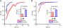
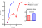
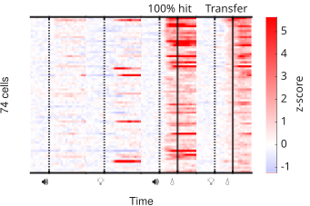
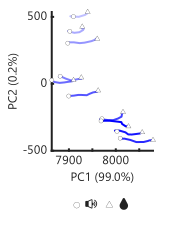
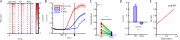
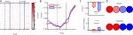
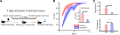

# 第3章 结果

文献中，迁移学习通常被定义为：先前学习对后续新任务或新情境中的学习和表现产生影响，这种影响可以是促进、干扰或接近于零（Thorndike & Woodworth, 1901；Perkins & Salomon, 1992/1994）。在动物研究里，经典描述不是笼统地说“学过一个任务后另一个任务更好”，而是更具体地看旧经验是否让动物在新任务上起点更高、达到标准更快，或学习曲线更陡（Harlow, 1949；Barnett & Ceci, 2002）。经典实验方法主要有三类：第一类是 learning set 范式，让动物连续解决一系列相似辨别问题，观察是否出现“学会如何学习”的加速（Harlow, 1949）；第二类是辨别迁移、反转学习和维度转换，保持部分规则不变、替换关键线索或奖惩关系，观察动物是否能把旧策略迁移到新问题上（Lawrence, 1949；Sutherland & Mackintosh, 1971）；第三类是更接近本文的跨模态或跨线索替换范式，即在反应要求基本不变时，把支配性提示从一种感觉线索换成另一种线索，检验旧任务经验是否节省新线索学习（Wylie, 1917）。空间学习中的平台换位或线索重排，也常被用来测量迁移与认知灵活性（Vorhees & Williams, 2006）。基于这一传统，本文把迁移学习具体限定为：学会A任务后，再学结构相近但提示模态不同的B任务时，动物是否比直接学习B任务更快。

每个训练会话的提示和奖励流程都由Arduino开发板编程的电子设备自动控制，没有人工操作。小鼠的头部被固定，可以看到LED给出的蓝光和压电有源蜂鸣器给出的声音，嘴前放置一根水管，可以用电控蠕动泵给出水滴供小鼠舔舐。这根金属水管还通过导线连接到一个电容传感器，能够将小鼠的舔水传感为电信号脉冲，经Arduino和USB串口传输到电脑被记录。

图3-1 迁移学习实验设计
>迁移学习由AB两个任务构成。先学会A任务，然后迁移到B任务。每个任务都分多个回合重复进行。一个回合内，先给200㎳的提示（声/光），提示开始后1s内如果有任何舔水行为则记为命中，否则记为错失。1s响应窗结束后给水15㎕。200㎳提示和1s响应窗同步开始，因此一共时长就是1s。

在一个训练回合中，小鼠必须在一个随机5~10s的冷静期内，持续没有舔水动作，才给出提示（声/光）；一旦这段时间内监测到任何一次舔舐事件，冷静期将被重置重新等待。这是为了防止小鼠记住固定的回合间时间间隔，从而不需要提示就能直接进行预判性舔水。类似的预反应 no-lick / delay epoch 设计，在头固定小鼠任务中本就是常用塑形手段，用于训练动物仅在响应提示后舔水，并在时间上分离感觉处理与动作输出；过早舔水通常会被记为 early lick 并触发短暂 timeout（Guo et al., 2014）。另一方面，动物与人都会利用提示前的时间结构形成 temporal preparation；若前导间隔固定，可预测的 foreperiod 本身就会成为一种时间线索，而将该间隔随机化则会增加时间不确定性、降低对固定时距的依赖（Bouton & García-Gutiérrez, 2006；Niemi & Näätänen, 1981）。因此，这里的随机冷静期并不只是技术性等待，而是为了让行为反应尽量由真实提示驱动，而不是由回合节律驱动。提示持续200㎳。从提示开始后的1s内为响应时间窗，这个窗口内如果记录到小鼠有任何舔水行为，记本回合为“命中”；若未舔，则记录为“错失”。响应窗结束后给水15㎕，然后等待固定20s。注意区分该实验不同于经典Go/NoGo设计：
- 响应窗的开始不等提示结束，即提示未结束时小鼠即可立即舔水命中
- 无论是否命中，总是在响应窗结束后给水。

因此小鼠实际上只需要学会：
- 没有提示时，抑制舔水冲动，保持冷静
- 给提示时，在1s内开始舔

训练回合连续重复30次为一个会话，每个会话间隔12h重复，直到某个会话30个回合全部命中时视为学会，进入下一阶段。
## 3.1 迁移比初始学得更快
首先进行纯行为学研究，确认迁移现象的存在。将鼠分两组，一组先学声音提示的舔水任务，另一组先学蓝光提示的舔水任务，学会后交换。这样一来，两组鼠互为对照，检测迁移加速现象是否对声水和光水两种任务都成立。

|分组|🔊💡组|💡🔊组|
|-|-|-|
|初始阶段|🔊💧|💡💧|
|初始过程|……|……|
|学会阶段|🔊💧100%|💡💧100%|
|迁移阶段|💡💧|🔊💧|
|迁移过程|……|……|
|最终阶段|💡💧100%|🔊💧100%|
表3-1 分组对照迁移日程
>🔊：声音提示；💡：光提示；💧：水奖励。两组鼠在初始阶段分别学声水和光水，学会后交换，在迁移阶段分别学光水和声水，直到最终100%学会
### 3.1.1 迁移学习整体表现上移，无论声水还是光水

图3-2 声水/光水的初始/迁移学习曲线和首会话命中率。
>无论声水还是光水，都能观察到迁移学习曲线相比于初始学习的整体上移，特别是更高的首会话命中率。（A）比较声水任务的初始/迁移学习曲线和首会话命中率。（B）比较光水任务的初始/迁移学习和首会话命中率。

结果发现，无论声水还是光水，都能看到迁移学习比初始学习更快，表现为首个会话和学习曲线整体都显著更高。这样就验证了当前实验设计能够复现前人所述的迁移学习更快的现象。

由于声水任务本身就学得很快，迁移过程也更加短暂，很多鼠1~2个会话就直接100%了，给后续分析迁移学习的中间过程带来诸多不便。已有文献对这一现象提供了一种可兼容的背景解释：虽然并没有公认结论说“小鼠一定对声音提示比对光提示更敏感”，但确有研究提示，在跨模态冲突条件下，小鼠的行为常表现出听觉对视觉的主导。Song等在头固定小鼠的视听辨别任务中报告，当视听信息冲突时，小鼠表现为“audition dominates vision”，即听觉主导视觉（Song et al., 2017）。同时，关于小鼠视觉系统的综述也指出，小鼠具有相对较低的视觉分辨率，因此视觉行为任务往往需要围绕其视觉能力专门设计和调参（Huberman & Niell, 2011）。据此，本文中声水任务较易学会、而光水初始学习相对更慢，是与已有感觉行为学背景相符的；不过这仍应被视为背景解释，而不是本文单独证明的因果结论。因此本文将着重研究光水任务的迁移，声水仅作参照补充。
### 3.1.2 首会话行为水平相同条件下，迁移学习增长斜率更大
本文关注的“迁移学习更快”并非止步于同阶段的命中率更高，因为后者更接近于已有反应在相似情境中的泛化；在经典迁移研究中，迁移通常还体现在先前经验使动物在后续相关任务中起点更高、问题解决更高效，或对新任务的习得更快，也就是学习曲线更陡、达到标准所需训练更少（Harlow, 1949；Howard, 2000；Barnett & Ceci, 2002）。

图3-3 线性控制掉首会话表现后，迁移学习的总体增长速率仍然更大
>线图：示意一只初始光水鼠和一只迁移光水鼠的学习曲线，它们首会话表现相同，但迁移光水鼠更快达到100%。条形图：线性排除首会话表现影响因素后，迁移鼠的增长斜率更大。

这样一来，迁移学习所谓的“更快”就被分解为了“首会话命中率高”和“后续增长更快”两个既区分又联系的指标。
## 3.2 初始学习的钙特征和组件解析
迁移的首会话命中率，或者说迁移学习的泛化性部分，更接近于测试既有感知-动作映射能否被新提示立即调用，而不是完全从头形成一套新规则。更具体地说，就是迁移提示无需重新训练，就有一定概率直接触发已建立的行为输出。要理解这种现象，必须先确认初始任务中所谓“学会”状态在操作层面究竟包含哪些组成部分。已有头固定小鼠延迟舔水范式表明，动物需要同时学会两件事：一是在提示前抑制过早舔水，二是在响应提示出现后及时执行舔水反应；也就是说，成熟行为本身就同时包含“等待/抑制”和“提示触发执行”两个成分（Guo et al., 2014; Li et al., 2015; Esmaeili et al., 2021）。

图3-4 静息态与动作态
>在提示前的5~10s冷静期内，小鼠必须抑制任何舔水冲动，否则冷静期会被重置，称为静息态。提示后，小鼠必须在1s内立即切换到动作态，给出舔水动作。
### 3.2.1 在体实时双光子钙成像

图3-2-1 初级运动皮层钙成像
>前人(Komiyama et al., 2010)通过逆向追踪和皮层微刺激实验确定了口舌相关的运动控制区，在该区域进行钙成像。鼠脑轮廓上的红点是Bregma点。（A）多只鼠光刺激实验发现的舌运动控制区。（B）电刺激实验发现的舌运动控制区。（C）从舌头进行狂犬病毒逆向追踪标记上的亚区。（D）从运动区到舌头的连接示意图。（E）将微刺激和逆向追踪结果包络，取交界点注射GCaMP6f病毒。（F）在小鼠初级运动皮层周围开窗，在任务训练过程中实时进行在体双光子钙成像拍摄视频。（G）一张示例的拍摄图面，手工圈出其中的细胞。

初级运动皮层（Primary Motor Cortex, MOp）是皮层运算网络的输出端。无论声还是光信号，都要经过这里转变为舌头的运动/不运动。从前人的刺激和追踪实验中可以得到一个合适的注射位点，注射GCaMP6f。然后在周围开颅窗，盖上玻璃，就可以在任务训练过程中实时进行在体双光子钙成像拍摄视频。拍摄的视频中可以手工圈出其中的细胞亮斑，通过一些配准算法处理后还能实现跨天追踪同一群细胞的长期变化。

图3-2-2 声水初始学习前后基本轮廓
>不同于纯行为，钙成像还在任何学习之前拍摄了只给提示和只给水的单纯效应。热图一行是同一个细胞，每一列内横轴是时间，四列分别是：只给声音、只给水、声水初始、声水学会。图上只挑出了至少在其中一列中活跃的细胞。

在初始阶段，声水的响应大致相当于纯声和纯光的简单叠加。而在声水学会后，细胞活跃的格局则发生了整体变化，体现了学习的影响。
### 3.2.2 提示刺激引发的状态切换

学习后同时包含两个彼此配合的过程：提示前对过早舔水的主动抑制，称“静息态”；以及提示后对舔水动作的快速启动，称“动作态”。已有研究表明，口面部感觉运动区的瞬时抑制与压制过早反应有关，而ALM等额叶前运动区在延迟期的持续活动则与后续舔水计划密切相关（Li et al., 2015; Esmaeili et al., 2021）。因此，声音提示并不只是一个被动感觉输入，而更像是将网络从“等待/抑制”推进到“执行/输出”的同步触发信号。

图3-6 状态切换的两种可能性
>（A）展示两个代表性状态切换细胞。学会后，提示信号迅速放大，导致状态切换，表现为静息态活跃细胞的衰退（右）和动作态活跃细胞的启动（左）。（B）展示两个代表性加速衰变细胞。学会后，静息态本身会自发向动作态衰变，提示信号起到推波助澜的作用。（C）AB两类细胞的总体占比。

据此，状态切换可以理解为两种并不互斥的可能机制。其一，提示输入经感觉-前运动通路被快速级联放大，迅速建立动作准备并解除原有抑制；其二，网络在等待期内本已存在朝动作输出方向的缓慢积累或自发漂移，而提示信号主要起到推动其越过执行阈值的作用。前者强调提示输入本身的瞬时放大，后者强调等待期内部已经存在的动态演化。现有文献已经支持“提示触发动作计划，并伴随对过早反应的主动抑制”这一总体框架，也支持运动皮层中存在与动作准备、动作起始相关的信号（Esmaeili et al., 2021; Sreenivasan et al., 2016）。从细胞数量占比上看，直接被提示信号反转的切换细胞占据主导地位，这说明静息态向动作态的切换主要不是靠自发衰变和时间预判，而是主要依赖提示信号的强力大规模同步激活。

不同于表观行为中的二元划分，神经网络中的“状态”并不是静止不变的点，而是由环路活动持续维持、并在时间上不断演化的群体动力学。已有研究指出，皮层活动即使在安静或等待阶段也呈现持续的时空流动，只是这种流动并非完全无序，而是受到少数低维动力学模式的约束；在与延迟反应相关的前运动皮层中，动作准备信号同样表现为低维且单调推进的群体活动（Inagaki et al., 2018; MacDowell & Buschman, 2020; Svoboda & Li, 2018）。因此，在本实验随机化的等待时程下，提示信号到来时网络虽然可能落在静息态轨迹上的不同位置，但这些差异更适合理解为同一动态过程中的不同瞬时截面，而不是彼此孤立的离散静止状态。

图3-7 状态切换对全局状态空间的影响
>用主成分分析展示所有细胞构成的状态空间（声水学会阶段），在不同回合的起始时点（声音输入）和结束时点（给水，响应窗结束）在状态空间中的位置。每条线颜色渐变表示回合顺序，浅色表示早期回合。未作归一化，分析的是原始信号值。

这个问题可以通过比较多回合在0s与1s时刻的状态空间位置来判定。实测发现，提示输入时的起始网络状态确实存在较大范围的漂移；但是，无论起点如何，提示到来后网络都在1s内沿着大致相近的方向发生偏移，而这一偏移的离散程度明显小于起点本身的分散度。结合前述关于低维准备活动和皮层时空动力学的研究，这一结果更符合如下解释：提示信号并不是简单把网络拉向某一个固定终点，而是在当时的基线状态之上施加一个方向相对稳定的驱动，使群体活动快速进入与动作输出相容的轨迹区间。

综上，初始声水学会后，从静息的舔水克制状态切换到舔水动作态，其关键更可能在于提示信号被迅速放大后，对持续漂移的静息网络叠加了一个方向明确的驱动分量。这个驱动既不要求所有回合都从同一个起点出发，也不要求钙状态格局在提示后收敛到某一个严格固定的终点；它更像是在不同瞬时背景上都能发挥作用的稳定推进信号，使网络进入足以支持真实舔水输出的动作相关轨迹。由此看，实验结果更倾向于“提示输入主导状态切换、内部漂移提供背景条件”的解释，而非“网络先自发逼近动作态、提示只在末端推波助澜”的模型。
## 3.3 迁移学习首会话更高命中的机制
### 3.3.1 旧群体的重激活
这是迁移学习中最接近泛化的部分。现有记忆痕迹研究并不把泛化简单归结为单一机制，但普遍承认，后续相似线索能够通过再激活既有痕迹中的部分神经元群，引发对旧经验的提取；而不同经验之间若在细胞集合层面存在更高重叠，也更容易表现出记忆联结、信息迁移或泛化（Josselyn & Tonegawa, 2020）。进一步地，关于泛化与辨别的研究还提示，支持广义化与支持精细区分的并不是完全相同的神经元群，其中偏向 generalization 的细胞集合更容易在相似情境下被再次调用（Sun et al., 2020; Nambu et al., 2022）。据此，若声水学会后形成的感知-动作表征在光水首会话中被更大程度地重新调用，那么迁移阶段出现更高命中率就是可以预期的。

图3-3-1 迁移学习的细胞重激活
>用提示前3s作为基线，z-score在1s处超过基线均值+3倍标准差的细胞作为“活跃”细胞。（A）热图展示声水学会、光水迁移命中/错失三种条件下任何一个活跃的细胞。（B）取声水学会阶段活跃的细胞，比较它们在迁移光水命中/错失条件下的钙曲线，阴影表示±SEM。（C）以鼠为单位，配对比较迁移命中/错失回合的重激活率。（D）取声水学会阶段活跃的细胞，比较命中/错失回合的 1s z-score。（E）将每只鼠迁移光水时的重激活率和命中率做成散点，计算Spearman相关性。

实测发现，迁移命中的回合，相比于错失，的确表现出更接近声水学会阶段的细胞激活格局。声水学会阶段活跃的细胞，在迁移命中回合中被重新激活的概率更高、激活强度也更大；在鼠间比较中，重激活率更高的个体也具有更高的迁移命中率，两者呈显著相关。这个结果说明，本任务中迁移首会话的高命中并非随机波动，而是与既有声水表征在新提示条件下被重新调用密切相关。换言之，迁移阶段的优势首先体现为旧任务相关细胞集合在新线索驱动下仍可被部分保留和再利用，这一点与泛化研究中“相似线索诱发重叠表征再表达”的基本框架是一致的。
### 3.3.2 迁移与初始的细胞层差异
但是，以上分析并未考察迁移光水相比于初始光水究竟有何实质性差异。上述的分析方法不能应用于初始光水，因为“初始”的光水没有一个预训任务的参考活跃模式可用来计算“重激活”。必须找到一个起中介作用的神经指标，其自身能够同时应用于迁移和初始，同时又和重激活率相关，且能被重激活直观解释。

最简单的猜想是总体活跃强度/活跃细胞占比这一类粗糙指标。这些指标逻辑上也非常合理，因为3.2.2中已确认提示诱发状态切换的关键是新信号本身的强力激活，而非对内部自发状态的促进。而3.3.1中所述的重激活效应正好可以解释为为迁移的光信号预埋了一批高度活跃的细胞，促成其对新提示信号的强力激活。

图3-3-2 迁移与初始光水的总体活跃度
>（A）热图展示初始/迁移的全局响应模式。（B）线图比较初始/迁移的全细胞平均曲线。（C）上：比较初始/迁移的 1s z-score。下：比较初始/迁移鼠的活跃细胞占比。（D）图示初始/迁移的细胞活跃格局。

然而事实并非如此简单。实际统计下来，初始和迁移光水全细胞总体响应强度并无显著差异，平均钙曲线基本重合一致。但是，统计 1s z-score 和活跃细胞占比却出现了看似冲突的结果。这说明，简单地用一句总体活跃度描述初始/迁移的差异是不可行的。但是，如果综合考虑之前的“细胞复用”结论和兴奋抑制平衡机制，这样的结果就能说得通了。因为细胞复用虽然导致活跃细胞占比增加，但兴奋抑制平衡将这种增加转换为了更强的抑制信号，导致平均活动强度反而不变甚至下降。于是从整体上看，迁移与初始的核心差异表现为“响应异质性”，即不同细胞群体之间的分化程度。这一思路与已有运动皮层学习研究并不矛盾。Komiyama等在小鼠MOp 2/3层成像中发现，学习并不只是把全部细胞一同抬高，而是使功能相近细胞对之间的相关活动在会话内和跨会话都进一步增强，从而表现为更细尺度、更具专门性的群体组织（Komiyama et al., 2010）。因此，若迁移学习优先增强的是特定细胞群之间的分工与协同，而不是无差别提高全部细胞的平均亮度，那么“总体均值变化不大，但细胞间分化加深”本身就是合理且与前人一致的结果。

无论“迁移学习的首会话表现更好”还是“泛化”，都可以理解为“一开始就处于更接近学会的状态”的含义。除了具体的行为，“学会”和“未学会”之间还有什么更抽象更普遍的差异呢？那就是稳定性。动物对学会的任务总是能稳定给出相同的响应，而对未学会的任务响应则通常不稳定，时而正确时而错误。这种稳定性和前述响应异质性、分化程度等说法完全兼容，因为图3-3-2的统计都是基于回合间平均信号的。在数学统计上，回合间稳定的信号差异格局，才能在回合间平均之后仍然保持差异；如果不稳定，则平均后则会导致细胞间趋于一致。已有运动学习文献也支持“学会”伴随着回合间神经活动变得更一致这一点。Makino等用宽场和双光子成像追踪小鼠数周运动学习，发现随着学习推进，跨皮层模块的时序活动不仅变得更加紧凑，而且其 trial-by-trial variability 明显下降，M2群体活动也出现更早起始和更低变异（Makino et al., 2017）。Hwang等进一步在小鼠M1 2/3层显示，随训练从早期进入中期，任务表现和运动学刻板性提升的同时，群体活动的 trial-to-trial correlation 也显著升高，说明同类成功动作越来越依赖被重复招募的相近群体轨迹（Hwang et al., 2019）。因此，本文把迁移优势进一步理解为“更稳定地进入正确群体状态”，并不是对行为结果的简单同义改写，而是与已有运动皮层学习研究中“学习伴随回合间变异下降、群体轨迹一致性上升”的现象相一致。

图3-3-3 迁移的回合间稳定性
>（A）代表性示意稳定性与平均的关系。迁移光水会话中的细胞，继承了其在声水学会会话中的稳定活跃，平均后保持其活跃特征。而在初始光水会话中，回合间响应不稳定，平均后变得中庸。（B）示意使用8㎐振荡镜头实现对MOp2/5层的伪同步拍摄。（C）分2/5层比较初始/迁移光水的 1s z-score 散度。（D）分2/5层比较初始/迁移光水的散度与首会话命中率的鼠间差异相关性。（E）分2/5层比较迁移光水的散度与重激活率的鼠间差异相关性。

实测发现MOp2/5层对此表现出功能分化。在拍摄过程中使用8㎐的震荡发生器令镜头上下振动，可以实现对两层的伪同步拍摄。结果发现，迁移光水的PCA状态空间航迹，在回合间比初始光水更稳定一致。这种特性可以用相对散度衡量，散度的算法是：细胞×回合的 1s z-score 矩阵，先计算回合间方差，得到关于细胞的方差向量；再计算细胞间平均，得到一个均方差，反映了1s处不同回合之间状态的绝对散度。然后再算原矩阵的回合间均值，作为所有回合1s处的平均状态，用绝对散度的平方根除以平均状态到原点的距离，就得到了相对散度。这里相对散度越小，表示各回合围绕同一平均状态聚拢得越紧，也就意味着提示后网络进入动作相关轨迹的方式越稳定。Gallego等在跨天记录灵长类PMd、M1和S1时进一步指出，稳定行为真正对应的并不是每个单细胞都维持不变，而是低维 latent dynamics 在重复执行同一行为时仍保持稳定；即使单细胞记录会漂移，群体轨迹本身仍可高度一致（Gallego et al., 2020）。因此，本文用PCA状态空间航迹和相对散度来刻画迁移与初始的差异，在概念上也是与当前群体动力学分析框架一致的。计算结果是，2/3层的相对散度，迁移组显著低于初始；5层则无显著差异。但是，首会话命中率的鼠间差异却相关于5层而非2/3层。这说明，声水任务的记忆更多地存储在2/3层而非5层，在光水任务中发挥稳定器的指导作用；但是，这种记忆能否真的被成功提取转化成命中率，则还取决于5层的先天鼠间差异。这个解释虽然是本文基于当前任务提出的，但并非完全没有旁证。已有层特异性研究也反复提示，浅层与深层在学习和感觉引导行为中本就可能承担不同角色。Masamizu等在小鼠运动学习中发现，2/3层群体更像是在学习过程中维持并协调来自其他脑区的信息，而5a层则随训练推进越来越明显地参与熟练动作表征（Masamizu et al., 2014）。Heindorf等进一步发现，在未预期视觉反馈引导的行为修正中，2/3层更早、更普遍地响应感觉扰动，而5层锥体束输出神经元的活动则更直接预测后续行为反应幅度，并且在学习后表现出更高稳定性（Heindorf et al., 2018）。因此，本文这里把2/3层更偏向解释为与旧任务结构稳定复用有关、而把5层更偏向解释为与最终行为转化和个体表现差异有关，至少在方向上是与既有层分工文献相容的。最后，散度与重激活率的鼠间差异呈显著负相关，说明声水细胞的重激活确确实实贡献到了迁移会话中的回合间稳定响应性中。
### 3.3.3 重激活与散度的因果性证据
为了尝试对重激活与散度的作用提供因果性支持，进行了“cFos抑制”和“等7天”两种方式的操纵。

cFos是一种常用来报告近期神经活动的即早基因，在活动依赖标记研究中经常被用来为“某一时间窗内被任务招募的细胞”提供遗传操作入口。Guenthner等建立的TRAP策略表明，只要将$cFos$或$Arc$等即早基因位点与$Cre^{ER}$耦合，再在给定时间窗提供Tamoxifen或4-OHT，就可以把该时间窗内活跃的细胞永久接入后续的Cre依赖效应器表达；而且这种做法不仅能标记感觉刺激诱发的细胞，也能标记复杂经验中被招募的细胞（Guenthner et al., 2013）。因此，将$cFos-Cre^{ER}$与MOp内的pAAV-hSyn-DIO-hM4D(Gi)-mCherry联用，在原理上正是把“声水学会时被招募的细胞”转化为后续可抑制的特定细胞群。$Cre^{ER}$平时位于细胞质中，结合Tamoxifen（TM）后进入细胞核并介导DIO翻转，于是活跃细胞开始表达hM4D(Gi)-mCherry；其中hM4D(Gi)与CNO结合后可在数小时尺度内降低这些细胞的兴奋性，mCherry则用于报告表达位置和水平。

图3-3-4 cFos标记抑制声水学会时活跃的细胞
>（A）示意cFos标记抑制实验。在$cFos-Cre^{ER}$基因型小鼠的MOp脑区注射pAAV-hSyn-DIO-hM4D(Gi)-mCherry病毒。声水学会后，注射TM玉米油溶液，等待24小时的药代动力学过程，再次进行声水训练，就可以将声水任务中活跃的细胞进行“cFos标记”。被标记的细胞需要7天才能完成hM4D(Gi)-mCherry的表达积累。7天后进行迁移到光水的训练，但训练前一小时注射CNO以启动hM4D(Gi)的抑制效果。这样一来，在光水训练过程中，之前声水任务中活跃的细胞处于抑制状态，阻止了重激活。对照组则是在TM注射24小时候不进行标记训练。（B）mCherry报告的cFos标记抑制细胞分布。（C）行为学效果，抑制组行为曲线整体下移。（D）不做cFos标记，直接MOp注射广谱hM4D(Gi)，相比于荧光对照的抑制效果。

这样一来，可以在声水学会后，将声水任务中活跃的细胞特异性地标记上，然后在迁移任务中将它们抑制，使得光信号无法或难以重激活声水任务中活跃的细胞。其结果就是学习曲线的整体下移。这里的关键并不只是“能标记”，而是“被标记的活跃细胞群后来可以被选择性抑制，并因而改变行为输出”。这一点在既往文献中已有明确先例：Koya等利用$cFos$驱动的Daun02失活方法，选择性抑制先前被可卡因配对情境激活的伏隔核稀疏细胞群后，情境特异性的行为敏化随之减弱，说明这类由即早基因定义的活跃细胞群对后续行为表达具有因果作用（Koya et al., 2009）；而在记忆印迹研究中，Liu等进一步证明，学习时被$cFos$时间窗标记的海马稀疏细胞群后来被人工重激活时，足以诱发相应记忆的行为表达，说明同一类“活动依赖标记后再操作”的实验逻辑确实能够抓住与经验表征相关的细胞集合（Liu et al., 2012）。因此，本文的cFos抑制实验虽然针对的是迁移学习而非经典恐惧记忆，但其方法学逻辑与因果推断路径并不是孤立的。如果不做特异性标记，广谱抑制MOp所有神经元，则无明显效应，说明操纵的特异性是必需的，也符合前述初始/迁移的整体活跃度无差异的结论：迁移的行为更高并不是因为非特异的整体活跃度上升造成的。

图3-3-5 等7天遗忘后的迁移
>（A）示意等7天遗忘实验。声水学会后，不立即迁移，而是放假7天，经过遗忘后再迁移到光水任务。（B）7天遗忘后，相比于立即迁移的学习曲线和首会话命中率比较。（C）7天遗忘后的重激活率和散度，相比于立即迁移学习。

细胞层面的操纵存在一个潜在问题：是否抑制的是非特异性的“学习新事物”的基础能力，而不是仅仅针对光水任务从声水任务中复用知识的能力？为此设计了另一个“等7天”的遗忘实验。在声水学会后，不立即迁移，而是先放假7天，经过一定程度的遗忘后，再进行迁移。这种等待7天的操纵，相比于小鼠一生的时间尺度来说，没有理由相信它会显著影响小鼠的全局基底学习能力：这样一来，观察到的任何行为学差异，都更可能是特异性针对迁移的。在经典的场景恐惧泛化实验中，延长保持间隔通常会使记忆从“精确区分原情境”转向“对相似情境也作出反应”。Wiltgen和Silva让小鼠在训练后1、14、28、36天测试，发现对新情境的冻结随时间系统升高，而区分比则随时间下降，说明记忆会随着时间流逝而失去部分精确性、表现出更强的泛化（Wiltgen & Silva, 2007）。因此，从经典文献看，等待数天之后再测试，常见方向确实是“更泛化”。但在本任务中表现出的效应却是相反的，7天遗忘后，迁移学习的首会话表现显著下降，之前确认的重激活率和散度也产生了相应的显著差异。这说明本实验中的迁移首会话命中率，虽然在概念上与经典场景恐惧泛化都涉及“旧经验是否还能支持新情境表现”，但其所依赖的并不是同一种任务结构。本任务要求动物把先前形成的动作准备和提示响应网络重新投射到一种新的感觉通道上；如果等待7天削弱的是可被光提示重新唤起的那部分声水相关网络，那么行为就可能下降而不是升高。换言之，时间间隔对后续表现的影响方向，并不由“时间更久”这一点单独决定，而取决于新任务究竟是在读取旧记忆的精确细节，还是在借用旧网络去支撑跨模态复用。
### 3.3.4 小结

图3-3-6 细胞复用与散度模型小结
>初始学习中，回合间细胞活动不稳定，命中率低。声水学会后，部分高活跃细胞可以被光信号重激活，这些细胞保持着声水任务学会状态的回合间稳定性，进一步通过兴奋抑制平衡等机制压低了状态空间中的相对散度。

综上，迁移学习首会话高命中的核心机制，就是预训声水任务中稳定活跃的细胞，有一部分能够被光信号强烈重激活。以这些重激活细胞为核心的兴奋网络能够在整体活跃度大致不变的情况下，压低回合间的不稳定性。虽然原则上稳定并不等于正确，但促使这种稳定的细胞恰恰在舔水这一行为导向上是完全一致的，因此这种稳定性也同样具有正确的方向。“稳定”与“正确”的有机结合，使得迁移学习一开始就处于一种更接近学会的状态，表现为行为上的命中率更高。
## 3.4 迁移学习的高增长机制解析
学习曲线一般不是一条直线，每一段的斜率与该段起点所在的高度相关。此处说迁移学习的斜率更大，是通过线性模型排除了起点高度效应后，仍然残留的斜率更大。也就是说，即使是在行为表现相同水平上，迁移学习仍然预期下一个会话会比初始学习提升更大。这是怎么回事呢？

全局的突触可塑性，在本迁移任务持续最多不超过一个月的时间尺度上，应当可以近似看作稳定背景量，也没有证据显示单次声水预训就足以把整个脑区的“可塑性上限”整体抬高。与其把迁移学习的更大斜率理解为网络突然获得了更强的普遍重塑能力，已有文献更支持另一种解释：学习速度更大程度上取决于后续神经活动更新，是否能够落在既有群体结构允许、并且与任务目标一致的方向上。Sadtler等在脑机接口任务中发现，动物更容易学会位于既有内在流形内的活动模式，而明显偏离该流形的模式则更难在数小时尺度内掌握，说明既有环路结构本身就在约束“哪些方向容易学”（Sadtler et al., 2014）。Golub等进一步指出，短时学习往往不是凭空生成全新的群体模式，而更像是对原有活动模式库进行重新关联；也就是说，学习更快并不一定意味着每一步改变量更大，而可能只是每一步都更有效地投射到了行为相关维度上（Golub et al., 2018）。Hennig等也观察到，运动皮层中与唤醒样内状态相关的群体活动波动本身是相当刻板的，但它们对不同任务目标的帮助程度并不相同，因此能够系统性预测不同目标的学习快慢；这同样说明，决定学习速度的关键并不是有没有变化，而是变化是否沿着有利于任务的方向展开（Hennig et al., 2021）。因此，对本实验而言，迁移学习斜率更大的更合理解释，不是“每一步更用力”，而是“每一步更对路”。

图3-4-1 迁移学习走直线，不绕路
>（A）展示初始/迁移各一个代表性细胞，在其学习过程的各会话中的活动变化和对应行为表现。（B）展示迁移组和初始组各一只代表性鼠的学习过程。一个点是该鼠一个会话的 1s z-score 在PCA空间中的位置，用实线连接表示真实的学习过程路径。虚线表示理论最优的直线学习方向和距离。（C）实际学习路程与最短学习距离的比值，分2/5层比较初始/迁移学习组的每只鼠。比值越大表示越“绕路”。（D）实际学习路程的平均每步步长，分2/5层比较初始/迁移学习组的每只鼠，反映非特异性的基本学习能力。（E）平均每步在最优方向上的投影长度，反映特异性的正确学习能力。

PCA分析发现，迁移学习过程的确比初始学习过程在状态空间中更少走弯路，更能够朝着一个稳定的正确方向不断前进。这种解释与已有群体动力学研究是相容的：在小鼠前外侧运动皮层，动作准备活动本身就呈现低维、单调推进且编码方向稳定的特征，说明与行为准备相关的群体活动并不是在高维空间中任意漂移，而是沿少数主导方向组织起来（Inagaki et al., 2018）。如果迁移把声水任务中已经形成的部分活动组织方式直接借给了光水学习，那么单细胞层面就会表现为更多细胞随学习会话推进而单调增/减，群体层面则表现为学习轨迹更接近终点连线；相反，初始学习由于尚未形成这种可直接调用的组织结构，更容易出现增减反复和方向摇摆。

可以通过一系列计算指标反映这一差异，例如用实际在状态空间中划过的总路程除以起点和终点的连线距离，衡量“兜了多少弯路”，结果发现迁移学习在状态空间中的的路程/距离比确实更小，但只有5层显著。也可以计算每个会话实际上在最优方向上投影长度平均走了多远，衡量真正有效的学习进步——结果发现迁移学习的有效投影步长也确实更大，但只有2/3层显著。最后，可以计算总路程与会话步数之比，确认迁移的更快学习是否有其本身每步的实际步长因素影响，结果发现无显著差异。这些检验指向的共同结论是，迁移学习的更大斜率，并不是因为每一步都走得更远，而是因为每一步都更对路，更有效地投射到了正确的方向上，兜圈绕弯更少；而初始学习虽然也在前进，但由于缺乏可直接调用的组织结构，更容易出现增减反复和方向摇摆，导致斜率更小，学习进程缓慢。
### 3.4.1 迁移与初始的响应异质性
状态空间追踪方法，只是将迁移学习增长更快的现象，与钙信号的表征对应了起来，这种对应关系本身是“马后炮”的，并不构成对原因的解释。虽然本实验没有直接对突触强度进行测量，但从原理上说，由于生物神经网络并不像机器学习那样存在一个专门的“反向传播”过程，因此学习方向实际上只是由活跃状态决定的，所以研究活跃状态的变化就可以间接研究学习方向的变化。由于兴奋抑制平衡效应，一个“正确”的学习方向，一定是会给每个细胞分配一个“兴奋”或是“抑制”的角色。那么，要朝着正确的方向前进，兴奋的细胞就应该单调性地越来越兴奋，抑制的细胞就应该单调性地越来越抑制。这个过程越顺畅，学习就应该越快；相反，如果有大量细胞角色不明朗，时而兴奋时而抑制，学习方向也就不明确，就会缓慢。进一步，由于钙信号对兴奋/抑制呈积累效应，角色明朗的细胞亮度会稳定增长或衰退，而角色不明的细胞亮度则会在0附近震荡。因此，可以用细胞间标准差，或称响应异质性，衡量学习方向的明确稳定一致性。注意这里不可以用前述相对散度计算，因为散度衡量的是状态本身的稳定性，但学习过程需要的不是稳定状态，而是变化方向的稳定明确，两者之间差了一阶导数。已有群体动力学研究也支持把这里的“学习方向”具体理解为群体活动朝有利于任务输出的准备态持续重排。Vyas等在运动迁移范式中发现，隐性练习之所以能够迁移到显性表现，是因为两种情境共享相同的运动准备初始条件，而练习会系统性地重排这一准备态的群体活动（Vyas et al., 2018）。

这种“响应异质性”对学习速度影响的理论在机器学习中也有阐述。例如，深度网络训练之所以依赖随机初始化，一个基本原因就是需要打破不同隐藏单元之间过度对称的初始状态；Glorot和Bengio指出，不合适的初始化会使深层网络训练进入长平台并显著拖慢收敛，而改进初始化后收敛会明显加快（Glorot & Bengio, 2010）。Saxe等对深线性网络学习动力学的解析也表明，不同初始条件会系统性影响学习延迟和收敛速度（Saxe et al., 2014）。而在神经系统的运动学习研究中也能找到更直接的对应。Peters等在小鼠运动皮层双光子成像中发现，学习初期兴奋性细胞会探索多种活动模式；随着学习推进，这些活动逐渐收敛为较小但更可重复的细胞群，并形成与熟练动作对应的可重复时空序列（Peters et al., 2014）。Makino等进一步发现，随着运动学习推进，跨皮层活动时序更加紧凑，trial-by-trial variability下降（Makino et al., 2017）；Hwang等则指出，达到更高熟练度的动作具有更高的trial-to-trial consistency，并伴随不同性质的群体参与模式（Hwang et al., 2021）。因此，若一个学习过程中的许多细胞长期停留在0附近上下摇摆，说明群体尚未分化出稳定的正负响应角色，网络每一步更新的方向就更容易反复；相反，若更多细胞逐步向正、负两个方向分化，并在会话间保持这种分化，群体活动就更可能沿着相对固定的方向持续推进。也就是说，这里的响应异质性并不是凭空引入的新概念，而是试图用一个可计算指标去刻画群体活动是否已经从“普遍摇摆”转入“分工拉开、方向明确”的状态。

图3-4-2 迁移与初始的响应异质性
>（A）用一个代表性会话直观展示响应异质性。下方是细胞×时间×回合的3D热图，可以看到细胞维度上两端分成两个极端。上方是分布直方图，切取 1s z-score 的回合间均值，计算每个均值段内的细胞占比，最终计算出响应异质性指标（即细胞间标准差）。只包含[-1,1]之间的温和响应细胞，排除极端细胞和鼠间总体活跃基线的影响。（B）分2/5层列出每只鼠的响应异质性与学习斜率的相关性，不同颜色点区分初始/迁移组。一只鼠的响应异质性是先将该鼠所有会话平均后再计算异质性。（C）分2/5层比较初始光水、迁移光水和学会声水的响应异质性。（D）初始/迁移光水各一个代表性会话直观展示响应异质性差异。（E）迁移光水与学会声水两会话之间的响应异质性分化梯度相关性。中间散点是每个细胞再光水、声水两个会话中的z-score。将其按声水会话中是正响应还是负响应，分为左右两群，比较它们在光水会话中的z-score，得到上方条形图。同理，按光水会话中是正响应还是负响应，分为上下两群，比较它们在声水会话中的z-score，得到右侧条形图。（F）响应异质性与图3-4-1中路程/距离比的相关性。

细胞层面上，“响应异质性大”意味着在0附近波动的细胞较少，群体倾向于向正负两个方向极化。为了排除极端细胞个体，以及不同鼠之间总体活跃基线的干扰，在计算细胞间标准差之前排除z-score均值在[-1,1]范围之外的细胞。计算结果再次发现2/5层的差异性：鼠间学习斜率的先天差异能够被2/3层而非5层的响应异质性所相关解释，但初始/迁移之间的响应异质性差异却体现在5层而非2/3层。这种响应异质性的2/5层分化模式与之前散度的分化模式刚好相反，说明2/5层倾向于以不同的方式编码或复用声水任务留下的架构：2/3层关注少数高活跃细胞的重激活来降低回合间散度，提高记忆提取率；而5层关注群体异质性的分化梯度，提高学习速率。已有深层输出通路研究也可为这一点提供旁证。Oswald等指出，小鼠M1的5层投射神经元并不是单一均质群体，而至少可分为多种在形态学、电生理特性和亚层位置上都彼此不同的表型（Oswald et al., 2013）；Currie等进一步发现，5B层与动作类型相关的特异性信号并不是均匀分布于全部神经元，而是主要由分散的小亚群分别承载，且IT与PT两类投射神经元在特异性比例和出现时序上都不相同（Currie et al., 2022）。因此，如果本文观察到迁移相关的响应异质性主要体现于5层，那么把它理解为深层不同输出亚群被差异性招募、从而拉开群体分化梯度，在概念上也是与既有文献相容的。响应异质性的分化梯度方向也和声水学会任务显著相关：高活动的群体和低活动的群体大方向基本都是一致的。最后，结合之前所说的迁移学习更少绕路的结论，响应异质性与路程/距离比的相关性也确实显著为负，说明响应异质性的分化程度越高，学习过程就越直接朝着正确方向前进，行进效率高而不会在状态空间中有大量折返。
### 3.4.2 响应异质性依赖丘脑
温和活动群体的响应异质性，是一个无法用cFos等常规活动依赖的标记手段直接操纵的特征。考虑迁移的高异质性主要来源于5层，或许可以从其上游入手。丘脑（Thalamus，TH）就是一个非常合理的入口。既有研究表明，后部感觉相关丘脑并不只是被动中继，而是感觉上行信息与皮层下行运动信号汇合的高阶节点；以PO为代表的后丘脑一方面接收脑干感觉输入，另一方面也接收来自5层皮层下行通路的侧支，并同时支配感觉皮层和运动皮层，因此天然适合充当SS与MO之间的调控枢纽（Hooks et al., 2013; Casas-Torremocha et al., 2017; Casas-Torremocha et al., 2019）。更具体地说，Hooks等在小鼠运动皮层的回路测绘中发现，来自后部感觉相关丘脑、包括POm在内的丘脑输入对M1呈明显层特异性投射，优先作用于L2/3和L5A等上层与浅深交界群体，而不同于前部运动相关丘脑更广泛覆盖至L5B的模式（Hooks et al., 2013）。另有工作进一步表明，丘脑到运动皮层的输入不仅能改变皮层响应性，还能直接影响动作起始时机：PO轴突激活或失活会重塑运动皮层对感觉事件的响应幅度与后续状态（Casas-Torremocha et al., 2017; Casas-Torremocha et al., 2019），而运动丘脑到前运动皮层的输入被抑制时，感觉诱发动作的反应时会延迟，激活时则可缩短反应时并提高动作释放概率（Takahashi et al., 2021）。因此，以PO为中心的TH后端区域作为上游操作入口，并不是泛泛地“抑制丘脑”，而是有回路结构依据地去干预一个能够把感觉历史、皮层状态和运动输出准备连接起来的关键节点。

图3-4-3 TH抑制影响学习速度和响应异质性
>（A）TH抑制示意图。实验组注射hSyn-hM4D(Gi)，对照组注射荧光对照病毒。在迁移学习全阶段，每个会话前1小时注射CNO，抑制TH。钙信号仍然观察MOp2/5层。（B）TH表达示例。（C）TH抑制和对照组各取一个代表性会话的3D热图和 1s z-score 分布直方图，展示响应异质性差异。（D）TH抑制和对照组的学习曲线和首会话命中率比较。（E）分2/5层比较响应异质性和学习斜率的相关性，不同颜色的点区分TH抑制和对照组。（F）示意ΔHit计算方式，即学习曲线上相邻两个会话的差值。（G）比较TH抑制和对照组的ΔHit和MOp5响应异质性。

本文着眼于以PO亚区为中心的TH后端区域，注射hSyn-hM4D(Gi)病毒进行广泛抑制，并观察了对行为和MOp钙信号的影响。结果发现，TH抑制确实能有效降低迁移学习的行为进展（会话步长）和5层而非2/3层的响应异质性。学习斜率和响应异质性的鼠间差异仅在2/3层而非5层显著相关。这些结论和3.4.1保持一致，也因此把本文任务中TH调控的主要效应层位进一步定位到了5层。这个结果表面上看与前述“PO输入更偏向L2/3和L5A”的文献结论并不完全一致，但两者并不矛盾，因为文献描述的是后丘脑进入MOp局部回路的直接输入偏好，而本文测到的是广泛抑制以PO为中心的TH后，最终在MOp网络中最显著受影响的群体层位；前者对应输入入口，后者对应网络级结果。换言之，后丘脑输入完全可能先作用于上层与L5A局部网络，再经由皮层内跨层传播与深层输出回路耦合，最终主要表现为5层响应异质性的下降。结合上述回路文献，本文结果至少说明TH，尤其是以PO为中心的后部丘脑输入，虽然未必主要以单突触形式直接支配全部MOp5神经元，却是维持MOp5层响应异质性的关键上游来源，并且这种上游调控能够实际影响迁移学习的速度。

综上，迁移学习能够在起点相同的情况下仍然比初始学习有更高的增长，得益于其预训任务保留下来的细胞分化梯度架构，并且依赖TH的调控输入。
## 3.5 RSP的上游转发
之前选择MOp作为主要观察中心，是因为它是声水/光水两种任务逻辑上应当共享的输出端，能够直接反映迁移学习的核心机制。但是，也有研究认为记忆表征并不局限于单一脑区，而会表现出跨脑区的分布式网络特征；与此同时，新皮层不同区域虽然共享某些基本回路主题，却仍存在明显的区域化改造，因此不同脑区在迁移学习中的功能差异不能从逻辑上直接推定，也不能被“同质皮层”一语简单抹平（Brodt & Gais, 2021; Harris & Shepherd, 2015）。为此，本文对RSP这一位于视觉皮层与运动皮层之间的候选中继脑区进行考察，看它是否更偏向于作为视觉模态特异的上游通路，而不是泛泛地承担分布式存储中的同等核心作用。另一方面，既往综述也指出，RSP长期被认为参与情景记忆、导航、想象与未来规划等功能，但其精确功能边界始终难以单一定义；较新的观点更倾向于将其视为整合感觉、运动与空间信息的节点，而非单一功能模块（Vann et al., 2009; Alexander et al., 2023）。再考虑到RSP与海马系统联系紧密，并可能在情境识别线索或行为相关线索的编码中承担相对特殊的作用（Smith et al., 2012），因此它在本任务中的角色一开始就不能被预设为“纯视觉转发”或“广义记忆中枢”中的任何一端。

图3-5-1 RSP中介了MO和VIS
>（A）RSP在小鼠大脑中的位置示意图。RSP位于视觉皮层和运动皮层之间，且与两者都有直接接壤。（B）热图展示RSP在声水学会、迁移光水命中/错失时的响应架构，只取了至少在其中一列中活跃的细胞。（C）取RSP和MOp中的正向活跃细胞，比较它们对光信号的响应强度和启动时间。（D）计算RSP声水活跃细胞的重激活率与迁移首会话命中率的相关性。（E）比较迁移命中/错失回合中，声水活跃细胞重激活率的差异。（F）比较声水活跃细胞在声水学会、迁移命中/错失三种条件下的平均钙曲线。（G）示意RSP化学抑制实验。在双侧RSP注射hSyn-hM4D(Gi)病毒，在迁移学习全阶段每个会话前1小时注射CNO，抑制RSP。对照组注射mCherry荧光对照病毒。（H）RSP抑制病毒表达示意。（I）RSP抑制和对照组的学习曲线。额外加上RSP和MO共同抑制的学习曲线。

从皮层拓扑上看，RSP的确处在视觉和运动之间，适合作为候选中继脑区。实测发现RSP对视觉信号的响应显著强于听觉，并且对命中/错失不作明显区分；其对光信号的启动也早于MOp。这一结果与既往对RSP的认识基本一致：RSP并不只是被动接受空间信息，而是能够较快编码视觉线索、轨迹和奖赏位置等对行为具有指向意义的信息，因此有条件充当将视觉相关信息向下游行为系统转发的节点（Vedder et al., 2017; Alexander et al., 2023）。但是，首会话命中率与声水活跃细胞重激活率的鼠间差异并不显著相关；命中/错失回合中的重激活率虽有轻微差异，但总体活动强度差异不大，甚至方向相反。更关键的是，RSP抑制实验未表现出明确阳性结果：RSP抑制组的迁移学习曲线与对照组没有显著差异，甚至略好；而RSP和MO共同抑制的曲线也没有明显比单独MO抑制更差。因而，本研究更倾向于认为，RSP在本任务中确实承担了偏视觉模态的上游信息整合作用，但它并不是驱动迁移学习成绩变化的核心瓶颈。换言之，RSP在这里更像是一个对视觉线索较敏感的辅助通路，而不是决定学习迁移成败的主导位点。 

这个结果的启示并非在于完全否定了记忆在皮层中分布式存储的理论，而是提示“分布式”与“专业化”很可能并不是非此即彼的对立关系。已有综述确实支持新皮层中存在跨脑区的distributed engram network，以及系统巩固过程中并行的皮层表征（Brodt & Gais, 2021）；但另一方面，新皮层回路又并非毫无差别地复制，而是在共同回路主题之上叠加了与输入类型、输出对象和功能需求相关的区域化改造（Harris & Shepherd, 2015）。在这一前提下，本文结果至少提出了两种更温和的解释：
1. 分布式存储的证据更多来自较复杂的认知任务，这类任务本身牵涉多种信息维度与较长时间尺度的整合，因此更容易招募广泛脑区共同参与。相比之下，本文讨论的是较简单的感觉-动作关联迁移，其核心计算也许更容易收敛到少数关键节点，而不必在所有相关皮层区形成同等强度、同等必要性的表征。
2. 即便早期学习过程中存在较广泛的分布式参与，随着任务熟练化和策略稳定化，真正决定行为输出的瓶颈也可能逐渐转向更专业化的通路。本文所关注的是已经具备预训练基础后的迁移阶段，因此观察到MOp比RSP更接近主导位点，并不与分布式存储理论直接冲突，而更像是在说明：并非每一个被招募的脑区，都会在最终行为表现上保持同等因果权重。
# 引文汇总
Thorndike, E. L., & Woodworth, R. S. (1901). The influence of improvement in one mental function upon the efficiency of other functions. I. Psychological Review, 8(3), 247-261.

Perkins, D. N., & Salomon, G. (1992/1994). Transfer of learning. In T. Husen & T. N. Postlethwaite (Eds.), The International Encyclopedia of Education (2nd ed.). Oxford: Pergamon Press.

Harlow, H. F. (1949). The formation of learning sets. Psychological Review, 56(1), 51-65.

Barnett, S. M., & Ceci, S. J. (2002). When and where do we apply what we learn? A taxonomy for far transfer. Psychological Bulletin, 128(4), 612-637.

Lawrence, D. H. (1949). Acquired distinctiveness of cues: Transfer between discriminations on the basis of familiarity with the stimulus. Journal of Experimental Psychology, 39(6), 770-784.

Sutherland, N. S., & Mackintosh, N. J. (1971). Mechanisms of animal discrimination learning. New York: Academic Press.

Wylie, H. H. (1917). An experimental study of transfer of response in white rats. Chicago: The University of Chicago.

Vorhees, C. V., & Williams, M. T. (2006). Morris water maze: Procedures for assessing spatial and related forms of learning and memory. Nature Protocols, 1(2), 848-858.

Song, Y. H., Kim, J. H., Jeong, H. W., Choi, I., Jeong, D., Kim, K., & Lee, S. H. (2017). A neural circuit for auditory dominance over visual perception. Neuron, 93(4), 940-954.e6.

Huberman, A. D., & Niell, C. M. (2011). What can mice tell us about how vision works? Trends in Neurosciences, 34(9), 464-473.

Guo, Z. V., Hires, S. A., Li, N., O'Connor, D. H., Komiyama, T., Ophir, E., et al. (2014). Procedures for Behavioral Experiments in Head-Fixed Mice. PLoS ONE, 9(2), e88678.

Bouton, M. E., & García-Gutiérrez, A. (2006). Intertrial interval as a contextual stimulus. Behavioural Processes, 71(2-3), 307-317.

Niemi, P., & Näätänen, R. (1981). Foreperiod and simple reaction time. Psychological Bulletin, 89(1), 133-162.

Howard, R. W. (2000). Generalization and transfer: An interrelation of paradigms and a taxonomy of knowledge extension processes. Review of General Psychology, 4(3), 211-237.

Li, N., Chen, T.-W., Guo, Z. V., Gerfen, C. R., & Svoboda, K. (2015). A motor cortex circuit for motor planning and movement. Nature, 519(7541), 51-56.

Sreenivasan, V., Esmaeili, V., Kiritani, T., Galan, K., Crochet, S., & Petersen, C. C. H. (2016). Movement initiation signals in mouse whisker motor cortex. Neuron, 92(6), 1368-1382.

Esmaeili, V., Tamura, K., Crochet, S., & Petersen, C. C. H. (2021). Rapid suppression and sustained activation of distinct cortical regions for a delayed sensory-triggered motor response. Neuron, 109(13), 2183-2201.e9.

Inagaki, H. K., Inagaki, M., Romani, S., & Svoboda, K. (2018). Low-dimensional and monotonic preparatory activity in mouse anterior lateral motor cortex. Journal of Neuroscience, 38(17), 4163-4185.

Glorot, X., & Bengio, Y. (2010). Understanding the difficulty of training deep feedforward neural networks. Proceedings of the Thirteenth International Conference on Artificial Intelligence and Statistics, 9, 249-256.

Saxe, A. M., McClelland, J. L., & Ganguli, S. (2014). Exact solutions to the nonlinear dynamics of learning in deep linear neural networks. International Conference on Learning Representations.

Sadtler, P. T., Quick, K. M., Golub, M. D., Chase, S. M., Ryu, S. I., Tyler-Kabara, E. C., Yu, B. M., & Batista, A. P. (2014). Neural constraints on learning. Nature, 512(7515), 423-426.

Golub, M. D., Sadtler, P. T., Oby, E. R., Quick, K. M., Ryu, S. I., Tyler-Kabara, E. C., Batista, A. P., Yu, B. M., & Chase, S. M. (2018). Learning by neural reassociation. Nature Neuroscience, 21(4), 607-616.

Hennig, J. A., Oby, E. R., Golub, M. D., Bahureksa, L. A., Sadtler, P. T., Quick, K. M., Ryu, S. I., Tyler-Kabara, E. C., Batista, A. P., & Chase, S. M. (2021). Learning is shaped by abrupt changes in neural engagement. Nature Neuroscience, 24(5), 727-736.

Svoboda, K., & Li, N. (2018). Neural mechanisms of movement planning: motor cortex and beyond. Current Opinion in Neurobiology, 49, 33-41.

MacDowell, C. J., & Buschman, T. J. (2020). Low-dimensional spatio-temporal dynamics underlie cortex-wide neural activity. Current Biology, 30(14), 2665-2680.e8.

Josselyn, S. A., & Tonegawa, S. (2020). Memory engrams: Recalling the past and imagining the future. Science, 367(6473), eaaw4325.

Sun, X., Bernstein, M. J., Meng, M., Rao, S., Sørensen, A. T., Yao, L., Zhang, X., Anikeeva, P. O., & Lin, Y. (2020). Functionally distinct neuronal ensembles within the memory engram. Cell, 181(2), 410-423.e17.

Nambu, M. F., Lin, Y.-J., Reuschenbach, J., & Tanaka, K. Z. (2022). What does engram encode?: Heterogeneous memory engrams for different aspects of experience. Current Opinion in Neurobiology, 75, 102568.

Xu, W., & Südhof, T. C. (2013). A neural circuit for memory specificity and generalization. Science, 339(6125), 1290-1295.

Grosso, A., Santoni, G., Manassero, E., Renna, A., & Sacchetti, B. (2018). A neuronal basis for fear discrimination in the lateral amygdala. Nature Communications, 9, 1214.

Yokoyama, M., & Matsuo, N. (2016). Loss of ensemble segregation in dentate gyrus, but not in somatosensory cortex, during contextual fear memory generalization. Frontiers in Behavioral Neuroscience, 10, 218.

Rajbhandari, A. K., Zhu, R., Adling, C., Fanselow, M. S., & Waschek, J. A. (2016). Graded fear generalization enhances the level of cfos positive neurons specifically in the basolateral amygdala. Journal of Neuroscience Research, 94(12), 1393-1399.

Komiyama, T., Sato, T. R., O'Connor, D. H., Zhang, Y.-X., Huber, D., Hooks, B. M., Gabitto, M., & Svoboda, K. (2010). Learning-related fine-scale specificity imaged in motor cortex circuits of behaving mice. Nature, 464(7292), 1182-1186.

Peters, A. J., Chen, S. X., & Komiyama, T. (2014). Emergence of reproducible spatiotemporal activity during motor learning. Nature, 510(7504), 263-267.

Makino, H., Ren, C., Liu, H., Kim, A. N., Kondapaneni, N., Liu, X., Kuzum, D., & Komiyama, T. (2017). Transformation of cortex-wide emergent properties during motor learning. Neuron, 94(4), 880-890.e8.

Hwang, E. J., Dahlen, J. E., Hu, Y. Y., Aguilar, K., Yu, B., Mukundan, M., Mitani, A., & Komiyama, T. (2019). Disengagement of motor cortex from movement control during long-term learning. Science Advances, 5(10), eaay0001.

Hwang, E. J., Dahlen, J. E., Mukundan, M., & Komiyama, T. (2021). Disengagement of motor cortex during long-term learning tracks the performance level of learned movements. Journal of Neuroscience, 41(33), 7029-7047.

Gallego, J. A., Perich, M. G., Chowdhury, R. H., Solla, S. A., & Miller, L. E. (2020). Long-term stability of cortical population dynamics underlying consistent behavior. Nature Neuroscience, 23(2), 260-270.

Masamizu, Y., Okada, T., Ishibashi, H., Takemoto, K., Ko, T., & Komiyama, T. (2014). Two distinct layer-specific dynamics of cortical ensembles during learning of a motor task. Nature Neuroscience, 17(7), 987-994.

Heindorf, M., Arber, S., & Keller, G. B. (2018). Mouse motor cortex coordinates the behavioral response to unpredicted sensory feedback. Neuron, 99(5), 1040-1054.e5.

Oswald, M. J., Tantirigama, M. L. S., Sonntag, I., Hughes, S. M., & Empson, R. M. (2013). Diversity of layer 5 projection neurons in the mouse motor cortex. Frontiers in Cellular Neuroscience, 7, 174.

Currie, S. P., Ammer, J. J., Premchand, B., Dacre, J., Wu, Y., Eleftheriou, C., Colligan, M., Clarke, T., Mitchell, L., Faisal, A. A., Hennig, M. H., & Duguid, I. (2022). Movement-specific signaling is differentially distributed across motor cortex layer 5 projection neuron classes. Cell Reports, 39(6), 110801.

Guenthner, C. J., Miyamichi, K., Yang, H. H., Heller, H. C., & Luo, L. (2013). Permanent genetic access to transiently active neurons via TRAP: Targeted recombination in active populations. Neuron, 78(5), 773-784.

Koya, E., Golden, S. A., Harvey, B. K., Guez-Barber, D. H., Berkow, A., Simmons, D. E., Bossert, J. M., Nair, S. G., Uejima, J. L., Marin, M. T., Mitchell, T. B., Farquhar, D., Ghosh, S. C., Mattson, B. J., & Hope, B. T. (2009). Targeted disruption of cocaine-activated nucleus accumbens neurons prevents context-specific sensitization. Nature Neuroscience, 12(8), 1069-1073.

Liu, X., Ramirez, S., Pang, P. T., Puryear, C. B., Govindarajan, A., Deisseroth, K., & Tonegawa, S. (2012). Optogenetic stimulation of a hippocampal engram activates fear memory recall. Nature, 484(7394), 381-385.

Wiltgen, B. J., & Silva, A. J. (2007). Memory for context becomes less specific with time. Learning & Memory, 14(4), 313-317.

Hooks, B. M., Mao, T., Gutnisky, D. A., Yamawaki, N., Svoboda, K., & Shepherd, G. M. G. (2013). Organization of cortical and thalamic input to pyramidal neurons in mouse motor cortex. Journal of Neuroscience, 33(2), 748-760.

Casas-Torremocha, D., Clascá, F., & Núñez, Á. (2017). Posterior thalamic nucleus modulation of tactile stimuli processing in rat motor and primary somatosensory cortices. Frontiers in Neural Circuits, 11, 69.

Casas-Torremocha, D., Clascá, F., & Núñez, Á. (2019). Posterior thalamic nucleus axon terminals have different structure and functional impact in the motor and somatosensory vibrissal cortices. Brain Structure and Function, 224(4), 1627-1645.

Takahashi, N., Moberg, S., Zolnik, T. A., Catanese, J., Sachdev, R. N. S., Larkum, M. E., & Jaeger, D. (2021). Thalamic input to motor cortex facilitates goal-directed action initiation. Current Biology, 31(18), 4148-4155.e4.

Vann, S. D., Aggleton, J. P., & Maguire, E. A. (2009). What does the retrosplenial cortex do? Nature Reviews Neuroscience, 10(11), 792-802.

Smith, D. M., Barredo, J., & Mizumori, S. J. Y. (2012). Complimentary roles of the hippocampus and retrosplenial cortex in behavioral context discrimination. Hippocampus, 22(5), 1121-1133.

Vedder, L. C., Miller, A. M. P., Harrison, M. B., & Smith, D. M. (2017). Retrosplenial cortical neurons encode navigational cues, trajectories and reward locations during goal directed navigation. Cerebral Cortex, 27(7), 3713-3723.

Harris, K. D., & Shepherd, G. M. G. (2015). The neocortical circuit: themes and variations. Nature Neuroscience, 18(2), 170-181.

Brodt, S., & Gais, S. (2021). Memory engrams in the neocortex. Neuroscientist, 27(4), 427-444.

Alexander, A. S., Place, R., Starrett, M. J., Chrastil, E. R., & Nitz, D. A. (2023). Rethinking retrosplenial cortex: Perspectives and predictions. Neuron, 111(2), 150-175.