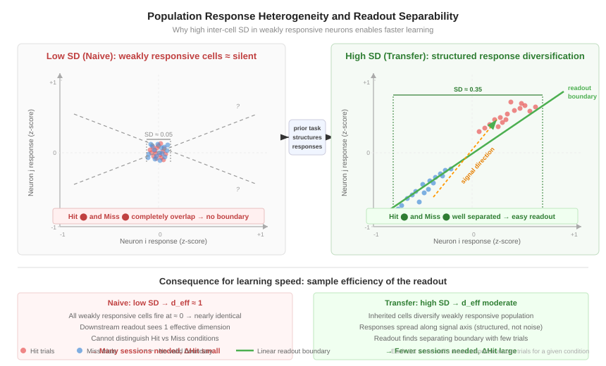
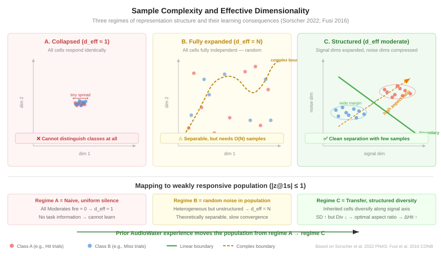

# 群体响应异质性预测学习速度：从理论基础到实验证据

> 本文综合神经科学与机器学习文献，围绕一个核心问题展开：**为什么弱响应神经元群体的响应分化程度（response diversification）能够前向预测跨会话的行为学习速度？** 以下按逻辑层级递进，从经典理论到本课题的创新性贡献，构建完整的论证脉络。

---

## 一、经典起点：群体编码中"弱响应细胞"的价值

### 1.1 混合选择性理论（Mixed Selectivity）

**核心文献**：Rigotti M, Barak O, Warden MR, Wang XJ, Daw ND, Miller EK & Fusi S (2013). The importance of mixed selectivity in complex cognitive tasks. *Nature* 497:585–590.

**核心发现**：在猴前额叶执行复杂规则切换任务时：
- 大多数神经元是 **weakly selective** 的——它们对单个任务变量（如刺激类型、规则、反应方向）的响应幅度不大
- 但这些弱响应细胞对**多个变量的组合**有独特的响应模式（mixed selectivity）
- **关键实验**：移除 strongly selective cells 后，线性解码精度几乎不变；移除 weakly selective / mixed selective cells 后，解码精度急剧下降
- **机制解释**：mixed selectivity 将群体表征"撑"入高维空间，使复杂的条件组合（如 stimulus A × rule 2 × go response）变得**线性可分**

**与本课题的关系**：
- 本课题中 |z-score@1s| ≤ 1 的 **weakly responsive cells** 正对应 Rigotti 的 weakly selective neurons
- 这些细胞虽然单独看"几乎不活动"，但彼此之间的响应差异（inter-cell SD）携带了关键信息
- **Rigotti 建立了**"弱细胞对解码重要"；**但未涉及**学习速度

### 1.2 高维表征与灵活读出的理论推导

**核心文献**：Fusi S, Miller EK & Rigotti M (2016). Why neurons mix: high dimensionality for higher cognition. *Current Opinion in Neurobiology* 37:66–74.

**理论预测**：
- 当 $N$ 个神经元具有 mixed selectivity 时，群体可以在 $O(2^N)$ 量级的条件组合中实现线性分类
- 如果所有神经元的响应高度相似（低 heterogeneity），则有效维度退化，线性可分的条件数急剧下降
- **"flexible and rapid learning of new readouts"**：高维表征允许下游以更少的样本找到正确的 readout 权重

**关键限制**：
- 这里的 "rapid learning" 是**数学层面的样本复杂度论证**，不是实验测量的行为学习速度
- 没有实证数据将群体 heterogeneity 与跨 session 的 ΔHit 关联

---

## 二、群体几何框架：从表征质量到泛化误差

### 2.1 群体几何与多任务泛化

**核心文献**：Wakhloo AJ, Slatton W & Chung S (2026). Neural population geometry and optimal coding of tasks with shared latent structure. *Nature Neuroscience*.

**核心贡献**：建立了群体几何指标 → 泛化误差的**解析公式**：

$$E_g = f(\text{PR}, c, f, s)$$

| 指标 | 含义 | 最优方向 |
|------|------|---------|
| PR (Participation Ratio) | 群体活动的有效维度 | few-shot: 低; many-shot: 高 |
| $c$ (neural–latent correlation) | 单细胞与任务变量的平均相关度 | 越高越好 |
| $f$ (SSF) | 不同任务变量编码方向的正交度 | 越高越好（解纠缠） |
| $s$ (SNF) | 噪声与信号方向的正交度 | 越高越好 |

**关键预测**：
- **Few-shot 学习的最优编码 = 低维 + 高相关 + 解纠缠**
- 学习过程中维度先降（压缩无关信息）后升（扩展次要变量编码）
- 已在大鼠 PFC/CA1 数据中验证了几何指标随学习阶段的变化趋势

**关键限制**：
- 泛化误差 $E_g$ 是理论量（线性 readout 的 expected error），不是实测的行为学习速度
- 验证方式是"几何指标 → 解码器精度"，而非"几何指标 → 动物跨 session 行为进步"

### 2.2 本课题图2已建立的相关证据

本课题在图2中已完成了群体几何分析，结果高度吻合 Wakhloo 的理论预测：

| 指标 | 继承细胞组 | 非继承细胞组 | p 值 |
|------|-----------|------------|------|
| PR (有效维度) | 5.6 (低维) | 13.8 (高维) | 0.002 |
| EVC₂ (方差集中度) | 54.5% | 29.7% | 0.002 |
| Signal-Noise Alignment | 0.728 (信噪重叠) | 0.905 (信号弱) | 0.027 |
| Per-cell SNR | 0.120 | 0.070 | 0.005 |

**意义**：继承细胞形成了低维、高集中度、高信噪比的编码几何——这正是 Wakhloo 预测的 few-shot 最优编码结构。但这组分析聚焦于继承/非继承的组间对比，尚未直接连接到**逐 session 的学习速度**。

---

## 三、机器学习的理论桥梁：为什么"异质性"加速学习

### 3.1 初始化多样性与收敛速度

**核心思想**（深度学习理论）：

在神经网络训练中，**权重初始化的多样性**对收敛速度至关重要：
- 如果所有神经元初始化为相同的权重（"对称初始化"），梯度更新无法打破对称性，所有神经元永远走相同的更新路径 → 网络实际上只有 1 个有效神经元 → 学习极慢
- **打破对称性** (symmetry breaking) 是网络训练的前提条件：不同神经元必须有**不同的初始响应模式**，才能在梯度更新中沿不同方向分化，最终覆盖目标函数的不同方面

**经典文献**：
- Glorot X & Bengio Y (2010). Understanding the difficulty of training deep feedforward neural networks. *AISTATS*.（Xavier 初始化：通过控制权重方差确保各层信号不退化）
- He K, Zhang X, Ren S & Sun J (2015). Delving deep into rectifiers. *ICCV*.（Kaiming 初始化）
- Saxe AM, McClelland JL & Ganguli S (2014). Exact solutions to the nonlinear dynamics of learning in deep linear neural networks. *ICLR*.（线性深度网络的学习动力学精确解：初始权重的奇异值分布直接决定不同模式的学习时间常数）

**与本课题的类比**：

| 机器学习概念 | 本课题对应 |
|-------------|-----------|
| 权重初始化的多样性 | 弱响应群体的 inter-cell SD (response diversification) |
| 对称初始化 → 学习停滞 | 所有弱响应细胞都 ≈ 0（SD 低）→ 下游无分化信号 → 学习慢 |
| 多样初始化 → 快速收敛 | 弱响应细胞 response 分散在 [-0.8, +0.9]（SD 高）→ 下游可快速找到 readout → 学习快 |
| 梯度下降 | 跨 session 的突触可塑性更新 |

**重要注解**：这是一个**类比**，不是直接等价。生物神经网络的学习规则（STDP、奖赏调制可塑性）与梯度下降在细节上完全不同。但 **"初始多样性加速学习"的数学原理是一般性的**——它不依赖具体的更新规则，只依赖"不同的初始状态使系统有更多可用的更新方向"。

> **图示：低 SD vs 高 SD 群体在表征空间中的可分性差异**
>
> 
>
> 左图：Naive 群体所有弱响应细胞 ≈ 0，Hit/Miss 试次完全重叠，无法找到决策边界。右图：Transfer 群体中继承细胞使响应沿信号方向展开，Hit/Miss 线性可分，Readout 少量样本即可收敛。

### 3.2 迁移学习中的表征预结构化

**核心思想**（机器学习迁移理论）：

在深度迁移学习中：
- 用源任务 (source task) 预训练的网络在目标任务 (target task) 上 fine-tune 时，收敛速度远快于从头训练
- **关键不是预训练网络"已经会做目标任务"，而是预训练提供了一组结构化的、多样的特征表征**
- 即使源/目标任务看似不同，预训练网络的中间层已经学会了一般性的特征（edges, textures, shapes...），这些特征在目标任务中提供了良好的初始多样性

**经典文献**：
- Yosinski J, Clune J, Bengio Y & Lipson H (2014). How transferable are features in deep neural networks? *NeurIPS*.（发现：网络浅层特征通用、深层特征任务特异；迁移的收益来自浅层的特征复用 + 中间层的结构化初始化）
- Neyshabur B, Sedghi H & Zhang C (2020). What is being transferred in transfer learning? *NeurIPS*.（发现：迁移效益的主要来源不是低层"特征复用"，而是**特征频谱的重用**——预训练改变了权重矩阵的奇异值分布，使其更适合快速适应新任务）

**与本课题的直接对应**：

| 机器学习 | 本课题 |
|---------|-------|
| 源任务预训练 | AudioWater 学习 |
| 目标任务 fine-tuning | LightWater 迁移学习 |
| 预训练→特征频谱结构化 | AW 学习→继承细胞在 LW 中保持结构化的微弱调谐 |
| 从头训练→随机初始化 | Naive LW→弱响应细胞均匀沉默 (SD 低) |
| Fine-tune 收敛快 | 迁移 ΔHit 更大 |

**核心推论**：**Transfer 组弱响应群体的高 SD 不是噪声——它是 AudioWater 学习在群体中留下的"结构化初始化"**，使得在新任务中下游 readout 有更多可利用的分化信号，从而加速学习。

### 3.3 样本复杂度与有效维度

**核心定理**（统计学习理论）：

线性分类器从 $N$ 维表征中学习一个二分类边界所需的样本数约为 $O(d_{\text{eff}})$，其中 $d_{\text{eff}}$ 是特征的有效维度。具体来说：

- 如果表征高度冗余（所有特征高相关），$d_{\text{eff}} \ll N$ → 需要的样本少 → 学习快
- 但如果表征完全坍缩（所有特征相同），$d_{\text{eff}} = 1$ → 无法区分复杂条件 → 学习精度差
- **最优权衡**：表征在与任务相关的维度上展开（diversified），在无关维度上压缩 → $d_{\text{eff}}$ 适中 → 学习既快又准

**经典文献**：
- Sorscher B, Ganguli S & Sompolinsky H (2022). Neural representational geometry underlies few-shot concept learning. *PNAS* 119:e2200800119.（证明：群体几何的 "aspect ratio"——表征在信号方向 vs 噪声方向的展开比例——直接决定 few-shot 学习的样本效率）

**与本课题的对接**：

本课题中，弱响应群体的 SD 增大意味着：
- 响应在细胞间"展开"了 → 有效维度增加 → 对刺激条件提供了更多区分信息
- 但这些细胞仍在 |z| ≤ 1 内 → 没有被少数极端细胞主导 → 信息分布式地分散在多个细胞中
- 结果：下游决策回路既有足够信息（高 $d_{\text{eff}}$），又不需要对每个极端细胞单独调权（样本效率高）

> **图示：样本复杂度与有效维度的三种情形**
>
> 
>
> A. 坍缩 (d_eff≈1)：所有细胞响应相同，无法区分条件。B. 完全展开 (d_eff=N)：随机散布，需要复杂非线性边界和大量样本。C. 结构化展开 (d_eff 适中)：信号方向展开 + 噪声方向压缩 = 高 aspect ratio，线性 readout 少量样本即可快速收敛。Transfer 组的 AW 经验将群体从情形 A 推向情形 C。

---

## 四、回到神经科学：从"静态表征质量"到"动态学习速度"

### 4.1 文献已建立的：表征结构 → 解码精度 / 泛化误差

| 研究 | 建立的关系 | 时间尺度 | 实证 or 理论 |
|------|-----------|---------|-------------|
| Rigotti et al. 2013 | Mixed selectivity → 解码精度 | 同时间点快照 | **实证** (猴 PFC) |
| Fusi et al. 2016 | 高维表征 → flexible rapid readout | 数学推导 | **理论** |
| Wakhloo et al. 2026 | 群体几何 → 泛化误差 $E_g$ | 理论 + 同时间点验证 | **实证** (鼠 PFC/CA1) |
| Sorscher et al. 2022 | Aspect ratio → few-shot 样本效率 | 数学推导 | **理论** |
| Sadtler et al. 2014 | 子空间对齐 → 适应速度 | 分钟级 BCI 适应 | **实证** (猴 M1) |
| Perich et al. 2018 | Manifold 内重映射 → 快速学习 | 分钟~小时级 | **实证** (猴 M1) |

### 4.2 文献尚未建立的关键缺口

> **有效维度 / 异质性 / 几何指标** → **跨 session 的行为学习速度 (ΔHit)**

这个缺口存在于三个层次：

**（一）时间尺度的跨越**

已有文献中的"学习速度"指的是：
- BCI 适应中几分钟内的 cursor accuracy 变化（Sadtler et al. 2014）
- 理论中 readout 权重的收敛步数（Fusi et al. 2016; Sorscher et al. 2022）
- 解码器交叉验证误差（Wakhloo et al. 2026）

而本课题中的"学习速度"是：
- **跨 session（间隔数小时至一天）** 的行为命中率增量 ΔHit = Hit(k+1) − Hit(k)
- 中间隔着 **离线巩固、睡眠依赖的突触重组、蛋白合成依赖的记忆整合** 等完全不同的生物过程
- 因此 "session k 的群体状态 → session k+1 的行为进步" 是一个 **前向预测** (prospective prediction) 关系，而非同时间点的关联

**（二）因果方向的差异**

已有文献说的是："有了好的表征，解码就准"——这是同一时间点的 representation → readout 映射。

本课题说的是："**session k 的群体异质性预测 session k→k+1 的学习进步**"——这需要假设：
1. session k 的群体状态为 session k 期间的突触可塑性提供了"学习基质"
2. 这种可塑性的效果在 session k+1 中表现为行为改善
3. 群体异质性越高 → 可塑性更新的方向越正确 / 幅度越大 → ΔHit 越大

**（三）经验依赖性**

没有文献讨论过："**先前的不同任务学习如何改变当前任务中弱响应群体的异质性**"。

本课题的 Transfer vs Naive 对比展示了：
- AudioWater 学习在 MOp 群体中留下了**结构化印记**——即使在 LightWater 中看起来"弱响应"的细胞，其响应模式也已经被 AW 经验所调制
- 这种调制表现为 Moderates 群体的 SD 更高、但 Divergence 更低——**结构化的分化**
- Naive 群体缺乏这种先验结构 → Moderates 群体内部近乎均匀沉默 → SD 低

### 4.3 本课题填补缺口的实证链条

本课题的数据构建了如下实证链条，每一步都有独立的统计证据：

```
                        ┌─────────────────────────────────────────────────┐
                        │         已有文献已建立的理论基础               │
                        │  Mixed selectivity → 解码精度 (Rigotti 2013)   │
                        │  高维表征 → 样本效率 (Fusi 2016, Sorscher 2022)│
                        │  群体几何 → 泛化误差 (Wakhloo 2026)           │
                        └──────────────────────┬──────────────────────────┘
                                               │
                              逻辑推断（理论 → 预测）
                                               │
                                               ▼
┌──────────────────────────────────────────────────────────────────────────────┐
│                     本课题的创新性实证贡献                                    │
│                                                                              │
│  ① AW 学习 → 继承细胞保留结构化调谐                                         │
│     · 继承细胞 SD = 1.34× 非继承 (p=0.005)                                 │
│     · 消融继承 → SD 回落至 Naive 水平 (p: 0.035 → 0.198 NS)               │
│     · 继承细胞 AW→LW cross-task correlation ρ=0.253 (p=0.001)              │
│                                                                              │
│  ② 弱响应群体 SD ↑ → 跨session ΔHit ↑                                      │
│     · SD(Moderates) vs ΔHit: ρ=0.82, p=0.002                               │
│     · 控制继承细胞占比后相关反而更强: ρ=0.904                               │
│     · Extremists 差异不显著 → 信息不在强响应细胞中                           │
│                                                                              │
│  ③ Transfer 组 SD 系统性高于 Naive                                           │
│     · MOp2/3: p=0.008; MOp5: p=0.0006                                       │
│     · 来源: 继承细胞的结构化调谐 (方向1-3)                                  │
│                                                                              │
│  ④ SD 与 Div 反向关联 = "结构化异质性"                                       │
│     · SD vs Div: ρ=−0.718 (p=0.017)                                         │
│     · 继承细胞: 高 SD (0.523) + 低 Div (3.11)                               │
│     · = 不同细胞有不同角色（高异质性），                                      │
│       但每个细胞在自己的角色上表现一致（低散度）                              │
│                                                                              │
│  ⑤ 因果验证                                                                  │
│     · TH 抑制 → SD 降低 + ΔHit 减缓 (图3I)                                 │
│     · cFos ensemble 抑制 → 主要影响首会话 baseline，不影响学习速度           │
│     · 7天间隔 → 复用率下降但 SD/学习速度不受影响                             │
│                                                                              │
└──────────────────────────────────────────────────────────────────────────────┘
```

---

## 五、整合叙事：为什么迁移组学得更快

### 5.1 完整因果链

```
AudioWater 学习
    │
    ├─→ 约 15% 的细胞形成稳定的选择性调谐（"继承细胞"）
    │      · 低维编码 (PR≈5.6)
    │      · 高方差集中度 (EVC₂≈54.5%)
    │      · 高试次一致性 (Div_inh = 0.75× Div_non)
    │
    ├─→ 这些调谐在 LightWater 中保留 (cross-task ρ=0.253)
    │
    └─→ 在 LightWater 弱响应群体中产生 "结构化的响应分化"
           · 继承细胞 + 非继承细胞混合 → SD (Moderates) ↑
           · 但非均匀地"展开"：沿信号方向分化，而非随机散开
           │
           ▼
    弱响应群体的 response diversification ↑
           │
           ├─ [理论支撑] 高维表征 → 条件可分性 ↑ (Rigotti/Fusi)
           ├─ [理论支撑] 打破对称性 → 更新方向多样 (Saxe/Glorot)
           ├─ [理论支撑] Aspect ratio → 样本效率 ↑ (Sorscher)
           │
           ▼
    下游 readout 更新更高效 → 跨 session ΔHit ↑
           │
           ├─ [本课题实证] SD vs ΔHit: ρ=0.82, p=0.002
           ├─ [本课题实证] Transfer SD > Naive SD (p≤0.008)
           └─ [本课题因果] TH 抑制 → SD↓ + ΔHit↓
```

### 5.2 为什么是弱响应细胞而非强响应细胞

| 特征 | 弱响应细胞 (|z|≤1) | 强响应细胞 (|z|>1) |
|------|--------------------|--------------------|
| 数量 | ~80% 的群体 | ~20% |
| 选择性类型 | Mixed selectivity（对多个变量有微弱响应） | Pure selectivity（对特定条件强烈响应） |
| 对 readout 的贡献 | 集体提供高维信息，线性可分性依赖它们 | 提供明确但低维的信息 |
| 跨 session 稳定性 | 相对稳定（|z|≤1 内的 ceiling/floor 效应弱） | 变异更大（极端值的试次间波动更强） |
| SD 的可变范围 | 大（从"全部接近0"到"分散在±0.8"） | 小（本来就稀疏，SD 变化被数量限制） |
| 对学习速度的预测力 | **显著** (ρ=0.82) | **不显著** |

**直觉解释**：

想象一个教室里 100 个学生（= 100 个细胞）在回答问题：
- **强响应学生**（5–10 个）：声音很大，答案非常明确——但因为太少了，老师（下游 readout）已经知道他们每个人的倾向，从他们那里获取不到"新信息"来改进教学
- **弱响应学生**（80–90 个）：声音小，但每个人的回答略有不同——有的微微赞同，有的微微反对，有的犹豫不决
  - 如果这些学生**全都沉默**（SD ≈ 0）：老师从他们那里得不到任何反馈 → 无法判断怎么调整教学方法 → 学习停滞
  - 如果这些学生**虽然声音小但各有不同**（SD 高）：老师可以从他们的微妙差异中读取出丰富的信息 → "这个知识点 60% 的弱声音学生微微理解了，30% 还困惑" → 很快调整教学策略

### 5.3 与论文整体框架的整合

本课题的多组件迁移框架可以用两个正交的维度来组织：

| | **首会话表现 (Baseline)** | **跨 session 学习速度 (ΔHit)** |
|---|---|---|
| **神经指标** | 复用率、预激活率 | 弱响应群体 SD、训练信号正确性 (Corr@1.5s) |
| **脑区** | MOp2/3 | MOp5 + TH 反馈通路 |
| **机制** | "可用性/提取"：AW 形成的细胞集合被直接调用 | "可塑性基质"：AW 留下的结构化异质性加速 readout 更新 |
| **操纵证据** | cFos 抑制 → baseline↓; 7天间隔 → baseline↓ | TH 抑制 → ΔHit↓; 7天间隔 → baseline↓ 但 ΔHit 不变 |
| **理论对标** | 记忆印记复用 (Josselyn & Tonegawa 2020) | 群体几何→学习（是本论文的创新贡献） |

---

## 六、建议的论文写法

在正文中引用上述文献基础时，建议如下分界：

### 6.1 归因前人（Background / Introduction）

> Theoretical and experimental work has established that weakly selective neurons exhibiting mixed selectivity are critical for the representational capacity of neural populations (Rigotti et al., 2013; Fusi et al., 2016), and that population geometry—including dimensionality, neural-latent correlation, and signal factorization—constrains the generalization error of linear readouts (Wakhloo et al., 2026; Sorscher et al., 2022). In parallel, work in brain-computer interfaces has shown that adaptation is fastest when new task demands align with pre-existing neural manifolds (Sadtler et al., 2014; Perich et al., 2018). In the machine learning domain, it is well established that weight initialization diversity is a prerequisite for efficient gradient-based learning (Saxe et al., 2014), and that transfer learning benefits arise substantially from the structured feature spectrum inherited from source-task training (Neyshabur et al., 2020).

### 6.2 标示创新（Results 引入段 / Discussion）

> **However, whether the degree of response diversification within weakly responsive neural populations can prospectively predict the speed of behavioral learning across sessions—spanning hours to days and involving offline consolidation—has not been tested.** Furthermore, whether prior task experience systematically modulates such diversification, thereby providing a "structured initialization" that accelerates new-task learning, remains unknown. Here we show that inter-cell response heterogeneity among weakly responsive cells (|z-score| ≤ 1) in MOp positively predicts session-to-session learning speed (ΔHit), that transfer animals exhibit systematically higher heterogeneity than naive animals due to structured tuning inherited from prior auditory-cued learning, and that disrupting feedback pathways reduces both heterogeneity and learning speed. These findings provide the first empirical link between population response diversification and prospective learning dynamics in a cross-modal transfer paradigm.

---

## 参考文献

1. Rigotti M, Barak O, Warden MR, Wang XJ, Daw ND, Miller EK & Fusi S (2013). The importance of mixed selectivity in complex cognitive tasks. *Nature* 497:585–590.
2. Fusi S, Miller EK & Rigotti M (2016). Why neurons mix: high dimensionality for higher cognition. *Current Opinion in Neurobiology* 37:66–74.
3. Wakhloo AJ, Slatton W & Chung S (2026). Neural population geometry and optimal coding of tasks with shared latent structure. *Nature Neuroscience*.
4. Sorscher B, Ganguli S & Sompolinsky H (2022). Neural representational geometry underlies few-shot concept learning. *PNAS* 119:e2200800119.
5. Sadtler PT, Quick KM, Golub MD, Chase SM, Ryu SI, Tyler-Kabara EC, Yu BM & Batista AP (2014). Neural constraints on learning. *Nature* 512:423–426.
6. Perich MG, Gallego JA & Miller LE (2018). A neural population mechanism for rapid learning. *Neuron* 100:964–976.
7. Saxe AM, McClelland JL & Ganguli S (2014). Exact solutions to the nonlinear dynamics of learning in deep linear neural networks. *ICLR*.
8. Glorot X & Bengio Y (2010). Understanding the difficulty of training deep feedforward neural networks. *AISTATS*.
9. He K, Zhang X, Ren S & Sun J (2015). Delving deep into rectifiers: surpassing human-level performance on ImageNet classification. *ICCV*.
10. Yosinski J, Clune J, Bengio Y & Lipson H (2014). How transferable are features in deep neural networks? *NeurIPS*.
11. Neyshabur B, Sedghi H & Zhang C (2020). What is being transferred in transfer learning? *NeurIPS*.
12. Bernardi S, Benna MK, Fusi S et al. (2020). The geometry of abstraction in the hippocampus and prefrontal cortex. *Cell* 183:954–967.
13. Gallego JA, Perich MG, Miller LE & Solla SA (2017). Neural manifolds for the control of movement. *Neuron* 94:978–984.
14. Josselyn SA & Tonegawa S (2020). Memory engrams: recalling the past and imagining the future. *Science* 367:eaaw4325.
