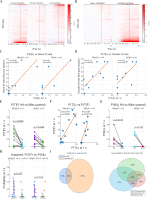
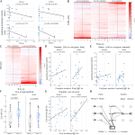
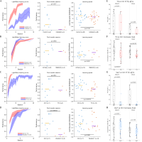
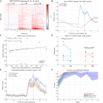

# Multi-component Neural Mechanisms of Cross-modal Transfer Learning: Ensemble Reuse and Feedback-driven Updating in Mouse Primary Motor Cortex

---

## Highlights

- Cross-modal transfer from auditory- to visual-cued tasks elevates both first-session performance and absolute learning rate in mice

- Task-active neuronal ensembles from learned auditory task are preferentially reactivated during transfer, correlating with first-session hit rate

- Learning speed is predicted by training signal fidelity (session-to-final correlation at 1.5 s post-reward) rather than reuse rate

- Perturbation experiments dissociate "retrieval/availability" (MOp ensemble) from "feedback-driven updating" (posterior thalamus pathway)

- A multi-component framework links baseline advantages to ensemble reuse and learning speed to feedback stability

---

## Summary

Transfer learning enables sample-efficient adaptation, yet behavioral transfer benefits often conflate multiple components - higher initial performance versus faster subsequent improvement - which may rely on dissociable neural mechanisms. Here we studied cross-modal transfer in head-fixed mice using a cue–delay–reward task: animals were first trained to criterion in an auditory-cued water task (AudioWater) and then switched to a visual-cued water task (LightWater), comparing this transfer condition against a de novo visual-cued control group. Combining behavioral learning curves with longitudinal two-photon calcium imaging in primary motor cortex (MOp; layers 2/3 and 5), we quantified single-cell ensemble reuse and training signal fidelity indexed by session-to-final correlation at 1.5 s post-reward.

Transfer LightWater showed higher first-session hit rate and elevated learning curves compared with naive learning; critically, transfer also exhibited higher absolute learning rate after controlling for baseline performance. Neurally, cells active during learned AudioWater were preferentially reactivated in the first transfer session, and reuse correlated with first-session performance. However, reuse did not explain variability in subsequent learning increments. Instead, learning speed was associated with training signal fidelity (Corr(session, Final)@1.5 s), particularly in MOp layer 5. Perturbation experiments provided causal support: inhibiting activity-tagged MOp ensembles primarily reduced transfer baseline, whereas inhibiting posterior thalamic feedback pathway primarily slowed subsequent improvement; interval manipulation further dissociated retrieval from updating. Together, these results support a multi-component view of transfer in which baseline advantages relate to ensemble reuse while learning speed relates to feedback-associated stability.

---

## Keywords

- Transfer learning
- Ensemble reuse
- Population representation
- Primary motor cortex
- Calcium imaging
- Learning dynamics

---

## Research Topics

- Systems neuroscience
- Motor learning and memory
- Neural population coding

---

## Introduction

Learning is fundamentally a process of information acquisition, storage, and processing. Transfer learning represents a special form of learning that achieves optimized behavioral output with fewer samples by leveraging knowledge from prior tasks. Understanding how the nervous system supports such efficient knowledge transfer remains a central question in neuroscience.

Transfer is typically defined as the influence of prior learning on subsequent learning or performance in new contexts, which may manifest as facilitation, interference, or near-zero effect (Thorndike and Woodworth, 1901; Perkins and Salomon, 1992/1994). From a behavioral perspective, the key issue is not how well the old task was learned, but whether old task experience enables faster acquisition of effective behavior in an untrained new task or achieves the same criterion with fewer samples. Transfer research commonly operationalizes effects as first-session baseline advantages, reduced time-to-criterion, and systematic changes in learning curve height or growth rate (Bransford and Schwartz, 1999; Barnett and Ceci, 2002).

Transfer phenomena are classified along multiple dimensions: by effect direction (positive, negative, or zero transfer) and by similarity or "transfer distance" between old and new contexts (near vs. far transfer). Notably, transfer differs from generalization: generalization emphasizes direct extension to novel stimuli within the same rule or task family, often observable with little or no additional training, whereas transfer emphasizes whether behavioral baseline and learning dynamics measurably change when transitioning from old to new tasks.

A closely related phenomenon is learning-to-learn (learning set), whereby individuals show faster subsequent learning after accumulating multi-task experience (Harlow, 1949). This concept provides an important reference: transfer advantages may not arise entirely from specific representation reuse but may also involve more general changes in learning rate, strategy updating, or plasticity gating.

A commonly overlooked but critical tension in transfer research is that behavioral "faster/higher" does not necessarily equate to "stronger learning mechanisms." Cognitive and learning research repeatedly emphasizes that "learning" (retainable, transferable capacity change) and "performance" (observable output strongly influenced by state and context) can be significantly dissociated; better short-term performance sometimes fails to predict better long-term retention or transfer, and vice versa (Soderstrom and Bjork, 2015).

Transfer-stage behavioral advantages may have at least three potential sources. First, representation/strategy-level reuse: task-relevant cell assemblies, population subspaces, or strategy structures formed during the old task are directly invoked in the new task, thereby elevating first-session baseline or shortening exploration to effective behavior. Second, non-specific factors: arousal, attention, fatigue, stress, or experimental conditions may alter perceptual gain, response threshold, and behavioral output stability in ways that "look better/worse" but whose mechanisms are not necessarily task-specific learning traces. Third, more abstract general learning rate or strategy updating mechanisms: cross-task experience may alter plasticity gating, exploration-exploitation strategies, or form learning-to-learn "meta-level" advantages that accelerate subsequent learning (Harlow, 1949).

Based on these considerations, "transfer advantage" should not be viewed as a single phenomenon but decomposed into distinguishable, statistically alignable behavioral components (e.g., first-session baseline, overall learning curve height, growth rate/criterion attainment speed), with their possible neural mechanism sources discussed separately.

At the neural level, accumulating evidence supports the existence of reusable representational structures that may underlie transfer. Studies on memory engrams demonstrate that learning recruits specific neuronal ensembles whose reactivation is necessary and sufficient for memory expression; critically, overlapping ensemble allocation across experiences can link distinct memories and support generalization (Tonegawa et al., 2015; Josselyn and Tonegawa, 2020; Cai et al., 2016; Yokose et al., 2017). In motor cortex, two-photon imaging reveals that skill learning induces fine-scale reorganization of neuronal ensembles, with task-relevant cells becoming more correlated while maintaining stable population-level structure (Komiyama et al., 2010; Peters et al., 2014). Population-level analyses further show that neural activity during movement can be captured by low-dimensional manifolds, and learning-related changes may occur through remapping within existing manifolds rather than requiring entirely new activity patterns—a constraint that may accelerate certain forms of adaptation while limiting others (Sadtler et al., 2014; Gallego et al., 2017; Perich et al., 2018). Higher-order thalamic nuclei, particularly the posterior nucleus (PO), form reciprocal connections with motor and somatosensory cortices and are positioned to relay feedback signals that may gate cortical plasticity (Halassa and Sherman, 2019; Shepherd and Yamawaki, 2021). Despite these advances, how ensemble reuse and feedback pathway dynamics jointly contribute to different components of transfer—baseline versus learning speed—remains poorly understood.

Transfer learning is scientifically significant partly because it converts the abstract question of "whether the learning system possesses reusable structure" into measurable behavioral dynamics differences: through what neural mechanisms does old task experience affect new task first-session baseline and subsequent growth/criterion attainment speed? At the neural level, this corresponds to at least two types of potential computational components—one more related to "availability/retrieval," i.e., task-relevant cell assemblies or population structures formed during the old task are directly invoked in the new task; another more related to "learning rate/gating," i.e., modulation of input pathways and plasticity processes that accelerate subsequent updating.

Methodologically, this study aims to combine "population representation traceability" with "causal manipulation." Two-photon calcium imaging with high-sensitivity calcium indicators enables recording neural population activity at single-cell resolution during behavior, allowing tracking of population dynamics and cell assembly composition changes across learning and transfer stages within the same animal (Chen et al., 2013; Girven and Sparta, 2017). Activity-dependent tagging and chemogenetics enable advancement from correlational description to causal testing for "reuse-related cell assemblies/pathways." TRAP and other IEG-based strategies can achieve permanent genetic access to active cells within specific time windows for subsequent recording, tracking, and manipulation (Guenthner et al., 2013); DREADDs provide reversible inhibition/activation of specific cell populations during free behavior, suitable for testing necessity of those populations for transfer-stage performance components (Roth, 2016).

Despite extensive behavioral and theoretical work on transfer, several gaps remain. First, transfer advantages are often compressed into summary metrics, potentially obscuring the fact that "first-session baseline" and "subsequent growth/criterion speed" may be subject to different constraints. Second, "reuse" itself is not a single-level concept—single-cell activity can significantly rearrange across days/conditions while population covariance structure, low-dimensional subspaces, or dynamical scaffolds may show certain preservation. Third, mechanistic discrimination is often limited by scarcity and fragmentation of causal evidence: many studies remain at the correlational level between behavioral curves and neural indicators, or lack simultaneous recording of neural representation changes during manipulations.

Here we address these gaps using a cross-modal transfer paradigm in head-fixed mice: animals first learn an auditory-cued water reward task (AudioWater) to criterion, then switch to a visual-cued task (LightWater), with comparison to a naive LightWater control group. Combining longitudinal two-photon calcium imaging in primary motor cortex (MOp; layers 2/3 and 5) with behavioral learning curve analysis, we find that transfer elevates both first-session hit rate and absolute learning speed. Neurally, cells active during learned AudioWater are preferentially reactivated during transfer, and reuse rate correlates with first-session performance but not with subsequent learning increments. Instead, learning speed is predicted by training signal fidelity—the correlation between each session's post-reward population activity and the final learned state—particularly in MOp layer 5. Perturbation experiments provide causal support: chemogenetic inhibition of activity-tagged MOp ensembles primarily reduces transfer baseline, whereas inhibition of the posterior thalamic feedback pathway primarily slows learning speed; a 7-day interval manipulation further dissociates retrieval-related and updating-related components. Together, these findings support a multi-component framework in which baseline advantages relate to ensemble reuse while learning speed relates to feedback-associated signal fidelity.

## Results

### Transfer LightWater Behavioral Performance Exceeds Naive LightWater

The cross-modal transfer paradigm is illustrated in Figure 1A. We first examined transfer versus naive performance on the LightWater task. Transfer LightWater showed significantly higher first-session hit rate than naive (Figure 1C), learning curves that remained elevated throughout training (Figure 1B), and faster learning speed (slope) after controlling for first-session differences using ANCOVA (Figure 1D).

A classic concept similar to transfer learning is “generalization” - in contextual fear conditioning, mice show fear-like freezing to contexts different from training, as if “mistaking” the new context for the old or “generalizing” the old memory to the new context (Josselyn and Tonegawa, 2020). Like transfer learning, generalization requires similarity between old and new task contexts/cues and produces performance elevated above untrained animals. The key difference is that generalization experiments typically only test memory retrieval in the new task without further training, whereas transfer learning additionally emphasizes that learning speed in the new task is faster than naive learning, not just higher baseline.

Due to the technical difficulty of calcium imaging cranial window surgery, only a subset of mice had windows suitable for imaging. These mice had recordings throughout training from naive to transfer to final learning (with occasional exclusion of sessions with technical failures).

Previous contextual memory generalization studies observed engram cell reuse (Tonegawa et al., 2015; Josselyn and Tonegawa, 2020); we sought cells with similar activity features—inactive during naive AudioWater, active during learned AudioWater, active during transfer LightWater hit trials, and inactive during miss trials (Figure 1G). Indeed, a portion of cells active during learned AudioWater were reused during transfer LightWater hit trials, while during miss trials most fell silent and a different population became active (Figures 1H-J). Computing reuse rate as the proportion of learned-AudioWater-active cells that were also active during transfer hit versus miss trials, hit-trial reuse was significantly higher (Figure 1K). Inter-mouse variability in first-session hit rate correlated well with inter-mouse reuse rate variability (Figure 1L).

We also examined whether reused subpopulations within learned AudioWater had specific dynamical features. Cells that were reused showed slightly stronger calcium signals, but this did not reach significance under current statistical approaches (Figures 1M-N).

### Reuse Rate and Pre-activation Rate

Naive LightWater lacks the concept of reuse rate per se, preventing direct comparison with transfer. We sought an intermediate metric that could link to reuse rate while being comparable between naive and transfer conditions. We found that a substantial portion of the "correct answer population"—cells active at 100% learned LightWater—were already pre-activated during transfer LightWater (Figure 3A); but during naive LightWater this population was mostly silent, with naive-active cells showing almost no overlap with learned-active cells (Figure 3B). Inter-mouse first-session hit rate variability correlated with each mouse's "pre-activation rate" of final correct cells (Figures 3C-D), with hit-trial pre-activation significantly higher than miss-trial (Figures 3E, G). These findings indicate pre-activation rate as a good unified predictor of behavior in both naive and transfer stages.

Transfer-stage pre-activation rate was significantly higher than naive only in MOp layer 2/3 (Figure 3H), suggesting MOp2/3 may more persistently store shared information across cross-modal tasks. This higher pre-activation rate related to cells reused from learned AudioWater: inter-mouse analysis showed that mice with higher reuse also had higher pre-activation (Figure 3F). Thus, higher transfer first-session hit rate than naive occurs because transfer LightWater can reuse cells from learned AudioWater; these reused cells represent shared information between the two tasks, causing many of the cells necessary for final LightWater learning to be pre-activated in the first transfer session.

### Learning Rate Correlates with MOp5 Layer 1.5 s Signal Fidelity

However, neither reuse rate nor pre-activation rate predicted learning speed—they even showed reverse prediction (Figure 4A), suggesting that 1 s decision-phase output and reinforcement training may be two relatively independent processes. Indeed, previous research has highlighted the importance of “feedback training” phases after task decision windows for learning progression (Krakauer et al., 2019; Shadmehr and Krakauer, 2008). We found appreciable inter-cell correlation between transfer and final stages at 1.5 s signals (Figure 4B), while naive and learned stages showed minimal correlation (Figure 4C), with statistically significant differences between them (Figure 4F).

This means that during transfer learning, the 1.5 s post-reward feedback training phase consistently enjoys training signals closer to the final "correct answer," while naive learning's training signals initially deviate substantially from the "correct answer," pulling the MOp network toward inefficient or entirely wrong directions. Analyzing each mouse×session as statistical unit, examining correlation between that session's behavioral increment to next session and that session's 1.5 s training signal correlation with "correct answer," we found that regardless of transfer or naive, MOp layer 5's 1.5 s "correct answer correlation" metric well predicted each session's increment (Figures 4D-E, controlling for current session baseline via linear model).

Transfer-stage 1.5 s training signal's higher fidelity also showed good association with learned AudioWater. Transfer sessions highly correlated with learned AudioWater 1.5 s signals were also highly correlated with final LightWater 1.5 s correct answers, especially in MOp layer 5 (Figure 4G). Thus, transfer learning's faster growth rate can be explained by 1.5 s training signal fidelity: during naive learning, 1.5 s training signals are far from learned-stage correct answers, constantly updating dynamically like upstream networks, causing MOp network training direction to be more tortuous, inefficient, or even mutually canceling, generating substantial noise training signals; while during transfer, learned AudioWater has established stable and basically correct training signal frameworks, under which MOp network can undergo targeted, fast, efficient training, leading to higher behavioral growth rate.

### Causal Evidence: Manipulating Relevant Cell Assemblies/Pathways Alters Transfer Performance

Several manipulation experiments attempted to causalize the correlations described above. Using cFos to tag cells active during learned AudioWater in MOp, then inhibiting them during transfer LightWater, we observed learning curve downward shift with somewhat reduced first-session hit rate, but learning rate did not appear to decrease (Figure 5A). Direct broad hM4D(Gi) non-specific inhibition of MOp had almost no effect (Figure 5B).

Based on the Section 3.4 hypothesis that feedback training signals affect learning speed, manipulating input sources might be more effective for affecting learning speed. The thalamus (TH) is a major MOp upstream; evolutionarily, before cerebral cortex appeared, it was the key nucleus for animals to integrate sensory input and motor output decisions; in animals with cerebral cortex, it retains this core function, working synergistically with cortex—for example, it forms typical tripartite reciprocal projections with MO and SS cortex, playing important roles in motor feedback regulation, especially the posterior PO subregion (Halassa and Sherman, 2019; Shepherd and Yamawaki, 2021). Chemogenetically inhibiting hM4D(Gi)-infected PO with CNO during transfer showed modest first-session hit rate decrease, but markedly slowed learning speed, with some mice never fully learning LightWater (Figure 5C). Consistent with behavior, 1 s reuse rate did not decrease markedly (Figure 5E), but 1.5 s training signal correct correlation dropped significantly, especially in MOp layer 5 (Figure 5F).

Beyond direct neuronal inhibition, training schedule manipulation provides non-invasive intervention. After learning AudioWater, instead of immediately transferring to LightWater, we restored water supply and stopped training for 7 days. After 7 days of forgetting, AudioWater task remained 100% remembered (data not shown), but LightWater transfer first-session hit rate was significantly below normal levels (Figure 5D). Statistical analysis showed transfer first-session pre-activation rate dropped significantly, especially in MOp layer 2/3 (Figure 5G), but 1.5 s training signal correct rate remained almost unchanged (Figure 5H). This indicates the 7-day forgetting process mainly affected memory retrieval and computation stored in MOp2/3, while feedback training pathways remained basically stable, so behaviorally first-session hit rate decreased but subsequent learning speed was not much affected.

In summary, MOp2/3 local cell reuse between AudioWater and LightWater tasks can be considered to have certain causal links with transfer-stage first-session hit rate, and is easily forgotten over time; while post-reward MOp5 layer feedback training signals from TH have causal links with subsequent learning rate, and are not easily forgotten over time.

### RSPd: A Potential Light-Signal-Specific Upstream

From cortical topology, RSP directly connects VIS and MO cortical regions, while being distant from AUD, suggesting RSP should be an important intermediate for visual signals traveling from visual to motor cortex on the cortical surface, i.e., an upstream input to MOp. Imaging calcium signals in RSP during transfer learning confirmed that RSP indeed showed highly specific responses to visual signals regardless of hit or miss, while responses to auditory signals were weak, consistent with its cortical topological characteristics (Figure 6A). In terms of temporal features, RSP's response to visual signals during transfer was rapid and clean, clearly stronger and faster than MO (Figure 6B).

Does reuse rate have meaning in RSP? Within individual sessions, hit-trial reuse rate was indeed higher than miss (Figure 6D), indicating that although the auditory channel is weak in RSP, if it can be reused by light signals, it can also improve hit rate. However, inter-mouse reuse rate variability could not explain first-session hit rate variability at all (Figure 6C). Overall, because auditory channel presence in RSP is minimal and it mainly serves as a light-signal-specific pathway, "reuse" effects contribute very weakly to AudioWater memory recall, requiring extensive repetition to detect. Examining the relatively weak auditory-water-active minority population and their activity during transfer, hit and miss still showed little difference, with miss possibly slightly higher (Figure 6E). Non-specific chemogenetic inhibition showed that inhibiting RSP alone did not affect transfer behavior (perhaps even slightly improved it). When MOp and RSP were simultaneously inhibited, transfer first-session hit rate still changed little, but subsequent learning progress seemed to hit a ceiling effect, with some mice unable to reach 100%, i.e., learning speed was affected.

In summary, RSP may be a light-signal-preferring MO upstream relay region, but auditory channel reuse also has weak behavioral effects.

---

## Discussion

### Summary of Main Findings

This study centered on a core question: is cross-task transfer from AudioWater to LightWater related to reuse of cell assemblies/population representations formed during the learned stage (Learned AudioWater) in the transfer stage? Overall, results provide multi-level, consistent evidence for associations among "transfer advantage—reuse—population representation structure," and perturbation experiments provide preliminary causal clues for some links, advancing the question from phenomenological description toward mechanistic discrimination.

**First**, behaviorally, transfer-stage LightWater overall performance exceeded naive learning: manifested in higher first-session performance, higher learning curves across most session ranges, and faster cumulative criterion attainment (time-to-criterion). After controlling for baseline performance, transfer learning additionally showed absolutely higher learning rate, giving "transfer" effects richer content than classical "generalization" effects. This conclusion provides the "phenomenon requiring explanation" for all subsequent neural indicator interpretations.

**Second**, neurally, transfer LightWater showed "reuse features" consistent with learned AudioWater: cells judged active during learned AudioWater were re-activated in the first transfer session, with reuse rate statistically corresponding to first transfer behavioral performance. Meanwhile, transfer-stage "final correct population pre-activation rate" coupled with reuse indicators, suggesting reuse does not merely produce "more cells more active" but concretizes logically shared information between two tasks as shared cell populations active at final learning of both tasks. The AudioWater task partially pre-reveals LightWater's "correct answers," so transfer LightWater need not start from scratch but can leverage existing results.

**Third**, at the learning dynamics level, we used per-session hit rate change (ΔNext(i)=Performance(i+1)−Performance(i), excluding 100% sessions to eliminate ceiling/floor effects). Under this approach, reuse rate and pre-activation rate did not predict learning speed, but training signal fidelity in the 1.5 s post-reward window (Corr(session, Final)@1.5 s, as an operational measure of training signal correctness) showed significant association with learning speed: sessions with higher/lower correlation showed systematic differences in subsequent behavioral increments. This suggests "transfer advantage" cannot be simply stated as "faster learning," pointing to at least two distinguishable components: initial transfer performance and subsequent growth speed. It also provides a reasonable mechanistic explanation for faster growth: transfer learning has a better "teacher."

**Fourth**, at the brain region functional differentiation level, data support a "cue input—local representation—feedback update" division with MOp as convergence point: RSPd shows faster and stronger cue responses to visual cues, suggesting it is more like a specific visual signal upstream, with markedly higher visual preference relative to auditory signals. Within MOp, transfer first-session baseline advantage is more associated with MOp2/3 cell reuse, pointing to its role in old task representation invocation/reuse. Relatively, subsequent growth speed is more associated with transfer-stage MOp5 training signal fidelity (Corr(session, Final)@1.5 s), and TH inhibition selectively weakens post-reward feedback-phase activity and slows learning, suggesting posterior thalamic feedback pathway places key constraints on update efficiency.

### Possible Mechanisms and Innovative Hypotheses

This study's results better fit a "multi-component mechanism" rather than single-indicator transfer explanation: transfer-stage behavioral advantages can be decomposed into at least two types of processes—(i) initial availability/invocation (first-session baseline and overall curve height), and (ii) subsequent plasticity/growth (learning speed and criterion attainment speed). Under this decomposition, different links may contribute differently to behavioral components: reuse more likely relates to "first-session baseline/overall height," while learning speed more likely is constrained by input and feedback pathway temporal structure, stability, and plasticity gating.

As an heuristic analogy, machine learning often decomposes performance into "acquired knowledge availability" and "new task update efficiency." Mapping to this study's behavioral phenomena, first-session baseline advantage more likely reflects old task knowledge invocability in the new task (e.g., cell assembly/population structure reuse), while learning speed differences remaining after controlling baseline more likely relate to feedback signal quality, error information accessibility, and plasticity gating. Based on this thinking, we propose a working hypothesis: in MOp-related circuits, early time windows after cue onset mainly reflect cue processing and expectation formation, while post-reward time windows are closer to "outcome/feedback-related" updating processes; if feedback pathways are more stable and correct within sessions, they may provide more consistent update directions, accompanying faster subsequent learning.

A possible temporal-spatial functional distribution can be summarized as follows:

| Space/Time | 0.3 s | 0.3–1 s | 1 s | 1.5 s |
|-----------|-------|---------|-----|-------|
| MOp2/3 | Receives cue stimulus | Reuses AudioWater cells, outputs lick decision | Outputs water prediction | Adjusts based on feedback signal |
| MOp5 | Relays upstream cue to MOp2/3 | Outputs MOp2/3 lick decision | Outputs MOp2/3 water prediction | Relays TH feedback signal to MOp2/3 |
| TH | | | | Relays (possibly from SS?) motor/water feedback signal to MOp |
| RSPd | Relays light signal to MO (sound signal very weak) | | | |

Under this hypothesis, transfer learning can be understood as "availability (invocation)—decision (output)—updating (plasticity)" mutually coupled processes: reuse-related indicators mainly explain baseline and curve height, while feedback-related indicators more likely associate with growth speed. This framework's value lies in proposing testable predictions: separately perturbing reuse-related cell assemblies or feedback input pathways should mainly affect different behavioral components (baseline vs. growth/criterion speed).

### Limitations

Given the complexity of the systematic framework attempted in Section 4.2 and natural differences between machine and animal learning patterns, attempting to connect both with unified logic is an enormous undertaking; this study only scratches the surface. Beyond insufficient replication numbers and suboptimal controls in some manipulation experiments, there are analytical uncertainties and logical gaps.

**Analytical Uncertainties**

Statistical units and filtering rules affect interpretable scope. This study used different statistical units across figures ("each point = each mouse," "each point = session," "each point = session step (difference)"), with explicit exclusion of ceiling sessions to avoid boundary effects. These choices improve comparability but mean conclusions mainly apply to mid-learning session ranges; extreme performance segments (sessions approaching 1) may need different modeling.

Reuse measurement relies on threshold-based 1 s active judgment (baseline window and 3σ threshold), mainly based on median NTATS signal. This definition has some subjective arbitrariness and ignores subthreshold changes and more continuous dynamical information; thus reuse rate works as one indicator of "whether re-entering active assembly" but full characterization of representational changes may require discussing other statistical indicators.

Using session-to-final-correct-signal correlation (Corr(session, Final)@1.5 s) as a single indicator of training signal fidelity may have insufficient information content. For example, it cannot distinguish "stable signal but wrong direction" from "unstable signal but correct average direction," so supplementary statistical perspectives may be needed (e.g., inter-session stability, inter-cell standard deviation, etc.).

**Logical Gaps**

The pre-1 s period is logically the cue stimulus—behavioral decision period before water arrival. However, this study did not clearly reveal how different input signals are computed into the same action and predictive output during this period, nor what the core difference is between networks that can correctly route both signal types to the same output at 100% versus networks mastering only single tasks. This study only performed statistical and correlation analyses on reuse rate, not revealing how reused populations function at new task computational nodes.

The 1–1.5 s signal changes show MOp's transition from cue stimulus response to water response. Manipulation experiments suggest TH may be an important upstream for this process. However, can SS cortex adjacent to MO also influence MO through layer 2/3 horizontal connections? Alternatively, is such influence transient, requiring TH maintenance? These possibilities await exploration.

---

## Conclusions

(1) Transfer advantage is a replicable behavioral phenomenon: cross-task transfer from AudioWater to LightWater elevates overall LightWater performance, including elevated first-session performance and elevated subsequent absolute growth rate.

(2) High first-session performance is consistent with cell assembly reuse features from the learned stage: cells active during learned AudioWater are more likely to be re-activated during transfer, with reuse indicators showing traceable statistical correlation with first-session performance.

(3) Under the learning rate approach used in this study, reuse rate and final population pre-activation rate did not predict absolute learning rate. Relatively, what was more related to learning rate was training signal fidelity in the post-reward time window (Corr(session, Final)@1.5 s): when this indicator showed systematic changes, subsequent session-step behavioral increments also showed statistical associations. This suggests learning speed differences may be more related to feedback pathway temporal structure and stable correctness, rather than being determined solely by reuse extent.

(4) Perturbation experiments suggest "multi-component mechanism" possibility: inhibiting MOp cell assemblies related to learned AudioWater mainly affects transfer first-session performance (initial availability/invocation), while inhibiting posterior thalamic and other candidate feedback input pathways mainly affects subsequent growth speed; temporal-scale interval manipulation further supports that "retrieval/invocation" and "input/feedback/reinforcement" can be behaviorally distinguished.

Overall, these conclusions are consistent with consensus in motor learning/skill learning literature that "behavioral improvement results from superposition of multiple processes, and rate indicators need explicit definition": transfer does not necessarily only mean "overall higher learning rate," but more likely means old task experience changes bottleneck positions and resource allocation of different links (invocation and updating) in the new task (Krakauer et al., 2019; Diedrichsen and Kornysheva, 2015).

---

## Limitations of the Study

This study has several limitations beyond those discussed above. First, some manipulation experiments have insufficient replication numbers and suboptimal control designs. Second, the threshold-based activity definitions may miss important subthreshold dynamics. Third, the single correlation metric for training signal fidelity may not capture all relevant aspects of feedback signal quality. Fourth, the study focuses primarily on MOp and RSPd, without comprehensive examination of other potentially relevant regions. Fifth, the causal manipulations, while informative, require replication with additional controls and larger sample sizes.

---

## Resource Availability

### Lead Contact

Further information and requests for resources and reagents should be directed to and will be fulfilled by the lead contact.

### Materials Availability

This study did not generate new unique reagents.

### Data and Code Availability

- All original code has been deposited at GitHub and is publicly available.
- Microscopy data reported in this paper will be shared by the lead contact upon request.
- Any additional information required to reanalyze the data reported in this paper is available from the lead contact upon request.

---

## STAR Methods

### Experimental Model and Subject Details

#### Mice

All experimental mice were C57BL/6J strain, bred in Shanghai Tech University SPF animal facilities, 10 weeks old at experiment start. Wild-type mice were supplied by Shanghai Jihui, and special strains like cFos-CreER were gifts from collaborating laboratories. All procedures were approved by the Institutional Animal Care and Use Committee.

### Method Details

#### Basic Calcium Imaging Cranial Window Surgery

Mice were anesthetized with isoflurane (induction 3%, maintenance 1–1.5%) delivered via a precision vaporizer with oxygen. After securing in a stereotaxic frame, the scalp was removed to expose the skull. The skull was leveled using bregma and lambda landmarks.

pAAV2/9-hSyn-GCaMP6f-WPRE virus (BrainVTA) was injected at MOp coordinates (AP = 1.113 mm anterior to bregma scaled by individual BI distance, ML = 1.496 mm, DV = 300 μm for layer 2/3 and 630 μm for layer 5) at 50 nL/min, 200 nL total per depth. After virus injection, a 5 mm diameter circular craniotomy was performed, dura was carefully removed, and a glass coverslip was sealed with dental cement. A custom titanium headplate was affixed for head-fixation during imaging.

Animals recovered for at least 3 weeks before behavioral training to allow viral expression.

#### Behavioral Task Design

Water deprivation began 36 hours before training onset. Mice first learned basic licking: water droplets were presented on a lick spout, and mice that successfully licked within 30 s for 10 consecutive trials were considered trained.

The main task consisted of 30 trials per session. Each trial: (1) random 5–10 s inter-trial interval with lick detection reset; (2) 200 ms cue (auditory: buzzer; visual: blue LED); (3) 1 s response window—any lick registered as "hit"; (4) water delivery regardless of response; (5) 20 s fixed delay.

For **Naive AudioWater**, mice learned auditory cue → water from scratch. Upon reaching 100% hit rate, mice were switched to **Transfer LightWater** (visual cue → water). Control **Naive LightWater** mice learned visual cue → water from scratch.

Two-photon imaging (Olympus FluoView) at 920 nm was performed simultaneously at layer 2/3 and layer 5 at 8 Hz frame rate.

#### Manipulation Experiments

**cFos-tagged ensemble inhibition**: cFos-CreER mice received bilateral MOp injection of AAV-DIO-hM4D(Gi)-mCherry. Tamoxifen (20 mg/mL in corn oil, i.p.) was administered to tag cells active during learned AudioWater. After 8 days, transfer LightWater training began with CNO (3 μL/g body weight, i.p., 1 h before session) to inhibit tagged ensembles.

**Non-specific MOp inhibition**: AAV-hSyn-hM4D(Gi)-mCherry or AAV-hSyn-mCherry (control) was injected bilaterally in MOp. CNO was administered before each session.

**Thalamic inhibition**: AAV-hSyn-hM4D(Gi)-mCherry was injected in posterior thalamus (PO; AP = 1.79 mm interaural, ML = 1.362 mm bilateral, DV = 2.875 mm from dura surface). CNO was administered during transfer learning sessions only.

**Vacation manipulation**: After learning AudioWater to criterion, mice were returned to ad libitum water for 7 days before resuming water deprivation and transfer LightWater training.

#### RSPd Imaging

For RSPd recordings, virus was injected at RSPd coordinates (AP = Interaural + 0.728 mm, ML = 0.781 mm right, DV = 0.15 mm for layer 2/3, 0.30 mm for layer 5) with cranial window centered over injection site.

#### Video Registration and Measurement

Within-session motion correction used normalized cross-correlation pyramid registration implemented in custom MATLAB code running on a 4× NVIDIA RTX 3090 server. Cross-session registration used manually identified fiducial points with 2D geometric transformation (fitgeotform2d in MATLAB). Cell ROIs were manually drawn in Fiji ImageJ, with neuropil subtraction (30-pixel annulus, excluding other cell bodies).

### Quantification and Statistical Analysis

#### NTATS Calculation

Normalized Trial-Accumulated Trial Signals (NTATS) were computed as follows: (1) extract −3 to +3 s peri-cue traces; (2) z-score each cell using −3 to 0 s baseline mean and SD; (3) take median across trials.

#### Cell Activity Determination

A cell was judged "active" if its NTATS at 1 s post-cue exceeded baseline (−3 to 0 s) mean + 3 × SD.

#### Reuse Rate

Reuse rate = proportion of Learned-AudioWater-active cells that were also active in the target session (e.g., Transfer LightWater).

#### Session Increment (ΔNext)

ΔNext(i) = Performance(i+1) − Performance(i), excluding sessions at ceiling (100%) or floor (0%) to avoid boundary effects.

#### Statistical Tests

Unless otherwise specified, between-group comparisons used Wilcoxon rank-sum test (unpaired) or signed-rank test (paired). Correlations used Spearman's ρ. Learning rate comparisons controlling for baseline used linear mixed-effects models or ANCOVA. All tests were two-tailed except where noted.

---

## Acknowledgments

(To be completed)

---

## Author Contributions

(To be completed)

---

## Declaration of Interests

The authors declare no competing interests.

---

## References

Barnett, S.M., and Ceci, S.J. (2002). When and where do we apply what we learn?: A taxonomy for far transfer. Psychol. Bull. 128, 612–637.

Bransford, J.D., and Schwartz, D.L. (1999). Rethinking transfer: A simple proposal with multiple implications. Review of Research in Education (Washington, DC: American Educational Research Association), pp. 61–100.

Chen, T.W., Wardill, T.J., Sun, Y., Pulver, S.R., Renninger, S.L., Baohan, A., Schreiter, E.R., Kerr, R.A., Orger, M.B., Jayaraman, V., et al. (2013). Ultrasensitive fluorescent proteins for imaging neuronal activity. Nature 499, 295–300.

Diedrichsen, J., and Kornysheva, K. (2015). Motor skill learning between selection and execution. Trends Cogn. Sci. 19, 227–233.

Gallego, J.A., Perich, M.G., Miller, L.E., and Solla, S.A. (2017). Neural manifolds for the control of movement. Neuron 94, 978–984.

Gallego, J.A., Perich, M.G., Naufel, S.N., Ethier, C., Solla, S.A., and Miller, L.E. (2018). Cortical population activity within a preserved neural manifold underlies multiple motor behaviors. Nat. Commun. 9, 4233.

Girven, K.S., and Sparta, D.R. (2017). Probing deep brain circuitry: new advances in in vivo calcium measurement strategies. ACS Chem. Neurosci. 8, 243–251.

Guenthner, C.J., Miyamichi, K., Yang, H.H., Heller, H.C., and Bharioke, A. (2013). Permanent genetic access to transiently active neurons via TRAP: targeted recombination in active populations. Neuron 78, 773–784.

Halassa, M.M., and Sherman, S.M. (2019). Thalamocortical circuit motifs: a general framework. Neuron 103, 762–770.

Harlow, H.F. (1949). The formation of learning sets. Psychol. Rev. 56, 51–65.

Josselyn, S.A., and Tonegawa, S. (2020). Memory engrams: recalling the past and imagining the future. Science 367, eaaw4325.

Krakauer, J.W., Hadjiosif, A.M., Xu, J., Wong, A.L., and Haith, A.M. (2019). Motor Learning. Compr. Physiol. 9, 613–663.

Perich, M.G., Gallego, J.A., and Miller, L.E. (2018). A neural population mechanism for rapid learning. Neuron 100, 964–976.

Perkins, D.N., and Salomon, G. (1992). Transfer of learning. In International Encyclopedia of Education, T. Husen and T.N. Postlethwaite, eds. (Oxford: Pergamon Press).

Roth, B.L. (2016). DREADDs for neuroscientists. Neuron 89, 683–694.

Sadtler, P.T., Quick, K.M., Golub, M.D., Chase, S.M., Ryu, S.I., Tyler-Kabara, E.C., Yu, B.M., and Batista, A.P. (2014). Neural constraints on learning. Nature 512, 423–426.

Shadmehr, R., and Krakauer, J.W. (2008). A computational neuroanatomy for motor control. Exp. Brain Res. 185, 359–381.

Shepherd, G.M.G., and Yamawaki, N. (2021). Untangling the cortico-thalamo-cortical loop: cellular pieces of a knotty circuit puzzle. Nat. Rev. Neurosci. 22, 389–406.

Shenoy, K.V., Sahani, M., and Churchland, M.M. (2013). Cortical control of arm movements: a dynamical systems perspective. Annu. Rev. Neurosci. 36, 337–359.

Soderstrom, N.C., and Bjork, R.A. (2015). Learning versus performance: An integrative review. Perspect. Psychol. Sci. 10, 176–199.

Thorndike, E.L., and Woodworth, R.S. (1901). The influence of improvement in one mental function upon the efficiency of other functions. Psychol. Rev. 8, 247–261.

Tonegawa, S., Liu, X., Ramirez, S., and Redondo, R. (2015). Memory engram cells have come of age. Nat. Rev. Neurosci. 16, 521–534.

Vyas, S., Golub, M.D., Sussillo, D., and Shenoy, K.V. (2020). Computation through neural population dynamics. Annu. Rev. Neurosci. 43, 249–275.

---

## Supplemental Information

Supplemental Information can be found online.

---

## Figure Legends

**Figure 1. Behavioral Advantage of Transfer Learning**
(A) First-session hit rate for LightWater: each point represents one mouse; Naive vs. Transfer groups compared by unpaired rank-sum test.
(B) LightWater learning curves.
(C) Time-to-criterion: Kaplan–Meier cumulative criterion attainment proportion by session (thresholds 80% and 90%).
(D) Learning speed (growth slope): per-mouse slope fitted across Naive→Learned / Transfer→Final LightWater sessions, residualized against first-session hit rate; group difference marked as "ANCOVA p" from linear model (slope ~ group + first-session hit rate).
(E) First-session hit rate for AudioWater: unpaired rank-sum test.
(F) AudioWater learning curves: same approach as (B).

**Figure 2. Reuse Phenotype of Learned AudioWater Cells in Transfer LightWater (NTATS)**
(A) Representative single-cell example: inactive in Naive AudioWater, active in Learned AudioWater, active in Transfer LightWater Hit but inactive in Miss.
(B) Three-lane heatmap: Learned AudioWater, Transfer LightWater Hit, Transfer LightWater Miss 0–1.5 s NTATS (same cell set and order); only cells active at 1 s in any lane retained (NTATS(1s) > baseline mean + 3σ), sorted by Learned@1s − Miss@1s.
(C) Three-group mean curves: only Learned AudioWater lane 1 s active cells retained, showing 0–3 s cell mean ± SEM.
(D) Learned-active cell NTATS@1s: same active filtering as (C), showing Learned/Hit/Miss distributions with paired same-cell comparison for Hit vs. Miss.
(E) Layer-wise conditional probability P(TransferHit|LearnedAudio) vs. P(TransferMiss|LearnedAudio) (1 s active criterion) with same-mouse paired signed-rank test (one-tailed, Hit > Miss).
(F) P(Transfer|LearnedAudio) vs. transfer first-session hit rate correlation: layer-wise Spearman.
(G) Learned AudioWater active cells grouped by whether active in transfer LightWater, comparing 0–3 s mean curves under Learned condition (mean ± SEM).
(H) Same grouping as (G), comparing Learned condition NTATS@1s.

**Figure 3. Active Cell Assembly Overlap and Conditional Probability Relationships**
(A) Three-lane heatmap: Learned AudioWater, Transfer LightWater (each mouse's unique pure LightWater first transfer session), Final LightWater 0–1.5 s NTATS; only cells active at 1 s in any lane retained, sorted by Learned@1s − Final@1s.
(B) Two-lane heatmap: Naive LightWater and Learned LightWater 0–1.5 s NTATS; same active filtering as (A), sorted by Learned@1s − Naive@1s.
(C) Layer-wise Spearman: P(Naive|LearnedLight) vs. Naive first-session hit rate correlation.
(D) Layer-wise Spearman: P(Transfer|Final) vs. transfer first-session hit rate correlation.
(E) Layer-wise paired signed-rank test (one-tailed, Hit > Miss): P(TransferHit|Final) vs. P(TransferMiss|Final).
(F) Layer-wise Spearman: P(Transfer|LearnedAudio) vs. P(Transfer|Final) correlation (per-mouse inner-join).
(G) Layer-wise paired signed-rank test (one-tailed, Hit > Miss): P(NaiveHit|LearnedLight) vs. P(NaiveMiss|LearnedLight).
(H) Layer-wise unpaired rank-sum: P(Transfer|Final) vs. P(Naive|LearnedLight) difference; point groups show per-mouse probability values, horizontal line = median, vertical line = IQR (25%–75%).
(I) Active cell overlap Venn diagrams: left, Init (Naive LightWater) vs. Learned LightWater; right, Learned AudioWater, Transfer LightWater, Final LightWater.

**Figure 4. Session-Level Learning Increment and Population Matching/Stability Indicators**
(A) In audio-to-light dataset, with session as statistical unit (Mouse × DateTime), learning increment defined as ΔHit = Hit(i+1) − Hit(i) (excluding ceiling 100% segments), examining whether Reuse(session vs. LearnedAudio) and P(Transfer|Final) predict ΔHit; faceted by layer (MOp2/3, MOp5), reporting partial Spearman controlling current session hit rate.
(B) Three-lane heatmap (1–2 s): Learned AudioWater, Transfer LightWater (first transfer session, unique/pure LightWater per mouse), Final LightWater; active criterion at 1.5 s relative to baseline threshold, excluding cells inactive in all three lanes.
(C) Two-lane heatmap (1–2 s): Naive LightWater and Learned LightWater; same active filtering as (B).
(D) Transfer adjacent session pairs: ΔHit vs. Corr(prev session, Final)@1.5 s relationship (faceted by layer), controlling previous session hit rate.
(E) Naive adjacent session pairs: ΔHit vs. Corr(prev session, Learned)@1.5 s relationship (faceted by layer), controlling previous session hit rate.
(F) Session-unit comparison Corr(session, correct)@1.5 s: Naive(→Learned) vs. Transfer(→Final).
(G) Transfer session-unit correlation: Corr(LW session, AW learned) vs. Corr(LW session, LW final)@1.5 s Spearman (by layer).
(H) Model diagram showing why transfer learning speed is faster: 1.5 s training signal is closer to final correct signal.

**Figure 5. Causal Manipulation: Transfer LightWater Behavioral Components and MOp Representation Indicators**
(A) cFos ensemble inhibition (MOp vs. Control): left, LightWater learning curves (session = Mouse × DateTime, all LightWater sessions, mean ± SEM); middle, transfer first-session (Phase = Transfer, each mouse's earliest session) hit rate (each point = one mouse, rank-sum); right, learning speed (session step ΔNext = Perf(i+1) − Perf(i), each point = one session step, rank-sum, excluding previous session hit rate factor).
(B) hM4D(Gi) non-specific control (MOp vs. mCherry): three subplots same approach as (A).
(C) Feedback pathway inhibition (TH vs. Ctrl): three subplots same approach as (A); learning curve panel additionally includes pure behavioral data merged into TH group (curves only).
(D) Training interval manipulation (Vacation7 vs. Ctrl): three subplots same approach as (A).
(E) TH vs. Ctrl: Reuse rate P(T|L)@1s (Active@1s: NTATS(1s) > baseline(−3–0s) mean + 3SD; by mouse × layer, MOp2/3 and MOp5; rank-sum).
(F) TH vs. Ctrl: Session-final session similarity Corr(session, final)@1.5s (Pearson correlation computed on common cells; by mouse × layer comparison, rank-sum on Fisher Z).
(G) Vacation7 vs. Ctrl: Reuse rate P(T|F)@1s (by mouse × layer, rank-sum).
(H) Vacation7 vs. Ctrl: Corr(session, final)@1.5s (by mouse × layer, rank-sum on Fisher Z).

**Figure 6. RSPd: Task Discrimination, Dynamics, and Reuse Indicators**
(A) Task discrimination heatmap: Learned AudioWater and Transfer LightWater Hit/Miss three-channel all-cell NTATS heatmap (z-score), time window 0–3 s; three channels use same cell set, excluding cells not meeting Active@1s in all three channels.
(B) RSPd vs. MOp all-cell mean NTATS under transfer LightWater: mean ± SEM comparison of post-cue dynamics.
(C) Reuse rate vs. transfer performance: statistical unit = mouse × layer (RSPd2/3, RSPd5), reuse rate defined as P(TransferActive|LearnedActive) (Active: 0–1 s window max > baseline(−3–0 s) mean + 3SD), Spearman correlation with transfer-stage mean behavioral performance with trend line.
(D) Hit/Miss reuse: same-mouse same-layer comparison Hit vs. Miss forward reuse rate (paired signed-rank test, right-tailed), with connecting lines showing pairs.
(E) Learned-active@1s cell mean curves: selecting cells active at 1 s in Learned (AudioWater), comparing Learned vs. Transfer Hit vs. Transfer Miss mean ± SEM.
(F) LightWater learning curve group comparison: RSPd, RSPd+MOp, and mCherry three groups under LightWater condition.
