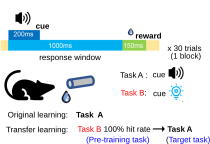
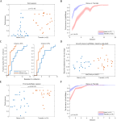
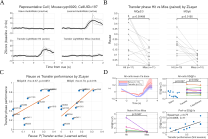
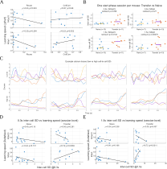
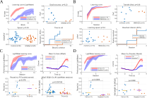
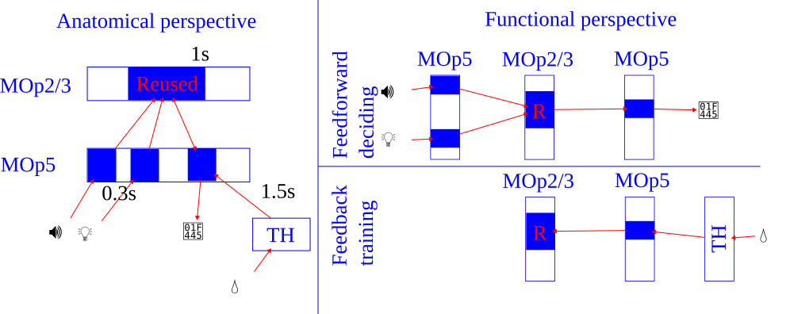

学位论文大纲：迁移阶段光水表现提升与学会声水细胞复用

# 中文摘要
跨任务迁移反映了学习系统在新情境下的样本效率与适应性，但迁移优势在行为上往往同时包含“起点更高”和“学得更快”等多个成分，其神经机制未必由单一指标解释。本研究在小鼠头固定的“提示刺激—延迟—给水”范式中，先训练声提示给水任务（声水）至学会，再切换为光提示给水任务（光水），并与从头学习光水的对照组比较迁移效应。我们结合双光子钙成像在初级运动皮层层2/3与层5对同一细胞群进行跨天追踪记录，构建行为学习曲线与累计达标率（以达到阈值所需会话数的累计比例刻画）等指标，并在神经层面量化学会阶段细胞在迁移阶段的再激活比例（细胞集合复用率）、提示后与给水后时间窗的群体状态相似性（预测—反馈相关性），以及群体分化/稳定性指标（以会话内跨细胞标准差刻画）。

结果显示，迁移光水相较初始光水具有更高的首会话命中率、整体更高的学习曲线以及更快的达标速度；在控制首会话差异后，迁移阶段仍表现出更快的绝对增长速度。神经层面，声水学会阶段活跃的细胞在迁移首会话中更可能再次活跃，复用率与首会话行为表现存在统计对应关系，并与提示后—给水后群体状态的预测—反馈相关性耦合。相比之下，复用率与预测—反馈相关性难以解释后续会话间的增长速度差异；增长速度更与提示刺激及给水后时间窗内的群体分化/稳定性相关，提示学习速率可能受输入/反馈通路的时序结构与稳定性约束。进一步的操纵实验提供初步因果线索：抑制学会阶段活动标记的初级运动皮层细胞集合主要降低迁移首会话表现，而抑制丘脑后部等候选反馈输入通路主要减缓后续增长速度；训练间隔操纵亦支持“提取/调用”和“反馈驱动更新”在行为层面可分离。综上，本研究支持一种“多组件迁移”图景：迁移优势可被分解为起点可用性与后续可塑性两个部分，并分别与细胞集合复用与反馈相关稳定性相联系。

关键词：迁移学习；细胞集合复用；群体表征；初级运动皮层；钙成像

---

# Abstract
Transfer learning enables sample-efficient adaptation, yet behavioral transfer benefits often conflate multiple components (e.g., higher initial performance versus faster subsequent improvement), which may rely on dissociable neural mechanisms. Here we studied cross-modal transfer in head-fixed mice using a cue–delay–reward task: animals were first trained to criterion in an auditory-cued water task and then switched to a visual-cued water task. We compared this transfer condition against a de novo visual-cued control group. We combined behavioral learning curves and cumulative criterion attainment (time-to-criterion) with longitudinal two-photon calcium imaging in primary motor cortex (MOp; layers 2/3 and 5). At the neural level, we quantified single-cell ensemble reuse (reactivation of cells active during the learned auditory task), cue-to-outcome population-state similarity (“prediction–feedback” correlation across time windows), and population differentiation/stability indexed by the within-session inter-cell standard deviation.

Transfer LightWater showed a higher first-session hit rate, an elevated learning curve, and faster criterion attainment compared with de novo learning; critically, transfer also exhibited a higher absolute learning rate after controlling for baseline performance. Neurally, cells active during learned AudioWater were preferentially reactivated in the first transfer session, and reuse correlated with first-session performance and coupled to the prediction–feedback population-state similarity. In contrast, neither reuse nor prediction–feedback correlation explained the variability in subsequent learning increments across sessions. Instead, learning speed was more closely associated with population differentiation/stability during both the cue window and the post-reward window, suggesting that learning dynamics may be constrained by the temporal structure and stability of feedforward/feedback inputs. Perturbation experiments provided preliminary causal support for a multi-component account: inhibiting activity-tagged MOp ensembles primarily reduced transfer baseline performance, whereas inhibiting a candidate posterior thalamic feedback pathway primarily slowed subsequent improvement; an interval manipulation further dissociated “retrieval/availability” from “feedback-driven updating.” Together, these results support a multi-component view of transfer in which baseline advantages relate to ensemble reuse while learning speed relates to feedback-associated stability.

Keywords: Transfer Learning; Ensemble Reuse; Population Representation; Motor Cortex; Calcium Imaging

# 第1章 绪论
## 1.1 研究背景与意义
学习，是一个信息收集、存储、处理的过程。动物通过感官将信息收集到脑内进行存储处理，机器通过传感器将信息收集到磁盘中进行存储处理，然后服务于动物的行为或机器的输出。最终还需要一个外在的观察者，对这种行为或输出做出一个评价。总的来说，学习总是需要大量的信息样本，通过学习的过程将样本存入脑内，形成知识。在这个过程中，观察者能看到行为输出不断改善的现象。
而迁移学习是这样一种特殊的学习，它能够用更少的样本量达到更优化的行为输出，这是因为它可以将之前其它学习任务中得到的知识借用过来。
### 1.1.1 迁移学习的行为学定义与现实意义
迁移（transfer learning）通常被定义为：先前学习对后续在新情境中的学习或表现产生的影响，该影响既可能表现为促进，也可能是干扰或近似为零（Thorndike & Woodworth, 1901；Perkins & Salomon, 1992/1994）。从行为学角度看，迁移的关键并不在于“旧任务学得有多好”，而在于旧任务经验是否使个体在未直接训练过的新任务/新情境中，更快形成有效行为，或以更少的样本量达到相同标准。基于这一观点，迁移研究常将效应操作化为新任务首轮/首会话的起点优势、达到阈值所需的时间或样本量减少（time-to-criterion），以及学习曲线整体高度或增长速度的系统性变化（Bransford & Schwartz, 1999；Barnett & Ceci, 2002）。

在既有研究中，迁移通常从多个维度加以分类：按效应方向可分为正迁移、负迁移与零迁移；按新旧情境的相似度或“迁移距离”可分为近迁移与远迁移，其中远迁移往往发生在表面特征差异较大、但可能共享抽象结构原则的任务之间（Perkins & Salomon, 1992/1994；Barnett & Ceci, 2002）。需要指出的是，迁移与“泛化”相关但并不等同：泛化更强调在同一规则或同一任务族内对未见刺激/新情境的直接推广，常可在较少或无额外训练下观察；而迁移更强调从旧任务过渡到新任务时，行为起点与学习动力学（增长/达标速度）是否发生可测的改变。

与迁移密切相关的现象还包括 learning-to-learn（learning set），即个体在多任务经验积累后呈现更快的后续学习倾向（Harlow, 1949）。在本文语境中，该概念为一种可能的解释提供参照：迁移优势未必完全来自特定表征的复用，也可能涉及更一般的学习率、策略更新或可塑性门控层面的改变。

从现实意义看，迁移能力刻画了生物体在复杂环境中的样本效率与适应性：在训练资源有限的条件下，能否将旧经验转化为新任务的更快掌握，直接关系到学习系统的灵活性与资源节约（Perkins & Salomon, 1992/1994；Bransford & Schwartz, 1999；Barnett & Ceci, 2002）。对于神经科学研究而言，迁移提供了一个将行为现象“机制化”的窗口：它要求神经系统不仅形成特定任务的刺激—反应映射，还需要抽取并调用可跨情境复用的结构成分（规则、策略或表征骨架），从而使旧学习在新任务上以可测方式显现。

在应用领域，迁移学习可以服务于早期教育，也许我们可以给下一代建立一个更优化的迁移模板，有利于他们未来更多具体知识的学习。其次，它可以指导通用人工智能的设计。现在的人工智能大多数都只能做预先设定的任务，这就是因为他们不懂得迁移。将来要想实现通用人工智能，迁移学习是必不可少的能力。最后，它还可以回答一些重大问题，比如我们人类彼此不同的天赋，为什么有的人天才有的人笨，有的擅长这个有的擅长那个，以及我们能在多大程度上后天改变这种天赋。

### 1.1.2 从“行为现象”到“机制问题”的关键矛盾
在迁移学习研究中，一个常被忽略但关键的矛盾是：行为上的“更快/更高”并不必然等价于“学习机制更强”。认知与学习研究反复强调“学习（可保持、可迁移的能力变化）”与“当下表现（受状态与情境强烈影响的可观察输出）”可以显著分离；短期内更好的表现有时并不能预测更好的长期保持或迁移，反之亦然（Soderstrom & Bjork, 2015）。因此，当我们在迁移阶段观察到整体命中率更高或达标更快时，首先需要回答的是：这种优势究竟来自“可迁移的任务相关结构被复用”，还是来自“影响表现但未必改变学习本体”的因素。

具体而言，迁移阶段的行为优势至少可能有三类来源。第一类是**表征/策略层面的复用**：旧任务形成的任务相关细胞集合、群体子空间或策略结构在新任务中被直接调用，从而提高首会话起点，或缩短到达有效行为的探索过程。第二类是**非特异性因素**：觉醒、注意、疲劳、压力或实验条件等状态变量会改变感知增益、反应阈值与行为输出的稳定性，从而“看起来更好/更差”，但其机制并不一定是任务特异的学习痕迹。例如，经典的倒 U 型关系指出过低或过高的唤醒水平都会降低表现（Yerkes & Dodson, 1908）；在神经调制层面，LC-NE 系统被认为以“自适应增益”的方式调节探索—利用与任务投入，从而影响行为表现与学习曲线形态（Aston-Jones & Cohen, 2005）。此外，持续训练所引起的认知/精神疲劳也会改变努力分配与任务承诺，进而影响表现（Boksem & Tops, 2008）。第三类是更抽象的**通用学习率或策略更新机制**：跨任务经验可能改变可塑性门控、探索-利用策略，或形成类似 learning-to-learn 的“元层级”优势，使得后续学习更快（Harlow, 1949）。

更进一步，动机与努力成本本身也会系统性改变行为动力学：多巴胺系统相关理论指出，机会成本与价值评估会调控反应活力（response vigor）与行动投入，从而在不改变任务规则本身的情况下显著影响表现（Niv et al., 2007）；动物与人类研究也强调中脑边缘多巴胺在“努力相关选择”与动机能量化（invigoration）中的作用（Salamone & Correa, 2012）。这些观点共同提示：在迁移阶段观察到的行为优势，必须谨慎地区分“任务相关学习结构的迁移”与“状态/动机驱动的表现变化”。

基于上述矛盾，不应把“迁移优势”视为单一现象，而是把优势拆解为可区分、可统计对齐的行为分量（例如首会话起点、学习曲线整体高度、增长速度/达标速度），并分别讨论其可能的神经机制来源。

### 1.1.3 科学意义与方法学优势
迁移学习之所以具有重要科学意义，部分原因在于它把“学习系统是否具备可复用结构”这一抽象问题，转化为可测的行为动力学差异：旧任务经验究竟通过何种神经机制影响新任务的首会话起点与后续增长/达标速度？在神经层面，这对应至少两类可能的计算成分——一类更偏“可用性/提取”，即旧任务形成的任务相关细胞集合或群体结构在新任务中被直接调用；另一类更偏“学习速率/门控”，即对输入通路与可塑性过程的调制使得后续更新更快。进一步地，如果迁移效应能够被分解为起点与增长两个相对独立的行为分量，那么其神经机制也更可能呈现组件化分工（不同脑区/通路分别影响不同分量），这为后续的因果判别提供了清晰的理论抓手。

在方法学上，本研究的优势在于将“群体表征的可追踪性”与“因果操纵”尽可能结合。首先，双光子钙成像配合高灵敏度钙指示蛋白，使得在行为过程中以单细胞分辨率记录神经群体活动成为可能，从而可以在同一只动物内追踪学习与迁移阶段群体动力学及其细胞集合组成的变化（Chen et al., 2013；Girven & Sparta, 2017）。相较于仅在行为层面比较组间曲线，本研究能够把迁移优势进一步对应到可操作的神经指标（例如细胞集合复用、群体结构稳定性/分化指标），从而为“起点优势/增长优势分别对应什么神经变化”提供统计对齐的基础。

其次，活动依赖标记与化学遗传学等工具使得“复用相关细胞集合/通路”能够从相关性描述推进到因果检验。TRAP 等基于即刻早期基因的策略可以在特定时间窗内对活跃细胞实现持久遗传访问，从而为后续的记录、追踪与操纵提供入口（Guenthner et al., 2013）；DREADD 则提供了在自由行为条件下对特定细胞群体进行可逆抑制/激活的手段，适合检验该群体对迁移阶段表现分量的必要性（Roth, 2016）。更广义的“记忆痕迹/细胞集合（engram）”研究也表明，对活动标记到的细胞集合进行选择性操纵，是连接“细胞集合层面的复用假说”与“行为输出”之间因果关系的重要路径（Tonegawa et al., 2015）。

最后，通过训练日程与输入通路的操纵（例如阶段间隔、上游通路抑制等），可以在实验设计层面区分“旧表征的提取/调用”与“反馈/可塑性门控”对迁移效应的贡献，并把效应明确分配到首会话起点与后续学习速度两个维度上。该策略与本文在 1.1.2 中提出的“学习-表现可分离”框架相一致：只有将行为优势拆分并与可追踪的神经指标及因果操纵相结合，迁移学习才能从现象层面的“更快/更高”推进为机制层面的可证伪命题。

## 1.2 国内外研究现状

### 1.2.1 迁移学习的经典理论脉络：从相同要素到规则/注意与策略
迁移研究的早期观点以“相同要素（identical elements）”为核心：先前训练对新任务的促进，取决于两任务在刺激、反应或刺激—反应联结上共享了多少成分（Thorndike & Woodworth, 1901）。这一观点为“为何同一动物在更换任务后仍能更快上手”提供了直观解释：若新旧任务共享关键要素，则旧经验可直接复用。然而，在许多迁移范式中，新旧任务的表面要素差异明显（例如输入模态变化），但行为优势仍然出现，这提示迁移并不总是依赖简单的“要素重叠”，而可能涉及更抽象的结构成分。

在这一理论脉络更早的源头中，Thorndike 的“猫之迷笼（puzzle box）”实验通常被视为动物学习研究的先驱与代表性工作：研究者将猫置于带有机关的箱体内（如拉环、拨杆或踩踏板），箱外放置食物作为奖励；猫最初会表现出多样、近似随机的探索性行为，偶然触发机关后逃出并获得食物。随着试次重复，猫逃脱所需时间逐步缩短，行为从“多种尝试”收敛为更稳定的有效反应。Thorndike 将这一现象概括为试误学习（trial-and-error learning）并提出“效果律（law of effect）”：在特定情境下导致满意结果的反应倾向于被强化，而导致不满意结果的反应倾向于被削弱（Thorndike, 1898）。从迁移视角看，这组实验不仅奠定了“学习可用行为动力学来刻画”的方法范式，也为后续“相同要素”观点提供了直觉基础：当新情境在关键刺激线索或动作—结果关系上与旧情境共享成分时，旧的反应倾向更可能被直接调用；反之，则需要重新探索与再学习。

在“保持反应不变、替换支配性线索”的更直接实验检验上，Wylie 在芝加哥大学的博士论文系统研究了白鼠的“响应迁移/
泛化反应（transfer of response/generalized response）”：在同一实验箱中保持主要情境与反应要求恒定，通过更换来自不同感觉通道的支配性刺激（光、声，及在回避范式中的电击/痛刺激）来测试迁移（Wylie, 1917）。其设计包含（i）先学会对单一线索作出正确选择或回避反应，（ii）随后将线索从光切换为声（或反向），以及（iii）在切换前加入若干“光+声同时呈现（simultaneous series）”的过渡训练以促进迁移。值得注意的是，该研究明确报告奖励食物为葵花籽，并在负性回避反应中发现“先学光、再学声”相较于直接学声具有显著的节省效应，而少量同时呈现训练可进一步加速对新线索的掌握。这类“跨感觉通道线索替换—迁移”范式为后续声/光交换式迁移设计提供了经典的可核查先例，也提示迁移优势可通过操纵“过渡阶段是否同步呈现两线索”来被系统性调控。

围绕“抽象成分如何产生”的问题，辨别学习传统提出了以注意/线索获得性为核心的机制：学习不仅建立联结，还会改变个体对哪些线索维度“更值得看”（associability/attention）。例如，线索的熟悉与区分经验可使相关维度变得更易获得，从而促进在新辨别任务中的迁移（Lawrence, 1949；Sutherland & Mackintosh, 1971）。在更系统的形式化模型中，Mackintosh 理论强调：更能预测结果的线索会获得更高注意权重，因此在后续学习中更有效（Mackintosh, 1975）；而 Pearce–Hall 模型则强调“惊奇/不确定性”会提升线索的可联结性：当结果难以预测时，线索在随后的学习中更可能被重新加权（Pearce & Hall, 1980）。这两类机制虽然在细节上不同，但共同提供了一个关键启示：迁移优势可以来源于“注意与加权规则”的改变——旧任务训练使动物更快把资源投入到新任务的关键维度/关键时间窗，从而表现为首会话起点提升，或表现为达到稳定策略所需的样本量减少。

在更现代的迁移框架中，研究重心逐步从“刺激—反应成分”转向“策略/规则与表征空间”的可复用结构：即个体能否抽取任务的抽象结构（例如时序结构、动作—结果关系、有效探索策略），并在新任务中快速调用（Perkins & Salomon, 1992/1994；Bransford & Schwartz, 1999；Barnett & Ceci, 2002）。
### 1.2.2 多重记忆系统与迁移：海马—皮层—纹状体的分工
迁移并不一定发生在单一“记忆痕迹”之上，而常常体现为多个学习/记忆系统在新任务中以不同方式被调用。经典的多重记忆系统观点将“可陈述、可灵活重组”的记忆与“程序性、习惯化”的记忆区分开来，并指出二者依赖不同脑网络：以海马为核心的内侧颞叶系统更擅长快速编码事件与关系结构，支持灵活提取与组合；而以纹状体为核心的基底节系统更擅长通过重复强化建立刺激—反应或动作序列的自动化执行（Squire, 2004；Yin & Knowlton, 2006）。因此，同样的“迁移优势”在行为层面可能看起来都是“更快/更高”，但其机制可以截然不同：它既可能反映海马系统对“任务结构/情境状态”的快速重建与调用，也可能反映纹状体系统对“动作策略/时序习惯”的直接泛化。

在迁移研究语境中，海马系统更常与“结构化知识/关系泛化”相关。海马能够把分散的线索与结果组织成可检索的关系表征，并在新情境下进行重组与推断，从而支持跨情境的规则迁移与快速适应。尤其值得强调的是 schema（图式/框架）观点：当新信息能够嵌入既有知识框架时，编码与巩固会显著加速，迁移阶段因此可能表现出更高的首会话起点或更短的探索期（Tse et al., 2007；van Kesteren et al., 2012）。

与此同时，迁移效应还会受到“记忆在海马—皮层之间如何随时间重组”的影响。互补学习系统（complementary learning systems, CLS）理论提出：海马用于快速存储具体经验，而新皮层通过更慢的整合过程形成更稳定、更抽象的知识（McClelland et al., 1995）；随后的系统巩固（systems consolidation）过程会改变记忆对不同脑区的依赖，使得远期记忆更可能在皮层网络中以更分布式的方式被检索（Frankland & Bontempi, 2005）。

最后，纹状体/习惯系统为迁移提供了另一条路径：在反复训练后，行为控制往往从更灵活的系统向更自动化的系统转移，表现为更稳定的动作序列与更低的探索成本（Yin & Knowlton, 2006）。这种自动化在“结构相似”的迁移情境下可能带来显著的首会话优势，但当新任务需要重新赋值或改写策略时，也可能产生干扰或限制灵活调整。经典的双系统操纵研究显示，抑制海马或尾状核会以不同方式影响地点学习与反应学习的表达，提示至少存在可分离的“空间/关系”与“反应/习惯”学习通路（Packard & McGaugh, 1996）。

### 1.2.3 表征复用的神经表征框架：低维子空间/流形与快速学习
随着大规模群体记录技术成熟，越来越多研究发现：尽管单神经元放电具有高度异质性，神经群体活动往往可被少数潜在维度所刻画，即存在能够捕获主要协方差结构的低维子空间/流形（neural manifold）。围绕这一经验事实，方法学综述系统梳理了群体数据的降维与状态空间建模工具（如 PCA/FA/GPFA、jPCA、非线性流形学习等），并强调这些工具并非“压缩数据”本身，而是将群体活动组织成可比较、可推断动力学结构的表征（Cunningham & Yu, 2014）。在运动控制研究中，动力系统视角进一步提出：与其把神经活动解释为“对运动参数的静态调谐”，不如把群体状态随时间演化的轨迹视为产生动作的计算过程；因此，关键问题是群体状态如何在低维空间中推进、受到哪些约束以及如何被学习重塑（Shenoy et al., 2013）。

在这一框架下，Gallego 等的综述提出“从流形生成运动”的观点：运动皮层群体活动的主要变化可在低维模式（neural modes）张成的子空间内表达，时间依赖的模式激活序列构成产生肌肉样输出的“生成器”，从而把“群体协方差结构”和“行为输出”联系到同一套状态空间语言中（Gallego et al., 2017）。更重要的是，流形并不意味着僵硬不变。后续工作显示，在保持总体低维结构的前提下，个体神经元在不同运动行为或任务条件下可以显著重排，但群体层面的流形结构仍可呈现一定的保留性，从而支持不同动作或情境之间的共享计算骨架（Gallego et al., 2018）。这种“单神经元可变—群体结构可保留”的并存，为理解“复用”提供了一个比细胞集合交集更抽象、也更可操作的描述层级。

流形/子空间框架还为“学习为何有时很快、有时很慢”提供了约束性解释。Sadtler 等在脑机接口（BCI）范式中提出：当新映射的需求与既有流形对齐时，动物能较快适应；而当需求迫使群体活动离开既有流形时，学习显著受限，表现为更慢的适应甚至失败，从而揭示“可学习性”受限于群体状态空间中可达区域的结构（Sadtler et al., 2014）。在此基础上，Perich 等进一步提出一种“快速学习的群体机制”：学习可以更多依赖对既有群体活动模式的读取与重加权（re-mapping/re-association），而不必要求流形本体发生大幅改变；这使得系统能够在保持总体稳定性的同时实现快速适配（Perich et al., 2018）。

综上，低维子空间/流形与群体动力学视角把“复用/稳定—可塑性”从直觉表述推进为可检验的量化对象：一方面，研究者可以比较不同阶段或不同条件下流形的几何结构、轨迹形态与稳定性；另一方面，也可以把学习过程刻画为在既有状态空间内的“重映射”或“越界扩展”，从而将学习速度、可达性约束与群体结构联系起来（Vyas et al., 2020）。

除“几何/动力学”框架外，信息论提供了另一类与具体解码器或线性假设相对解耦的量化语言，可用于在单细胞与群体层面刻画“表征中到底携带了多少关于刺激/行为/结果的信息”。经典综述从神经编码角度系统阐述了熵、互信息与时间精度等概念在神经数据分析中的作用，并强调信息量估计与有限采样偏差校正的重要性（Borst & Theunissen, 1999）；随后也有面向群体记录的综述进一步将信息论与解码/混淆矩阵等方法联系起来，讨论如何从神经群体响应中提取关于任务变量的信息，以及如何在多神经元条件下处理冗余与协同等问题（Quian Quiroga & Panzeri, 2009）。近年来，针对神经科学研究者的信息论教程进一步总结了常用估计器、偏差校正与实际分析流程，为在学习/迁移研究中把“起点优势（可用信息更高）”与“后续更新（信息随训练上升或重分配）”分离提供了方法学依据（Timme & Lapish, 2018）。

值得注意的是，信息论/熵类指标在学习过程中的变化往往并非简单单调。以技能习得为例，有研究用运动轨迹的熵/复杂度指标刻画镜像描图任务的练习过程，报告随试次推进呈现“早期上升、随后下降”的非单调变化，并将其解释为学习早期探索与试误带来的行为变化扩张、学习后期动作模式稳定化带来的收敛（Murakami & Yamada, 2025）。与之互补，在灵长类习惯形成任务中，随着训练推进行为序列趋于更重复、更可预测（不确定性降低），多脑区记录所反映的网络动力学也呈现更“高效受控”的组织趋势（Brynildsen et al., 2026）。这些证据提示：若把学习理解为“探索—利用/收敛”的动态过程，那么熵（或相关的复杂度、熵率等指标）可能出现阶段依赖的上升与下降；因此，在迁移范式中以熵/互信息等量化神经活动与行为序列的不确定性，并比较其在首会话与后续会话的演化，有望为区分“起点可用性”和“更新/收敛速度”提供补充维度。

### 1.2.4 运动皮层（MOp）在学习、策略与迁移中的作用
运动皮层（在小鼠常以 MOp/M1 及相邻额叶运动区统称）长期被视为下行运动指令的关键来源，但越来越多工作提示其功能并非仅是“输出肌肉命令”，而是以更高维度的方式参与感觉—动作映射、动作准备与在线校正。以群体动力学视角为代表的理论框架指出，运动相关活动可以被理解为群体状态在状态空间中的演化过程：准备态为后续运动轨迹设定初始条件，执行期则体现为在低维结构内展开的时间序列计算（Shenoy et al., 2013；Vyas et al., 2020）。这一观点与解剖分层的通路组织相吻合：浅层与深层、不同投射类型的细胞群在准备与执行、局部回路与下行输出之间可能承担不同分工。

从皮层分层与投射类型看，MOp 的浅层（层 2/3）神经元更偏向于参与皮层内与皮层—皮层的信息整合与局部回路计算，而深层（尤其层 5）则包含更多直接下行与跨区投射的细胞类型，使其更贴近行为输出与跨区闭环调节。相应地，在技能习得与感觉—动作映射形成过程中，学习相关的微回路重塑与细胞集合特异性可以在细胞分辨率层面被追踪（Komiyama et al., 2010；Papale & Hooks, 2018）；而对熟练动作的在线控制与表现，往往更直接依赖运动皮层及其输出相关通路组件（Guo et al., 2015），并且运动皮层对“习得”与“执行”的必要性会随技能阶段与任务要求而改变（Kawai et al., 2015）。因此，在跨模态迁移范式中，一个更贴近解剖分层的可检验假设是：迁移首会话的“起点可用性”更可能依赖浅层回路对既有策略/表征的快速提取与对新线索的再关联，而后续学习速率则更可能受深层输出与其上游反馈环路对误差/反馈信号路由与稳定性的约束（Li et al., 2015）。

关于学习与可塑性，越来越多细胞分辨率的研究显示，运动皮层在技能习得过程中发生显著且结构化的重组。早期双光子成像工作在小鼠行为任务中观察到：学习伴随特定神经元集合之间的相关活动增强与功能聚类形成，提示学习相关的微回路重塑可在细胞集合层级被追踪（Komiyama et al., 2010）。与此相一致，运动技能训练也被证明能够诱发与学习阶段相关的突触/棘突重排与选择性稳定化，从而在结构层面支持长期行为改变。这些结果共同表明，运动皮层的学习相关变化并非“整体增益”的非特异性漂移，而更可能体现为对特定动作策略、时序结构或感觉—动作映射的选择性重编码。

从输出通路与回路可实现性角度看，选择 MOp 作为迁移相关群体表征的核心记录/操纵对象，也具有明确的解剖学合理性：运动皮层的下行纤维在脑干—延髓区域汇聚并经锥体下行，在尾侧延髓发生锥体交叉后进入脊髓，同时在脑干沿途可向多种下游运动相关结构发出侧支；因此，脑干/延髓可被视为连接“皮层计划/选择信号”与更末端运动执行回路的关键节点。该下行系统的发育、演化与功能/疾病相关证据在综述中已有系统总结（Welniarz et al., 2017），为“运动皮层活动变化能够通过下行通路影响实际动作输出（包括口面部/舌相关运动）”提供了结构基础。

更关键的是，因果操纵研究进一步限定了运动皮层在学习与执行中的必要性边界。Kawai 等通过系统性损毁/抑制与行为追踪，提出运动皮层在某些技能的“习得阶段”是必要的，但在技能高度自动化后，其“执行阶段”可以在较弱的皮层依赖下被维持，暗示学习过程中可能存在由皮层驱动、随后由下游回路接管或固化的机制（Kawai et al., 2015）。与之互补，Guo 等在啮齿动物精细运动控制任务中提供了另一类证据：运动皮层对熟练动作的在线表现具有直接贡献，提示不同任务维度（精细度、反馈依赖性、时序要求）可能决定“皮层在执行期的必要性”究竟强或弱（Guo et al., 2015）。因此，将“运动皮层是否必要”视为二元问题往往过于粗糙，更合理的表述是：运动皮层对学习—执行链条中哪些计算环节（准备、选择、在线校正、自动化后的读出）承担何种可分离贡献。

进一步地，运动皮层也被证明包含与动作计划与运动启动相关的结构化通路。以小鼠为模型的研究揭示，特定投射类型的深层神经元与局部回路在准备态向执行态的转换中发挥关键作用，从而把“计划/策略信号”与“下行驱动”纳入同一通路框架加以解释（Li et al., 2015）。这些因果与通路层面的证据使得“相关性观察”能够被更精确地约束：当在群体层面观察到学习相关的稳定成分与可塑成分并存时，这种并存并不必然矛盾，反而可能反映不同细胞类型/投射通路在稳定读出与灵活更新之间的结构性分工。

### 1.2.5 RSPd 与丘脑后部：情境/状态表征与跨区路由的候选通路组件
压后皮层（retrosplenial cortex, RSP；啮齿动物中常包含 RSPd 等亚区）被认为处于海马系统与后内侧皮层网络的关键枢纽位置，其解剖连接使其能够同时接收与情境、空间与记忆相关的输入，并与顶叶—视觉等皮层区域形成广泛交互。综述性证据显示，RSP参与线索—情境关系的加工、空间认知以及长期记忆的形成与提取，其功能很难被压缩为单一“空间编码”或单一“记忆存储”，更可能体现为对多线索信息的整合与对情境状态的表征/转换(Miller et al., 2014; Vann et al., 2009)。在与空间定向/导航相关的任务背景下，大量原始研究进一步表明RSP对外部视觉线索（尤其是稳定地标/场景参照）具有突出的表征与锚定作用：空间变量与方向相关表征往往可被视觉地标强烈校准，甚至呈现相对自运动线索更占主导权重的地标支配特征(Jacob et al., 2017)，并在细胞层面观察到与视觉地标相关的表征组织与对齐(Fischer et al., 2020; Sit & Goard, 2023)。从皮层地理位置看，这种“视觉相关性偏强”的经验事实也可以理解为一种“近邻效应”：在啮齿动物中，RSP位于大脑内侧壁后部，后缘紧邻（并在分区边界上直接毗连）枕叶视觉皮层（如V1/V2等）前缘；而其前方则与扣带/内侧运动相关皮层（如ACA/MOs等）相接，处于视觉皮层与更前方运动/决策相关联络皮层之间的带状过渡区域。因而，无论是来自视觉场景/地标的外部参照，还是来自运动相关皮层的内部状态/运动计划信息，都在几何意义上更容易通过短程皮层通路“汇入并在此交汇”(Franklin & Paxinos, 2019; Vann et al., 2009; Wang et al., 2020)。此外，在更一般的关系学习范式中，RSP也被认为参与不同线索之间的联结形成(Robinson et al., 2011; Robinson et al., 2014)。在这一层面上，RSP可被视为一种将外部线索组织为“可用于行为选择的情境/状态变量”的候选组件：它不必直接决定动作输出，但可能影响动物在何种内部状态下读取既有策略或更新映射。

与上述框架一致，细胞分辨率的群体记录工作为 RSC 的“情境/状态表征”提供了更直接的表征学证据。Mao 等在自由探索条件下记录到：RSC 群体活动可以以稀疏、近似正交的方式表征不同空间上下文，并在环境操控时呈现部分重映射特征，提示该区域能够以较低的互混程度区分上下文并维持可分离的群体表征（Mao et al., 2017）。这类结果并不必然意味着 RSC 独立生成空间地图，而更支持一种网络层面的解释：RSC 在海马—皮层系统之间提供一种“可被读取的上下文坐标系”，使得相同外部线索在不同情境下能够被赋予不同的预测意义，或使得经验能够被更有效地绑定到特定状态之上。

在丘脑层面，越来越多研究强调高阶丘脑核团不仅是“感觉信息中继”，还可能通过皮层—丘脑—皮层（corticothalamocortical）通路参与跨皮层区域的信息传递与路由选择。经典实验证据表明，皮层输出可以通过高阶丘脑核团形成一种“经丘脑的皮层—皮层通路”，从而驱动更高阶皮层区域的活动（Theyel et al., 2010）。与之相辅，回路层面的综合框架提出：高阶丘脑可被视为跨区通信的结构化节点，其输入侧既能整合来自皮层深层的驱动信号，也能叠加来自基底节、丘脑网状核与脑干调制系统等的门控作用，从而以特定通路基元改变皮层信息流动、增益与可塑性窗口（Halassa & Sherman, 2019）。在灵长类注意研究中，丘脑枕核（pulvinar）被证明能够以频段特异的方式调节皮层间同步性，从而在网络层面影响信息在皮层区域之间的有效传输（Saalmann et al., 2012）。这些结果共同提示：位于后部的丘脑核团（如 LP/PO 等）具备成为“跨区路由/门控”组件的通路条件，其作用可能表现为对特定信息通路的选择性放大、对皮层状态的稳定化，或对学习过程中输入—反馈耦合的时序结构施加约束。

与本文关注的“运动皮层—体感/反馈通路—行为输出”链条更直接相关的是，小鼠丘脑后核（posterior nucleus, PO；常见命名还包括 POm）被视为典型的高阶丘脑节点：其解剖连接并不局限于单一感觉模态的单向上行，而是与运动皮层与体感皮层之间存在密切的双向耦合关系，能够嵌入皮层—丘脑—皮层环路，从而在感觉引导动作、状态依赖的感觉处理以及跨区通信中发挥作用。Shepherd 与 Yamawaki 的综述从细胞类型与环路“驱动/调制”两类输入的角度，系统梳理了包括 PO 在内的高阶丘脑如何接收来自皮层深层的强驱动输入并将信息回送到皮层多个区域，使其具备在运动相关计算中承担“中继并重整跨区信息流”的潜在能力（Shepherd & Yamawaki, 2021）。

综合而言，若将学习与迁移视为在不同情境状态下对策略/映射的调用与更新过程，那么一个合理的候选图景是：RSPd/RSC 提供相对可分离的情境/状态表征，而后部/高阶丘脑通过 transthalamic 通路与门控基元，调节状态依赖的信息传递与可塑性窗口。该图景的价值在于它给出可证伪的、回路层面的预测：不同节点的干预应当以可分离的方式影响“状态表征的可分辨性”与“跨区传递/更新效率”，并且这种影响更可能体现在学习动力学与网络时序结构上，而不必在所有行为指标上呈现同向变化。

### 1.2.6 活动依赖标记与操纵：把“复用”变成可检验的因果问题
要将“学习过程中哪些细胞参与了特定计算”这一问题从相关性描述推进为可判别的因果命题，一个关键技术前提是：能够在自然行为条件下，围绕特定事件的时间窗对活跃细胞进行标记（tagging），并在随后的时间尺度上对同一群体进行追踪、记录或操纵。记忆痕迹/神经元集合（engram/neuronal ensemble）的研究传统强调：学习所涉及的细胞并非任意抽样，而是在可塑性与兴奋性约束下形成可被再次激活的集合；因此，若能在编码或提取的关键时间窗“捕获”这些细胞并对其进行干预，就能够把群体层面的表征假说转化为可检验的必要性/充分性问题（Tonegawa et al., 2015；Josselyn & Tonegawa, 2020）。

与“单一经验的可再激活集合”相呼应，已有研究进一步表明：不同经验之间可以通过细胞集合的部分重叠实现“跨经验调用/链接”，从而为“迁移学习中的细胞级复用”提供了更接近机制层面的先验框架。以情境记忆为例，Cai 等发现相近时间编码的两段情境记忆会被分配到具有更高重叠度的神经元集合中，并提出共享集合可以在行为上把两段记忆链接起来(Cai et al., 2016)。随后 Yokose 等进一步指出，这种“重叠记忆痕迹”对记忆之间的链接是必要的，但对单个记忆的回忆并非必然必要，提示“集合重叠”更像是一种支持跨情境/跨经验泛化与调用的资源，而不仅是单条记忆的唯一载体(Yokose et al., 2017)。尽管上述证据多来自情境记忆范式而非经典的迁移学习范式，但其核心概念——共享/重叠分配、再激活、经验间链接——为“学会→迁移阶段细胞集合复用”假说提供了可对照的理论与方法学参照：当新旧任务共享某些抽象结构或关键时间窗计算时，系统可能通过复用既有集合或其子集来获得迁移首会话的可用性优势。

从证据边界上看，上述工作首先回答的是：集合重叠是否会影响行为层面的记忆链接/泛化表现（并可通过干预给出因果证据），这与在连续自然行为中建立“重叠子集的瞬时活动幅度/时序→试次级行为输出强度”的精细映射并不等价。与此同时，也已有更接近“回合/事件级”对齐的结果把“编码—提取的集合重叠/再激活”与行为表达直接关联：活动依赖标记的经典研究显示，学习期被标记细胞在回忆期的再激活比例与条件性冻结水平呈正相关(Reijmers et al., 2007)；结合在体钙成像的研究进一步观察到，记忆印迹细胞在冻结事件起始前数秒出现时间锁定的活动增强（相对非印迹细胞更明显），提示记忆相关集合的活动可在事件级别与行为表达对齐(Mocle et al., 2024)。并且这些证据并不都局限于“场景恐惧记忆”：Reijmers等研究的是巴普洛夫式线索恐惧条件化（听觉 CS—US 联结、冻结读出），而杏仁核在体记录也在更典型的线索/联结范式中刻画了学习相关集合在检索时的选择性再激活及其与条件反应强度/检索成败的对应关系(Grewe et al., 2017)。因此，这一证据谱系为“复用集合是否在关键回合/时间窗驱动或预测行为优势”的可检验假设提供了更可对照的方法学参照。

在分子遗传工具层面，最常见的策略是利用即刻早期基因（immediate early genes, IEGs）作为神经活动的转录读出，并将其转化为对活跃细胞的遗传访问入口。例如 TRAP（targeted recombination in active populations）通过在 *Fos* 或 *Arc* 启动子下表达他莫昔芬依赖的 CreERT2，使得细胞只有在“活动驱动 IEG 表达”与“药物时间窗允许重组”同时满足时才发生重组，从而在小时级别时间窗内对活跃细胞群体进行永久标记（Guenthner et al., 2013）。这类方法的优势在于能与多种效应器模块化组合（荧光标记、解剖追踪、钙成像探针或操纵工具），并可在群体层面实现跨日追踪；但其局限同样明确：IEG 表达对细胞类型、放电模式与状态变量敏感，时间分辨率通常较粗（以小时计），且阈值与背景表达会影响“被捕获群体”与“真实计算群体”的一致性，因此需要严格的时间窗对照与行为学控制来界定可解释边界（DeNardo et al., 2019）。

当“标记”与“操纵”结合时，工具的时间尺度差异会直接决定能回答的问题类型。化学遗传学 DREADD（如 hM4D(Gi)）通过配体介导的 GPCR 信号实现分钟级起效、小时级持续的可逆调控，适合检验某一细胞集合在较长行为阶段内的必要性，并具有实现门槛相对低、自由行为兼容性较好的优势（Roth, 2016）。与此互补，光遗传学以毫秒级时间精度提供更高的因果定位能力，能够把效应限定到更短的事件相关时间窗，并支持对通路动力学与时序因果链条的更严格检验（Deisseroth, 2015）。这两类方法并非相互替代，而更像是对“长期状态调控”与“瞬时时序因果”的互补取样。

近年来，另一条重要技术路线是将细胞内 Ca2+ 升高（作为神经活动的更近端指标）与光门控相结合，构建“光 + 活动”双门控的转录开关，从而在更窄的时间窗内标记被激活的细胞集合。Wang 等提出的 FLARE（以及相关的光/钙门控转录因子）使研究者能够在特定光照时间窗内把活跃细胞转化为可表达报告基因或效应器的群体，为“在自然行为中捕获瞬时活跃集合并随后操纵”提供了新的路径（Wang et al., 2017）。随后也出现了对背景表达、亚细胞定位与时间精度的改进版本，例如 soma-targeted Cal-Light 用于更精细地标记活跃细胞（Hyun et al., 2022）。总体而言，这类工具把“细胞是否活跃”更直接地映射到可遗传访问与操纵能力上，使得对神经集合与回路组件的因果检验在时间精度与可操作性上进一步提升，但其实现仍依赖光递送、表达系统与行为范式之间的工程匹配，并需要在解释上谨慎区分“被标记细胞”与“最小必要计算单元”之间可能存在的偏差。

此外，目前所有的活动依赖标记技术，都存在以下难以完全消除的通病：
- “活跃—标记”一致性有限。基于 IEG（如 *Fos/Arc*）的捕获，本质上是把神经活动转写为基因表达信号：其触发既依赖刺激强度与持续时间，也受细胞类型/状态、阈值设定、时间积分与背景/基线表达影响。由此容易出现两类偏差：一是非特异性诱因（如应激、处理、背景活动）导致的假阳性；二是短暂或幅度较小的激活未达阈值导致的假阴性。因此，更稳妥的解释是“富集了与该时间窗事件相关的细胞群体”，而非将其视为真实计算集合的无偏“金标准”，并应尽可能与钙成像/电生理或严密的行为对照相互印证（Chung, 2015；Perrin-Terrin et al., 2016）。
- 从标记到可操纵的时间延迟。多数遗传访问与效应器表达需要经历重组、转录翻译与表达稳定等过程，常以“天—周”为尺度；因此，实验上常操纵的是“一段时间前曾被招募/曾满足标记条件的群体”。而记忆痕迹/细胞集合在巩固与检索过程中可能发生系统层面的重组与集合成分变化，导致“当时被标记”与“当前参与表征/检索”之间不一定一一对应（Tonegawa et al., 2018；Josselyn & Tonegawa, 2020）。在这种时间尺度错配下，对被标记群体的干预更适合被解释为对“历史招募细胞的必要性/充分性”证据，而非对“当前瞬时因果链”的精确定位。

因此，在现阶段技术限制下，对活动依赖标记与操纵所得结果的解释应保持边界：把它作为重要因果线索，与在线记录、解剖/通路证据及多重对照交叉验证，才能获得更稳健的结论。


### 1.2.7 奖励预测误差（RPE）与“预判性抑制”：从教学信号到预测/误差信号
强化学习传统将奖励预测误差（reward prediction error, RPE）视为把“预期—结果差”转化为权重更新的核心教学信号。经典电生理研究表明，中脑多巴胺神经元的瞬时放电可随正/负预测误差而增强或抑制：意外奖励诱发增强，预期奖励被省略诱发抑制；随着学习进展，反应往往从结果本身逐步转移到能预测结果的线索上（Schultz et al., 1997）。随后更精细的研究进一步强调，多巴胺活动不仅反映误差的符号，也可携带误差幅度的定量成分，为把行为学习曲线与神经“教学信号”对齐提供了可操作的表征（Bayer & Glimcher, 2005）。在具有“线索—延迟—结果”结构的任务中，这一框架自然引出一个重要推论：当线索已能可靠预测结果时，结果时刻的误差分量应当显著减弱，而与学习更新更相关的信号更可能前移到线索出现后或其邻近时间窗。

与强化学习中“价值误差”的表述互补，预测编码/预测处理（predictive coding/processing）框架从更一般的层面提出：神经系统通过自上而下的生成式预测来解释输入，偏离预测的成分以“误差信号”形式驱动更新；因此，对可预期输入的反应衰减（suppression/silencing）可被理解为预测对感觉证据的“解释掉（explaining away）”，而非简单的适应性疲劳。早期理论工作将该思想形式化为对皮层额外经典感受野效应的功能解释（Rao & Ballard, 1999），随后提出了更具体的分层微回路实现：浅层更偏向误差、深层更偏向预测/反馈，二者通过抑制性互作实现误差传递与预测校正（Bastos et al., 2012；Keller & Mrsic-Flogel, 2018）。在人类视觉皮层的实证研究中，预测与注意的交互被用于检验“反应衰减”是否依赖任务相关性与精度加权：当刺激被注意标记为更高精度时，预测相关的抑制效应可被反转或显著减弱，提示注意可能通过提高预测精度或提高感觉证据权重来重配“预测—误差”之间的平衡（Kok et al., 2012）。

从“外部感觉预测”扩展到“动作后果预测”，类似的思想在感觉—运动耦合研究中以更直接的因果结构出现：系统可以学习性地抑制自我行动带来的可预期感觉后果，从而提高对外界意外输入的敏感性。以小鼠听觉皮层为例，研究发现存在可塑性的皮层滤波机制，能够学习抑制运动所致的可预期声学后果，并在预测被违背时释放更强的误差样反应（Schneider et al., 2018）。这类结果提示，“预判性抑制”并非仅是单一区域的被动衰减，而可能是跨层、跨区回路在学习过程中形成的前馈/反馈抑制结构，其功能目标是把可预期成分从感觉流中剥离，从而把神经资源更多分配给偏离预测、具有更新价值的成分。

因此，将 RPE 与预测编码并置并不要求把二者简单等同：前者强调价值相关的教学信号，后者强调一般意义上的生成式预测与误差传递；但二者共同指出一个可检验的计算结构——学习推进时，误差信号在时间上会从结果时刻向更早的预测线索时刻迁移，同时对可预期后果的神经反应更可能呈现前置的抑制或被“解释掉”。在实验与分析层面，这一结构为后续区分“线索相关更新”与“结果相关更新”、以及区分“抑制性预测”与“误差驱动更新”提供了理论语言。

### 1.2.8 机器迁移学习与冻结层机制：表示复用、稳定-可塑性权衡与快速适配
深度学习语境下的迁移学习通常被描述为“先在源任务上预训练，再在目标任务上适配”的两阶段流程，其核心假设是：模型内部存在一部分可跨任务复用的表示，而另一部分需要随任务目标与数据分布变化而重新校准。综述性工作把这一流程系统化为领域适配、特征迁移与参数迁移等多种形式，并强调迁移收益取决于源—目标相关性、表示层级以及适配策略的选择（Pan & Yang, 2010）。在工程实践中，最常见的适配方式是仅训练顶层“任务头（task head）”或仅对高层进行微调（fine-tuning），而将底层参数冻结（freezing）。这一经验与层级表征观点相一致：更底层的特征往往更通用（例如边缘、纹理等局部统计），而更高层特征更贴近任务目标与标签语义，因此在跨任务适配时，高层更需要更新，底层更适合保持稳定（Yosinski et al., 2014）。

从优化与统计学习角度看，“冻结—微调”的策略可被理解为一种对参数空间的结构化约束：冻结降低了有效自由度，使得在目标数据量较小或噪声较大时更不易过拟合，同时也限制了表示漂移（representation drift），从而提升训练过程的稳定性与可重复性。与此配套，实践中还发展出更细粒度的控制手段，例如分层学习率（discriminative learning rates）与逐步解冻（gradual unfreezing），即先仅训练顶层、随后逐层解冻并用较小学习率更新更底层参数，以在“保留通用表示”与“获得足够适配能力”之间取得折中（Howard & Ruder, 2018）。这类策略的共同点在于：把适配过程显式拆分为“快速读出/重加权”与“必要的表示重塑”两个阶段，使适配既能快速起步，又不至于因全网络同时更新而产生不稳定或性能退化。

进一步地，迁移学习与持续学习（continual learning）研究把“稳定—可塑性权衡”推向更严格的形式化：当系统需要在序列任务上持续学习时，过度可塑会导致对旧任务知识的灾难性遗忘（catastrophic forgetting），而过度稳定又会抑制新任务获得。作为代表性方法之一，弹性权重固化（elastic weight consolidation, EWC）提出用近似 Fisher 信息刻画参数对旧任务的重要性，并对重要参数施加更强的二次惩罚，以在学习新任务时选择性地保持关键权重稳定，从而缓解遗忘并维持迁移/累积学习能力（Kirkpatrick et al., 2017）。尽管这类方法针对的是人工网络，但它提供了一个清晰的计算语言：迁移收益并不只来自“是否复用”，也来自“如何在复用的同时控制更新”，即通过结构化约束把可塑性集中到更合适的子集或更合适的时间窗内。

### 1.2.9 小结：当前研究空缺
综上，迁移学习在行为层面的“更快/更高”并不能直接指向单一机制，而更像是多种计算成分叠加后的可观察结果。已有行为学与教育心理学传统强调迁移效应具有情境依赖性与多维度形态（例如近/远迁移、策略层面的迁移距离等），但在实验神经科学中，迁移优势仍常被压缩为少数总体指标，从而容易掩盖“首会话起点”与“后续增长/达标速度”可能受不同约束的事实（Barnett & Ceci, 2002；Bransford & Schwartz, 1999）。与“学习 vs 表现”可分离的观点相结合，这提示更合适的研究路径是把迁移优势拆分为可对齐的动力学分量，并在神经层面为这些分量寻找可分离的候选表征或通路组件（Soderstrom & Bjork, 2015）。

从“动力学分量拆分”走向可复现比较，一个经常被忽略但非常关键的环节是：**学习速度（learning speed/learning rate）如何被操作化与统计估计**。在行为学习研究中，“学得更快”并不只有一种口径，常见的量化指标至少包括：
（1）**学习曲线斜率/增量**：将表现（命中率、反应时、正确率等）对训练进程（会话/试次编号）做线性或分段回归，以斜率作为学习速度，并可在混合效应模型框架下为个体引入随机斜率，从而在控制基线差异与重复测量结构的同时估计“绝对增长速度”（Baayen et al., 2008）。
（2）**达标时间/样本量（time-to-criterion）**：以达到预设阈值所需的会话数/试次数作为速度指标，与本文使用的累计达标率口径一致，能直接对应“样本效率”。
（3）**非线性学习曲线参数**：用指数/幂律等函数拟合“早期快、后期渐近”的学习轨迹，以速率常数 $k$ 或时间常数 $\tau$ 表示学习速度。围绕“练习定律（law of practice）”，经典工作指出群体平均的幂律形式并不必然适用于个体层面，指数（或延迟指数）在许多个体数据上更合适，这提示在比较学习速度时应明确采用的曲线族与拟合层级（个体/群体）（Heathcote et al., 2000）。
（4）**状态空间/多过程模型的学习率**：在运动学习等领域，常将行为更新分解为不同时间尺度的适应过程（快/慢过程），其学习率与遗忘率参数可被解释为“对误差的敏感度/更新强度”，为“学习速度”提供更机制化的参数定义（Smith et al., 2006）；进一步研究表明学习率并非恒定，可随误差历史而变化（Herzfeld et al., 2014）。

因此，在迁移范式中讨论“绝对学习速度”时，最稳健的写法往往是：明确速度指标口径（斜率、达标、曲线参数或模型学习率），并在统计上区分基线（首会话起点）与后续更新（增长速度）两部分，以避免把起点差异误当作“学习更快”。

与此同时，“复用”本身并不是单一层级概念。群体记录与降维研究表明，单细胞活动在跨日/跨条件下可显著重排，而群体协方差结构、低维子空间或动力学骨架仍可能表现出一定保留性；因此，将复用仅等同于细胞集合交集往往过于狭窄，也可能遗漏更抽象、更贴近计算层面的共享结构（Cunningham & Yu, 2014；Gallego et al., 2017；Gallego et al., 2018）。当前文献中复用的操作性定义并不统一：有的强调集合重叠，有的强调子空间对齐，有的强调状态空间轨迹或动力系统结构的保留。不同定义对应不同的可检验预测，也对应不同的数据需求与统计口径；因此更稳健的证据链往往需要多层级指标的相互印证，并明确各指标的解释边界。

第三，尽管“群体结构约束可学习性”的观点已在脑机接口等范式中得到有力展示，但把群体结构/稳定性与自然行为学习动力学在同一分析框架下对齐，仍缺少足够可复现、可跨实验对照的指标体系与比较范式。一方面，流形约束与对齐/越界的概念为解释“为何某些适配很快、某些适配很慢”提供了强约束语言（Sadtler et al., 2014；Perich et al., 2018；Vyas et al., 2020）；另一方面，如何将这种约束映射到更广泛任务中的学习曲线形态、以及映射到具体回路输入/反馈的时序结构上，仍需要在数据处理、统计对齐与跨天稳定性控制方面形成更一致的方法学共识。

最后，机制层面的判别往往受限于因果证据的稀缺与证据类型的割裂：许多工作要么停留在行为曲线与神经指标的相关性层面，要么在操纵上缺乏对神经表征变化的同步记录，使得“操纵影响了什么计算环节”难以被定位。活动依赖标记、化学遗传学与光遗传学等工具为把“候选集合/通路”纳入可逆因果检验提供了可能，但其说服力依赖于对时间窗、状态变量与读出指标的精细控制，以及对“操纵改变了哪些群体表征成分”的统一分析（Roth, 2016；Deisseroth, 2015；Tonegawa et al., 2015）。因此，更有力的收束并不是提出单一路径，而是明确：迁移现象需要在“行为分量拆分—多层级复用定义—群体结构与学习动力学对齐—因果操纵与表征变化联立”这一证据链上逐段推进，才能将现象层面的迁移优势转化为机制层面的可证伪命题。
## 1.3 本论文研究目标、问题与假设
### 1.3.2 核心科学问题
- Q1：迁移阶段光水的行为表现提升是否显著、稳健？首会话表现和后续学习速度是完全关联的还是有独立性？
- Q2：声水学会的任务相关细胞集合在迁移阶段是否被复用？复用程度是否预测行为优势？
- Q3：迁移学习的增长速度与什么因素有关？是否存在和机器学习类似的机制？
### 1.3.4 本论文研究内容与技术路线
- 数据与范式：双光子钙成像 + 行为任务（声水转光水），覆盖初始、学会与迁移阶段。
- 分析主线：
	- 行为优势拆解：首会话表现、学习曲线整体高度、学习速度与达标速度。
	- 复用与群体结构：单细胞复用率、与行为的相关性；以及与学习动力学相关的群体稳定性/结构指标（例如细胞间标准差、相关性类指标）。
	- 机制推进：在相关性基础上，引入活动依赖标记与抑制、以及输入通路/训练日程操纵，区分“起点优势”与“增长速度优势”的因果来源。
### 1.3.5 本论文的创新点与预期贡献
- 将迁移优势从行为学上分解为“起点”与“增长/达标速度”，并在神经层面给出可操作、可对齐的指标与证据链。
- 在单细胞分辨率下，把“迁移阶段首会话优势”与“学会阶段细胞集合复用”建立可追溯的统计对应关系。
- 将群体稳定性/结构指标与学习动力学（会话步长等）联合分析，为“增长速度差异”提供区别于复用的解释维度。
- 将活动依赖标记和输入输出组件与抑制纳入迁移研究框架，形成从相关到因果的分层论证，并提出可进一步验证的多组件机制预测。
### 1.3.6 论文结构安排
- 第2章：材料与方法（实验范式、数据处理、指标定义、统计方法、操纵实验组织）
- 第3章：结果（行为优势拆解、复用与群体结构、学习速度关联、因果操纵证据）
- 第4章：讨论（机制解释、与现有理论对话、局限性与未来方向）
- 第5章：结论与展望
# 第2章 材料与方法
## 2.1 常用耗材术语表
签膏套装：盐酸金霉素眼膏（恒久远）。牙签。无尘棉签（CA-002SP，亚速旺）。

CNO：	Clozapine (N-oxide，CNO) （麦克林）。1×D-PBS溶液（不含钙、镁）（Coolaber）。预先配置 5㎎ CNO / 8.3㎖ D-PBS 溶液，冻存于-20℃。此药物用于抑制表达了hM4D(Gi)的神经元，注射量是3㎕/g体重，在实验前1h腹腔注射。
## 2.2 实验动物
所有实验小鼠为C57BL/6J品系，上海科技大学SPF动物设施饲育，10周龄。其中野生型由上海吉辉供应，cFos等特殊品系来自友好实验室赠予。
## 2.3 基本钙成像颅窗手术
设备工具：高纯氧-异氟烷气体混合气管系统（瑞沃德）。立体定位注射系统（瑞沃德）。精细镊（5SF，Dumont，F.S.T）。10㎜不锈钢手术剪刀。颅钻&钻头（瑞沃德）。
### 2.3.1 预备耗材
pAAV2/9-hSyn-GCaMP6f-WPRE病毒（和元生物）。签膏套装。毛细玻璃管（瑞沃德）。异氟烷（瑞沃德）。镀镍PA十字圆头自攻电子细小螺丝微型精密盘头加长尖尾螺钉（安固盾）。	1×D-PBS溶液（不含钙、镁，Coolaber）。吸收性明胶海绵（祥恩）。无水乙醇丨Ethanol absolute丨64-17-5（国药/沪试）。5mm圆玻片（WPI）。	牙科日进自然义齿基托聚合物树脂（脉尚（MAISHANG））。502胶水（得力）。小鼠头部固定架（TC4钛合金定制，第鑫）。动物伤口缝合胶水（TIGERGENE）。	1×D-PBS溶液（不含钙、镁）（Coolaber）

毛细玻璃管使用瑞沃德拉针仪拉成尖细玻璃针用于注射病毒。吸收性明胶海绵剪成1~3㎜见方小块泡在D-PBS溶液中。圆玻片泡在无水乙醇中。
### 2.3.2 手术步骤
将小鼠放入透明密闭麻醉盒中，通入混有高浓度异氟烷的高纯氧，观察小鼠呼吸周期，超过1s时，麻醉完成。用牙签撬开小鼠嘴，使其咬在立体定位仪咬板上。两侧耳杆浅浅插入鼠耳头端腹侧的骨洞中，然后将通入低浓度异氟烷的呼吸罩紧密覆盖鼻子，拧紧固定。

如小鼠此时出现呼吸困难症状，可能是耳杆、咬板和趴床相对位置不合适，应当仔细调整直到小鼠呼吸顺畅。最多每隔5分钟就应观察一次小鼠呼吸周期，一旦超过1s应当降低异氟烷浓度，以免小鼠麻醉过度而死。

取两根牙签插入盐酸金霉素眼膏中，使其沾满富有粘性的眼膏。用这两根牙签将头皮要剪开的路径上的毛发拨到两侧，露出下方皮肤（有些毛发浓密的小鼠可能无法露出皮肤，可以忽略）。路径一般是一个椭圆，头侧至两眼间，尾侧至头盖骨后方覆盖的肌肉处，左右至头盖骨两侧肌肉完全暴露。然后沿该路径剪下一块头皮。将眼膏挤在鼠眼上，确保完全覆盖眼珠。

观察头盖骨上呈“土”字形的骨缝分布。中缝线最前端称A点，中间的交点称Bregma(B)，最后的交点称Lambda(L)。如果不具有典型的交点，可以画出一个交点三角区，取三角区中心点。

调平。调平主要调节绕 ZXY 3 个轴的旋转，一般允许有0.05㎜以内的误差。

Z：用注射针尖点在A点，令此处X坐标归0。然后移到I点，调节耳杆、呼吸罩等固定器，绕Z轴旋转鼠头，使I点X坐标也恰好为0。再返回A点再次归0。如此反复，直到A点和I点的X坐标均为0，则Z转轴调节完毕。

X：先点在B点，令此处Z坐标归0。然后移到I点，调节平台X转轴，使I点Z坐标也恰好为0。再返回B点再次归0。如此反复，直到B点和I点的Z坐标均为0，则X转轴调节完毕。

Y：最后是Y转轴。计算缩放后的注射位点坐标，MOp(Y=1.113,X=1.496)，其Y坐标参照的是BI距离3.8的颅骨。实际颅骨BI距离可能不为3.8，其Y坐标就需要缩放为1.113*BI/3.8。然后：

1. 找到(X=0,Y=1.113BI/3.8)位置记为C点，也就是与注射点Y相同的中缝线处。
2. 将针尖点在(X=3,Y=0)处，记为D点，Z坐标归0。
3. 再找到(X=-3,Y=0)处，记为D'点，看其Z坐标是否为0。
4. 若不为0，调节平台Y转轴使其恰好也为0，然后针尖回到中缝线，将X坐标归0，返回第2步。若为0，调整完成。

按照新的坐标重新找到注射位点MOp(Y=1.113,X=1.496，右侧)，令其XY坐标归0。然后标定8个圆周点并用钻头浅钻标记(X,Y)：(-1.2,0)(-0.599,1.626)(0.85,2.3)(2.299,1.626)(2.9,0)(2.299,-1.626)(0.85,-2.3)(-0.599,-1.626)。用钻头平滑曲线连接这8个点，形成一个直径约4.3㎜的圆窗轮廓。

沿开窗范围圆轨迹一圈钻通颅骨。
- 钻的顺序并不是任意的，而是应当确认骨内是否嵌有大血管，以及骨下脑表面是否有大血管。骨内有大血管的，应当安排在最后钻通，优先钻通没有骨内大血管的部分。骨下有大血管的则反之，应当安排优先钻通，非常小心，尽可能减少对大血管的损伤。如果骨内骨下均有大血管的，则优先照顾骨内大血管，安排在最后钻通。

- 整个钻的过程中都应当尽可能做到恰好钻通一条细细的裂缝而不伤及脑。可以用镊子轻轻按压轨迹内部，确认弧内外是否已经断开。及时吹散骨灰，用海绵洗去出血，保证视野清晰，以免颅骨已钻通而不自知。

- 最后钻有骨内大血管的部分。开钻之前，窗周围围一圈海绵，时刻准备扑上去止血。不同于其它部位，此处必须快准狠，宁可令骨下脑组织受到一些伤害，也要一口气将其迅速钻通。钻的过程中此处会快速大量出血，一旦拖延过久会使小鼠失血过多而死。钻之前必须记牢要钻开的轨迹，因为大量出血会遮挡视线，且没有时间给你止血（止也止不住），一旦开钻就要做好一路盲钻到底的准备，只能依赖记忆。另一只手准备好镊子，实时用按压法测试还有哪里没有钻通。

- 一旦全部钻通，整个圆形骨片会明显呈现游离状态，用镊子迅速拔下骨片（有些部位可能没有完全分离，需要镊子抓稳稍用力拔断），然后再敷上大量海绵按压止血。此处止血比较困难，一般需按压1分钟左右。海绵不再膨胀后，更换新海绵，此时如又开始出血则需再次按压1分钟，如此反复，直到更换新海绵时不再出血，即为止血成功。

- 偶尔也可能遇到更换多次仍血流不止的情况，则可以将海绵撕成尽可能小的块，精准地堵住出血点，不再取下，一并压入窗内。小块海绵一般不会严重影响清晰度。

利用之前标记的两个窗外参照点找回注射点。然后将病毒吸入注射针，执行注射。注射病毒速率50nL/min。注射量200nL。从脑质表面开始计量，2层300㎛深，5层630㎛深。

注射完毕后，剥离硬脑膜。掀下骨片时有可能已经带下来部分脑膜，须注意观察。脑膜和脑质表面存在光学和材料力学上的明显差异，可以借助灯光和镊子轻触进行试探观察，确认脑膜是否已经剥除。确认脑膜存在的，如已经破损则可借破损处将镊子探入脑膜和脑质之间，将脑膜剥除；如脑膜完好无损，则寻找远离注射点、无较粗血管处，镊子提起、夹破脑膜，强行突破口。此时可能会少量出血，要立即止血，避免在脑表面留下凝血痕迹。此外，远离注射点，且有大血管分布的部位，可以不剥除脑膜，以免大出血。

封窗。取一玻璃片，用D-PBS洗去表面无水乙醇，压在窗内凸起的脑上，将其重新压回颅内，压平。将502胶水与义齿基托聚合物粉1:1混合均匀，得到的水泥绕玻璃片一周，将其黏附在颅骨上并使得窗内完全密封不透气，注意不能留气泡在窗内。水泥尽量大面积覆盖窗表面，但必须留开注射位点周边，作为观察孔。如果不小心覆盖了观察孔，可以用镊子反复旋转刮除多余水泥。水泥在凝固过程中会慢慢变粘变硬，当其达到软泥状时可以轻松刮除，留下清澈平滑的玻璃表面。

将头部固定架放在窗周，向左前方空地确定一点钻小坑，旋入自攻螺钉。用镊子、剪刀等将两侧肌肉与颅骨表面剥离，但避免伤害肌肉。剥离后应当暴露颅骨侧面，横向钻一小坑，旋入自攻螺钉。两侧颅骨均如此法，最终应有2根颅钉水平嵌入侧面颅骨中。这2颗横向颅钉将为后期牙科水泥的固定提供强大的物理锁定能力。

颅钉必须在封窗后插入，否则颅压过大会造成小鼠容易死亡。

清理侧颅2根颅钉周围的出血，或用滤纸片吸干未凝血，暴露清洁的颅骨。然后将头架安装在窗周围，确保头架平面平行于窗玻璃平面。将义齿基托聚合物粉液套装1:1混合均匀，得到的水泥进行浇筑。早期水泥较稀时，优先浇筑在颅钉和窗周围，确保尽可能紧密结合、密封，特别要确保侧向颅钉的下部被水泥充分包围。后期水泥粘稠，可覆盖其它区域。头架和水泥黏附极为牢固，一般无需担心头架单独脱落。水泥尽量大面积覆盖窗表面，但必须留开注射位点周边，作为观察孔。如果不小心覆盖了观察孔，可以用镊子反复旋转刮除多余水泥。水泥在凝固过程中会慢慢变粘变硬，当其达到软泥状时可以轻松刮除，留下清澈平滑的玻璃表面。

关闭麻醉，释放鼠头固定装置（主要是耳杆和呼吸罩）。如果时间充裕，可以静置小鼠，待其自然苏醒再放回鼠笼，使得水泥有充分的凝固时间。

术后间隔3周以上，供小鼠恢复、病毒表达。
## 2.4 基本钙成像行为实验
设备工具：小鼠固定床（铝合金3D打印，云洞三维）。灌胃针12号 65mm直头（servicebio）。透明塑胶水管。进口S2加硬材质小内六角扳手套装1mm公制螺丝刀工具（燚陇秉）。双光子激光显微镜系统（Olympus）。滴管。两台计算机（双光子主机、双光子辅助机）。蠕动水泵（昱瑟）。水瓶。杜邦线（risym）。继电器（MOSFET）。ARDUINO Due A000062。	Momentary Capacitive Touch SNSR Breakout （触感电容，Adafruit）。14*7MM直流高分贝讯响器3-24V1407有源一体压电式蜂鸣器（RunesKee）。

预备耗材：三折擦手纸（清风）。沪试牌75%乙醇消毒液丨Ethanol 75%丨64-17-5（国药/沪试）。签膏套装。纯净水。
### 2.4.1 设备部署
将三折擦手纸卷曲垫在小鼠固定床上，将小鼠头架两翼对称地夹在固定床卡口中，螺丝刀旋紧。乙醇浸润棉签后涂抹在颅窗玻璃表面，擦去浮尘污垢等，顽固污渍可用牙签轻轻刮除。用牙签蘸取眼膏，在窗周围一圈涂抹，作为防水层，然后用滴管滴入纯净水，形成凸透镜形状。将小鼠和固定床一起放在物镜下，镜头浸没在水滴凸透镜中。

小鼠嘴前放置灌胃针，使得小鼠能且仅能伸舌头恰好碰到针头。灌胃针管后部连接橡胶管，橡胶管连接蠕动水泵，水泵另一端连接水瓶，这样水泵开动时就可以从水瓶抽水，水珠悬挂在灌胃针上，小鼠伸舌头就能舔到。水泵的正负电极通过杜邦线连接到3.3V-12V继电器的12V端，3.3V端连接Arduino开发板控制。灌胃针外还缠绕杜邦线剥出来的铜线圈，通过杜邦线连接到触感电容。这样小鼠舌头触碰针头时，触感电容就会感应到，发送信号给Arduino。蓝色LED灯放在小鼠左眼旁，有源蜂鸣器放在小鼠耳畔，均连接Arduino开发板控制。Arduino开发板连接到双光子辅助机，双光子显微镜连接到双光子主机。

在Arduino控制下，水泵一滴水约150㎳，15㎕。

在双光子辅助机上，打开通用行为实验控制软件（自主开发，代码在GitHub），使用Development_Client上传Arduino程序，在SelfCheck_Client中测试光、声、水泵、电容传感器，是否工作正常。一切正常后，在Experiment_Client中输入当天要进行的会话设计和鼠号。

在双光子主机上，打开 Olympus FluoView 31S-SW 软件，调整920㎚红外激光，预览钙信号，并通过显微镜系统调整设定2/5层成像面。额外开启2个电流检测通道，一个连接到触感电容用于对齐舔水事件，另一个连接到Arduino用于对齐声/光命令。拍摄帧率是1秒8帧，同时记录2/5层。
### 2.4.2 训练日程设计
首先停止供水，令小鼠处于口渴状态，36h后开始训练。

首先训练基本舔水动作，不拍钙信号。用通用行为实验控制软件的SelfCheck_Client在灌胃针上挂一滴水：
  - 如果小鼠30s内不舔，就将灌胃针捅进小鼠嘴里。
  - 如果小鼠不咽水/吐水，训练结束，12h后再次尝试。
  - 如果小鼠30s内舔掉了水，则至少等待10后，再次挂一滴水
  - 如果小鼠连续10次成功在30s内舔水，认定为基本舔水动作已学会
  - 如果本会话小鼠已摄入30滴水仍未学会，会话结束，12h后再次尝试。

12h后开始初始学习。首次初始学习前，还要拍摄一张Galvano参照图，以便后续每次拍摄和它配准。初始学习分30个重复回合，全程Resonant拍摄。每个回合的步骤是：
1. 抽取一个5~10s的随机时间，记为A
2. 在A时间内，监控触感电容。一旦小鼠舔水，电容响应，就重置本步骤。也就是说，本步骤将会一直等待，直到小鼠在连续A时间内没有任何舔水动作，才会结束。
3. 蜂鸣器（提示刺激）响200㎳。与此同时开始一个1s的监控窗口，在窗口内有任何舔水动作，即将本回合记为命中。无论是否命中，本步骤都只有1s监控窗口的时长即结束。
4. 给一滴水，无论是否命中
5. 等待固定20s。

这样训练步骤所应看到的正常行为现象是，小鼠在训练刚开始时，对提示刺激无响应，只有在给水后才会舔水。训练结束时，一给提示刺激，小鼠不等给水，就立即舔水。



当有初始学习会话达到100%命中后，初始学习阶段结束。12h后，进入迁移学习阶段。迁移学习只是将初始学习中，蜂鸣器的提示刺激换成了蓝光LED，其它设计完全相同。同样达到100%命中后，该鼠的所有实验结束。

实验过程全程由Arduino程序自动控制，并向双光子辅助机发送实时实验日志，包括每个回合的时间、给提示刺激时间、给水时间、舔水时间等。同时，每个会话都由双光子主机负责控制双光子显微镜持续进行钙信号拍摄。拍摄前先调整拍摄位置，尽量与Galvano参照图配准。精确配准在后续处理步骤进行。
## 2.5 视频配准和测量
一次拍摄会话过程中难以避免地会有抖动。为了将拍摄全程所有时点的细胞位置在会话内配准，使用统一实验分析作图软件（自主开发，MATLAB代码在GitHub），将每个会话的原始OIR视频读入，配准后输出到TIFF格式。程序在自建的4路 NVIDIA GeForce RTX 3090 计算服务器上执行以提高性能。配准的基本原理是：
1. 将视频分成26帧的块（26这个参数是性能和质量的权衡值，越大质量越好但性能越差）
2. 每一块内部两两计算normxcorr2，即归一化互相关，找到相关性最高的偏移量，就是平移偏差。这样，每一帧都能得到与其它25帧的偏移。将这25个偏移量求平均，就得到该帧的块内偏移量
3. 将块内每一帧都应用各自的块内偏移量以后，再把配准后的块内所有帧平均起来，作为本块的代表帧
4. 将整段视频所有分块的代表帧拼成一段新的视频，回到第1步循环，直到只剩最后一帧。在这个循环过程中，每次循环视频都会等比例缩短，形成金字塔结构：原始视频在底层，然后逐层网上叠加1/26长度的视频。
5. 金字塔每一层都有该层所有帧的偏移量信息。当金字塔封顶后，对原始视频的每一帧，可以计算出它从塔底到塔顶所经历的所有偏移量。将这些偏移量叠加起来，就是该帧的最终偏移量。例如，原始视频第5000帧在金字塔底层，将被分配到第193块；第2层，第8块；封顶。最终应用3层偏移量叠加得到最终偏移量。
6. 为所有原始视频帧应用最终偏移量，输出TIFF。此外，还会将OIR中记录的电流检测通道每帧平均，输出到 MATLAB .mat 数据库。

在文件内配准中，只考虑平移偏移，不考虑旋转、缩放、剪切、投影或任何其它非刚性非全局扭曲。这些扭曲有可能存在，但在一次拍摄会话约30min的时间窗口内通常没有显著影响。但是，要将不同会话之间的，即不同视频文件之间的细胞配准起来，就需要考虑更复杂的变换。特别是一些训练较慢的日程中，拍摄周期可能超过2周，那么第一次和最后一次拍摄之间就可能产生相当严重的扭曲。这种扭曲已经超过普通图像配准算法的识别能力，无法全自动完成，因此需要人工介入。使用 Fiji ImageJ 软件打开经过文件内配准的TIFF视频，手动圈出若干配准特征点，并在Galvano参照图中也按照相同顺序圈出对应的特征点，然后保存为RoiSet.zip。然后，可以运行程序自动读取识别特征点，根据特征点的位置变化，使用 MATLAB fitgeotform2d 算出二维变换参数，然后对不同文件进行全体一致的非刚性变换。特征点圈得越多，配准就越精确，这样就可以有效控制文件间配准的质量。

所有视频完成配准后，再次用 Fiji ImageJ 软件打开并手工圈出要测量的细胞位置。也尝试过一些自动化细胞识别算法，与手工圈的相比效果始终不理想，所以此步骤保留手工操作。一般一只鼠一层细胞在100~600之间，工作量稍大但尚在可接受范围。

圈好后同样用程序自动测量圈内平均像素值。此外，还要额外进行散射光矫正：将圈外扩展30像素的圆环作为散射光范围，扣除范围内包含细胞的像素后，剩余像素的均值当作“散射光”从圈内测量值中扣除。
## 2.6 操纵实验
### 2.6.1 cFos标记抑制
预备耗材：pAAV2/9-hSyn-DIO-hM4D(Gi)-mCherry-WPRE病毒（和元生物）。他莫昔芬溶液(遗传操作试剂) (20㎎/㎖玉米油， Reagent grade)（碧云天 Beyotime）。CNO。

$cFos-Cre^{ER}$品系小鼠，可以将注射Tamoxifen药物24h后时间窗内活跃的神经元，其细胞质内的$Cre^{ER}$蛋白入核，使得DIO结构包裹的DNA序列得到表达。相比于基本迁移实验流程，其不同之处在于：
1. 手术阶段，双侧MOp额外注射DIO-hM4D(Gi)病毒200nL
2. 对照组在断水时注射他莫昔芬溶液，使得标记窗口在未经任何训练任务中度过
3. 初始训练100%后，实验组注射他莫昔芬溶液，开启标记窗口。然后暂不进行迁移训练，而是继续每隔12h训练初始任务。此外，实验组每隔36h注射一次他莫昔芬溶液，共5次。
4. 距离初次注射他莫昔芬经过8天后，开始训练迁移任务，但需要用CNO抑制初始任务中活跃的细胞。
### 2.6.2 非特异性抑制
预备耗材：pAAV2/9-hSyn-hM4D(Gi)-mCherry-WPRE病毒（和元生物）。pAAV2/9-hSyn-mCherry-3xFLAG-WPRE病毒（和元生物）。CNO。

与基本迁移实验区别在于：
- 手术时，实验组在双侧MOp额外注射hM4D(Gi)病毒200nL，对照组注射mCherry荧光对照病毒200nL
- 每个训练会话前1h注射CNO
### 2.6.3 TH抑制
预备耗材：pAAV2/9-hSyn-hM4D(Gi)-mCherry-WPRE病毒（和元生物）。CNO。

TH，即Thalamus，丘脑。实际注射点是后端的PO脑区（Allen Brain Atlas 命名规范），AP=1.79（Interaural前），ML=1.362（双侧），DV=2.875（相对于脑膜表面）。在该脑区注射hM4D(Gi)病毒200nL。在迁移学习阶段的每个会话前注射CNO抑制TH。对照组是正常迁移，其它与基本迁移实验相同。
### 2.6.4 放假7天
初始任务学会后，不立即迁移，而是停止训练，恢复供水，正常饲养7天后，再做迁移任务（当然也要提前36h停水）。对照组是正常迁移，其它与基本迁移实验相同。
## 2.7 观察RSPd颅窗的迁移实验
病毒注射点取RSPd（AP=Interaural+0.728㎜，ML=右侧0.781㎜，DV=脑膜下0.15（RSPd2/3）/0.30（RSPd5）㎜）并在周围开窗，其它与基本迁移开窗手术相同。
## 2.8 数据处理算法
本节以MATLAB代码形式定义一些统计指标的术语，将在结果部分引用

ZScore：
```MATLAB
function Data=ZScore(Data)
%z-score算法，以Cue前3s为基线
arguments (Input)
	%假设输入数据是（细胞×时间×回合）的张量。每个回合取Cue前3s到后3s，一共6s，采样率8㎐，因此时间轴有48个点
	Data(:,48,:)
end
arguments(Output)
	%输出相同形状的张量
	Data(:,48,:)
end
%取-3~0s，即前24个时间点作为基线。
Baseline=Data(:,1:24,:);

%用数据减去基线时间均值后，再除以时间标准差，得到z-score
Data=(Data-mean(Baseline,2))./std(Baseline,[],2);
end
```
NTATS，多组归一化回合累积信号值 (Normalized Trial-Accumulated Trial Signals)：
```MATLAB
function Data=NTATS(Data)
%NTATS算法，基于ZScore
arguments (Input)
	%假设输入数据是（细胞×时间×回合）的张量。每个回合取Cue前3s到后3s，一共6s，采样率8㎐，因此时间轴有48个点
	Data(:,48,:)
end
arguments(Output)
	%输出为（细胞×时间）的矩阵，输入的回合维度被规约为中位数了
	Data(:,48)
end
%直接对ZScore取回合间中位数
Data=median(ZScore(Data),3);
end
```
细胞活跃性判定，基于NTATS：
```MATLAB
function CA=CellActive(Data)
%细胞活跃性判定算法，返回逻辑向量，指示每个细胞被判定为活跃还是不活跃
arguments (Input)
	%假设输入数据是（细胞×时间×回合）的张量。每个回合取Cue前3s到后3s，一共6s，采样率8㎐，因此时间轴有48个点
	Data(:,48,:)
end
arguments(Output)
	%输出为只有一个细胞维度的逻辑向量
	CA(:,1)
end
CA=NTATS(Data);
%首先计算细胞×时间的NTATS矩阵

Baseline=CA(:,1:24);
%取-3~0s，即前24个时间点作为基线。

CA=CA(:,32)>mean(Baseline,2)+3*std(Baseline,[],2);
%判定细胞在Cue后1s（即第32个时间点）处的NTATS是否大于基线均值加3倍标准差，若是则判定为活跃（true），否则为不活跃（false）
end
```
细胞复用率，基于细胞活跃性：
```MATLAB
function RR=ReuseRate(TargetSession,LearnedSession)
%计算LearnedSession中活跃的细胞在TargetSession中复用的比例
arguments (Input)
	%要计算复用率的目标会话数据，假设是（细胞×时间×回合）的张量。每个回合取Cue前3s到后3s，一共6s，采样率8㎐，因此时间轴有48个点
	TargetSession(:,48,:)
	%作为基准的“学会”会话数据
	LearnedSession(:,48,:)
end
arguments(Output)
	%输出复用率，标量
	RR(1,1)
end
%首先计算两个会话各自的细胞活跃性逻辑向量
TargetSession=CellActive(TargetSession);
LearnedSession=CellActive(LearnedSession);

%取出LearnedSession中活跃的细胞，计算它们在TargetSession中也被判定为活跃的比例
RR=mean(TargetSession(LearnedSession));
end
```
预测正确率，即1s与1.5s相关性：
```MATLAB
function [Rho,P]=CellCorr(Data)
%预测正确率算法，计算1s-1.5s的全细胞相关性
arguments (Input)
	%假设输入数据是（细胞×时间×回合）的张量。每个回合取Cue前3s到后3s，一共6s，采样率8㎐，因此时间轴有48个点
	Data(:,48,:)
end
arguments(Output)
	%输出为标量，表示细胞相关性
	Rho(1,1)
	%显著相关性的p值
	P(1,1)
end
Data=NTATS(Data);
%首先计算细胞×时间的NTATS矩阵

%取1s和1.5s，即第32和第36个时间点，计算Spearman相关性
[Rho,P]=corr(Data(:,32),Data(:,36),Type='Spearman');
end
```
细胞间标准差，需要输入一个时间点参数，因此可以计算一个会话的所有回合中，任何一个时间点的全细胞标准差：
```MATLAB
function ICS=InterCellSD(Data,Time)
%计算指定时间点的细胞间标准差，基于NTATS
arguments (Input)
	%假设输入数据是（细胞×时间×回合）的张量。每个回合取Cue前3s到后3s，一共6s，采样率8㎐，因此时间轴有48个点
	Data(:,48,:)
	%要计算标准差的时间点
	Time(1,1)duration
end
arguments(Output)
	%输出为标量，表示指定时点的细胞间标准差
	ICS(1,1)
end
Data=NTATS(Data);
%首先计算细胞×时间的NTATS矩阵

%取指定时间点的数据，计算细胞间标准差
ICS=std(Data(:,uint8(Time/seconds(1/8))),[],1);
end
```
排除天地板效应
```
function Valid=ExcludeCeilingFloor(Performance)
%根据一只鼠的会话命中率序列，排除天地板效应，返回具有有效学习率的会话的逻辑向量
arguments(Input)
	%输入数据是一只鼠按时间顺序排列的所有会话的命中率
	Performance(:,1)
end
arguments(Output)
	%输出数据是与输入数据同长度的逻辑向量，指示哪些会话具有有效学习率
	Valid(:,1)logical
end
Valid=true(size(Performance));

%排除天花板效应，第一个100%及之后的会话全部排除
Valid(find(Performance==1,1):end)=false;

%排除地花板效应，最后一个0%及之前的会话全部排除
Valid(1:find(Performance(Valid)==0,1,'last'))=false;
end
```
会话步，计算每个会话到下一个会话，命中率的变化量：
```MATLAB
function DN=DeltaNext(Performance)
%计算Performance的每步增量（差分）
arguments(Input)
	%输入数据是一只鼠按时间顺序排列的所有会话的命中率
	Performance(:,1)
end
arguments(Output)
	%输出数据是每步增量
	DN(:,1)
end
%排除天地板效应后，计算每步差分
DN=diff(Performance(ExcludeCeilingFloor(Performance)));
end
```
达标率曲线。输入一个训练任务全程所有会话每只鼠的命中率，以及一个标准阈值，输出每个会话有多少比例的鼠达标
```MATLAB
function CR=ComplianceRate(SessionTable,Criterion)
%达标率曲线算法，计算每个会话有多少比例的鼠已达到目标命中率
arguments (Input)
	SessionTable(:,3)table
	%会话表现表，一行一个会话，包含3列：
	% - Mouse(:,1)string，鼠名
	% - Index(:,1)uint8，会话在该鼠中的序号
	% - Performance(:,1)single，会话命中率

	Criterion(1,1)single
	%目标命中率
end
arguments (Output)
	CR(1,:)single
	%达标率向量，指示每个会话有多少比例的鼠已达到目标命中率
end
%计算每只鼠在第几个会话达标
CR=groupsummary(SessionTable(SessionTable.Performance>Criterion,:),"Mouse",'min',"Index");

%对每个会话，计算达标鼠数占总鼠数的比例
CR=sum((1:max(CR.min_Index))>=CR.min_Index,1)./numel(unique(SessionTable.Mouse));
end
```
# 第3章 结果

## 3.1 迁移光水行为表现优于初始光水

**图3.1 迁移光水行为表现优于初始光水。（A）首个光水训练会话的命中率，每个点一只鼠。使用非配对Wilcoxon秩和检验。（B）初始/迁移光水训练过程的学习曲线比较，展示每个会话的鼠间平均命中率，阴影表示±SEM。使用方差分析，只含线性主效应模型，在控制学习进程（会话序数）后，P值检验两组总体平均表现（曲线整体“高度/截距”）是否有差异；它不检验“学习速率差异”。（C）比较初始/迁移的达标率曲线，左右分别是达标阈值80%和90%（D）增长斜率差异，一个点一只鼠。先对每鼠做线性拟合（会话，命中率）得到原始斜率；再拟合斜率~首会话命中率，取残差作为基线校正斜率。检验P值采用线性混合效应模型，以会话:分组（迁移相对初始的斜率差异）的p值作为图中标注的“LME p=…”。（EF）同AB，但展示声水的初始/迁移行为表现。**

首先考察针对光水任务的迁移和初始表现。结论简明：迁移光水的首会话命中率显著高于初始（图 3.1A），学习曲线全程凌驾于初始之上（图 3.1B），在任何一个会话阶段都有更多的鼠达到80%或90%（图 3.1C）。
与迁移学习类似的一个经典概念是“泛化”。它的经典描述是在场景恐惧任务中，小鼠能对不同于训练场景的新场景做出恐惧样冻结行为，就好像它把新场景“误认”成了旧场景，或旧场景的记忆“泛化”到了新场景。和迁移学习一样，泛化都要求新旧任务场景设置或提示刺激的相似性，也都得到行为表现高于未经初始训练的动物的结果。不同之处在于，泛化实验通常仅仅检测动物在新任务中对旧记忆的提取，而不关注对新任务的继续训练会有何不同；而迁移学习还要额外强调新任务的学习速度也比初始学习更快，而不仅仅是起点更高。于是，使用线性混合效应模型将起点差异排除后，确实可以看到迁移光水的绝对学习速度仍然高于初始（图 3.1D）。
声水任务的初始/迁移表现也具有类似差异性特征。但是，由于在初始学习阶段命中率就已经过半，可供迁移学习继续提高的窗口较小，迁移学习进程极短，许多鼠在第一个迁移会话直接100%（图 3.1EF），这导致后续对迁移的绝对学习速度的分析难以进行。因此后续分析以光水任务的迁移为主，声水任务仅供参考。

## 3.2 学会-迁移细胞复用

**图3.2 学会-迁移细胞复用的群体活动表型（基于NTATS）。（A）代表性单细胞复用示意。选择同一细胞（同一 CellUID），展示其在初始声水（Naive AudioWater）不活跃、学会声水（Learned AudioWater）活跃、迁移光水命中（Transfer LightWater Hit）活跃、迁移光水错失（Transfer LightWater Miss）不活跃的条件下的时序活动。（B）声转光迁移四泳道热图。同一批细胞在初始声水、学会声水、迁移光水命中/错失四种条件下的 NTATS（0~3s）并列展示，细胞顺序在四泳道间一致；剔除各泳道均不活跃的细胞。（C）初始/学会光水两泳道热图。剔除各泳道均不活跃的细胞。（D）学会声水与迁移光水命中/错失的 NTATS±SEM。以细胞为统计单位做均值曲线。（E）三组在1s处的NTATS（学会声水/迁移命中/迁移错失）比较。对同一批细胞配对比较。（F）两组细胞的 NTATS@1s 非配对比较。A组为最终光水（Final LightWater）中活跃的细胞，比较其在迁移光水（Transfer LightWater）中的 NTATS@1s；B组为学会光水（Learned LightWater）中活跃的细胞，并测量其在初始光水（Naive LightWater）中的 NTATS@1s。（G）学会声水活跃细胞按其在迁移光水是否活跃分组的NTATS±SEM（0–3s）。（H）同（G）分组，在1s处的NTATS柱状比较。所有面板均以提示前−3~0s为基线做z-Score；0s为提示刺激、1s为给水。**

## 3.3 复用率、活跃度与“预判-反馈”相关性

**图3.3 复用率、活跃度与“预判-反馈”相关性。（A）迁移阶段命中/错失的复用表型：在同一只鼠内计算复用率（首个迁移会话，学会会话），按层（MOp2/3、MOp5）分别进行同鼠配对符号秩检验。（B）复用率与迁移表现相关：统计单位为鼠×Z层，X轴为复用率（首个迁移会话，学会会话），Y轴为该鼠首个迁移会话的行为命中率；分层计算 Spearman 相关。（C）迁移和初始的总体活跃度对比：左图为每只鼠的全细胞平均ZScore@1s，比较初始/迁移学习的光水任务；右图为活跃细胞占所有细胞的比例。采用非配对秩和检验ranksum。（D）预测正确率（1s/1.5s相关性）与复用率。以鼠为单样本，上半图比较初始/迁移首会话的预测正确率差异（ranksum），下半图计算迁移首会话，预测正确率（Y）与细胞复用率（首个迁移会话，学会会话）（X）的Spearman相关。（E）预测正确率与行为表现：以会话为统计单位，在初始/迁移×Z层（MOp2/3、MOp5）内分别计算Spearman相关（X为会话命中率，Y为预测正确率）。（F）定向剔除与随机对照：在声水学会的会话内以ZScore(1s)×ZScore(1.5s)定义“对相关性的正贡献”，选取正贡献最高Top50%细胞作为目标集合；在迁移光水会话内计算ΔZ(目标剔除)=atanh(全细胞相关性)-atanh(剔除目标集合后相关性)，并与2000次随机剔除等数量细胞的ΔZ（随机剔除）对照；按层对每鼠的目标/随机剔除做配对符号秩检验signrank。**

由于钙成像颅窗手术难度较高，只有一部分鼠的颅窗符合拍摄要求。这些鼠从初始到迁移到最终全部学会的每个会话，原则上都有全程拍摄记录（但有时不得不排除一些意外未能采到或设置错误的数据）。

迁移学习最直观的现象就是细胞复用。声水学会阶段活跃的细胞，会有一部分在光水迁移阶段再次活跃（复用）。这些再度活跃的细胞，占所有声水学会活跃细胞的比率，称为“复用率”。典型的复用细胞特征是，在初始声水任务中不活跃，声水学会后活跃；迁移到光水时，在命中的回合活跃，错失的回合不活跃（A）。由此可得，命中回合的复用率高于错失（B），不同鼠之间的命中率差异也与复用率的差异相关（C）。

但是，初始光水任务中不存在复用率的概念，无法与迁移相比。需要找到一个中间指标，能够将复用率相关联，并能在初始和迁移之间可比。从复用率出发，最简单的可比指标包括1s平均活动强度和活跃细胞占比：前者在初始和迁移之间并无显著差异；后者虽然迁移确实显著高于初始（D），但其鼠间差异与行为的关联性并不理想（图中未呈现）。

在奖励预测误差（Reward Prediction Error）理论中，皮层被看作一个根据刺激、场景和内部状态等信号输入，对未来将要到来的信号输出预测的模型。如果预测正确，目标信号就会被预测性活动的抑制性神经元立即“压灭”，从而使得整个网络的支配性细胞群体保持稳定不变。反之如果预测错误，目标信号的突然到来就不会得到预先的正确抑制，而更容易扩散开来，引燃一批新的群体与原本的支配群体竞争，表现为网络整体状态的大幅波动和群体切换。

在本实验中，给水的时间是提示刺激后1s，那么目标信号就应该在1s后到达（这里取1.5s），而1s时的信号则是网络对提示刺激进行运算后输出的预测。如果正确预测到给水，那么给水后的网络状态就不会有太大波动，表现为1s/1.5s的细胞活动状态有较高相关性（预测正确率）；反之未能正确预测到给水时，给水就是一个惊奇的意外的刺激，1.5s的网络状态相比1s就会观察到明显的扰乱和低相关性。分析证实，迁移阶段，1s/1.5s相关性的确显著高于初始（E，上半）。1s/1.5s相关性与复用率，只在MOp2/3层有显著相关性，而5层（可能因为有太多0复用率的鼠）相关性不大（E，下半）；但如果定向删除在声水学会阶段的1s/1.5s高相关群体，同样会在MOp5层造成显著的预测正确率下降（G），仍然可以说预测正确率是一个与复用率相关联的指标。最后，预测正确率能够较好地解释鼠间行为差异，无论MOp2/5层还是初始/迁移阶段（F）。

总之，迁移光水的“高起点”来自于对声水学会细胞的复用。这些细胞在光信号刺激下仍能正确预测到水将要到来，表现了对已有记忆的泛化性提取。

## 3.4 复用/预测正确率无法预测学习速率，学习速率与细胞间稳定性相关

**图3.4 复用/预测正确率无法预测学习速率，学习速率与细胞间稳定性相关。（A）复用率与预测正确率均不能预测学习速率。Y轴，第2个会话相比于第1个会话的命中率增长量，即会话步（1）。X轴，左半图是复用率，右半图是预测正确率，每只鼠仅计算第一个会话。（B）迁移/初始首会话的全细胞标准差的组间差异，每只鼠仅取第一个个会话作为样本，按层分别比较0.3s/1.5s的细胞间标准差；组间检验使用非配对 Wilcoxon 秩和检验（ranksum）。（C）低/高细胞间标准差的示例细胞。上下两组展示同一会话内4个细胞在4个回合上的ZScore轨迹（每个回合用自身的-3~0s基线做ZScore）。（D）0.3s细胞间标准差与学习速率。比较初始/迁移，以会话步为统计单位，包含每只鼠的所有会话步；并在每个会话步内、按层（MOp2/3、MOp5）计算细胞间标准差（0.3s）。各组各层内对会话步-细胞间标准差做Spearman相关性检验。（D）同（C），但细胞间标准差取1.5s。**

但是，无论是细胞复用率，还是1s/1.5s相关性，都不能解释迁移学习“增长快”的现象：复用率低的鼠未必学得慢，预测正确率高的鼠也未必就学得快（A）。这两个参数似乎仅仅是当前模型能力的反应，而不直接影响模型训练的效率。

在人工智能领域，人们同样关注机器的迁移学习能力。一种经典的训练加速和降低能耗策略，被称为“冻结层”，即将某几层在初始任务中已经过充分训练、被认为参数已较为完美的网络冻结，禁止其在新任务的训练中被更新。这样做的好处是，可以向上下游提供稳定的反馈/前馈信号，使得上下游可以被稳定信号定向训练，而不会在庞大的状态空间中混乱地反复进退游走。

那么动物脑中是否也有类似的机制呢？宏观来说，大脑中的信息流动顺序是：给提示刺激后，信息从感官脑区流动到MOp输出运动，因此提示后早期的感官信号输入，可以被视为MOp的“上游前馈”输入；给水后，来自水的信息则从SS皮层到达MOp（可能还有皮层下核团硬编码的奖励相关价值信号？），这对MOp来说可以被视为一种“下游反馈”输入。作为尝试，将0.3s看作尚未经过MOp处理的“上游前馈”，将1.5s看作“下游反馈”，然后看这些输入的稳定性是否与学习速度相关。

细胞间标准差可以用于衡量输入信号的稳定性。当不同回合间活跃的细胞群体不稳定，时而A活跃时而B活跃时，细胞间标准差就会偏低；反之，如果不同回合间总是同样的细胞群体在活跃，细胞间标准差就会偏高（C）。至于学习速度，可以简单地用下个会话相比于当前会话的命中率增量来衡量，但是需要排除天地板效应，即0%和100%命中的会话，这些会话相关的命中率是不可靠的。结果发现，输入稳定性与学习速度的确存在相关，但仅存在于迁移学习阶段的MOp5层，无论是0.3s还是1.5s；而在MOp2/3层和初始阶段的输入稳定性均不显著与学习速度相关联（DE）。另外，只有1.5s的迁移阶段稳定性并显著高于初始阶段，0.3s则差异不大（B）。

综合以上结果，光水迁移学习“增长快”可能是因为，给水后的下游反馈输入更加稳定。这种稳定性可能来自声水初始任务完成了对下游网络的充分训练，并且形成了某种“冻结”效应；MOp在光水任务能够直接接受这个稳定网络的反馈信号，从而实现较为定向化的快速训练。

## 3.5 因果证据：操纵相关细胞集合/通路改变迁移表现

**图3.5 因果证据：操纵相关细胞集合/通路改变迁移表现。（A）cFos抑制。左上：迁移光水学习曲线，以会话为单位汇总后做鼠间均值±SEM。右上：迁移首会话命中率，每点一只鼠；组间用非配对Wilcoxon秩和检验。左下：学习速度，会话步为统计单位，组间秩和。右下：达抑制/对照组的80%达标率曲线。（B）非特异性抑制，四个子图与A相同。（C）TH抑制。左上：学习曲线（所有光水会话，均值±SEM）。右上：平均钙曲线，取学会阶段活跃的MOp5细胞，绘制它们在迁移第一个会话的NTATS的全细胞均值±SEM比较。左下：每只鼠MOp2/3第一个会话的复用率比较，ranksum。右下：1.5s MOp5 细胞间标准差，一个点一个会话，包含从迁移开始到最终学会的所有会话，ranksum。（D）放假7天操纵，对照组和C相同。左上：同C。右上：同C，但不分2/5层。下半图：同C。**

目前已有一些操纵实验试图因果化前述机制中的相关性。使用cFos标记声水学会阶段活跃的MOp细胞，然后在迁移光水阶段抑制，可以看到学习曲线向下平移的现象，首会话命中率有所降低，但学习速率似乎未有下降（A）。如果直接在MOp广泛表达hM4D(Gi)进行非特异性抑制，则几乎没有任何影响（B）。

根据3.4中前馈/反馈输入影响学习速度的假设，要想影响学习速度，操纵输入源可能是更有效的方案。TH（丘脑）是MOp的重要上游之一，在进化史上，大脑皮层出现之前，它是动物整合感知输入和运动输出决策的重要核团；在后来进化出大脑皮层的动物中，它仍然保留着这一核心功能，与皮层协同工作，例如，它与MO和SS皮层存在着典型的三元循环互相投射关系，在运动反馈调节中发挥重要功能，尤其是TH后部的PO亚区。在迁移阶段对感染hM4D(Gi)的PO进行CNO化学抑制，其首会话命中率下降不多，但学习速度明显减缓，个别鼠甚至始终无法完全学会光水任务（C，左上）。将声水学会阶段MOp5活跃的细胞挑出来，看它们在光水迁移阶段的钙曲线，可以发现1s之前的信号与非抑制组差不多，但非抑制组在1s之后还有第二段增长（反馈输入），而抑制组1s之后则走平衰退（C，右上）。统计分析也可见，MOp2/3的复用率变化不大，但MOp5在1.5s的全细胞标准差显著降低（C，下半）。这些现象说明，之前在MOp观察到的，1s给水之后的反馈输入，很可能来自TH。TH一旦被抑制，反馈信号受损，学习速度下降。

除了直接抑制神经元外，还可以通过改变训练日程实现非侵入性的操纵。在声水学会后，不立即迁移到光水，而是恢复供水停止训练7天。经过7天遗忘后，声水任务仍然100%记得（数据未呈现），但光水迁移的首会话命中率显著低于正常水平（D，左上）。从钙曲线上看，1s之前的信号几乎是平的，说明光信号几乎完全未能提取原本声水的记忆；但不同于TH抑制，1s之后对水仍然有反应（D，右上）。统计分析可见，其迁移首会话复用率虽然下降，但1.5s全细胞标准差几乎无变化（D，下半）。这说明，7天的遗忘过程主要影响了存储在MOp的记忆提取和运算过程，而反馈输入通路基本得到保留，因此行为上表现为首会话命中率下降，但后续学习速度未受影响。

综上，MOp本地细胞在声水和光水任务之间的细胞复用，可以认为与迁移阶段的首会话命中率存在因果性联系，并且容易随时间遗忘；而给水后来自TH的反馈输入则与后续学习速率存在因果性联系，并且不容易随时间遗忘。

## 3.6 RSPd：潜在的光信号专属上游

**图3.6 RSPd：潜在的光信号专属上游（A）任务区分（全细胞热图）：分别绘制 Learned AudioWater 与 Transfer LightWater 的全细胞NTATS热图（z-score），时间窗0~3s；两条件使用相同细胞集合与顺序。（B）RSPd vs MOp 全细胞平均NTATS：迁移光水条件下，分别对 RSPd 与 MOp 的全细胞 NTATS 取均值±SEM，并在同一坐标轴叠加比较，用于观察提示后平均动力学的先后与差异。（C）复用率与迁移表现：统计单位为鼠×层，复用率定义为P(TransferActive|LearnedActive)，与迁移阶段行为表现做Spearman相关，并绘制趋势线段。（D）命中/错失：同一鼠同一层内比较命中与错失的前向复用率（配对符号秩检验），并以标准p-value连线标注。（E）0.3s细胞间SD与学习速度：统计单位为会话步，分别在RSPd2/3与RSPd5内检验SD@0.3s与ΔNext的Spearman相关，并绘制趋势线段。（F）1.5s细胞间SD与学习速度：同（E），时间点取1.5s。**
从皮层拓扑上看，RSP是直接连接VIS和MO的皮层区域，而离AUD较远，猜测RSP应该是视觉信号在皮层上从视觉前往运动的重要中介，或者说MOp的上游输入端。于是在RSP开窗观察迁移学习过程中的钙信号。

RSP的确特异性对视觉信号有高度响应，而对声音信号则响应微弱，这符合其皮层拓扑特征（A）。从时相特征上看，RSP对迁移阶段的视觉信号的响应迅速且干净，明显强且快于MO（B）。

那么复用率在RSP脑区有意义吗？在单个会话内，命中回合的复用率的确高于错失（D），说明声音信道虽然在RSP内较弱，但如果能被光信号复用上，也能提高命中率。但是，复用率的鼠间差异则完全不能解释首会话命中率差异（C）。总地来说，由于声音信道在RSP脑区存在感极低，而主要是光信号的专属通路，“复用”的效果对唤醒声水记忆来说贡献非常微弱，没有大量的重复恐难以测得。

RSP的细胞间标准差对学习速率也无显著贡献（EF）。但从细胞间标准差的绝对数值上看，RSP在1.5s处非常低（F），远低于MO在1.5s处的细胞间标准差普遍水平（4E），尽管总体活动强度高于MO（B），这说明这段时间的RSP活动是相对混乱的，细胞群体间无稳定功能分化的，这符合它在回合时相中的上游地位。

总之，数据显示RSP很可能是光信号从视觉区前往运动区的特异性快速上游，而不太参与学习记忆存储运算过程，也不参与反馈训练过程。但微弱的声信号通路残留仍然对行为的命中有显著贡献。此外，RSP对光信号显著高于声信号的偏好性，也是前人研究中未明确提及的。
# 第4章 讨论
## 4.1 主要发现总结
本论文围绕一个核心问题展开：从声水（AudioWater）到光水（LightWater）的跨任务迁移，是否与学会阶段（Learned AudioWater）形成的细胞集合/群体表征在迁移阶段被复用有关。整体而言，结果为“迁移优势—复用—群体表征结构”三者之间的关联提供了多层面的、一致性的证据，并通过操纵实验为部分环节提供了初步的因果线索，从而使该问题能够从现象描述推进到机制判别。

第一，行为层面，迁移阶段光水的整体表现优于初始从头学光水：既体现在首会话表现更高，也体现在学习曲线在多数会话范围内整体更高，以及更多个体更快达到固定阈值（time-to-criterion 的累计达标比例更快上升）。而在排除基础行为表现的影响后，迁移学习还能额外表现出绝对意义上的学习速率增加，使得“迁移”效应拥有了比经典“泛化”效应更丰富的内涵。这一结论为后续所有神经指标的解释提供了“需要解释的现象”。

第二，神经层面，光水迁移阶段出现与声水学会阶段一致的“复用特征”：声水学会阶段被判定为活跃的细胞在迁移首会话中再次活跃，其复用率与首次迁移行为表现在统计上存在对应关系。与此同时，迁移阶段的“预判—反馈”相关性指标（1s/1.5s的跨细胞相关性）与复用指标呈现耦合，提示复用并非仅是“更多细胞更活跃”的简单结果，而是与群体结构的某些稳定预判模式有关：已学会的记忆，在提示刺激不同的任务中，仍能预判性抑制给水刺激的输入扰动，保持稳定的细胞间强/弱活动分布模式。

第三，学习动力学层面，本文用每个会话步的命中率变化量（ΔNext(i)=Performance(i+1)-Performance(i)，并剔除0%/100%会话以消除天地版效应）。在这一口径下，复用率与预测正确率（1s/1.5s相关性）并不能预测学习速度，但提示刺激和给水后早期输入信号的会话内跨细胞标准差（inter-cell SD，作为群体分化/稳定性的一个可操作刻画）与学习速度存在显著关联：SD较大/较小的会话在随后行为增量上呈现系统性差异。这一组结果提示“迁移优势”不能笼统表述为“学习更快”，并指向至少两个可区分的组成部分：初始迁移表现与后续增长速度。

第四，脑区功能分化层面，数据支持以 MOp 为汇聚点的“线索输入—本地表征—反馈更新”分工：RSPd 对视觉线索呈现更快更强的提示响应，提示其更像光信号的特异上游，并且呈现出相对于声音信号来说明显更高的视觉偏好。在 MOp 内，迁移首会话的起点优势更与 MOp2/3 的细胞复用及其预判—反馈耦合相关，指向其在旧任务表征调用/复用中的作用。相对地，后续增长速度更与迁移阶段 MOp5 的群体分化/稳定性相关，且 PO/TH 抑制选择性削弱给水后反馈段活动并减慢学习，提示后部丘脑反馈通路对更新效率具有关键约束。
## 4.2 可能机制与创新性猜想
本论文的结果更符合“多组件机制”而非单一指标解释迁移的图景：迁移阶段的行为优势至少可以拆分为两类过程——（i）初始可用性/调用（首会话起点与整体曲线高度），以及（ii）后续可塑性/增长（学习速度与达标速度）。在这一拆分下，不同环节对行为分量的贡献可能不同：复用更可能与“首会话起点/整体高度”相关，而学习速度更可能受到输入与反馈通路的时序结构、稳定性以及可塑性门控的影响。

作为一种启发性的类比，机器学习中常将性能拆分为“已获得知识的可用性”与“在新任务上的更新效率”。映射到本研究的行为现象，首会话起点优势更可能反映旧任务知识在新任务中的可调用程度（例如细胞集合/群体结构的复用），而在控制起点后仍存在的学习速度差异则更可能与反馈信号质量、误差信息的可达性以及可塑性门控相关。基于这一思路，本文提出一个工作假说：在 MOp 相关回路中，提示刺激后的早期时间窗主要反映线索处理与预期形成，而给水后的时间窗更接近“结果/反馈相关”的更新过程；如果反馈通路在会话内更稳定一致，则可能提供更一致的更新方向，从而与更快的后续学习相伴。

### 4.2.1 将“起点—增长”分解嵌入运动学习/技能学习框架
本文把迁移优势拆分为“首会话起点/可用性”与“后续增长/更新效率”，在写作上可与运动学习领域的一条主线对齐：许多综述都强调，行为改善往往同时包含**已有结构的快速调用**与**随练习发生的逐步重塑**两种成分，并且这两类成分在统计上不必同向变化（例如可出现“起点更高但速率不变/甚至更慢”的情形）。在更广义的运动学习框架中，学习被视为多个过程/系统在不同时间尺度上的叠加（例如快速过程与慢速过程、误差敏感度的历史依赖等），因此“学得更快”本身也需要被明确到具体参数或曲线口径上（Krakauer et al., 2019；Smith et al., 2006；Herzfeld et al., 2014）。

需要强调的是，本文范式为线索—延迟—给水的条件化学习，与经典的手臂到达/适应范式并不等价；但“拆分行为分量、再讨论其可能的神经实现”仍然是可以共享的写作逻辑。例如，在技能学习研究中，Diedrichsen 与 Kornysheva 提出技能提升可在一定程度上被理解为“选择（selection）与执行（execution）之间的耦合优化”，且不同时段/环节的瓶颈可能不同（Diedrichsen & Kornysheva, 2015）。类比到本文，首会话起点优势更像“已有映射/策略的可调用性（selection/读出层面的可用性）”，而后续增长则更像“基于反馈的更新效率（execution-后果耦合的改进）”。这种类比并不要求把两类任务等同，而是帮助把“起点与速率可分离”的结论放入一个更常见、可被读者接受的理论语言中。

### 4.2.2 反馈驱动更新：从计算框架到回路候选
若把后续增长速度理解为“反馈驱动的更新效率”，那么一个自然问题是：本研究中与学习速度相关的群体分化/稳定性指标（inter-cell SD）究竟在计算上代表什么。一个相对保守的解释是：它反映了在关键时间窗内，群体状态是否进入了更可分辨、可被一致读取的模式，从而使跨会话的更新方向更一致、减少“更新方向互相抵消”的情形。该解释与“运动控制的计算神经解剖”观点相容：不同脑区与通路在预测、控制与误差/反馈整合上具有结构化分工，而这些分工会决定误差信息如何被路由到可塑性发生的位置（Shadmehr & Krakauer, 2008）。

在本文数据中，PO/TH 抑制更选择性影响给水后时间窗的活动并减慢后续增长，这使“高阶丘脑—皮层环路对更新效率的约束”成为一个更聚焦的候选解释：丘脑后部相关通路可能并非直接携带“奖励大小”的标量信息，而是更像在反馈阶段提供状态校准、时序对齐或通路增益/门控，使皮层能够以更稳定的方式把回合结果整合进下一会话的策略更新。该表述与高阶丘脑在跨皮层通信与门控中的一般观点一致（Halassa & Sherman, 2019；Shepherd & Yamawaki, 2021），也给出了后续可证伪的预测：若以更精细的时间窗在给水后短时间内抑制该通路，其对“后续增长”应更敏感，而对“首会话起点”相对不敏感。

需要强调的是，下述“时间—空间功能分布”仅作为基于当前证据的工作模型，用于组织讨论与提出可证伪预测；其中关于信息流向、上游来源及跨层分工仍需更直接的解剖学与时序因果证据验证。

在此框架下，一个可能的时间—空间功能分布可概括如下：

空间/时间|0.3s|0.3~1s|1s|1.5s
--------|----|------|---|---
MOp2/3|收到提示刺激|复用声水细胞，输出舔水决策|输出给水预测|根据反馈信号训练调整
MOp5|转发上游提示刺激给MOp2/3|输出MOp2/3的舔水决策|输出MOp2/3的给水预测|转发TH反馈信号给MOp2/3
TH||||转发（可能来自SS？）的运动/给水反馈信号给MOp
RSPd|转发光信号给MO（声信号很弱）

在上述假说下，可以将迁移学习理解为“可用性（调用）—决策（输出）—更新（可塑性）”相互耦合的过程：复用相关指标主要解释起点与曲线高度，而反馈相关指标则更可能与增长速度相联系。该框架的价值在于提出了可检验的预测：若分别干预复用相关的细胞集合或反馈输入通路，则其效应应当主要体现在不同的行为分量（起点 vs 增长/达标速度）上。
## 4.3 局限性
因4.2中尝试建立的系统框架的复杂性，以及机器和动物学习模式的天然差异，试图用统一的逻辑系统将两者联系起来更是一项庞杂的工程，本文的工作仅仅是管中窥豹。除了一些操纵实验的重复数不足、对照不严谨外，还存在一些分析处理的不确定性，和逻辑环节上的缺失存疑。
### 4.3.1 分析处理的不确定性
统计单位与筛选规则会影响可解释范围。本论文在不同图中使用了“每点=每鼠”“每点=会话”“每点=会话步（差分）”等不同统计单位，并对天地板会话段做了显式剔除以避免边界效应。这些选择提升了可比性，但也意味着结论主要适用于处于学习中段的会话范围；对于极端表现段（接近 0 或 1 的会话）以及极慢学习个体，仍需要更专门的建模方式。

复用的测量依赖于阈值化的1s活跃判定（基线窗口与 $3\sigma$ 阈值），且主要基于中位数 NTATS 信号。这种定义具有一定的主观随意性，并且会忽略亚阈值变化与更连续的动力学信息；因此复用率虽能作为“是否再次进入活跃集合”的指标之一，但对全部表征变化的充分刻画可能还需要讨论其它统计指标。

用全细胞标准差这个单一指标，刻画群体分化和稳定性，信息量可能尚嫌不足。例如，全细胞标准差较低的情形，并不能有效区分“细胞活动混乱多变”和“细胞活动整体较弱”这两种情形，因此可能需要补充其它统计视角。

此外，本文在讨论中借用了运动学习/技能学习文献中的概念语言（例如把行为改善拆分为可用性与更新效率），但范式差异意味着这些概念的对应关系仍属“工作性对照”而非严格同构。更稳健的推进方式是把这类对照落实为可操作的模型比较：例如在同一数据上比较分段线性斜率、指数/幂律学习曲线参数、以及状态空间/多过程模型的学习率参数，并检验这些参数与复用/反馈指标的对应关系是否保持稳定。
### 4.3.2 逻辑环节上的缺失存疑
0.3s处，本文并未直接检验声/光信号是否真的首先输入MOp5，也不确定TH在此时刻是否发挥何种功能。此结论的数据依据较为间接，是根据此时的“细胞间标准差与学习速率相关，但在初始和迁移光水任务中无显著差异”得出的。从“与学习速率相关”推出“是前馈输入”，从“初始和迁移无差异”推出“对应两种不同的提示刺激信息”，这个推理尚不够严谨。信息可能在皮层2/3层广泛的横向传播并未纳入模型的考量范围中，也未回答MOp5的上游输入是否是TH或者是其它脑区的问题。考虑到声水任务天然初始地就比光水任务学得更快，两种提示刺激信息到达MO的途径可能存在不小的差异，这块逻辑空白也有待填充。

0.3~1s时段，逻辑上是提示刺激已结束——水尚未到来的行为决策时段。但是，本文未能清晰揭示不同的输入信号在这个时段是如何被运算成相同的动作和预测输出，以及在最终阶段，能够100%正确地同时路由两种信号到相同输出的网络，究竟和仅掌握单任务的运算网络的核心差异是什么。本文仅对复用率做了统计和与其它指标的相关性分析，未能揭示复用群体如何在新任务的运算节点中发挥作用。

1s~1.5s的信号变化，展现了MOp从对提示刺激的响应转换到对水的响应过程。操纵实验观察到TH可能是这个过程的重要上游。但是，与MO紧邻的SS皮层，是否同样能通过2/3层水平连接对MO施加影响呢？亦或者，这种影响具有短暂性，必须依赖TH的维持呢？这些可能性还有待探索。

此外，本文虽然发现上游前馈输入和下游反馈输入的稳定性是与迁移学习速率有关，但意外的是这个结论对初始学习光水的鼠并不完全适用。初始学习光水的鼠间也有上下游输入稳定性的差异，但这种差异并未显著关联到其初始学习速度的差异。一个可能的解释是，当前的统计算法只能反映了初始学习上下游输入在单一会话内的稳定性，而未考虑上下游输入的跨会话稳定性。由于学习记忆是分布式广泛存在大脑各处的特性，而非仅仅局限在MOp，上下游输入可能会随学习过程发生较大的跨会话波动。逻辑上，这也会导致跨会话的的学习方向紊乱和抵消，但本文采用的统计方式不能探测到这种影响，因此也不能证明或证伪这种可能性。
# 第5章 结论与展望
## 5.1 结论
（1）迁移优势是一个可重复的行为现象：从声水到光水的跨任务迁移使光水的整体表现更高，包括首会话表现的提升和后续绝对增长速度的提升。

（2）首会话高表现与学会阶段细胞集合的复用特征相一致：声水学会阶段活跃的细胞在迁移阶段更可能再次活跃，复用指标与首会话表现呈现可追溯的统计相关关系。

（3）在本文采用的学习速率口径下，复用率与预测正确率未能预测绝对学习速率。相对而言，与学习速率更相关的是提示刺激与给水后时间窗内的群体分化/稳定性指标（以会话内跨细胞标准差等为代表）：当该指标出现系统性变化时，后续会话步的行为增量也随之呈现统计关联。这提示学习速度差异可能更多与输入/反馈通路的时序结构与稳定性相关，而非由复用程度单独决定。

（4）操纵实验提示“多组件机制”的可能性：抑制与声水学会阶段相关的 MOp 细胞集合更主要影响迁移首会话表现（初始可用性/调用），而抑制丘脑后部等候选反馈输入通路更主要影响后续增长速度；时间尺度上的间隔操纵进一步支持“提取/调用”与“输入/反馈/增强”在行为层面可被区分。

整体而言，上述结论与运动学习/技能学习领域对“行为改善由多过程叠加而成、且速率指标需明确定义”的共识相一致：迁移并不必然只意味着“学习率整体变大”，而更可能意味着旧任务经验改变了新任务中不同环节（调用与更新）的瓶颈位置与资源分配（Krakauer et al., 2019；Diedrichsen & Kornysheva, 2015）。
## 5.2 展望：从相关到因果的后续研究，与系统框架的完善
针对4.3中提出的局限性，本研究还有大量后续工作有待完成。

第一，增强因果链条的“时序特异性”。在阶段切换的关键时间窗内，分别对（i）学会阶段标记的细胞集合、（ii）丘脑后部输入通路进行短时、可逆操纵，并将效应分解到首会话表现和学习速度两个维度上，从而直接检验“组件分工”的必要性与充分性。这可能需要引入时间上更精确的光遗传操纵手段。

第二，完善对“表征复用”这一概念的测量。可在现有1s活跃阈值判定之外，引入连续型指标（例如1s前后时间窗的群体投影、回合间稳定性、跨会话的表示相似度），并与复用率并行报告，判断复用率究竟反映“集合重叠”还是更广义的“动力学通道复用”。这一分析可以利用PCA等工具，将细胞群体响应视为高维状态空间，从空间分布视角直观展现。

第三，提供对“细胞群体分工稳定性”这一概念的补充统计指标。例如回合间标准差、会话间标准差、状态空间辐散角等，分类讨论全体活动强度和时空分布稳定性的不同效应，这对于解释初始学习过程中上下游稳定性对学习速率的影响尤为关键。

在统计与建模层面，建议把“学习速度”从单一口径扩展为多口径并行报告（斜率、time-to-criterion、指数/幂律时间常数、以及状态空间/多过程模型学习率），并在同一框架下检验：
（i）哪些口径对迁移组与初始组差异最敏感；
（ii）哪些口径更能被复用指标或反馈稳定性指标解释；
（iii）这些关系在跨动物、跨天、以及不同操纵条件下是否保持一致。这样可以把讨论中的“可用性 vs 更新效率”从叙事层面推进到参数层面的可证伪比较（Krakauer et al., 2019；Shadmehr & Krakauer, 2008）。

第四，填补缺失的上下游链路环节。虽然皮层上存在明确的声/光信号输入功能分区，但皮层下也同样存在更原始的信息流动链路。这两套不同信息链路的关联和差异，特别是对MOp的作用时序，在初始/迁移阶段，以及对声水/光水任务，甚至在不同鼠之间都可能有所不同，导致不同的学习策略和学习曲线形状。这些问题需要对上下游的投射追踪和操纵来回答。

第五，“复用抑制”下的钙成像数据。目前cFos标记初始活跃细胞后的抑制操纵尚无钙成像数据。需要观察确认cFos标记初始活跃细胞的效率如何，以及抑制后的网络状态变化如何影响复用率和稳定性等指标。
# 参考文献
- [1] Thorndike E L, Woodworth R S. The influence of improvement in one mental function upon the efficiency of other functions[J]. Psychological Review, 1901, 8(3): 247-261.
- [2] Perkins D N, Salomon G. Transfer of learning[C]//Husen T, Postlethwaite T N, eds. International Encyclopedia of Education. Oxford: Pergamon Press, 1992.
- [3] Perkins D N, Salomon G. Transfer of learning[C]//Husen T, Postlethwaite T N, eds. International Encyclopedia of Education (Second Edition). Oxford: Pergamon Press, 1994.
- [4] Barnett S M, Ceci S J. When and where do we apply what we learn?: A taxonomy for far transfer[J]. Psychological Bulletin, 2002, 128(4): 612-637.
- [5] Bransford J D, Schwartz D L. Rethinking transfer: A simple proposal with multiple implications[C]//Review of Research in Education. Washington, DC: American Educational Research Association, 1999: 61-100.
- [6] Harlow H F. The formation of learning sets[J]. Psychological Review, 1949, 56(1): 51-65.
- [7] Lawrence D H. Acquired distinctiveness of cues: I. Transfer between discriminations on the basis of familiarity with the stimulus[J]. Journal of Experimental Psychology, 1949, 39(6): 770-784. doi:10.1037/h0058097.
- [8] Sutherland N S, Mackintosh N J. Mechanisms of Animal Discrimination Learning[M]. New York: Academic Press, 1971.
- [9] Squire L R. Memory systems of the brain: A brief history and current perspective[J]. Neurobiology of Learning and Memory, 2004, 82(3): 171-177.
- [10] Chen T W, Wardill T J, Sun Y, et al. Ultrasensitive fluorescent proteins for imaging neuronal activity[J]. Nature, 2013, 499: 295-300.
- [11] Guenthner C J, Miyamichi K, Yang H H, et al. Permanent genetic access to transiently active neurons via TRAP: targeted recombination in active populations[J]. Neuron, 2013, 78(5): 773-784.
- [12] Roth B L. DREADDs for neuroscientists[J]. Neuron, 2016, 89(4): 683-694.
- [13] Wang W, Wildes C P, Pattarabanjird T, et al. A light- and calcium-gated transcription factor for imaging and manipulating activated neurons[J]. Nature Biotechnology, 2017, 35(9): 864-871. doi:10.1038/nbt.3909.
- [14] Gallego J A, Perich M G, Miller L E, Solla S A. Neural manifolds for the control of movement[J]. Neuron, 2017, 94(5): 978-984.
- [15] Gallego J A, Perich M G, Naufel S N, et al. Cortical population activity within a preserved neural manifold underlies multiple motor behaviors[J]. Nature Communications, 2018, 9: 4233.
- [16] Perich M G, Gallego J A, Miller L E. A neural population mechanism for rapid learning[J]. Neuron, 2018, 100(4): 964-976.
- [17] Sadtler P T, Quick K M, Golub M D, et al. Neural constraints on learning[J]. Nature, 2014, 512: 423-426.
- [18] Soderstrom N C, Bjork R A. Learning versus performance: An integrative review[J]. Perspectives on Psychological Science, 2015, 10(2): 176-199. doi:10.1177/1745691615569000.
- [19] Aston-Jones G, Cohen J D. An integrative theory of locus coeruleus-norepinephrine function: adaptive gain and optimal performance[J]. Annual Review of Neuroscience, 2005, 28: 403-450. doi:10.1146/annurev.neuro.28.061604.135709.
- [20] Yerkes R M, Dodson J D. The relation of strength of stimulus to rapidity of habit-formation[J]. Journal of Comparative Neurology and Psychology, 1908, 18: 459-482. doi:10.1002/cne.920180503.
- [21] Boksem M A S, Tops M. Mental fatigue: costs and benefits[J]. Brain Research Reviews, 2008, 59(1): 125-139. doi:10.1016/j.brainresrev.2008.07.001.
- [22] Niv Y, Daw N D, Joel D, Dayan P. Tonic dopamine: opportunity costs and the control of response vigor[J]. Psychopharmacology, 2007, 191: 507-520. doi:10.1007/s00213-006-0502-4.
- [23] Salamone J D, Correa M. The mysterious motivational functions of mesolimbic dopamine[J]. Neuron, 2012, 76(3): 470-485. doi:10.1016/j.neuron.2012.10.021.
- [24] Girven K S, Sparta D R. Probing deep brain circuitry: new advances in in vivo calcium measurement strategies[J]. ACS Chemical Neuroscience, 2017, 8(2): 243-251. doi:10.1021/acschemneuro.6b00307.
- [25] Tonegawa S, Liu X, Ramirez S, Redondo R. Memory engram cells have come of age[J]. Nature Reviews Neuroscience, 2015, 16(9): 521-534. doi:10.1038/nrn4004.

- [26] Schultz W, Dayan P, Montague P R. A neural substrate of prediction and reward[J]. Science, 1997, 275(5306): 1593-1599. doi:10.1126/science.275.5306.1593.
- [27] Bastos A M, Usrey W M, Adams R A, et al. Canonical microcircuits for predictive coding[J]. Neuron, 2012, 76(4): 695-711. doi:10.1016/j.neuron.2012.10.038.
- [28] Keller G B, Mrsic-Flogel T D. Predictive processing: a canonical cortical computation[J]. Neuron, 2018, 100(2): 424-435. doi:10.1016/j.neuron.2018.10.003.
- [29] Kok P, Rahnev D, Jehee J F M, et al. Attention reverses the effect of prediction in silencing sensory signals[J]. Cerebral Cortex, 2012, 22(9): 2197-2206. doi:10.1093/cercor/bhr310.
- [30] Schneider D M, Sundararajan J, Mooney R. A cortical filter that learns to suppress the acoustic consequences of movement[J]. Nature, 2018, 561: 391-395. doi:10.1038/s41586-018-0520-5.
- [31] Pan S J, Yang Q. A survey on transfer learning[J]. IEEE Transactions on Knowledge and Data Engineering, 2010, 22(10): 1345-1359. doi:10.1109/TKDE.2009.191.
- [32] Yosinski J, Clune J, Bengio Y, Lipson H. How transferable are features in deep neural networks[EB/OL]. arXiv:1411.1792, 2014. doi:10.48550/arXiv.1411.1792.
- [33] Howard J, Ruder S. Universal language model fine-tuning for text classification[C]//Proceedings of the 56th Annual Meeting of the Association for Computational Linguistics (Volume 1: Long Papers). 2018: 328-339. doi:10.18653/v1/P18-1031.

- [34] Mackintosh N J. A theory of attention: Variations in the associability of stimuli with reinforcement[J]. Psychological Review, 1975, 82(4): 276-298. doi:10.1037/h0076778.
- [35] Pearce J M, Hall G. A model for Pavlovian learning: Variations in the effectiveness of conditioned but not of unconditioned stimuli[J]. Psychological Review, 1980, 87(6): 532-552. doi:10.1037/0033-295X.87.6.532.

- [36] McClelland J L, McNaughton B L, O'Reilly R C. Why there are complementary learning systems in the hippocampus and neocortex: Insights from the successes and failures of connectionist models of learning and memory[J]. Psychological Review, 1995, 102(3): 419-457. doi:10.1037/0033-295X.102.3.419.
- [37] Frankland P W, Bontempi B. The organization of recent and remote memories[J]. Nature Reviews Neuroscience, 2005, 6: 119-130. doi:10.1038/nrn1607.
- [38] Tse D, Langston R F, Kakeyama M, et al. Schemas and memory consolidation[J]. Science, 2007, 316(5821): 76-82. doi:10.1126/science.1135935.
- [39] van Kesteren M T R, Ruiter D J, Fernández G, Henson R N. How schema and novelty augment memory formation[J]. Trends in Neurosciences, 2012, 35(4): 211-219. doi:10.1016/j.tins.2012.02.001.
- [40] Yin H H, Knowlton B J. The role of the basal ganglia in habit formation[J]. Nature Reviews Neuroscience, 2006, 7(6): 464-476. doi:10.1038/nrn1919.
- [41] Packard M G, McGaugh J L. Inactivation of hippocampus or caudate nucleus with lidocaine differentially affects expression of place and response learning[J]. Neurobiology of Learning and Memory, 1996, 65(1): 65-72.

- [42] Shenoy K V, Sahani M, Churchland M M. Cortical control of arm movements: a dynamical systems perspective[J]. Annual Review of Neuroscience, 2013, 36: 337-359. doi:10.1146/annurev-neuro-062111-150509.
- [43] Cunningham J P, Yu B M. Dimensionality reduction for large-scale neural recordings[J]. Nature Neuroscience, 2014, 17(11): 1500-1509. doi:10.1038/nn.3776.
- [44] Vyas S, Golub M D, Sussillo D, Shenoy K V. Computation through neural population dynamics[J]. Annual Review of Neuroscience, 2020, 43: 249-275. doi:10.1146/annurev-neuro-092619-094115.

- [45] Komiyama T, Sato T R, O'Connor D H, et al. Learning-related fine-scale specificity imaged in motor cortex circuits of behaving mice[J]. Nature, 2010, 464: 1182-1186. doi:10.1038/nature08886.
- [46] Kawai R, Markman T, Poddar R, et al. Motor cortex is required for learning but not for executing a motor skill[J]. Neuron, 2015, 86(3): 800-812. doi:10.1016/j.neuron.2015.03.024.
- [47] Guo Z V, Hires S A, Li N, et al. Cortex commands the performance of skilled movement[J]. eLife, 2015, 4: e10774. doi:10.7554/eLife.10774.
- [48] Li N, Chen T W, Guo Z V, et al. A motor cortex circuit for motor planning and movement[J]. Nature, 2015, 519: 51-56. doi:10.1038/nature14178.

- [49] Vann S D, Aggleton J P, Maguire E A. What does the retrosplenial cortex do?[J]. Nature Reviews Neuroscience, 2009, 10(11): 792-802. doi:10.1038/nrn2733.
- [50] Miller A M P, Vedder L C, Law L M, Smith D M. Cues, context, and long-term memory: the role of the retrosplenial cortex in spatial cognition[J]. Frontiers in Human Neuroscience, 2014, 8: 586. doi:10.3389/fnhum.2014.00586.
- [51] Mao D, Kandler S, McNaughton B L, Bonin V. Sparse orthogonal population representation of spatial context in the retrosplenial cortex[J]. Nature Communications, 2017, 8: 243. doi:10.1038/s41467-017-00180-9.
- [52] Theyel B B, Llano D A, Sherman S M. The corticothalamocortical circuit drives higher-order cortex in the mouse[J]. Nature Neuroscience, 2010, 13(1): 84-88. doi:10.1038/nn.2449.
- [53] Halassa M M, Sherman S M. Thalamocortical circuit motifs: a general framework[J]. Neuron, 2019, 103(5): 762-770. doi:10.1016/j.neuron.2019.06.005.
- [54] Saalmann Y B, Pinsk M A, Wang L, Li X, Kastner S. The pulvinar regulates information transmission between cortical areas based on attention demands[J]. Science, 2012, 337(6095): 753-756. doi:10.1126/science.1223082.

- [55] Deisseroth K. Optogenetics: 10 years of microbial opsins in neuroscience[J]. Nature Neuroscience, 2015, 18(9): 1213-1225. doi:10.1038/nn.4091.
- [56] Josselyn S A, Tonegawa S. Memory engrams: recalling the past and imagining the future[J]. Science, 2020, 367(6473): eaaw4325. doi:10.1126/science.aaw4325.
- [57] DeNardo L A, Liu C D, Allen W E, et al. Temporal evolution of cortical ensembles promoting remote memory retrieval[J]. Nature Neuroscience, 2019, 22: 460-469. doi:10.1038/s41593-018-0318-7.
- [58] Hyun J H, Nagahama K, Namkung H, et al. Tagging active neurons by soma-targeted Cal-light[J]. Nature Communications, 2022, 13: 7692. doi:10.1038/s41467-022-35406-y.

- [59] Bayer H M, Glimcher P W. Midbrain dopamine neurons encode a quantitative reward prediction error signal[J]. Neuron, 2005, 47(1): 129-141. doi:10.1016/j.neuron.2005.05.020.
- [60] Rao R P N, Ballard D H. Predictive coding in the visual cortex: a functional interpretation of some extra-classical receptive-field effects[J]. Nature Neuroscience, 1999, 2(1): 79-87. doi:10.1038/4580.
- [61] Kirkpatrick J, Pascanu R, Rabinowitz N, et al. Overcoming catastrophic forgetting in neural networks[J]. Proceedings of the National Academy of Sciences of the United States of America, 2017, 114(13): 3521-3526. doi:10.1073/pnas.1611835114.

- [62] Chung L. A Brief Introduction to the Transduction of Neural Activity into Fos Signal[J]. Development & Reproduction, 2015, 19(2): 61-67. doi:10.12717/DR.2015.19.2.061.
- [63] Perrin-Terrin A S, Pichon A, Frugière A, et al. The c-FOS Protein Immunohistological Detection: A Useful Tool As a Marker of Central Pathways Involved in Specific Physiological Responses In Vivo and Ex Vivo[J]. Journal of Visualized Experiments, 2016: e53613. doi:10.3791/53613.
- [64] Tonegawa S, Morrissey M D, Kitamura T. The role of engram cells in the systems consolidation of memory[J]. Nature Reviews Neuroscience, 2018, 19: 485-498. doi:10.1038/s41583-018-0031-2.

- [65] Thorndike E L. Animal intelligence: An experimental study of the associative processes in animals[M]. Psychological Review Monograph Supplements, 1898, 2(4): i-109.

- [66] Wylie H H. An experimental study of transfer of response in white rats[D]. Chicago: The University of Chicago, 1917. Available: https://archive.org/details/experimentalstud0000harr.

- [67] Welniarz Q, Dusart I, Roze E. The corticospinal tract: Evolution, development, and human disorders[J]. Developmental Neurobiology, 2017, 77: 810-829. doi:10.1002/dneu.22455.

- [68] Shepherd G M G, Yamawaki N. Untangling the cortico-thalamo-cortical loop: cellular pieces of a knotty circuit puzzle[J]. Nature Reviews Neuroscience, 2021, 22: 389-406. doi:10.1038/s41583-021-00459-2.

- [69] Borst A, Theunissen F E. Information theory and neural coding[J]. Nature Neuroscience, 1999, 2(11): 947-957. doi:10.1038/14731.
- [70] Quian Quiroga R, Panzeri S. Extracting information from neuronal populations: information theory and decoding approaches[J]. Nature Reviews Neuroscience, 2009, 10(3): 173-185. doi:10.1038/nrn2578.
- [71] Timme N M, Lapish C. A Tutorial for Information Theory in Neuroscience[J]. eNeuro, 2018, 5(3): ENEURO.0052-18.2018. doi:10.1523/ENEURO.0052-18.2018.

- [72] Murakami H, Yamada N. Unveiling Learning Strategies in the Mirror-Drawing Task: A Single-Case Study of Movement Stability and Complexity Using Entropy[J]. Entropy, 2025, 27(5): 484. doi:10.3390/e27050484.
- [73] Brynildsen J K, Fotiadis P, Szymula K P, et al. Habit learning is associated with efficiently controlled network dynamics in naive macaque monkeys[J]. npj Complexity, 2026, 3: 4. doi:10.1038/s44260-025-00066-8.

- [74] Cai D J, Aharoni D, Shuman T, et al. A shared neural ensemble links distinct contextual memories encoded close in time[J]. Nature, 2016, 534(7605): 115-118. doi:10.1038/nature17955.
- [75] Yokose J, Okubo-Suzuki R, Nomoto M, et al. Overlapping memory trace indispensable for linking, but not recalling, individual memories[J]. Science, 2017, 355(6323): 398-403. doi:10.1126/science.aal2690.

- [76] Reijmers L G, Perkins B L, Matsuo N, Mayford M. Localization of a stable neural correlate of associative memory[J]. Science, 2007, 317(5842): 1230-1233. doi:10.1126/science.1143839.
- [77] Mocle A J, Ramsaran A I, Jacob A D, et al. Excitability mediates allocation of pre-configured ensembles to a hippocampal engram supporting contextual conditioned threat in mice[J]. Neuron, 2024, 112(9): 1487-1497.e6. doi:10.1016/j.neuron.2024.02.007.

- [78] Grewe B F, Gründemann J, Kitch L J, et al. Neural ensemble dynamics underlying a long-term associative memory[J]. Nature, 2017, 543: 670-675. doi:10.1038/nature21682.

- [79] Papale A E, Hooks B M. Circuit changes in motor cortex during motor skill learning[J]. Neuroscience, 2018, 368: 283-297. doi:10.1016/j.neuroscience.2017.09.010.

- [80] Fischer L F, Mojica Soto-Albors R, Buck F, Harnett M T. Representation of visual landmarks in retrosplenial cortex[J]. eLife, 2020, 9: e51458. doi:10.7554/eLife.51458.
- [81] Sit K K, Goard M J. Coregistration of heading to visual cues in retrosplenial cortex[J]. Nature Communications, 2023, 14: 1992. doi:10.1038/s41467-023-37704-5.
- [82] Jacob P Y, Casali G, Spieser L, et al. An independent, landmark-dominated head-direction signal in dysgranular retrosplenial cortex[J]. Nature Neuroscience, 2017, 20: 173-175. doi:10.1038/nn.4465.
- [83] Robinson S, Keene C S, Iaccarino H F, et al. Involvement of the retrosplenial cortex in forming associations between multiple sensory stimuli[J]. Behavioral Neuroscience, 2011, 125(4): 578-587. doi:10.1037/a0024262.
- [84] Robinson S, Todd T P, Pasternak A R, et al. Chemogenetic silencing of neurons in retrosplenial cortex disrupts sensory preconditioning[J]. The Journal of Neuroscience, 2014, 34(33): 10982-10988. doi:10.1523/JNEUROSCI.1349-14.2014.
- [85] van Groen T, Wyss J M. Connections of the retrosplenial granular b cortex in the rat[J]. The Journal of Comparative Neurology, 2003, 463: 249-263. doi:10.1002/cne.10757.
- [86] Sugar J, Witter M P, van Strien N M, Cappaert N L M. The retrosplenial cortex: intrinsic connectivity and connections with the (para)hippocampal region in the rat. An interactive connectome[J]. Frontiers in Neuroinformatics, 2011, 5: 7. doi:10.3389/fninf.2011.00007.
- [87] Oh S W, Harris J A, Ng L, et al. A mesoscale connectome of the mouse brain[J]. Nature, 2014, 508: 207-214. doi:10.1038/nature13186.
- [88] Ranganath C, Ritchey M. Two cortical systems for memory-guided behaviour[J]. Nature Reviews Neuroscience, 2012, 13: 713-726. doi:10.1038/nrn3338.
- [89] Ritchey M, Libby L A, Ranganath C. Cortico-hippocampal systems involved in memory and cognition: the PMAT framework[J]. Progress in Brain Research, 2015, 219: 45-64. doi:10.1016/bs.pbr.2015.04.001.
- [90] Wang Q, Ding S-L, Li Y, et al. The Allen Mouse Brain Common Coordinate Framework: A 3D Reference Atlas[J]. Cell, 2020, 181(4): 936-953.e20. doi:10.1016/j.cell.2020.04.007.
- [91] Paxinos G, Franklin K B J. The Mouse Brain in Stereotaxic Coordinates[M]. 5th ed. Amsterdam: Academic Press, 2019.

- [92] Heathcote A, Brown S, Mewhort D J K. The power law repealed: The case for an exponential law of practice[J]. Psychonomic Bulletin & Review, 2000, 7(2): 185-207. doi:10.3758/BF03212979.
- [93] Baayen R H, Davidson D J, Bates D M. Mixed-effects modeling with crossed random effects for subjects and items[J]. Journal of Memory and Language, 2008, 59(4): 390-412. doi:10.1016/j.jml.2007.12.005.
- [94] Smith M A, Ghazizadeh A, Shadmehr R. Interacting adaptive processes with different timescales underlie short-term motor learning[J]. PLoS Biology, 2006, 4(6): e179. doi:10.1371/journal.pbio.0040179.
- [95] Herzfeld D J, Vaswani P A, Marko M K, Shadmehr R. A memory of errors in sensorimotor learning[J]. Science, 2014, 345(6202): 1349-1353. doi:10.1126/science.1253138.

- [96] Krakauer J W, Hadjiosif A M, Xu J, Wong A L, Haith A M. Motor Learning[J]. Comprehensive Physiology, 2019, 9: 613-663. doi:10.1002/cphy.c170043.
- [97] Shadmehr R, Krakauer J W. A computational neuroanatomy for motor control[J]. Experimental Brain Research, 2008, 185: 359-381. doi:10.1007/s00221-008-1280-5.
- [98] Diedrichsen J, Kornysheva K. Motor skill learning between selection and execution[J]. Trends in Cognitive Sciences, 2015, 19(4): 227-233. doi:10.1016/j.tics.2015.02.003.

## 致谢
- （待补）